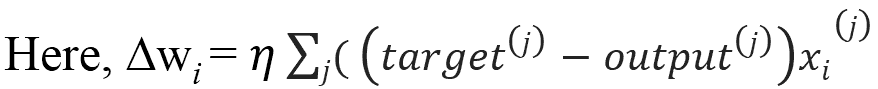

# 第一章 深度学习简介

|   | *“迄今为止，人工智能最大的危险在于人们过早地认为自己理解了它。”* |   |
| --- | --- | --- |
|   | --*埃利泽·尤德科夫斯基* |

是否曾想过，为什么即使是游戏中最优秀的棋手，也常常很难战胜计算机？Facebook 是如何在数亿张照片中识别你的面孔的？你的手机是如何识别你的声音，并将电话转接到正确的人那里，尽管通讯录中有成百上千个联系人？

本书的主要目标是解决许多相关问题，并为读者提供详细的解决方案。本书适用于多种不同的读者和用途，然而，我们在撰写本书时主要针对两类受众。一类是学习深度学习和人工智能的本科生或研究生；另一类是已经具备大数据、深度学习和统计建模知识的软体工程师，但他们希望迅速了解如何将深度学习应用于大数据，反之亦然。

本章将主要通过提供深度学习的基本概念、术语、特性以及主要挑战，为读者奠定基础。本章还将提出深度网络算法的分类，这些算法在过去十年里被研究人员广泛使用。本章将涵盖以下主要内容：

+   开始学习深度学习

+   深度学习术语

+   深度学习：人工智能的革命

+   深度学习网络的分类

自人类文明的曙光以来，人们一直梦想着创造能够像人类一样工作和行为的人工机器或机器人。从希腊神话人物到古代印度史诗中，都有许多类似的例子，明显表明了人们对创造和拥有人工生命的兴趣和倾向。

在计算机的初期发展阶段，人们一直在想，计算机是否有可能像人类一样智能！随着时间的推移，即使在医学科学领域，自动化机器的需求也变得不可或缺，几乎是无法避免的。随着这种需求的不断增加以及相关领域的持续研究，**人工智能**（**AI**）已经成为一项蓬勃发展的技术，并在多个领域得到了广泛应用，例如图像处理、视频处理以及医学科学中的许多诊断工具。

虽然人工智能系统每天解决着许多问题，但没有人知道人工智能系统是如何被编程的！以下是一些直观的问题：

+   Google 搜索，能够非常好地理解你输入或说出的内容

+   如前所述，Facebook 在识别你的面孔方面也颇有成效，因此也能了解你的兴趣。

此外，随着概率、线性代数、统计学、机器学习、深度学习等各个领域的融合，人工智能在研究领域中已经获得了巨大的关注和流行。

人工智能早期成功的一个关键原因可能是，它主要处理的是计算机无需大量知识即可解决的基本问题。例如，1997 年，IBM 的深蓝象棋系统能够击败世界冠军加里·卡斯帕罗夫[1]。尽管当时这种成就可以算得上是重要的，但训练计算机仅用象棋的有限规则，绝对不算是一项繁重的任务！用固定且有限的规则训练系统被称为计算机的*硬编码知识*。许多人工智能项目都经过了这一硬编码知识，涵盖了许多传统语言中关于世界各方面的内容。随着时间的推移，这种硬编码知识似乎无法应对处理大量数据的系统。此外，数据遵循的规则数量也频繁变化。因此，大多数基于这种系统的项目未能达到预期的高度。

这一硬编码知识的挫折表明，人工智能系统需要某种方式，从提供的原始数据中泛化出模式和规则，而不需要外部的强制输入。系统做到这一点的能力被称为*机器学习*。我们日常生活中有许多成功的机器学习应用。以下是一些最常见和最重要的应用：

+   **垃圾邮件检测**：给定你收件箱中的一封电子邮件，模型可以检测是否将该电子邮件归类为垃圾邮件或收件箱邮件。一种常见的朴素贝叶斯模型可以区分这类邮件。

+   **信用卡欺诈检测**：一个模型可以检测在特定时间间隔内进行的一系列交易是否由原始客户执行。

+   1990 年，Mor-Yosef 等人提出了最受欢迎的机器学习模型之一，该模型使用了逻辑回归，可以推荐是否需要为患者进行剖腹产！

有许多这样的模型是通过机器学习技术实现的。


图 1.1：该图展示了不同类型表示法的示例。假设我们想训练机器检测果冻豆之间的空隙。在右侧的图像中，我们看到果冻豆分布稀疏，AI 系统更容易确定空白部分。然而，在左侧的图像中，果冻豆分布极为紧密，因此，机器要找到空隙将是一个极为困难的任务。图像来源于 USC-SIPI 图像数据库。

机器学习系统的性能很大一部分取决于输入给系统的数据。这被称为数据的*表示*。与表示相关的所有信息都被称为数据的*特征*。例如，如果使用逻辑回归来检测患者的脑肿瘤，AI 系统并不会直接诊断患者！相反，相关的医生会根据患者的常见症状提供必要的输入给系统。AI 系统随后会将这些输入与已接收到的过去输入进行匹配，这些输入曾被用来训练该系统。

基于系统的预测分析，它会给出关于疾病的决策。尽管逻辑回归可以根据给定的特征进行学习并做出决策，但它无法影响或修改特征的定义方式。逻辑回归是一种回归模型，其中因变量的可能值有限，且根据自变量的不同而有所变化，与线性回归不同。所以，例如，如果该模型被提供的是剖腹产患者的报告，而不是脑肿瘤患者的报告，它肯定无法预测正确的结果，因为给定的特征永远不会与训练数据匹配。

机器学习系统对数据表示的依赖并不是什么我们不知道的事情！事实上，我们大多数的计算机理论在数据表示的方式上表现得更好。例如，数据库的质量通常是根据其架构设计来评估的。即使在处理成千上万行数据时，如果表格被正确索引，任何数据库查询的执行速度也会变得极为迅速。因此，AI 系统对数据表示的依赖性不应让我们感到惊讶。

日常生活中也有很多类似的例子，其中数据的表示方式决定了我们的效率。比如在 20 个人中定位某个特定的人显然比在 500 人的拥挤人群中定位同一个人要容易得多。前面的*图 1.1*展示了两种不同类型数据表示法的可视化示例。

因此，如果 AI 系统输入适当特征的数据，即使是最困难的问题也能够得到解决。然而，以正确的方式收集并输入数据一直是计算机程序员面临的严重障碍。

在许多实时场景中，提取特征可能是一项繁琐的任务。因此，数据的表示方式决定了系统智能的主要因素。

### 注意

在一群人和猫中寻找猫咪可能会变得非常复杂，特别是当特征不合适时。我们知道猫咪有尾巴，因此，我们可能希望通过检测尾巴的存在作为一个显著的特征。然而，考虑到尾巴的形状和大小各异，往往很难用像素值来准确描述尾巴的外观！此外，尾巴有时可能会与人的手混淆。而且，物体的重叠可能会遮掩猫咪尾巴的存在，使得图像变得更加复杂。

从以上讨论可以得出结论，AI 系统的成功主要取决于数据的表示方式。此外，各种表示可以捕捉并缓存数据背后不同的解释因素。

**表示学习**是应对这些特定问题的最流行和广泛应用的学习方法之一。表示学习可以定义为从现有数据表示中学习下一层的表示。理想情况下，所有的表示学习算法都有这种学习表示的优势，这些表示能够捕捉潜在因素，并且每个特定子任务可能适用一个子集。下面的*图 1.2*提供了一个简单的示例：


图 1.2：该图展示了表示学习。中间层能够发现解释因素（蓝色矩形框中的隐藏层）。一些因素解释了每个任务的目标，而另一些则解释了输入。

然而，从大量原始数据中提取一些高层次的数据和特征，需要某种程度的人类理解，这已经显示出了其局限性。可以举出很多这样的例子：

+   区分两个相似年龄婴儿的哭声。

+   识别猫咪眼睛的图像在白天和夜晚都会变得繁琐，因为猫咪的眼睛在夜间会发光，而白天则不会。

在所有这些前述的边缘情况中，表示学习似乎并没有表现得特别出色，反而显示出了一种阻碍行为。

**深度学习**，作为机器学习的一个子领域，可以通过构建多个表示层次或从一系列其他简单的表示和特征中学习特征层次，来解决表示学习中的主要问题[2][8]。


图 1.3：本图展示了深度学习系统如何通过识别诸如角和轮廓之类的各种组合来表征人类形象，这些可以以边缘的术语来定义。图像经 Ian Goodfellow、Yoshua Bengio 和 Aaron Courville 授权再版，出版者为 MIT 出版社。

前面的*图 1.3*显示了深度学习模型的插图。对于计算机来说，解码原始非结构化输入数据的意义通常是一个繁琐的任务，如此图像所示，由不同的像素值组成。理想情况下，将像素组转换为识别图像的映射函数是非常困难的。此外，直接训练计算机进行这种映射几乎是不可逾越的。对于这类任务，深度学习通过创建一系列子映射来解决难题，以达到期望的输出。每个子映射对应于模型的不同层次集合。输入包含可以观察到的变量，并因此在可见层中表示。从给定的输入中，我们可以逐步提取数据的抽象特征。由于这些值在给定数据中不可用或不可见，因此这些层被称为隐藏层。

在图像中，从数据的第一层开始，通过对比相邻像素的研究，可以轻松识别边缘。第二个隐藏层可以区分第一个隐藏层描述的边缘中的角和轮廓。从描述角和轮廓的第二个隐藏层开始，第三个隐藏层可以识别特定对象的不同部分。最终，可以从第三层中清晰地检测出图像中存在的不同对象。

深度学习起步于 2006 年，**Hinton 等人**在 2006 年[2]，还有**Bengio 等人**在 2007 年[3]最初集中于 MNIST 数字分类问题。在过去的几年里，深度学习已经从数字过渡到自然图像中的对象识别。此外，**Krizhevsky 等人**在 2012 年[4]利用 ImageNet 数据集取得了重大突破。

本书的范围主要限于深度学习，因此在直接深入探讨之前，应讨论深度学习的必要定义。

许多研究者以多种方式定义深度学习，因此，在过去的十年中，它也经历了许多定义的变化！以下是几种广泛接受的定义：

+   根据 GitHub 的说明，深度学习是机器学习研究的新领域，旨在使机器学习更接近其原始目标之一：人工智能。深度学习涉及学习多层次的表示和抽象，有助于理解诸如图像、声音和文本等数据。

+   根据维基百科最近的更新，深度学习是机器学习的一个分支，基于一组算法，尝试通过使用深度图（多个处理层，由多个线性和非线性变换组成）对数据中的高级抽象进行建模。

正如定义所示，深度学习也可以被视为一种特殊的机器学习类型。深度学习在数据科学领域取得了巨大流行，因为它能够从各种简单特征中学习复杂的表示。为了深入理解深度学习，我们列出了一些在接下来章节中将频繁使用的术语。本章的下一个主题将通过提供深度学习中使用的各种术语和重要网络，帮助你为深度学习打下基础。

# 深度学习入门

要理解本书中深度学习的发展历程，必须了解所有机器学习的术语和基本概念。然而，如果你已经对机器学习及相关术语有了足够的了解，可以跳过这一部分，直接进入本章的下一个主题。对数据科学充满热情、并且希望深入学习机器学习的读者，可以参考 Tom M. Mitchell（1997 年）的《机器学习》[5]和《机器学习：概率视角》（2012 年）[6]。

### 注意

神经网络并不执行奇迹。但如果合理使用，它们可以产生一些惊人的结果。

## 深度前馈网络

神经网络可以是递归的，也可以是前馈的。前馈网络的图中没有任何循环，它们被排列成一组层。一个具有多层的网络被称为深度网络。简单来说，任何具有两层或更多隐藏层的神经网络都被定义为**深度前馈网络**或**前馈神经网络**。*图 1.4*展示了深度前馈神经网络的通用表示。

深度前馈网络的工作原理是，随着网络深度的增加，它能够执行更多的顺序指令。顺序中的指令可以提供强大的能力，因为这些指令可以指向之前的指令。

前馈网络的目标是泛化某个函数 *f*。例如，分类器 *y=f(x)* 将输入 *x* 映射到类别 *y*。深度前馈网络修改了映射关系，*y=f(x; α)*，并学习参数 *α* 的值，该值给出了最合适的函数值。下图*图 1.4*展示了深度前馈网络的简单表示，突出了与传统神经网络的架构差异。

### 注意

深度神经网络是具有多个隐藏层的前馈网络。


图 1.4：图中展示了浅层和深层前馈网络的表示

## 各种学习算法

**数据集**被视为学习过程的构建块。数据集可以定义为一组相互关联的数据集合，包含独立实体，但可以根据具体使用场景作为一个整体使用。数据集的单个数据元素称为**数据点**。

以下的*图 1.5*给出了来自社交网络分析的各种数据点的视觉表示：


图 1.5：图片展示了社交网络分析中的散布数据点。图片来源于维基百科

+   **未标记数据**：这部分数据由人类生成的对象组成，通常可以轻松地从周围环境中获得。例子包括 X 射线、日志文件数据、新闻文章、语音、视频、推文等。

+   **标记数据**：标记数据是从一组未标记数据中归一化得到的数据。这类数据通常格式良好，已经分类、标记，并且容易为人类理解，便于后续处理。

从高层次的理解来看，机器学习技术可以根据其学习过程的执行方式，分为监督学习和无监督学习。

### 无监督学习

在无监督学习算法中，给定的输入数据集没有期望的输出。系统通过分析数据集的经验学习有意义的属性和特征。在深度学习中，系统通常会尝试从数据点的整体概率分布中学习。有多种类型的无监督学习算法用于聚类。简单来说，聚类就是将数据点按相似类型的数据分组。然而，这种学习方式中没有基于最终输出的反馈，也就是说，**没有教师来纠正你！** *图 1.6* 展示了无监督聚类的基本概述：


图 1.6：图中展示了无监督聚类的简单表示

一个实际的无监督聚类算法示例是谷歌新闻。当我们打开谷歌新闻下的某个主题时，它会显示多个超链接，指向不同的页面。这些主题可以看作是指向独立链接的超链接集群。

### 监督学习

在监督学习中，与无监督学习不同，每一步经历都有一个期望的输出。系统会得到一个数据集，并且已经知道期望输出的样子，以及每个相关层之间输入和输出的正确关系。这种学习方式通常用于分类问题。

以下的视觉表示在*图 1.7*中给出：


图 1.7：图中展示了基于监督学习的数据分类

监督学习的实际应用示例包括人脸检测、人脸识别等。

尽管监督学习和无监督学习看起来是不同的身份，但它们通常通过各种方式相互连接。因此，这两种学习方式之间的细微界限对于学生群体来说往往是模糊的。

上述陈述可以通过以下数学表达式来公式化：

概率的通用乘法规则指出，对于*n*个数据集 n ε ℝ^t，联合分布可以分解如下：


该分布表明，出现的无监督问题可以通过*t*个监督问题来解决。除此之外，*p (k | n)*的条件概率作为一个监督问题，可以通过无监督学习算法来解决，从而体验*p (n, k)*的联合分布。


虽然这两种类型不是完全独立的身份，但它们通常有助于根据执行的操作对机器学习和深度学习算法进行分类。通俗来说，聚类形成、基于相似性识别群体密度等被称为无监督学习，而结构化输出、回归、分类等则被认为是监督学习。

### 半监督学习

顾名思义，在这种学习类型中，训练过程中同时使用有标签和无标签数据。这是一种监督学习，训练时使用大量无标签数据。

例如，半监督学习用于深度信念网络（稍后会解释），这是一种深度网络，其中某些层学习数据的结构（无监督），而一层学习如何对数据进行分类（监督学习）。

在半监督学习中，使用来自*p (n)*的无标签数据和来自*p (n, k)*的有标签数据来预测给定*n*的条件下*k*的概率，或者*p (k | n)*。


图 1.8：图示展示了在半监督学习技术中，大量无标签数据的影响。图源自 Wikipedia

在前述的*图 1.8*中，顶部展示了模型在区分白色和黑色圆圈后所使用的决策边界。底部的图展示了模型采用的另一个决策边界。在该数据集中，除了两种不同类别的圆圈外，还有一组无标签数据（灰色圆圈）。这种训练可以视为首先创建聚类，然后用有标签数据标记这些聚类，从而将决策边界从高密度数据区域移开。

前述的*图 1.8*展示了半监督学习的示例。你可以参考*Chapelle 等人*的书籍[7]了解更多关于半监督学习方法的信息。

因此，既然你已经对人工智能、机器学习和表示学习有了基础了解，我们现在可以将全部焦点转移到深入讨论深度学习，并进一步描述其内容。

从前面提到的深度学习定义中，可以提炼出深度学习的两个主要特征，如下所示：

+   一种通过后续抽象层次的连续知识体验无监督和监督学习的特征表示方式

+   一个由多个抽象阶段的非线性信息处理组成的模型

# 深度学习术语

+   **深度神经网络**（**DNN**）：这可以定义为一个具有多个隐藏层的多层感知器。所有层的权重彼此完全连接，并接收来自前一层的连接。权重通过监督学习或无监督学习初始化。

+   **递归神经网络**（**RNN**）：RNN 是一种专门用于从时间序列或顺序数据（如语音、视频等）中学习的深度学习网络。RNN 的基本概念是需要保留来自前一状态的观察信息，以便用于下一状态。当前深度学习中的热门话题之一是**长短时记忆**（**LSTM**）。

+   **深度信念网络**（**DBN**）：这种网络[9][10][11]可以定义为一种概率生成模型，具有可见层和多个潜在变量（隐藏层）。每个隐藏层通过学习在较低层单元之间具有统计关系。网络越是趋向更高层次，关系就越复杂。这种网络可以通过贪心的逐层训练方法进行高效训练，其中所有隐藏层一次一个地以自下而上的方式进行训练。

+   **玻尔兹曼机**（**BM**）：这可以定义为一个网络，它是一个对称连接的类神经元单元，能够对是否保持开/关做出随机决策。玻尔兹曼机通常具有简单的学习算法，可以揭示许多有趣的特征，这些特征代表了训练数据集中的复杂规律。

+   **限制玻尔兹曼机**（**RBM**）：RBM 是一种生成式随机人工神经网络，是玻尔兹曼机的一种特殊类型。这类网络能够学习一组数据集的概率分布。RBM 由一层可见单元和隐藏单元组成，但没有可见-可见或隐藏-隐藏连接。

+   **卷积神经网络**：卷积神经网络是神经网络的一部分；这些层之间以及与输入层之间的连接是稀疏的。后续层的每个神经元只负责输入的一部分。深度卷积神经网络在定位识别、图像分类、面部识别等领域取得了无与伦比的表现。

+   **深度自编码器**：深度自编码器是一种具有多个隐含层的自编码器。这种类型的网络可以作为单层自编码器的堆叠进行预训练。训练过程通常较为复杂：首先，我们需要训练第一隐层以重构输入数据，然后用这个数据来训练下一个隐层，重构前一个隐层的状态，依此类推。

+   **梯度下降法** (**GD**)：这是一种广泛应用于机器学习的优化算法，用于确定一个函数（*f*）的系数，从而减少整体成本函数。梯度下降法通常在无法通过解析方法（例如线性代数）计算所需参数时使用，必须通过某种优化算法来找到这些参数。

在梯度下降法中，模型的权重会在每次训练数据集（周期）的迭代中逐步更新。

成本函数 *J(w)*，带有平方误差的和，可以表示为如下形式：


权重更新的方向和幅度是通过沿成本梯度的反方向进行一步计算得出的，如下所示：


在前面的公式中，*η* 是网络的学习率。每经过一个周期（epoch），权重会根据以下规则逐步更新：

```py
                         for one or more epochs, 
                           for each weight i, 
                             wi:= w + ∆wi 
                           end  
                         end 

```



使用梯度下降法优化的流行示例包括逻辑回归和线性回归。

+   **随机梯度下降法** (**SGD**)：许多基于大量数据集的深度学习算法，都是基于一种叫做随机梯度下降法的优化算法。梯度下降法在小规模数据集上表现良好。然而，在非常大规模的数据集上，这种方法变得非常昂贵。在梯度下降法中，整个训练数据集只需一次遍历就能进行一次权重更新；因此，随着数据集规模的增加，整个算法的运行速度最终会变慢。权重更新的速度非常缓慢，因此，收敛到全局成本最小值所需的时间变得非常长。

因此，为了处理如此大规模的数据集，使用了梯度下降法的变种——随机梯度下降法。与梯度下降法不同，随机梯度下降法在每次训练数据集迭代后更新权重，而不是在整个数据集结束后更新。

```py
                     until cost minimum is reached 
                       for each training sample j: 
                         for each weight i 
                           wi:= w + ∆wi 
                         end 
                       end 
                     end 

```


近年来，深度学习获得了极大的关注，它成为了许多广泛应用学科的交汇点，如模式识别、神经网络、图形建模、机器学习和信号处理等。

深度学习广泛应用的其他重要原因可以通过以下几点总结：

+   近年来，图形处理单元（GPU）的能力显著提高。

+   用于训练目的的数据集的数据规模显著增加。

+   近年来，机器学习、数据科学和信息处理领域的最新研究显示了一些重大进展。

这些观点的详细描述将在本章的后续主题中提供。

# 深度学习：人工智能的革命

深度学习的详尽历史超出了本书的范围。然而，为了对这一主题产生兴趣和了解，了解一些基本的背景背景是必要的。

在介绍中，我们已经简要讨论了深度学习如何在人工智能的边缘占据一席之地。本节将详细讨论机器学习和深度学习如何相互关联或有何不同。我们还将讨论这两个主题在过去十年左右的趋势变化。

|   | *"深度学习浪潮已经在计算语言学的海岸边拍打了数年，但 2015 年似乎是这场海啸全面冲击主要自然语言处理（NLP）会议的一年。"* |   |
| --- | --- | --- |
|   | --*克里斯托弗·D·曼宁博士，2015 年 12 月* |


图 1.9：图表明深度学习大约 10 年前处于初期阶段。然而，机器学习在研究者社区中已成为热门话题。

深度学习正在迅速扩展其在人工智能领域的地盘，并不断以其惊人的实证结果令许多研究人员惊讶。机器学习和深度学习都代表了两种不同的思想流派。机器学习可以被视为 AI 的最基本方法，而深度学习则可以被认为是一个新的、巨大的时代，增加了一些该学科的功能。


图 1.10：图表明深度学习如何在当今日益流行，并试图达到机器学习的水平。

然而，机器学习在完全解决 AI 的许多关键问题上通常失败，主要是语音识别、物体识别等。

在处理高维数据时，传统算法的性能似乎更具挑战性，因为随机变量的数量不断增加。此外，传统机器学习方法中用于实现泛化的程序不足以学习高维空间中的复杂义务，这通常会增加整体模型的计算成本。深度学习的发展主要受到了这些函数中基本算法的崩溃的激励，并且克服了上述障碍。

大多数研究人员和数据科学家认为，随着时间的推移，深度学习将占据人工智能的主要部分，最终使机器学习算法变得过时。为了清晰了解这一点，我们查看了这两个领域的当前谷歌趋势，并得出了以下结论：

+   机器学习的发展曲线在过去十年一直处于增长阶段。深度学习是新的，但增长速度超过了机器学习。当仔细观察趋势时，可以发现深度学习的增长速度相比机器学习要更快。

前面提到的*图 1.9*和*图 1.10*展示了谷歌趋势的可视化。

## 深度学习的动机

机器学习算法面临的最大已知问题之一是**维度灾难**[12] [13] [14]。这指的是当数据集的维度数很高时，某些学习算法可能表现不佳。在下一节中，我们将讨论深度学习是如何通过引入新特性为这个问题带来足够的希望的。还有许多其他相关问题，深度架构在这些问题上显示出了相较于传统架构的显著优势。在本章的这一部分，我们希望将这些更加突出的挑战作为一个单独的主题介绍。

### 维度灾难

维度灾难可以定义为在高维空间（通常是成千上万甚至更高维度）中进行数据分析和组织时所出现的现象。当数据集的维度很高时，机器学习问题将面临极大的困难。高维数据难以处理，原因如下：

+   随着维度数量的增加，特征的数量将呈指数级增长，最终导致噪音的增加。

+   在标准实践中，我们无法获得足够多的观察样本来对数据集进行泛化。

维度灾难的一个直接解释是**组合爆炸**。根据组合爆炸的理论，当收集了一定数量的变量时，会形成一个庞大的组合。例如，对于*n*个二进制变量，可能的组合数为 *O (2^n)*。因此，在高维空间中，总的配置数将几乎是无法计数的，远远超过我们可用的样本数——大多数配置将没有与之相关的训练样本。*图 1.11*显示了类似现象的图示，便于更好理解。

因此，由于训练的困难，这种情况对于任何机器学习模型来说都是繁琐的。**休斯效应**[15]指出了以下内容：

> *“在固定数量的训练样本下，随着维度的增加，预测能力会减少。”*

因此，随着解释变量数量的增加，模型的可达精度几乎崩溃。

为了应对这种情况，我们需要增加输入系统的样本数据集的大小，直到它足以与这种情况相抗衡。然而，随着数据复杂性的增加，维度的数量几乎达到一千。对于这种情况，即使是数亿张图像的数据集也不足以应对。

深度学习通过更深的网络配置，在部分解决这个问题上取得了一些成功。这一贡献主要归因于以下几个原因：

+   现在，研究人员能够通过在将样本输入进行训练前重新定义网络结构来管理模型复杂性。

+   深度卷积网络关注数据的高级特征，而非基础层次的信息，这大大减少了特征的维度。

尽管深度学习网络为应对维度灾难提供了一些思路，但它们仍未能够完全征服这一挑战。在微软最近的超深神经网络研究中，他们提出了 150 层的结构；因此，参数空间变得更加庞大。研究团队还探索了更加深层的网络，层数几乎达到 1000 层；然而，由于模型的*过拟合*，结果并未达到预期。

### 注

**机器学习中的过拟合**：当模型经过过度训练，导致其性能受到负面影响时，称为模型的过拟合现象。当模型学习到训练数据集中的随机波动和不必要的噪声时，就会发生这种情况。这些现象的后果是不可取的——模型无法在新数据集上表现良好，这会负面影响模型的泛化能力。

**机器学习中的欠拟合**：指的是模型无法在当前数据集上或新数据集上表现良好的情况。这种模型不适用，且在数据集上的表现较差。


图 1.11：图示显示，从一维到三维，随着维度数量的增加，从上到下，随机变量的数量可能会呈指数增长。此图像经尼古拉斯·查帕多斯（Nicolas Chapados）授权转载，摘自他的文章《数据挖掘算法在精算定价中的应用》。

在前图的 1D 示例（上）中，由于只有 10 个兴趣区域，对于学习算法正确地进行泛化不应是一个困难的任务。然而，在更高维度的 3D 示例（下）中，模型需要跟踪所有 *10*10*10=1000* 个兴趣区域，这变得更加繁琐（或者几乎是模型无法完成的任务）。这可以作为维度灾难的最简单例子。

### 梯度消失问题

梯度消失问题[16]是训练人工神经网络时遇到的障碍，尤其与一些基于梯度的方法，如反向传播，相关。理想情况下，这个问题使得学习和训练前面几层变得非常困难。当深度神经网络的层数急剧增加时，情况变得更加糟糕。

梯度下降算法特别是通过将梯度的负值乘以一个小的标量值（介于`0`和`1`之间）来更新权重。


如前面的方程所示，我们将重复梯度计算，直到它趋近于零。理想情况下，我们通常会设置一个超参数来限制最大迭代次数。如果迭代次数过多，训练的时间也会相应变长。另一方面，如果某些深度神经网络的迭代次数变得不可察觉，我们最终肯定会得到不准确的结果。

在梯度消失问题中，网络输出相对于前一层参数的梯度变得极其微小。因此，权重在每次迭代时不会发生显著变化。即使前几层的参数值发生了较大变化，对整体输出的影响也不明显。由于这个问题，深度神经网络的训练变得不可行，模型的预测效果也不令人满意。这种现象被称为梯度消失问题。这将导致一些拉长的代价函数，如下一个*图 1.12*所示：


图 1.12：平坦梯度和拉长代价函数的图像

下面的*图 1.13*展示了一个梯度较大的例子，其中梯度下降能够快速收敛：


图 1.13：较大梯度代价函数的图像；因此梯度下降能够更快地收敛

这是深度学习成功的一个重大挑战，但现在，得益于各种不同的技术，这个问题在一定程度上得到了克服。**长短期记忆**（**LSTM**）网络是 1997 年消除这个问题的一个重要突破。详细描述请参见第四章，*循环神经网络*。此外，一些研究人员也尝试通过不同的技术来解决这个问题，包括特征准备、激活函数等。

### 分布式表示

所有的深度网络大多基于分布式表示的概念，这也是深度学习算法成功背后的理论优势所在。在深度学习的背景下，分布式表示是多尺度表示，且与理论化学和物理学的多尺度建模密切相关。分布式表示背后的基本思想是，感知到的特征是多个因素的结果，这些因素组合在一起以产生期望的结果。一个日常生活中的例子可以是人脑，它通过分布式表示来伪装周围的物体。

在这种表示方式下，人工神经网络将以一种方式构建，使其拥有表示我们所需模型所必需的众多特征和层。该模型将通过多个相互依赖的层来描述数据，例如语音、视频或图像，每一层都负责在不同的尺度层次上描述数据。通过这种方式，表示将在多个层次中分布，涉及多个尺度。因此，这种表示方式被称为分布式表示。

### 注意

分布式表示本质上是稠密的。它遵循两种表示之间的多对多关系。一个概念可以通过多个神经元来表示。另一方面，一个神经元也可以表示多个概念。

传统的聚类算法，如最近邻算法、决策树或高斯混合模型等，使用的是非分布式表示，这些算法都需要 *O(N)* 个参数来区分 *O(N)* 个输入区域。曾几何时，人们几乎无法相信会有任何其他算法能表现得比这更好！然而，深度网络，如稀疏编码、RBM、多层神经网络等，能够仅用 *O(N)* 个参数区分多达 *O(2^k)* 个输入区域（其中 *k* 代表稀疏表示中非零元素的总数，*k=N* 适用于其他非稀疏的 RBM 和密集表示）。

在这些操作中，要么将相同的聚类应用于输入的不同部分，要么进行多个聚类并行操作。聚类对分布式表示的推广被称为多重聚类。

使用分布式表示的指数级优势源于在多个示例中重用每个参数，而这些示例不一定彼此接近。例如，限制玻尔兹曼机（Restricted Boltzmann Machine）可以作为一个合适的例子。然而，在局部泛化的情况下，输入空间中的非相同区域仅关心其自身的私有参数集。

主要优势如下：

+   数据内部结构的表示在抗损伤性和优雅降级方面具有强大的鲁棒性

+   它们有助于概括数据之间的概念和关系，从而增强推理能力。

以下*图 1.14*展示了分布式表示的一个实时例子：


图 1.14：图示展示了分布式表示如何帮助模型区分图像中各种类型的表达。

# 深度学习网络的分类

**人工神经网络**在机器学习中常被许多研究者称为新一代神经网络。我们所听说的大多数学习算法，基本上是为了让系统学习和生物大脑一样的方式而构建的。这就是**人工神经网络**这个名称的由来！从历史上看，深度学习的概念源自**人工神经网络**（**ANN**）。深度学习的实践可以追溯到 1960 年代，甚至可能更早。随着深度学习的兴起，人工神经网络（ANN）在研究领域获得了更大的关注。

**多层感知机**（**MLP**）或具有多个隐藏中间层的前馈神经网络，被称为**深度神经网络**（**DNN**），是深度架构模型的一些典型例子。第一个流行的深度架构模型由 Ivakhnenko 和 Lapa 于 1965 年发表，采用了监督式深度前馈多层感知机[17]。


图 1.15：GMDH 网络有四个输入（输入向量 x 的组成部分），和一个输出 y，该输出是对真实函数 y=f(x)=y 的估计。

另一篇来自 Alexey Ivakhnenko 的论文，他当时正在研究如何更好地预测河流中的鱼群数量，使用了**数据处理组方法**（**GMDH**）算法，该算法尝试解释一种具有八个训练层的深度网络，发表于 1971 年。至今，这仍被视为本千年最受欢迎的论文之一[18]。前面的*图 1.15*展示了具有四个输入的 GMDH 网络。

此后，**反向传播**（**BP**）作为一种广为人知的算法，用于学习类似类型网络的参数，在 1980 年代得到了广泛应用。然而，由于多种原因，具有多个隐藏层的网络难以处理，因此反向传播未能达到预期的效果[8] [19]。此外，反向传播学习使用的是基于局部梯度信息的梯度下降算法，这些操作从一些随机的初始数据点开始。在网络深度逐渐增加的过程中，这些数据往往会集中在一些不期望的局部最优点，因此，结果通常会陷入不良解中。

与深度架构模型相关的*优化约束*在两篇论文[8] [20]中通过建立一种高效的无监督学习算法得到了实质性减少。这两篇论文介绍了一类被称为**深度置信网络**（**DBN**）的深度生成模型。

2006 年，另外两种具有非生成性、非概率特征的无监督深度模型被发布，并且在研究人员中获得了极大的关注。一种是基于能量的无监督模型[21]，另一种是具有后续层训练的自编码器变体，类似于先前的 DBN 训练[3]。这两种算法都可以高效地用于训练深度神经网络，几乎与 DBN 完全相同。

自 2006 年以来，深度学习的研究经历了巨大的爆发。除了传统的浅层机器学习技术外，这一领域也持续呈现出指数级增长。

基于本章前面提到的学习技术，并根据所使用的技术和架构的应用案例，深度学习网络可以大致分为两大类。

## 深度生成或无监督模型

许多深度学习网络都属于这一类别，如受限玻尔兹曼机、深度置信网络、深度玻尔兹曼机、去噪自编码器等。大多数这些网络可以通过在网络中进行采样来生成样本。然而，一些其他网络，例如稀疏编码网络等，难以进行采样，因此不是生成式的。

一种流行的深度无监督模型是**深度玻尔兹曼机**（**DBM**）[22] [23] [24] [25]。传统的 DBM 包含多层隐藏变量；然而，同一层中的变量之间没有任何连接。尽管传统的**玻尔兹曼机**（**BM**）算法较为简单，但它过于复杂，难以研究，且训练速度非常慢。在 DBM 中，每一层都能获得前一层潜在特征响应之间的高阶复杂关联。许多现实生活中的问题，如物体和语音识别，需要学习复杂的内部表示，这些问题通过 DBM 可以更容易地解决。

具有一个隐藏层的 DBM 被称为**受限玻尔兹曼机**（**RBM**）。与 DBM 类似，RBM 没有任何隐藏层之间或可见层之间的连接。RBM 的关键特性体现在其构成多个 RBM 上。随着多个潜在层的形成，前一个 RBM 的特征激活作为下一个 RBM 的输入训练数据。这种架构生成了一种不同类型的网络，称为**深度置信网络**（**DBN**）。关于受限玻尔兹曼机和深度置信网络的各种应用在第五章中有详细讨论，*受限玻尔兹曼机*。

DBN 的一个主要组成部分是一组层，它通过减少网络的规模和深度的时间复杂度来提高效率。结合 DBN 的特性，它能够克服 BP 的主要缺点，即从某些期望的初始化数据点开始训练，它还具有其他吸引人的特点。以下是其中一些特点：

+   DBN 可以看作是一个概率生成模型。

+   DBN 通常有数亿个参数，因此会出现过拟合问题。此外，由于其庞大的数据集，深度架构通常还会经历欠拟合问题。这两种问题都可以通过预训练步骤有效地减少。

+   DBN 有效地利用了未标记数据。

另一个可以用于无监督（以及监督）学习的深度生成网络是**和积网络**（**SPN**）[26]，[27]。SPN 是深度网络，可以视为有向无环图，其中图的叶节点是观察变量，内部节点是求和和乘积操作。‘求和’节点表示混合模型，而‘乘积’节点则构建了特征层次结构。SPN 使用期望最大化算法和反向传播一起训练。学习 SPN 的主要障碍是，当梯度传播到深层时，梯度迅速减小。具体来说，从条件似然的导数生成的常规深度神经网络的标准梯度下降会遇到困难。减少此问题的一种解决方案是用潜在变量的最可能状态代替边际推断，然后通过此状态传播梯度。在[28]中，Domingo 和 Gens 在小规模图像识别任务中展示了出色的结果。以下是*图 1.16*，展示了一个示例 SPN 网络以帮助理解。它显示了和积网络的框图：


图 1.16：和积网络的框图

另一种流行的深度生成网络，可以用作无监督（以及有监督）学习的，是**循环神经网络**（**RNN**）。这种类型的网络的深度直接取决于输入数据序列的长度。在无监督 RNN 模型中，利用之前数据样本的经验来预测未来的数据序列。RNN 已被广泛用于数据序列化文本或语音，然而，由于梯度消失问题的出现，最近它们的流行度有所下降[29] [16]。通过使用随机曲率估计，Hessian-free 优化[30]在某种程度上克服了这些限制。最近，Bengio 等[31]和 Sutskever[32]提出了不同的变种来训练生成型 RNN，这些变种在性能上超越了 Hessian-free 优化模型。RNN 在本书的第四章中有进一步的阐述，*循环神经网络*。

在其他无监督深度网络的子类中，基于能量的深度模型是最为知名的架构之一[33] [34]。无监督模型类别中的一个典型例子是深度自编码器。深度自编码器的大多数变种本质上是生成性的；然而，它们的特性和实现方式通常各不相同。流行的例子包括预测稀疏编码器、变换自编码器、去噪自编码器及其堆叠版本等等。自编码器在第六章中有详细解释，*自编码器*。

## 深度判别模型

大多数在有监督学习中使用的判别技术是浅层架构，例如隐马尔可夫模型[35]，[36]，[37]，[38]，[39]，[40]，[41]或条件随机场。然而，最近，出现了一种深度结构的条件随机场模型，它通过将每一层的输出作为输入传递到更高层。深度结构的条件随机场模型有多个版本，已经成功应用于自然语言处理、电话识别、语言识别等领域。尽管判别方法在深度架构中取得了一定的成功，但它们仍未达到预期的效果。

如前节所述，RNN（循环神经网络）已经被用于无监督学习。然而，RNN 也可以作为判别模型，并通过有监督学习进行训练。在这种情况下，输出成为与输入数据序列相关的标签序列。语音识别技术早在很久以前就已经看到了这种判别 RNN 的应用，但成功的案例很少。[42]号论文展示了使用隐马尔可夫模型将 RNN 的分类结果转化为标签序列。然而，遗憾的是，由于种种原因，隐马尔可夫模型的使用未能充分发挥 RNN 的全部潜力。

最近，针对 RNN（循环神经网络）开发了几种其他方法和模型，其基本思想是将 RNN 的输出视为某些条件分布，并将其分布在所有可能的输入序列上[43]，[44]，[45]，[46]。这有助于 RNN 在嵌入长短期记忆（LSTM）到其模型的同时进行序列分类。其主要优点是，它既不需要对训练数据集进行预先分割，也不需要对输出进行后处理。基本上，数据集的分割是由算法自动执行的，并且可以为条件分布的优化推导出一个可微的目标函数。此类算法的有效性广泛适用于手写识别操作。

另一种流行的判别式深度架构是**卷积神经网络**（**CNN**）。在 CNN 中，每个模块包含一个卷积层和一个池化层。为了形成深度模型，这些模块通常是一个接一个地堆叠，或者在其上方叠加一个深度神经网络。卷积层有助于共享许多权重，而池化层则将卷积层的输出进行分隔，最小化来自上一层的数据流量。CNN 已被公认为一种高效的模型，尤其在图像识别、计算机视觉等任务中表现出色。最近，通过对 CNN 设计的特定修改，它在语音识别方面也被证明同样有效。**时延神经网络**（**TDNN**）[47] [48]，最初用于早期的语音识别，是卷积神经网络的一个特例，也可以视为其前身。

在这种模型中，权重共享仅限于时间维度，并且没有池化层。第三章，*卷积神经网络*深入讨论了 CNN 的概念和应用。

深度学习凭借其多种模型，具有广泛的应用。许多顶尖科技公司，如 Facebook、Microsoft、Google、Adobe、IBM 等，广泛采用深度学习。除了计算机科学，深度学习还对其他科学领域做出了重要贡献。

现代用于物体识别的 CNN 为视觉处理提供了重要的见解，甚至神经科学家也可以进一步探索。深度学习还提供了处理大规模数据所需的功能工具，并在科学领域中进行预测。该领域在预测分子行为方面也非常成功，旨在促进制药研究。

总结来说，深度学习是机器学习的一个子领域，因其应用范围更广，已在实用性和流行度方面取得了卓越的增长。然而，未来的几年应该充满挑战与机遇，以进一步改进深度学习，并为新的数据爱好者探索这一主题。

### 注意事项

为了帮助读者更好地理解深度学习，以下是一些优秀的、经常更新的在线阅读列表：[`deeplearning.net/tutorial/`](http://deeplearning.net/tutorial/) [`ufldl.stanford.edu/wiki/index.php/UFLDL_Tutorial`](http://ufldl.stanford.edu/wiki/index.php/UFLDL_Tutorial) [`deeplearning.net/reading-list/`](http://deeplearning.net/reading-list/)

# 摘要

在过去的十年里，我们有幸听到许多人工智能领域伟大科学家和公司关于深度学习的重大发明。深度学习是一种机器学习方法，近年来在其实用性和流行度上取得了巨大的增长。其原因主要在于它能够处理涉及高维数据的大型数据集，解决了如梯度消失问题等主要难题，并且有训练更深层网络的技术。在本章中，我们已经详细解释了大部分这些概念，并且还对深度学习的各种算法进行了分类，后续章节将详细阐述这些内容。

本书的下一章将介绍大数据与深度学习的关联。该章节将主要聚焦于深度学习如何在从大规模数据中提取有价值信息方面发挥重要作用。
