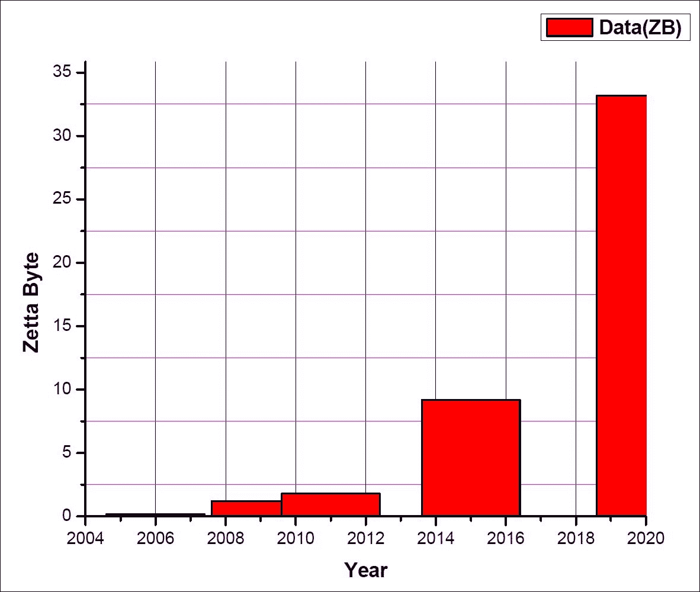
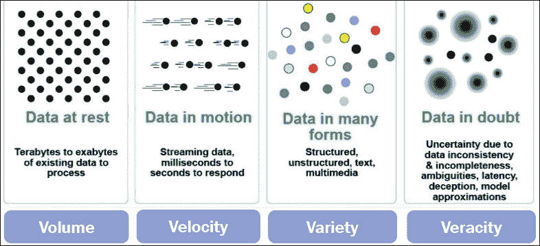
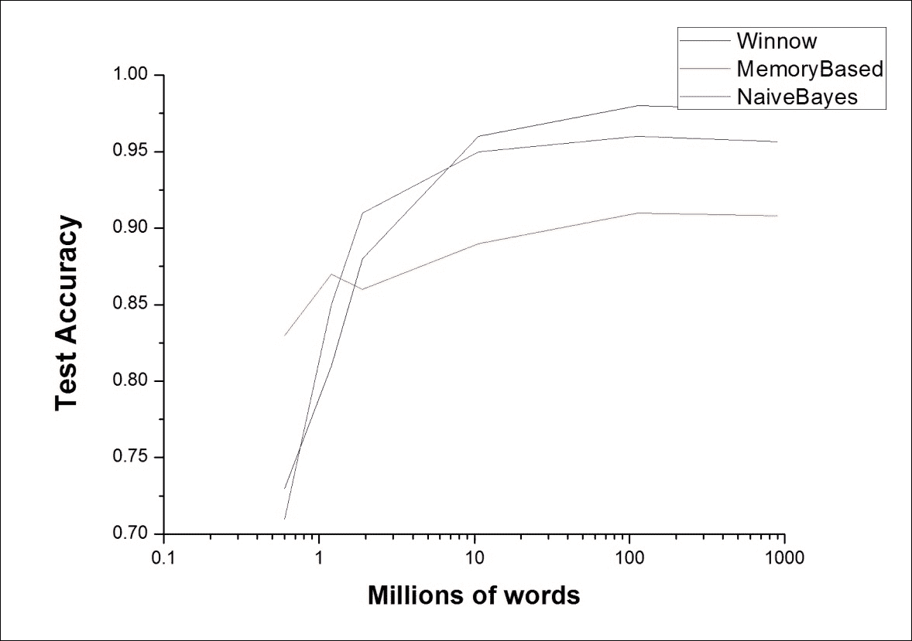
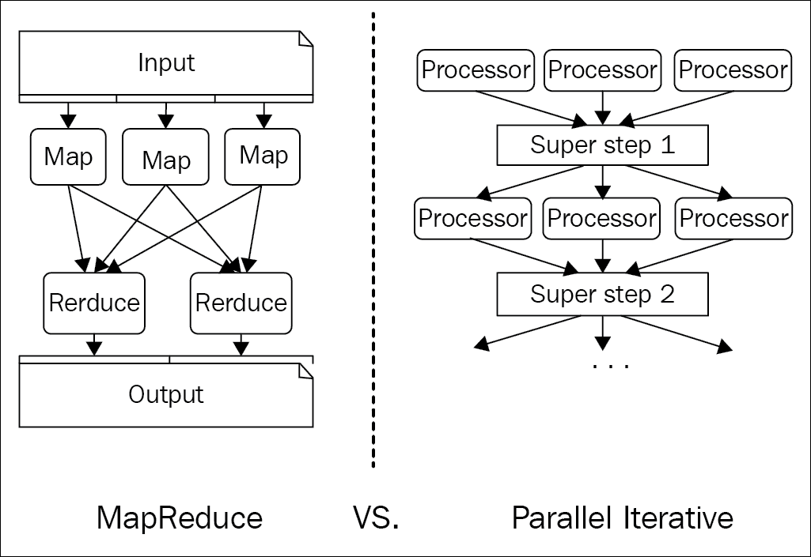
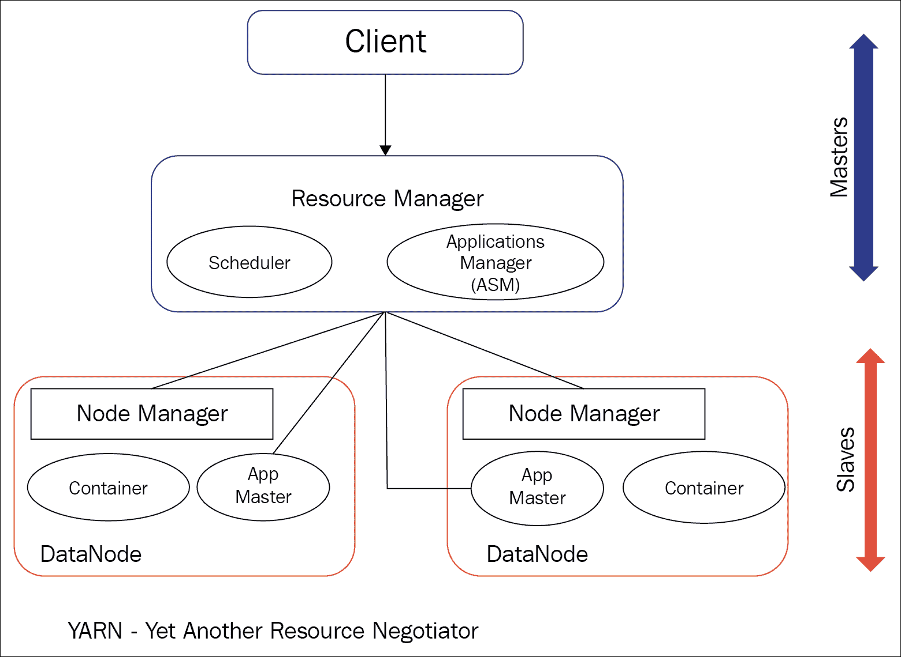
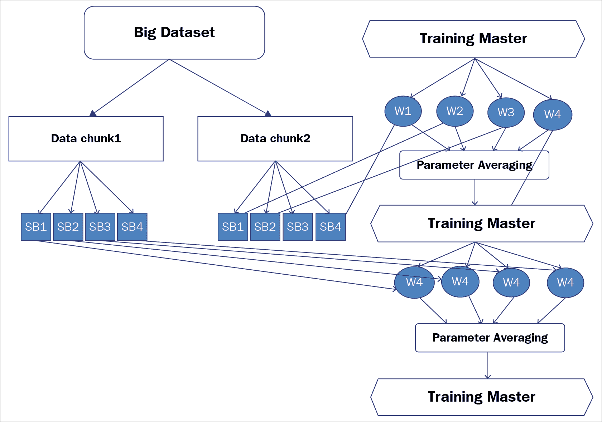
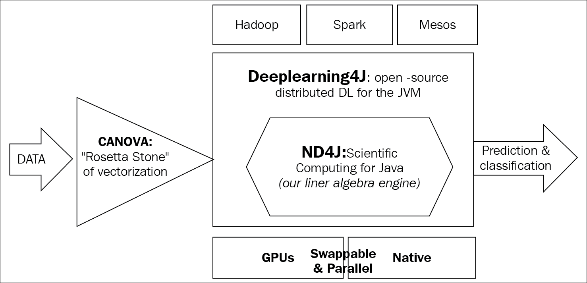
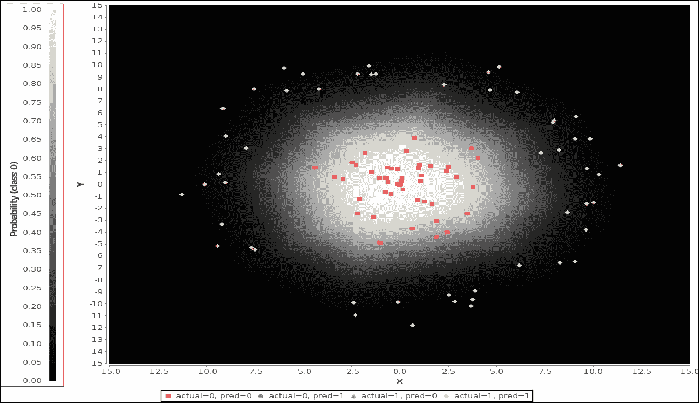

# 第二章 分布式深度学习与大规模数据

|   | *“我们信仰上帝，其他的都必须提供数据”* |   |
| --- | --- | --- |
|   | --*W. Edwards Deming* |

在这个指数增长的数字世界中，大数据和深度学习是两大最热门的技术趋势。深度学习和大数据是数据科学领域中两个相互关联的主题，在技术发展方面，它们密切相连，且同样重要。

数字数据和云存储遵循一种通用法则，称为摩尔定律[50]，大致表示全球数据每两年翻一番；然而，存储这些数据的成本大致以相同的速度下降。这种数据的激增带来了更多的特征和多样性，因此，为了从中提取所有有价值的信息，应该构建更好的深度学习模型。

这种海量数据的可用性为多个行业带来了巨大的机会。此外，带有分析部分的大数据，在数据挖掘、数据获取和从中提取隐藏信息的领域中也带来了许多挑战。在人工智能领域，深度学习算法在学习过程中能够在大规模数据下提供最佳输出。因此，随着数据增长速度空前加快，深度学习在提供大数据分析解决方案中也发挥着至关重要的作用。

本章将深入探讨深度学习模型在大数据中的表现，并揭示相关的挑战。章末将介绍 Deeplearning4j，一个开源分布式框架，提供与 Hadoop 和 Spark 的集成，用于大规模数据的深度学习部署。本章还将提供示例，展示如何使用 Deeplearning4j 实现基本的深度神经网络，以及它与 Apache Spark 和 Hadoop YARN 的集成。

本章将涵盖以下重要主题：

+   面向海量数据的深度学习

+   深度学习在大数据中的挑战

+   分布式深度学习与 Hadoop

+   Deeplearning4j：一个用于深度学习的开源分布式框架

+   在 Hadoop YARN 上设置 Deeplearning4j

# 面向海量数据的深度学习

在这个 Exa-Byte 级别的时代，数据以指数级的速度增长。许多组织和研究人员以各种方式分析这种数据增长，且目的各异。根据**国际数据公司**（**IDC**）的调查，互联网每天处理约 2 Petabytes 的数据[51]。2006 年，数字数据的大小约为 0.18 ZB，而这一数据量在 2011 年增加到了 1.8 ZB。到 2015 年，预计这一数据量将达到 10 ZB，而到 2020 年，全球数据量将达到大约 30 ZB 至 35 ZB。这一数据山脉的时间线如*图 2.1*所示。数字世界中这些庞大的数据量正式被称为大数据。

|   | *“大数据的世界正在燃烧”* |   |
| --- | --- | --- |
|   | --*《经济学人》，2011 年 9 月* |



图 2.1：图表展示了约 20 年时间跨度内数据的增长趋势

Facebook 的存储量几乎为 21PB，存储了 2 亿个对象[52]，而 Jaguar ORNL 的存储量超过 5PB。这些存储的数据增长速度如此之快，以至于预计在 2018 到 2020 年间，Exa-Byte 级别的存储系统将被使用。

数据的爆炸性增长无疑对传统的数据密集型计算构成了直接威胁，并指向了需要某种分布式和可扩展的存储架构，用于查询和分析大规模数据。关于大数据的一个普遍观点是，原始数据非常复杂、种类繁多，并且不断增长。一个理想的大数据集包含大量的无监督原始数据，并且只有少量的结构化或分类数据。因此，在处理这些非静态结构化数据时，传统的数据密集型计算通常会失败。因此，具有无限多样性的大数据需要复杂的方法和工具，以便提取模式并分析大规模数据。大数据的增长主要是由计算处理能力的提升和现代系统以更低成本存储数据的能力推动的。

考虑到大数据的所有特征，可以将其分为四个不同的维度，通常称为四个 V：**数据量（Volume）**、**数据种类（Variety）**、**数据速度（Velocity）**和**数据真实性（Veracity）**。下图*图 2.2*展示了大数据的不同特征，并提供了所有 4V 的数据：



图 2.2：图表展示了大数据 4V 的可视化表现

在这个数据密集型的技术时代，数据的速度、数据收集和获取的增长速度与大数据的其他参数一样重要，即**数据量（Volume）**和**数据种类（Variety）**。随着数据生成速度的加快，如果不加以合理收集和分析，就有可能丧失重要的数据。尽管可以将这些快速生成的数据存储到大容量存储中，供以后批量处理，但处理这些高速度数据的真正关键在于组织能够多快地将原始数据转化为结构化且可用的格式。具体而言，像航班票价、酒店费用或某些电子商务产品的价格等时间敏感信息，如果不立即以系统化的方式保存和处理，将会变得过时。大数据中的真实性（Veracity）参数涉及数据分析后得到的结果的准确性。随着数据变得越来越复杂，保持对大数据中隐藏信息的信任，带来了重大挑战。

为了提取和分析如此复杂的数据，需要一个更好、更周密的模型。在理想情况下，与小数据集相比，模型在处理大数据时应该表现更好。然而，这并不总是如此。接下来，我们将通过一个例子进一步讨论这个问题。

如*图 2.3*所示，在小数据集的情况下，最好的算法比最差的算法要*多 n%*。然而，随着数据集大小的增加（大数据），性能也会呈指数级增强，达到*多 k % >> n %*。从[53]中可以清晰地看到，大规模训练数据集对模型性能的影响。然而，认为仅使用大数据就能通过任何最简单的模型达到最佳性能，这种说法是完全误导的。

从[53]中我们可以看到，算法 1 基本上是一个朴素贝叶斯模型，算法 2 属于基于记忆的模型，而算法 3 对应的是 Winnow 模型。下图显示，在小数据集的情况下，Winnow 的表现不如基于记忆的模型。而在处理大数据集时，朴素贝叶斯和 Winnow 的表现都优于基于记忆的模型。因此，查看*图 2.3*时，很难推测出这些简单模型在大数据环境中哪个表现更好。一个直观的解释是，基于记忆的方法在处理大数据时表现较差，原因在于加载大量数据到内存时产生的延迟。因此，这纯粹是一个与内存相关的问题，仅仅使用大数据并不能解决这个问题。因此，性能的主要原因应是模型的复杂性。这也说明了深度学习模型的重要性。

### 注意

大数据。小智慧。没有进步！大数据。大智慧。突破！[54]

深度学习与大数据有所不同。深度学习通过利用大规模的数字数据，已成功地应用于各种行业产品，并被各类研究人员广泛实践。像 Facebook、Apple 和 Google 等著名科技公司每天都会收集并分析大量数据，并且在过去几年里，他们在多个深度学习相关项目中不断取得进展。

Google 在从各种来源收集的大量非结构化数据上部署深度学习算法，包括 Google 的街景、图像搜索引擎、Google 翻译以及 Android 的语音识别。



图 2.3：不同类型算法在数据集大小增加时准确率的变化

苹果的 Siri 是 iPhone 的虚拟个人助手，提供各种不同的服务，如体育新闻、天气预报、用户问题的回答等。Siri 的整个应用基于深度学习，收集来自不同 Apple 服务的数据并获取其智能。其他行业，主要是微软和 IBM，也在使用深度学习作为其处理这海量非结构化数据的主要领域。IBM 的类大脑计算机沃森和微软的必应搜索引擎主要利用深度学习技术来挖掘大数据。

当前的深度学习架构包含数百万甚至数十亿个数据点。此外，数据增长的规模使得模型避免了过拟合的风险。计算能力的快速增长也使得训练先进模型变得更加容易。

*表 2.1* 显示了如何在最近的研究中使用流行的深度学习模型来最大化数据的提取信息：

| **模型** | **计算能力** | **数据集** | **平均运行时间** |
| --- | --- | --- | --- |
| 卷积神经网络 [55] | 两个 NVIDIA GTX 580 3 GB GPU | 大约 90 轮训练，使用 120 万张高分辨率图片 | 五到六天 |
| 深度置信网络 [41] | NVIDIA GTX 280 1 GB GPU | 100 万张图片 | 大约一天 |
| 稀疏自编码器 [66] | 1000 个 CPU，每个拥有 16000 个核心 | 1000 万张 200*200 像素的图片 | 大约三天 |

表 2.1：大规模深度学习模型的最新研究进展。部分信息摘自[55]

在分层学习方法的帮助下，深度学习算法主要用于从输入的原始数据中提取有意义的通用表示。基本上，在更高的层次上，从前一层和多层学习模型的低抽象数据中学习到更复杂、抽象的数据表示。尽管深度学习也可以从大量标注（分类）数据中学习，但当模型能够从未标注/未分类数据中学习时，它们通常更具吸引力[56]，从而帮助生成大规模非结构化数据的有意义模式和表示。

在处理大规模无监督数据时，深度学习算法可以比浅层学习架构更好地提取数据点之间的通用模式和关系。以下是深度学习算法在用大规模未标注数据训练时的一些主要特征：

+   从更高层次的抽象和表示中，可以从深度学习模型中获得大数据的语义和关系知识。

+   即使是一个简单的线性模型，也可以通过从过于复杂和更抽象的巨大数据集表示中获得的知识，进行有效的表现。

+   来自无监督数据的这种巨大数据表示种类为学习其他数据类型（如文本、音频、视频、图像等）打开了大门。

因此，可以肯定地得出结论，深度学习将成为提供大数据情感分析、预测分析等的关键要素，特别是随着处理能力的增强和**图形处理单元**（**GPU**）容量的提升。本章的目的是不是广泛讨论大数据，而是展示大数据与深度学习之间的关系。接下来的章节将介绍深度学习在处理大规模未分类数据时的关键概念、应用和挑战。

# 深度学习在大数据中的挑战

大数据的潜力无疑是值得注意的。然而，要在如此规模下充分提取有价值的信息，我们需要新的创新和有前景的算法来解决这些相关的技术问题。例如，为了训练模型，大多数传统的机器学习算法会将数据加载到内存中。但对于海量数据，这种方法显然不可行，因为系统可能会耗尽内存。为了克服这些棘手的问题，并通过深度学习技术最大化大数据的价值，我们将需要集思广益。

尽管正如前面一节讨论的那样，大规模深度学习在过去十年里取得了许多成就，但这个领域仍处于成长阶段。大数据不断地通过其 4V 特性提出新的限制。因此，为了应对这些挑战，模型中还需要进行更多的进步。

## 由于海量数据，深度学习面临的挑战（第一个 V）

大规模数据的体量对深度学习构成了巨大的挑战。随着维度（属性）非常高，示例（输入）数量庞大以及分类（输出）种类繁多，大数据常常增加模型的复杂性，同时也增加了算法的运行时间复杂度。大量数据使得使用集中存储及其有限的处理能力几乎不可能进行深度学习算法的训练。为了应对由数据量巨大带来的挑战，应该使用分布式框架和并行化的服务器。这些升级后的深度网络模型已经开始使用 CPU 和 GPU 集群来加速训练速度，同时不妥协算法的准确性。模型并行性和数据并行性已经发展出了各种新的策略。

在这些类型中，模型或数据被拆分成可以适应内存数据的块，然后分发到各个节点进行前向和反向传播[57]。基于 Java 的深度学习分布式工具 Deeplearning4j 使用数据并行性来实现这一目标，下一节将详细介绍。

大量数据总是伴随着标签噪声和数据不完整性，这在大规模深度学习训练中构成了一个重大挑战。大部分大数据由无标签或非结构化数据构成，其中噪声标签主要存在于此。为了克服这个问题，数据集需要进行一定程度的人工整理。例如，所有搜索引擎都用于收集过去一年间的数据。对于这些数据，我们需要进行某种形式的筛选，特别是去除冗余和低价值数据。先进的深度学习方法对于处理这类噪声和冗余数据至关重要。此外，相关算法应能够容忍这些杂乱的数据集。还可以实现更高效的代价函数和更新的训练策略，以完全克服噪声标签的影响。此外，使用半监督学习[58] [59]有助于增强与这些噪声数据相关的解决方案。

## 深度学习面临的来自高种类数据的挑战（第二个 V）

这是大数据的第二个维度，代表所有类型的格式，具有不同的分布并来自众多来源。指数级增长的数据来自异质来源，其中包括大量的音频流、图像、视频、动画、图形以及来自各种日志文件的非结构化文本。这些不同种类的数据具有不同的特性和行为。数据集成可能是解决此类情况的唯一途径。正如第一章《深度学习简介》中所述，深度学习有能力从结构化/非结构化数据中进行学习。深度学习可以以分层的方式执行无监督学习，即逐层训练，更高层次的特征由紧接着的较低层次定义。深度学习的这一特性可以用来解决数据集成问题。一个自然的解决方案是从每个单独的数据源中学习数据表示，然后在随后的层次中集成学到的特征。

已经有一些实验[60] [61]成功证明，深度学习可以轻松应用于异构数据源，显著提高系统性能。然而，深度学习在未来几年仍需解决许多未解之谜。目前，大多数深度学习模型主要在双模态（仅来自两个源的数据）上进行测试，但在处理多模态数据时，系统性能是否会得到提升呢？可能出现多种数据源提供相互冲突的信息；在这种情况下，模型如何能够消除这些冲突，并以一种建设性且富有成效的方式整合数据呢？由于深度学习能够学习中间表示和与各种数据相关的潜在因素，因此它似乎非常适合于多模态的各种数据源的集成。

## 深度学习面临的高速度数据挑战（第三个 V）

数据增长的极端速度给深度学习技术带来了巨大挑战。对于数据分析，按此速度创建的数据也应该及时处理。在线学习是从这种高速数据中学习的解决方案之一[62-65]。然而，在线学习使用的是一种顺序学习策略，其中整个数据集需要保存在内存中，这对于传统机器来说极为困难。尽管传统神经网络已经针对在线学习进行了修改[67-71]，但在深度学习领域仍有很大的进展空间。作为在线学习的替代方法，随机梯度下降法[72]，[73]也被应用于深度学习。在这种方法中，一个带有已知标签的训练样本被馈送到下一个标签，以更新模型参数。此外，为了加速学习，更新也可以基于小批量进行[74]。这种小批量能够在运行时间和计算机内存之间提供良好的平衡。在下一部分，我们将解释为什么小批量数据对分布式深度学习至关重要。

与这种高速度数据相关的另一个重大挑战是，这些数据在性质上极为变化无常。数据的分布在时间上变化过于频繁。理想情况下，随着时间的推移变化的数据被划分为来自小时间段的块。基本的思想是数据在一段时间内保持静止，并且具有一定程度的相关性[75] [76]。因此，大数据的深度学习算法应具备将数据作为流来学习的特性。能够从这些非平稳数据中学习的算法对于深度学习至关重要。

## 深度学习面临的数据真实性挑战（第四个 V）

数据的真实性、不精确性或不确定性有时会被忽视，尽管它与大数据的其他 3Vs 一样具有重要的影响。随着大数据的巨大多样性和速度，组织再也无法依赖传统模型来衡量数据的准确性。根据定义，非结构化数据包含大量的不精确和不确定数据。例如，社交媒体数据本质上是不确定的。尽管有一些工具可以自动化数据的规范化和清理，但它们大多处于前工业化阶段。

# 分布式深度学习与 Hadoop

从本章的前面部分，我们已经获得了足够的洞察力，了解深度学习与大数据之间的关系如何以及为何能给研究领域带来重大变化。而且，随着时间的推移，集中式系统不会对这种关系产生实质性帮助。因此，将深度学习网络分布到多个服务器上已成为当前深度学习从业者的主要目标。然而，在分布式环境中处理大数据总是伴随着多个挑战。大多数这些挑战在前一节中已被深入解释。这些挑战包括处理高维数据、特征过多的数据、可用内存的存储量、大规模大数据集的处理等等。此外，大数据集对 CPU 和内存的计算资源需求很高。因此，减少处理时间已成为一个极其重要的标准。以下是分布式深度学习中的核心和主要挑战：

+   我们如何将数据集的块保存在节点的主内存中？

+   我们如何保持数据块之间的协调，以便它们能够一起被移动并最终得出结果？

+   我们如何使分布式和并行处理变得极其有序和协调？

+   我们如何在数据集上实现一种管弦乐式的搜索过程，从而获得高效能？

使用分布式深度学习处理大数据集有多种方式。然而，当我们谈论大数据时，过去五年中应对大多数挑战表现出色的框架是 Hadoop 框架 [77-80]。Hadoop 支持并行和分布式处理。它无疑是最受欢迎且最广泛使用的框架，且相比其他传统框架，它能够更高效地存储和处理大数据量。几乎所有主要的科技公司，如 Google、Facebook 等，都使用 Hadoop 来部署和处理其数据。Google 所设计的多数需要处理大量数据的软件，都使用 Hadoop。Hadoop 的主要优势在于它能跨越成千上万台普通服务器存储和处理大量数据，从而产生一些有序的结果 [81]。从我们对深度学习的基本理解来看，我们可以联想到，深度学习确实需要那种分布式计算能力，才能从输入数据中产生一些奇妙的成果。大数据集可以被拆分成小块，分布到多个普通硬件上进行并行训练。此外，深度神经网络的完整阶段可以拆分为多个子任务，然后这些子任务可以并行处理。

### 注意

Hadoop 已经成为所有数据湖的汇聚点。将深度学习转移到已经存储在 Hadoop 中的数据，已成为必然的需求。

Hadoop 基于*移动计算比移动数据更便宜*的概念运作 [86] [87]。Hadoop 允许在集群中的普通服务器上分布式处理大规模数据集。它还提供高效的负载均衡，具有非常高的容错能力，并且在水平扩展方面几乎不需要额外的努力。它可以检测并容忍应用层的故障，因此非常适合在普通硬件上运行。为了实现数据的高可用性，Hadoop 默认保持一个复制因子为三，每个数据块的副本分布在另外两台机器上。因此，如果某个节点发生故障，恢复可以立即从另外两台节点完成。Hadoop 的复制因子可以根据数据的重要性及其他相关需求轻松增加。

Hadoop 最初主要用于处理批量任务，因此它最适合用于深度学习网络，其中主要任务是对大规模数据进行分类。特征选择用于学习如何对数据进行分类，通常是在一大批数据集上进行的。

Hadoop 是极其可配置的，可以根据用户的需求轻松进行优化。例如，如果用户希望为数据保留更多副本以提高可靠性，他可以增加复制因子。然而，副本数量的增加最终会增加存储需求。在这里，我们不会详细解释数据的特性和配置，而是主要讨论 Hadoop 在分布式深度神经网络中的广泛应用部分。

在新版本的 Hadoop 中，本书主要使用的部分是 HDFS、Map-Reduce 和 **Yet Another Resource Negotiator** (**YARN**)。YARN 已经在很大程度上主导了 Hadoop 的 Map-Reduce（在下一部分将详细解释）。YARN 目前负责将任务分配给 Hadoop 的数据节点（数据服务器）。**Hadoop 分布式文件系统** (**HDFS**) 是一种分布式文件系统，分布在所有数据节点上，通过一个集中管理的元数据服务器称为 NameNode 来管理。为了实现高可用性，在后续版本中，Hadoop 框架集成了一个二级 NameNode，目的是在特定的检查点后保留主 NameNode 的元数据副本。

## Map-Reduce

Map-Reduce 模式 [83] 是 Google 在 2004 年开发的一种分布式编程模型，旨在通过并行和分布式算法在集群中的多个机器上处理海量数据集。整个 Map-Reduce 应用程序在大规模数据集上非常有用。基本上，它有两个主要组件，一个称为 Map，另一个称为 Reduce，此外还有一些中间阶段，如洗牌、排序和分区。在 Map 阶段，大的输入任务被拆分为多个小任务，每个任务会被分配到不同的核心上。然后，在这些机器上的每个小任务上执行相应的操作。Reduce 阶段将所有散布的和转化的输出汇集成一个单一的数据集。

详细解释 Map-Reduce 的概念超出了本章的范围；有兴趣的读者可以阅读 *"Map-Reduce: Simplified data processing on large clusters"* [83] 以深入了解该内容。

## 迭代 Map-Reduce

深度学习算法具有迭代特性——模型从优化算法中学习，这些算法会经过多个步骤，以实现最小误差的目标。对于这些模型，Map-Reduce 应用程序似乎不像在其他用例中那样高效。

**Iterative Map-Reduce**，一种下一代 YARN 框架（与传统的 Map-Reduce 不同），对数据进行多次迭代，而数据仅经过一次。尽管**Iterative Map-Reduce**和**Map-Reduce**的架构设计不同，但对这两种架构的高层次理解是简单的。**Iterative Map-Reduce**不过是一个 Map-Reduce 操作的序列，其中第一个 Map-Reduce 操作的输出成为下一个操作的输入，依此类推。在深度学习模型中，**map**阶段将某一特定迭代的所有操作放置在分布式系统的每个节点上。然后，它将巨大的输入数据集分发到集群中的所有机器上。模型的训练在集群的每个节点上进行。

在将聚合后的新模型发送回每台机器之前，**reduce**阶段会将从**map**阶段收集的所有输出进行处理，并计算参数的平均值。**Iterative Reduce**算法会反复执行相同的操作，直到学习过程完成，并且误差降至接近零。

*图 2.4*对比了这两种方法的高层次功能。左侧图像显示的是 Map-Reduce 的框图，而右侧则是 Iterative Map-Reduce 的特写。每个“Processor”是一个工作中的深度网络，正在对较大数据集的小块进行学习。在“Superstep”阶段，参数的平均值在整个模型重新分发到整个集群之前进行计算，如下图所示：



图 2.4：Map-Reduce 与并行迭代式 reduce 的功能差异

## Yet Another Resource Negotiator (YARN)

YARN 的主要思想是将作业调度和资源管理与数据处理分离开来。这样，数据可以在与 Map-Reduce 批处理作业并行的情况下继续在系统中处理。YARN 拥有一个中央资源管理器，它主要根据需要管理 Hadoop 系统资源。节点管理器（特定于节点）负责管理和监控集群中各个节点的处理过程。此处理过程由一个**ApplicationMaster**专门控制，**ApplicationMaster**监控来自中央资源管理器的资源，并与节点管理器协作，监控和执行任务。下图展示了 YARN 架构的概览：



图 2.5：YARN 高层架构概览

Hadoop 的所有这些组件主要用于分布式深度学习，以克服之前提到的所有挑战。以下小节展示了分布式深度学习要实现更好性能所需满足的标准。

## 分布式深度学习设计的重要特征

以下是分布式深度学习设计的重要特征：

1.  **小批量处理**：在分布式深度学习中，网络必须快速并行地接收和处理数据。为了更准确地处理并提供结果，集群中的每个节点应每次接收约 10 个元素的小数据块。

    例如，假设 YARN 的主节点正在协调 20 个工作节点处理一个 200GB 的大数据集。主节点将数据集拆分成 10GB 的 20 个小批次数据，每个工作节点分配一个小批次。工作节点将并行处理数据，并在完成计算后将结果发送回主节点。所有这些结果将由主节点汇总，并最终将平均结果重新分配给各个工作节点。

    深度学习网络在使用接近 10 的小批量数据时表现更好，而不是使用 100 或 200 个大批量数据。小批量数据使网络能够深入地从数据的不同方向学习，这些学习成果最终重新编译，为模型提供更广泛的知识。

    另一方面，如果批量大小过大，网络会尝试快速学习，这会最大化错误。相反，较小的批量大小会减慢学习速度，并可能导致发散，随着网络接近最小误差率。

1.  **参数平均**：参数平均是分布式深度网络训练中的关键操作。在一个网络中，参数通常是节点层的权重和偏置。如在小批量处理部分所述，一旦多个工作节点完成训练，它们会将不同的参数集返回给主节点。每次迭代时，参数会被平均、更新，并返回主节点进行进一步的操作。

    参数平均的顺序过程可以概述如下：

    +   主节点配置初始网络并设置不同的超参数。

    +   根据训练主节点的配置，大数据集被拆分成多个较小的数据集块。

    +   对于每个训练数据集的拆分，直到误差率趋近于零，执行以下操作：

        +   主节点将参数从主节点分配给每个独立的工作节点。

        +   每个工作节点开始使用其专门的数据集块训练模型。

        +   参数的平均值被计算并返回给主节点。

    +   训练完成后，主节点将拥有一份训练网络的副本。

1.  在分布式训练中，参数平均提供以下两个重要优势：

    +   它通过生成同时的结果来实现并行化。

    +   它通过将给定的数据集分配到多个较小的数据集来帮助防止过拟合。然后，网络学习平均结果，而不是仅仅汇总来自不同小批次的结果。

*图 2.6*展示了小批量处理和参数平均操作的结合图示概览：



图 2.6：图中展示了分布式深度学习架构的高层次架构图

# Deeplearning4j - 一个开源分布式深度学习框架

**Deeplearning4j**（**DL4J**）[82]是一个为 JVM 编写的开源深度学习框架，主要用于商业级应用。该框架完全使用 Java 编写，因此名称中包含“4j”一词。由于与 Java 的兼容性，Deeplearning4j 开始在更广泛的受众和从业人员中获得越来越多的关注。

该框架基本上由一个分布式深度学习库组成，集成了 Hadoop 和 Spark。借助 Hadoop 和 Spark，我们可以非常容易地分发模型和大数据集，并运行多个 GPU 和 CPU 进行并行计算。Deeplearning4j 主要在图像、声音、文本、时间序列数据等领域的模式识别中取得了显著的成功。除此之外，它还可以应用于各种客户场景，如人脸识别、欺诈检测、商业分析、推荐引擎、图像和语音搜索、以及传感器数据的预测性维护等。

以下*图 2.7*展示了 Deeplearning4j 的通用高层架构框图：



图 2.7：Deeplearning4j 的高层架构框图 [82]

## Deeplearning4j 的主要特点

Deeplearning4j 具有许多独特的功能，使其与其他现有深度学习工具（如 Theano、Torch 等）完全不同。

+   **分布式架构**：Deeplearning4j 的训练可以通过两种方式进行——使用分布式、多线程深度学习，或使用传统的单线程深度学习技术。训练在商品节点的集群中进行。因此，Deeplearning4j 能够快速处理任何量级的数据。神经网络采用迭代减少方法进行并行训练，该方法可在 Hadoop YARN 和 Spark 上运行。它还与 Cuda 内核集成，进行纯 GPU 操作，并支持分布式 GPU。

Deeplearning4j 的操作可以作为作业在 Hadoop YARN 或 Spark 上运行。在 Hadoop 中，迭代减少工人会在每个 HDFS 块上工作，并同步并行处理数据。处理完成后，它们将转化后的参数推送回主节点，主节点计算参数的平均值，并更新每个工人节点的模型。

在 Deeplearning4j 中，分布式运行时是可互换的，它们在一个巨大的模块化架构中充当目录的角色，可以根据需要进行替换。

+   **数据并行性**：神经网络可以通过两种方式进行分布式训练：一种是数据并行性，另一种是模型并行性。Deeplearning4j 采用数据并行性进行训练。在数据并行性中，我们可以将大型数据集拆分成小块数据集，并将这些数据集分发给在不同服务器上运行的并行模型进行并行训练。

+   **JVM 的科学计算能力**：在 Java 和 Scala 中的科学计算，Deeplearning4j 包括一个 N 维数组类，使用**Java 的 N 维数组**（**ND4J**）。ND4J 的功能比 Python 的 Numpy 要快得多，且大部分代码用 C++编写。它实际上是一个用于矩阵操作和线性代数的生产环境库。ND4J 的大多数例程都设计为以最小的内存需求快速运行。

+   **机器学习的向量化工具**：为了对各种文件格式和数据类型进行向量化，Canova 已与 Deeplearning4j 合并。Canova 使用类似于 Hadoop 使用 Map-Reduce 的输入/输出系统来执行向量化。Canova 主要用于通过**命令行界面**（**CLI**）对文本、CSV、图像、声音、视频等进行向量化。

## Deeplearning4j 功能总结

以下是 Deeplearning4j 功能的总结：

+   Deeplearning4j 可以称为迄今为止最完整、最具生产力、开源的深度学习库

+   与基于 Theano 的工具相比，它有更多专为深度网络设计的功能

+   Deeplearning4j 非常易于使用，即使是非专业人士也能运用其惯例解决计算密集型问题

+   这些工具具有广泛的适用性，因此，网络可以同样有效地处理图像、声音、文本和时间序列数据

+   它是完全分布式的，可以并行运行多个 GPU，这与未分布式的 Theano [84]和未自动化分布式处理的 Torch7 [85]不同，后者像 DL4J 一样没有自动化其分布式功能

# 在 Hadoop YARN 上设置 Deeplearning4j

Deeplearning4j 主要用于多层网络的工作。要开始使用 Deeplearning4j，需要熟悉相关的先决条件，以及如何安装所有依赖的软件。大多数文档可以很容易地在 Deeplearning4j 的官方网站上找到：[`deeplearning4j.org/`](https://deeplearning4j.org/) [88]。

在本章的这一部分，我们将帮助你熟悉 Deeplearning4j 的代码。最初，我们将展示如何使用 Deeplearning4j 实现一个简单的多层神经网络操作。本节的后半部分将讨论使用 Deeplearning4j 库进行分布式深度学习。Deeplearning4j 通过使用 Apache Spark 在多个分布式 GPU 上训练分布式深度神经网络。本节的后半部分还将介绍 Deeplearning4j 的 Apache Spark 设置。

## 熟悉 Deeplearning4j

本部分将主要介绍使用 deeplearning4j 的“Hello World”深度学习程序。我们将通过两个简单的深度学习问题，借助库的基本功能进行讲解。

在 Deeplearning4j 中，`MultiLayerConfiguration` 类可以视为构建块的基础，负责组织神经网络的各层及其相应的超参数。这个类可以看作是 Deeplearning4j 中神经网络的核心构建块。在本书中，我们将使用这个类来配置不同的多层神经网络。

### 注意

超参数是决定神经网络学习过程的主要支柱。它们通常包括如何初始化模型的权重、更新次数、模型的学习率、使用的优化算法等。

在第一个示例中，我们将展示如何利用 Deeplearning4j 对多层感知器分类器进行数据模式分类。

以下是本程序中将使用的示例训练数据集：

```py
  0, -0.500568579838,  0.687106471955 
  1,  0.190067977988, -0.341116711905 
  0,  0.995019651532,  0.663292952846 
  0, -1.03053733564,   0.342392729177 
  1,  0.0376749555484,-0.836548188848 
  0, -0.113745482508,  0.740204108847 
  1,  0.56769119889,  -0.375810486522 

```

最初，我们需要初始化网络的各种超参数。以下代码片段将为程序设置 ND4J 环境：

```py
Nd4j.ENFORCE_NUMERICAL_STABILITY = true; 
int batchSize = 50; 
int seed = 123; 
double learningRate = 0.005; 

```

训练周期数设置为 `30`：

```py
int nEpochs = 30;  
int numInputs = 2; 
int numOutputs = 2; 
int numHiddenNodes = 20; 

```

以下代码将把训练数据加载到网络中：

```py
RecordReader rr = new CSVRecordReader(); 
rr.initialize(new FileSplit(new File("saturn_data_train.csv"))); 
DataSetIterator trainIter = new RecordReaderDataSetIterator      
                            (rr,batchSize,0,2); 

```

训练数据加载后，接下来我们将通过以下代码将测试数据加载到模型中：

```py
RecordReader rrTest = new CSVRecordReader(); 
rrTest.initialize(new FileSplit(new File("saturn_data_eval.csv"))); 
DataSetIterator trainIter = new RecordReaderDataSetIterator
                            (rrTest,batchSize,0,2); 

```

所有网络层的组织以及超参数的设置可以通过以下代码片段完成：

```py
MultiLayerConfiguration conf = new NeuralNetConfiguration.Builder() 
.seed(seed)
.iterations(1)                          
.optimizationAlgo(OptimizationAlgorithm.STOCHASTIC_GRADIENT_DESCENT) 
.learningRate(learningRate) 
.updater(Updater.NESTEROVS).momentum(0.9)
.list() 
.layer(0, new DenseLayer.Builder().nIn(numInputs).nOut(numHiddenNodes) 
   .weightInit(WeightInit.XAVIER) 
   .activation("relu")
   .build()) 
 .layer(1, new OutputLayer.Builder(LossFunction.NEGATIVELOGLIKELIHOOD) 
   .weightInit(WeightInit.XAVIER)                         
   .activation("softmax")
   .nIn(numHiddenNodes).nOut(numOutputs).build())
 .pretrain(false)
 .backprop(true)
 .build(); 

```

现在，我们已经加载了训练和测试数据集，通过调用 `init()` 方法可以完成模型的初始化。这也将开始从给定输入中训练模型：

```py
MultiLayerNetwork model = new MultiLayerNetwork(conf); 
model.init(); 

```

为了检查一定时间间隔后的输出，我们可以每进行 `5` 次参数更新时打印一次得分：

```py
model.setListeners(new ScoreIterationListener(5));      
for ( int n = 0; n < nEpochs; n++) 
{ 

```

最后，通过调用 `.fit()` 方法来训练网络：

```py
 model.fit( trainIter ); 
}  
System.out.println("Evaluating the model....");  
Evaluation eval = new Evaluation(numOutputs); 
while(testIter.hasNext())
  { 
    DataSet t = testIter.next(); 
    INDArray features = t.getFeatureMatrix(); 
    INDArray lables = t.getLabels(); 
    INDArray predicted = model.output(features,false); 
    eval.eval(lables, predicted); 
  } 
System.out.println(eval.stats()); 

```

所以模型的训练已经完成。在下一部分，数据点将被绘制，并计算数据的对应准确性，如下代码所示：

```py
double xMin = -15;
double xMax = 15; 
double yMin = -15; 
double yMax = 15; 

int nPointsPerAxis = 100; 
double[][] evalPoints = new double[nPointsPerAxis*nPointsPerAxis][2]; 
int count = 0; 
for( int i=0; i<nPointsPerAxis; i++ )
{ 
 for( int j=0; j<nPointsPerAxis; j++ )
 { 
   double x = i * (xMax-xMin)/(nPointsPerAxis-1) + xMin; 
   double y = j * (yMax-yMin)/(nPointsPerAxis-1) + yMin; 

   evalPoints[count][0] = x; 
   evalPoints[count][1] = y; 

   count++; 
 } 
} 

INDArray allXYPoints = Nd4j.create(evalPoints); 

INDArray predictionsAtXYPoints = model.output(allXYPoints); 

```

以下代码将在图表中绘制之前，将所有训练数据存储在一个数组中：

```py

rr.initialize(new FileSplit(new File("saturn_data_train.csv"))); 
rr.reset(); 
int nTrainPoints = 500; 
trainIter = new RecordReaderDataSetIterator(rr,nTrainPoints,0,2); 
DataSet ds = trainIter.next(); 
PlotUtil.plotTrainingData(ds.getFeatures(), ds.getLabels(),allXYPoints, predictionsAtXYPoints, nPointsPerAxis); 

```

通过网络运行测试数据并生成预测，可以使用以下代码：

```py
rrTest.initialize(new FileSplit(new File("saturn_data_eval.csv"))); 
rrTest.reset(); 
int nTestPoints = 100; 
testIter = new RecordReaderDataSetIterator(rrTest,nTestPoints,0,2); 
ds = testIter.next(); 
INDArray testPredicted = model.output(ds.getFeatures()); 
PlotUtil.plotTestData(ds.getFeatures(), ds.getLabels(), testPredicted, allXYPoints, predictionsAtXYPoints, nPointsPerAxis); 

```

当执行上述代码时，它将运行大约 5-10 秒，具体时间取决于你的系统配置。在此期间，你可以查看控制台，控制台将显示模型训练的更新得分。

下面显示了一段评估结果：

```py
o.d.o.l.ScoreIterationListener - Score at iteration 0 is    
                                 0.6313823699951172 
o.d.o.l.ScoreIterationListener - Score at iteration 5 is 
                                 0.6154170989990234 
o.d.o.l.ScoreIterationListener - Score at iteration 10 is     
                                 0.4763660430908203 
o.d.o.l.ScoreIterationListener - Score at iteration 15 is 
                                 0.52469970703125 
o.d.o.l.ScoreIterationListener - Score at iteration 20 is    
                                 0.4296367645263672 
o.d.o.l.ScoreIterationListener - Score at iteration 25 is 
                                 0.4755714416503906 
o.d.o.l.ScoreIterationListener - Score at iteration 30 is 
                                 0.3985047912597656 
o.d.o.l.ScoreIterationListener - Score at iteration 35 is 
                                 0.4304619598388672 
o.d.o.l.ScoreIterationListener - Score at iteration 40 is   
                                 0.3672477722167969 
o.d.o.l.ScoreIterationListener - Score at iteration 45 is 
                                 0.39150180816650393 
o.d.o.l.ScoreIterationListener - Score at iteration 50 is 
                                 0.3353725051879883 
o.d.o.l.ScoreIterationListener - Score at iteration 55 is 
                                 0.3596681213378906 

```

最后，程序将使用 Deeplearning4j 输出模型训练的不同统计信息，如下所示：

```py
Evaluating the model.... 
Examples labeled as 0 classified by model as 0: 48 times 
Examples labeled as 1 classified by model as 1: 52 times 

```

在后台，我们可以将数据的绘制过程可视化，这将给人一种土星行星的印象。在下一部分中，我们将展示如何将 Hadoop YARN 与 Spark 以及 Deeplearning4j 进行集成。以下的*图 2.8*展示了程序的图形化输出：



图 2.8：当前面的程序执行时，绘制的散点数据点给人一种土星行星的印象

## Hadoop YARN 和 Spark 集成进行分布式深度学习

要在 Hadoop 上使用 Deeplearning4j，我们需要包括`deeplearning-hadoop`依赖项，如下所示：

```py
<!-- https://mvnrepository.com/artifact/org.Deeplearning4j/Deeplearning4j-hadoop --> 
<dependency> 
    <groupId>org.Deeplearning4j</groupId> 
    <artifactId>Deeplearning4j-hadoop</artifactId> 
    <version>0.0.3.2.7</version> 
</dependency> 

```

同样地，对于 Spark，我们需要包括`deeplearning-spark`依赖项，如下所示：

```py
<!-- https://mvnrepository.com/artifact/org.Deeplearning4j/dl4j-spark-nlp_2.11 --> 
<dependency> 
    <groupId>org.Deeplearning4j</groupId> 
    <artifactId>dl4j-spark-nlp_2.11</artifactId> 
    <version>0.5.0</version> 
</dependency> 

```

解释 Apache Spark 的详细功能超出了本书的范围。感兴趣的读者可以在[`spark.apache.org/`](http://spark.apache.org/)了解更多内容。

## 配置 Spark 在 Hadoop YARN 上内存分配的规则

如前所述，Apache Hadoop YARN 是一个集群资源管理器。当 Deeplearning4j 通过 Spark 提交训练任务到 YARN 集群时，YARN 负责管理资源分配，如 CPU 核心、每个执行者消耗的内存量等。然而，为了从 YARN 上的 Deeplearning4j 获得最佳性能，需要进行一些精确的内存配置。操作如下：

+   执行者 JVM 内存量需要通过`spark.executor.memory`来指定。

+   YARN 容器内存开销需要通过`spark.yarn.executor.memoryOverhead`来指定。

+   `spark.executor.memory`和`spark.yarn.executor.memoryOverhead`的总和必须始终小于 YARN 分配给容器的内存量。

+   ND4j 和 JavaCPP 应当知道堆外内存的分配；这可以通过`org.bytedeco.javacpp.maxbytes`系统属性来完成。

+   `org.bytedeco.javacpp.maxbytes`必须小于`spark.yarn.executor.memoryOverhead`。

当前版本的 Deeplearning4j 使用参数平均法执行神经网络的分布式训练。以下操作正是按照前面章节中参数平均部分的描述进行的：

```py
SparkDl4jMultiLayer sparkNet = new SparkDl4jMultiLayer(sc,conf, 
                               new ParameterAveragingTrainingMaster
                              .Builder(numExecutors(),dataSetObjSize 
                              .batchSizePerWorker(batchSizePerExecutor) 
                              .averagingFrequency(1) 
                              .repartionData(Repartition.Always) 
                              .build()); 
sparkNet.setCollectTrainingStats(true); 

```

要列出 HDFS 中的所有文件，以便在不同节点上运行代码，请运行以下代码：

```py
Configuration config = new Configuration(); 
FileSystem hdfs = FileSystem.get(tempDir.toUri(), config); 
RemoteIterator<LocatedFileStatus> fileIter = hdfs.listFiles
  (new org.apache.hadoop.fs.Path(tempDir.toString()),false); 

List<String> paths = new ArrayList<>(); 
while(fileIter.hasNext())
  { 
   String path = fileIter.next().getPath().toString(); 
   paths.add(path); 
  } 

```

如何设置 Spark 与 YARN 和 HDFS 的完整代码将与代码包一起提供。为了简化，本文只展示部分代码，以便理解。

现在，我们将展示一个示例，演示如何使用 Spark 并将数据加载到内存中与 Deeplearning4j 结合使用。我们将使用一个基本的 DataVec 示例来展示如何对一些 CSV 数据进行预处理操作。

示例数据集将如下所示：

```py
2016-01-01 17:00:00.000,830a7u3,u323fy8902,1,USA,100.00,Legit 
2016-01-01 18:03:01.256,830a7u3,9732498oeu,3,FR,73.20,Legit 
2016-01-03 02:53:32.231,78ueoau32,w234e989,1,USA,1621.00,Fraud 
2016-01-03 09:30:16.832,t842uocd,9732498oeu,4,USA,43.19,Legit 
2016-01-04 23:01:52.920,t842uocd,cza8873bm,10,MX,159.65,Legit 
2016-01-05 02:28:10.648,t842uocd,fgcq9803,6,CAN,26.33,Fraud 
2016-01-05 10:15:36.483,rgc707ke3,tn342v7,2,USA,-0.90,Legit 

```

该程序的问题描述如下：

+   移除一些不必要的列

+   过滤数据，仅保留`MerchantCountryCode`列中值为`USA`和`MX`的示例

+   替换`TransactionAmountUSD`列中的无效条目

+   解析数据字符串，并从中提取出一天中的小时数，创建一个新的`HourOfDay`列

```py
Schema inputDataSchema = new Schema.Builder() 
     .addColumnString("DateTimeString") 
     .addColumnsString("CustomerID", "MerchantID")  
     .addColumnInteger("NumItemsInTransaction") 
     .addColumnCategorical("MerchantCountryCode",  
      Arrays.asList("USA","CAN","FR","MX")) 
     .addColumnDouble("TransactionAmountUSD",0.0,null,false,false)  
     .addColumnCategorical("FraudLabel",Arrays.asList("Fraud","Legit"))
     .build(); 

System.out.println("\n\nOther information obtainable from schema:"); 
System.out.println("Number of columns: " + 
                   inputDataSchema.numColumns()); 
System.out.println("Column names: " +              
                   inputDataSchema.getColumnNames()); 
System.out.println("Column types: " +  
                   inputDataSchema.getColumnTypes()); 

```

接下来的部分将定义我们要在数据集上执行的操作：

```py
TransformProcess tp = new TransformProcess.Builder(inputDataSchema) 
.removeColumns("CustomerID","MerchantID") 
.filter(new ConditionFilter(
 new CategoricalColumnCondition("MerchantCountryCode", 
 ConditionOp.NotInSet, new HashSet<>(Arrays.asList("USA","MX"))))) 

```

在非结构化数据中，数据集通常比较嘈杂，因此我们需要处理一些无效数据。如果出现负数美元值，程序会将其替换为`0.0`。我们会保留正数美元金额不变。

```py
.conditionalReplaceValueTransform( 
  "TransactionAmountUSD",       
  new DoubleWritable(0.0),      
  new DoubleColumnCondition("TransactionAmountUSD",ConditionOp.LessThan
  , 0.0))   

```

现在，为了按照问题描述格式化`DateTime`格式，使用以下代码段：

```py
.stringToTimeTransform("DateTimeString","YYYY-MM-DD HH:mm:ss.SSS",            
 DateTimeZone.UTC) 
.renameColumn("DateTimeString", "DateTime") 
.transform(new DeriveColumnsFromTimeTransform.Builder("DateTime") 
   .addIntegerDerivedColumn("HourOfDay", DateTimeFieldType.hourOfDay()) 
   .build())
.removeColumns("DateTime")
.build(); 

```

执行所有这些操作后，会创建一个不同的架构，具体如下：

```py
Schema outputSchema = tp.getFinalSchema(); 

System.out.println("\nSchema after transforming data:"); 
System.out.println(outputSchema); 

```

以下代码段将设置 Spark 执行所有操作：

```py
SparkConf conf = new SparkConf(); 
conf.setMaster("local[*]"); 
conf.setAppName("DataVec Example"); 

JavaSparkContext sc = new JavaSparkContext(conf); 

String directory = new  ClassPathResource("exampledata.csv").getFile()
.getParent(); 

```

要直接从 HDFS 获取数据，必须传递`hdfs://{文件路径名称}`：

```py
JavaRDD<String> stringData = sc.textFile(directory); 

```

输入数据通过`CSVRecordReader()`方法进行解析，具体如下：

```py
RecordReader rr = new CSVRecordReader(); 
JavaRDD<List<Writable>> parsedInputData = stringData.map(new  StringToWritablesFunction(rr)); 

```

执行 Spark 的预定义转换，具体如下：

```py
SparkTransformExecutor exec = new SparkTransformExecutor(); 
JavaRDD<List<Writable>> processedData = exec.execute(parsedInputData, 
tp); 

JavaRDD<String> processedAsString = processedData.map(new 
WritablesToStringFunction(","));  

```

如前所述，要将数据保存回 HDFS，只需将文件路径放在`hdfs://`后面即可：

```py
processedAsString.saveAsTextFile("hdfs://your/hdfs/save/path/here") 

List<String> processedCollected = processedAsString.collect(); 
List<String> inputDataCollected = stringData.collect(); 

System.out.println("\n ---- Original Data ----"); 
for(String s : inputDataCollected) System.out.println(s); 

System.out.println("\n ---- Processed Data ----"); 
for(String s : processedCollected) System.out.println(s); 

```

当使用 Deeplearning4j 执行 Spark 程序时，我们将得到以下输出：

```py
14:20:12 INFO MemoryStore: Block broadcast_0 stored as values in memory (estimated size 104.0 KB, free 1390.9 MB) 
16/08/27 14:20:12 INFO MemoryStore: ensureFreeSpace(10065) called with curMem=106480, maxMem=1458611159 
16/08/27 14:20:12 INFO MemoryStore: Block broadcast_0_piece0 stored as bytes in memory (estimated size 9.8 KB, free 1390.9 MB) 
16/08/27 14:20:12 INFO BlockManagerInfo: Added broadcast_0_piece0 in memory on localhost:46336 (size: 9.8 KB, free: 1391.0 MB) 
16/08/27 14:20:12 INFO SparkContext: Created broadcast 0 from textFile at BasicDataVecExample.java:144 
16/08/27 14:20:13 INFO SparkTransformExecutor: Starting execution of stage 1 of 7 
16/08/27 14:20:13 INFO SparkTransformExecutor: Starting execution of stage 2 of 7 
16/08/27 14:20:13 INFO SparkTransformExecutor: Starting execution of stage 3 of 7 
16/08/27 14:20:13 INFO SparkTransformExecutor: Starting execution of stage 4 of 7 
16/08/27 14:20:13 INFO SparkTransformExecutor: Starting execution of stage 5 of 7 

```

以下是输出：

```py
---- Processed Data ---- 
17,1,USA,100.00,Legit 
2,1,USA,1621.00,Fraud 
9,4,USA,43.19,Legit 
23,10,MX,159.65,Legit 
10,2,USA,0.0,Legit 

```

与此示例类似，许多其他数据集可以在 Spark 中以自定义方式处理。从下一章开始，我们将展示具体深度神经网络的 Deeplearning4j 代码。Apache Spark 和 Hadoop YARN 的实现是通用过程，不会根据神经网络的不同而改变。读者可以根据需要使用该代码在集群或本地部署深度网络代码。

# 总结

与传统的机器学习算法相比，深度学习模型具有解决大量输入数据所带来的挑战的能力。深度学习网络旨在自动从非结构化数据中提取复杂的表示。这一特性使得深度学习成为从大数据中学习隐藏信息的宝贵工具。然而，由于数据的数量和种类每天都在快速增加，深度学习网络需要以分布式方式进行存储和处理。Hadoop，作为应对这种需求最广泛使用的大数据框架，在这种情况下非常方便。我们解释了 Hadoop 中一些分布式深度学习架构所必需的主要组件。分布式深度学习网络的关键特性也进行了深入的讲解。Deeplearning4j，一个开源的分布式深度学习框架，能够与 Hadoop 集成，满足上述不可或缺的需求。Deeplearning4j 完全用 Java 编写，能够以分布式方式通过迭代的 Map-Reduce 更快地处理数据，并能够应对大规模数据所带来的许多问题。我们提供了两个示例，帮助您了解 Deeplearning4j 的基本代码和语法。我们还提供了一些 Spark 配置的代码片段，并与 Hadoop YARN 和 Hadoop 分布式文件系统集成。

本书的下一章将介绍卷积神经网络（CNN），一种流行的深度学习网络。该章节将讨论卷积方法及其如何用于构建主要用于图像处理和图像识别的高级神经网络。接下来，本章将提供如何使用 Deeplearning4j 实现卷积神经网络的信息。
