# 第三章：卷积神经网络

|   | *“一个计算机是否能够思考的问题，并不比潜水艇是否能游泳的问题更有趣。”* |   |
| --- | --- | --- |
|   | --*埃兹赫尔·W·代克斯特拉* |

**卷积神经网络（CNN）**——它是否让你有一种数学与生物学相结合，并且加入了一些微不足道的计算机科学元素的奇特感觉？然而，这类网络一直是计算机视觉领域中最具主导地位和强大功能的架构之一。自 2012 年以来，随着深度学习领域的一些先驱者的贡献，CNN 在分类精度上取得了巨大的进展，开始获得广泛关注。自那时以来，许多高科技公司开始使用深度 CNN 提供各种服务。亚马逊利用 CNN 进行产品推荐，谷歌用它来进行照片搜索，Facebook 则主要用于其自动标记算法。

CNN [89] 是一种前馈神经网络，由具有可学习权重和偏置的神经元组成。这类网络主要用于处理具有网格状拓扑结构的数据。正如其名称所示，CNN 是一种神经网络，其中与普通的矩阵乘法不同，至少在后续的某一层中，使用了一种特殊的线性数学运算——卷积。CNN 的架构旨在利用具有多维结构的输入。包括输入图像的二维结构、语音信号，甚至是一维时间序列数据。凭借这些优势，CNN 在许多实际应用中都取得了巨大的成功。因此，CNN 在自然语言处理、推荐系统、图像识别和视频识别等领域特别成功。

### 注意

偏置单元是一个*额外的*神经元，它的值为 1，并被添加到每个预输出层。这些单元与前一层没有连接，因此在真实意义上并不代表任何*活动*。

在本章中，我们将深入讨论 CNN 的构建模块。我们将首先讨论什么是卷积以及卷积操作在神经网络中的必要性。在这一主题下，我们还将涉及池化操作，它是 CNN 中最重要的组成部分。本章的下一个主题将指出 CNN 在处理大规模数据时面临的主要挑战。本章的最后部分将帮助读者学习如何使用 Deeplearning4j 设计 CNN。

本章的主要内容如下：

+   理解卷积

+   CNN 的背景

+   CNN 的基本层

+   分布式深度 CNN

+   使用 Deeplearning4j 实现 CNN

# 理解卷积

为了理解卷积的概念，假设我们通过激光传感器来定位丢失的手机。假设在时间 *t* 时，手机的位置可以由激光传感器提供，即 *f (t)*。激光传感器会为所有 *t* 的值给出不同的位置读数。激光传感器通常会受到噪声的干扰，这在这个场景中是不可取的。因此，为了获得更少噪声的手机位置测量，我们需要计算各种测量的平均值。理想情况下，测量次数越多，位置的准确性就越高。因此，我们应该进行加权平均，以赋予测量值更多的权重。

加权函数可以由函数 *w (b)* 给出，其中 *b* 表示测量的时间。这时，为了推导出一个新的函数，从而更好地估计手机的位置，我们需要在每个时刻对权重进行平均。

新的函数可以表示如下：

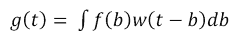

上述操作被称为卷积。卷积的传统表示方法使用星号或星号符号 '*' 来表示：

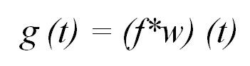

正式而言，卷积可以定义为两个函数的乘积的积分，其中一个函数被反转并移动。此外，通过加权平均，卷积还可以用于其他目的。

从卷积网络的术语来看，我们示例中的函数 *f* 被称为输入函数，而函数 *w*，即第二个参数，被称为操作的核心（kernel）。该核心由多个滤波器组成，这些滤波器将用于输入数据以获得输出，即 *特征图*。更直观地说，核心可以看作是一个膜，只允许输入的期望特征通过它。*图 3.1* 展示了该操作的示意图：

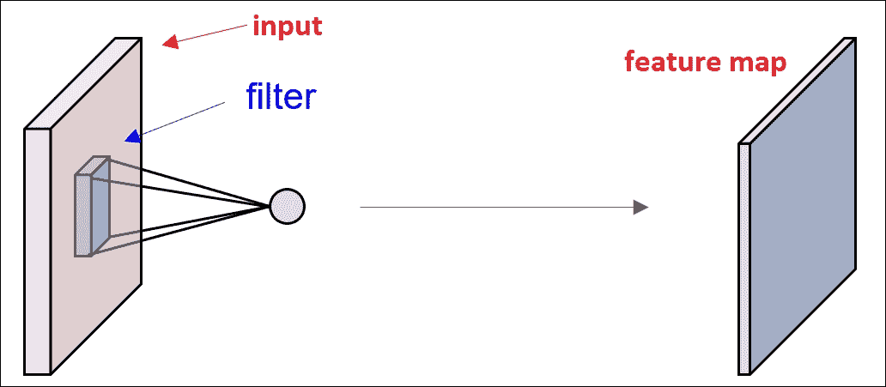

图 3.1：该图展示了卷积网络的简单表示，其中输入必须通过核心才能提供特征图。

在实际场景中，如我们的示例所示，激光传感器并不能在每个时间点提供测量值。理想情况下，当计算机处理数据时，它只能在某些固定的时间间隔内工作，因此时间是离散的。因此，传感器通常会在某些定义的时间间隔内提供结果。如果我们假设仪器每秒提供一次输出，那么参数 *t* 将只取整数值。基于这些假设，函数 *f* 和 *w* 将仅在 *t* 的整数值下定义。离散卷积的修改方程可以写成如下形式：

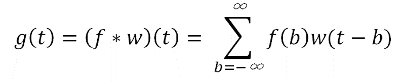

在机器学习或深度学习应用中，输入通常是一个多维数据数组，而卷积核使用算法获取的不同参数的多维数组。基本假设是函数的值仅对一组有限的点为非零，且我们仅存储这些点的值，其他地方为零。因此，无限求和可以表示为一组有限数组元素的求和。例如，对于一个二维图像 *I* 作为输入和一个对应的二维卷积核 *K*，卷积函数可以表示如下：

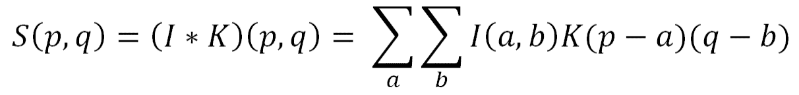

所以，通过这一部分，你已经了解了一些卷积的背景知识。在本章的下一部分，我们将讨论卷积在神经网络中的应用以及卷积神经网络的构建模块。

# 卷积神经网络的背景

卷积神经网络（CNN）作为深度学习模型的一种特殊形式，并不是一个新概念，它们已经被计算机视觉领域广泛采用了很长时间。该模型在 1998 年由 LeCun 等人成功应用于手写数字识别[90]。但不幸的是，由于 CNN 无法处理高分辨率图像，它的流行度随着时间的推移有所下降。其原因主要是由于硬件和内存的限制，以及大规模训练数据集的缺乏。随着计算能力的不断提高，尤其是 CPU 和 GPU 的广泛普及以及大数据的产生，各种大型数据集（如 MIT Places 数据集（参见 Zhou 等，2014）、ImageNet[91]等）使得训练更大、更复杂的模型成为可能。这一点最早在 Krizhevsky 等人[4]的论文《使用深度卷积神经网络进行 Imagenet 分类》中得到了展示。在这篇论文中，他们通过将错误率降低到传统方法的一半，取得了突破。接下来的几年里，他们的论文成为计算机视觉领域最重要的论文之一。由 Alex Krizhevsky 训练的这个流行网络，名为 AlexNet，可能是计算机视觉领域使用深度网络的起点。

## 架构概述

我们假设读者已经熟悉传统的神经网络。在本节中，我们将探讨卷积神经网络（CNN）的一般构建模块。

传统的神经网络接收一个单一的向量作为输入，并通过一系列潜在（隐藏）层达到中间状态。每个隐藏层由多个神经元组成，每个神经元与前一层的每个神经元完全连接。最后一层，称为“输出层”，是完全连接的，它负责类别分数。一个由三层组成的常规神经网络如*图 3.2*所示：

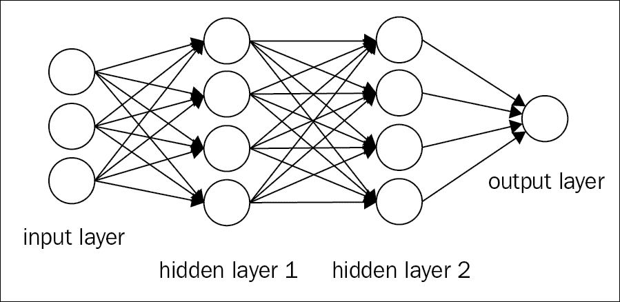

图 3.2：该图展示了一个三层常规神经网络的框图。每一层的神经元都与上一层的所有其他层神经元完全连接。

常规神经网络在处理大规模图像时面临巨大挑战。例如，在 CIFAR-10 RGB 数据库中，图像的尺寸为*32x32x3*，因此，传统神经网络中第一隐藏层的单个全连接神经元将具有*32*32*3=3072*个权重。虽然权重的数量在一开始看起来似乎是合理的，但随着维度数量的增加，管理这些权重将变得非常繁琐。对于另一个 RGB 图像，如果尺寸变为（*300x300x3*），那么神经元的总权重数将达到*300*300*3=270000*个权重。此外，随着层数的增加，这个数字也将急剧增加，很快会导致过拟合。此外，图像的可视化完全忽视了图像的复杂二维空间结构。因此，神经网络的全连接概念从一开始就似乎无法适应更大维度的数据集。因此，我们需要构建一个能够克服这两种限制的模型：

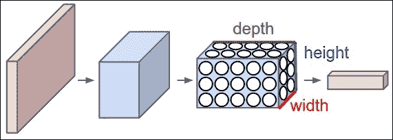

图 3.3：图中展示了 CNN 在三维（宽度、高度和深度）中的排列方式。每一层将三维输入体积转换为相应的三维输出体积，输出的是神经元激活值。红色输入层保持图像，因此其宽度和高度将是图像的尺寸，而深度则为三（红色、绿色和蓝色）。图像来源于 Wikipedia。

解决这个问题的一种方法是用卷积代替矩阵乘法。学习一组卷积滤波器（核）比从整个矩阵（*300x300x3*）中学习要容易得多。与传统神经网络不同，CNN 的每一层的神经元排列在三维空间中：宽度、高度和深度。*图 3.3*展示了这一表示方式。例如，在前面提到的 CIFAR-10 示例中，图像的尺寸为*32x32x3*，这分别是宽度、深度和高度。在 CNN 中，每一层的神经元不会像全连接网络那样与上一层的所有神经元相连，而是仅与上一层中某一子集的神经元相连。该部分的详细内容将在本节后续部分中解释。此外，最终输出层的 CIFAR-10 图像将具有*1x1x10*的尺寸，因为 CNN 会将完整的图像缩减为一个类别分数的单一向量，并与深度维度一起放置。

# CNN 的基本层

卷积神经网络由一系列层组成，其中网络的每一层都通过一个可微分的函数将自己从一个激活体积转换到另一个激活体积。构建 CNN 时使用四种主要类型的层：卷积层、修正线性单元层、池化层和全连接层。所有这些层堆叠在一起，形成一个完整的 CNN。

一个常规的 CNN 可能具有以下架构：

[输入 - 卷积 - ReLU - 池化 - 全连接]

然而，在深度卷积神经网络中，通常会在这五个基本层之间插入更多的层。

一个经典的深度神经网络将具有以下结构：

输入 -> 卷积 -> ReLU -> 卷积 -> ReLU -> 池化 -> ReLU -> 卷积 -> ReLU -> 池化 -> 全连接

如前文所述，AlexNet 可以作为这种结构的完美示例。AlexNet 的架构如*图 3.4*所示。在每一层之后，都会添加一个隐式的 ReLU 非线性函数。我们将在下一节中详细解释这一点。

你可能会问，为什么 CNN 中需要多层？本章的下一节将为你解释这一点：

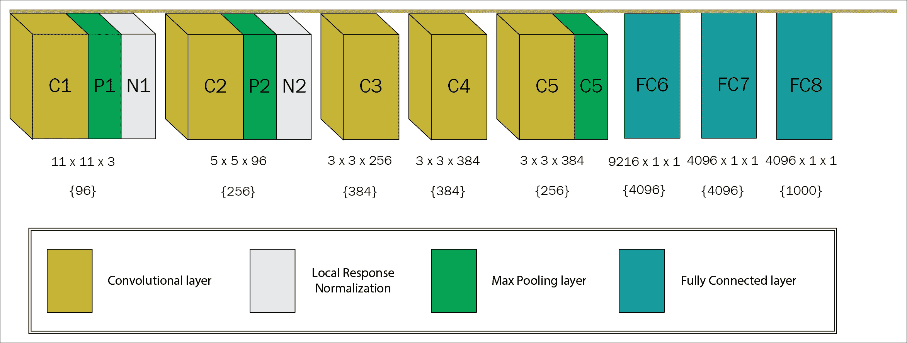

图 3.4：图中展示了 AlexNet 的深度和权重的示意图。花括号内的数字表示上方写明的滤波器数量。

## CNN 中深度的重要性

在论文[96]中，作者提出了一些统计数据，展示了深度网络如何帮助提高输出的准确性。如前所述，Krizhevsky 等人的架构使用了八层，并在 ImageNet 上进行训练。当移除最上层的全连接层（第 7 层）时，约有 1600 万个参数被移除，性能下降了 1.1%。此外，当移除最上面的两层（第 6 层和第 7 层）时，减少了近 5000 万个参数，并且性能下降了 5.7%。类似地，当移除上面的特征提取层（第 3 层和第 4 层）时，减少了约 100 万个参数，性能下降了 3.0%。为了更好地理解这一情况，当移除上面的特征提取层和全连接层（第 3、4、6 和 7 层）时，模型仅剩下四层。在这种情况下，性能下降了 33.5%。

因此，可以轻松得出结论：我们需要深度卷积网络来提高模型的性能。然而，正如前面所说，深度网络在集中式系统中非常难以管理，因为受限于内存和性能管理的局限性。因此，需要一种分布式的方法来实现深度卷积神经网络。在本章的后续部分，我们将解释如何借助 Deeplearning4j 实现这一点，并将处理过程与 Hadoop 的 YARN 集成。

## 卷积层

如架构概述中所示，卷积的主要目的是使模型在特定时间内仅处理有限数量的输入。此外，卷积支持三项最重要的特性，这些特性在显著提高深度学习模型性能方面起着关键作用。以下列出了这些特性：

+   稀疏连接

+   参数共享

+   等变表示

现在我们将依次描述这些特性。

### 稀疏连接

如前所述，传统网络层通过一个包含不同参数的矩阵进行矩阵乘法，这些参数描述了每个输出单元与输入单元之间的相互作用。另一方面，卷积神经网络（CNN）采用稀疏连接，有时也称为稀疏交互或稀疏权重。这个想法通过保持卷积核的大小小于输入来实现，这有助于降低算法的时间复杂度。例如，对于一个大型图像数据集，图像可能包含成千上万或数百万个像素；然而，我们可以通过卷积核识别出图像中的小而重要的特征，比如边缘和轮廓，而这些卷积核只包含几百个或几十个像素。因此，我们只需要保持少量的参数，从而帮助减少模型和数据集的内存需求。这个想法还缓解了操作次数，能够增强整体的计算能力。这反过来大大降低了计算的运行时间复杂度，最终提高了效率。*图 3.5* 以图示的方式展示了如何通过稀疏连接方法减少每个神经元的感受野数量。

### 注意

卷积层中的每个神经元都会呈现前一层应用的滤波器的响应。这些神经元的主要作用是将响应传递通过某些非线性函数。前一层中应用该滤波器的总区域称为该神经元的感受野。因此，感受野的大小始终等于滤波器的大小。

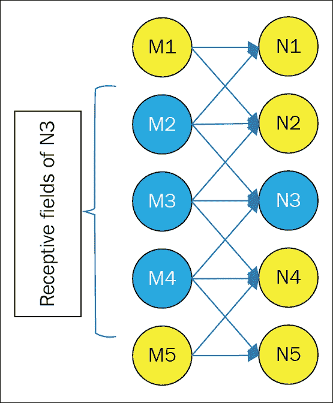

图 3.5：该图展示了稀疏连接下，M 的输入单元如何影响输出单元 N3。与矩阵乘法不同，稀疏连接方法中，感受野的数量从五个减少到三个（M2、M3 和 M4）。箭头还表示了参数共享的方法。来自一个神经元的连接与模型中的两个神经元共享。

因此，使用稀疏连接方法时，每层的感受野比使用矩阵乘法方法时的感受野要小。然而，值得注意的是，对于深度卷积神经网络（CNN），单元的感受野实际上比相应的浅层网络的感受野要大。原因是深度网络中的所有单元几乎都间接连接到网络中的几乎所有神经元。*图 3.6*展示了这种情况的可视化表示：

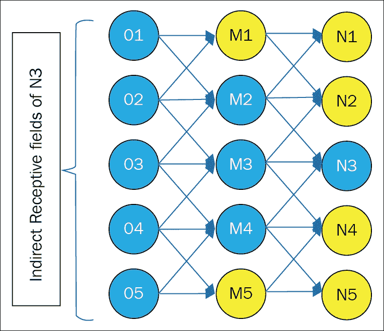

图 3.6：深度卷积神经网络稀疏连接的表示。与图 3.5 不同，图中单元 N3 有三个感受野，而这里 N3 的感受野数量增加到了五个。

#### 改进的时间复杂度

类似于上一节中给出的例子，如果在某一层有*p*个输入和*q*个输出，那么矩阵乘法将需要*(p*q)*个参数。算法的运行时间复杂度将变为*O(p*q)*。使用稀疏连接方法时，如果我们将与每个输出相关联的上限连接数限制为*n*，则只需要*n*q*个参数，运行时复杂度将减少到*O(n*q)*。对于许多实际应用，稀疏连接方法在深度学习任务中提供了良好的性能，同时保持了*n << p*的参数规模。

### 参数共享

参数共享可以定义为在模型中，函数的相同参数可以被多个函数使用的过程。在常规神经网络中，权重矩阵的每个元素仅在计算层的输出时使用一次。权重与输入的一个元素相乘，但不会被再次访问。参数共享也可以称为绑定权重，因为用于一个输入的权重值与用于其他输入的权重值是绑定的。*图 3.5*也可以作为参数共享的一个例子。例如，**M2**中的某个特定参数同时被**N1**和**N3**使用。

操作的主要目的是控制卷积层中自由参数的数量。在 CNN 中，卷积核的每个元素几乎在输入的每个位置上都被使用。对此的一个合理假设是，如果某个特征在某个空间位置上是需要的，那么它也应该在其他位置上进行计算。

由于单个深度切片中的所有元素共享相同的参数化类型，因此卷积层中每个深度切片的前向传递可以视为输入体积与神经元权重的卷积。此卷积的结果是激活图。这些激活图集合与深度维度的关联被堆叠在一起，最终形成输出体积。尽管参数共享方法赋予了 CNN 架构平移不变性，但它并未提高前向传播的运行时间。

#### 改进的空间复杂度

在参数共享中，模型的运行时间仍然保持为 *O (n*q)*。然而，它有助于显著减少整体空间复杂度，因为模型的存储需求减少到 n 个参数。由于*p*和*q*通常是相似大小的，*n*的值与*p*q*相比几乎可以忽略不计。

### 注意

卷积在时间复杂度和空间复杂度上都比传统的稠密矩阵乘法方法更高效。

### 等变表示

在卷积层中，由于参数共享，层具有一种称为平移等变性的特性。一个等变函数被定义为其输出以与输入相同的方式变化的函数。

从数学角度看，如果 X 和 Y 都属于同一群 G，则一个函数*f: X  †’ Y* 被称为等变的，如果对于所有*g* *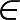 G*和所有*x* ∈ *X*，都有*f (g.x) = g.f(x)*。

在卷积的情况下，如果我们将*g*视为任何一个函数，它以相同的幅度移动输入，那么卷积函数对*g*是等变的。例如，设*I*是一个函数，对于任何偶坐标，它给出图像的颜色。设*h*是另一个函数，它将一个图像函数映射到另一个图像函数，给定如下方程：

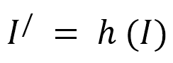

*I^/* 是一个图像函数，将*I*的每个像素向右移动五个单位。因此，我们得到以下结果：

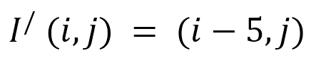

现在，如果我们对*I*应用这个平移操作，然后进行卷积，结果将与我们先对*I^/*应用卷积，再对输出应用变换函数*h*时的结果完全相同。

对于图像，卷积操作生成一个二维的特征图，显示输入中所有明确的特征。因此，类似于前面的例子，如果我们将输出中的物体按某个固定比例进行平移，输出表示也会以相同的比例移动。这个概念在某些情况下是有用的；例如，考虑一张包含两支不同球队的板球运动员的合影。我们可以在图像中找到球衣的某些共同特征来识别一些运动员。现在，类似的特征显然也会出现在其他人的 T 恤上。所以，将参数共享到整个图像是相当实际的。

卷积还有助于处理一些特殊类型的数据，这些数据对于传统的固定形状矩阵乘法方法来说是困难的，甚至可以说是无法处理的。

## 选择卷积层的超参数

到目前为止，我们已经解释了卷积层中的每个神经元是如何连接到输入体积的。在这一部分，我们将讨论控制输出体积大小的方法。换句话说，控制输出体积中神经元的数量，以及它们的排列方式。

基本上，有三个超参数控制卷积层输出体积的大小。它们是：深度、步幅和零填充。

我们如何知道应该使用多少卷积层，过滤器的大小应该是多少，步幅和填充的值应该是多少？这些问题非常主观，其解决方案本质上并不简单。没有研究人员为这些超参数设定任何标准参数。神经网络通常在很大程度上依赖于用于训练的数据类型。这些数据的大小、输入原始图像的复杂性、图像处理任务的类型以及许多其他标准可能有所不同。根据大数据集的普遍思路，我们必须思考如何选择超参数，以推导出正确的组合，从而在适当的尺度上对图像进行抽象。我们将在这一小节中讨论所有这些内容。

### 深度

在输出体积中，深度被视为一个重要参数。深度对应于我们希望对输入的某些变化应用的过滤器数量。如果第一个卷积层以原始图像作为输入，那么在颜色斑块或不同方向的边缘出现时，沿深度维度的多个神经元可能会被激活。同一区域中的神经元集称为深度列。

### 步幅

步幅指定了在空间维度（宽度和高度）周围分配深度列的策略。它基本上控制了滤波器如何围绕输入体积进行卷积。步幅可以正式定义为滤波器在卷积过程中移动的量。理想情况下，步幅的值应该是整数，而非分数。从概念上讲，这个量有助于决定在进入下一层之前，我们希望保留多少输入图像信息。步幅越大，保留的信息就越多，供下一层使用。

例如，当步幅为*1*时，一个新的深度列分配到空间位置，且相邻的空间单位之间有一个单位的间隔。由于列之间的感受野重叠较多，这会产生较大的输出体积。另一方面，如果步幅值增加，感受野之间的重叠会减少，从而导致输出体积的空间维度变小。

我们将通过一个例子来进一步简化这个概念。假设我们有一个*7*7*的输入体积和一个*3*3*的滤波器（为了简便起见，我们忽略第三维度），步幅为*1*。在这种情况下，输出体积的维度将是*5*5*，如*图 3.7*所示。然而，这看起来相对简单。现在，步幅为*2*，保持其他参数不变，输出体积的维度将会缩小为*3*3*。在这种情况下，感受野会移动*2*单位，因此，体积会缩小到*3*3*的维度：

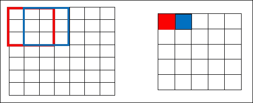

图 3.7：说明了滤波器如何以步幅 1 卷积 7x7 的输入体积，从而得到 5x5 的输出体积。

这在*图 3.8*中有进一步说明。所有这些计算基于本节下一个主题中提到的一些公式。现在，如果我们希望进一步增加步幅到*3*，我们将会面临空间安排的困难，并且需要确保感受野能够适应输入体积。理想情况下，程序员只有在需要更少重叠的感受野并且需要更小的空间维度时，才会增加步幅的值：

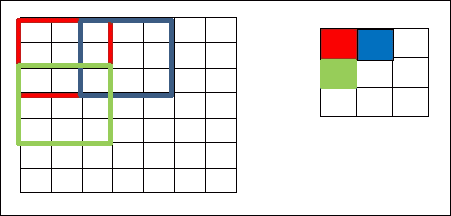

图 3.8：说明了滤波器如何以步幅 2 卷积 7x7 的输入体积，从而得到 3x3 的输出体积。

### 零填充

我们已经有足够的信息推断出，当我们继续向输入体积应用更多的卷积层时，输出体积的大小会进一步减小。然而，在某些情况下，我们可能希望保留关于原始输入体积的几乎所有信息，以便我们还能够提取低级特征。在这种情况下，我们会在输入体积的边缘周围使用零填充。

这种零填充的大小被视为超参数。它可以定义为超参数，直接用于控制输出体积的空间大小，在我们希望精确保持输入体积的空间大小时。

例如，如果我们对一个*32*32*3*的输入体积应用一个*5*5*3*的滤波器，输出体积将减小为*28*28*3*。然而，假设我们希望使用相同的卷积层，但需要保持输出体积为*32*32*3*，我们将在该层使用大小为*2*的零填充。这样，我们将得到一个*36*36*3*的输出体积，如下图所示。如果我们应用三个卷积层，每个滤波器的大小为*5*5*3*，则输出体积将为*32*32*3*，因此保持输入体积的空间大小不变。*图 3.9*展示了这种情况的图示：

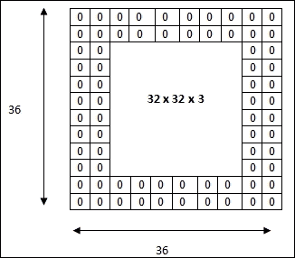

图 3.9：输入体积的维度为 32*32*3。两个零边界将生成一个 36*36*3 的输入体积。进一步应用卷积层，使用三个大小为 5*5*3 的滤波器，步幅为 1，将得到一个 32*32*3 的输出体积。

### 超参数的数学公式

本章这一部分将介绍一个方程，用于根据我们到目前为止讨论的超参数计算输出体积的空间大小。这个方程对于选择 CNN 的超参数非常有用，因为这些是决定神经元“适配”网络的因素。输出体积的空间大小可以作为输入体积大小（*W*）、感受野大小或卷积层神经元的滤波器大小（*K*）、应用的步幅值（*S*）以及在边缘使用的零填充量（*P*）的函数来表示。

计算输出体积空间大小的方程可以写成如下形式：

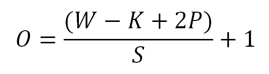

考虑*图 3.7*和*图 3.8*中给出的例子，其中*W=7*，*K=3*，且没有填充，*P =0*。对于步幅*1*，我们有*S=1*，这将给出以下结果：

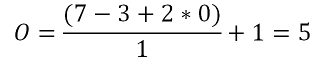

同样，对于步幅**2**，该方程会给出**2**的值：

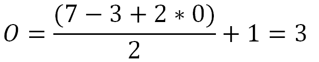

因此，如*图 3.7*所示，我们会得到一个空间大小为**3**的输出。然而，在这种配置下，当应用步幅**3**时，它将无法适应输入体积，因为这个方程会返回一个分数值**2.333**作为输出体积：

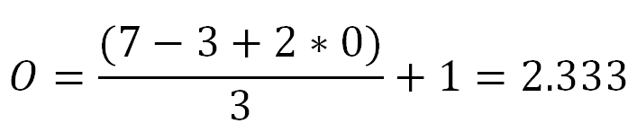

这也意味着超参数的值之间存在相互约束。前面的例子返回了一个分数值，因此超参数会被视为无效。然而，我们可以通过在边缘添加一些零填充来解决这个问题。

### 注

超参数的空间排列具有相互约束关系。

#### 零填充的影响

如零填充部分所述，其主要目的是保持输入体积的信息传递到下一层。为了确保输入和输出体积具有相同的空间尺寸，传统的零填充公式，步幅*S=1*，如下所示：

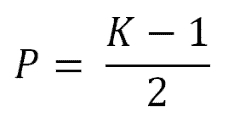

以*图 3.9*中的示例为例，我们可以验证公式的正确性。在该示例中，*W = 32*，*K=5*，*S=1*。因此，为了确保空间输出体积等于 32，我们选择的零填充数量如下：

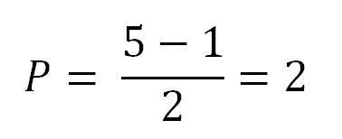

因此，若*P=2*，输出体积的空间尺寸如下所示：

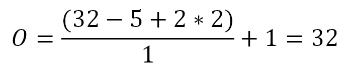

因此，这个方程式很好地保持了输入体积和输出体积的空间尺寸相同。

## ReLU（修正线性单元）层

在卷积层中，系统基本上通过逐元素的乘法和求和来计算线性操作。深度卷积通常在每层之后执行卷积操作，并在每层之后进行非线性操作。这是必需的，因为级联的线性操作会产生另一个线性系统。层与层之间添加非线性增强了模型的表达能力，优于线性模型。

因此，在每个卷积层之后，会对当前输出应用一个激活层。因此，该激活层的主要目标是为系统引入一些非线性。现代卷积神经网络（CNN）使用**修正线性单元**（**ReLu**）作为激活函数。

在人工神经网络中，激活函数——整流器，定义如下：

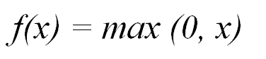

其中，*x*是神经元的输入。

一个操作整流器的单元称为 ReLU。早期，许多非线性函数如*tan h*、sigmoid 等被用于网络中，但近年来，研究人员发现 ReLU 层效果更好，因为它们帮助网络更快地训练，同时不影响结果的准确性。计算效率的显著提升是其中的一个重要因素。

此外，该层增强了模型和其他整体网络的非线性特性，而不会对卷积层的感受野产生任何影响。

最近，在 2013 年，Mass 等人[94]提出了一种新的非线性版本，称为 leaky-ReLU。Leaky-ReLU 定义如下：

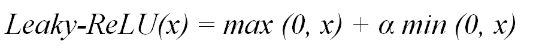

其中，*α*是预设参数。后来，在 2015 年，He 等人[95]更新了该方程，提出参数α也可以进行训练，从而大幅改进了模型。

### ReLU 相较于 sigmoid 函数的优势

ReLU 有助于缓解梯度消失问题，这在第一章 *深度学习简介*中有详细解释。ReLU 将前述函数 *f(x)* 应用到输入值的所有数据，并将所有负激活值转换为**0**。对于最大值函数，梯度定义如下：

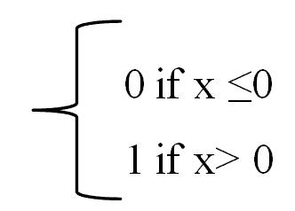

然而，对于 Sigmoid 函数，当我们增加或减少 *x* 的值时，梯度往往会消失。

Sigmoid 函数如下所示：

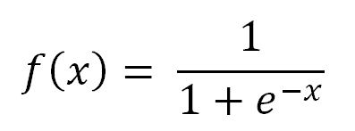

Sigmoid 函数的值域为[*0, 1*]，而 ReLU 函数的值域为*0, ![ReLU 优势相对于 Sigmoid 函数 ˆž*]。因此，Sigmoid 函数通常用于建模概率，而 ReLU 可以用来建模所有正数。

## 池化层

该层是卷积神经网络（CNN）的第三阶段。经过若干次线性整流单元（ReLU）后，程序员可能会选择应用池化层。该层也可以被称为降采样层。

池化函数基本上用于进一步修改层的输出。该层的主要功能是用邻域输出的总结统计信息替换网络中某一位置的输出。该层有多种选项，其中最大池化（Max-pooling）是最常用的。最大池化操作[93]在矩形邻域内进行，并报告其中的最大输出。最大池化基本上使用一个大小为*2x2*的滤波器和相同长度的步幅，即**2**。然后，将该滤波器应用于输入体积，在滤波器卷积经过的每个区域输出最大值。*图 3.10* 展示了相同内容的表示。池化层的其他常见选项包括矩形邻域的*L2* 正常化的平均值、矩形邻域的平均值或基于与中心像素的距离的加权平均。

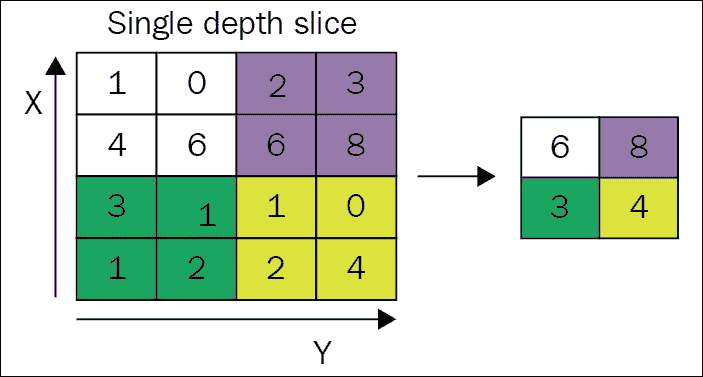

图 3.10：带有 2*2 滤波器和步幅为 2 的最大池化示例。图像来源于维基百科。

### 注意

如果我们关注的是邻域特征，而不是特征的精确位置，那么局部平移不变性是极为有益的。

### 它在哪里有用，在哪里没有用？

池化层的直观原因是，一旦知道了原始输入体积的某个特定特征，其精确位置相较于与其他特征的相对位置变得无关紧要。借助池化，表示几乎对输入的微小平移保持不变。平移不变性意味着，对于输入的微小平移，大多数池化输出的值不会发生显著变化。

对局部平移的不变性在我们更关注邻近特征而非特征的准确位置时极为有益。然而，在处理计算机视觉任务时，使用池化层需要小心。虽然池化有助于大幅降低模型的复杂性，但它可能最终会丧失模型的位置敏感性。

让我们以图像处理为例，涉及到识别图像中的一个框。池化层在这种情况下会有帮助，如果我们只是简单地想要确定图像中是否存在这个框。然而，如果问题陈述更关心框的准确位置，我们在使用池化层时需要特别小心。再举一个例子，假设我们正在处理一个语言模型，且关心识别两个单词之间的语境相似性。在这种情况下，不建议使用池化层，因为它会丧失一些有价值的特征信息。

因此，可以得出结论，池化层基本上用于减少模型的计算复杂性。池化层更像是一个平均过程，我们更关注一组邻近的特征。该层可以应用于我们可以舍弃一些局部信息的场景中。

## 全连接层

全连接层是卷积神经网络（CNN）的最终层。该层的输入来自前一层卷积层、ReLU 层或池化层的输出。全连接层接收该输入并输出一个*N*维向量，其中*N*是初始输入数据集中的不同类别数量。全连接层的基本工作原理是，它基于从前一层接收到的输出，识别与特定类别最相关的特征。例如，如果模型正在预测一张图片中是否包含猫或鸟，它会在激活图中具有较高的值，这些值代表一些高级特征，如四条腿或翅膀。

# 分布式深度 CNN

本章这一部分将介绍一些极具挑战性的深度 CNN 架构，相关的网络挑战，以及为克服这些挑战而需要的大规模分布式计算。此部分还将解释 Hadoop 及其 YARN 如何为这个问题提供足够的解决方案。

## 最流行的激进深度神经网络及其配置

近年来，CNN 在图像识别方面展示了惊人的成果。然而，不幸的是，它们的训练成本非常高。以顺序训练过程为例，卷积操作大约占据了总运行时间的 95%。在大规模数据集的情况下，即使是低规模的分布式训练，训练过程也需要几天时间才能完成。2012 年获得大奖的 CNN，AlexNet，使用两个 GTX 580 3 GB GPU，在 ImageNet 数据集上进行训练，几乎花费了一整周的时间。以下表格列出了几种最受欢迎的分布式深度 CNN，它们的配置和训练过程所花费的时间：

| **模型** | **计算能力** | **数据集** | **层数** | **训练过程所需时间** |
| --- | --- | --- | --- | --- |
| AlexNet | 两个 NVIDIA GTX 580 3 GB GPU | 在 ImageNet 数据集上训练，该数据集包含来自超过 22,000 个类别的 1500 万张高分辨率图像。 | 八层 | 五到六天。 |
| ZFNet [97] | GTX 580 GPU | 130 万张图像，覆盖 1000 个不同的类别。 | 八层 | 十二天。 |
| VGG Net [98] | 4 个 Nvidia Titan Black GPU | 数据集包含 1000 个类别的图像，分为三部分：训练集（130 万图像）、验证集（5 万图像）和测试集（10 万图像，部分类别标签被排除）。 | 19 层 | 两到三周。 |
| GoogLeNet [99] | 一些高端 GPU | 120 万张训练图像。 | 网络深度为 22 层（仅计算具有参数的层，若包括池化层则为 27 层）。该网络的总层数（独立构建模块）大约为 100 层。 | 一周内。 |
| Microsoft ResNet [100] | 8 GPU 机器 | 在 128 万张训练图像上进行训练，并在 5 万张验证图像上进行评估。 | 152 层。 | 两到三周。 |

## 训练时间 - 深度神经网络面临的主要挑战

从前面的表格可以明确推断出，研究人员在提高结果准确性方面付出了大量努力。表格中突出的一点是，网络层数已成为提高准确性的主要标准之一。微软的 ResNet 使用了一个深度达 152 层的神经网络，这成为了一个极具攻击性的深度神经网络架构。该架构在 2015 年通过深度卷积神经网络（CNN）在分类、定位和检测等领域创下了许多新纪录。此外，ResNet 还凭借惊人的错误率改进，仅为 3.6%，赢得了 2015 年 ILSVRC（ImageNet Large Scale Visual Recognition Challenge）。

尽管深度卷积神经网络几乎达到了预期的准确率，几乎所有这些深度 CNN 的主要问题仍然是表格中最右侧的那一列。因此，这表明当前训练深度 CNN 的挑战在于构建一个大规模的分布式框架，以便通过快速互联的网络将训练过程并行化，分配到多个 CPU 和 GPU 上。

## Hadoop 用于深度 CNN

本节将解释如何使用 Hadoop 在大规模上分发深度模型以加速处理。

CNN 的运行时间可以分为两大类：

+   网络中所有的卷积层消耗了大约 90-95%的计算。它们使用了大约 5%的参数，并且有较大的表示形式。[101]

+   剩余的计算大约占 5-10%，由全连接层处理。它们使用了大约 95%的参数，并且表示形式较小。

Alex Krizhevsky 在[101]中提出了一种使用分布式架构训练卷积神经网络（CNN）的算法。在传统的 CNN 中，卷积操作本身几乎占用了整个过程的全部运行时间；因此，应该使用数据并行性来加速训练。然而，对于全连接层，建议使用模型并行性的方法。本节将通过 Hadoop 及其 YARN 来解释该算法。

在 Hadoop 中，分布式系统的工作节点位于每个 HDFS 块上，并同步并行处理数据。我们将使用一个小批量大小，1024 个来自原始输入图像的示例，这些示例将被拆分为 N 个多个**Hadoop 分布式文件系统**（**HDFS**）的块。因此，总共有*N*个工作节点将为每个小批量数据进行工作。HDFS 的块大小将保持为大小*K*。那么，*K*的大小应该是多少呢？虽然较小的*K*将增加块的数量，并有助于加快训练，但较大的*N*也最终会增加在 NameNode 中存储的元数据量。在这种情况下，一个主要的缺点是 Hadoop 的**单点故障**（**SPOF**）问题，且更容易出现 NameNode 的主内存较小。然而，使用较大的*K*，我们将得到较少数量的 HDFS 块，因此，平行工作的节点数量将减少。这又会使训练过程变慢。因此，选择*K*的最佳方法将主要取决于以下三个因素：

+   您的 NameNode 的主内存大小可用性。

+   输入批量的大小以及对每个数据块执行的操作的复杂性。

+   数据的中间结果有多重要或有价值。根据这些标准，我们可以设置复制因子。然而，复制因子越高，NameNode 的负载就越大。

HDFS 的块分布在 Hadoop 的所有 DataNode 上，YARN 将在这些 DataNode 上并行运行。

分布式训练卷积层的步骤如下：

1.  每个*N*块都分配了来自原始输入图像的不同小数据批量，共 1024 个示例。

1.  相同大小的滤波器和步幅应用于每个 N 个块，这将基于输入的值生成单独的空间输出。

1.  ReLU 会在所有这些上并行、同步地应用，以在结果中引入一定的非线性。

1.  根据结果的需求，可以在这些独立的数据块上应用最大池化或任何其他下采样算法。

1.  每次迭代的输出（转化后的参数）会被发送回名为资源管理器的主节点，在那里它们的参数会被平均。更新后的新参数会被发送回每个*N*块，再次执行相应的操作。

1.  步骤 2 到步骤 5 会为预定的周期数重复执行。

对于全连接层，任何一个正在处理*N*个数据块中一个小批量输入图像的*N*个工作节点中的一个，会将最后一阶段的卷积活动发送给其他所有的(*N-1*)个工作节点。然后，工作节点会对这批 1024 个样本执行全连接操作，随后开始反向传播这些 1024 个样本的梯度。接下来的工作节点与此操作并行，会将其最后一阶段的卷积层活动发送给其他工作节点，类似于之前的情况。工作节点将再次对第二批 1024 个样本执行全连接活动。此过程会迭代，直到我们得到具有所需最小误差的结果。

在这种方法中，工作节点将它们的最后一阶段卷积层信息广播给所有其他工作节点。这种方法的主要优势是，通信的大部分部分（*(N-1)/N*）可以被抑制，并且可以与全连接层的计算并行执行。这种方法在网络通信方面具有极大的优势。

因此，很明显，Hadoop 在 HDFS 和 Hadoop YARN 的帮助下，对于提供分布式环境给 CNN 具有极大的好处。

现在我们已经熟悉了通过 Hadoop 并行分布模型的方法，本节的下一部分将讨论每个工作节点在 HDFS 的每个数据块上进行操作的编码部分。

# 使用 Deeplearning4j 的卷积层

本章这一部分将提供如何使用 Deeplearning4j 编写 CNN 代码的基本思路。你将能够学习本章中提到的各种超参数的语法。

使用 Deeplearning4j 实现 CNN 的整个思路可以分为三个核心阶段：加载数据或数据准备、网络配置以及模型的训练与评估。

## 加载数据

对于 CNN，一般来说，我们只处理图像数据来训练模型。在 Deeplearning4j 中，图像可以通过`ImageRecordReader`读取。以下代码片段展示了如何加载*16×16*的彩色图像进行模型训练：

```py
RecordReader imageReader = new ImageRecordReader(16, 16, false);
imageReader.initialize(new FileSplit(new      
File(System.getProperty("user.home"), "image_location")));
```

之后，使用`CSVRecordReader`，我们可以从输入的 CSV 文件中加载所有的图像标签，方法如下：

```py
int numLinesToSkip = 0;
String delimiter = ",";
RecordReader labelsReader = new    
CSVRecordReader((numLinesToSkip,delimiter);
labelsReader.initialize(new FileSplit(new   
File(System.getProperty("user.home"),"labels.csv_file_location"))
```

为了将图像和标签数据结合在一起，我们可以使用`ComposableRecordReader`。`ComposableRecordReader`在需要合并来自多个源的数据时也非常有用：

```py
ComposableRecordReader(imageReader,labelsReader);

```

类似地，在某些情况下，如果需要将 MNIST 数据集加载到模型中，而不是使用 imageset，我们可以使用以下部分。此示例使用了一个随机数种子`12345`：

```py
DataSetIterator mnistTrain = new      
MnistDataSetIterator(batchSize,true,12345);
DataSetIterator mnistTest = new     
MnistDataSetIterator(batchSize,false,12345);
```

## 模型配置

操作的下一部分是配置 CNN。Deeplearning4j 提供了一个简单的构建器，可以逐层定义深度神经网络，设置不同的超参数：

```py
MultiLayerConfiguration conf = new NeuralNetConfiguration.Builder() MultiLayerConfiguration.Builder builder = new  
NeuralNetConfiguration.Builder() 
.seed(seed) 
.iterations(iterations)
.regularization(true)
.l2(0.0005) 
.learningRate(0.01)

```

第一个层次，卷积层，可以使用`ConvolutionLayer.Builder`方法来调用。`.build()`函数用于构建该层。`.stride()`用于设置该卷积层的步幅大小：

```py
.layer(0, new ConvolutionLayer.Builder(5, 5)

```

`nIn`和`nOut`表示深度。这里的`nIn`是`nChannels`，`nOut`是应用于卷积的过滤器数量：

```py
.nIn(nChannels)
.stride(1, 1)
.nOut(20)

```

为了将恒等函数添加为激活函数，我们将以这种方式定义它：

```py
.activation("identity")
.build())

```

为了添加一个类型为最大池化的 Pooling 层，我们将在第一个层之后调用`SubsamplingLayer.Builder()`方法：

```py
.layer(1, new SubsamplingLayer.Builder(SubsamplingLayer.PoolingType
.MAX)
.kernelSize(2,2)
.stride(2,2)
.build())
```

**修正线性单元**（**ReLU**）层可以通过调用新的`DenseLayer.Builder().activation("relu")`来添加：

```py
.layer(4, new DenseLayer.Builder().activation("relu")
.nOut(500).build())
```

可以通过调用`init()`方法来初始化模型，如下所示：

```py
MultiLayerNetwork model = new MultiLayerNetwork(getConfiguration());
model.init();

```

## 训练与评估

如前面所述，在训练阶段，我们需要将整个大数据集分成多个批次。然后，模型将在 Hadoop 中逐个处理这些批次。假设我们将数据集分成 5000 个批次，每个批次包含 1024 个示例。1024 个示例将被拆分成多个块，工人将在并行处理。这种大数据集的拆分操作是通过`RecordReaderDataSetIterator()`方法完成的。让我们首先初始化需要调用该方法的参数，如下所示：

```py
int batchSize = 1024; 
int seed = 123;
int labelIndex = 4; 
int iterations = 1

```

假设图像中的类别总数为`10`：

```py
int numClasses = 10;

```

现在，既然我们已经为`RecordReaderDataSetIterator()`设置了参数数量，我们可以调用该方法来设置训练平台：

```py
DataSetIterator iterator = new RecordReaderDataSetIterator(recordReader,batchSize,labelIndex,numClasses);
DataSet batchData= iterator.next();
batchData.shuffle();

```

在训练阶段，我们可以将批次随机拆分为训练集和测试集。如果我们希望 70 个样本用于训练集，剩余的 30 个样本用于测试集，我们可以通过以下配置来设置：

```py
SplitTestAndTrain testAndTrain = batchData.splitTestAndTrain(0.70); 
DataSet trainingData = testAndTrain.getTrain();
DataSet testData = testAndTrain.getTest();

trainAndTest =batchData.splitTestAndTrain(0.70);
trainInput = trainAndTest.getTrain();                

testInput.add(trainAndTest.getTest().getFeatureMatrix());
```

当模型完全训练完成后，对于每个批次，可以保存测试数据以验证模型。因此，通过定义一个`Evaluation`类的对象，我们将能够收集整个数据集的统计信息：

```py
Evaluation eval = new Evaluation(numOfClasses);
for (int i = 0; i < testInput.size(); i++) 
{
 INDArray output = model.output(testInput.get(i));
 eval.eval(testLabels.get(i), output);
}

```

现在，模型已经完全准备好进行训练。这可以通过调用`fit()`方法来完成，如下所示：

```py
model.fit(trainInput);

```

# 总结

CNNs，虽然不是一个新概念，但在过去的半个世纪获得了巨大的流行。该网络主要应用于视觉领域。过去几年中，谷歌、微软、苹果等技术公司以及各大著名研究者对 CNN 进行了重大研究。本章从开始就讨论了卷积的概念，这是这种类型网络的核心。继而介绍了这个网络的各种层。接着，为深度 CNN 的每一层提供了深入的解释。之后，理论上和数学上解释了各种超参数及其与网络的关系。随后，本章讨论了如何借助 Hadoop 及其 YARN 将深度 CNN 分布到各个机器上的方法。最后部分讨论了如何利用 Deeplearning4j 在每个处理 Hadoop 每个块的工作人员上实现此网络。

在下一章中，我们将讨论另一种流行的深度神经网络，称为循环神经网络。近年来，循环神经网络因其能够建模可变长度序列而广受欢迎。到目前为止，这种网络已成功应用于语言建模、手写识别、语音识别等不同问题。
