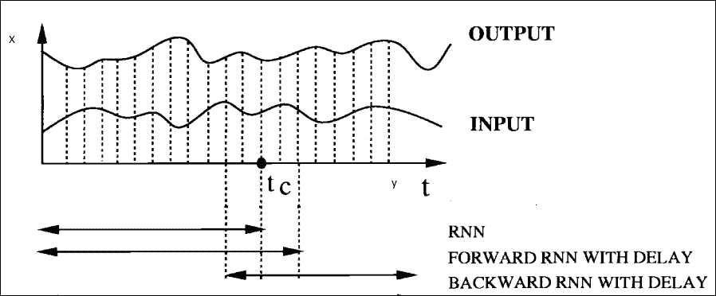

# 第四章：循环神经网络

|   | *我认为大脑本质上是一个计算机，意识就像一个计算机程序。当计算机关机时，程序就会停止运行。从理论上讲，它可以在神经网络上重新创建，但这将非常困难，因为这需要重建一个人的所有记忆。* |   |
| --- | --- | --- |
|   | --*斯蒂芬·霍金* |

解决每个问题时，人们并不是从零开始思考。我们的思维是非易失性的，它是持久的，就像计算机的**只读存储器**（**ROM**）一样。当我们阅读一篇文章时，我们从对句子中早期单词的理解中理解每个单词的含义。

让我们通过一个现实生活中的例子来进一步解释这个问题。假设我们想基于视频中每个时刻发生的事件进行分类。由于我们没有视频早期事件的信息，对于传统深度神经网络来说，要找到一些区分这些事件的理由将是一个繁琐的任务。传统的深度神经网络无法执行这个操作，因此，这是它们的一个主要限制。

**循环神经网络**（**RNN**）[103]是一种特殊类型的神经网络，能够为这些困难的机器学习和深度学习问题提供许多神秘的解决方案。在上一章，我们讨论了卷积神经网络，它专门处理一组值`X`（例如，一张图像）。类似地，RNN 在处理一系列值时具有神奇的能力，*x (0)*，*x (1)*，*x(2)*，*...*，*x(τ-1)*。为了在本章开始讨论 RNN，我们首先将这个网络与卷积神经网络进行对比，这样你就能对其基本功能有所了解，并大致了解这个网络。

卷积神经网络可以轻松扩展到具有大宽度、高度和深度的图像。此外，一些卷积神经网络也可以处理变尺寸的图像。

相比之下，循环网络可以轻松扩展到长序列；此外，其中大多数还可以处理变长序列。为了处理这些任意长度的输入序列，RNN 利用其内部记忆。

RNN 通常在小批量序列上操作，并包含时间步索引`t`范围从`0`到*(τ-1)*的向量*x (t)*。序列长度*τ*对于小批量中的每个成员也可以有所不同。这个时间步索引不一定总是指代现实世界中的时间间隔，还可以指代序列内部的位置。

当 RNN 展开时，可以看作是一个深度神经网络，具有不定数量的层。然而，与常见的深度神经网络相比，RNN 的基本功能和架构有所不同。对于 RNN 来说，层的主要功能是带来记忆，而非层级处理。对于其他深度神经网络，输入仅在第一层提供，输出则在最后一层生成。然而，在 RNN 中，输入通常在每个时间步接收，并在这些时间间隔内计算相应的输出。随着每次网络迭代，新的信息被整合进每一层，网络可以根据这些信息进行无限次的更新。然而，在训练阶段，循环权重需要学习该传递哪些信息，哪些信息应该被拒绝。这个特点促使了一个特殊形式的 RNN 的出现，称为**长短期记忆（LSTM）**。

RNN 的起源可以追溯到几十年前[104]，但近年来，它已成为建模变长序列的热门选择。到目前为止，RNN 已经成功应用于许多问题，如学习词嵌入[105]、语言建模[106][107][108]、语音识别[109]和在线手写识别[110]。

本章中，我们将讨论你需要了解的关于 RNN 及其核心组件的所有内容。稍后，我们将介绍一种特殊类型的 RNN——长短期记忆（LSTM）。

本章的主题组织结构如下：

+   循环神经网络与其他神经网络有何不同？

+   循环神经网络（RNNs）

+   时间反向传播（BPTT）

+   长短期记忆（LSTM）

+   双向 RNN

+   分布式深度 RNN

+   使用 Deeplearning4j 的 RNN

# 循环神经网络与其他神经网络有何不同？

你可能好奇 RNN 的特别之处。本章的这一部分将讨论这些内容，接下来的章节将介绍这种类型网络的构建模块。

从第三章的*卷积神经网络*中，你可能已经感受到卷积网络的严峻限制，它们的 API 过于受限；网络只能接收固定大小的输入向量，并且输出也是固定大小的。此外，这些操作是通过预定义数量的中间层来执行的。使得 RNN 与其他神经网络区别开来的主要原因是它们能够处理长序列的向量，并生成不同的向量序列作为输出。

|   | *"如果训练传统神经网络是对函数的优化，那么训练循环网络就是对程序的优化"* |   |
| --- | --- | --- |
|   | --*亚历克斯·勒布伦* |

我们在*图 4.1*中展示了神经网络的不同类型输入输出关系，以描绘它们的差异。我们展示了以下五种输入输出关系：

+   **一对一**：这种输入输出关系适用于没有涉及 RNN 的传统神经网络处理。主要用于图像分类，其中映射是从固定大小的输入到固定大小的输出。

+   **一对多**：在这种关系中，输入和输出保持一对多的关系。模型通过一个固定大小的输入生成一系列输出。常见于模型接受图像（图像描述），并生成一串单词的句子。

+   **多对一**：在这种关系中，模型接受一系列输入，并输出一个单一的观测值。例如，在情感分析中，模型接受句子或评论，并将句子分类为积极或消极情感。

+   **多对多（可变中间状态）**：模型接收一系列输入，并生成相应的一系列输出。在这种类型中，RNN 读取英文句子，然后将其翻译并输出德文句子。用于机器翻译的场景。

+   **多对多（固定数量的中间状态）**：模型接收一个同步的输入序列，并生成一系列输出。例如，在视频分类中，我们可能希望对电影的每个事件进行分类。


图 4.1：图中的矩形表示序列向量的每个元素，箭头表示函数。输入向量以红色显示，输出向量以蓝色显示。绿色表示中间 RNN 的状态。图片来自[111]。

涉及序列的操作通常比具有固定大小输入和输出的网络更强大和更具吸引力。这些模型用于构建更智能的系统。在接下来的章节中，我们将看到如何构建 RNN，以及网络如何通过定义的函数将输入向量与其状态向量结合，从而生成新的状态向量。

# 循环神经网络（RNNs）

本节将讨论 RNN 的架构。我们将讨论时间如何展开以进行递归关系，并用于执行 RNN 中的计算。

## 展开递归计算

本节将解释展开递归关系如何导致深度网络结构中参数的共享，并将其转换为计算模型。

让我们考虑一个简单的动态系统递归形式：


在前面的方程中，*s ^((t))*表示系统在时间`t`的状态，*θ*是所有迭代中共享的相同参数。

这个方程被称为递归方程，因为计算*s ^((t))*需要*s ^((t-1))*返回的值，*s ^((t-1))*的值将需要*s ^((t-2))*的值，依此类推。

这是一个简单的动态系统表示，目的是帮助理解。让我们再举一个例子，其中动态系统由外部信号*x ^((t))*驱动，并产生输出*y ^((t))*：


理想情况下，RNN 遵循第二种类型的方程式，其中中间状态保留了关于整个过去序列的信息。然而，任何涉及递归的方程式都可以用来建模 RNN。

因此，与前馈神经网络类似，RNN 的隐藏（中间）层状态可以通过时间`t`的变量`h`来定义，如下所示：


我们将在本节的下一部分解释这个前面方程在 RNN 中的功能。到目前为止，为了说明这个隐藏层的功能，*图 4.2*展示了一个没有输出的简单递归网络。图的左侧显示了一个网络，其当前状态影响下一个状态。循环中间的框表示两个连续时间步之间的延迟。

如前面的递归方程所示，我们可以展开或展开时间中的隐藏状态。图像的右侧显示了递归网络的展开结构。在那里，通过在时间上展开，网络可以转换为前馈网络。

在展开的网络中，每个时间步的每个变量可以作为网络的一个独立节点展示。


图 4.2：图的左侧显示了递归网络，其中信息在每个时间步通过隐藏层多次传递。在右侧，我们有相同网络的展开结构。该网络的每个节点都与一个时间戳相关联。

因此，来自*图 4.2*的展开操作可以定义为一个操作，它将左侧电路的映射执行到右侧分割成多个状态的计算模型。

### 在时间上展开的模型的优势

在时间上展开一个网络带来了几个主要优势，列举如下：

+   一个没有参数的模型将需要大量的训练示例用于学习。然而，学习一个共享的单一模型有助于推广序列长度，甚至是那些在训练集中不存在的序列。这使得模型能够使用较少的训练示例来估计即将到来的序列数据。

+   不论序列的长度如何，模型的输入大小始终保持不变。在展开模型中，输入大小是指从隐藏状态到其他状态的过渡。然而，对于其他情况，它是根据状态历史的未定义长度来指定的。

+   由于参数共享，相同的过渡函数`f`可以在每个时间步使用相同的参数。

## RNN 的记忆

到目前为止，您可能已经对前馈神经网络和递归网络之间的主要区别有了一些了解。反馈循环作为其自己中间结果的输入被摄入到下一个状态中。每个输入序列的每个元素都执行相同的任务。因此，每个隐藏状态的输出取决于先前计算的结果。在实际情况中，每个隐藏状态不仅关注当前活动的输入序列，还关注它们在时间上一步感知到的内容。因此，理想情况下，每个隐藏状态必须具有上一步结果的所有信息。

由于需要持久信息，据说 RNN 具有其*自身的内存*。顺序信息作为循环网络隐藏状态中的记忆得以保留。这有助于处理随着每个新序列向前级联更新处理的即将到来的时间步骤。

*图 4.3*显示了 Elman 在 1990 年提出的*简单递归神经网络*的概念[112]；它展示了为 RNN 提供持久内存的插图。

在下一个图中，底部的字序列 AYSXWQF 的一部分代表当前正在考虑的输入示例。此输入示例的每个框表示一个单元池。向前箭头显示了从每个发送输入单元到下一个时间步的每个输出单元的完整可训练映射。上下文单元可以被视为持久内存单元，保留了前几步的输出。从隐藏层到上下文单元的向后箭头显示了输出的复制操作，用于评估下一个时间步的结果。

RNN 在时间步`t`的决策主要取决于其在*(t-1)*时间步的上一个决策。因此，可以推断出，与传统神经网络不同，RNN 有两个输入源。

其中一个是考虑中的当前输入单元，即下图中的`X`，另一个是从图中的上下文单元获取的来自最近过去的信息。这两个源结合起来决定当前时间步的输出。关于这点将在下一节中讨论。


图 4.3: 显示了具有 RNN 记忆概念的简单递归神经网络。

## 架构

因此，我们了解到 RNN 有它们的记忆，用于收集到目前为止计算的信息。在本节中，我们将讨论 RNN 的一般结构及其工作原理。

一个典型的 RNN，在进行前向计算时的展开（或展开）过程如 *图 4.4* 所示。

展开或展开一个网络意味着将网络写成完整的输入序列。让我们在开始解释结构之前举个例子。如果我们有一个包含 10 个单词的序列，那么 RNN 将展开成一个 10 层深的神经网络，每一层对应一个单词，如下图所示：


图 4.4：该图展示了一个 RNN 被展开或展开成完整网络的过程。

从输入 `x` 到输出 `o` 的时间段被分割成多个时间戳，分别为 *(t-1)*、`t`、*(t+1)*，以此类推。

RNN 的计算步骤和公式列举如下：

+   在前面的图中，`xₜ` 是时间步 `t` 的输入。图中展示了三个时间戳 *(t-1)*、`t` 和 *(t+1)* 的计算，其中输入分别为 *x[(t-1)]*、`xₜ` 和 *x[(t+1)]*。例如，`x₁` 和 `x₂` 是对应于序列中第二个和第三个单词的向量。

+   `sₜ` 表示时间步 `t` 的隐藏状态。从概念上讲，这个状态定义了神经网络的记忆。从数学角度来看，`sₜ` 的公式或记忆传递过程可以写成如下形式：


因此，隐藏状态是时间步 `xₜ` 输入与权重 `U` 的乘积，再加上上一个时间步的隐藏状态 *s[t-1]*，它与自身的隐藏状态到隐藏状态的矩阵 `W` 相乘。这种隐藏状态到隐藏状态的转换通常称为转移矩阵，类似于马尔可夫链。权重矩阵像滤波器一样起作用，主要决定过去隐藏状态和当前输入的重要性。当前状态产生的误差会通过反向传播返回，用于更新这些权重，直到误差被最小化到期望值。

### 注意

为了计算第一个隐藏状态，我们需要确定值 *s-1*，通常初始化为全零。

与传统的深度神经网络不同，在传统深度神经网络中，每一层的计算都使用不同的参数，而 RNN 在所有时间步中共享相同的参数（这里是 `U`、`V` 和 `W`），用来计算隐藏层的值。这使得神经网络的训练过程更为简便，因为我们需要学习的参数数量较少。

这份输入权重和隐藏状态的总和通过函数 `f` 被压缩，通常 `f` 是一个非线性函数，如逻辑 Sigmoid 函数、*tan h* 或 ReLU：

+   在最后一张图中，`oₜ` 表示在时间步 `t` 上的输出。步骤 `oₜ` 的输出仅基于时间 `t` 时刻网络可用的记忆进行计算。从理论上讲，虽然 RNN 可以持续记忆任意长的序列，但实际上这有点复杂，它们仅限于回溯几个时间步。数学上，这可以表示如下：


下一节将讨论如何通过反向传播训练一个 RNN。

# 时间反向传播（BPTT）

你已经学过，RNN 的主要需求是明确地分类顺序输入。误差的反向传播和梯度下降主要有助于执行这些任务。

对于前馈神经网络，反向传播是从最终的误差输出、权重和每个隐藏层的输入反向传递的。反向传播通过计算每个权重的偏导数来分配导致误差的权重：，其中 `E` 表示误差，`w` 是相应的权重。偏导数作用于学习率，梯度下降更新权重，以最小化误差率。

然而，一个 RNN 在没有直接使用反向传播的情况下，使用它的扩展，称为**时间反向传播**（**BPTT**）。在本节中，我们将讨论 BPTT，解释 RNN 的训练是如何进行的。

## 误差计算

**时间反向传播**（**BPTT**）学习算法是传统反向传播方法的自然扩展，它在一个完整展开的神经网络上计算梯度下降。

*图 4.5* 显示了展开的 RNN 中每个隐藏状态的相关误差。从数学上讲，每个状态相关的误差可以表示如下：


其中 `oₜ` 代表正确的输出，`oₜ` 代表在时间步 `t` 上的预测词。整个网络的总误差（成本函数）是通过对每个时间步的所有中间误差求和来计算的。

如果 RNN 展开为多个时间步，从 `t₀` 到 *t[n-1]*，则总误差可以表示如下：


图 4.5：该图显示了 RNN 每个时间步的相关误差。

在时间反向传播方法中，与传统方法不同，梯度下降的权重在每个时间步都会更新。

令 `w[ij]` 表示从神经元 `i` 到神经元 `j` 的权重连接。*η* 表示网络的学习率。因此，从数学上讲，梯度下降的权重更新在每个时间步可以通过以下方程表示：


# 长短期记忆（LSTM）

在本节中，我们将讨论一个特殊的单元，称为**长短期记忆**（**LSTM**），它被集成到 RNN 中。LSTM 的主要目的是防止 RNN 的一个重要问题——梯度消失问题。

## 深度反向传播在时间上的问题

与传统的前馈网络不同，由于 RNN 在狭窄时间步长下的展开，生成的前馈网络可能会非常深。这有时使得通过时间反向传播程序进行训练变得极其困难。

在第一章中，我们讨论了梯度消失问题。展开的 RNN 在进行反向传播时会遭遇梯度消失或梯度爆炸问题。

RNN 的每个状态都依赖于其输入和上一个输出与当前隐藏状态向量的乘积。反向传播过程中，梯度在逆向传播时执行相同的操作。展开的 RNN 的各层和多个时间步通过乘法相互关联，因此导数在每次传递时容易消失。

另一方面，小梯度趋向于变得更小，而大梯度在每次时间步传递时会变得更大。这分别导致了 RNN 的梯度消失或梯度爆炸问题。

## 长短期记忆

在 90 年代中期，德国研究人员 Sepp Hochreiter 和 Juergen Schmidhuber 提出了一种更新版的 RNN，加入了一个特殊单元，称为**长短期记忆**（**LSTM**）单元，以防止梯度爆炸或梯度消失问题[116]。

LSTM 有助于保持恒定的误差，这些误差可以在时间和网络的每一层中传播。恒定误差的保持使得展开的循环神经网络能够在极深的网络中学习，甚至展开到千个时间步。这最终打开了一条通道，可以远程关联因果关系。

LSTM 的架构通过特殊的记忆单元保持恒定的误差流。下图（*图 4.6*）展示了 LSTM 的基本框图，便于理解：


图 4.6：该图显示了长短期记忆的基本模型。

如前图所示，LSTM 单元由一个主要用于长期存储信息的记忆单元组成。三个专门的门神经元——写入门、读取门和遗忘门——保护着对该记忆单元的访问。与计算机的数字存储不同，门是模拟的，范围从 0 到 1。模拟设备相对于数字设备具有额外的优势，因为它们是可微分的，因此，适合反向传播方法的需要。LSTM 的门单元并不将信息作为输入传递给下一个神经元，而是设置与神经网络其他部分连接到记忆单元的相关权重。记忆单元基本上是一个自连接的线性神经元。当遗忘单元被重置（设置为`0`）时，记忆单元会将其内容写入自身并记住记忆的最后内容。对于写入操作，遗忘门和写入门应被设置（设置为`1`）。此外，当遗忘门输出接近`1`时，记忆单元实际上会忘记它之前存储的所有内容。现在，当写入门被设置时，它允许任何信息写入到记忆单元中。同样，当读取门输出`1`时，它将允许网络其他部分从记忆单元中读取数据。

如前所述，传统 RNN 计算梯度下降的问题在于，误差梯度在展开的网络中传播时迅速消失。加入 LSTM 单元后，从输出反向传播的误差值被收集到 LSTM 单元的记忆单元中。这一现象也被称为*误差旋转木马*。我们将通过以下示例来描述 LSTM 如何克服 RNN 的梯度消失问题：


图 4.7：该图显示了一个展开的长短期记忆单元，展示了如何通过三个门的帮助保护记忆单元的内容。

*图 4.7* 显示了一个通过时间展开的长短期记忆单元。我们将从初始化遗忘门的值为`1`和写入门的值为`1`开始。如前图所示，这将把信息`K`写入记忆单元。写入后，通过将遗忘门的值设置为`0`，该值将被保留在记忆单元中。然后我们将读取门的值设置为`1`，从记忆单元中读取并输出值`K`。从将`K`加载到记忆单元开始，到从记忆单元读取该值时，都会遵循时间上的反向传播过程。

从读取点接收到的误差导数通过网络进行反向传播，直到写入点，并且在过程中进行一些微小的变化。这是因为记忆神经元的线性特性。因此，通过这种操作，我们可以在不陷入梯度消失问题的情况下，保持数百步的误差导数。

因此，长期短期记忆（LSTM）之所以优于标准 RNN，有很多原因。LSTM 在未分割的连接手写识别中达到了目前已知的最佳结果[117]；同时，它也成功地应用于自动语音识别。到目前为止，主要的科技公司，如苹果、微软、谷歌、百度等，已经开始广泛使用 LSTM 网络作为其最新产品的主要组成部分[118]。

# 双向 RNN

本章将讨论 RNN 的主要局限性，以及如何通过双向 RNN（一种特殊类型的 RNN）克服这些不足。与传统的 RNN 不同，双向神经网络除了从过去获取输入，还能够从未来的上下文中获取信息以进行所需的预测。

## RNN 的不足之处

标准或单向 RNN 的计算能力受到限制，因为当前状态无法获得其未来的输入信息。在许多情况下，后续的未来输入信息对于序列预测变得极为重要。例如，在语音识别中，由于语言依赖性，作为音素的语音的适当解释可能依赖于接下来几句话中的词汇。手写识别中也可能出现类似的情况。

在一些修改版本的 RNN 中，这一特性通过在输出中插入一定数量的时间步（`N`）的延迟部分实现。这个延迟有助于捕捉未来的信息，以预测数据。虽然理论上，为了捕捉大部分可用的未来信息，`N` 的值可以设定得非常大，但在实际应用中，模型的预测能力实际上会随着 `N` 值的增大而减弱。文献 [113] 对这一推论给出了一些逻辑解释。随着 `N` 值的增大，RNN 的大部分计算能力仅仅集中在记忆输入信息上，以便从（*图 4.8* 中）预测结果，`y[tc]`。 (`t[c]` 在图中表示当前的时间步)。因此，模型会减少处理来自不同输入向量的预测知识的能力。以下 *图 4.8* 显示了不同类型的 RNN 所需的输入信息量：



图 4.8：该图展示了不同类型 RNN 使用的输入信息的可视化。[113]

## 克服不足的解决方案

为了克服上一节中解释的单向 RNN 的局限性，**双向递归网络**（**BRNN**）于 1997 年发明[113]。

双向 RNN 的基本思想是将常规 RNN 的隐藏状态分为两部分。一部分负责前向状态（正时间方向），另一部分负责后向状态（负时间方向）。从前向状态生成的输出与后向状态的输入不连接，反之亦然。一个简单的双向 RNN 版本，展开为三个时间步骤，如*图 4.9*所示。

通过这种结构，由于考虑了两个时间方向，当前评估的时间框架可以轻松使用来自过去和未来的输入信息。因此，当前输出的目标函数最终会最小化，因为我们不需要再增加延迟来包含未来的信息。对于常规的 RNN 来说，这在上一节中已经提到，是必须的。


图 4.9：该图展示了一个常规双向神经网络在三个时间步骤中的展开结构。

到目前为止，双向 RNN 在语音识别[114]、手写识别、生物信息学[115]等应用中被发现极为有用。

# 分布式深度 RNN

现在，既然你已经理解了 RNN 的应用、特点和结构，我们可以继续讨论如何将该网络作为分布式架构来使用。分布式 RNN 并不是一项容易的任务，因此，过去只有少数研究者在这方面进行了研究。尽管数据并行的基本概念对于所有网络都是相似的，但将 RNN 分布到多个服务器上需要一些头脑风暴，并且工作也相对繁琐。

最近，谷歌的一项研究[119]尝试在语音识别任务中将递归网络分布到多个服务器上。在这一节中，我们将讨论谷歌在分布式 RNN 方面的工作，并借助 Hadoop 来实现。

**异步随机梯度下降** (**ASGD**) 可以用于大规模训练循环神经网络（RNN）。ASGD 在深度神经网络的序列判别训练中表现出了特别的成功。

一个两层深度的长短期记忆（LSTM）RNN 用于构建长短期记忆网络。每个 LSTM 包含 800 个记忆单元。该论文使用了 1300 万个 LSTM 网络参数。对于单元的输入和输出，使用的是 tan h（双曲正切激活函数），对于写入、读取和遗忘门，使用的是逻辑 sigmoid 函数。

为了进行训练，输入的语音训练数据可以被拆分并随机打乱，分布到 Hadoop 框架的多个 DataNode 上。长短期记忆（LSTM）被部署到所有这些 DataNode 上，并在这些数据集上进行并行分布式训练。异步随机梯度下降用于此分布式训练。使用一个参数服务器，专门用于维护所有模型参数的当前状态。

为了在 Hadoop 上实现这个过程，每个 DataNode 必须对分区数据执行异步随机梯度下降操作。每个工作节点在每个 DataNode 的块上运行，逐个处理分区中的数据。对于每个语音片段，模型参数`P`会从前面提到的参数服务器中获取。工作节点计算每一帧的当前状态；解码语音片段以计算最终的外部梯度。更新后的参数然后被发送回参数服务器。工作节点随后会反复请求参数服务器提供最新的参数。然后，执行时间反向传播来计算下一组帧的更新参数梯度，并再次将其发送回参数服务器。

# 使用 Deeplearning4j 的 RNN

训练一个 RNN 并非易事，有时它可能会非常消耗计算资源。当训练数据涉及多个时间步长的长序列时，训练过程有时会变得异常困难。到目前为止，你已经对为何以及如何通过时间反向传播（backpropagation through time）来训练 RNN 有了更好的理论理解。在本节中，我们将考虑 RNN 应用的一个实际示例，并使用 Deeplearning4j 实现它。

现在，我们通过一个示例来说明如何使用 RNN 进行电影评论数据集的情感分析。该网络的主要问题是，将一段电影评论的原始文本作为输入，并根据内容将该评论分类为正面或负面。原始评论文本中的每个单词都使用 Word2Vec 模型转换为向量，然后输入到 RNN 中。该示例使用了一个大规模的原始电影评论数据集，数据来自[`ai.stanford.edu/~amaas/data/sentiment/`](http://ai.stanford.edu/~amaas/data/sentiment/)。

使用 DL4J 实现该模型的完整过程可以分为以下几个步骤：

1.  下载并提取原始电影评论数据。

1.  配置训练所需的网络配置，并评估性能。

1.  加载每个评论并使用 Word2Vec 模型将单词转换为向量。

1.  为多个预定义的训练周期（epoch）执行训练。对于每个周期，都会在测试集上评估性能。

1.  为了下载并提取电影评论数据，我们首先需要设置下载配置。以下代码片段设置了完成此操作所需的一切：

    ```py
            public static final String DATA_URL = 
            "http://ai.stanford.edu/~amaas/data/sentiment/*"; 

    ```

1.  在本地文件路径中设置训练和测试数据保存与提取的位置如下所示：

    ```py
            public static final String DATA_PATH = FilenameUtils.concat
            (System.getProperty("java.io.tmpdir"),local_file_path); 

    ```

1.  Google News 向量在本地文件系统中的位置如下所示：

    ```py
            public static final String WORD_VECTORS_PATH =    
            "/PATH_TO_YOUR_VECTORS/GoogleNews-vectors-negative300.bin"; 

    ```

1.  以下代码有助于将数据从 Web URL 下载到本地文件路径：

    ```py
            if( !archiveFile.exists() )
            { 
             System.out.println("Starting data download (80MB)..."); 
             FileUtils.copyURLToFile(new URL(DATA_URL), archiveFile); 
             System.out.println("Data (.tar.gz file) downloaded to " +  
             archiveFile.getAbsolutePath()); 

             extractTarGz(archizePath, DATA_PATH); 
            }
            else 
            {       
             System.out.println("Data (.tar.gz file) already exists at " +  
             archiveFile.getAbsolutePath()); 
             if( !extractedFile.exists())
               { 
                extractTarGz(archizePath, DATA_PATH); 
               } 
             else 
               { 
                System.out.println("Data (extracted) already exists at " +   
                extractedFile.getAbsolutePath()); 
               } 
             } 
             } 

    ```

1.  现在，随着我们下载了原始电影评论数据，我们可以开始设置我们的 RNN 进行数据训练。下载的数据被分割成多个例子，每个迷你批次会在 Hadoop 的每个工作节点上进行分配，以便进行分布式训练。为此，我们需要声明一个变量`batchSize`。这里，作为示例，我们使用每个批次包含 50 个例子，这些例子将被分配到多个 Hadoop 块中，工作节点将并行运行：

    ```py
          int batchSize = 50;      
          int vectorSize = 300; 
          int nEpochs = 5;  
          int truncateReviewsToLength = 300; 
     MultiLayerConfiguration conf = new             
          NeuralNetConfiguration.Builder()
     .optimizationAlgo(OptimizationAlgorithm.STOCHASTIC_GRADIENT_
             DESCENT)
     .iterations(1)
            .updater(Updater.RMSPROP) 
            .regularization(true).l2(1e-5) 
            .weightInit(WeightInit.XAVIER) 
            .gradientNormalization(GradientNormalization
            .ClipElementWiseAbsoluteValue).gradientNormalizationThreshold
            (1.0) 
            .learningRate(0.0018) 
            .list() 
            .layer(0, new GravesLSTM.Builder()
                  .nIn(vectorSize)
                  .nOut(200) 
                  .activation("softsign")
                  .build()) 
            .layer(1, new RnnOutputLayer.Builder()
                  .activation("softmax") 
                  .lossFunction(LossFunctions.LossFunction.MCXENT)
                  .nIn(200)
                  .nOut(2)
                  .build()) 
            .pretrain(false)
            .backprop(true)
            .build(); 

          MultiLayerNetwork net = new MultiLayerNetwork(conf); 
          net.init(); 
          net.setListeners(new ScoreIterationListener(1)); 

    ```

1.  在我们为 RNN 设置网络配置后，接下来我们可以继续进行训练操作，如下所示：

    ```py
          DataSetIterator train = new AsyncDataSetIterator(new    
          SentimentExampleIterator(DATA_PATH,wordVectors,
          batchSize,truncateReviewsToLength,true),1);
          DataSetIterator test = new AsyncDataSetIterator(new          
          SentimentExampleIterator(DATA_PATH,wordVectors,100,
          truncateReviewsToLength,false),1); 
          for( int i=0; i<nEpochs; i++ )
          { 
            net.fit(train); 
            train.reset(); 
            System.out.println("Epoch " + i + " complete. Starting    
            evaluation:"); 

    ```

    网络的测试通过创建`Evaluation`类的对象来执行，如下所示：

    ```py
            Evaluation evaluation = new Evaluation(); 
            while(test.hasNext())
            { 
              DataSet t = test.next(); 
              INDArray features = t.getFeatureMatrix(); 
              INDArray lables = t.getLabels(); 
              INDArray inMask = t.getFeaturesMaskArray(); 
              INDArray outMask = t.getLabelsMaskArray(); 
              INDArray predicted =  
              net.output(features,false,inMask,outMask); 
              evaluation.evalTimeSeries(lables,predicted,outMask); 
            } 
          test.reset(); 

          System.out.println(evaluation.stats()); 
          } 

    ```

# 概述

与其他传统的深度神经网络相比，RNN 具有特殊性，因为它们能够处理长时间序列的向量，并输出不同的向量序列。RNN 会随着时间展开，像前馈神经网络一样工作。RNN 的训练是通过时间反向传播（Backpropagation Through Time，简称 BPTT）来进行的，这是一种传统反向传播算法的扩展。RNN 的一个特殊单元，称为长短期记忆（Long Short-Term Memory，LSTM），有助于克服时间反向传播算法的局限性。

我们还讨论了双向 RNN，它是单向 RNN 的升级版本。单向 RNN 有时由于缺乏未来输入信息，无法正确预测。后来，我们讨论了深度 RNN 的分布式处理及其在 Deeplearning4j 中的实现。可以使用异步随机梯度下降（Asynchronous stochastic gradient descent）来训练分布式 RNN。在下一章中，我们将讨论另一种深度神经网络模型，称为限制玻尔兹曼机（Restricted Boltzmann machine）。
