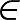
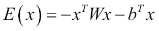

# 第五章：限制玻尔兹曼机

|   | *"我无法创造的东西，我就无法理解。"* |   |
| --- | --- | --- |
|   | --*理查德·费曼* |

到目前为止，我们在本书中仅讨论了判别模型。这些模型在深度学习中的应用是建模未观察到的变量 y 与已观察到的变量 `x` 之间的依赖关系。数学上，它被公式化为 *P(y|x)*。在本章中，我们将讨论用于深度学习的深度生成模型。

生成模型是指在给定一些隐藏参数时，可以随机生成一些可观测数据值的模型。该模型基于标签序列和观测的联合概率分布。

生成模型在机器学习和深度学习中的应用，可以作为生成条件概率密度函数的中间步骤，或直接从概率密度函数中建模观测值。

**限制玻尔兹曼机**（**RBM**）是本章讨论的一个流行生成模型。RBM 基本上是概率图模型，也可以解释为随机神经网络。

### 注意

**随机神经网络**可以定义为一种通过向网络中引入随机变化生成的人工神经网络。随机变化可以通过多种方式提供，例如通过提供随机权重或通过为网络的神经元提供随机传输函数。

在本章中，我们将讨论一种特殊类型的玻尔兹曼机，称为 RBM，这是本章的主要内容。我们将讨论**基于能量的模型**（**EBM**）如何与 RBM 相关，以及它们的功能。随后，我们将介绍**深度置信网络**（**DBN**），它是 RBM 的扩展。接下来，本章将讨论这些模型在分布式环境中的大规模实现。最后，本章将通过使用 Deeplearning4j 来给出 RBM 和 DBN 的示例。

本章的组织结构如下：

+   基于能量的模型

+   玻尔兹曼机

+   限制玻尔兹曼机

+   卷积限制玻尔兹曼机

+   深度置信网络

+   分布式深度置信网络

+   使用 Deeplearning4j 实现 RBM 和 DBN

# 基于能量的模型

深度学习和统计建模的主要目标是编码变量之间的依赖关系。通过了解这些依赖关系，利用已知变量的值，模型可以回答关于未知变量的问题。

**基于能量的模型**（**EBMs**）[120]通过识别标量能量来收集变量的依赖关系，能量通常是每个变量配置的兼容性度量。在 EBM 中，通过设置观察到的变量的值并找到未观察到的变量的值，从而最小化总体能量，进而做出预测。EBM 中的学习包括制定一个能量函数，该函数将低能量分配给未观察到的变量的正确值，将较高能量分配给不正确的值。基于能量的学习可以视为分类、决策或预测任务中对概率估计的替代方法。

为了清楚地说明 EBM 是如何工作的，让我们看一个简单的例子。

如*图 5.1*所示，我们考虑两个变量集合，观察到的和未观察到的，分别为`X`和`Y`。图中的变量`X`表示图像的像素集合。变量`Y`是离散的，包含了对象分类所需的可能类别。在这种情况下，变量`Y`包含六个可能的值，即：飞机、动物、人类、汽车、卡车和以上都不是。该模型作为一个能量函数，用来衡量`X`和`Y`之间映射的正确性。

该模型采用一种约定，小的能量值表示变量的高度相关配置。另一方面，随着能量值的增加，变量的不兼容性也同样增加。与`X`和`Y`变量都相关的函数称为能量函数，表示如下：


在能量模型的情况下，输入`X`来自周围环境，模型生成一个输出 Y，更可能是关于观察到的变量`X`的答案。该模型需要生成一个值*Y^/*，该值从集合`Y`中选择，目的是使能量函数*E(Y, X)*的值最小。数学上，这可以表示为：


以下*图 5.1*展示了前一节中提到的整体示例的框图：


图 5.1：图中展示了一个能量模型，它计算了观察到的变量 X 和未观察到的变量 Y 之间的兼容性。图中的 X 是一组像素，而 Y 是用于对 X 进行分类的级别集合。模型发现，选择“动物”使得能量函数的值最小。图片来自[121]。

深度学习中的 EBM 与概率相关。概率与`e`的负能量幂成正比：


EBM 通过构造函数 *E(x)* 间接定义概率。指数函数确保概率始终大于零。这也意味着，在基于能量的模型中，可以自由选择能量函数，依据观察和未观察变量。尽管在能量模型中的分类概率可以任意接近零，但永远不会真正达到零。

上述方程形式的分布是一种 Boltzmann 分布。因此，EBM 通常被称为 **Boltzmann 机**。我们将在本章的后续部分解释 Boltzmann 机及其各种形式。

# Boltzmann 机

Boltzmann 机 [122] 是一种对称连接的神经元单元网络，用于对给定数据集进行随机决策。最初，它们被引入用于学习二进制向量的概率分布。Boltzmann 机具有简单的学习算法，这帮助它们推断并得出关于包含二进制向量的输入数据集的有趣结论。在具有多个特征检测层的网络中，学习算法变得非常缓慢；然而，每次只有一层特征检测器时，学习速度可以更快。

为了解决学习问题，Boltzmann 机由一组二进制数据向量组成，并更新相应连接上的权重，使得数据向量成为优化问题的良好解。为了求解学习问题，Boltzmann 机对这些权重进行许多小的更新。

Boltzmann 机在一个 d 维二进制向量上可以定义为 *x ˆ {0, 1} ^d*。如前一节所述，Boltzmann 机是一种能量基础的函数，其联合概率函数可以通过以下给定的能量函数定义：


这里，*E(x)* 是能量函数，`Z` 称为分配函数，它确认 *Σ[x ]P(x) = 1*。Boltzmann 机的能量函数如下所示：



这里，`W` 是模型参数的权重矩阵，`b` 是偏置参数的向量。

像 EBM 这样的 Boltzmann 机工作在观察变量和未观察变量上。当观察变量的数量不高时，Boltzmann 机工作效率更高。在这些情况下，未观察或隐藏变量像多层感知器的隐藏单元一样，展现出可见单元之间的高阶交互。

Boltzmann 机在隐藏层之间以及可见单元之间具有层间连接。*图 5.2* 展示了 Boltzmann 机的示意图：


图 5.2：图展示了一个简单 Boltzmann 机器的图形表示。图中的无向边表示节点之间的依赖关系，w[i,j] 表示节点 i 和 j 之间的权重。图中显示了 3 个隐藏节点和 4 个可见节点。

Boltzmann 机器的一个有趣特性是，随着隐藏单元的增加，学习规则不会发生变化。这最终有助于学习二进制特征，从而捕捉输入数据中的高阶结构。

Boltzmann 机行为作为离散变量上概率质量函数的通用逼近器。

### 注意

在统计学习中，**最大似然估计**（**MLE**）是一种通过找到一个或多个参数的值来最大化观测数据的似然性，从而确定统计模型参数的过程。

## Boltzmann 机器如何学习

Boltzmann 机器的学习算法通常基于最大似然估计方法。当 Boltzmann 机器使用基于最大似然估计的学习规则进行训练时，连接模型中两个单元的特定权重的更新将仅取决于这两个单元。网络中的其他单元参与修改生成的统计数据。因此，权重可以在不让网络其余部分知晓的情况下更新。换句话说，网络的其他部分只能知道最终的统计数据，但不知道这些统计数据是如何计算的。

## 缺陷

在 Boltzmann 机器中，具有许多隐藏层时，网络变得非常庞大，这使得模型通常变得较慢。Boltzmann 机器在大规模数据的学习中会停止学习，因为机器的大小也会同时呈指数增长。对于一个大网络，权重通常非常大，并且平衡分布也会变得非常高。不幸的是，这为 Boltzmann 机器带来了一个显著问题，最终导致达到分布平衡状态的时间更长。

这个限制可以通过限制两层之间的连接来克服，从而通过一次学习一个潜在层来简化学习算法。

# 限制性 Boltzmann 机器

**限制性 Boltzmann 机器**（**RBM**）是深度学习中使用的深度概率模型构建块的经典例子。RBM 本身并不是一个深度模型，但可以作为构建其他深度模型的构建块。实际上，RBM 是一种无向概率图模型，由一层观察变量和一层隐藏变量组成，可以用于学习输入的表示。在本节中，我们将解释如何使用 RBM 构建许多更深层次的模型。

让我们通过两个例子来查看 RBM 的使用案例。RBM 主要在因子分析的二进制版本上运行。假设我们有一家餐厅，并且希望请顾客根据 0 到 5 的评分尺度来评价食物。在传统方法中，我们将试图根据变量的隐藏因素来解释每个食物项和顾客。例如，像意大利面和千层面这样的食物会与意大利因素有很强的关联。另一方面，RBM 采用不同的方法。它不是让每个顾客根据连续的评分尺度来评价食物项，而是简单地询问他们是否喜欢该食物，然后 RBM 将尝试推断出各种潜在因素，这些因素有助于解释每个顾客的食物选择激活。

另一个例子是根据某人喜欢的电影类型来猜测他可能选择的电影。假设 X 先生提供了他对给定的五部电影的二进制偏好。RBM 的任务是根据隐藏单元激活他的偏好。因此，在这种情况下，这五部电影会向所有隐藏单元发送消息，要求它们更新自身。然后，RBM 会根据之前提供给该人的一些偏好，以较高的概率激活隐藏单元。

## 基本架构

RBM 是一个浅层的、两层的神经网络，用作构建深度模型的基础模块。RBM 的第一层称为观测层或可见层，第二层称为潜在层或隐藏层。它是一个二分图，不允许在观测层的任何变量之间，或潜在层的任何单元之间有连接。如*图 5.3*所示，层与层之间没有内部通信。由于这种限制，该模型被称为**限制玻尔兹曼机**。每个节点用于计算，处理输入，并通过做出随机（随机确定）决策来参与输出，决定是否传递该输入。

### 注意

二分图是一种图，其中顶点可以分为两个不相交的集合，使得每条边都连接一个集合的顶点到另一个集合的顶点。然而，同一集合的顶点之间没有连接。顶点集合通常被称为图的一个部分。

RBM 两层结构的主要直觉是，有一些可见的随机变量（例如，来自不同顾客的食物评价）和一些潜在的随机变量（如菜系、顾客的国籍或其他内部因素），训练 RBM 的任务是找到这两组变量如何相互连接的概率。

为了数学地构建 RBM 的能量函数，我们用`v`表示由一组*n[v]*个二进制变量组成的观测层。隐藏层或潜在层由*n[h]*个二进制随机变量表示，记作`h`。

类似于玻尔兹曼机，RBM 也是一个基于能量的模型，其中联合概率分布由其能量函数决定：


图 5.3：图示展示了一个简单的 RBM。该模型是一个对称的二分图，其中每个隐藏节点与每个可见节点相连接。隐藏单元表示为 h[i]，可见单元表示为 v[i]

一个具有二进制可见单元和潜在单元的 RBM 的能量函数如下：


在这里，`a`、`b` 和 `W` 是不受约束的、可学习的实值参数。从前面的*图 5.3*中，我们可以看到模型被分为两组变量，`v` 和 `h`。单元之间的交互由矩阵`W`描述。

## RBM 如何工作

既然我们现在已经了解了 RBM 的基本架构，在这一节中，我们将讨论该模型的基本工作过程。RBM 从一个数据集中接受输入数据进行学习。模型的每个可见节点从数据集中的一项数据接收一个低级特征。例如，对于灰度图像，最低级的项目将是图像中的一个像素值，模型的可见节点将接收该像素值。因此，如果图像数据集有 n 个像素，处理这些像素的神经网络也必须具有 n 个输入节点在可见层上：


图 5.4：图示展示了一个输入路径的 RBM 计算

现在，让我们将一个单一像素值`p`在这两层网络中进行传播。在隐藏层的第一个节点，`p`与权重`w`相乘，并加上偏置。最终结果通过激活函数生成节点的输出。该操作产生了结果，可以称之为通过该节点传递的信号强度，给定输入像素`p`。*图 5.4*展示了单个输入 RBM 所涉及的计算的可视化表示。


RBM 的每个可见节点都与一个独立的权重相关联。来自不同单元的输入在一个隐藏节点中合并。每个来自输入的`p`（像素）都会与其相关的独立权重相乘。所有的乘积会被加总并加入偏置。然后，该结果通过激活函数生成节点的输出。以下*图 5.5*展示了多个输入到可见层 RBM 时所涉及的计算的可视化表示：


图 5.5：图示展示了具有多个输入和一个隐藏单元的 RBM 计算

上述*图 5.5*展示了与每个可见节点相关的权重是如何用于计算来自隐藏节点的最终结果的。


图 5.6：该图展示了在 RBM 中多个可见单元和隐藏单元的计算过程

如前所述，RBM 类似于一个二分图。进一步来说，机器的结构基本上类似于一个对称的二分图，因为所有从可见节点接收到的输入都被传递给 RBM 的所有潜在节点。

对于每个隐藏节点，每个输入 p 都会与其相应的权重`w`相乘。因此，对于单个输入`p`和`m`个隐藏单元，该输入将有`m`个与之相关的权重。在*图 5.6*中，输入`p`将有三个权重，总共形成 12 个权重：四个来自可见层的输入节点和三个来自下一层的隐藏节点。两层之间所有相关的权重形成一个矩阵，其中行数等于可见节点的数量，列数等于隐藏单元的数量。在前面的图中，第二层的每个隐藏节点都接受四个输入，并与它们各自的权重相乘。所有乘积的总和再加上一个偏置。这一结果会通过一个激活算法，以生成每个隐藏层的一个输出。*图 5.6*表示了在这种情况下发生的整体计算过程。

通过堆叠 RBM，它将形成一个更深的神经网络，其中第一个隐藏层的输出将作为输入传递给下一个隐藏层。这将通过你使用的隐藏层的数量传播，直到到达所需的分类层。在接下来的部分，我们将解释如何将 RBM 用作深度神经网络。

# 卷积限制玻尔兹曼机

高维度输入，如图像或视频，会给传统的机器学习模型带来巨大的内存、计算和操作压力。在第三章中，我们展示了如何通过用小核的离散卷积运算替代矩阵乘法来解决这些问题。接下来，Desjardins 和 Bengio [123] 也表明，当这种方法应用于 RBM 时，它同样能有效工作。在本节中，我们将讨论该模型的功能。


图 5.7：该图展示了 RBM 的观察变量或可见单元如何与图像的小批量相关联，以计算最终结果。权重连接表示一组滤波器

进一步来说，在普通的 RBM 中，可见单元通过不同的参数和权重与所有隐藏变量直接相关。为了描述图像的空间局部特征，理想情况下需要较少的参数，这有助于更好的泛化。这有助于从高维图像中检测和提取相同的局部特征。因此，使用 RBM 从图像中提取所有全局特征进行物体检测并不太理想，尤其是对于高维图像。一个简单的方法是使用从输入图像中抽样的小批量，在 Hadoop 的 Datanodes 上分块训练 RBM，以生成局部特征。这个方法的表示称为基于补丁的 RBM，如*图 5.7*所示。然而，这种方法有一些潜在的局限性。在 Hadoop 的分布式环境中使用的基于补丁的 RBM 没有遵循小批量的空间关系，而是将每个图像的小批量视为来自附近补丁的独立补丁。这使得从相邻补丁中提取的特征是独立的，并且可能存在显著的冗余。

为了处理这种情况，使用了**卷积限制玻尔兹曼机**（**CRBM**），它是传统 RBM 模型的扩展。CRBM 在结构上与 RBM 几乎相似，是一个两层模型，其中可见和隐藏随机变量被结构化为矩阵。因此，在 CRBM 中，可以为可见单元和隐藏单元定义局部性和邻域。在 CRBM 中，可见矩阵表示图像，矩阵的小窗口定义了图像的小批量。CRBM 的隐藏单元被划分为不同的特征图，以定位可见单元多个位置上多个特征的存在。特征图中的单元表示在可见单元的不同位置上相同的特征。CRBM 的隐藏-可见连接是完全局部的，权重通常会分配到隐藏单元的簇中。

CRBM 的隐藏单元用于从重叠的小批量可见单元中提取特征。此外，相邻小批量的特征互为补充，并协同工作以建模输入图像。

*图 5.8* 显示了一个 CRBM（卷积限制玻尔兹曼机），其中包含一个可见单元矩阵`V`和一个隐藏单元矩阵`H`，它们通过*K 3`3`的滤波器连接，即**W[1]**，**W[2]**，**W[3]**，...**W[K]**。图中的隐藏单元被分成`K`个子矩阵，称为特征图，**H[1]**，**H[2]**，...**H[K]**。每个隐藏单元**H[i]**表示在可见单元的`3`3*邻域中某个特征的存在。

与基于补丁的 RBM 不同，CRBM 是在整个输入图像或图像的大区域上进行训练，以学习局部特征，并利用重叠的迷你批次的空间关系，这些迷你批次通过 Hadoop 以分布式方式处理。在 CRBM 中，重叠迷你批次的隐藏单元相互依赖并合作。因此，一旦解释了一个隐藏单元，就不需要在邻近的重叠迷你批次中再次解释它。这反过来有助于减少特征的冗余。


图 5.8：图中展示了 CRBM 中的计算过程。

## 堆叠卷积限制玻尔兹曼机

CRBM 可以堆叠在一起形成深度神经网络。**堆叠卷积限制玻尔兹曼机**（**Stacked CRBM**）可以层层训练，采用自下而上的方法，类似于全连接神经网络的层级训练。在每个 CRBM 滤波层后，在堆叠网络中实现了一种确定性的子采样方法。对于特征的子采样，采用最大池化在非重叠的图像区域中进行。正如在第三章中解释的，*卷积神经网络*有助于最小化特征的维度。除此之外，它使得特征对小的平移具有鲁棒性，并有助于将更高层次的特征传播到输入图像的区域中。

深度 CRBM 需要一个池化操作，以便每一层的空间大小逐渐减小。尽管大多数传统的卷积模型可以很好地处理各种空间大小的输入，但对于玻尔兹曼机来说，由于几个原因，改变输入大小变得有些困难。首先，能量函数的分区函数会随输入大小的变化而变化。其次，卷积网络通过增加池化函数的大小，使其与输入大小成比例，从而实现尺寸不变性。然而，对于玻尔兹曼机来说，要实现池化区域的缩放是非常困难的。

对于 CRBM，位于图像边界的像素也会带来困难，尤其是考虑到玻尔兹曼机本身具有对称性。这个问题可以通过隐式零填充输入来解决。请注意，零填充输入通常是由于输入像素较少，这些像素可能在需要时没有被激活。

# 深度信念网络

**深度信念网络**（**DBN**）是 2006 至 2007 年间最受欢迎的非卷积模型之一，可以成功地作为深度神经网络进行部署[124][125]。深度学习的复兴很可能始于 2006 年 DBN 的发明。在 DBN 出现之前，优化深度模型是非常困难的。通过超越**支持向量机**（**SVM**），DBN 证明了深度模型的成功可能性；尽管与其他生成性或无监督学习算法相比，DBN 的流行度有所下降，且如今很少使用，但它们仍在深度学习历史中扮演着非常重要的角色。

### 注意

只有一个隐藏层的 DBN 实际上就是一个 RBM。

DBN 是生成性模型，由多个隐藏变量层组成。隐藏变量通常是二进制的；然而，可见单元可能包含二进制或实数值。在 DBN 中，每一层的每个单元都与其相邻层的每个单元连接，尽管也可以有稀疏连接的 DBN。各中间层之间没有连接。如*图 5.9*所示，DBN 基本上是一个由若干 RBM 构成的多层网络。顶层两个层之间的连接是无向的。而其他所有层之间的连接都是有向的，箭头指向数据最接近的层。

除了堆叠中的第一层和最后一层外，DBN 的每一层都有两个作用。首先，它作为前一层的隐藏层，同时作为下一层的可见层或输入层。DBN 主要用于聚类、识别和生成视频序列和图像。


图 5.9：图中展示了由三个 RBM 组成的 DBN

## 贪婪逐层训练

2006 年提出了一种贪婪逐层训练算法用于训练深度信念网络（DBN）[126]。该算法一次训练一个层。采用这种方法时，首先训练一个受限玻尔兹曼机（RBM），它以实际数据为输入并对其进行建模。

一个单层的 DBN 就是一个 RBM。贪婪逐层方法的核心理念是，在训练一个 m 层 DBN 的顶层 RBM 后，解释参数的方式会随着添加(*m+1*)层 DBN 而发生变化。在 RBM 中，层(*m-1*)和`m`之间，层`m`的概率分布是基于该 RBM 的参数来定义的。然而，在 DBN 的情况下，层`m`的概率分布是基于上层的参数来定义的。这个过程可以无限重复，直到连接上任意数量的 DBN 层。

# 分布式深度信念网络

到目前为止，DBN 在许多应用中取得了显著成绩，如语音和电话识别[127]、信息检索[128]、人体运动建模[129]等。然而，RBM 和 DBN 的顺序实现存在各种限制。对于大规模数据集，由于涉及长时间的计算、算法对内存的高需求等，模型在应用中会表现出各种不足。为了处理大数据，RBM 和 DBN 需要分布式计算来提供可扩展、一致和高效的学习。

为了使 DBN 能够适应存储在计算机集群上的大规模数据集，DBN 应该采用带有 Hadoop 和 Map-Reduce 的分布式学习方法。[130]中的论文展示了 RBM 每一层的键值对方法，其中预训练是在 Map-Reduce 框架的分布式环境中通过层级进行的。学习通过在 Hadoop 上执行迭代计算方法进行 RBM 的训练。因此，DBN 的分布式训练通过堆叠多个 RBM 来实现。  

## 限制玻尔兹曼机的分布式训练  

如前所述，RBM 的能量函数如下：  

  

设输入数据集 *I = {x[i] = i= 1, 2,... N}* 用于限制玻尔兹曼机（RBM）的分布式学习。如前所述，针对深度信念网络（DBN）的学习，RBM 每一层的权重和偏置首先通过贪心层级无监督训练进行初始化。分布式训练的目的是学习权重和相关的偏置 `b` 和 `c`。对于使用 Map-Reduce 的分布式 RBM，每个训练周期中都需要进行一次 Map-Reduce 作业。  

对于矩阵乘法，使用吉布斯采样，RBM 的训练大部分计算时间都消耗在此。因此，为了减少计算时间，吉布斯采样可以在 Map 阶段分布到多个数据集上，这些数据集在 Hadoop 框架上运行不同的 Datanode。  

### 注意  

吉布斯采样是一种**马尔可夫链蒙特卡洛**（**MCMC**）算法，用于确定从指定的多元概率分布中估计的观察序列，当传统的直接采样变得困难时。  

最初，训练所需的不同参数，如可见层和隐藏层的神经元数量、输入层偏置 `a`、隐藏层偏置 `b`、权重 `W`、周期数（假设为 `N`）、学习率等，都被初始化。周期数表示映射和归约阶段将迭代 `N` 次。对于每个周期，映射器会针对每个数据节点块运行，并执行 Gibbs 采样来计算 `W`、`a` 和 `b` 的近似梯度。然后，归约器使用计算出的增量更新这些参数，以便为下一个周期做好准备。因此，从第二个周期开始，映射阶段的输入值，即 `W`、`a` 和 `b` 的更新值，是从前一个周期的归约器输出中计算得出的。

输入数据集 I 被拆分成多个块，并存储在不同的块中，分别在每个数据节点上运行。每个在这些块上运行的映射器将计算该块中存储的特定数据块的权重和偏置的近似梯度。然后，归约器计算各自参数的增量，并相应地更新它们。这个过程将得到的参数和更新后的值视为该周期 Map-Reduce 阶段的最终结果。每个周期结束后，归约器决定是否存储学习到的权重，如果是最后一个周期，或者是否增加周期索引并将键值对传播给下一个映射器。

## 深度置信网络的分布式训练

对于具有 `L` 个隐藏层的 DBN 的分布式训练，学习是通过预训练 `L` 个 RBM 完成的。底层 RBM 的训练如前所述，但对于其余的 (*L-1*) 个 RBM，每一层的输入数据集都会发生变化。

对于 *m[th]* 层的输入数据（*L  ¥ m > 1*）RBM，将会是 (*m-1*)[th] 层 RBM 隐藏节点的条件概率：


### 分布式反向传播算法

这是分布式反向传播算法的第二阶段，用于调优全局网络。在此过程中，计算权重的梯度时，前向传播和反向传播方法占据了大部分的计算时间。因此，为了加快每个周期的执行速度，该过程应在每个输入数据集的小批量上并行运行。

在该过程的第一步中，将 `L` 层 DBN 的学习权重，即 *W1*，*W2*，...*WL* 加载到内存中，并初始化其他超参数。在此微调阶段，映射和归约阶段的主要任务与 RBM 的分布式训练类似。映射器将确定权重的梯度，并最终更新权重增量。归约器从一个或多个权重中更新权重增量，并将输出传递给映射器以执行下一次迭代。

此过程的主要目的是通过将标签层放置在全局网络之上，并迭代调整整个层的权重，从而获得模型的一些判别能力。

### RBM 和 DBN 的性能评估

论文[130]在 Hadoop 集群上进行了分布式 RBM 和 DBN 的实验，以便与传统的顺序方法进行比较研究。实验在 MNIST 数据集上进行，用于手写数字识别。训练集包含 60,000 张图片，测试集包含 10,000 张图片。HDFS 的块大小设置为 64MB，副本因子为 4。所有节点设置为最多运行 26 个映射器和 4 个减少器。有兴趣的读者可以修改块大小和副本因子，查看这些参数下实验的最终结果。

#### 训练时间的显著提升

本实验的目的是比较分布式 RBM 和 DBN 与传统训练策略（顺序训练）在训练时间上的差异。顺序程序在一颗 CPU 上执行，而分布式程序则在一个节点的 16 颗 CPU 上执行。两次实验均在前面提到的 MNIST 数据集上进行。所得结果汇总在*表 5.1*和*表 5.2*中：


表 5.1：该表格表示完成分布式和顺序 RBM 训练所需的时间


表 5.2：该表格表示完成分布式和顺序 DBN 训练所需的时间

表中显示的数据清楚地描述了使用 Hadoop 分布式 RBM 和 DBN 相较于传统顺序方法的优势。分布式方法在模型训练时间上显示出了显著的提升。此外，使用 Hadoop 框架进行分布的一个关键优势是，它能随着训练数据集的大小和用于分布的机器数量的增加而表现出卓越的扩展性。

本章的下一部分将演示使用 Deeplearning4j 的两种模型的编程方法。

# 使用 Deeplearning4j 的实现

本章的这一部分将提供如何使用 Deeplearning4j 编写 RBM 和 DBN 代码的基本思路。读者将能够学习本章中提到的各种超参数的语法。

为了使用 Deeplearning4j 实现 RBM 和 DBN，整个思路非常简单。总体实现可以分为三个核心阶段：加载数据或数据准备、网络配置、以及模型的训练和评估。

在本节中，我们将首先讨论在 IrisDataSet 上使用 RBM，然后我们将讨论 DBN 的实现。

## 限制玻尔兹曼机

对于 RBM 的构建和训练，首先我们需要定义并初始化模型所需的超参数：

```py
Nd4j.MAX_SLICES_TO_PRINT = -1; 
Nd4j.MAX_ELEMENTS_PER_SLICE = -1; 
Nd4j.ENFORCE_NUMERICAL_STABILITY = true; 
final int numRows = 4; 
final int numColumns = 1; 
int outputNum = 10; 
int numSamples = 150; 

```

这里的批次大小可以初始化为 `150`，意味着一次会将 `150` 个样本提交到 Hadoop 框架中。请放心，所有其他参数的初始化与我们在之前的章节中所做的一样。

```py
int batchSize = 150; 
int iterations = 100; 
int seed = 123; 
int listenerFreq = iterations/2; 

```

在下一阶段，Irisdataset 根据定义的 `batchsize` 和每批次的样本数量被加载到系统中：

```py
log.info("Load data....");
DataSetIterator iter = new IrisDataSetIterator(batchSize, numSamples); 
DataSet iris = iter.next();

```

在这里，RBM 作为一层使用 `NeuralNetConfiguration.Builder()` 创建。同样，限制玻尔兹曼机的对象用于存储属性，例如应用于观察层和隐藏层的变换——分别是高斯变换和修正线性变换：

```py
NeuralNetConfiguration conf = new NeuralNetConfiguration.Builder()
.regularization(true)       
 .miniBatch(true) 
.layer(new RBM.Builder().l2(1e-1).l1(1e-3) 
    .nIn(numRows * numColumns)       
    .nOut(outputNum)
```

`ReLU` 被用作激活函数：

```py
.activation("relu") 

```

`weightInit()` 函数用于初始化权重，它表示用于放大每个节点输入信号的系数的初始值：

```py
.weightInit(WeightInit.RELU) 
 .lossFunction(LossFunctions.LossFunction.RECONSTRUCTION
     _CROSSENTROPY.k(3) 

```

高斯变换用于可见单元，修正线性变换用于隐藏层。在 Deeplearning4j 中这非常简单。我们需要在 `.visibleUnit` 和 `.hiddenUnit` 方法中传递参数 `VisibleUnit.GAUSSIAN` 和 `HiddenUnit.RECTIFIED`：

```py
.hiddenUnit(HiddenUnit.RECTIFIED).visibleUnit(VisibleUnit.GAUSSIAN) 
 .updater(Updater.ADAGRAD).gradientNormalization(Gradient
     Normalization.ClipL2PerLayer) 
    .build())       
  .seed(seed)    
  .iterations(iterations) 

```

反向传播的步长在此处定义：

```py
.learningRate(1e-3)
  .optimizationAlgo(OptimizationAlgorithm.LBFGS)       
  .build();       

Layer model = LayerFactories.getFactory(conf.getLayer()).create(conf);       
model.setListeners(new ScoreIterationListener(listenerFreq));

log.info("Evaluate weights....");       
INDArray w = model.getParam(DefaultParamInitializer.WEIGHT_KEY);       
log.info("Weights: " + w);
```

为了扩展数据集，可以通过调用 Dataset 类的对象来执行 `scale()`：

```py
iris.scale(); 

```

在先前过程中的评估完成后，模型现在已完全准备好进行训练。它可以以类似的方式使用 `fit()` 方法进行训练，和之前的模型一样，并传递 `getFeatureMatrix` 作为参数：

```py
log.info("Train model....");       
for(int i = 0; i < 20; i++)
  {       
   log.info("Epoch "+i+":");model.fit(iris.getFeatureMatrix()); }
```

## 深度置信网络

如本章所述，DBN 是多个 RBM 的堆叠版本。在这一部分，我们将展示如何使用 Deeplearning4j 编程方式部署 DBN。程序的流程将遵循与其他模型相同的标准过程。使用 Deeplearning4j 实现简单的 DBN 非常简单。该示例将展示如何使用 DBN 训练和遍历输入的 MNIST 数据。

对于 MNIST 数据集，以下行指定了批次大小和示例数量，用户将指定这些参数以便一次性加载数据到 HDFS 中：

```py
log.info("Load data....");
DataSetIterator iter = new MnistDataSetIterator(batchSize,numSamples,
true);

```

在下一阶段，模型将通过堆叠 10 个 RBM 来构建。以下代码段将指定如何使用 Deeplearning4j 来完成此操作：

```py
log.info("Build model....");
MultiLayerConfiguration conf = new NeuralNetConfiguration.Builder()
  .seed(seed)
  .iterations(iterations)
  .optimizationAlgo(OptimizationAlgorithm.LINE_GRADIENT_DESCENT)
  .list()
  .layer(0, new RBM.Builder().nIn(numRows * numColumns).nOut(1000)
  .lossFunction(LossFunctions.LossFunction.RMSE_XENT).build())
  .layer(1, new RBM.Builder().nIn(1000).nOut(500)
  .lossFunction(LossFunctions.LossFunction.RMSE_XENT).build())
  .layer(2, new RBM.Builder().nIn(500).nOut(250)
  .lossFunction(LossFunctions.LossFunction.RMSE_XENT).build())
  .layer(3, new RBM.Builder().nIn(250).nOut(100)
  .lossFunction(LossFunctions.LossFunction.RMSE_XENT).build())
  .layer(4, new RBM.Builder().nIn(100).nOut(30)
  .lossFunction(LossFunctions.LossFunction.RMSE_XENT).build())  
  .layer(5, new RBM.Builder().nIn(30).nOut(100)
  .lossFunction(LossFunctions.LossFunction.RMSE_XENT).build())  
  .layer(6, new RBM.Builder().nIn(100).nOut(250)
  .lossFunction(LossFunctions.LossFunction.RMSE_XENT).build())
  .layer(7, new RBM.Builder().nIn(250).nOut(500)
  .lossFunction(LossFunctions.LossFunction.RMSE_XENT).build())
  .layer(8, new  RBM.Builder().nIn(500).nOut(1000)
  .lossFunction(LossFunctions.LossFunction.RMSE_XENT).build())
  .layer(9, new OutputLayer.Builder(LossFunctions.LossFunction.
   RMSE_XENT).nIn(1000).nOut(numRows*numColumns).build())
  .pretrain(true)
  .backprop(true)
  .build();

MultiLayerNetwork model = new MultiLayerNetwork(conf);
model.init();

```

在最后一部分，代码将使用加载的 MNIST 数据集进行训练，通过调用 `fit()` 方法：

```py
log.info("Train model....");
while(iter.hasNext())
  {
   DataSet next = iter.next();
   model.fit(new DataSet(next.getFeatureMatrix(),next.
   getFeatureMatrix()));
  }

```

执行代码后，过程将输出以下结果：

```py
Load data.... 
Build model.... 
Train model.... 

o.d.e.u.d.DeepAutoEncoderExample - Train model.... 
o.d.n.m.MultiLayerNetwork - Training on layer 1 with 1000 examples 
o.d.o.l.ScoreIterationListener - Score at iteration 0 is 394.462 
o.d.n.m.MultiLayerNetwork - Training on layer 2 with 1000 examples 
o.d.o.l.ScoreIterationListener - Score at iteration 1 is 506.785 
o.d.n.m.MultiLayerNetwork - Training on layer 3 with 1000 examples 
o.d.o.l.ScoreIterationListener - Score at iteration 2 is 255.582 
o.d.n.m.MultiLayerNetwork - Training on layer 4 with 1000 examples 
o.d.o.l.ScoreIterationListener - Score at iteration 3 is 128.227 

......................................... 

o.d.n.m.MultiLayerNetwork - Finetune phase 
o.d.o.l.ScoreIterationListener - Score at iteration 9 is 132.45428125 

........................... 

o.d.n.m.MultiLayerNetwork - Finetune phase 
o.d.o.l.ScoreIterationListener - Score at iteration 31 is 135.949859375 
o.d.o.l.ScoreIterationListener - Score at iteration 32 is 135.9501875 
o.d.n.m.MultiLayerNetwork - Training on layer 1 with 1000 examples 
o.d.o.l.ScoreIterationListener - Score at iteration 33 is 394.182 
o.d.n.m.MultiLayerNetwork - Training on layer 2 with 1000 examples 
o.d.o.l.ScoreIterationListener - Score at iteration 34 is 508.769 
o.d.n.m.MultiLayerNetwork - Training on layer 3 with 1000 examples 

............................ 

o.d.n.m.MultiLayerNetwork - Finetune phase 
o.d.o.l.ScoreIterationListener - Score at iteration 658 is 142.4304375 
o.d.o.l.ScoreIterationListener - Score at iteration 659 is 142.4311875 

```

# 总结

RBM 是一种生成模型，当输入一些潜在或隐藏参数时，它可以随机生成可见数据值。在本章中，我们讨论了 Boltzmann 机的概念和数学模型，它是一种基于能量的模型。接下来，本章讨论并给出了 RBM 的可视化表示。此外，本章还讨论了 CRBM，它是卷积和 RBM 的结合，用于提取高维图像的特征。然后，我们介绍了流行的 DBN，它实际上是 RBM 的堆叠实现。最后，本章讨论了如何在 Hadoop 框架中分布式训练 RBM 和 DBN 的方法。

本章通过提供两种模型的代码示例来结束。本书的下一章将介绍一种名为自动编码器的生成模型及其多种形式，如去噪自动编码器、深度自动编码器等。
