# 第六章：自编码器

|   | *“人们担心计算机会变得太聪明，接管世界，但真正的问题是它们太愚蠢，已经接管了世界。”* |   |
| --- | --- | --- |
|   | --*Pedro Domingos* |

在上一章中，我们讨论了一个生成模型——限制玻尔兹曼机。在本章中，我们将介绍另一个生成模型——**自编码器**。自编码器是一种人工神经网络，通常用于降维、特征学习或特征提取。

在本章接下来的部分，我们将详细讨论自编码器的概念及其各种形式。我们还将解释 *正则化自编码器* 和 *稀疏自编码器* 这两个术语。将会介绍稀疏编码的概念，并探讨在稀疏自编码器中选择稀疏因子的标准。随后，我们将讨论深度学习模型——深度自编码器，并展示如何使用 Deeplearning4j 实现它。去噪自编码器是传统自编码器的另一种形式，将在本章的后部分讨论。

总体来说，本章分为几个小节，具体内容如下：

+   自编码器

+   稀疏自编码器

+   深度自编码器

+   去噪自编码器

+   自编码器的应用

# 自编码器

自编码器是一个具有一个隐藏层的神经网络，经过训练来学习一种身份函数，尝试将其输入重建为输出。换句话说，自编码器试图通过将输入数据投影到由隐藏节点定义的低维子空间来复制输入数据。隐藏层 `h` 描述了一种代码，用于表示输入数据及其结构。因此，这个隐藏层被迫从输入训练数据集中学习结构，以便在输出层能够复制输入。

自编码器的网络可以分为两个部分：编码器和解码器。编码器通过函数 *h=f (k)* 描述，解码器则通过 *r = g (h)* 尝试重建或复制。自编码器的基本思想应该是只复制输入中优先的那些方面，而不是创建输入的精确副本。它们的设计方式是限制隐藏层只做大致的复制，而不是从输入数据中复制所有内容。因此，如果自编码器学习到完全设置 *g(f(k) = k* 对所有 `k` 的值都成立，则它不能被称为有用的。*图 6.1* 表示自编码器的通用结构，通过内部隐藏层代码 `h` 将输入 `k` 映射到输出 `r`：

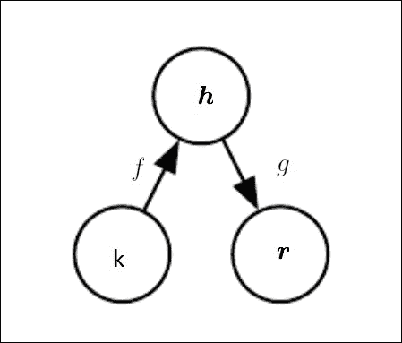

图 6.1：自编码器的通用框图。这里，输入 `k` 通过隐藏状态或内部表示 `h` 映射到输出 `r`。编码器 `f` 将输入 `k` 映射到隐藏状态 `h`，解码器 `g` 执行 `h` 到输出 `r` 的映射。

再举一个例子，考虑 *图 6.2*。该图展示了自编码器对输入图像块 `k` 的实际表示，它学习隐藏层 `h` 以输出 `r`。输入层 `k` 是图像块强度值的组合。隐藏层节点有助于将高维输入层投影到隐藏节点的低维激活值。这些隐藏节点的激活值合并在一起生成输出层 `r`，它是输入像素的近似。在理想情况下，隐藏层的节点数通常比输入层节点数少。因此，它们被迫以某种方式减少信息，以便仍能生成输出层。

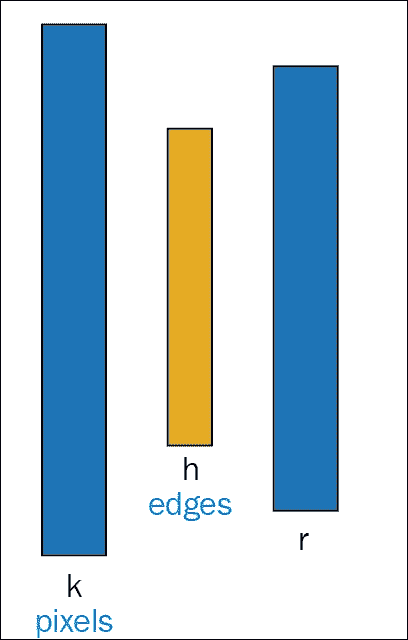

图 6.2：该图展示了一个实际示例，说明了自编码器如何从输入像素的近似中学习输出结构。

将输入的结构复制到输出可能听起来无效，但实际上，自编码器的最终结果并不完全依赖于解码器的输出。相反，训练自编码器的主要思想是复制输入任务的有用特性，这些特性将在隐藏层中体现。

从自编码器中提取所需特征或信息的常见方法之一是将隐藏层 `h` 的维度限制为比输入 `k` 的维度 `d` 小的维度 *d^/*，即 *d^/ < d*。这种结果较小的维度层可以称为输入 `k` 的损失压缩表示。隐藏层维度小于输入维度的自编码器被称为*欠完备*。

如上所述的学习过程可以通过最小化损失函数 `L` 来数学表示，公式如下：

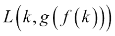

简单来说，`L` 可以定义为一个损失函数，它惩罚 *g (f (k))* 与输入 `k` 的差异。

使用线性解码器函数，自编码器学习形成与**主成分分析**（**PCA**）程序相似的空间基础。收敛后，隐藏层将形成由训练数据集的主子空间所生成的空间基础。然而，与 PCA 不同，这些过程不一定会生成正交向量。因此，具有非线性编码器函数 `f` 和非线性解码器函数 `g` 的自编码器可以学习 PCA 更强大的非线性泛化。这最终会大大增加编码器和解码器的容量。然而，随着容量的增加，自编码器开始表现出不希望出现的行为。

它接着学习将整个输入复制，而不注意提取所需的信息。从理论上讲，一个自编码器可能是一个一维编码，但实际上，一个非常强大的非线性编码器可以学习表示每个训练示例*k(i)*，并用代码`i`来表示。然后，解码器将这些整数*(i)*映射到特定训练示例的值。因此，使用具有更高容量的自编码器完全无法从输入数据集中复制仅有的有用特征。

### 注意

主成分分析（PCA）是一种统计方法，通过正交变换将一组可能相关的观测变量转化为一组线性相关的变量，称为主成分。在 PCA 方法中，主成分的数量小于或等于原始输入变量的数量。

类似于为欠完备自编码器提到的边缘情况问题，在该问题中，隐藏层的维度小于输入的维度，允许隐藏层或编码器的维度与输入相等的自编码器通常面临相同的问题。

一个隐藏代码维度大于输入维度的自编码器称为完备自编码器。这种类型的自编码器更加容易受到上述问题的影响。即使是线性编码器和解码器也能在不学习任何输入数据集的期望属性的情况下，完成将输入复制到输出的学习。

## 正则化自编码器

通过为隐藏层选择合适的维度，并根据模型分布的复杂性调整编码器和解码器的容量，任何类型架构的自编码器都可以成功构建。能够提供这种能力的自编码器被称为正则化自编码器。

除了能够将输入复制到输出的功能外，正则化自编码器还有一个损失函数，帮助模型具备其他特性。这些特性包括对缺失输入的鲁棒性、数据表示的稀疏性、表示的导数小等。即使是非线性和*过完备*的正则化自编码器，也能学习到关于数据分布的某些信息，而不考虑模型的容量。正则化自编码器[131]能够通过重构误差与正则化项之间的有效对立，捕捉训练分布的结构。

# 稀疏自编码器

分布式稀疏表示是深度学习算法中学习有用特征的关键之一。它不仅是数据表示的一种连贯模式，还帮助捕捉到大多数现实世界数据集的生成过程。在这一部分，我们将解释自编码器如何鼓励数据的稀疏性。我们将从介绍稀疏编码开始。当输入引发神经网络中相对少量的节点激活时，结合这些节点可以以稀疏的方式表示输入，那么这种编码就被称为稀疏编码。在深度学习技术中，类似的约束被用来生成稀疏编码模型，以实现常规自编码器，这些自编码器是通过名为稀疏自编码器的稀疏常数训练出来的。

## 稀疏编码

稀疏编码是一种无监督学习方法，用于学习*过完备*的基集合，以便以连贯高效的方式表示数据。稀疏编码的主要目标是确定一组向量*(n) v[i]*，使得输入向量`k`可以表示为这些向量的线性组合。

从数学角度来看，这可以表示为如下形式：

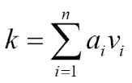

这里`a[i]`是与每个向量`v[i]`相关联的系数[.]

在 PCA 的帮助下，我们可以以一种连贯的方式学习一组完整的基向量；然而，我们希望学习一组*过完备*的基向量来表示输入向量`k` 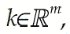，其中*n>m*。拥有*过完备*基的原因在于，基向量通常能够捕捉到输入数据固有的模式和结构。然而，过完备性有时会引发退化问题，即通过其基，系数`a[i]`无法唯一标识输入向量`k`。因此，引入了一种额外的标准，称为稀疏性，这在稀疏编码中起到了作用。

简单来说，稀疏性可以定义为具有少量非零组件，或者具有少量不接近零的组件。如果对于给定的输入向量，非零系数的数量或远离零的系数数量较少，则称系数集合`a[i]`为稀疏。

有了对稀疏编码的基本理解后，我们可以进入下一部分，探讨稀疏编码概念如何用于自编码器，从而生成稀疏自编码器。

## 稀疏自编码器

当输入数据集保持一定结构，并且输入特征之间存在相关性时，即便是一个简单的自编码器算法也能够发现这些相关性。此外，在这种情况下，一个简单的自编码器最终会学习到一个低维表示，类似于主成分分析（PCA）。

这种看法基于隐藏层数量相对较少的事实。然而，通过对网络施加其他约束条件，即便是大量隐藏层的网络，依然能够从输入向量中发现所需的特征。

稀疏自编码器通常用于学习特征，以执行其他任务，如分类。对于添加了稀疏性约束的自编码器，它必须响应其训练数据集的独特统计特征，而不仅仅是充当一个恒等函数。

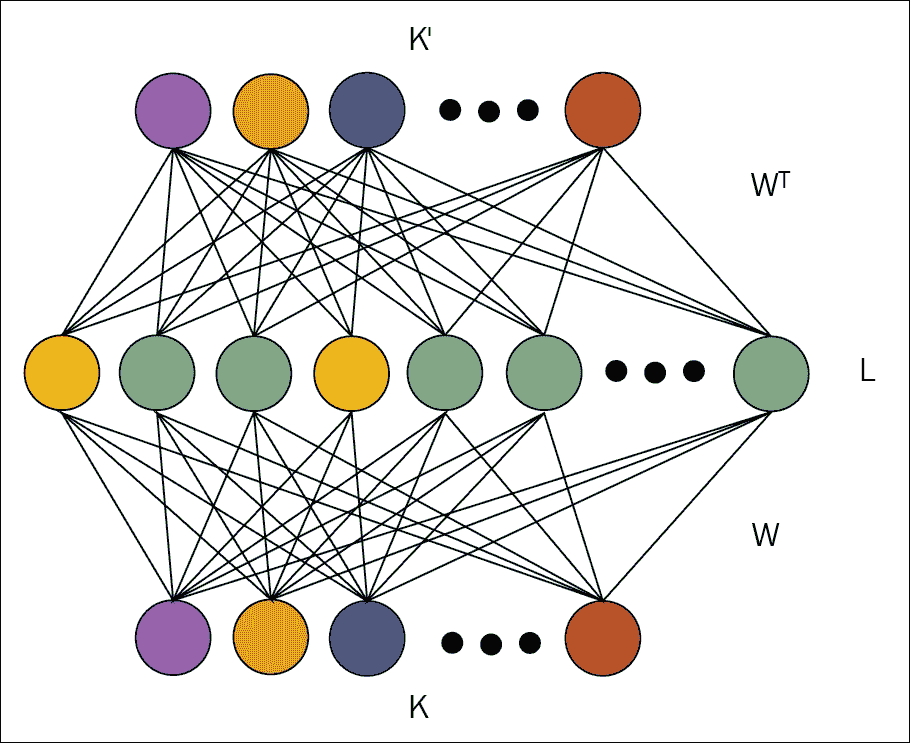

图 6.3：图示展示了一个典型的稀疏自编码器示例

稀疏自编码器是一种具有稀疏性约束的自编码器，它有助于引导单层网络学习隐藏层代码。该方法通过限制重构所需的代码词数来最小化重构误差。这种稀疏化算法可以视为一个分类问题，它将输入限制为单一类别值，从而帮助减少预测误差。

在本部分中，我们将通过一个简单的架构来解释稀疏自编码器。*图 6.3*展示了稀疏自编码器的最简单形式，包含一个隐藏层`h`。隐藏层`h`通过权重矩阵`W`与输入向量`K`相连，形成编码步骤。在解码步骤中，隐藏层`h`通过绑定权重矩阵*W^T*输出到重构向量*K`。在网络中，激活函数用`f`表示，偏置项用`b`表示。激活函数可以是任何类型：线性、Sigmoid 或 ReLU。

用于计算隐藏代码`l`的稀疏表示的方程式如下所示：

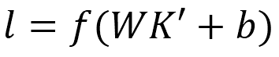

重构的输出是隐藏表示，通过以下方式线性映射到输出：

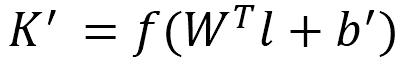

学习通过反向传播重构误差进行。所有参数都被优化以最小化均方误差，公式如下：

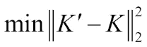

现在我们已经设置了网络，可以加入稀疏化组件，它将驱动向量`L`朝着稀疏表示方向发展。在这里，我们将使用 k-Sparse 自编码器来实现这一层的稀疏表示。（不要混淆 k-Sparse 表示中的`k`和`K`输入向量。为了区分它们，我们将这两者分别用小`k`和大`K`表示。）

### k-Sparse 自编码器

k-Sparse 自编码器[132]是基于具有绑定权重和线性激活函数的自编码器。k-Sparse 自编码器的基本思想非常简单。在自编码器的前馈阶段，一旦我们计算出隐藏代码*l = WK + b*，方法就不会从所有隐藏单元重构输入，而是寻找`k`个最大的隐藏单元，并将其余隐藏单元的值设置为零。

还有其他方法可以确定 `k` 个最大的隐藏单元。通过排序隐藏单元的活动或使用 ReLU，隐藏单元的阈值会被调整，直到我们确定 `k` 个最大的活动。这个选择步骤用于找到 `k` 个最大的活动是非线性的。这个选择步骤像一个正则化器，帮助防止在通过重构输入生成输出时使用过多的隐藏单元。

#### 如何选择稀疏性水平 k

如果我们强制使用较低的稀疏性水平，例如 *k=10*，在训练 k-Sparse 自编码器时可能会出现一个问题。一个常见的问题是，在前几个 epoch 中，算法会积极地开始将各个隐藏单元分配到训练样本的组中。这种现象可以与 k-means 聚类方法进行比较。在接下来的 epochs 中，这些隐藏单元会被选中并重新强化，但其他隐藏单元则不会被调整。

这个问题可以通过适当地安排稀疏性水平来解决。假设我们的目标是稀疏性水平为 10。在这种情况下，我们可以从较大的稀疏性水平开始，比如 *k=100* 或 *k=200*。因此，k-Sparse 自编码器可以训练所有的隐藏单元。逐渐地，在一个 epoch 的前半部分，我们可以将稀疏性水平从 *k=100* 线性地减少到 *k=10*。这样大大增加了选中所有隐藏单元的机会。然后，在该 epoch 的后半部分，我们将保持 *k=10*。通过这种方式，这种调度方法可以保证即使在低稀疏性水平下，所有的过滤器都能得到训练。

#### 稀疏性水平的影响

在设计或实现 k-Sparse 自编码器时，`k` 值的选择至关重要。`k` 的值决定了期望的稀疏性水平，这有助于使算法适用于各种数据集。例如，一个应用可以用于预训练一个深度判别神经网络或一个浅层网络。

如果我们选择一个较大的 `k` 值（例如在 MNIST 数据集上 *k=200*），算法将倾向于识别和学习数据集的非常局部的特征。这些特征有时表现得过于初期，无法用于浅层架构的分类。浅层架构通常有一个简单的线性分类器，它实际上没有足够的架构能力来合并所有这些特征并实现显著的分类率。然而，类似的局部特征在预训练深度神经网络时非常有用。

对于较小的稀疏性水平（例如在 MNIST 数据集上 *k=10*），输出是通过使用较少的隐藏单元从输入重构的。这最终会导致检测到数据集中的全局特征，而不是像前面那样检测到局部特征。这些较少的局部特征适用于浅层架构的分类任务。相反，这种情况对于深度神经网络来说并不理想。

# 深度自编码器

到目前为止，我们讨论的只是简单自编码器的单层编码器和单层解码器。然而，具有多个编码器和解码器的深度自编码器带来了更多的优势。

前馈网络在深度增加时表现更好。自编码器本质上是前馈网络，因此，基础前馈网络的优势同样适用于自编码器。编码器和解码器是自编码器，它们也像前馈网络一样工作。因此，我们可以在这些组件中也应用前馈网络深度的优势。

在这个过程中，我们还可以讨论普适逼近定理，该定理保证了一个至少包含一层隐藏层，并且隐藏单元足够多的前馈神经网络，可以逼近任何任意函数，并且可以达到任意精度。根据这一概念，深度自编码器只要有至少一层隐藏层，并且包含足够的隐藏单元，就能逼近输入到编码的任意映射。

### 注意

使用一个两层网络可以逼近任何连续函数，且可以达到任意精度。在人工神经网络的数学理论中，普适逼近定理指出，如果前馈网络至少有一层隐藏层，并且隐藏单元数量是有限的，那么它可以逼近*R^n*的任何连续函数。

深度自编码器相比浅层架构提供了许多优势。自编码器的非平凡深度抑制了表示一些函数的计算。同时，自编码器的深度大大减少了学习这些函数所需的训练数据量。甚至通过实验发现，深度自编码器在压缩性能上优于浅层自编码器。

训练深度自编码器的常见做法是训练一系列浅层自编码器。因此，在训练深度自编码器时，常常会遇到一系列浅层自编码器。在接下来的小节中，我们将深入讨论深度自编码器的概念。

## 深度自编码器的训练

此处所解释的深度自编码器设计基于 MNIST 手写数字数据库。在论文[133]中，详细解释了构建和训练深度自编码器的结构化流程。训练深度自编码器的基本过程分为三个阶段：预训练、展开和微调。

1.  **预训练**：训练深度自编码器的第一阶段是“预训练”。这一阶段的主要目的是处理二进制数据，将其推广到实值数据，并最终得出结论，表明它在各种数据集上都能良好工作。

    我们已经有足够的见解，认为单层隐藏单元并不是建模大量图像结构的合适方式。深度自编码器由多个限制玻尔兹曼机层组成。在第五章，*限制玻尔兹曼机*中，我们提供了足够的信息来说明限制玻尔兹曼机是如何工作的。使用相同的概念，我们可以继续构建深度自编码器的结构：

    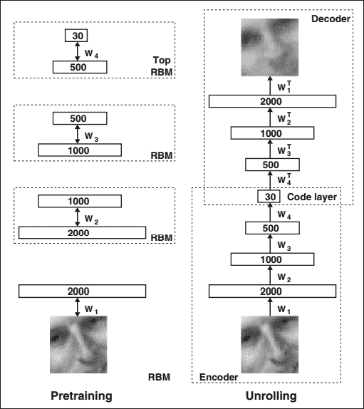

    图 6.4：预训练深度自编码器涉及学习一堆限制玻尔兹曼机（RBM），每个 RBM 具有一层特征检测器。一个限制玻尔兹曼机学习到的特征作为“输入数据”用于训练堆叠中的下一个 RBM。经过预训练阶段，所有 RBM 都会被展开或展开以构建深度自编码器。然后，使用误差导数的反向传播方法对深度自编码器进行微调。

    当 RBM 的第一层通过数据流驱动时，该层开始学习特征检测器。这种学习可以作为下一层学习的输入数据。通过这种方式，第一层的特征检测器成为下一层限制玻尔兹曼机学习的可见单元。这个逐层学习的过程可以根据需要反复进行。这个过程在预训练深度自编码器的权重时确实非常有效。每一层捕捉到的特征具有与下方隐藏单元活动之间的高阶相关性。*图 6.4*的第一部分给出了这一过程的流程图。在处理基准数据集 MNIST 时，深度自编码器在每个 RBM 之后会使用二值变换。为了处理实值数据，深度自编码器在每个限制玻尔兹曼机层之后使用高斯修正变换。

    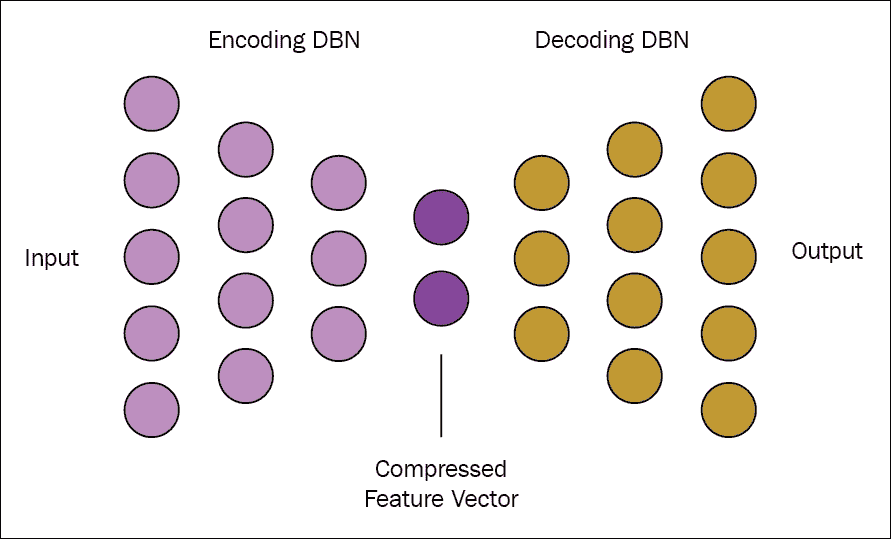

    图 6.5：图示表示编码器和解码器的向量数量如何在各个阶段变化。

1.  **展开**：一旦深度自编码器的多层特征检测器经过预训练，整个模型将被展开以生成编码器和解码器网络，最初它们使用相同的权重。我们将在图像第二部分中分别解释每个部分的设计，以便更好地理解这一阶段。

    +   **编码器**：对于一个 *28x28* 像素的 MNIST 数据集，网络输入的图像将是 784 个像素。根据经验法则，深度自编码器第一层的参数数量应该略大。如 *图 6.4* 所示，网络第一层使用了 **2000** 个参数。这可能听起来不太合理，因为增加输入的参数数量会增加过拟合的风险。然而，在这种情况下，增加参数数量最终会增加输入的特征，从而使得自编码器数据的解码成为可能。

    +   如 *图 6.4* 所示，层的宽度分别为 **2000**、**1000**、**500** 和 **30** 个节点。这个现象的快照在 *图 6.5* 中得以展示。最终，编码器将生成一个 **30** 长度的向量。这个 **30** 个数字的向量是深度自编码器编码器的最后一层。这个编码器的大致框架如下：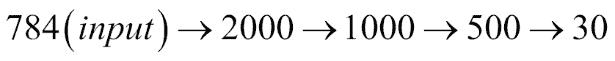

    +   **解码器**：在编码阶段结束时，得到的 **30** 个向量是 28x28 像素图像的编码版本。深度自编码器的第二部分是解码器阶段，它基本上学习如何解码压缩向量。因此，编码器阶段的输出（**30** 个向量）成为解码器阶段的输入。深度自编码器的这一部分是一个前馈网络，经过每一层后，编码的压缩向量逐渐传递到重建的输入。*图 6.4* 中显示的各层是 **30**、**500**、**1000** 和 **2000**。这些层最初的权重与预训练网络中的对应层相同，唯一不同的是，权重被转置，如图所示。这个编码器的大致框架如下：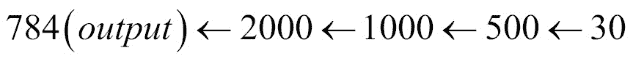

        因此，解码深度自编码器的一半的主要目的是学习如何重建图像。这个操作是在第二个前馈网络中进行的，且该网络也执行反向传播，这通过重建熵来实现。

1.  **微调**：在微调阶段，随机活动被替换为确定性、实值概率。整个深度自编码器每一层的权重通过反向传播方法被微调，以实现最优重建。

## 使用 Deeplearning4j 实现深度自编码器

现在，你已经对如何使用多个限制玻尔兹曼机构建深度自编码器有了足够的了解。在本节中，我们将解释如何利用 Deeplearning4j 设计深度自编码器。

我们将使用与上一节相同的 MNIST 数据集，并保持深度自编码器的设计与之前解释的相似。

如前面例子所述，使用从原始 MNIST 数据集中的小批次 `1024` 个样本，可以将其拆分成 `N` 个 Hadoop 块。这些 `N` 个块将由每个工作节点并行地在 Hadoop 分布式文件系统上运行。实现深度自编码器的代码流程简单直接。

步骤如下所示：

1.  在 HDFS 中按批次加载 MNIST 数据集。每个批次将包含 `1024` 个样本。

1.  开始构建模型。

1.  执行编码操作。

1.  执行解码操作。

1.  通过调用 `fit()` 方法训练模型。

```py
final int numRows = 28;
```

设置 Hadoop 环境所需的初始配置。`batchsize` 被设置为 `1024`。

```py
final int numColumns = 28; 
int seed = 123; 
int numSamples = MnistDataFetcher.NUM_EXAMPLES; 
int batchSize = 1024; 
int iterations = 1; 
int listenerFreq = iterations/5; 

```

将数据加载到 HDFS 中：

```py
log.info("Load data...."); 
DataSetIterator iter = new  MnistDataSetIterator(batchSize,numSamples,true); 

```

我们现在已经准备好构建模型，加入受限玻尔兹曼机的层数以构建深度自编码器：

```py
log.info("Build model...."); 
MultiLayerConfiguration conf = new NeuralNetConfiguration.Builder() 
  .seed(seed) 
  .iterations(iterations) 
  .optimizationAlgo(OptimizationAlgorithm.LINE_GRADIENT_DESCENT) 

```

为了创建一个具有指定层数（这里是八层）的 ListBuilder，我们调用 `.list()` 方法：

```py
 .list(8) 

```

下一步是构建模型的编码阶段。可以通过将受限玻尔兹曼机（Restricted Boltzmann machine）逐步加入到模型中来完成。编码阶段包含四层受限玻尔兹曼机，每层分别有 `2000`、`1000`、`500` 和 `30` 个节点：

```py
  .layer(0, new RBM.Builder().nIn(numRows *    
  numColumns).nOut(2000).lossFunction(LossFunctions.LossFunction
  .RMSE_XENT).build()) 
  .layer(1, new RBM.Builder().nIn(2000).nOut(1000)
  .lossFunction(LossFunctions.LossFunction.RMSE_XENT).build()) 
  .layer(2, new RBM.Builder().nIn(1000).nOut(500)
  .lossFunction(LossFunctions.LossFunction.RMSE_XENT).build()) 
  .layer(3, new RBM.Builder().nIn(500).nOut(30)
  .lossFunction(LossFunctions.LossFunction.RMSE_XENT).build()) 

```

编码器后的下一阶段是解码器阶段，我们将在此阶段使用四个受限玻尔兹曼机，方法与之前相似：

```py
  .layer(4, new RBM.Builder().nIn(30).nOut(500)
  .lossFunction(LossFunctions.LossFunction.RMSE_XENT).build())  
  .layer(5, new RBM.Builder().nIn(500).nOut(1000)
  .lossFunction(LossFunctions.LossFunction.RMSE_XENT).build()) 
  .layer(6, new RBM.Builder().nIn(1000).nOut(2000)
  .lossFunction(LossFunctions.LossFunction.RMSE_XENT).build()) 
  .layer(7, new OutputLayer.Builder(LossFunctions.LossFunction.MSE)
  .activation("sigmoid").nIn(2000).nOut(numRows*numColumns).build()) 

```

由于所有中间层已构建完毕，现在可以通过调用 `build()` 方法来构建模型：

```py
 .pretrain(true).backprop(true) 
  .build(); 

```

实现的最后阶段是训练深度自编码器。可以通过调用 `fit()` 方法来完成：

```py
MultiLayerNetwork model = new MultiLayerNetwork(conf); 
model.init(); 

model.setListeners(new ScoreIterationListener(listenerFreq)); 

log.info("Train model...."); 
while(iter.hasNext())
  { 
   DataSet next = iter.next(); 
   model.fit(new DataSet(next.getFeatureMatrix(),next
   .getFeatureMatrix())); 
  } 

```

# 去噪自编码器

从输入重构输出并不总是能保证得到期望的输出，有时可能只是简单地复制输入。为避免这种情况，[134] 提出了一个不同的策略。在该提议的架构中，重构标准是基于清理部分损坏的输入来构建的，而不是在输入数据的表示上施加一些约束。

> *"一个好的表示是能够从损坏的输入中稳健地获得的，并且对恢复相应的干净输入是有用的。"*

去噪自编码器是一种自编码器，它以损坏的数据作为输入，模型被训练以预测原始的、干净的和未损坏的数据作为输出。在本节中，我们将解释设计去噪自编码器的基本思想。

## 去噪自编码器的架构

去噪自编码器的主要思想是引入一个损坏过程，*Q (k^/ | k)*，并从损坏的输入*k^/*重构输出`r`。*图 6.6*展示了去噪自编码器的整体表示。在去噪自编码器中，对于每个小批量的训练数据`k`，应该使用*Q (k^/ | k)*生成相应的损坏*k^/*。从这里来看，如果我们将初始输入视为损坏输入*k^/*，那么整个模型可以看作是一种基本编码器的形式。损坏的输入*k^/*被映射生成隐藏表示`h`。

因此，我们得到以下内容：

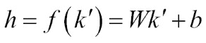

从这个隐藏表示中，可以使用*r = g (h)*推导出重构的输出`r`。去噪自编码器重新组织数据，然后尝试学习这些数据，以便重构输出。这种数据的重新组织或数据的洗牌生成了噪声，模型通过噪声学习特征，从而实现对输入的分类。在网络训练过程中，它生成一个模型，该模型通过损失函数计算该模型与基准之间的距离。其思想是最小化训练集上的平均重构误差，使输出 r 尽可能接近原始未损坏的输入`k`。

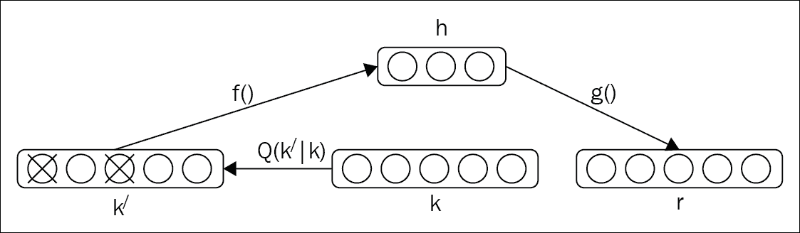

图 6.6：设计去噪自编码器的步骤。原始输入为 k；从 k 衍生的损坏输入表示为 k^/。最终输出表示为 r。

## 堆叠去噪自编码器

构建堆叠去噪自编码器以初始化深度神经网络的基本概念类似于堆叠多个限制玻尔兹曼机来构建深度置信网络或传统深度自编码器。生成损坏输入仅在每个单独层的初始去噪训练中需要，以帮助学习有用的特征提取。

一旦我们知道编码函数`f`来达到隐藏状态，它就可以应用于原始的、未损坏的数据，以到达下一层。通常情况下，不会施加任何损坏或噪声来生成表示，作为训练下一层的未损坏输入。堆叠去噪自编码器的一个关键功能是其逐层的无监督预训练，当输入被馈送通过时。一旦某一层经过预训练，能够对来自前一层的输入进行特征选择和提取，就可以进入下一个阶段的监督微调，类似于传统深度自编码器的情况。

*图 6.7*展示了设计堆叠去噪自编码器的详细表示。学习和堆叠多个去噪自编码器层的整体过程如下图所示：

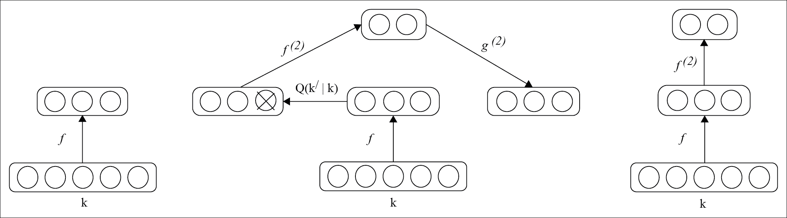

图 6.7：堆叠去噪自编码器的表示

## 使用 Deeplearning4j 实现堆叠去噪自编码器

可以通过使用 Deeplearning4j 创建一个包含自编码器作为隐藏层的`MultiLayerNetwork`来构建堆叠去噪自编码器。自编码器具有一定的`corruptionLevel`，即噪声。

在这里，我们设置了建立模型所需的初始配置。为了演示的目的，选择了`batchSize`为`1024`个示例。输入数和输出数分别设置为`1000`和`2`。

```py
int outputNum = 2;
int inputNum = 1000;
int iterations = 10;
int seed = 123;
int batchSize = 1024;

```

输入数据集的加载与在深度自编码器部分中解释的一样。因此，我们将直接跳到如何构建堆叠去噪自编码器。为了说明方法，我们采用了一个五层隐藏层的深度模型：

```py
log.info ("Build model....");
MultiLayerConfiguration conf = new NeuralNetConfiguration.Builder ()
.seed(seed)
.gradientNormalization(GradientNormalization
  .ClipElementWiseAbsoluteValue)
.gradientNormalizationThreshold (1.0)
.iterations(iterations)
.updater(Updater.NESTEROVS)
.momentum(0.5)
.momentumAfter(Collections.singletonMap(3, 0.9))
.optimizationAlgo(OptimizationAlgorithm.CONJUGATE_GRADIENT)
.list()
.layer(0, new AutoEncoder.Builder()
.nIn(inputNum)
.nOut(500)
.weightInit(WeightInit.XAVIER)
.lossFunction(LossFunction.RMSE_XENT)

```

以下代码表示输入数据需要被破坏的程度：

```py
.corruptionLevel (0.3)
    .build())
  .layer(1, new AutoEncoder.Builder()
    .nIn(500)
    .nOut(250)
    .weightInit(WeightInit.XAVIER).lossFunction
    (LossFunction.RMSE_XENT)
    .corruptionLevel(0.3)
    .build())
  .layer(2, new AutoEncoder.Builder()
    .nIn(250)
    .nOut(125)
    .weightInit(WeightInit.XAVIER).lossFunction         
    (LossFunction.RMSE_XENT)
    .corruptionLevel(0.3)
    .build())
  .layer(3, new AutoEncoder.Builder()
     .nIn(125)
     .nOut(50)
     .weightInit(WeightInit.XAVIER).lossFunction
     (LossFunction.RMSE_XENT)
     .corruptionLevel(0.3)
     .build())
   .layer(4, new OutputLayer.Builder   
   (LossFunction.NEGATIVELOGLIKELIHOOD)
     .activation("softmax")
     .nIn(75)
     .nOut(outputNum)
     .build())
   .pretrain(true)
.backprop(false)
.build();

```

一旦模型建立完成，就通过调用`fit()`方法进行训练：

```py
try {
     model.fit(iter);
    } 
catch(Exception ex)
   {
     ex.printStackTrace();
   }

```

# 自编码器的应用

自编码器可以成功应用于许多场景，因此，在深度学习领域获得了广泛的关注。在本节中，我们将讨论自编码器的重要应用和用途：

+   **维度降维**：如果你记得，在第一章《深度学习简介》中，我们介绍了“维度灾难”这一概念。维度降维是深度学习的最初应用之一。自编码器最初的研究就是为了克服维度灾难的问题。从本章内容，我们已经对深度自编码器如何在高维数据上工作并在最终输出中减少维度有了大致的了解。

+   **信息检索**：自编码器的另一个重要应用是在信息检索中。信息检索基本上是指在数据库中搜索与输入查询匹配的条目。在高维数据中进行搜索通常是一项繁琐的任务；然而，通过降低数据集的维度，某些低维数据的搜索可以变得非常高效。自编码器所获得的维度降维可以生成低维且具有二进制性质的编码。这些编码可以存储在键值存储数据结构中，其中键是二进制代码向量，值是相应的条目。这样的键值存储帮助我们通过返回与查询匹配的二进制代码的所有数据库条目来执行信息检索。通过降维和二进制编码来检索信息的这种方法被称为语义哈希[135]。

+   **图像搜索**：正如在深度自编码器部分所解释的，深度自编码器能够将高维图像数据集压缩成非常小的向量，例如 30 个。因此，这使得对高维图像的图像搜索变得更加容易。一旦上传图像，搜索引擎会将其压缩成小向量，然后将该向量与索引中的其他所有向量进行比较。对于搜索查询，将返回包含相似数字的向量，并转换为映射的图像。

# 总结

自编码器是最受欢迎且广泛应用的生成模型之一，本章对此进行了讨论。自编码器基本上帮助完成两个阶段：一个是编码阶段，另一个是解码阶段。在本章中，我们对这两个阶段进行了详细的数学解释。接下来，我们介绍了一种特殊类型的自编码器，称为稀疏自编码器。我们还讨论了自编码器如何在深度神经网络的世界中使用，通过解释深度自编码器来说明。深度自编码器由限制玻尔兹曼机的层组成，它们参与了网络的编码和解码阶段。我们解释了如何使用 Deeplearning4j 部署深度自编码器，通过将输入数据集的块加载到 Hadoop 分布式文件系统中。本章后面，我们介绍了最流行的自编码器形式——去噪自编码器及其深度网络版本，称为堆叠去噪自编码器。还展示了如何使用 Deeplearning4j 实现堆叠去噪自编码器。我们通过概述自编码器的常见应用来总结本章内容。

在下一章中，我们将借助 Hadoop 讨论一些常见的深度学习实用应用。
