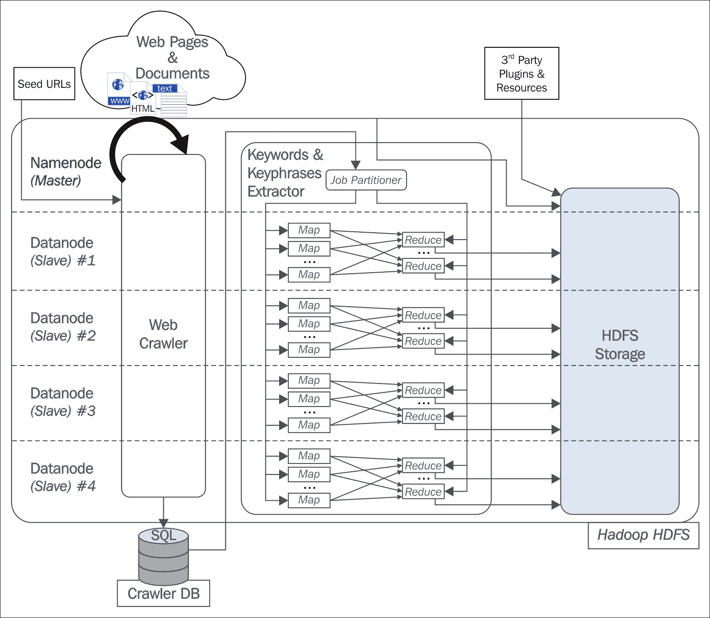

# 第七章：使用 Hadoop 的杂项深度学习操作

|   | *“在开拓者时代，他们使用牛来进行重型牵引，当一头牛无法移动一根原木时，他们不会试图养一头更大的牛。我们不应该追求更大的计算机，而是应该追求更多的计算机系统。”* |   |
| --- | --- | --- |
|   | --*格蕾丝·霍普* |

到目前为止，本书讨论了各种深度神经网络模型及其概念、应用和在分布式环境中的实现。我们还解释了为什么集中式计算机难以存储和处理大量数据，并使用这些模型提取信息。Hadoop 被用于克服大规模数据带来的限制。

随着我们已进入本书的最后一章，本章将主要讨论三种最常用的机器学习应用的设计。我们将解释使用 Hadoop 框架进行大规模视频处理、大规模图像处理和自然语言处理的一般概念。

本章的组织结构如下：

+   使用 Hadoop 进行大规模分布式视频处理

+   使用 Hadoop 进行大规模图像处理

+   使用 Hadoop 进行自然语言处理

数字世界中大量的视频正在为近年来产生的大数据贡献着巨大的份额。在第二章《分布式深度学习与大规模数据》中，我们讨论了如何将数百万个视频上传到各种社交媒体网站，如 YouTube 和 Facebook。除此之外，安装在各大商场、机场或政府机构中的监控摄像头也会每天生成大量的视频。由于这些视频占用巨大的存储空间，大多数视频通常以压缩格式存储。在许多企业中，监控摄像头全天运行，随后存储重要的视频，以备将来调查。

这些视频包含了隐藏的“热数据”或信息，需要迅速处理和提取。因此，处理和分析这些大规模视频已经成为数据爱好者的优先事项之一。此外，在许多不同的研究领域，如生物医学工程、地质学和教育研究等，都需要处理这些大规模视频，并将它们提供给不同地点进行详细分析。

在本节中，我们将探讨使用 Hadoop 框架处理大规模视频数据集的问题。大规模视频处理的主要挑战是将视频从压缩格式转码为非压缩格式。因此，我们需要一个分布式视频转码器，它将视频写入 **Hadoop 分布式文件系统**（**HDFS**），并行解码比特流块，生成序列文件。

当 HDFS 中的输入数据块被处理时，每个 mapper 进程分别访问每个分片中的行。然而，在大规模视频数据集的情况下，当它被分割成多个预定义大小的块时，每个 mapper 进程应该单独解释这些位流块。然后，mapper 进程将提供对解码后的视频帧的访问，以供后续分析。在以下小节中，我们将讨论如何将包含视频位流的 HDFS 中的每个块转码成图像集，以便进行进一步的分析。

# Hadoop 中的分布式视频解码

大多数流行的视频压缩格式，如 MPEG-2 和 MPEG-4，遵循位流中的分层结构。在这一小节中，我们假设使用的压缩格式具有分层结构。为简单起见，我们将解码任务分为两个不同的 Map-reduce 作业：

1.  **提取视频序列级别信息**：一开始就可以很容易预测，所有视频数据集的头信息可以在数据集的第一个块中找到。在这个阶段，map-reduce 作业的目的是从视频数据集的第一个块中收集序列级别信息，并将结果输出为 HDFS 中的文本文件。序列头信息对于设置解码器对象的格式是必需的。

    对于视频文件，应实现一个新的`FileInputFormat`，并具有自己的记录读取器。每个记录读取器将以这种格式向每个 map 过程提供`<key, value>`对：`<LongWritable, BytesWritable>`。输入键表示文件中的字节偏移量；与`BytesWritable`对应的值是一个字节数组，包含整个数据块的视频位流。

    对于每个 map 过程，键值与`0`进行比较，以确定它是否是视频文件的第一个块。一旦确定了第一个块，位流将被解析以确定序列级别信息。然后，这些信息将被转储到`.txt`文件中，并写入 HDFS。我们将该`.txt`文件的名称表示为`input_filename_sequence_level_header_information.txt`。由于只有 map 过程可以为我们提供所需的输出，因此此方法的 reducer 数量设置为`0`。

    ### 注意

    假设有一个包含以下数据的文本文件：**深度学习** **与 Hadoop** 现在，第一行的偏移量为`0`，Hadoop 作业的输入将是`<0,深度学习>`，第二行的偏移量将是`<14,与 Hadoop>`。每当我们将文本文件传递给 Hadoop 作业时，它会内部计算字节偏移量。

1.  **解码并转换视频块为序列文件**：这个 Map-reduce 任务的目的是解码每个视频数据集的块，并生成相应的序列文件。序列文件将包含每个视频块的解码视频帧，格式为 JPEG。`InputFileFormat` 文件和记录读取器应与第一个 Map-reduce 任务保持一致。因此，mapper 输入的 `<key, value>` 对是 `<LongWritable, BytesWritable>`。Hadoop 分布式视频解码

    图 7.1：Hadoop 视频解码的整体表示

    +   在第二阶段，第一次任务的输出作为第二次 Map-reduce 任务的输入。因此，这个任务的每个 mapper 将读取 HDFS 中的序列信息文件，并将此信息与以 `BytesWritable` 输入形式传入的位流缓冲区一起传递。

    +   map 过程基本上将解码的视频帧转换为 JPEG 图像，并生成 `<key, value>` 对，作为 map 过程的输出。该输出的 key 编码了输入视频文件名和块编号，格式为 `video_filename_block_number`。对应于此 key 的输出值是 `BytesWritable`，它存储了解码视频块的 JPEG 位流。

    +   然后，reducers 会将数据块作为输入，并将解码的帧简单地写入包含 JPEG 图像的序列文件中，作为输出格式进行进一步处理。一个简单的格式和整个过程的概览如 *图 7.1* 所示。我们使用一个输入视频 `sample.m2v` 进行说明。此外，在本章中，我们将讨论如何使用 HDFS 处理大规模的图像文件（来自序列文件）。

    ### 注意

    Mapper 的输入 `<key,value>`：`<LongWritable, BytesWritable>`

    例如：`<17308965, BytesWritable>` Mapper 输出的 `<key,value>`：`<Text, BytesWritable>` 例如：`<sample.m2v_3, BytesWritable>`

# 使用 Hadoop 进行大规模图像处理

我们在前面的章节中已经提到，图像的大小和数量正日益增加；存储和处理这些庞大的图像对于集中式计算机来说是一项挑战。我们来考虑一个实际的例子，以便更好地理解这种情况。假设我们有一张尺寸为 81025 像素 x 86273 像素的大规模图像。每个像素由三个值组成：红色、绿色和蓝色。假设每个值需要使用 32 位精度的浮动点数来存储。那么，该图像的总内存消耗可以通过以下公式计算：

*86273 * 81025 * 3 * 32 位 = 78.12 GB*

抛开对图像进行任何后处理，因为可以清楚地得出结论，传统计算机甚至无法将如此大量的数据存储在其主内存中。即使一些高级计算机具有更高的配置，但考虑到投资回报率，大多数公司并不选择这些计算机，因为它们的购买和维护成本过于昂贵。因此，适当的解决方案应该是使用通用硬件来运行这些图像，以便图像能够存储在其内存中。在本节中，我们将解释如何使用 Hadoop 以分布式方式处理这些大量图像。

## Map-Reduce 作业的应用

在本节中，我们将讨论如何使用 Map-reduce 作业和 Hadoop 来处理大型图像文件。在作业开始之前，所有待处理的输入图像将被加载到 HDFS 中。在操作过程中，客户端发送一个作业请求，该请求经过 NameNode。NameNode 从客户端接收该请求，搜索其元数据映射，然后将文件系统的数据块信息以及数据块的位置发送回客户端。一旦客户端获得了数据块的元数据，它会自动访问存储该数据块的 DataNodes，然后通过适用的命令处理该数据。

用于大规模图像处理的 Map-reduce 作业主要负责控制整个任务。基本上，在这里我们解释了可执行 shell 脚本文件的概念，该文件负责从 HDFS 中收集可执行文件的输入数据。

使用 Map-reduce 编程模型的最佳方式是设计我们自己的 Hadoop 数据类型，用于直接处理大量图像文件。系统将使用 Hadoop Streaming 技术，帮助用户创建和运行特殊类型的 Map-reduce 作业。这些特殊类型的作业可以通过前面提到的可执行文件来执行，该文件将充当映射器或化简器。程序的映射器实现将使用一个 shell 脚本来执行必要的操作。这个 shell 脚本负责调用图像处理的可执行文件。这些图像文件列表作为输入传递给这些可执行文件，进行进一步处理。该处理的结果或输出稍后会写回到 HDFS 中。

因此，输入的图像文件应首先写入 HDFS，然后在 Hadoop Streaming 的输入目录中生成一个文件列表。该目录将存储文件列表的集合。文件列表的每一行将包含要处理的图像文件的 HDFS 地址。Mapper 的输入是`Inputsplit`类，这是一个文本文件。Shell 脚本管理器逐行读取文件并从元数据中检索图像。接着，它调用图像处理可执行文件进一步处理图像，然后将结果写回 HDFS。因此，Mapper 的输出就是最终所需的结果。Mapper 完成了所有工作，包括从 HDFS 检索图像文件、图像处理，然后将其写回 HDFS。该过程中的 Reducer 数量可以设置为零。

这是一个使用 Hadoop 按二进制图像处理方法处理大量图像的简单设计。其他复杂的图像处理方法也可以部署来处理大规模的图像数据集。

# 使用 Hadoop 进行自然语言处理

网络信息的指数增长增加了大规模非结构化自然语言文本资源的传播强度。因此，在过去几年中，提取、处理和共享这些信息的兴趣显著增加。在规定的时间内处理这些知识源已成为各个研究和商业行业面临的主要挑战。在这一部分，我们将描述使用 Hadoop 以分布式方式爬取网页文档、发现信息并运行自然语言处理的过程。

为了设计**自然语言处理**（**NLP**）的架构，首先要进行的任务是从大规模非结构化数据中提取标注的关键词和关键短语。为了在分布式架构上执行 NLP，可以选择 Apache Hadoop 框架，因为它提供了高效且可扩展的解决方案，并且能改善故障处理和数据完整性。大规模网页爬虫可以被设置为从 Web 中提取所有非结构化数据并将其写入 Hadoop 分布式文件系统以供进一步处理。为了执行特定的 NLP 任务，我们可以使用开源的 GATE 应用程序，如论文[136]所示。分布式自然语言处理架构的初步设计概览如*图 7.2*所示。

为了分配网络爬虫的工作，可以使用 Map-reduce 并在多个节点上运行。NLP 任务的执行以及最终输出的写入都是通过 Map-reduce 来完成的。整个架构将依赖于两个输入文件：i）存储在 `seed_urls.txt` 中的用于抓取特定网页的 `seedurls`，ii）NLP 应用程序的路径位置（例如 GATE 的安装位置）。网络爬虫将从 `.txt` 文件中获取 `seedurls`，并为这些 URL 并行运行爬虫。异步地，一个提取插件将在抓取的网页上搜索关键词和关键短语，并与网页一起独立执行。在最后一步，一个专用程序会根据需求将提取的关键词和关键短语存储在外部 SQL 数据库或 NoSQL 数据库中，如 `Elasticsearch`。架构中提到的所有这些模块将在以下子章节中进行描述。

## 网络爬虫

为了解释这一阶段，我们不打算深入讨论，因为这几乎超出了本书的范围。网络爬虫有几个不同的阶段。第一阶段是 URL 发现阶段，该过程将每个种子 URL 作为 `seed_urls.txt` 文件的输入，并通过分页 URL 来发现相关的 URL。这个阶段定义了下一阶段要抓取的 URL 集合。

下一阶段是抓取 URL 页面内容并保存在磁盘中。操作是按段进行的，每个段包含一定数量的预定义 URL。操作将在不同的 `DataNode` 上并行执行。各个阶段的最终结果将保存在 Hadoop 分布式文件系统中。关键词提取器将在这些保存的页面内容上工作，为下一阶段做准备。

图 7.2：展示了自然语言处理在 Hadoop 中的执行过程，下一阶段将会获取这些数据。下一阶段是抓取 URL 页面内容并保存在磁盘中。该操作是按段进行的，每个段包含一定数量的预定义 URL。操作将在不同的 DataNode 上并行执行。各个阶段的最终结果将保存在 Hadoop 分布式文件系统中。关键词提取器将在这些保存的页面内容上工作，为下一阶段做准备。

## 关键词提取和自然语言处理模块

对于每个 URL 的页面内容，创建并存储一个 **文档对象模型** (**DOM**) 回到 HDFS 中。在 *DOM* 中，文档具有类似树的逻辑结构。通过使用 DOM，可以编写 `xpath` 来收集自然语言处理阶段所需的关键词和短语。在本模块中，我们将定义 Map-reduce 作业来执行下一阶段的自然语言处理应用程序。定义的 map 函数是一个 `<key, value>` 对，key 是 URL，value 是该 URL 对应的 DOM。*reduce* 函数将执行自然语言处理部分的配置和执行。接下来的关键词和短语在网页域级别的估算将在 `reduce` 方法中执行。为此，我们可以编写一个自定义插件来生成规则文件，通过执行各种字符串操作，过滤掉从提取文本中获得的噪声和不需要的词汇。规则文件可以是 JSON 文件或任何其他易于加载和解析的文件，具体取决于用例。通常，我们将常见的名词和形容词识别为文本中的常见关键词。

## 从页面估算相关关键词

论文 [136] 提出了一个非常重要的公式，用于从网页文档中找到相关的关键词和关键短语。他们提供了 **词频 - 逆文档频率** (**TF-IDF**) 度量，用于从整个语料库中估算相关信息，语料库由属于同一网页域的所有文档和页面组成。计算 *TF-IDF* 的值并为丢弃其他关键词设定阈值，使我们能够从语料库中生成最相关的词语。换句话说，它丢弃了可能在文本中出现频率较高的常见冠词和连词，这些词通常不包含任何有意义的信息。*TF-IDF* 度量本质上是两个函数 *TF* 和 *IDF* 的乘积。

*TF* 提供了每个词在语料库中的频率，即一个词在语料库中出现的次数。而 *IDF* 起到了平衡作用，对于在整个语料库中出现频率较低的词，给出较高的值。

从数学上讲，关键词或关键短语 `i` 在文档 `d` 中的 *TF-IDF* 度量公式如下：

*(TF-IDF)[i] = TF[i] . IDF[i]*

这里 *TF[i] = f[i]/n[d]* 和 *IDF[i] = log N[d]/N[i]*

这里的 *f[i]* 是候选关键词或关键短语 `i` 在文档 `d` 中的频率，*n[d]* 是文档 `d` 中的总词数。在 *IDF* 中，*N[D]* 表示语料库 `D` 中的文档总数，而 *N[i]* 表示包含关键词或关键短语 `i` 的文档数量。

根据使用案例，应该为*TF-IDF*定义一个通用的阈值频率。对于一个关键字或关键短语`i`，如果*TF-IDF*的值超过阈值，该关键字或关键短语将被接受并直接写入 HDFS。另一方面，如果相应的值低于阈值，则该关键字将从最终集合中删除。通过这种方式，最终所有所需的关键字将被写入 HDFS。

# 总结

本章讨论了机器学习中最广泛使用的应用程序以及如何在 Hadoop 框架中设计它们。首先，我们从一个大型视频集开始，展示了如何在 HDFS 中解码视频，并将其转换为包含图像的序列文件，以便后续处理。接下来，本章讨论了大规模图像处理。用于此目的的 mapper 有一个 shell 脚本，执行所有必要的任务。因此，不需要 reducer 来执行此操作。最后，我们讨论了如何将自然语言处理模型部署到 Hadoop 中。
