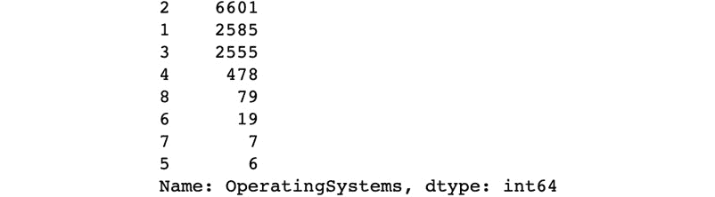
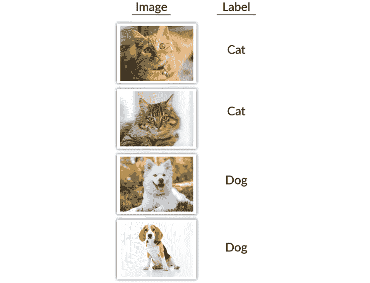

# 第一章：1. 使用 Keras 的机器学习介绍

概述

本章介绍了 Python 中的机器学习。我们将使用实际数据集来演示机器学习的基础知识，包括为机器学习模型进行数据预处理，并使用 scikit-learn 构建逻辑回归模型进行分类。然后，我们将通过在模型中加入正则化技术，提升我们的模型构建技巧，并通过模型评估指标来评估模型的表现。到本章结束时，你将能够自信地使用 Python 中的 scikit-learn 库构建分类任务模型，并有效地评估这些模型的性能。

# 介绍

机器学习是利用机器模拟人类任务的科学，并让机器随着时间的推移提高其执行任务的能力。通过将现实世界事件的观察数据输入到机器中，机器可以发展出优化目标函数的模式和关系，例如二分类任务的准确度或回归任务的误差。

通常，机器学习的价值在于机器能够学习大规模数据集中高度复杂和非线性的关系，并且能够多次复制这种学习的结果。机器学习算法的一个分支在学习与大规模、通常是非结构化数据集（如图像、音频和文本数据）相关的复杂非线性关系方面显示出了很大的潜力——**人工神经网络**（**ANNs**）。然而，人工神经网络的编程、训练和评估可能很复杂，对于该领域的初学者来说可能会感到有些令人畏惧。Keras 是一个 Python 库，提供了构建、训练和评估人工神经网络的简单入门方法，对于学习机器学习的人来说非常有用。

以将包含狗或猫的图片数据集分类为相应类型的任务为例。对于人类来说，这是简单的，准确度很可能会非常高。然而，每张图片的分类可能需要大约一秒钟，且要扩大这一任务的规模只能通过增加人力来实现，这可能并不现实。虽然对于机器来说，达到与人类相同的准确度可能比较困难（但并非不可能），但机器可以每秒处理大量的图像，且通过增加单台机器的处理能力或优化算法效率，任务的规模扩展可以轻松实现：


](img/B15777_01_01.jpg)

图 1.1：将图像分类为狗或猫是人类的简单任务，但对机器来说相当困难

虽然分类狗和猫的简单任务对我们人类来说可能很简单，但用于创建分类狗和猫的机器学习模型的相同原理可以应用于其他人类可能会遇到困难的分类任务。一个例子就是识别磁共振成像（MRI）中的肿瘤。对人类而言，这项任务需要一位具有多年经验的医疗专业人员，而机器可能只需要一个标注过的图像数据集。以下图像显示了大脑的 MRI 图像，其中一些图像包含肿瘤：


图 1.2：一个非平凡的分类任务——大脑的 MRI 图像，其中一些图像包含肿瘤的存在

# 数据表示

我们构建模型是为了从我们正在训练的数据中学习某些信息，并了解数据集特征之间的关系。这种学习可以在我们遇到新观察时为我们提供帮助。然而，我们必须意识到，我们在现实世界中互动的观察和训练机器学习模型所需的数据格式是非常不同的。处理文本数据就是一个典型的例子。当我们阅读文本时，我们能够理解每个单词，并根据每个单词与周围单词的关系来应用上下文——这并非易事。然而，机器无法解释这些上下文信息。除非它们被专门编码，否则它们根本不知道如何将文本转换为可以作为数值输入的内容。因此，我们必须以适当的方式表示数据，通常是通过将非数值数据类型——例如，将文本、日期和类别变量转换为数值型数据。

## 数据表

大部分输入机器学习问题的数据是二维的，可以表示为行或列。图像是一个很好的例子，它可能是三维甚至四维的。每个图像的形状将是二维的（高度和宽度），所有图像加在一起将增加第三维度，颜色通道（红色、绿色和蓝色）将增加第四维度：


图 1.3：一张彩色图像及其作为红、绿、蓝图像的表示

以下图展示了来自 UCI 数据库的数据集中的几行数据，该数据集记录了购物网站不同用户的在线会话活动。数据集的列代表会话活动的不同属性和页面的常规属性，而行代表不同用户的各个会话。名为 `Revenue` 的列表示用户是否通过购买网站上的产品结束了会话。

注意

记录购物网站各个用户在线会话活动的数据集可以在这里找到：[`packt.live/39rdA7S`](https://packt.live/39rdA7S)。

分析数据集的一个目标可能是尝试利用提供的信息预测某个用户是否会从网站购买产品。然后，我们可以通过将我们的预测与名为`Revenue`的列进行比较来检查是否正确。长期来看，使用我们的模型可以识别会话或网页的关键特征，这些特征可能会预测购买意图：

![图 1.4：一张显示在线购物者购买意图数据集前 20 个实例的图片]

](img/B15777_01_04.jpg)

图 1.4：一张显示在线购物者购买意图数据集前 20 个实例的图片

## 加载数据

数据可以以不同的形式存在，并且可以存储在许多不同的位置。对于初学者来说，数据集通常以平面格式提供，也就是说它们是二维的，有行和列。其他常见的数据形式包括图像、`JSON`对象和文本文件。每种数据格式必须以特定的方式加载。例如，数值数据可以通过`NumPy`库加载到内存中，`NumPy`是一个在 Python 中处理矩阵的高效库。

然而，我们无法使用`NumPy`库将我们的营销数据`.csv`文件加载到内存中，因为数据集包含字符串值。对于我们的数据集，我们将使用`pandas`库，因为它能够轻松处理各种数据类型，如字符串、整数、浮动数字和二进制值。事实上，`pandas`依赖于`NumPy`来处理数值数据类型。`pandas`还能够通过 SQL 查询读取 JSON、Excel 文档和数据库，这使得该库在 Python 中加载和处理数据时非常常见。

下面是如何使用`NumPy`库加载 CSV 文件的示例。我们使用`skiprows`参数，以防文件中有标题行，标题通常包含列名：

```py
import numpy as np
data = np.loadtxt(filename, delimiter=",", skiprows=1)
```

下面是使用`pandas`库加载数据的示例：

```py
import pandas as pd
data = pd.read_csv(filename, delimiter=",")
```

这里，我们加载一个`.CSV`文件。默认的分隔符是逗号，所以传递该参数并非必须，但它有助于展示。`pandas`库还可以处理非数字数据类型，这使得它更加灵活：

```py
import pandas as pd
data = pd.read_json(filename)
```

`pandas`库将会展平 JSON 并返回一个`DataFrame`。

该库甚至可以连接到数据库，查询可以直接传入函数，返回的表格将作为`pandas` DataFrame 加载：

```py
import pandas as pd
data = pd.read_sql(con, "SELECT * FROM table")
```

我们需要将数据库连接传递给函数才能使其工作。根据数据库类型，这可以通过多种方式实现。

其他常见的数据形式，如图像和文本，也可以加载，并将在本课程后续讨论。

注意

你可以在这里找到 pandas 的所有文档：[`pandas.pydata.org/pandas-docs/stable/`](https://pandas.pydata.org/pandas-docs/stable/)。NumPy 的文档可以在这里找到：[`docs.scipy.org/doc/`](https://docs.scipy.org/doc/)。

## 练习 1.01：从 UCI 机器学习库加载数据集

注意

对于本章中的所有练习和活动，你需要在系统上安装 Python 3.7、Jupyter 和 pandas。安装说明请参考 *前言* 部分。所有的练习和活动都在 Jupyter notebook 中进行。建议为不同的任务保持单独的 notebook。你可以从本书的 GitHub 仓库下载所有的 notebooks，仓库地址为：[`packt.live/2OL5E9t`](https://packt.live/2OL5E9t)。

在这个练习中，我们将从 UCI 机器学习库加载 `online shoppers purchasing intention` 数据集。这个练习的目标是加载 CSV 数据，并确定一个目标变量来进行预测，以及用于建模目标变量的特征变量。最后，我们将分离特征列和目标列，并将它们保存为 `.CSV` 文件，以便在后续活动和练习中使用。

数据集与在线商店客户的在线行为和活动相关，并指示用户是否从网站购买了任何产品。你可以在 GitHub 仓库中找到该数据集：[`packt.live/39rdA7S`](https://packt.live/39rdA7S)。

按照以下步骤完成本练习：

1.  打开一个新的 Jupyter Notebook，并使用 pandas 库的 `read_csv` 函数将数据加载到内存中。导入 `pandas` 库并读取 `data` 文件：

    ```py
    import pandas as pd
    data = pd.read_csv('../data/online_shoppers_intention.csv')
    ```

    注意

    上述代码假设你使用的是与 GitHub 仓库中相同的文件夹和文件结构。如果出现找不到文件的错误，请检查你的工作目录是否正确构建。或者，你可以编辑代码中的文件路径，使其指向系统中正确的文件位置，但你需要确保在后续练习中保存和加载文件时保持一致。

1.  为了验证我们是否已正确将数据加载到内存中，我们可以打印出前几行。让我们打印出变量的前`20`个值：

    ```py
    data.head(20)
    ```

    打印输出应如下所示：

    

    图 1.5：pandas 数据框的前 20 行和前 8 列

1.  我们还可以打印出 `DataFrame` 的 `shape`：

    ```py
    data.shape
    ```

    打印输出应如下所示，显示数据框（DataFrame）有`12330`行和`18`列：

    ```py
    (12330, 18)
    ```

    我们已成功将数据加载到内存中，现在可以对数据进行操作和清理，以便使用这些数据训练模型。请记住，机器学习模型需要数据以数值数据类型表示，才能进行训练。从数据集的前几行中我们可以看到，有些列是字符串类型，因此我们稍后需要将它们转换为数值数据类型。

1.  我们可以看到数据集中有一个名为`Revenue`的输出变量，表示用户是否在网站上购买了产品。这看起来是一个合适的预测目标，因为网站的设计和所展示的产品选择可能会基于用户的行为以及他们是否购买了特定的产品。请按照以下方式创建`feature`和`target`数据集，并提供`axis=1`参数：

    ```py
    feats = data.drop('Revenue', axis=1)
    target = data['Revenue']
    ```

    注意

    `axis=1`参数告诉函数删除列，而不是删除行。

1.  为了验证数据集的形状是否符合预期，请打印出每个数据集的`行`和`列`数量：

    ```py
    print(f'Features table has {feats.shape[0]} \
    rows and {feats.shape[1]} columns')
    print(f'Target table has {target.shape[0]} rows')
    ```

    上述代码生成了以下输出：

    ```py
    Features table has 12330 rows and 17 columns
    Target table has 12330 rows
    ```

    我们可以在这里看到两个重要的事项，应该在继续之前始终验证：首先，`feature` DataFrame 和`target` DataFrame 的行数是相同的。在这里，我们看到两者都有`12330`行。其次，`feature` DataFrame 的列数应该比总 DataFrame 少一列，而`target` DataFrame 恰好有一列。

    关于第二点，我们必须验证目标数据集不包含在特征数据集中；否则，模型会快速发现这是唯一一个需要的列，从而将总误差降到零。目标列不一定必须是单列，但对于二元分类，如我们的案例，它会是。请记住，这些机器学习模型试图最小化某个代价函数，其中`target`变量会作为该代价函数的一部分，通常是预测值和`target`变量之间的差异函数。

1.  最后，将 DataFrame 保存为 CSV 文件，以便以后使用：

    ```py
    feats.to_csv('../data/OSI_feats.csv', index=False)
    target.to_csv('../data/OSI_target.csv', \
                  header='Revenue', index=False)
    ```

    注意

    `header='Revenue'`参数用于提供列名。我们将这样做以减少后续的混淆。`index=False`参数用于确保索引列不会被保存。

在本节中，我们已经成功演示了如何使用`pandas`库将数据加载到 Python 中。这将成为加载大多数表格数据到内存中的基础。图像和大型文档是机器学习应用中其他常见的数据形式，必须使用其他方法加载，这些内容将在本书后面讨论。

注意

要访问此特定部分的源代码，请参考[`packt.live/2YZRAyB`](https://packt.live/2YZRAyB)。

你也可以在线运行这个示例，网址是[`packt.live/3dVR0pF`](https://packt.live/3dVR0pF)。

# 数据预处理

为了将模型拟合到数据中，数据必须以数值格式表示，因为所有机器学习算法中使用的数学仅适用于数字矩阵（你无法对图像执行线性代数运算）。这将是本节的一个目标：学习如何将所有特征编码为数值表示。例如，在二进制文本中，包含两个可能值之一的值可以表示为零或一。以下图示展示了这一点。由于只有两个可能的值，值`0`假设为`cat`（猫），值`1`假设为`dog`（狗）。

我们还可以重新命名列以便解释：


图 1.6：二进制文本值的数值编码

另一个目标是将数据适当地表示为数值格式——这里的“适当”是指我们希望通过数字的分布将相关信息进行数值编码。例如，将年份的月份进行编码的一种方法是使用月份在年份中的数字表示。例如，`January`（一月）会被编码为`1`，因为它是第一个月，而`December`（十二月）会被编码为`12`。以下是这个过程的实际示例：


图 1.7：月份的数值编码

如果未将信息恰当地编码为数值特征，可能会导致机器学习模型学习到不直观的表示，以及`feature`数据和`target`变量之间的关系，这些关系对人类的解释毫无帮助。

你对所使用的机器学习算法的理解也有助于将特征适当地编码为数值表示。例如，像人工神经网络（ANN）和逻辑回归这样的分类任务算法对特征间尺度的巨大差异很敏感，这种差异可能会影响它们的模型拟合能力。

举个例子，假设有一个回归问题，试图将房屋属性（例如平方英尺面积和卧室数量）拟合到房价上。面积的范围可能从`0`到`5000`不等，而卧室的数量可能只在`0`到`6`之间变化，因此变量之间的尺度差异很大。

解决特征间尺度差异大的有效方法是对数据进行归一化。归一化数据将适当地缩放数据，使其具有相似的大小。这确保了任何模型的系数或权重可以正确地进行比较。像决策树这样的算法不受数据缩放的影响，因此使用基于树的算法的模型可以省略这一步。

在本节中，我们展示了多种不同的数字编码方式。还有许多其他技术可以在其他地方进行探索。在这里，我们将展示一些简单且流行的方法，用于解决常见的数据格式问题。

## 练习 1.02：清理数据

我们必须适当清理数据，以便可以用于训练模型。这通常包括将非数值数据类型转换为数值数据类型。这将是本练习的重点——将特征数据集中的所有列转换为数值列。为完成该练习，请执行以下步骤：

1.  首先，我们将`feature`数据集加载到内存中：

    ```py
    %matplotlib inline
    import pandas as pd
    data = pd.read_csv('../data/OSI_feats.csv')
    ```

1.  再次查看前`20`行以检查数据：

    ```py
    data.head(20)
    ```

    以下截图显示了前述代码的输出：

    

    图 1.8：pandas 特征 DataFrame 的前 20 行和 8 列

    在这里，我们可以看到有一些列需要转换为数值格式。我们可能不需要修改的数值列是名为`>2`)的列。这些列是名为**Month**和**VisitorType**的列。

1.  对于数值列，使用`describe`函数快速查看数值列的范围：

    ```py
    data.describe()
    ```

    以下截图显示了前述代码的输出：

    

    图 1.9：特征 DataFrame 中 describe 函数的输出

1.  将二进制列`1`转换为`0`，如果适当，重命名该列以提高可解释性。

    为了提供上下文，查看每个值的分布是有帮助的。我们可以使用`value_counts`函数来做到这一点。我们可以在`Weekend`列上尝试：

    ```py
    data['Weekend'].value_counts()
    ```

    我们还可以通过调用结果 DataFrame 的`plot`方法并传入`kind='bar'`参数，以柱状图的形式查看这些值：

    ```py
    data['Weekend'].value_counts().plot(kind='bar')
    ```

    注意

    `kind='bar'`参数将数据绘制为柱状图。默认是`折线图`。在 Jupyter 笔记本中绘图时，为了在笔记本中生成图表，可能需要运行以下命令：`%matplotlib inline`。

    以下图表显示了前述代码的输出：

    

    图 1.10：默认列值分布的绘图

1.  在这里，我们可以看到这个分布偏向于 `false` 值。这个列表示访问网站是否发生在周末，`true` 表示周末，`false` 表示工作日。由于工作日比周末多，所以这个偏斜的分布是合理的。通过将 `True` 值转换为 `1`，`False` 值转换为 `0`，将该列转换为数值值。我们还可以将列的名称从默认名称改为 `is_weekend`，这样可以更清楚地表示列的含义：

    ```py
    data['is_weekend'] = data['Weekend'].apply(lambda \
                         row: 1 if row == True else 0)
    ```

    注意

    `apply` 函数会遍历列中的每个元素，并应用作为参数传递的函数。必须提供一个函数作为参数。这里，提供了一个 `lambda` 函数。

1.  看看原始列和转换后的列并排展示。取样最后几行，查看值如何被处理，以便它们成为数值数据类型：

    ```py
    data[['Weekend','is_weekend']].tail()
    ```

    注意

    `tail` 函数与 `head` 函数相同，不同之处在于它返回的是 DataFrame 底部的 `n` 个值，而不是顶部的 `n` 个值。

    下图展示了前面代码的输出结果：

    

    图 1.11: 原始列与处理后的列

    在这里，我们可以看到 `True` 被转换为 `1`，`False` 被转换为 `0`。

1.  现在我们可以删除 `Weekend` 列，因为只需要 `is_weekend` 列：

    ```py
    data.drop('Weekend', axis=1, inplace=True)
    ```

1.  接下来，我们需要处理分类列。我们将以略有不同于二进制文本列的方式来转换分类列为数值，但概念是相同的。将每个分类列转换为一组虚拟列。通过虚拟列，每个分类列将被转换为 `n` 列，其中 `n` 是该类别中唯一值的数量。列的值将是 `0` 或 `1`，具体取决于分类列的值。

    这可以通过 `get_dummies` 函数实现。如果我们需要任何关于这个函数的帮助，可以使用 `help` 函数或其他任何函数：

    ```py
    help(pd.get_dummies)
    ```

    下图展示了前面代码的输出结果：

    

    图 1.12: 对 pd.get_dummies 函数应用 help 命令后的输出结果

1.  让我们演示如何操作 `age` 列的分类列。同样，查看值的分布是很有帮助的，因此可以查看值的计数并绘制图表：

    ```py
    data['VisitorType'].value_counts()
    data['VisitorType'].value_counts().plot(kind='bar')
    ```

    下图展示了前面代码的输出结果：

    

    图 1.13: 年龄列值分布的图示

1.  对 `VisitorType` 列调用 `get_dummies` 函数，并查看原始列旁边的行：

    ```py
    colname = 'VisitorType'
    visitor_type_dummies = pd.get_dummies(data[colname], \
                                          prefix=colname)
    pd.concat([data[colname], \
               visitor_type_dummies], axis=1).tail(n=10)
    ```

    下图展示了前面代码的输出结果：

    

    图 1.14：来自 VisitorType 列的虚拟列

    在这里，我们可以看到，在每一行中，只有一个值为 `1`，它出现在与 `VisitorType` 列中值对应的列中。

    实际上，使用虚拟列时，有一些冗余信息。因为我们知道有三个值，如果某一行的两个虚拟列的值为 `0`，那么剩下的列的值一定为 `1`。去除特征中的任何冗余和相关性非常重要，因为这样会导致难以确定哪个特征对于最小化总误差最为重要。

1.  为了消除相互依赖性，删除 `VisitorType_Other` 列，因为它的出现频率最低：

    ```py
    visitor_type_dummies.drop('VisitorType_Other', \
                              axis=1, inplace=True)
    visitor_type_dummies.head()
    ```

    注意

    在 `drop` 函数中，`inplace` 参数会就地应用函数，因此不需要声明新变量。

    看一下前几行，我们可以看到原始 `VisitorType` 列的虚拟列剩余部分：

    

    图 1.15：来自 VisitorType 列的最终虚拟列

1.  最后，通过按列拼接两个数据框，将这些虚拟列添加到原始特征数据中，并删除原始列：

    ```py
    data = pd.concat([data, visitor_type_dummies], axis=1)
    data.drop('VisitorType', axis=1, inplace=True) 
    ```

1.  对剩下的分类列 `Month` 重复相同的步骤。首先，检查列值的分布，这是一个可选步骤。其次，创建虚拟列。第三，删除其中一个列以去除冗余。第四，将虚拟列拼接成特征数据集。最后，如果原始列仍然保留在数据集中，则删除它。你可以使用以下代码做到这一点：

    ```py
    colname = 'Month'
    month_dummies = pd.get_dummies(data[colname], prefix=colname)
    month_dummies.drop(colname+'_Feb', axis=1, inplace=True)
    data = pd.concat([data, month_dummies], axis=1)
    data.drop('Month', axis=1, inplace=True) 
    ```

1.  现在，我们应该已经将整个数据集转换为数值列。检查每一列的数据类型以验证这一点：

    ```py
    data.dtypes
    ```

    下图展示了前面代码的输出：

    

    图 1.16：处理后的特征数据集的数据类型

1.  现在我们已经验证了数据类型，我们有一个可以用来训练模型的数据集，所以让我们稍后保存它：

    ```py
    data.to_csv('../data/OSI_feats_e2.csv', index=False)
    ```

1.  我们对 `target` 变量也做同样的操作。首先，加载数据，转换列为数值数据类型，并将该列保存为 CSV 文件：

    ```py
    target = pd.read_csv('../data/OSI_target.csv')
    target.head(n=10)
    ```

    下图展示了前面代码的输出：

    

    图 1.17：目标数据集的前 10 行

    在这里，我们可以看到这是一个 `Boolean` 数据类型，并且有两个唯一值。

1.  将其转换为二进制数值列，就像我们在特征数据集中处理二进制列一样：

    ```py
    target['Revenue'] = target['Revenue'].apply(lambda row: 1 \
                        if row==True else 0)
    target.head(n=10)
    ```

    下图展示了前面代码的输出：

    

    图 1.18：目标数据集的前 10 行在转换为整数时的情况

1.  最后，将目标数据集保存为 CSV 文件：

    ```py
    target.to_csv('../data/OSI_target_e2.csv', index=False)
    ```

在本练习中，我们学习了如何适当清洗数据，以便用它来训练模型。我们将非数值数据类型转换为数值数据类型；也就是说，我们将特征数据集中的所有列转换为数值列。最后，我们将目标数据集保存为 CSV 文件，以便在接下来的练习和活动中使用。

注意

要访问此特定部分的源代码，请参考[`packt.live/2YW1DVi`](https://packt.live/2YW1DVi)。

你也可以在线运行此示例，网址是[`packt.live/2BpO4EI`](https://packt.live/2BpO4EI)。

## 数据的适当表示

在我们的在线购物者购买意图数据集中，有些列被定义为数值变量，但仔细观察后发现，它们实际上是已经被赋予数值标签的分类变量。这些列包括`OperatingSystems`、`Browser`、`TrafficType`和`Region`。目前，我们将它们当作数值变量处理，尽管它们应该是分类变量。如果我们希望构建的模型能学习特征和目标之间的关系，这些分类变量应该被编码为特征。

我们这么做是因为我们可能会在特征中编码一些误导性关系。例如，如果`OperatingSystems`字段的值为`2`，这是否意味着它是值为`1`的两倍？可能不是，因为它指的是操作系统。基于这个原因，我们将把该字段转换为分类变量。同样的处理也适用于`Browser`、`TrafficType`和`Region`列。

## 练习 1.03：数据的适当表示

在这个练习中，我们将把`OperatingSystems`、`Browser`、`TrafficType`和`Region`列转换为分类类型，以准确反映信息。为此，我们将像在*练习 1.02*《*清洗数据*》中那样，从这些列创建虚拟变量。具体步骤如下：

1.  打开一个 Jupyter Notebook。

1.  将数据集加载到内存中。我们可以使用*练习 1.02*《*清洗数据*》中的输出数据集，该数据集包含`OperatingSystems`、`Browser`、`TrafficType`和`Region`列的原始数值版本：

    ```py
    import pandas as pd
    data = pd.read_csv('../data/OSI_feats_e2.csv')
    ```

1.  查看`OperatingSystems`列中的值分布：

    ```py
    data['OperatingSystems'].value_counts()
    ```

    下图显示了前面代码的输出：

    

    图 1.19：操作系统列中值的分布

1.  从`OperatingSystem`列创建虚拟变量：

    ```py
    colname = 'OperatingSystems'
    operation_system_dummies = pd.get_dummies(data[colname], \
                               prefix=colname)
    ```

1.  删除表示出现频率最低的值的虚拟变量，并与原始数据合并：

    ```py
    operation_system_dummies.drop(colname+'_5', axis=1, \
                                  inplace=True)
    data = pd.concat([data, operation_system_dummies], axis=1)
    ```

1.  对`Browser`列重复此操作：

    ```py
    data['Browser'].value_counts()
    ```

    下图显示了前面代码的输出：

    

    图 1.20：浏览器列中值的分布

1.  创建虚拟变量，删除出现频率最低的虚拟变量，并将其与原始数据连接：

    ```py
    colname = 'Browser'
    browser_dummies = pd.get_dummies(data[colname], \
                      prefix=colname)
    browser_dummies.drop(colname+'_9', axis=1, inplace=True)
    data = pd.concat([data, browser_dummies], axis=1)
    ```

1.  对`TrafficType`和`Region`列重复此操作：

    ```py
    colname = 'TrafficType'
    data[colname].value_counts()
    traffic_dummies = pd.get_dummies(data[colname], prefix=colname)
    # value 17 occurs with lowest frequency
    traffic_dummies.drop(colname+'_17', axis=1, inplace=True)
    data = pd.concat([data, traffic_dummies], axis=1)
    colname = 'Region'
    data[colname].value_counts()
    region_dummies = pd.get_dummies(data[colname], \
                     prefix=colname)
    # value 5 occurs with lowest frequency
    region_dummies.drop(colname+'_5', axis=1, inplace=True)
    data = pd.concat([data, region_dummies], axis=1)
    ```

1.  检查列类型，验证它们是否全部为数值型：

    ```py
    data.dtypes
    ```

    以下图表显示了前面代码的输出：

    

    图 1.21：处理后特征数据集的数据类型

1.  最后，将数据集保存为 CSV 文件以便后续使用：

    ```py
    data.to_csv('../data/OSI_feats_e3.csv', index=False)
    ```

现在，我们可以准确地测试浏览器类型、操作系统、流量类型或地区是否会影响目标变量。这个练习展示了如何正确地表示数据，以便在机器学习算法中使用。我们介绍了一些技术，可以将数据转换为数值型数据类型，这些技术覆盖了处理表格数据时可能遇到的多种情况。

注意

要访问此特定部分的源代码，请参考[`packt.live/3dXOTBy`](https://packt.live/3dXOTBy)。

您还可以在[`packt.live/3iBvDxw`](https://packt.live/3iBvDxw)上在线运行此示例。

# 模型创建的生命周期

在本节中，我们将介绍创建高效机器学习模型的生命周期，从特征工程到拟合模型，再到训练数据，并使用各种评估指标评估模型。以下图表展示了构建机器学习模型的迭代过程。我们通过工程化特征来表示特征与目标之间的潜在关联，之后拟合模型，并对模型进行评估。

根据模型评分标准和评估指标的不同，特征会进一步工程化，整个过程不断重复。许多用于创建模型的步骤在所有机器学习库之间都是高度可转移的。我们将从广泛使用的 scikit-learn 开始，它有一个优点就是互联网上有大量的文档、教程和学习资料：


图 1.22：模型创建的生命周期

## 机器学习库

虽然本书是 Keras 深度学习的入门书籍，但正如我们之前提到的，我们将首先使用 scikit-learn。这将帮助我们建立使用 Python 编程语言构建机器学习模型的基础。

与 scikit-learn 类似，Keras 通过易于使用的 API 使得在 Python 编程语言中创建模型变得简单。然而，Keras 的目标是创建和训练神经网络，而不是一般的机器学习模型。人工神经网络（ANNs）代表了一个大型的机器学习算法类别，它们之所以被称为“神经网络”，是因为它们的架构类似于人类大脑中的神经元。Keras 库内置了许多通用功能，如 `优化器`、`激活函数` 和 `层属性`，使得用户像在 scikit-learn 中一样，不必从零开始编写这些算法。

# scikit-learn

Scikit-learn 最初是由 David Cournapeau 于 2007 年创建的，目的是为了在 Python 编程语言中轻松创建机器学习模型。自从它问世以来，这个库因为易用性、在机器学习社区的广泛采用以及灵活性而迅速获得了巨大的流行。因为提供了大量的 `分类`、`回归` 和 `聚类` 算法，并且能够快速获得结果，scikit-learn 通常是使用 Python 的从业者首先实现的机器学习包。

例如，如果你希望快速训练一个简单的回归模型，scikit-learn 的 `LinearRegression` 类是一个优秀的选择，而如果需要一个更复杂的算法来学习非线性关系，scikit-learn 的 `GradientBoostingRegressor` 或任何一种 `支持向量机` 算法都是很好的选择。同样，对于分类或聚类任务，scikit-learn 提供了多种算法供你选择。

以下是使用 scikit-learn 进行机器学习时的一些优缺点：

Scikit-learn 的优点如下：

+   **成熟**：Scikit-learn 在社区中已经得到了很好的建立，社区内各个技能层次的成员都在使用该包。该包包括了大部分常见的机器学习算法，适用于分类、回归和聚类任务。

+   **用户友好**：Scikit-learn 具有易于使用的 API，使得初学者能够高效地进行原型设计，而无需深入理解或编写每个特定模型的代码。

+   **开源**：有一个活跃的开源社区致力于改进这个库，添加文档并发布定期更新，这确保了包的稳定性和最新状态。

Scikit-learn 的缺点如下：

**缺乏神经网络支持**：具有 ANN 算法的估计器非常少。

注意

你可以在这里找到 scikit-learn 库的所有文档：[`scikit-learn.org/stable/documentation.html`](https://scikit-learn.org/stable/documentation.html)。

scikit-learn 中的估计器通常可以分为监督学习和无监督学习技术。监督学习发生在存在`目标`变量时。`目标`变量是你试图预测的数据集中的变量，前提是其他变量已知。`监督学习`要求目标变量已知，并且模型需要训练以正确预测该变量。使用`逻辑回归`进行的`二分类`是监督学习技术的一个典型例子。

在`无监督学习`中，训练数据中没有给定目标变量，但模型的目标是分配一个目标变量。k-means 聚类是无监督学习技术的一个例子。该算法根据数据点之间的邻近关系，将数据划分为指定数量的聚类。分配的`目标`变量可能是聚类编号或聚类中心。

在实践中使用聚类示例的一个例子可能如下所示。假设你是一个夹克制造商，目标是为各种夹克尺码开发尺寸。你无法为每个客户定制夹克，因此，你可以选择通过样本调查顾客群体，收集与合身相关的各种参数，如身高和体重。然后，你可以使用 scikit-learn 的`k-means 聚类`算法，根据你希望生产的夹克尺码的数量，来将顾客群体划分为相应数量的聚类。由聚类算法创建的聚类中心将成为夹克尺码的参数基础。

如下图所示：


图 1.23：一个无监督学习的示例，将客户参数分组到不同的聚类中

甚至还有`半监督学习`技术，其中未标记的数据用于机器学习模型的训练。如果只有少量标记数据，而未标记数据量很大，那么可以使用这种技术。在实践中，半监督学习相较于无监督学习，能够显著提高模型性能。

scikit-learn 库非常适合初学者，因为构建机器学习管道的一般概念可以轻松学习。诸如数据预处理（为机器学习模型准备数据）、超参数调优（选择适当的模型参数的过程）、模型评估（模型性能的定量评估）等概念都包含在该库中。即使是经验丰富的用户，也能轻松使用该库快速原型化模型，然后再使用更专业的机器学习库。

事实上，我们讨论过的各种机器学习技术，如监督学习和无监督学习，都可以通过 Keras 使用不同架构的神经网络进行应用，这些内容将在本书中详细讲解。

# Keras

Keras 被设计为一个高层次的神经网络 API，构建在 TensorFlow、CNTK 和 Theano 等框架之上。使用 Keras 作为深度学习入门的一个大好处是它非常用户友好；如优化器和层等高级功能已经内置在库中，无需从零开始编写。因此，Keras 不仅在初学者中受欢迎，在资深专家中也同样广泛使用。此外，该库支持神经网络的快速原型设计，支持多种网络架构，并且可以在 CPU 和 GPU 上运行。

注意

你可以在这里找到 Keras 库和所有文档：[`Keras.io/`](https://Keras.io/)。

Keras 用于创建和训练神经网络，在其他机器学习算法方面提供的功能较少，包括监督学习算法（如支持向量机）和无监督学习算法（如 `k-means 聚类`）。然而，Keras 提供了一个设计良好的 API，用于创建和训练神经网络，这大大减少了准确应用线性代数和多变量微积分所需的工作量。

本书将全面讲解 Keras 库中可用的特定模块，如 `神经层`、`代价函数`、`优化器`、`初始化方案`、`激活函数` 和 `正则化方案`。所有这些模块都有相关的功能，可以用来优化训练神经网络以执行特定任务的性能。

## Keras 的优势

以下是使用 Keras 进行机器学习的一些主要优势：

+   **用户友好**：与 scikit-learn 类似，Keras 具有易于使用的 API，允许用户专注于模型构建，而非算法的具体细节。

+   **模块化**：API 由完全可配置的模块组成，这些模块可以无缝连接并一起工作。

+   **可扩展**：向库中添加新模块相对简单。这使得用户可以充分利用库中的许多强大模块，同时为他们提供创建自定义模块的灵活性。

+   **开源**：Keras 是一个开源库，并且由于许多合作开发者的共同努力，Keras 的代码库不断改进和增加模块，从而帮助构建一个强大的库供所有人使用。

+   **与 Python 兼容**：Keras 模型直接在 Python 中声明，而不是在单独的配置文件中，这使得 Keras 能够充分利用 Python 的优势，比如调试和扩展性。

## Keras 的缺点

以下是使用 Keras 进行机器学习的一些主要缺点：

+   **高级自定义**：虽然像创建简单的自定义损失函数或神经网络层这样的表面级自定义是容易的，但改变底层架构的工作方式可能会很困难。

+   **缺乏示例**：初学者通常依赖示例来启动他们的学习。在 Keras 文档中，高级示例可能缺乏，这可能会阻碍初学者的学习进展。

Keras 为熟悉 Python 编程语言和机器学习的人提供了轻松创建神经网络架构的能力。由于神经网络相当复杂，我们将在使用 Keras 库之前，先通过 scikit-learn 引入许多机器学习概念。

## 不仅仅是构建模型

尽管像 scikit-learn 和 Keras 这样的机器学习库是为了帮助构建和训练预测模型而创建的，但它们的实用性远不止于此。构建模型的一个常见用途是可以用它们对新数据进行预测。一旦模型训练完成，就可以将新的观察数据输入模型，从而生成预测结果。模型甚至可以作为中间步骤使用。例如，神经网络模型可以用作`特征提取器`，对图像中的物体进行分类，然后将其输入到后续模型中，如下图所示：


图 1.24：使用深度学习进行物体分类

另一个常见的模型使用案例是，模型可以通过学习数据的表示来总结数据集。这类模型被称为自编码器，是一种神经网络架构，可以用于学习给定数据集的表示。因此，数据集可以在减少维度的同时，尽量减少信息损失：


图 1.25：使用深度学习进行文本摘要的示例

# 模型训练

在本节中，我们将开始将模型拟合到我们创建的数据集上。在本章中，我们将回顾在使用任何机器学习库（包括 scikit-learn 和 Keras）构建模型时，创建机器学习模型所需的最小步骤。

## 分类器和回归模型

本书关注的是深度学习的应用。绝大多数深度学习任务都是监督学习，其中有一个给定的目标，我们希望拟合一个模型，以便理解特征与目标之间的关系。

监督学习的一个例子是识别一张图片是否包含`狗`或`猫`。我们想要确定`输入`（像素值矩阵）与`目标`变量之间的关系，也就是说，图像是`狗`还是`猫`：



图 1.26：一个简单的监督学习任务，用于将图像分类为狗和猫

当然，我们可能需要更多的图像作为训练数据集，以便更稳健地对新图像进行分类，但在这样的数据集上训练的模型能够识别出区分猫和狗的各种关系，从而用于预测新数据的标签。

**监督学习模型**通常用于分类或回归任务。

## 分类任务

分类任务的目标是从具有离散类别的数据中拟合模型，并用于标记`无标签数据`。例如，这类模型可以用于将图像分类为狗或猫。但分类并不限于二分类；多标签分类也是可能的。另一个可能是`分类`任务的例子是预测图像中是否存在狗。正向预测表示图像中存在狗，而负向预测表示图像中没有狗。注意，这可以很容易地转化为`回归`任务，即预测一个连续变量，而不是分类任务估计的离散变量，例如预测图像中狗的数量。

大多数分类任务会为每个独特类别输出一个概率。这个预测由具有最高概率的类别决定，如下图所示：


图 1.27：分类模型标记图像的示意图

以下是一些最常见的分类算法：

+   **逻辑回归**：该算法类似于线性回归，在此过程中学习特征系数，通过特征系数与特征的乘积求和来进行预测。

+   **决策树**：该算法遵循树状结构。在每个节点上做出决策，分支代表节点上的可能选项，最终得到预测结果。

+   **人工神经网络（ANNs）**：人工神经网络模仿生物神经网络的结构和性能，用于执行模式识别任务。ANN 由互联的神经元组成，按照一定的架构排列，神经元之间传递信息，直到得出结果。

## 回归任务

虽然`分类`任务的目的是为数据集贴上离散变量的标签，但`回归`任务的目的是为输入数据提供连续变量，并输出一个数值。例如，如果你有一个股市价格的数据集，分类任务可能预测是否买入、卖出或持有，而回归任务则会预测股市价格。

一种简单但非常流行的回归任务算法是线性回归。它只包含一个独立特征（`x`），其与依赖特征（`y`）的关系是线性的。由于其简单性，它常常被忽视，尽管它对于简单的数据问题表现得非常好。

一些最常见的回归算法如下：

+   **线性回归**：该算法通过学习特征系数来进行预测，预测值是特征系数与特征乘积之和。

+   **支持向量机（SVM）**：该算法使用核函数将输入数据映射到多维特征空间，以理解特征与目标之间的关系。

+   **人工神经网络（ANNs）**：人工神经网络模仿生物神经网络的结构和性能，执行模式识别任务。一个 ANN 由互联的神经元组成，这些神经元按照一定的架构排列，彼此传递信息直到达到结果。

## 训练数据集和测试数据集

每当我们创建机器学习模型时，我们会将数据分为`训练`数据集和`测试`数据集。训练数据是用于训练模型的数据集。通常，它占总数据集的很大一部分——大约`80%`。测试数据集是从一开始就被分离出来的样本，用于对模型进行无偏评估。测试数据集应尽可能准确地代表真实世界的数据。任何报告的模型评估指标都应该应用于测试数据集，除非明确说明这些指标是在训练数据集上评估的。原因在于，模型通常在它们所训练的数据上表现得更好。

此外，模型可能会出现过拟合训练数据集的情况，这意味着它在训练数据集上表现良好，但在`测试`数据集上表现差。若模型在评估`训练`数据集时表现非常好，但在`测试`数据集上表现差，则说明模型过拟合了数据。相反，模型也可能出现欠拟合的情况。在这种情况下，模型未能学习`特征`和`目标`之间的关系，这会导致在评估`训练`和`测试`数据集时都表现不佳。

我们的目标是这两者之间的平衡，既不依赖过多的`训练`数据集以至于出现过拟合，又能让模型学习`特征`和`目标`之间的关系，以便模型能很好地泛化到新数据。这一概念在下图中得到了说明：


图 1.28：欠拟合和过拟合数据集的示例

有许多通过`抽样`方法来拆分数据集的方式。一种拆分数据集为训练集的方法是简单地随机抽样，直到你得到所需数量的数据点。这通常是像 scikit-learn 中的`train_test_split`函数的默认方法。

另一种方法是进行分层抽样。在分层抽样中，每个子群体都被独立抽样。每个子群体是由目标变量决定的。在像`二分类`这样的例子中，目标变量可能高度偏向某一个值，而随机抽样可能在`训练`和`测试`数据集中没有两个值的数据点。这种方法在某些情况下是有利的。还有验证数据集，我们将在本章稍后讨论。

## 模型评估指标

能够有效评估我们的模型非常重要，这不仅仅是从模型的表现角度来看，还需要结合我们试图解决的问题背景。例如，假设我们建立了一个`分类`任务来预测是否基于历史股市价格购买、出售或持有股票。如果我们的模型每次都预测买入，这将不是一个有用的结果，因为我们可能没有无限的资源来购买股票。或许更好的方法是降低准确度，同时包括一些卖出预测。

常见的`分类`任务评估指标包括准确率、精确度、召回率和 F1 分数。`准确率（Accuracy）`定义为正确预测的数量除以总预测数量。`准确率`非常容易理解并且具有可比性，适用于类别平衡的情况。然而，当类别严重失衡时，准确率可能会误导：


](img/B15777_01_29.jpg)

图 1.29：计算准确率的公式

`精确度（Precision）`是另一个有用的指标。它被定义为模型预测的正类结果中，真正正类（True Positive）占的比例：


](img/B15777_01_30.jpg)

图 1.30：计算精确度的公式

`召回率（Recall）`定义为正确的正类结果占所有真实正类结果的比例：


](img/B15777_01_31.jpg)

图 1.31：计算召回率的公式

`精确度`和`召回率`的得分在`零`和`一`之间，但在一个指标上得分高可能意味着在另一个指标上得分较低。例如，一个模型可能精确度很高，但召回率很低，这表明该模型非常准确，但遗漏了大量正类实例。因此，结合召回率和精确度的综合指标是非常有用的。这里的`F1 分数`可以衡量模型的精确性和鲁棒性：


](img/B15777_01_32.jpg)

图 1.32：计算 F1 分数的公式

在评估模型时，查看一系列不同的评估指标是非常有帮助的。它们有助于确定最合适的模型，并评估模型在预测中的误分类情况。

例如，考虑一个帮助医生预测患者是否患有罕见疾病的模型。通过对每个实例预测负面结果，模型可能会提供一个高度准确的评估，但这对医生或患者的帮助不大。相反，检查`精确度`或`召回率`可能会提供更多有用的信息。

高精度模型非常挑剔，可能会确保所有标记为正的预测结果实际上都是正的。高召回率模型则可能召回许多`true`正例，代价是可能出现许多假阳性。

当你希望确保被标记为`true`的预测结果具有较高的真实概率时，应该使用`高精度模型`。在我们的示例中，如果治疗一种罕见疾病的费用很高或治疗并发症的风险很大，那么可能需要这种模型。若希望确保模型能尽可能多地召回`true`正例，则应使用`高召回率模型`。在我们的示例中，如果罕见疾病具有高度传染性，我们希望确保所有病例都得到治疗，那么就需要这种模型。

## 练习 1.04：创建一个简单的模型

在这个练习中，我们将从`scikit-learn`包中创建一个简单的`逻辑回归模型`。然后，我们将创建一些模型评估指标，并根据这些评估指标测试预测结果。

我们应该始终将训练任何机器学习模型视为一个迭代过程，从一个简单的模型开始，并使用模型评估指标来评估模型的性能。在这个模型中，我们的目标是将在线购物者的购买意图数据集中的用户分类为在会话中会购买的用户和不会购买的用户。请按照以下步骤完成此练习：

1.  加载数据：

    ```py
    import pandas as pd
    feats = pd.read_csv('../data/OSI_feats_e3.csv')
    target = pd.read_csv('../data/OSI_target_e2.csv')
    ```

1.  从创建`test`和`training`数据集开始。使用`training`数据集训练模型，并在`test`数据集上评估模型的性能。

    我们将使用`test_size = 0.2`，意味着`20%`的数据将用于测试，并为`random_state`参数设置一个值：

    ```py
    from sklearn.model_selection import train_test_split
    test_size = 0.2
    random_state = 42
    X_train, X_test, \
    y_train, y_test = train_test_split(feats, target, \
                                       test_size=test_size, \
                                       random_state=random_state)
    ```

1.  打印每个数据框的`shape`以验证维度是否正确：

    ```py
    print(f'Shape of X_train: {X_train.shape}')
    print(f'Shape of y_train: {y_train.shape}')
    print(f'Shape of X_test: {X_test.shape}')
    print(f'Shape of y_test: {y_test.shape}')
    ```

    上述代码产生如下输出：

    ```py
    Shape of X_train: (9864, 68)
    Shape of y_train: (9864, 1)
    Shape of X_test: (2466, 68)
    Shape of y_test: (2466, 1)
    ```

    这些维度看起来正确；每个`target`数据集只有一列，训练特征和`target`数据框的行数相同，`test`特征和`target`数据框也是如此，且测试数据框占整个数据集的`20%`。

1.  接下来，实例化模型：

    ```py
    from sklearn.linear_model import LogisticRegression
    model = LogisticRegression(random_state=42)
    ```

    虽然我们可以向 scikit-learn 的逻辑回归模型添加许多参数（例如正则化参数的类型和值、求解器的类型，以及模型的最大迭代次数），但我们只会传递`random_state`。

1.  然后，`fit`模型以适应训练数据：

    ```py
    model.fit(X_train, y_train['Revenue'])
    ```

1.  为了测试模型的性能，将模型的预测结果与真实值进行比较：

    ```py
    y_pred = model.predict(X_test)
    ```

    我们可以使用多种类型的模型评估指标。我们先从`accuracy`开始，`accuracy`定义为预测值等于真实值的比例：

    ```py
    from sklearn import metrics
    accuracy = metrics.accuracy_score(y_pred=y_pred, \
                                      y_true=y_test)
    print(f'Accuracy of the model is {accuracy*100:.4f}%')
    ```

    前面的代码生成了以下输出：

    ```py
    Accuracy of the model is 87.0641%
    ```

1.  分类模型的其他常见评估指标包括`precision`、`recall`和`fscore`。使用 scikit-learn 的`precison_recall_fscore_support`函数，可以计算这三者：

    ```py
    precision, recall, fscore, _ = \
    metrics.precision_recall_fscore_support(y_pred=y_pred, \
                                            y_true=y_test, \
                                            average='binary')
    print(f'Precision: {precision:.4f}\nRecall: \
    {recall:.4f}\nfscore: {fscore:.4f}')
    Precision: 0.7347
    Recall: 0.3504
    fscore: 0.4745
    ```

    由于这些度量值的评分范围是`0`到`1`，`recall`和`fscore`的表现不如`accuracy`，尽管将这些度量值一起考虑可以帮助我们找出模型表现良好的地方，以及通过检查模型在哪些观察值上做出了错误预测，找出可以改进的地方。

1.  查看模型输出的系数，以观察哪些特征对预测结果的整体影响更大：

    ```py
    coef_list = [f'{feature}: {coef}' for coef, \
                 feature in sorted(zip(model.coef_[0], \
                 X_train.columns.values.tolist()))]
    for item in coef_list:
        print(item)
    ```

    下图显示了前面代码的输出结果：

    

    ](img/B15777_01_33.jpg)

图 1.33：模型的排序重要特征及其相应的系数

这个练习教会了我们如何创建和训练一个预测模型，在给定`feature`变量的情况下预测`target`变量。我们将`feature`和`target`数据集划分为`training`和`test`数据集。然后，我们在`training`数据集上训练模型，并在`test`数据集上评估模型。最后，我们观察了该模型的训练系数。

注意

要访问该部分的源代码，请参阅[`packt.live/2Aq3ZCc`](https://packt.live/2Aq3ZCc)。

您还可以在[`packt.live/2VIRSaL`](https://packt.live/2VIRSaL)上在线运行此示例。

# 模型调优

在本节中，我们将进一步深入评估模型性能，并检查可以用来通过`regularization`对模型进行泛化到新数据的技术。提供模型性能的上下文非常重要。我们的目标是确定我们的模型是否比简单或显而易见的方法表现更好。我们通过创建一个基准模型，将其与训练的机器学习模型进行比较，从而实现这一目标。需要强调的是，所有模型评估指标都是通过`test`数据集进行评估和报告的，因为这将帮助我们了解模型在新数据上的表现。

## 基准模型

基线模型应该是一个简单且容易理解的过程，该模型的性能应该是我们构建的任何模型所能接受的最低性能。对于分类模型，一个有用且简单的基线模型是计算模型结果值。例如，如果有 `60%` 的 `false` 值，我们的基线模型就是预测每个值为 false，这样我们就能得到 `60%` 的 `accuracy`。对于 `regression models`，可以使用 `mean` 或 `median` 作为基线。

## 练习 1.05：确定基线模型

在本练习中，我们将把模型的表现放在一个背景下。我们从模型中获得的准确率看起来不错，但我们需要一些对比的标准。由于机器学习模型的表现是相对的，因此建立一个强健的基线模型用于比较是非常重要的。再次提醒，我们使用的是在线购物者购买意图数据集，而我们的 `target` 变量是每个用户是否会在他们的会话中购买产品。按照以下步骤完成这个练习：

1.  导入 `pandas` 库并加载 `target` 数据集：

    ```py
    import pandas as pd
    target = pd.read_csv('../data/OSI_target_e2.csv')
    ```

1.  接下来，计算 `target` 变量每个值的相对比例：

    ```py
    target['Revenue'].value_counts()/target.shape[0]*100
    ```

    以下图显示了前面代码的输出：

    

    图 1.34：每个值的相对比例

1.  在这里，我们可以看到 `0` 出现的比例为 `84.525547%`——即用户没有购买，这是我们的 `baseline` 准确率。现在，来看其他模型评估指标：

    ```py
    from sklearn import metrics
    y_baseline = pd.Series(data=[0]*target.shape[0])
    precision, recall, \
    fscore, _ = metrics.precision_recall_fscore_support\
                (y_pred=y_baseline, \
                 y_true=target['Revenue'], average='macro')
    ```

    在这里，我们设置基线模型为预测 `0`，并重复该值，使其与 `test` 数据集中的行数相同。

    注意

    `precision_recall_fscore_support` 函数中的平均参数必须设置为 `macro`，因为当它设置为 `binary` 时（如之前所设置），该函数会查找 `true` 值，而我们的 `baseline` 模型仅由 `false` 值组成。

1.  打印出最终的精确度、召回率和 fscore 输出：

    ```py
    print(f'Precision: {precision:.4f}\nRecall:\
    {recall:.4f}\nfscore: {fscore:.4f}')
    ```

    前面的代码会产生以下输出：

    ```py
    Precision: 0.9226
    Recall: 0.5000
    Fscore: 0.4581
    ```

现在，我们有了一个基线模型，可以与之前的模型以及任何后续模型进行比较。通过这样做，我们可以看出，尽管之前模型的准确度看起来较高，但它并没有比这个 `baseline` 模型好多少。

注意

要访问此特定部分的源代码，请参考 [`packt.live/31MD1jH`](https://packt.live/31MD1jH)。

你也可以在网上运行这个例子，访问 [`packt.live/2VFFSXO`](https://packt.live/2VFFSXO)。

## 正则化

在本章的早些时候，我们了解了`过度拟合`及其表现。 `过度拟合`的特征是，模型在训练数据上表现非常好，但在`测试`数据上表现糟糕。 这可能的一个原因是模型可能过于依赖某些在训练数据集中表现良好但不能很好泛化到新数据或测试数据集的特征。

为了避免这种情况，可以使用一种称为`正则化`的技术。 正则化会限制系数向零的值，从而抑制复杂模型的生成。 有许多不同类型的正则化技术。 例如，在`线性`和`逻辑`回归中，最常见的是`岭`和`套索`正则化。 在基于树的模型中，通过限制树的最大深度来进行正则化。

有两种不同类型的正则化，即`L1`和`L2`。 这个术语可以是权重的`L2`范数（平方和）或权重的`L1`范数（绝对值之和）。 由于`L1`正则化参数作为特征选择器，它能够将特征的系数减少到零。 我们可以使用此模型的输出来观察哪些特征对性能贡献不大，并在需要时完全删除它们。 `L2`正则化参数不会将特征的系数减少到零，因此我们将观察到它们所有具有非零值。

以下代码显示了如何使用这些正则化技术实例化模型：

```py
model_l1 = LogisticRegressionCV(Cs=Cs, penalty='l1', \
                                cv=10, solver='liblinear', \
                                random_state=42)
model_l2 = LogisticRegressionCV(Cs=Cs, penalty='l2', \
                                cv=10, random_state=42)
```

以下代码显示了如何拟合这些模型：

```py
model_l1.fit(X_train, y_train['Revenue'])
model_l2.fit(X_train, y_train['Revenue'])
```

套索和岭正则化中的相同概念可以应用于 ANN。 但是，惩罚发生在权重矩阵而不是系数上。 Dropout 是防止 ANN 中过度拟合的另一种形式的正则化。 在每次迭代中，Dropout 会随机选择节点并移除它们及其连接，如下图所示：


图 1.35：ANN 中的 Dropout 正则化

## 交叉验证

交叉验证通常与正则化一起使用以帮助调整超参数。 例如，在岭和套索回归中使用的`惩罚`参数，或者在 ANN 中使用 Dropout 技术时每次迭代中要放弃的节点比例。 您将如何确定使用哪个参数？ 一种方法是对每个正则化参数的值运行模型，并在测试集上评估它们; 但是，经常使用测试集可能会引入模型的偏差。

交叉验证的一个常见例子叫做 k 折交叉验证。这个技术使我们能够在保留一个测试集的同时，在未见过的数据上测试我们的模型，并在最后进行测试。使用这种方法，数据被分成`k`个子集。在每一次的`k`次迭代中，`k-1`个子集作为训练数据，剩下的子集作为验证集。这一过程重复`k`次，直到所有`k`个子集都作为验证集使用过。

使用这种技术，可以显著减少偏差，因为大部分数据用于拟合。同时，由于大部分数据也用于验证，因此变化性也会减少。通常，折数在`5`到`10`之间，这项技术甚至可以进行分层，这对于类别严重不平衡时非常有用。

以下示例展示了`5 折交叉验证`，其中`20%`的数据被保留作为测试集，剩下的`80%`数据被分为 5 个折叠。四个折叠作为训练数据，剩下的一个折叠作为验证数据。这个过程总共重复五次，直到每个折叠都被用作一次验证集：


图 1.36：演示如何进行 5 折交叉验证的图示

## 活动 1.01：为模型添加正则化

在这个活动中，我们将使用来自 scikit-learn 包的相同逻辑回归模型。然而，这次我们将为模型添加正则化，并搜索最优的正则化参数——这个过程通常称为超参数调优。在训练完模型后，我们将测试预测结果，并将模型评估指标与基准模型以及没有正则化的模型进行比较。

我们将采取的步骤如下：

1.  从`'../data/OSI_feats_e3.csv'`和`'../data/OSI_target_e2.csv'`加载在线购物者购买意图数据集的特征和目标数据。

1.  为每个`feature`和`target`数据集创建`training`和`test`数据集。`training`数据集将用于训练，模型的评估将使用`test`数据集。

1.  实例化一个`scikit-learn`的`linear_model`包中`LogisticRegressionCV`类的模型实例。

1.  将模型拟合到`training`数据。

1.  使用训练后的模型对`test`数据集进行预测。

1.  通过比较模型的得分与`true`值来评估模型的表现，并使用评估指标。

实施这些步骤后，您应该得到以下预期输出：

```py
l1
Precision: 0.7300
Recall: 0.4078
fscore: 0.5233
l2
Precision: 0.7350
Recall: 0.4106
fscore: 0.5269
```

注意

这个活动的解决方案可以在第 348 页找到。

这项活动教会了我们如何将`正则化`与`交叉验证`结合使用，以适当地对模型进行评分。我们已经学习了如何使用正则化和交叉验证将模型拟合到数据上。正则化是确保模型不对训练数据过拟合的一个重要技术。通过正则化训练的模型在新数据上的表现通常会更好，这也是机器学习模型的一般目标——在给定输入数据的新观测时预测目标。选择最优的正则化参数可能需要遍历多个不同的选择。

`交叉验证`是一种技术，用于确定哪组正则化参数最适合数据。交叉验证将使用不同的正则化参数值，在数据的不同划分上训练多个模型。这项技术确保选择最优的正则化参数组合，既不引入偏差，又能最小化方差。

# 总结

在本章中，我们讲解了如何准备数据并构建机器学习模型。我们通过使用 Python 和诸如 pandas、scikit-learn 等库来实现这一点。我们还使用了 scikit-learn 中的算法来构建我们的机器学习模型。

然后，我们学习了如何将数据加载到 Python 中，并且学会了如何操作数据，使得机器学习模型能够在这些数据上进行训练。这包括将所有列转换为数值数据类型。我们还使用 scikit-learn 算法创建了一个基础的逻辑回归分类模型。我们将数据集分为训练集和测试集，并将模型拟合到训练集上。我们使用模型评估指标（即准确率、精确度、召回率和 F-score）来评估模型在测试集上的表现。

最后，我们通过创建两种不同类型的正则化模型，对这个基础模型进行了迭代。我们利用交叉验证来确定正则化参数的最优值。

在下一章，我们将使用相同的概念，通过 Keras 库来创建模型。我们将使用相同的数据集，并尝试预测相同的目标值，以完成相同的分类任务。通过这样做，我们将学习如何在将神经网络拟合到数据时使用`正则化`、`交叉验证`和`模型评估指标`。
