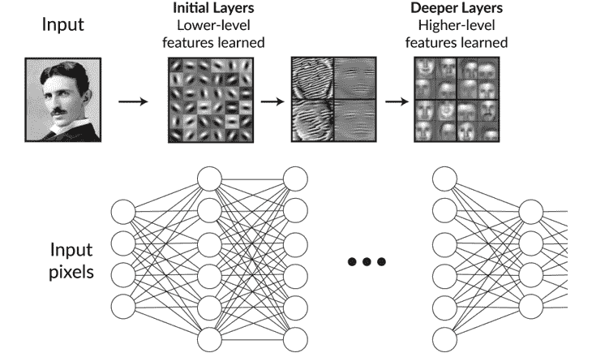

# 第二章：2\. 机器学习与深度学习

概览

在本章中，我们将开始使用 Keras 库创建人工神经网络（ANNs）。在利用该库进行建模之前，我们将介绍组成 ANNs 的数学知识——理解线性变换以及如何在 Python 中应用它们。你将牢固掌握构成 ANNs 的数学基础。到本章结束时，我们将通过使用 Keras 构建一个逻辑回归模型来应用这些知识。

# 介绍

在上一章中，我们讨论了机器学习的一些应用，甚至使用 scikit-learn Python 包构建了模型。上一章讲解了如何预处理现实世界的数据集，以便用于建模。为此，我们将所有变量转换为数值数据类型，并将`categorical`变量转换为`dummy`变量。我们使用`logistic regression`算法，根据`online shoppers purchasing intention`数据集中的购买意图对网站用户进行分类。通过将`regularization`添加到数据集中以提高模型的性能，我们进一步提升了模型构建技能。

在本章中，我们将继续学习如何构建机器学习模型，并扩展我们的知识，使我们能够使用 Keras 包构建一个`人工神经网络`（`ANN`）。(记住，`ANNs`代表一类大型的机器学习算法，因为它们的结构类似于人类大脑中的神经元。)

`Keras`是一个专门用于构建神经网络的机器学习库。虽然 scikit-learn 的功能涵盖了更广泛的机器学习算法，但`scikit-learn`在神经网络方面的功能较为有限。

`ANNs`可以用于与其他算法相同的机器学习任务，例如将`logistic regression`用于`classification`任务，将`linear regression`用于`regression`问题，将`k-means`用于`clustering`。每当我们开始解决任何机器学习问题时，要确定它属于哪种任务（`regression`、`classification`或`clustering`），我们需要问以下问题：

+   （`classification`任务）或者你也可以预测值本身（这将是一个`regression`问题）。每种情况可能导致不同的后续操作或交易策略。

    下图展示了一个`candlestick chart`。它描述了金融数据中的价格波动，并展示了一只股票的价格。颜色表示股票价格在每个时间段内是上涨（绿色）还是下跌（红色），每根蜡烛图展示了数据的开盘、收盘、最高和最低值——这些都是股票价格的重要信息。

    注意

    你可以在此处找到本章的高质量彩色图片：[`packt.live/38nenXS`](https://packt.live/38nenXS)。

    建模这些数据的一个目标是预测第二天发生的情况。一个`分类`任务可能会预测股价是上涨还是下跌，由于只有两个可能的值，这将是一个二元分类任务。另一种选择是预测第二天股价的具体数值。由于预测的数值是一个`连续`变量，这将是一个`回归`任务：

![图 2.1：一个烛台图，显示了一个月内股票指数的变化]

](img/B15777_02_01.jpg)

图 2.1：一个烛台图，显示了一个月内股票指数的变化

+   **我们是否有合适的标注数据来训练模型？** 对于监督学习任务，我们必须至少拥有一些标注数据才能训练模型。例如，如果我们想建立一个模型来将图像分类为狗的图像和猫的图像，我们需要训练数据、图像本身以及数据的标签，指示它们是狗的图像还是猫的图像。人工神经网络通常需要大量的数据。对于图像分类，这可能需要数百万张图像来开发准确、强大的模型。在决定哪种算法适用于特定任务时，这可能是一个决定性因素。

人工神经网络（ANNs）是一种机器学习算法，可以用于解决任务。它们在某些方面表现优秀，但在其他方面也有缺点，因此在选择该算法之前，应该考虑这些优缺点。深度学习网络与单层人工神经网络的区别在于它们的“深度”——即网络中隐藏层的总数。

因此，深度学习实际上只是机器学习的一个特定子组，依赖于具有多层的人工神经网络。我们经常接触到深度学习的结果，无论是图像分类模型，例如帮助在 Facebook 照片中标记朋友的朋友识别模型，还是推荐算法，例如帮助在 Spotify 上推荐你下一首最喜欢的歌曲。由于多种原因，深度学习模型正在逐渐取代传统的机器学习模型，包括深度学习模型擅长处理的非结构化数据规模的不断扩大和计算成本的降低。

是否选择使用人工神经网络还是传统机器学习算法，如线性回归和决策树，取决于经验以及对算法本身工作原理的理解。因此，使用传统机器学习算法或人工神经网络的好处将在下一节中提到。

## 人工神经网络相对于传统机器学习算法的优势

+   `ImageNet 挑战赛`（一个大规模的视觉识别挑战，旨在将图像分类为`1000 个类别`），人工神经网络在准确性上可以超过人类。

+   `逻辑回归` 和 `决策树` 在性能上存在平台期，而人工神经网络架构能够学习更高层次的特征——即输入特征的非线性组合，这些特征可能对分类或回归任务至关重要。这使得人工神经网络在提供大量数据时表现更好——尤其是那些具有深度架构的人工神经网络。例如，参加 ImageNet 挑战的人工神经网络需要提供 `1400 万图像` 进行训练。下图展示了深度学习算法和传统机器学习算法在数据量增加时的性能扩展：


图 2.2：深度学习算法和传统机器学习算法在数据量增加时的性能扩展

+   **无需特征工程**：人工神经网络能够识别出在建模过程中哪些特征是重要的，从而可以直接从原始数据进行建模。例如，在对狗和猫图像进行二分类时，不需要定义像动物的颜色、大小或体重等特征。图像本身就足以让人工神经网络成功地进行分类。在传统的机器学习算法中，这些特征必须通过手动和耗时的迭代过程进行工程化。

+   `16 层深度学习模型` 被 `ImageNet` 用来对 `1000 种随机物体` 进行分类。模型中学到的权重可以转移到其他物体的分类任务上，且所需时间大大减少。

然而，使用传统机器学习算法相对于人工神经网络（ANN）仍有一些优势，如下节所述。

## 传统机器学习算法相较于人工神经网络（ANN）的优势

+   `VGG-16` 拥有超过 `138 百万参数`，并且需要 `1400 万手工标注的图像` 来训练并学习所有的参数。

+   **具有成本效益**：无论是财务上还是计算上，深度网络训练通常需要大量的计算能力和时间。这需要大量的资源，而这些资源可能并不是每个人都能获得的。此外，这些模型的调优过程非常耗时，并且需要领域专家熟悉模型的内部机制，才能达到最佳性能。

+   `黑盒`，虽然它们在分类图像和其他任务时表现成功，但理解预测是如何产生的却是直觉上难以理解的，并且埋藏在层层计算中。因此，解释结果需要更多的努力。

## 层次化数据表示

人工神经网络之所以能够表现如此出色的原因之一是，网络中的大量层次允许它在许多不同层次上学习数据的表示。以下图示说明了这一点，图中展示了用于识别人脸的 ANN 的表示。在模型的低层，学习到的是简单的特征，如边缘和梯度，可以通过观察初始层中学习到的特征看出。当模型逐步推进时，低层特征的组合激活，形成面部部分，在模型的更高层，学习到的是通用的人脸。这就是特征层次结构，它展示了这种层级表示在模型构建和解释中的强大作用。

深度神经网络在实际应用中的输入示例通常包括图像、视频和自然语言文本。深度神经网络所学习的特征层次结构使得它们能够发现未标注、未结构化数据中的潜在结构，如图像、视频和自然语言文本，这使得它们在处理实际数据时非常有用——这些数据通常是未经处理的原始数据。

以下图示展示了深度学习模型学习到的表示的一个例子——低层特征如`边缘`和`梯度`会共同激活，形成通用的面部形状，这些可以在更深层的网络中看到：



图 2.3：深度学习模型各部分学习到的表示

随着深度神经网络变得更加易于使用，许多公司开始利用它们的应用。以下是一些使用人工神经网络（ANNs）的公司示例：

+   **Yelp**：Yelp 使用深度神经网络更高效地处理、分类和标注其图片。由于照片是 Yelp 评论的一个重要方面，Yelp 公司特别注重对照片的分类和归类。通过深度神经网络，这一过程得以更加高效地实现。

+   **Clarifai**：这家基于云计算的公司能够利用深度神经网络模型对图片和视频进行分类。

+   **Enlitic**：这家公司使用深度神经网络来分析医学影像数据，如 X 光或 MRI。使用这种网络技术可以提高诊断准确性，减少诊断时间和成本。

现在我们理解了使用人工神经网络（ANNs）的潜在应用后，我们可以理解它们工作的背后数学原理。尽管它们看起来可能令人生畏且复杂，但它们可以分解为一系列线性和非线性变换，而这些变换本身是容易理解的。一个 ANN 是通过按顺序组合一系列线性和非线性变换创建的。下一部分将讨论线性变换的基本组件和操作，这些变换构成了 ANN 的数学基础。

# 线性变换

在这一部分，我们将介绍线性变换。线性变换是使用人工神经网络（ANN）进行建模的核心。事实上，所有的 ANN 建模过程都可以被看作是一系列的线性变换。线性变换的工作组件包括标量、向量、矩阵和张量。像`加法`、`转置`和`乘法`这样的操作会作用于这些组件。

## 标量、向量、矩阵和张量

`标量`、`向量`、`矩阵`和`张量`是任何深度学习模型的实际组件。理解如何使用这些组件，并理解可以对它们执行的操作，对于理解 ANN 的工作原理至关重要。`标量`、`向量`和`矩阵`是`张量`这一通用实体的例子，因此，在本章中可能会使用`张量`这个术语，但它可以指代任何组件。`标量`、`向量`和`矩阵`是指具有特定维度数的`张量`。

`张量`的秩是一个属性，用来确定`张量`所跨越的维度数。每个概念的定义如下：

+   `张量`。例如，某一给定点的温度是一个`标量`场。

+   `张量`。给定物体的`速度`是一个`向量`场的例子，因为它会在`二维 (x,y)` 或 `三维 (x,y,z)` 空间中具有一个速度。

+   `矩阵`是跨越二维的矩形数组，包含单一的数字。它们是二阶`张量`的例子。`矩阵`的一个应用实例是用于存储给定物体随时间变化的`速度`。`矩阵`的一个维度包含给定方向上的速度，而另一个`矩阵`维度则包含每个给定的时间点。

+   `张量`是封装`标量`、`向量`和`矩阵`的通用实体。通常，该名称用于秩为`3`或以上的`张量`。一个应用实例是存储多个物体随时间变化的`速度`。`矩阵`的一个维度包含给定方向上的速度，另一个`矩阵`维度包含每个给定的时间点，第三个维度描述各种物体。

以下图示展示了`标量`、`向量`、`矩阵`和`三维张量`的一些示例：


图 2.4：标量、向量、矩阵和张量的可视化表示

## 张量加法

`张量`可以相加以创建新的`张量`。我们将在本章中使用矩阵作为例子，但这一概念可以扩展到任何秩的`张量`。在特定条件下，`矩阵`可以与`标量`、`向量`以及其他`矩阵`进行相加。

如果两个矩阵形状相同，它们可以相加（或相减）。对于这样的矩阵加法，结果矩阵是通过输入矩阵按元素相加得出的。因此，结果矩阵将与两个输入矩阵具有相同的形状。我们可以定义矩阵 C = [cij] 为矩阵和 **C = A + B**，其中 cij = aij + bij，并且 *`C`* 中的每个元素都是 *`A`* 和 *`B`* 中相同元素的和。矩阵加法是交换律的，这意味着 **A + B = B + A**，顺序无关。矩阵加法也是结合律的，这意味着即使加法顺序不同，或者操作应用多次，结果也会相同：**A + (B + C) = (A + B) + C**。

相同的矩阵加法原则适用于 `标量`、`向量` 和 `张量`。以下是一个示例：


图 2.5：矩阵与矩阵相加的示例

`标量`也可以加到`矩阵`中。在这里，`矩阵`的每个元素都会单独加上`标量`，如下图所示：


图 2.6：矩阵与标量相加的示例

如果两个矩阵的列数相同，可以将向量添加到矩阵中。这就是所谓的广播（broadcasting）。

## 练习 2.01：对向量、矩阵和张量进行各种操作

注意

本章中的练习和活动需要你在系统上安装 Python 3.7、Jupyter 和 NumPy。所有的练习和活动将主要在 Jupyter Notebook 中进行开发。除非有特别指示，否则建议为不同的任务保持独立的 Notebook。使用以下链接从本书的 GitHub 仓库下载它们：[`packt.live/2vpc9rO`](https://packt.live/2vpc9rO)。

在这个练习中，我们将演示如何在 Python 中创建并处理`向量`、`矩阵`和`张量`。我们假设你对标量已有一定了解。所有这些操作都可以通过 NumPy 库中的`array`和`matrix`函数来实现。任何秩的张量都可以通过 NumPy 的`array`函数创建。

在开始之前，你应在工作目录中设置本章的文件和文件夹，使用类似于上一章的结构和命名约定。你可以通过与上面的 GitHub 仓库进行对比来验证你的文件夹结构。

按照以下步骤进行此练习：

1.  打开 Jupyter Notebook 实现这个练习。导入必要的依赖项。创建一个`一维数组`，或`向量`，如下所示：

    ```py
    import numpy as np
    vec1 = np.array([1, 2, 3, 4, 5, 6, 7, 8, 9, 10])
    vec1
    ```

    上面的代码产生了以下输出：

    ```py
    array([ 1, 2, 3, 4, 5, 6, 7, 8, 9, 10])
    ```

1.  使用`array`函数创建一个`二维数组`，或`矩阵`：

    ```py
    mat1 = np.array([[1, 2, 3], [4, 5, 6], [7, 8, 9], [10, 11, 12]])
    mat1
    ```

    上面的代码产生了以下输出：

    ```py
    array([[ 1, 2, 3],
           [ 4, 5, 6],
           [ 7, 8, 9],
           [10, 11, 12]])
    ```

1.  使用`matrix`函数创建矩阵，这将显示类似的输出：

    ```py
    mat2 = np.matrix([[1, 2, 3], [4, 5, 6], \
                      [7, 8, 9], [10, 11, 12]])
    ```

1.  使用`array`函数创建一个`三维数组`或`张量`：

    ```py
    ten1 = np.array([[[1, 2, 3], [4, 5, 6]], \
                     [[7, 8, 9], [10, 11, 12]]])
    ten1
    ```

    上述代码产生以下输出：

    ```py
    array([[[ 1, 2, 3],
            [ 4, 5, 6],
            [[ 7, 8, 9],
            [10, 11, 12]]])
    ```

1.  确定给定`向量`、`矩阵`或`张量`的`形状`非常重要，因为某些操作（如`加法`和`乘法`）只能应用于特定形状的组件。可以使用`shape`方法来确定 n 维数组的形状。编写以下代码以确定`vec1`的`形状`：

    ```py
    vec1.shape
    ```

    上述代码产生以下输出：

    ```py
    (10, )
    ```

1.  编写以下代码以确定`mat1`的`形状`：

    ```py
    mat1.shape
    ```

    上述代码产生以下输出：

    ```py
    (4, 3)
    ```

1.  编写以下代码以确定`ten1`的`形状`：

    ```py
    ten1.shape
    ```

    上述代码产生以下输出：

    ```py
    (2, 2, 3)
    ```

1.  创建一个具有`四行`和`三列`的`矩阵`，可以使用任意数字。打印结果矩阵以验证其`形状`：

    ```py
    mat1 = np.matrix([[1, 2, 3], [4, 5, 6], [7, 8, 9], [10, 11, 12]])
    mat1
    ```

    上述代码产生以下输出：

    ```py
    matrix([[ 1, 2, 3],
            [ 4, 5, 6],
            [ 7, 8, 9],
            [10, 11, 12]])
    ```

1.  创建另一个具有`四行`和`三列`的矩阵，可以使用任意数字。打印结果矩阵以验证其`形状`：

    ```py
    mat2 = np.matrix([[2, 1, 4], [4, 1, 7], [4, 2, 9], [5, 21, 1]])
    mat2
    ```

    上述代码产生以下输出：

    ```py
    matrix([[ 2, 1, 4],
            [ 4, 1, 7],
            [ 4, 2, 9],
            [ 5, 21, 1]])
    ```

1.  将`矩阵 1`和`矩阵 2`相加：

    ```py
    mat3 = mat1 + mat2
    mat3
    ```

    上述代码产生以下输出：

    ```py
    matrix([[ 3, 3, 7],
            [ 8, 6, 13],
            [ 11, 10, 18],
            [ 15, 32, 13]])
    ```

1.  使用以下代码将`标量`加到`数组`中：

    ```py
    mat1 + 4
    ```

    上述代码产生以下输出：

    ```py
    matrix([[ 5, 6, 7],
            [ 8, 9, 10],
            [ 11, 12, 13],
            [ 14, 15, 16]])
    ```

在这个练习中，我们学习了如何执行`向量`、`矩阵`和`张量`的各种操作。我们还学会了如何确定`矩阵`的`形状`。

注意

若要访问此特定部分的源代码，请参考[`packt.live/2NNQ7VA`](https://packt.live/2NNQ7VA)。

你还可以在线运行这个示例，访问[`packt.live/3eUDtQA`](https://packt.live/3eUDtQA)。

## 重塑

任何大小的`张量`都可以被重塑，只要总元素数量保持不变。例如，`(4x3)矩阵`可以被重塑为`(6x2)矩阵`，因为它们的元素总数都是`12`。`秩`（即`维度数`）也可以在`重塑`过程中发生变化。例如，`(4x3)矩阵`可以重塑为`(3x2x2)张量`，在这里，`秩`从`2`变为`3`。`(4x3)矩阵`还可以重塑为`(12x1)向量`，此时，`秩`从`2`变为`1`。

下图展示了张量重塑的过程——左侧是一个`形状(4x1x3)`的张量，它可以被重塑为`形状(4x3)`的张量。在这里，元素的数量（`12`）保持不变，尽管张量的`形状`和`秩`发生了变化：


图 2.7：将(4x1x3)张量重塑为(4x3)张量的可视化表示

## 矩阵转置

矩阵的 `转置` 是一种操作，它使矩阵沿其对角线翻转。当发生这种情况时，行变为列，反之亦然。转置操作通常用矩阵上方的 `T` 上标表示。任何秩的张量也可以转置：


图 2.8：矩阵转置的可视化表示

下图显示了矩阵 `A` 和 `B` 的转置特性：


图 2.9：矩阵转置特性，其中 A 和 B 是矩阵

一个方阵（即行数和列数相等的矩阵）被称为对称的，如果矩阵的转置等于原矩阵。

## 练习 2.02：矩阵重塑和转置

在这个练习中，我们将演示如何重塑和转置矩阵。这个过程非常重要，因为某些操作只有在张量的维度匹配时才能应用。例如，张量乘法只有在两个张量的内维度匹配时才能应用。重塑或转置张量是修改张量维度的一种方式，以确保可以应用某些操作。按照以下步骤完成此练习：

1.  从开始菜单打开一个 Jupyter notebook 来实现这个练习。创建一个 `二维数组`，具有 `四行` 和 `三列`，如下所示：

    ```py
    import numpy as np
    mat1 = np.array([[1, 2, 3], [4, 5, 6], [7, 8, 9], [10, 11, 12]])
    mat1
    ```

    这将产生以下输出：

    ```py
    array([[ 1,  2,  3],
           [ 4,  5,  6],
           [ 7,  8,  9],
           [10, 11, 12]])
    ```

    我们可以通过查看矩阵的形状来确认它的维度：

    ```py
    mat1.shape
    ```

    输出如下所示：

    ```py
    (4, 3)
    ```

1.  将数组重塑为 `三行`和 `四列`，如下所示：

    ```py
    mat2 = np.reshape(mat1, [3,4])
    mat2
    ```

    上述代码生成了以下输出：

    ```py
    array([[ 1, 2, 3, 4],
           [ 5, 6, 7, 8],
           [ 9, 10, 11, 12]])
    ```

1.  通过打印数组的 `shape` 来确认这一点：

    ```py
    mat2.shape
    ```

    上述代码生成了以下输出：

    ```py
    (3, 4)
    ```

1.  将矩阵重塑为一个 `三维数组`，如下所示：

    ```py
    mat3 = np.reshape(mat1, [3,2,2])
    mat3
    ```

    上述代码生成了以下输出：

    ```py
    array([[[ 1, 2],
            [ 3, 4]],
           [[ 5, 6],
            [ 7, 8]],
           [[ 9, 10],
            [ 11, 12]]]) 
    ```

1.  打印数组的 `shape` 来确认其维度：

    ```py
    mat3.shape
    ```

    上述代码生成了以下输出：

    ```py
    (3, 2, 2)
    ```

1.  将矩阵重塑为一个 `一维数组`，如下所示：

    ```py
    mat4 = np.reshape(mat1, [12])
    mat4
    ```

    上述代码生成了以下输出：

    ```py
    array([ 1, 2, 3, 4, 5, 6, 7, 8, 9, 10, 11, 12])
    ```

1.  通过打印数组的 `shape` 来确认这一点：

    ```py
    mat4.shape
    ```

    上述代码生成了以下输出：

    ```py
    (12, )
    ```

1.  对数组进行转置会使其沿对角线翻转。对于一维数组，行向量会转换为列向量，反之亦然。对于二维数组或矩阵，每一行变为一列，反之亦然。使用 `T` 方法调用数组的转置：

    ```py
    mat = np.matrix([[1, 2, 3], [4, 5, 6], [7, 8, 9], [10, 11, 12]])
    mat.T
    ```

    下图显示了上述代码的输出：

    

    图 2.10：转置函数的可视化演示

1.  检查矩阵及其转置的 `shape`，以验证维度是否已改变：

    ```py
    mat.shape
    ```

    上述代码生成了以下输出：

    ```py
    (4, 3)
    ```

1.  检查转置矩阵的`shape`：

    ```py
    mat.T.shape
    ```

    上面的代码生成了以下输出：

    ```py
    (3, 4)
    ```

1.  验证当矩阵被重塑和转置时，矩阵元素不匹配：

    ```py
    np.reshape(mat1, [3,4]) == mat1.T
    ```

    上面的代码生成了以下输出：

    ```py
    array([[ True, False, False, False],
           [False, False, False, False],
           [False, False, False, True]], dtype = bool)
    ```

    在这里，我们可以看到只有第一个和最后一个元素匹配。

在这一部分中，我们介绍了线性代数的一些基本组成部分，包括标量、向量、矩阵和张量。我们还介绍了一些基本的线性代数组件操作，如加法、转置和重塑。通过这些操作，我们学习了如何通过使用`NumPy`库中的函数将这些概念付诸实践。

注意

要访问此特定部分的源代码，请参考[`packt.live/3gqBlR0`](https://packt.live/3gqBlR0)。

你也可以在网上运行这个例子，访问[`packt.live/3eYCChD`](https://packt.live/3eYCChD)。

在下一部分中，我们将通过讲解与人工神经网络（ANN）相关的最重要的变换之一——矩阵乘法，来扩展我们对线性变换的理解。

## 矩阵乘法

矩阵乘法是神经网络运算的基础。虽然加法的规则简单直观，但矩阵和张量的乘法规则则更为复杂。矩阵乘法不仅仅是简单的逐元素相乘，而是实现了一个更复杂的过程，涉及一个矩阵的整个行和另一个矩阵的整个列。在这一部分中，我们将解释二维张量或矩阵的乘法如何运作；然而，较高阶的张量也可以进行乘法运算。

给定一个矩阵，A = [aij]m x n，另一个矩阵，B = [bij]n x p，两个矩阵的乘积是 C = AB = [Cij]m x p，其中每个元素 cij 按元素定义为 。注意，结果矩阵的形状与矩阵乘积的外维度相同，或者说是第一个矩阵的行数和第二个矩阵的列数。为了使乘法成立，矩阵乘积的内维度必须匹配，或者说第一个矩阵的列数和第二个矩阵的列数必须相同。

矩阵乘法的内外维度概念可以从下图中看到：


图 2.11: 矩阵乘法中内外维度的可视化表示

与矩阵加法不同，矩阵乘法不是交换律的，这意味着矩阵在乘积中的顺序很重要：


图 2.12: 矩阵乘法不是交换律的

例如，假设我们有以下两个矩阵：


图 2.13：两个矩阵 A 和 B

构建乘积的一种方法是先将矩阵*`A`*与*`B`*相乘：


图 2.14：矩阵 A 与 B 相乘的可视化表示

这将得到一个`2x2`矩阵。构建乘积的另一种方法是先将*`B`*与*`A`*相乘：


图 2.15：矩阵 B 与 A 相乘的可视化表示

在这里，我们可以看到由`3x3`矩阵的乘积形成的矩阵与由**AB**乘积形成的矩阵非常不同。

标量矩阵乘法要简单得多，它只是矩阵中每个元素与标量相乘的结果，因此 λA = [λaij]m x n，其中 λ 是标量，*`A`* 是矩阵。

在接下来的练习中，我们将通过使用`NumPy`库在 Python 中执行矩阵乘法来实践我们的理解。

## 练习 2.03：矩阵乘法

在本练习中，我们将展示如何将矩阵相乘。请按照以下步骤完成此练习：

1.  从开始菜单打开一个 Jupyter notebook 来实现此练习。

    为了演示矩阵乘法的基本原理，从两个相同形状的矩阵开始：

    ```py
    import numpy as np
    mat1 = np.array([[1, 2, 3], [4, 5, 6], \
                     [7, 8, 9], [10, 11, 12]])
    mat2 = np.array([[2, 1, 4], [4, 1, 7], \
                     [4, 2, 9], [5, 21, 1]])
    ```

1.  由于这两个矩阵形状相同且不是方阵，因此不能直接相乘，否则，乘积的内维度将不匹配。我们可以通过对其中一个矩阵进行转置来解决这个问题；然后，就可以进行乘法运算。取第二个矩阵的转置，这意味着一个`(4x3)矩阵`与一个`(3x4)矩阵`相乘。结果将是一个`(4x4)矩阵`。使用`dot`方法进行乘法运算：

    ```py
    mat1.dot(mat2.T)
    ```

    上述代码产生了以下输出：

    ```py
    array([[ 16, 27, 35, 50],
           [ 37, 63, 80, 131],
           [ 58, 99, 125, 212],
           [ 79, 135, 170, 293]])
    ```

1.  取第一个矩阵的转置，这意味着一个`(3x4)矩阵`与一个`(4x3)矩阵`相乘。结果将是一个`(3x3)矩阵`：

    ```py
    mat1.T.dot(mat2)
    ```

    上述代码产生了以下输出：

    ```py
    array([[ 96, 229, 105],
           [ 111, 254, 126],
           [ 126, 279, 147]])
    ```

1.  重新调整其中一个数组的形状，以确保矩阵乘法的内维度匹配。例如，我们可以将第一个数组调整为`(3x4)矩阵`，而不是转置。请注意，结果与转置时的结果不同：

    ```py
    np.reshape(mat1, [3,4]).dot(mat2)
    ```

    上述代码产生了以下输出：

    ```py
    array([[ 42, 93, 49],
           [ 102, 193, 133],
           [ 162, 293, 217]])
    ```

在本练习中，我们学习了如何将两个矩阵相乘。这个概念不仅适用于二阶张量，还可以应用于所有阶张量。如果不同阶的张量的内维度匹配，它们甚至可以进行乘法运算。

注意

要访问此特定部分的源代码，请参见[`packt.live/38p0RD7`](https://packt.live/38p0RD7)。

您也可以在线运行此示例，网址是[`packt.live/2VYI1xZ`](https://packt.live/2VYI1xZ)。

下一道练习展示了如何将三维张量相乘。

## 练习 2.04：张量乘法

在本练习中，我们将应用矩阵乘法知识到高阶张量。请按照以下步骤完成此练习：

1.  打开开始菜单中的 Jupyter 笔记本来实现此练习。首先使用 NumPy 库和`array`函数创建一个三维张量。导入所有必要的依赖：

    ```py
    import numpy as np
    mat1 = np.array([[[1, 2, 3], [4, 5, 6]], [[1, 2, 3], [4, 5, 6]]])
    mat1
    ```

    上述代码产生以下输出：

    ```py
    array([[[ 1, 2, 3],
            [ 4, 5, 6],
            [[ 1, 2, 3],
            [ 4, 5, 6]]])
    ```

1.  使用`shape`方法确认形状：

    ```py
    mat1.shape
    ```

    该张量的形状为(2x2x3)。

1.  创建一个新的`三维张量`，我们可以用它来与张量相乘。对原始矩阵取转置：

    ```py
    mat2 = mat1.T
    mat2
    ```

    上述代码产生以下输出：

    ```py
    array([[[ 1, 1],
            [ 4, 4]],
           [[ 2, 2],
            [ 5, 5]],
           [[ 3, 3],
            [ 6, 6]]])
    ```

1.  使用`shape`方法确认形状：

    ```py
    mat2.shape
    ```

    该张量的形状为(3x2x2)。

1.  取`两个矩阵`的`点积`，如下所示：

    ```py
    mat3 = mat2.dot(mat1)
    mat3
    ```

    上述代码产生以下输出：

    ```py
    array([[[[ 5, 7, 9],
             [ 5, 7, 9]],
            [[ 20, 28, 36],
             [ 20, 28, 36]]],
           [[[ 10, 14, 18],
             [ 10, 14, 18]],
            [[ 25, 35, 45],
             [ 25, 35, 45]]],
           [[[ 15, 21, 27],
             [ 15, 21, 27]],
            [[ 30, 42, 54],
             [ 30, 42, 54]]]])
    ```

1.  查看此结果张量的`形状`：

    ```py
    mat3.shape
    ```

    上述代码产生以下输出：

    ```py
    (3, 2, 2, 3)
    ```

    现在，我们有了一个四维张量。

在本练习中，我们学习了如何使用 Python 中的 NumPy 库执行矩阵乘法。尽管在使用 Keras 创建 ANN 时，我们不需要直接执行矩阵乘法，但理解其底层数学原理仍然是有用的。

注释

要访问此特定部分的源代码，请参考[`packt.live/31G1rLn`](https://packt.live/31G1rLn)。

你也可以在网上运行此示例，网址为[`packt.live/2AriZjn`](https://packt.live/2AriZjn)。

# Keras 简介

构建 ANN 涉及创建节点的层。每个节点可以被视为在训练过程中学习的权重张量。一旦 ANN 被拟合到数据，预测是通过逐层将输入数据与权重矩阵相乘来进行的，当需要时应用任何其他线性变换，如激活函数，直到到达最终输出层。每个权重张量的大小由输入节点的形状和输出节点的形状决定。例如，在一个单层 ANN 中，我们的单一隐藏层的大小可以如下所示：


图 2.16：解决单层 ANN 的隐藏层维度

如果输入的特征矩阵有`n`行，或观测值，和`m`列，或特征，并且我们希望预测的目标有`n`行（每个观测值一个行）和一列（预测值），那么我们可以通过需要的方式来确定隐藏层的大小，以使矩阵乘法有效。以下是单层人工神经网络（ANN）的表示：


图 2.17：单层 ANN 的表示

在这里，我们可以确定权重矩阵的大小将是（`mx1`），以确保矩阵乘法是有效的。

如果我们在一个 ANN 中有多个隐藏层，那么我们在这些权重矩阵的大小上将有更多自由。事实上，可能性是无穷的，具体取决于层数和每层的节点数。然而，在实践中，某些架构设计比其他设计更有效，正如我们将在本书中学到的那样。

一般来说，Keras 将神经网络构建中的大部分线性代数进行了抽象，使用户能够专注于设计架构。对于大多数网络，只需要输入大小、输出大小和每个隐藏层中的节点数即可在 Keras 中创建网络。

Keras 中最简单的模型结构是`Sequential`模型，可以从`keras.models`导入。`Sequential`类的模型描述了一个由一系列层组成的人工神经网络（ANN）。可以如下实例化`Sequential`模型：

```py
from keras.models import Sequential
model = Sequential()
```

可以向该模型实例添加层，以创建模型的结构。

注意

在初始化模型之前，使用 NumPy 的随机库中的`seed`函数和 TensorFlow 的随机库中的`set_seed`函数设置种子是很有帮助的。

## 层类型

层的概念是 Keras 核心 API 的一部分。可以将层看作是节点的组合，在每个节点上发生一系列计算。在 Keras 中，层的所有节点都可以通过初始化该层本身来初始化。通用层节点的单独操作可以通过以下图示看到。在每个节点上，输入数据通过矩阵乘法与一组权重相乘，正如我们在本章之前所学到的那样。权重与输入的乘积之和会被应用，这可能包括或不包括偏置，如下图中输入节点等于`1`所示。还可以对该矩阵乘法的输出应用进一步的函数，例如激活函数：


图 2.18：层节点的示意图

Keras 中一些常见的层类型如下：

+   **全连接层**：这是一个完全连接的层，其中层的所有节点都直接连接到所有输入和所有输出。用于分类或回归任务的人工神经网络（ANNs）通常在其架构中有很大一部分层采用这种类型。

+   **卷积层**：这种层类型创建一个卷积核，并将其与输入层进行卷积，产生一个输出张量。此卷积可以发生在一个或多个维度上。用于图像分类的 ANNs 通常在其架构中包含一个或多个卷积层。

+   **Pooling**：这种类型的层用于减少输入层的维度。常见的池化类型包括最大池化，其中给定窗口的最大值被传递到输出，或平均池化，其中窗口的平均值被传递到输出。这些层通常与卷积层结合使用，目的是减少后续层的维度，从而减少训练参数的数量，同时尽可能减少信息损失。

+   **Recurrent**：递归层从序列中学习模式，因此每个输出依赖于前一步的结果。模拟序列数据（如自然语言或时间序列数据）的人工神经网络（ANNs）通常会包含一个或多个递归层类型。

Keras 中有其他层类型；然而，在使用 Keras 构建模型时，这些是最常见的层类型。

让我们通过实例化一个 `Sequential` 类的模型并向模型中添加一个 `Dense` 层来演示如何添加层。可以按我们希望执行计算的顺序，将后续层添加到模型中，这些层可以从 `keras.layers` 导入。需要指定单元或节点的数量。这个值也会决定该层输出结果的形状。可以通过以下方式将 `Dense` 层添加到 `Sequential` 模型中：

```py
from keras.layers import Dense
from keras.models import Sequential
input_shape = 20
units = 1
model.add(Dense(units, input_dim=input_shape))
```

注意

在第一层之后，不需要指定输入维度，因为它由前一层决定。

## 激活函数

激活函数通常应用于节点输出，以限制或限定其值。每个节点的值是没有界限的，可能具有任何值，从负无穷大到正无穷大。在神经网络中，这可能会带来问题，因为权重和损失的计算结果可能会趋向无穷大，产生无法使用的结果。激活函数在这方面可以提供帮助，通过限定值的范围。通常，这些激活函数将值推向两个极限。激活函数还用于决定节点是否应“激活”。常见的激活函数如下：

+   **Step** 函数：如果值超过某个阈值，则为非零值；否则为零。

+   **Linear** 函数：，即输入值的标量乘法。

+   **Sigmoid** 函数：，例如平滑的阶跃函数，具有平滑的梯度。由于其值被限制在 0 到 1 之间，这个激活函数对于分类任务非常有用。

+   `x=0`。

+   **ReLU** 函数：，否则为 0。

现在我们已经了解了一些主要组件，我们可以开始看看如何利用这些组件创建有用的神经网络。事实上，我们可以用本章学到的所有概念来创建一个逻辑回归模型。逻辑回归模型通过计算输入与一组学习到的权重的乘积之和，然后将输出通过一个逻辑函数来操作。可以通过一个具有 Sigmoid 激活函数的单层神经网络来实现这一点。

激活函数可以以与添加层相同的方式添加到模型中。激活函数将应用于模型中前一步的输出。可以按如下方式向`Sequential`模型添加`tanh`激活函数：

```py
from keras.layers import Dense, Activation
from keras.models import Sequential
input_shape = 20
units = 1
model.add(Dense(units, input_dim=input_shape))
model.add(Activation('tanh'))
```

注意

激活函数也可以通过将其作为参数添加到定义层时来添加到模型中。

## 模型拟合

一旦模型的架构创建完成，必须对模型进行编译。编译过程配置所有学习参数，包括使用的优化器、要最小化的损失函数，以及可选的指标（例如准确度），这些指标将在模型训练的各个阶段进行计算。模型使用`compile`方法进行编译，如下所示：

```py
model.compile(optimizer='adam', loss='binary_crossentropy', \
              metrics=['accuracy'])
```

在模型编译后，就可以将其拟合到训练数据上。通过使用`fit`方法实例化模型来实现这一点。使用`fit`方法时有以下有用的参数：

+   *`X`*：用于拟合数据的训练特征数据的数组。

+   *`y`*：训练目标数据的数组。

+   **epochs**：运行模型的训练周期数。一个训练周期是对整个训练数据集的一次迭代。

+   **batch_size**：每次梯度更新时使用的训练数据样本数。

+   **validation_split**：用于验证的训练数据的比例，该数据将在每个训练周期后进行评估。

+   **shuffle**：指示是否在每个训练周期前打乱训练数据。

`fit`方法可以按以下方式在模型上使用：

```py
history = model.fit(x=X_train, y=y_train['y'], \
                    epochs=10, batch_size=32, \
                    validation_split=0.2, shuffle=False)
```

调用模型的`fit`方法时，保存其输出是有益的，因为它包含了模型在整个训练过程中的性能信息，包括每个周期后的损失值。如果定义了验证分割，损失将在每个周期后对验证集进行评估。同样，如果在训练中定义了任何指标，这些指标也会在每个周期后进行计算。绘制这些损失和评估指标有助于确定模型在各个训练周期上的性能。模型的损失函数随训练周期变化的图形可以如下可视化：

```py
import matplotlib.pyplot as plt
%matplotlib inline
plt.plot(history.history['loss'])
plt.show()
```

Keras 模型可以通过利用模型实例的`evaluate`方法进行评估。该方法返回损失值以及传递给模型用于训练的任何指标。当评估一个样本外的测试数据集时，可以按以下方式调用该方法：

```py
test_loss = model.evaluate(X_test, y_test['y'])
```

这些模型拟合步骤代表了使用 Keras 包构建、训练和评估模型时需要遵循的基本步骤。从这里开始，构建和评估模型的方式有无数种，具体取决于您希望完成的任务。在接下来的活动中，我们将创建一个人工神经网络（ANN）来执行与*第一章*《使用 Keras 的机器学习入门》相同的任务。事实上，我们将用 ANN 重现逻辑回归算法。因此，我们预计这两个模型之间的性能会相似。

## 活动 2.01：使用 Keras 创建逻辑回归模型

在本活动中，我们将使用 Keras 库创建一个基本模型。我们将执行与*第一章*《使用 Keras 的机器学习入门》相同的分类任务。我们将使用相同的在线购物购买意图数据集，并尝试预测相同的变量。

在上一章中，我们使用了逻辑回归模型来预测用户在给定关于在线会话行为和网页属性的各种特征时，是否会从网站购买产品。在本活动中，我们将介绍 Keras 库，尽管我们将继续使用之前介绍的库，如 `pandas`，以便轻松加载数据，和 `sklearn`，用于任何数据预处理和模型评估指标。

注意

已为您提供了预处理过的数据集，可以用于本次活动。您可以从 [`packt.live/2ApIBwT`](https://packt.live/2ApIBwT) 下载它们。

完成此活动的步骤如下：

1.  加载处理后的特征数据和目标数据集。

1.  将训练数据和目标数据分割为训练集和测试集。模型将拟合训练集，测试集将用于评估模型。

1.  从 `keras.models` 库中实例化一个 `Sequential` 类的模型。

1.  向模型实例中添加一个 `keras.layers` 包中的 `Dense` 类单层。节点数应等于特征数据集中的特征数量。

1.  向模型添加一个 sigmoid 激活函数。

1.  通过指定要使用的优化器、评估损失指标以及每个 epoch 后要评估的其他指标来编译模型实例。

1.  将模型拟合到训练数据，指定要运行的 epoch 数量和使用的验证集划分比例。

1.  绘制损失和其他评估指标与 epoch 之间的关系，这些指标将在训练集和验证集上进行评估。

1.  在测试数据集上评估损失和其他评估指标。

完成这些步骤后，您应该会得到以下预期输出：

```py
2466/2466 [==============================] - 0s 15us/step
The loss on the test set is 0.3632 and the accuracy is 86.902%
```

注意

本活动的解决方案可以在第 356 页找到。

在本次活动中，我们探讨了在 Keras 中创建人工神经网络（ANN）的一些基本概念，包括各种层类型和激活函数。我们使用这些组件创建了一个简单的逻辑回归模型，该模型给出的结果与我们在*第一章*《Keras 与机器学习入门》中使用的逻辑回归模型相似。我们学习了如何使用 Keras 库构建模型，使用实际数据集训练模型，并在测试数据集上评估模型的表现，以便提供对模型表现的公正评估。

# 总结

在本章中，我们涵盖了与机器学习相关的各种线性代数组件和操作。这些组件包括标量、向量、矩阵和张量。对这些张量应用的操作包括加法、转置和乘法——这些操作都是理解 ANN 底层数学的基础。

我们还学习了 Keras 包的一些基础知识，包括每个节点上发生的数学运算。我们复现了上一章中的模型，在该模型中，我们构建了一个逻辑回归模型来预测来自在线购物购买意图数据集的相同目标。然而，在这一章中，我们使用 Keras 库创建了一个基于人工神经网络（ANN）的模型，而不是使用 scikit-learn 的逻辑回归模型。我们通过使用 ANN 实现了相似的准确性。

本书接下来的章节将继续使用我们在本章中学到的相同概念；然而，我们将继续使用 Keras 包构建更复杂的 ANN。我们将通过创建具有多个隐藏层的模型，将 ANN 扩展到超过单层的结构。通过向我们的 ANN 中添加多个隐藏层，我们将把“深度”带入“深度学习”。我们还将解决欠拟合和过拟合的问题，因为它们与使用 ANN 训练模型相关。
