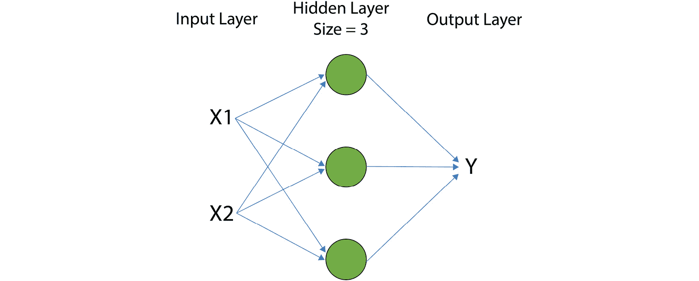

# 第三章：3\. 使用 Keras 的深度学习

概述

在本章中，你将尝试不同的神经网络架构。你将创建 Keras 顺序模型——构建单层和多层模型——并评估训练模型的性能。不同架构的网络将帮助你理解过拟合和欠拟合。到本章结束时，你将探索如何使用**早停**方法来应对对训练数据的过拟合问题。

# 引言

在上一章中，你了解了神经网络的数学基础，包括与`标量`、`向量`、`矩阵`和`张量`相关的`线性变换`。然后，你使用 Keras 实现了你的第一个神经网络，通过构建一个逻辑回归模型将网站用户分类为会购买和不会购买的人。

在本章中，你将扩展使用 Keras 构建神经网络的知识。本章介绍了深度学习的基础知识，并为你提供了必要的基础，使你能够构建高度复杂的神经网络架构。我们将从扩展`逻辑回归`模型到一个简单的单层神经网络开始，然后逐步进入具有多个隐藏层的更复杂的神经网络。

在这个过程中，你将了解神经网络的基本概念，包括用于做出预测的前向传播、计算损失、用于计算损失对模型参数导数的反向传播，最后是用于学习模型最佳参数的梯度下降。你还将了解如何根据`激活函数`、`损失函数`和`优化器`等不同的选择来构建和训练神经网络。

此外，你将学习如何评估模型，同时了解**过拟合**和**欠拟合**等问题，同时分析这些问题如何影响模型的性能以及如何检测它们。你将了解到在相同的数据集上评估模型的缺陷，以及将一部分可用数据集保留用于评估的替代方法。接着，你将学习如何比较模型在这两个数据集子集上的错误率，从而检测出如高偏差和高方差等问题。最后，你将学习一种叫做**早停**的技术，用于减少过拟合，该技术通过将模型的错误率与数据集的两个子集进行比较来实现。

# 构建你的第一个神经网络

在本节中，你将学习深度学习的表示和概念，例如**前向传播**—通过网络传播数据，乘以每个节点每个连接的输入值与权重的乘积，以及**反向传播**—计算损失函数相对于矩阵中权重的梯度，和**梯度下降**—用于寻找损失函数最小值的优化算法。

我们不会深入探讨这些概念，因为本书并不需要。然而，这部分内容将帮助任何想将深度学习应用于问题的人。

接下来，我们将开始使用 Keras 实现神经网络。此外，我们将坚持最简单的情况，即具有单个隐藏层的神经网络。你将学习如何在 Keras 中定义模型，选择**超参数**—在训练模型之前设置的模型参数，然后训练你的模型。在本节的最后，你将有机会通过在 Keras 中实现神经网络进行实践，以便你能够在数据集上执行分类并观察神经网络如何优于逻辑回归等简单模型。

## 逻辑回归到深度神经网络

在*第一章*，*使用 Keras 的机器学习简介*中，你学习了逻辑回归模型，然后在*第二章*，*机器学习与深度学习*中学习了如何使用 Keras 将其实现为顺序模型。从技术上讲，逻辑回归涉及一个非常简单的神经网络，只有一个隐藏层，且其隐藏层只有一个节点。

具有二维输入的逻辑回归模型概览可以在以下图片中看到。你在这张图片中看到的被称为一个**节点**或**单元**，在深度学习领域中由绿色圆圈表示。正如你可能已经注意到的那样，逻辑回归术语和深度学习术语之间存在一些差异。在逻辑回归中，我们将模型的参数称为**系数**和**截距**。在深度学习模型中，参数被称为**权重**（w）和**偏置**（b）：


图 3.1：具有二维输入的逻辑回归模型概览

在每个节点/单元处，输入会与一些权重相乘，然后将一个偏置项加到这些加权输入的和上。这可以在前一张图中节点上方的计算中看到。`inputs`是`X1`和`X2`，`weights`是`W1`和`W2`，`bias`是`b`。接下来，非线性函数（例如，在逻辑回归模型中是 sigmoid 函数）会应用于加权输入和偏置项的和，以计算节点的最终输出。在前一张图中的计算中，这是`σ`。在深度学习中，非线性函数被称为**激活函数**，节点的输出被称为该节点的**激活值**。

可以通过将逻辑回归节点/单元垂直堆叠在同一层上来构建单层神经网络，如下图所示。每个输入层的值，`X1`和`X2`，都传递给隐藏层的三个节点：



图 3.2：具有二维输入和大小为 3 的隐藏层的单层神经网络概览

还可以通过将多个处理节点层叠在一起构建多层神经网络，如下图所示。下图展示了一个具有二维输入的双层神经网络：


图 3.3：具有二维输入的双层神经网络概览

前两张图展示了神经网络最常见的表示方式。每个神经网络由**输入层**、**输出层**和一个或多个**隐藏层**组成。如果只有一个隐藏层，则该网络被称为**浅层神经网络**。另一方面，具有多个隐藏层的神经网络被称为**深层神经网络**，其训练过程被称为**深度学习**。

*图 3.2*展示了一个只有一个隐藏层的神经网络，因此这是一个浅层神经网络，而*图 3.3*中的神经网络有两个隐藏层，因此它是一个深层神经网络。输入层通常位于左侧。在*图 3.3*的情况下，这些是特征`X1`和`X2`，它们被输入到第一个隐藏层，该层有三个节点。箭头表示应用于输入的权重值。在第二个隐藏层处，第一个隐藏层的结果成为第二个隐藏层的输入。第一个和第二个隐藏层之间的箭头表示权重。输出通常是最右边的层，在*图 3.3*中，用`Y`标记的层表示输出。

注意

在某些资源中，您可能会看到一个网络，如前面图示所示，被称为**四层网络**。这是因为输入层和输出层与隐藏层一起计算。然而，更常见的惯例是只计算隐藏层，因此我们之前提到的网络将被称为二层网络。

在深度学习中，输入层的节点数等于输入数据的特征数，输出层的节点数等于输出数据的维度。然而，您需要选择隐藏层的节点数或隐藏层的大小。如果选择较大的层，模型会变得更加灵活，并能够建模更复杂的函数。这种灵活性的增加需要更多的训练数据和更多的计算来训练模型。开发者需要选择的参数称为`超参数`，包括层数和每层节点数等参数。常见的超参数包括训练的轮次和使用的损失函数。

在下一部分，我们将介绍在每个隐藏层之后应用的`激活函数`。

## 激活函数

除了层的大小，您还需要为每个添加到模型中的隐藏层选择一个激活函数，输出层也需要进行相同的选择。我们在逻辑回归模型中了解过 Sigmoid 激活函数。然而，在 Keras 中构建神经网络时，您可以选择更多的激活函数。例如，Sigmoid 激活函数是二分类任务中作为输出层激活函数的一个不错选择，因为 Sigmoid 函数的结果限制在 0 到 1 之间。一些常用的深度学习激活函数包括**Sigmoid**/**Logistic**、**tanh**（**双曲正切**）和**Rectified Linear Unit**（**ReLU**）。

以下图显示了`sigmoid`激活函数：


图 3.4：Sigmoid 激活函数

以下图显示了`tanh`激活函数：


图 3.5：tanh 激活函数

以下图显示了`ReLU`激活函数：


图 3.6：ReLU 激活函数

正如你在 *图 3.4* 和 *3.5* 中看到的，sigmoid 函数的输出始终在`0`到`1`之间，而 tanh 的输出始终在`-1`到`1`之间。这使得`tanh`在隐藏层中成为更好的选择，因为它保持了每层输出的平均值接近零。事实上，`sigmoid`仅在构建二元分类器的输出层的激活函数时是一个好选择，因为其输出可以解释为给定输入属于某一类的概率。

因此，`tanh`和`ReLU`是隐藏层激活函数的最常见选择。事实证明，在使用`ReLU`激活函数时，学习过程更快，因为对于大于`0`的输入，它具有固定的导数（或斜率），而在其他地方斜率为`0`。

注意

您可以在这里阅读更多关于 Keras 中所有可用激活函数的选择：[`keras.io/activations/`](https://keras.io/activations/)。

## 用于进行预测的前向传播

神经网络通过执行**前向传播**来对输出进行预测。前向传播包括在神经网络的每一层上对输入执行的计算，直到达到输出层。通过一个例子来理解前向传播是最好的。

让我们逐一通过一个两层神经网络的前向传播方程进行详细说明（如下图所示），其中输入数据是二维的，输出数据是一维的二进制类标签。第 1 层和第 2 层的激活函数将是 tanh，输出层的激活函数是 sigmoid。

下图显示了每一层的权重和偏置作为矩阵和向量，并带有适当的索引。对于每一层，权重矩阵的行数等于上一层的节点数，列数等于该层的节点数。

例如，`W1`有两行三列，因为第一层的输入是输入层`X`，它有两列，第一层有三个节点。同样，`W2`有三行三列，因为第二层的输入是第一层，它有两个节点，第二层有五个节点。然而，偏置始终是一个大小等于该层节点数的向量。深度学习模型中的参数总数等于所有权重矩阵和偏置向量中的元素总数：


图 3.7：一个两层神经网络

根据前面图像中所述的神经网络进行前向传播的所有步骤的示例如下。

**执行前向传播的步骤**：

1.  `X`是上图中网络的输入，因此它是第一个隐藏层的输入。首先，输入矩阵`X`是矩阵与层 1 的权重矩阵`W1`相乘，然后加上偏置`b1`：

    *z1 = X*W1 + b1*

1.  接下来，层 1 的输出是通过对*z1*（前一步的输出）应用激活函数计算得出的：

    *a1 = tanh(z1)*

1.  `a1`是层 1 的输出，称为`层 1 的激活`。层 1 的输出实际上是层 2 的`输入`。接下来，层 1 的激活是矩阵与层 2 的权重矩阵`W2`相乘，然后加上偏置`b2`：

    *z2 = a1 * W2 + b2*

1.  层 2 的输出/激活是通过对`z2`应用激活函数计算得出的：

    *a2 = tanh(z2)*

1.  层 2 的输出实际上是下一个层（这里是网络输出层）的输入。接着，层 2 的激活是矩阵与输出层的权重矩阵`W3`相乘，再加上偏置`b3`：

    *z3 = a2 * W3 + b3*

1.  最后，网络输出 Y 是通过对`z3`应用 sigmoid 激活函数计算得出的：

    *Y = sigmoid(z3)*

该模型的总参数数量等于`W1`、`W2`、`W3`、`b1`、`b2`和`b3`中元素的总和。因此，可以通过对每个参数的权重矩阵和偏置中的参数求和来计算参数数量，结果为 6 + 15 + 5 + 3 + 5 + 1 = 35。这些参数是深度学习过程中需要学习的。

现在我们已经了解了前向传播步骤，接下来我们需要评估我们的模型并将其与真实的目标值进行比较。为此，我们将使用损失函数，接下来我们将讨论这一部分。在这里，我们将学习一些常见的损失函数，适用于分类和回归任务。

## 损失函数

在学习模型的最优参数（权重和偏置）时，我们需要定义一个函数来衡量误差。这个函数叫做**损失函数**，它为我们提供了一个度量，表示网络预测的输出与数据集中的真实输出之间的差异。

损失函数可以根据问题和目标以不同的方式定义。例如，在分类问题中，定义损失的一种常见方法是计算数据集中误分类输入的比例，并将其作为模型出错的概率。另一方面，在回归问题中，损失函数通常通过计算预测输出和其对应真实输出之间的距离来定义，然后对数据集中的所有示例取平均值。

以下是 Keras 中一些常用损失函数的简要描述：

+   `(真实输出 – 预测输出)²` 对数据集中的每个示例进行计算，然后返回它们的平均值。

+   `abs (实际输出 - 预测输出)` 对数据集中的每个示例进行计算，然后返回它们的平均值。

+   `abs [(实际输出 - 预测输出) / 实际输出]` 对数据集中的每个示例进行计算，然后返回它们的平均值，再乘以 100%。

+   `0` 和 `1`。

+   **categorical_crossentropy** 是用于多类别（超过两个类别）分类问题的损失函数。

    注意

    你可以在这里阅读更多关于 Keras 中可用的损失函数选项：[`keras.io/losses/`](https://keras.io/losses/)。

在训练过程中，我们不断地改变模型参数，直到模型预测输出与实际输出之间的最小差异被达到。这被称为**优化过程**，我们将在后面的章节中深入了解它是如何工作的。对于神经网络，我们使用反向传播来计算损失函数关于权重的导数。

## 反向传播用于计算损失函数的导数

**反向传播**是通过对神经网络从输出层到输入层应用微积分中的链式法则，来计算每一层损失函数关于模型参数的导数。函数的导数就是该函数的斜率。我们关心损失函数的斜率，因为它为我们提供了模型参数需要改变的方向，从而最小化损失值。

微积分中的链式法则表明，如果，例如，`z` 是 `y` 的函数，而 `y` 是 `x` 的函数，那么 `z` 关于 `x` 的导数可以通过将 `z` 关于 `y` 的导数与 `y` 关于 `x` 的导数相乘来得到。可以将其写作如下：

*dz/dx = dz/dy * dy/dx*

在深度神经网络中，损失函数是预测输出的函数。我们可以通过下面给出的方程来展示这一点：

*loss = L(y_predicted)*

另一方面，根据前向传播方程，模型预测的输出是模型参数的函数——即每一层的权重和偏置。因此，根据微积分的链式法则，损失函数关于模型参数的导数可以通过将损失函数关于预测输出的导数与预测输出关于模型参数的导数相乘来计算。

在下一节中，我们将学习在给定损失函数关于权重的导数时，如何修改最优的权重参数。

## 梯度下降法用于学习参数

在本节中，我们将学习深度学习模型如何学习其最优参数。我们的目标是更新权重参数，以便最小化损失函数。这将是一个迭代过程，我们将不断更新权重参数，直到损失函数达到最小值。这个过程称为**学习参数**，通过使用优化算法来完成。一个在机器学习中用于学习参数的非常常见的优化算法是**梯度下降**。让我们来看看梯度下降是如何工作的。

如果我们绘制数据集中所有示例在所有可能的模型参数值下的平均损失，它通常是一个凸形状（如下图所示）。在梯度下降中，我们的目标是找到图中的最小点（`Pt`）。算法首先通过初始化模型参数为一些随机值（`P1`）开始。然后，它计算该点的损失和相对于参数的损失导数。如前所述，函数的导数实际上是该函数的斜率。计算出初始点的斜率后，我们就知道了需要更新参数的方向。

超参数，称为`P2`（如下图所示）。如图所示，`P2`更接近目标点，如果我们继续朝该方向移动，我们最终会到达目标点`Pt`。算法再次计算`P2`处的函数斜率，并迈出下一步。

该过程会重复进行，直到斜率为零，因此不再提供进一步移动的方向：


图 3.8：梯度下降算法寻找最小化损失的参数集的示意图

下面是梯度下降算法的伪代码：

```py
Initialize all the weights (w) and biases (b) arbitrarily
Repeat Until converge {
Compute loss given w and b
Compute derivatives of loss with respect to w (dw), and with respect to b (db) using backpropagation
Update w to w – alpha * dw
Update b to b – alpha * db
}
```

总结来说，在训练深度神经网络时（在将参数初始化为一些随机值之后），以下步骤会被反复执行：

1.  使用前向传播和当前的参数预测整个数据集的输出。

1.  使用预测的输出计算所有示例的损失。

1.  使用反向传播计算每一层权重和偏置相对于损失的导数。

1.  使用导数值和学习率更新权重和偏置。

我们在这里讨论的是标准的梯度下降算法，它使用整个数据集计算损失和导数，以更新参数。还有一种叫做**随机梯度下降**（**SGD**）的梯度下降版本，它每次只使用数据集的一个子集或一个批次来计算损失和导数；因此，它的学习过程比标准的梯度下降更快。

注意

另一种常见的选择是名为 `SGD` 的优化算法，它用于训练深度学习模型。如我们已经学习过，`SGD` 只使用一个超参数（称为**学习率**）来更新参数。然而，Adam 改进了这一过程，通过使用学习率、加权平均梯度和加权平均平方梯度，在每次迭代时更新参数。

通常，在构建神经网络时，您需要选择两个超参数（其中`batch_size`参数决定了每次优化算法迭代时包含的数据样本数量。`batch_size=None`相当于标准版本的梯度下降方法，它在每次迭代时使用整个数据集。`epochs`参数决定优化算法在停止之前需要遍历整个训练数据集多少次。

例如，假设我们有一个大小为 `n=400` 的数据集，我们选择 `batch_size=5` 和 `epochs=20`。在这种情况下，优化器在遍历整个数据集时将有 `400/5 = 80` 次迭代。由于它需要遍历整个数据集 `20` 次，因此总共将进行 `80 * 20` 次迭代。

注意

在 Keras 中构建模型时，您需要选择训练模型时使用的优化器类型。除了 SGD 和 Adam，Keras 还提供了其他一些选择。您可以在此链接中阅读关于 Keras 中所有可能的优化器选项：[`keras.io/optimizers/`](https://keras.io/optimizers/)。

注意

本章中的所有活动和练习将使用 Jupyter notebook 进行开发。请从 [`packt.live/39pOUMT`](https://packt.live/39pOUMT) 下载本书的 GitHub 仓库以及所有准备好的模板。

## 练习 3.01：使用 Keras 实现神经网络

在本练习中，您将学习如何使用 Keras 步骤化地实现神经网络。我们模拟的数据集代表了森林中不同树木的各种测量值，如树高、树枝数量、树干基部的周长等。我们的目标是根据给定的测量值将记录分类为落叶树或针叶树两类。首先，执行以下代码块来加载一个包含 `10000` 条记录的模拟数据集，其中有两个类别，代表两种树种，每条数据包含 `10` 个特征值：

```py
import numpy as np
import pandas as pd
X = pd.read_csv('../data/tree_class_feats.csv')
y = pd.read_csv('../data/tree_class_target.csv')
# Print the sizes of the dataset
print("Number of Examples in the Dataset = ", X.shape[0])
print("Number of Features for each example = ", X.shape[1]) 
print("Possible Output Classes = ", np.unique(y))
```

**预期输出**：

```py
Number of Examples in the Dataset = 10000
Number of Features for each example = 10
Possible Output Classes = [0 1]
```

由于该数据集中的每个数据示例只能属于两个类别中的一个，因此这是一个二分类问题。二分类问题在现实生活中非常重要且常见。例如，假设该数据集中的示例代表了`10000`棵树的测量结果。这些树来自一片森林。目标是使用该数据集构建一个模型，以预测每棵被测量的树的物种是落叶树还是针叶树。树木的`10`个特征可能包括身高、树枝数量和基部的树干周长等预测因子。

输出类别`0`表示树是针叶树物种，而输出类别`1`表示树是落叶树物种。

现在，让我们逐步了解如何构建和训练一个 Keras 模型以执行分类任务：

1.  在`numpy`和`tensorflow`中设置种子，并将模型定义为 Keras 的顺序模型。`Sequential`模型实际上是各层的堆叠。定义模型后，我们可以根据需要向其中添加任意数量的层：

    ```py
    from keras.models import Sequential
    from tensorflow import random
    np.random.seed(42)
    random.set_seed(42)
    model = Sequential()
    ```

1.  向模型中添加一个大小为`10`的隐藏层，激活函数类型为`tanh`（记住输入维度为`10`）。Keras 中有多种类型的层。现在，我们只使用最简单的层类型——`Dense`层。Dense 层相当于我们之前见过的`全连接层`：

    ```py
    from keras.layers import Dense, Activation
    model.add(Dense(10, activation='tanh', input_dim=10))
    ```

1.  向模型中添加另一个隐藏层，这次层的大小为`5`，激活函数为`tanh`。请注意，输入维度参数仅在第一层提供，因为后续层的输入维度是已知的：

    ```py
    model.add(Dense(5, activation='tanh'))
    ```

1.  添加带有`sigmoid`激活函数的输出层。请注意，输出层的单元数量等于输出维度：

    ```py
    model.add(Dense(1, activation='sigmoid'))
    ```

1.  使用`compile()`方法确保损失函数为二元交叉熵，并将优化器设置为`SGD`以训练模型，并打印出模型的摘要以查看其架构：

    ```py
    model.compile(optimizer='sgd', loss='binary_crossentropy', \
                  metrics=['accuracy'])
    model.summary()
    ```

    下图显示了前面代码的输出：

    

    图 3.9：创建的模型概述

1.  训练模型`100`个周期，并将`batch_size`设置为 5，`validation_split`设置为`0.2`，然后使用`fit()`方法将`shuffle`设置为`false`。记住，你需要将输入数据`X`及其对应的输出`y`传递给`fit()`方法以训练模型。此外，请记住，训练一个网络可能需要很长时间，这取决于数据集的大小、网络的大小、周期的数量以及可用的 CPU 或 GPU 的数量。将结果保存到名为`history`的变量中：

    ```py
    history = model.fit(X, y, epochs=100, batch_size=5, \
                        verbose=1, validation_split=0.2, \
                        shuffle=False)
    ```

    `verbose` 参数可以取以下三个值：`0`、`1` 或 `2`。选择 `verbose=0` 时，训练过程中不会打印任何信息。`verbose=1` 会在每次迭代时打印完整的进度条，而 `verbose=2` 只会打印周期号：

    

    图 3.10：最后 5 个周期（共 400 个周期）的损失详情

1.  打印模型在训练和验证数据上的准确率和损失，作为周期的函数：

    ```py
    import matplotlib.pyplot as plt
    %matplotlib inline
    # Plot training & validation accuracy values
    plt.plot(history.history['accuracy'])
    plt.plot(history.history['val_accuracy'])
    plt.title('Model accuracy')
    plt.ylabel('Accuracy')
    plt.xlabel('Epoch')
    plt.legend(['Train', 'Validation'], loc='upper left')
    plt.show()
    # Plot training & validation loss values
    plt.plot(history.history['loss'])
    plt.plot(history.history['val_loss'])
    plt.title('Model loss')
    plt.ylabel('Loss')
    plt.xlabel('Epoch')
    plt.legend(['Train', 'Validation'], loc='upper left')
    plt.show()
    ```

    以下图像展示了前面代码的输出：

    

    图 3.11：模型的准确率和损失作为训练过程中的周期函数

1.  使用你训练好的模型预测前 10 个输入数据示例的输出类别（`X.iloc[0:10,:]`）：

    ```py
    y_predicted = model.predict(X.iloc[0:10,:])
    ```

    你可以使用以下代码块打印预测的类别：

    ```py
     # print the predicted classes
    print("Predicted probability for each of the "\
          "examples belonging to class 1: "),
    print(y_predicted)
    print("Predicted class label for each of the examples: "), 
    print(np.round(y_predicted))
    ```

    **预期输出**：

    ```py
    Predicted probability for each of the examples belonging to class 1:
    [[0.00354007]
     [0.8302744 ]
     [0.00316998]
     [0.95335543]
     [0.99479216]
     [0.00334176]
     [0.43222323]
     [0.00391936]
     [0.00332899]
     [0.99759173]
    Predicted class label for each of the examples:
    [[0.]
     [1.]
     [0.]
     [1.]
     [1.]
     [0.]
     [0.]
     [0.]
     [0.]
     [1.]]
    ```

    这里，我们使用训练好的模型预测数据集中前 10 个树种的输出。如你所见，模型预测第二、第四、第五和第十棵树为类别 1 的树种，即**落叶树**。

    注意

    要访问此特定部分的源代码，请参考 [`packt.live/2YX3fxX`](https://packt.live/2YX3fxX)。

    你也可以在线运行这个示例，网址是 [`packt.live/38pztVR`](https://packt.live/38pztVR)。

请注意，你可以通过向网络添加更多的隐藏层来扩展这些步骤。实际上，在添加输出层之前，你可以根据需要向模型添加任意数量的层。然而，输入维度参数仅提供给第一层，因为后续层的输入维度是已知的。现在，你已经学会了如何在 Keras 中实现神经网络，你可以通过在以下活动中实现一个能够执行分类的神经网络来进一步实践。

## 活动 3.01：构建单层神经网络进行二分类

在本活动中，我们将使用 Keras 顺序模型构建一个二分类器。提供的模拟数据集表示飞机螺旋桨生产的测试结果。我们的目标变量将是螺旋桨的人工检验结果，标记为“通过”（表示为值 1）或“失败”（表示为值 0）。

我们的目标是将测试结果分类为“通过”或“失败”类别，以匹配人工检验结果。我们将使用不同架构的模型，并观察不同模型性能的可视化效果。这将帮助你更好地理解从一个处理单元到一层处理单元的变化如何影响模型的灵活性和性能。

假设该数据集包含两个特征，代表检查超过`3000`个螺旋桨的两项不同测试的结果（这两个特征已归一化，使其均值为零）。输出是螺旋桨通过测试的可能性，1 表示通过，0 表示未通过。公司希望减少对耗时且容易出错的人工检查的依赖，将资源转移到开发自动化测试上，以便更快地评估螺旋桨。因此，目标是建立一个模型，当给定两项测试的结果时，能够预测飞机螺旋桨是否能够通过人工检查。在这个活动中，你将首先建立一个逻辑回归模型，然后建立一个具有三单位的单层神经网络，最后建立一个具有六单位的单层神经网络来执行分类任务。请按照以下步骤完成此活动：

1.  导入所需的包：

    ```py
    # import required packages from Keras
    from keras.models import Sequential 
    from keras.layers import Dense, Activation 
    import numpy as np
    import pandas as pd
    from tensorflow import random
    from sklearn.model_selection import train_test_split
    # import required packages for plotting
    import matplotlib.pyplot as plt 
    import matplotlib
    %matplotlib inline 
    import matplotlib.patches as mpatches
    # import the function for plotting decision boundary
    from utils import plot_decision_boundary
    ```

    注意

    你需要从 GitHub 仓库下载`utils.py`文件并将其保存在你的活动文件夹中，才能使 utils 导入语句正常工作。你可以在这里找到该文件：[`packt.live/31EumPY`](https://packt.live/31EumPY)。

1.  为随机数生成器设置种子，以便结果是可重复的：

    ```py
    """
    define a seed for random number generator so the result will be reproducible
    """
    seed = 1
    ```

    注意

    上述代码片段中的三引号（`"""`）用于表示多行代码注释的开始和结束。注释被添加到代码中，以帮助解释特定的逻辑部分。

1.  使用`pandas`库中的`read_csv`函数加载数据集。使用`feats.shape`、`target.shape`和`feats.shape[0]`打印`X`和`Y`的大小，以及训练数据集中示例的数量：

    ```py
    feats = pd.read_csv('outlier_feats.csv')
    target = pd.read_csv('outlier_target.csv')
    print("X size = ", feats.shape)
    print("Y size = ", target.shape)
    print("Number of examples = ", feats.shape[0])
    ```

1.  使用以下代码绘制数据集：

    ```py
    plt.scatter(feats[:,0], feats[:,1], \
                s=40, c=Y, cmap=plt.cm.Spectral)
    ```

1.  在 Keras 中实现一个逻辑回归模型，作为一个顺序模型。记住，二分类的激活函数需要使用`sigmoid`。

1.  使用`optimizer='sgd'`、`loss='binary_crossentropy'`、`batch_size = 5`、`epochs = 100`和`shuffle=False`训练模型。通过设置`verbose=1`和`validation_split=0.2`，观察每次迭代的损失值。

1.  使用以下代码绘制训练模型的决策边界：

    ```py
    plot_decision_boundary(lambda x: model.predict(x), \
                           X_train, y_train)
    ```

1.  实现一个具有三节点隐藏层的单层神经网络，并使用`ReLU 激活函数`进行`200`个 epoch 的训练。重要的是要记住，输出层的激活函数仍然需要是 sigmoid，因为这是一个二分类问题。如果选择`ReLU`或者没有输出层激活函数，将无法得到可以解释为类别标签的输出。使用`verbose=1`训练模型，并观察每次迭代的损失。在模型训练完成后，绘制决策边界，并在测试数据集上评估损失和准确度。

1.  重复*步骤 8*，使用`大小为 6`的隐藏层和`400`个 epoch，并比较最终的损失值和决策边界图。

1.  重复*步骤 8*和*步骤 9*，使用`tanh`激活函数为隐藏层进行训练，并将结果与使用`relu`激活函数的模型进行比较。你认为哪种激活函数更适合这个问题？

    注意

    该活动的解决方案可以在第 362 页找到。

在本活动中，你观察到在一个层中堆叠多个处理单元，能够创建一个比单个处理单元强大的模型。这是神经网络如此强大的基本原因。你还观察到，增加层中单元的数量可以提高模型的灵活性，这意味着可以更精确地估计非线性分隔决策边界。

然而，拥有更多处理单元的模型需要更长的时间来学习模式，需要更多的训练周期，并且可能会过拟合训练数据。因此，神经网络是计算开销较大的模型。你还观察到，与使用`ReLU 激活函数`相比，使用 tanh 激活函数的训练过程较慢。

在本节中，我们创建了多种模型，并在我们的数据上对其进行了训练。我们通过在训练数据上评估它们，观察到一些模型比其他模型表现更好。在下一节中，我们将了解一些可以用来评估模型的替代方法，这些方法提供了无偏的评估。

# 模型评估

在本节中，我们将进入多层或深度神经网络的学习，同时了解评估模型性能的技术。正如你可能已经意识到的，构建深度神经网络时需要做出许多超参数选择。

应用深度学习的一些挑战包括如何找到隐藏层数量、每个隐藏层中的单元数量、每层使用的激活函数类型，以及用于训练网络的优化器和损失函数的类型。做出这些决策时需要进行模型评估。通过执行模型评估，你可以判断特定的深度架构或一组特定的超参数在某个数据集上是表现不佳还是表现良好，从而决定是否进行更改。

此外，你将学习关于`过拟合`和`欠拟合`的知识。这是构建和训练深度神经网络时可能出现的两个非常重要的问题。理解过拟合和欠拟合的概念，并判断它们在实际中是否发生，对于找到适合特定问题的深度神经网络并尽可能提高其性能至关重要。

## 使用 Keras 评估已训练的模型

在之前的活动中，我们通过预测每个可能输入值的输出，绘制了模型的决策边界。之所以能进行这种模型性能可视化，是因为我们处理的是二维输入数据。输入空间中的特征或度量通常远多于两个，因此不能通过二维绘图进行可视化。评估模型在特定数据集上的表现的一种方法是，在多个示例上计算总体损失。这可以通过在 Keras 中使用`evaluate()`方法实现，该方法接收一组输入（`X`）及其对应的输出（`y`），然后计算并返回模型在输入数据`X`上的整体损失。

例如，假设我们要构建一个具有两个隐藏层（大小分别为`8`和`4`）的神经网络，以进行二分类任务。可用的数据点及其对应的类别标签存储在`X`、`y`数组中。我们可以按如下方式构建并训练上述模型：

```py
model = Sequential()
model.add(Dense(8, activation='tanh', input_dim=2))
model.add(Dense(4, activation='tanh'))
model.add(Dense(1, activation='sigmoid'))
model.compile(optimizer='sgd', loss='binary_crossentropy')
model.fit(X, y, epochs=epochs, batch_size=batch_size)
```

现在，我们可以通过计算整个数据集上的损失来评估模型的总体性能，而不是使用`model.predict()`预测给定输入集的输出，方法如下所示：

```py
model.evaluate(X, y, batch_size=None, verbose=0)
```

如果在定义模型的`compile()`方法时加入了其他度量指标，如准确率，那么调用`evaluate()`方法时将返回这些度量指标和损失。例如，如果我们在`compile()`参数中加入度量指标，如以下代码所示，那么调用`evaluate()`方法时将返回训练模型在整个数据集上的总体损失和总体准确率：

```py
model.compile(optimizer='sgd', loss='binary_crossentropy', \
              metrics=['accuracy'])
model.evaluate(X, y, batch_size=None, verbose=0)
```

注意

你可以在 Keras 中查看`metrics`参数的所有可能选项，网址：[`keras.io/metrics/`](https://keras.io/metrics/)。

在下一部分中，我们将学习如何将数据集划分为训练集和测试集。就像在*第一章*《Keras 机器学习简介》中所做的那样，使用独立数据进行训练和评估可以提供模型性能的无偏估计。

## 将数据划分为训练集和测试集

通常情况下，在用于训练模型的同一数据集上评估模型是一个方法上的错误。由于模型已针对该数据集进行训练并减少了误差，在该数据集上进行评估会导致模型性能的偏估计。换句话说，在用于训练的数据集上的误差率总是低估了新数据集上的误差率。

另一方面，在构建机器学习模型时，目标不仅仅是在训练数据上取得良好表现，更是要在模型未曾见过的未来数据上取得良好表现。这就是为什么我们希望使用未曾用于训练的测试数据集来评估模型性能。

实现这一目标的一种方式是将可用的数据集拆分为两个集合：训练集和测试集。训练集用于训练模型，而测试集用于性能评估。更准确地说，训练集的作用是为模型提供足够的示例，使其能够学习数据中的关系和模式，而测试集的作用是为我们提供对模型在新未见数据上的表现的无偏估计。机器学习中的常见做法是进行 `70%-30%` 或 `80%-20%` 的训练集与测试集拆分。对于相对较小的数据集，通常是这种情况。当处理一个包含数百万示例的数据集，且目标是训练一个大型深度神经网络时，训练集与测试集的拆分比例可以使用 `98%-2%` 或 `99%-1%`。

下图展示了数据集被拆分为训练集和测试集。请注意，`训练` 集和 `测试` 集之间没有重叠：


图 3.12：将数据集拆分为训练集和测试集的示意图

您可以使用 scikit-learn 的 `train_test_split` 函数轻松地对数据集进行拆分。例如，以下代码将对数据集进行 `70%-30%` 的训练集与测试集拆分：

```py
from sklearn.model_selection import train_test_split
X_train, X_test, \
y_train, y_test = train_test_split(X, y, test_size=0.3, \
                                   random_state=None)
```

`test_size` 参数表示要保留在测试集中的数据集比例，因此它应该在 `0` 和 `1` 之间。通过为 `random_state` 参数分配一个整数，您可以选择用于生成训练集和测试集之间随机拆分的种子。

在将数据拆分为训练集和测试集后，我们可以通过只将训练集作为参数传递给 `fit()` 来更改前一节的代码：

```py
model = Sequential()
model.add(Dense(8, activation='tanh', input_dim=2))
model.add(Dense(4, activation='tanh'))
model.add(Dense(1, activation='sigmoid'))
model.compile(optimizer='sgd', \
              loss='binary_crossentropy')
model.fit(X_train, y_train, epochs=epochs, \
          batch_size=batch_size)
```

现在，我们可以分别计算模型在训练集和测试集上的误差率：

```py
model.evaluate(X_train, y_train, batch_size=None, \
               verbose=0)
model.evaluate(X_test, y_test, batch_size=None, \
               verbose=0)
```

另一种拆分方法是在 Keras 的 `fit()` 方法中包含 `validation_split` 参数。例如，通过仅将前一节代码中的 `model.fit(X, y)` 行更改为 `model.fit(X, y, validation_split=0.3)`，模型将把数据集的最后 30% 保留在单独的测试集上。它只会在其余 70% 的样本上训练模型，并且在每个周期结束时会在训练集和测试集上评估模型。这样，您可以观察到训练误差率和测试误差率在训练过程中是如何变化的。

我们希望对模型进行无偏评估的原因是，这样我们可以看到哪里有改进的空间。由于神经网络有许多参数需要学习，并且能够学习复杂的函数，它们经常会过拟合训练数据，学习到训练数据中的噪声，这可能导致模型在新的、未见过的数据上表现不佳。下一节将详细探讨这些概念。

## 欠拟合与过拟合

在本节中，您将学习构建需要适配数据集的机器学习模型时可能面临的两个问题。这些问题被称为**过拟合**和**欠拟合**，与模型的**偏差**和**方差**概念类似。

一般来说，如果一个模型不够灵活，无法学习数据集中的关系和模式，就会出现较高的训练误差。我们可以称这种模型为具有高偏差的模型。另一方面，如果一个模型对给定数据集过于灵活，它不仅会学习训练数据中的噪声，还会学习数据中的关系和模式。这样，系统的测试误差将大大高于训练误差。我们之前提到过，测试误差通常会略高于训练误差。

然而，测试误差和训练误差之间有较大差距通常是系统具有高方差的一个指示。在数据分析中，这两种情况（`高偏差`和`高方差`）都不是理想的。事实上，目标是找到一个具有最低偏差和方差的模型。

例如，假设我们有一个数据集，表示两种蝴蝶物种的观测位置归一化后的数据，如下图所示。目标是找到一个模型，当给定蝴蝶观测的位置时，可以将这两种蝴蝶物种分开。显然，这两类之间的分隔线不是线性的。因此，如果我们选择一个简单的模型，如逻辑回归（一个具有一个隐藏层且大小为一的神经网络），来对这个数据集进行分类，我们将得到一条线性分隔线/决策边界，而这条线无法捕捉数据集中的真实模式：


图 3.13：两类不同数据点的二维分布

以下图展示了通过这种模型实现的决策边界。通过评估这个模型，我们会观察到训练误差率较高，并且测试误差率略高于训练误差。较高的训练误差率表明该模型具有高偏差，而训练误差和测试误差之间的微小差异则代表了一个低方差模型。这是一个典型的欠拟合案例；该模型未能拟合出两类之间的真实分隔线：


图 3.14：欠拟合

如果我们通过增加神经网络的层数，并增加每一层的单元数来提高其灵活性，我们可以训练出更好的模型，并成功捕捉决策边界中的非线性。下图展示了这样的模型。这是一个低训练误差率和低测试误差率的模型（同样，测试误差率略高于训练误差率）。训练误差率低且测试误差率与训练误差率之间的差距较小，表明这是一个低偏差和低方差的模型。低偏差和低方差的模型代表了对给定数据集的适当拟合：


图 3.15：正确拟合

那么，如果我们进一步增加神经网络的灵活性会发生什么呢？通过向模型添加过多的灵活性，它不仅会学习训练数据中的模式和关系，还会学习其中的噪声。换句话说，模型会对每个单独的训练示例进行拟合，而不是仅对数据中的整体趋势和关系进行拟合。下图展示了这样的系统。评估该模型时，会看到非常低的训练误差率和很高的测试误差率（训练误差率与测试误差率之间存在较大差距）。这是一个低偏差和高方差的模型，这种情况称为过拟合：


图 3.16：过拟合

在训练集和测试集上评估模型并比较其误差率，可以提供有关当前模型是否适用于给定数据集的宝贵信息。此外，在当前模型没有正确拟合数据集的情况下，还可以确定它是否过拟合或欠拟合数据，并相应地更改模型以找到正确的模型。例如，如果模型出现欠拟合，您可以增大网络。另一方面，如果模型过拟合，您可以通过缩小网络或提供更多训练数据来减少过拟合。实际中有许多方法可以防止欠拟合或过拟合，其中一种方法将在下一节中探讨。

## 提前停止

有时候，模型的灵活性可能适用于数据集，但仍然会出现过拟合或欠拟合的情况。这是因为我们训练模型的迭代次数太多或太少。当使用像`梯度下降`这样的迭代优化器时，优化器会在每次迭代中尽可能地拟合训练数据。因此，如果在数据模式已经学到之后继续更新参数，它将开始对个别数据样本进行拟合。

通过观察每次迭代中的训练误差率和测试误差率，可以确定网络何时开始过拟合训练数据，并在这种情况发生之前停止训练过程。下图标记了与`欠拟合`和`过拟合`相关的区域。可以从测试误差率最低值的区域确定训练模型的正确迭代次数。我们将该区域标记为“合适的拟合”区域，可以看到在该区域内，`训练误差率`和`测试误差率`都很低：


](img/B15777_03_17.jpg)

图 3.17：训练模型时训练误差率和测试误差率的图表

在使用 Keras 训练时，你可以很容易地在每个 epoch 存储训练损失和测试损失的值。为此，你需要在定义模型的`fit()`方法时，提供测试集作为`validation_data`参数，并将其存储在一个`history`字典中：

```py
history = model.fit(X_train, y_train, validation_data=(X_test, y_test))
```

你可以稍后绘制存储在`history`中的值，来找到训练模型所需的正确迭代次数：

```py
import matplotlib.pyplot as plt 
import matplotlib
# plot training loss
plt.plot(history.history['loss'])
# plot test loss
plt.plot(history.history['val_loss'])
```

一般来说，由于深度神经网络是高度灵活的模型，因此过拟合的可能性很高。为了减少机器学习模型，特别是深度神经网络中的过拟合，已经开发了一整套称为**正则化**的技术。你将在*第五章*，《提高模型准确性》中学到更多关于这些技术的内容。在下一个活动中，我们将把我们的理解付诸实践，尝试找出训练的最佳 epoch 数量，以避免过拟合。

## 活动 3.02：使用神经网络进行晚期纤维化诊断

在这个活动中，你将使用一个真实的数据集，根据年龄、性别和 BMI 等测量数据预测患者是否患有晚期纤维化。该数据集包含 1,385 名接受过丙型肝炎治疗剂量的患者的信息。每个患者有`28`个不同的属性，并且有一个类别标签，只有两个值：`1`，表示晚期纤维化，和`0`，表示没有晚期纤维化的迹象。这是一个二分类问题，输入维度为`28`。

在这个活动中，你将实现不同的深度神经网络架构来执行这个分类任务。绘制训练误差率和测试误差率的趋势图，并确定最终分类器需要训练的轮数：

注意

本活动使用的数据集可以在这里找到：[`packt.live/39pOUMT`](https://packt.live/39pOUMT)。


](img/B15777_03_18.jpg)

图 3.18：糖尿病诊断的二分类器示意图

按照以下步骤完成这个活动：

1.  导入所有必要的依赖项。从 GitHub 的`Chapter03`文件夹的`data`子文件夹中加载数据集：

    ```py
    X = pd.read_csv('../data/HCV_feats.csv')
    y = pd.read_csv('../data/HCV_target.csv')
    ```

1.  打印数据集中的示例数量、可用特征的数量以及类标签的可能值。

1.  使用`sklearn.preprocessing`中的`StandardScalar`函数对数据进行缩放，并按`80:20`比例将数据集拆分为训练集和测试集。然后，在拆分后打印出每个集中的示例数量。

1.  实现一个具有一个隐藏层（大小为 3）并使用`tanh`激活函数的浅层神经网络来执行分类任务。使用以下超参数值来编译模型：`optimizer = 'sgd', loss = 'binary_crossentropy', metrics = ['accuracy']`

1.  使用以下超参数拟合模型，并在训练过程中存储训练错误率和测试错误率的值：`batch_size = 20`，`epochs = 100`，`validation_split=0.1`，`shuffle=False`。

1.  绘制每个训练轮次的训练错误率和测试错误率。使用图表确定网络开始对数据集发生过拟合的轮次。同时，打印出在训练集和测试集上达到的最佳准确度值，以及在测试数据集上评估得到的损失和准确度。

1.  对具有两个隐藏层的深层神经网络（第一个隐藏层大小为 4，第二个隐藏层大小为 3）和`'tanh'`激活函数（两个层均使用）的*步骤 4*和*步骤 5*进行重复操作，以执行分类任务。

    注意

    本活动的解决方案可以在第 374 页找到。

请注意，两个模型在`训练`集或`验证`集上的`准确度`都比在`测试`集上要好，并且在经过大量训练轮次后，`训练错误率`持续下降。然而，`验证错误率`在训练过程中下降到某个值后开始上升，这表明模型出现了对`训练`数据的`过拟合`。最大验证准确度对应于图中验证损失最低的点，是真正代表模型在未来独立样本上表现的指标。

从结果中可以看出，具有一个隐藏层的模型能够比两个隐藏层的模型达到更低的验证和`测试错误率`。由此我们可以得出结论，该模型最适合该特定问题。具有一个隐藏层的模型表现出较大的偏差，这体现在训练错误率和验证错误率之间的较大差距，且两者仍在下降，这表明该模型可以进行更多轮次的训练。最后，从图表中可以判断，应该在验证错误率开始上升的区域停止训练，以防止模型对数据点发生`过拟合`。

# 总结

在本章中，你扩展了对深度学习的理解，从理解常见的表示法和术语，到通过练习和活动将其付诸实践。你学习了神经网络中`前向传播`的工作原理以及如何用于预测输出，了解了损失函数如何作为模型性能的衡量标准，并学习了如何利用反向传播计算损失函数相对于模型参数的导数。

你还学习了梯度下降法，它利用`反向传播`计算出的梯度来逐步更新模型参数。除了基础的理论和概念，你还使用 Keras 实现并训练了浅层和深层神经网络，并利用它们对给定输入的输出进行预测。

为了适当地评估你的模型，你将数据集分割为训练集和测试集，这是一种改进网络评估的替代方法，并学习了为什么仅在训练示例上评估模型可能会产生误导性结果。这有助于进一步理解在训练模型时可能出现的过拟合和欠拟合问题。最后，你利用训练误差率和测试误差率来检测网络中的过拟合和欠拟合，并实现了早停技术以减少网络中的过拟合。

在下一章，你将学习如何使用`scikit-learn`中的 Keras 封装器，以及如何通过使用如交叉验证等重采样方法进一步改进模型评估。通过这样做，你将学习如何为深度神经网络找到最佳的超参数设置。
