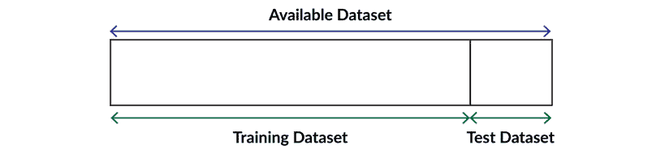
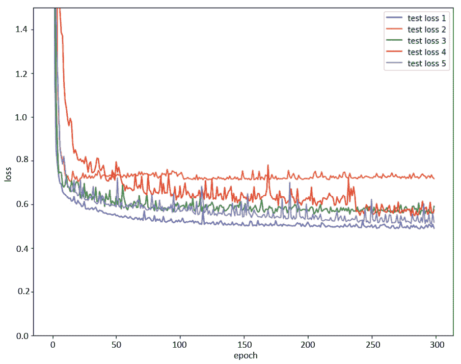
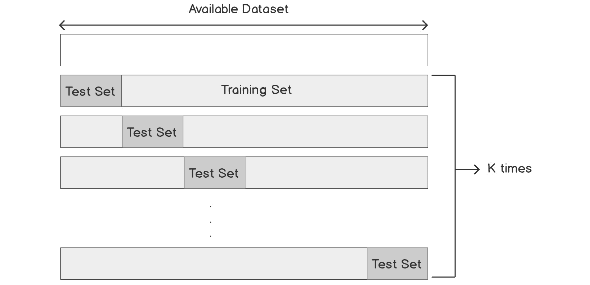
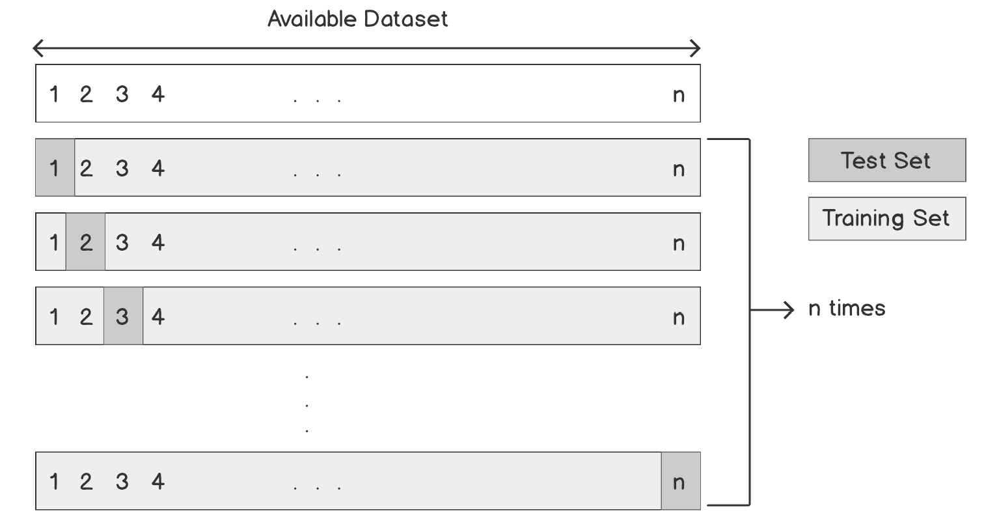
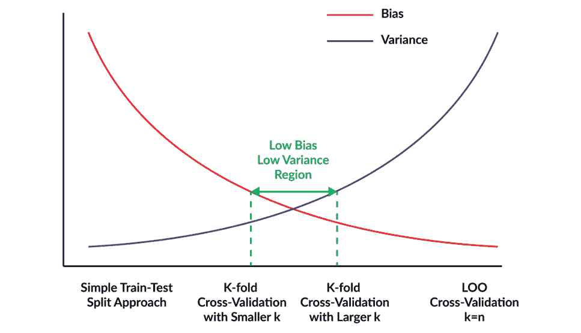
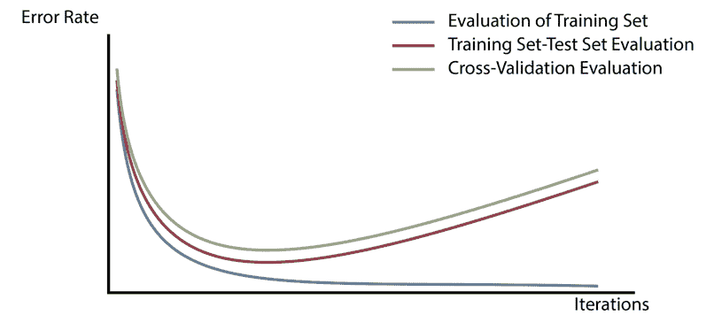
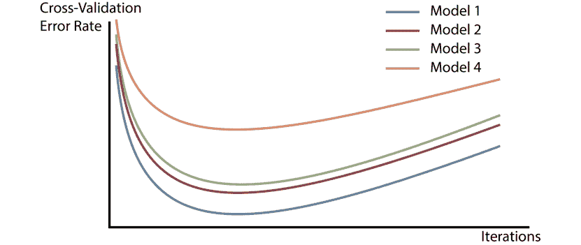
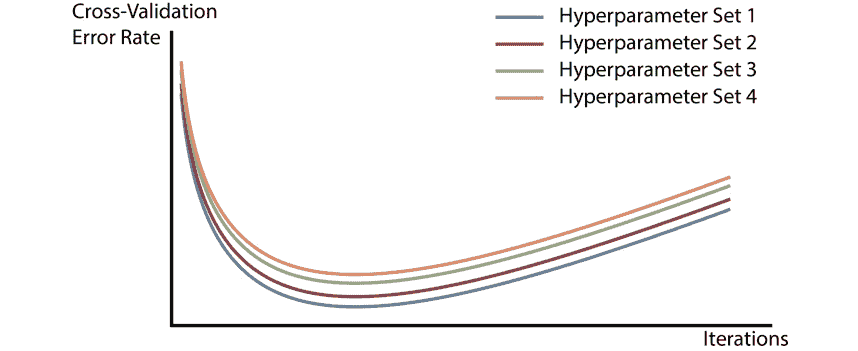

# 第四章：4. 使用 Keras 包装器进行交叉验证评估模型

概述

本章将介绍如何使用 scikit-learn 构建 Keras 包装器。你将学习如何应用交叉验证来评估深度学习模型，并创建用户定义的函数来实现深度学习模型及其交叉验证。到本章结束时，你将能够构建出在新数据和训练数据上表现一致、且稳健的模型。

# 引言

在上一章中，我们实验了不同的神经网络架构。通过观察训练过程中损失值和准确率的变化，我们能够评估不同模型的表现。这帮助我们判断模型是否存在欠拟合或过拟合问题，并学习如何使用如提前停止等技术来防止过拟合。

在本章中，你将学习**交叉验证**。这是一种**重采样技术**，相较于我们在前几章讨论的模型评估方法，它能提供更加准确和稳健的模型性能估计。

本章从深入讨论为什么需要使用交叉验证进行模型评估开始，讲解交叉验证的基本原理、变种以及它们之间的比较。接下来，我们将对 Keras 深度学习模型进行交叉验证的实现。我们还将结合 scikit-learn 使用 Keras 包装器，使得 Keras 模型能够作为估计器在 scikit-learn 的工作流中进行处理。然后，你将学习如何在 scikit-learn 中实现交叉验证，最终将所有内容结合起来，在 scikit-learn 中对 Keras 深度学习模型进行交叉验证。

最后，你将学习如何利用交叉验证不仅仅进行模型评估，还可以利用交叉验证对模型性能进行估计，从而比较不同模型，并选择在特定数据集上表现最好的模型。你还将使用交叉验证来提高给定模型的表现，通过寻找最佳超参数集合。我们将在三项活动中实现本章所学的概念，每项活动都涉及一个真实数据集。

# 交叉验证

`重采样技术`是统计数据分析中的一组重要技术。它们涉及反复从数据集中抽取样本来创建训练集和测试集。在每次重复中，使用从数据集中抽取的样本来训练和评估模型。

使用这些技术可以为我们提供模型的信息，这是通过仅使用一个训练集和一个测试集来拟合和评估模型无法获得的。由于重采样方法涉及多次对训练数据拟合模型，因此计算开销较大。因此，在深度学习中，我们仅在数据集和网络相对较小，并且可用计算能力允许时，才会实现这些方法。

在本节中，你将学习一种非常重要的重采样方法——`交叉验证`。交叉验证是最重要和最常用的重采样方法之一。它计算了在给定有限数据集的情况下，模型在新未见过的样本上的最佳性能估计。我们还将探讨交叉验证的基础知识，它的两种变体以及它们之间的比较。

## 仅进行一次数据集划分的缺点

在上一章中，我们提到过，在用于训练模型的同一数据集上评估模型是一个方法上的错误。由于模型已经训练以减少这个特定数据集上的误差，因此它在该数据集上的表现具有很强的偏倚性。这就是为什么训练数据上的误差率总是低估新样本上的误差率的原因。我们了解到，解决这个问题的一种方法是随机地从数据中留出一部分作为测试集进行评估，并在其余数据上拟合模型，这部分数据被称为训练集。以下图展示了这种方法的示例：



图 4.1：训练集/测试集划分概述

正如我们之前提到的，将数据分配到训练集或测试集完全是随机的。这意味着如果我们重复此过程，每次分配给测试集和训练集的数据会有所不同。通过这种方法报告的测试误差率可能会有所不同，这取决于哪些样本被分配到测试集，哪些样本被分配到训练集。

**示例**

让我们来看一个例子。在这里，我们为你在*活动 3.02*、*使用神经网络进行高级纤维化诊断*中的*第三章*、*使用 Keras 的深度学习*部分看到的丙型肝炎数据集构建了一个单层神经网络。我们使用了训练集/测试集的方法来计算与此模型相关的测试误差。与一次性划分和训练不同，如果我们将数据划分为五个独立的数据集，并重复此过程五次，我们可能会得到五个不同的测试误差率图。以下图表展示了这五次实验的测试误差率：



图 4.2：在一个示例数据集上，使用五种不同的训练集/测试集划分绘制的测试误差率图

如你所见，每次实验中的测试误差率差异很大。模型评估结果的这种变化表明，仅仅将数据集分为训练集和测试集一次的简单策略可能无法提供对模型性能的稳健且准确的估计。

总结来说，我们在上一章学习的训练集/测试集方法有一个明显的优点，那就是简单、易于实现且计算成本低。然而，它也有一些缺点，具体如下：

+   第一个缺点是，它对模型误差率的估计在很大程度上依赖于到底是哪些数据被分配到测试集，哪些数据被分配到训练集。

+   第二个缺点是，在这种方法中，我们只在数据的一个子集上训练模型。当使用较少数据进行训练时，机器学习模型的表现通常会更差。

由于模型的性能可以通过在整个数据集上训练来提高，我们始终在寻找将所有可用数据点纳入训练的方法。此外，我们还希望通过将所有可用数据点纳入评估来获得对模型性能的稳健估计。这些目标可以通过使用交叉验证技术来实现。以下是两种交叉验证方法：

+   **K 折交叉验证**

+   **留一法交叉验证**

## K 折交叉验证

在`k`折交叉验证中，我们不是将数据集划分为两个子集，而是将数据集划分为`k`个大小相近的子集或折叠。在方法的第一次迭代中，第一个折叠被作为测试集。模型在剩余的`k-1`个折叠上进行训练，然后在第一个折叠上进行评估（第一个折叠用于估算测试误差率）。

这个过程会重复`k`次，每次迭代使用不同的折叠作为测试集，而其余的折叠作为训练集。最终，这种方法会得到`k`个不同的测试误差率。模型误差率的最终`k`折交叉验证估计是通过平均这`k`个测试误差率计算得出的。

以下图示说明了`k`折交叉验证方法中的数据集划分过程：



图 4.3：k 折交叉验证方法中的数据集划分概述

在实践中，我们通常执行`k-fold 交叉验证`，其中`k=5`或`k=10`，如果你在选择适合你数据集的值时遇到困难，这些是推荐的值。决定使用多少折叠取决于数据集中的示例数量和可用的计算能力。如果`k=5`，模型将被训练和评估五次，而如果`k=10`，这个过程将重复 10 次。折叠数越高，执行 k 折交叉验证所需的时间就越长。

在 k 折交叉验证中，示例分配到每个折叠是完全随机的。然而，通过查看前面的示意图，你会发现，最终每个数据点都会同时用于训练和评估。这就是为什么如果你在相同的数据集和相同的模型上重复多次 k 折交叉验证，最终报告的测试误差率几乎是相同的。因此，与训练集/测试集方法相比，k 折交叉验证的结果不会受到高方差的影响。现在，我们来看一下交叉验证的第二种形式：留一法验证。

## 留一法交叉验证

`留一法`（`LOO`）是交叉验证技术的一种变体，在这种方法中，数据集不会被划分为两个大小相当的子集用于训练集和测试集，而是仅使用一个数据点进行评估。如果整个数据集中有`n`个数据示例，在每次`LOO 交叉验证`迭代中，模型会在`n-1`个示例上进行训练，而剩下的单个示例会用于计算测试误差率。

仅使用一个示例来估计测试误差率会导致对模型性能的无偏但高方差的估计；它是无偏的，因为这个示例没有参与训练模型，它具有高方差，因为它仅基于一个数据示例来计算，并且会根据使用的具体数据示例有所变化。这个过程会重复`n`次，在每次迭代中，使用不同的数据示例进行评估。最终，方法会得到`n`个不同的测试误差率，最终的`LOO 交叉验证`测试误差估计是通过平均这`n`个误差率来计算的。

`LOO 交叉验证`方法中数据集划分过程的示意图如下所示：



图 4.4：LOO 交叉验证方法中数据集划分的概述

在每次`留一交叉验证`的迭代中，几乎所有的数据示例都用于训练模型。另一方面，在训练集/测试集方法中，数据的一个相对较大的子集用于评估，而不参与训练。因此，`留一交叉验证`对模型性能的估计更接近于在整个数据集上训练的模型的性能，这也是`留一交叉验证`相对于`训练集`/`测试集`方法的主要优势。

此外，由于在每次`留一交叉验证`的迭代中，仅使用一个唯一的数据示例进行评估，并且每个数据示例也都用于训练，因此这种方法没有随机性。因此，如果你在相同的数据集和相同的模型上重复进行多次`留一交叉验证`，最终报告的测试误差率每次都会完全相同。

`留一交叉验证`的缺点是计算开销大。其原因是模型需要训练`n`次，在`n`较大和/或网络较大的情况下，完成训练所需的时间会很长。`留一交叉验证`和`k 折交叉验证`各有其优缺点，接下来我们将进行详细比较。

## 比较 K 折交叉验证和留一交叉验证方法

通过比较前两个图表，可以明显看出`留一交叉验证`实际上是`k 折交叉验证`的一个特殊情况，其中`k=n`。然而，正如之前提到的，选择`k=n`在计算上非常昂贵，相比之下，选择`k=5`或`k=10`更为高效。

因此，`k 折交叉验证`相对于`留一交叉验证`的第一个优势是计算开销较小。下表比较了`低 k 折交叉验证`、`高 k 折交叉验证`和`留一交叉验证`，以及`无交叉验证`在`偏差`和`方差`方面的差异。表格显示，最大的偏差出现在简单的`训练集-测试集划分方法`中，最大的方差出现在留一交叉验证中。`k 折交叉验证`位于两者之间。这也是为什么`k 折交叉验证`通常是大多数机器学习任务中最合适的选择：



交叉验证方法

](img/B15777_04_06.jpg)

图 4.5：比较训练集-测试集划分、k 折交叉验证和留一交叉验证方法

以下图表比较了`训练集`/`测试集`方法、`k 折交叉验证`和`留一交叉验证`在`偏差`和`方差`方面的差异：


](img/B15777_04_05.jpg)

图 4.6：比较训练集/测试集方法、k 折交叉验证和留一交叉验证在偏差和方差方面的差异

一般来说，在机器学习和数据分析中，最理想的模型是具有`最低偏差`和`最低方差`的模型。如前面的图所示，图中间标记的区域，其中`偏差`和`方差`都较低，是我们关注的重点。事实证明，这个区域等同于 `k-fold 交叉验证`，其中 `k` 的值介于 `5` 到 `10` 之间。在下一节中，我们将探索如何在实践中实现不同的交叉验证方法。

# 深度学习模型的交叉验证

在本节中，你将学习如何使用 Keras 封装器与 scikit-learn 配合使用，这是一种有用的工具，可以让我们将 Keras 模型作为 scikit-learn 工作流的一部分。因此，像交叉验证这样的 scikit-learn 方法和函数可以轻松地应用到 Keras 模型中。

你将一步步学习如何在本节中使用 scikit-learn 实现你在上一节中学到的交叉验证方法。此外，你还将学习如何使用交叉验证评估 Keras 深度学习模型，并使用 Keras 封装器与 scikit-learn 配合使用。最后，你将通过解决一个实际数据集中的问题来实践所学的内容。

## Keras 封装器与 scikit-learn

在一般的机器学习和数据分析中，scikit-learn 库比 Keras 更加丰富且易于使用。这就是为什么能够在 Keras 模型上使用 scikit-learn 方法会非常有价值的原因。

幸运的是，Keras 提供了一个有用的封装器 `keras.wrappers.scikit_learn`，它允许我们为深度学习模型构建 scikit-learn 接口，这些模型可以作为分类或回归估计器在 scikit-learn 中使用。封装器有两种类型：一种用于分类估计器，另一种用于回归估计器。以下代码用于定义这些 scikit-learn 接口：

```py
keras.wrappers.scikit_learn.KerasClassifier(build_fn=None, **sk_params)
# wrappers for classification estimators
keras.wrappers.scikit_learn.KerasRegressor(build_fn=None, **sk_params)
# wrappers for regression estimators
```

`build_fn` 参数需要是一个可调用的函数，在其内部定义、编译并返回一个 Keras 顺序模型。

`sk_params` 参数可以接受用于构建模型的参数（如层的激活函数）和用于拟合模型的参数（如训练轮数和批量大小）。这一点将在接下来的练习中得以应用，我们将在该练习中使用 Keras 封装器解决回归问题。

注意

本章的所有活动将在 Jupyter notebook 中开发。请下载本书的 GitHub 仓库以及所有已准备好的模板，点击以下链接即可找到：

[`packt.live/3btnjfA`](https://packt.live/3btnjfA)。

## 练习 4.01：为回归问题构建 Keras 封装器与 scikit-learn 配合使用

在本次练习中，你将学习如何一步一步构建 Keras 深度学习模型的包装器，使其可以在 scikit-learn 工作流中使用。首先，加载一个包含`908`个数据点的回归问题数据集，其中每个记录描述了化学物质的六个属性，目标是预测鱼类 Pimephales promelas 的急性毒性，即`LC50`：

注意

注意下面字符串中的斜杠。记住，反斜杠（`\`）用于将代码分割为多行，而正斜杠（`/`）是路径的一部分。

```py
# import data
import pandas as pd
colnames = ['CIC0', 'SM1_Dz(Z)', 'GATS1i', \
            'NdsCH', 'NdssC','MLOGP', 'LC50']
data = pd.read_csv('../data/qsar_fish_toxicity.csv', \
                   sep=';', names=colnames)
X = data.drop('LC50', axis=1)
y = data['LC50']
# Print the sizes of the dataset
print("Number of Examples in the Dataset = ", X.shape[0])
print("Number of Features for each example = ", X.shape[1])
# print output range
print("Output Range = [%f, %f]" %(min(y), max(y)))
```

这是预期的输出：

```py
Number of Examples in the Dataset =  908
Number of Features for each example =  6
Output Range = [0.053000, 9.612000]
```

由于该数据集的输出是一个数值，因此这是一个回归问题。目标是构建一个模型，预测给定化学物质的其他属性时，鱼类的急性毒性`LC50`。现在，让我们一步步来看：

1.  定义一个函数来构建并返回用于回归问题的 Keras 模型。你定义的 Keras 模型必须有一个隐藏层，大小为`8`，并使用`ReLU 激活`函数。同时，使用`均方误差`（`MSE`）损失函数和`Adam 优化器`来编译模型：

    ```py
    from keras.models import Sequential
    from keras.layers import Dense, Activation
    # Create the function that returns the keras model
    def build_model():
        # build the Keras model
        model = Sequential()
        model.add(Dense(8, input_dim=X.shape[1], \
                  activation='relu'))
        model.add(Dense(1))
        # Compile the model
        model.compile(loss='mean_squared_error', \
                      optimizer='adam')
        # return the model
        return model  
    ```

1.  现在，使用 Keras 包装器和 scikit-learn 创建 scikit-learn 接口来构建你的模型。记住，你需要在这里提供`epochs`、`batch_size`和`verbose`参数：

    ```py
    # build the scikit-Learn interface for the keras model
    from keras.wrappers.scikit_learn import KerasRegressor
    YourModel = KerasRegressor(build_fn= build_model, \
                               epochs=100, \
                               batch_size=20, \
                               verbose=1) 
    ```

    现在，`YourModel`已经可以作为 scikit-learn 中的回归估计器使用。

在本次练习中，我们学习了如何使用模拟数据集通过 scikit-learn 构建 Keras 包装器来解决回归问题。

注意

若要访问此特定部分的源代码，请参阅[`packt.live/38nuqVP`](https://packt.live/38nuqVP)。

你也可以在网上运行这个示例，访问[`packt.live/31MLgMF`](https://packt.live/31MLgMF)。

我们将在本章剩余的练习中继续使用此数据集实现交叉验证。

## 使用 scikit-learn 进行交叉验证

在上一章中，你学会了如何在 scikit-learn 中轻松进行`训练集`/`测试集`的划分。假设你的原始数据集存储在`X`和`y`数组中。你可以使用以下命令将它们随机划分为训练集和测试集：

```py
from sklearn.model_selection import train_test_split
X_train, X_test, y_train, y_test = train_test_split\
                                   (X, y, test_size=0.3, \
                                    random_state=0)
```

`test_size`参数可以设置为介于`0`和`1`之间的任何数值，具体取决于你希望测试集的大小。通过为`random_state`参数提供一个`int`类型的数字，你将能够选择随机数生成器的种子。

在 scikit-learn 中执行交叉验证的最简单方法是使用`cross_val_score`函数。为此，你需要首先定义你的估计器（在我们的案例中，估计器将是一个 Keras 模型）。然后，你将能够使用以下命令对估计器/模型进行交叉验证：

```py
from sklearn.model_selection import cross_val_score
scores = cross_val_score(YourModel, X, y, cv=5)
```

请注意，我们将 Keras 模型和原始数据集作为参数传递给 `cross_val_score` 函数，并指定折数（即 `cv` 参数）。在这里，我们使用了 `cv=5`，所以 `cross_val_score` 函数会将数据集随机划分为五个折，并使用五个不同的训练集和测试集对模型进行五次训练和拟合。它将在每次迭代/折叠时计算默认的模型评估指标（或在定义 Keras 模型时提供的指标），并将它们存储在 scores 中。我们可以如下打印最终的交叉验证得分：

```py
print(scores.mean())
```

之前我们提到过，`cross_val_score` 函数返回的得分是我们模型的默认指标，或者是我们在定义模型时为其确定的指标。然而，也可以通过在调用 `cross_val_score` 函数时提供所需的指标作为 `scoring` 参数，来更改交叉验证的指标。

注意

您可以在这里了解如何在 `cross_val_score` 函数的 `scoring` 参数中提供所需的评估指标：[`scikit-learn.org/stable/modules/model_evaluation.html#scoring-parameter`](https://scikit-learn.org/stable/modules/model_evaluation.html#scoring-parameter)。

通过为 `cross_val_score` 函数的 `cv` 参数提供一个整数，我们告诉函数在数据集上执行 k-fold 交叉验证。然而，scikit-learn 中还有几种其他的迭代器可以分配给 `cv`，以执行数据集的其他交叉验证变种。例如，以下代码块将对数据集执行 `LOO 交叉验证`：

```py
from sklearn.model_selection import LeaveOneOut
loo = LeaveOneOut()
scores = cross_val_score(YourModel, X, y, cv=loo)
```

在下一节中，我们将探索 scikit-learn 中的 k-fold 交叉验证，并看看它如何与 Keras 模型一起使用。

## scikit-learn 中的交叉验证迭代器

这里提供了 scikit-learn 中最常用的交叉验证迭代器的列表，并简要描述了它们的功能：

+   `KFold(n_splits=?)`

    这将把数据集划分为 k 个折或组。`n_splits` 参数是必需的，用于确定使用多少个折。如果 `n_splits=n`，它将等同于 `LOO 交叉验证`。

+   `RepeatedKFold(n_splits=?, n_repeats=?, random_state=random_state)`

    这将重复执行 k-fold 交叉验证 `n_repeats` 次。

+   `LeaveOneOut()`

    这将对数据集进行 `LOO 交叉验证` 的划分。

+   `ShuffleSplit(n_splits=?, test_size=?, random_state=random_state)`

    这将生成 `n_splits` 个随机且独立的训练集/测试集数据集划分。可以使用 `random_state` 参数存储随机数生成器的种子；如果这么做，数据集的划分将是可重现的。

除了常规迭代器（例如这里提到的迭代器），还有 `分层` 版本。分层抽样在数据集的不同类别的样本数量不平衡时非常有用。例如，假设我们想设计一个分类器来预测某人是否会拖欠信用卡债务，其中数据集中几乎有 `95%` 的样本属于 `负类`。分层抽样确保在每个 `训练集`/`测试集` 划分中保留类别的相对频率。对于这种情况，建议使用分层版本的迭代器。

通常，在使用训练集训练和评估模型之前，我们会对其进行预处理，以便将样本缩放，使其均值为 `0`，标准差为 `1`。在 `训练集`/`测试集` 方法中，我们需要缩放训练集并存储该转换。以下代码块将为我们完成这项工作：

```py
from sklearn.preprocessing import StandardScaler
scaler = StandardScaler()
X_train = scaler.fit_transform(X_train)
X_test = scaler.transform(X_test)
```

这是在我们的 `X`、`y` 数据集上执行 `k=5` 的 `分层 K 折交叉验证` 的示例：

```py
from sklearn.model_selection import StratifiedKFold
skf = StratifiedKFold(n_splits=5)
scores = cross_val_score(YourModel, X, y, cv=skf)
```

注意

你可以在这里了解更多关于 scikit-learn 中交叉验证迭代器的内容：

[`scikit-learn.org/stable/modules/cross_validation.html#cross-validation-iterators`](https://scikit-learn.org/stable/modules/cross_validation.html#cross-validation-iterators)。

现在我们了解了交叉验证迭代器，可以在练习中将它们付诸实践。

## 练习 4.02：使用交叉验证评估深度神经网络

在这次练习中，我们将把我们在本主题中学习到的所有交叉验证相关概念和方法结合起来。我们将再次经历所有步骤，从定义 Keras 深度学习模型到将其转移到 scikit-learn 工作流并执行交叉验证以评估其性能。从某种意义上说，这个练习是我们到目前为止所学内容的回顾，涵盖的内容对于 *活动 4.01*（*使用交叉验证评估先进的纤维化诊断分类器模型*）将非常有帮助：

1.  第一步始终是加载你想要构建模型的数据集。首先，加载回归问题的 `908` 个数据点的数据集，每个记录描述了一个化学物质的六个属性，目标是预测对鱼类 Pimephales promelas 的急性毒性，即 `LC50`：

    ```py
    # import data
    import pandas as pd
    colnames = ['CIC0', 'SM1_Dz(Z)', 'GATS1i', \
                'NdsCH', 'NdssC','MLOGP', 'LC50']
    data = pd.read_csv('../data/qsar_fish_toxicity.csv', \
                       sep=';', names=colnames)
    X = data.drop('LC50', axis=1)
    y = data['LC50']
    # Print the sizes of the dataset
    print("Number of Examples in the Dataset = ", X.shape[0])
    print("Number of Features for each example = ", X.shape[1])
    # print output range
    print("Output Range = [%f, %f]" %(min(y), max(y)))
    ```

    输出如下：

    ```py
    Number of Examples in the Dataset =  908
    Number of Features for each example =  6
    Output Range = [0.053000, 9.612000]
    ```

1.  定义一个函数，返回一个具有单个隐藏层（大小为 `8`，使用 `ReLU 激活` 函数）的 Keras 模型，使用 `均方误差` (`MSE`) 损失函数和 `Adam 优化器`：

    ```py
    from keras.models import Sequential
    from keras.layers import Dense, Activation
    # Create the function that returns the keras model
    def build_model():
        # build the Keras model
        model = Sequential()
        model.add(Dense(8, input_dim=X.shape[1], \
                  activation='relu'))
        model.add(Dense(1))
        # Compile the model
        model.compile(loss='mean_squared_error', \
                      optimizer='adam')
        # return the model
        return model
    ```

1.  设置`seed`并使用包装器构建我们在`步骤 2`中定义的 Keras 模型的 scikit-learn 接口：

    ```py
    # build the scikit-Learn interface for the keras model
    from keras.wrappers.scikit_learn import KerasRegressor
    import numpy as np
    from tensorflow import random
    seed = 1
    np.random.seed(seed)
    random.set_seed(seed)
    YourModel = KerasRegressor(build_fn= build_model, \
                               epochs=100, batch_size=20, \
                               verbose=1 , shuffle=False)
    ```

1.  定义要用于交叉验证的迭代器。我们来进行 `5 折交叉验证`：

    ```py
    # define the iterator to perform 5-fold cross-validation
    from sklearn.model_selection import KFold
    kf = KFold(n_splits=5)
    ```

1.  调用 `cross_val_score` 函数来执行交叉验证。根据可用的计算能力，这一步可能需要一些时间才能完成：

    ```py
    # perform cross-validation on X, y
    from sklearn.model_selection import cross_val_score
    results = cross_val_score(YourModel, X, y, cv=kf) 
    ```

1.  一旦交叉验证完成，打印`最终交叉验证`模型性能评估（性能的默认评估指标为测试损失）：

    ```py
    # print the result
    print(f"Final Cross-Validation Loss = {abs(results.mean()):.4f}")
    ```

    这是一个示例输出：

    ```py
    Final Cross-Validation Loss = 0.9680
    ```

交叉验证损失表明，在该数据集上训练的 Keras 模型能够以`0.9680`的平均损失预测化学物质的`LC50`值。我们将在下一次练习中进一步研究该模型。

这些就是使用 scikit-learn 中的交叉验证评估 Keras 深度学习模型所需的所有步骤。现在，我们将在活动中将这些步骤付诸实践。

注意

要访问此特定部分的源代码，请参考 [`packt.live/3eRTlTM`](https://packt.live/3eRTlTM)。

你也可以在网上运行此示例，访问 [`packt.live/31IdVT0`](https://packt.live/31IdVT0)。

## 活动 4.01：使用交叉验证评估高级纤维化诊断分类器的模型

我们在*第 3.02 活动*中了解了肝炎 C 数据集，*第三章*，*Keras 深度学习*中的*高级纤维化诊断与神经网络*。该数据集包含了`1385`名接受肝炎 C 治疗剂量的患者的信息。每位患者都有`28`个不同的属性可供参考，如年龄、性别、BMI 等，以及一个类标签，该标签只能取两个值：`1`，表示高级纤维化；`0`，表示没有高级纤维化的迹象。这是一个`二元`/`两类`分类问题，输入维度为`28`。

在*第三章*，*Keras 深度学习*中，我们构建了 Keras 模型来对该数据集进行分类。我们使用`训练集`/`测试集`划分训练并评估模型，并报告了测试误差率。在本活动中，我们将运用本主题中学到的知识，使用`k 折交叉验证`来训练和评估深度学习模型。我们将使用在前一个活动中得出的最佳测试误差率的模型。目标是将交叉验证误差率与训练集/测试集方法的误差率进行比较：

1.  导入必要的库。从 GitHub 的`Chapter04`文件夹中的`data`子文件夹加载数据集，使用`X = pd.read_csv('../data/HCV_feats.csv'), y = pd.read_csv('../data/HCV_target.csv')`。打印数据集中的示例数量、可用的特征数量以及类标签的可能值。

1.  定义一个函数来返回 Keras 模型。该 Keras 模型将是一个深度神经网络，包含两个隐藏层，其中`第一个隐藏层`的`大小为 4`，`第二个隐藏层`的`大小为 2`，并使用`tanh 激活函数`进行分类。使用以下超参数值：

    `optimizer = 'adam', loss = 'binary_crossentropy', metrics = ['accuracy']`

1.  为 Keras 模型构建 scikit-learn 接口，设置`epochs=100`、`batch_size=20`，并将`shuffle=False`。将交叉验证迭代器定义为`StratifiedKFold`，并设置`k=5`。对模型进行 k 折交叉验证，并存储分数。

1.  打印每次迭代/折叠的准确性，以及总体交叉验证准确性和其相关标准差。

1.  将此结果与*第三章*《使用 Keras 的深度学习》中的*活动 3.02*《使用神经网络进行高级纤维化诊断》中的结果进行比较。

完成前述步骤后，期望的输出将如下所示：

```py
Test accuracy at fold 1 = 0.5198556184768677
Test accuracy at fold 2 = 0.4693140685558319
Test accuracy at fold 3 = 0.512635350227356
Test accuracy at fold 4 = 0.5740072131156921
Test accuracy at fold 5 = 0.5523465871810913
Final Cross Validation Test Accuracy: 0.5256317675113678
Standard Deviation of Final Test Accuracy: 0.03584760640500936
```

注意

本活动的解决方案可以在第 381 页找到。

在*第三章*《使用 Keras 的深度学习》中的*活动 3.02*《使用神经网络进行高级纤维化诊断》中，我们通过训练集/测试集方法得到的准确率为`49.819%`，这低于我们在对相同深度学习模型和相同数据集进行`5 折交叉验证`时所取得的测试准确率，但低于其中一折的准确率。

这种差异的原因在于，通过训练集/测试集方法计算的测试错误率是通过仅将数据点的一个子集纳入模型评估得出的。另一方面，这里计算的测试错误率是通过将所有数据点纳入评估，因此，这种模型性能的估计更为准确且更具鲁棒性，在未见过的测试数据集上表现更好。

在本活动中，我们使用交叉验证对涉及真实数据集的问题进行模型评估。提高模型评估的准确性并不是使用交叉验证的唯一目的，它还可以用来为给定的问题选择最佳模型或参数。

# 使用交叉验证进行模型选择

交叉验证为我们提供了模型在未见过的示例上的鲁棒性估计。因此，它可以用来在特定问题中决定两个模型之间的优劣，或者决定在特定问题中使用哪一组模型参数（或超参数）。在这些情况下，我们希望找出哪个模型或哪一组模型参数/超参数会导致最低的测试错误率。因此，我们将选择该模型或该组参数/超参数作为我们问题的解决方案。

在本节中，你将练习使用交叉验证来完成这一任务。你将学习如何为深度学习模型定义一组超参数，然后编写用户定义的函数，对模型进行交叉验证，涵盖每种可能的超参数组合。然后，你将观察哪一组超参数组合导致最低的测试错误率，这组超参数将成为你最终模型的选择。

## 模型评估与模型选择中的交叉验证

在本节中，我们将深入探讨使用交叉验证进行模型评估与模型选择之间的区别。到目前为止，我们已经了解到，在训练集上评估模型会导致对模型在未见样本上的错误率的低估。将数据集分为`训练集`和`测试集`可以更准确地估计模型的表现，但会面临较高的方差问题。

最后，交叉验证能够更稳健、准确地估计模型在未见样本上的表现。以下图示展示了这三种模型评估方法所产生的错误率估计。

以下图示展示了在训练集/测试集方法的错误率估计稍低于交叉验证估计的情况。然而，重要的是要记住，`训练集`/`测试集`的错误率也可能高于交叉验证估计的错误率，具体取决于测试集中包含的数据（因此会存在高方差问题）。另一方面，在训练集上进行评估所得到的错误率始终低于其他两种方法：



图 4.7：展示三种模型评估方法所产生的错误率估计

我们已经确定，交叉验证提供了模型在独立数据样本上的最佳表现估计。知道这一点后，我们可以使用交叉验证来决定针对特定问题使用哪个模型。例如，如果我们有四个不同的模型，并希望确定哪个模型最适合某一数据集，我们可以使用交叉验证训练并评估每个模型，选择交叉验证错误率最低的模型作为最终模型。以下图展示了与四个假设模型相关的交叉验证错误率。由此，我们可以得出结论，**模型 1**最适合该问题，而**模型 4**是最差的选择。这四个模型可能是深度神经网络，它们具有不同数量的隐藏层和隐藏层中不同数量的单元：



图 4.8：展示与四个假设模型相关的交叉验证错误率

在确定了哪种模型最适合特定问题后，下一步是为该模型选择最佳的参数集或超参数。之前我们讨论了，在构建深度神经网络时，模型需要选择多个超参数，而且每个超参数都有多个选择。

这些超参数包括激活函数的类型、损失函数和优化器，以及训练的轮次和批次大小。我们可以定义每个超参数的可能选择集合，然后实现模型并结合交叉验证，找出最佳的超参数组合。

以下图展示了与四组不同超参数集相关的交叉验证误差率的插图。从中我们可以得出结论，`超参数集 1`是该模型的最佳选择，因为与`超参数集 1`对应的线条在交叉验证误差率上具有最低的值：



图 4.9：展示与四组不同超参数集相关的交叉验证误差率的插图，针对一个假设的深度学习模型

在下一个练习中，我们将学习如何遍历不同的模型架构和超参数，以找到结果最优的模型集合。

## 练习 4.03：编写用户定义的函数来实现带交叉验证的深度学习模型

在本次练习中，您将学习如何使用交叉验证进行模型选择。

首先，加载包含`908`个数据点的回归问题数据集，每条记录描述了一种化学品的六个属性，目标是其对鱼类 Pimephales promelas 的急性毒性，或`LC50`。目标是构建一个模型，根据化学品属性预测每种化学品的`LC50`：

```py
# import data
import pandas as pd
import numpy as np
from tensorflow import random
colnames = ['CIC0', 'SM1_Dz(Z)', 'GATS1i', 'NdsCH', \
            'NdssC','MLOGP', 'LC50']
data = pd.read_csv('../data/qsar_fish_toxicity.csv', \
                   sep=';', names=colnames)
X = data.drop('LC50', axis=1)
y = data['LC50']
```

按照以下步骤完成本次练习：

1.  定义三个函数，返回三个 Keras 模型。第一个模型应该有一个`大小为 4`的隐藏层，第二个模型应该有一个`大小为 8`的隐藏层，第三个模型应该有两个隐藏层，第一个层的`大小为 4`，第二个层的`大小为 2`。对于所有隐藏层，使用`ReLU 激活`函数。目标是找出这三种模型中，哪个模型能带来最低的交叉验证误差率：

    ```py
    # Define the Keras models
    from keras.models import Sequential
    from keras.layers import Dense
    def build_model_1():
        # build the Keras model_1
        model = Sequential()
        model.add(Dense(4, input_dim=X.shape[1], \
                        activation='relu'))
        model.add(Dense(1))
        # Compile the model
        model.compile(loss='mean_squared_error', \
                      optimizer='adam')
        # return the model
        return model
    def build_model_2():
        # build the Keras model_2
        model = Sequential()
        model.add(Dense(8, input_dim=X.shape[1], \
                  activation='relu'))
        model.add(Dense(1))
        # Compile the model
        model.compile(loss='mean_squared_error', \
                      optimizer='adam')
        # return the model
        return model
    def build_model_3():
        # build the Keras model_3
        model = Sequential()
        model.add(Dense(4, input_dim=X.shape[1], \
                        activation='relu'))
        model.add(Dense(2, activation='relu'))
        model.add(Dense(1))
        # Compile the model
        model.compile(loss='mean_squared_error', \
                      optimizer='adam')
        # return the model
        return model
    ```

1.  编写一个循环来构建 Keras 包装器，并对`三个`模型执行`3 折交叉验证`。存储每个模型的得分：

    ```py
    """
    define a seed for random number generator so the result will be reproducible
    """
    seed = 1
    np.random.seed(seed)
    random.set_seed(seed)
    # perform cross-validation on each model
    from keras.wrappers.scikit_learn import KerasRegressor
    from sklearn.model_selection import KFold
    from sklearn.model_selection import cross_val_score
    results_1 = []
    models = [build_model_1, build_model_2, build_model_3]
    # loop over three models
    for m in range(len(models)):
        model = KerasRegressor(build_fn=models[m], \
                               epochs=100, batch_size=20, \
                               verbose=0, shuffle=False)
        kf = KFold(n_splits=3)
        result = cross_val_score(model, X, y, cv=kf)
        results_1.append(result)
    ```

1.  打印每个模型的最终交叉验证误差率，以找出哪个模型的误差率较低：

    ```py
    # print the cross-validation scores
    print("Cross-Validation Loss for Model 1 =", \
          abs(results_1[0].mean()))
    print("Cross-Validation Loss for Model 2 =", \
          abs(results_1[1].mean()))
    print("Cross-Validation Loss for Model 3 =", \
          abs(results_1[2].mean()))
    ```

    下面是一个输出示例：

    ```py
    Cross-Validation Loss for Model 1 = 0.990475798256843
    Cross-Validation Loss for Model 2 = 0.926532513151634
    Cross-Validation Loss for Model 3 = 0.9735719371528117
    ```

    `模型 2`的错误率最低，因此我们将在接下来的步骤中使用它。

1.  再次使用交叉验证确定导致最低交叉验证误差率的模型的轮次和批次大小。编写代码，对`epochs`和`batch_size`在`epochs=[100, 150]`和`batch_size=[20, 15]`范围内的所有可能组合执行`3 折交叉验证`并存储得分：

    ```py
    """
    define a seed for random number generator so the result will be reproducible
    """
    np.random.seed(seed)
    random.set_seed(seed)
    results_2 = []
    epochs = [100, 150]
    batches = [20, 15]
    # Loop over pairs of epochs and batch_size
    for e in range(len(epochs)):
        for b in range(len(batches)):
            model = KerasRegressor(build_fn= build_model_3, \
                                   epochs= epochs[e], \
                                   batch_size= batches[b], \
                                   verbose=0, \
                                   shuffle=False)
            kf = KFold(n_splits=3)
            result = cross_val_score(model, X, y, cv=kf)
            results_2.append(result)
    ```

    注意

    上面的代码块使用了两个 `for` 循环来执行 `3 折交叉验证`，针对所有可能的 `epochs` 和 `batch_size` 组合。由于每个参数都有两个选择，因此有四种不同的组合，所以交叉验证将进行四次。

1.  打印每对 `epochs`/`batch_size` 的最终交叉验证错误率，以找出哪个组合的错误率最低：

    ```py
    """
    Print cross-validation score for each possible pair of epochs, batch_size
    """
    c = 0
    for e in range(len(epochs)):
        for b in range(len(batches)):
            print("batch_size =", batches[b],", \
                  epochs =", epochs[e], ", Test Loss =", \
                  abs(results_2[c].mean()))
            c += 1
    ```

    这是一个示例输出：

    ```py
    batch_size = 20 , epochs = 100 , Test Loss = 0.9359159401008821
    batch_size = 15 , epochs = 100 , Test Loss = 0.9642481369794683
    batch_size = 20 , epochs = 150 , Test Loss = 0.9561188386646661
    batch_size = 15 , epochs = 150 , Test Loss = 0.9359079093029896
    ```

    如你所见，`epochs=150` 和 `batch_size=15`，以及 `epochs=100` 和 `batch_size=20` 的性能几乎相同。因此，我们将在下一步选择 `epochs=100` 和 `batch_size=20` 来加快这一过程。

1.  再次使用交叉验证，以决定隐藏层的激活函数和模型的优化器，选择范围为 `activations = ['relu', 'tanh']` 和 `optimizers = ['sgd', 'adam', 'rmsprop']`。记得使用上一步骤中最佳的 `batch_size` 和 `epochs` 组合：

    ```py
    # Modify build_model_2 function
    def build_model_2(activation='relu', optimizer='adam'):
        # build the Keras model_2
        model = Sequential()
        model.add(Dense(8, input_dim=X.shape[1], \
                  activation=activation))
        model.add(Dense(1))
        # Compile the model
        model.compile(loss='mean_squared_error', \
                      optimizer=optimizer)
        # return the model
        return model
    results_3 = []
    activations = ['relu', 'tanh']
    optimizers = ['sgd', 'adam', 'rmsprop']
    """
    Define a seed for the random number generator so the result will be reproducible
    """
    np.random.seed(seed)
    random.set_seed(seed)
    # Loop over pairs of activation and optimizer
    for o in range(len(optimizers)):
        for a in range(len(activations)):
            optimizer = optimizers[o]
            activation = activations[a]
            model = KerasRegressor(build_fn= build_model_3, \
                                   epochs=100, batch_size=20, \
                                   verbose=0, shuffle=False)
            kf = KFold(n_splits=3)
            result = cross_val_score(model, X, y, cv=kf)
            results_3.append(result)
    ```

    注意

    注意，我们必须通过将 `activation`、`optimizer` 及其默认值作为函数的参数来修改 `build_model_2` 函数。

1.  打印每对 `activation` 和 `optimizer` 的最终交叉验证错误率，以找出哪个组合的错误率最低：

    ```py
    """
    Print cross-validation score for each possible pair of optimizer, activation
    """
    c = 0
    for o in range(len(optimizers)):
        for a in range(len(activations)):
            print("activation = ", activations[a],", \
                  optimizer = ", optimizers[o], ", \
                  Test Loss = ", abs(results_3[c].mean()))
            c += 1
    ```

    这是输出：

    ```py
    activation =  relu , optimizer =  sgd , Test Loss =  1.0123592540516995
    activation =  tanh , optimizer =  sgd , Test Loss =  3.393908379781118
    activation =  relu , optimizer =  adam , Test Loss =  0.9662686089392641
    activation =  tanh , optimizer =  adam , Test Loss =  2.1369285960222144
    activation =  relu , optimizer =  rmsprop , Test Loss =  2.1892826984214984
    activation =  tanh , optimizer =  rmsprop , Test Loss =  2.2029884275363014
    ```

1.  `activation='relu'` 和 `optimizer='adam'` 的组合产生了最低的错误率。同时，`activation='relu'` 和 `optimizer='sgd'` 的组合结果几乎一样好。因此，我们可以在最终模型中使用这两种优化器之一来预测这个数据集的水生毒性。

    注意

    要访问此特定部分的源代码，请参考 [`packt.live/2BYCwbg`](https://packt.live/2BYCwbg)。

    你也可以在网上运行这个示例，网址是 [`packt.live/3gofLfP`](https://packt.live/3gofLfP)。

现在，你已经准备好使用交叉验证在另一个数据集上练习模型选择。在*活动 4.02*，*使用交叉验证进行模型选择以诊断高级纤维化分类器*中，你将通过自己实现这些步骤，在肝炎 C 数据集的分类问题上进一步练习。

注意

*练习 4.02*，*使用交叉验证评估深度神经网络*，以及 *练习 4.03*，*编写用户定义的函数实现带交叉验证的深度学习模型*，涉及多次执行 `k 折交叉验证`，因此步骤可能需要几分钟才能完成。如果它们需要太长时间才能完成，你可以尝试通过减少折数或训练轮数（epochs）或增加批次大小来加速过程。显然，如果这样做，你将获得与预期输出不同的结果，但选择模型和超参数的原则仍然适用。

## 活动 4.02：使用交叉验证进行模型选择以诊断高级纤维化分类器

在本活动中，我们将通过使用交叉验证来选择模型和超参数，以改进我们的肝炎 C 数据集分类器。请按照以下步骤操作：

1.  导入所需的包。从 GitHub 的`Chapter04`文件夹中的`data`子文件夹加载数据集，使用`X = pd.read_csv('../data/HCV_feats.csv'), y = pd.read_csv('../data/HCV_target.csv')`。

1.  定义三个函数，每个函数返回一个不同的 Keras 模型。第一个 Keras 模型将是一个深度神经网络，具有三个隐藏层，每个隐藏层的`大小为 4`，并使用`ReLU 激活`函数。第二个 Keras 模型将是一个深度神经网络，具有两个隐藏层，第一个隐藏层的`大小为 4`，第二个隐藏层的`大小为 2`，并使用`ReLU 激活`函数。第三个 Keras 模型将是一个深度神经网络，具有两个隐藏层，两个隐藏层的`大小为 8`，并使用`ReLU 激活`函数。使用以下超参数值：

    `optimizer = 'adam', loss = 'binary_crossentropy', metrics = ['accuracy']`

1.  编写代码，遍历三个模型并对每个模型执行`5 折交叉验证`（在此步骤中使用`epochs=100`，`batch_size=20`，`shuffle=False`）。将所有的交叉验证得分存储在一个列表中，并打印结果。哪个模型结果获得了最佳准确率？

    注意

    本活动的*步骤* `3`、`4`和`5`涉及分别对三个、四个和六个模型执行`5 折交叉验证`。因此，它们可能需要一些时间来完成。

1.  编写代码，使用`epochs = [100, 200]`和`batches = [10, 20]`的值分别作为`epochs`和`batch_size`。对每一对可能的组合在 Keras 模型上进行 5 折交叉验证，该模型是在*第 3 步*中得到的最佳准确率。将所有的交叉验证得分存储在一个列表中，并打印结果。哪个`epochs`和`batch_size`的组合结果获得了最佳准确率？

1.  编写代码，使用`optimizers = ['rmsprop', 'adam', 'sgd']`和`activations = ['relu', 'tanh']`的值分别作为`optimizer`和`activation`。对每一对可能的组合在 Keras 模型上进行 5 折交叉验证，该模型是在*第 3 步*中得到的最佳准确率。使用在*第 4 步*中得到的最佳准确率的`batch_size`和`epochs`值。将所有的交叉验证得分存储在一个列表中，并打印结果。哪个`optimizer`和`activation`的组合结果获得了最佳准确率？

    注意

    请注意，初始化权重和偏差以及在执行 k 折交叉验证时选择哪些示例纳入每一折中，都存在随机性。因此，如果你运行相同的代码两次，可能会得到完全不同的结果。为此，在构建和训练神经网络时，以及在执行交叉验证时，设置随机种子非常重要。通过这样做，你可以确保每次重新运行代码时，使用的是完全相同的神经网络初始化，以及完全相同的训练集和测试集。

实现这些步骤后，预期输出将如下所示：

```py
activation =  relu , optimizer =  rmsprop , Test accuracy =  0.5234657049179077
activation =  tanh , optimizer =  rmsprop , Test accuracy =  0.49602887630462644
activation =  relu , optimizer =  adam , Test accuracy =  0.5039711117744445
activation =  tanh , optimizer =  adam , Test accuracy =  0.4989169597625732
activation =  relu , optimizer =  sgd , Test accuracy =  0.48953068256378174
activation =  tanh , optimizer =  sgd , Test accuracy =  0.5191335678100586
```

注意

这个活动的解决方案可以在第 384 页找到。

在本次活动中，你学习了如何使用交叉验证评估深度神经网络，以找出使分类问题的错误率最低的模型。你还学习了如何通过使用交叉验证来改进给定的分类模型，从而找到最佳的超参数集。在下一次活动中，我们将重复这个过程，并将任务转换为回归问题。

## 活动 4.03：使用交叉验证进行交通流量数据集的模型选择

在本次活动中，你将再次通过交叉验证进行模型选择练习。在这里，我们将使用一个模拟数据集，数据集表示一个目标变量，代表城市桥梁上每小时的交通流量，以及与交通数据相关的各种归一化特征，如一天中的时间和前一天的交通流量。我们的目标是构建一个模型，基于这些特征预测城市桥梁上的交通流量。

数据集包含`10000`条记录，每条记录包括`10`个属性/特征。目标是构建一个深度神经网络，该网络接收`10`个特征并预测桥上的交通流量。由于输出是一个数字，这个问题是一个回归问题。让我们开始吧：

1.  导入所有必需的包。

1.  打印输入和输出的大小，检查数据集中示例的数量以及每个示例的特征数量。此外，你还可以打印输出的范围（该数据集中的输出代表拥有者自住房屋的中位数，单位为千美元）。

1.  定义三个函数，每个函数返回一个不同的 Keras 模型。第一个 Keras 模型将是一个浅层神经网络，包含一个隐藏层，隐藏层大小为`10`，并使用`ReLU 激活`函数。第二个 Keras 模型将是一个深层神经网络，包含两个隐藏层，每个隐藏层的大小为`10`，并使用每层的`ReLU 激活`函数。第三个 Keras 模型将是一个深层神经网络，包含三个隐藏层，每个隐藏层的大小为`10`，并使用每层的`ReLU 激活`函数。

    还需使用以下值：

    `optimizer = 'adam', loss = 'mean_squared_error'`

    注意

    *步骤* `4`、`5` 和 `6` 涉及分别执行`5 折交叉验证`三次、四次和三次。因此，它们可能需要一些时间才能完成。

1.  编写代码，循环遍历这三个模型，并对每个模型执行`5 折交叉验证`（在这一步中使用`epochs=100`，`batch_size=5`，并且`shuffle=False`）。将所有交叉验证得分存储在一个列表中并打印结果。哪个模型得到了最低的测试错误率？

1.  编写代码，使用`epochs = [80, 100]`和`batches = [5, 10]`作为`epochs`和`batch_size`的值。对在*第 4 步*中获得最低测试误差率的 Keras 模型进行 5 折交叉验证。将所有交叉验证的得分存储在列表中并打印结果。哪一对`epochs`和`batch_size`值导致最低的测试误差率？

1.  编写代码，使用`optimizers = ['rmsprop', 'sgd', 'adam']`并对每个可能的优化器进行`5 折交叉验证`，以评估在*第 4 步*中获得最低测试误差率的 Keras 模型。使用在*第 5 步*中获得最低测试误差率的`batch_size`和`epochs`值。将所有交叉验证的得分存储在列表中并打印结果。哪种`优化器`导致最低的测试误差率？

实现这些步骤后，预期输出如下：

```py
optimizer= adam  test error rate =  25.391812739372256
optimizer= sgd  test error rate =  25.140230269432067
optimizer= rmsprop  test error rate =  25.217947859764102
```

注意

本活动的解答可在第 391 页找到。

在这个活动中，你学习了如何使用交叉验证来评估深度神经网络，从而找到产生最低误差率的`回归问题`模型。此外，你还学会了如何通过交叉验证改进给定的回归模型，以便找到最佳的超参数集。

# 摘要

在本章中，你学习了交叉验证，这是最重要的重采样方法之一。它能够对模型在独立数据上的表现进行最佳估计。本章介绍了交叉验证的基本知识以及它的两种不同变体，留一法和 k 折交叉验证，并进行了比较。

接下来，我们介绍了带有 scikit-learn 的 Keras 封装器，这是一个非常有用的工具，它允许将执行交叉验证的 scikit-learn 方法和函数轻松应用于 Keras 模型。随后，你将学习如何按照一步步的过程实现交叉验证，以便使用带有 scikit-learn 的 Keras 封装器评估 Keras 深度学习模型。

最后，你了解到，交叉验证对模型性能的估计可以用于在不同模型之间做出选择，或者决定某个模型应使用哪些参数（或超参数）。你通过编写用户自定义函数并执行交叉验证，练习了如何使用交叉验证来选择最终模型的最佳模型或超参数组合，从而使测试误差率最小。

在下一章，你将学习到，实际上我们在这里为模型寻找最佳超参数集的过程，称为`超参数调优`或`超参数优化`。此外，你将学习如何通过 scikit-learn 中的一种方法`网格搜索`来进行超参数调优，并且无需编写用户自定义函数来遍历可能的超参数组合。
