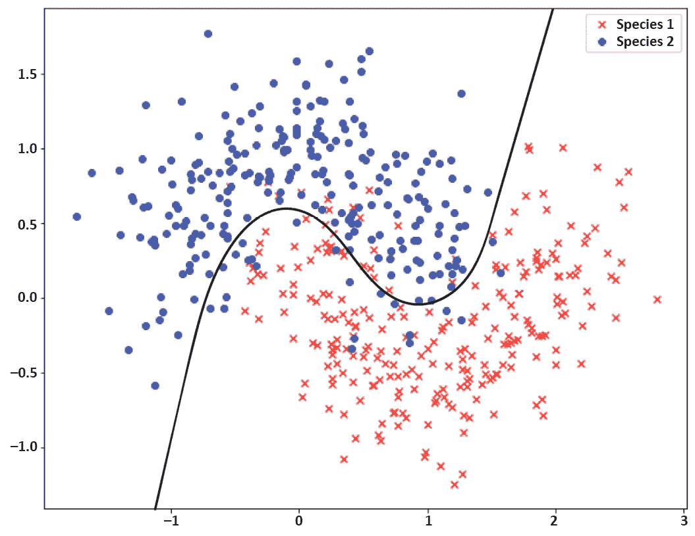

# 第五章：5\. 提高模型准确性

概述

本章介绍了神经网络的正则化概念。正则化的目的是防止模型在训练过程中对训练数据过拟合，并在模型在新数据上进行测试时提供更准确的结果。你将学会使用不同的正则化技术——L1 和 L2 正则化以及丢弃法正则化——来提高模型的表现。正则化是一个重要的组成部分，因为它可以防止神经网络对训练数据过拟合，帮助我们构建出在新数据上表现良好的健壮、准确的模型。通过本章的学习，你将能够在 scikit-learn 中实现网格搜索和随机搜索，找到最优的超参数。

# 引言

在上一章中，我们继续通过实验交叉验证，发展了使用神经网络创建准确模型的知识。交叉验证是一种无偏地测试各种超参数表现的方法。我们使用了留一法交叉验证，其中我们将一个记录从训练过程中留下，作为验证使用，并对数据集中的每一条记录重复这一过程。接着，我们介绍了 k 折交叉验证，我们将训练数据集分为`k`个折叠，在`k-1`个折叠上训练模型，并使用最后一个折叠进行验证。这些交叉验证方法允许我们使用不同的超参数训练模型，并在无偏数据上测试它们的表现。

深度学习不仅仅是构建神经网络，使用现有的数据集训练它们，并报告模型的准确性。它还涉及理解你的模型和数据集，并且通过改善许多方面，使基本模型超越。 在本章中，你将学习到两大类对提高机器学习模型（尤其是深度学习模型）非常重要的技术。这些技术分别是正则化方法和超参数调优。

本章将进一步介绍正则化方法——特别是为什么我们需要它们，以及它们如何帮助我们。接着，我们将介绍两种最重要和最常用的正则化技术。在这里，你将详细了解参数正则化及其两种变体，`L1`和`L2`范数正则化。然后，你将了解一种专门为神经网络设计的正则化技术——**丢弃法（Dropout Regulation）**。你还将通过完成涉及真实数据集的活动，实践在 Keras 模型上实现这些技术。最后，我们将简要介绍一些其他正则化技术，这些技术在你后续的工作中可能会有所帮助。

接下来，我们将讨论**超参数调优**的重要性，特别是对于深度学习模型，探讨如何调整超参数的值会显著影响模型的准确性，以及在构建深度神经网络时调优多个超参数的挑战。你将学习到两个非常有用的 scikit-learn 方法，这些方法可以用来对 Keras 模型进行超参数调优，并了解每种方法的优缺点，以及如何将它们结合起来，以便从中获得最大的收益。最后，你将通过完成一个实践活动来练习使用 scikit-learn 优化器为 Keras 模型实施超参数调优。

# 正则化

由于深度神经网络是高度灵活的模型，过拟合是训练过程中经常会遇到的问题。因此，成为深度学习专家的一个非常重要的部分是知道如何检测过拟合，并且随后如何解决模型中的过拟合问题。如果你的模型在训练数据上表现优异，但在新、未见过的数据上表现较差，那么模型的过拟合问题就很明显了。

例如，如果你构建了一个模型来将狗和猫的图像分类到各自的类别，并且你的图像分类器在训练过程中表现出高准确率，但在新数据上表现不佳，这就表明你的模型对训练数据过拟合。正则化技术是一类重要的方法，专门用于减少机器学习模型的过拟合问题。

彻底理解正则化技术，并能够将其应用到你的深度神经网络中，是构建深度神经网络以解决现实问题的重要一步。在本节中，你将了解正则化的基本概念，这将为后续的章节奠定基础，在这些章节中，你将学习如何使用 Keras 实现各种类型的正则化方法。

## 正则化的必要性

机器学习的主要目标是构建在训练数据上表现良好，并且能在新的、未包含在训练中的示例上同样表现良好的模型。一个好的机器学习模型应该能找到产生训练数据的真实底层过程/函数的形式和参数，而不是捕捉到个别训练数据的噪声。这样的模型能够很好地泛化到后续由相同过程生成的新数据上。

我们之前讨论的几种方法——比如将数据集分为训练集和测试集，以及交叉验证——都是为了估计训练模型的泛化能力。事实上，用于描述测试集误差和交叉验证误差的术语是“泛化误差”。这意味着在未用于训练的样本上的误差率。再次强调，机器学习的主要目标是构建具有低泛化误差率的模型。

在*第三章*，*《使用 Keras 进行深度学习》*中，我们讨论了机器学习模型的两个非常重要的问题：过拟合和欠拟合。我们指出，欠拟合是指估计的模型不够灵活或复杂，无法捕捉到与真实过程相关的所有关系和模式。这是一个`高偏差`的模型，并且在训练误差较高时会被发现。另一方面，过拟合是指用于估计真实过程的模型过于灵活或复杂。这是一个`高方差`的模型，并且当训练误差和泛化误差之间存在较大差距时被诊断出来。以下图像概述了二分类问题中的这些情境：


图 5.1：欠拟合

如上所示，欠拟合比过拟合是一个较少有问题的情况。事实上，欠拟合可以通过让模型变得更加灵活/复杂来轻松修复。在深度神经网络中，这意味着改变网络的架构，通过添加更多层或增加层中的单元数来使网络变大。

现在让我们来看下面的过拟合图像：


图 5.2：过拟合

类似地，解决过拟合有一些简单的方案，比如让模型变得不那么灵活/复杂（同样是通过改变网络的架构）或者提供更多的训练样本。然而，让网络变得不那么复杂有时会导致偏差或训练误差率的剧烈增加。原因在于，大多数情况下，过拟合的原因不是模型的灵活性，而是训练样本太少。另一方面，为了减少过拟合，提供更多的数据样本并非总是可能的。因此，找到在保持模型复杂度和训练样本数量不变的情况下减少泛化误差的方法，既重要又具有挑战性。

现在让我们来看下面的右侧拟合图像：



图 5.3：右侧拟合

这就是为什么在构建高度灵活的机器学习模型（如深度神经网络）时，我们需要正则化技术，以抑制模型的灵活性，避免其对单个样本进行过拟合。在接下来的章节中，我们将描述正则化方法如何减少模型在训练数据上的过拟合，从而降低模型的方差。

## 通过正则化减少过拟合

`正则化`方法试图通过修改学习算法，减少模型的方差。通过减少方差，正则化技术旨在降低泛化误差，同时不会显著增加训练误差（或者至少不会大幅增加训练误差）。

正则化方法提供了一种限制，有助于模型的稳定性。实现这一点有几种方式。对深度神经网络进行正则化的最常见方法之一是对权重施加某种惩罚项，以保持权重较小。

保持权重较小使得网络对个别数据样本中的噪声不那么敏感。在神经网络中，权重实际上是决定每个处理单元对网络最终输出影响大小的系数。如果单元的权重大，这意味着每个单元对输出的影响都会很大。将所有处理单元产生的巨大影响结合起来，最终输出将会有很多波动。

另一方面，保持权重较小减少了每个单元对最终输出的影响。实际上，通过将权重保持接近零，某些单元将几乎对输出没有影响。训练一个大型神经网络，其中每个单元对输出的影响微乎其微，相当于训练一个更简单的网络，从而减少了方差和过拟合。下图展示了正则化如何使大网络中某些单元的影响为零的示意图：


图 5.4：正则化如何使大网络中某些单元的影响为零的示意图

上面的图是正则化过程的示意图。顶部的网络展示了没有正则化的网络，而底部的网络则展示了一个应用了正则化的网络示例，其中白色单元代表那些由于正则化过程的惩罚几乎对输出没有影响的单元。

到目前为止，我们已经学习了正则化背后的概念。在接下来的章节中，我们将了解深度学习模型最常见的正则化方法——`L1`、`L2` 和 dropout 正则化，以及如何在 Keras 中实现它们。

# L1 和 L2 正则化

深度学习模型中最常见的正则化类型是保持网络权重较小的正则化。这种正则化被称为**权重正则化**，并且有两种不同的变体：**L2 正则化**和**L1 正则化**。在本节中，您将详细了解这些正则化方法，并学习如何在 Keras 中实现它们。此外，您还将练习将它们应用于现实问题，并观察它们如何提高模型的性能。

## L1 和 L2 正则化公式

在权重正则化中，一个惩罚项被添加到损失函数中。这个项通常是`L1 正则化`。如果使用 L2 范数，则称之为`L2 正则化`。在每种情况下，这个和将乘以一个超参数，称为**正则化参数**（**lambda**）。

因此，对于`L1 正则化`，公式如下：

*损失函数 = 旧损失函数 + lambda * 权重的绝对值和*

对于`L2 正则化`，公式如下：

*损失函数 = 旧损失函数 + lambda * 权重的平方和*

`Lambda`可以取任意值，范围从`0`到`1`，其中`lambda=0`意味着没有惩罚（相当于一个没有正则化的网络），`lambda=1`意味着完全惩罚。

和其他超参数一样，`lambda`的正确值可以通过尝试不同的值并观察哪个值提供较低的泛化误差来选择。实际上，最好从没有正则化的网络开始，并观察结果。然后，您应该使用逐渐增大的`lambda`值进行正则化，如`0.001`、`0.01`、`0.1`、`0.5`，并观察每种情况下的结果，以找出对特定问题来说，惩罚权重值的合适程度。

在每次带有正则化的优化算法迭代中，权重（w）会变得越来越小。因此，权重正则化通常被称为**权重衰减**。

到目前为止，我们仅讨论了在深度神经网络中正则化权重。然而，您需要记住，同样的过程也可以应用于偏置。更准确地说，我们可以通过向损失函数中添加一个惩罚偏置的项来更新损失函数，从而在神经网络训练过程中保持偏置的值较小。

注意

如果通过向损失函数添加两个项（一个惩罚权重，一个惩罚偏置）来执行正则化，那么我们称之为**参数正则化**，而不是权重正则化。

然而，在深度学习中，正则化偏置值并不常见。原因在于，权重是神经网络中更为重要的参数。事实上，通常，添加另一个项来正则化偏置与仅正则化权重值相比，不会显著改变结果。

`L2 正则化`是一般机器学习中最常见的正则化技术。与`L1 正则化`的不同之处在于，`L1`会导致更稀疏的权重矩阵，意味着有更多的权重等于零，因此有更多的节点完全从网络中移除。另一方面，`L2 正则化`则更为微妙。它会显著减少权重，但同时让你留下更少的权重等于零。同时进行`L1`和`L2 正则化`也是可能的。

现在你已经了解了`L1`和`L2 正则化`的工作原理，可以继续在 Keras 中实现深度神经网络上的`L1`和`L2 正则化`了。

## Keras 中的 L1 和 L2 正则化实现

Keras 提供了一个正则化 API，可以用来在每一层的深度神经网络中向损失函数添加惩罚项，以对权重或偏置进行正则化。要定义惩罚项或`正则化器`，你需要在`keras.regularizers`下定义所需的正则化方法。

例如，要定义一个`L1 正则化器`，使用`lambda=0.01`，你可以这样写：

```py
from keras.regularizers import l1
keras.regularizers.l1(0.01)
```

同样地，要定义一个`L2 正则化器`，使用`lambda=0.01`，你可以这样写：

```py
from keras.regularizers import l2
keras.regularizers.l2(0.01)
```

最后，要同时定义`L1`和`L2 正则化器`，使用`lambda=0.01`，你可以这样写：

```py
from keras.regularizers import l1_l2
keras.regularizers.l1_l2(l1=0.01, l2=0.01)
```

每个`正则化器`可以应用于层中的权重和/或偏置。例如，如果我们想在具有八个节点的密集层上同时应用`L2 正则化`（使用`lambda=0.01`）到权重和偏置上，我们可以这样写：

```py
from keras.layers import Dense
from keras.regularizers import l2
model.add(Dense(8, kernel_regularizer=l2(0.01), \
          bias_regularizer=l2(0.01)))
```

我们将在*活动 5.01*中进一步实践实现`L1`和`L2 正则化`，*阿维拉模式分类器的权重正则化*，你将为糖尿病数据集的深度学习模型应用正则化，并观察结果与先前活动的比较。

注意

本章中的所有活动将在 Jupyter 笔记本中开发。请从[`packt.live/2OOBjqq`](https://packt.live/2OOBjqq)下载本书的 GitHub 存储库以及所有准备好的模板。

## 活动 5.01：阿维拉模式分类器的权重正则化

阿维拉数据集是从`阿维拉圣经`的 800 幅图像中提取的，这是 12 世纪的拉丁文圣经的巨大复制品。该数据集包含有关文本图像的各种特征，例如列间距和文本的边距。数据集还包含一个类标签，指示图像模式是否属于最频繁出现的类别。在这个活动中，你将构建一个 Keras 模型，根据给定的网络架构和超参数值对该数据集进行分类。目标是在模型上应用不同类型的权重正则化，并观察每种类型如何改变结果。

在此活动中，我们将使用`训练集`/`测试集`方法进行评估，原因有两个。首先，由于我们将尝试几种不同的正则化器，执行交叉验证将需要很长时间。其次，我们希望绘制训练误差和测试误差的趋势图，以便通过视觉方式理解正则化如何防止模型对数据样本过拟合。

按照以下步骤完成此活动：

1.  从 GitHub 的`Chapter05`文件夹中的`data`子文件夹加载数据集，使用`X = pd.read_csv('../data/avila-tr_feats.csv')`和`y = pd.read_csv('../data/avila-tr_target.csv')`。使用`sklearn.model_selection.train_test_split`方法将数据集拆分为训练集和测试集。保留`20%`的数据样本作为测试集。

1.  定义一个 Keras 模型，包含三个隐藏层，第一个隐藏层的`大小为 10`，第二个隐藏层的`大小为 6`，第三个隐藏层的`大小为 4`，用于执行分类任务。使用以下超参数：`activation='relu'`，`loss='binary_crossentropy'`，`optimizer='sgd'`，`metrics=['accuracy']`，`batch_size=20`，`epochs=100`，`shuffle=False`。

1.  在训练集上训练模型，并使用测试集进行评估。在每次迭代中存储训练损失和测试损失。训练完成后，绘制`训练误差`和`测试误差`的趋势图（将纵轴的限制调整为（`0, 1`），这样可以更好地观察损失的变化）。在测试集上的最小误差率是多少？

1.  向模型的隐藏层添加`L2 正则化器`，其中`lambda=0.01`，并重复训练。训练完成后，绘制训练误差和测试误差的趋势图。在测试集上的最小误差率是多少？

1.  对`lambda=0.1`和`lambda=0.005`重复前面的步骤，针对每个`lambda`值训练模型，并报告结果。哪个`lambda`值对于在该深度学习模型和数据集上执行`L2 正则化`更为合适？

1.  重复前面的步骤，这次使用`L1 正则化器`，针对`lambda=0.01`和`lambda=0.005`训练模型，并报告结果。哪个`lambda`值对于在该深度学习模型和数据集上执行`L1 正则化`更为合适？

1.  向模型的隐藏层添加`L1_L2 正则化器`，其中`L1 lambda=0.005`，`L2 lambda=0.005`，并重复训练。训练完成后，绘制训练误差和测试误差的趋势图。在测试集上的最小误差率是多少？

完成这些步骤后，你应该得到以下预期输出：

![图 5.5：模型在训练过程中，L1 lambda 为 0.005，L2 lambda 为 0.005 时的训练误差和验证误差的趋势图]

](img/B15777_05_05.jpg)

图 5.5：模型在训练过程中，L1 lambda 为 0.005，L2 lambda 为 0.005 时的训练误差和验证误差的趋势图

注释

该活动的解决方案可以在第 398 页找到。

在这个活动中，你实践了为实际问题实现`L1`和`L2`权重正则化，并将正则化模型的结果与没有任何正则化的模型进行比较。在下一节中，我们将探讨另一种技术的正则化方法，称为 dropout 正则化。

# Dropout 正则化

在本节中，你将学习 dropout 正则化的工作原理，它如何帮助减少过拟合，以及如何使用 Keras 实现它。最后，你将通过完成一个涉及实际数据集的活动，来实践你学到的关于 dropout 的知识。

## Dropout 正则化的原理

Dropout 正则化通过在训练过程中随机移除神经网络中的节点来工作。更准确地说，dropout 在每个节点上设置一个概率。这个概率表示在每次学习算法的迭代中，该节点被包含在训练中的可能性。假设我们有一个大型神经网络，其中每个节点的 dropout 概率为`0.5`。在这种情况下，在每次迭代中，学习算法会为每个节点掷一次硬币，决定是否将该节点从网络中移除。以下图示展示了这一过程：


图 5.6：使用 dropout 正则化从深度神经网络中移除节点的示意图

这个过程在每次迭代时都会重复；这意味着，在每次迭代中，随机选择的节点会从网络中移除，这也意味着参数更新过程将在一个不同的较小网络上进行。例如，前图底部显示的网络只会用于一次训练迭代。对于下一次迭代，另一些随机选中的节点会从顶部网络中被删除，因此从这些节点中移除后的网络将与图中的底部网络不同。

当某些节点在学习算法的某次迭代中被选择移除/忽略时，这意味着它们在该次迭代中的参数更新过程中完全不参与。更准确地说，前向传播以预测输出、损失计算和反向传播以计算导数的所有操作都将在移除一些节点的较小网络上进行。因此，参数更新将仅在该次迭代中存在于网络中的节点上进行；被移除节点的权重和偏置将不会被更新。

然而，需要牢记的是，在测试集或保留集上评估模型的性能时，始终使用原始的完整网络。如果我们用随机删除节点的网络进行评估，结果会引入噪声，这样是不可取的。

在`dropout 正则化`中，`训练`始终在通过随机移除原始网络中的部分节点所得到的网络上进行。`评估`则始终使用原始网络进行。在接下来的部分，我们将了解为什么 dropout 正则化有助于防止过拟合。

## 使用 Dropout 减少过拟合

在本节中，我们将讨论 dropout 作为正则化方法背后的概念。正如我们之前讨论的，正则化技术的目标是防止模型对数据过拟合。因此，我们将研究如何通过随机移除神经网络中的一部分节点来帮助减少方差和过拟合。

删除网络中的随机节点防止过拟合的最明显解释是，通过从网络中移除节点，我们是在对比原始网络训练一个更小的网络。如你之前所学，一个更小的神经网络提供的灵活性较低，因此网络对数据过拟合的可能性较小。

还有一个原因，解释了为什么 dropout 正则化如此有效地减少过拟合。通过在深度神经网络的每一层随机移除输入，整个网络变得对单一输入不那么敏感。我们知道，在训练神经网络时，权重会以某种方式更新，使得最终的模型能够适应训练样本。通过随机移除一些权重参与训练过程，dropout 强制其他权重参与学习与训练样本相关的模式，因此最终的权重值会更好地分散。

换句话说，不是某些权重为了拟合某些输入值而过度更新，而是所有权重都参与学习这些输入值，从而导致过拟合减少。这就是为什么执行 dropout 比仅仅使用更小的网络更能产生一个更强大的模型——在新数据上表现更好。实际上，`dropout 正则化`在更大的网络上效果更佳。

现在你已经了解了 dropout 的基本过程及其有效性背后的原因，我们可以继续在 Keras 中实现`dropout 正则化`。

## 练习 5.01：在 Keras 中实现 Dropout

`Dropout 正则化`作为 Keras 中的核心层提供。因此，你可以像添加其他层到网络一样，将 dropout 添加到模型中。在 Keras 中定义 dropout 层时，你需要提供 `rate` 超参数作为参数。`rate` 可以是一个介于 `0` 和 `1` 之间的值，决定了要移除或忽略的输入单元的比例。在这个练习中，你将学习如何一步步实现带有 dropout 层的 Keras 深度学习模型。

我们的模拟数据集表示了树木的各种测量数据，如树高、树枝数和树干底部的胸围。我们的目标是根据给定的测量值将记录分类为落叶树（类值为`1`）或针叶树（类值为`0`）。数据集包含`10000`条记录，代表两种树种的两个类别，每个数据实例有`10`个特征值。请按照以下步骤完成此练习：

1.  首先，执行以下代码块以加载数据集，并将数据集拆分为`训练集`和`测试集`：

    ```py
    # Load the data
    import pandas as pd
    X = pd.read_csv('../data/tree_class_feats.csv')
    y = pd.read_csv('../data/tree_class_target.csv')
    """
    Split the dataset into training set and test set with a 80-20 ratio
    """
    from sklearn.model_selection import train_test_split
    seed = 1
    X_train, X_test, \
    y_train, y_test = train_test_split(X, y, \
                                       test_size=0.2, \
                                       random_state=seed)
    ```

1.  导入所有必要的依赖项。构建一个四层的 Keras 顺序模型，且不使用`dropout 正则化`。构建该网络时，第一隐藏层有 16 个单元，第二隐藏层有`12`个单元，第三隐藏层有`8`个单元，第四隐藏层有`4`个单元，所有层都使用`ReLU 激活`函数。添加一个具有`sigmoid 激活`函数的输出层：

    ```py
    #Define your model
    from keras.models import Sequential
    from keras.layers import Dense, Activation
    import numpy as np
    from tensorflow import random
    np.random.seed(seed)
    random.set_seed(seed)
    model_1 = Sequential()
    model_1.add(Dense(16, activation='relu', input_dim=10))
    model_1.add(Dense(12, activation='relu'))
    model_1.add(Dense(8, activation='relu'))
    model_1.add(Dense(4, activation='relu'))
    model_1.add(Dense(1, activation='sigmoid'))
    ```

1.  使用`binary cross-entropy`作为`loss`函数，`sgd`作为优化器，编译模型，并在`训练集`上以`batch_size=50`进行`300`个 epochs 的训练。然后，在`测试集`上评估训练好的模型：

    ```py
    model_1.compile(optimizer='sgd', loss='binary_crossentropy')
    # train the model
    model_1.fit(X_train, y_train, epochs=300, batch_size=50, \
                verbose=0, shuffle=False)
    # evaluate on test set
    print("Test Loss =", model_1.evaluate(X_test, y_test))
    ```

    这是预期的输出：

    ```py
    2000/2000 [==============================] - 0s 23us/step
    Test Loss = 0.1697693831920624
    ```

    因此，经过`300`个 epochs 训练后的树种预测测试误差率为`16.98%`。

1.  使用与之前模型相同的层数和每层相同大小重新定义模型。然而，在模型的第一隐藏层添加`rate=0.1`的`dropout 正则化`，然后重复编译、训练和在测试数据上评估模型的步骤：

    ```py
    """
    define the keras model with dropout in the first hidden layer
    """
    from keras.layers import Dropout
    np.random.seed(seed)
    random.set_seed(seed)
    model_2 = Sequential()
    model_2.add(Dense(16, activation='relu', input_dim=10))
    model_2.add(Dropout(0.1))
    model_2.add(Dense(12, activation='relu'))
    model_2.add(Dense(8, activation='relu'))
    model_2.add(Dense(4, activation='relu'))
    model_2.add(Dense(1, activation='sigmoid'))
    model_2.compile(optimizer='sgd', loss='binary_crossentropy')
    # train the model
    model_2.fit(X_train, y_train, \
                epochs=300, batch_size=50, \
                verbose=0, shuffle=False)
    # evaluate on test set
    print("Test Loss =", model_2.evaluate(X_test, y_test))
    ```

    这是预期的输出：

    ```py
    2000/2000 [==============================] - 0s 29us/step
    Test Loss = 0.16891103076934816
    ```

    在网络的第一层添加`rate=0.1`的 dropout 正则化后，测试误差率从`16.98%`降低到了`16.89%`。

1.  使用与之前模型相同的层数和每层相同大小重新定义模型。然而，在第一隐藏层添加`rate=0.2`的 dropout 正则化，并在模型的其余层添加`rate=0.1`的 dropout 正则化，然后重复编译、训练和在测试数据上评估模型的步骤：

    ```py
    # define the keras model with dropout in all hidden layers
    np.random.seed(seed)
    random.set_seed(seed)
    model_3 = Sequential()
    model_3.add(Dense(16, activation='relu', input_dim=10))
    model_3.add(Dropout(0.2))
    model_3.add(Dense(12, activation='relu'))
    model_3.add(Dropout(0.1))
    model_3.add(Dense(8, activation='relu'))
    model_3.add(Dropout(0.1))
    model_3.add(Dense(4, activation='relu'))
    model_3.add(Dropout(0.1))
    model_3.add(Dense(1, activation='sigmoid'))
    model_3.compile(optimizer='sgd', loss='binary_crossentropy')
    # train the model
    model_3.fit(X_train, y_train, epochs=300, \
                batch_size=50, verbose=0, shuffle=False)
    # evaluate on test set
    print("Test Loss =", model_3.evaluate(X_test, y_test))
    ```

    这是预期的输出：

    ```py
    2000/2000 [==============================] - 0s 40us/step
    Test Loss = 0.19390961921215058
    ```

在第一层保持`rate=0.2`的 dropout 正则化的同时，添加`rate=0.1`的 dropout 正则化到后续层，测试误差率从`16.89%`上升到`19.39%`。像`L1`和`L2 正则化`一样，添加过多的 dropout 会阻止模型学习与训练数据相关的潜在函数，从而导致比没有 dropout 正则化时更高的偏差。

如你在本次练习中看到的，你还可以根据认为在各个层上可能发生的过拟合情况，对不同层使用不同的 dropout 比例。通常，我们不建议在输入层和输出层使用 dropout。对于隐藏层，我们需要调整 `rate` 值，并观察结果，以便确定哪个值最适合特定问题。

注意

要查看此特定部分的源代码，请参考[`packt.live/3iugM7K`](https://packt.live/3iugM7K)。

你也可以在线运行这个示例，网址是[`packt.live/31HlSYo`](https://packt.live/31HlSYo)。

在接下来的活动中，你将练习在 Keras 中实现深度学习模型，并结合 Dropout 正则化来处理交通流量数据集。

## 活动 5.02：在交通流量数据集上应用 Dropout 正则化

在 *活动 4.03*，*在交通流量数据集上使用交叉验证进行模型选择*，*第四章*，*使用 Keras 包装器评估模型并进行交叉验证* 中，你使用交通流量数据集构建了一个模型，预测给定一系列与交通数据相关的标准化特征（如一天中的时间和前一天的交通量等）时城市桥梁上的交通流量。该数据集包含 `10000` 条记录，每条记录包含 `10` 个特征。

在本次活动中，你将从 *活动 4.03*，*在交通流量数据集上使用交叉验证进行模型选择*，*第四章*，*使用 Keras 包装器评估模型并进行交叉验证* 开始。你将使用训练集/测试集方法来训练和评估模型，绘制训练误差和泛化误差的趋势，并观察模型的过拟合情况。接下来，你将尝试通过使用 dropout 正则化来解决过拟合问题，从而提升模型性能。具体来说，你将尝试找出应该在哪些层添加 dropout 正则化，并找到最佳的 `rate` 值来最大程度地改进该模型。完成此活动的步骤如下：

1.  使用 pandas 的 `read_csv` 函数加载数据集。数据集也存储在 *Chapter05* GitHub 仓库的 `data` 子文件夹中。将数据集按 `80-20` 比例分割为训练集和测试集。

1.  定义一个 Keras 模型，包含两个隐藏层，每个隐藏层的`size`为`10`，用于预测交通流量。使用以下超参数：`activation='relu'`，`loss='mean_squared_error'`，`optimizer='rmsprop'`，`batch_size=50`，`epochs=200`，`shuffle=False`。

1.  在训练集上训练模型，并在测试集上评估。在每次迭代时存储训练损失和测试损失。

1.  训练完成后，绘制训练误差和测试误差的趋势。训练集和测试集的最低误差率是多少？

1.  向你的模型的第一个隐藏层添加`rate=0.1`的 dropout 正则化，并重复训练过程（由于训练时使用了 dropout，训练时间较长，请训练`200`个 epoch）。训练完成后，绘制训练误差和测试误差的趋势。训练集和测试集上的最低误差率分别是多少？

1.  重复之前的步骤，这次向你的模型的两个隐藏层添加`rate=0.1`的 dropout 正则化，并训练模型并报告结果。

1.  重复之前的步骤，这次在第一个隐藏层使用`rate=0.2`，在第二个隐藏层使用`0.1`，训练模型并报告结果。

1.  到目前为止，哪种 dropout 正则化方法在这个深度学习模型和数据集上取得了最佳性能？

实施这些步骤后，你应该得到以下预期的输出：


图 5.7：训练过程中使用 dropout 正则化的训练误差和验证误差图，第一个隐藏层的 rate=0.2，第二个隐藏层的 rate=0.1

注意

这个活动的解决方案可以在第 413 页找到。

在这个活动中，你学习了如何在 Keras 中实现 dropout 正则化，并在涉及交通流量数据集的问题中进行了实践。`Dropout 正则化`专门用于减少神经网络中的过拟合，其原理是通过在训练过程中随机去除神经网络中的节点。这个过程导致神经网络的权重值分布更加均匀，从而减少了单个数据样本的过拟合。接下来的章节中，我们将讨论其他可以应用于防止模型在训练数据上过拟合的正则化方法。

# 其他正则化方法

在这一节中，你将简要了解一些常用的正则化技术，这些技术在深度学习中被证明是有效的。需要牢记的是，正则化是机器学习中一个广泛且活跃的研究领域。因此，在一章中涵盖所有可用的正则化方法是不可能的（而且大多数情况下并不必要，尤其是在一本关于应用深度学习的书中）。因此，在这一节中，我们将简要介绍另外三种正则化方法，分别是**提前停止**、**数据增强**和**添加噪声**。你将了解它们的基本原理，并获得一些如何使用它们的技巧和建议。

## 提前停止

本章早些时候我们讨论了机器学习的主要假设是存在一个真实的函数或过程来生成训练样本。然而，这个过程是未知的，且没有明确的方法可以找到它。不仅找不到确切的底层过程，而且选择一个具有适当灵活性或复杂度的模型来估计这个过程也很具挑战性。因此，一种好的做法是选择一个高灵活度的模型，比如深度神经网络，来建模这个过程，并仔细监控训练过程。

通过监控训练过程，我们可以在模型捕捉到过程的形式时及时停止训练，避免在模型开始对单个数据样本过拟合时继续训练。这就是早停背后的基本思想。我们在*第三章*，*使用 Keras 的深度学习*的*模型评估*部分简要讨论了早停的概念。我们提到，通过监控和观察训练过程中 `训练误差` 和 `测试误差` 的变化，我们可以判断训练量过少或过多的界限。

下图展示了在训练高度灵活的模型时，训练误差和测试误差的变化情况。正如我们所见，训练需要在标记为**合适拟合**的区域停止，以避免过拟合：


图 5.8：训练模型时训练误差和测试误差的变化图

在*第三章*，*使用 Keras 的深度学习*中，我们练习了存储和绘制训练误差和测试误差的变化，以识别过拟合。你学到，在训练 Keras 模型时，你可以提供验证集或测试集，并通过以下代码在每个训练周期中存储它们的指标值：

```py
history=model.fit(X_train, y_train, validation_data=(X_test, y_test), \
                  epochs=epochs)
```

在本节中，你将学习如何在 Keras 中实现早停。这意味着在 Keras 模型训练时，当某个期望的指标——例如，`测试误差率`——不再改善时，强制停止训练。为此，你需要定义一个 `EarlyStopping()` 回调函数，并将其作为参数提供给 `model.fit()`。

在定义 `EarlyStopping()` 回调函数时，你需要为其提供正确的参数。第一个参数是 `monitor`，它决定了在训练过程中监控哪个指标来执行早停。通常，`monitor='val_loss'` 是一个不错的选择，这意味着我们希望监控测试误差率。

此外，根据你为 `monitor` 选择的参数，你需要将 `mode` 参数设置为 `'min'` 或 `'max'`。如果指标是误差/损失，我们希望将其最小化。例如，以下代码块定义了一个 `EarlyStopping()` 回调函数，用于在训练过程中监控测试误差，并检测其是否不再减少：

```py
from keras.callbacks import EarlyStopping
es_callback = EarlyStopping(monitor='val_loss', mode='min')
```

如果误差率波动很大或噪声较多，那么在损失开始增加时就立即停止训练可能并不是一个好主意。因此，我们可以将`patience`参数设置为一定的 epoch 数量，给早停方法一些时间，在停止训练过程之前，能够监控目标度量值更长时间：

```py
es_callback = EarlyStopping(monitor='val_loss', \
                            mode='min', patience=20)
```

我们还可以修改`EarlyStopping()`回调函数，如果在过去的`epoch`内，`monitor`度量没有发生最小的改进，或者`monitor`度量已达到基准水平时，停止训练过程：

```py
es_callback = EarlyStopping(monitor='val_loss', \
                            mode='min', min_delta=1)
es_callback = EarlyStopping(monitor='val_loss', \
                            mode='min', baseline=0.2)
```

在定义了`EarlyStopping()`回调函数后，可以将其作为`callbacks`参数传递给`model.fit()`并训练模型。训练将根据`EarlyStopping()`回调函数自动停止：

```py
history=model.fit(X_train, y_train, validation_data=(X_test, y_test), \
                  epochs=epochs, callbacks=[es_callback])
```

我们将在下一个练习中探索如何在实际中实现早停。

## 练习 5.02：在 Keras 中实现早停

在这个练习中，你将学习如何在 Keras 深度学习模型中实现早停。我们将使用的数据集是一个模拟数据集，包含表示树木不同测量值的数据，例如树高、树枝数量和树干基部的周长。我们的目标是根据给定的测量值将记录分类为落叶树或针叶树。

首先，执行以下代码块以加载包含`10000`条记录的模拟数据集，这些记录包括两类，表示两种树种，其中落叶树的类值为`1`，针叶树的类值为`0`。每条记录有`10`个特征值。

目标是构建一个模型，以便在给定树木的测量值时预测树的种类。现在，让我们按照以下步骤操作：

1.  使用 pandas 的`read_csv`函数加载数据集，并使用`train_test_split`函数将数据集按`80-20`比例拆分：

    ```py
    # Load the data
    import pandas as pd
    X = pd.read_csv('../data/tree_class_feats.csv')
    y = pd.read_csv('../data/tree_class_target.csv')
    """
    Split the dataset into training set and test set with an 80-20 ratio
    """
    from sklearn.model_selection import train_test_split
    seed=1
    X_train, X_test, \
    y_train, y_test = train_test_split(X, y, test_size=0.2, \
                                       random_state=seed)
    ```

1.  导入所有必要的依赖项。构建一个没有早停的三层 Keras 顺序模型。第一层将有`16`个单元，第二层有`8`个单元，第三层有`4`个单元，所有层均使用`ReLU 激活函数`。添加`输出层`并使用`sigmoid 激活函数`：

    ```py
    # Define your model
    from keras.models import Sequential
    from keras.layers import Dense, Activation
    import numpy as np
    from tensorflow import random
    np.random.seed(seed)
    random.set_seed(seed)
    model_1 = Sequential()
    model_1.add(Dense(16, activation='relu', \
                      input_dim=X_train.shape[1]))
    model_1.add(Dense(8, activation='relu'))
    model_1.add(Dense(4, activation='relu'))
    model_1.add(Dense(1, activation='sigmoid'))
    ```

1.  使用二进制交叉熵作为`loss`函数，并将优化器设为`SGD`来编译模型。训练模型`300`个 epoch，`batch_size=50`，同时在每次迭代时记录`训练误差`和`测试误差`：

    ```py
    model_1.compile(optimizer='sgd', loss='binary_crossentropy')
    # train the model
    history = model_1.fit(X_train, y_train, \
                          validation_data=(X_test, y_test), \
                          epochs=300, batch_size=50, \
                          verbose=0, shuffle=False)
    ```

1.  导入绘图所需的包：

    ```py
    import matplotlib.pyplot as plt 
    import matplotlib
    %matplotlib inline
    ```

1.  绘制在拟合过程中存储的`训练误差`和`测试误差`：

    ```py
    matplotlib.rcParams['figure.figsize'] = (10.0, 8.0) 
    plt.plot(history.history['loss'])
    plt.plot(history.history['val_loss'])
    plt.ylim(0,1)
    plt.ylabel('loss')
    plt.xlabel('epoch')
    plt.legend(['train loss', 'validation loss'], \
               loc='upper right')
    ```

    这是预期的输出：

    

    图 5.9：训练模型时，未使用早停的训练误差和验证误差图

    从前面的图中可以看出，训练模型 `300` 个 epoch 后，`训练误差`和`验证误差`之间的差距不断扩大，这表明过拟合已经开始发生。

1.  通过创建具有相同层数和每层相同单位数的模型来重新定义模型。这确保了模型以相同的方式初始化。向训练过程中添加回调`es_callback = EarlyStopping(monitor='val_loss', mode='min')`。重复*步骤 4*以绘制训练误差和验证误差：

    ```py
    #Define your model with early stopping on test error
    from keras.callbacks import EarlyStopping
    np.random.seed(seed)
    random.set_seed(seed)
    model_2 = Sequential()
    model_2.add(Dense(16, activation='relu', \
                      input_dim=X_train.shape[1]))
    model_2.add(Dense(8, activation='relu'))
    model_2.add(Dense(4, activation='relu'))
    model_2.add(Dense(1, activation='sigmoid'))
    """
    Choose the loss function to be binary cross entropy and the optimizer to be SGD for training the model
    """
    model_2.compile(optimizer='sgd', loss='binary_crossentropy')
    # define the early stopping callback
    es_callback = EarlyStopping(monitor='val_loss', \
                                mode='min')
    # train the model
    history=model_2.fit(X_train, y_train, \
                        validation_data=(X_test, y_test), \
                        epochs=300, batch_size=50, \
                        callbacks=[es_callback], verbose=0, \
                        shuffle=False)
    ```

1.  现在绘制损失值：

    ```py
    # plot training error and test error
    matplotlib.rcParams['figure.figsize'] = (10.0, 8.0) 
    plt.plot(history.history['loss'])
    plt.plot(history.history['val_loss'])
    plt.ylim(0,1)
    plt.ylabel('loss')
    plt.xlabel('epoch')
    plt.legend(['train loss', 'validation loss'], \
               loc='upper right')
    ```

    这是预期的输出：

    

    图 5.10：使用提前停止（patience=0）训练模型时的训练误差和验证误差图

    通过将`patience=0`的提前停止回调添加到模型中，训练过程将在大约`39`个 epoch 后自动停止。

1.  重复*步骤 5*，同时将`patience=10`添加到你的提前停止回调中。重复*步骤 3*以绘制`训练误差`和`验证误差`：

    ```py
    """
    Define your model with early stopping on test error with patience=10
    """
    from keras.callbacks import EarlyStopping
    np.random.seed(seed)
    random.set_seed(seed)
    model_3 = Sequential()
    model_3.add(Dense(16, activation='relu', \
                      input_dim=X_train.shape[1]))
    model_3.add(Dense(8, activation='relu'))
    model_3.add(Dense(4, activation='relu'))
    model_3.add(Dense(1, activation='sigmoid'))
    """
    Choose the loss function to be binary cross entropy and the optimizer to be SGD for training the model
    """
    model_3.compile(optimizer='sgd', loss='binary_crossentropy')
    # define the early stopping callback
    es_callback = EarlyStopping(monitor='val_loss', \
                                mode='min', patience=10)
    # train the model
    history=model_3.fit(X_train, y_train, \
                        validation_data=(X_test, y_test), \
                        epochs=300, batch_size=50, \
                        callbacks=[es_callback], verbose=0, \
                        shuffle=False)
    ```

1.  然后再次绘制损失图：

    ```py
    # plot training error and test error
    matplotlib.rcParams['figure.figsize'] = (10.0, 8.0) 
    plt.plot(history.history['loss'])
    plt.plot(history.history['val_loss'])
    plt.ylim(0,1)
    plt.ylabel('loss')
    plt.xlabel('epoch')
    plt.legend(['train loss', 'validation loss'], \
               loc='upper right')
    ```

    这是预期的输出：


图 5.11：使用提前停止（patience=10）训练模型时的训练误差和验证误差图

通过将`patience=10`的提前停止回调添加到模型中，训练过程将在大约`150`个 epoch 后自动停止。

在这个练习中，你学会了如何停止模型训练，以防止你的 Keras 模型在训练数据上过拟合。为此，你使用了`EarlyStopping`回调并在训练时应用了它。我们使用这个回调在验证损失增加时停止模型，并添加了一个`patience`参数，它会在停止之前等待给定的 epoch 数量。我们在一个涉及交通流量数据集的问题上练习了使用这个回调来训练 Keras 模型。

注意

要访问此特定部分的源代码，请参阅[`packt.live/3iuM4eL`](https://packt.live/3iuM4eL)。

你也可以在[`packt.live/38AbweB`](https://packt.live/38AbweB)上在线运行这个示例。

在下一部分中，我们将讨论其他可以应用的正则化方法，以防止过拟合。

## 数据增强

**数据增强**是一种正则化技术，试图通过以廉价的方式在更多的训练样本上训练模型来解决过拟合问题。在数据增强中，现有数据会以不同的方式进行转换，并作为新的训练数据输入到模型中。这种类型的正则化已被证明是有效的，特别是在一些特定的应用中，例如计算机视觉中的目标检测/识别和语音处理。

例如，在计算机视觉应用中，您可以通过将每个图像的镜像版本和旋转版本添加到数据集中，轻松地将训练数据集的大小加倍或加三倍。通过这些变换生成的新训练示例显然不如原始训练示例好。然而，它们已被证明能改善模型的过拟合问题。

执行数据增强时的一个挑战是选择在数据上执行的正确变换。根据数据集的类型和应用，变换需要谨慎选择。

## 添加噪声

通过向数据中添加噪声来对模型进行正则化的基本思想与数据增强正则化相同。在小数据集上训练深度神经网络会增加网络记住单一数据示例的概率，而不是捕捉输入与输出之间的关系。

这样会导致在新数据上的表现不佳，表明模型对训练数据进行了过拟合。相反，在大数据集上训练模型可以增加模型捕捉真实底层过程的概率，而不是记住单个数据点，从而减少过拟合的机会。

扩展训练数据并减少过拟合的一种方法是通过向现有数据中注入噪声来生成新的数据示例。这种正则化方式已被证明能够减少过拟合，其效果与权重正则化技术相当。

通过将单个示例的不同版本添加到训练数据中（每个版本通过在原始示例中加入少量噪声创建），我们可以确保模型不会过拟合数据中的噪声。此外，通过包含这些修改后的示例来增加训练数据集的大小，可以为模型提供更好的底层数据生成过程的表示，并增加模型学习真实过程的机会。

在深度学习应用中，您可以通过向隐藏层的权重或激活值、网络的梯度，甚至输出层添加噪声，或向训练示例（输入层）添加噪声来提高模型性能。决定在深度神经网络中添加噪声的位置是另一个需要通过尝试不同网络并观察结果来解决的挑战。

在 Keras 中，您可以轻松地将噪声定义为一个层并将其添加到模型中。例如，要向模型添加`高斯噪声`，标准差为`0.1`（均值为`0`），可以编写如下代码：

```py
from keras.layers import GaussianNoise
model.add(GaussianNoise(0.1))
```

以下代码将向模型的第一个隐藏层的输出/激活值添加`高斯噪声`：

```py
model = Sequential()
model.add(Dense(4, input_dim=30, activation='relu'))
model.add(GaussianNoise(0.01))
model.add(Dense(4, activation='relu'))
model.add(Dense(4, activation='relu'))
model.add(Dense(1, activation='sigmoid')) 
```

在本节中，你学习了三种正则化方法：`early stopping`、`data augmentation` 和 `adding noise`。除了它们的基本概念和流程外，你还了解了它们如何减少过拟合，并且提供了一些使用它们的技巧和建议。在下一节中，你将学习如何使用 scikit-learn 提供的函数来调优超参数。通过这样做，我们可以将 Keras 模型整合到 scikit-learn 的工作流中。

# 使用 scikit-learn 进行超参数调优

超参数调优是提高深度学习模型性能的一个非常重要的技术。在*第四章*，*使用 Keras 包装器进行交叉验证评估模型*中，你学习了如何使用 scikit-learn 的 Keras 包装器，这使得 Keras 模型能够在 scikit-learn 的工作流中使用。因此，scikit-learn 中可用的不同通用机器学习和数据分析工具与方法可以应用于 Keras 深度学习模型。其中包括 scikit-learn 的超参数优化器。

在上一章中，你学习了如何通过编写用户定义的函数，遍历每个超参数的可能值来进行超参数调优。在本节中，你将学习如何通过使用 scikit-learn 中可用的各种超参数优化方法，以更简单的方式进行调优。你还将通过完成涉及实际数据集的活动来实践应用这些方法。

## 使用 scikit-learn 进行网格搜索

到目前为止，我们已经确认，构建深度神经网络涉及对多个超参数做出决策。超参数的列表包括隐藏层的数量、每个隐藏层中单元的数量、每层的激活函数、网络的损失函数、优化器的类型及其参数、正则化器的类型及其参数、批次大小、训练的轮次等。我们还观察到，不同的超参数值会显著影响模型的性能。

因此，找到最佳超参数值是成为深度学习专家过程中最重要也是最具挑战性的部分之一。由于没有适用于每个数据集和每个问题的超参数绝对规则，因此确定超参数的值需要通过试验和错误来针对每个特定问题进行调整。这个过程——用不同的超参数训练和评估模型，并根据模型表现决定最终的超参数——被称为**超参数调优**或**超参数优化**。

对于我们希望调整的每个超参数，设置一组可能的取值范围可以创建一个网格，如下图所示。因此，超参数调整可以看作是一个网格搜索问题；我们希望尝试网格中的每一个单元格（每一个可能的超参数组合），并找到那个能为模型带来最佳性能的单元格：


图 5.12：通过优化器、批处理大小和 epoch 的一些值创建的超参数网格

Scikit-learn 提供了一个名为 `GridSearchCV()` 的参数优化器，用于执行这种穷举的网格搜索。`GridSearchCV()` 接收模型作为 `estimator` 参数，并接收包含所有可能的超参数值的字典作为 `param_grid` 参数。然后，它会遍历网格中的每个点，使用该点的超参数值对模型进行交叉验证，并返回最佳的交叉验证得分，以及导致该得分的超参数值。

在上一章中，你学习了为了在 scikit-learn 中使用 Keras 模型，你需要定义一个返回 Keras 模型的函数。例如，下面的代码块定义了一个 Keras 模型，我们希望在之后对其进行超参数调整：

```py
from keras.models import Sequential
from keras.layers import Dense
def build_model():
    model = Sequential(optimizer)
    model.add(Dense(10, input_dim=X_train.shape[1], \
                    activation='relu'))
    model.add(Dense(10, activation='relu'))
    model.add(Dense(1))
    model.compile(loss='mean_squared_error', \
                  optimizer= optimizer)
    return model
```

下一步是定义超参数网格。例如，假设我们想要调整 `optimizer=['rmsprop', 'adam', 'sgd', 'adagrad']`，`epochs = [100, 150]`，`batch_size = [1, 5, 10]`。为了做到这一点，我们将编写如下代码：

```py
optimizer = ['rmsprop', 'adam', 'sgd', 'adagrad']
epochs = [100, 150]
batch_size = [1, 5, 10]
param_grid = dict(optimizer=optimizer, epochs=epochs, \
                  batch_size= batch_size)
```

现在超参数网格已经创建完毕，我们可以创建封装器，以便构建 Keras 模型的接口，并将其用作估计器来执行网格搜索：

```py
from keras.wrappers.scikit_learn import KerasRegressor
model = KerasRegressor(build_fn=build_model, \
                       verbose=0, shuffle=False)
from sklearn.model_selection import GridSearchCV
grid_search = GridSearchCV(estimator=model, \
                           param_grid=param_grid, cv=10)
results = grid_search.fit(X, y)
```

上述代码会穷举地遍历网格中的每个单元格，并使用每个单元格中的超参数值进行 10 折交叉验证（这里，它会执行 `10 折交叉验证` 4*2*3=24 次）。然后，它返回每个这些 `24` 个单元格的交叉验证得分，并返回获得最佳得分的那个。

注意

对多个可能的超参数组合执行 k 折交叉验证确实需要很长时间。因此，你可以通过将 `n_jobs=-1` 参数传递给 `GridSearchCV()` 来并行化这个过程，这样会使用所有可用的处理器来执行网格搜索。该参数的默认值是 `n_jobs=1`，意味着不进行并行化。

创建超参数网格只是通过超参数迭代找到最优选择的一种方式。另一种方法是简单地随机选择超参数，这将在下一个主题中介绍。

## 使用 scikit-learn 进行随机化搜索

正如你可能已经意识到的那样，穷举网格搜索可能不是调优深度学习模型超参数的最佳选择，因为它效率不高。深度学习中有许多超参数，尤其是当你想为每个超参数尝试一个大范围的值时，穷举网格搜索将需要花费过长的时间才能完成。进行超参数优化的另一种方式是，在网格上进行随机采样，并对一些随机选择的单元格进行 k 折交叉验证。Scikit-learn 提供了一个名为`RandomizedSearchCV()`的优化器，用于执行超参数优化的随机搜索。

例如，我们可以将前一节的代码从穷举网格搜索更改为随机搜索，如下所示：

```py
from keras.wrappers.scikit_learn import KerasRegressor
model = KerasRegressor(build_fn=build_model, verbose=0)
from sklearn.model_selection import RandomizedSearchCV
grid_search = RandomizedSearchCV(estimator=model, \
                                 param_distributions=param_grid, \
                                 cv=10, n_iter=12)
results = grid_search.fit(X, y)
```

请注意，`RandomizedSearchCV()`需要额外的`n_iter`参数，它决定了必须选择多少个随机单元格。这决定了 k 折交叉验证将执行多少次。因此，通过选择较小的值，将考虑较少的超参数组合，方法完成的时间也会更短。另外，请注意，这里`param_grid`参数已更改为`param_distributions`。`param_distributions`参数可以接受一个字典，字典的键是参数名称，值可以是参数的列表或每个键的分布。

可以说，`RandomizedSearchCV()`不如`GridSearchCV()`好，因为它没有考虑所有可能的超参数值及其组合，这一点是合理的。因此，一种进行深度学习模型超参数调优的聪明方法是，首先对许多超参数使用`RandomizedSearchCV()`，或对较少的超参数使用`GridSearchCV()`，并且这些超参数之间的间隔较大。

通过从许多超参数的随机搜索开始，我们可以确定哪些超参数对模型性能的影响最大。这也有助于缩小重要超参数的范围。然后，你可以通过对较少的超参数及其较小的范围执行`GridSearchCV()`来完成超参数调优。这种方法称为**粗到精**的超参数调优方法。

现在，你准备好实践使用 scikit-learn 优化器进行超参数调优了。在接下来的活动中，你将通过调优超参数来改进你的糖尿病数据集模型。

## 活动 5.03：在 Avila 模式分类器上进行超参数调优

Avila 数据集是从`800`张 Avila 圣经图像中提取的，Avila 圣经是 12 世纪的拉丁文巨型圣经副本。该数据集包含有关文本图像的各种特征，如行间距和文本边距。数据集还包含一个类别标签，指示图像的模式是否属于最常见的类别。在本活动中，您将构建一个与前几个活动类似的 Keras 模型，但这次您将为模型添加正则化方法。然后，您将使用 scikit-learn 优化器来调整模型的超参数，包括正则化器的超参数。以下是您在本活动中需要完成的步骤：

1.  使用`X = pd.read_csv('../data/avila-tr_feats.csv')`和`y = pd.read_csv('../data/avila-tr_target.csv')`从 GitHub 上的`Chapter05`文件夹中的`data`子文件夹加载数据集。

1.  定义一个返回 Keras 模型的函数，该模型包含三个隐藏层，第一层的`size 10`，第二层的`size 6`，第三层的`size 4`，且均带有`L2 权重正则化`。使用以下值作为模型的超参数：`activation='relu'`，`loss='binary_crossentropy'`，`optimizer='sgd'`，`metrics=['accuracy']`。另外，确保将`L2 lambda`超参数作为参数传递给函数，以便我们以后进行调整。

1.  为您的 Keras 模型创建包装器，并使用`cv=5`对其执行`GridSearchCV()`。然后，在参数网格中添加以下值：`lambda_parameter = [0.01, 0.5, 1]`，`epochs = [50, 100]`，以及`batch_size = [20]`。这可能需要一些时间来处理。参数搜索完成后，打印最佳交叉验证分数的准确率和超参数。您还可以打印每个其他交叉验证分数，以及导致该分数的超参数。

1.  重复前一步，这次使用`GridSearchCV()`在更窄的范围内进行搜索，参数为`lambda_parameter = [0.001, 0.01, 0.05, 0.1]`，`epochs = [400]`，以及`batch_size = [10]`。这可能需要一些时间来处理。

1.  重复前一步，但从 Keras 模型中移除`L2 正则化器`，而是使用`rate`参数在每个隐藏层中添加 dropout 正则化。使用以下值在参数网格中执行`GridSearchCV()`并打印结果：`rate = [0, 0.2, 0.4]`，`epochs = [350, 400]`，以及`batch_size = [10]`。

1.  重复前一步，使用`rate = [0.0, 0.05, 0.1]`和`epochs=[400]`。

完成这些步骤后，您应该看到以下预期输出：

```py
Best cross-validation score= 0.7862895488739013
Parameters for Best cross-validation score= {'batch_size': 20, 'epochs': 100, 'rate': 0.0}
Accuracy 0.786290 (std 0.013557) for params {'batch_size': 20, 'epochs': 100, 'rate': 0.0}
Accuracy 0.786098 (std 0.005184) for params {'batch_size': 20, 'epochs': 100, 'rate': 0.05}
Accuracy 0.772004 (std 0.013733) for params {'batch_size': 20, 'epochs': 100, 'rate': 0.1}
```

注意

本活动的解决方案可以在第 422 页找到。

在这个活动中，我们学习了如何在 Keras 模型上实现超参数调优，并结合正则化器使用真实数据集进行分类。我们学习了如何使用 scikit-learn 优化器对模型超参数进行调优，包括正则化器的超参数。在这一部分，我们通过创建一个超参数网格并遍历它们来实现超参数调优。这使我们能够使用 scikit-learn 工作流找到最优的超参数组合。

# 总结

在本章中，你学习了两组非常重要的技术，用于提高深度学习模型的准确性：正则化和超参数调优。你学习了正则化如何通过多种不同的方法解决过拟合问题，包括 L1 和 L2 范数正则化以及 dropout 正则化——这些是常用的正则化技术。你发现了超参数调优对于机器学习模型的重要性，特别是对于深度学习模型的挑战。你甚至练习了使用 scikit-learn 优化器，在 Keras 模型上执行超参数调优。

在下一章中，你将探索评估模型性能时准确性指标的局限性，以及其他指标（如 `precision`、`sensitivity`、`specificity` 和 `AUC-ROC score`），并了解如何使用它们更好地评估模型的性能。
