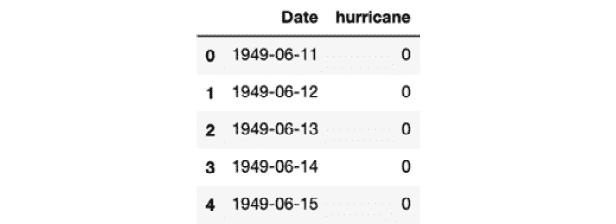
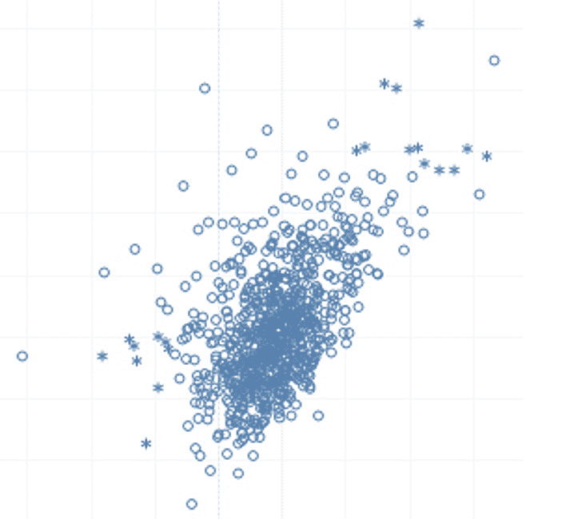
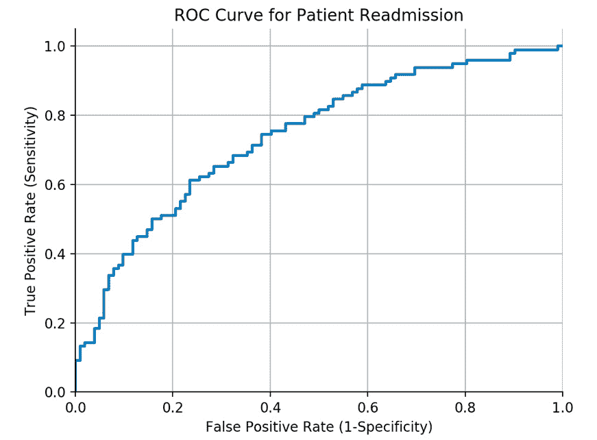
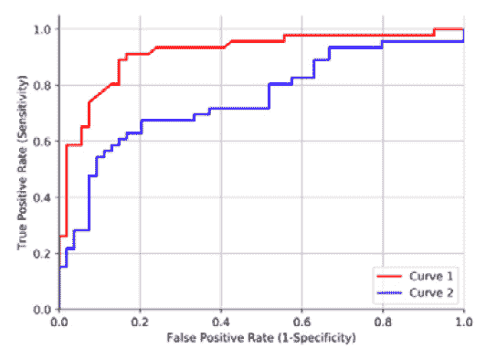
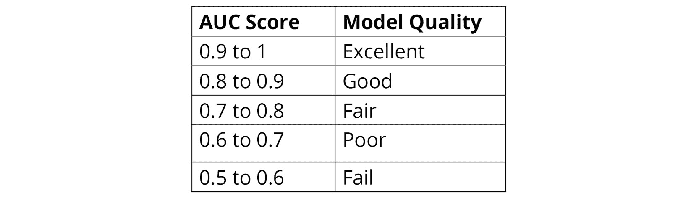
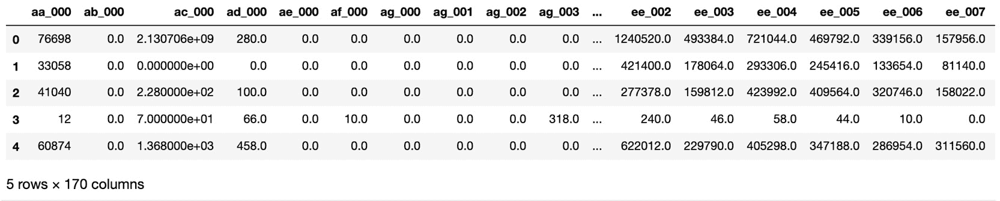
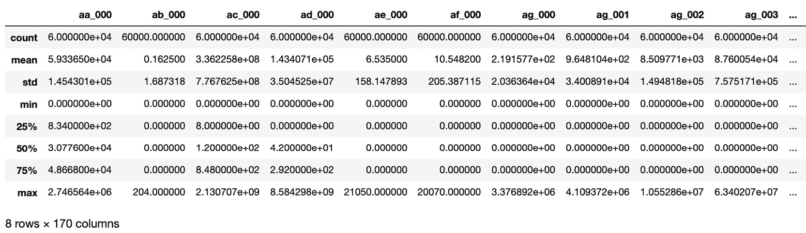
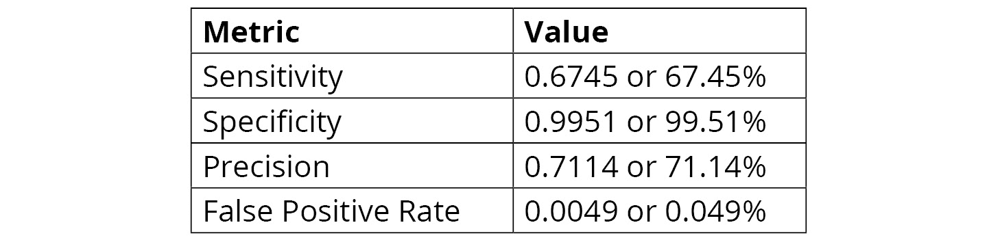
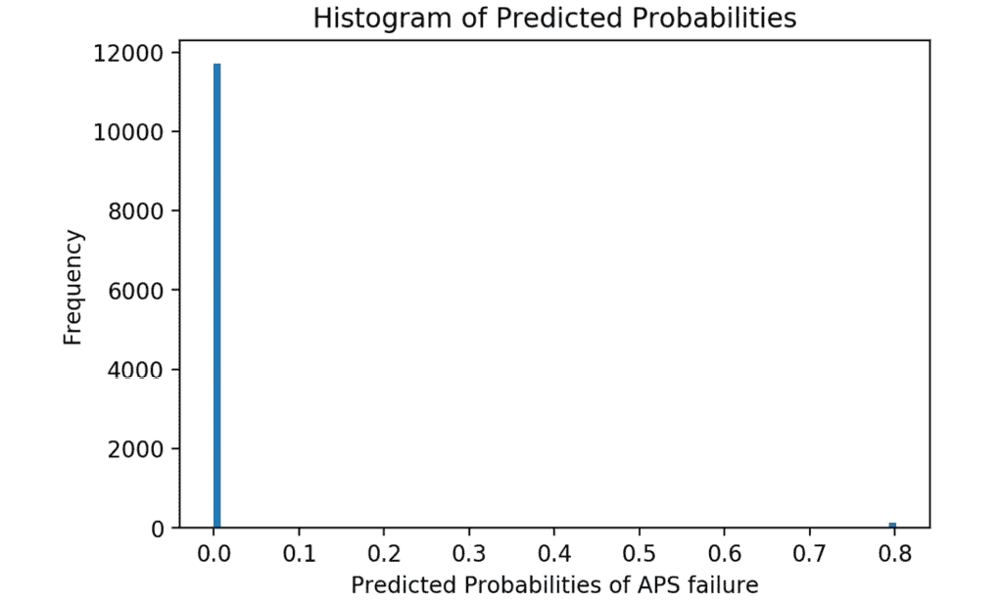

# 第六章：6\. 模型评估

概述

本章将深入讨论模型评估。我们将讨论在标准技术不可行时，如何使用其他方法来评估模型的性能，特别是在类别不平衡的情况下。最后，我们将利用混淆矩阵、敏感性、特异性、精确度、假阳性率（FPR）、ROC 曲线和 AUC 分数来评估分类器的性能。在本章结束时，你将深入理解准确度和零准确度，并能够理解并应对不平衡数据集的挑战。

# 介绍

在上一章中，我们讨论了神经网络的 `正则化` 技术。`正则化` 是一种重要的技术，用于防止模型对训练数据过拟合，并帮助模型在新的、未见过的数据样本上表现良好。我们讨论的正则化技术之一是 `L1` 和 `L2` 权重正则化，在其中对权重进行惩罚。我们还学习了另一种正则化技术——`丢弃正则化`，在每次迭代中，随机移除模型中的某些层单元，防止它们过度影响模型拟合过程。这两种正则化技术的设计目的是防止单个权重或单元被过度影响，从而使模型能够更好地泛化。

在本章中，我们将学习一些与 `准确度` 不同的评估技术。对于任何数据科学家来说，构建模型后的第一步是评估模型，而评估模型的最简单方法就是通过其准确度。然而，在现实世界的场景中，特别是在分类任务中，当类别高度不平衡时，比如预测飓风的发生、预测罕见疾病的出现或预测某人是否会违约时，使用准确度分数来评估模型并不是最好的评估方法。

本章探讨了核心概念，如不平衡数据集以及如何使用不同的评估技术来处理这些不平衡数据集。本章首先介绍准确度及其局限性。然后，我们将探索 `零准确度`、`不平衡数据集`、`敏感性`、`特异性`、`精确度`、`假阳性`、`ROC 曲线` 和 `AUC 分数` 等概念。

# 准确度

为了正确理解准确度，让我们探索模型评估。模型评估是模型开发过程中的一个关键部分。一旦你构建并执行了模型，下一步就是评估你的模型。

模型是基于 `训练数据集` 构建的，在同一个训练数据集上评估模型的表现在数据科学中是不推荐的。一旦模型在训练数据集上训练完成，它应该在与训练数据集完全不同的数据集上进行评估。这个数据集被称为 `测试数据集`。目标始终是构建一个具有泛化能力的模型，也就是说，模型应该在任何数据集上都能产生类似（但不完全相同）的结果，或者是相对相似的结果。只有在使用模型未知的数据进行评估时，才能实现这一目标。

模型评估过程需要一个能够量化模型表现的指标。模型评估中最简单的指标就是准确率。`准确率` 是我们的模型预测正确的比例。计算 `准确率` 的公式如下：

*准确率 = （正确预测数量）/（总预测数量）*

例如，如果我们有 `10` 条记录，其中 `7` 条预测正确，那么我们可以说模型的准确率是 `70%`。计算方法为 `7/10` = `0.7` 或 `70%`。

`Null accuracy` 是通过预测最频繁类别可以达到的准确率。如果我们不运行算法，而只是基于最频繁的结果预测准确率，那么基于此预测计算得到的准确率就是 `null accuracy`：

*Null accuracy = （最频繁类别的实例总数）/（实例总数）*

看一下这个例子：

10 个实际结果: [1,0,0,0,0,0,0,0,1,0]。

`预测`: [0,0,0,0,0,0,0,0,0,0]

`Null accuracy` = 8/10 = 0.8 或 80%

因此，我们的 `null accuracy` 是 `80%`，意味着我们在 `80%` 的情况下预测是正确的。这意味着我们在没有运行任何算法的情况下就达到了 `80%` 的准确率。请记住，当 null accuracy 较高时，表示响应变量的分布偏向于频繁出现的类别。

我们来做一个练习，计算数据集的 null accuracy。可以通过使用 pandas 库中的 `value_count` 函数来找到数据集的 null accuracy。`value_count` 函数返回一个包含唯一值计数的序列。

注意

本章中所有的 Jupyter Notebook 练习和活动可在 GitHub 上找到：[`packt.live/37jHNUR`](https://packt.live/37jHNUR)。

## 练习 6.01：计算太平洋飓风数据集的 Null Accuracy

我们有一个数据集，记录了是否在太平洋上观察到 `飓风`，该数据集有两列，`日期` 和 `飓风`。`日期` 列表示观察的日期，而 `飓风` 列表示该日期是否有飓风发生。`飓风` 列的值为 `1` 表示发生了飓风，值为 `0` 表示没有飓风发生。通过以下步骤可以计算该数据集的 `null accuracy`：

1.  打开一个 Jupyter 笔记本。导入所有必要的库，并从本书的 GitHub 仓库中将`pacific_hurricanes.csv`文件加载到`data`文件夹中：

    ```py
    # Import the data
    import pandas as pd
    df = pd.read_csv("../data/pacific_hurricanes.csv")
    df.head() 
    ```

    以下是前面代码的输出：

    

    图 6.1：太平洋飓风数据集的探索

1.  使用`pandas`库内置的`value_count`函数来获取`hurricane`列数据的分布。`value_count`函数显示了唯一值的总实例：

    ```py
    df['hurricane'].value_counts()
    ```

    上述代码产生的输出如下：

    ```py
    0 22435
    1 1842
    Name: hurricane, dtype: int64
    ```

1.  使用`value_count`函数并将`normalize`参数设置为`True`。为了找到空值准确度，你需要索引为`0`的`pandas`序列，来获取与某一天没有发生飓风相关的值的比例：

    ```py
    df['hurricane'].value_counts(normalize=True).loc[0]
    ```

    上述代码产生的输出如下：

    ```py
    0.9241257156979857
    ```

    计算出的数据集`空值准确度`为`92.4126%`。

在这里，我们可以看到数据集的空值准确度非常高，达到了`92.4126%`。因此，如果我们仅仅创建一个傻瓜模型，对所有结果预测多数类，那么我们的模型将会有`92.4126%`的准确度。

注意

要访问此特定部分的源代码，请参考[`packt.live/31FtQBm`](https://packt.live/31FtQBm)。

你也可以在[`packt.live/2ArNwNT`](https://packt.live/2ArNwNT)在线运行这个示例。

在本章后面，在*活动 6.01*中，*在我们更改训练/测试拆分时计算神经网络的准确度和空值准确度*，我们将看到空值准确度如何随着`test`/`train`拆分的变化而变化。

## 准确度的优缺点

准确度的优点如下：

+   **易于使用**：准确度的计算非常简单，容易理解，因为它只是一个简单的分数公式。

+   **与其他技术相比更流行**：由于它是最容易计算的度量，它也是最受欢迎的，并且被普遍接受作为评估模型的第一步。大多数数据科学入门书籍都会将准确度作为评估指标来讲解。

+   **适用于比较不同的模型**：假设你正在尝试使用不同的模型解决问题。你总是可以信任那个给出最高准确度的模型。

准确度的局限性如下：

+   `response`/`dependent`变量。如果我们模型的准确度为`80%`，我们并不知道响应变量是如何分布的，以及数据集的空值准确度是多少。如果我们数据集的空值准确度超过`70%`，那么一个`80%`准确的模型就毫无意义。

+   `准确率`同样无法提供关于模型的`类型 1`和`类型 2`错误的任何信息。`类型 1`错误是当某一类为`负`类时，我们将其预测为`正`类，而`类型 2`错误则是当某一类为正类时，我们将其预测为负类。我们将在本章稍后研究这两种错误。在下一节中，我们将讨论不平衡数据集。对于分类不平衡数据集的模型来说，准确率分数可能会特别具有误导性，这也是为什么其他评估指标对模型评估很有用的原因。

# 不平衡数据集

不平衡数据集是分类问题中的一种特殊情况，其中类分布在各个类别之间存在差异。在这种数据集中，某一类别占据主导地位。换句话说，不平衡数据集的`空准确率`非常高。

以信用卡欺诈为例。如果我们有一个信用卡交易的数据集，那么我们会发现，在所有交易中，欺诈交易的数量非常少，而大多数交易都是正常交易。如果`1`代表欺诈交易，`0`代表正常交易，那么数据中会有许多`0`，几乎没有`1`。该数据集的`空准确率`可能会超过`99%`。这意味着多数类（在此案例中是`0`）远大于少数类（在此案例中是`1`）。这就是不平衡数据集的特点。请看下面的图表，它展示了一个一般的不平衡数据集的`散点图`：



图 6.2：一个一般的、不平衡数据集的散点图

上述图表展示了一个不平衡数据集的广义散点图，其中星星代表少数类，圆圈代表多数类。正如我们所见，圆圈的数量远多于星星；这可能使得机器学习模型很难区分这两类。在下一节中，我们将讨论一些处理不平衡数据集的方法。

## 处理不平衡数据集

在机器学习中，有两种方法可以克服不平衡数据集的缺点，具体如下：

+   `90%`，然后采样技术很难正确地表现数据中多数类和少数类的比例，这可能导致我们的模型过拟合。因此，最好的方法是修改我们的评估技术。

+   **修改模型评估技术**：当处理高度不平衡的数据集时，最好修改模型评估技术。这是获得良好结果的最稳健的方法，意味着使用这些方法很可能会在新数据上获得好结果。除了准确率外，还有许多其他评估指标可以修改来评估模型。要了解所有这些技术，首先需要理解混淆矩阵的概念。

# 混淆矩阵

`混淆矩阵`描述了分类模型的性能。换句话说，混淆矩阵是总结分类器性能的一种方式。下表展示了混淆矩阵的基本表示，并表示模型预测结果与实际值的比较：


图 6.3：混淆矩阵的基本表示

让我们回顾一下前表中使用的缩写的含义：

+   **TN**（**真负例**）：这是指原本为负的结果被预测为负的数量。

+   **FP**（**假正例**）：这是指原本为负的结果被预测为正的数量。这种错误也叫做**第一类错误**。

+   **FN**（**假负例**）：这是指原本为正的结果被预测为负的数量。这种错误也叫做**第二类错误**。

+   **TP**（**真正例**）：这是指原本为正的结果被预测为正的数量。

目标是最大化前表中**TN**和**TP**框中的值，即真正负例和真正正例，同时最小化**FN**和**FP**框中的值，即假负例和假正例。

以下代码是混淆矩阵的一个示例：

```py
from sklearn.metrics import confusion_matrix
cm = confusion_matrix(y_test,y_pred_class)
print(cm)
```

前面的代码会生成如下输出：

```py
array([[89, 2],
       [13, 4]], dtype=int64)
```

所有机器学习和深度学习算法的目标都是最大化 TN 和 TP，最小化 FN 和 FP。以下示例代码计算了 TN、FP、FN 和 TP：

```py
# True Negative
TN = cm[0,0]
# False Negative
FN = cm[1,0]
# False Positives
FP = cm[0,1]
# True Positives
TP = cm[1,1]
```

注意

准确率无法帮助我们理解第一类错误和第二类错误。

## 从混淆矩阵计算的指标

从`混淆矩阵`中可以推导出以下指标：`灵敏度`、`特异性`、`精度`、`假阳性率`、`ROC`和`AUC`：

+   `1`，除以实际为`1`的患者总数：

    *灵敏度 = TP / (TP+FN)*

    灵敏度是指当实际值为正时，预测正确的频率。在构建如预测患者再入院的模型等情况下，我们需要模型具有很高的灵敏度。我们需要将`1`预测为`1`。如果`0`被预测为`1`，是可以接受的，但如果`1`被预测为`0`，意味着本应再入院的患者被预测为没有再入院，这会对医院造成严重的惩罚。

+   `0`，除以实际为`0`的患者总数。特异性也称为真负例率：

    *特异性 = TN / (TN+FP)*

    特异性指的是当实际值为负时，预测正确的频率。比如在垃圾邮件检测中，我们希望算法更具特异性。当一封邮件是垃圾邮件时，模型预测为`1`；当不是垃圾邮件时，预测为`0`。我们希望模型总是将非垃圾邮件预测为`0`，因为如果一个非垃圾邮件被误分类为垃圾邮件，重要邮件可能会进入垃圾邮件文件夹。这里灵敏度可能会有所妥协，因为一些垃圾邮件可能会进入收件箱，但非垃圾邮件绝对不应该进入垃圾邮件文件夹。

    注意

    正如我们之前讨论的，模型应该偏向灵敏度还是特异性完全取决于业务问题。

+   **精确度**：这是正确预测的正样本数量除以总的正样本预测数量。精确度指的是当预测值为正时，我们预测正确的频率：

    *精确度 = TP / (TP+FP)*

+   `FPR`的计算方法是将假阳性事件的数量与实际负样本总数相除。`FPR`指的是当实际值为负时，我们预测错误的频率。`FPR`也等于`1` - 特异性：

    *假阳性率 = FP / (FP+TN)*

+   `ROC 曲线`。`ROC 曲线`是一个图形，表示真实正例率（`灵敏度`）和`FPR`（`1 - 特异性`）之间的关系。以下图展示了一个`ROC 曲线`的示例：

图 6.4：ROC 曲线的示例

为了决定在多个曲线中哪个`ROC 曲线`最好，我们需要查看曲线左上方的空白区域——空白区域越小，结果越好。以下图展示了多个`ROC 曲线`的示例：



图 6.5：多个 ROC 曲线的示例

注意

红色曲线比蓝色曲线更好，因为它在左上角留下的空白更少。

模型的`ROC 曲线`告诉我们`灵敏度`和`特异性`之间的关系。

+   `ROC 曲线`。有时，`AUC`也写作`AUROC`，表示`ROC 曲线`下的面积。基本上，`AUC`是一个数值，表示`ROC 曲线`下的面积。`ROC`下的面积越大越好，`AUC 分数`越大越好。前面的图展示了一个`AUC`的示例。

    在前面的图中，红色曲线的`AUC`大于蓝色曲线的`AUC`，这意味着红色曲线的`AUC`优于蓝色曲线的`AUC`。`AUC 分数`没有标准规则，但以下是一些普遍可接受的值及其与模型质量的关系：



图 6.6：一般可接受的 AUC 分数

现在我们理解了各种度量背后的理论，让我们通过一些活动和练习来实施所学的内容。

## 练习 6.02：使用 Scania 卡车数据计算准确率和空值准确率

我们将在本练习中使用的数据集来自于重型斯堪尼亚卡车在日常使用中的故障数据。关注的系统是 `空气压力系统`（`APS`），该系统生成的加压空气用于卡车的各种功能，如刹车和换挡。数据集中的正类表示 APS 中某个特定部件的故障，而负类表示与 APS 无关的部件的故障。

本练习的目标是预测哪些卡车由于 APS 系统发生故障，以便修理和维护人员能够在检查卡车故障原因时获得有用的信息，并了解卡车需要检查的具体部件。

注意

本练习的数据集可以从本书的 GitHub 仓库下载，地址为 [`packt.live/2SGEEsH`](https://packt.live/2SGEEsH)。

在整个练习过程中，由于内部数学运算的随机性，你可能会获得略微不同的结果。

**数据预处理和探索性数据分析**：

1.  导入所需的库。使用 pandas 的 `read_csv` 函数加载数据集，并查看数据集的前 `five` 行：

    ```py
    #import the libraries
    import numpy as np
    import pandas as pd
    # Load the Data
    X = pd.read_csv("../data/aps_failure_training_feats.csv")
    y = pd.read_csv("../data/aps_failure_training_target.csv")
    # use the head function view the first 5 rows of the data
    X.head()
    ```

    下表展示了前述代码的输出：

    

    图 6.7：患者重新入院数据集的前五行

1.  使用 `describe` 方法描述数据集中的特征值：

    ```py
    # Summary of Numerical Data
    X.describe()
    ```

    下表展示了前述代码的输出：

    

    图 6.8：患者重新入院数据集的数值元数据

    注意

    自变量也被称为解释变量，而因变量则被称为 `响应变量`。另外，请记住，Python 中的索引是从 `0` 开始的。

1.  使用 `head` 函数查看 `y` 的内容：

    ```py
    y.head()
    ```

    下表展示了前述代码的输出：

    

    图 6.9：患者重新入院数据集 `y` 变量的前五行

1.  使用 scikit-learn 库中的 `train_test_split` 函数将数据拆分为测试集和训练集。为了确保我们获得相同的结果，设置 `random_state` 参数为 `42`。数据按 `80:20` 比例拆分，即 `80%` 为 `训练数据`，剩余的 `20%` 为 `测试数据`：

    ```py
    from sklearn.model_selection import train_test_split
    seed = 42
    X_train, X_test, \
    y_train, y_test= train_test_split(X, y, test_size=0.20, \
                                      random_state=seed)
    ```

1.  使用 `StandardScaler` 函数对训练数据进行缩放，并使用该缩放器对 `test data` 进行缩放：

    ```py
    # Initialize StandardScaler
    from sklearn.preprocessing import StandardScaler
    sc = StandardScaler()
    # Transform the training data
    X_train = sc.fit_transform(X_train)
    X_train = pd.DataFrame(X_train,columns=X_test.columns)
    # Transform the testing data
    X_test = sc.transform(X_test)
    X_test = pd.DataFrame(X_test,columns=X_train.columns)
    ```

    注意

    `sc.fit_transform()` 函数对数据进行转换，数据会被转换成 `NumPy` 数组。我们可能需要在数据框对象中进行进一步分析，因此 `pd.DataFrame()` 函数将数据重新转换为数据框。

    这完成了本次练习的数据预处理部分。现在，我们需要构建神经网络并计算`准确率`。

1.  导入创建神经网络架构所需的库：

    ```py
    # Import the relevant Keras libraries
    from keras.models import Sequential
    from keras.layers import Dense
    from keras.layers import Dropout
    from tensorflow import random
    ```

1.  初始化`Sequential`类：

    ```py
    # Initiate the Model with Sequential Class
    np.random.seed(seed)
    random.set_seed(seed)
    model = Sequential()
    ```

1.  添加`五`个`Dense`类的隐藏层，并在每个隐藏层后面加上`Dropout`。构建第一个隐藏层，大小为`64`，丢弃率为`0.5`。第二个隐藏层的大小为`32`，丢弃率为`0.4`。第三个隐藏层的大小为`16`，丢弃率为`0.3`。第四个隐藏层的大小为`8`，丢弃率为`0.2`。最后一个隐藏层的大小为`4`，丢弃率为`0.1`。每个隐藏层使用`ReLU 激活`函数，并且权重初始化器设置为`uniform`：

    ```py
    # Add the hidden dense layers and with dropout Layer
    model.add(Dense(units=64, activation='relu', \
                    kernel_initializer='uniform', \
                    input_dim=X_train.shape[1]))
    model.add(Dropout(rate=0.5))
    model.add(Dense(units=32, activation='relu', \
                    kernel_initializer='uniform'))
    model.add(Dropout(rate=0.4))
    model.add(Dense(units=16, activation='relu', \
                    kernel_initializer='uniform'))
    model.add(Dropout(rate=0.3))
    model.add(Dense(units=8, activation='relu', \
                    kernel_initializer='uniform'))
    model.add(Dropout(rate=0.2))
    model.add(Dense(units=4, activation='relu', \
                    kernel_initializer='uniform'))
    model.add(Dropout(rate=0.1))
    ```

1.  添加一个输出层，使用`sigmoid`激活函数：

    ```py
    # Add Output Dense Layer
    model.add(Dense(units=1, activation='sigmoid', \
                    kernel_initializer='uniform'))
    ```

    注意

    由于输出是二分类，我们使用`sigmoid`函数。如果输出是多分类（即超过两个类别），则应该使用`softmax`函数。

1.  编译网络并拟合模型。在训练过程中，通过设置`metrics=['accuracy']`来计算准确率：

    ```py
    # Compile the model
    model.compile(optimizer='adam', \
                  loss='binary_crossentropy', \
                  metrics=['accuracy'])
    ```

1.  使用`100`个训练周期（epochs），批处理大小为`20`，验证集比例为`20%`来训练模型：

    ```py
    #Fit the Model
    model.fit(X_train, y_train, epochs=100, \
              batch_size=20, verbose=1, \
              validation_split=0.2, shuffle=False)
    ```

1.  在`test`数据集上评估模型：

    ```py
    test_loss, test_acc = model.evaluate(X_test, y_test)
    print(f'The loss on the test set is {test_loss:.4f} \
    and the accuracy is {test_acc*100:.4f}%')
    ```

    上述代码生成了以下输出：

    ```py
    12000/12000 [==============================] - 0s 20us/step
    The loss on the test set is 0.0802 and the accuracy is 98.9917%
    ```

    模型返回的准确率为`98.9917%`。但是，这个结果够好吗？我们只能通过与空准确率进行比较来回答这个问题。

    **计算空准确率：**

1.  空准确率可以通过使用`pandas`库的`value_count`函数来计算，我们在本章的*练习 6.01*中使用了它，*在太平洋飓风数据集上计算空准确率*：

    ```py
    """
    Use the value_count function to calculate distinct class values
    """
    y_test['class'].value_counts()
    ```

    上述代码生成了以下输出：

    ```py
    0    11788
    1      212
    Name: class, dtype: int64
    ```

1.  计算`空`准确率：

    ```py
    # Calculate the null accuracy 
    y_test['class'].value_counts(normalize=True).loc[0]
    ```

    上述代码生成了以下输出：

    ```py
    0.9823333333333333
    ```

    在这里，我们得到了模型的空准确率。随着我们结束这个练习，以下几点必须注意：我们模型的准确率大约是`98.9917%`。在理想情况下，`98.9917%`的准确率是非常`好`的准确率，但这里，`空准确率`非常高，这有助于我们将模型的表现放到一个合理的视角下。我们模型的`空准确率`为`98.2333%`。由于模型的`空准确率`如此之高，`98.9917%`的准确率并不具有显著意义，但肯定是值得尊敬的，而在这种情况下，`准确率`并不是评估算法的正确指标。

    注意

    要访问该部分的源代码，请参阅[`packt.live/31FUb2d`](https://packt.live/31FUb2d)。

    你也可以在线运行这个示例：[`packt.live/3goL0ax`](https://packt.live/3goL0ax)。

现在，让我们通过活动来计算神经网络模型在我们改变训练/测试数据集划分时的准确率和空准确率。

## 活动 6.01：计算神经网络在我们改变训练/测试数据集划分时的准确率和空准确率

训练/测试划分是一种随机采样技术。在此活动中，我们将看到，通过改变`train`/`test`划分，我们的零准确度和准确度会受到影响。要实现这一点，必须更改定义`train/test`划分的代码部分。我们将使用在*练习 6.02*中使用的相同数据集，*计算斯堪尼亚卡车数据的准确度和零准确度*。按照以下步骤完成此活动：

1.  导入所有必要的依赖项并加载数据集。

1.  将`test_size`和`random_state`分别从`0.20`更改为`0.30`，从`42`更改为`13`。

1.  使用`StandardScaler`函数对数据进行缩放。

1.  导入构建神经网络架构所需的库，并初始化`Sequential`类。

1.  添加带有`Dropout`的`Dense`层。设置第一个隐藏层，使其大小为`64`，丢弃率为`0.5`，第二个隐藏层设置为`32`，丢弃率为`0.4`，第三个隐藏层设置为`16`，丢弃率为`0.3`，第四个隐藏层设置为`8`，丢弃率为`0.2`，最后一个隐藏层设置为`4`，丢弃率为`0.1`。将所有激活函数设置为`ReLU`。

1.  添加一个输出`Dense`层，并使用`sigmoid`激活函数。

1.  编译网络并使用准确度拟合模型。用 100 个 epoch 和 20 的批量大小拟合模型。

1.  将模型拟合到训练数据，并保存拟合过程中的结果。

1.  在测试数据集上评估模型。

1.  统计测试目标数据集中每个类别的值的数量。

1.  使用 pandas 的`value_count`函数计算零准确度。

    注意

    在此活动中，由于内部数学操作的随机性质，您可能会得到略有不同的结果。

在这里，我们可以看到，随着`train`/`test`划分的变化，准确度和零准确度也会发生变化。由于我们的数据集极度不平衡，并且采样技术不会带来有效的结果，本章不涉及任何采样技术。

注意

本活动的解决方案可以在第 430 页找到。

让我们继续进行下一个练习，并计算基于混淆矩阵得出的指标。

## 练习 6.03：基于混淆矩阵推导并计算指标

我们在本次练习中使用的数据集包含来自重型斯堪尼亚卡车的日常使用数据，这些卡车在某些方面发生了故障。焦点系统是`空气压力系统`（`APS`），它生成的加压空气被用于卡车的各种功能，如刹车和换档。数据集中的正类表示`APS`中某个特定组件的故障，而负类表示与`APS`无关的组件故障。

本练习的目标是预测哪些卡车由于 APS 发生故障，就像我们在前一个练习中所做的那样。我们将推导出神经网络模型的灵敏度、特异性、精确度和假阳性率，以评估其性能。最后，我们将调整阈值并重新计算灵敏度和特异性。按照以下步骤完成此练习：

注意

本练习的数据集可以从本书的 GitHub 仓库下载：[`packt.live/2SGEEsH`](https://packt.live/2SGEEsH)。

由于内部数学运算的随机性，您可能会得到略微不同的结果。

1.  导入必要的库并使用 pandas 的`read_csv`函数加载数据：

    ```py
    # Import the libraries
    import numpy as np
    import pandas as pd
    # Load the Data
    X = pd.read_csv("../data/aps_failure_training_feats.csv")
    y = pd.read_csv("../data/aps_failure_training_target.csv")
    ```

1.  接下来，使用`train_test_split`函数将数据分割为训练集和测试集：

    ```py
    from sklearn.model_selection import train_test_split
    seed = 42
    X_train, X_test, \
    y_train, y_test = train_test_split(X, y, \
                      test_size=0.20, random_state=seed)
    ```

1.  接下来，使用`StandardScaler`函数对特征数据进行缩放，使其具有`0`的`均值`和`1`的`标准差`。将缩放器拟合到`训练数据`并将其应用于`测试数据`：

    ```py
    from sklearn.preprocessing import StandardScaler
    sc = StandardScaler()
    # Transform the training data
    X_train = sc.fit_transform(X_train)
    X_train = pd.DataFrame(X_train,columns=X_test.columns)
    # Transform the testing data
    X_test = sc.transform(X_test)
    X_test = pd.DataFrame(X_test,columns=X_train.columns)
    ```

1.  接下来，导入创建模型所需的`Keras`库。实例化一个`Keras`的`Sequential`类模型，并向模型中添加五个隐藏层，每个层都包括 dropout。第一个隐藏层的大小应为`64`，dropout 率为`0.5`。第二个隐藏层的大小应为`32`，dropout 率为`0.4`。第三个隐藏层的大小应为`16`，dropout 率为`0.3`。第四个隐藏层的大小应为`8`，dropout 率为`0.2`。最后一个隐藏层的大小应为`4`，dropout 率为`0.1`。所有隐藏层都应使用`ReLU 激活`函数，并且`kernel_initializer = 'uniform'`。为模型添加一个最终的输出层，并使用`sigmoid 激活`函数。通过在训练过程中计算准确性指标来编译模型：

    ```py
    # Import the relevant Keras libraries
    from keras.models import Sequential
    from keras.layers import Dense
    from keras.layers import Dropout
    from tensorflow import random
    np.random.seed(seed)
    random.set_seed(seed)
    model = Sequential()
    # Add the hidden dense layers and with dropout Layer
    model.add(Dense(units=64, activation='relu', \
                    kernel_initializer='uniform', \
                    input_dim=X_train.shape[1]))
    model.add(Dropout(rate=0.5))
    model.add(Dense(units=32, activation='relu', \
                    kernel_initializer='uniform'))
    model.add(Dropout(rate=0.4))
    model.add(Dense(units=16, activation='relu', \
                    kernel_initializer='uniform'))
    model.add(Dropout(rate=0.3))
    model.add(Dense(units=8, activation='relu', \
                    kernel_initializer='uniform'))
    model.add(Dropout(rate=0.2))
    model.add(Dense(units=4, activation='relu', \
                    kernel_initializer='uniform'))
    model.add(Dropout(rate=0.1))
    # Add Output Dense Layer
    model.add(Dense(units=1, activation='sigmoid', \
                    kernel_initializer='uniform'))
    # Compile the Model
    model.compile(optimizer='adam', \
                  loss='binary_crossentropy', \
                  metrics=['accuracy'])
    ```

1.  接下来，通过训练`100`个周期，`batch_size=20`，并设置`validation_split=0.2`来拟合模型：

    ```py
    model.fit(X_train, y_train, epochs=100, \
              batch_size=20, verbose=1, \
              validation_split=0.2, shuffle=False)
    ```

1.  一旦模型完成对`训练数据`的拟合，创建一个变量，该变量是使用模型的`predict`和`predict_proba`方法对`测试数据`进行预测的结果：

    ```py
    y_pred = model.predict(X_test)
    y_pred_prob = model.predict_proba(X_test)
    ```

1.  接下来，通过设置`测试集`上预测值大于`0.5`时的预测值为`1`，小于`0.5`时为`0`来计算预测类别。使用`scikit-learn`的`confusion_matrix`函数计算`混淆矩阵`：

    ```py
    from sklearn.metrics import confusion_matrix
    y_pred_class1 = y_pred > 0.5
    cm = confusion_matrix(y_test, y_pred_class1)
    print(cm)
    ```

    上述代码会产生以下输出：

    ```py
    [[11730  58]
     [   69 143]]
    ```

    始终将`y_test`作为第一个参数，将`y_pred_class1`作为第二个参数，以确保始终获得正确的结果。

1.  计算真正例（`TN`）、假负例（`FN`）、假阳性（`FP`）和真正阳性（`TP`）：

    ```py
    # True Negative
    TN = cm[0,0]
    # False Negative
    FN = cm[1,0]
    # False Positives
    FP = cm[0,1]
    # True Positives
    TP = cm[1,1]
    ```

    注意

    按照`y_test`和`y_pred_class1`的顺序使用是必要的，因为如果顺序颠倒，矩阵仍然会被计算，但结果将不正确。

1.  计算`灵敏度`：

    ```py
    # Calculating Sensitivity
    Sensitivity = TP / (TP + FN)
    print(f'Sensitivity: {Sensitivity:.4f}')
    ```

    上述代码生成了以下输出：

    ```py
    Sensitivity: 0.6745
    ```

1.  计算`特异性`：

    ```py
    # Calculating Specificity
    Specificity = TN / (TN + FP)
    print(f'Specificity: {Specificity:.4f}')
    ```

    上述代码生成了以下输出：

    ```py
    Specificity: 0.9951
    ```

1.  计算`精确度`：

    ```py
    # Precision
    Precision = TP / (TP + FP)
    print(f'Precision: {Precision:.4f}')
    ```

    上述代码生成了以下输出：

    ```py
    Precision: 0.7114
    ```

1.  计算`假阳性率`：

    ```py
    # Calculate False positive rate
    False_Positive_rate = FP / (FP + TN)
    print(f'False positive rate: \
          {False_Positive_rate:.4f}')
    ```

    上述代码生成了以下输出：

    ```py
    False positive rate: 0.0049
    ```

    以下图显示了值的输出：

    

    ](img/B15777_06_10.jpg)

    图 6.10：指标汇总

    注意

    灵敏度与特异性成反比。

    正如我们之前讨论的那样，我们的模型应该更敏感，但它看起来更具特异性，且灵敏度较低。那么，我们该如何解决这个问题呢？答案在于阈值概率。通过调整分类依赖变量为`1`或`0`的阈值，可以提高模型的灵敏度。回想一下，最初我们将`y_pred_class1`的值设置为大于`0.5`。让我们将阈值更改为`0.3`，并重新运行代码来检查结果。

1.  转到*步骤 7*，将阈值从`0.5`改为`0.3`，并重新运行代码：

    ```py
    y_pred_class2 = y_pred > 0.3
    ```

1.  现在，创建一个`混淆矩阵`并计算`特异性`和`灵敏度`：

    ```py
    from sklearn.metrics import confusion_matrix
    cm = confusion_matrix(y_test,y_pred_class2)
    print(cm)
    ```

    上述代码生成了以下输出：

    ```py
    [[11700  88]
     [   58 154]]
    ```

    为了对比，以下是阈值为`0.5`的之前的`混淆矩阵`：

    ```py
    [[11730  58]
     [   69 143]]
    ```

    注意

    始终记得，`y_test`的原始值应该作为第一个参数传递，而`y_pred`作为第二个参数。

1.  计算`混淆矩阵`的各个组件：

    ```py
    # True Negative
    TN = cm[0,0]
    # False Negative
    FN = cm[1,0]
    # False Positives
    FP = cm[0,1]
    # True Positives
    TP = cm[1,1]
    ```

1.  计算新的`灵敏度`：

    ```py
    # Calculating Sensitivity
    Sensitivity = TP / (TP + FN)
    print(f'Sensitivity: {Sensitivity:.4f}')
    ```

    上述代码生成了以下输出：

    ```py
    Sensitivity: 0.7264
    ```

1.  计算`特异性`：

    ```py
    # Calculating Specificity
    Specificity = TN / (TN + FP)
    print(f'Specificity: {Specificity:.4f}')
    ```

    上述代码生成了以下输出：

    ```py
    Specificity: 0.9925
    ```

    降低阈值后，`灵敏度`和`特异性`明显增加：

    

    ](img/B15777_06_11.jpg)

    图 6.11：灵敏度与特异性对比

    所以，显然，降低阈值会增加灵敏度。

1.  可视化数据分布。为了理解为什么降低阈值会增加灵敏度，我们需要查看预测概率的直方图。回想一下，我们创建了`y_pred_prob`变量来预测分类器的概率：

    ```py
    import matplotlib.pyplot as plt
    %matplotlib inline
    # histogram of class distribution
    plt.hist(y_pred_prob, bins=100)
    plt.title("Histogram of Predicted Probabilities")
    plt.xlabel("Predicted Probabilities of APS failure")
    plt.ylabel("Frequency")
    plt.show()
    ```

    以下图显示了上述代码的输出：



](img/B15777_06_12.jpg)

图 6.12：数据集中患者再次入院的概率直方图

该直方图清楚地显示，大多数预测分类器的概率位于`0.0`到`0.1`的范围内，确实非常低。除非我们将阈值设置得非常低，否则无法提高模型的灵敏度。还要注意，灵敏度与特异性成反比，因此当灵敏度增加时，特异性会减少，反之亦然。

注意

要访问此特定部分的源代码，请参考[`packt.live/31E6v32`](https://packt.live/31E6v32)。

你还可以在[`packt.live/3gquh6y`](https://packt.live/3gquh6y)在线运行这个例子。

阈值没有一个普遍适用的值，尽管`0.5`的值通常作为默认值。选择阈值的一种方法是绘制直方图，然后手动选择阈值。在我们的案例中，任何在`0.1`到`0.7`之间的阈值都可以使用，因为在这些值之间的预测较少，正如在前一个练习结束时生成的直方图所示。

选择阈值的另一种方法是绘制`ROC 曲线`，该曲线将真正例率与假正例率进行比较。根据你对每个值的容忍度，可以选择合适的阈值。如果我们希望评估模型的性能，绘制`ROC 曲线`也是一个很好的方法，因为`ROC 曲线`下的面积是评估模型性能的直接指标。在接下来的活动中，我们将使用`ROC 曲线`和`AUC 分数`来探索我们模型的性能。

## 活动 6.02：计算 ROC 曲线和 AUC 分数

`ROC 曲线`和`AUC 分数`是有效且简便的二分类器性能评估方法。在本次活动中，我们将绘制`ROC 曲线`并计算模型的`AUC 分数`。我们将使用与*练习 6.03*中相同的数据集和模型，该练习是*基于混淆矩阵推导与计算指标*。使用 APS 故障数据，计算`ROC 曲线`和`AUC 分数`。按照以下步骤完成此活动：

1.  导入所有必要的依赖项并加载数据集。

1.  使用`train_test_split`函数将数据集分割为训练集和测试集。

1.  使用`StandardScaler`函数对训练数据和测试数据进行缩放。

1.  导入构建神经网络架构所需的库，并初始化`Sequential`类。添加五个`Dense`层和`Dropout`层。设置第一个隐藏层的大小为`64`，并且丢弃率为`0.5`；第二个隐藏层的大小为`32`，丢弃率为`0.4`；第三个隐藏层的大小为`16`，丢弃率为`0.3`；第四个隐藏层的大小为`8`，丢弃率为`0.2`；最后一个隐藏层的大小为`4`，丢弃率为`0.1`。将所有激活函数设置为`ReLU`。

1.  添加一个输出`Dense`层，使用`sigmoid`激活函数。编译网络并使用准确度来拟合模型。用`100`个 epochs 和`20`的批次大小来训练模型。

1.  将模型拟合到训练数据，并保存拟合过程中的结果。

1.  创建一个变量，表示测试数据集的预测类别。

1.  使用 `sklearn.metrics` 中的 `roc_curve` 函数计算假阳性率和真阳性率。假阳性率和真阳性率是三个返回变量中的第一和第二个。将真实值和预测值传递给函数。

1.  绘制 ROC 曲线，这是真正阳性率作为假阳性率的函数。

1.  使用 `sklearn.metrics` 中的 `roc_auc_score` 计算 AUC 分数，同时传递模型的真实值和预测值。

实施这些步骤后，您应该获得以下输出：

```py
0.944787151628455
```

注意

此活动的解决方案可在第 434 页找到。

在此活动中，我们学习了如何使用 APS 失效数据集计算 `ROC` 和 `AUC` 分数。我们还学习了特异性和敏感性如何随不同阈值变化。

# 总结

在本章中，我们深入讨论了模型评估和准确性。当数据集不平衡时，我们学到了准确性不是评估的最合适技术。我们还学习了如何使用 scikit-learn 计算混淆矩阵，以及如何推导其他指标，如敏感性、特异性、精确度和假阳性率。

最后，我们了解了如何使用阈值值来调整指标，以及 `ROC 曲线` 和 `AUC 分数` 如何帮助我们评估模型。在现实生活中处理不平衡数据集非常常见。信用卡欺诈检测、疾病预测和垃圾邮件检测等问题都有不同比例的不平衡数据。

在下一章中，我们将学习一种不同类型的神经网络架构（卷积神经网络），它在图像分类任务上表现良好。我们将通过将图像分类为两类并尝试不同的架构和激活函数来测试性能。
