# 第九章：9\. 使用循环神经网络进行序列建模

概述

本章将介绍序列建模——创建模型来预测序列中的下一个值或一系列值。在本章结束时，你将能够构建序列模型，解释`RNN`与`LSTM`架构，并预测 Alphabet 和 Amazon 未来股价的值。

# 介绍

在上一章，我们学习了预训练网络以及如何通过迁移学习将它们应用于我们自己的应用。我们实验了`VGG16`和`ResNet50`，这两种用于图像分类的预训练网络，并利用它们对新图像进行分类，并为我们的应用进行微调。通过利用预训练网络，我们能够比在之前的章节中训练的卷积神经网络更快地训练出更准确的模型。

在传统神经网络（以及前几章中介绍的所有神经网络架构）中，数据从输入层开始，顺序通过网络，经过隐藏层（如果有的话），直到输出层。信息只通过一次网络，输出被认为是相互独立的，只依赖于模型的输入。然而，在某些情况下，特定的输出依赖于系统之前的输出。

以公司的股价为例：某一天结束时的输出与前一天的输出相关。类似地，在**自然语言处理**（**NLP**）中，为了使句子语法正确，句子中的最后几个词依赖于前面出现的词。如果要使句子合乎语法，最终的词语往往与前面的词语高度相关。NLP 是序列建模的一个特殊应用，在该应用中，处理和分析的数据集是自然语言数据。为了解决这些类型的问题，使用了一种特殊类型的神经网络——**循环神经网络**（**RNN**）。RNN 能够记住之前的输出，并用于处理这类问题。

本章介绍并探讨了 RNN 的概念和应用。还解释了 RNN 如何与标准的前馈神经网络不同。你还将理解梯度消失问题以及**长短期记忆**（**LSTM**）网络。本章还将介绍序列数据及其处理方式。我们将通过使用股市数据进行股价预测来学习这些概念。

# 序列记忆与序列建模

如果我们分析**Alphabet**过去 6 个月的股价，如下图所示，我们可以看到一个趋势。为了预测或预报未来的股价，我们需要理解这个趋势，然后在进行数学计算时牢记这一趋势：


图 9.1：Alphabet 过去 6 个月的股价

这一趋势与顺序记忆和顺序建模密切相关。如果你有一个可以记住之前输出并基于这些输出预测下一个输出的模型，我们说这个模型具有顺序记忆。

处理这种顺序记忆的建模过程被称为 **顺序建模**。这不仅适用于股市数据，也适用于自然语言处理（NLP）应用；我们将在下一节研究 `RNNs` 时看到一个这样的例子。

# 循环神经网络（RNNs）

`RNNs` 是一种基于顺序记忆概念构建的神经网络。与传统神经网络不同，`RNN` 预测顺序数据中的结果。目前，`RNN` 是处理顺序数据的最强大技术。

如果你有一部能使用 Google Assistant 的智能手机，试着打开它并问：“联合国是什么时候成立的？” 答案将在以下截图中显示：


图 9.2：Google Assistant 的输出

现在，问第二个问题：“为什么它被成立？”，如下：


图 9.3：Google Assistant 的上下文输出

现在，问第三个问题：“它的总部在哪里？”，你应该得到如下答案：


图 9.4：Google Assistant 的输出

这里有一个有趣的事情值得注意，我们在第一个问题中只提到了“联合国”。在第二和第三个问题中，我们分别问了助手 `为什么它被成立` 和 `总部在哪里`。Google Assistant 理解到，由于前一个问题是关于联合国的，接下来的问题也与联合国相关。这对于机器来说并不是一件简单的事情。

机器能够显示预期结果，因为它已经以序列的形式处理了数据。机器明白当前的问题与前一个问题有关，因此本质上，它记住了之前的问题。

让我们考虑另一个简单的例子。假设我们想要预测以下序列中的下一个数字：`7`、`8`、`9` 和 `?`。我们希望下一个输出是 `9` + `1`。另外，如果我们提供序列 `3`、`6`、`9` 和 `?`，我们希望得到 `9` + `3` 作为输出。虽然在这两种情况下，最后一个数字都是 `9`，但是预测结果应该是不同的（也就是说，当我们考虑到前一个值的上下文信息，而不仅仅是最后一个值时）。这里的关键是记住从前一个值中获取的上下文信息。

在高层次上，这些能够记住先前状态的网络被称为递归网络。为了完全理解`RNN`，我们先回顾一下传统的神经网络，也就是`前馈神经网络`。这是一种神经网络，其中神经网络的连接不形成循环；也就是说，数据仅沿一个方向流动，如下图所示：

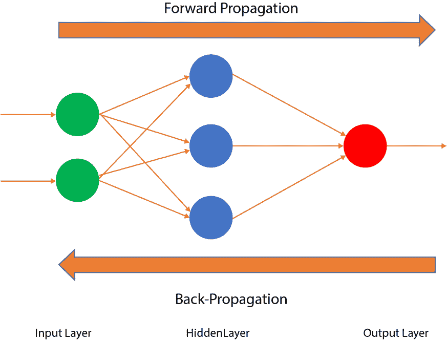

图 9.5：一个前馈神经网络

在一个`前馈神经网络`中，如上图所示，输入层（左侧的绿色圆圈）接收数据并将其传递给隐藏层（带权重的蓝色圆圈）。然后，隐藏层的数据传递给输出层（右侧的红色圆圈）。根据阈值，数据会进行反向传播，但在隐藏层中没有数据的循环流动。

在`RNN`中，网络的隐藏层允许数据和信息的循环。如下图所示，结构类似于前馈神经网络；然而，在这里，数据和信息也在循环流动：

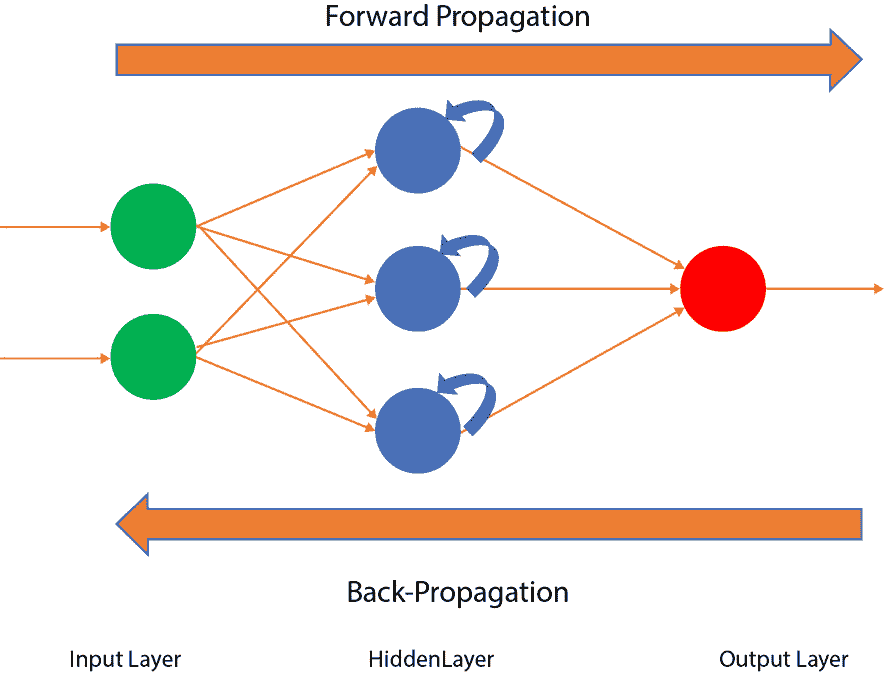

图 9.6：一个 RNN

在这里，`RNN`的定义特性是隐藏层不仅给出输出，而且还将输出的信息反馈到自身。在深入了解 RNN 之前，我们先讨论一下为什么我们需要`RNN`，以及为什么`卷积神经网络`（`CNN`）或普通的`人工神经网络`（`ANN`）在处理序列数据时存在不足。假设我们正在使用`CNN`来识别图像；首先，我们输入一张狗的图片，`CNN`会将该图像标记为“狗”。然后，我们输入一张芒果的图片，`CNN`会将该图像标记为“芒果”。我们假设在时间`t`输入狗的图片，如下所示：

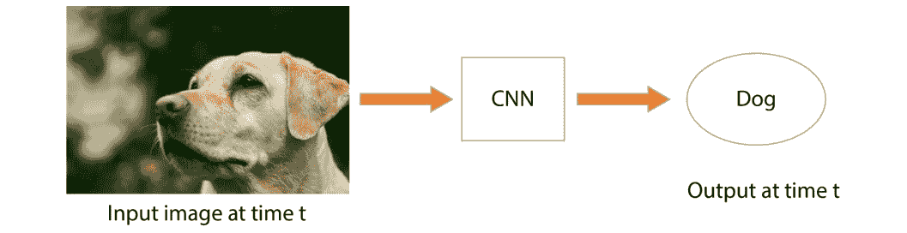

图 9.7：一个使用 CNN 的狗的图像

现在，我们输入时间`t + 1`的芒果图像，如下所示：

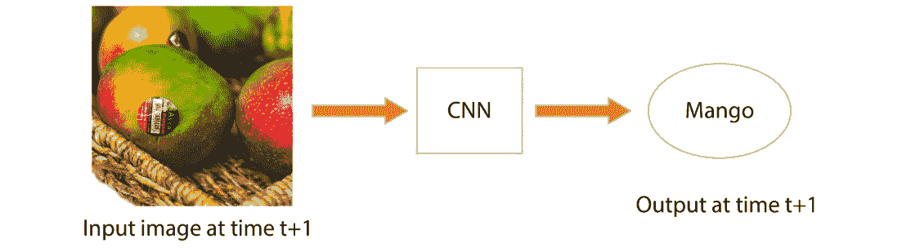

图 9.8：一个使用 CNN 的芒果图像

在这里，你可以清楚地看到，时间`t`的狗图像输出和时间`t + 1`的芒果图像输出是完全独立的。因此，我们不需要我们的算法记住先前的输出实例。然而，正如我们在 Google 助手的例子中提到的，当我们问“联合国何时成立”和“为什么成立”时，算法必须记住先前实例的输出，才能处理序列数据。`CNN`或`ANN`无法做到这一点，因此我们需要使用`RNN`。

在`RNN`中，我们可以在多个时间点上得到多个输出。下面的图示表示一个`RNN`的示意图。它展示了网络从时间`t – 1`到时间`t + n`的状态：

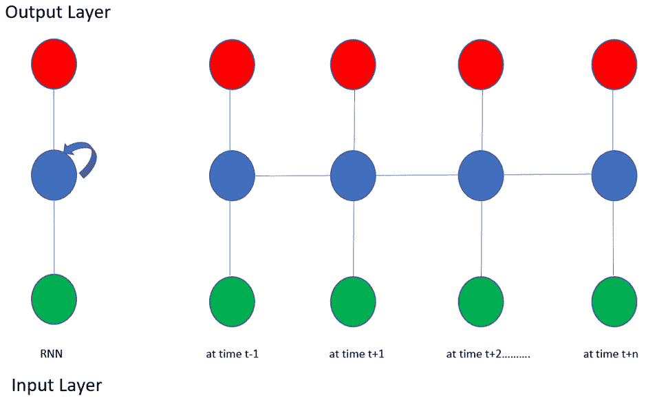

图 9.9：在不同时间戳下展开的 RNN

在训练`RNN`时，你可能会遇到一些与`RNN`独特架构相关的问题。这些问题涉及梯度的值，因为随着`RNN`深度的增加，梯度可能会消失或爆炸，正如我们将在下一节中学习的那样。

## 消失梯度问题

如果有人问你：“你昨晚吃了什么？”你可能很容易记住并正确回答他们。现在，如果有人问你：“过去 30 天你吃了什么？”你可能能记住过去 3 到 4 天的菜单，但之前的菜单就很难记得清楚了。能够回忆过去的信息是消失梯度问题的基础，我们将在本节中研究这个问题。简而言之，消失梯度问题指的是在一段时间内丢失或衰减的信息。

下面的图示表示`RNN`在不同时间点`t`的状态。顶部的点（红色）表示输出层，中间的点（蓝色）表示隐藏层，底部的点（绿色）表示输入层：

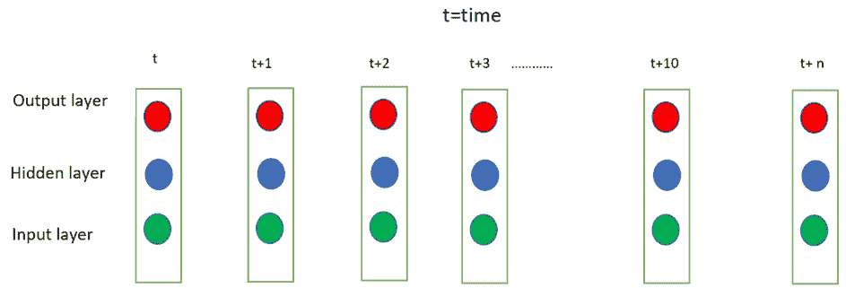

图 9.10：信息随时间衰减

如果你处在`t + 10`时刻，你很难记得 10 天前（即时间`t`）的晚餐菜单。此外，如果你处在`t + 100`时刻，你很可能根本记不起 100 天前的晚餐菜单，假设你做的晚餐没有规律可循。在机器学习的上下文中，消失梯度问题是在使用基于梯度的学习方法和反向传播训练 ANN 时遇到的一个困难。让我们回顾一下神经网络是如何工作的，如下所示：

1.  首先，我们用随机的权重和偏置值初始化网络。

1.  我们得到一个预测输出；这个输出与实际输出进行比较，二者的差异被称为代价。

1.  训练过程利用梯度，它衡量的是代价相对于权重或偏置变化的速率。

1.  然后，我们通过在训练过程中反复调整权重和偏置，尽可能降低代价，直到获得最低的可能值。

例如，如果你把一个球放在陡坡上，球会迅速滚动；然而，如果你把球放在平坦的表面上，它会滚得很慢，甚至不滚动。类似地，在深度神经网络中，当梯度较大时，模型学习得很快。然而，如果梯度较小，模型的学习速度就会变得非常慢。记住，在任何时刻，梯度是到该点为止所有梯度的乘积（即遵循微积分链式法则）。

此外，梯度通常是一个介于 `0` 和 `1` 之间的小数，而两个介于 `0` 和 `1` 之间的数字相乘会得到一个更小的数字。你的网络越深，网络初始层的梯度就越小。在某些情况下，它会变得非常小，以至于网络根本无法进行训练；这就是梯度消失问题。下图展示了遵循微积分链式法则的梯度：

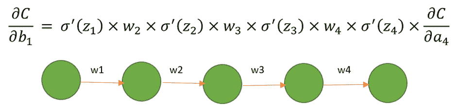

图 9.11：带有成本 C 和微积分链式法则的梯度消失

参见*图 9.10*，假设我们处于 `t + 10` 时刻，我们得到一个输出，这个输出将反向传播到 `t`，即 10 步之遥。现在，当权重被更新时，会有 10 个梯度（它们本身就非常小），当它们相乘时，结果变得非常小，以至于几乎可以忽略不计。这就是梯度消失问题。

## 梯度爆炸问题的简要解释

如果权重不是很小，而是大于 `1`，那么随后的乘法将使梯度指数级增长；这就是梯度爆炸问题。梯度爆炸实际上是梯度消失的对立面，梯度消失时值变得太小，而梯度爆炸时值变得非常大。结果，网络会受到严重影响，无法做出任何预测。虽然梯度爆炸问题比梯度消失问题少见，但了解梯度爆炸是什么还是有必要的。

有一些方法可以帮助我们克服在面临梯度消失或梯度爆炸问题时遇到的挑战。我们将在这里学习的一种方法是`长短时记忆（LSTM）`，它通过记住长期的信息来克服梯度问题。

# 长短时记忆（LSTM）

`LSTM` 是 `RNN` 的一种，主要目标是克服梯度消失和梯度爆炸问题的缺点。它的架构设计使得它能够长时间记住数据和信息。

`LSTM` 旨在克服消失梯度和爆炸梯度问题的限制。`LSTM` 网络是一种特殊的 `RNN`，能够学习长期依赖关系。它们被设计来避免长期依赖问题；能够记住长时间间隔的信息就是它们的设计方式。下图展示了一个标准的递归网络，其中重复模块具有 `tanh 激活` 函数。这是一个简单的 `RNN`。在这种架构中，我们通常需要面对消失梯度问题：

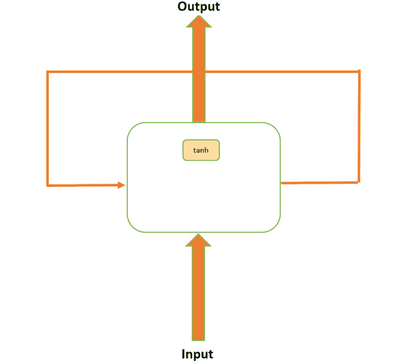

图 9.12：一个简单的 RNN 模型

`LSTM` 架构与简单的 `RNN` 相似，但它们的重复模块包含不同的组件，如下图所示：

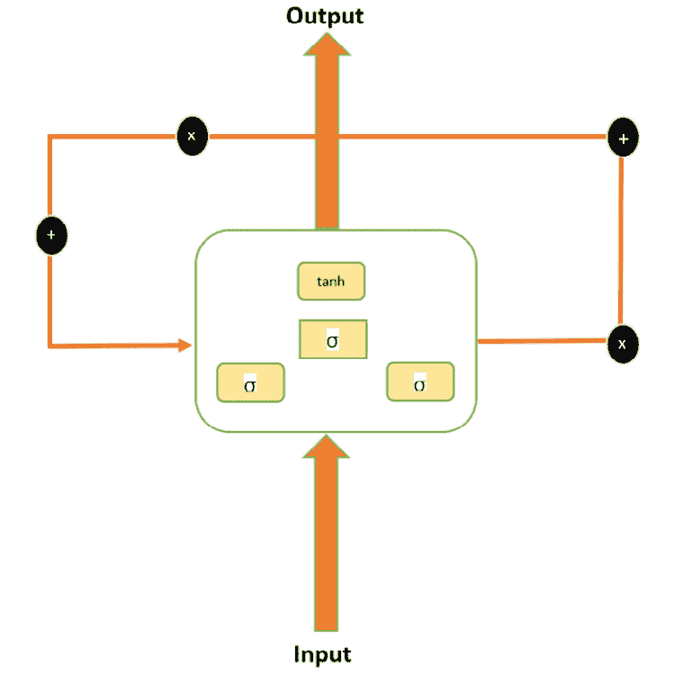

图 9.13：LSTM 模型架构

除了简单的 `RNN`，`LSTM` 还包括以下内容：

+   `Sigmoid 激活` 函数（`σ`）

+   数学计算功能（带有 + 和 x 的黑色圆圈）

+   有门控单元（或称为门）：

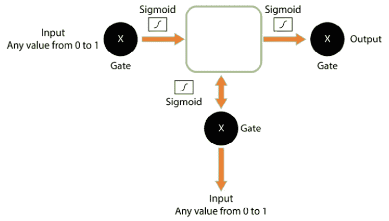

图 9.14：LSTM 详细解析

简单的 `RNN` 和 `LSTM` 之间的主要区别是是否存在门控单元。你可以将门视为计算机内存，在内存中可以进行信息的写入、读取或存储。前面的图展示了 `LSTM` 的详细图像。门中的单元（由黑色圆圈表示）决定了存储什么信息以及何时允许读取或写入值。这些门接受从 `0` 到 `1` 的任何信息；也就是说，如果是 0，那么信息会被阻止；如果是 `1`，则所有信息都会流通。如果输入值介于 `0` 和 `1` 之间，则仅部分信息会流通。

除了这些输入门，网络的梯度还依赖于两个因素：权重和激活函数。门决定了哪些信息需要在 `LSTM` 单元中保持，哪些需要被遗忘或删除。这样，门就像水阀一样；也就是说，网络可以选择哪个阀门允许水流通，哪个阀门不允许水流通。

这些阀门的调整方式使得输出值永远不会导致梯度（消失或爆炸）问题。例如，如果值变得过大，那么会有一个遗忘门将忘记该值，并不再将其考虑用于计算。遗忘门的作用本质上是将信息乘以 `0` 或 `1`。如果信息需要进一步处理，遗忘门将信息乘以 `1`，如果需要忘记，则将信息乘以 `0`。每个门都由一个 sigmoid 函数辅助，该函数将信息压缩到 `0` 和 `1` 之间。为了更好地理解这一点，我们来看一些活动和练习。

注意

本章中的所有活动和练习将在 Jupyter notebook 中进行。您可以在[`packt.live/2vtdA8o`](https://packt.live/2vtdA8o)下载本书的 GitHub 仓库，并获取所有准备好的模板。

## 练习 9.01：使用 50 个单元（神经元）的 LSTM 预测 Alphabet 股票价格的趋势

在本练习中，我们将研究 Alphabet 股票在 5 年期间的价格——即从 2014 年 1 月 1 日到 2018 年 12 月 31 日。在此过程中，我们将尝试使用`RNNs`预测并预测公司 2019 年 1 月的未来趋势。我们拥有 2019 年 1 月的实际值，因此稍后我们将能够将我们的预测与实际值进行比较。按照以下步骤完成本练习：

1.  导入所需的库：

    ```py
    import numpy as np
    import matplotlib.pyplot as plt
    import pandas as pd
    from tensorflow import random
    ```

1.  使用 pandas 的 `read_csv` 函数导入数据集，并使用 `head` 方法查看数据集的前五行：

    ```py
    dataset_training = pd.read_csv('../GOOG_train.csv')
    dataset_training.head()
    ```

    下图展示了前述代码的输出：

    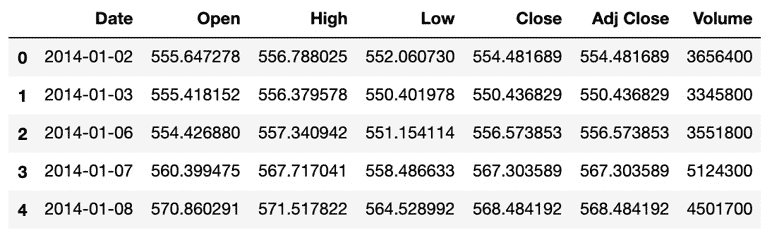

    图 9.15：GOOG_Training 数据集的前五行

1.  我们将使用 `Open` 股票价格进行预测；因此，从数据集中选择 `Open` 股票价格列并打印其值：

    ```py
    training_data = dataset_training[['Open']].values
    training_data
    ```

    前述代码生成了以下输出：

    ```py
    array([[ 555.647278],
           [ 555.418152],
           [ 554.42688 ],
           ...,
           [1017.150024],
           [1049.619995],
           [1050.959961]])
    ```

1.  然后，通过使用 `MinMaxScaler` 进行数据标准化来执行特征缩放，并设置特征范围，使它们的最小值为 `0`，最大值为 `1`。在训练数据上使用缩放器的 `fit_transform` 方法：

    ```py
    from sklearn.preprocessing import MinMaxScaler
    sc = MinMaxScaler(feature_range = (0, 1))
    training_data_scaled = sc.fit_transform(training_data)
    training_data_scaled
    ```

    前述代码生成了以下输出：

    ```py
    array([[0.08017394],
           [0.07987932],
           [0.07860471],
           ...,
           [0.67359064],
           [0.71534169],
           [0.71706467]])
    ```

1.  创建数据以获取当前实例的 60 个时间戳。我们在这里选择了`60`，因为这样可以提供足够数量的前实例，帮助我们理解趋势；从技术上讲，这个值可以是任何数字，但`60`是最优值。此外，这里的上限值是`1258`，即训练集中的行数（或记录数）的索引或计数：

    ```py
    X_train = []
    y_train = []
    for i in range(60, 1258):
        X_train.append(training_data_scaled[i-60:i, 0])
        y_train.append(training_data_scaled[i, 0])
    X_train, y_train = np.array(X_train), \
                       np.array(y_train)
    ```

1.  接下来，使用 NumPy 的 `reshape` 函数调整数据形状，为 `X_train` 的末尾添加一个额外的维度：

    ```py
    X_train = np.reshape(X_train, (X_train.shape[0], \
                                   X_train.shape[1], 1))
    X_train
    ```

    下图展示了前述代码的输出：

    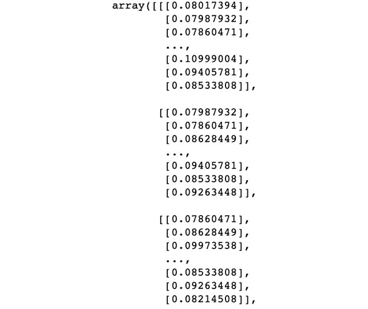

    图 9.16：当前实例中几个时间戳的数据

1.  导入以下 Keras 库以构建 `RNN`：

    ```py
    from keras.models import Sequential
    from keras.layers import Dense, LSTM, Dropout
    ```

1.  设置随机种子并初始化顺序模型，如下所示：

    ```py
    seed = 1
    np.random.seed(seed)
    random.set_seed(seed)
    model = Sequential()
    ```

1.  向网络中添加一个包含 50 个单元的 LSTM 层，设置 `return_sequences` 参数为 `True`，并将 `input_shape` 参数设置为 `(X_train.shape[1], 1)`。再添加三个包含 50 个单元的 LSTM 层，并为前两个设置 `return_sequences` 参数为 `True`，如下所示：

    ```py
    model.add(LSTM(units = 50, return_sequences = True, \
                   input_shape = (X_train.shape[1], 1)))
    # Adding a second LSTM layer
    model.add(LSTM(units = 50, return_sequences = True))
    # Adding a third LSTM layer
    model.add(LSTM(units = 50, return_sequences = True))
    # Adding a fourth LSTM layer
    model.add(LSTM(units = 50))
    # Adding the output layer
    model.add(Dense(units = 1))
    ```

1.  使用 `adam` 优化器编译网络，并使用 `均方误差`（Mean Squared Error）作为损失函数。将模型拟合到训练数据上，训练 `100` 个周期，每批次大小为 `32`：

    ```py
    # Compiling the RNN
    model.compile(optimizer = 'adam', loss = 'mean_squared_error')
    # Fitting the RNN to the Training set
    model.fit(X_train, y_train, epochs = 100, batch_size = 32)
    ```

1.  加载并处理`test`数据（这里将其视为实际数据），并选择表示`Open`股票数据的列：

    ```py
    dataset_testing = pd.read_csv("../GOOG_test.csv")
    actual_stock_price = dataset_testing[['Open']].values
    actual_stock_price
    ```

    以下图展示了前面代码的输出：

    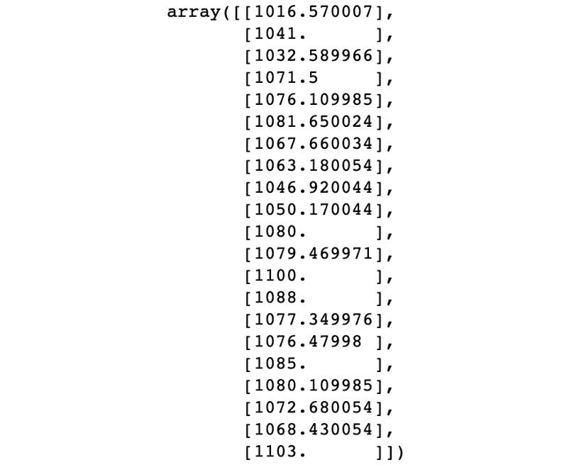

    图 9.17：实际处理过的数据

1.  拼接数据；我们需要`60`个前期实例来获得每一天的股票价格。因此，我们将需要训练和测试数据：

    ```py
    total_data = pd.concat((dataset_training['Open'], \
                            dataset_testing['Open']), axis = 0)
    ```

1.  重新调整和缩放输入，以准备测试数据。请注意，我们预测的是 1 月的月度趋势，它有`21`个交易日，因此为了准备测试集，我们将下限值设为 60，上限值设为 81。这确保了`21`天的差异得以保持：

    ```py
    inputs = total_data[len(total_data) \
             - len(dataset_testing) - 60:].values
    inputs = inputs.reshape(-1,1)
    inputs = sc.transform(inputs)
    X_test = []
    for i in range(60, 81):
        X_test.append(inputs[i-60:i, 0])
    X_test = np.array(X_test)
    X_test = np.reshape(X_test, (X_test.shape[0], \
                        X_test.shape[1], 1))
    predicted_stock_price = model.predict(X_test)
    predicted_stock_price = sc.inverse_transform(\
                            predicted_stock_price)
    ```

1.  通过绘制实际股票价格和预测股票价格来可视化结果：

    ```py
    # Visualizing the results
    plt.plot(actual_stock_price, color = 'green', \
             label = 'Real Alphabet Stock Price',\
             ls='--')
    plt.plot(predicted_stock_price, color = 'red', \
             label = 'Predicted Alphabet Stock Price',\
             ls='-')
    plt.title('Predicted Stock Price')
    plt.xlabel('Time in days')
    plt.ylabel('Real Stock Price')
    plt.legend()
    plt.show()
    ```

    请注意，您的结果可能与实际的 Alphabet 股票价格略有不同。

    **期望的输出**：

    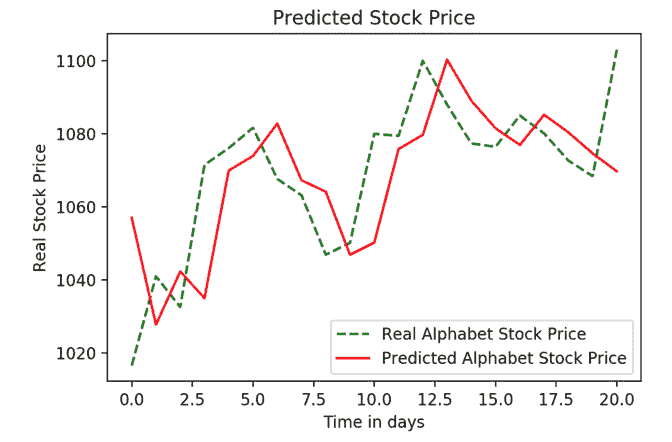

图 9.18：实际股票价格与预测股票价格的对比

这就是*练习 9.01*，*使用具有 50 个单元（神经元）的 LSTM 预测 Alphabet 股票价格的趋势*的总结，在此我们通过`LSTM`预测了 Alphabet 的股票趋势。如前述图所示，趋势已被较好地捕捉。

注意

若要访问该特定部分的源代码，请参考[`packt.live/2ZwdAzW`](https://packt.live/2ZwdAzW)。

您还可以在[`packt.live/2YV3PvX`](https://packt.live/2YV3PvX)在线运行此示例。

在下一个活动中，我们将测试我们的知识并练习通过预测亚马逊过去 5 年股票价格的趋势来构建`RNNs`和`LSTM`层。

## 活动 9.01：使用具有 50 个单元（神经元）的 LSTM 预测亚马逊股票价格的趋势

在本活动中，我们将考察亚马逊过去 5 年的股票价格——即从 2014 年 1 月 1 日到 2018 年 12 月 31 日。通过这种方式，我们将尝试使用 RNN 和 LSTM 预测并预测该公司 2019 年 1 月的未来趋势。我们已经有了 2019 年 1 月的实际值，因此稍后可以将我们的预测与实际值进行比较。按照以下步骤完成此活动：

1.  导入所需的库。

1.  从完整的数据集中提取`Open`列，因为预测将基于开盘股票值。可以从本书的 GitHub 库下载数据集。数据集可以在[`packt.live/2vtdA8o`](https://packt.live/2vtdA8o)找到。

1.  将数据规范化到 0 和 1 之间。

1.  然后，创建时间戳。2019 年 1 月每一天的股票价格将由前 60 天的值来预测；因此，如果 1 月 1 日的预测是使用第*n*天到 12 月 31 日的值，那么 1 月 2 日将使用第*n* + 1 天和 1 月 1 日的值来预测，以此类推。

1.  将数据重新调整为三维，因为网络需要三维数据。

1.  在`Keras`中构建一个包含`50`个单元的`RNN`模型（这里，单元指的是神经元），并使用四个`LSTM`层。第一步应该提供输入形状。请注意，最后一个`LSTM`层总是会添加`return_sequences=True`，因此不必显式定义。

1.  处理并准备测试数据，即 2019 年 1 月的实际数据。

1.  合并并处理训练数据和测试数据。

1.  可视化结果。

在实现这些步骤后，您应该看到以下预期输出：

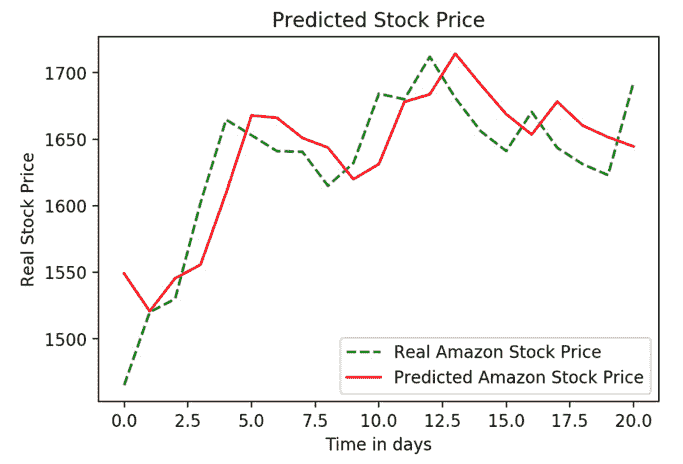

图 9.19：实际股票价格与预测股票价格的对比

注意

该活动的解决方案可以在第 452 页找到。

现在，让我们尝试通过调整`LSTM`来提升性能。关于如何构建`LSTM`没有绝对标准；然而，以下的排列组合可以尝试，以改进性能：

+   构建一个具有适中单元数的`LSTM`，例如`50`

+   构建一个包含超过`100`个单元的`LSTM`模型

+   使用更多数据；也就是说，除了`5`年的数据外，获取`10`年的数据

+   使用`100`个单元应用正则化

+   使用`50`个单元应用正则化

+   使用更多数据和`50`个单元应用正则化

这个列表可以有多种组合；任何能够提供最佳结果的组合都可以视为该数据集的好算法。在下一个练习中，我们将通过增加`LSTM`层的单元数来探索其中的一个选项，并观察性能表现。

## 练习 9.02：使用 100 个单元的 LSTM 预测字母表公司股票价格的趋势

在本练习中，我们将研究字母表公司在过去 5 年的股票价格，从 2014 年 1 月 1 日到 2018 年 12 月 31 日。在此过程中，我们将尝试使用 RNN 预测和预测该公司在 2019 年 1 月的未来趋势。我们有 2019 年 1 月的实际数据，因此稍后我们将把预测值与实际值进行比较。这与第一个练习相同，但这次我们使用了 100 个单元。确保与*练习 9.01*、*使用 50 个单元（神经元）的 LSTM 预测字母表公司股票价格的趋势*进行比较。按照以下步骤完成此练习：

1.  导入所需的库：

    ```py
    import numpy as np
    import matplotlib.pyplot as plt
    import pandas as pd
    from tensorflow import random
    ```

1.  使用 pandas 的`read_csv`函数导入数据集，并使用`head`方法查看数据集的前五行：

    ```py
    dataset_training = pd.read_csv('../GOOG_train.csv')
    dataset_training.head()
    ```

1.  我们将使用`Open`股票价格进行预测；因此，从数据集中选择`Open`股票价格列并打印值：

    ```py
    training_data = dataset_training[['Open']].values
    training_data
    ```

1.  然后，通过使用`MinMaxScaler`对数据进行标准化，执行特征缩放，并设置特征的范围，使其最小值为零，最大值为一。对训练数据使用标准化器的`fit_transform`方法：

    ```py
    from sklearn.preprocessing import MinMaxScaler
    sc = MinMaxScaler(feature_range = (0, 1))
    training_data_scaled = sc.fit_transform(training_data)
    training_data_scaled
    ```

1.  创建数据以从当前实例中获取`60`个时间戳。我们在这里选择`60`，因为它将提供足够多的前期实例以便理解趋势；从技术角度讲，这可以是任何数字，但`60`是最佳值。此外，这里的上限值为`1258`，它表示`training`集中的行数或记录数：

    ```py
    X_train = []
    y_train = []
    for i in range(60, 1258):
        X_train.append(training_data_scaled[i-60:i, 0])
        y_train.append(training_data_scaled[i, 0])
    X_train, y_train = np.array(X_train), np.array(y_train)
    ```

1.  使用 NumPy 的`reshape`函数调整数据的形状，在`X_train`的末尾添加一个额外的维度：

    ```py
    X_train = np.reshape(X_train, (X_train.shape[0], \
                                   X_train.shape[1], 1))
    ```

1.  导入以下`Keras`库以构建`RNN`：

    ```py
    from keras.models import Sequential
    from keras.layers import Dense, LSTM, Dropout
    ```

1.  设置种子并初始化序列模型，如下所示：

    ```py
    seed = 1
    np.random.seed(seed)
    random.set_seed(seed)
    model = Sequential()
    ```

1.  向网络中添加一个具有`50`个单元的`LSTM`层，将`return_sequences`参数设置为`True`，并将`input_shape`参数设置为`(X_train.shape[1], 1)`。再添加三个具有`50`个单元的`LSTM`层，并将前两个`LSTM`层的`return_sequences`参数设置为`True`。最后添加一个大小为`1`的输出层：

    ```py
    model.add(LSTM(units = 100, return_sequences = True, \
                   input_shape = (X_train.shape[1], 1)))
    # Adding a second LSTM
    model.add(LSTM(units = 100, return_sequences = True))
    # Adding a third LSTM layer
    model.add(LSTM(units = 100, return_sequences = True))
    # Adding a fourth LSTM layer
    model.add(LSTM(units = 100))
    # Adding the output layer
    model.add(Dense(units = 1))
    ```

1.  使用`adam`优化器编译网络，并使用`均方误差`作为损失函数。用`32`的批量大小在`100`个 epochs 上拟合训练数据：

    ```py
    # Compiling the RNN
    model.compile(optimizer = 'adam', loss = 'mean_squared_error')
    # Fitting the RNN to the Training set
    model.fit(X_train, y_train, epochs = 100, batch_size = 32)
    ```

1.  加载并处理测试数据（在此视为实际数据），并选择代表`Open`股价数据的列：

    ```py
    dataset_testing = pd.read_csv("../GOOG_test.csv")
    actual_stock_price = dataset_testing[['Open']].values
    actual_stock_price
    ```

1.  将数据连接起来，因为我们需要`60`个前期实例来预测每一天的股价。因此，我们将需要训练数据和测试数据：

    ```py
    total_data = pd.concat((dataset_training['Open'], \
                            dataset_testing['Open']), axis = 0)
    ```

1.  调整和缩放输入以准备测试数据。请注意，我们正在预测 1 月的月度趋势，1 月有`21`个交易日，因此为了准备测试集，我们将下限值设为`60`，上限值设为`81`。这样可以确保`21`的差值保持不变：

    ```py
    inputs = total_data[len(total_data) \
                        - len(dataset_testing) - 60:].values
    inputs = inputs.reshape(-1,1)
    inputs = sc.transform(inputs)
    X_test = []
    for i in range(60, 81):
        X_test.append(inputs[i-60:i, 0])
    X_test = np.array(X_test)
    X_test = np.reshape(X_test, (X_test.shape[0], \
                        X_test.shape[1], 1))
    predicted_stock_price = model.predict(X_test)
    predicted_stock_price = sc.inverse_transform(\
                            predicted_stock_price)
    ```

1.  通过绘制实际股价和预测股价来可视化结果：

    ```py
    # Visualizing the results
    plt.plot(actual_stock_price, color = 'green', \
             label = 'Real Alphabet Stock Price',ls='--')
    plt.plot(predicted_stock_price, color = 'red', \
             label = 'Predicted Alphabet Stock Price',ls='-')
    plt.title('Predicted Stock Price')
    plt.xlabel('Time in days')
    plt.ylabel('Real Stock Price')
    plt.legend()
    plt.show()
    ```

    **预期输出**：

    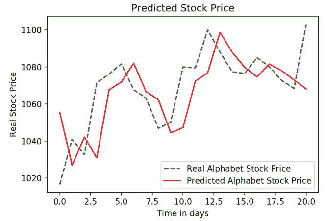

图 9.20：实际与预测的股价

注意

要访问此特定部分的源代码，请参见 [`packt.live/2ZDggf4`](https://packt.live/2ZDggf4)。

你也可以在网上运行这个例子，访问 [`packt.live/2O4ZoJ7`](https://packt.live/2O4ZoJ7)。

现在，如果我们将*练习 9.01*中的`LSTM`，即*使用 50 个单元（神经元）的 LSTM 预测字母股价的趋势*，它有`50`个神经元（单元），与这个使用`100`个单元的`LSTM`进行比较，我们可以看到，与亚马逊股价的情况不同，使用`100`个单元的`LSTM`能够更好地捕捉到字母股价的趋势：

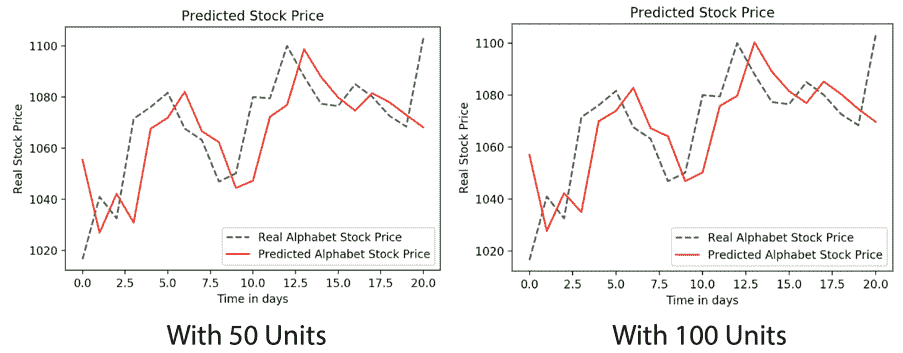

图 9.21：与练习 9.01 的 LSTM 输出比较

因此，我们可以清楚地看到，`100`个单元的`LSTM`预测的趋势比`50`个单元的`LSTM`更准确。请记住，`100`个单元的`LSTM`虽然需要更多的计算时间，但在这种情况下提供了更好的结果。除了通过增加单元数来修改我们的模型，我们还可以添加正则化。接下来的活动将测试添加正则化是否能使我们的亚马逊模型更加准确。

## 活动 9.02：使用添加正则化的 LSTM 预测亚马逊股票价格

在这个活动中，我们将研究亚马逊股票在过去 5 年的价格，从 2014 年 1 月 1 日到 2018 年 12 月 31 日。在此过程中，我们将尝试使用 RNN 和 LSTM 预测并预报公司 2019 年 1 月的未来趋势。我们已经有 2019 年 1 月的实际值，因此稍后可以将我们的预测与实际值进行比较。最初，我们使用 50 个单元（或神经元）的 LSTM 预测了亚马逊股票的趋势。在这里，我们还将添加 dropout 正则化，并将结果与*活动 9.01*，*使用 50 个单元（神经元）的 LSTM 预测亚马逊股票价格的趋势*进行比较。请按照以下步骤完成此活动：

1.  导入所需的库。

1.  从完整的数据集中提取`Open`列，因为预测将基于开盘股票值进行。你可以从本书的 GitHub 仓库下载数据集，链接为[`packt.live/2vtdA8o`](https://packt.live/2vtdA8o)。

1.  将数据规范化到 0 和 1 之间。

1.  然后，创建时间戳。2019 年 1 月的每一天的值将通过前`60`天的数据进行预测。所以，如果 1 月 1 日的预测是通过第*n*天到 12 月 31 日的数据进行的，那么 1 月 2 日将通过第*n+1*天和 1 月 1 日的数据进行预测，依此类推。

1.  将数据重新塑形为三维，因为网络需要三维数据。

1.  使用 Keras 构建一个包含四个 LSTM 层的 RNN，每个 LSTM 层有`50`个单元（此处，单元指神经元），每个 LSTM 层后有 20%的 dropout。第一步应提供输入形状。请注意，最后一个 LSTM 层总是设置`return_sequences=True`。

1.  处理并准备测试数据，即 2019 年 1 月的实际数据。

1.  合并并处理训练数据和测试数据。

1.  最后，可视化结果。

在实现这些步骤后，你应该得到以下预期的输出：

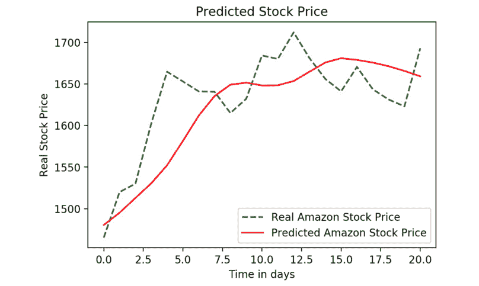

图 9.22：实际股票价格与预测股票价格

注意

本活动的解决方案可以在第 457 页找到。

在下一个活动中，我们将尝试构建每个`LSTM`层有`100`个单元的`RNN`，并将其与只有`50`个单元的`RNN`表现进行比较。

## 活动 9.03：使用逐渐增加 LSTM 神经元数量（100 个单元）预测亚马逊股票价格的趋势

在这个活动中，我们将研究亚马逊过去 5 年的股票价格，从 2014 年 1 月 1 日到 2018 年 12 月 31 日。在此过程中，我们将尝试使用 RNN 预测和预测该公司 2019 年 1 月的未来趋势。我们拥有 2019 年 1 月的实际值，因此稍后可以将我们的预测与实际值进行比较。你还可以将输出的差异与*活动 9.01*，“使用 50 个单元（神经元）的 LSTM 预测亚马逊股价趋势”进行比较。按照以下步骤完成此活动：

1.  导入所需的库。

1.  从完整的数据集中提取`Open`列，因为预测将基于`Open`股价进行。

1.  将数据归一化到 0 到 1 之间。

1.  然后，创建时间戳。2019 年 1 月每一天的值将由前`60`天的数据预测；因此，如果 1 月 1 日是根据第 n 天到 12 月 31 日的数据预测的，那么 1 月 2 日将根据第*n + 1*天和 1 月 1 日的数据来预测，依此类推。

1.  将数据重塑为三维，因为网络需要三维数据。

1.  在 Keras 中构建一个包含 100 个单元的 LSTM（此处的单元指的是神经元）。第一步应该提供输入形状。请注意，最终的`LSTM`层始终需要设置`return_sequences=True`。编译并将模型拟合到训练数据中。

1.  处理并准备测试数据，即 2019 年 1 月的实际数据。

1.  合并和处理训练数据与测试数据。

1.  可视化结果。

完成这些步骤后，你应该得到以下预期输出：

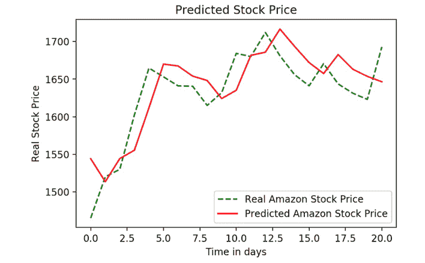

图 9.23：实际股价与预测股价

注意

本活动的解决方案可以在第 462 页找到。

在这个活动中，我们创建了一个包含四个`LSTM`层的`RNN`，每层有`100`个单元。我们将其与*活动 9.02*，“使用添加正则化的 LSTM 预测亚马逊股价”中的结果进行了比较，在该活动中每层有`50`个单元。两个模型之间的差异很小，因此，具有较少单元的模型更为优选，因为它减少了计算时间，并且更不容易出现过拟合训练数据的情况。

# 概述

在本章中，我们通过研究一些 Google Assistant 的实际案例，学习了序列建模和序列记忆。然后，我们学习了序列建模如何与`RNN`相关，并且`RNN`与传统前馈网络的不同之处。我们详细了解了梯度消失问题，以及为什么使用`LSTM`比简单的`RNN`更好地克服梯度消失问题。我们将所学应用于时间序列问题，通过预测股价趋势来实践。

在这个工作坊中，我们学习了机器学习和 Python 的基础知识，同时深入了解了如何应用 Keras 开发高效的深度学习解决方案。我们探索了机器学习和深度学习之间的差异。我们通过首先使用 scikit-learn，然后使用 Keras 来构建逻辑回归模型，开始了本次工作坊。

然后，我们通过创建各种实际场景的预测模型进一步探索了 Keras 及其不同的模型，例如将在线购物者分类为有购买意图和没有购买意图的群体。我们学习了如何评估、优化和改进模型，以实现最大的信息量，创建在新数据上表现良好的强大模型。

我们还通过构建带有 scikit-learn 包装器的 Keras 模型来实现交叉验证，帮助那些熟悉 scikit-learn 工作流程的人轻松使用 Keras 模型。然后，我们学习了如何应用 `L1`、`L2` 和 `dropout regularization` 技术，以提高模型的准确性并防止模型过拟合训练数据。

接下来，我们通过应用诸如空准确率作为基准比较技术，以及评估指标如精确度、`AUC-ROC` 得分等，进一步探索了模型评估，以理解我们的模型如何对分类任务进行评分。最终，这些高级评估技术帮助我们了解了模型在什么情况下表现良好，哪里有改进的空间。

我们通过使用 Keras 创建一些高级模型来结束了工作坊。我们通过构建带有各种参数的 `CNN` 模型来探索计算机视觉，以分类图像。然后，我们使用预训练模型对新图像进行分类，并对这些预训练模型进行了微调，以便我们可以将它们应用于自己的应用程序。最后，我们介绍了序列建模，这用于建模诸如股票价格和自然语言处理等序列。我们通过创建带有 `LSTM` 层的 `RNN` 网络，测试了使用真实股票数据预测股价的知识，并实验了每层中不同单元数的影响以及 dropout 正则化对模型性能的影响。

总体来说，我们全面了解了如何使用 Keras 解决各种实际问题。我们涵盖了在线购物者的分类任务、丙型肝炎数据和 Scania 卡车的故障数据，还包括回归任务，如在给定各种化学属性时预测各种化学物质的水生毒性。我们还进行了图像分类任务，构建了 `CNN` 模型来预测图像是花朵还是汽车，并构建了回归任务来预测未来的股价，使用的是 `RNNs`。通过在这个工作坊中使用真实世界的数据集构建模型，你已准备好将所学知识应用到自己的问题解决中，并创建自己的应用程序。
