# 附录

# 1\. 使用 Keras 进行机器学习简介

## 活动 1.01：向模型添加正则化

在这个活动中，我们将使用来自 scikit-learn 包的相同逻辑回归模型。然而，这一次，我们将向模型中添加正则化，并搜索最佳正则化参数——这个过程通常称为 `超参数调优`。在训练模型后，我们将测试预测结果，并将模型评估指标与基准模型和未加正则化的模型的评估指标进行比较。

1.  从 *练习 1.03*，*数据的适当表示* 加载特征数据，从 *练习 1.02*，*数据清理* 加载目标数据：

    ```py
    import pandas as pd
    feats = pd.read_csv('../data/OSI_feats_e3.csv')
    target = pd.read_csv('../data/OSI_target_e2.csv')
    ```

1.  创建 `test` 和 `train` 数据集。使用训练数据集训练数据。然而，这一次，请使用部分 `training` 数据集进行验证，以选择最合适的超参数。

    再次使用 `test_size = 0.2`，这意味着将 `20%` 的数据保留用于测试。我们的验证集的大小将由验证折数决定。如果我们进行 `10 折交叉验证`，则相当于将 `10%` 的 `training` 数据集保留用于验证模型。每一折将使用不同的 `10%` 训练数据集，而所有折的平均误差将用于比较具有不同超参数的模型。为 `random_state` 变量分配一个随机值：

    ```py
    from sklearn.model_selection import train_test_split
    test_size = 0.2
    random_state = 13
    X_train, X_test, y_train, y_test = \
    train_test_split(feats, target, test_size=test_size, \
                     random_state=random_state)
    ```

1.  检查数据框的维度：

    ```py
    print(f'Shape of X_train: {X_train.shape}')
    print(f'Shape of y_train: {y_train.shape}')
    print(f'Shape of X_test: {X_test.shape}')
    print(f'Shape of y_test: {y_test.shape}')
    ```

    上述代码产生以下输出：

    ```py
    Shape of X_train: (9864, 68)
    Shape of y_train: (9864, 1)
    Shape of X_test: (2466, 68)
    Shape of y_test: (2466, 1)
    ```

1.  接下来，实例化模型。尝试两种正则化参数，`l1` 和 `l2`，并使用 10 倍交叉验证。将我们的正则化参数从 1x10-2 到 1x106 在对数空间中均匀遍历，以观察这些参数如何影响结果：

    ```py
    import numpy as np
    from sklearn.linear_model import LogisticRegressionCV
    Cs = np.logspace(-2, 6, 9)
    model_l1 = LogisticRegressionCV(Cs=Cs, penalty='l1', \
                                    cv=10, solver='liblinear', \
                                    random_state=42, max_iter=10000)
    model_l2 = LogisticRegressionCV(Cs=Cs, penalty='l2', cv=10, \
                                    random_state=42, max_iter=10000)
    ```

    注意

    对于具有 `l1` 正则化参数的逻辑回归模型，只能使用 `liblinear` 求解器。

1.  接下来，将模型拟合到训练数据：

    ```py
    model_l1.fit(X_train, y_train['Revenue'])
    model_l2.fit(X_train, y_train['Revenue'])
    ```

    下图显示了上述代码的输出：

    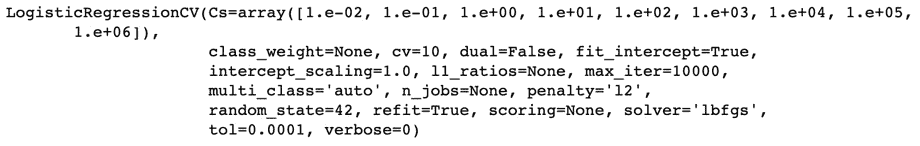

    ](img/B15777_01_37.jpg)

    图 1.37：fit 命令的输出，显示所有模型训练参数

1.  在这里，我们可以看到两种不同模型的正则化参数值。正则化参数是根据哪个模型产生了最低误差来选择的：

    ```py
    print(f'Best hyperparameter for l1 regularization model: \
    {model_l1.C_[0]}')
    print(f'Best hyperparameter for l2 regularization model: \
    {model_l2.C_[0]}')
    ```

    上述代码产生以下输出：

    ```py
    Best hyperparameter for l1 regularization model: 1000000.0
    Best hyperparameter for l2 regularization model: 1.0
    ```

    注意

    `C_` 属性只有在模型训练完成后才能使用，因为它是在交叉验证过程确定最佳参数后设置的。

1.  为了评估模型的性能，请对 `test` 集合进行预测，并将其与 `true` 值进行比较：

    ```py
    y_pred_l1 = model_l1.predict(X_test)
    y_pred_l2 = model_l2.predict(X_test)
    ```

1.  为了比较这些模型，计算评估指标。首先，查看模型的准确度：

    ```py
    from sklearn import metrics
    accuracy_l1 = metrics.accuracy_score(y_pred=y_pred_l1, \
                                         y_true=y_test)
    accuracy_l2 = metrics.accuracy_score(y_pred=y_pred_l2, \
                                         y_true=y_test)
    print(f'Accuracy of the model with l1 regularization is \
    {accuracy_l1*100:.4f}%')
    print(f'Accuracy of the model with l2 regularization is \
    {accuracy_l2*100:.4f}%')
    ```

    上述代码产生以下输出：

    ```py
    Accuracy of the model with l1 regularization is 89.2133%
    Accuracy of the model with l2 regularization is 89.2944%
    ```

1.  另外，还请查看其他评估指标：

    ```py
    precision_l1, recall_l1, fscore_l1, _ = \
    metrics.precision_recall_fscore_support(y_pred=y_pred_l1, \
                                            y_true=y_test, \
                                            average='binary')
    precision_l2, recall_l2, fscore_l2, _ = \
    metrics.precision_recall_fscore_support(y_pred=y_pred_l2, \
                                            y_true=y_test, \
                                            average='binary')
    print(f'l1\nPrecision: {precision_l1:.4f}\nRecall: \
    {recall_l1:.4f}\nfscore: {fscore_l1:.4f}\n\n')
    print(f'l2\nPrecision: {precision_l2:.4f}\nRecall: \
    {recall_l2:.4f}\nfscore: {fscore_l2:.4f}')
    ```

    前面的代码会产生以下输出：

    ```py
    l1
    Precision: 0.7300
    Recall: 0.4078
    fscore: 0.5233
    l2
    Precision: 0.7350
    Recall: 0.4106
    fscore: 0.5269
    ```

1.  观察模型训练完成后系数的值：

    ```py
    coef_list = [f'{feature}: {coef}' for coef, \
                 feature in sorted(zip(model_l1.coef_[0], \
                                   X_train.columns.values.tolist()))]
    for item in coef_list:
        print(item)
    ```

    注意

    `coef_`属性仅在模型训练完成后可用，因为它是在交叉验证过程中确定最佳参数后设置的。

    以下图显示了前面代码的输出：

    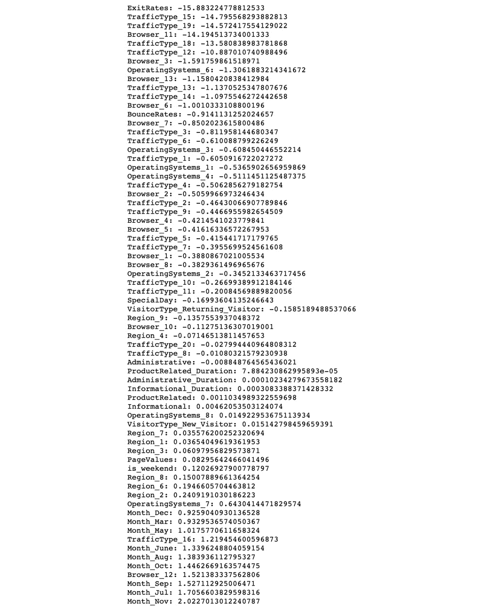

    图 1.38：具有 l1 正则化的模型的特征列名称及其相应系数的值

1.  对具有`l2`正则化参数类型的模型执行相同操作：

    ```py
    coef_list = [f'{feature}: {coef}' for coef, \
                 feature in sorted(zip(model_l2.coef_[0], \
                                       X_train.columns.values.tolist()))]
    for item in coef_list:
        print(item)
    ```

    以下图显示了前面代码的输出：

    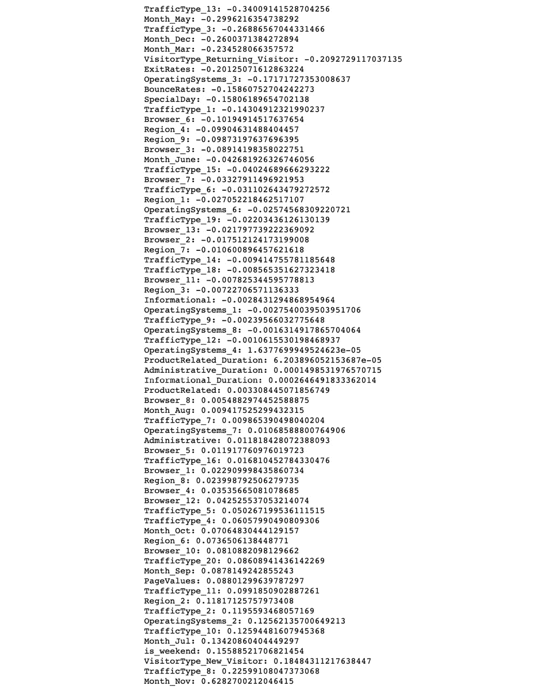

图 1.39：具有 l2 正则化的模型的特征列名称及其相应系数的值

注意

要访问该特定部分的源代码，请参考[`packt.live/2VIoe5M`](https://packt.live/2VIoe5M)。

本节目前没有在线交互式示例，需要在本地运行。

# 2\. 机器学习与深度学习

## 活动 2.01：使用 Keras 创建逻辑回归模型

在这个活动中，我们将使用 Keras 库创建一个基本模型。我们将构建的模型将把网站用户分为两类：一类是会从网站购买产品的用户，另一类则不会。为了实现这一目标，我们将使用之前相同的在线购物购买意图数据集，并尝试预测我们在*第一章*中预测的相同变量，即*使用 Keras 进行机器学习入门*。

执行以下步骤完成此活动：

1.  打开开始菜单中的 Jupyter 笔记本以实现此活动。加载在线购物购买意图数据集，你可以从 GitHub 仓库下载。我们将使用`pandas`库进行数据加载，因此请先导入`pandas`库。确保你已经将 csv 文件保存到本章适当的数据文件夹中，或者可以更改代码中使用的文件路径。

    ```py
    import pandas as pd
    feats = pd.read_csv('../data/OSI_feats.csv')
    target = pd.read_csv('../data/OSI_target.csv')
    ```

1.  对于本次活动，我们不进行进一步的预处理。和上一章一样，我们将数据集拆分为训练集和测试集，并将测试推迟到最后，在评估模型时进行。我们将保留`20%`的数据用于测试，通过设置`test_size=0.2`参数，并创建一个`random_state`参数，以便重现结果：

    ```py
    from sklearn.model_selection import train_test_split
    test_size = 0.2
    random_state = 42
    X_train, X_test, y_train, y_test = \
    train_test_split(feats, target, test_size=test_size, \
                     random_state=random_state)
    ```

1.  在`numpy`和`tensorflow`中设置随机种子以保证可复现性。通过初始化`Sequential`类的模型开始创建模型：

    ```py
    from keras.models import Sequential
    import numpy as np
    from tensorflow import random
    np.random.seed(random_state)
    random.set_seed(random_state)
    model = Sequential()
    ```

1.  要向模型中添加一个全连接层，请添加一个`Dense`类的层。在这里，我们需要包括该层中的节点数。在我们的例子中，由于我们正在执行二分类，且期望输出为`zero`或`one`，所以该值将为 1。此外，还需要指定输入维度，这只需要在模型的第一层中指定。它的作用是表示输入数据的格式。传入特征的数量：

    ```py
    from keras.layers import Dense
    model.add(Dense(1, input_dim=X_train.shape[1]))
    ```

1.  在前一层的输出上添加一个 sigmoid 激活函数，以复制`logistic regression`算法：

    ```py
    from keras.layers import Activation
    model.add(Activation('sigmoid'))
    ```

1.  一旦我们将所有模型组件按正确顺序排列，我们必须编译模型，以便所有的学习过程都能被配置。使用`adam`优化器，`binary_crossentropy`作为损失函数，并通过将参数传入`metrics`参数来跟踪模型的准确率：

    ```py
    model.compile(optimizer='adam', loss='binary_crossentropy', \
                  metrics=['accuracy'])
    ```

1.  打印模型摘要，以验证模型是否符合我们的预期：

    ```py
    print(model.summary())
    ```

    下图展示了前面代码的输出：

    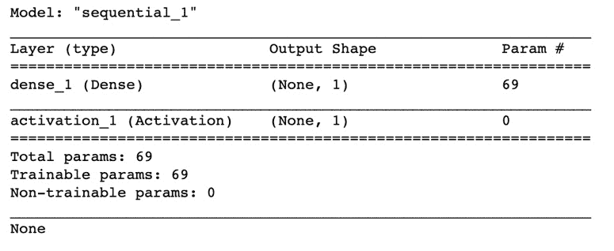

    图 2.19：模型摘要

1.  接下来，使用`model`类的`fit`方法拟合模型。提供训练数据，以及训练周期数和每个周期后用于验证的数据量：

    ```py
    history = model.fit(X_train, y_train['Revenue'], epochs=10, \
                        validation_split=0.2, shuffle=False)
    ```

    下图展示了前面代码的输出：

    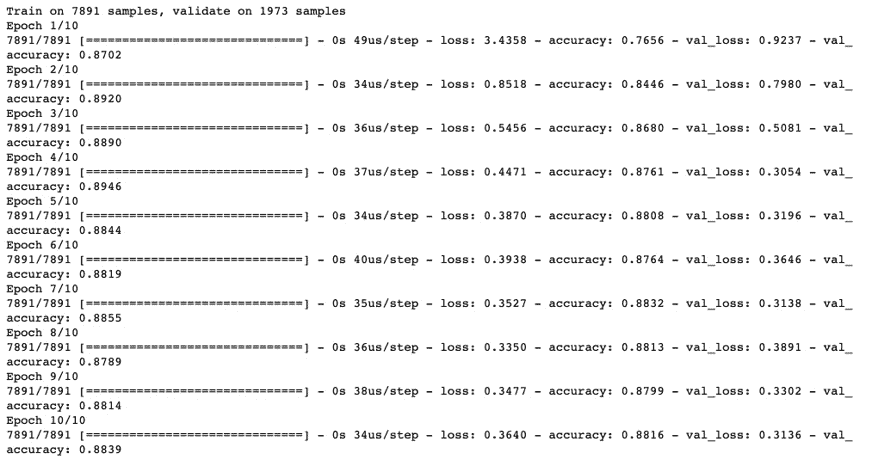

    图 2.20：在模型上使用 fit 方法

1.  损失和准确率的值已存储在`history`变量中。使用每个训练周期后我们跟踪的损失和准确率，绘制每个值的图表：

    ```py
    import matplotlib.pyplot as plt
    %matplotlib inline
    # Plot training and validation accuracy values
    plt.plot(history.history['accuracy'])
    plt.plot(history.history['val_accuracy'])
    plt.title('Model accuracy')
    plt.ylabel('Accuracy')
    plt.xlabel('Epoch')
    plt.legend(['Train', 'Validation'], loc='upper left')
    plt.show()
    # Plot training and validation loss values
    plt.plot(history.history['loss'])
    plt.plot(history.history['val_loss'])
    plt.title('Model loss')
    plt.ylabel('Loss')
    plt.xlabel('Epoch')
    plt.legend(['Train', 'Validation'], loc='upper left')
    plt.show()
    ```

    以下图表展示了前面代码的输出：

    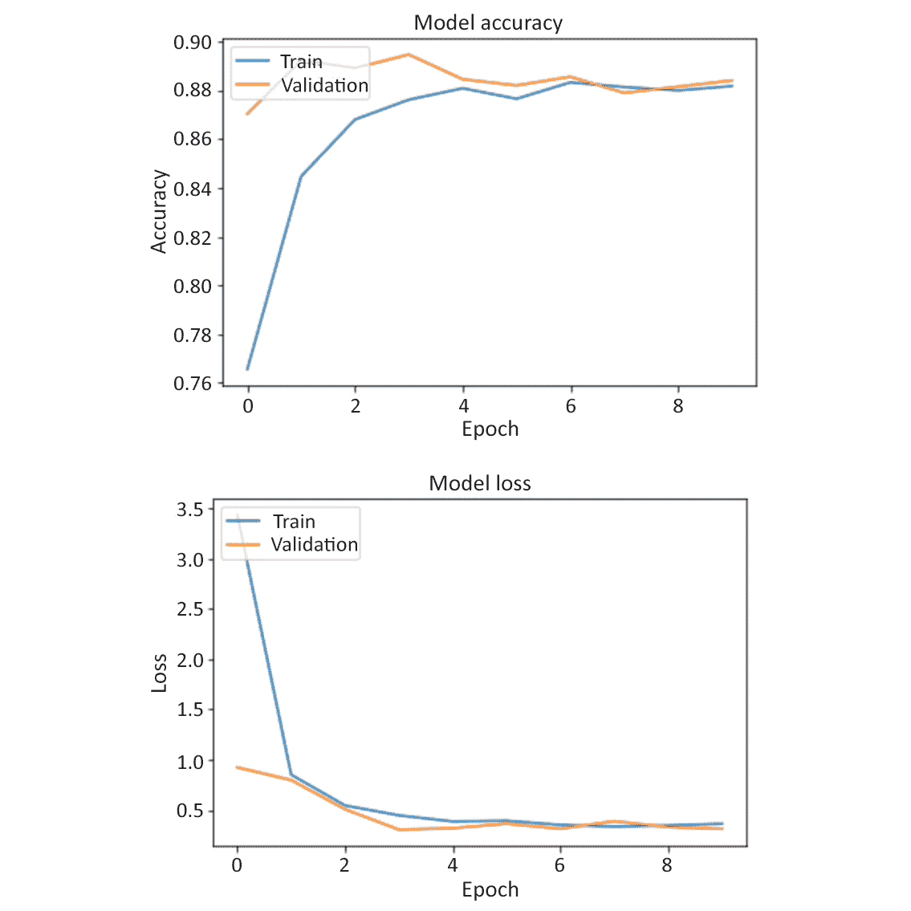

    图 2.21：拟合模型时的损失和准确率

1.  最后，在我们从一开始就保留的测试数据上评估模型，这将为模型的性能提供客观评价：

    ```py
    test_loss, test_acc = model.evaluate(X_test, y_test['Revenue'])
    print(f'The loss on the test set is {test_loss:.4f} \
    and the accuracy is {test_acc*100:.3f}%')
    ```

    前面代码的输出如下所示。在这里，模型预测了测试数据集中用户的购买意图，并通过将其与`y_test`中的真实值进行比较来评估性能。在测试数据集上评估模型将产生损失和准确率值，我们可以打印出来：

    ```py
    2466/2466 [==============================] - 0s 15us/step
    The loss on the test set is 0.3632 and the accuracy is 86.902%
    ```

    注

    要访问此特定部分的源代码，请参考

    [`packt.live/3dVTQLe`](https://packt.live/3dVTQLe)。

    你还可以在[`packt.live/2ZxEhV4`](https://packt.live/2ZxEhV4)在线运行此示例。

# 3\. 使用 Keras 进行深度学习

## 活动 3.01：构建一个单层神经网络进行二分类

在本活动中，我们将比较逻辑回归模型和不同节点大小以及不同激活函数的单层神经网络的结果。我们将使用的数据集表示飞机螺旋桨检查的标准化测试结果，而类别表示它们是否通过了人工视觉检查。我们将创建模型来预测给定自动化测试结果时的人工检查结果。请按照以下步骤完成此活动：

1.  加载所有必要的包：

    ```py
    # import required packages from Keras
    from keras.models import Sequential 
    from keras.layers import Dense, Activation 
    import numpy as np
    import pandas as pd
    from tensorflow import random
    from sklearn.model_selection import train_test_split
    # import required packages for plotting
    import matplotlib.pyplot as plt 
    import matplotlib
    %matplotlib inline 
    import matplotlib.patches as mpatches
    # import the function for plotting decision boundary
    from utils import plot_decision_boundary
    ```

1.  设置一个`seed`：

    ```py
    """
    define a seed for random number generator so the result will be reproducible
    """
    seed = 1
    ```

1.  加载模拟数据集并打印`X`和`Y`的大小以及示例的数量：

    ```py
    """
    load the dataset, print the shapes of input and output and the number of examples
    """
    feats = pd.read_csv('../data/outlier_feats.csv')
    target = pd.read_csv('../data/outlier_target.csv')
    print("X size = ", feats.shape)
    print("Y size = ", target.shape)
    print("Number of examples = ", feats.shape[0])
    ```

    **预期输出**：

    ```py
    X size = (3359, 2)
    Y size = (3359, 1)
    Number of examples = 3359
    ```

1.  绘制数据集。每个点的 x 和 y 坐标将是两个输入特征。每条记录的颜色代表`通过`/`失败`结果：

    ```py
    class_1=plt.scatter(feats.loc[target['Class']==0,'feature1'], \
                        feats.loc[target['Class']==0,'feature2'], \
                        c="red", s=40, edgecolor='k')
    class_2=plt.scatter(feats.loc[target['Class']==1,'feature1'], \
                        feats.loc[target['Class']==1,'feature2'], \
                        c="blue", s=40, edgecolor='k')
    plt.legend((class_1, class_2),('Fail','Pass'))
    plt.xlabel('Feature 1')
    plt.ylabel('Feature 2')
    ```

    以下图像显示了前述代码的输出：

    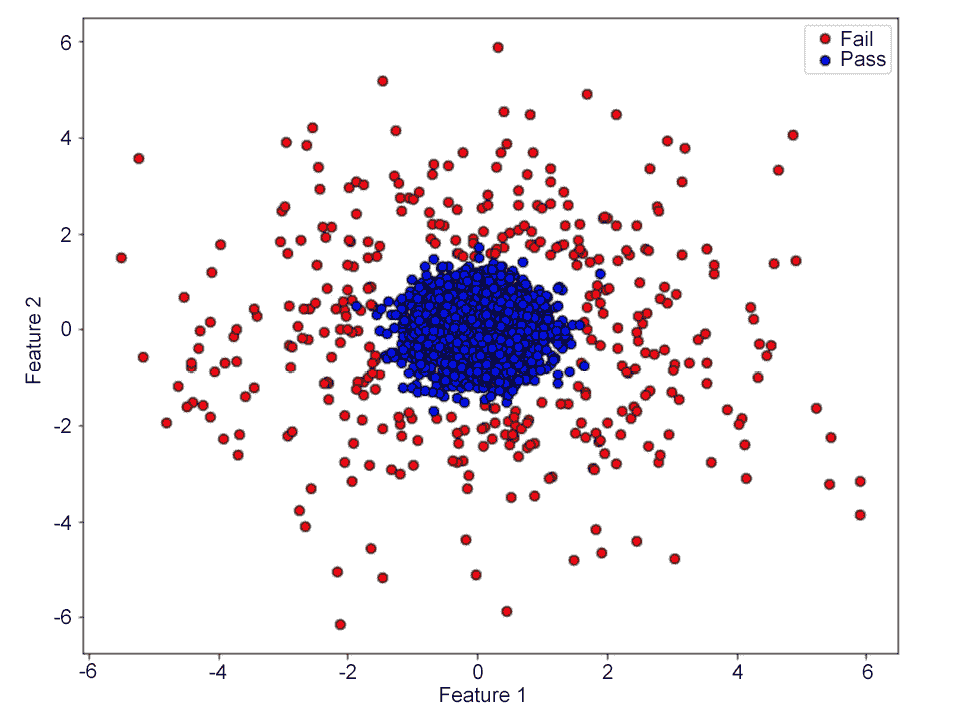

    图 3.19：模拟训练数据点

1.  构建`逻辑回归`模型，这是一个没有隐藏层的单节点顺序模型，使用`sigmoid 激活`函数：

    ```py
    np.random.seed(seed)
    random.set_seed(seed)
    model = Sequential()
    model.add(Dense(1, activation='sigmoid', input_dim=2))
    model.compile(optimizer='sgd', loss='binary_crossentropy')
    ```

1.  将模型拟合到训练数据：

    ```py
    model.fit(feats, target, batch_size=5, epochs=100, verbose=1, \
              validation_split=0.2, shuffle=False)
    ```

    `100`轮 = `0.3537`：

    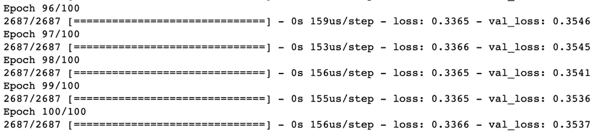

    图 3.20：100 轮中的最后 5 轮的损失详情

1.  在训练数据上绘制决策边界：

    ```py
    matplotlib.rcParams['figure.figsize'] = (10.0, 8.0)
    plot_decision_boundary(lambda x: model.predict(x), feats, target)
    plt.title("Logistic Regression")
    ```

    以下图像显示了前述代码的输出：

    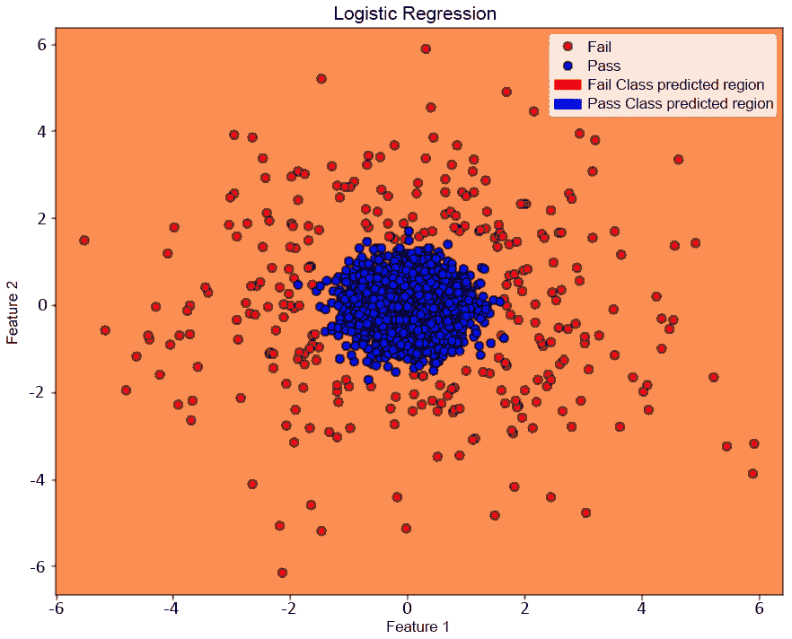

    图 3.21：逻辑回归模型的决策边界

    逻辑回归模型的线性决策边界显然无法捕捉到两类之间的圆形决策边界，并将所有结果预测为通过结果。

1.  创建一个包含三个节点的单隐藏层神经网络，并使用`relu 激活函数`，输出层为一个节点，并使用`sigmoid 激活函数`。最后，编译模型：

    ```py
    np.random.seed(seed)
    random.set_seed(seed)
    model = Sequential() 
    model.add(Dense(3, activation='relu', input_dim=2))
    model.add(Dense(1, activation='sigmoid'))
    model.compile(optimizer='sgd', loss='binary_crossentropy')
    ```

1.  将模型拟合到训练数据：

    ```py
    model.fit(feats, target, batch_size=5, epochs=200, verbose=1, \
              validation_split=0.2, shuffle=False)
    ```

    `200`轮 = `0.0260`：

    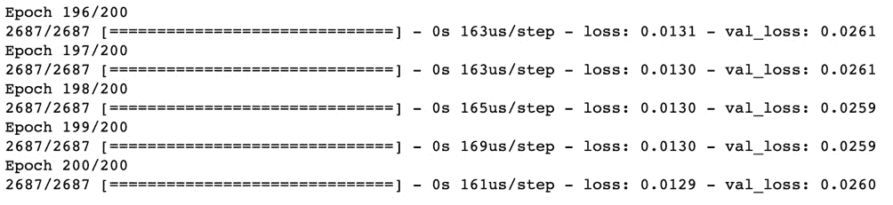

    图 3.22：200 轮中的最后 5 轮的损失详情

1.  绘制所创建的决策边界：

    ```py
    matplotlib.rcParams['figure.figsize'] = (10.0, 8.0)
    plot_decision_boundary(lambda x: model.predict(x), feats, target)
    plt.title("Decision Boundary for Neural Network with "\
              "hidden layer size 3")
    ```

    以下图像显示了前述代码的输出：

    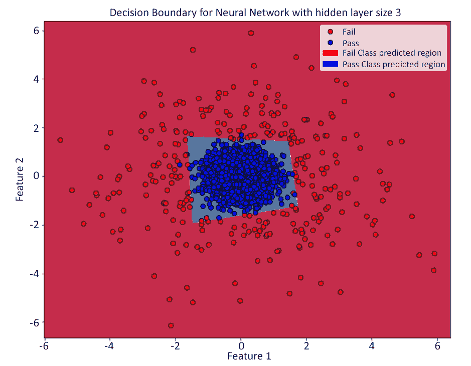

    图 3.23：带有 3 个节点的隐藏层和 ReLU 激活函数的神经网络决策边界

    使用三个处理单元代替一个显著提高了模型捕捉两类之间非线性边界的能力。注意，与上一步相比，损失值显著下降。

1.  创建一个神经网络，包含一个具有六个节点的隐藏层和一个`relu 激活函数`，输出层有一个节点，并使用`sigmoid 激活函数`。最后，编译模型：

    ```py
    np.random.seed(seed)
    random.set_seed(seed)
    model = Sequential() 
    model.add(Dense(6, activation='relu', input_dim=2))
    model.add(Dense(1, activation='sigmoid'))
    model.compile(optimizer='sgd', loss='binary_crossentropy')
    ```

1.  将模型拟合到训练数据：

    ```py
    model.fit(feats, target, batch_size=5, epochs=400, verbose=1, \
              validation_split=0.2, shuffle=False)
    ```

    `400` 轮次 = `0.0231`：

    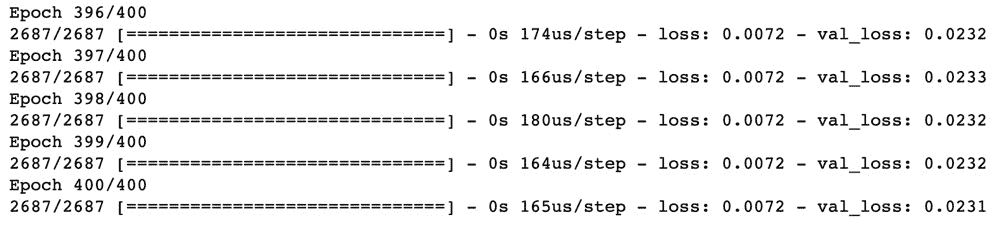

    图 3.24：最后 5 个 epoch（共 400 个）的损失详情

1.  绘制决策边界：

    ```py
    matplotlib.rcParams['figure.figsize'] = (10.0, 8.0)
    plot_decision_boundary(lambda x: model.predict(x), feats, target)
    plt.title("Decision Boundary for Neural Network with "\
              "hidden layer size 6")
    ```

    以下图像显示了前述代码的输出：

    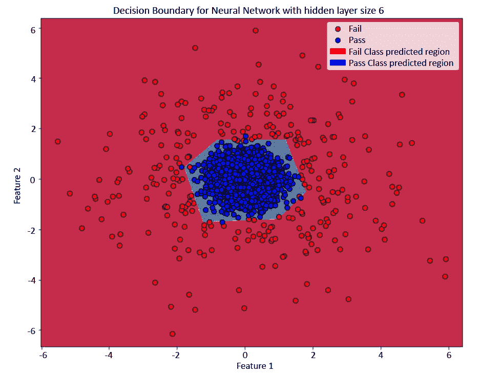

    图 3.25：具有隐藏层大小为 6 且使用 ReLU 激活函数的神经网络的决策边界

    通过将隐藏层中的单元数加倍，模型的决策边界更加接近真实的圆形，而且与前一步相比，损失值进一步减少。

1.  创建一个神经网络，包含一个具有三个节点的隐藏层和一个`tanh 激活函数`，输出层有一个节点，并使用`sigmoid 激活函数`。最后，编译模型：

    ```py
    np.random.seed(seed)
    random.set_seed(seed)
    model = Sequential() 
    model.add(Dense(3, activation='tanh', input_dim=2))
    model.add(Dense(1, activation='sigmoid'))
    model.compile(optimizer='sgd', loss='binary_crossentropy')
    ```

1.  将模型拟合到训练数据：

    ```py
    model.fit(feats, target, batch_size=5, epochs=200, verbose=1, \
              validation_split=0.2, shuffle=False)
    ```

    `200` 轮次 = `0.0426`：

    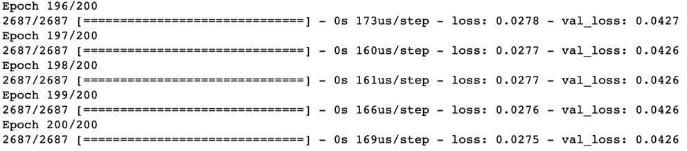

    图 3.26：最后 5 个 epoch（共 200 个）的损失详情

1.  绘制决策边界：

    ```py
    plot_decision_boundary(lambda x: model.predict(x), feats, target) 
    plt.title("Decision Boundary for Neural Network with "\
              "hidden layer size 3")
    ```

    以下图像显示了前述代码的输出：

    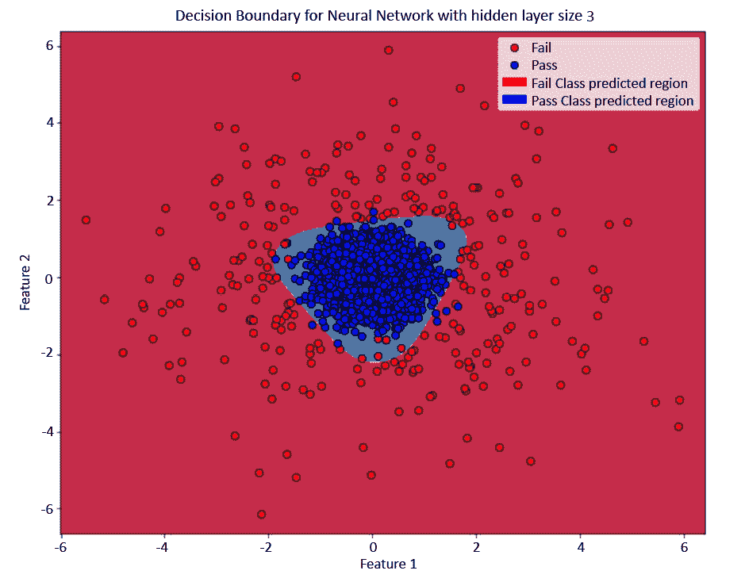

    图 3.27：具有隐藏层大小为 3 且使用 tanh 激活函数的神经网络的决策边界

    使用`tanh`激活函数消除了决策边界中的尖锐边缘。换句话说，它使得决策边界变得更加平滑。然而，由于我们看到损失值的增加，模型并没有表现得更好。尽管之前提到过`tanh`的学习速度比`relu`慢，但在对测试数据集进行评估时，我们得到了相似的损失和准确度评分。

1.  创建一个神经网络，包含一个具有六个节点的隐藏层和一个`tanh 激活函数`，输出层有一个节点，并使用`sigmoid 激活函数`。最后，编译模型：

    ```py
    np.random.seed(seed)
    random.set_seed(seed)
    model = Sequential() 
    model.add(Dense(6, activation='tanh', input_dim=2))
    model.add(Dense(1, activation='sigmoid'))
    model.compile(optimizer='sgd', loss='binary_crossentropy')
    ```

1.  将模型拟合到训练数据：

    ```py
    model.fit(feats, target, batch_size=5, epochs=400, verbose=1, \
              validation_split=0.2, shuffle=False)
    ```

    `400` 轮次 = `0.0215`：

    

    图 3.28：最后 5 个 epoch（共 400 个）的损失详情

1.  绘制决策边界：

    ```py
    matplotlib.rcParams['figure.figsize'] = (10.0, 8.0)
    plot_decision_boundary(lambda x: model.predict(x), feats, target)
    plt.title("Decision Boundary for Neural Network with "\
              "hidden layer size 6")
    ```

    以下图像显示了前述代码的输出：

    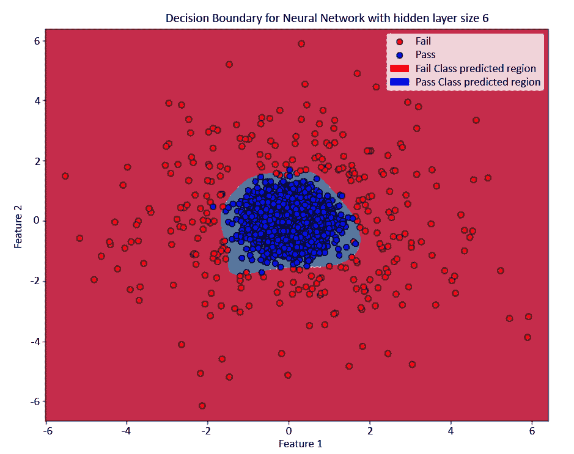

图 3.29：具有隐藏层大小为 6 且使用 tanh 激活函数的神经网络的决策边界

再次使用`tanh`激活函数代替`relu`，并将更多的节点添加到隐藏层中，使决策边界的曲线更加平滑，训练数据的拟合效果更好，依据训练数据的准确性来判断。我们应当小心，不要向隐藏层中添加过多的节点，否则可能会导致过拟合数据。这可以通过评估测试集来观察，在拥有六个节点的神经网络上，相比于具有三个节点的神经网络，准确度有所下降。

注：

要访问此特定部分的源代码，请参阅[`packt.live/3iv0wn1`](https://packt.live/3iv0wn1)。

您也可以在[`packt.live/2BqumZt`](https://packt.live/2BqumZt)上在线运行此示例。

## 活动 3.02：使用神经网络进行高级纤维化诊断

在本活动中，您将使用一个真实数据集来预测患者是否存在高级纤维化，基于的测量指标包括年龄、性别和 BMI。该数据集包含 1,385 名接受过丙型肝炎治疗剂量的患者信息。每个患者都有`28`个不同的属性，并且有一个类别标签，该标签只能取两个值：`1`表示高级纤维化，`0`表示没有高级纤维化迹象。这是一个二分类问题，输入维度为 28。

在本活动中，您将实现不同的深度神经网络架构来执行此分类任务，绘制训练误差率和测试误差率的趋势，并确定最终分类器需要训练多少个 epoch。请按照以下步骤完成此活动：

1.  导入所有必要的库，并使用 pandas 的`read_csv`函数加载数据集：

    ```py
    import pandas as pd
    import numpy as np
    from tensorflow import random
    from sklearn.model_selection import train_test_split
    from sklearn.preprocessing import StandardScaler
    from keras.models import Sequential
    from keras.layers import Dense
    import matplotlib.pyplot as plt 
    import matplotlib
    %matplotlib inline
    X = pd.read_csv('../data/HCV_feats.csv')
    y = pd.read_csv('../data/HCV_target.csv')
    ```

1.  打印`records`和`features`在`feature`数据集中的数量，以及`target`数据集中唯一类别的数量：

    ```py
    print("Number of Examples in the Dataset = ", X.shape[0])
    print("Number of Features for each example = ", X.shape[1]) 
    print("Possible Output Classes = ", \
          y['AdvancedFibrosis'].unique())
    ```

    **预期输出**：

    ```py
    Number of Examples in the Dataset = 1385
    Number of Features for each example = 28
    Possible Output Classes = [0 1]
    ```

1.  对数据进行归一化并进行缩放。然后，将数据集拆分为`训练`集和`测试`集：

    ```py
    seed = 1
    np.random.seed(seed)
    sc = StandardScaler()
    X = pd.DataFrame(sc.fit_transform(X), columns=X.columns)
    X_train, X_test, y_train, y_test = \
    train_test_split(X, y, test_size=0.2, random_state=seed)
    # Print the information regarding dataset sizes
    print(X_train.shape)
    print(y_train.shape)
    print(X_test.shape)
    print(y_test.shape)
    print ("Number of examples in training set = ", X_train.shape[0])
    print ("Number of examples in test set = ", X_test.shape[0])
    ```

    **预期输出**：

    ```py
    (1108, 28)
    (1108, 1)
    (277, 28)
    (277, 1)
    Number of examples in training set = 1108
    Number of examples in test set = 277
    ```

1.  实现一个具有一个隐藏层，隐藏层大小为`3`，激活函数为`tanh`，输出层为一个节点，并使用`sigmoid`激活函数的深度神经网络。最后，编译模型并打印出模型的摘要：

    ```py
    np.random.seed(seed)
    random.set_seed(seed)
    # define the keras model
    classifier = Sequential()
    classifier.add(Dense(units = 3, activation = 'tanh', \
                         input_dim=X_train.shape[1]))
    classifier.add(Dense(units = 1, activation = 'sigmoid'))
    classifier.compile(optimizer = 'sgd', loss = 'binary_crossentropy', \
                       metrics = ['accuracy'])
    classifier.summary()
    ```

    以下图像显示了前述代码的输出：

    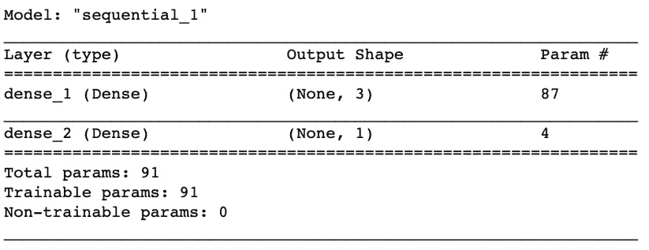

    图 3.30：神经网络的架构

1.  将模型拟合到训练数据中：

    ```py
    history=classifier.fit(X_train, y_train, batch_size = 20, \
                           epochs = 100, validation_split=0.1, \
                           shuffle=False)
    ```

1.  绘制每个 epoch 的`训练误差率`和`测试误差率`：

    ```py
    plt.plot(history.history['loss'])
    plt.plot(history.history['val_loss'])
    plt.ylabel('loss')
    plt.xlabel('epoch')
    plt.legend(['train loss', 'validation loss'], loc='upper right')
    ```

    **预期输出**：

    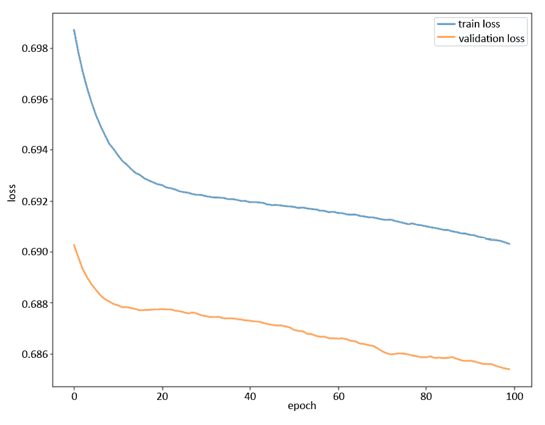

    图 3.31：训练模型时训练误差率和测试误差率的变化图

1.  打印出在训练集和测试集上达到的最佳准确率值，以及在`test`数据集上评估的`loss`和`accuracy`值。

    ```py
    print(f"Best Accuracy on training set = \
    {max(history.history['accuracy'])*100:.3f}%")
    print(f"Best Accuracy on validation set = \
    {max(history.history['val_accuracy'])*100:.3f}%") 
    test_loss, test_acc = \
    classifier.evaluate(X_test, y_test['AdvancedFibrosis'])
    print(f'The loss on the test set is {test_loss:.4f} and \
    the accuracy is {test_acc*100:.3f}%')
    ```

    下图展示了前面代码的输出结果：

    ```py
    Best Accuracy on training set = 52.959%
    Best Accuracy on validation set = 58.559%
    277/277 [==============================] - 0s 25us/step
    The loss on the test set is 0.6885 and the accuracy is 55.235%
    ```

1.  实现一个具有两个隐藏层的深度神经网络，第一个隐藏层的大小为`4`，第二个隐藏层的大小为`2`，使用`tanh 激活函数`，输出层有一个节点，使用`sigmoid 激活函数`。最后，编译模型并打印出模型的总结：

    ```py
    np.random.seed(seed)
    random.set_seed(seed)
    # define the keras model
    classifier = Sequential()
    classifier.add(Dense(units = 4, activation = 'tanh', \
                         input_dim = X_train.shape[1]))
    classifier.add(Dense(units = 2, activation = 'tanh'))
    classifier.add(Dense(units = 1, activation = 'sigmoid'))
    classifier.compile(optimizer = 'sgd', loss = 'binary_crossentropy', \
                       metrics = ['accuracy'])
    classifier.summary()
    ```

    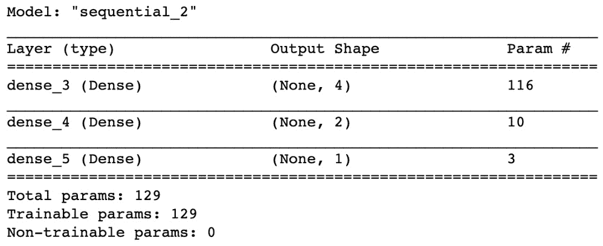

    图 3.32：神经网络架构

1.  将模型拟合到训练数据：

    ```py
    history=classifier.fit(X_train, y_train, batch_size = 20, \
                           epochs = 100, validation_split=0.1, \
                           shuffle=False)
    ```

1.  绘制具有两个隐藏层（大小分别为 4 和 2）的训练和测试误差图。打印在训练集和测试集上达到的最佳准确率：

    ```py
    # plot training error and test error plots 
    plt.plot(history.history['loss'])
    plt.plot(history.history['val_loss'])
    plt.ylabel('loss')
    plt.xlabel('epoch')
    plt.legend(['train loss', 'validation loss'], loc='upper right')
    ```

    **预期输出**：

    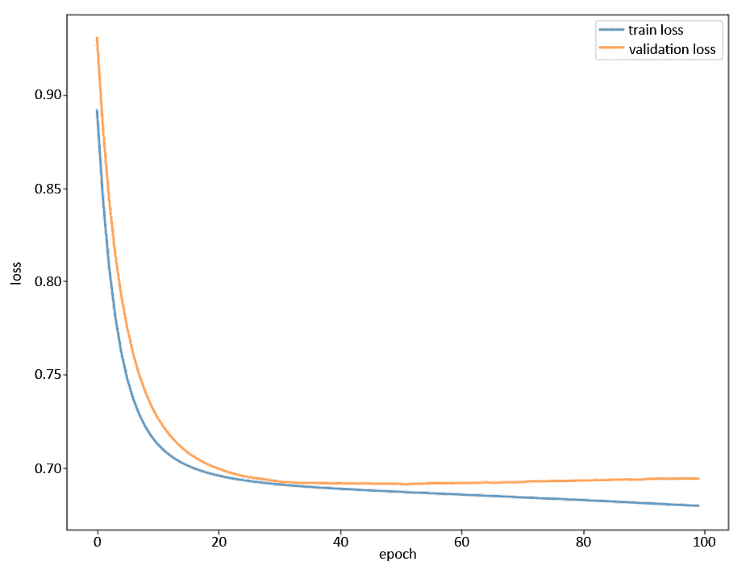

    图 3.33：训练误差和测试误差率在训练模型时的变化图

1.  打印在`训练`集和`测试`集上达到的最佳准确率，以及在测试数据集上评估的`损失`和`准确率`值。

    ```py
    print(f"Best Accuracy on training set = \
    {max(history.history['accuracy'])*100:.3f}%")
    print(f"Best Accuracy on validation set = \
    {max(history.history['val_accuracy'])*100:.3f}%") 
    test_loss, test_acc = \
    classifier.evaluate(X_test, y_test['AdvancedFibrosis'])
    print(f'The loss on the test set is {test_loss:.4f} and \
    the accuracy is {test_acc*100:.3f}%')
    ```

    以下展示了前面代码的输出结果：

    ```py
    Best Accuracy on training set = 57.272%
    Best Accuracy on test set = 54.054%
    277/277 [==============================] - 0s 41us/step
    The loss on the test set is 0.7016 and the accuracy is 49.819%
    ```

    注意

    若要访问该部分的源代码，请参考 [`packt.live/2BrIRMF`](https://packt.live/2BrIRMF)。

    你也可以在线运行这个例子，访问 [`packt.live/2NUl22A`](https://packt.live/2NUl22A)。

# 4\. 使用 Keras 封装器进行交叉验证评估模型

## 活动 4.01：使用交叉验证评估高级肝纤维化诊断分类器模型

在这个活动中，我们将使用本主题中学到的内容，使用`k 折交叉验证`训练和评估深度学习模型。我们将使用前一个活动中得到的最佳测试误差率的模型，目标是将交叉验证的误差率与训练集/测试集方法的误差率进行比较。我们将使用的数据库是丙型肝炎 C 数据集，在该数据集中，我们将构建一个分类模型，预测哪些患者会患上晚期肝纤维化。按照以下步骤完成此活动：

1.  加载数据集并打印数据集中的记录数和特征数，以及目标数据集中可能的类别数：

    ```py
    # Load the dataset
    import pandas as pd
    X = pd.read_csv('../data/HCV_feats.csv')
    y = pd.read_csv('../data/HCV_target.csv')
    # Print the sizes of the dataset
    print("Number of Examples in the Dataset = ", X.shape[0])
    print("Number of Features for each example = ", X.shape[1]) 
    print("Possible Output Classes = ", \
          y['AdvancedFibrosis'].unique())
    ```

    这是预期的输出：

    ```py
    Number of Examples in the Dataset = 1385
    Number of Features for each example = 28
    Possible Output Classes = [0 1]
    ```

1.  定义一个返回 Keras 模型的函数。首先，导入 Keras 所需的库。在函数内部，实例化顺序模型并添加两个全连接层，第一个层的大小为`4`，第二个层的大小为`2`，两者均使用`tanh 激活`函数。添加输出层并使用`sigmoid 激活`函数。编译模型并返回模型：

    ```py
    from keras.models import Sequential
    from keras.layers import Dense
    # Create the function that returns the keras model
    def build_model():
        model = Sequential()
        model.add(Dense(4, input_dim=X.shape[1], activation='tanh'))
        model.add(Dense(2, activation='tanh'))
        model.add(Dense(1, activation='sigmoid'))
        model.compile(loss='binary_crossentropy', optimizer='adam', \
                      metrics=['accuracy'])
        return model
    ```

1.  使用`StandardScaler`函数对训练数据进行缩放。设置种子，以便模型可复现。定义超参数`n_folds`、`epochs`和`batch_size`。然后，使用 scikit-learn 构建 Keras 封装器，定义`cross-validation`迭代器，执行`k 折交叉验证`并存储得分：

    ```py
    # import required packages
    import numpy as np
    from tensorflow import random
    from keras.wrappers.scikit_learn import KerasClassifier
    from sklearn.model_selection import StratifiedKFold
    from sklearn.model_selection import cross_val_score
    from sklearn.preprocessing import StandardScaler
    sc = StandardScaler()
    X = pd.DataFrame(sc.fit_transform(X), columns=X.columns)
    """
    define a seed for random number generator so the result will be reproducible
    """
    seed = 1
    np.random.seed(seed)
    random.set_seed(seed)
    """
    determine the number of folds for k-fold cross-validation, number of epochs and batch size
    """
    n_folds = 5
    epochs = 100
    batch_size = 20
    # build the scikit-learn interface for the keras model
    classifier = KerasClassifier(build_fn=build_model, \
                                 epochs=epochs, \
                                 batch_size=batch_size, \
                                 verbose=1, shuffle=False)
    # define the cross-validation iterator
    kfold = StratifiedKFold(n_splits=n_folds, shuffle=True, \
                            random_state=seed)
    """
    perform the k-fold cross-validation and store the scores in results
    """
    results = cross_val_score(classifier, X, y, cv=kfold)
    ```

1.  对于每一折，打印存储在`results`参数中的准确率：

    ```py
    # print accuracy for each fold
    for f in range(n_folds):
        print("Test accuracy at fold ", f+1, " = ", results[f])
    print("\n")
    """
    print overall cross-validation accuracy plus the standard deviation of the accuracies
    """
    print("Final Cross-validation Test Accuracy:", results.mean())
    print("Standard Deviation of Final Test Accuracy:", results.std())
    ```

    以下是预期的输出：

    ```py
    Test accuracy at fold 1 = 0.5198556184768677
    Test accuracy at fold 2 = 0.4693140685558319
    Test accuracy at fold 3 = 0.512635350227356
    Test accuracy at fold 4 = 0.5740072131156921
    Test accuracy at fold 5 = 0.5523465871810913
    Final Cross-Validation Test Accuracy: 0.5256317675113678
    Standard Deviation of Final Test Accuracy: 0.03584760640500936
    ```

    注意

    要访问此特定部分的源代码，请参考[`packt.live/3eWgR2b`](https://packt.live/3eWgR2b)。

    你也可以在线运行这个示例，网址为：[`packt.live/3iBYtOi`](https://packt.live/3iBYtOi)。

## 活动 4.02：使用交叉验证为高级纤维化诊断分类器选择模型

在此活动中，我们将通过使用交叉验证来选择模型和超参数，从而改进针对肝炎 C 数据集的分类器。按照以下步骤完成此活动：

1.  导入所有所需的包并加载数据集。使用`StandardScaler`函数对数据集进行标准化：

    ```py
    # import the required packages
    from keras.models import Sequential
    from keras.layers import Dense
    from keras.wrappers.scikit_learn import KerasClassifier
    from sklearn.model_selection import StratifiedKFold
    from sklearn.model_selection import cross_val_score
    import numpy as np
    import pandas as pd
    from sklearn.preprocessing import StandardScaler
    from tensorflow import random
    # Load the dataset
    X = pd.read_csv('../data/HCV_feats.csv')
    y = pd.read_csv('../data/HCV_target.csv')
    sc = StandardScaler()
    X = pd.DataFrame(sc.fit_transform(X), columns=X.columns)
    ```

1.  定义三个函数，每个函数返回一个不同的 Keras 模型。第一个模型应具有三个隐藏层，每层`大小为 4`，第二个模型应具有两个隐藏层，第一个隐藏层`大小为 4`，第二个隐藏层`大小为 2`，第三个模型应具有两个隐藏层，`大小为 8`。使用函数参数来传递激活函数和优化器，以便它们可以传递给模型。目标是找出这三个模型中哪一个导致了最低的交叉验证误差率：

    ```py
    # Create the function that returns the keras model 1
    def build_model_1(activation='relu', optimizer='adam'):
        # create model 1
        model = Sequential()
        model.add(Dense(4, input_dim=X.shape[1], \
                        activation=activation))
        model.add(Dense(4, activation=activation))
        model.add(Dense(4, activation=activation))
        model.add(Dense(1, activation='sigmoid'))
        # Compile model
        model.compile(loss='binary_crossentropy', \
                      optimizer=optimizer, metrics=['accuracy'])
        return model
    # Create the function that returns the keras model 2
    def build_model_2(activation='relu', optimizer='adam'):
        # create model 2
        model = Sequential()
        model.add(Dense(4, input_dim=X.shape[1], \
                        activation=activation))
        model.add(Dense(2, activation=activation))
        model.add(Dense(1, activation='sigmoid'))
        # Compile model
        model.compile(loss='binary_crossentropy', \
                      optimizer=optimizer, metrics=['accuracy'])
        return model
    # Create the function that returns the keras model 3
    def build_model_3(activation='relu', optimizer='adam'):
        # create model 3
        model = Sequential()
        model.add(Dense(8, input_dim=X.shape[1], \
                        activation=activation))
        model.add(Dense(8, activation=activation))
        model.add(Dense(1, activation='sigmoid'))
        # Compile model
        model.compile(loss='binary_crossentropy', \
                      optimizer=optimizer, metrics=['accuracy'])
        return model
    ```

    编写代码，循环遍历三个模型并执行`5 折交叉验证`。设置随机种子以确保模型可重复，并定义`n_folds`、`batch_size`和`epochs`超参数。在训练模型时，存储应用`cross_val_score`函数的结果：

    ```py
    """
    define a seed for random number generator so the result will be reproducible
    """
    seed = 2
    np.random.seed(seed)
    random.set_seed(seed)
    """
    determine the number of folds for k-fold cross-validation, number of epochs and batch size
    """
    n_folds = 5
    batch_size=20
    epochs=100
    # define the list to store cross-validation scores
    results_1 = []
    # define the possible options for the model
    models = [build_model_1, build_model_2, build_model_3]
    # loop over models
    for m in range(len(models)):
        # build the scikit-learn interface for the keras model
        classifier = KerasClassifier(build_fn=models[m], \
                                     epochs=epochs, \
                                     batch_size=batch_size, \
                                     verbose=0, shuffle=False)
        # define the cross-validation iterator
        kfold = StratifiedKFold(n_splits=n_folds, shuffle=True, \
                                random_state=seed)
        """
        perform the k-fold cross-validation and store the scores 
        in result
        """
        result = cross_val_score(classifier, X, y, cv=kfold)
        # add the scores to the results list 
        results_1.append(result)
    # Print cross-validation score for each model
    for m in range(len(models)):
        print("Model", m+1,"Test Accuracy =", results_1[m].mean())
    ```

    这是一个示例输出。在此实例中，**模型 2**具有最佳的交叉验证测试准确率，具体如下所示：

    ```py
    Model 1 Test Accuracy = 0.4996389865875244
    Model 2 Test Accuracy = 0.5148014307022095
    Model 3 Test Accuracy = 0.5097472846508027
    ```

1.  选择具有最高准确率得分的模型，并通过遍历`epochs = [100, 200]`和`batches = [10, 20]`的值并执行`5 折交叉验证`来重复*步骤 2*：

    ```py
    """
    define a seed for random number generator so the result will be reproducible
    """
    np.random.seed(seed)
    random.set_seed(seed)
    # determine the number of folds for k-fold cross-validation
    n_folds = 5
    # define possible options for epochs and batch_size
    epochs = [100, 200]
    batches = [10, 20]
    # define the list to store cross-validation scores
    results_2 = []
    # loop over all possible pairs of epochs, batch_size
    for e in range(len(epochs)):
        for b in range(len(batches)):
            # build the scikit-learn interface for the keras model
            classifier = KerasClassifier(build_fn=build_model_2, \
                                         epochs=epochs[e], \
                                         batch_size=batches[b], \
                                         verbose=0)
            # define the cross-validation iterator
            kfold = StratifiedKFold(n_splits=n_folds, shuffle=True, \
                                    random_state=seed)
            # perform the k-fold cross-validation. 
            # store the scores in result
            result = cross_val_score(classifier, X, y, cv=kfold)
            # add the scores to the results list 
            results_2.append(result)
    """
    Print cross-validation score for each possible pair of epochs, batch_size
    """
    c = 0
    for e in range(len(epochs)):
        for b in range(len(batches)):
            print("batch_size =", batches[b],", epochs =", epochs[e], \
                  ", Test Accuracy =", results_2[c].mean())
            c += 1
    ```

    这是一个示例输出：

    ```py
    batch_size = 10 , epochs = 100 , Test Accuracy = 0.5010830342769623
    batch_size = 20 , epochs = 100 , Test Accuracy = 0.5126353740692139
    batch_size = 10 , epochs = 200 , Test Accuracy = 0.5176895320416497
    batch_size = 20 , epochs = 200 , Test Accuracy = 0.5075812220573426
    ```

    在此案例中，`batch_size= 10`，`epochs=200`的组合具有最佳的交叉验证测试准确率。

1.  选择具有最高准确率得分的批处理大小和训练轮数，并通过遍历`optimizers = ['rmsprop', 'adam', 'sgd']`和`activations = ['relu', 'tanh']`的值并执行`5 折交叉验证`来重复*步骤 3*：

    ```py
    """
    define a seed for random number generator so the result will be reproducible
    """
    np.random.seed(seed)
    random.set_seed(seed)
    """
    determine the number of folds for k-fold cross-validation, number of epochs and batch size
    """
    n_folds = 5
    batch_size = 10
    epochs = 200
    # define the list to store cross-validation scores
    results_3 = []
    # define possible options for optimizer and activation
    optimizers = ['rmsprop', 'adam','sgd']
    activations = ['relu', 'tanh']
    # loop over all possible pairs of optimizer, activation
    for o in range(len(optimizers)):
        for a in range(len(activations)):
            optimizer = optimizers[o]
            activation = activations[a]
            # build the scikit-learn interface for the keras model
            classifier = KerasClassifier(build_fn=build_model_2, \
                                         epochs=epochs, \
                                         batch_size=batch_size, \
                                         verbose=0, shuffle=False)
            # define the cross-validation iterator
            kfold = StratifiedKFold(n_splits=n_folds, shuffle=True, \
                                    random_state=seed)
            # perform the k-fold cross-validation. 
            # store the scores in result
            result = cross_val_score(classifier, X, y, cv=kfold)
            # add the scores to the results list 
            results_3.append(result)
    """
    Print cross-validation score for each possible pair of optimizer, activation
    """
    c = 0
    for o in range(len(optimizers)):
        for a in range(len(activations)):
            print("activation = ", activations[a],", optimizer = ", \
                  optimizers[o], ", Test accuracy = ", \
                  results_3[c].mean())
            c += 1
    ```

    以下是预期的输出：

    ```py
    activation =  relu , optimizer =  rmsprop , 
    Test accuracy =  0.5234657049179077
    activation =  tanh , optimizer =  rmsprop , 
    Test accuracy =  0.49602887630462644
    activation =  relu , optimizer =  adam , 
    Test accuracy =  0.5039711117744445
    activation =  tanh , optimizer =  adam , 
    Test accuracy =  0.4989169597625732
    activation =  relu , optimizer =  sgd , 
    Test accuracy =  0.48953068256378174
    activation =  tanh , optimizer =  sgd , 
    Test accuracy =  0.5191335678100586
    ```

    在这里，`activation='relu'`和`optimizer='rmsprop'`的组合具有最佳的交叉验证测试准确率。此外，`activation='tanh'`和`optimizer='sgd'`的组合则取得了第二好的性能。

    注意

    要访问此特定部分的源代码，请参考[`packt.live/2D3AIhD`](https://packt.live/2D3AIhD)。

    你也可以在线运行这个示例，网址为：[`packt.live/2NUpiiC`](https://packt.live/2NUpiiC)。

## 活动 4.03：使用交叉验证选择交通量数据集的模型

在这个活动中，你将再次练习使用交叉验证进行模型选择。在这里，我们将使用一个模拟数据集，表示一个目标变量，表示城市桥梁上每小时的交通量，以及与交通数据相关的各种归一化特征，如一天中的时间和前一天的交通量。我们的目标是建立一个模型，根据这些特征预测城市桥梁上的交通量。按照以下步骤完成此活动：

1.  导入所有必需的包并加载数据集：

    ```py
    # import the required packages
    from keras.models import Sequential
    from keras.layers import Dense
    from keras.wrappers.scikit_learn import KerasRegressor
    from sklearn.model_selection import KFold
    from sklearn.model_selection import cross_val_score
    from sklearn.preprocessing import StandardScaler
    from sklearn.pipeline import make_pipeline
    import numpy as np
    import pandas as pd
    from tensorflow import random
    ```

1.  加载数据集，打印特征数据集的输入和输出大小，并打印目标数据集中的可能类别。同时，打印输出的范围：

    ```py
    # Load the dataset
    # Load the dataset
    X = pd.read_csv('../data/traffic_volume_feats.csv')
    y = pd.read_csv('../data/traffic_volume_target.csv') 
    # Print the sizes of input data and output data
    print("Input data size = ", X.shape)
    print("Output size = ", y.shape)
    # Print the range for output
    print(f"Output Range = ({y['Volume'].min()}, \
    { y['Volume'].max()})")
    ```

    这是预期的输出：

    ```py
    Input data size =  (10000, 10)
    Output size =  (10000, 1)
    Output Range = (0.000000, 584.000000)
    ```

1.  定义三个函数，每个函数返回一个不同的 Keras 模型。第一个模型应有一个`大小为 10`的隐藏层，第二个模型应有两个`大小为 10`的隐藏层，第三个模型应有三个`大小为 10`的隐藏层。使用函数参数来传递优化器，以便它们可以传递给模型。目标是找出这三种模型中哪个能带来最低的交叉验证错误率：

    ```py
    # Create the function that returns the keras model 1
    def build_model_1(optimizer='adam'):
        # create model 1
        model = Sequential()
        model.add(Dense(10, input_dim=X.shape[1], activation='relu'))
        model.add(Dense(1))
        # Compile model
        model.compile(loss='mean_squared_error', optimizer=optimizer)
        return model
    # Create the function that returns the keras model 2
    def build_model_2(optimizer='adam'):
        # create model 2
        model = Sequential()
        model.add(Dense(10, input_dim=X.shape[1], activation='relu'))
        model.add(Dense(10, activation='relu'))
        model.add(Dense(1))
        # Compile model
        model.compile(loss='mean_squared_error', optimizer=optimizer)
        return model
    # Create the function that returns the keras model 3
    def build_model_3(optimizer='adam'):
        # create model 3
        model = Sequential()
        model.add(Dense(10, input_dim=X.shape[1], activation='relu'))
        model.add(Dense(10, activation='relu'))
        model.add(Dense(10, activation='relu'))
        model.add(Dense(1))
        # Compile model
        model.compile(loss='mean_squared_error', optimizer=optimizer)
        return model
    ```

1.  编写代码，循环遍历三个模型并执行`5 折交叉验证`。设置随机种子以确保模型可复现，并定义`n_folds`超参数。存储在训练模型时应用`cross_val_score`函数的结果：

    ```py
    """
    define a seed for random number generator so the result will be reproducible
    """
    seed = 1
    np.random.seed(seed)
    random.set_seed(seed)
    # determine the number of folds for k-fold cross-validation
    n_folds = 5
    # define the list to store cross-validation scores
    results_1 = []
    # define the possible options for the model
    models = [build_model_1, build_model_2, build_model_3]
    # loop over models
    for i in range(len(models)):
        # build the scikit-learn interface for the keras model
        regressor = KerasRegressor(build_fn=models[i], epochs=100, \
                                   batch_size=50, verbose=0, \
                                   shuffle=False)
        """
        build the pipeline of transformations so for each fold training 
        set will be scaled and test set will be scaled accordingly.
        """
        model = make_pipeline(StandardScaler(), regressor)
        # define the cross-validation iterator
        kfold = KFold(n_splits=n_folds, shuffle=True, \
                      random_state=seed)
        # perform the k-fold cross-validation. 
        # store the scores in result
        result = cross_val_score(model, X, y, cv=kfold)
        # add the scores to the results list 
        results_1.append(result)
    # Print cross-validation score for each model
    for i in range(len(models)):
        print("Model ", i+1," test error rate = ", \
              abs(results_1[i].mean()))
    ```

    以下是预期的输出：

    ```py
    Model  1  test error rate =  25.48777518749237
    Model  2  test error rate =  25.30460816860199
    Model  3  test error rate =  25.390239462852474
    ```

    `模型 2`（一个两层神经网络）具有最低的测试错误率。

1.  选择具有最低测试错误率的模型，并在迭代`epochs = [80, 100]`和`batches = [50, 25]`时重复*步骤 4*，同时执行`5 折交叉验证`：

    ```py
    """
    define a seed for random number generator so the result will be reproducible
    """
    np.random.seed(seed)
    random.set_seed(seed)
    # determine the number of folds for k-fold cross-validation
    n_folds = 5
    # define the list to store cross-validation scores
    results_2 = []
    # define possible options for epochs and batch_size
    epochs = [80, 100]
    batches = [50, 25]
    # loop over all possible pairs of epochs, batch_size
    for i in range(len(epochs)):
        for j in range(len(batches)):
            # build the scikit-learn interface for the keras model
            regressor = KerasRegressor(build_fn=build_model_2, \
                                       epochs=epochs[i], \
                                       batch_size=batches[j], \
                                       verbose=0, shuffle=False)
            """
            build the pipeline of transformations so for each fold 
            training set will be scaled and test set will be scaled 
            accordingly.
            """
            model = make_pipeline(StandardScaler(), regressor)
            # define the cross-validation iterator
            kfold = KFold(n_splits=n_folds, shuffle=True, \
                          random_state=seed)
            # perform the k-fold cross-validation. 
            # store the scores in result
            result = cross_val_score(model, X, y, cv=kfold)
            # add the scores to the results list 
            results_2.append(result)
    """
    Print cross-validation score for each possible pair of epochs, batch_size
    """
    c = 0
    for i in range(len(epochs)):
        for j in range(len(batches)):
            print("batch_size = ", batches[j],\
                  ", epochs = ", epochs[i], \
                  ", Test error rate = ", abs(results_2[c].mean()))
            c += 1
    ```

    这是预期的输出：

    ```py
    batch_size = 50 , epochs = 80 , Test error rate = 25.270704221725463
    batch_size = 25 , epochs = 80 , Test error rate = 25.309741401672362
    batch_size = 50 , epochs = 100 , Test error rate = 25.095393986701964
    batch_size = 25 , epochs = 100 , Test error rate = 25.24592453837395
    ```

    `batch_size=5`和`epochs=100`的组合具有最低的测试错误率。

1.  选择具有最高准确度的模型，并重复*步骤 2*，通过迭代`optimizers = ['rmsprop', 'sgd', 'adam']`并执行`5 折交叉验证`：

    ```py
    """
    define a seed for random number generator so the result will be reproducible
    """
    np.random.seed(seed)
    random.set_seed(seed)
    # determine the number of folds for k-fold cross-validation
    n_folds = 5
    # define the list to store cross-validation scores
    results_3 = []
    # define the possible options for the optimizer
    optimizers = ['adam', 'sgd', 'rmsprop']
    # loop over optimizers
    for i in range(len(optimizers)):
        optimizer=optimizers[i]
        # build the scikit-learn interface for the keras model
        regressor = KerasRegressor(build_fn=build_model_2, \
                                   epochs=100, batch_size=50, \
                                   verbose=0, shuffle=False)
        """
        build the pipeline of transformations so for each fold training 
        set will be scaled and test set will be scaled accordingly.
        """
        model = make_pipeline(StandardScaler(), regressor)
        # define the cross-validation iterator
        kfold = KFold(n_splits=n_folds, shuffle=True, \
                      random_state=seed)
        # perform the k-fold cross-validation. 
        # store the scores in result
        result = cross_val_score(model, X, y, cv=kfold)
        # add the scores to the results list 
        results_3.append(result)
    # Print cross-validation score for each optimizer
    for i in range(len(optimizers)):
        print("optimizer=", optimizers[i]," test error rate = ", \
              abs(results_3[i].mean()))
    ```

    这是预期的输出：

    ```py
    optimizer= adam  test error rate =  25.391812739372256
    optimizer= sgd  test error rate =  25.140230269432067
    optimizer= rmsprop  test error rate =  25.217947859764102
    ```

    `optimizer='sgd'`具有最低的测试错误率，因此我们应继续使用这个模型。

    注意

    要访问此特定部分的源代码，请参考[`packt.live/31TcYaD`](https://packt.live/31TcYaD)。

    你也可以在[`packt.live/3iq6iqb`](https://packt.live/3iq6iqb)在线运行这个示例。

# 5\. 改进模型准确性

## 活动 5.01：在 Avila 模式分类器上应用权重正则化

在此活动中，你将构建一个 Keras 模型，根据给定的网络架构和超参数值对 Avila 模式数据集进行分类。目标是对模型应用不同类型的权重正则化，即`L1`和`L2`，并观察每种类型如何改变结果。按照以下步骤完成此活动：

1.  加载数据集，并将数据集拆分为`训练集`和`测试集`：

    ```py
    # Load the dataset
    import pandas as pd
    X = pd.read_csv('../data/avila-tr_feats.csv')
    y = pd.read_csv('../data/avila-tr_target.csv')
    """
    Split the dataset into training set and test set with a 0.8-0.2 ratio
    """
    from sklearn.model_selection import train_test_split
    seed = 1
    X_train, X_test, y_train, y_test = \
    train_test_split(X, y, test_size=0.2, random_state=seed)
    ```

1.  定义一个包含三个隐藏层的 Keras 顺序模型，第一个隐藏层为 `size 10`，第二个隐藏层为 `size 6`，第三个隐藏层为 `size 4`。最后，编译模型：

    ```py
    """
    define a seed for random number generator so the result will be reproducible
    """
    import numpy as np
    from tensorflow import random
    np.random.seed(seed)
    random.set_seed(seed)
    # define the keras model
    from keras.models import Sequential
    from keras.layers import Dense
    model_1 = Sequential()
    model_1.add(Dense(10, input_dim=X_train.shape[1], \
                      activation='relu'))
    model_1.add(Dense(6, activation='relu'))
    model_1.add(Dense(4, activation='relu'))
    model_1.add(Dense(1, activation='sigmoid'))
    model_1.compile(loss='binary_crossentropy', optimizer='sgd', \
                    metrics=['accuracy'])
    ```

1.  将模型拟合到训练数据上以执行分类，并保存训练过程的结果：

    ```py
    history=model_1.fit(X_train, y_train, batch_size = 20, epochs = 100, \
                        validation_data=(X_test, y_test), \
                        verbose=0, shuffle=False)
    ```

1.  通过导入必要的库来绘制训练误差和测试误差的趋势，绘制损失和验证损失，并将它们保存在模型拟合训练过程时创建的变量中。打印出最大验证准确度：

    ```py
    import matplotlib.pyplot as plt 
    import matplotlib
    %matplotlib inline 
    # plot training error and test error
    matplotlib.rcParams['figure.figsize'] = (10.0, 8.0) 
    plt.plot(history.history['loss'])
    plt.plot(history.history['val_loss'])
    plt.ylim(0,1)
    plt.ylabel('loss')
    plt.xlabel('epoch')
    plt.legend(['train loss', 'validation loss'], loc='upper right')
    # print the best accuracy reached on the test set
    print("Best Accuracy on Validation Set =", \
          max(history.history['val_accuracy']))
    ```

    以下是预期输出：

    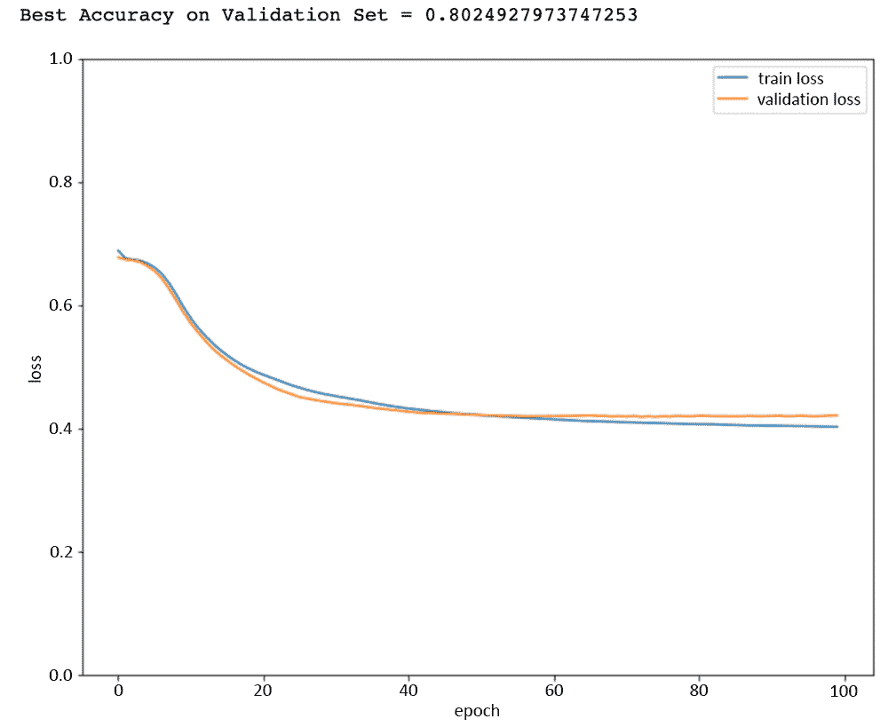

    图 5.13：训练过程中模型在没有正则化情况下的训练误差和验证误差图

    验证损失随训练损失不断减少。尽管没有使用正则化，这仍然是一个相当不错的训练过程示例，因为偏差和方差都比较低。

1.  重新定义模型，为每个隐藏层添加 `L2 正则化器`，`lambda=0.01`。重复 *步骤 3* 和 *步骤 4* 来训练模型并绘制 `训练误差` 和 `验证误差`：

    ```py
    """
    set up a seed for random number generator so the result will be reproducible
    """
    np.random.seed(seed)
    random.set_seed(seed)
    # define the keras model with l2 regularization with lambda = 0.01
    from keras.regularizers import l2
    l2_param = 0.01
    model_2 = Sequential()
    model_2.add(Dense(10, input_dim=X_train.shape[1], \
                      activation='relu', \
                      kernel_regularizer=l2(l2_param)))
    model_2.add(Dense(6, activation='relu', \
                      kernel_regularizer=l2(l2_param)))
    model_2.add(Dense(4, activation='relu', \
                      kernel_regularizer=l2(l2_param)))
    model_2.add(Dense(1, activation='sigmoid'))
    model_2.compile(loss='binary_crossentropy', optimizer='sgd', \
                    metrics=['accuracy'])
    # train the model using training set while evaluating on test set
    history=model_2.fit(X_train, y_train, batch_size = 20, epochs = 100, \
                        validation_data=(X_test, y_test), \
                        verbose=0, shuffle=False)
    plt.plot(history.history['loss'])
    plt.plot(history.history['val_loss'])
    plt.ylim(0,1)
    plt.ylabel('loss')
    plt.xlabel('epoch')
    plt.legend(['train loss', 'validation loss'], loc='upper right')
    # print the best accuracy reached on the test set
    print("Best Accuracy on Validation Set =", \
          max(history.history['val_accuracy']))
    ```

    以下是预期输出：

    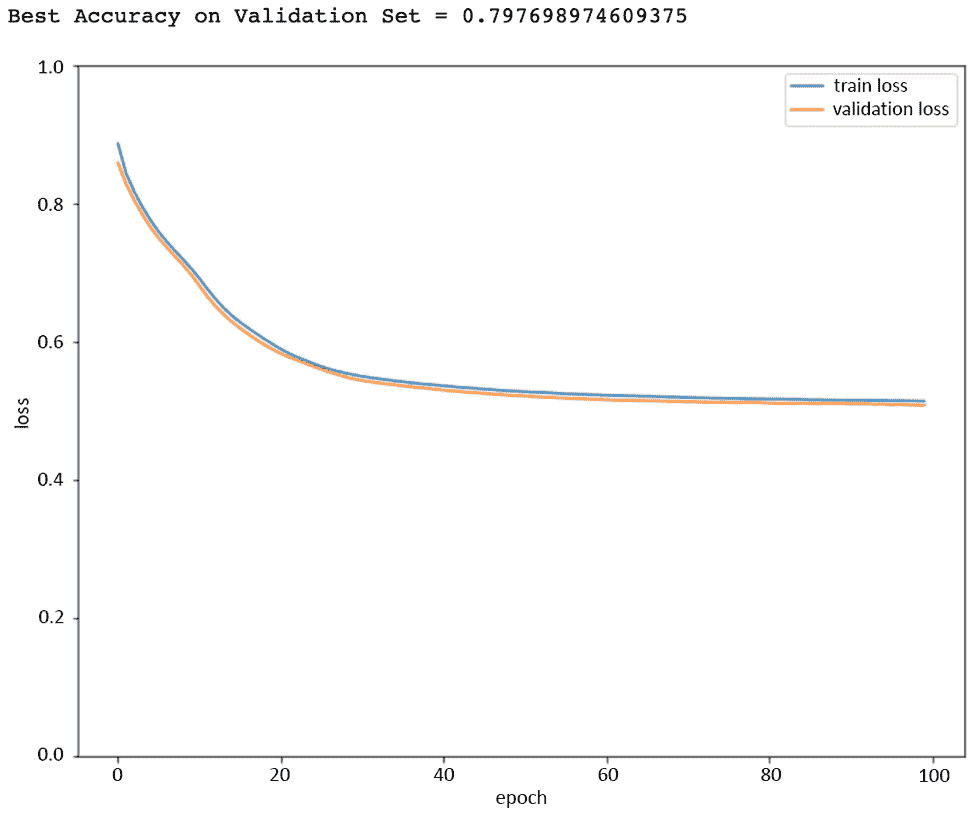

    图 5.14：训练过程中具有 L2 权重正则化（lambda=0.01）模型的训练误差和验证误差图

    从前面的图中可以看出，测试误差在降到一定程度后几乎趋于平稳。训练过程结束时训练误差和验证误差之间的差距（偏差）稍微缩小，这表明模型对训练样本的过拟合有所减少。

1.  使用 `lambda=0.1` 的 `L2 参数` 重复前一步骤——使用新的 lambda 参数重新定义模型，拟合模型到训练数据，并重复 *步骤 4* 绘制训练误差和验证误差：

    ```py
    """
    set up a seed for random number generator so the result will be reproducible
    """
    np.random.seed(seed)
    random.set_seed(seed)
    from keras.regularizers import l2
    l2_param = 0.1
    model_3 = Sequential()
    model_3.add(Dense(10, input_dim=X_train.shape[1], \
                      activation='relu', \
                      kernel_regularizer=l2(l2_param)))
    model_3.add(Dense(6, activation='relu', \
                      kernel_regularizer=l2(l2_param)))
    model_3.add(Dense(4, activation='relu', \
                      kernel_regularizer=l2(l2_param)))
    model_3.add(Dense(1, activation='sigmoid'))
    model_3.compile(loss='binary_crossentropy', optimizer='sgd', \
                    metrics=['accuracy'])
    # train the model using training set while evaluating on test set
    history=model_3.fit(X_train, y_train, batch_size = 20, \
                        epochs = 100, validation_data=(X_test, y_test), \
                        verbose=0, shuffle=False)
    # plot training error and test error
    matplotlib.rcParams['figure.figsize'] = (10.0, 8.0)
    plt.plot(history.history['loss'])
    plt.plot(history.history['val_loss'])
    plt.ylim(0,1)
    plt.ylabel('loss')
    plt.xlabel('epoch')
    plt.legend(['train loss', 'validation loss'], loc='upper right')
    # print the best accuracy reached on the test set
    print("Best Accuracy on Validation Set =", \
          max(history.history['val_accuracy']))
    ```

    以下是预期输出：

    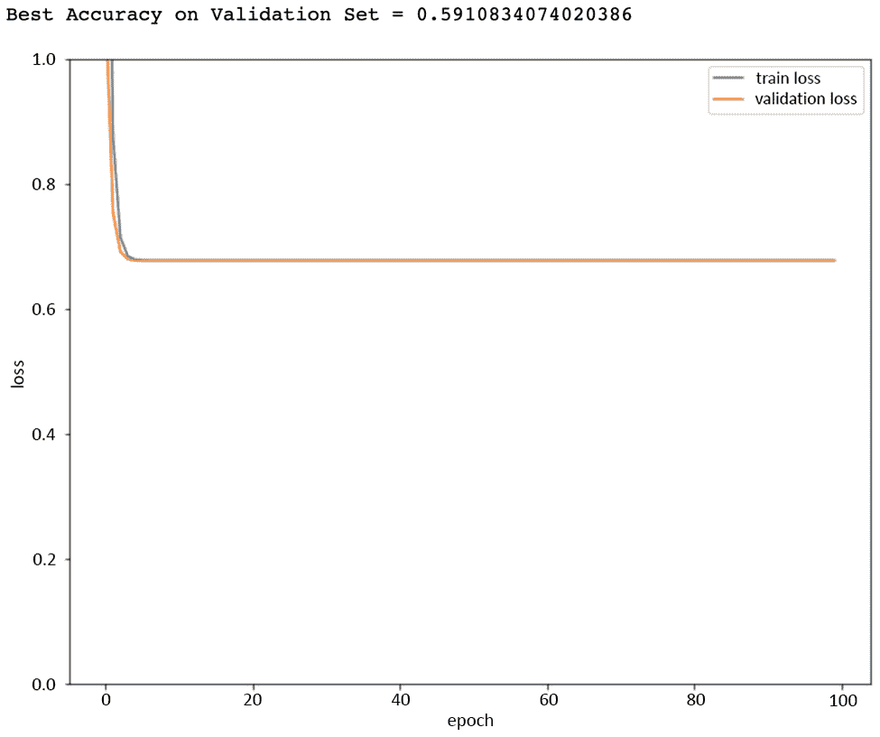

    图 5.15：训练过程中具有 L2 权重正则化（lambda=0.1）模型的训练误差和验证误差图

    训练和验证误差迅速达到平稳状态，且远高于我们使用较低 `L2 参数` 创建的模型，这表明我们对模型的惩罚过多，导致它没有足够的灵活性去学习训练数据的潜在函数。接下来，我们将减少正则化参数的值，以防止它对模型造成过多惩罚。

1.  重复前一步骤，这次使用 `lambda=0.005`。重复 *步骤 4* 绘制训练误差和验证误差：

    ```py
    """
    set up a seed for random number generator so the result will be reproducible
    """
    np.random.seed(seed)
    random.set_seed(seed)
    # define the keras model with l2 regularization with lambda = 0.05
    from keras.regularizers import l2
    l2_param = 0.005
    model_4 = Sequential()
    model_4.add(Dense(10, input_dim=X_train.shape[1], \
                      activation='relu', \
                      kernel_regularizer=l2(l2_param)))
    model_4.add(Dense(6, activation='relu', \
                      kernel_regularizer=l2(l2_param)))
    model_4.add(Dense(4, activation='relu', \
                      kernel_regularizer=l2(l2_param)))
    model_4.add(Dense(1, activation='sigmoid'))
    model_4.compile(loss='binary_crossentropy', optimizer='sgd', \
                    metrics=['accuracy'])
    # train the model using training set while evaluating on test set
    history=model_4.fit(X_train, y_train, batch_size = 20, \
                        epochs = 100, validation_data=(X_test, y_test), \
                        verbose=0, shuffle=False)
    # plot training error and test error
    matplotlib.rcParams['figure.figsize'] = (10.0, 8.0)
    plt.plot(history.history['loss'])
    plt.plot(history.history['val_loss'])
    plt.ylim(0,1)
    plt.ylabel('loss')
    plt.xlabel('epoch')
    plt.legend(['train loss', 'validation loss'], loc='upper right')
    # print the best accuracy reached on the test set
    print("Best Accuracy on Validation Set =", \
          max(history.history['val_accuracy'])) 
    ```

    以下是预期的输出：

    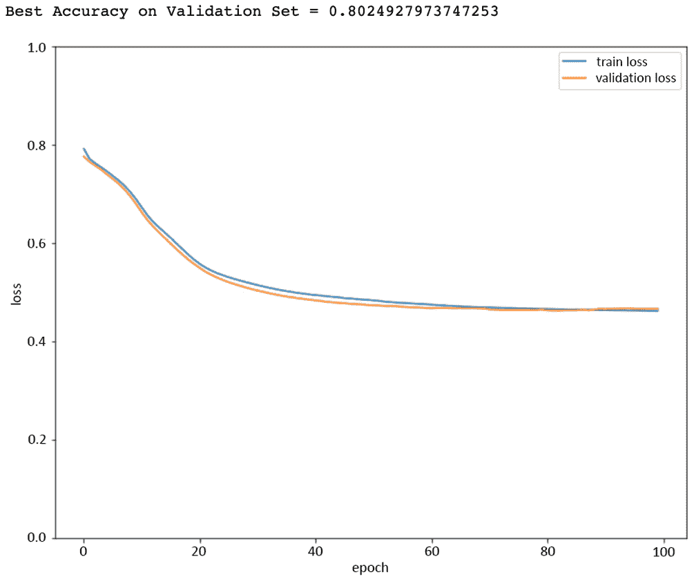

    图 5.16：带有 L2 权重正则化（lambda=0.005）的模型在训练过程中训练误差和验证误差的图示

    `L2 权重` 正则化的值在所有使用 `L2 正则化` 的模型中，在验证数据上评估时，获得了最高的准确度，但稍微低于没有正则化时的准确度。同样，在被减少到某个值之后，测试误差并没有显著增加，这表明模型没有过拟合训练样本。看起来 `lambda=0.005` 的 `L2 权重正则化` 获得了最低的验证误差，同时防止了模型的过拟合。

1.  向模型的隐藏层添加 `L1 正则化器`，其中 `lambda=0.01`。重新定义模型，使用新的 lambda 参数，拟合模型到训练数据，并重复 *步骤 4* 来绘制训练误差和验证误差：

    ```py
    """
    set up a seed for random number generator so the result will be reproducible
    """
    np.random.seed(seed)
    random.set_seed(seed)
    # define the keras model with l1 regularization with lambda = 0.01
    from keras.regularizers import l1
    l1_param = 0.01
    model_5 = Sequential()
    model_5.add(Dense(10, input_dim=X_train.shape[1], \
                      activation='relu', \
                      kernel_regularizer=l1(l1_param)))
    model_5.add(Dense(6, activation='relu', \
                      kernel_regularizer=l1(l1_param)))
    model_5.add(Dense(4, activation='relu', \
                      kernel_regularizer=l1(l1_param)))
    model_5.add(Dense(1, activation='sigmoid'))
    model_5.compile(loss='binary_crossentropy', optimizer='sgd', \
                    metrics=['accuracy'])
    # train the model using training set while evaluating on test set
    history=model_5.fit(X_train, y_train, batch_size = 20, \
                        epochs = 100, validation_data=(X_test, y_test), \
                        verbose=0, shuffle=True)
    # plot training error and test error
    matplotlib.rcParams['figure.figsize'] = (10.0, 8.0)
    plt.plot(history.history['loss'])
    plt.plot(history.history['val_loss'])
    plt.ylim(0,1)
    plt.ylabel('loss')
    plt.xlabel('epoch')
    plt.legend(['train loss', 'validation loss'], loc='upper right')
    # print the best accuracy reached on the test set
    print("Best Accuracy on Validation Set =", \
          max(history.history['val_accuracy']))
    ```

    以下是预期的输出：

    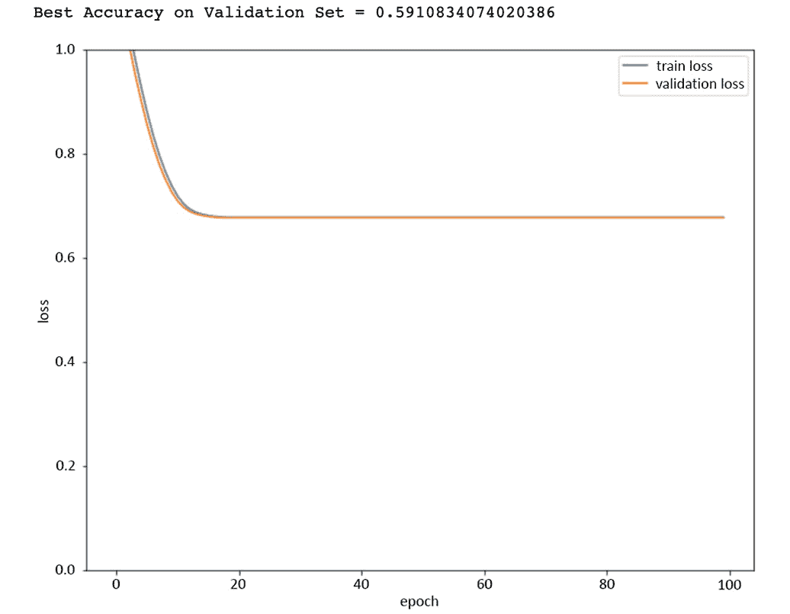

    图 5.17：带有 L1 权重正则化（lambda=0.01）的模型在训练过程中训练误差和验证误差的图示

1.  重复之前的步骤，将 `lambda=0.005` 应用于 `L1 参数`—使用新的 lambda 参数重新定义模型，拟合模型到训练数据，并重复 *步骤 4* 来绘制 `训练误差` 和 `验证误差`：

    ```py
    """
    set up a seed for random number generator so the result will be reproducible
    """
    np.random.seed(seed)
    random.set_seed(seed)
    # define the keras model with l1 regularization with lambda = 0.1
    from keras.regularizers import l1
    l1_param = 0.005
    model_6 = Sequential()
    model_6.add(Dense(10, input_dim=X_train.shape[1], \
                      activation='relu', \
                      kernel_regularizer=l1(l1_param)))
    model_6.add(Dense(6, activation='relu', \
                      kernel_regularizer=l1(l1_param)))
    model_6.add(Dense(4, activation='relu', \
                      kernel_regularizer=l1(l1_param)))
    model_6.add(Dense(1, activation='sigmoid'))
    model_6.compile(loss='binary_crossentropy', optimizer='sgd', \
                    metrics=['accuracy'])
    # train the model using training set while evaluating on test set
    history=model_6.fit(X_train, y_train, batch_size = 20, \
                        epochs = 100, validation_data=(X_test, y_test), \
                        verbose=0, shuffle=False)
    # plot training error and test error
    matplotlib.rcParams['figure.figsize'] = (10.0, 8.0) 
    plt.plot(history.history['loss'])
    plt.plot(history.history['val_loss'])
    plt.ylim(0,1)
    plt.ylabel('loss')
    plt.xlabel('epoch')
    plt.legend(['train loss', 'validation loss'], loc='upper right')
    # print the best accuracy reached on the test set
    print("Best Accuracy on Validation Set =", \
           max(history.history['val_accuracy']))
    ```

    以下是预期的输出：

    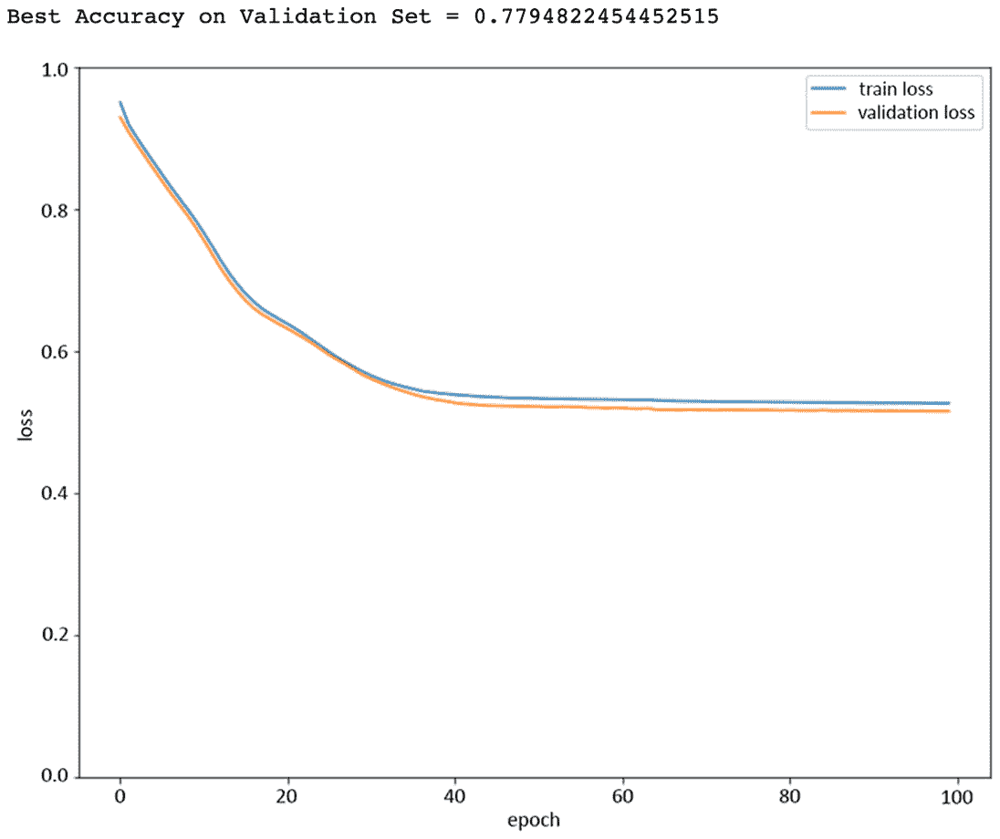

    图 5.18：带有 L1 权重正则化（lambda=0.005）的模型在训练过程中训练误差和验证误差的图示

    看起来 `lambda=0.005` 的 `L1 权重正则化` 在防止模型过拟合的同时，获得了更好的测试误差，因为 `lambda=0.01` 的值过于严格，导致模型无法学习训练数据的潜在函数。

1.  向模型的隐藏层添加 `L1` 和 `L2 正则化器`，其中 `L1` 为 `lambda=0.005`，`L2` 为 `lambda = 0.005`。然后，重复 *步骤 4* 来绘制训练误差和验证误差：

    ```py
    """
    set up a seed for random number generator so the result will be reproducible
    """
    np.random.seed(seed)
    random.set_seed(seed)
    """
    define the keras model with l1_l2 regularization with l1_lambda = 0.005 and l2_lambda = 0.005
    """
    from keras.regularizers import l1_l2
    l1_param = 0.005
    l2_param = 0.005
    model_7 = Sequential()
    model_7.add(Dense(10, input_dim=X_train.shape[1], \
                activation='relu', \
                kernel_regularizer=l1_l2(l1=l1_param, l2=l2_param)))
    model_7.add(Dense(6, activation='relu', \
                      kernel_regularizer=l1_l2(l1=l1_param, \
                                               l2=l2_param)))
    model_7.add(Dense(4, activation='relu', \
                      kernel_regularizer=l1_l2(l1=l1_param, \
                                               l2=l2_param)))
    model_7.add(Dense(1, activation='sigmoid'))
    model_7.compile(loss='binary_crossentropy', optimizer='sgd', \
                    metrics=['accuracy'])
    # train the model using training set while evaluating on test set
    history=model_7.fit(X_train, y_train, batch_size = 20, \
                        epochs = 100, validation_data=(X_test, y_test), \
                        verbose=0, shuffle=True)

    # plot training error and test error
    matplotlib.rcParams['figure.figsize'] = (10.0, 8.0)
    plt.plot(history.history['loss'])
    plt.plot(history.history['val_loss'])
    plt.ylim(0,1)
    plt.ylabel('loss')
    plt.xlabel('epoch')
    plt.legend(['train loss', 'validation loss'], loc='upper right')
    # print the best accuracy reached on the test set
    print("Best Accuracy on Validation Set =", \
           max(history.history['val_accuracy']))
    ```

    以下是预期的输出：

    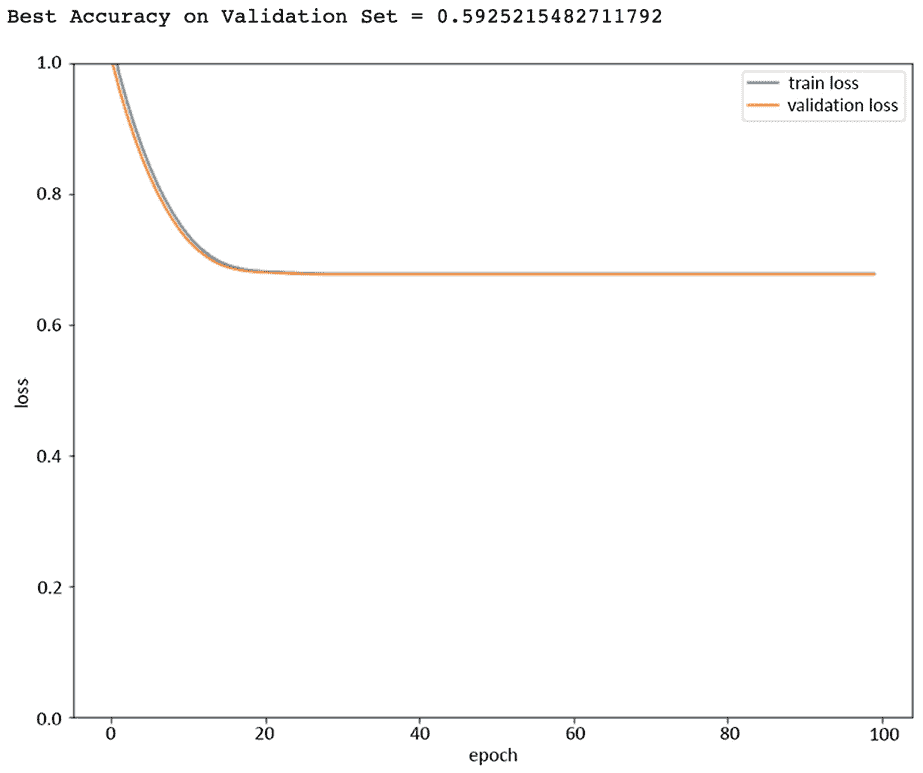

图 5.19：带有 L1 lambda 等于 0.005 和 L2 lambda 等于 0.005 的模型在训练过程中训练误差和验证误差的图示

尽管`L1`和`L2 正则化`成功防止了模型的过拟合，但模型的方差非常低。然而，验证数据上的准确率并不像没有正则化训练的模型，或者使用`L2 正则化` `lambda=0.005`或`L1 正则化` `lambda=0.005`参数单独训练的模型那样高。

注意

要访问此特定部分的源代码，请参考[`packt.live/31BUf34`](https://packt.live/31BUf34)。

你也可以在[`packt.live/38n291s`](https://packt.live/38n291s)上在线运行这个示例。

## 活动 5.02：在交通量数据集上使用 dropout 正则化

在这个活动中，你将从*活动 4.03*，*使用交叉验证对交通量数据集进行模型选择*，*第四章*，*使用 Keras 包装器进行交叉验证评估模型*开始。你将使用训练集/测试集方法来训练和评估模型，绘制训练误差和泛化误差的趋势，并观察模型对数据示例的过拟合情况。然后，你将尝试通过使用 dropout 正则化来解决过拟合问题，从而提高模型的性能。特别地，你将尝试找出应该在模型的哪些层添加 dropout 正则化，以及什么`rate`值能够最大程度地提高该特定模型的性能。按照以下步骤完成这个练习：

1.  使用 pandas 的`read_csv`函数加载数据集，使用`train_test_split`将数据集按`80-20`比例划分为训练集和测试集，并使用`StandardScaler`对输入数据进行标准化：

    ```py
    # Load the dataset
    import pandas as pd
    X = pd.read_csv('../data/traffic_volume_feats.csv')
    y = pd.read_csv('../data/traffic_volume_target.csv')
    """
    Split the dataset into training set and test set with an 80-20 ratio
    """
    from sklearn.model_selection import train_test_split
    seed=1
    X_train, X_test, y_train, y_test = \
    train_test_split(X, y, test_size=0.2, random_state=seed)
    ```

1.  设置一个随机种子，以便模型可以复现。接下来，定义一个包含两个`size 10`的隐藏层的 Keras 顺序模型，每个隐藏层都使用`ReLU 激活`函数。添加一个没有激活函数的输出层，并使用给定的超参数编译模型：

    ```py
    """
    define a seed for random number generator so the result will be reproducible
    """
    import numpy as np
    from tensorflow import random
    np.random.seed(seed)
    random.set_seed(seed)
    from keras.models import Sequential
    from keras.layers import Dense
    # create model
    model_1 = Sequential()
    model_1.add(Dense(10, input_dim=X_train.shape[1], \
                      activation='relu'))
    model_1.add(Dense(10, activation='relu'))
    model_1.add(Dense(1))
    # Compile model
    model_1.compile(loss='mean_squared_error', optimizer='rmsprop')
    ```

1.  使用给定的超参数训练模型：

    ```py
    # train the model using training set while evaluating on test set
    history=model_1.fit(X_train, y_train, batch_size = 50, \
                        epochs = 200, validation_data=(X_test, y_test), \
                        verbose=0) 
    ```

1.  绘制`训练误差`和`测试误差`的趋势。打印在训练集和验证集上达到的最佳准确率：

    ```py
    import matplotlib.pyplot as plt 
    import matplotlib
    %matplotlib inline 
    matplotlib.rcParams['figure.figsize'] = (10.0, 8.0) 
    # plot training error and test error plots 
    plt.plot(history.history['loss'])
    plt.plot(history.history['val_loss'])
    plt.ylim((0, 25000))
    plt.ylabel('loss')
    plt.xlabel('epoch')
    plt.legend(['train loss', 'validation loss'], loc='upper right')
    # print the best accuracy reached on the test set
    print("Lowest error on training set = ", \
          min(history.history['loss']))
    print("Lowest error on validation set = ", \
          min(history.history['val_loss']))
    ```

    以下是预期的输出：

    ```py
    Lowest error on training set =  24.673954981565476
    Lowest error on validation set =  25.11553382873535
    ```

    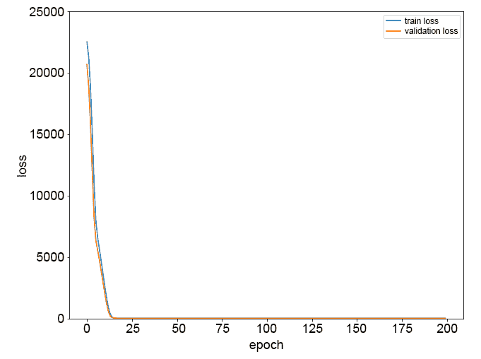

    图 5.20：没有正则化的模型在训练过程中训练误差和验证误差的图表

    在训练误差和验证误差值中，训练误差和验证误差之间的差距非常小，这表明模型的方差很低，这是一个好兆头。

1.  重新定义模型，创建相同的模型架构。然而，这一次，在模型的第一个隐藏层添加`rate=0.1`的 dropout 正则化。重复*步骤 3*，使用训练数据训练模型，并重复*步骤 4*绘制训练误差和验证误差的趋势。然后，打印在验证集上达到的最佳准确率：

    ```py
    """
    define a seed for random number generator so the result will be reproducible
    """
    np.random.seed(seed)
    random.set_seed(seed)
    from keras.layers import Dropout
    # create model
    model_2 = Sequential()
    model_2.add(Dense(10, input_dim=X_train.shape[1], \
                      activation='relu'))
    model_2.add(Dropout(0.1))
    model_2.add(Dense(10, activation='relu'))
    model_2.add(Dense(1))
    # Compile model
    model_2.compile(loss='mean_squared_error', \
                    optimizer='rmsprop')
    # train the model using training set while evaluating on test set
    history=model_2.fit(X_train, y_train, batch_size = 50, \
                        epochs = 200, validation_data=(X_test, y_test), \
                        verbose=0, shuffle=False)
    matplotlib.rcParams['figure.figsize'] = (10.0, 8.0)
    plt.plot(history.history['loss'])
    plt.plot(history.history['val_loss'])
    plt.ylim((0, 25000))
    plt.ylabel('loss')
    plt.xlabel('epoch')
    plt.legend(['train loss', 'validation loss'], loc='upper right')
    # print the best accuracy reached on the test set
    print("Lowest error on training set = ", \
          min(history.history['loss']))
    print("Lowest error on validation set = ", \
          min(history.history['val_loss']))
    ```

    以下是预期输出：

    ```py
    Lowest error on training set =  407.8203821182251
    Lowest error on validation set =  54.58488750457764
    ```

    ![图 5.21：在使用 dropout 正则化（第一层 rate=0.1）训练模型时，训练误差和验证误差的曲线图]

    ](img/B15777_05_21.jpg)

    图 5.21：在使用 dropout 正则化（第一层 rate=0.1）训练模型时，训练误差和验证误差的曲线图

    训练误差和验证误差之间存在小的差距；然而，验证误差低于训练误差，表明模型没有对训练数据发生过拟合。

1.  重复上一步，这次为模型的两个隐藏层添加`rate=0.1`的 dropout 正则化。重复*步骤 3*，在训练数据上训练模型，并重复*步骤 4*，绘制训练误差和验证误差的趋势。然后，打印在验证集上达到的最佳准确率：

    ```py
    """
    define a seed for random number generator so the result will be reproducible
    """
    np.random.seed(seed)
    random.set_seed(seed)
    # create model
    model_3 = Sequential()
    model_3.add(Dense(10, input_dim=X_train.shape[1], \
                      activation='relu'))
    model_3.add(Dropout(0.1))
    model_3.add(Dense(10, activation='relu'))
    model_3.add(Dropout(0.1))
    model_3.add(Dense(1))
    # Compile model
    model_3.compile(loss='mean_squared_error', \
                    optimizer='rmsprop')
    # train the model using training set while evaluating on test set
    history=model_3.fit(X_train, y_train, batch_size = 50, \
                        epochs = 200, validation_data=(X_test, y_test), \
                        verbose=0, shuffle=False)
    matplotlib.rcParams['figure.figsize'] = (10.0, 8.0)
    plt.plot(history.history['loss'])
    plt.plot(history.history['val_loss'])
    plt.ylim((0, 25000))
    plt.ylabel('loss')
    plt.xlabel('epoch')
    plt.legend(['train loss', 'validation loss'], loc='upper right')
    # print the best accuracy reached on the test set
    print("Lowest error on training set = ", \
          min(history.history['loss']))
    print("Lowest error on validation set = ", \
          min(history.history['val_loss']))
    ```

    以下是预期输出：

    ```py
    Lowest error on training set =  475.9299939632416
    Lowest error on validation set =  61.646054649353026
    ```

    ![图 5.22：在使用 dropout 正则化（rate=0.1）训练模型时，训练误差和验证误差的曲线图]

    使用 dropout 正则化（rate=0.1）在两个层上的模型

    ](img/B15777_05_22.jpg)

    图 5.22：在使用 dropout 正则化（rate=0.1）训练模型时，训练误差和验证误差的曲线图

    这里训练误差和验证误差之间的差距略有增大，主要是由于在模型第二个隐藏层上增加了正则化，导致训练误差的增加。

1.  重复上一步，这次为模型的第一层添加`rate=0.2`的 dropout 正则化，为第二层添加`rate=0.1`的 dropout 正则化。重复*步骤 3*，在训练数据上训练模型，并重复*步骤 4*，绘制训练误差和验证误差的趋势。然后，打印在验证集上达到的最佳准确率：

    ```py
    """
    define a seed for random number generator so the result will be reproducible
    """
    np.random.seed(seed)
    random.set_seed(seed)
    # create model
    model_4 = Sequential()
    model_4.add(Dense(10, input_dim=X_train.shape[1], \
                      activation='relu'))
    model_4.add(Dropout(0.2))
    model_4.add(Dense(10, activation='relu'))
    model_4.add(Dropout(0.1))
    model_4.add(Dense(1))
    # Compile model
    model_4.compile(loss='mean_squared_error', optimizer='rmsprop')
    # train the model using training set while evaluating on test set
    history=model_4.fit(X_train, y_train, batch_size = 50, epochs = 200, \
                        validation_data=(X_test, y_test), verbose=0)
    matplotlib.rcParams['figure.figsize'] = (10.0, 8.0)
    plt.plot(history.history['loss'])
    plt.plot(history.history['val_loss'])
    plt.ylim((0, 25000))
    plt.ylabel('loss')
    plt.xlabel('epoch')
    plt.legend(['train loss', 'validation loss'], loc='upper right')
    # print the best accuracy reached on the test set
    print("Lowest error on training set = ", \
          min(history.history['loss']))
    print("Lowest error on validation set = ", \
          min(history.history['val_loss']))
    ```

    以下是预期输出：

    ```py
    Lowest error on training set =  935.1562484741211
    Lowest error on validation set =  132.39965686798095
    ```

    ![图 5.23：在使用 dropout 正则化（第一层 rate=0.2，第二层 rate=0.1）训练模型时，训练误差和验证误差的曲线图]

    ](img/B15777_05_23.jpg)

图 5.23：在使用 dropout 正则化（第一层 rate=0.2，第二层 rate=0.1）训练模型时，训练误差和验证误差的曲线图

由于正则化的增加，训练误差和验证误差之间的差距略有增大。在这种情况下，原始模型没有发生过拟合。因此，正则化增加了训练和验证数据集上的误差率。

注意

若要查看此特定部分的源代码，请参考[`packt.live/38mtDo7`](https://packt.live/38mtDo7)。

你也可以在[`packt.live/31Isdmu`](https://packt.live/31Isdmu)上在线运行这个示例。

## 活动 5.03：Avila 模式分类器的超参数调整

在本次活动中，你将构建一个类似于前几次活动中的 Keras 模型，但这次你将向模型中添加正则化方法。然后，你将使用 scikit-learn 优化器对模型的超参数进行调优，包括正则化器的超参数。按照以下步骤完成本次活动：

1.  加载数据集并导入库：

    ```py
    # Load The dataset
    import pandas as pd
    X = pd.read_csv('../data/avila-tr_feats.csv')
    y = pd.read_csv('../data/avila-tr_target.csv')
    ```

1.  定义一个函数，返回一个 Keras 模型，该模型具有三层隐藏层，第一层大小为`10`，第二层大小为`6`，第三层大小为`4`，并在每个隐藏层上应用`L2 权重正则化`和`ReLU 激活`函数。使用给定的参数编译模型并返回模型：

    ```py
    # Create the function that returns the keras model
    from keras.models import Sequential
    from keras.layers import Dense
    from keras.regularizers import l2
    def build_model(lambda_parameter):
        model = Sequential()
        model.add(Dense(10, input_dim=X.shape[1], \
                        activation='relu', \
                        kernel_regularizer=l2(lambda_parameter)))
        model.add(Dense(6, activation='relu', \
                        kernel_regularizer=l2(lambda_parameter)))
        model.add(Dense(4, activation='relu', \
                        kernel_regularizer=l2(lambda_parameter)))
        model.add(Dense(1, activation='sigmoid'))
        model.compile(loss='binary_crossentropy', \
                      optimizer='sgd', metrics=['accuracy'])
        return model
    ```

1.  设置随机种子，使用 scikit-learn 封装器对我们在上一步中创建的模型进行封装，并定义要扫描的超参数。最后，使用超参数网格对模型执行`GridSearchCV()`并拟合模型：

    ```py
    from keras.wrappers.scikit_learn import KerasClassifier
    from sklearn.model_selection import GridSearchCV
    """
    define a seed for random number generator so the result will be reproducible
    """
    import numpy as np
    from tensorflow import random
    seed = 1
    np.random.seed(seed)
    random.set_seed(seed)
    # create the Keras wrapper with scikit learn
    model = KerasClassifier(build_fn=build_model, verbose=0, \
                            shuffle=False)
    # define all the possible values for each hyperparameter
    lambda_parameter = [0.01, 0.5, 1]
    epochs = [50, 100]
    batch_size = [20]
    """
    create the dictionary containing all possible values of hyperparameters
    """
    param_grid = dict(lambda_parameter=lambda_parameter, \
                      epochs=epochs, batch_size=batch_size)
    # perform 5-fold cross-validation for ??????? store the results
    grid_seach = GridSearchCV(estimator=model, \
                              param_grid=param_grid, cv=5)
    results_1 = grid_seach.fit(X, y)
    ```

1.  打印在拟合过程中我们创建的变量中存储的最佳交叉验证分数的结果。遍历所有参数并打印各折的准确率均值、准确率标准差以及参数本身：

    ```py
    print("Best cross-validation score =", results_1.best_score_)
    print("Parameters for Best cross-validation score=", \
          results_1.best_params_)
    # print the results for all evaluated hyperparameter combinations
    accuracy_means = results_1.cv_results_['mean_test_score']
    accuracy_stds = results_1.cv_results_['std_test_score']
    parameters = results_1.cv_results_['params']
    for p in range(len(parameters)):
        print("Accuracy %f (std %f) for params %r" % \
              (accuracy_means[p], accuracy_stds[p], parameters[p]))
    ```

    以下是预期的输出：

    ```py
    Best cross-validation score = 0.7673058390617371
    Parameters for Best cross-validation score= {'batch_size': 20, 
    'epochs': 100, 'lambda_parameter': 0.01}
    Accuracy 0.764621 (std 0.004330) for params {'batch_size': 20, 
    'epochs': 50, 'lambda_parameter': 0.01}
    Accuracy 0.589070 (std 0.008244) for params {'batch_size': 20, 
    'epochs': 50, 'lambda_parameter': 0.5}
    Accuracy 0.589070 (std 0.008244) for params {'batch_size': 20, 
    'epochs': 50, 'lambda_parameter': 1}
    Accuracy 0.767306 (std 0.015872) for params {'batch_size': 20, 
    'epochs': 100, 'lambda_parameter': 0.01}
    Accuracy 0.589070 (std 0.008244) for params {'batch_size': 20, 
    'epochs': 100, 'lambda_parameter': 0.5}
    Accuracy 0.589070 (std 0.008244) for params {'batch_size': 20, 
    'epochs': 100, 'lambda_parameter': 1}
    ```

1.  重复*步骤 3*，使用`GridSearchCV()`、`lambda_parameter = [0.001, 0.01, 0.05, 0.1]`、`batch_size = [20]`和`epochs = [100]`。使用`5 折交叉验证`对模型进行拟合，并打印整个网格的结果：

    ```py
    """
    define a seed for random number generator so the result will be reproducible
    """
    np.random.seed(seed)
    random.set_seed(seed)
    # create the Keras wrapper with scikit learn
    model = KerasClassifier(build_fn=build_model, verbose=0, shuffle=False)
    # define all the possible values for each hyperparameter
    lambda_parameter = [0.001, 0.01, 0.05, 0.1]
    epochs = [100]
    batch_size = [20]
    """
    create the dictionary containing all possible values of hyperparameters
    """
    param_grid = dict(lambda_parameter=lambda_parameter, \
                      epochs=epochs, batch_size=batch_size)
    """
    search the grid, perform 5-fold cross-validation for each possible combination, store the results
    """
    grid_seach = GridSearchCV(estimator=model, \
                              param_grid=param_grid, cv=5)
    results_2 = grid_seach.fit(X, y)
    # print the results for best cross-validation score
    print("Best cross-validation score =", results_2.best_score_)
    print("Parameters for Best cross-validation score =", \
          results_2.best_params_)
    # print the results for the entire grid
    accuracy_means = results_2.cv_results_['mean_test_score']
    accuracy_stds = results_2.cv_results_['std_test_score']
    parameters = results_2.cv_results_['params']
    for p in range(len(parameters)):
        print("Accuracy %f (std %f) for params %r" % \
              (accuracy_means[p], accuracy_stds[p], parameters[p]))
    ```

    以下是预期的输出：

    ```py
    Best cross-validation score = 0.786385428905487
    Parameters for Best cross-validation score = {'batch_size': 20, 
    'epochs': 100, 'lambda_parameter': 0.001}
    Accuracy 0.786385 (std 0.010177) for params {'batch_size': 20, 
    'epochs': 100, 'lambda_parameter': 0.001}
    Accuracy 0.693960 (std 0.084994) for params {'batch_size': 20, 
    'epochs': 100, 'lambda_parameter': 0.01}
    Accuracy 0.589070 (std 0.008244) for params {'batch_size': 20, 
    'epochs': 100, 'lambda_parameter': 0.05}
    Accuracy 0.589070 (std 0.008244) for params {'batch_size': 20, 
    'epochs': 100, 'lambda_parameter': 0.1}
    ```

1.  重新定义一个函数，返回一个 Keras 模型，该模型具有三层隐藏层，第一层大小为`10`，第二层大小为`6`，第三层大小为`4`，并在每个隐藏层上应用`dropout 正则化`和`ReLU 激活`函数。使用给定的参数编译模型并从函数中返回：

    ```py
    # Create the function that returns the keras model
    from keras.layers import Dropout
    def build_model(rate):
        model = Sequential()
        model.add(Dense(10, input_dim=X.shape[1], activation='relu'))
        model.add(Dropout(rate))
        model.add(Dense(6, activation='relu'))
        model.add(Dropout(rate))
        model.add(Dense(4, activation='relu'))
        model.add(Dropout(rate))
        model.add(Dense(1, activation='sigmoid'))
        model.compile(loss='binary_crossentropy', \
                      optimizer='sgd', metrics=['accuracy'])
        return model
    ```

1.  使用`rate = [0, 0.1, 0.2]`和`epochs = [50, 100]`，对模型进行`GridSearchCV()`调优。使用`5 折交叉验证`对模型进行拟合，并打印整个网格的结果：

    ```py
    """
    define a seed for random number generator so the result will be reproducible
    """
    np.random.seed(seed)
    random.set_seed(seed)
    # create the Keras wrapper with scikit learn
    model = KerasClassifier(build_fn=build_model, verbose=0,shuffle=False)
    # define all the possible values for each hyperparameter
    rate = [0, 0.1, 0.2]
    epochs = [50, 100]
    batch_size = [20]
    """
    create the dictionary containing all possible values of hyperparameters
    """
    param_grid = dict(rate=rate, epochs=epochs, batch_size=batch_size)
    """
    perform 5-fold cross-validation for 10 randomly selected combinations, store the results
    """
    grid_seach = GridSearchCV(estimator=model, \
                              param_grid=param_grid, cv=5)
    results_3 = grid_seach.fit(X, y)
    # print the results for best cross-validation score
    print("Best cross-validation score =", results_3.best_score_)
    print("Parameters for Best cross-validation score =", \
          results_3.best_params_)
    # print the results for the entire grid
    accuracy_means = results_3.cv_results_['mean_test_score']
    accuracy_stds = results_3.cv_results_['std_test_score']
    parameters = results_3.cv_results_['params']
    for p in range(len(parameters)):
        print("Accuracy %f (std %f) for params %r" % \
              (accuracy_means[p], accuracy_stds[p], parameters[p]))
    ```

    以下是预期的输出：

    ```py
    Best cross-validation score= 0.7918504476547241
    Parameters for Best cross-validation score= {'batch_size': 20, 
    'epochs': 100, 'rate': 0}
    Accuracy 0.786769 (std 0.008255) for params {'batch_size': 20, 
    'epochs': 50, 'rate': 0}
    Accuracy 0.764717 (std 0.007691) for params {'batch_size': 20, 
    'epochs': 50, 'rate': 0.1}
    Accuracy 0.752637 (std 0.013546) for params {'batch_size': 20, 
    'epochs': 50, 'rate': 0.2}
    Accuracy 0.791850 (std 0.008519) for params {'batch_size': 20, 
    'epochs': 100, 'rate': 0}
    Accuracy 0.779291 (std 0.009504) for params {'batch_size': 20, 
    'epochs': 100, 'rate': 0.1}
    Accuracy 0.767306 (std 0.005773) for params {'batch_size': 20, 
    'epochs': 100, 'rate': 0.2}
    ```

1.  重复*步骤 5*，使用`rate = [0.0, 0.05, 0.1]`和`epochs = [100]`。使用`5 折交叉验证`对模型进行拟合，并打印整个网格的结果：

    ```py
    """
    define a seed for random number generator so the result will be reproducible
    """
    np.random.seed(seed)
    random.set_seed(seed)
    # create the Keras wrapper with scikit learn
    model = KerasClassifier(build_fn=build_model, verbose=0, shuffle=False)
    # define all the possible values for each hyperparameter
    rate = [0.0, 0.05, 0.1]
    epochs = [100]
    batch_size = [20]
    """
    create the dictionary containing all possible values of hyperparameters
    """
    param_grid = dict(rate=rate, epochs=epochs, batch_size=batch_size)
    """
    perform 5-fold cross-validation for 10 randomly selected combinations, store the results
    """
    grid_seach = GridSearchCV(estimator=model, \
                              param_grid=param_grid, cv=5)
    results_4 = grid_seach.fit(X, y)
    # print the results for best cross-validation score
    print("Best cross-validation score =", results_4.best_score_)
    print("Parameters for Best cross-validation score =", \
          results_4.best_params_)
    # print the results for the entire grid
    accuracy_means = results_4.cv_results_['mean_test_score']
    accuracy_stds = results_4.cv_results_['std_test_score']
    parameters = results_4.cv_results_['params']
    for p in range(len(parameters)):
        print("Accuracy %f (std %f) for params %r" % \
              (accuracy_means[p], accuracy_stds[p], parameters[p]))
    ```

    以下是预期的输出：

    ```py
    Best cross-validation score= 0.7862895488739013
    Parameters for Best cross-validation score= {'batch_size': 20, 
    'epochs': 100, 'rate': 0.0}
    Accuracy 0.786290 (std 0.013557) for params {'batch_size': 20, 
    'epochs': 100, 'rate': 0.0}
    Accuracy 0.786098 (std 0.005184) for params {'batch_size': 20, 
    'epochs': 100, 'rate': 0.05}
    Accuracy 0.772004 (std 0.013733) for params {'batch_size': 20, 
    'epochs': 100, 'rate': 0.1}
    ```

    注意

    要访问此特定部分的源代码，请参考[`packt.live/2D7HN0L`](https://packt.live/2D7HN0L)。

    本节目前没有在线互动示例，需要在本地运行。

# 6\. 模型评估

## 活动 6.01：当我们改变训练/测试数据集的拆分时，计算神经网络的准确率和空准确率

在这个活动中，我们将看到`null accuracy`和`accuracy`会受到`train`/`test`划分的影响。为实现这一点，需要修改定义训练/测试划分的代码部分。我们将使用在*练习 6.02*中使用的相同数据集，即*使用 Scania 卡车数据计算准确率和零准确率*。按照以下步骤完成此活动：

1.  导入所需的库。使用 pandas 的`read_csv`函数加载数据集，并查看数据集的前`五`行：

    ```py
    # Import the libraries
    import numpy as np
    import pandas as pd
    # Load the Data
    X = pd.read_csv("../data/aps_failure_training_feats.csv")
    y = pd.read_csv("../data/aps_failure_training_target.csv")
    # Use the head function to get a glimpse data
    X.head()
    ```

    下表显示了前面代码的输出：

    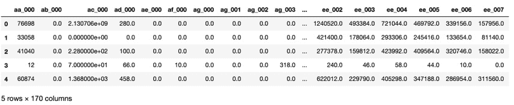

    图 6.13：数据集的初始五行

1.  将`test_size`和`random_state`从`0.20`和`42`分别更改为`0.3`和`13`：

    ```py
    # Split the data into training and testing sets
    from sklearn.model_selection import train_test_split
    seed = 13
    X_train, X_test, y_train, y_test = \
    train_test_split(X, y, test_size=0.3, random_state=seed)
    ```

    注意

    如果使用不同的`random_state`，可能会得到不同的`train`/`test`划分，这可能会导致稍微不同的最终结果。

1.  使用`StandardScaler`函数对数据进行缩放，并使用缩放器对测试数据进行缩放。将两者转换为 pandas DataFrame：

    ```py
    # Initialize StandardScaler
    from sklearn.preprocessing import StandardScaler
    sc = StandardScaler()
    # Transform the training data
    X_train = sc.fit_transform(X_train)
    X_train = pd.DataFrame(X_train, columns=X_test.columns)
    # Transform the testing data
    X_test = sc.transform(X_test)
    X_test = pd.DataFrame(X_test, columns = X_train.columns)
    ```

    注意

    `sc.fit_transform()`函数转换数据，同时数据也被转换为`NumPy`数组。我们可能稍后需要将数据作为 DataFrame 对象进行分析，因此使用`pd.DataFrame()`函数将数据重新转换为 DataFrame。

1.  导入构建神经网络架构所需的库：

    ```py
    # Import the relevant Keras libraries
    from keras.models import Sequential
    from keras.layers import Dense
    from keras.layers import Dropout
    from tensorflow import random
    ```

1.  启动`Sequential`类：

    ```py
    # Initiate the Model with Sequential Class
    np.random.seed(seed)
    random.set_seed(seed)
    model = Sequential()
    ```

1.  向网络中添加五个`Dense`层，并使用`Dropout`。设置第一个隐藏层的大小为`64`，丢弃率为`0.5`；第二个隐藏层的大小为`32`，丢弃率为`0.4`；第三个隐藏层的大小为`16`，丢弃率为`0.3`；第四个隐藏层的大小为`8`，丢弃率为`0.2`；最后一个隐藏层的大小为`4`，丢弃率为`0.1`。将所有激活函数设置为`ReLU`：

    ```py
    # Add the hidden dense layers and with dropout Layer
    model.add(Dense(units=64, activation='relu', \
                    kernel_initializer='uniform', \
                    input_dim=X_train.shape[1]))
    model.add(Dropout(rate=0.5))
    model.add(Dense(units=32, activation='relu', \
                    kernel_initializer='uniform', \
                    input_dim=X_train.shape[1]))
    model.add(Dropout(rate=0.4))
    model.add(Dense(units=16, activation='relu', \
                    kernel_initializer='uniform', \
                    input_dim=X_train.shape[1]))
    model.add(Dropout(rate=0.3))
    model.add(Dense(units=8, activation='relu', \
                    kernel_initializer='uniform', \
                    input_dim=X_train.shape[1]))
    model.add(Dropout(rate=0.2))
    model.add(Dense(units=4, activation='relu', \
                    kernel_initializer='uniform'))
    model.add(Dropout(rate=0.1))
    ```

1.  添加一个输出`Dense`层，并使用`sigmoid`激活函数：

    ```py
    # Add Output Dense Layer
    model.add(Dense(units=1, activation='sigmoid', \
                    kernel_initializer='uniform'))
    ```

    注意

    由于输出是二分类的，我们使用`sigmoid`函数。如果输出是多类的（即超过两个类别），则应使用`softmax`函数。

1.  编译网络并拟合模型。这里使用的度量标准是`accuracy`：

    ```py
    # Compile the Model
    model.compile(optimizer='adam', loss='binary_crossentropy', \
                  metrics=['accuracy'])
    ```

    注意

    在我们这例中，度量标准是`accuracy`，已在前面的代码中定义。

1.  使用`100`轮训练、批量大小为`20`、验证集划分比例为`0.2`来训练模型：

    ```py
    # Fit the Model
    model.fit(X_train, y_train, epochs=100, batch_size=20, \
              verbose=1, validation_split=0.2, shuffle=False)
    ```

1.  在测试数据集上评估模型，并打印出`loss`和`accuracy`的值：

    ```py
    test_loss, test_acc = model.evaluate(X_test, y_test)
    print(f'The loss on the test set is {test_loss:.4f} and \
    the accuracy is {test_acc*100:.4f}%')
    ```

    前面的代码产生以下输出：

    ```py
    18000/18000 [==============================] - 0s 19us/step
    The loss on the test set is 0.0766 and the accuracy is 98.9833%
    ```

    模型返回的准确率为`98.9833%`。但这足够好吗？我们只能通过与零准确率进行比较来回答这个问题。

1.  现在，计算空准确率。`空准确率`可以使用`pandas`库的`value_count`函数计算，之前在本章的*练习 6.01*中，*计算太平洋飓风数据集上的空准确率*时，我们已经用过这个函数：

    ```py
    # Use the value_count function to calculate distinct class values
    y_test['class'].value_counts()
    ```

    上述代码将产生以下输出：

    ```py
    0    17700
    1      300
    Name: class, dtype: int64
    ```

1.  计算`空准确率`：

    ```py
    # Calculate the null accuracy
    y_test['class'].value_counts(normalize=True).loc[0]
    ```

    上述代码将产生以下输出：

    ```py
    0.9833333333333333
    ```

    注意

    要访问此特定部分的源代码，请参阅[`packt.live/3eY7y1E`](https://packt.live/3eY7y1E)。

    你也可以在[`packt.live/2BzBO4n`](https://packt.live/2BzBO4n)在线运行此示例。

## 活动 6.02：计算 ROC 曲线和 AUC 得分

`ROC 曲线`和`AUC 得分`是一种有效的方式，能够轻松评估二分类器的性能。在这个活动中，我们将绘制`ROC 曲线`并计算模型的`AUC 得分`。我们将使用相同的数据集并训练与*练习 6.03*中相同的模型，*基于混淆矩阵推导和计算指标*。继续使用相同的 APS 故障数据，绘制`ROC 曲线`并计算模型的`AUC 得分`。按照以下步骤完成这个活动：

1.  导入必要的库，并使用 pandas 的`read_csv`函数加载数据：

    ```py
    # Import the libraries
    import numpy as np
    import pandas as pd
    # Load the Data
    X = pd.read_csv("../data/aps_failure_training_feats.csv")
    y = pd.read_csv("../data/aps_failure_training_target.csv")
    ```

1.  使用`train_test_split`函数将数据集分割为训练集和测试集：

    ```py
    from sklearn.model_selection import train_test_split
    seed = 42
    X_train, X_test, y_train, y_test = \
    train_test_split(X, y, test_size=0.20, random_state=seed)
    ```

1.  使用`StandardScaler`函数对特征数据进行缩放，使其具有`0`的`均值`和`1`的`标准差`。对`训练数据`进行拟合，并将其应用于`测试数据`：

    ```py
    from sklearn.preprocessing import StandardScaler
    sc = StandardScaler()
    # Transform the training data
    X_train = sc.fit_transform(X_train)
    X_train = pd.DataFrame(X_train,columns=X_test.columns)
    # Transform the testing data
    X_test = sc.transform(X_test)
    X_test = pd.DataFrame(X_test,columns=X_train.columns)
    ```

1.  导入创建模型所需的 Keras 库。实例化一个`Sequential`类的 Keras 模型，并向模型中添加五个隐藏层，包括每层的丢弃层。第一个隐藏层应具有`64`的大小和`0.5`的丢弃率。第二个隐藏层应具有`32`的大小和`0.4`的丢弃率。第三个隐藏层应具有`16`的大小和`0.3`的丢弃率。第四个隐藏层应具有`8`的大小和`0.2`的丢弃率。最后一个隐藏层应具有`4`的大小和`0.1`的丢弃率。所有隐藏层应具有`ReLU 激活`函数，并将`kernel_initializer = 'uniform'`。在模型中添加一个最终的输出层，并使用 sigmoid 激活函数。通过计算训练过程中准确率指标来编译模型：

    ```py
    # Import the relevant Keras libraries
    from keras.models import Sequential
    from keras.layers import Dense
    from keras.layers import Dropout
    from tensorflow import random
    np.random.seed(seed)
    random.set_seed(seed)
    model = Sequential()
    # Add the hidden dense layers with dropout Layer
    model.add(Dense(units=64, activation='relu', \
                    kernel_initializer='uniform', \
                    input_dim=X_train.shape[1]))
    model.add(Dropout(rate=0.5))
    model.add(Dense(units=32, activation='relu', \
                    kernel_initializer='uniform'))
    model.add(Dropout(rate=0.4))
    model.add(Dense(units=16, activation='relu', \
                    kernel_initializer='uniform'))
    model.add(Dropout(rate=0.3))
    model.add(Dense(units=8, activation='relu', \
              kernel_initializer='uniform'))
    model.add(Dropout(rate=0.2))
    model.add(Dense(units=4, activation='relu', \
                    kernel_initializer='uniform'))
    model.add(Dropout(rate=0.1))
    # Add Output Dense Layer
    model.add(Dense(units=1, activation='sigmoid', \
                    kernel_initializer='uniform'))
    # Compile the Model
    model.compile(optimizer='adam', loss='binary_crossentropy', \
                  metrics=['accuracy'])
    ```

1.  使用`100`个训练周期、`batch_size=20`和`validation_split=0.2`将模型拟合到训练数据：

    ```py
    model.fit(X_train, y_train, epochs=100, batch_size=20, \
              verbose=1, validation_split=0.2, shuffle=False)
    ```

1.  一旦模型完成了对训练数据的拟合，创建一个变量，该变量是模型对测试数据的预测结果，使用模型的`predict_proba`方法：

    ```py
    y_pred_prob = model.predict_proba(X_test)
    ```

1.  从 scikit-learn 导入`roc_curve`并运行以下代码：

    ```py
    from sklearn.metrics import roc_curve
    fpr, tpr, thresholds = roc_curve(y_test, y_pred_prob)
    ```

    `fpr` = 假阳性率（1 - 特异性）

    `tpr` = 真阳性率（灵敏度）

    `thresholds` = `y_pred_prob`的阈值

1.  运行以下代码使用`matplotlib.pyplot`绘制`ROC 曲线`：

    ```py
    import matplotlib.pyplot as plt
    plt.plot(fpr, tpr)
    plt.title("ROC Curve for APS Failure")
    plt.xlabel("False Positive rate (1-Specificity)")
    plt.ylabel("True Positive rate (Sensitivity)")
    plt.grid(True)
    plt.show()
    ```

    以下图表显示了前述代码的输出：

    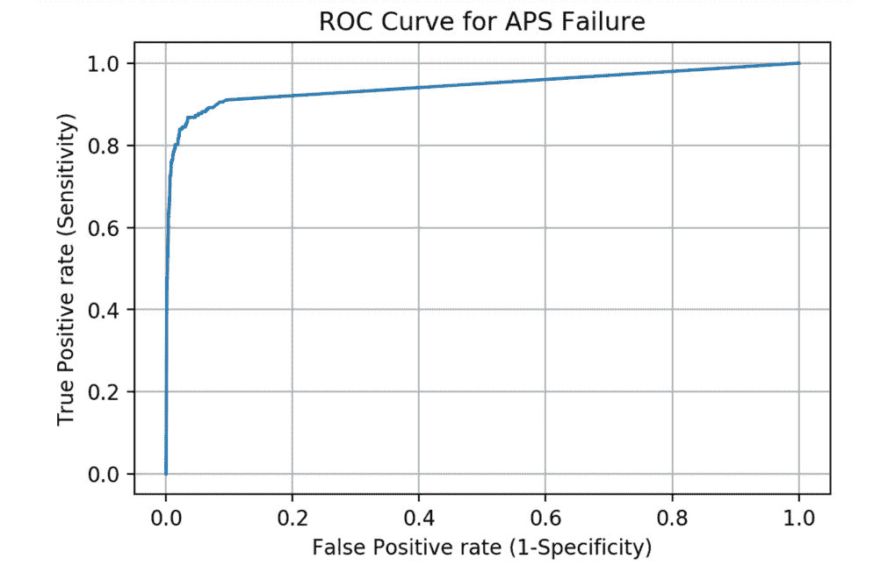

    ](img/B15777_06_14.jpg)

    图 6.14：APS 失败数据集的 ROC 曲线

1.  使用`roc_auc_score`函数计算 AUC 分数：

    ```py
    from sklearn.metrics import roc_auc_score
    roc_auc_score(y_test,y_pred_prob)
    ```

    以下是前述代码的输出：

    ```py
    0.944787151628455
    ```

    `94.4479%`的 AUC 分数表明我们的模型表现优秀，符合上面列出的普遍可接受的`AUC 分数`标准。

    注意

    若要访问此特定部分的源代码，请参考[`packt.live/2NUOgyh`](https://packt.live/2NUOgyh)。

    你也可以在[`packt.live/2As33NH`](https://packt.live/2As33NH)在线运行此示例。

# 7. 卷积神经网络的计算机视觉

## 活动 7.01：通过多个层和使用 softmax 来修改我们的模型

让我们尝试提高图像分类算法的性能。有很多方法可以提升性能，其中最直接的一种方式就是向模型中添加多个 ANN 层，这将在本活动中讲解。我们还将把激活函数从 sigmoid 更改为 softmax。然后，我们可以将结果与之前练习的结果进行比较。按照以下步骤完成此活动：

1.  导入`numpy`库以及必要的 Keras 库和类：

    ```py
    # Import the Libraries 
    from keras.models import Sequential
    from keras.layers import Conv2D, MaxPool2D, Flatten, Dense
    import numpy as np
    from tensorflow import random
    ```

1.  现在，使用`Sequential`类初始化模型：

    ```py
    # Initiate the classifier
    seed = 1
    np.random.seed(seed)
    random.set_seed(seed)
    classifier=Sequential()
    ```

1.  添加 CNN 的第一层，设置输入形状为`(64, 64, 3)`，即每个图像的维度，并设置激活函数为 ReLU。然后，添加`32`个大小为`(3, 3)`的特征检测器。再添加两层卷积层，每层有`32`个大小为`(3, 3)`的特征检测器，且都使用`ReLU 激活`函数：

    ```py
    classifier.add(Conv2D(32,(3,3),input_shape=(64,64,3),\
                   activation='relu'))
    classifier.add(Conv2D(32,(3,3),activation = 'relu'))
    classifier.add(Conv2D(32,(3,3),activation = 'relu'))
    ```

    `32, (3, 3)`表示有`32`个大小为`3x3`的特征检测器。作为良好的实践，始终从`32`开始；你可以稍后添加`64`或`128`。

1.  现在，添加池化层，图像大小为`2x2`：

    ```py
    classifier.add(MaxPool2D(pool_size=(2,2)))
    ```

1.  通过向`CNN 模型`添加 flatten 层，来展平池化层的输出：

    ```py
    classifier.add(Flatten())
    ```

1.  添加 ANN 的第一层密集层。此处，`128`是节点数量的输出。作为一个良好的实践，`128`是一个不错的起点。`activation`是`relu`。作为一个良好的实践，建议使用 2 的幂：

    ```py
    classifier.add(Dense(units=128,activation='relu')) 
    ```

1.  向 ANN 中添加三层相同大小为`128`的层，并配以`ReLU 激活`函数：

    ```py
    classifier.add(Dense(128,activation='relu'))
    classifier.add(Dense(128,activation='relu'))
    classifier.add(Dense(128,activation='relu'))
    ```

1.  添加 ANN 的输出层。将 sigmoid 函数替换为`softmax`：

    ```py
    classifier.add(Dense(units=1,activation='softmax')) 
    ```

1.  使用`Adam 优化器`编译网络，并在训练过程中计算准确率：

    ```py
    # Compile The network
    classifier.compile(optimizer='adam', loss='binary_crossentropy', \
                       metrics=['accuracy'])
    ```

1.  创建训练和测试数据生成器。通过`1/255`重新缩放训练和测试图像，使所有值都介于`0`和`1`之间。仅为训练数据生成器设置以下参数：`shear_range=0.2`、`zoom_range=0.2`和`horizontal_flip=True`：

    ```py
    from keras.preprocessing.image import ImageDataGenerator
    train_datagen = ImageDataGenerator(rescale = 1./255, \
                                       shear_range = 0.2, \
                                       zoom_range = 0.2, \
                                       horizontal_flip = True)
    test_datagen = ImageDataGenerator(rescale = 1./255)
    ```

1.  从`training set`文件夹创建训练集。`'../dataset/training_set'`是我们存放数据的文件夹。我们的 CNN 模型的图像大小为`64x64`，因此这里也应该传递相同的大小。`batch_size`是每个批次中的图像数量，设置为`32`。`class_mode`设置为`binary`，因为我们正在处理二分类器：

    ```py
    training_set = \
    train_datagen.flow_from_directory('../dataset/training_set', \
                                      target_size = (64, 64), \
                                      batch_size = 32, \
                                      class_mode = 'binary')
    ```

1.  对测试数据重复*步骤 6*，将文件夹设置为测试图像的所在位置，即`'../dataset/test_set'`：

    ```py
    test_set = \
    test_datagen.flow_from_directory('../dataset/test_set', \
                                     target_size = (64, 64), \
                                     batch_size = 32, \
                                     class_mode = 'binary')
    ```

1.  最后，拟合数据。将`steps_per_epoch`设置为`10000`，将`validation_steps`设置为`2500`。以下步骤可能需要一些时间来执行：

    ```py
    classifier.fit_generator(training_set, steps_per_epoch = 10000, \
                             epochs = 2, validation_data = test_set, \
                             validation_steps = 2500, shuffle=False)
    ```

    上述代码生成以下输出：

    ```py
    Epoch 1/2
    10000/10000 [==============================] - 2452s 245ms/step - loss: 8.1783 - accuracy: 0.4667 - val_loss: 11.4999 - val_accuracy: 0.4695
    Epoch 2/2
    10000/10000 [==============================] - 2496s 250ms/step - loss: 8.1726 - accuracy: 0.4671 - val_loss: 10.5416 - val_accuracy: 0.4691
    ```

    请注意，由于新的 softmax 激活函数，准确率已降至`46.91%`。

    注意

    要访问此特定部分的源代码，请参考[`packt.live/3gj0TiA`](https://packt.live/3gj0TiA)。

    您也可以在线运行此示例：[`packt.live/2VIDj7e`](https://packt.live/2VIDj7e)。

## 活动 7.02：分类新图像

在本次活动中，您将尝试分类另一张新图像，就像我们在前面的练习中所做的那样。该图像尚未暴露于算法，因此我们将使用此活动来测试我们的算法。您可以运行本章中的任何算法（虽然推荐使用获得最高准确率的算法），然后使用该模型对您的图像进行分类。按照以下步骤完成此活动：

1.  运行本章中的一个算法。

1.  加载图像并处理它。`'test_image_2.jpg'`是测试图像的路径。请在代码中更改为您保存数据集的路径：

    ```py
    from keras.preprocessing import image
    new_image = \
    image.load_img('../test_image_2.jpg', target_size = (64, 64))
    new_image
    ```

1.  您可以使用以下代码查看类标签：

    ```py
    training_set.class_indices
    ```

1.  通过使用`img_to_array`函数将图像转换为`numpy`数组来处理图像。然后，使用`numpy`的`expand_dims`函数沿第 0 轴添加一个额外的维度：

    ```py
    new_image = image.img_to_array(new_image)
    new_image = np.expand_dims(new_image, axis = 0)
    ```

1.  通过调用分类器的`predict`方法来预测新图像：

    ```py
    result = classifier.predict(new_image)
    ```

1.  使用`class_indices`方法结合`if…else`语句，将预测的 0 或 1 输出映射到一个类标签：

    ```py
    if result[0][0] == 1:
        prediction = 'It is a flower'
    else:
        prediction = 'It is a car'
    print(prediction)
    ```

    上述代码生成以下输出：

    ```py
    It is a flower
    ```

    `test_image_2`是一张花卉图像，预测结果为花卉。

    注意

    要访问此特定部分的源代码，请参考[`packt.live/38ny95E`](https://packt.live/38ny95E)。

    您也可以在线运行此示例：[`packt.live/2VIM4Ow`](https://packt.live/2VIM4Ow)。

# 8\. 转移学习与预训练模型

## 活动 8.01：使用 VGG16 网络训练深度学习网络以识别图像

使用`VGG16`网络预测给定的图像（`test_image_1`）。在开始之前，请确保您已将图像（`test_image_1`）下载到工作目录中。按照以下步骤完成此活动：

1.  导入`numpy`库和必要的`Keras`库：

    ```py
    import numpy as np
    from keras.applications.vgg16 import VGG16, preprocess_input
    from keras.preprocessing import image 
    ```

1.  初始化模型（注意，此时您还可以查看网络架构，如以下代码所示）：

    ```py
    classifier = VGG16()
    classifier.summary()
    ```

    `classifier.summary()` 显示了网络的架构。需要注意以下几点：它具有四维输入形状（`None, 224, 224, 3`），并且有三层卷积层。

    输出的最后四层如下：

    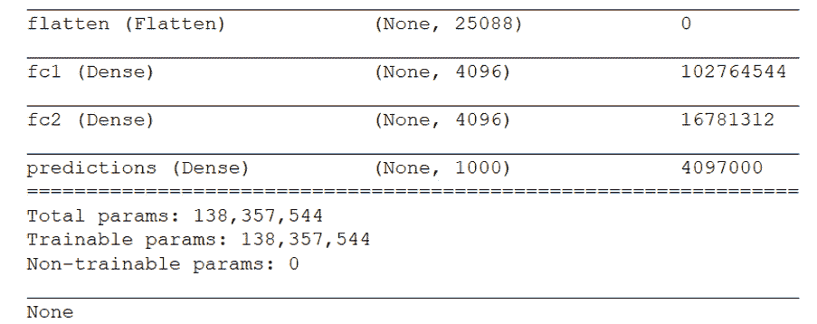

    图 8.16：网络的架构

1.  加载图像。 `'../Data/Prediction/test_image_1.jpg'` 是我们系统中图像的路径，在您的系统上会有所不同：

    ```py
    new_image = \
    image.load_img('../Data/Prediction/test_image_1.jpg', \
                   target_size=(224, 224))
    new_image
    ```

    以下图显示了前面代码的输出：

    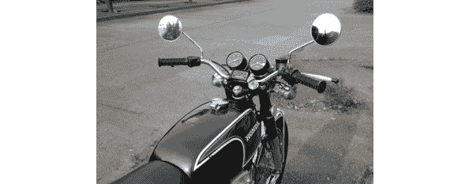

    图 8.17：示例摩托车图像

    目标大小应该是 `224x 224`，因为 `VGG16` 仅接受（`224, 224`）。

1.  使用 `img_to_array` 函数将图像转换为数组：

    ```py
    transformed_image = image.img_to_array(new_image)
    transformed_image.shape
    ```

    前面的代码提供了以下输出：

    ```py
    (224, 224, 3)
    ```

1.  图像应该是四维形式的，以便 `VGG16` 允许进一步处理。按如下方式扩展图像的维度：

    ```py
    transformed_image = np.expand_dims(transformed_image, axis=0)
    transformed_image.shape
    ```

    前面的代码提供了以下输出：

    ```py
    (1, 224, 224, 3)
    ```

1.  预处理图像：

    ```py
    transformed_image = preprocess_input(transformed_image)
    transformed_image
    ```

    以下图显示了前面代码的输出：

    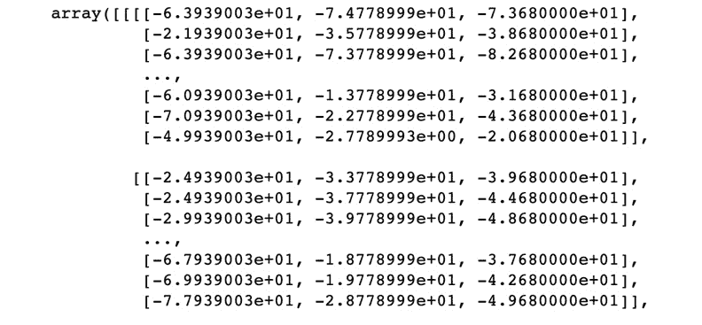

    图 8.18：图像预处理

1.  创建 `predictor` 变量：

    ```py
    y_pred = classifier.predict(transformed_image)
    y_pred
    ```

    以下图显示了前面代码的输出：

    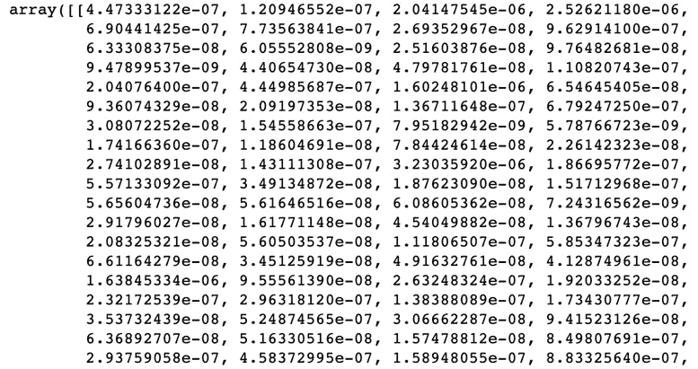

    图 8.19：创建预测变量

1.  检查图像的形状。它应该是（`1,1000`）。之所以是 `1000`，是因为如前所述，ImageNet 数据库有 `1000` 个图像类别。预测变量显示了我们图像属于这些图像类别之一的概率：

    ```py
    y_pred.shape
    ```

    前面的代码提供了以下输出：

    ```py
    (1, 1000)
    ```

1.  使用 `decode_predictions` 函数打印我们图像的前五个概率，并传递预测变量 `y_pred` 的函数，以及预测数量和对应标签以输出：

    ```py
    from keras.applications.vgg16 import decode_predictions
    decode_predictions(y_pred, top=5)
    ```

    前面的代码提供了以下输出：

    ```py
    [[('n03785016', 'moped', 0.8433369),
      ('n03791053', 'motor_scooter', 0.14188054),
      ('n03127747', 'crash_helmet', 0.007004856),
      ('n03208938', 'disk_brake', 0.0022349996),
      ('n04482393', 'tricycle', 0.0007717237)]]
    ```

    数组的第一列是内部编码号，第二列是标签，第三列是图像属于该标签的概率。

1.  将预测转换为人类可读的格式。我们需要从输出中提取最可能的标签，如下所示：

    ```py
    label = decode_predictions(y_pred)
    """
    Most likely result is retrieved, for example, the highest probability
    """
    decoded_label = label[0][0]
    # The classification is printed
    print('%s (%.2f%%)' % (decoded_label[1], decoded_label[2]*100 ))
    ```

    前面的代码提供了以下输出：

    ```py
    moped (84.33%)
    ```

    在这里，我们可以看到该图片有 `84.33%` 的概率是摩托车，这与摩托车足够接近，可能表示在 ImageNet 数据集中摩托车被标记为踏板车。

    注意

    若要访问此特定部分的源代码，请参考 [`packt.live/2C4nqRo`](https://packt.live/2C4nqRo)。

    您还可以在 [`packt.live/31JMPL4`](https://packt.live/31JMPL4) 在线运行此示例。

## 活动 8.02：使用 ResNet 进行图像分类

在本活动中，我们将使用另一个预训练网络，称为 `ResNet`。我们有一张位于 `../Data/Prediction/test_image_4` 的电视图像。我们将使用 `ResNet50` 网络来预测这张图像。请按照以下步骤完成此活动：

1.  导入 `numpy` 库和必要的 `Keras` 库：

    ```py
    import numpy as np
    from keras.applications.resnet50 import ResNet50, preprocess_input
    from keras.preprocessing import image 
    ```

1.  初始化 ResNet50 模型并打印模型的总结：

    ```py
    classifier = ResNet50()
    classifier.summary()
    ```

    `classifier.summary()` 显示了网络的架构，以下几点需要注意：

    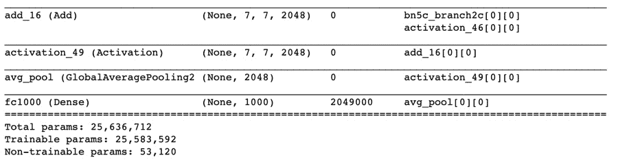

    图 8.20：输出的最后四层

    注意

    最后一层预测（`Dense`）有 `1000` 个值。这意味着 `VGG16` 总共有 `1000` 个标签，我们的图像将属于这 `1000` 个标签中的一个。

1.  加载图像。`'../Data/Prediction/test_image_4.jpg'` 是我们系统上图像的路径，在你的系统中会有所不同：

    ```py
    new_image = \
    image.load_img('../Data/Prediction/test_image_4.jpg', \
                   target_size=(224, 224))
    new_image
    ```

    以下是上述代码的输出：

    

    图 8.21：一张电视的示例图像

    目标大小应该是 `224x224`，因为 `ResNet50` 只接受 (`224,224`)。

1.  使用 `img_to_array` 函数将图像转换为数组：

    ```py
    transformed_image = image.img_to_array(new_image)
    transformed_image.shape
    ```

1.  为了使 `ResNet50` 允许进一步处理，图像必须为四维形式。使用 `expand_dims` 函数沿第 0 维扩展图像的维度：

    ```py
    transformed_image = np.expand_dims(transformed_image, axis=0)
    transformed_image.shape
    ```

1.  使用 `preprocess_input` 函数对图像进行预处理：

    ```py
    transformed_image = preprocess_input(transformed_image)
    transformed_image
    ```

1.  使用分类器的 `predict` 方法，通过创建预测变量来预测图像：

    ```py
    y_pred = classifier.predict(transformed_image)
    y_pred
    ```

1.  检查图像的形状。它应该是（`1,1000`）：

    ```py
    y_pred.shape
    ```

    上述代码提供了以下输出：

    ```py
    (1, 1000)
    ```

1.  使用 `decode_predictions` 函数，传递预测变量 `y_pred` 作为参数，选择最顶端的五个概率及其对应的标签：

    ```py
    from keras.applications.resnet50 import decode_predictions
    decode_predictions(y_pred, top=5)
    ```

    上述代码提供了以下输出：

    ```py
    [[('n04404412', 'television', 0.99673873),
      ('n04372370', 'switch', 0.0009829825),
      ('n04152593', 'screen', 0.00095111143),
      ('n03782006', 'monitor', 0.0006477369),
      ('n04069434', 'reflex_camera', 8.5398955e-05)]]
    ```

    数组的第一列是内部代码编号，第二列是标签，第三列是图像与标签匹配的概率。

1.  将预测结果转化为人类可读的格式。从 `decode_predictions` 函数的输出中打印最可能的标签：

    ```py
    label = decode_predictions(y_pred)
    """
    Most likely result is retrieved, for example, 
    the highest probability
    """
    decoded_label = label[0][0]
    # The classification is printed 
    print('%s (%.2f%%)' % (decoded_label[1], decoded_label[2]*100 ))
    ```

    上述代码产生了以下输出：

    ```py
    television (99.67%)
    ```

    注意

    要访问此特定部分的源代码，请参考 [`packt.live/38rEe0M`](https://packt.live/38rEe0M)。

    你也可以在网上运行这个示例，网址是 [`packt.live/2YV5xxo`](https://packt.live/2YV5xxo)。

# 9\. 使用递归神经网络进行序列建模

## 活动 9.01：使用 50 个单元（神经元）的 LSTM 预测亚马逊股价趋势

在这个活动中，我们将研究亚马逊过去 5 年的股票价格——从 2014 年 1 月 1 日到 2018 年 12 月 31 日。通过这一过程，我们将尝试使用`RNN`和`LSTM`预测 2019 年 1 月该公司的未来趋势。我们拥有 2019 年 1 月的实际数据，因此可以稍后将预测结果与实际值进行比较。按照以下步骤完成这个活动：

1.  导入所需的库：

    ```py
    import numpy as np
    import matplotlib.pyplot as plt
    import pandas as pd
    from tensorflow import random
    ```

1.  使用 pandas 的`read_csv`函数导入数据集，并使用`head`方法查看数据集的前五行：

    ```py
    dataset_training = pd.read_csv('../AMZN_train.csv')
    dataset_training.head()
    ```

    以下图示显示了上述代码的输出：

    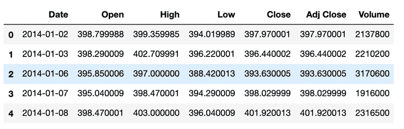

    ](img/B15777_09_24.jpg)

    图 9.24：数据集的前五行

1.  我们将使用`Open`股票价格进行预测；因此，从数据集中选择`Open`股票价格列并打印其值：

    ```py
    training_data = dataset_training[['Open']].values 
    training_data
    ```

    上述代码生成了以下输出：

    ```py
    array([[ 398.799988],
           [ 398.290009],
           [ 395.850006],
           ...,
           [1454.199951],
           [1473.349976],
           [1510.800049]])
    ```

1.  然后，通过使用`MinMaxScaler`进行特征缩放来规范化数据，设定特征的范围，使它们的最小值为 0，最大值为 1。使用缩放器的`fit_transform`方法对训练数据进行处理：

    ```py
    from sklearn.preprocessing import MinMaxScaler
    sc = MinMaxScaler(feature_range = (0, 1))
    training_data_scaled = sc.fit_transform(training_data)
    training_data_scaled
    ```

    上述代码生成了以下输出：

    ```py
    array([[0.06523313],
           [0.06494233],
           [0.06355099],
           ...,
           [0.66704299],
           [0.67796271],
           [0.69931748]])
    ```

1.  创建数据以从当前实例获取`60`个时间戳。我们选择`60`是因为它能为我们提供足够的前置实例来理解趋势；从技术上讲，这个数字可以是任何值，但`60`是最优值。此外，这里的上界值是`1258`，它是训练集中的行数（或记录数）索引：

    ```py
    X_train = []
    y_train = []
    for i in range(60, 1258):
        X_train.append(training_data_scaled[i-60:i, 0])
        y_train.append(training_data_scaled[i, 0])
    X_train, y_train = np.array(X_train), np.array(y_train)
    ```

1.  使用 NumPy 的`reshape`函数重塑数据，为`X_train`的末尾添加一个额外的维度：

    ```py
    X_train = np.reshape(X_train, (X_train.shape[0], \
                         X_train.shape[1], 1))
    ```

1.  导入以下库来构建 RNN：

    ```py
    from keras.models import Sequential
    from keras.layers import Dense, LSTM, Dropout
    ```

1.  设置随机种子并初始化顺序模型，如下所示：

    ```py
    seed = 1
    np.random.seed(seed)
    random.set_seed(seed)
    model = Sequential()
    ```

1.  向网络中添加一个`LSTM`层，设定`50`个单元，将`return_sequences`参数设置为`True`，并将`input_shape`参数设置为`(X_train.shape[1], 1)`。添加三个额外的`LSTM`层，每个层有`50`个单元，并为前两个层将`return_sequences`参数设置为`True`。最后，添加一个大小为 1 的输出层：

    ```py
    model.add(LSTM(units = 50, return_sequences = True, \
              input_shape = (X_train.shape[1], 1)))
    # Adding a second LSTM layer
    model.add(LSTM(units = 50, return_sequences = True))
    # Adding a third LSTM layer
    model.add(LSTM(units = 50, return_sequences = True))
    # Adding a fourth LSTM layer
    model.add(LSTM(units = 50))
    # Adding the output layer
    model.add(Dense(units = 1))
    ```

1.  使用`adam`优化器并使用`均方误差`作为损失函数编译网络。将模型拟合到训练数据，进行`100`个周期的训练，批量大小为`32`：

    ```py
    # Compiling the RNN
    model.compile(optimizer = 'adam', loss = 'mean_squared_error')
    # Fitting the RNN to the Training set
    model.fit(X_train, y_train, epochs = 100, batch_size = 32)
    ```

1.  加载并处理测试数据（在这里视为实际数据），并选择表示`Open`股票数据的列：

    ```py
    dataset_testing = pd.read_csv('../AMZN_test.csv')
    actual_stock_price = dataset_testing[['Open']].values
    actual_stock_price
    ```

1.  连接数据，因为我们需要`60`个前一个实例来获得每天的股票价格。因此，我们将需要训练数据和测试数据：

    ```py
    total_data = pd.concat((dataset_training['Open'], \
                            dataset_testing['Open']), axis = 0)
    ```

1.  重塑并缩放输入数据以准备测试数据。请注意，我们正在预测 1 月的月度趋势，这一月份有`21`个金融工作日，因此为了准备测试集，我们将下界值设为`60`，上界值设为`81`。这样可以确保`21`的差值得以保持：

    ```py
    inputs = total_data[len(total_data) \
             - len(dataset_testing) - 60:].values
    inputs = inputs.reshape(-1,1)
    inputs = sc.transform(inputs)
    X_test = []
    for i in range(60, 81):
        X_test.append(inputs[i-60:i, 0])
    X_test = np.array(X_test)
    X_test = np.reshape(X_test, (X_test.shape[0], \
                                 X_test.shape[1], 1))
    predicted_stock_price = model.predict(X_test)
    predicted_stock_price = \
    sc.inverse_transform(predicted_stock_price)
    ```

1.  通过绘制实际股价和预测股价来可视化结果：

    ```py
    # Visualizing the results
    plt.plot(actual_stock_price, color = 'green', \
             label = 'Real Amazon Stock Price',ls='--')
    plt.plot(predicted_stock_price, color = 'red', \
             label = 'Predicted Amazon Stock Price',ls='-')
    plt.title('Predicted Stock Price')
    plt.xlabel('Time in days')
    plt.ylabel('Real Stock Price')
    plt.legend()
    plt.show()
    ```

    请注意，您的结果可能会与亚马逊的实际股价略有不同。

    **预期输出**：

    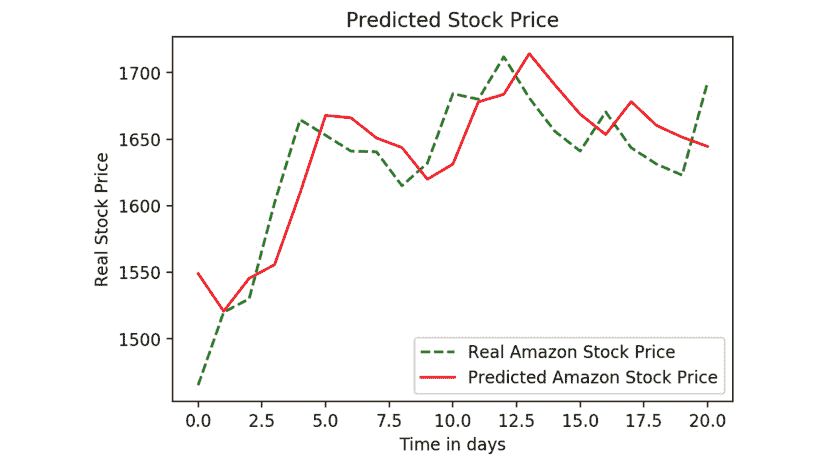

图 9.25：实际股价与预测股价

如前面的图所示，预测股价和实际股价的趋势几乎相同；两条线的波峰和波谷一致。这是因为 LSTM 能够记住序列数据。传统的前馈神经网络无法预测出这一结果。这正是`LSTM`和`RNNs`的真正强大之处。

注意

要访问此特定部分的源代码，请参阅[`packt.live/3goQO3I`](https://packt.live/3goQO3I)。

你也可以在[`packt.live/2VIMq7O`](https://packt.live/2VIMq7O)上在线运行此示例。

## 活动 9.02：使用正则化预测亚马逊的股价

在这个活动中，我们将研究亚马逊过去 5 年的股价，从 2014 年 1 月 1 日到 2018 年 12 月 31 日。在此过程中，我们将尝试使用 RNN 和 LSTM 预测并预测 2019 年 1 月亚马逊股价的未来趋势。我们已拥有 2019 年 1 月的实际值，因此稍后我们将能够将我们的预测与实际值进行比较。最初，我们使用 50 个单元（或神经元）的 LSTM 预测了亚马逊股价的趋势。在本次活动中，我们还将添加 Dropout 正则化，并将结果与*活动 9.01*、*使用 50 个单元（神经元）的 LSTM 预测亚马逊股价趋势*进行比较。按照以下步骤完成此活动：

1.  导入所需的库：

    ```py
    import numpy as np
    import matplotlib.pyplot as plt
    import pandas as pd
    from tensorflow import random
    ```

1.  使用 pandas 的`read_csv`函数导入数据集，并使用`head`方法查看数据集的前五行：

    ```py
    dataset_training = pd.read_csv('../AMZN_train.csv')
    dataset_training.head()
    ```

1.  我们将使用`Open`股票价格来进行预测；因此，从数据集中选择`Open`股票价格列并打印其值：

    ```py
    training_data = dataset_training[['Open']].values
    training_data
    ```

    上述代码产生了以下输出：

    ```py
    array([[ 398.799988],
           [ 398.290009],
           [ 395.850006],
           ...,
           [1454.199951],
           [1473.349976],
           [1510.800049]])
    ```

1.  然后，通过使用`MinMaxScaler`对数据进行特征缩放，并设置特征的范围，使其最小值为`0`，最大值为 1。使用缩放器的`fit_transform`方法对训练数据进行处理：

    ```py
    from sklearn.preprocessing import MinMaxScaler
    sc = MinMaxScaler(feature_range = (0, 1))
    training_data_scaled = sc.fit_transform(training_data)
    training_data_scaled
    ```

    上述代码产生了以下输出：

    ```py
    array([[0.06523313],
           [0.06494233],
           [0.06355099],
           ...,
           [0.66704299],
           [0.67796271],
           [0.69931748]])
    ```

1.  创建数据以获取来自当前实例的`60`个时间戳。我们选择`60`，因为它将为我们提供足够的先前实例，以便理解趋势；技术上讲，这可以是任何数字，但`60`是最优值。此外，这里的上限值是`1258`，这是训练集中的索引或行数（或记录数）：

    ```py
    X_train = []
    y_train = []
    for i in range(60, 1258):
        X_train.append(training_data_scaled[i-60:i, 0])
        y_train.append(training_data_scaled[i, 0])
    X_train, y_train = np.array(X_train), np.array(y_train)
    ```

1.  使用 NumPy 的`reshape`函数将数据重塑，以便在`X_train`的末尾添加一个额外的维度：

    ```py
    X_train = np.reshape(X_train, (X_train.shape[0], \
                                   X_train.shape[1], 1))
    ```

1.  导入以下 Keras 库以构建 RNN：

    ```py
    from keras.models import Sequential
    from keras.layers import Dense, LSTM, Dropout
    ```

1.  设置种子并初始化顺序模型，如下所示：

    ```py
    seed = 1
    np.random.seed(seed)
    random.set_seed(seed)
    model = Sequential()
    ```

1.  在网络中添加一个 LSTM 层，设置 50 个单元，将`return_sequences`参数设置为`True`，并将`input_shape`参数设置为`(X_train.shape[1], 1)`。为模型添加丢弃层，`rate=0.2`。再添加三个 LSTM 层，每个 LSTM 层有`50`个单元，前两个 LSTM 层的`return_sequences`参数设置为`True`。在每个`LSTM`层后，添加丢弃层，`rate=0.2`。最后添加一个大小为`1`的输出层：

    ```py
    model.add(LSTM(units = 50, return_sequences = True, \
                   input_shape = (X_train.shape[1], 1)))
    model.add(Dropout(0.2))
    # Adding a second LSTM layer and some Dropout regularization
    model.add(LSTM(units = 50, return_sequences = True))
    model.add(Dropout(0.2))
    # Adding a third LSTM layer and some Dropout regularization
    model.add(LSTM(units = 50, return_sequences = True))
    model.add(Dropout(0.2))
    # Adding a fourth LSTM layer and some Dropout regularization
    model.add(LSTM(units = 50))
    model.add(Dropout(0.2))
    # Adding the output layer
    model.add(Dense(units = 1))
    ```

1.  使用`adam`优化器编译网络，并使用`均方误差`作为损失函数。将模型拟合到训练数据，训练`100`个周期，批量大小为`32`：

    ```py
    # Compiling the RNN
    model.compile(optimizer = 'adam', loss = 'mean_squared_error')
    # Fitting the RNN to the Training set
    model.fit(X_train, y_train, epochs = 100, batch_size = 32)
    ```

1.  加载并处理测试数据（这里将其视为实际数据），并选择表示`Open`股票数据的列：

    ```py
    dataset_testing = pd.read_csv('../AMZN_test.csv')
    actual_stock_price = dataset_testing[['Open']].values
    actual_stock_price 
    ```

1.  将数据连接起来，因为我们需要`60`个前序实例来获取每天的股票价格。因此，我们将需要训练数据和测试数据：

    ```py
    total_data = pd.concat((dataset_training['Open'], \
                            dataset_testing['Open']), axis = 0)
    ```

1.  对输入数据进行重塑和缩放，以准备测试数据。请注意，我们正在预测 1 月的月度趋势，1 月有`21`个交易日，因此为了准备测试集，我们将下界值设为`60`，上界值设为`81`。这确保了`21`的差异得以保持：

    ```py
    inputs = total_data[len(total_data) \
             - len(dataset_testing) - 60:].values
    inputs = inputs.reshape(-1,1)
    inputs = sc.transform(inputs)
    X_test = []
    for i in range(60, 81):
        X_test.append(inputs[i-60:i, 0])
    X_test = np.array(X_test)
    X_test = np.reshape(X_test, (X_test.shape[0], \
                                 X_test.shape[1], 1))
    predicted_stock_price = model.predict(X_test)
    predicted_stock_price = \
    sc.inverse_transform(predicted_stock_price)
    ```

1.  通过绘制实际股票价格与预测股票价格的图表来可视化结果：

    ```py
    # Visualizing the results
    plt.plot(actual_stock_price, color = 'green', \
             label = 'Real Amazon Stock Price',ls='--')
    plt.plot(predicted_stock_price, color = 'red', \
             label = 'Predicted Amazon Stock Price',ls='-')
    plt.title('Predicted Stock Price')
    plt.xlabel('Time in days')
    plt.ylabel('Real Stock Price')
    plt.legend()
    plt.show()
    ```

请注意，您的结果可能与实际股票价格略有不同。

**预期输出**：

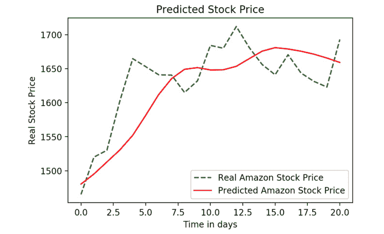

](img/B15777_09_26.jpg)

图 9.26：实际股票价格与预测股票价格的对比

在下图中，第一个图展示了来自活动 9.02 的带正则化的模型预测输出，第二个图展示了来自活动 9.01 的没有正则化的模型预测输出。正如你所见，加入丢弃正则化并没有更精确地拟合数据。因此，在这种情况下，最好不要使用正则化，或者使用丢弃正则化并设置较低的丢弃率：

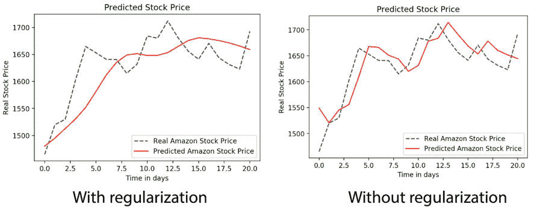

](img/B15777_09_27.jpg)

图 9.27：比较活动 9.01 与活动 9.02 的结果

注意

要访问该特定部分的源代码，请参考[`packt.live/2YTpxR7`](https://packt.live/2YTpxR7)。

你也可以在线运行这个示例，网址是[`packt.live/3dY5Bku`](https://packt.live/3dY5Bku)。

## 活动 9.03：使用增加数量的 LSTM 神经元（100 个单元）预测亚马逊股票价格的趋势

在此活动中，我们将分析亚马逊过去 5 年（2014 年 1 月 1 日到 2018 年 12 月 31 日）的股价。我们将使用四个 `LSTM` 层的 `RNN`，每个层有 `100` 个单元，尝试预测并预测 2019 年 1 月的公司未来趋势。我们已知 2019 年 1 月的实际股价，因此之后可以将我们的预测与实际值进行对比。你也可以将输出差异与 *活动 9.01*，*使用 50 个单元（神经元）的 LSTM 预测亚马逊股价趋势* 进行比较。按照以下步骤完成此活动：

1.  导入所需的库：

    ```py
    import numpy as np
    import matplotlib.pyplot as plt
    import pandas as pd
    from tensorflow import random
    ```

1.  使用 pandas 的 `read_csv` 函数导入数据集，并使用 `head` 方法查看数据集的前五行：

    ```py
    dataset_training = pd.read_csv('../AMZN_train.csv')
    dataset_training.head()
    ```

1.  我们将使用 `Open` 股票价格进行预测；因此，从数据集中选择 `Open` 股票价格列并打印值：

    ```py
    training_data = dataset_training[['Open']].values
    training_data
    ```

1.  然后，使用 `MinMaxScaler` 对数据进行特征缩放，并设置特征的范围，使其最小值为零，最大值为一。对训练数据使用 `fit_transform` 方法：

    ```py
    from sklearn.preprocessing import MinMaxScaler
    sc = MinMaxScaler(feature_range = (0, 1))
    training_data_scaled = sc.fit_transform(training_data)
    training_data_scaled
    ```

1.  创建数据，从当前实例获取 `60` 个时间戳。我们选择 `60`，因为它能为我们提供足够的前期数据，以帮助理解趋势；技术上讲，这个数字可以是任何值，但 `60` 是最佳值。此外，这里的上界值为 `1258`，即训练集中行（或记录）的索引或数量：

    ```py
    X_train = []
    y_train = []
    for i in range(60, 1258):
        X_train.append(training_data_scaled[i-60:i, 0])
        y_train.append(training_data_scaled[i, 0])
    X_train, y_train = np.array(X_train), np.array(y_train)
    ```

1.  重塑数据，通过使用 NumPy 的 `reshape` 函数，在 `X_train` 末尾添加一个额外的维度：

    ```py
    X_train = np.reshape(X_train, (X_train.shape[0], \
                                   X_train.shape[1], 1))
    ```

1.  导入以下 Keras 库以构建 RNN：

    ```py
    from keras.models import Sequential
    from keras.layers import Dense, LSTM, Dropout
    ```

1.  设置种子并初始化顺序模型：

    ```py
    seed = 1
    np.random.seed(seed)
    random.set_seed(seed)
    model = Sequential()
    ```

1.  向网络中添加一个 `100` 单元的 LSTM 层，将 `return_sequences` 参数设置为 `True`，并将 `input_shape` 参数设置为 `(X_train.shape[1], 1)`。再添加三个 `LSTM` 层，每个层有 `100` 个单元，前两个层的 `return_sequences` 参数设置为 `True`。最后添加一个大小为 `1` 的输出层：

    ```py
    model.add(LSTM(units = 100, return_sequences = True, \
                   input_shape = (X_train.shape[1], 1)))
    # Adding a second LSTM layer
    model.add(LSTM(units = 100, return_sequences = True))
    # Adding a third LSTM layer
    model.add(LSTM(units = 100, return_sequences = True))
    # Adding a fourth LSTM layer
    model.add(LSTM(units = 100))
    # Adding the output layer
    model.add(Dense(units = 1))
    ```

1.  使用 `adam` 优化器编译网络，并使用 `均方误差（Mean Squared Error）` 作为损失函数。将模型拟合到训练数据上，训练 `100` 个周期，批量大小为 `32`：

    ```py
    # Compiling the RNN
    model.compile(optimizer = 'adam', loss = 'mean_squared_error')
    # Fitting the RNN to the Training set
    model.fit(X_train, y_train, epochs = 100, batch_size = 32)
    ```

1.  加载并处理测试数据（这里视为实际数据），并选择表示开盘股价数据的列：

    ```py
    dataset_testing = pd.read_csv('../AMZN_test.csv')
    actual_stock_price = dataset_testing[['Open']].values
    actual_stock_price
    ```

1.  合并数据，因为我们需要 `60` 个前期数据来获取每天的股价。因此，我们将需要训练数据和测试数据：

    ```py
    total_data = pd.concat((dataset_training['Open'], \
                            dataset_testing['Open']), axis = 0)
    ```

1.  重塑并缩放输入数据以准备测试数据。请注意，我们预测的是一月的月度趋势，`21` 个交易日，因此，为了准备测试集，我们将下界值设置为 `60`，上界值设置为 `81`。这确保了 `21` 的差值得以保持：

    ```py
    inputs = total_data[len(total_data) \
             - len(dataset_testing) - 60:].values
    inputs = inputs.reshape(-1,1)
    inputs = sc.transform(inputs)
    X_test = []
    for i in range(60, 81):
        X_test.append(inputs[i-60:i, 0])
    X_test = np.array(X_test)
    X_test = np.reshape(X_test, (X_test.shape[0], \
                                 X_test.shape[1], 1))
    predicted_stock_price = model.predict(X_test)
    predicted_stock_price = \
    sc.inverse_transform(predicted_stock_price)
    ```

1.  通过绘制实际股价和预测股价来可视化结果：

    ```py
    plt.plot(actual_stock_price, color = 'green', \
             label = 'Actual Amazon Stock Price',ls='--')
    plt.plot(predicted_stock_price, color = 'red', \
             label = 'Predicted Amazon Stock Price',ls='-')
    plt.title('Predicted Stock Price')
    plt.xlabel('Time in days')
    plt.ylabel('Real Stock Price')
    plt.legend()
    plt.show()
    ```

    请注意，你的结果可能会与实际股价略有不同。

    **预期输出**：

    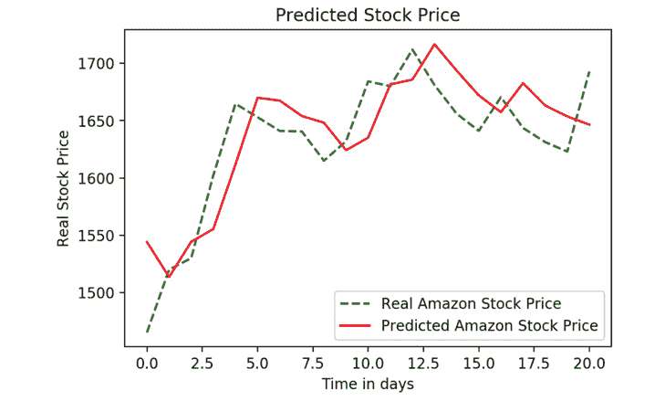

    ](img/B15777_09_28.jpg)

图 9.28：实际股票价格与预测股票价格

因此，如果我们将本节中的`LSTM`（50 个单元，来自*活动 9.01*，*使用 50 个单元（神经元）的 LSTM 预测亚马逊股票价格趋势*）与`LSTM`（100 个单元）进行比较，我们会得到 100 个单元的趋势。另外，请注意，当我们运行`LSTM`（100 个单元）时，它比运行`LSTM`（50 个单元）需要更多的计算时间。在这种情况下需要考虑权衡：

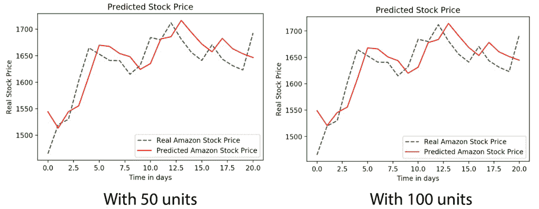

](img/B15777_09_29.jpg)

图 9.29：比较 50 个和 100 个单元的实际股票价格与预测股票价格

注意

要访问此特定部分的源代码，请参阅 [`packt.live/31NQkQy`](https://packt.live/31NQkQy)。

您还可以在网上运行此示例，访问 [`packt.live/2ZCZ4GR`](https://packt.live/2ZCZ4GR)。
