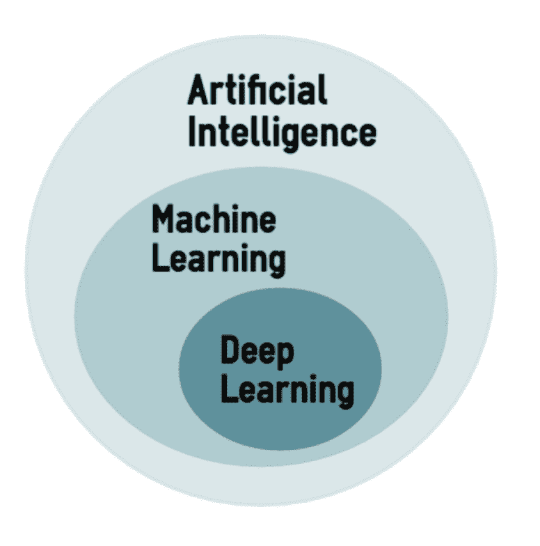

# 前言

*深入学习与 Keras 实践*是一本简明而全面的现代神经网络、人工智能和深度学习技术的入门书，专为软件工程师和数据科学家设计。

# 使命

本书介绍了 20 多个用 Python 编写的深度神经网络，这些网络使用 Keras——一个在 Google 的 TensorFlow 或 Lisa Lab 的 Theano 后端之上运行的模块化神经网络库。

读者将逐步接触到监督学习算法，如简单的线性回归、经典的多层感知机、更加复杂的深度卷积网络和生成对抗网络。此外，本书还涵盖了无监督学习算法，如自编码器和生成网络。书中还详细解释了递归网络和**长短时记忆**（**LSTM**）网络。接下来，本书将介绍 Keras 的功能 API，并讲解如何在读者的使用场景未被 Keras 的广泛功能覆盖时进行定制。它还将探讨由先前提到的构建模块组成的更大、更复杂的系统。书的最后介绍了深度强化学习及其在构建游戏 AI 中的应用。

实际应用包括用于将新闻文章分类为预定义类别的代码、文本的句法分析、情感分析、文本的合成生成以及词性标注。还探讨了图像处理，包括手写数字图像的识别、图像分类及其相关的图像注释、以及高级物体识别。此外，还将提供面部检测的显著点识别示例。声音分析包括对多位演讲者的离散语音识别。强化学习用于构建一个深度 Q 学习网络，能够自主地玩游戏。

实验是本书的精髓。每个网络都通过多个变体进行增强，这些变体通过改变输入参数、网络形状、损失函数和用于优化的算法，逐步提高学习性能。本书还提供了在 CPU 和 GPU 上训练的多种比较。

# 深度学习与机器学习和人工智能有何不同

**人工智能** (**AI**) 是一个非常广泛的研究领域，在这个领域中，机器展示了*认知*能力，如学习行为、与环境的主动互动、推理与演绎、计算机视觉、语音识别、问题解决、知识表示、感知等许多能力（更多信息，请参考本文：*人工智能：一种现代方法*，S. Russell 和 P. Norvig 著，Prentice Hall，2003 年）。更通俗地说，AI 指代任何机器模仿人类通常表现出的*智能*行为的活动。人工智能从计算机科学、数学和统计学等领域中汲取灵感。

**机器学习** (**ML**) 是人工智能的一个子领域，专注于教计算机如何在不需要为特定任务编程的情况下学习（更多信息，请参见 *模式识别与机器学习*，C. M. Bishop 著，Springer，2006 年）。实际上，机器学习的关键思想是，能够创建从数据中学习并做出预测的算法。机器学习有三种不同的广泛分类。在监督学习中，机器被提供输入数据和期望的输出，目标是通过这些训练示例学习，使得能够对未见过的新数据做出有意义的预测。在无监督学习中，机器仅被提供输入数据，机器需要自行发现一些有意义的结构，且没有外部监督。在强化学习中，机器充当一个与环境互动的智能体，学习哪些行为会产生奖励。

**深度学习** (**DL**) 是机器学习（**ML**）方法的一种特定子集，使用**人工神经网络** (**ANN**)，这些网络在某种程度上受到人脑神经元结构的启发（更多信息，请参考文章 *为人工智能学习深度架构*，Y. Bengio 著，Found. Trends，第 2 卷，2009 年）。非正式地说，*深度*一词指的是人工神经网络中存在许多层，但这一含义随着时间的推移有所变化。四年前，10 层已经足够让一个网络被视为*深度*网络，而如今，通常认为拥有数百层的网络才算是*深度*网络。



深度学习（DL）对机器学习来说简直是一场真正的海啸（更多信息请参见*C.D. Manning 的《计算语言学与深度学习》，“计算语言学”，第 41 卷，2015 年*），因为相对较少的聪明方法已经非常成功地应用到众多不同领域（图像、文本、视频、语音和视觉），显著提升了过去几十年间所取得的最先进成果。深度学习的成功还得益于更多训练数据的可用性（如图像领域的 ImageNet）和 GPU 低成本的可用性，使得数值计算更加高效。谷歌、微软、亚马逊、苹果、脸书等许多公司每天都在使用这些深度学习技术来分析海量数据。然而，这种专业技术已不再仅限于纯粹的学术研究领域和大型工业公司，它已成为现代软件生产的重要组成部分，因此读者应当掌握这些技术。本书不要求任何特定的数学背景，但假设读者已经是一个 Python 程序员。

# 本书涵盖的内容

第一章，*神经网络基础*，讲解了神经网络的基本知识。

第二章，*Keras 安装与 API*，展示了如何在 AWS、微软 Azure、谷歌云和你自己的机器上安装 Keras。此外，我们还提供了 Keras API 的概述。

第三章，*使用卷积网络的深度学习*，介绍了卷积网络的概念。卷积网络是深度学习中的一项基础创新，已成功应用于多个领域，从文本到视频再到语音，远远超出了最初用于图像处理的领域。

第四章，*生成对抗网络与 WaveNet*，介绍了生成对抗网络，用于生成类似人类生成的数据的合成数据。我们还将介绍 WaveNet，这是一种深度神经网络，用于高质量地再现人声和音乐。

第五章，*词嵌入*，讨论了词嵌入，这是一种深度学习方法，用于检测词与词之间的关系并将相似的词归为一类。

第六章，*递归神经网络 – RNN*，介绍了递归神经网络，这是一类专门优化用于处理序列数据（如文本）的网络。

第七章，*其他深度学习模型*，简要介绍了 Keras 函数式 API、回归网络、自编码器等内容。

第八章，*AI 游戏对战*，教你深度强化学习，并展示如何利用 Keras 构建可以通过奖励反馈学习玩街机游戏的深度学习网络。

附录，*结论*，是本书内容的简要回顾，并带领读者了解 Keras 2.0 的新功能。

# 本书所需的内容

为了能够顺利跟随章节，你需要以下软件：

+   TensorFlow 1.0.0 或更高版本

+   Keras 2.0.2 或更高版本

+   Matplotlib 1.5.3 或更高版本

+   Scikit-learn 0.18.1 或更高版本

+   NumPy 1.12.1 或更高版本

硬件规格如下：

+   32 位或 64 位架构

+   2+ GHz CPU

+   4 GB RAM

+   至少需要 10 GB 的可用硬盘空间

# 本书的目标读者

如果你是一个有机器学习经验的数据科学家，或者是一个接触过神经网络的 AI 程序员，你会发现这本书是深入了解 Keras 深度学习的有用入门书籍。此书要求具备 Python 知识。

# 约定

本书中有多种文本样式，用以区分不同类型的信息。以下是一些样式的示例及其含义解释。

文本中的代码词汇、数据库表名、文件夹名、文件名、文件扩展名、路径名、虚拟 URL、用户输入和 Twitter 账户名会以如下格式显示：“此外，我们将真实标签分别加载到 `Y_train` 和 `Y_test` 中，并对其进行 one-hot 编码。”

代码块的格式如下：

```py
from keras.models import Sequential
model = Sequential()
model.add(Dense(12, input_dim=8, kernel_initializer='random_uniform'))

```

当我们希望引起你对代码块中特定部分的注意时，相关的行或项会以粗体显示：

```py
# 10 outputs
# final stage is softmax
model = Sequential()
model.add(Dense(NB_CLASSES, input_shape=(RESHAPED,)))
model.add(Activation('softmax'))
model.summary()

```

所有的命令行输入或输出都按如下方式书写：

```py
pip install quiver_engine

```

**新术语**和**重要词汇**以粗体显示。你在屏幕上看到的单词，例如菜单或对话框中的内容，会以这样的形式出现在文本中：“我们的简单网络的初始准确率为 92.22%，这意味着每 100 个手写字符中，大约有 8 个未能被正确识别。”

警告或重要提示会以这样的框框显示。

提示和技巧会以这样的形式出现。

# 读者反馈

我们欢迎读者的反馈。让我们知道你对本书的看法——你喜欢或不喜欢的部分。读者反馈对我们很重要，它帮助我们开发出更符合你需求的书籍。

若要向我们提供一般反馈，只需发送电子邮件至 `feedback@packtpub.com`，并在邮件主题中提及书籍标题。

如果你在某个领域有专长，并且有兴趣撰写或参与书籍的编写，请查看我们的作者指南：[www.packtpub.com/authors](http://www.packtpub.com/authors)。

# 客户支持

现在你已经是 Packt 书籍的骄傲拥有者，我们为你提供了一些帮助，以确保你能够充分利用你的购买。

# 下载示例代码

您可以从[`www.packtpub.com`](http://www.packtpub.com)上的账户下载本书的示例代码文件。如果您在其他地方购买了此书，您可以访问[`www.packtpub.com/support`](http://www.packtpub.com/support)并注册，将文件直接发送到您的电子邮件。

您可以通过以下步骤下载代码文件：

1.  使用您的电子邮件地址和密码登录或注册我们的官网。

1.  将鼠标指针悬停在顶部的“SUPPORT”标签上。

1.  点击“代码下载与勘误”。

1.  在搜索框中输入书名。

1.  选择您要下载代码文件的书籍。

1.  从下拉菜单中选择您购买此书的地方。

1.  点击“代码下载”。

一旦文件下载完成，请确保使用最新版本的工具解压或提取文件夹：

+   Windows 的 WinRAR / 7-Zip

+   Mac 的 Zipeg / iZip / UnRarX

+   Linux 的 7-Zip / PeaZip

本书的代码包也托管在 GitHub 上，网址为[`github.com/PacktPublishing/Deep-Learning-with-Keras`](https://github.com/PacktPublishing/Deep-Learning-with-Keras)。我们还在[`github.com/PacktPublishing/`](https://github.com/PacktPublishing/)提供了其他书籍和视频的代码包，欢迎查看！

# 下载本书的彩色图像

我们还为您提供了一份 PDF 文件，包含本书中使用的截图/图表的彩色图像。这些彩色图像将帮助您更好地理解输出的变化。您可以从[`www.packtpub.com/sites/default/files/downloads/DeepLearningwithKeras_ColorImages.pdf`](https://www.packtpub.com/sites/default/files/downloads/DeepLearningwithKeras_ColorImages.pdf)下载此文件。

# 勘误

尽管我们已尽全力确保内容的准确性，但错误仍然可能发生。如果您在我们的书籍中发现错误——可能是文本或代码中的错误——我们将非常感激您向我们报告。这样，您可以帮助其他读者避免困扰，并且帮助我们改进后续版本的书籍。如果您发现任何勘误，请访问[`www.packtpub.com/submit-errata`](http://www.packtpub.com/submit-errata)报告，选择您的书籍，点击“勘误提交表单”链接，并输入勘误的详细信息。一旦您的勘误被验证，您的提交将被接受，勘误将上传到我们的网站，或添加到该书名的现有勘误列表中。

要查看之前提交的勘误，请访问[`www.packtpub.com/books/content/support`](https://www.packtpub.com/books/content/support)，并在搜索框中输入书名。所需的信息将在勘误部分下显示。

# 盗版

互联网上的版权侵权问题在所有媒体中都持续存在。在 Packt，我们非常重视版权和许可证的保护。如果你在互联网上发现任何形式的非法复制品，请立即提供该位置地址或网站名称，以便我们采取措施。

如发现涉嫌盗版的材料，请通过`copyright@packtpub.com`与我们联系，并提供相关链接。

我们感谢你在保护我们的作者及其作品的同时，帮助我们继续为你带来有价值的内容。

# 问题

如果你对本书的任何内容有问题，可以通过`questions@packtpub.com`与我们联系，我们将尽力解决问题。
