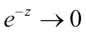
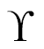
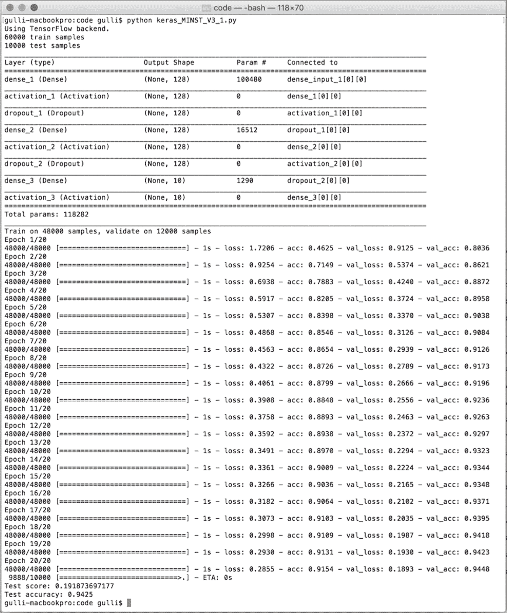
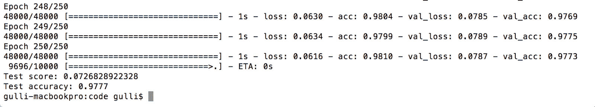
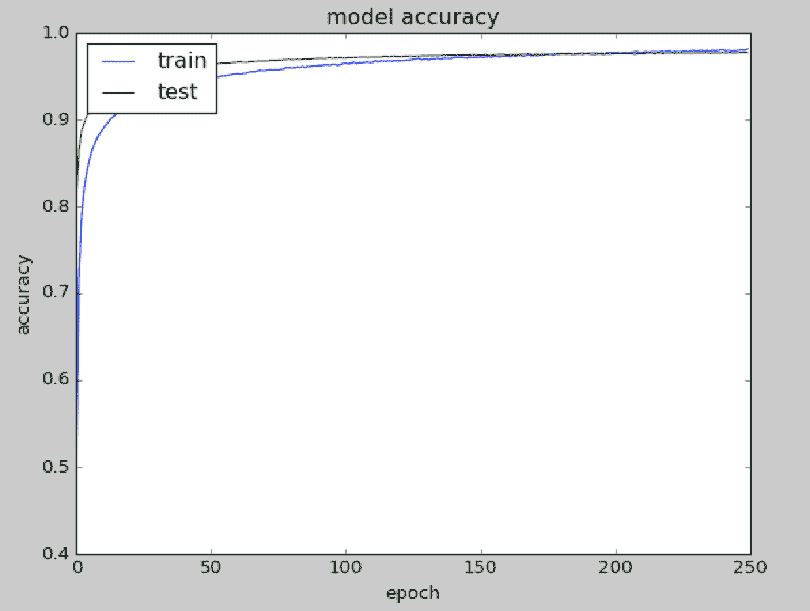
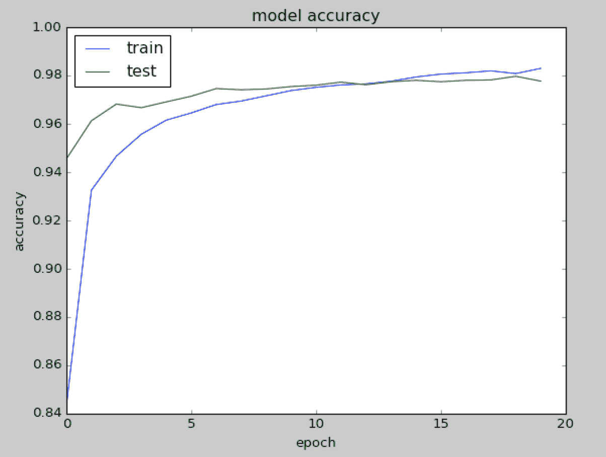
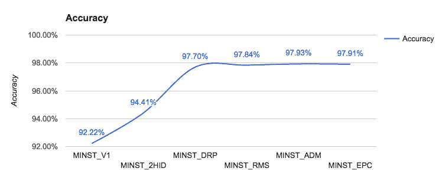

# 第一章：神经网络基础

人工神经网络（简称*神经网络*）代表了一类机器学习模型，灵感来源于对哺乳动物中枢神经系统的研究。每个神经网络由多个互联的*神经元*组成，这些神经元按*层*组织，当某些条件发生时，它们会交换信息（在术语中称为*激活*）。最初的研究始于 20 世纪 50 年代末，伴随感知机的引入（更多信息请参见文章：*感知机：一种用于大脑信息存储和组织的概率模型*，作者：F. 罗斯布拉特，心理学评论，卷 65，第 386 - 408 页，1958 年），这是一个用于简单操作的两层网络，随后在 20 世纪 60 年代末，通过引入*反向传播算法*，对多层网络的高效训练进行了扩展（参考文章：*反向传播：它的作用与如何实现*，作者：P. J. 韦尔博斯，IEEE 会议录，卷 78，第 1550 - 1560 页，1990 年，及*深度信念网络的快速学习算法*，作者：G. E. 亨顿、S. 奥辛德罗和 Y. W. 特，神经计算，卷 18，第 1527 - 1554 页，2006 年）。有些研究认为这些技术的起源比通常引用的时间更久远（更多信息请参见文章：*神经网络中的深度学习：概述*，作者：J. 施米德胡伯，卷 61，第 85 - 117 页，2015 年）。神经网络曾是 20 世纪 80 年代以前的学术研究重点，直到其他更简单的方法变得更为相关。然而，随着 2000 年代中期的到来，神经网络重新受到关注，这要归功于 G. 亨顿提出的突破性快速学习算法（更多信息请参见文章：*反向传播的根源：从有序导数到神经网络和政治预测*，*神经网络*，作者：S. 莱文，卷 9，1996 年，及*通过反向传播误差学习表示*，作者：D. E. 鲁梅哈特、G. E. 亨顿和 R. J. 威廉姆斯，卷 323，1986 年），以及 2011 年左右引入的用于大规模数值计算的 GPU。

这些改进为现代*深度学习*开辟了道路，深度学习是一类神经网络，其特点是包含大量神经元层，能够基于逐级抽象的方式学习复杂的模型。几年前，人们称其为*深度*，通常只有 3 到 5 层，而现在这一层数已上升到 100 到 200 层。

这种通过渐进抽象进行的学习类似于人类大脑中经过数百万年进化的视觉模型。人类视觉系统的确被组织成不同的层级。我们的眼睛连接到大脑的一个区域，称为**视觉皮层 V1**，它位于大脑的后下部。这个区域对许多哺乳动物都是共有的，负责区分基本特性以及视觉方向、空间频率和颜色的微小变化。据估计，V1 包含约 1.4 亿个神经元，它们之间有 100 亿个连接。V1 随后与其他区域 V2、V3、V4、V5 和 V6 连接，进行更复杂的图像处理和对更复杂概念的识别，比如形状、面孔、动物等。这种分层组织是通过几亿年的多次尝试调优的结果。据估计，人类大脑皮层约有 160 亿个神经元，约 10%-25%的皮层区域专门负责视觉处理（更多信息请参见文章：*The Human Brain in Numbers: A Linearly Scaled-up Primate Brain*，S. Herculano-Houzel，第三卷，2009 年）。深度学习从人类视觉系统的这种分层组织中获得了一些灵感：早期的人工神经元层学习图像的基本属性，而较深层的神经元则学习更复杂的概念。

本书通过提供在 Keras 中编写的工作网络，涵盖了神经网络的几个主要方面。Keras 是一个简约高效的 Python 库，用于深度学习计算，支持运行在 Google 的 TensorFlow（更多信息请参见[`www.tensorflow.org/`](https://www.tensorflow.org/)）或蒙特利尔大学的 Theano（更多信息请参见[`deeplearning.net/software/theano/`](http://deeplearning.net/software/theano/)）后台。因此，让我们开始吧。

在本章中，我们将讨论以下主题：

+   感知器

+   多层感知器

+   激活函数

+   梯度下降

+   随机梯度下降

+   反向传播

# 感知器

感知器是一种简单的算法，它给定一个输入向量 *x*，包含 *m* 个值（*x[1]*，*x[2]*，...，*x[n]*），通常称为输入特征或简写为特征，输出为 *1*（是）或 *0*（否）。从数学上讲，我们定义一个函数：


这里，*w* 是一个权重向量，*wx* 是点积 ，*b* 是偏置。如果你记得初等几何学，*wx + b* 定义了一个边界超平面，该超平面的位置会根据赋给 *w* 和 *b* 的值变化。如果 *x* 位于直线以上，则答案为正，否则为负。这个算法非常简单！感知器无法表达 *也许* 的答案。它只能回答 *是*（*1*）或 *否*（*0*），前提是我们理解如何定义 *w* 和 *b*，这就是训练过程，接下来我们将讨论。

# Keras 代码的第一个示例

Keras 的初始构建模块是模型，而最简单的模型称为**顺序模型**。一个顺序的 Keras 模型是一个线性管道（堆叠）的神经网络层。以下代码片段定义了一个包含 `12` 个人工神经元的单层，并且它期望 `8` 个输入变量（也称为特征）：

```py
from keras.models import Sequential
model = Sequential()
model.add(Dense(12, input_dim=8, kernel_initializer='random_uniform'))

```

每个神经元可以使用特定的权重进行初始化。Keras 提供了几种选择，最常见的几种列举如下：

+   `random_uniform`：权重初始化为均匀随机的小值，范围在 (*-0.05*, *0.05*) 之间。换句话说，给定区间内的任何值都有相同的概率被选中。

+   `random_normal`：权重根据高斯分布进行初始化，均值为零，标准差为 *0.05*。对于不熟悉高斯分布的朋友，可以将其想象为一个对称的*钟形曲线*。

+   `zero`：所有权重初始化为零。

完整列表可以在 [`keras.io/initializations/`](https://keras.io/initializations/) 找到。

# 多层感知器 —— 网络的第一个示例

在本章中，我们定义了一个具有多个线性层的网络的第一个示例。从历史上看，感知器是指具有单一线性层的模型，因此如果它具有多个层，你可以称之为**多层感知器**（**MLP**）。下图表示一个典型的神经网络，包含一个输入层、一个中间层和一个输出层。


在前面的示意图中，第一层中的每个节点接收输入，并根据预定义的局部决策边界进行激活。然后，第一层的输出传递到第二层，第二层的结果传递到最终的输出层，输出层由一个单一的神经元组成。有趣的是，这种分层组织与我们早前讨论的人类视觉模式有些相似。

*net* 是稠密的，意味着每个层中的神经元都与前一层中的所有神经元及后一层中的所有神经元相连接。

# 训练感知器中的问题及其解决方案

让我们考虑一个单一的神经元；对于权重 *w* 和偏置 *b*，最佳选择是什么？理想情况下，我们希望提供一组训练示例，让计算机调整权重和偏置，使输出中产生的误差最小化。为了让这个问题更加具体，假设我们有一组猫的图片和另一组不包含猫的图片。为了简化，假设每个神经元只查看一个输入像素值。在计算机处理这些图片时，我们希望神经元调整它的权重和偏置，使得错误识别为非猫的图片越来越少。这种方法看起来非常直观，但它要求权重（和/或偏置）的小变化只会导致输出的小变化。

如果我们的输出跳跃过大，就无法*逐步*学习（而不是像进行穷尽搜索那样尝试所有可能的方向——这是一个在不确定是否改进的情况下进行的过程）。毕竟，孩子们是逐步学习的。不幸的是，感知器没有表现出这种逐步行为。感知器的输出要么是*0*，要么是*1*，这是一种很大的跳跃，这对学习没有帮助，正如下面的图所示：


我们需要一些不同的、更平滑的东西。我们需要一个从 *0* 逐渐变化到 *1* 的函数，且没有间断。数学上，这意味着我们需要一个连续的函数，使我们能够计算其导数。

# 激活函数 — sigmoid

Sigmoid 函数定义如下：


如下图所示，当输入在  中变化时，输出在 *(0, 1)* 范围内变化较小。数学上，这个函数是连续的。一个典型的 sigmoid 函数在下图中表示：


神经元可以使用 sigmoid 来计算非线性函数 。注意，如果  非常大且为正，那么 ，因此 ，而如果  非常大且为负，，则 。换句话说，具有 sigmoid 激活的神经元表现得类似于感知器，但其变化是渐进的，输出值，如 *0.5539* 或 *0.123191*，都是完全合法的。从这个意义上说，sigmoid 神经元可以回答*也许*。

# 激活函数 — ReLU

Sigmoid 并不是唯一用于神经网络的平滑激活函数。最近，一种叫做**修正线性单元**（**ReLU**）的简单函数变得非常流行，因为它能够产生非常好的实验结果。ReLU 函数简单地定义为 ，其非线性函数在下图中表示。正如你在下图中看到的，负值时该函数为零，正值时则呈线性增长：


# 激活函数

Sigmoid 和 ReLU 通常被称为神经网络术语中的*激活函数*。在*Keras 中测试不同优化器*一节中，我们将看到这些逐步变化，典型的 Sigmoid 和 ReLU 函数，是发展学习算法的基本构建块，这些算法逐渐减少网络所犯的错误，一点点地适应。以下是使用激活函数 σ 与输入向量 (*x[1]*, *x[2]*, ..., *x[m]*)、权重向量 (*w[1]*, *w[2]*, *...*, *w[m]*)、偏置 *b* 和求和 Σ 的示例：


Keras 支持多种激活函数，完整列表请参见 [`keras.io/activations/`](https://keras.io/activations/)。

# 实际示例 — 识别手写数字

在这一部分，我们将构建一个可以识别手写数字的网络。为了实现这个目标，我们使用 MNIST（有关更多信息，请参见[`yann.lecun.com/exdb/mnist/`](http://yann.lecun.com/exdb/mnist/)），这是一个由 60,000 个训练样本和 10,000 个测试样本组成的手写数字数据库。训练样本由人类标注，包含正确答案。例如，如果手写数字是数字 3，那么 3 就是与该样本相关联的标签。

在机器学习中，当有正确答案的数据集时，我们称之为可以进行一种*有监督学习*。在这种情况下，我们可以使用训练样本来调整我们的网络。测试样本也会与每个数字相关联正确的答案。然而，在这种情况下，想法是装作标签是未知的，让网络进行预测，然后稍后重新考虑标签，以评估我们的神经网络在识别数字方面的学习效果。因此，毫不奇怪，测试样本仅用于测试我们的网络。

每个 MNIST 图像是灰度图，并由 28 x 28 个像素组成。这些数字的一部分在下面的图示中表示：


# 一热编码 — OHE

在许多应用中，将分类（非数值）特征转换为数值变量是很方便的。例如，具有值*d*的分类特征数字* [0-9] *可以编码为一个具有*10*个位置的二进制向量，该向量始终在除*d*位置外的所有位置上为*0*，在*d*位置上为*1*。这种表示方式称为**一热编码**（**OHE**），在数据挖掘中非常常见，尤其是当学习算法专门处理数值函数时。

# 在 Keras 中定义一个简单的神经网络

在这里，我们使用 Keras 定义一个识别 MNIST 手写数字的网络。我们从一个非常简单的神经网络开始，然后逐步改进它。

Keras 提供了适合的库来加载数据集，并将其划分为训练集`X_train`，用于对网络进行微调，以及测试集* `X_test`，* 用于评估性能。数据被转换为`float32`以支持 GPU 计算，并归一化为* [0, 1] *。此外，我们将真实标签分别加载到`Y_train`和`Y_test`中，并对它们进行一热编码。我们来看一下代码：

```py
from __future__ import print_function
import numpy as np
from keras.datasets import mnist
from keras.models import Sequential
from keras.layers.core import Dense, Activation
from keras.optimizers import SGD
from keras.utils import np_utils
np.random.seed(1671) # for reproducibility

# network and training
NB_EPOCH = 200
BATCH_SIZE = 128
VERBOSE = 1
NB_CLASSES = 10 # number of outputs = number of digits
OPTIMIZER = SGD() # SGD optimizer, explained later in this chapter
N_HIDDEN = 128
VALIDATION_SPLIT=0.2 # how much TRAIN is reserved for VALIDATION

# data: shuffled and split between train and test sets
#
(X_train, y_train), (X_test, y_test) = mnist.load_data()
#X_train is 60000 rows of 28x28 values --> reshaped in 60000 x 784
RESHAPED = 784
#
X_train = X_train.reshape(60000, RESHAPED)
X_test = X_test.reshape(10000, RESHAPED)
X_train = X_train.astype('float32')
X_test = X_test.astype('float32')
# normalize
#
X_train /= 255
X_test /= 255
print(X_train.shape[0], 'train samples')
print(X_test.shape[0], 'test samples')
# convert class vectors to binary class matrices
Y_train = np_utils.to_categorical(y_train, NB_CLASSES)
Y_test = np_utils.to_categorical(y_test, NB_CLASSES)

```

输入层有一个与图像中每个像素关联的神经元，总共有*28 x 28 = 784*个神经元，每个像素对应 MNIST 图像中的一个像素。

通常，每个像素的值会在范围* [0, 1] *内进行归一化（这意味着每个像素的强度会除以 255，255 是最大强度值）。输出是 10 个类别，每个类别对应一个数字。

最后一层是一个具有 softmax 激活函数的单神经元，softmax 是 sigmoid 函数的推广。Softmax *压缩* 一个具有 k 个维度的任意实数向量，将其映射到范围 *(0, 1)* 的 k 维实数向量。在我们的例子中，它将前一层提供的 10 个答案与 10 个神经元的结果进行聚合：

```py
# 10 outputs
# final stage is softmax
model = Sequential()
model.add(Dense(NB_CLASSES, input_shape=(RESHAPED,)))
model.add(Activation('softmax'))
model.summary()

```

一旦我们定义了模型，就必须对其进行编译，以便它可以被 Keras 后端（无论是 Theano 还是 TensorFlow）执行。在编译过程中需要做出一些选择：

+   我们需要选择用于更新权重的 *优化器*，它是训练模型时使用的特定算法。

+   我们需要选择用于优化器的 *目标函数*，该目标函数用于引导权重空间（通常，目标函数也被称为 *损失函数*，优化过程被定义为损失的 *最小化* 过程）。

+   我们需要评估训练好的模型

一些常见的目标函数选择（Keras 目标函数的完整列表可以参考 [`keras.io/objectives/`](https://keras.io/objectives/)）如下：

+   **均方误差（MSE）**：这是预测值和真实值之间的均方误差。从数学上讲，如果  是包含 *n* 个预测值的向量，而 *Y* 是包含 *n* 个观察值的向量，那么它们满足以下方程：


这些目标函数对每个预测所犯的错误进行平均，如果预测值与真实值之间的距离较远，那么通过平方操作，这个距离会更加显著。

+   **二分类交叉熵**：这是二元对数损失。假设我们的模型预测值为 *p*，而目标为 *t*，那么二分类交叉熵定义如下：


这个目标函数适用于二分类标签预测。

+   **类别交叉熵**：这是多类的对数损失。如果目标是 *t[i,j]*，预测是 *p[i,j]*，那么类别交叉熵为：


这个目标函数适用于多类标签预测。在与 softmax 激活函数一起使用时，它也是默认选择。

一些常见的度量标准选择（Keras 度量标准的完整列表可以参考 [`keras.io/metrics/`](https://keras.io/metrics/)）如下：

+   **准确率**：这是预测正确的比例，与目标相比。

+   **精确度**：表示在多标签分类中，有多少选定项是相关的。

+   **召回率**：表示在多标签分类中，有多少选定项是相关的。

度量标准与目标函数类似，唯一的区别是它们不是用于训练模型，而仅用于评估模型。在 Keras 中编译模型是非常简单的：

```py
model.compile(loss='categorical_crossentropy', optimizer=OPTIMIZER, metrics=['accuracy'])

```

一旦模型被编译，就可以使用 `fit()` 函数进行训练，该函数指定了一些参数：

+   `epochs`：这是模型暴露于训练集的次数。在每次迭代中，优化器会尝试调整权重，以最小化目标函数。

+   `batch_size`：这是优化器执行权重更新之前，观察到的训练实例的数量。

在 Keras 中训练模型非常简单。假设我们想要迭代 `NB_EPOCH` 步：

```py
history = model.fit(X_train, Y_train,
batch_size=BATCH_SIZE, epochs=NB_EPOCH,
verbose=VERBOSE, validation_split=VALIDATION_SPLIT)

```

我们将部分训练集保留用于验证。关键思想是，我们保留部分训练数据用于在训练过程中评估验证集的表现。这是进行任何机器学习任务时的良好实践，我们将在所有示例中采纳这一做法。

一旦模型训练完成，我们可以在包含新未见示例的测试集上进行评估。通过这种方式，我们可以获得目标函数的最小值和评估指标的最佳值。

请注意，训练集和测试集当然是严格分开的。在已经用于训练的示例上评估模型是没有意义的。学习本质上是一个旨在概括未见观察结果的过程，而不是去记忆已知的内容：

```py
score = model.evaluate(X_test, Y_test, verbose=VERBOSE)
print("Test score:", score[0])
print('Test accuracy:', score[1])

```

恭喜你，你刚刚在 Keras 中定义了你的第一个神经网络。只需几行代码，你的计算机就能够识别手写数字。让我们运行代码并看看性能如何。

# 运行一个简单的 Keras 网络并建立基准

那么，让我们来看一下当我们运行下面截图中的代码时会发生什么：


首先，网络架构被转储，我们可以看到使用的不同类型的层、它们的输出形状、需要优化的参数数量以及它们是如何连接的。然后，网络在 48,000 个样本上进行训练，12,000 个样本保留用于验证。一旦神经网络模型构建完成，它就会在 10,000 个样本上进行测试。正如你所看到的，Keras 内部使用 TensorFlow 作为计算的后端系统。现在，我们不会深入探讨训练是如何进行的，但我们可以注意到，程序运行了 200 次迭代，每次迭代时，准确率都有所提高。当训练结束后，我们在测试集上测试模型，得到了约 92.36% 的训练准确率、92.27% 的验证准确率和 92.22% 的测试准确率。

这意味着大约每十个手写字符中就有一个没有被正确识别。我们当然可以做得更好。在下方的截图中，我们可以看到测试集上的准确率：


# 使用隐藏层改进 Keras 中的简单网络

我们在训练集上的基准准确率为 92.36%，在验证集上的准确率为 92.27%，在测试集上的准确率为 92.22%。这是一个很好的起点，但我们肯定可以做得更好。让我们看看如何改进。

第一个改进是向网络中添加额外的层。因此，在输入层之后，我们有一个第一个密集层，包含`N_HIDDEN`个神经元，并使用激活函数`relu`。这个附加层被视为*隐藏层*，因为它与输入和输出都没有直接连接。在第一个隐藏层之后，我们有第二个隐藏层，仍然包含`N_HIDDEN`个神经元，之后是一个输出层，包含 10 个神经元，每个神经元将在相应的数字被识别时激活。以下代码定义了这个新网络：

```py
from __future__ import print_function
import numpy as np
from keras.datasets import mnist
from keras.models import Sequential
from keras.layers.core import Dense, Activation
from keras.optimizers import SGD
from keras.utils import np_utils
np.random.seed(1671) # for reproducibility
# network and training
NB_EPOCH = 20
BATCH_SIZE = 128
VERBOSE = 1
NB_CLASSES = 10 # number of outputs = number of digits
OPTIMIZER = SGD() # optimizer, explained later in this chapter
N_HIDDEN = 128
VALIDATION_SPLIT=0.2 # how much TRAIN is reserved for VALIDATION
# data: shuffled and split between train and test sets
(X_train, y_train), (X_test, y_test) = mnist.load_data()
#X_train is 60000 rows of 28x28 values --> reshaped in 60000 x 784
RESHAPED = 784
#
X_train = X_train.reshape(60000, RESHAPED)
X_test = X_test.reshape(10000, RESHAPED)
X_train = X_train.astype('float32')
X_test = X_test.astype('float32')
# normalize
X_train /= 255
X_test /= 255
print(X_train.shape[0], 'train samples')
print(X_test.shape[0], 'test samples')
# convert class vectors to binary class matrices
Y_train = np_utils.to_categorical(y_train, NB_CLASSES)
Y_test = np_utils.to_categorical(y_test, NB_CLASSES)
# M_HIDDEN hidden layers
# 10 outputs
# final stage is softmax
model = Sequential()
model.add(Dense(N_HIDDEN, input_shape=(RESHAPED,)))
model.add(Activation('relu'))
model.add(Dense(N_HIDDEN))
model.add(Activation('relu'))
model.add(Dense(NB_CLASSES))
model.add(Activation('softmax'))
model.summary()
model.compile(loss='categorical_crossentropy',
optimizer=OPTIMIZER,
metrics=['accuracy'])
history = model.fit(X_train, Y_train,
batch_size=BATCH_SIZE, epochs=NB_EPOCH,
verbose=VERBOSE, validation_split=VALIDATION_SPLIT)
score = model.evaluate(X_test, Y_test, verbose=VERBOSE)
print("Test score:", score[0])
print('Test accuracy:', score[1])

```

让我们运行代码，看看这个多层网络的结果如何。还不错。通过添加两个隐藏层，我们在训练集上达到了 94.50%，在验证集上 94.63%，在测试集上 94.41%。这意味着，相比于之前的网络，我们在测试集上的准确率提高了 2.2%。然而，我们大幅减少了从 200 次迭代到 20 次迭代的训练周期。这是好事，但我们还想要更多。

如果你愿意，你可以自己试试，看看如果只添加一个隐藏层而不是两个，或者如果添加两个以上的层会发生什么。我将这个实验留给你做。以下截图显示了前面示例的输出：


# 在 Keras 中通过 dropout 进一步改进简单的网络

现在我们的基准准确率为：训练集 94.50%，验证集 94.63%，测试集 94.41%。第二个改进非常简单。我们决定通过 dropout 概率随机丢弃一些在内部密集隐藏层网络中传播的值。在机器学习中，这是一种众所周知的正则化方法。令人惊讶的是，随机丢弃一些值的想法竟然能提升我们的表现：

```py
from __future__ import print_function
import numpy as np
from keras.datasets import mnist
from keras.models import Sequential
from keras.layers.core import Dense, Dropout, Activation
from keras.optimizers import SGD
from keras.utils import np_utils
np.random.seed(1671) # for reproducibility
# network and training
NB_EPOCH = 250
BATCH_SIZE = 128
VERBOSE = 1
NB_CLASSES = 10 # number of outputs = number of digits
OPTIMIZER = SGD() # optimizer, explained later in this chapter
N_HIDDEN = 128
VALIDATION_SPLIT=0.2 # how much TRAIN is reserved for VALIDATION
DROPOUT = 0.3
# data: shuffled and split between train and test sets
(X_train, y_train), (X_test, y_test) = mnist.load_data()
#X_train is 60000 rows of 28x28 values --> reshaped in 60000 x 784
RESHAPED = 784
#
X_train = X_train.reshape(60000, RESHAPED)
X_test = X_test.reshape(10000, RESHAPED)
X_train = X_train.astype('float32')
X_test = X_test.astype('float32')
# normalize
X_train /= 255
X_test /= 255
# convert class vectors to binary class matrices
Y_train = np_utils.to_categorical(y_train, NB_CLASSES)
Y_test = np_utils.to_categorical(y_test, NB_CLASSES)
# M_HIDDEN hidden layers 10 outputs
model = Sequential()
model.add(Dense(N_HIDDEN, input_shape=(RESHAPED,)))
model.add(Activation('relu'))
model.add(Dropout(DROPOUT))
model.add(Dense(N_HIDDEN))
model.add(Activation('relu'))
model.add(Dropout(DROPOUT))
model.add(Dense(NB_CLASSES))
model.add(Activation('softmax'))
model.summary()
model.compile(loss='categorical_crossentropy',
optimizer=OPTIMIZER,
metrics=['accuracy'])
history = model.fit(X_train, Y_train,
batch_size=BATCH_SIZE, epochs=NB_EPOCH,
verbose=VERBOSE, validation_split=VALIDATION_SPLIT)
score = model.evaluate(X_test, Y_test, verbose=VERBOSE)
print("Test score:", score[0])
print('Test accuracy:', score[1])

```

让我们像之前那样运行 20 次迭代，看看这个网络在训练集上达到 91.54%，在验证集上 94.48%，在测试集上 94.25%的准确率：



请注意，训练集的准确率仍然应该高于测试集准确率，否则我们就没有训练足够长的时间。因此，让我们尝试显著增加 epoch 数量，直到 250 次，我们将获得 98.1%的训练准确率，97.73%的验证准确率，和 97.7%的测试准确率：



观察随着 epoch 数量增加，训练集和测试集上的准确率是非常有用的。正如你在下面的图表中看到的，这两条曲线大约在 250 个 epoch 时交汇，因此，在这一点之后就无需继续训练：

|  |  |
| --- | --- |

注意，常常观察到，在内部隐藏层进行随机丢弃（dropout）的网络在测试集中的未知样本上表现更好。直观地看，可以将其理解为每个神经元变得更强大，因为它知道不能依赖于邻近的神经元。在测试时，不会有丢弃，所以此时我们使用的是所有已调优的神经元。简而言之，采用某种丢弃函数进行测试通常是检验网络性能的一个好方法。

# 在 Keras 中测试不同的优化器

我们已经定义并使用了一个网络；接下来可以开始介绍网络训练的直观理解。我们先聚焦于一种流行的训练技术——**梯度下降**（**GD**）。假设一个通用的代价函数 *C(w)*，它是一个关于单一变量 *w* 的函数，如下图所示：


梯度下降可以看作是一个登山者，目标是从山顶走到山谷。山代表代价函数 *C*，而山谷代表最小值 *C[min]*。登山者从起点 *w[0]* 开始，逐步向前移动。在每一步 *r* 中，梯度指向最大增加的方向。从数学上讲，这个方向是偏导数的值 ，其在步数 *r* 达到的点 *w[r]* 处被评估。因此，通过朝着相反方向移动 ，登山者可以朝着山谷前进。在每一步中，登山者可以决定步长。这就是梯度下降中的 *学习率* 。注意，如果  太小，登山者会移动得很慢。然而，如果  太大，登山者则可能会错过山谷。

现在你应该记得，sigmoid 是一个连续函数，并且可以计算其导数。可以证明，sigmoid 如下所示：


它的导数为：


ReLU 在 *0* 处不可导。然而，我们可以通过选择将 *0* 或 *1* 作为 *0* 处的导数，从而将其扩展为一个定义在整个领域上的函数。ReLU 的逐点导数  如下所示：


一旦我们得到了导数，就可以使用梯度下降技术来优化网络。Keras 使用其后台（无论是 TensorFlow 还是 Theano）来为我们计算导数，所以我们无需担心实现或计算它。我们只需选择激活函数，Keras 就会为我们计算其导数。

神经网络本质上是多个函数的组合，包含成千上万，有时甚至数百万个参数。每一层网络都会计算一个函数，其误差应当被最小化，以提高在学习阶段观察到的准确率。当我们讨论反向传播时，我们会发现最小化的过程比我们的小示例要复杂一些。然而，它仍然基于通过下降谷底的直观理解。

Keras 实现了一个快速的梯度下降变种，称为**随机梯度下降**（**SGD**），以及另外两种更先进的优化技术，分别是**RMSprop**和**Adam**。RMSprop 和 Adam 除了包含 SGD 的加速成分外，还引入了动量（一个速度分量）。这使得它们在加速收敛的同时，也需要更多的计算。Keras 支持的优化器完整列表可以查看[`keras.io/optimizers/`](https://keras.io/optimizers/)。到目前为止，SGD 是我们的默认选择。那么现在我们来试试另外两种优化器。非常简单，我们只需要修改几行代码：

```py
from keras.optimizers import RMSprop, Adam
...
OPTIMIZER = RMSprop() # optimizer,

```

就这样。让我们按以下截图所示进行测试：


正如你在之前的截图中看到的，RMSprop 比 SDG 更快，因为我们能够在训练集上获得 97.97%的准确率，在验证集上为 97.59%，在测试集上为 97.84%，仅用 20 次迭代就超越了 SDG。为了完整起见，让我们看看随着周期数的增加，准确率和损失的变化，如以下图表所示：

|  |  |
| --- | --- |

好的，让我们试试另一个优化器，`Adam()`。它非常简单，如下所示：

```py
OPTIMIZER = Adam() # optimizer

```

正如我们所看到的，Adam 稍微好一点。使用 Adam 时，在 20 次迭代后，我们在训练集上的准确率为 98.28%，验证集为 98.03%，测试集为 97.93%，如以下图表所示：

|  |  |
| --- | --- |

这是我们的第五个变种，请记住，我们的初始基准是 92.36%。

到目前为止，我们取得了逐步的进展；然而，现在的提升变得越来越困难。请注意，我们正在以 30%的丢弃率进行优化。为了完整起见，报告不同丢弃率下的测试集准确率可能会很有帮助，且选择`Adam()`作为优化器，如以下图所示：


# 增加训练的周期数

让我们再试一次，将训练周期数从 20 增加到 200。不幸的是，这样的选择让我们的计算时间增加了 10 倍，但并没有带来任何提升。实验失败了，但我们学到了一个重要的经验：如果我们花更多时间进行学习，并不一定会有所改善。学习更多的是采用聪明的技巧，而不一定是花费的计算时间。让我们在以下图表中跟踪我们第六个变种的表现：



# 控制优化器学习率

还有一个尝试是改变优化器的学习参数。正如下图所示，最佳值接近*0.001*，这是优化器的默认学习率。很好！Adam 优化器开箱即用效果不错：


# 增加内部隐藏神经元的数量

我们还可以尝试另一种方法，即改变内部隐藏神经元的数量。我们报告了随着隐藏神经元数量增加而进行的实验结果。从下图中可以看到，随着模型复杂度的增加，运行时间显著增加，因为需要优化的参数越来越多。然而，随着网络的扩展，通过增加网络规模获得的收益越来越小：


在下图中，我们展示了随着隐藏神经元数量的增加，每次迭代所需的时间：


以下图表展示了随着隐藏神经元数量的增加，准确率的变化：


# 增加批处理计算的大小

梯度下降法试图最小化训练集提供的所有示例上的成本函数，同时也针对输入中提供的所有特征。随机梯度下降是一个更便宜的变种，它只考虑`BATCH_SIZE`个示例。因此，让我们通过改变这个参数来观察它的行为。正如你所看到的，最佳准确率出现在`BATCH_SIZE=128`时：


# 总结识别手写图表的实验

所以，总结一下：通过五种不同的变体，我们将性能从 92.36%提高到了 97.93%。首先，我们在 Keras 中定义了一个简单的网络层。然后，我们通过添加一些隐藏层来提高性能。接着，我们通过为网络添加随机丢弃层并实验不同类型的优化器来提高测试集上的性能。当前的结果总结在以下表格中：

| **模型/准确率** | **训练** | **验证** | **测试** |
| --- | --- | --- | --- |
| **简单模型** | 92.36% | 92.37% | 92.22% |
| **两个隐藏层（128）** | 94.50% | 94.63% | 94.41% |
| **Dropout（30%）** | 98.10% | 97.73% | 97.7%（200 次迭代） |
| **RMSprop** | 97.97% | 97.59% | 97.84%（20 次迭代） |
| **Adam** | 98.28% | 98.03% | 97.93%（20 次迭代） |

然而，接下来的两个实验并没有提供显著的改进。增加内部神经元的数量会创建更复杂的模型，并需要更昂贵的计算，但它仅提供了边际性的提升。如果我们增加训练轮次，也会得到相同的结果。最后一个实验是改变优化器的`BATCH_SIZE`。

# 采用正则化来避免过拟合

直观上，一个好的机器学习模型应该在训练数据上达到较低的误差。从数学上讲，这等同于最小化给定训练数据上的损失函数，这是由以下公式表示的：


然而，这可能还不足以解决问题。模型可能会变得过于复杂，以捕捉训练数据中固有的所有关系。复杂度的增加可能会带来两个负面后果。首先，复杂模型可能需要大量的时间来执行。其次，复杂模型可能在训练数据上表现非常好——因为它记住了训练数据中固有的所有关系，但在验证数据上表现不佳——因为模型无法在新的未见过的数据上进行泛化。再强调一次，学习更多的是关于泛化，而不是记忆。下图表示了一个典型的损失函数，在验证集和训练集上都逐渐下降。然而，在某一点，验证集上的损失开始增加，这是由于过拟合造成的：


一般来说，如果在训练过程中，我们发现损失在初期下降后，在验证集上反而开始增加，那么我们就遇到了过拟合问题，即模型复杂度过高导致过拟合训练数据。事实上，过拟合是机器学习中用来简洁描述这一现象的术语。

为了解决过拟合问题，我们需要一种方法来捕捉模型的复杂性，也就是说，模型的复杂度有多大。解决方案是什么呢？其实，模型不过是一个权重向量。因此，模型的复杂度可以方便地通过非零权重的数量来表示。换句话说，如果我们有两个模型，*M1* 和 *M2*，它们在损失函数上的表现几乎相同，那么我们应该选择权重非零数量最少的最简单模型。我们可以使用一个超参数 *⅄>=0* 来控制拥有简单模型的重要性，如下公式所示：


机器学习中使用的正则化方法有三种不同类型：

+   **L1 正则化**（也称为**套索回归**）：模型的复杂度表现为权重绝对值的总和

+   **L2 正则化**（也称为**岭回归**）：模型的复杂度表现为权重平方和的总和

+   **弹性网正则化**：模型的复杂度通过前两种方法的组合来捕捉

请注意，正则化的相同理念可以独立应用于权重、模型和激活函数。

因此，调整正则化可以是提升网络性能的好方法，特别是在出现明显过拟合的情况下。这一组实验留给有兴趣的读者自行完成。

注意，Keras 支持 l1、l2 和弹性网络正则化。添加正则化非常简单；例如，在这里，我们为核（权重*W*）添加了一个`l2`正则化器：

```py
from keras import regularizers model.add(Dense(64, input_dim=64, kernel_regularizer=regularizers.l2(0.01)))

```

可用参数的完整描述可见于：[`keras.io/regularizers/`](https://keras.io/regularizers/)。

# 超参数调优

前述实验让我们了解了调整网络的机会。然而，适用于此示例的内容不一定适用于其他示例。对于给定的网络，确实存在多个可以优化的参数（例如`hidden neurons`的数量、`BATCH_SIZE`、`epochs`的数量，以及根据网络复杂性调整的更多参数）。

超参数调优是寻找那些最小化成本函数的最佳参数组合的过程。关键思想是，如果我们有*n*个参数，那么我们可以想象这些参数定义了一个*n*维的空间，目标是找到该空间中对应于成本函数最优值的点。一种实现此目标的方法是，在该空间中创建一个网格，并系统地检查每个网格顶点对应的成本函数值。换句话说，参数被分成不同的桶，然后通过暴力搜索方法检查不同的值组合。

# 预测输出

当网络被训练完成后，它自然可以用于预测。在 Keras 中，这非常简单。我们可以使用以下方法：

```py
# calculate predictions
predictions = model.predict(X)

```

对于给定的输入，可以计算出多种类型的输出，包括一种方法：

+   `model.evaluate()`：用于计算损失值

+   `model.predict_classes()`：用于计算类别输出

+   `model.predict_proba()`：用于计算类别概率

# 反向传播的实用概述

多层感知机通过一种叫做反向传播的过程从训练数据中学习。这个过程可以描述为一种在错误被检测到时逐步进行修正的方式。让我们来看看这是如何运作的。

记住，每个神经网络层都有一组关联的权重，用于确定给定输入集的输出值。此外，记住一个神经网络可以有多个隐藏层。

一开始，所有的权重都被随机分配。然后，网络会对训练集中的每个输入进行激活：值从输入阶段通过隐藏层传播*向前*，最终到达输出阶段进行预测（注意，我们通过用绿色虚线表示一些值来简化了下图，但实际上所有的值都会通过网络向前传播）：


由于我们知道训练集中真实的观测值，因此可以计算预测中所犯的错误。反向传播的关键直觉是将误差反向传播，并使用适当的优化算法，如梯度下降，来调整神经网络权重，以减少误差（为了简单起见，这里仅表示一些误差值）：


从输入到输出的前向传播过程以及误差的反向传播会重复多次，直到误差降到预定的阈值以下。整个过程在以下图示中表示：


特征表示输入，标签在这里用于驱动学习过程。模型以这样一种方式更新，使得损失函数逐步最小化。在神经网络中，真正重要的不是单个神经元的输出，而是每一层中调整的集体权重。因此，网络逐渐调整其内部权重，以便增加正确预测的标签数量。当然，使用正确的特征集和拥有高质量的标签数据对于最小化学习过程中的偏差至关重要。

# 朝着深度学习方法迈进

在进行手写数字识别时，我们得出结论：当我们接近 99%的准确率时，进一步提升变得越来越困难。如果我们想要更多的改进，显然需要一个新思路。我们缺少了什么呢？思考一下。

基本的直觉是，到目前为止，我们丢失了与图像的局部空间性相关的所有信息。特别是，这段代码将位图（表示每个手写数字）转换为一个平坦的向量，其中空间局部性已经丢失：

```py
#X_train is 60000 rows of 28x28 values --> reshaped in 60000 x 784
X_train = X_train.reshape(60000, 784)
X_test = X_test.reshape(10000, 784)

```

然而，这并不是我们大脑的工作方式。记住，我们的视觉是基于多个皮层层次的，每个层次识别越来越多的结构化信息，同时仍然保留局部性。首先，我们看到单个像素，然后从中识别简单的几何形状，再然后识别更多复杂的元素，如物体、面孔、人类身体、动物等等。

在第三章，*使用卷积神经网络进行深度学习*，我们将看到一种特定类型的深度学习网络，称为**卷积神经网络**（**CNN**），它通过考虑保留图像中的空间局部性（更一般地说，任何类型的信息）以及通过逐级抽象学习的思想发展而来：通过一层，你只能学习简单的模式；而通过多层，你可以学习多种模式。在讨论 CNN 之前，我们需要讨论 Keras 架构的一些方面，并对一些额外的机器学习概念做一个实际的介绍。接下来的章节将讨论这些内容。

# 总结

在本章中，您学习了神经网络的基础知识，更具体地说，了解了感知机是什么、多层感知机是什么、如何在 Keras 中定义神经网络、如何在建立良好的基线后逐步改进指标，以及如何微调超参数空间。此外，您现在还对一些有用的激活函数（sigmoid 和 ReLU）有了直观的理解，并了解了如何通过基于梯度下降、随机梯度下降或更复杂方法（如 Adam 和 RMSprop）的反向传播算法训练网络。

在下一章中，我们将学习如何在 AWS、微软 Azure、谷歌云以及您自己的机器上安装 Keras。此外，我们还将概述 Keras 的 API。
