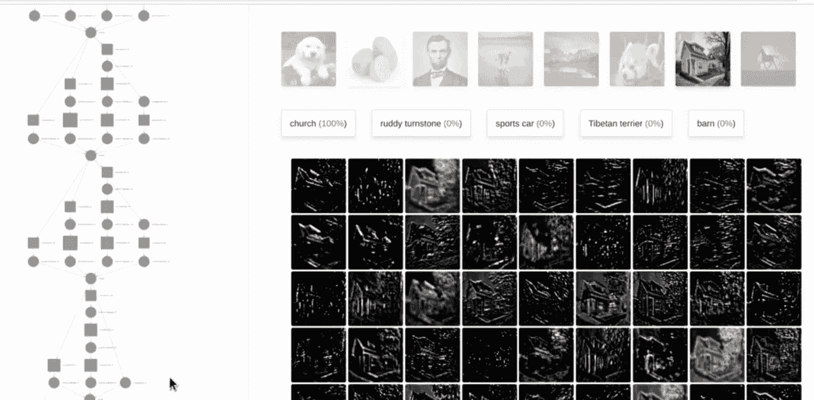

# 第二章：Keras 安装与 API

在上一章中，我们讨论了神经网络的基本原理，并提供了一些能够识别 MNIST 手写数字的网络示例。

本章将讲解如何安装 Keras、Theano 和 TensorFlow。我们将逐步介绍如何使环境正常运行，并在短时间内从直觉走向实际的神经网络。接下来，我们将讨论如何在基于容器的 Docker 化基础设施上安装这些工具，并在 Google GCP、Amazon AWS 和 Microsoft Azure 云平台上进行安装。此外，我们还将介绍 Keras API 的概述，以及一些常用操作，例如加载和保存神经网络的架构与权重、早期停止、历史保存、检查点以及与 TensorBoard 和 Quiver 的交互。让我们开始吧。

到本章结束时，我们将涵盖以下主题：

+   安装和配置 Keras

+   Keras 架构

# 安装 Keras

在接下来的章节中，我们将展示如何在多个平台上安装 Keras。

# 第 1 步 — 安装一些有用的依赖项

首先，我们安装 `numpy` 包，它提供对大型多维数组和矩阵的支持，以及高级数学函数。然后安装 `scipy`，这是一个用于科学计算的库。之后，可以安装 `scikit-learn`，这是一个被认为是机器学习的 Python 瑞士军刀的包。在本例中，我们将用它来进行数据探索。可选地，可以安装 `pillow`，一个用于图像处理的库，以及 `h5py`，这是一个用于数据序列化的库，Keras 用它来保存模型。只需要一条命令行即可安装所需的所有内容。或者，您可以安装 Anaconda Python，它会自动安装 `numpy`、`scipy`、`scikit-learn`、`h5py`、`pillow` 和其他很多科学计算所需的库（更多信息请参考：*批量归一化：通过减少内部协变量偏移加速深度网络训练*，作者 S. Ioffe 和 C. Szegedy，[arXiv.org/abs/1502.03167](https://arxiv.org/abs/1502.03167)，2015）。您可以在 [`docs.continuum.io/anaconda/pkg-docs`](https://docs.continuum.io/anaconda/pkg-docs) 查找 Anaconda Python 中可用的包。以下截图展示了如何为我们的工作安装这些包：


# 第 2 步 — 安装 Theano

我们可以使用 `pip` 来安装 Theano，如下图所示：


# 第 3 步 — 安装 TensorFlow

现在我们可以使用 TensorFlow 官方网站上的说明来安装 TensorFlow，[`www.tensorflow.org/versions/r0.11/get_started/os_setup.html#pip-installation`](https://www.tensorflow.org/versions/r0.11/get_started/os_setup.html#pip-installation)。同样，我们只是使用 `pip` 安装正确的包，如下图所示。例如，如果我们需要使用 GPU，那么选择适当的包非常重要：


# 第 4 步 — 安装 Keras

现在我们可以简单地安装 Keras 并开始测试已安装的环境。非常简单；我们再次使用 `pip`，如下面的截图所示：


# 第 5 步 — 测试 Theano、TensorFlow 和 Keras

现在让我们测试一下环境。首先来看一下如何在 Theano 中定义 sigmoid 函数。如你所见，这非常简单；我们只需写出数学公式并在矩阵上按元素计算该函数。只需运行 Python Shell 并按如下截图所示写下代码，即可得到结果：


所以，Theano 可以正常工作。接下来，我们通过简单地导入 MNIST 数据集来测试 TensorFlow，如下截图所示。在第一章《*神经网络基础*》中，我们已经看到了几个 Keras 网络的实际示例：


# 配置 Keras

Keras 具有一个非常简洁的配置文件。我们通过 `vi` 会话加载它。参数非常简单：

| **参数** | **值** |
| --- | --- |
| `image_dim_ordering` | 可以是 `tf` 表示 TensorFlow 的图像顺序，或者 `th` 表示 Theano 的图像顺序 |
| `epsilon` | 计算过程中使用的 `epsilon` 值 |
| `floatx` | 可以是 `float32` 或 `float64` |
| `backend` | 可以是 `tensorflow` 或 `theano` |

`image_dim_ordering` 的 `th` 值会为你提供一个相对不直观的图像维度顺序（深度、宽度和高度），而不是 `tf` 的（宽度、高度和深度）。以下是我机器上的默认参数：


如果你安装了支持 GPU 的 TensorFlow 版本，那么当 TensorFlow 被选作后端时，Keras 会自动使用你配置的 GPU。

# 在 Docker 上安装 Keras

启动 TensorFlow 和 Keras 的最简单方法之一是运行在 Docker 容器中。一个方便的解决方案是使用社区创建的深度学习预定义 Docker 镜像，它包含所有流行的深度学习框架（TensorFlow、Theano、Torch、Caffe 等）。请参考 GitHub 仓库 [`github.com/saiprashanths/dl-docker`](https://github.com/saiprashanths/dl-docker) 获取代码文件。假设你已经启动并运行了 Docker（有关更多信息，请参考 [`www.docker.com/products/overview`](https://www.docker.com/products/overview)），安装过程非常简单，如下所示：


下一个截图中显示的内容大致是：从 Git 获取图像后，我们构建 Docker 镜像：


在这个截图中，我们可以看到如何运行它：


从容器内，可以启用对 Jupyter Notebooks 的支持（有关更多信息，请参见 [`jupyter.org/`](http://jupyter.org/)）：


从主机机器直接通过端口访问：


还可以通过下面截图中的命令访问 TensorBoard（有关更多信息，请参见 [`www.tensorflow.org/how_tos/summaries_and_tensorboard/`](https://www.tensorflow.org/how_tos/summaries_and_tensorboard/)），该命令将在下一部分讨论：


运行前述命令后，您将被重定向到以下页面：


# 在 Google Cloud ML 上安装 Keras

在 Google Cloud 上安装 Keras 非常简单。首先，我们可以安装 Google Cloud （有关可下载文件，请参见 [`cloud.google.com/sdk/`](https://cloud.google.com/sdk/)），它是 Google Cloud Platform 的命令行界面；然后我们可以使用 CloudML，这是一个托管服务，允许我们轻松构建使用 TensorFlow 的机器学习模型。在使用 Keras 之前，让我们使用 Google Cloud 和 TensorFlow 来训练 GitHub 上提供的 MNIST 示例。代码是本地的，训练发生在云端：


在下一个截图中，您可以看到如何运行训练会话：


我们可以使用 TensorBoard 显示交叉熵如何随着迭代减少：


在下一个截图中，我们看到交叉熵的图形：


现在，如果我们想在 TensorFlow 上使用 Keras，只需从 PyPI 下载 Keras 源代码（有关可下载文件，请参见 [`pypi.Python.org/pypi/Keras/1.2.0`](https://pypi.Python.org/pypi/Keras/1.2.0) 或更高版本），然后像使用 CloudML 包解决方案一样直接使用 Keras，如以下示例所示：


这里，`trainer.task2.py` 是一个示例脚本：

```py
from keras.applications.vgg16 import VGG16
from keras.models import Model
from keras.preprocessing import image
from keras.applications.vgg16 import preprocess_input
import numpy as np

# pre-built and pre-trained deep learning VGG16 model
base_model = VGG16(weights='imagenet', include_top=True)
for i, layer in enumerate(base_model.layers):
  print (i, layer.name, layer.output_shape)

```

# 在 Amazon AWS 上安装 Keras

在 Amazon 上安装 TensorFlow 和 Keras 非常简单。事实上，可以使用一个名为 `TFAMI.v3` 的预构建 AMI，该 AMI 是开放且免费的（有关更多信息，请参见 [`github.com/ritchieng/tensorflow-aws-ami`](https://github.com/ritchieng/tensorflow-aws-ami)），如下所示：


此 AMI 在不到五分钟内运行 TensorFlow，并支持 TensorFlow、Keras、OpenAI Gym 及所有依赖项。截至 2017 年 1 月，它支持以下内容：

+   TensorFlow 0.12

+   Keras 1.1.0

+   TensorLayer 1.2.7

+   CUDA 8.0

+   CuDNN 5.1

+   Python 2.7

+   Ubuntu 16.04

此外，`TFAMI.v3` 可在 P2 计算实例上运行（有关更多信息，请参见 [`aws.amazon.com/ec2/instance-types/#p2`](https://aws.amazon.com/ec2/instance-types/#p2)），如以下截图所示：


P2 实例的一些特点如下：

+   Intel Xeon E5-2686v4（Broadwell）处理器

+   NVIDIA K80 GPU，每个具有 2,496 个并行核心和 12 GB GPU 内存

+   支持点对点 GPU 通信

+   提供增强的网络功能（更多信息，请参阅 [`aws.amazon.com/ec2/faqs/#What_networking_capabilities_are_included_in_this_feature`](https://aws.amazon.com/ec2/faqs/#What_networking_capabilities_are_included_in_this_feature)），提供 20 Gbps 的总网络带宽

`TFAMI.v3` 也适用于 G2 计算实例（更多信息，请参阅 [`aws.amazon.com/ec2/instance-types/#g2`](https://aws.amazon.com/ec2/instance-types/#g2)）。G2 实例的一些特点如下：

+   Intel Xeon E5-2670（Sandy Bridge）处理器

+   NVIDIA GPU，每个具有 1,536 个 CUDA 核心和 4 GB 显存

# 在 Microsoft Azure 上安装 Keras

在 Azure 上安装 Keras 的一种方法是安装 Docker 支持，然后获取包含 TensorFlow 和 Keras 的容器化版本。在线上，您也可以找到关于如何通过 Docker 安装 Keras 和 TensorFlow 的详细说明，但这本质上是我们在前面章节中已经看到的内容（更多信息，请参阅 [`blogs.msdn.microsoft.com/uk_faculty_connection/2016/09/26/tensorflow-on-docker-with-microsoft-azure/`](https://blogs.msdn.microsoft.com/uk_faculty_connection/2016/09/26/tensorflow-on-docker-with-microsoft-azure/)）。

如果您仅使用 Theano 作为后端，那么通过加载在 Cortana Intelligence Gallery 上提供的预构建包，Keras 只需点击即可运行（更多信息，请参阅 [`gallery.cortanaintelligence.com/Experiment/Theano-Keras-1`](https://gallery.cortanaintelligence.com/Experiment/Theano-Keras-1)）。

以下示例展示了如何将 Theano 和 Keras 作为 ZIP 文件直接导入 Azure ML，并在执行 Python 脚本模块中使用它们。此示例由 Hai Ning 提供（更多信息，请参阅 [`goo.gl/VLR25o`](https://goo.gl/VLR25o)），本质上是在 `azureml_main()` 方法内运行 Keras 代码：

```py
# The script MUST contain a function named azureml_main
# which is the entry point for this module.

# imports up here can be used to
import pandas as pd
import theano
import theano.tensor as T
from theano import function
from keras.models import Sequential
from keras.layers import Dense, Activation
import numpy as np
# The entry point function can contain up to two input arguments:
#   Param<dataframe1>: a pandas.DataFrame
#   Param<dataframe2>: a pandas.DataFrame
def azureml_main(dataframe1 = None, dataframe2 = None):
    # Execution logic goes here
    # print('Input pandas.DataFrame #1:rnrn{0}'.format(dataframe1))

    # If a zip file is connected to the third input port is connected,
    # it is unzipped under ".Script Bundle". This directory is added
    # to sys.path. Therefore, if your zip file contains a Python file
    # mymodule.py you can import it using:
    # import mymodule
    model = Sequential()
    model.add(Dense(1, input_dim=784, activation="relu"))
    model.compile(optimizer='rmsprop', loss='binary_crossentropy', metrics=['accuracy'])
    data = np.random.random((1000,784))
    labels = np.random.randint(2, size=(1000,1))
    model.fit(data, labels, nb_epoch=10, batch_size=32)
    model.evaluate(data, labels)

    return dataframe1,

```

在此截图中，您看到一个使用 Microsoft Azure ML 运行 Theano 和 Keras 的示例：


# Keras API

Keras 拥有模块化、简洁且易于扩展的架构。Keras 的作者 Francois Chollet 说：

该库的开发重点是实现快速实验。能够以尽可能短的延迟从想法到结果是进行良好研究的关键。

Keras 定义了在 TensorFlow（更多信息，请参阅 [`github.com/tensorflow/tensorflow`](https://github.com/tensorflow/tensorflow)）或 Theano（更多信息，请参阅 [`github.com/Theano/Theano`](https://github.com/Theano/Theano)）之上运行的高层神经网络。具体来说：

+   **模块化**：模型要么是一个序列，要么是一个独立模块的图，这些模块可以像 LEGO 积木一样组合在一起，构建神经网络。即，该库预定义了大量的模块，包含不同类型的神经网络层、损失函数、优化器、初始化方案、激活函数和正则化方案。

+   **极简主义**：该库是用 Python 实现的，每个模块都简洁且自描述。

+   **易于扩展**：该库可以通过新功能进行扩展，正如我们将在第七章中描述的那样，*附加深度学习模型*。

# 开始使用 Keras 架构

在这一部分，我们回顾了用于定义神经网络的最重要的 Keras 组件。首先，我们定义张量的概念，然后讨论组合预定义模块的不同方式，最后概述最常用的模块。

# 什么是张量？

Keras 使用 Theano 或 TensorFlow 执行对张量的高效计算。但张量到底是什么？张量其实就是一个多维数组或矩阵。这两个后端都能够高效地进行符号计算，张量是创建神经网络的基本构建块。

# 在 Keras 中组合模型

在 Keras 中有两种组合模型的方式。它们如下：

+   顺序组合

+   功能组合

让我们详细看看每一个。

# 顺序组合

第一种是顺序组合，将不同的预定义模型按顺序堆叠在一起，形成类似于堆栈或队列的线性层次结构。在第一章，*神经网络基础*中，我们看到了几个顺序流水线的示例。例如：

```py
model = Sequential()
model.add(Dense(N_HIDDEN, input_shape=(784,)))
model.add(Activation('relu'))
model.add(Dropout(DROPOUT))
model.add(Dense(N_HIDDEN))
model.add(Activation('relu'))
model.add(Dropout(DROPOUT))
model.add(Dense(nb_classes))
model.add(Activation('softmax'))
model.summary()

```

# 功能组合

组合模块的第二种方式是通过功能性 API，这种方式可以定义复杂的模型，如有向无环图、具有共享层的模型或多输出模型。我们将在第七章中看到这样的示例，*附加深度学习模型*。

# 预定义神经网络层概览

Keras 有许多预构建的层。让我们回顾一下最常用的层，并指出这些层在何种章节中最常使用。

# 常规密集

一个密集模型是一个全连接的神经网络层。我们已经在第一章，*神经网络基础*中看到了使用示例。这里是一个带有参数定义的原型：

```py
keras.layers.core.Dense(units, activation=None, use_bias=True, kernel_initializer='glorot_uniform', bias_initializer='zeros', kernel_regularizer=None, bias_regularizer=None, activity_regularizer=None, kernel_constraint=None, bias_constraint=None)

```

# 循环神经网络——简单的、LSTM 和 GRU

循环神经网络是一类利用输入序列特性的神经网络。这类输入可以是文本、语音、时间序列或任何其他序列中元素的出现依赖于前面元素的情况。我们将在第六章，*循环神经网络——RNN*中讨论简单的 LSTM 和 GRU 循环神经网络。这里展示了一些带有参数定义的原型：

```py
keras.layers.recurrent.Recurrent(return_sequences=False, go_backwards=False, stateful=False, unroll=False, implementation=0)

keras.layers.recurrent.SimpleRNN(units, activation='tanh', use_bias=True, kernel_initializer='glorot_uniform', recurrent_initializer='orthogonal', bias_initializer='zeros', kernel_regularizer=None, recurrent_regularizer=None, bias_regularizer=None, activity_regularizer=None, kernel_constraint=None, recurrent_constraint=None, bias_constraint=None, dropout=0.0, recurrent_dropout=0.0)

keras.layers.recurrent.GRU(units, activation='tanh', recurrent_activation='hard_sigmoid', use_bias=True, kernel_initializer='glorot_uniform', recurrent_initializer='orthogonal', bias_initializer='zeros', kernel_regularizer=None, recurrent_regularizer=None, bias_regularizer=None, activity_regularizer=None, kernel_constraint=None, recurrent_constraint=None, bias_constraint=None, dropout=0.0, recurrent_dropout=0.0)

keras.layers.recurrent.LSTM(units, activation='tanh', recurrent_activation='hard_sigmoid', use_bias=True, kernel_initializer='glorot_uniform', recurrent_initializer='orthogonal', bias_initializer='zeros', unit_forget_bias=True, kernel_regularizer=None, recurrent_regularizer=None, bias_regularizer=None, activity_regularizer=None, kernel_constraint=None, recurrent_constraint=None, bias_constraint=None, dropout=0.0, recurrent_dropout=0.0)

```

# 卷积层和池化层

卷积网络（ConvNets）是一类使用卷积和池化操作，通过逐步学习基于不同抽象层次的复杂模型的神经网络。这种通过逐步抽象的学习方式，类似于人类大脑中经过数百万年演化的视觉模型。几年前，人们称其为*深度*，通常指的是 3 到 5 层，而现在它已经发展到 100 到 200 层。我们将在第三章，*深度学习与卷积网络*中讨论卷积神经网络。以下是带有参数定义的原型：

```py
keras.layers.convolutional.Conv1D(filters, kernel_size, strides=1, padding='valid', dilation_rate=1, activation=None, use_bias=True, kernel_initializer='glorot_uniform', bias_initializer='zeros', kernel_regularizer=None, bias_regularizer=None, activity_regularizer=None, kernel_constraint=None, bias_constraint=None)

keras.layers.convolutional.Conv2D(filters, kernel_size, strides=(1, 1), padding='valid', data_format=None, dilation_rate=(1, 1), activation=None, use_bias=True, kernel_initializer='glorot_uniform', bias_initializer='zeros', kernel_regularizer=None, bias_regularizer=None, activity_regularizer=None, kernel_constraint=None, bias_constraint=None)

keras.layers.pooling.MaxPooling1D(pool_size=2, strides=None, padding='valid')

keras.layers.pooling.MaxPooling2D(pool_size=(2, 2), strides=None, padding='valid', data_format=None)

```

# 正则化

正则化是一种防止过拟合的方法。我们已经在第一章，*神经网络基础*中看到过使用示例。多个层有用于正则化的参数。以下是常用于全连接和卷积模块的正则化参数列表：

+   `kernel_regularizer`：应用于权重矩阵的正则化函数

+   `bias_regularizer`：应用于偏置向量的正则化函数

+   `activity_regularizer`：应用于层输出（激活）的正则化函数

此外，还可以使用 Dropout 进行正则化，这通常是一个非常有效的选择

```py
keras.layers.core.Dropout(rate, noise_shape=None, seed=None)

```

其中：

+   `rate`：它是一个介于 0 和 1 之间的浮动数，表示丢弃的输入单元的比例

+   `noise_shape`：它是一个一维整数张量，表示将与输入相乘的二进制丢弃掩码的形状

+   `seed`：它是一个整数，用作随机种子

# 批量归一化

批量归一化（欲了解更多信息，请参考[`www.colwiz.com/cite-in-google-docs/cid=f20f9683aaf69ce`](https://www.colwiz.com/cite-in-google-docs/cid=f20f9683aaf69ce)）是一种加速学习并通常实现更高准确率的方法。我们将在第四章，*生成对抗网络与 WaveNet*中讨论 GAN 时展示使用示例。以下是带有参数定义的原型：

```py
keras.layers.normalization.BatchNormalization(axis=-1, momentum=0.99, epsilon=0.001, center=True, scale=True, beta_initializer='zeros', gamma_initializer='ones', moving_mean_initializer='zeros', moving_variance_initializer='ones', beta_regularizer=None, gamma_regularizer=None, beta_constraint=None, gamma_constraint=None)

```

# 预定义激活函数概述

激活函数包括常用的函数，如 Sigmoid、线性、双曲正切和 ReLU。我们在第一章《神经网络基础》中看到了一些激活函数的示例，更多示例将在后续章节中呈现。以下图示为 Sigmoid、线性、双曲正切和 ReLU 激活函数的示例：

| **Sigmoid** | **线性** |
| --- | --- |
| **双曲正切** | **ReLU** |

# 损失函数概述

损失函数（或目标函数，或优化得分函数；更多信息，请参见[`keras.io/losses/`](https://keras.io/losses/)）可以分为四类：

+   准确率用于分类问题。可选择多种方法：`binary_accuracy`（二分类问题中所有预测的平均准确率），`categorical_accuracy`（多分类问题中所有预测的平均准确率），`sparse_categorical_accuracy`（适用于稀疏目标），以及`top_k_categorical_accuracy`（当目标类别位于提供的 `top_k` 预测之内时成功）。

+   错误损失，用于衡量预测值与实际观察值之间的差异。可选择多种方法：`mse`（预测值与目标值之间的均方误差），`rmse`（预测值与目标值之间的均方根误差），`mae`（预测值与目标值之间的均绝对误差），`mape`（预测值与目标值之间的均百分比误差），以及`msle`（预测值与目标值之间的均平方对数误差）。

+   铰链损失，通常用于训练分类器。有两个版本：*hinge* 定义为  和 *平方铰链* 定义为铰链损失的平方值。

+   类别损失用于计算分类问题的交叉熵。有多个版本，包括二元交叉熵（更多信息，请参见[`en.wikipedia.org/wiki/Cross_entropy`](https://en.wikipedia.org/wiki/Cross_entropy)），以及类别交叉熵。

我们在第一章《神经网络基础》中看到了一些目标函数的示例，更多示例将在后续章节中呈现。

# 度量函数概述

度量函数（更多信息，请参见[`keras.io/metrics/`](https://keras.io/metrics/)）类似于目标函数，唯一的区别是评估度量函数时得到的结果不会用于训练模型。我们在第一章《神经网络基础》中看到了一些度量函数的示例，更多示例将在后续章节中呈现。

# 优化器概述

优化器包括 SGD、RMSprop 和 Adam。我们在第一章《神经网络基础》中看到了几个优化器的示例，更多的示例（如 Adagrad 和 Adadelta；更多信息，请参考[`keras.io/optimizers/`](https://keras.io/optimizers/)）将在后续章节中展示。

# 一些有用的操作

在这里，我们报告了一些可以通过 Keras API 执行的实用操作。目标是简化网络的创建、训练过程和中间结果的保存。

# 保存和加载模型的权重和架构

模型架构可以轻松保存和加载，如下所示：

```py
# save as JSON json_string = model.to_json()
# save as YAML yaml_string = model.to_yaml() 
# model reconstruction from JSON: from keras.models import model_from_json model = model_from_json(json_string) # model reconstruction from YAML model = model_from_yaml(yaml_string)

```

模型参数（权重）可以轻松保存和加载，如下所示：

```py
from keras.models import load_model model.save('my_model.h5')
# creates a HDF5 file 'my_model.h5' del model
# deletes the existing model
# returns a compiled model
# identical to the previous one model = load_model('my_model.h5')

```

# 用于自定义训练过程的回调函数

当某个指标停止改善时，可以使用适当的`callback`停止训练过程：

```py
keras.callbacks.EarlyStopping(monitor='val_loss', min_delta=0,  
patience=0, verbose=0, mode='auto')

```

通过定义如下的`callback`，可以保存损失历史：

```py
class LossHistory(keras.callbacks.Callback):     def on_train_begin(self, logs={}):         self.losses = []     def on_batch_end(self, batch, logs={}):         self.losses.append(logs.get('loss')) model = Sequential() model.add(Dense(10, input_dim=784, init='uniform')) model.add(Activation('softmax')) model.compile(loss='categorical_crossentropy', optimizer='rmsprop') history = LossHistory() model.fit(X_train,Y_train, batch_size=128, nb_epoch=20,  
verbose=0, callbacks=[history]) print history.losses

```

# 检查点

检查点是一个过程，它定期保存应用程序的状态快照，以便在失败时从最后保存的状态重新启动应用程序。这在训练深度学习模型时非常有用，因为这通常是一个耗时的任务。深度学习模型在任何时刻的状态就是该时刻的模型权重。Keras 将这些权重以 HDF5 格式保存（更多信息，请参考[`www.hdfgroup.org/`](https://www.hdfgroup.org/)），并通过其回调 API 提供检查点功能。

一些可能需要使用检查点的场景包括以下几点：

+   如果你希望在 AWS Spot 实例（更多信息，请参考[`docs.aws.amazon.com/AWSEC2/latest/UserGuide/how-spot-instances-work.html`](http://docs.aws.amazon.com/AWSEC2/latest/UserGuide/how-spot-instances-work.html)）或 Google 抢占式虚拟机（更多信息，请参考[`cloud.google.com/compute/docs/instances/preemptible`](https://cloud.google.com/compute/docs/instances/preemptible)）意外终止后，能够从上次检查点重新开始

+   如果你想停止训练，可能是为了在测试数据上测试模型，然后从上次检查点继续训练

+   如果你希望保留训练过程中最好的版本（通过某些指标，如验证损失）

第一和第二种场景可以通过在每个 epoch 后保存检查点来处理，这可以通过默认使用`ModelCheckpoint`回调来实现。以下代码演示了如何在 Keras 中训练深度学习模型时添加检查点：

```py
from __future__ import division, print_function 
from keras.callbacks import ModelCheckpoint 
from keras.datasets import mnist 
from keras.models import Sequential 
from keras.layers.core import Dense, Dropout 
from keras.utils import np_utils 
import numpy as np 
import os 

BATCH_SIZE = 128 
NUM_EPOCHS = 20 
MODEL_DIR = "/tmp" 

(Xtrain, ytrain), (Xtest, ytest) = mnist.load_data() 
Xtrain = Xtrain.reshape(60000, 784).astype("float32") / 255 
Xtest = Xtest.reshape(10000, 784).astype("float32") / 255 
Ytrain = np_utils.to_categorical(ytrain, 10) 
Ytest = np_utils.to_categorical(ytest, 10) 
print(Xtrain.shape, Xtest.shape, Ytrain.shape, Ytest.shape) 

model = Sequential() 
model.add(Dense(512, input_shape=(784,), activation="relu")) 
model.add(Dropout(0.2)) 
model.add(Dense(512, activation="relu")) 
model.add(Dropout(0.2)) 
model.add(Dense(10, activation="softmax")) 

model.compile(optimizer="rmsprop", loss="categorical_crossentropy", 
              metrics=["accuracy"]) 

# save best model 
checkpoint = ModelCheckpoint( 
    filepath=os.path.join(MODEL_DIR, "model-{epoch:02d}.h5")) 
model.fit(Xtrain, Ytrain, batch_size=BATCH_SIZE, nb_epoch=NUM_EPOCHS, 
          validation_split=0.1, callbacks=[checkpoint])

```

第三种场景涉及监控某个指标，如验证准确率或损失，并且仅在当前指标优于之前保存的检查点时才保存检查点。Keras 提供了一个额外的参数`save_best_only`，在实例化检查点对象时需要将其设置为`true`以支持此功能。

# 使用 TensorBoard 和 Keras

Keras 提供了一个回调函数，用于保存训练和测试指标，以及模型中不同层的激活直方图：

```py
keras.callbacks.TensorBoard(log_dir='./logs', histogram_freq=0,  
write_graph=True, write_images=False)

```

保存的数据可以通过在命令行启动的 TensorBoard 进行可视化：

```py
tensorboard --logdir=/full_path_to_your_logs

```

# 使用 Quiver 和 Keras

在第三章，*卷积神经网络与深度学习*中，我们将讨论卷积神经网络（ConvNets），这是一种用于处理图像的高级深度学习技术。这里我们预览一下 Quiver（更多信息请参见[`github.com/jakebian/quiver`](https://github.com/jakebian/quiver)），它是一个用于以交互方式可视化卷积神经网络特征的工具。安装过程相当简单，安装后，Quiver 可以通过一行命令来使用：

```py
pip install quiver_engine 

from quiver_engine import server     server.launch(model)

```

这将在 `localhost:5000` 启动可视化。Quiver 允许你像下面的示例一样直观地检查神经网络：



# 总结

本章我们讨论了如何在以下环境中安装 Theano、TensorFlow 和 Keras：

+   在本地机器上

+   基于容器的 Docker 化基础设施

+   在云端使用 Google GCP、Amazon AWS 和 Microsoft Azure

除此之外，我们还查看了几个模块，这些模块定义了 Keras API 以及一些常用操作，如加载和保存神经网络的架构和权重、早期停止、历史保存、检查点、与 TensorBoard 的交互以及与 Quiver 的交互。

在下一章中，我们将介绍卷积网络的概念，它是深度学习中的一项基础创新，已经在多个领域取得了成功应用，从文本、视频到语音，远远超出了最初在图像处理领域的应用。
