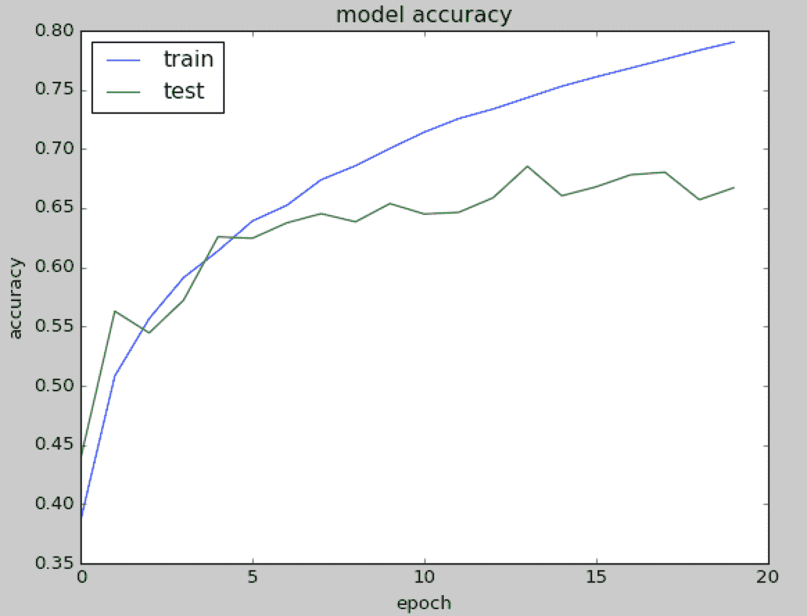

# 第三章：使用卷积神经网络的深度学习

在前面的章节中，我们讨论了密集网络，其中每一层都与相邻的层完全连接。我们将这些密集网络应用于分类 MNIST 手写字符数据集。在那种情况下，输入图像中的每个像素都被分配给一个神经元，总共有 784 个（28 x 28 像素）输入神经元。然而，这种策略并没有利用每个图像的空间结构和关系。特别地，这段代码将每个书写数字的位图转换为一个平坦的向量，在这个过程中，空间局部性丧失：

```py
#X_train is 60000 rows of 28x28 values --> reshaped in 60000 x 784
X_train = X_train.reshape(60000, 784)
X_test = X_test.reshape(10000, 784)
o

```

卷积神经网络（也称为 ConvNet）利用空间信息，因此非常适合分类图像。这些网络使用一种受生物学数据启发的特殊架构，这些数据来自对视觉皮层进行的生理实验。正如我们所讨论的，我们的视觉是基于多个皮层层级的，每一层识别越来越结构化的信息。首先，我们看到单个像素；然后从这些像素中，我们识别出简单的几何形状。接着...越来越复杂的元素，如物体、面孔、人类身体、动物等等。

卷积神经网络确实令人着迷。在短短的时间内，它们成为了一种*颠覆性*技术，突破了多个领域的所有最先进成果，从文本到视频，再到语音，远远超出了最初的图像处理领域。

本章将涵盖以下主题：

+   深度卷积神经网络

+   图像分类

# 深度卷积神经网络 — DCNN

**深度卷积神经网络**（**DCNN**）由许多神经网络层组成。通常交替使用两种不同类型的层，卷积层和池化层。每个滤波器的深度从网络的左到右逐渐增加。最后阶段通常由一个或多个全连接层组成：


卷积神经网络之外有三个关键直觉：

+   局部感受野

+   共享权重

+   池化

让我们回顾一下它们。

# 局部感受野

如果我们希望保持空间信息，那么用像素矩阵表示每张图像是很方便的。然后，一种简单的编码局部结构的方法是将相邻输入神经元的子矩阵连接到下一个层中的一个隐藏神经元。这一个隐藏神经元代表一个局部感受野。需要注意的是，这个操作被称为卷积，它也给这种类型的网络命名。

当然，我们可以通过使用重叠的子矩阵来编码更多的信息。例如，假设每个子矩阵的大小为 5 x 5，并且这些子矩阵与 28 x 28 像素的 MNIST 图像一起使用。这样，我们将能够在下一个隐藏层中生成 23 x 23 的局部感受野神经元。实际上，只有在滑动子矩阵 23 个位置后，才会触及图像的边界。在 Keras 中，每个子矩阵的大小称为**步幅长度**，这是一个可以在构建网络时进行微调的超参数。

假设我们定义从一层到另一层的特征图。当然，我们可以有多个特征图，它们各自独立地从每个隐藏层中学习。例如，我们可以从 28 x 28 的输入神经元开始处理 MNIST 图像，然后在下一个隐藏层中回调 *k* 个特征图，每个特征图的大小为 23 x 23 个神经元（同样步幅为 5 x 5）。

# 共享权重和偏置

假设我们想摆脱行像素表示，转而通过获得在输入图像中放置位置无关的相同特征的能力。一个简单的直觉是对隐藏层中的所有神经元使用相同的一组权重和偏置。这样，每一层都会学习从图像中提取的、位置无关的潜在特征。

假设输入图像的形状是 *(256, 256)*，并且具有三个通道，在 *tf*（TensorFlow）顺序下表示为 *(256, 256, 3)*。请注意，在 th（Theano）模式下，通道维度（深度）位于索引 *1* 位置；而在 *tf*（TensorFlow）模式下，位于索引 *3* 位置。

在 Keras 中，如果我们想添加一个卷积层，输出维度为 32，每个滤波器的扩展为 3 x 3，我们将写道：

```py
model = Sequential()
model.add(Conv2D(32, (3, 3), input_shape=(256, 256, 3))

```

或者，我们将写道：

```py
model = Sequential()
model.add(Conv2D(32, kernel_size=3, input_shape=(256, 256, 3))

```

这意味着我们在一个 256 x 256 的图像上应用 3 x 3 的卷积，图像有三个输入通道（或输入滤波器），并且结果是 32 个输出通道（或输出滤波器）。

以下是卷积示例：


# 池化层

假设我们想总结一个特征图的输出。同样，我们可以利用来自单个特征图的输出的空间连续性，将子矩阵的值聚合为一个单一的输出值，这个值合成地描述了与该物理区域相关的*意义*。

# 最大池化

一种简单而常见的选择是*最大池化*，它仅输出在该区域内观察到的最大激活值。在 Keras 中，如果我们想定义一个 2 x 2 大小的最大池化层，我们将写道：

```py
model.add(MaxPooling2D(pool_size = (2, 2)))

```

以下是最大池化示例：


# 平均池化

另一个选择是平均池化，它仅将一个区域的激活值聚合为该区域观察到的激活值的平均值。

请注意，Keras 实现了大量的池化层，完整的池化层列表可以在以下链接找到：[`keras.io/layers/pooling/`](https://keras.io/layers/pooling/)。简而言之，所有的池化操作无非是在给定区域上的汇总操作。

# ConvNets 总结

到目前为止，我们已经描述了 ConvNets 的基本概念。卷积神经网络（CNNs）在一维（时间维度）上对音频和文本数据应用卷积和池化操作，在二维（高 × 宽）上对图像进行卷积和池化操作，在三维（高 × 宽 × 时间）上对视频进行卷积和池化操作。对于图像，将滤波器滑动在输入体积上，产生一个映射，显示每个空间位置的滤波器响应。换句话说，ConvNet 有多个滤波器堆叠在一起，它们学习识别特定的视觉特征，而不受图像中位置的影响。网络初期的视觉特征较为简单，随着网络层数加深，特征变得越来越复杂。

# DCNN 示例 — LeNet

Yann le Cun 提出了一个名为 LeNet 的卷积神经网络（更多信息参见：*Convolutional Networks for Images, Speech, and Time-Series*，作者 Y. LeCun 和 Y. Bengio，脑理论神经网络，卷 3361，1995 年），该网络用于识别 MNIST 手写字符，具有对简单几何变换和失真的鲁棒性。这里的关键直觉是，低层交替使用卷积操作和最大池化操作。卷积操作基于精心选择的局部感受野，并为多个特征图共享权重。然后，更高层是基于传统多层感知器（MLP）结构的全连接层，其中包含隐藏层，输出层使用 softmax 激活函数。

# Keras 中的 LeNet 代码

要定义 LeNet 代码，我们使用一个卷积 2D 模块，具体如下：

```py
keras.layers.convolutional.Conv2D(filters, kernel_size, padding='valid')

```

在这里，`filters` 表示使用的卷积核数量（例如，输出的维度），`kernel_size` 是一个整数或一个包含两个整数的元组/列表，指定 2D 卷积窗口的宽度和高度（可以是一个单独的整数，以指定所有空间维度的相同值），而 `padding='same'` 表示使用了填充。这里有两个选项：`padding='valid'` 表示卷积仅在输入和滤波器完全重叠的地方计算，因此输出小于输入；而 `padding='same'` 表示输出的尺寸与输入*相同*，为此，输入周围的区域会用零进行填充。

此外，我们使用 `MaxPooling2D` 模块：

```py
keras.layers.pooling.MaxPooling2D(pool_size=(2, 2), strides=(2, 2))

```

在这里，`pool_size=(2, 2)` 是一个包含两个整数的元组，表示图像在垂直和水平方向上缩小的比例。因此，*(2, 2)* 将在每个维度上将图像减半，而 `strides=(2, 2)` 是处理时使用的步长。

现在，让我们回顾一下代码。首先我们导入一些模块：

```py
from keras import backend as K
from keras.models import Sequential
from keras.layers.convolutional import Conv2D
from keras.layers.convolutional import MaxPooling2D
from keras.layers.core import Activation
from keras.layers.core import Flatten
from keras.layers.core import Dense
from keras.datasets import mnist
from keras.utils import np_utils
from keras.optimizers import SGD, RMSprop, Adam
import numpy as np
import matplotlib.pyplot as plt

```

然后我们定义 LeNet 网络：

```py
#define the ConvNet
class LeNet:
    @staticmethod
    def build(input_shape, classes):
         model = Sequential()
         # CONV => RELU => POOL

```

我们有一个包含 ReLU 激活的第一卷积阶段，然后是最大池化。我们的网络将学习 20 个卷积滤波器，每个大小为 5 x 5。输出维度与输入形状相同，因此为 28 x 28。请注意，由于`Convolution2D`是我们管道的第一个阶段，我们还需要定义它的`input_shape`。最大池化操作实现一个滑动窗口，在层上滑动，并在每个区域垂直和水平方向上以两个像素的步长取最大值：

```py
model.add(Convolution2D(20, kernel_size=5, padding="same",
input_shape=input_shape))
model.add(Activation("relu"))
model.add(MaxPooling2D(pool_size=(2, 2), strides=(2, 2)))
# CONV => RELU => POOL

```

然后是第二个带 ReLU 激活的卷积阶段，再次进行最大池化。在这种情况下，我们将从之前的 20 增加到 50 个学习的卷积滤波器。在深层增加滤波器的数量是深度学习中常用的技术：

```py
model.add(Conv2D(50, kernel_size=5, border_mode="same"))
model.add(Activation("relu"))
model.add(MaxPooling2D(pool_size=(2, 2), strides=(2, 2)))

```

然后我们有一个相当标准的扁平化和 500 个神经元的密集网络，后跟一个有 10 类的 softmax 分类器：

```py
# Flatten => RELU layers
model.add(Flatten())
model.add(Dense(500))
model.add(Activation("relu"))
# a softmax classifier
model.add(Dense(classes))
model.add(Activation("softmax"))
return model

```

恭喜！您刚刚定义了第一个深度学习网络！让我们看看它的视觉效果：


现在我们需要一些额外的代码来训练网络，但这与我们已在第一章中描述的内容非常相似，*神经网络基础*。这次，我们还展示了打印损失的代码：

```py
# network and training
NB_EPOCH = 20
BATCH_SIZE = 128
VERBOSE = 1
OPTIMIZER = Adam()
VALIDATION_SPLIT=0.2
IMG_ROWS, IMG_COLS = 28, 28 # input image dimensions
NB_CLASSES = 10 # number of outputs = number of digits
INPUT_SHAPE = (1, IMG_ROWS, IMG_COLS)
# data: shuffled and split between train and test sets
(X_train, y_train), (X_test, y_test) = mnist.load_data()
k.set_image_dim_ordering("th")
# consider them as float and normalize
X_train = X_train.astype('float32')
X_test = X_test.astype('float32')
X_train /= 255
X_test /= 255
# we need a 60K x [1 x 28 x 28] shape as input to the CONVNET
X_train = X_train[:, np.newaxis, :, :]
X_test = X_test[:, np.newaxis, :, :]
print(X_train.shape[0], 'train samples')
print(X_test.shape[0], 'test samples')
# convert class vectors to binary class matrices
y_train = np_utils.to_categorical(y_train, NB_CLASSES)
y_test = np_utils.to_categorical(y_test, NB_CLASSES)
# initialize the optimizer and model
model = LeNet.build(input_shape=INPUT_SHAPE, classes=NB_CLASSES)
model.compile(loss="categorical_crossentropy", optimizer=OPTIMIZER,
metrics=["accuracy"])
history = model.fit(X_train, y_train,
batch_size=BATCH_SIZE, epochs=NB_EPOCH,
verbose=VERBOSE, validation_split=VALIDATION_SPLIT)
score = model.evaluate(X_test, y_test, verbose=VERBOSE)
print("Test score:", score[0])
print('Test accuracy:', score[1])
# list all data in history
print(history.history.keys())
# summarize history for accuracy
plt.plot(history.history['acc'])
plt.plot(history.history['val_acc'])
plt.title('model accuracy')
plt.ylabel('accuracy')
plt.xlabel('epoch')
plt.legend(['train', 'test'], loc='upper left')
plt.show()
# summarize history for loss
plt.plot(history.history['loss'])
plt.plot(history.history['val_loss'])
plt.title('model loss')
plt.ylabel('loss')
plt.xlabel('epoch')
plt.legend(['train', 'test'], loc='upper left')
plt.show()

```

现在让我们运行代码。正如您所看到的，时间显著增加，我们深度网络中的每次迭代现在需要约 134 秒，而在第一章中定义的网络，*神经网络基础*，每次迭代只需约 1-2 秒。然而，准确率已经达到了新的峰值 99.06%：


让我们绘制模型的准确率和损失，我们可以理解，仅需 4 - 5 次迭代即可达到类似 99.2%的准确率：

|  |  |
| --- | --- |

在下面的截图中，我们展示了我们模型达到的最终准确率：


让我们看看一些 MNIST 图像，以了解 99.2%的准确率有多好！例如，人们写数字 9 的方式有很多种，在以下图表中显示了其中一种。对于数字 3、7、4 和 5 也是如此。在这张图中，数字**1**是如此难以识别，甚至可能连人类也会有问题：


到目前为止，我们通过不同的模型总结了所有的进展，如下图所示。我们的简单网络从 92.22%的准确率开始，这意味着大约 100 个手写字符中有 8 个识别错误。然后，通过深度学习架构获得了 7%，达到了 99.20%的准确率，这意味着大约 100 个手写字符中有 1 个识别错误：


# 理解深度学习的力量

我们可以进行另一个测试，以更好地理解深度学习和卷积神经网络（ConvNet）的强大能力，那就是减少训练集的大小，并观察性能随之下降的情况。一种方法是将 50,000 个样本的训练集拆分成两个不同的子集：

+   用于训练我们模型的合适训练集将逐步减少其大小（5,900、3,000、1,800、600 和 300 个样本）

+   用于估算模型训练效果的验证集将由剩余的样本组成

我们的测试集始终固定，包含 10,000 个样本。

在这个设置下，我们将刚定义的深度学习卷积神经网络与第一章中定义的第一个神经网络示例进行比较，*神经网络基础*。正如我们在下面的图表中看到的那样，我们的深度网络始终优于简单网络，并且当提供的训练样本数量逐步减少时，差距越来越明显。使用 5,900 个训练样本时，深度学习网络的准确率为 96.68%，而简单网络的准确率为 85.56%。更重要的是，即使只有 300 个训练样本，我们的深度学习网络仍然能够达到 72.44%的准确率，而简单网络的准确率则显著下降至 48.26%。所有实验只进行了四次训练迭代。这证明了深度学习所带来的突破性进展。乍一看，这从数学角度来看可能会令人惊讶，因为深度网络有更多的未知数（权重），所以人们可能会认为需要更多的数据点。然而，保持空间信息，加入卷积、池化和特征图是卷积神经网络的创新，这一结构已经在数百万年的时间里得到了优化（因为它的灵感来源于视觉皮层）：


关于 MNIST 的最新成果列表可访问：[`rodrigob.github.io/are_we_there_yet/build/classification_datasets_results.html`](http://rodrigob.github.io/are_we_there_yet/build/classification_datasets_results.html)。截至 2017 年 1 月，最佳结果的错误率为 0.21%。

# 使用深度学习识别 CIFAR-10 图像

CIFAR-10 数据集包含 60,000 张 32 x 32 像素、3 通道的彩色图像，分为 10 个类别。每个类别包含 6,000 张图像。训练集包含 50,000 张图像，而测试集提供 10,000 张图像。这张来自 CIFAR 数据集的图像（[`www.cs.toronto.edu/~kriz/cifar.html`](https://www.cs.toronto.edu/~kriz/cifar.html)）展示了 10 个类别中的一些随机示例：


目标是识别先前未见过的图像，并将它们分配到 10 个类别中的一个。让我们定义一个合适的深度网络。

首先，我们导入一些有用的模块，定义几个常量，并加载数据集：

```py
from keras.datasets import cifar10
from keras.utils import np_utils
from keras.models import Sequential
from keras.layers.core import Dense, Dropout, Activation, Flatten
from keras.layers.convolutional import Conv2D, MaxPooling2D
from keras.optimizers import SGD, Adam, RMSprop
import matplotlib.pyplot as plt

# CIFAR_10 is a set of 60K images 32x32 pixels on 3 channels
IMG_CHANNELS = 3
IMG_ROWS = 32
IMG_COLS = 32

#constant
BATCH_SIZE = 128
NB_EPOCH = 20
NB_CLASSES = 10
VERBOSE = 1
VALIDATION_SPLIT = 0.2
OPTIM = RMSprop()

#load dataset
(X_train, y_train), (X_test, y_test) = cifar10.load_data()
print('X_train shape:', X_train.shape)
print(X_train.shape[0], 'train samples')
print(X_test.shape[0], 'test samples')

```

现在我们进行独热编码并对图像进行归一化：

```py
# convert to categorical
Y_train = np_utils.to_categorical(y_train, NB_CLASSES)
Y_test = np_utils.to_categorical(y_test, NB_CLASSES)

# float and normalization
X_train = X_train.astype('float32')
X_test = X_test.astype('float32')
X_train /= 255
X_test /= 255

```

我们的网络将学习 32 个卷积滤波器，每个滤波器的大小为 3 x 3。输出维度与输入形状相同，因此为 32 x 32，激活函数为 ReLU，这是一种引入非线性的简单方式。之后我们会进行一个 2 x 2 大小的最大池化操作，并使用 25%的 dropout：

```py
# network
model = Sequential()
model.add(Conv2D(32, (3, 3), padding='same',
input_shape=(IMG_ROWS, IMG_COLS, IMG_CHANNELS)))
model.add(Activation('relu'))
model.add(MaxPooling2D(pool_size=(2, 2)))
model.add(Dropout(0.25))

```

深度管道的下一阶段是一个包含 512 个单元的密集网络，激活函数为 ReLU，随后是 50%的 dropout，最后是一个包含 10 个类别输出的 softmax 层，每个类别对应一个输出：

```py
model.add(Flatten())
model.add(Dense(512))
model.add(Activation('relu'))
model.add(Dropout(0.5))
model.add(Dense(NB_CLASSES))
model.add(Activation('softmax'))
model.summary()

```

在定义了网络后，我们可以训练模型。在这种情况下，我们将数据拆分，并计算出一个验证集，除了训练集和测试集。训练集用于构建我们的模型，验证集用于选择表现最好的方法，而测试集用于检验我们最好的模型在全新数据上的表现：

```py
# train
model.compile(loss='categorical_crossentropy', optimizer=OPTIM,
metrics=['accuracy'])
model.fit(X_train, Y_train, batch_size=BATCH_SIZE,
epochs=NB_EPOCH, validation_split=VALIDATION_SPLIT,
verbose=VERBOSE)
score = model.evaluate(X_test, Y_test,
batch_size=BATCH_SIZE, verbose=VERBOSE)
print("Test score:", score[0])
print('Test accuracy:', score[1])

```

在这种情况下，我们保存了我们深度网络的架构：

```py
#save model
model_json = model.to_json()
open('cifar10_architecture.json', 'w').write(model_json)
And the weights learned by our deep network on the training set
model.save_weights('cifar10_weights.h5', overwrite=True)

```

让我们运行代码。我们的网络经过 20 次迭代，测试准确率达到了 66.4%。我们还打印了准确率和损失图，并使用`model.summary()`输出了网络结构：


在下图中，我们展示了网络在训练集和测试集上所达到的准确率和损失：

|  |  |
| --- | --- |

# 通过更深的网络提高 CIFAR-10 的性能

提高性能的一种方法是定义一个更深的网络，包含多个卷积操作。在这个示例中，我们有一个模块序列：

*conv+conv+maxpool+dropout+conv+conv+maxpool*

接着是一个标准的*dense+dropout+dense*结构。所有的激活函数均为 ReLU。

让我们看看新网络的代码：

```py
model = Sequential()
model.add(Conv2D(32, (3, 3), padding='same',
input_shape=(IMG_ROWS, IMG_COLS, IMG_CHANNELS)))
model.add(Activation('relu'))
model.add(Conv2D(32, (3, 3), padding='same'))
model.add(Activation('relu'))
model.add(MaxPooling2D(pool_size=(2, 2)))
model.add(Dropout(0.25))
model.add(Conv2D(64, (3, 3), padding='same'))
model.add(Activation('relu'))
model.add(Conv2D(64, 3, 3))
model.add(Activation('relu'))
model.add(MaxPooling2D(pool_size=(2, 2)))
model.add(Dropout(0.25))
model.add(Flatten())
model.add(Dense(512))
model.add(Activation('relu'))
model.add(Dropout(0.5))
model.add(Dense(NB_CLASSES))
model.add(Activation('softmax'))

```

恭喜！你已经定义了一个更深的网络。让我们运行代码！首先我们输出网络结构，然后运行 40 次迭代，准确率达到了 76.9%：


在下图中，我们可以看到经过 40 次迭代后所达到的准确率：


所以相较于之前的简单深层网络，我们提高了 10.5%的性能。为了完整起见，我们还报告了训练过程中的准确率和损失，如下所示：

|  |  |
| --- | --- |

# 通过数据增强提高 CIFAR-10 的性能

提高性能的另一种方法是为我们的训练生成更多的图像。关键的直觉是，我们可以使用标准的 CIFAR 训练集，并通过多种类型的变换对其进行增强，包括旋转、重缩放、水平/垂直翻转、缩放、通道偏移等。让我们看看代码：

```py
from keras.preprocessing.image import ImageDataGenerator
from keras.datasets import cifar10
import numpy as np
NUM_TO_AUGMENT=5

#load dataset
(X_train, y_train), (X_test, y_test) = cifar10.load_data()

# augumenting
print("Augmenting training set images...")
datagen = ImageDataGenerator(
rotation_range=40,
width_shift_range=0.2,
height_shift_range=0.2,
zoom_range=0.2,
horizontal_flip=True,
fill_mode='nearest')

```

`rotation_range` 是一个表示随机旋转图片的度数范围（`0` - `180`）。`width_shift` 和 `height_shift` 是表示随机平移图片的垂直或水平方向的范围。`zoom_range` 是用于随机缩放图片的范围。`horizontal_flip` 是用于随机水平翻转一半图片的选项。`fill_mode` 是旋转或平移后，用于填充可能出现的新像素的策略：

```py
xtas, ytas = [], []
for i in range(X_train.shape[0]):
num_aug = 0
x = X_train[i] # (3, 32, 32)
x = x.reshape((1,) + x.shape) # (1, 3, 32, 32)
for x_aug in datagen.flow(x, batch_size=1,
save_to_dir='preview', save_prefix='cifar', save_format='jpeg'):
if num_aug >= NUM_TO_AUGMENT:
break
xtas.append(x_aug[0])
num_aug += 1

```

在数据增强后，我们将从标准的 CIFAR-10 数据集生成更多的训练图片：


现在，我们可以直接将这一思路应用于训练。使用之前定义的同一个卷积神经网络（ConvNet），我们只需要生成更多的增强图像，然后进行训练。为了提高效率，生成器与模型并行运行。这使得图像增强在 CPU 上进行，并且与 GPU 上的训练并行执行。以下是代码：

```py
#fit the dataget
datagen.fit(X_train)

# train
history = model.fit_generator(datagen.flow(X_train, Y_train,
batch_size=BATCH_SIZE), samples_per_epoch=X_train.shape[0],
epochs=NB_EPOCH, verbose=VERBOSE)
score = model.evaluate(X_test, Y_test,
batch_size=BATCH_SIZE, verbose=VERBOSE)
print("Test score:", score[0])
print('Test accuracy:', score[1])

```

由于我们现在有更多的训练数据，每次迭代的开销更大。因此，我们只运行 50 次迭代，看看能否达到 78.3%的准确率：


我们实验中获得的结果总结在下面的图表中：


关于 CIFAR-10 的最先进结果列表可以在以下网址找到：[`rodrigob.github.io/are_we_there_yet/build/classification_datasets_results.html`](http://rodrigob.github.io/are_we_there_yet/build/classification_datasets_results.html)。截至 2017 年 1 月，最佳结果的准确率为 96.53%。

# 使用 CIFAR-10 进行预测

现在假设我们想使用刚刚为 CIFAR-10 训练的深度学习模型进行大批量图像评估。由于我们已经保存了模型和权重，我们无需每次都重新训练：

```py
import numpy as np
import scipy.misc
from keras.models import model_from_json
from keras.optimizers import SGD

#load model
model_architecture = 'cifar10_architecture.json'
model_weights = 'cifar10_weights.h5'
model = model_from_json(open(model_architecture).read())
model.load_weights(model_weights)

#load images
img_names = ['cat-standing.jpg', 'dog.jpg']
imgs = [np.transpose(scipy.misc.imresize(scipy.misc.imread(img_name), (32, 32)),
(1, 0, 2)).astype('float32')
for img_name in img_names]
imgs = np.array(imgs) / 255

# train
optim = SGD()
model.compile(loss='categorical_crossentropy', optimizer=optim,
metrics=['accuracy'])

# predict
predictions = model.predict_classes(imgs)
print(predictions)

```

现在，让我们为一张  和一张  获取预测结果。

我们得到了类别 `3`（猫）和 `5`（狗）作为输出，正如预期的那样：


# 用于大规模图像识别的非常深的卷积神经网络

2014 年，关于图像识别的一个有趣贡献被提出（更多信息请参考：*用于大规模图像识别的非常深的卷积神经网络*，作者：K. Simonyan 和 A. Zisserman，2014 年）。该论文表明，*通过将深度推向 16-19 层，可以显著改善先前的网络配置*。论文中有一个模型被称为 *D* 或 VGG-16，它有 16 层深度。该模型在 Java Caffe 中实现（[`caffe.berkeleyvision.org/`](http://caffe.berkeleyvision.org/)），用于在 ImageNet ILSVRC-2012 数据集上训练模型，该数据集包含 1,000 个类别的图像，并分为三个部分：训练集（130 万张图像）、验证集（5 万张图像）和测试集（10 万张图像）。每张图像的尺寸为（224 x 224），且有三个通道。该模型在 ILSVRC-2012-验证集上达到了 7.5%的 Top 5 错误率，在 ILSVRC-2012-测试集上达到了 7.4%的 Top 5 错误率。

根据 ImageNet 网站的描述：

本次竞赛的目标是估计照片的内容，用于检索和自动注释，训练数据集使用的是一个大规模手工标注的 ImageNet 子集（包含 1000 万个标注的图像，涵盖 10,000 多个物体类别）。测试图像将以没有初始注释的形式呈现——没有分割或标签——算法需要生成标签，指明图像中有哪些物体。

在 Caffe 中实现的模型学习到的权重已直接转换为 Keras（更多信息请参阅：[`gist.github.com/baraldilorenzo/07d7802847aaad0a35d3`](https://gist.github.com/baraldilorenzo/07d7802847aaad0a35d3)），并可用于预加载到 Keras 模型中，接下来按论文描述实现：

```py
from keras.models import Sequential
from keras.layers.core import Flatten, Dense, Dropout
from keras.layers.convolutional import Conv2D, MaxPooling2D, ZeroPadding2D
from keras.optimizers import SGD
import cv2, numpy as np

# define a VGG16 network
def VGG_16(weights_path=None):
model = Sequential()
model.add(ZeroPadding2D((1,1),input_shape=(3,224,224)))
model.add(Conv2D(64, (3, 3), activation='relu'))
model.add(ZeroPadding2D((1,1)))
model.add(Conv2D(64, (3, 3), activation='relu'))
model.add(MaxPooling2D((2,2), strides=(2,2)))
model.add(ZeroPadding2D((1,1)))
model.add(Conv2D(128, (3, 3), activation='relu'))
model.add(ZeroPadding2D((1,1)))
model.add(Conv2D(128, (3, 3), activation='relu'))
model.add(MaxPooling2D((2,2), strides=(2,2)))
model.add(ZeroPadding2D((1,1)))
model.add(Conv2D(256, (3, 3), activation='relu'))
model.add(ZeroPadding2D((1,1)))
model.add(Conv2D(256, (3, 3), activation='relu'))
model.add(ZeroPadding2D((1,1)))
model.add(Conv2D(256, (3, 3), activation='relu'))
model.add(MaxPooling2D((2,2), strides=(2,2)))
model.add(ZeroPadding2D((1,1)))
model.add(Conv2D(512, (3, 3), activation='relu'))
model.add(ZeroPadding2D((1,1)))
model.add(Conv2D(512, (3, 3), activation='relu'))
model.add(ZeroPadding2D((1,1)))
model.add(Conv2D(512, (3, 3), activation='relu'))
model.add(MaxPooling2D((2,2), strides=(2,2)))
model.add(ZeroPadding2D((1,1)))
model.add(Conv2D(512, (3, 3), activation='relu'))
model.add(ZeroPadding2D((1,1)))
model.add(Conv2D(512, (3, 3), activation='relu'))
model.add(ZeroPadding2D((1,1)))
model.add(Conv2D(512, (3, 3), activation='relu'))
model.add(MaxPooling2D((2,2), strides=(2,2)))
model.add(Flatten())
#top layer of the VGG net
model.add(Dense(4096, activation='relu'))
model.add(Dropout(0.5))
model.add(Dense(4096, activation='relu'))
model.add(Dropout(0.5))
model.add(Dense(1000, activation='softmax'))
if weights_path:
model.load_weights(weights_path)
return model

```

# 使用 VGG-16 网络识别猫

现在让我们测试一张图片！[](img/B06258_04_26.jpg)：

```py
im = cv2.resize(cv2.imread('cat.jpg'), (224, 224)).astype(np.float32)
im = im.transpose((2,0,1))
im = np.expand_dims(im, axis=0)

# Test pretrained model
model = VGG_16('/Users/gulli/Keras/codeBook/code/data/vgg16_weights.h5')
optimizer = SGD()
model.compile(optimizer=optimizer, loss='categorical_crossentropy')
out = model.predict(im)
print np.argmax(out)

```

当代码执行时，返回类别`285`，对应（更多信息请参阅：[`gist.github.com/yrevar/942d3a0ac09ec9e5eb3a`](https://gist.github.com/yrevar/942d3a0ac09ec9e5eb3a)）埃及猫：


# 使用 Keras 内置的 VGG-16 网络模块

Keras 应用程序是预构建和预训练的深度学习模型。权重在实例化模型时自动下载并存储在`~/.keras/models/`中。使用内置代码非常简单：

```py
from keras.models import Model
from keras.preprocessing import image
from keras.optimizers import SGD
from keras.applications.vgg16 import VGG16
import matplotlib.pyplot as plt
import numpy as np
import cv2

# prebuild model with pre-trained weights on imagenet
model = VGG16(weights='imagenet', include_top=True)
sgd = SGD(lr=0.1, decay=1e-6, momentum=0.9, nesterov=True)
model.compile(optimizer=sgd, loss='categorical_crossentropy')

# resize into VGG16 trained images' format
im = cv2.resize(cv2.imread('steam-locomotive.jpg'), (224, 224))
im = np.expand_dims(im, axis=0)

# predict
out = model.predict(im)
plt.plot(out.ravel())
plt.show()
print np.argmax(out)
#this should print 820 for steaming train

```

现在，让我们考虑一列火车：


它就像我祖父驾驶过的那种。如果我们运行代码，我们得到结果`820`，这是*蒸汽火车*的 ImageNet 代码。同样重要的是，所有其他类别的支持非常弱，如下图所示：


总结这一部分时，请注意，VGG-16 只是 Keras 中预构建的模块之一。Keras 模型的完整预训练模型列表可以在此处找到：[`keras.io/applications/`](https://keras.io/applications/)。

# 循环使用预构建的深度学习模型进行特征提取

一个非常简单的想法是使用 VGG-16，更一般地说，使用 DCNN 进行特征提取。此代码通过从特定层提取特征来实现该想法：

```py
from keras.applications.vgg16 import VGG16
from keras.models import Model
from keras.preprocessing import image
from keras.applications.vgg16 import preprocess_input
import numpy as np

# pre-built and pre-trained deep learning VGG16 model
base_model = VGG16(weights='imagenet', include_top=True)
for i, layer in enumerate(base_model.layers):
     print (i, layer.name, layer.output_shape)

# extract features from block4_pool block
model =
Model(input=base_model.input, output=base_model.get_layer('block4_pool').output)
img_path = 'cat.jpg'
img = image.load_img(img_path, target_size=(224, 224))
x = image.img_to_array(img)
x = np.expand_dims(x, axis=0)
x = preprocess_input(x)

# get the features from this block
features = model.predict(x)

```

现在你可能会想，为什么我们要从 DCNN 的中间层提取特征。关键的直觉是，当网络学习将图像分类到不同类别时，每一层都会学习识别做最终分类所需的特征。较低层识别较低阶的特征，如颜色和边缘，而较高层则将这些较低阶的特征组合成较高阶的特征，如形状或物体。因此，中间层具有从图像中提取重要特征的能力，这些特征更有可能帮助进行不同种类的分类。这有多个优势。首先，我们可以依赖公开可用的大规模训练，并将这种学习迁移到新的领域。其次，我们可以节省时间，避免进行昂贵的大规模训练。第三，即使我们没有大量的训练样本，也能提供合理的解决方案。我们还可以为当前任务提供一个良好的起始网络形状，而不必盲目猜测。

# 用于迁移学习的非常深的 Inception-v3 网络

迁移学习是一种非常强大的深度学习技术，在不同领域有着更多的应用。其直觉非常简单，可以通过一个类比来解释。假设你想学习一门新语言，比如西班牙语，那么从你已经掌握的另一种语言（如英语）开始可能会很有帮助。

按照这个思路，计算机视觉研究人员现在通常使用预训练的 CNN 来为新任务生成表示，其中数据集可能不足以从头训练整个 CNN。另一个常用的策略是采用预训练的 ImageNet 网络，然后对整个网络进行微调，以适应新的任务。

Inception-v3 网络是 Google 开发的一个非常深的卷积神经网络。Keras 实现了下面图示的完整网络，并且它已经在 ImageNet 上进行了预训练。该模型的默认输入大小是 299 x 299，且有三个通道：


这个框架示例的灵感来自于以下方案：[`keras.io/applications/`](https://keras.io/applications/)。我们假设在一个与 ImageNet 不同的领域中有一个训练数据集*D*。*D*的输入有 1,024 个特征，输出有 200 个类别。让我们看看一个代码片段：

```py
from keras.applications.inception_v3 import InceptionV3
from keras.preprocessing import image
from keras.models import Model
from keras.layers import Dense, GlobalAveragePooling2D
from keras import backend as K

# create the base pre-trained model
base_model = InceptionV3(weights='imagenet', include_top=False)

```

我们使用经过训练的 Inception-v3 模型；我们不包括顶层模型，因为我们想在*D*上进行微调。顶层是一个具有 1,024 个输入的全连接层，最后的输出层是一个 softmax 全连接层，输出 200 个类别。`x = GlobalAveragePooling2D()(x)`用于将输入转换为适合全连接层处理的正确形状。实际上，`base_model.output`张量的形状为`dim_ordering="th"`时是*(samples, channels, rows, cols)*，或者`dim_ordering="tf"`时是*(samples, rows, cols, channels)*，但全连接层需要的是*(samples, channels)*，而`GlobalAveragePooling2D`会对*(rows, cols)*进行平均化。因此，如果查看最后四层（`include_top=True`时），你会看到这些形状：

```py
# layer.name, layer.input_shape, layer.output_shape
('mixed10', [(None, 8, 8, 320), (None, 8, 8, 768), (None, 8, 8, 768), (None, 8, 8, 192)], (None, 8, 8, 2048))
('avg_pool', (None, 8, 8, 2048), (None, 1, 1, 2048))
('flatten', (None, 1, 1, 2048), (None, 2048))
('predictions', (None, 2048), (None, 1000))

```

当你设置`include_top=False`时，你正在移除最后三层并暴露出`mixed10`层，因此`GlobalAveragePooling2D`层将*(None, 8, 8, 2048)*转换为*(None, 2048)*，其中*(None, 2048)*张量中的每个元素都是*(None, 8, 8, 2048)*张量中对应*(8, 8)*子张量的平均值：

```py
*# add a global spatial average pooling layer* x = base_model.output
x = GlobalAveragePooling2D()(x)*# let's add a fully-connected layer as first layer* x = Dense(1024, activation='relu')(x)*# and a logistic layer with 200 classes as last layer* predictions = Dense(200, activation='softmax')(x)*# model to train* model = Model(input=base_model.input, output=predictions)

```

所有的卷积层都已预训练，因此在训练完整模型时我们会冻结它们：

```py
*# that is, freeze all convolutional InceptionV3 layers* for layer in base_model.layers: layer.trainable = False

```

然后我们对模型进行编译并训练几个 epoch，以便训练顶层：

```py
*# compile the model (should be done *after* setting layers to non-trainable)* model.compile(optimizer='rmsprop', loss='categorical_crossentropy')

*# train the model on the new data for a few epochs* model.fit_generator(...)

```

然后我们冻结 Inception 模型的顶层，并对某些 Inception 层进行微调。在这个例子中，我们决定冻结前 172 层（这是一个需要调整的超参数）：

```py
*# we chose to train the top 2 inception blocks, that is, we will freeze* *# the first 172 layers and unfreeze the rest:* for layer in 
model.layers[:172]: layer.trainable = False for layer in 
model.layers[172:]: layer.trainable = True

```

然后我们重新编译模型以进行微调优化。我们需要重新编译模型，以使这些修改生效：

```py
*# we use SGD with a low learning rate* from keras.optimizers
import SGD
model.compile(optimizer=SGD(lr=0.0001, momentum=0.9), loss='categorical_crossentropy')

*# we train our model again (this time fine-tuning the top 2 inception blocks)* *# alongside the top Dense layers* model.fit_generator(...)

```

现在我们有了一个新的深度网络，它重用了标准的 Inception-v3 网络，但通过迁移学习在新的领域*D*上进行了训练。当然，为了获得良好的准确性，有很多参数需要微调。然而，我们现在通过迁移学习重用了一个非常大的预训练网络作为起点。通过这样做，我们可以节省不需要在自己的机器上进行训练，而是重用 Keras 中已经可用的资源。

# 总结

在这一章中，我们学习了如何使用深度学习卷积网络（ConvNets）高精度识别 MNIST 手写字符。接着，我们使用 CIFAR 10 数据集构建了一个 10 个类别的深度学习分类器，并使用 ImageNet 数据集构建了一个 1,000 个类别的准确分类器。此外，我们还研究了如何使用像 VGG16 这样的深度学习大网络以及像 InceptionV3 这样非常深的网络。最后，本章讨论了迁移学习，旨在适应在大型数据集上训练的预构建模型，使其能够在新领域上有效工作。

在下一章中，我们将介绍生成对抗网络，它用于生成看起来像是人类生成的数据的合成数据；我们还将介绍 WaveNet，一种用于高质量重现人类声音和乐器声音的深度神经网络。
