# 第四章：生成对抗网络与 WaveNet

在本章中，我们将讨论**生成对抗网络**（**GANs**）和 WaveNet。GAN 被 Yann LeCun（深度学习的奠基人之一）称为*过去 10 年中机器学习领域最有趣的想法*（[`www.quora.com/What-are-some-recent-and-potentially-upcoming-breakthroughs-in-deep-learning`](https://www.quora.com/What-are-some-recent-and-potentially-upcoming-breakthroughs-in-deep-learning)）。GAN 能够学习如何生成看起来真实的合成数据。例如，计算机可以学习如何绘画并创造逼真的图像。这个概念最初由 Ian Goodfellow 提出（更多信息请参见：*NIPS 2016 教程：生成对抗网络*，I. Goodfellow，2016）；他曾与蒙特利尔大学、Google Brain 合作，最近也参与了 OpenAI 的工作（[`openai.com/`](https://openai.com/)）。WaveNet 是 Google DeepMind 提出的一种深度生成网络，用于教计算机如何再现人类语音和乐器声音，且质量令人印象深刻。

在本章中，我们将涵盖以下主题：

+   什么是 GAN？

+   深度卷积 GAN

+   GAN 的应用

# 什么是 GAN？

GAN 的关键直觉可以很容易地类比为*艺术伪造*，即创造那些被错误归功于其他、更著名艺术家的艺术作品的过程 ([`en.wikipedia.org/wiki/Art`](https://en.wikipedia.org/wiki/Art))。GAN 同时训练两个神经网络，如下图所示。生成器*G(Z)*进行伪造，而判别器*D(Y)*则根据对真实艺术品和复制品的观察判断复制品的真实性。*D(Y)*接受一个输入，*Y*，（例如一张图片），并做出判断，判定输入的真实性——一般来说，接近零的值表示*真实*，接近一的值表示*伪造*。*G(Z)*从随机噪声*Z*中接收输入，并通过训练让自己欺骗*D*，让*D*误认为*G(Z)*生成的内容是真的。因此，训练判别器*D(Y)*的目标是最大化每个真实数据分布中的图像的*D(Y)*，并最小化每个不属于真实数据分布的图像的*D(Y)*。因此，*G*和*D*进行的是一场对立的博弈；这就是所谓的*对抗训练*。请注意，我们以交替的方式训练*G*和*D*，每个目标都作为损失函数通过梯度下降优化。生成模型学习如何更成功地伪造，而判别模型学习如何更成功地识别伪造。判别器网络（通常是标准的卷积神经网络）试图对输入图像进行分类，判断它是现实的还是生成的。这个新颖的核心思想是通过生成器和判别器进行反向传播，以调整生成器的参数，让生成器学会如何在更多的情境下欺骗判别器。最终，生成器将学会如何生成与真实图像无法区分的伪造图像。

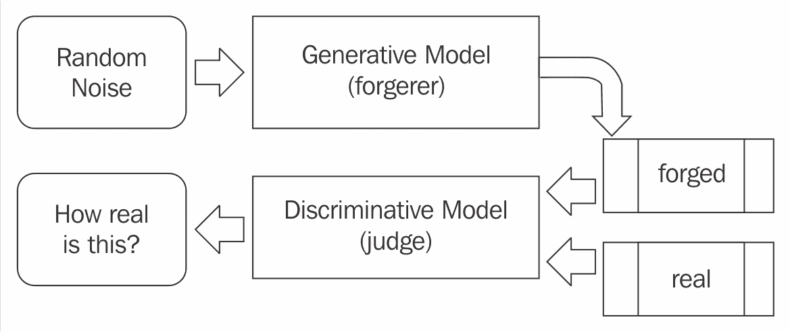

当然，GAN 需要在两方博弈中找到平衡。为了有效学习，需要确保如果一方成功地在一次更新中向下调整，那么另一方也必须在同样的更新中向下调整。想一想！如果造假者每次都能成功地欺骗裁判，那么造假者自己就没有更多的学习空间了。有时，两个玩家最终会达到平衡，但这并不总是能保证，两个玩家可能会继续对抗很长时间。以下图展示了来自双方学习的一个例子：

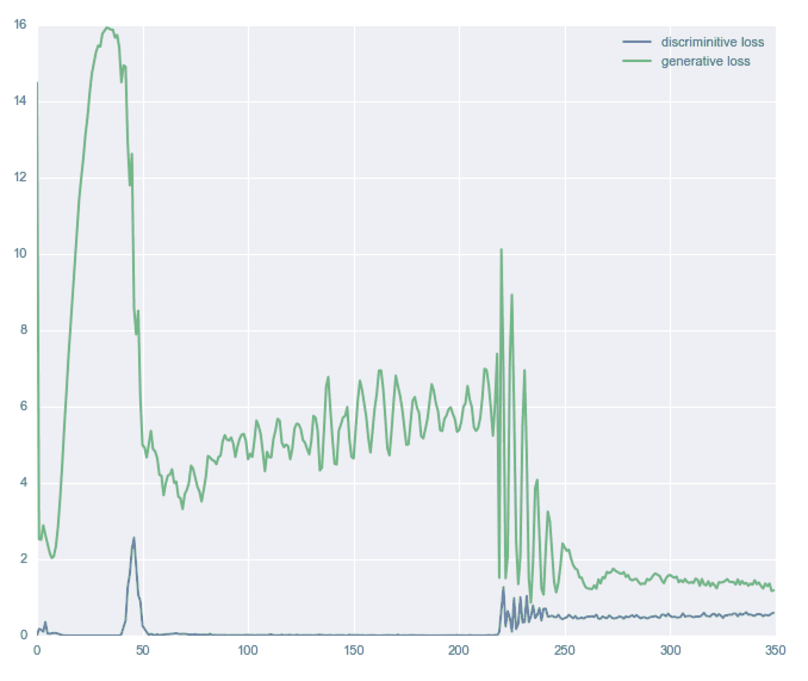

# 一些 GAN 应用

我们已经看到生成器学会了如何伪造数据。这意味着它学会了如何创造新的合成数据，这些数据由网络生成，看起来真实且像是由人类创造的。在深入探讨一些 GAN 代码的细节之前，我想分享一篇近期论文的结果：*StackGAN: 文本到照片级图像合成的堆叠生成对抗网络*，作者：Han Zhang、Tao Xu、Hongsheng Li、Shaoting Zhang、Xiaolei Huang、Xiaogang Wang 和 Dimitris Metaxas（代码可在线获取：[`github.com/hanzhanggit/StackGAN`](https://github.com/hanzhanggit/StackGAN)）。

在这里，使用 GAN 从文本描述合成伪造图像。结果令人印象深刻。第一列是测试集中的真实图像，剩下的列包含由 StackGAN 的 Stage-I 和 Stage-II 根据相同的文本描述生成的图像。更多例子可在 YouTube 查看（[`www.youtube.com/watch?v=SuRyL5vhCIM&feature=youtu.be`](https://www.youtube.com/watch?v=SuRyL5vhCIM&feature=youtu.be)）：

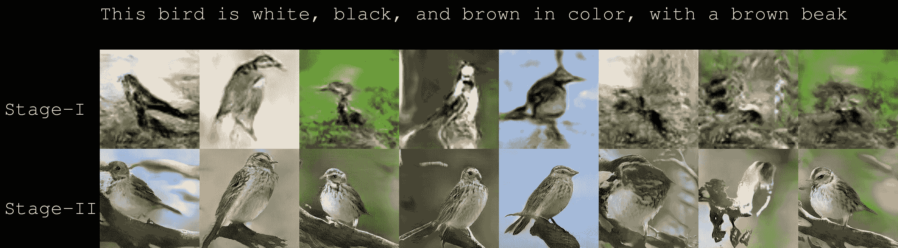

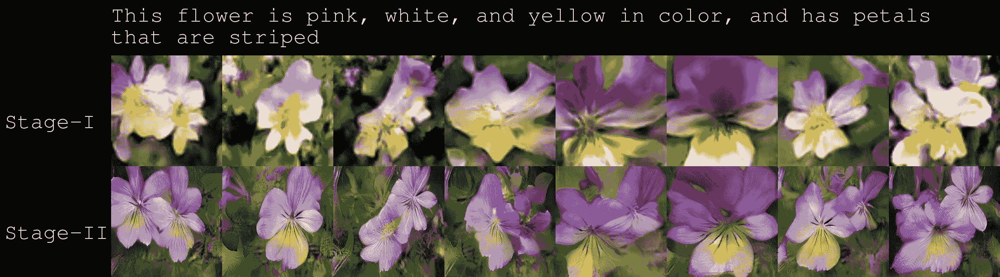

现在让我们看看 GAN 是如何学会*伪造*MNIST 数据集的。在这种情况下，生成器和判别器网络结合了 GAN 和 ConvNets（更多信息请参考：*无监督表示学习与深度卷积生成对抗网络*，A. Radford、L. Metz 和 S. Chintala，arXiv: 1511.06434，2015 年）用于生成器和判别器网络。一开始，生成器什么都没有生成，但经过几次迭代后，合成的伪造数字逐渐变得越来越清晰。在下图中，面板按训练轮次递增排序，你可以看到面板之间质量的提升：

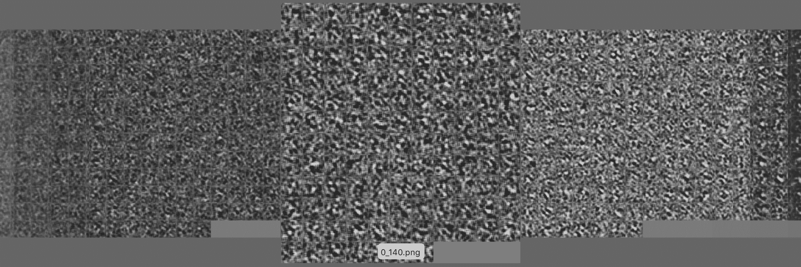

以下图像展示了随着迭代次数的增加，伪造的手写数字的变化：

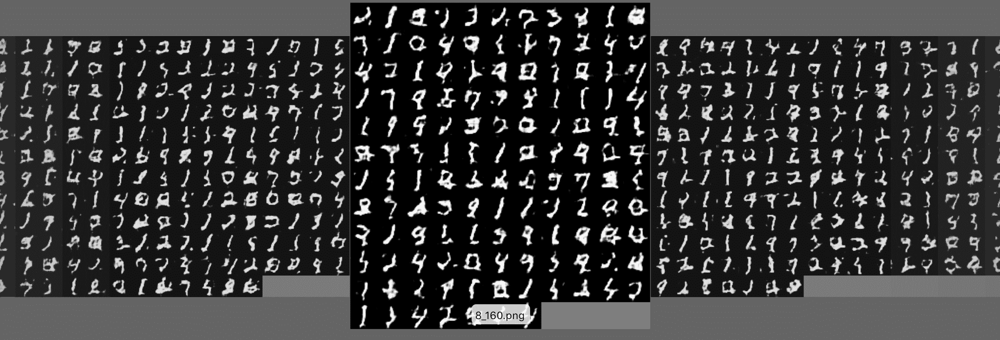

以下图像展示了伪造的手写数字，计算结果与原始几乎无法区分：

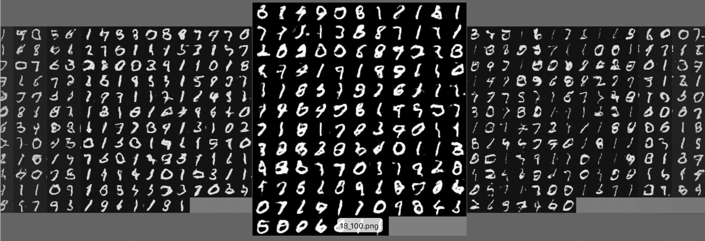

GAN 最酷的用途之一就是对生成器的向量*Z*中的人脸进行算术操作。换句话说，如果我们停留在合成伪造图像的空间中，就能看到像这样的效果：

*[微笑的女人] - [中立的女人] + [中立的男人] = [微笑的男人]*

或者像这样：

*[戴眼镜的男人] - [没有眼镜的男人] + [没有眼镜的女人] = [戴眼镜的女人]*

下一张图来自文章 *无监督表示学习与深度卷积生成对抗网络*，作者：A. Radford、L. Metz 和 S. Chintala，arXiv: 1511.06434，2015 年 11 月：

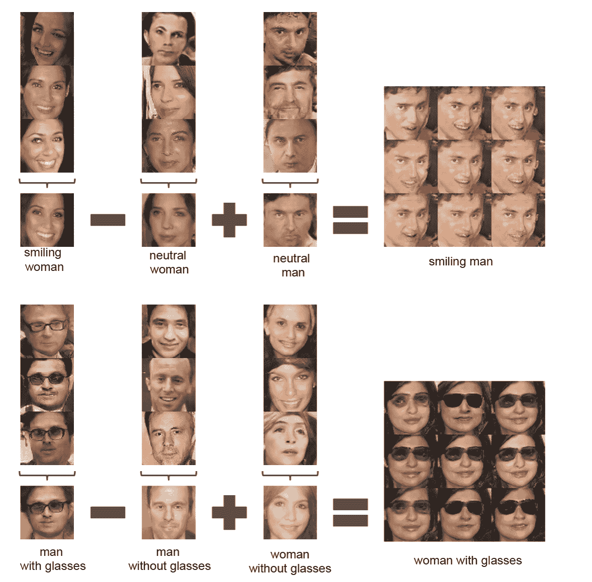

# 深度卷积生成对抗网络

**深度卷积生成对抗网络**（**DCGAN**）在论文中介绍：*《使用深度卷积生成对抗网络进行无监督表示学习》*，作者 A. Radford, L. Metz 和 S. Chintala，arXiv: 1511.06434, 2015。生成器使用一个 100 维的均匀分布空间*Z*，然后通过一系列卷积操作将其投影到一个更小的空间中。下图展示了一个示例：

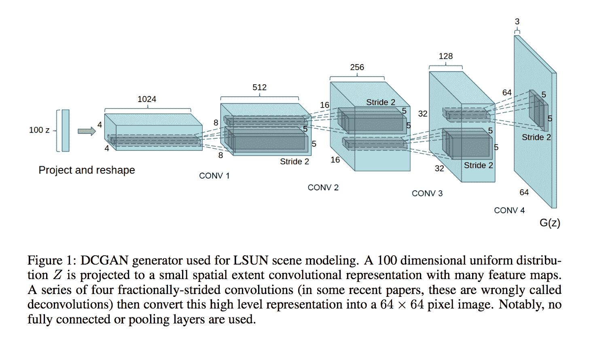

一个 DCGAN 生成器可以通过以下 Keras 代码进行描述；它也被一个实现所描述，具体请参见：[`github.com/jacobgil/keras-dcgan`](https://github.com/jacobgil/keras-dcgan)：

```py
def generator_model():
    model = Sequential()
    model.add(Dense(input_dim=100, output_dim=1024))
    model.add(Activation('tanh'))
    model.add(Dense(128*7*7))
    model.add(BatchNormalization())
    model.add(Activation('tanh'))
    model.add(Reshape((128, 7, 7), input_shape=(128*7*7,)))
    model.add(UpSampling2D(size=(2, 2)))
    model.add(Convolution2D(64, 5, 5, border_mode='same'))
    model.add(Activation('tanh'))
    model.add(UpSampling2D(size=(2, 2)))
    model.add(Convolution2D(1, 5, 5, border_mode='same'))
    model.add(Activation('tanh'))
    return model

```

请注意，代码使用的是 Keras 1.x 的语法。然而，由于 Keras 的遗留接口，它也可以在 Keras 2.0 中运行。在这种情况下，系统会报告一些警告，如下图所示：

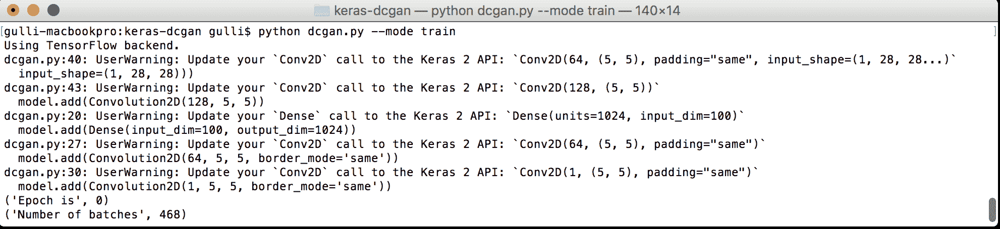

现在让我们看一下代码。第一层全连接层接收一个 100 维的向量作为输入，并使用激活函数`tanh`输出 1,024 维。我们假设输入是从均匀分布中采样，范围为*[-1, 1]*。接下来的全连接层通过批量归一化（更多信息请参见*S. Ioffe 和 C. Szegedy 的《批量归一化：通过减少内部协变量偏移加速深度网络训练》，arXiv: 1502.03167, 2014*）生成 128 x 7 x 7 的输出数据，批量归一化是一种通过将每个单元的输入归一化为零均值和单位方差来帮助稳定学习的技术。*批量归一化已被实验证明在许多情况下可以加速训练，减少初始化不良的问题，并且通常能产生更精确的结果。*此外，还有一个`Reshape()`模块，它将数据转换为 127 x 7 x 7（127 个通道，7 的宽度，7 的高度），`dim_ordering`设置为`tf`，以及一个`UpSampling()`模块，它将每个数据重复为 2 x 2 的正方形。然后，我们有一个卷积层，在 5 x 5 卷积核上生成 64 个滤波器，激活函数为`tanh`*，接着是一个新的`UpSampling()`模块和一个最终的卷积层，具有一个滤波器，使用 5 x 5 卷积核，激活函数为`tanh`*。请注意，该卷积神经网络没有池化操作。判别器可以通过以下代码进行描述：

```py
def discriminator_model():
    model = Sequential()
    model.add(Convolution2D(64, 5, 5, border_mode='same',
    input_shape=(1, 28, 28)))
    model.add(Activation('tanh'))
    model.add(MaxPooling2D(pool_size=(2, 2)))
    model.add(Convolution2D(128, 5, 5))
    model.add(Activation('tanh'))
    model.add(MaxPooling2D(pool_size=(2, 2)))
    model.add(Flatten())
    model.add(Dense(1024))
    model.add(Activation('tanh'))
    model.add(Dense(1))
    model.add(Activation('sigmoid'))
    return model

```

这段代码接收一个标准的 MNIST 图像，形状为 `(1, 28, 28)`，并应用一个 64 个 5 x 5 滤波器的卷积，激活函数为 `tanh`。随后进行一个 2 x 2 的最大池化操作，接着再进行一次卷积和最大池化操作。最后两步是全连接层，其中最后一步是伪造的预测，只有一个神经元，并使用 `sigmoid` 激活函数。对于选定的训练轮数，生成器和判别器依次使用 `binary_crossentropy` 作为损失函数进行训练。在每个训练轮次中，生成器会做出若干预测（例如，它生成伪造的 MNIST 图像），而判别器则尝试在将预测与真实的 MNIST 图像混合后进行学习。经过 32 个轮次，生成器学会了伪造这一组手写数字。没有人编程让机器写字，但它已经学会了如何写出与人类手写的数字无法区分的数字。请注意，训练 GAN 可能非常困难，因为需要在两个参与者之间找到平衡。如果你对这个话题感兴趣，我建议你查看一些从业者收集的技巧系列（[`github.com/soumith/ganhacks`](https://github.com/soumith/ganhacks)）：

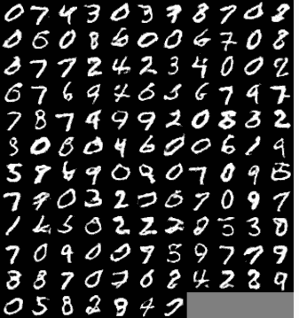

# Keras 对抗性 GAN 用于伪造 MNIST

Keras 对抗性（[`github.com/bstriner/keras-adversarial`](https://github.com/bstriner/keras-adversarial)）是一个用于构建 GAN 的开源 Python 包，由 Ben Striner 开发（[`github.com/bstriner`](https://github.com/bstriner) 和 [`github.com/bstriner/keras-adversarial/blob/master/LICENSE.txt`](https://github.com/bstriner/keras-adversarial/blob/master/LICENSE.txt)）。由于 Keras 最近刚刚升级到 2.0，我建议你下载最新的 Keras 对抗性包：

```py
git clone --depth=50 --branch=master https://github.com/bstriner/keras-adversarial.git

```

并安装 `setup.py`：

```py
python setup.py install

```

请注意，Keras 2.0 的兼容性已在此问题中跟踪：[`github.com/bstriner/keras-adversarial/issues/11`](https://github.com/bstriner/keras-adversarial/issues/11)。

如果生成器*G*和判别器*D*基于相同的模型，*M*，那么它们可以合并为一个对抗模型；它使用相同的输入，*M*，但为*G*和*D*分开目标和度量。该库有以下 API 调用：

```py
adversarial_model = AdversarialModel(base_model=M,
    player_params=[generator.trainable_weights, discriminator.trainable_weights],
    player_names=["generator", "discriminator"])

```

如果生成器*G*和判别器*D*基于两个不同的模型，则可以使用此 API 调用：

```py
adversarial_model = AdversarialModel(player_models=[gan_g, gan_d],
    player_params=[generator.trainable_weights, discriminator.trainable_weights],
    player_names=["generator", "discriminator"])

```

让我们看一个关于 MNIST 的计算示例：

```py
import matplotlib as mpl
# This line allows mpl to run with no DISPLAY defined
mpl.use('Agg')

```

让我们看看开源代码（[`github.com/bstriner/keras-adversarial/blob/master/examples/example_gan_convolutional.py`](https://github.com/bstriner/keras-adversarial/blob/master/examples/example_gan_convolutional.py)）。注意，这段代码使用的是 Keras 1.x 的语法，但得益于`legacy.py`中包含的便捷实用函数集，它也能在 Keras 2.x 之上运行。`legacy.py`的代码在附录、*结论*中有报告，且可以在[`github.com/bstriner/keras-adversarial/blob/master/keras_adversarial/legacy.py`](https://github.com/bstriner/keras-adversarial/blob/master/keras_adversarial/legacy.py)找到。

首先，开源示例导入了一些模块。除了 LeakyReLU（ReLU 的一个特殊版本，当单元不活跃时允许一个小的梯度）之外，我们之前都见过这些模块。实验表明，LeakyReLU 可以在多种情况下提高 GAN 的性能（有关更多信息，请参阅：*Empirical Evaluation of Rectified Activations in Convolutional Network*，B. Xu, N. Wang, T. Chen 和 M. Li，arXiv:1505.00853，2014）：

```py
from keras.layers import Dense, Reshape, Flatten, Dropout, LeakyReLU,
    Input, Activation, BatchNormalization
from keras.models import Sequential, Model
from keras.layers.convolutional import Convolution2D, UpSampling2D
from keras.optimizers import Adam
from keras.regularizers import l1, l1l2
from keras.datasets import mnist

import pandas as pd
import numpy as np

```

然后，导入 GAN 的特定模块：

```py
from keras_adversarial import AdversarialModel, ImageGridCallback,
    simple_gan, gan_targets
from keras_adversarial import AdversarialOptimizerSimultaneous,
    normal_latent_sampling, AdversarialOptimizerAlternating
from image_utils import dim_ordering_fix, dim_ordering_input,
    dim_ordering_reshape, dim_ordering_unfix

```

对抗性模型用于多玩家游戏。给定一个包含*n*个目标和*k*个玩家的基础模型，创建一个包含*n*k*个目标的模型，其中每个玩家在该玩家的目标上优化损失。此外，`simple_gan`生成一个具有给定`gan_targets`的 GAN。注意，在库中，生成器和判别器的标签是相反的；直观地说，这对 GAN 来说是一种标准做法：

```py
def gan_targets(n):
    """
    Standard training targets [generator_fake, generator_real, discriminator_fake,     
    discriminator_real] = [1, 0, 0, 1]
    :param n: number of samples
    :return: array of targets
    """
    generator_fake = np.ones((n, 1))
    generator_real = np.zeros((n, 1))
    discriminator_fake = np.zeros((n, 1))
    discriminator_real = np.ones((n, 1))
    return [generator_fake, generator_real, discriminator_fake, discriminator_real]

```

这个示例以类似于我们之前看到的方式定义了生成器。然而，在这种情况下，我们使用了函数式语法——我们管道中的每个模块只是作为输入传递给下一个模块。因此，第一个模块是密集层，通过使用`glorot_normal`进行初始化。此初始化使用了通过节点的输入和输出总和缩放的高斯噪声。所有其他模块都使用相同类型的初始化。`BatchNormlization`函数中的`mode=2`参数根据每批次的统计数据进行特征标准化。从实验结果来看，这能产生更好的效果：

```py
def model_generator():
    nch = 256
    g_input = Input(shape=[100])
    H = Dense(nch * 14 * 14, init='glorot_normal')(g_input)
    H = BatchNormalization(mode=2)(H)
    H = Activation('relu')(H)
    H = dim_ordering_reshape(nch, 14)(H)
    H = UpSampling2D(size=(2, 2))(H)
    H = Convolution2D(int(nch / 2), 3, 3, border_mode='same', 
        init='glorot_uniform')(H)
    H = BatchNormalization(mode=2, axis=1)(H)
    H = Activation('relu')(H)
    H = Convolution2D(int(nch / 4), 3, 3, border_mode='same', 
        init='glorot_uniform')(H)
    H = BatchNormalization(mode=2, axis=1)(H)
    H = Activation('relu')(H)
    H = Convolution2D(1, 1, 1, border_mode='same', init='glorot_uniform')(H)
    g_V = Activation('sigmoid')(H)
    return Model(g_input, g_V)

```

判别器与本章之前定义的非常相似。唯一的主要区别是采用了`LeakyReLU`：

```py
def model_discriminator(input_shape=(1, 28, 28), dropout_rate=0.5):
    d_input = dim_ordering_input(input_shape, name="input_x")
    nch = 512
    H = Convolution2D(int(nch / 2), 5, 5, subsample=(2, 2),
        border_mode='same', activation='relu')(d_input)
    H = LeakyReLU(0.2)(H)
    H = Dropout(dropout_rate)(H)
    H = Convolution2D(nch, 5, 5, subsample=(2, 2),
        border_mode='same', activation='relu')(H)
    H = LeakyReLU(0.2)(H)
    H = Dropout(dropout_rate)(H)
    H = Flatten()(H)
    H = Dense(int(nch / 2))(H)
    H = LeakyReLU(0.2)(H)
    H = Dropout(dropout_rate)(H)
    d_V = Dense(1, activation='sigmoid')(H)
    return Model(d_input, d_V)

```

然后，定义了两个简单的函数来加载和标准化 MNIST 数据：

```py
def mnist_process(x):
    x = x.astype(np.float32) / 255.0
    return x

def mnist_data():
    (xtrain, ytrain), (xtest, ytest) = mnist.load_data()
    return mnist_process(xtrain), mnist_process(xtest)

```

下一步，GAN 被定义为生成器和判别器的组合，形成一个联合 GAN 模型。注意，权重通过`normal_latent_sampling`进行初始化，它从正态高斯分布中采样：

```py
if __name__ == "__main__":
    # z in R¹⁰⁰
    latent_dim = 100
    # x in R^{28x28}
    input_shape = (1, 28, 28)
    # generator (z -> x)
    generator = model_generator()
    # discriminator (x -> y)
    discriminator = model_discriminator(input_shape=input_shape)
    # gan (x - > yfake, yreal), z generated on GPU
    gan = simple_gan(generator, discriminator, normal_latent_sampling((latent_dim,)))
    # print summary of models
    generator.summary()
    discriminator.summary()
    gan.summary()

```

之后，示例创建了我们的 GAN，并使用`Adam`优化器编译训练好的模型，`binary_crossentropy`作为损失函数：

```py
# build adversarial model
model = AdversarialModel(base_model=gan,
    player_params=[generator.trainable_weights, discriminator.trainable_weights],
    player_names=["generator", "discriminator"])
model.adversarial_compile(adversarial_optimizer=AdversarialOptimizerSimultaneous(),
    player_optimizers=[Adam(1e-4, decay=1e-4), Adam(1e-3, decay=1e-4)],
    loss='binary_crossentropy')

```

用于创建看起来像真实图像的新图像的生成器被定义。每个 epoch 将在训练期间生成一张看起来像原始图像的伪造图像：

```py
def generator_sampler():
    zsamples = np.random.normal(size=(10 * 10, latent_dim))
    gen = dim_ordering_unfix(generator.predict(zsamples))
    return gen.reshape((10, 10, 28, 28))

generator_cb = ImageGridCallback(
    "output/gan_convolutional/epoch-{:03d}.png",generator_sampler)
xtrain, xtest = mnist_data()
xtrain = dim_ordering_fix(xtrain.reshape((-1, 1, 28, 28)))
xtest = dim_ordering_fix(xtest.reshape((-1, 1, 28, 28)))
y = gan_targets(xtrain.shape[0])
ytest = gan_targets(xtest.shape[0])
history = model.fit(x=xtrain, y=y,
validation_data=(xtest, ytest), callbacks=[generator_cb], nb_epoch=100,
    batch_size=32)
df = pd.DataFrame(history.history)
df.to_csv("output/gan_convolutional/history.csv")
generator.save("output/gan_convolutional/generator.h5")
discriminator.save("output/gan_convolutional/discriminator.h5")

```

请注意，`dim_ordering_unfix`是一个实用函数，用于支持在`image_utils.py`中定义的不同图像排序，具体如下：

```py
def dim_ordering_fix(x):
    if K.image_dim_ordering() == 'th':
        return x
    else:
        return np.transpose(x, (0, 2, 3, 1))

```

现在，让我们运行代码，查看生成器和判别器的损失情况。在下面的截图中，我们看到了判别器和生成器的网络输出：

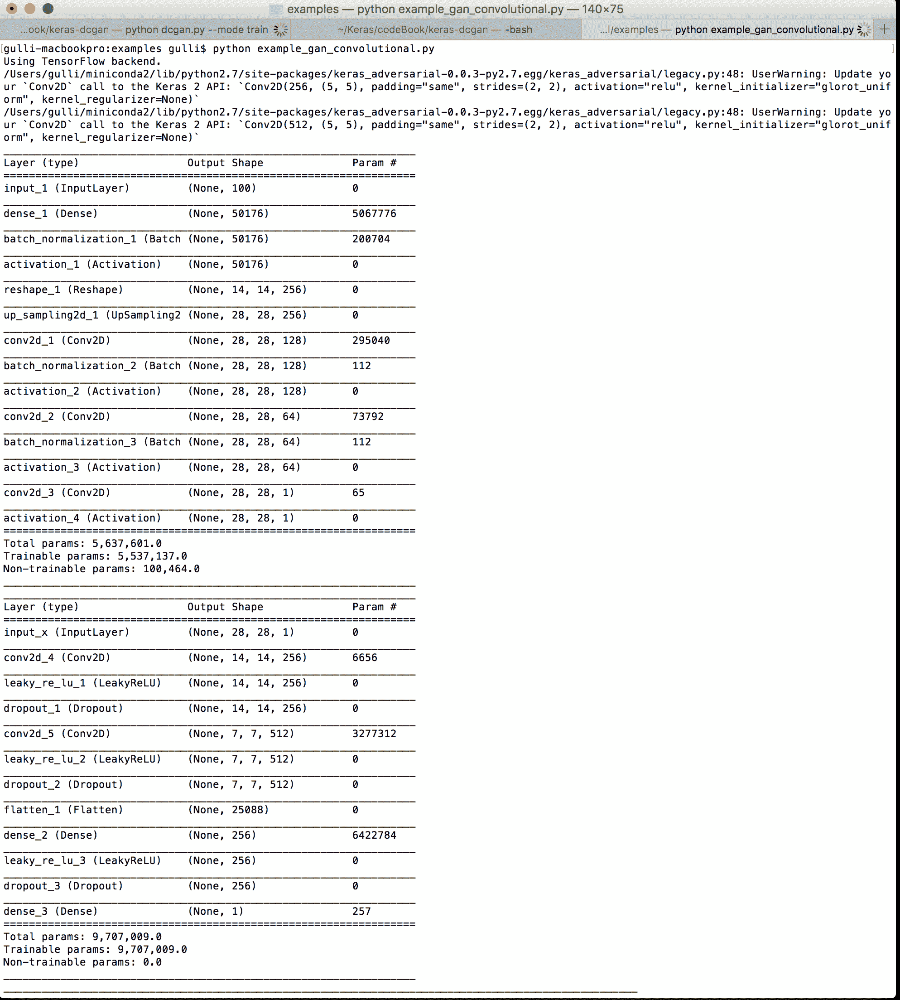

以下截图显示了用于训练和验证的样本数量：

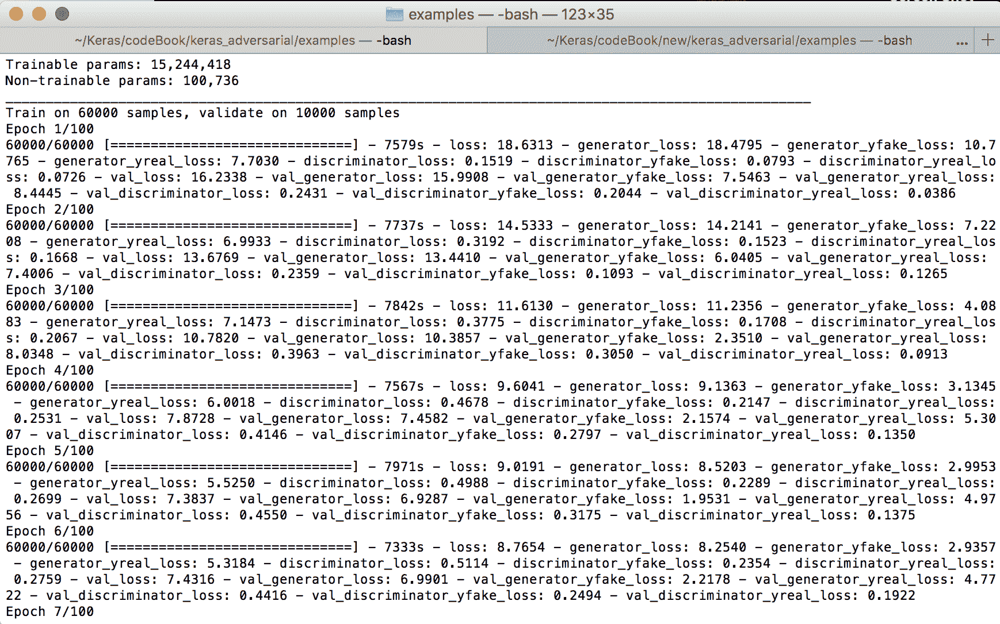

在经过 5-6 次迭代后，我们已经生成了可以接受的人工图像，计算机已经学会如何重现手写字符，如下图所示：

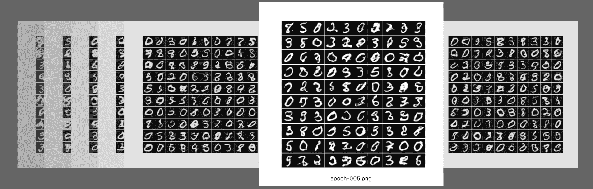

# 用于伪造 CIFAR 的 Keras 对抗 GAN

现在我们可以使用 GAN 方法学习如何伪造 CIFAR-10，并创建看起来真实的合成图像。让我们看看开源代码（[`github.com/bstriner/keras-adversarial/blob/master/examples/example_gan_cifar10.py`](https://github.com/bstriner/keras-adversarial/blob/master/examples/example_gan_cifar10.py)）。再次注意，它使用的是 Keras 1.x 的语法，但得益于`legacy.py`中包含的一套方便的实用函数，它也能在 Keras 2.x 上运行（[`github.com/bstriner/keras-adversarial/blob/master/keras_adversarial/legacy.py`](https://github.com/bstriner/keras-adversarial/blob/master/keras_adversarial/legacy.py)）。首先，开源示例导入了一些包：

```py
import matplotlib as mpl
# This line allows mpl to run with no DISPLAY defined
mpl.use('Agg')
import pandas as pd
import numpy as np
import os
from keras.layers import Dense, Reshape, Flatten, Dropout, LeakyReLU, 
    Activation, BatchNormalization, SpatialDropout2D
from keras.layers.convolutional import Convolution2D, UpSampling2D, 
    MaxPooling2D, AveragePooling2D
from keras.models import Sequential, Model
from keras.optimizers import Adam
from keras.callbacks import TensorBoard
from keras.regularizers import l1l2
from keras_adversarial import AdversarialModel, ImageGridCallback, 
    simple_gan, gan_targets
from keras_adversarial import AdversarialOptimizerSimultaneous, 
    normal_latent_sampling, fix_names
import keras.backend as K
from cifar10_utils import cifar10_data
from image_utils import dim_ordering_fix, dim_ordering_unfix, 
    dim_ordering_shape

```

接下来，定义了一个生成器，它使用卷积与`l1`和`l2`正则化、批归一化和上采样的组合。请注意，`axis=1`表示首先对张量的维度进行归一化，`mode=0`表示采用特征归一化。这个特定的网络是许多精细调整实验的结果，但它本质上仍然是一个卷积 2D 和上采样操作的序列，在开始时使用`Dense`模块，结束时使用`sigmoid`。此外，每个卷积使用`LeakyReLU`激活函数和`BatchNormalization`：

```py
def model_generator():
    model = Sequential()
    nch = 256
    reg = lambda: l1l2(l1=1e-7, l2=1e-7)
    h = 5
    model.add(Dense(input_dim=100, output_dim=nch * 4 * 4, W_regularizer=reg()))
    model.add(BatchNormalization(mode=0))
    model.add(Reshape(dim_ordering_shape((nch, 4, 4))))
    model.add(Convolution2D(nch/2, h, h, border_mode='same', W_regularizer=reg()))
    model.add(BatchNormalization(mode=0, axis=1))
    model.add(LeakyReLU(0.2))
    model.add(UpSampling2D(size=(2, 2)))
    model.add(Convolution2D(nch / 2, h, h, border_mode='same', W_regularizer=reg()))
    model.add(BatchNormalization(mode=0, axis=1))
    model.add(LeakyReLU(0.2))
    model.add(UpSampling2D(size=(2, 2)))
    model.add(Convolution2D(nch / 4, h, h, border_mode='same', W_regularizer=reg()))
    model.add(BatchNormalization(mode=0, axis=1))
    model.add(LeakyReLU(0.2))
    model.add(UpSampling2D(size=(2, 2)))
    model.add(Convolution2D(3, h, h, border_mode='same', W_regularizer=reg()))
    model.add(Activation('sigmoid'))
    return model

```

然后，定义了一个判别器。再次，我们有一系列的二维卷积操作，在这种情况下我们采用`SpatialDropout2D`，它会丢弃整个 2D 特征图而不是单个元素。我们还使用`MaxPooling2D`和`AveragePooling2D`，原因类似：

```py
def model_discriminator():
    nch = 256
    h = 5
    reg = lambda: l1l2(l1=1e-7, l2=1e-7)
    c1 = Convolution2D(nch / 4, h, h, border_mode='same', W_regularizer=reg(),
    input_shape=dim_ordering_shape((3, 32, 32)))
    c2 = Convolution2D(nch / 2, h, h, border_mode='same', W_regularizer=reg())
    c3 = Convolution2D(nch, h, h, border_mode='same', W_regularizer=reg())
    c4 = Convolution2D(1, h, h, border_mode='same', W_regularizer=reg())
    def m(dropout):
        model = Sequential()
        model.add(c1)
        model.add(SpatialDropout2D(dropout))
        model.add(MaxPooling2D(pool_size=(2, 2)))
        model.add(LeakyReLU(0.2))
        model.add(c2)
        model.add(SpatialDropout2D(dropout))
        model.add(MaxPooling2D(pool_size=(2, 2)))
        model.add(LeakyReLU(0.2))
        model.add(c3)
        model.add(SpatialDropout2D(dropout))
        model.add(MaxPooling2D(pool_size=(2, 2)))
        model.add(LeakyReLU(0.2))
        model.add(c4)
        model.add(AveragePooling2D(pool_size=(4, 4), border_mode='valid'))
        model.add(Flatten())
        model.add(Activation('sigmoid'))
        return model
    return m

```

现在可以生成适当的 GAN。以下函数接受多个输入，包括生成器、判别器、潜在维度的数量和 GAN 目标：

```py
def example_gan(adversarial_optimizer, path, opt_g, opt_d, nb_epoch, generator,
        discriminator, latent_dim, targets=gan_targets, loss='binary_crossentropy'):
    csvpath = os.path.join(path, "history.csv")
    if os.path.exists(csvpath):
        print("Already exists: {}".format(csvpath))
    return

```

然后创建了两个 GAN，一个带有 dropout，另一个没有 dropout 用于判别器：

```py
print("Training: {}".format(csvpath))
# gan (x - > yfake, yreal), z is gaussian generated on GPU
# can also experiment with uniform_latent_sampling
d_g = discriminator(0)
d_d = discriminator(0.5)
generator.summary()
d_d.summary()
gan_g = simple_gan(generator, d_g, None)
gan_d = simple_gan(generator, d_d, None)
x = gan_g.inputs[1]
z = normal_latent_sampling((latent_dim,))(x)
# eliminate z from inputs
gan_g = Model([x], fix_names(gan_g([z, x]), gan_g.output_names))
gan_d = Model([x], fix_names(gan_d([z, x]), gan_d.output_names))

```

这两个 GAN 现在被合并为一个具有独立权重的对抗性模型，模型随后被编译：

```py
# build adversarial model
model = AdversarialModel(player_models=[gan_g, gan_d],
    player_params=[generator.trainable_weights, d_d.trainable_weights],
    player_names=["generator", "discriminator"])
model.adversarial_compile(adversarial_optimizer=adversarial_optimizer,
    player_optimizers=[opt_g, opt_d], loss=loss)

```

接下来，有一个简单的回调，用于采样图像，并打印定义了`ImageGridCallback`方法的文件：

```py
# create callback to generate images
zsamples = np.random.normal(size=(10 * 10, latent_dim))
def generator_sampler():
    xpred = dim_ordering_unfix(generator.predict(zsamples)).transpose((0, 2, 3, 1))
    return xpred.reshape((10, 10) + xpred.shape[1:])
generator_cb =
    ImageGridCallback(os.path.join(path, "epoch-{:03d}.png"),
    generator_sampler, cmap=None)

```

现在，CIFAR-10 数据已经加载并且模型已拟合。如果后端是 TensorFlow，则损失信息将保存在 TensorBoard 中，以检查损失如何随着时间的推移减少。历史数据也方便地保存在 CVS 格式中，模型的权重也存储在`h5`格式中：

```py
# train model
xtrain, xtest = cifar10_data()
y = targets(xtrain.shape[0])
ytest = targets(xtest.shape[0])
callbacks = [generator_cb]
if K.backend() == "tensorflow":
    callbacks.append(TensorBoard(log_dir=os.path.join(path, 'logs'),
        histogram_freq=0, write_graph=True, write_images=True))
history = model.fit(x=dim_ordering_fix(xtrain),y=y,
    validation_data=(dim_ordering_fix(xtest), ytest),
    callbacks=callbacks, nb_epoch=nb_epoch,
    batch_size=32)
# save history to CSV
df = pd.DataFrame(history.history)
df.to_csv(csvpath)
# save models
generator.save(os.path.join(path, "generator.h5"))
d_d.save(os.path.join(path, "discriminator.h5"))

```

最后，整个 GAN 可以运行。生成器从一个具有 100 个潜在维度的空间中采样，我们为这两个 GAN 使用了`Adam`优化器：

```py
def main():
    # z in R¹⁰⁰
    latent_dim = 100
    # x in R^{28x28}
    # generator (z -> x)
    generator = model_generator()
    # discriminator (x -> y)
    discriminator = model_discriminator()
    example_gan(AdversarialOptimizerSimultaneous(), "output/gan-cifar10",
        opt_g=Adam(1e-4, decay=1e-5),
        opt_d=Adam(1e-3, decay=1e-5),
        nb_epoch=100, generator=generator, discriminator=discriminator,
        latent_dim=latent_dim)
if __name__ == "__main__":
main()

```

为了完整查看开源代码，我们需要包含一些简单的工具函数来存储图像的网格：

```py
from matplotlib import pyplot as plt, gridspec
import os

def write_image_grid(filepath, imgs, figsize=None, cmap='gray'):
    directory = os.path.dirname(filepath)
    if not os.path.exists(directory):
        os.makedirs(directory)
    fig = create_image_grid(imgs, figsize, cmap=cmap)
    fig.savefig(filepath)
    plt.close(fig)

def create_image_grid(imgs, figsize=None, cmap='gray'):
    n = imgs.shape[0]
    m = imgs.shape[1]
    if figsize is None:
        figsize=(n,m)
    fig = plt.figure(figsize=figsize)
    gs1 = gridspec.GridSpec(n, m)
    gs1.update(wspace=0.025, hspace=0.025) # set the spacing between axes.
    for i in range(n):
        for j in range(m):
            ax = plt.subplot(gs1[i, j])
            img = imgs[i, j, :]
    ax.imshow(img, cmap=cmap)
    ax.axis('off')
    return fig

```

此外，我们需要一些工具方法来处理不同的图像排序（例如，Theano 或 TensorFlow）：

```py
import keras.backend as K
import numpy as np
from keras.layers import Input, Reshape

def dim_ordering_fix(x):
    if K.image_dim_ordering() == 'th':
        return x
    else:
        return np.transpose(x, (0, 2, 3, 1))

def dim_ordering_unfix(x):
    if K.image_dim_ordering() == 'th':
        return x
    else:
        return np.transpose(x, (0, 3, 1, 2))

def dim_ordering_shape(input_shape):
    if K.image_dim_ordering() == 'th':
        return input_shape
    else:
        return (input_shape[1], input_shape[2], input_shape[0])

def dim_ordering_input(input_shape, name):
    if K.image_dim_ordering() == 'th':
        return Input(input_shape, name=name)
    else:
        return Input((input_shape[1], input_shape[2], input_shape[0]), name=name)

def dim_ordering_reshape(k, w, **kwargs):
    if K.image_dim_ordering() == 'th':
        return Reshape((k, w, w), **kwargs)
    else:
        return Reshape((w, w, k), **kwargs)

# One more utility function is used to fix names
def fix_names(outputs, names):
    if not isinstance(outputs, list):
        outputs = [outputs]
    if not isinstance(names, list):
        names = [names]
    return [Activation('linear', name=name)(output) 
        for output, name in zip(outputs, names)]

```

以下截图显示了定义的网络的转储：

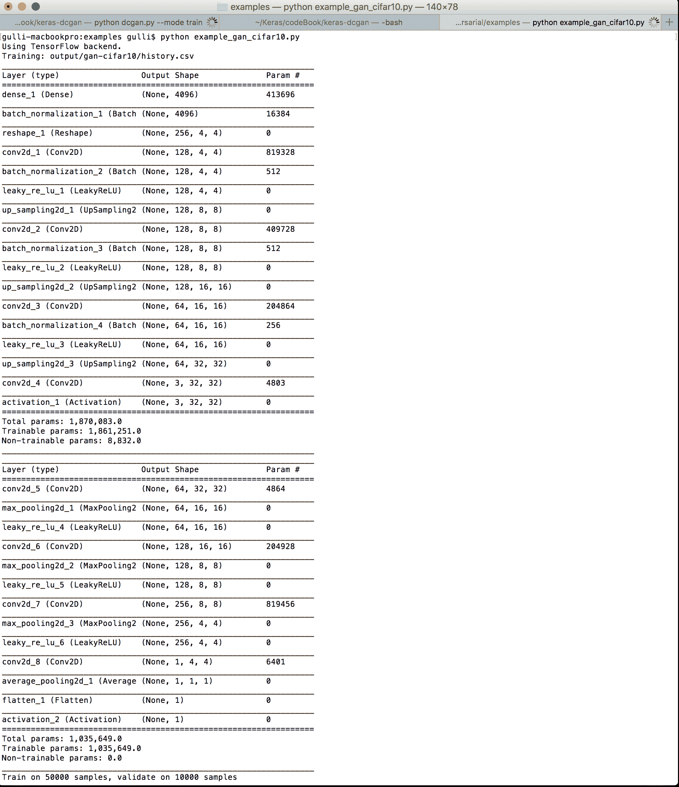

如果我们运行开源代码，第一次迭代将生成不真实的图像。然而，在经过 99 次迭代后，网络将学会伪造看起来像真实 CIFAR-10 图像的图像，如下所示：

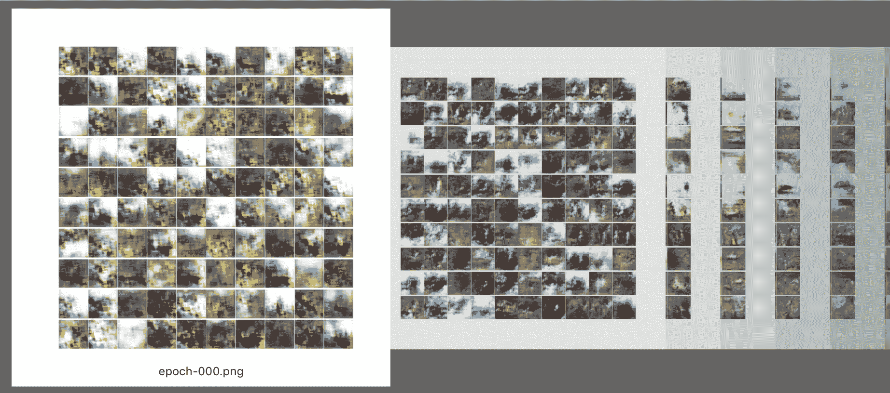

在接下来的图像中，我们看到右边是真实的 CIFAR-10 图像，左边是伪造的图像：

| 伪造的图像 | 真实的 CIFAR-10 图像 |
| --- | --- |
| 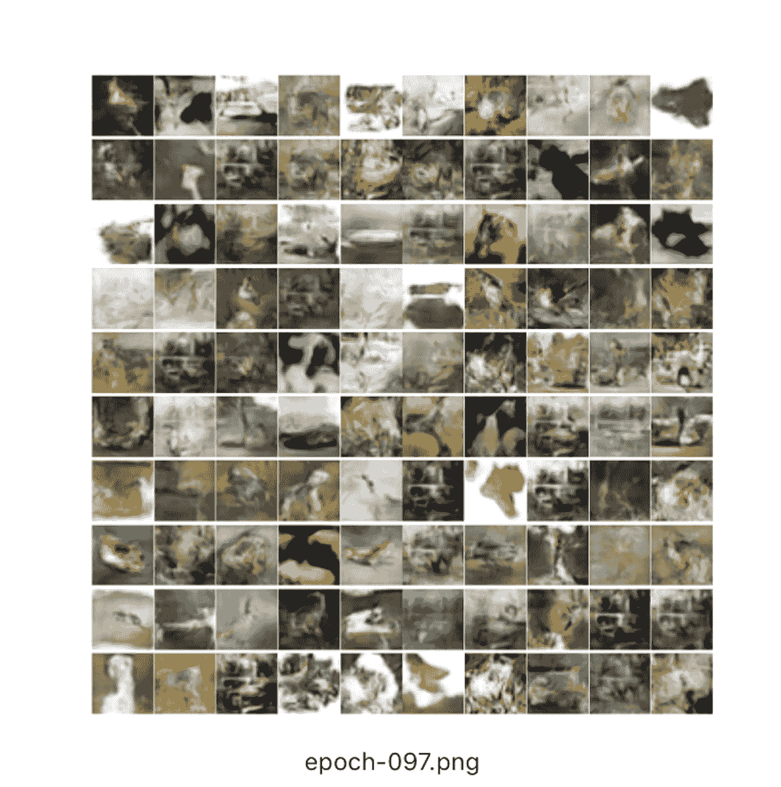 | 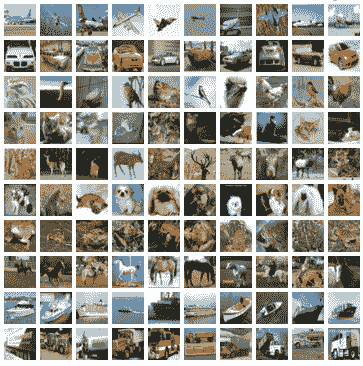 |

# WaveNet——一种用于学习如何生成音频的生成模型

WaveNet 是一种深度生成模型，用于生成原始音频波形。这项突破性的技术是由 Google DeepMind（[`deepmind.com/`](https://deepmind.com/)）提出的，用于教用户如何与计算机对话。结果令人印象深刻，您可以在网上找到合成语音的例子，其中计算机学会了如何用名人如马特·达蒙的声音进行对话。那么，您可能会想，为什么学习合成音频如此困难呢？好吧，我们听到的每一个数字声音都是基于每秒 16,000 个样本（有时为 48,000 或更多），而构建一个预测模型，基于所有先前的样本学习如何重现一个样本，是一个非常困难的挑战。尽管如此，实验表明，WaveNet 已经改进了当前最先进的**文本到语音**（**TTS**）系统，在美式英语和普通话中，将与人声的差距缩小了 50%。更酷的是，DeepMind 证明 WaveNet 还可以用来教计算机生成钢琴音乐等乐器的声音。现在是时候介绍一些定义了。TTS 系统通常分为两类：

+   **连续语音合成（Concatenative TTS）**：这是首先记忆单个语音片段，然后在需要重现语音时重新组合这些片段的方法。然而，这种方法无法扩展，因为只能重现已记忆的语音片段，而不能在不重新记忆的情况下重现新的发声者或不同类型的音频。

+   **参数化语音合成（Parametric TTS）**：这是创建模型来存储待合成音频的所有特征的过程。在 WaveNet 之前，使用参数化语音合成生成的音频比连续语音合成的音频自然度低。WaveNet 通过直接建模音频声音的生成改进了技术水平，而不是使用过去使用的中间信号处理算法。

原则上，WaveNet 可以看作是一堆 1 维卷积层（我们已经在第三章，*深度学习与 ConvNets*中看到了 2 维卷积用于图像），具有恒定的步幅为 1 且没有池化层。注意，输入和输出在构造上具有相同的维度，因此 ConvNet 非常适合模拟音频等序列数据。然而，已经表明，为了达到输出神经元的大接受域大小（记住神经元层的接收域是前一层提供输入的横截面），需要使用大量大滤波器或者昂贵地增加网络的深度。因此，纯粹的 ConvNets 在学习如何合成音频方面并不那么有效。WaveNet 背后的关键直觉是扩张因果卷积（更多信息请参考文章：*Multi-Scale Context Aggregation by Dilated Convolutions*，作者 Fisher Yu, Vladlen Koltun, 2016，可在[`www.semanticscholar.org/paper/Multi-Scale-Context-Aggregation-by-Dilated-Yu-Koltun/420c46d7cafcb841309f02ad04cf51cb1f190a48`](https://www.semanticscholar.org/paper/Multi-Scale-Context-Aggregation-by-Dilated-Yu-Koltun/420c46d7cafcb841309f02ad04cf51cb1f190a48)获取）或者有时称为空洞卷积（*atrous*是法语表达*à trous*的词语，意思是*带孔的*，因此空洞卷积是一种在应用卷积层的滤波器时跳过某些输入值的方式）。例如，在一维情况下，大小为 3 的滤波器*w*，带有膨胀率*1*将计算以下和：

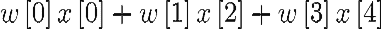

由于引入*空洞*这一简单思想，能够堆叠多个膨胀卷积层，并使滤波器指数增长，从而在不需要过深网络的情况下学习长距离输入依赖关系。因此，WaveNet 是一种卷积神经网络（ConvNet），其中卷积层具有不同的膨胀因子，允许感受野随着深度的增加而指数增长，从而高效地覆盖成千上万个音频时间步长。在训练时，输入是来自人类发音者的声音。波形被量化为固定的整数范围。WaveNet 定义了一个初始卷积层，只访问当前和先前的输入。然后是一个堆叠的膨胀卷积网络层，依然只访问当前和先前的输入。最后，有一系列密集层将先前的结果结合起来，后跟一个用于分类输出的 softmax 激活函数。在每一步，网络会预测一个值并将其反馈到输入中，同时计算下一步的预测。损失函数是当前步骤输出和下一步输入之间的交叉熵。由 Bas Veeling 开发的一个 Keras 实现可以在此获取：[`github.com/basveeling/wavenet`](https://github.com/basveeling/wavenet)，并可以通过 `git` 轻松安装：

```py
pip install virtualenv
mkdir ~/virtualenvs && cd ~/virtualenvs
virtualenv wavenet
source wavenet/bin/activate
cd ~
git clone https://github.com/basveeling/wavenet.git
cd wavenet
pip install -r requirements.txt

```

请注意，此代码与 Keras 1.x 兼容，详情请查看 [`github.com/basveeling/wavenet/issues/29`](https://github.com/basveeling/wavenet/issues/29)，了解将其迁移到 Keras 2.x 上的进展情况。训练非常简单，但需要大量的计算能力（因此请确保你有良好的 GPU 支持）：

```py
$ python wavenet.py with 'data_dir=your_data_dir_name'

```

在训练后采样网络同样非常简单：

```py
python wavenet.py predict with 'models/[run_folder]/config.json predict_seconds=1'

```

你可以在网上找到大量的超参数，用于微调我们的训练过程。正如这个内部层的转储所解释的，网络确实非常深。请注意，输入波形被划分为（`fragment_length = 1152` 和 `nb_output_bins = 256`），这就是传递到 WaveNet 的张量。WaveNet 以重复的块组织，称为残差块，每个残差块由两个膨胀卷积模块的乘积合并组成（一个使用 `sigmoid` 激活，另一个使用 `tanh` 激活），然后是一个合并的卷积求和。请注意，每个膨胀卷积都有逐渐增大的空洞，空洞大小按指数增长（`2 ** i`），从 1 到 512，如下文所定义：

```py
def residual_block(x):
    original_x = x
    tanh_out = CausalAtrousConvolution1D(nb_filters, 2, atrous_rate=2 ** i,
        border_mode='valid', causal=True, bias=use_bias,
        name='dilated_conv_%d_tanh_s%d' % (2 ** i, s), activation='tanh',
        W_regularizer=l2(res_l2))(x)
    sigm_out = CausalAtrousConvolution1D(nb_filters, 2, atrous_rate=2 ** i,
        border_mode='valid', causal=True, bias=use_bias,
        name='dilated_conv_%d_sigm_s%d' % (2 ** i, s), activation='sigmoid',
        W_regularizer=l2(res_l2))(x)
    x = layers.Merge(mode='mul',
        name='gated_activation_%d_s%d' % (i, s))([tanh_out, sigm_out])
        res_x = layers.Convolution1D(nb_filters, 1, border_mode='same', bias=use_bias,
        W_regularizer=l2(res_l2))(x)
    skip_x = layers.Convolution1D(nb_filters, 1, border_mode='same', bias=use_bias,
        W_regularizer=l2(res_l2))(x)
    res_x = layers.Merge(mode='sum')([original_x, res_x])
    return res_x, skip_x

```

在残差膨胀块之后，有一系列合并的卷积模块，接着是两个卷积模块，最后是 `nb_output_bins` 类别中的 `softmax` 激活函数。完整的网络结构如下：

```py
Layer (type) Output Shape Param # Connected to
====================================================================================================
input_part (InputLayer) (None, 1152, 256) 0
____________________________________________________________________________________________________
initial_causal_conv (CausalAtrou (None, 1152, 256) 131328 input_part[0][0]
____________________________________________________________________________________________________
dilated_conv_1_tanh_s0 (CausalAt (None, 1152, 256) 131072 initial_causal_conv[0][0]
____________________________________________________________________________________________________
dilated_conv_1_sigm_s0 (CausalAt (None, 1152, 256) 131072 initial_causal_conv[0][0]
____________________________________________________________________________________________________
gated_activation_0_s0 (Merge) (None, 1152, 256) 0 dilated_conv_1_tanh_s0[0][0]
dilated_conv_1_sigm_s0[0][0]
______________________________________________________________________
_____________________________
convolution1d_1 (Convolution1D) (None, 1152, 256) 65536 gated_activation_0_s0[0][0]
____________________________________________________________________________________________________
merge_1 (Merge) (None, 1152, 256) 0 initial_causal_conv[0][0]
convolution1d_1[0][0]
____________________________________________________________________________________________________
dilated_conv_2_tanh_s0 (CausalAt (None, 1152, 256) 131072 merge_1[0][0]
____________________________________________________________________________________________________
dilated_conv_2_sigm_s0 (CausalAt (None, 1152, 256) 131072 merge_1[0][0]
____________________________________________________________________________________________________
gated_activation_1_s0 (Merge) (None, 1152, 256) 0 dilated_conv_2_tanh_s0[0][0]
dilated_conv_2_sigm_s0[0][0]
____________________________________________________________________________________________________
convolution1d_3 (Convolution1D) (None, 1152, 256) 65536 gated_activation_1_s0[0][0]
____________________________________________________________________________________________________
merge_2 (Merge) (None, 1152, 256) 0 merge_1[0][0]
convolution1d_3[0][0]
____________________________________________________________________________________________________
dilated_conv_4_tanh_s0 (CausalAt (None, 1152, 256) 131072 merge_2[0][0]
____________________________________________________________________________________________________
dilated_conv_4_sigm_s0 (CausalAt (None, 1152, 256) 131072 merge_2[0][0]
____________________________________________________________________________________________________
gated_activation_2_s0 (Merge) (None, 1152, 256) 0 dilated_conv_4_tanh_s0[0][0]
dilated_conv_4_sigm_s0[0][0]
____________________________________________________________________________________________________
convolution1d_5 (Convolution1D) (None, 1152, 256) 65536 gated_activation_2_s0[0][0]
____________________________________________________________________________________________________
merge_3 (Merge) (None, 1152, 256) 0 merge_2[0][0]
convolution1d_5[0][0]
____________________________________________________________________________________________________
dilated_conv_8_tanh_s0 (CausalAt (None, 1152, 256) 131072 merge_3[0][0]
____________________________________________________________________________________________________
dilated_conv_8_sigm_s0 (CausalAt (None, 1152, 256) 131072 merge_3[0][0]
____________________________________________________________________________________________________
gated_activation_3_s0 (Merge) (None, 1152, 256) 0 dilated_conv_8_tanh_s0[0][0]
dilated_conv_8_sigm_s0[0][0]
____________________________________________________________________________________________________
convolution1d_7 (Convolution1D) (None, 1152, 256) 65536 gated_activation_3_s0[0][0]
____________________________________________________________________________________________________
merge_4 (Merge) (None, 1152, 256) 0 merge_3[0][0]
convolution1d_7[0][0]
____________________________________________________________________________________________________
dilated_conv_16_tanh_s0 (CausalA (None, 1152, 256) 131072 merge_4[0][0]
____________________________________________________________________________________________________
dilated_conv_16_sigm_s0 (CausalA (None, 1152, 256) 131072 merge_4[0][0]
____________________________________________________________________________________________________
gated_activation_4_s0 (Merge) (None, 1152, 256) 0 dilated_conv_16_tanh_s0[0][0]
dilated_conv_16_sigm_s0[0][0]
____________________________________________________________________________________________________
convolution1d_9 (Convolution1D) (None, 1152, 256) 65536 gated_activation_4_s0[0][0]
____________________________________________________________________________________________________
merge_5 (Merge) (None, 1152, 256) 0 merge_4[0][0]
convolution1d_9[0][0]
____________________________________________________________________________________________________
dilated_conv_32_tanh_s0 (CausalA (None, 1152, 256) 131072 merge_5[0][0]
____________________________________________________________________________________________________
dilated_conv_32_sigm_s0 (CausalA (None, 1152, 256) 131072 merge_5[0][0]
____________________________________________________________________________________________________
gated_activation_5_s0 (Merge) (None, 1152, 256) 0 dilated_conv_32_tanh_s0[0][0]
dilated_conv_32_sigm_s0[0][0]
____________________________________________________________________________________________________
convolution1d_11 (Convolution1D) (None, 1152, 256) 65536 gated_activation_5_s0[0][0]
____________________________________________________________________________________________________
merge_6 (Merge) (None, 1152, 256) 0 merge_5[0][0]
convolution1d_11[0][0]
____________________________________________________________________________________________________
dilated_conv_64_tanh_s0 (CausalA (None, 1152, 256) 131072 merge_6[0][0]
____________________________________________________________________________________________________
dilated_conv_64_sigm_s0 (CausalA (None, 1152, 256) 131072 merge_6[0][0]
____________________________________________________________________________________________________
gated_activation_6_s0 (Merge) (None, 1152, 256) 0 dilated_conv_64_tanh_s0[0][0]
dilated_conv_64_sigm_s0[0][0]
____________________________________________________________________________________________________
convolution1d_13 (Convolution1D) (None, 1152, 256) 65536 gated_activation_6_s0[0][0]
____________________________________________________________________________________________________
merge_7 (Merge) (None, 1152, 256) 0 merge_6[0][0]
convolution1d_13[0][0]
____________________________________________________________________________________________________
dilated_conv_128_tanh_s0 (Causal (None, 1152, 256) 131072 merge_7[0][0]
____________________________________________________________________________________________________
dilated_conv_128_sigm_s0 (Causal (None, 1152, 256) 131072 merge_7[0][0]
____________________________________________________________________________________________________
gated_activation_7_s0 (Merge) (None, 1152, 256) 0 dilated_conv_128_tanh_s0[0][0]
dilated_conv_128_sigm_s0[0][0]
____________________________________________________________________________________________________
convolution1d_15 (Convolution1D) (None, 1152, 256) 65536 gated_activation_7_s0[0][0]
____________________________________________________________________________________________________
merge_8 (Merge) (None, 1152, 256) 0 merge_7[0][0]
convolution1d_15[0][0]
____________________________________________________________________________________________________
dilated_conv_256_tanh_s0 (Causal (None, 1152, 256) 131072 merge_8[0][0]
____________________________________________________________________________________________________
dilated_conv_256_sigm_s0 (Causal (None, 1152, 256) 131072 merge_8[0][0]
____________________________________________________________________________________________________
gated_activation_8_s0 (Merge) (None, 1152, 256) 0 dilated_conv_256_tanh_s0[0][0]
dilated_conv_256_sigm_s0[0][0]
____________________________________________________________________________________________________
convolution1d_17 (Convolution1D) (None, 1152, 256) 65536 gated_activation_8_s0[0][0]
____________________________________________________________________________________________________
merge_9 (Merge) (None, 1152, 256) 0 merge_8[0][0]
convolution1d_17[0][0]
____________________________________________________________________________________________________
dilated_conv_512_tanh_s0 (Causal (None, 1152, 256) 131072 merge_9[0][0]
____________________________________________________________________________________________________
dilated_conv_512_sigm_s0 (Causal (None, 1152, 256) 131072 merge_9[0][0]
____________________________________________________________________________________________________
gated_activation_9_s0 (Merge) (None, 1152, 256) 0 dilated_conv_512_tanh_s0[0][0]
dilated_conv_512_sigm_s0[0][0]
____________________________________________________________________________________________________
convolution1d_2 (Convolution1D) (None, 1152, 256) 65536 gated_activation_0_s0[0][0]
____________________________________________________________________________________________________
convolution1d_4 (Convolution1D) (None, 1152, 256) 65536 gated_activation_1_s0[0][0]
____________________________________________________________________________________________________
convolution1d_6 (Convolution1D) (None, 1152, 256) 65536 gated_activation_2_s0[0][0]
____________________________________________________________________________________________________
convolution1d_8 (Convolution1D) (None, 1152, 256) 65536 gated_activation_3_s0[0][0]
____________________________________________________________________________________________________
convolution1d_10 (Convolution1D) (None, 1152, 256) 65536 gated_activation_4_s0[0][0]
____________________________________________________________________________________________________
convolution1d_12 (Convolution1D) (None, 1152, 256) 65536 gated_activation_5_s0[0][0]
____________________________________________________________________________________________________
convolution1d_14 (Convolution1D) (None, 1152, 256) 65536 gated_activation_6_s0[0][0]
____________________________________________________________________________________________________
convolution1d_16 (Convolution1D) (None, 1152, 256) 65536 gated_activation_7_s0[0][0]
____________________________________________________________________________________________________
convolution1d_18 (Convolution1D) (None, 1152, 256) 65536 gated_activation_8_s0[0][0]
____________________________________________________________________________________________________
convolution1d_20 (Convolution1D) (None, 1152, 256) 65536 gated_activation_9_s0[0][0]
____________________________________________________________________________________________________
merge_11 (Merge) (None, 1152, 256) 0 convolution1d_2[0][0]
convolution1d_4[0][0]
convolution1d_6[0][0]
convolution1d_8[0][0]
convolution1d_10[0][0]
convolution1d_12[0][0]
convolution1d_14[0][0]
convolution1d_16[0][0]
convolution1d_18[0][0]
convolution1d_20[0][0]
____________________________________________________________________________________________________
activation_1 (Activation) (None, 1152, 256) 0 merge_11[0][0]
____________________________________________________________________________________________________
convolution1d_21 (Convolution1D) (None, 1152, 256) 65792 activation_1[0][0]
____________________________________________________________________________________________________
activation_2 (Activation) (None, 1152, 256) 0 convolution1d_21[0][0]
____________________________________________________________________________________________________
convolution1d_22 (Convolution1D) (None, 1152, 256) 65792 activation_2[0][0]
____________________________________________________________________________________________________
output_softmax (Activation) (None, 1152, 256) 0 convolution1d_22[0][0]
====================================================================================================
Total params: 4,129,536
Trainable params: 4,129,536
Non-trainable params: 0

```

DeepMind 尝试使用包含多个发言者的数据集进行训练，这显著提高了学习共享语言和语调的能力，从而使得生成的结果接近自然语音。你可以在线找到一系列合成语音的精彩例子([`deepmind.com/blog/wavenet-generative-model-raw-audio/`](https://deepmind.com/blog/wavenet-generative-model-raw-audio/))，有趣的是，音频质量在 WaveNet 使用额外文本条件时得到了提升，这些文本会被转化为语言学和语音学特征序列，并与音频波形一起使用。我的最爱例子是同一句话由网络以不同的语调发音。当然，听到 WaveNet 自己创作钢琴音乐也非常令人着迷。去网上看看吧！

# 总结

在这一章中，我们讨论了生成对抗网络（GAN）。一个 GAN 通常由两个网络组成；一个被训练用来伪造看起来真实的合成数据，另一个则被训练用来区分真实数据与伪造数据。这两个网络持续竞争，通过这种方式，它们相互促进和改进。我们回顾了一个开源代码，学习如何伪造看起来真实的 MNIST 和 CIFAR-10 图像。此外，我们还讨论了 WaveNet，这是一种由 Google DeepMind 提出的深度生成网络，用于教计算机如何以惊人的质量再现人类语音和乐器声音。WaveNet 通过基于扩张卷积网络的参数化语音合成方法直接生成原始音频。扩张卷积网络是一种特殊的卷积神经网络（ConvNets），其中卷积滤波器具有孔洞，这使得感受野在深度上呈指数增长，因此能够高效地覆盖成千上万的音频时间步长。DeepMind 展示了如何使用 WaveNet 合成人的声音和乐器，并在此基础上改进了之前的最先进技术。在下一章中，我们将讨论词嵌入——一组用于检测词语之间关系并将相似词语归类在一起的深度学习方法。
