# 第五章：词嵌入

Wikipedia 将词嵌入定义为一组语言建模和特征学习技术的统称，属于**自然语言处理**（**NLP**）领域，其中词汇表中的单词或短语被映射为实数向量。

词嵌入是一种将文本中的单词转换为数值向量的方式，以便它们能够被要求输入向量作为数值的标准机器学习算法分析。

你已经在第一章《神经网络基础》中学习过一种词嵌入方法——**one-hot 编码**。One-hot 编码是最基本的嵌入方法。回顾一下，one-hot 编码通过一个与词汇表大小相同的向量表示文本中的单词，其中仅对应单词的条目为 1，所有其他条目为 0。

使用 one-hot 编码的一个主要问题是无法表示单词之间的相似性。在任何给定的语料库中，你会希望像（*cat*，*dog*）、（*knife*，*spoon*）等单词对具有一定的相似性。向量之间的相似性是通过点积计算的，点积是向量元素逐元素相乘后求和的结果。在 one-hot 编码的向量中，语料库中任意两个单词之间的点积始终为零。

为了克服 one-hot 编码的局限性，NLP 社区借鉴了**信息检索**（**IR**）中的技术，使用文档作为上下文来向量化文本。值得注意的技术包括 TF-IDF（[`en.wikipedia.org/wiki/Tf%E2%80%93idf`](https://en.wikipedia.org/wiki/Tf%E2%80%93idf)）、**潜在语义分析**（**LSA**）（[`en.wikipedia.org/wiki/Latent_semantic_analysis`](https://en.wikipedia.org/wiki/Latent_semantic_analysis)）和主题建模（[`en.wikipedia.org/wiki/Topic_model`](https://en.wikipedia.org/wiki/Topic_model)）。然而，这些表示捕捉的是稍有不同的以文档为中心的语义相似性观念。

词嵌入技术的开发始于 2000 年。词嵌入与之前基于信息检索（IR）的技术不同，它们使用单词作为上下文，从而得到了更加自然、符合人类理解的语义相似度形式。今天，词嵌入已成为将文本向量化用于各种 NLP 任务（如文本分类、文档聚类、词性标注、命名实体识别、情感分析等）的首选技术。

在本章中，我们将学习两种特定形式的词嵌入，分别是 GloVe 和 word2vec，统称为词的分布式表示。这些嵌入已被证明更有效，并在深度学习和 NLP 社区得到了广泛应用。

我们还将学习如何在 Keras 代码中生成自己的词嵌入，以及如何使用和微调预训练的 word2vec 和 GloVe 模型。

本章将涵盖以下主题：

+   在上下文中构建各种分布式词表示

+   构建用于利用嵌入执行 NLP 任务的模型，例如句子解析和情感分析。

# 分布式表示

分布式表示试图通过考虑一个词与其上下文中其他词的关系来捕捉词的含义。这个观点可以通过语言学家 J. R. Firth 的一句话来体现（更多信息请参考文章：*基于段落向量的文档嵌入*，作者：Andrew M. Dai、Christopher Olah 和 Quoc V. Le，arXiv:1507.07998，2015），他是最早提出这一观点的学者：

你可以通过它所处的语境来理解一个词。

考虑以下一对句子：

*巴黎是法国的首都。* *柏林是德国的首都。*

即便你对世界地理（或者英语）毫无了解，你仍然能够不费力地推断出词对（*巴黎*，*柏林*）和（*法国*，*德国*）在某种程度上是相关的，并且每对词中的相应词之间是以同样的方式相互关联的，也就是说：

*巴黎 : 法国 :: 柏林 : 德国*

因此，分布式表示的目标是找到一个通用的变换函数φ，将每个词转换为其关联的向量，使得以下形式的关系成立：

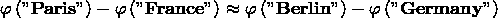

换句话说，分布式表示旨在将词转化为向量，使得向量之间的相似度与词语的语义相似度相关。

最著名的词嵌入方法是 word2vec 和 GloVe，我们将在后续章节中更详细地介绍。

# word2vec

word2vec 模型组是由谷歌的研究团队于 2013 年创建的，团队由 Tomas Mikolov 领导。该模型是无监督的，输入为大量文本语料库，输出为词向量空间。word2vec 嵌入空间的维度通常低于 one-hot 嵌入空间的维度，后者的维度等于词汇表的大小。与稀疏的 one-hot 嵌入空间相比，嵌入空间的密度更大。

word2vec 的两种架构如下：

+   **连续词袋模型**（**CBOW**）

+   **Skip-gram**

在 CBOW 架构中，模型根据周围词的窗口来预测当前词。此外，上下文词的顺序对预测没有影响（也就是说，词袋假设）。在 skip-gram 架构中，模型根据中心词来预测周围的词。根据作者的说法，CBOW 更快，但 skip-gram 在预测不频繁出现的词时效果更好。

一个有趣的观察是，尽管 word2vec 生成的嵌入用于深度学习 NLP 模型，但我们将讨论的两种 word2vec 模型，恰好也是近年来最成功和公认的模型，实际上是浅层神经网络。

# skip-gram word2vec 模型

Skip-gram 模型被训练来预测给定当前词的周围词。为了理解 skip-gram word2vec 模型如何工作，考虑以下示例句子：

*I love green eggs and ham.*

假设窗口大小为三，这个句子可以分解成以下 (上下文, 词) 对：

*([I, green], love)*

*([love, eggs], green)*

*([green, and], eggs)*

*...*

由于 skip-gram 模型在给定中心词的情况下预测上下文词，我们可以将前面的数据集转换为 (输入, 输出) 对。也就是说，给定一个输入词，我们期望 skip-gram 模型预测出输出词：

*(love, I), (love, green), (green, love), (green, eggs), (eggs, green), (eggs, and), ...*

我们还可以通过将每个输入词与词汇表中的某个随机词配对来生成额外的负样本。例如：

*(love, Sam), (love, zebra), (green, thing), ...*

最后，我们为分类器生成正负样本：

*((love, I), 1), ((love, green), 1), ..., ((love, Sam), 0), ((love, zebra), 0), ...*

我们现在可以训练一个分类器，该分类器输入一个词向量和一个上下文向量，并学习根据是否看到正样本或负样本来预测 1 或 0。这个训练好的网络的输出是词嵌入层的权重（下图中的灰色框）：

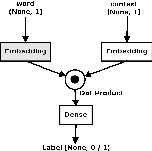

Skip-gram 模型可以在 Keras 中构建如下。假设词汇表的大小设置为 `5000`，输出嵌入大小为 `300`，窗口大小为 `1`。窗口大小为 1 意味着一个词的上下文是其左右两侧紧挨着的词。我们首先处理导入并将变量设置为其初始值：

```py
from keras.layers import Merge
from keras.layers.core import Dense, Reshape
from keras.layers.embeddings import Embedding
from keras.models import Sequential

vocab_size = 5000
embed_size = 300

```

我们然后为词创建一个顺序模型。这个模型的输入是词汇表中的词 ID。嵌入权重最初设置为小的随机值。在训练过程中，模型将使用反向传播更新这些权重。接下来的层将输入重塑为嵌入大小：

```py
word_model = Sequential()
word_model.add(Embedding(vocab_size, embed_size,
                         embeddings_initializer="glorot_uniform",
                         input_length=1))
word_model.add(Reshape((embed_size, )))

```

我们需要的另一个模型是一个用于上下文词的顺序模型。对于每一对 skip-gram，我们都有一个与目标词对应的上下文词，因此这个模型与词模型相同：

```py
context_model = Sequential()
context_model.add(Embedding(vocab_size, embed_size,
                  embeddings_initializer="glorot_uniform",
                  input_length=1))
context_model.add(Reshape((embed_size,)))

```

这两个模型的输出都是大小为 (`embed_size`) 的向量。这些输出通过点积合并成一个，并传入一个全连接层，该层有一个单一的输出，并通过 sigmoid 激活层进行包装。你在第一章 *神经网络基础* 中已经见过 sigmoid 激活函数。正如你记得的，它调节输出，使得大于 0.5 的数值迅速接近 1 并趋于平稳，而小于 0.5 的数值迅速接近 0 同样也趋于平稳：

```py
model = Sequential()
model.add(Merge([word_model, context_model], mode="dot"))
model.add(Dense(1, init="glorot_uniform", activation="sigmoid"))
model.compile(loss="mean_squared_error", optimizer="adam")

```

使用的损失函数是`mean_squared_error`；其思路是最小化正例的点积并最大化负例的点积。如果你还记得，点积是将两个向量对应的元素相乘并求和——这使得相似的向量相比于不相似的向量具有更高的点积，因为前者有更多重叠的元素。

Keras 提供了一个便捷函数，用于提取已转换为单词索引列表的文本中的跳字模型（skip-grams）。以下是使用该函数提取从 56 个跳字模型中前 10 个的示例（包括正例和负例）。

我们首先声明必要的导入并分析文本：

```py
from keras.preprocessing.text import *
from keras.preprocessing.sequence import skipgrams

text = "I love green eggs and ham ."

```

下一步是声明`tokenizer`并运行文本进行处理。这将生成一个单词令牌的列表：

```py
tokenizer = Tokenizer()
tokenizer.fit_on_texts([text])

```

`tokenizer`创建一个字典，将每个唯一单词映射到一个整数 ID，并通过`word_index`属性提供该映射。我们提取该映射并创建一个双向查找表：

```py
word2id = tokenizer.word_index
id2word = {v:k for k, v in word2id.items()}

```

最后，我们将输入的单词列表转换为 ID 列表，并将其传递给`skipgrams`函数。然后，我们打印生成的 56 个（对，标签）跳字元组中的前 10 个：

```py
wids = [word2id[w] for w in text_to_word_sequence(text)]
pairs, labels = skipgrams(wids, len(word2id))
print(len(pairs), len(labels))
for i in range(10):
    print("({:s} ({:d}), {:s} ({:d})) -> {:d}".format(
          id2word[pairs[i][0]], pairs[i][0], 
          id2word[pairs[i][1]], pairs[i][1], 
          labels[i]))

```

代码的结果如下所示。请注意，由于跳字方法是从正例的可能性池中随机采样结果，因此你的结果可能会有所不同。此外，生成负例的负采样过程是随机配对文本中的任意令牌。随着输入文本大小的增加，这种方法更可能选择无关的单词对。在我们的示例中，由于文本非常短，因此也有可能生成正例。

```py
(and (1), ham (3)) -> 0
(green (6), i (4)) -> 0
(love (2), i (4)) -> 1
(and (1), love (2)) -> 0
(love (2), eggs (5)) -> 0
(ham (3), ham (3)) -> 0
(green (6), and (1)) -> 1
(eggs (5), love (2)) -> 1
(i (4), ham (3)) -> 0
(and (1), green (6)) -> 1 

```

该示例的代码可以在章节的源代码下载中的`skipgram_example.py`文件中找到。

# CBOW word2vec 模型

现在让我们来看一下 CBOW word2vec 模型。回顾一下，CBOW 模型根据上下文单词预测中心单词。因此，在以下示例的第一个元组中，CBOW 模型需要预测输出单词*love*，给定上下文单词*I*和*green*：

*([I, green], love) ([love, eggs], green) ([green, and], eggs) ...*

像 skip-gram 模型一样，CBOW 模型也是一个分类器，它以上下文词作为输入，预测目标词。与 skip-gram 模型相比，CBOW 模型的架构相对简单。模型的输入是上下文词的词 ID。这些词 ID 被输入到一个通用的嵌入层，该层的权重被初始化为小的随机值。每个词 ID 都会通过嵌入层转换成大小为（`embed_size`）的向量。因此，输入上下文的每一行都通过该层转化为大小为（`2*window_size`, `embed_size`）的矩阵。接着，这个矩阵被输入到一个 lambda 层，lambda 层计算所有嵌入的平均值。这个平均值再输入到一个全连接层，生成大小为（`vocab_size`）的密集向量。全连接层的激活函数是 softmax，它会报告输出向量中的最大值作为概率。具有最大概率的 ID 对应于目标词。

CBOW 模型的交付物是来自嵌入层的权重，嵌入层在下图中显示为灰色：

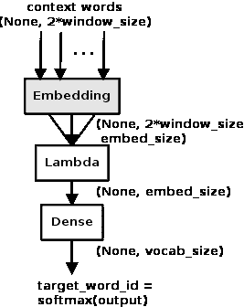

该模型的 Keras 代码如下所示。再假设词汇表大小为`5000`，嵌入大小为`300`，上下文窗口大小为`1`。我们的第一步是设置所有的导入以及这些值：

```py
from keras.models import Sequential
from keras.layers.core import Dense, Lambda
from keras.layers.embeddings import Embedding
import keras.backend as K

vocab_size = 5000
embed_size = 300
window_size = 1

```

然后，我们构建一个顺序模型，并向其中添加一个嵌入层，该层的权重初始化为小的随机值。请注意，该嵌入层的`input_length`等于上下文词的数量。因此，每个上下文词都会被输入到这个层，并在反向传播过程中共同更新权重。该层的输出是上下文词的嵌入矩阵，这些嵌入通过 lambda 层平均成一个单一的向量（每一行输入）。最后，全连接层会将每一行转换为大小为（`vocab_size`）的密集向量。目标词是密集输出向量中 ID 值最大的词。

```py
model = Sequential()
model.add(Embedding(input_dim=vocab_size, output_dim=embed_size, 
                    embeddings_initializer='glorot_uniform',
                    input_length=window_size*2))
model.add(Lambda(lambda x: K.mean(x, axis=1), output_shape=  (embed_size,)))
model.add(Dense(vocab_size, kernel_initializer='glorot_uniform', activation='softmax'))

model.compile(loss='categorical_crossentropy', optimizer="adam")

```

这里使用的损失函数是`categorical_crossentropy`，它是一个常见的选择，适用于有两个或更多类别的情况（在我们的例子中是`vocab_size`）。

示例的源代码可以在章节的源代码下载中找到`keras_cbow.py`文件。

# 从模型中提取 word2vec 嵌入

如前所述，尽管两个 word2vec 模型都可以简化为一个分类问题，但我们并不真正关注分类问题本身。相反，我们更关心这个分类过程的副作用，也就是将词从词汇表转换为其密集、低维分布式表示的权重矩阵。

有许多例子表明这些分布式表示展示了常常令人惊讶的句法和语义信息。例如，在 Tomas Mikolov 在 2013 年 NIPS 大会上的演示中（更多信息请参阅文章：*使用神经网络学习文本表示*，T. Mikolov, I. Sutskever, K. Chen, G. S. Corrado, J. Dean, Q. Le 和 T. Strohmann，NIPS 2013），连接具有相似意义但性别相反的单词的向量在降维后的二维空间中大致平行，我们通过对单词向量进行算术运算，通常可以得到非常直观的结果。该演示提供了许多其他的例子。

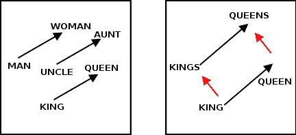

直观地说，训练过程将足够的信息传递给内部编码，以预测在输入单词的上下文中出现的输出单词。因此，表示单词的点在这个空间中移动，靠近与之共同出现的单词。这导致相似的单词聚集在一起。与这些相似单词共同出现的单词也会以类似的方式聚集在一起。结果，连接表示语义相关点的向量往往会在分布式表示中展示这些规律性。

Keras 提供了一种从训练模型中提取权重的方法。对于 skip-gram 示例，可以通过以下方式提取嵌入权重：

```py
merge_layer = model.layers[0]
word_model = merge_layer.layers[0]
word_embed_layer = word_model.layers[0]
weights = word_embed_layer.get_weights()[0]

```

同样，CBOW 示例的嵌入权重可以使用以下单行代码提取：

```py
weights = model.layers[0].get_weights()[0]

```

在这两种情况下，权重矩阵的形状都是`vocab_size`和`embed_size`。为了计算词汇表中单词的分布式表示，您需要通过将单词索引的位置设置为 1，在一个大小为（`vocab_size`）的零向量中构造一个 one-hot 向量，并将其与矩阵相乘，得到大小为（`embed_size`）的嵌入向量。

以下是由 Christopher Olah 的工作中得出的词嵌入可视化（更多信息请参阅文章：*文档嵌入与段落向量*，Andrew M. Dai, Christopher Olah 和 Quoc V. Le，arXiv:1507.07998，2015）。这是通过 T-SNE 将词嵌入降到二维并可视化的结果。形成实体类型的单词是通过使用 WordNet 同义词集簇选择的。正如您所见，表示相似实体类型的点往往会聚集在一起：

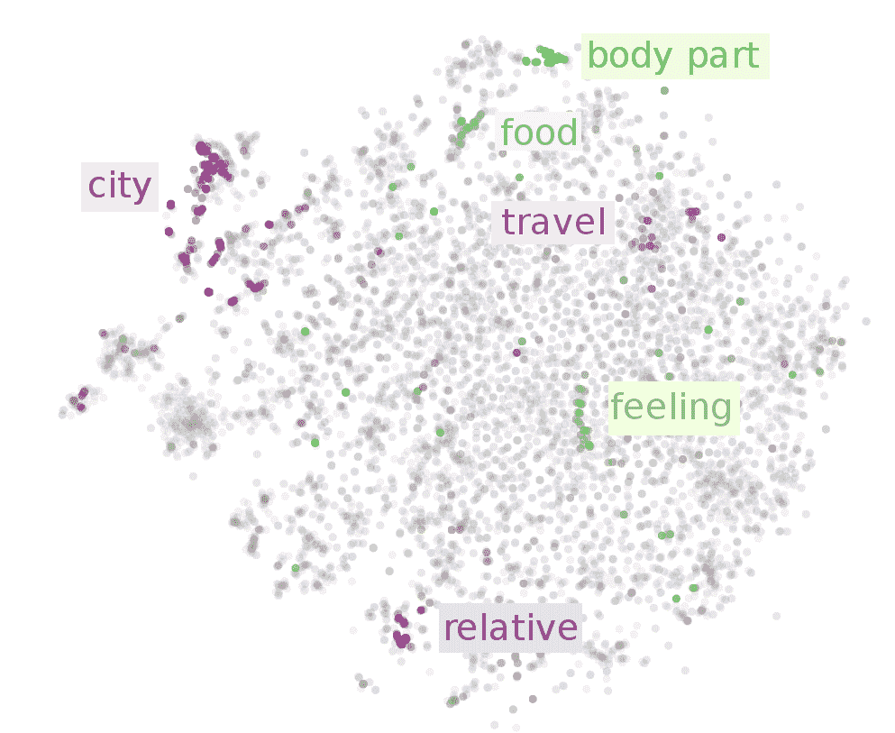

示例的源代码可以在源代码下载中的`keras_skipgram.py`找到。

# 使用 word2vec 的第三方实现

在过去的几节中，我们已经详细讨论了 word2vec。此时，您已经了解了 skip-gram 和 CBOW 模型的工作原理，并且知道如何使用 Keras 构建这些模型的实现。然而，word2vec 的第三方实现已经广泛可用，除非您的使用案例非常复杂或不同，否则直接使用现有的实现而不是自己动手实现更为合理。

gensim 库提供了 word2vec 的实现。虽然这是一本关于 Keras 的书，而不是 gensim，但我们在这里讨论这个问题，因为 Keras 不支持 word2vec，并且将 gensim 的实现集成到 Keras 代码中是非常常见的做法。

gensim 的安装相当简单，并在 gensim 安装页面上详细描述（[`radimrehurek.com/gensim/install.html`](https://radimrehurek.com/gensim/install.html)）。

以下代码展示了如何使用 gensim 构建 word2vec 模型，并使用来自 text8 语料库的文本进行训练，text8 语料库可以从[`mattmahoney.net/dc/text8.zip`](http://mattmahoney.net/dc/text8.zip)下载。text8 语料库是一个包含约 1700 万个单词的文件，来源于维基百科的文本。维基百科的文本被清洗过，去除了标记、标点和非 ASCII 文本，清洗后的前 1 亿个字符组成了 text8 语料库。这个语料库常被用作 word2vec 的示例，因为它训练速度快且能产生良好的结果。首先，我们像往常一样设置导入：

```py
from gensim.models import KeyedVectors
import logging
import os

```

然后，我们读取 text8 语料库中的单词，并将单词分割成每句 50 个单词。gensim 库提供了一个内置的 text8 处理器，它做的事情类似。由于我们想展示如何使用任何（最好是大型）语料库生成模型，而这些语料库可能无法完全加载到内存中，因此我们将展示如何使用 Python 生成器生成这些句子。

`Text8Sentences`类将从 text8 文件中生成每个最大长度为`maxlen`的句子。在这种情况下，我们确实将整个文件加载到内存中，但在遍历文件夹中的文件时，生成器允许我们一次将数据的部分加载到内存中，处理它们，然后将它们传递给调用者：

```py
class Text8Sentences(object):
  def __init__(self, fname, maxlen):
    self.fname = fname
    self.maxlen = maxlen

  def __iter__(self):
    with open(os.path.join(DATA_DIR, "text8"), "rb") as ftext:
      text = ftext.read().split(" ")
      sentences, words = [], []
      for word in text:
        if len(words) >= self.maxlen:
          yield words
          words = []
          words.append(word)
          yield words

```

然后我们设置调用代码。gensim 的 word2vec 使用 Python 的 logging 来报告进度，所以我们首先启用它。下一行声明了一个`Text8Sentences`类的实例，接下来的一行则用数据集中的句子训练模型。我们选择将嵌入向量的大小设置为`300`，并且只考虑在语料库中至少出现 30 次的单词。默认的窗口大小是`5`，因此我们将把单词 *w[i-5]*、*w[i-4]*、*w[i-3]*、*w[i-2]*、*w[i-1]*、*w[i+1]*、*w[i+2]*、*w[i+3]*、*w[i+4]* 和 *w[i+5]* 作为单词 *w[i]* 的上下文。默认情况下，创建的 word2vec 模型是 CBOW，但你可以通过在参数中设置`sg=1`来更改这一点：

```py
logging.basicConfig(format='%(asctime)s : %(levelname)s : %(message)s', level=logging.INFO)

DATA_DIR = "../data/"
sentences = Text8Sentences(os.path.join(DATA_DIR, "text8"), 50)
model = word2vec.Word2Vec(sentences, size=300, min_count=30)

```

word2vec 的实现将对数据进行两次遍历，第一次是生成词汇表，第二次是构建实际的模型。在运行过程中，你可以在控制台看到它的进度：

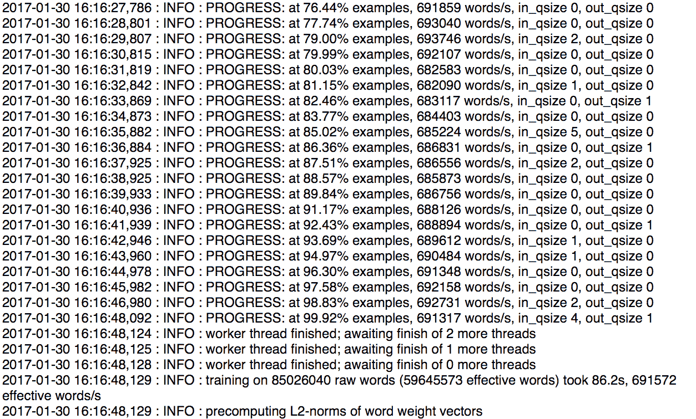

模型创建后，我们应当对结果向量进行归一化。根据文档，这样可以节省大量内存。一旦模型训练完成，我们可以选择将其保存到磁盘：

```py
model.init_sims(replace=True)
model.save("word2vec_gensim.bin")

```

保存的模型可以通过以下调用重新加载到内存：

```py
model = Word2Vec.load("word2vec_gensim.bin")

```

我们现在可以查询模型，找出它所知道的所有词语：

```py
>>> model.vocab.keys()[0:10]
['homomorphism',
'woods',
'spiders',
'hanging',
'woody',
'localized',
'sprague',
'originality',
'alphabetic',
'hermann']

```

我们可以找到给定词语的实际向量嵌入：

```py
>>> model["woman"]
 array([ -3.13099056e-01, -1.85702944e+00, 1.18816841e+00,
 -1.86561719e-01, -2.23673001e-01, 1.06527400e+00,
 &mldr;
 4.31755871e-01, -2.90115297e-01, 1.00955181e-01,
 -5.17173052e-01, 7.22485244e-01, -1.30940580e+00], dtype=”float32”)

```

我们还可以找到与某个特定词语最相似的词语：

```py
>>> model.most_similar("woman")
 [('child', 0.7057571411132812),
 ('girl', 0.702182412147522),
 ('man', 0.6846336126327515),
 ('herself', 0.6292711496353149),
 ('lady', 0.6229539513587952),
 ('person', 0.6190367937088013),
 ('lover', 0.6062309741973877),
 ('baby', 0.5993420481681824),
 ('mother', 0.5954475402832031),
 ('daughter', 0.5871444940567017)]

```

我们可以提供一些提示来帮助寻找词语的相似性。例如，以下命令返回与`woman`和`king`相似但与`man`不同的前 10 个词：

```py
>>> model.most_similar(positive=['woman', 'king'], negative=['man'], topn=10)
 [('queen', 0.6237582564353943),
 ('prince', 0.5638638734817505),
 ('elizabeth', 0.5557916164398193),
 ('princess', 0.5456407070159912),
 ('throne', 0.5439794063568115),
 ('daughter', 0.5364126563072205),
 ('empress', 0.5354889631271362),
 ('isabella', 0.5233952403068542),
 ('regent', 0.520746111869812),
 ('matilda', 0.5167444944381714)]

```

我们还可以找到单个词之间的相似度。为了让大家了解词语在嵌入空间中的位置如何与其语义含义相关联，让我们看一下以下的词对：

```py
>>> model.similarity("girl", "woman")
 0.702182479574
 >>> model.similarity("girl", "man")
 0.574259909834
 >>> model.similarity("girl", "car")
 0.289332921793
 >>> model.similarity("bus", "car")
 0.483853497748

```

如你所见，`girl`和`woman`的相似度高于`girl`和`man`，`car`和`bus`的相似度高于`girl`和`car`。这与我们对这些词的直观理解非常一致。

示例的源代码可以在源代码下载中的`word2vec_gensim.py`中找到。

# 探索 GloVe

词表示的全局向量，或称为 GloVe 嵌入，由 Jeffrey Pennington、Richard Socher 和 Christopher Manning 创建（更多信息请参考文章：*GloVe: Global Vectors for Word Representation*，作者：J. Pennington、R. Socher 和 C. Manning，发表于 2014 年自然语言处理实证方法会议（EMNLP）论文集，第 1532-1543 页，2013 年）。作者将 GloVe 描述为一种无监督学习算法，用于获取词语的向量表示。训练基于从语料库中聚合的全局词语共现统计数据，结果表示展示了词向量空间中的有趣线性子结构。

GloVe 与 word2vec 的不同之处在于，word2vec 是一个预测模型，而 GloVe 是一个基于计数的模型。第一步是构建一个大的（词语，语境）对矩阵，这些词语在训练语料库中共同出现。该矩阵中的每个元素表示行所表示的词语在列所表示的语境（通常是一个词语序列）中共同出现的频率，如下图所示：

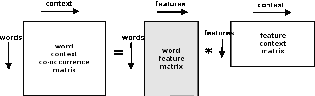

GloVe 过程将共现矩阵转换为（词语，特征）和（特征，语境）矩阵。这个过程称为**矩阵分解**，并使用**随机梯度下降**（**SGD**）这一迭代数值方法完成。用公式表示如下：

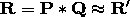

这里，*R*是原始的共现矩阵。我们首先将*P*和*Q*用随机值填充，并尝试通过相乘来重建矩阵*R'*。重建矩阵*R'*和原始矩阵*R*之间的差异告诉我们，需要调整*P*和*Q*的值多少，以便将*R'*拉近*R*，从而最小化重建误差。这个过程会重复多次，直到 SGD 收敛且重建误差低于指定阈值。此时，（词语，特征）矩阵即为 GloVe 嵌入。为了加速这一过程，SGD 通常会以并行模式进行，如*HOGWILD!*论文中所述。

需要注意的一点是，基于神经网络的预测模型（如 word2vec）和基于计数的模型（如 GloVe）在目的上非常相似。它们都构建一个向量空间，其中单词的位置受到邻近单词的影响。神经网络模型从单个词共现实例开始，而基于计数的模型从语料库中所有单词之间的共现统计数据开始。最近的几篇论文展示了这两种模型之间的相关性。

本书不会更详细地讲解 GloVe 向量的生成。尽管 GloVe 通常比 word2vec 显示出更高的准确性，并且如果使用并行化训练，速度更快，但 Python 工具在成熟度上不如 word2vec。截至本书撰写时，唯一可用的工具是 GloVe-Python 项目（[`github.com/maciejkula/glove-python`](https://github.com/maciejkula/glove-python)），它提供了一个在 Python 上实现 GloVe 的玩具实现。

# 使用预训练的词向量

通常，只有在你拥有大量非常专业的文本时，才会从头开始训练自己的 word2vec 或 GloVe 模型。迄今为止，词向量最常见的使用方式是以某种方式在你的网络中使用预训练的词向量。你在网络中使用词向量的三种主要方式如下：

+   从头开始学习词向量

+   微调从预训练的 GloVe/word2vec 模型学习到的词向量

+   查找预训练的 GloVe/word2vec 模型中的词向量

在第一种选择中，词向量权重初始化为小的随机值，并通过反向传播进行训练。你在 Keras 的 skip-gram 和 CBOW 模型示例中看到过这个。这是当你在网络中使用 Keras 的嵌入层时的默认模式。

在第二种选择中，你从预训练模型构建一个权重矩阵，并使用这个权重矩阵初始化嵌入层的权重。网络将通过反向传播更新这些权重，但由于良好的初始权重，模型会更快地收敛。

第三种选择是查找预训练模型中的词向量，并将输入转换为嵌入向量。然后，你可以在转换后的数据上训练任何机器学习模型（即，不一定是深度学习网络）。如果预训练模型是在与目标领域相似的领域上训练的，通常效果很好，而且是最不昂贵的选择。

对于一般的英语文本使用，可以使用 Google 的 word2vec 模型，该模型在 100 亿个单词的 Google 新闻数据集上进行训练。词汇表大小约为 300 万个单词，嵌入的维度为 300。Google 新闻模型（约 1.5 GB）可以从这里下载：[`drive.google.com/file/d/0B7XkCwpI5KDYNlNUTTlSS21pQmM/edit?usp=sharing`](https://drive.google.com/file/d/0B7XkCwpI5KDYNlNUTTlSS21pQmM/edit?usp=sharing)。

同样地，可以从 GloVe 网站下载一个预先训练的模型，该模型在来自英语维基百科和 gigaword 语料库的 60 亿个标记上进行了训练。词汇量约为 400,000 个单词，下载提供了维度为 50、100、200 和 300 的向量。模型大小约为 822 MB。这是该模型的直接下载 URL（[`nlp.stanford.edu/data/glove.6B.zip`](http://nlp.stanford.edu/data/glove.6B.zip)）。基于 Common Crawl 和 Twitter 的更大型号模型也可以从同一位置获取。

在接下来的几节中，我们将看看如何以列出的三种方式使用这些预训练模型。

# 从头开始学习嵌入

在本示例中，我们将训练一个一维**卷积神经网络**（**CNN**），将句子分类为正面或负面。您已经看到如何使用二维 CNN 分类图像在第三章，*使用 ConvNets 进行深度学习*。回想一下，CNN 通过强制相邻层神经元之间的局部连接来利用图像中的空间结构。

句子中的单词表现出与图像展现空间结构相同的线性结构。传统（非深度学习）自然语言处理方法涉及创建单词*n*-grams（[`en.wikipedia.org/wiki/N-gram`](https://en.wikipedia.org/wiki/N-gram)）。一维 CNN 做类似的事情，学习卷积滤波器，这些滤波器一次处理几个单词，并对结果进行最大池化，以创建代表句子中最重要思想的向量。

还有另一类神经网络，称为**循环神经网络**（**RNN**），专门设计用于处理序列数据，包括文本，即一系列单词。RNN 中的处理方式与 CNN 中的处理方式不同。我们将在未来的章节中学习有关 RNN 的内容。

在我们的示例网络中，输入文本被转换为一系列单词索引。请注意，我们使用**自然语言工具包**（**NLTK**）将文本解析为句子和单词。我们也可以使用正则表达式来做这件事，但是 NLTK 提供的统计模型在解析上比正则表达式更强大。如果您正在处理词嵌入，很可能已经安装了 NLTK。

此链接（[`www.nltk.org/install.html`](http://www.nltk.org/install.html)）包含帮助您在计算机上安装 NLTK 的信息。您还需要安装 NLTK 数据，这是 NLTK 标准提供的一些训练语料库。NLTK 数据的安装说明在这里：[`www.nltk.org/data.html`](http://www.nltk.org/data.html)。

词汇索引的序列被输入到一组嵌入层的数组中，这些嵌入层的大小是固定的（在我们的例子中是最长句子的单词数）。嵌入层默认通过随机值进行初始化。嵌入层的输出被连接到一个 1D 卷积层，该卷积层以 256 种不同的方式对词三元组进行卷积（本质上，它对词嵌入应用不同的学习到的线性权重组合）。然后，这些特征通过一个全局最大池化层被池化成一个单一的池化词向量。这个向量（256）被输入到一个全连接层，输出一个向量（2）。Softmax 激活函数会返回一对概率，一个对应正向情感，另一个对应负向情感。网络结构如下图所示：

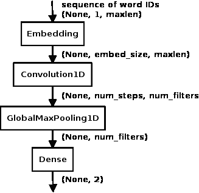

让我们来看一下如何使用 Keras 编写代码。首先我们声明导入的库。在常量之后，您会注意到我将 `random.seed` 的值设置为 `42`。这是因为我们希望运行结果保持一致。由于权重矩阵的初始化是随机的，初始化的差异可能会导致输出的差异，因此我们通过设置种子来控制这一点：

```py
from keras.layers.core import Dense, Dropout, SpatialDropout1D
from keras.layers.convolutional import Conv1D
from keras.layers.embeddings import Embedding
from keras.layers.pooling import GlobalMaxPooling1D
from kera
s.models import Sequential
from keras.preprocessing.sequence import pad_sequences
from keras.utils import np_utils
from sklearn.model_selection import train_test_split
import collections
import matplotlib.pyplot as plt
import nltk
import numpy as np

np.random.seed(42)

```

我们声明常量。在本章的所有后续示例中，我们将对来自 Kaggle 上 UMICH SI650 情感分类竞赛的句子进行分类。数据集大约包含 7000 个句子，并标注为*1*表示正向情感，*0*表示负向情感。`INPUT_FILE` 定义了该文件的路径，该文件包含句子和标签。文件的格式为情感标签（*0* 或 *1*）后跟一个制表符，然后是一个句子。

`VOCAB_SIZE` 设置表示我们将只考虑文本中前 5000 个标记。`EMBED_SIZE` 设置是由嵌入层生成的嵌入大小。`NUM_FILTERS` 是我们为卷积层训练的卷积滤波器数量，`NUM_WORDS` 是每个滤波器的大小，也就是一次卷积时处理的单词数。`BATCH_SIZE` 和 `NUM_EPOCHS` 分别是每次馈送给网络的记录数量和在训练期间遍历整个数据集的次数：

```py
INPUT_FILE = "../data/umich-sentiment-train.txt"
VOCAB_SIZE = 5000
EMBED_SIZE = 100
NUM_FILTERS = 256
NUM_WORDS = 3
BATCH_SIZE = 64
NUM_EPOCHS = 20

```

在接下来的代码块中，我们首先读取输入的句子，并通过从语料库中最频繁的单词构建词汇表。然后，我们使用该词汇表将输入句子转换为一个词索引列表：

```py
counter = collections.Counter()
fin = open(INPUT_FILE, "rb")
maxlen = 0
for line in fin:
    _, sent = line.strip().split("t")
    words = [x.lower() for x in   nltk.word_tokenize(sent)]
    if len(words) > maxlen:
        maxlen = len(words)
    for word in words:
        counter[word] += 1
fin.close()

word2index = collections.defaultdict(int)
for wid, word in enumerate(counter.most_common(VOCAB_SIZE)):
    word2index[word[0]] = wid + 1
vocab_size = len(word2index) + 1
index2word = {v:k for k, v in word2index.items()}

```

我们将每个句子填充到预定的长度`maxlen`（在这种情况下是训练集中最长句子的单词数）。我们还使用 Keras 工具函数将标签转换为类别格式。最后两步是处理文本输入的标准工作流程，我们将在后续的步骤中一再使用：

```py
xs, ys = [], []
fin = open(INPUT_FILE, "rb")
for line in fin:
    label, sent = line.strip().split("t")
    ys.append(int(label))
    words = [x.lower() for x in nltk.word_tokenize(sent)]
    wids = [word2index[word] for word in words]
    xs.append(wids)
fin.close()
X = pad_sequences(xs, maxlen=maxlen)
Y = np_utils.to_categorical(ys)

```

最后，我们将数据分割为*70/30*的训练集和测试集。现在，数据已经准备好输入到网络中：

```py
Xtrain, Xtest, Ytrain, Ytest = train_test_split(X, Y, test_size=0.3, random_state=42)

```

我们定义了前面在本节中描述的网络：

```py
model = Sequential()
model.add(Embedding(vocab_size, EMBED_SIZE, input_length=maxlen)
model.add(SpatialDropout1D(Dropout(0.2)))
model.add(Conv1D(filters=NUM_FILTERS, kernel_size=NUM_WORDS,
activation="relu"))
model.add(GlobalMaxPooling1D())
model.add(Dense(2, activation="softmax"))

```

然后我们编译模型。由于我们的目标是二分类（正类或负类），我们选择`categorical_crossentropy`作为损失函数。优化器我们选择`adam`。接着，我们使用训练集对模型进行训练，批量大小为 64，训练 20 个周期：

```py
model.compile(loss="categorical_crossentropy", optimizer="adam",
              metrics=["accuracy"])
history = model.fit(Xtrain, Ytrain, batch_size=BATCH_SIZE,
                    epochs=NUM_EPOCHS,
                    validation_data=(Xtest, Ytest))

```

代码输出结果如下：

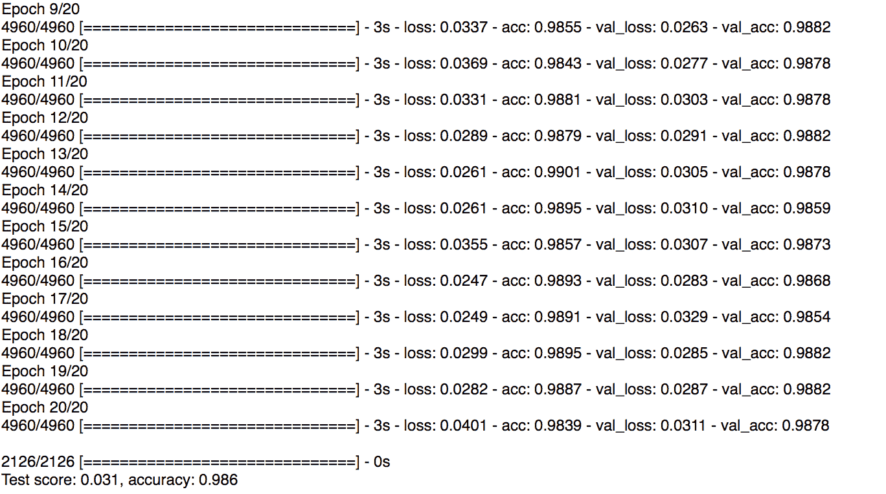

如你所见，网络在测试集上的准确率达到了 98.6%。

本示例的源代码可以在章节的源代码下载中找到，文件名为`learn_embedding_from_scratch.py`。

# 从 word2vec 微调学习到的嵌入

在这个示例中，我们将使用与之前从头学习嵌入时相同的网络。在代码方面，唯一的主要区别是增加了一段代码来加载 word2vec 模型，并构建嵌入层的权重矩阵。

和往常一样，我们从导入模块开始，并设置一个随机种子以保证可重复性。除了之前看到的导入外，还有一个额外的导入，用于从 gensim 导入 word2vec 模型：

```py
from gensim.models import KeyedVectors
from keras.layers.core import Dense, Dropout, SpatialDropout1D
from keras.layers.convolutional import Conv1D
from keras.layers.embeddings import Embedding
from keras.layers.pooling import GlobalMaxPooling1D
from keras.models import Sequential
from keras.preprocessing.sequence import pad_sequences
from keras.utils import np_utils
from sklearn.model_selection import train_test_split
import collections
import matplotlib.pyplot as plt
import nltk
import numpy as np

np.random.seed(42)

```

接下来是设置常量。这里唯一的不同是，我们将`NUM_EPOCHS`的设置从`20`减少到了`10`。回想一下，用预训练模型的值初始化矩阵通常能使权重值较好，并加快收敛速度：

```py
INPUT_FILE = "../data/umich-sentiment-train.txt"
WORD2VEC_MODEL = "../data/GoogleNews-vectors-negative300.bin.gz"
VOCAB_SIZE = 5000
EMBED_SIZE = 300
NUM_FILTERS = 256
NUM_WORDS = 3
BATCH_SIZE = 64
NUM_EPOCHS = 10

```

下一个代码块从数据集中提取单词，并创建一个包含最常见词汇的词汇表，然后再次解析数据集，创建一个填充的单词列表。它还将标签转换为类别格式。最后，它将数据拆分为训练集和测试集。这个代码块与前面的示例相同，已在前面进行了详细解释：

```py
counter = collections.Counter()
fin = open(INPUT_FILE, "rb")
maxlen = 0
for line in fin:
   _, sent = line.strip().split("t")
   words = [x.lower() for x in nltk.word_tokenize(sent)]
   if len(words) > maxlen:
       maxlen = len(words)
   for word in words:
       counter[word] += 1
fin.close()

word2index = collections.defaultdict(int)
for wid, word in enumerate(counter.most_common(VOCAB_SIZE)):
    word2index[word[0]] = wid + 1
vocab_sz = len(word2index) + 1
index2word = {v:k for k, v in word2index.items()}

xs, ys = [], []
fin = open(INPUT_FILE, "rb")
for line in fin:
    label, sent = line.strip().split("t")
    ys.append(int(label))
    words = [x.lower() for x in nltk.word_tokenize(sent)]
    wids = [word2index[word] for word in words]
    xs.append(wids)
fin.close()
X = pad_sequences(xs, maxlen=maxlen)
Y = np_utils.to_categorical(ys)

Xtrain, Xtest, Ytrain, Ytest = train_test_split(X, Y, test_size=0.3,
     random_state=42)

```

下一个代码块加载了一个预训练的 word2vec 模型。这个模型是用大约 100 亿个 Google 新闻文章中的单词训练的，词汇表大小为 300 万。我们加载它并从中查找词汇表中单词的嵌入向量，然后将嵌入向量写入权重矩阵`embedding_weights`。该权重矩阵的行对应词汇表中的单词，每行的列构成该单词的嵌入向量。

`embedding_weights`矩阵的维度为`vocab_sz`和`EMBED_SIZE`。`vocab_sz`比词汇表中唯一词汇的最大数量多 1，额外的伪标记`_UNK_`代表词汇表中没有出现的词汇。

请注意，我们的词汇表中可能会有些词汇在 Google News 的 word2vec 模型中不存在，因此当遇到这些词汇时，它们的嵌入向量将保持为默认值，全为零：

```py
# load word2vec model
word2vec = Word2Vec.load_word2vec_format(WORD2VEC_MODEL, binary=True)
embedding_weights = np.zeros((vocab_sz, EMBED_SIZE))
for word, index in word2index.items():
    try:
        embedding_weights[index, :] = word2vec[word]
    except KeyError:
        pass

```

我们定义了网络。这个代码块与前面的示例的不同之处在于，我们用在前一个代码块中构建的`embedding_weights`矩阵初始化了嵌入层的权重：

```py
model = Sequential()
model.add(Embedding(vocab_sz, EMBED_SIZE, input_length=maxlen,
          weights=[embedding_weights]))
model.add(SpatialDropout1D(Dropout(0.2)))
model.add(Conv1D(filters=NUM_FILTERS, kernel_size=NUM_WORDS,
                        activation="relu"))
model.add(GlobalMaxPooling1D())
model.add(Dense(2, activation="softmax"))

```

然后，我们使用类别交叉熵损失函数和 Adam 优化器编译模型，使用批量大小 64 进行 10 个 epoch 的训练，并评估训练后的模型：

```py
model.compile(optimizer="adam", loss="categorical_crossentropy",
              metrics=["accuracy"])
history = model.fit(Xtrain, Ytrain, batch_size=BATCH_SIZE,
                    epochs=NUM_EPOCHS,
                    validation_data=(Xtest, Ytest))

score = model.evaluate(Xtest, Ytest, verbose=1)
print("Test score: {:.3f}, accuracy: {:.3f}".format(score[0], score[1]))

```

运行代码的输出如下所示：

```py
((4960, 42), (2126, 42), (4960, 2), (2126, 2))
 Train on 4960 samples, validate on 2126 samples
 Epoch 1/10
 4960/4960 [==============================] - 7s - loss: 0.1766 - acc: 0.9369 - val_loss: 0.0397 - val_acc: 0.9854
 Epoch 2/10
 4960/4960 [==============================] - 7s - loss: 0.0725 - acc: 0.9706 - val_loss: 0.0346 - val_acc: 0.9887
 Epoch 3/10
 4960/4960 [==============================] - 7s - loss: 0.0553 - acc: 0.9784 - val_loss: 0.0210 - val_acc: 0.9915
 Epoch 4/10
 4960/4960 [==============================] - 7s - loss: 0.0519 - acc: 0.9790 - val_loss: 0.0241 - val_acc: 0.9934
 Epoch 5/10
 4960/4960 [==============================] - 7s - loss: 0.0576 - acc: 0.9746 - val_loss: 0.0219 - val_acc: 0.9929
 Epoch 6/10
 4960/4960 [==============================] - 7s - loss: 0.0515 - acc: 0.9764 - val_loss: 0.0185 - val_acc: 0.9929
 Epoch 7/10
 4960/4960 [==============================] - 7s - loss: 0.0528 - acc: 0.9790 - val_loss: 0.0204 - val_acc: 0.9920
 Epoch 8/10
 4960/4960 [==============================] - 7s - loss: 0.0373 - acc: 0.9849 - val_loss: 0.0221 - val_acc: 0.9934
 Epoch 9/10
 4960/4960 [==============================] - 7s - loss: 0.0360 - acc: 0.9845 - val_loss: 0.0194 - val_acc: 0.9929
 Epoch 10/10
 4960/4960 [==============================] - 7s - loss: 0.0389 - acc: 0.9853 - val_loss: 0.0254 - val_acc: 0.9915
 2126/2126 [==============================] - 1s
 Test score: 0.025, accuracy: 0.993

```

经过 10 个 epoch 的训练后，该模型在测试集上的准确率达到了 99.3%。这比之前的示例有所提升，后者在 20 个 epoch 后准确率为 98.6%。

本示例的源代码可以在本章的源代码下载中的`finetune_word2vec_embeddings.py`文件中找到。

# 微调来自 GloVe 的学习嵌入

使用预训练的 GloVe 嵌入进行微调与使用预训练的 word2vec 嵌入进行微调非常相似。事实上，除了构建嵌入层权重矩阵的代码块外，其余所有代码都是相同的。由于我们已经看过这段代码两次，所以我将只关注构建 GloVe 嵌入权重矩阵的代码块。

GloVe 嵌入有多种版本。我们使用的是在来自英文维基百科和 Gigaword 语料库的 60 亿个标记上预训练的模型。该模型的词汇表大小约为 40 万，下载包提供了维度为 50、100、200 和 300 的向量。我们将使用 300 维模型中的嵌入。

我们在前一个示例中唯一需要更改的代码是替换实例化 word2vec 模型并加载嵌入矩阵的代码块，替换为以下代码块。如果我们使用的模型的向量大小不是 300，那么我们还需要更新`EMBED_SIZE`。

向量以空格分隔的文本格式提供，因此第一步是将代码读取到字典`word2emb`中。这类似于我们之前示例中实例化 Word2Vec 模型的那一行代码：

```py
GLOVE_MODEL = "../data/glove.6B.300d.txt"
word2emb = {}
fglove = open(GLOVE_MODEL, "rb")
for line in fglove:
    cols = line.strip().split()
    word = cols[0]
    embedding = np.array(cols[1:], dtype="float32")
    word2emb[word] = embedding
fglove.close()

```

然后，我们实例化一个大小为（`vocab_sz`和`EMBED_SIZE`）的嵌入权重矩阵，并从`word2emb`字典中填充向量。对于那些在词汇表中存在但不在 GloVe 模型中的单词，向量将保持为全零：

```py
embedding_weights = np.zeros((vocab_sz, EMBED_SIZE))
for word, index in word2index.items():
    try:
        embedding_weights[index, :] = word2emb[word]
    except KeyError:
        pass

```

本程序的完整代码可以在 GitHub 上的本书代码库中的`finetune_glove_embeddings.py`找到。运行结果如下所示：

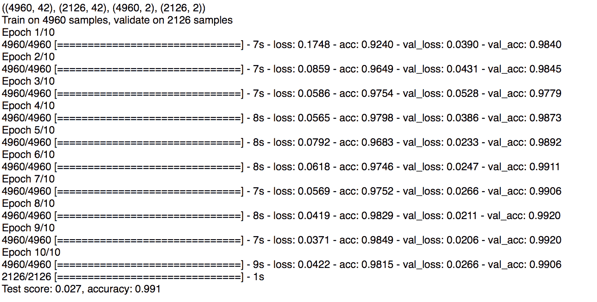

这让我们在 10 个 epoch 后达到了 99.1%的准确率，几乎与我们通过微调网络使用 word2vec `embedding_weights`得到的结果一样好。

本示例的源代码可以在本章的源代码下载中的`finetune_glove_embeddings.py`文件中找到。

# 查找嵌入

我们最终的策略是从预训练的网络中查找嵌入。使用当前示例的最简单方法是将嵌入层的`trainable`参数设置为`False`。这样可以确保反向传播不会更新嵌入层的权重：

```py
model.add(Embedding(vocab_sz, EMBED_SIZE, input_length=maxlen,
                     weights=[embedding_weights],
                     trainable=False))
model.add(SpatialDropout1D(Dropout(0.2)))

```

使用 word2vec 和 GloVe 示例设置此值后，经过 10 个 epoch 的训练，我们分别得到了 98.7%和 98.9%的准确率。

然而，通常情况下，这并不是你在代码中使用预训练嵌入的方式。通常，这涉及到对数据集进行预处理，通过查找预训练模型中的单词来创建单词向量，然后使用这些数据训练其他模型。第二个模型通常不包含嵌入层，甚至可能不是深度学习网络。

以下示例描述了一个密集网络，它将大小为`100`的向量作为输入，表示一个句子，并输出`1`或`0`，表示积极或消极的情感。我们的数据集仍然是来自 UMICH S1650 情感分类比赛的那个，约有 7,000 个句子。

如前所述，代码的许多部分是重复的，因此我们只解释那些新的或需要说明的部分。

我们从导入开始，设置随机种子以确保结果可重复，并设置一些常量值。为了创建每个句子的 100 维向量，我们将句子中单词的 GloVe 100 维向量相加，因此我们选择了`glove.6B.100d.txt`文件：

```py
from keras.layers.core import Dense, Dropout, SpatialDropout1D
from keras.models import Sequential
from keras.preprocessing.sequence import pad_sequences
from keras.utils import np_utils
from sklearn.model_selection import train_test_split
import collections
import matplotlib.pyplot as plt
import nltk
import numpy as np

np.random.seed(42)

INPUT_FILE = "../data/umich-sentiment-train.txt"
GLOVE_MODEL = "../data/glove.6B.100d.txt"
VOCAB_SIZE = 5000
EMBED_SIZE = 100
BATCH_SIZE = 64
NUM_EPOCHS = 10

```

下一个代码块读取句子并创建一个单词频率表。通过这个表，选择最常见的 5,000 个标记，并创建查找表（从单词到单词索引以及反向查找）。此外，我们为词汇表中不存在的标记创建一个伪标记`_UNK_`。使用这些查找表，我们将每个句子转换为一个单词 ID 序列，并对这些序列进行填充，使得所有序列的长度相同（即训练集中句子的最大单词数）。我们还将标签转换为类别格式：

```py
counter = collections.Counter()
fin = open(INPUT_FILE, "rb")
maxlen = 0
for line in fin:
    _, sent = line.strip().split("t")
    words = [x.lower() for x in nltk.word_tokenize(sent)]
    if len(words) > maxlen:
        maxlen = len(words)
    for word in words:
        counter[word] += 1
fin.close()

word2index = collections.defaultdict(int)
for wid, word in enumerate(counter.most_common(VOCAB_SIZE)):
     word2index[word[0]] = wid + 1
vocab_sz = len(word2index) + 1
index2word = {v:k for k, v in word2index.items()}
index2word[0] = "_UNK_"

ws, ys = [], []
fin = open(INPUT_FILE, "rb")
for line in fin:
    label, sent = line.strip().split("t")
    ys.append(int(label))
    words = [x.lower() for x in nltk.word_tokenize(sent)]
    wids = [word2index[word] for word in words]
    ws.append(wids)
fin.close()
W = pad_sequences(ws, maxlen=maxlen)
Y = np_utils.to_categorical(ys)

```

我们将 GloVe 向量加载到字典中。如果我们想在这里使用 word2vec，我们只需将这一块代码替换为 gensim 的`Word2Vec.load_word2vec_format()`调用，并将以下代码块替换为查找 word2vec 模型，而不是`word2emb`字典：

```py
word2emb = collections.defaultdict(int)
fglove = open(GLOVE_MODEL, "rb")
for line in fglove:
    cols = line.strip().split()
    word = cols[0]
    embedding = np.array(cols[1:], dtype="float32")
    word2emb[word] = embedding
fglove.close()

```

下一个代码块从单词 ID 矩阵`W`中查找每个句子的单词，并用相应的嵌入向量填充矩阵`E`。然后，将这些嵌入向量相加以创建一个句子向量，并将其写回到`X`矩阵中。此代码块的输出是矩阵`X`，其大小为（`num_records`和`EMBED_SIZE`）：

```py
X = np.zeros((W.shape[0], EMBED_SIZE))
for i in range(W.shape[0]):
    E = np.zeros((EMBED_SIZE, maxlen))
    words = [index2word[wid] for wid in W[i].tolist()]
    for j in range(maxlen):
         E[:, j] = word2emb[words[j]]
    X[i, :] = np.sum(E, axis=1)

```

我们现在已经使用预训练模型预处理了数据，并准备好使用它来训练和评估我们的最终模型。让我们像往常一样将数据分为*70/30*的训练集/测试集：

```py
Xtrain, Xtest, Ytrain, Ytest = train_test_split(X, Y, test_size=0.3, random_state=42)

```

我们将要训练的用于情感分析任务的网络是一个简单的密集网络。我们用类别交叉熵损失函数和 Adam 优化器来编译它，并使用从预训练嵌入中构建的句子向量来训练它。最后，我们在 30%的测试集上评估该模型：

```py
model = Sequential()
model.add(Dense(32, input_dim=100, activation="relu"))
model.add(Dropout(0.2))
model.add(Dense(2, activation="softmax"))

model.compile(optimizer="adam", loss="categorical_crossentropy", metrics=["accuracy"])
history = model.fit(Xtrain, Ytrain, batch_size=BATCH_SIZE,
                    epochs=NUM_EPOCHS,
                    validation_data=(Xtest, Ytest))

score = model.evaluate(Xtest, Ytest, verbose=1)
print("Test score: {:.3f}, accuracy: {:.3f}".format(score[0], score[1]))

```

使用 GloVe 嵌入的代码输出如下所示：

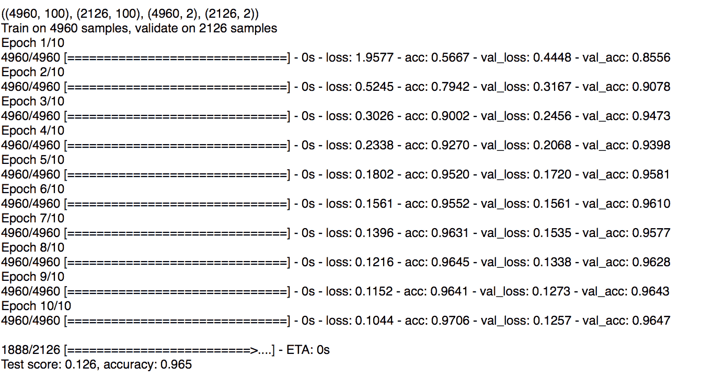

在经过 10 轮训练后，使用 100 维 GloVe 嵌入进行预处理的密集网络在测试集上取得了 96.5%的准确率。而使用 300 维固定的 word2vec 嵌入进行预处理时，网络在测试集上的准确率达到了 98.5%。

本示例的源代码可以在章节的源代码下载中找到，文件分别为`transfer_glove_embeddings.py`（GloVe 示例）和`transfer_word2vec_embeddings.py`（word2vec 示例）。

# 概述

在本章中，我们学习了如何将文本中的单词转换为向量嵌入，这些嵌入保留了单词的分布语义。我们现在也能直观地理解为什么单词嵌入会展现出这种行为，以及为什么单词嵌入在处理文本数据的深度学习模型中如此有用。

接着，我们研究了两种流行的单词嵌入方法——word2vec 和 GloVe，并理解了这些模型是如何工作的。我们还学习了如何使用 gensim 从数据中训练我们自己的 word2vec 模型。

最后，我们了解了在网络中使用嵌入的不同方式。第一种是从头开始学习嵌入，作为训练网络的一部分。第二种是将预训练的 word2vec 和 GloVe 模型的嵌入权重导入到我们的网络中，并在训练过程中进行微调。第三种是直接在下游应用中使用这些预训练的权重。

在下一章，我们将学习循环神经网络（RNN），一种优化处理序列数据（如文本）的网络类型。
