# 第六章：递归神经网络 — RNN

在第三章《*卷积神经网络深度学习*》中，我们学习了**卷积神经网络**（CNN），并了解了它们如何利用输入的空间几何信息。例如，CNN 在音频和文本数据的时间维度上应用一维卷积和池化操作，在图像的（高 x 宽）维度上应用二维卷积操作，在视频的（高 x 宽 x 时间）维度上应用三维卷积操作。

在本章中，我们将学习**递归神经网络**（**RNN**），这是一类利用输入序列特性的神经网络。这些输入可以是文本、语音、时间序列或其他任何元素的顺序依赖于前面元素出现的场景。例如，句子 *the dog...* 中下一个词更可能是 *barks* 而不是 *car*，因此，在这样的序列中，RNN 更有可能预测 *barks* 而不是 *car*。

RNN 可以被看作是一个 RNN 单元的图，其中每个单元对序列中的每个元素执行相同的操作。RNN 非常灵活，已经被用于解决语音识别、语言建模、机器翻译、情感分析、图像描述等问题。通过重新排列图中单元的排列方式，RNN 可以适应不同类型的问题。我们将看到这些配置的一些示例，以及它们如何用于解决特定问题。

我们还将学习简单 RNN 单元的一个主要局限性，以及两种简单 RNN 单元的变体——**长短期记忆**（**LSTM**）和**门控递归单元**（**GRU**）——如何克服这个局限性。LSTM 和 GRU 都是 SimpleRNN 单元的替代品，因此，只需将 RNN 单元替换为这两种变体之一，通常就能显著提高网络的性能。虽然 LSTM 和 GRU 不是唯一的变体，但通过实验证明（更多信息请参见文章：*递归网络架构的实证探索*，R. Jozefowicz、W. Zaremba 和 I. Sutskever，JMLR，2015 年，以及 *LSTM: A Search Space Odyssey*，K. Greff，arXiv:1503.04069，2015 年），它们是大多数序列问题的最佳选择。

最后，我们还将学习一些提升 RNN 性能的技巧，以及何时和如何应用这些技巧。

在本章中，我们将涵盖以下主题：

+   SimpleRNN 单元

+   在 Keras 中生成文本的基本 RNN 实现

+   RNN 拓扑结构

+   LSTM、GRU 和其他 RNN 变体

# SimpleRNN 单元

传统的多层感知机神经网络假设所有输入相互独立。但在序列数据的情况下，这一假设是无效的。你已经在上一节看到过例子，其中句子的前两个单词会影响第三个单词。这个想法在语音中也适用——如果我们在一个嘈杂的房间里交谈，我可以根据到目前为止听到的单词，对我可能没有听懂的单词做出合理的猜测。时间序列数据，例如股价或天气，也表现出对过去数据的依赖，这种依赖称为长期趋势。

RNN 单元通过拥有一个隐藏状态或记忆，来结合这种依赖关系，隐藏状态保存了到目前为止所看到的内容的精髓。任意时刻的隐藏状态值是前一个时间步隐藏状态值和当前时间步输入值的函数，即：

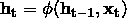

*h[t]*和*h[t-1]*分别是时间步*t*和*t-1*的隐藏状态值，*x[t]*是时间*t*时的输入值。请注意，这个方程是递归的，也就是说，*h[t-1]*可以通过*h[t-2]*和*x[t-1]*来表示，依此类推，直到序列的开始。这就是 RNN 如何编码并整合来自任意长序列的信息。

我们还可以将 RNN 单元通过图示表示，如左侧的图所示。在时间*t*时，单元有一个输入*x[t]*和一个输出*y[t]*。部分输出*y[t]*（即隐藏状态*h[t]*）被反馈回单元，在稍后的时间步*t+1*时使用。就像传统神经网络的参数包含在其权重矩阵中一样，RNN 的参数由三个权重矩阵*U*、*V*和*W*定义，分别对应输入、输出和隐藏状态：

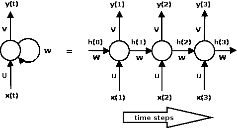

另一种看待 RNN 的方法是将其*展开*，如右侧前面图示所示。展开意味着我们为完整的序列绘制网络。这里显示的网络是一个三层 RNN，适合处理三元素序列。请注意，权重矩阵*U*、*V*和*W*在各个步骤之间是共享的。这是因为我们在每个时间步上对不同的输入应用相同的操作。能够在所有时间步共享这些权重向量，极大地减少了 RNN 需要学习的参数数量。

我们还可以用方程来描述 RNN 中的计算。在时间*t*时，RNN 的内部状态由隐藏向量*h[t]*的值给出，它是权重矩阵*W*与时间*t-1*时的隐藏状态*h[t-1]*的乘积，以及权重矩阵*U*与时间*t*的输入*x[t]*的乘积之和，经过*tanh*非线性激活函数处理。选择*tanh*而非其他非线性函数的原因在于它的二阶导数非常缓慢地趋近于零。这使得梯度保持在激活函数的线性区域，有助于解决梯度消失问题。我们将在本章稍后了解梯度消失问题。

在时间*t*时，输出向量*y[t]*是权重矩阵*V*与隐藏状态*h[t]*的乘积，并对乘积应用*softmax*，使得结果向量成为一组输出概率：

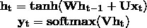

Keras 提供了 SimpleRNN（更多信息请参考：[`keras.io/layers/recurrent/`](https://keras.io/layers/recurrent/)）递归层，它包含了我们到目前为止所见的所有逻辑，以及更高级的变种，如 LSTM 和 GRU，后者将在本章稍后介绍，因此不严格要求理解它们的工作原理就能开始使用它们。然而，理解其结构和方程在你需要自己构建 RNN 来解决特定问题时是非常有帮助的。

# 使用 Keras 的 SimpleRNN — 生成文本

RNN 已被**自然语言处理**（**NLP**）领域广泛应用于各种任务。其中一个应用是构建语言模型。语言模型使我们能够预测给定前一个单词的情况下，文本中某个单词的概率。语言模型在机器翻译、拼写纠正等各类高级任务中至关重要。

能够根据前一个单词预测下一个单词的能力，带来了一个生成模型，让我们通过从输出概率中采样来生成文本。在语言建模中，我们的输入通常是一个单词序列，输出是一个预测的单词序列。使用的训练数据是现有的未标注文本，我们将时间*t*时的标签*y[t]*设置为时间*t+1*时的输入*x[t+1]*。

在我们使用 Keras 构建 RNN 的第一个例子中，我们将训练一个基于字符的语言模型，使用《爱丽丝梦游仙境》这本书的文本，根据前 10 个字符预测下一个字符。我们选择构建一个基于字符的模型，因为它的词汇量较小，训练速度较快。其思想与使用基于单词的语言模型相同，只不过我们使用的是字符而非单词。然后，我们将使用训练好的模型生成一些相同风格的文本。

首先，我们导入必要的模块：

```py
from __future__ import print_function
from keras.layers import Dense, Activation
from keras.layers.recurrent import SimpleRNN
from keras.models import Sequential
from keras.utils.visualize_util import plot
import numpy as np

```

我们从《爱丽丝梦游仙境》中的文本读取输入文本，该文本位于 Project Gutenberg 网站上（[`www.gutenberg.org/files/11/11-0.txt`](http://www.gutenberg.org/files/11/11-0.txt)）。该文件包含换行符和非 ASCII 字符，因此我们做了一些初步清理，并将内容写入一个名为`text`的变量中：

```py
fin = open("../data/alice_in_wonderland.txt", 'rb')
lines = []
for line in fin:
    line = line.strip().lower()
    line = line.decode("ascii", "ignore")
    if len(line) == 0:
        continue
    lines.append(line)
fin.close()
text = " ".join(lines)

```

由于我们构建的是字符级 RNN，因此我们的词汇表是文本中出现的字符集合。在我们的例子中有 42 个字符。由于我们将处理这些字符的索引而不是字符本身，以下代码片段创建了必要的查找表：

```py
chars = set([c for c in text])
nb_chars = len(chars)
char2index = dict((c, i) for i, c in enumerate(chars))
index2char = dict((i, c) for i, c in enumerate(chars))

```

下一步是创建输入文本和标签文本。我们通过由`STEP`变量（在我们的例子中是`1`）给定的字符数遍历文本，然后提取一个由`SEQLEN`变量（在我们的例子中是`10`）决定大小的文本片段。片段之后的下一个字符就是我们的标签字符：

```py
SEQLEN = 10
STEP = 1

input_chars = []
label_chars = []
for i in range(0, len(text) - SEQLEN, STEP):
    input_chars.append(text[i:i + SEQLEN])
    label_chars.append(text[i + SEQLEN])

```

使用前面的代码，输入文本和标签文本对于文本`it turned into a pig`将如下所示：

```py
it turned -> i
 t turned i -> n
 turned in -> t
turned int -> o
urned into ->
rned into -> a
ned into a ->
ed into a -> p
d into a p -> i
 into a pi -> g

```

下一步是将这些输入文本和标签文本向量化。RNN 的每一行输入都对应前面展示的其中一行输入文本。输入中有`SEQLEN`个字符，并且由于我们的词汇表大小由`nb_chars`给定，我们将每个输入字符表示为大小为(`nb_chars`)的独热编码向量。因此，每一行输入是一个大小为(`SEQLEN`和`nb_chars`)的张量。我们的输出标签是一个单一字符，因此与我们表示输入中每个字符的方式类似，它表示为大小为(`nb_chars`)的独热向量。因此，每个标签的形状为`nb_chars`：

```py
X = np.zeros((len(input_chars), SEQLEN, nb_chars), dtype=np.bool)
y = np.zeros((len(input_chars), nb_chars), dtype=np.bool)
for i, input_char in enumerate(input_chars):
    for j, ch in enumerate(input_char):
        X[i, j, char2index[ch]] = 1
    y[i, char2index[label_chars[i]]] = 1

```

最后，我们准备好构建模型。我们将 RNN 的输出维度定义为 128。这是一个需要通过实验确定的超参数。一般来说，如果选择的大小过小，模型将没有足够的能力生成良好的文本，并且你将看到长时间重复的字符或重复的词组。另一方面，如果选择的值过大，模型将有过多的参数，并且需要更多的数据来有效地训练。我们希望返回一个单一的字符作为输出，而不是一串字符，因此设置`return_sequences=False`。我们已经看到 RNN 的输入形状是(`SEQLEN`和`nb_chars`)。此外，我们设置`unroll=True`，因为它可以提高 TensorFlow 后端的性能。

RNN 连接到一个密集（全连接）层。密集层有(`nb_char`)个单元，输出词汇表中每个字符的分数。密集层的激活函数是 softmax，它将分数归一化为概率。具有最高概率的字符被选为预测结果。我们使用类别交叉熵损失函数来编译模型，这是一种适用于分类输出的良好损失函数，并使用 RMSprop 优化器：

```py
HIDDEN_SIZE = 128
BATCH_SIZE = 128
NUM_ITERATIONS = 25
NUM_EPOCHS_PER_ITERATION = 1
NUM_PREDS_PER_EPOCH = 100

model = Sequential()
model.add(SimpleRNN(HIDDEN_SIZE, return_sequences=False,
    input_shape=(SEQLEN, nb_chars),
    unroll=True))
model.add(Dense(nb_chars))
model.add(Activation("softmax"))

model.compile(loss="categorical_crossentropy", optimizer="rmsprop")

```

我们的训练方法与之前所见的有所不同。到目前为止，我们的方法是训练模型固定次数的迭代次数，然后在一部分保留的测试数据上进行评估。由于我们这里没有任何标注数据，我们训练模型进行一次迭代（`NUM_EPOCHS_PER_ITERATION=1`），然后进行测试。我们以这种方式继续训练 25 次（`NUM_ITERATIONS=25`），直到看到可理解的输出为止。所以，实际上，我们是训练 `NUM_ITERATIONS` 次迭代，每次迭代后测试模型。

我们的测试包括从模型中生成一个字符，给定一个随机输入，然后去掉输入中的第一个字符，并附加我们上一轮预测的字符，再从模型中生成另一个字符。我们重复这个过程 100 次（`NUM_PREDS_PER_EPOCH=100`），并生成和打印出结果字符串。这个字符串能为我们提供模型质量的指示：

```py
for iteration in range(NUM_ITERATIONS):
    print("=" * 50)
    print("Iteration #: %d" % (iteration))
    model.fit(X, y, batch_size=BATCH_SIZE, epochs=NUM_EPOCHS_PER_ITERATION)

    test_idx = np.random.randint(len(input_chars))
    test_chars = input_chars[test_idx]
    print("Generating from seed: %s" % (test_chars))
    print(test_chars, end="")
    for i in range(NUM_PREDS_PER_EPOCH):
        Xtest = np.zeros((1, SEQLEN, nb_chars))
        for i, ch in enumerate(test_chars):
            Xtest[0, i, char2index[ch]] = 1
        pred = model.predict(Xtest, verbose=0)[0]
        ypred = index2char[np.argmax(pred)]
        print(ypred, end="")
        # move forward with test_chars + ypred
        test_chars = test_chars[1:] + ypred
print()

```

运行的输出如下所示。如你所见，模型一开始预测的是胡言乱语，但在第 25 次迭代结束时，它已经学会了相对准确地拼写单词，尽管它在表达连贯的思想方面仍然存在问题。这个模型的惊人之处在于它是基于字符的，并且不理解单词的含义，然而它还是学会了拼写出看起来像是原始文本的单词：

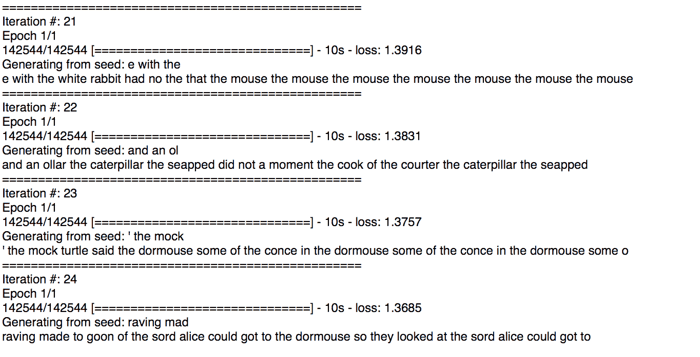

生成下一个字符或单词并不是你可以用这种模型做的唯一事情。这种模型已经成功地用于股市预测（更多信息请参见文章：*Financial Market Time Series Prediction with Recurrent Neural Networks*，A. Bernal、S. Fok 和 R. Pidaparthi，2012），以及生成古典音乐（更多信息请参见文章：*DeepBach: A Steerable Model for Bach Chorales Generation*，G. Hadjeres 和 F. Pachet，arXiv:1612.01010，2016），这些只是一些有趣的应用实例。Andrej Karpathy 在他的博客文章中涵盖了一些其他有趣的示例，比如生成假维基百科页面、代数几何证明和 Linux 源代码，文章标题为：*The Unreasonable Effectiveness of Recurrent Neural Networks*，网址为：[`karpathy.github.io/2015/05/21/rnn-effectiveness/`](http://karpathy.github.io/2015/05/21/rnn-effectiveness/)。

这个示例的源代码可以在章节的代码下载中找到，文件名为`alice_chargen_rnn.py`。数据可以从古腾堡计划获取。

# RNN 拓扑结构

MLP 和 CNN 架构的 API 是有限的。两种架构都接受一个固定大小的张量作为输入，并输出一个固定大小的张量；它们将在模型的层数所决定的固定步骤数中执行从输入到输出的转换。RNN 没有这个限制——你可以在输入、输出或两者中都有序列。这意味着 RNN 可以以多种方式排列，以解决特定问题。

正如我们所学，RNN 将输入向量与前一状态向量结合，生成一个新的状态向量。这可以类比为运行一个带有输入和一些内部变量的程序。因此，RNN 可以被看作是本质上描述计算机程序。事实上，已有研究表明，RNN 是图灵完备的（更多信息请参考文章：*On the Computational Power of Neural Nets*，H. T. Siegelmann 和 E. D. Sontag，计算学习理论第五届年度研讨会论文集，ACM，1992），即在适当的权重下，它们能够模拟任意程序。

这种能够处理序列的特性产生了许多常见的拓扑结构，接下来我们将讨论其中的一些：

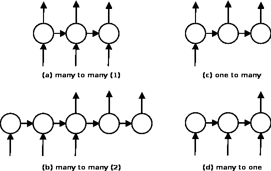

所有这些不同的拓扑结构都来源于前面图示的相同基本结构。在这个基本拓扑结构中，所有的输入序列长度相同，并且每个时间步都会生成一个输出。我们已经通过字符级别的 RNN 生成《爱丽丝梦游仙境》中的单词，看到过这样的例子。

另一个多对多的 RNN 例子是如**(b)**所示的机器翻译网络，它是序列到序列（sequence-to-sequence）网络家族的一部分（更多信息请参考：*Grammar as a Foreign Language*，O. Vinyals，神经信息处理系统进展，2015）。这些网络接受一个序列并生成另一个序列。在机器翻译的情况下，输入可以是一个句子中的英文单词序列，输出则是翻译后的西班牙语句子中的单词。在使用序列到序列模型进行**词性标注**（**POS**）的情况下，输入可以是一个句子中的单词，输出则是相应的词性标签。与之前的拓扑结构不同的是，在某些时间步没有输入，在其他时间步没有输出。我们将在本章后面看到这种网络的例子。

其他变体是如**(c)**所示的单对多网络，一个例子是图像描述生成网络（更多信息请参考文章：*Deep Visual-Semantic Alignments for Generating Image Descriptions*，A. Karpathy 和 F. Li，计算机视觉与模式识别 IEEE 会议论文集，2015），其中输入是图像，输出是一个单词序列。

类似地，图**(d)**所示的一个多对一网络示例可能是一个句子情感分析网络，其中输入是一个单词序列，输出是一个正面或负面的情感（欲了解更多信息，请参考文章：*递归深度模型用于情感树库上的语义组合性*，作者：R. Socher，《自然语言处理经验方法会议论文集（EMNLP）》第 1631 卷，2013 年）。我们将在本章后面看到该拓扑结构的一个（相比于引用的模型，简化了许多）示例。

# 梯度消失和爆炸

就像传统神经网络一样，训练 RNN 也涉及反向传播。不同之处在于，由于所有时间步共享参数，因此每个输出的梯度不仅依赖于当前时间步，还依赖于之前的时间步。这个过程叫做**时间反向传播**（**BPTT**）（欲了解更多信息，请参考文章：*通过反向传播错误学习内部表示*，作者：G. E. Hinton、D. E. Rumelhart 和 R. J. Williams，《平行分布处理：认知微观结构的探索 1》，1985 年）：

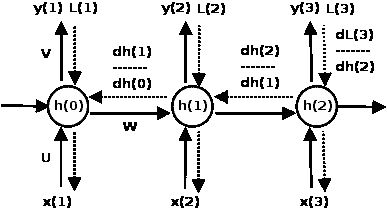

考虑前面图示的小型三层 RNN。在前向传播过程中（通过实线表示），网络产生的预测结果与标签进行比较，以计算每个时间步的损失*L[t]*。在反向传播过程中（通过虚线表示），计算损失相对于参数*U*、*V*和*W*的梯度，并通过梯度之和更新参数。

以下方程显示了损失相对于*W*的梯度，这个矩阵编码了长期依赖的权重。我们专注于这一部分的更新，因为它是梯度消失和爆炸问题的根源。损失相对于矩阵*U*和*V*的另外两个梯度也以类似的方式在所有时间步中求和：

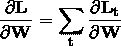

现在让我们看看在最后一个时间步（*t=3*）时损失的梯度会发生什么。正如你所看到的，这个梯度可以通过链式法则分解为三个子梯度的乘积。隐藏状态*h2*相对于*W*的梯度可以进一步分解为每个隐藏状态相对于前一个隐藏状态的梯度之和。最后，每个隐藏状态相对于前一个隐藏状态的梯度可以进一步分解为当前隐藏状态与前一个隐藏状态的梯度的乘积：

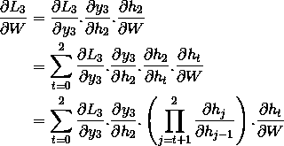

类似的计算也用于计算损失*L[1]*和*L[2]*（在时间步 1 和 2 时）相对于*W*的梯度，并将它们汇总为*W*的梯度更新。我们在本书中不会进一步探讨数学内容。如果你想自己研究，WILDML 博客文章（[`goo.gl/l06lbX`](https://goo.gl/l06lbX)）对 BPTT 有很好的解释，包括更详细的数学推导过程。

对于我们的目的，上面方程中梯度的最终形式告诉我们为什么 RNN 会有消失梯度和爆炸梯度的问题。考虑一下隐藏状态相对于前一个隐藏状态的单独梯度小于 1 的情况。当我们在多个时间步进行反向传播时，梯度的乘积变得越来越小，导致消失梯度问题。类似地，如果梯度大于 1，乘积会变得越来越大，导致爆炸梯度问题。

消失梯度的影响是，远离的步骤产生的梯度对学习过程没有任何贡献，因此 RNN 最终无法学习长距离的依赖关系。消失梯度问题也会发生在传统神经网络中，只是由于 RNN 通常有更多的层（时间步），反向传播必须在这些层之间发生，所以这个问题在 RNN 中更加明显。

爆炸梯度更容易被检测到，梯度会变得非常大，然后变成**非数值**（**NaN**），训练过程会崩溃。爆炸梯度问题可以通过将梯度裁剪到预定义的阈值来控制，正如论文《*On the Difficulty of Training Recurrent Neural Networks*》中所讨论的，作者为 R. Pascanu、T. Mikolov 和 Y. Bengio，ICML，Pp 1310-1318，2013 年。

尽管有几种方法可以最小化消失梯度问题，比如适当初始化*W*矩阵，使用 ReLU 代替*tanh*层，以及使用无监督方法预训练层，最流行的解决方案是使用 LSTM 或 GRU 架构。这些架构被设计用来处理消失梯度问题，并更有效地学习长期依赖关系。我们将在本章后面深入了解 LSTM 和 GRU 架构。

# 长短期记忆（Long short term memory — LSTM）

LSTM 是 RNN 的一种变种，能够学习长期依赖关系。LSTM 最早由 Hochreiter 和 Schmidhuber 提出，并经过许多其他研究者的改进。它们在许多问题中表现良好，是最广泛使用的 RNN 类型。

我们已经看到 SimpleRNN 如何使用前一时间步的隐藏状态和当前输入通过*tanh*层来实现递归。LSTM 也以类似的方式实现递归，但它们并非通过单一的*tanh*层，而是通过四个层在非常特定的方式下相互作用。以下图示说明了在时间步*t*对隐藏状态所应用的变换：

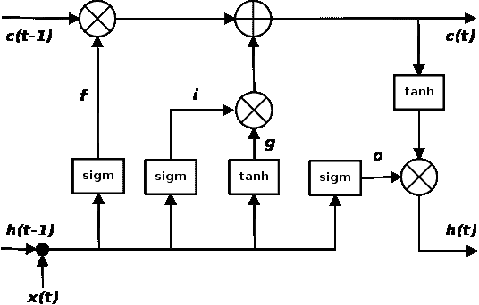

图表看起来很复杂，但我们可以逐个组件地查看它。图表上方的线代表细胞状态 *c*，表示单元的内部记忆。底部的线是隐藏状态，*i*、*f*、*o* 和 *g* 门是 LSTM 绕过梯度消失问题的机制。在训练过程中，LSTM 会学习这些门的参数。

为了更深入理解这些门如何调节 LSTM 的隐藏状态，我们可以考虑以下方程式，展示如何根据上一时间步的隐藏状态 *h[t-1]* 计算当前时间步 *t* 的隐藏状态 *h[t]*：

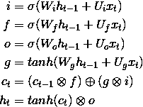

这里 *i*、*f* 和 *o* 分别是输入门、遗忘门和输出门。它们使用相同的方程计算，但有不同的参数矩阵。sigmoid 函数调节这些门的输出，使其在 0 到 1 之间，因此输出向量可以与另一个向量逐元素相乘，从而定义第二个向量可以通过第一个向量的程度。

遗忘门定义了你希望通过多少前一状态 *h[t-1]*。输入门定义了你希望让多少当前输入 *x[t]* 的新计算状态通过，输出门定义了你希望暴露多少内部状态到下一层。内部隐藏状态 *g* 是基于当前输入 *x[t]* 和前一隐藏状态 *h[t-1]* 计算的。注意，*g* 的方程与 SimpleRNN 单元的方程是相同的，但在这种情况下，我们将通过输入门 *i* 的输出来调节输出。

给定 *i*、*f*、*o* 和 *g*，我们现在可以计算当前时间步 *t* 的细胞状态 *c[t]*，其计算方式是 *c[t-1]*（上一时间步的状态）与遗忘门的乘积，再加上 *g*（当前状态）与输入门 *i* 的乘积。因此，这基本上是将以前的记忆与新的输入结合的一种方式——将遗忘门设为 *0* 会忽略旧的记忆，而将输入门设为 *0* 会忽略新计算的状态。

最后，当前时间步 *t* 的隐藏状态 *h[t]* 通过将记忆 *c[t]* 与输出门相乘来计算。

需要注意的一点是，LSTM 是 SimpleRNN 单元的直接替代，唯一的区别是 LSTM 对梯度消失问题具有抵抗力。你可以将网络中的 RNN 单元替换为 LSTM，而无需担心任何副作用。通常情况下，你会看到更好的结果，但训练时间更长。

如果你想了解更多内容，WILDML 博客有一篇关于这些 LSTM 门及其工作原理的详细解释。想要更直观的讲解，可以看看 Christopher Olah 的博客文章：*理解 LSTM* ([`colah.github.io/posts/2015-08-Understanding-LSTMs/`](http://colah.github.io/posts/2015-08-Understanding-LSTMs/))，他一步一步地带你走过这些计算，并在每个步骤中附有插图。

# LSTM 与 Keras—情感分析

Keras 提供了一个 LSTM 层，我们将在这里使用它来构建和训练一个多对一的 RNN。我们的网络输入一个句子（一系列单词），输出一个情感值（正面或负面）。我们的训练集来自 Kaggle 上 UMICH SI650 情感分类比赛的数据集，包含约 7,000 个短句子 ([`inclass.kaggle.com/c/si650winter11`](https://inclass.kaggle.com/c/si650winter11))。每个句子会被标记为 *1* 或 *0*，分别表示正面或负面情感，网络将学习预测这些情感标签。

我们像往常一样从导入库开始：

```py
from keras.layers.core import Activation, Dense, Dropout, SpatialDropout1D
from keras.layers.embeddings import Embedding
from keras.layers.recurrent import LSTM
from keras.models import Sequential
from keras.preprocessing import sequence
from sklearn.model_selection import train_test_split
import collections
import matplotlib.pyplot as plt
import nltk
import numpy as np
import os

```

在开始之前，我们希望对数据进行一些探索性分析。具体来说，我们需要了解语料库中有多少个唯一单词，以及每个句子中有多少个单词：

```py
maxlen = 0
word_freqs = collections.Counter()
num_recs = 0
ftrain = open(os.path.join(DATA_DIR, "umich-sentiment-train.txt"), 'rb')
for line in ftrain:
    label, sentence = line.strip().split("t")
    words = nltk.word_tokenize(sentence.decode("ascii", "ignore").lower())
    if len(words) > maxlen:
        maxlen = len(words)
    for word in words:
        word_freqs[word] += 1
    num_recs += 1
ftrain.close()

```

使用这些信息，我们得到如下关于语料库的估算：

```py
maxlen : 42
len(word_freqs) : 2313

```

使用唯一单词的数量 `len(word_freqs)`，我们将词汇表大小设置为一个固定的数字，并将所有其他单词视为 **词汇表外** (**OOV**) 单词，并用伪词 UNK（表示未知）替换它们。在预测时，这将允许我们将以前未见过的单词处理为 OOV 单词。

句子中的单词数量 (`maxlen`) 允许我们设置固定的序列长度，并将较短的句子进行零填充，将较长的句子截断为该长度。尽管 RNN 能处理可变长度的序列，通常的做法是通过像上述方法一样填充和截断，或者根据序列长度将输入分成不同的批次。我们将在这里使用前者。对于后者，Keras 建议使用大小为 1 的批次（更多信息请参考：[`github.com/fchollet/keras/issues/40`](https://github.com/fchollet/keras/issues/40)）。

根据前面的估算，我们将 `VOCABULARY_SIZE` 设置为 `2002`。这包括我们词汇表中的 2,000 个单词，加上 UNK 伪单词和 PAD 伪单词（用于将句子填充到固定的单词数量），在我们的情况下是由 `MAX_SENTENCE_LENGTH` 给定的 40。

```py
DATA_DIR = "../data"

MAX_FEATURES = 2000
MAX_SENTENCE_LENGTH = 40

```

接下来，我们需要一对查找表。每一行输入到 RNN 的都是一个单词索引序列，索引按训练集中单词的出现频率从高到低排序。两个查找表使我们能够根据单词查找索引，或根据索引查找单词。这也包括 `PAD` 和 `UNK` 伪单词：

```py
vocab_size = min(MAX_FEATURES, len(word_freqs)) + 2
word2index = {x[0]: i+2 for i, x in
enumerate(word_freqs.most_common(MAX_FEATURES))}
word2index["PAD"] = 0
word2index["UNK"] = 1
index2word = {v:k for k, v in word2index.items()}

```

接下来，我们将输入的句子转换为单词索引序列，并将它们填充到 `MAX_SENTENCE_LENGTH` 个单词。由于我们的输出标签是二元的（正面或负面情感），我们不需要处理标签：

```py
X = np.empty((num_recs, ), dtype=list)
y = np.zeros((num_recs, ))
i = 0
ftrain = open(os.path.join(DATA_DIR, "umich-sentiment-train.txt"), 'rb')
for line in ftrain:
    label, sentence = line.strip().split("t")
    words = nltk.word_tokenize(sentence.decode("ascii", "ignore").lower())
    seqs = []
    for word in words:
        if word2index.has_key(word):
            seqs.append(word2index[word])
        else:
            seqs.append(word2index["UNK"])
    X[i] = seqs
    y[i] = int(label)
    i += 1
ftrain.close()
X = sequence.pad_sequences(X, maxlen=MAX_SENTENCE_LENGTH)

```

最后，我们将训练集划分为 80-20 的训练集和测试集：

```py
Xtrain, Xtest, ytrain, ytest = train_test_split(X, y, test_size=0.2, random_state=42)

```

下图展示了我们 RNN 的结构：

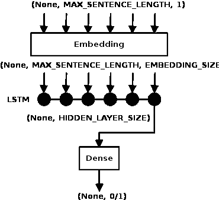

每一行的输入是一个单词索引序列。序列的长度由`MAX_SENTENCE_LENGTH`给定。张量的第一维被设置为`None`，表示批次大小（每次输入到网络中的记录数）在定义时尚不可知；它将在运行时通过`batch_size`参数指定。因此，假设批次大小尚未确定，输入张量的形状是`(None, MAX_SENTENCE_LENGTH, 1)`。这些张量被输入到一个嵌入层，大小为`EMBEDDING_SIZE`，其权重以小的随机值初始化，并在训练期间学习。这个层会将张量转换为形状`(None, MAX_SENTENCE_LENGTH, EMBEDDING_SIZE)`。嵌入层的输出被输入到一个 LSTM 中，序列长度为`MAX_SENTENCE_LENGTH`，输出层大小为`HIDDEN_LAYER_SIZE`，因此 LSTM 的输出是一个形状为`(None, HIDDEN_LAYER_SIZE, MAX_SENTENCE_LENGTH)`的张量。默认情况下，LSTM 将在最后一个序列中输出一个形状为`(None, HIDDEN_LAYER_SIZE)`的张量（`return_sequences=False`）。这个输出被输入到一个输出大小为`1`的全连接层，并使用 Sigmoid 激活函数，因此它将输出`0`（负面评价）或`1`（正面评价）。

我们使用二进制交叉熵损失函数来编译模型，因为它预测的是二进制值，并且使用 Adam 优化器，这是一种良好的通用优化器。请注意，超参数`EMBEDDING_SIZE`、`HIDDEN_LAYER_SIZE`、`BATCH_SIZE`和`NUM_EPOCHS`（如下所示设置为常量）是在多次运行中通过实验调优的：

```py
EMBEDDING_SIZE = 128
HIDDEN_LAYER_SIZE = 64
BATCH_SIZE = 32
NUM_EPOCHS = 10

model = Sequential()
model.add(Embedding(vocab_size, EMBEDDING_SIZE,
input_length=MAX_SENTENCE_LENGTH))
model.add(SpatialDropout1D(Dropout(0.2)))
model.add(LSTM(HIDDEN_LAYER_SIZE, dropout=0.2, recurrent_dropout=0.2))
model.add(Dense(1))
model.add(Activation("sigmoid"))

model.compile(loss="binary_crossentropy", optimizer="adam",
    metrics=["accuracy"])

```

然后，我们将网络训练`10`个周期（`NUM_EPOCHS`），每个批次大小为`32`（`BATCH_SIZE`）。在每个周期，我们使用测试数据验证模型：

```py
history = model.fit(Xtrain, ytrain, batch_size=BATCH_SIZE, epochs=NUM_EPOCHS,
    validation_data=(Xtest, ytest))

```

这一步的输出显示了在多个周期中损失值如何下降，准确率如何上升：

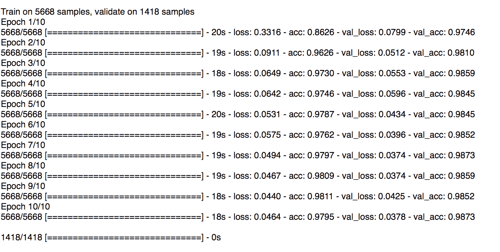

我们还可以使用以下代码绘制损失值和准确率值随时间的变化：

```py
plt.subplot(211)
plt.title("Accuracy")
plt.plot(history.history["acc"], color="g", label="Train")
plt.plot(history.history["val_acc"], color="b", label="Validation")
plt.legend(loc="best")

plt.subplot(212)
plt.title("Loss")
plt.plot(history.history["loss"], color="g", label="Train")
plt.plot(history.history["val_loss"], color="b", label="Validation")
plt.legend(loc="best")

plt.tight_layout()
plt.show()

```

上述示例的输出如下：

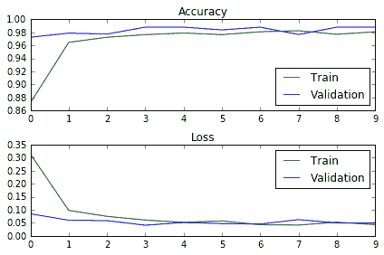

最后，我们对模型进行全测试集评估，并打印分数和准确率。我们还从测试集中随机挑选了几个句子，并打印 RNN 的预测结果、标签和实际句子：

```py
score, acc = model.evaluate(Xtest, ytest, batch_size=BATCH_SIZE)
print("Test score: %.3f, accuracy: %.3f" % (score, acc))

for i in range(5):
    idx = np.random.randint(len(Xtest))
    xtest = Xtest[idx].reshape(1,40)
    ylabel = ytest[idx]
    ypred = model.predict(xtest)[0][0]
    sent = " ".join([index2word[x] for x in xtest[0].tolist() if x != 0])
    print("%.0ft%dt%s" % (ypred, ylabel, sent))

```

从结果中可以看出，我们得到了接近 99%的准确率。模型对这一特定数据集的预测完全与标签匹配，尽管并非所有预测都如此：

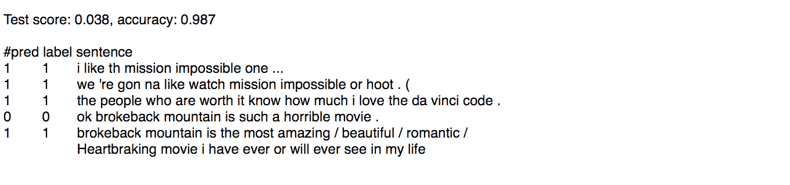

如果你想在本地运行此代码，你需要从 Kaggle 网站获取数据。

本示例的源代码可以在本章的代码下载中找到文件`umich_sentiment_lstm.py`。

# 门控递归单元 — GRU

GRU 是 LSTM 的一种变体，由 K. Cho 提出（更多信息请参考：*使用 RNN 编码器-解码器进行统计机器翻译的短语表示学习*，K. Cho，arXiv:1406.1078，2014）。它保留了 LSTM 对梯度消失问题的抗性，但其内部结构更为简单，因此训练速度更快，因为更新其隐藏状态所需的计算较少。GRU 单元的门控机制如下面的图所示：

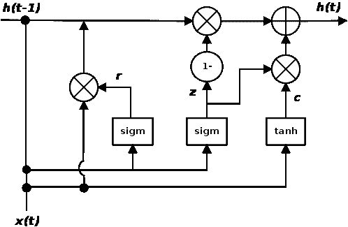

与 LSTM 单元的输入、遗忘和输出门不同，GRU 单元只有两个门，

一个更新门 *z* 和一个重置门 r。更新门定义了保留多少前一段记忆，而重置门定义了如何将新输入与前一段记忆结合。与 LSTM 不同，这里没有与隐藏状态区分开的持久性单元状态。以下方程定义了 GRU 中的门控机制：

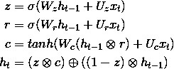

根据几项实证评估（更多信息请参考文章：*递归网络架构的实证探索*，R. Jozefowicz，W. Zaremba，I. Sutskever，JMLR，2015 和 *门控递归神经网络在序列建模中的实证评估*，J. Chung，arXiv:1412.3555，2014），GRU 和 LSTM 的性能相当，并且没有简单的方法来为特定任务推荐其中之一。尽管 GRU 的训练速度更快且需要更少的数据来进行泛化，但在数据充足的情况下，LSTM 更强的表达能力可能会导致更好的结果。像 LSTM 一样，GRU 可以作为 SimpleRNN 单元的替代品。

Keras 提供了 `LSTM` 和 `GRU` 的内置实现，以及我们之前看到的 `SimpleRNN` 类。

# Keras 中的 GRU — 词性标注

Keras 提供了 GRU 的实现，我们将在这里使用它来构建一个进行词性标注（POS tagging）的网络。POS 是在多个句子中以相同方式使用的单词的语法类别。POS 的例子有名词、动词、形容词等等。例如，名词通常用于标识事物，动词通常用于标识它们的动作，形容词则用于描述这些事物的某些属性。词性标注曾经是手动完成的，但现在通常使用统计模型自动完成。近年来，深度学习也被应用于这一问题（更多信息请参考文章：*几乎从零开始的自然语言处理*，R. Collobert，机器学习研究期刊，第 2493-2537 页，2011）。

对于我们的训练数据，我们需要带有词性标签的句子。Penn Treebank（[`catalog.ldc.upenn.edu/ldc99t42`](https://catalog.ldc.upenn.edu/ldc99t42)）就是一个这样的数据集，它是一个人工注释的约 450 万词的美式英语语料库。然而，它是一个非免费的资源。Penn Treebank 的 10%样本可以作为 NLTK 的一部分免费获取（[`www.nltk.org/`](http://www.nltk.org/)），我们将使用它来训练我们的网络。

我们的模型将接收一个句子的单词序列，并输出每个单词的相应 POS 标签。因此，对于输入序列[*The*, *cat*, *sat*, *on*, *the*, *mat*, *.*]，输出的序列将是 POS 符号[*DT*, *NN*, *VB*, *IN*, *DT*, *NN*]。

我们从导入开始：

```py
from keras.layers.core import Activation, Dense, Dropout, RepeatVector, SpatialDropout1D
from keras.layers.embeddings import Embedding
from keras.layers.recurrent import GRU
from keras.layers.wrappers import TimeDistributed
from keras.models import Sequential
from keras.preprocessing import sequence
from keras.utils import np_utils
from sklearn.model_selection import train_test_split
import collections
import nltk
import numpy as np
import os

```

然后我们从 NLTK 下载适合我们下游代码的数据格式。具体来说，这些数据作为 NLTK Treebank 语料库的一部分以解析的形式提供。我们使用以下 Python 代码将这些数据下载到两个并行文件中，一个存储句子中的单词，另一个存储 POS 标签：

```py
DATA_DIR = "../data"

fedata = open(os.path.join(DATA_DIR, "treebank_sents.txt"), "wb")
ffdata = open(os.path.join(DATA_DIR, "treebank_poss.txt"), "wb")

sents = nltk.corpus.treebank.tagged_sents()
for sent in sents:
    words, poss = [], []
    for word, pos in sent:
        if pos == "-NONE-":
            continue
        words.append(word)
        poss.append(pos)
    fedata.write("{:s}n".format(" ".join(words)))
    ffdata.write("{:s}n".format(" ".join(poss)))

fedata.close()
ffdata.close()

```

再次，我们想稍微探索一下数据，找出应该设置的词汇表大小。这次，我们需要考虑两个不同的词汇表，一个是单词的源词汇表，另一个是 POS 标签的目标词汇表。我们需要找出每个词汇表中唯一单词的数量。我们还需要找出训练语料库中每个句子的最大单词数和记录的数量。由于 POS 标注的独特一对一性质，最后两个值对于两个词汇表是相同的：

```py
def parse_sentences(filename):
    word_freqs = collections.Counter()
    num_recs, maxlen = 0, 0
    fin = open(filename, "rb")
    for line in fin:
        words = line.strip().lower().split()
        for word in words:
            word_freqs[word] += 1
        if len(words) > maxlen:
            maxlen = len(words)
        num_recs += 1
    fin.close()
    return word_freqs, maxlen, num_recs

    s_wordfreqs, s_maxlen, s_numrecs = parse_sentences(
    os.path.join(DATA_DIR, "treebank_sents.txt"))
    t_wordfreqs, t_maxlen, t_numrecs = parse_sentences(
    os.path.join(DATA_DIR, "treebank_poss.txt"))
print(len(s_wordfreqs), s_maxlen, s_numrecs, len(t_wordfreqs), t_maxlen, t_numrecs)

```

运行这段代码告诉我们，有 10,947 个独特的单词和 45 个独特的 POS 标签。最大句子长度是 249，而 10%数据集中的句子数量为 3,914。根据这些信息，我们决定仅考虑源词汇表中的前 5,000 个单词。我们的目标词汇表有 45 个独特的 POS 标签，我们希望能够预测所有这些标签，因此我们会将所有这些标签考虑进词汇表。最后，我们将 250 设置为最大序列长度：

```py
MAX_SEQLEN = 250
S_MAX_FEATURES = 5000
T_MAX_FEATURES = 45

```

就像我们的情感分析示例一样，输入的每一行将表示为单词索引的序列。对应的输出将是 POS 标签索引的序列。因此，我们需要构建查找表，以便在单词/POS 标签与其相应的索引之间进行转换。以下是实现该功能的代码。在源端，我们构建了一个词汇索引，并增加了两个额外的槽位来存储`PAD`和`UNK`伪单词。在目标端，我们不会丢弃任何单词，因此不需要`UNK`伪单词：

```py
s_vocabsize = min(len(s_wordfreqs), S_MAX_FEATURES) + 2
s_word2index = {x[0]:i+2 for i, x in
enumerate(s_wordfreqs.most_common(S_MAX_FEATURES))}
s_word2index["PAD"] = 0
s_word2index["UNK"] = 1
s_index2word = {v:k for k, v in s_word2index.items()}

t_vocabsize = len(t_wordfreqs) + 1
t_word2index = {x[0]:i for i, x in
enumerate(t_wordfreqs.most_common(T_MAX_FEATURES))}
t_word2index["PAD"] = 0
t_index2word = {v:k for k, v in t_word2index.items()}

```

下一步是构建我们的数据集，将其输入到我们的网络中。我们将使用这些查找表将输入的句子转换为长度为`MAX_SEQLEN`（`250`）的词 ID 序列。标签需要被构建为一个大小为`T_MAX_FEATURES` + 1（`46`）的独热向量序列，长度也为`MAX_SEQLEN`（`250`）。`build_tensor`函数从两个文件读取数据并将其转换为输入和输出张量。额外的默认参数被传递进来构建输出张量。这会触发对`np_utils.to_categorical()`的调用，将输出序列的 POS 标签 ID 转换为独热向量表示：

```py
def build_tensor(filename, numrecs, word2index, maxlen,
        make_categorical=False, num_classes=0):
    data = np.empty((numrecs, ), dtype=list)
    fin = open(filename, "rb")
    i = 0
    for line in fin:
        wids = []
        for word in line.strip().lower().split():
            if word2index.has_key(word):
                wids.append(word2index[word])
            else:
                wids.append(word2index["UNK"])
        if make_categorical:
            data[i] = np_utils.to_categorical(wids, 
                num_classes=num_classes)
        else:
            data[i] = wids
        i += 1
    fin.close()
    pdata = sequence.pad_sequences(data, maxlen=maxlen)
    return pdata

X = build_tensor(os.path.join(DATA_DIR, "treebank_sents.txt"),
    s_numrecs, s_word2index, MAX_SEQLEN)
Y = build_tensor(os.path.join(DATA_DIR, "treebank_poss.txt"),
    t_numrecs, t_word2index, MAX_SEQLEN, True, t_vocabsize)

```

然后我们可以将数据集分割为 80-20 的训练集和测试集：

```py
Xtrain, Xtest, Ytrain, Ytest = train_test_split(X, Y, test_size=0.2, random_state=42)

```

下图展示了我们网络的示意图。它看起来很复杂，让我们来逐步解析：

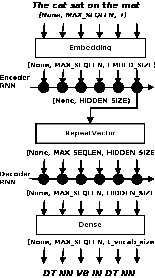

如前所述，假设批处理大小尚未确定，网络的输入是一个形状为`(None, MAX_SEQLEN, 1)`的词 ID 张量。该张量通过一个嵌入层，该层将每个词转换为形状为`(EMBED_SIZE)`的稠密向量，因此该层输出的张量形状为`(None, MAX_SEQLEN, EMBED_SIZE)`。该张量被送入编码器 GRU，其输出大小为`HIDDEN_SIZE`。GRU 被设置为在看到大小为`MAX_SEQLEN`的序列后返回一个单一的上下文向量（`return_sequences=False`），因此 GRU 层输出的张量形状为`(None, HIDDEN_SIZE)`。

然后，这个上下文向量通过 RepeatVector 层复制成形状为`(None, MAX_SEQLEN, HIDDEN_SIZE)`的张量，并送入解码器 GRU 层。接着该张量进入一个稠密层，输出形状为`(None, MAX_SEQLEN, t_vocab_size)`。稠密层的激活函数是 softmax。该张量每一列的 argmax 值就是该位置单词预测的 POS 标签的索引。

模型定义如下所示：`EMBED_SIZE`、`HIDDEN_SIZE`、`BATCH_SIZE`和`NUM_EPOCHS`是超参数，这些值是在尝试多个不同值后确定的。由于我们有多个类别的标签，模型使用`categorical_crossentropy`作为损失函数，并且使用流行的`adam`优化器：

```py
EMBED_SIZE = 128
HIDDEN_SIZE = 64
BATCH_SIZE = 32
NUM_EPOCHS = 1

model = Sequential()
model.add(Embedding(s_vocabsize, EMBED_SIZE,
input_length=MAX_SEQLEN))
model.add(SpatialDropout1D(Dropout(0.2)))
model.add(GRU(HIDDEN_SIZE, dropout=0.2, recurrent_dropout=0.2))
model.add(RepeatVector(MAX_SEQLEN))
model.add(GRU(HIDDEN_SIZE, return_sequences=True))
model.add(TimeDistributed(Dense(t_vocabsize)))
model.add(Activation("softmax"))

model.compile(loss="categorical_crossentropy", optimizer="adam",
    metrics=["accuracy"])

```

我们训练这个模型进行一个周期。该模型非常复杂，包含许多参数，并且在第一次训练后开始出现过拟合。在接下来的训练周期中，如果将相同的数据输入模型多次，模型开始对训练数据过拟合，并且在验证数据上的表现变差：

```py
model.fit(Xtrain, Ytrain, batch_size=BATCH_SIZE, epochs=NUM_EPOCHS,
    validation_data=[Xtest, Ytest])

score, acc = model.evaluate(Xtest, Ytest, batch_size=BATCH_SIZE)
print("Test score: %.3f, accuracy: %.3f" % (score, acc))

```

训练和评估的输出如下所示。如你所见，模型在第一次训练后表现得相当不错：

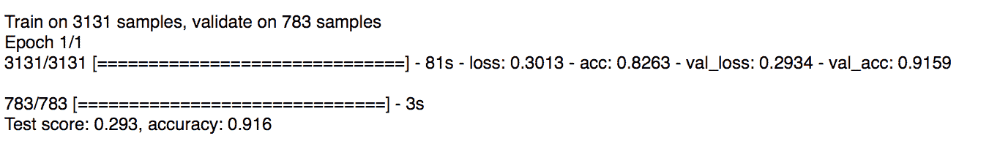

与实际的 RNN 类似，Keras 中的三种递归类（`SimpleRNN`、`LSTM` 和 `GRU`）是可以互换的。为了演示，我们只需将之前程序中的所有 `GRU` 替换为 `LSTM`，然后重新运行程序。模型定义和导入语句是唯一改变的部分：

```py
from keras.layers.recurrent import GRU

model = Sequential()
model.add(Embedding(s_vocabsize, EMBED_SIZE,
input_length=MAX_SEQLEN))
model.add(SpatialDropout1D(Dropout(0.2)))
model.add(GRU(HIDDEN_SIZE, dropout=0.2, recurrent_dropout=0.2))
model.add(RepeatVector(MAX_SEQLEN))
model.add(GRU(HIDDEN_SIZE, return_sequences=True))
model.add(TimeDistributed(Dense(t_vocabsize)))
model.add(Activation("softmax"))

```

从输出结果可以看出，基于 GRU 的网络结果与我们之前的基于 LSTM 的网络相当接近。

序列到序列模型是一类非常强大的模型。其最典型的应用是机器翻译，但还有许多其他应用，比如之前的例子。实际上，许多 NLP 任务在更高的层次上，诸如命名实体识别（更多信息请参考文章：*命名实体识别与长短期记忆*，J. Hammerton 著，发表于《第七届自然语言学习会议》，HLT-NAACL，计算语言学会，2003 年）和句子解析（更多信息请参考文章：*语法作为外语*，O. Vinyals 著，发表于《神经信息处理系统进展》，2015 年），以及更复杂的网络，如图像描述生成（更多信息请参考文章：*生成图像描述的深度视觉-语义对齐*，A. Karpathy 和 F. Li 著，发表于《IEEE 计算机视觉与模式识别会议论文集》，2015 年），都可以视为序列到序列组合模型的例子。

本示例的完整代码可以在本章节的代码下载文件 `pos_tagging_gru.py` 中找到。

# 双向 RNN

在给定的时间步 *t*，RNN 的输出依赖于所有之前时间步的输出。然而，输出也完全可能依赖于未来的输出。这对于 NLP 等应用尤其重要，在这些应用中，我们尝试预测的单词或短语的属性可能依赖于整个封闭句子的上下文，而不仅仅是其前面的单词。双向 RNN 还帮助网络架构对序列的开头和结尾给予同等的重视，并增加了可用于训练的数据量。

双向 RNN 是两个 RNN 堆叠在一起，分别以相反的方向读取输入。因此，在我们的例子中，一个 RNN 将从左到右读取单词，另一个 RNN 将从右到左读取单词。每个时间步的输出将基于两个 RNN 的隐藏状态。

Keras 通过双向包装层提供对双向 RNN 的支持。例如，在我们的词性标注示例中，我们只需使用这个双向包装层将 LSTM 转换为双向 RNN，就像以下的模型定义代码所示：

```py
from keras.layers.wrappers import Bidirectional

model = Sequential()
model.add(Embedding(s_vocabsize, EMBED_SIZE,
input_length=MAX_SEQLEN))
model.add(SpatialDropout1D(Dropout(0.2)))
model.add(Bidirectional(LSTM(HIDDEN_SIZE, dropout=0.2, recurrent_dropout=0.2)))
model.add(RepeatVector(MAX_SEQLEN))
model.add(Bidirectional(LSTM(HIDDEN_SIZE, return_sequences=True)))
model.add(TimeDistributed(Dense(t_vocabsize)))
model.add(Activation("softmax"))

```

这样，我们得到了与下面展示的单向 LSTM 示例相媲美的性能：

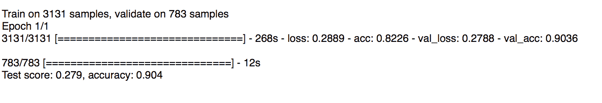

# 有状态的 RNN

RNN（循环神经网络）可以是有状态的，这意味着它们可以在训练过程中跨批次保持状态。也就是说，对于一批训练数据计算出的隐藏状态将作为下一批训练数据的初始隐藏状态。然而，这需要显式设置，因为 Keras 的 RNN 默认是无状态的，并且会在每个批次之后重置状态。将 RNN 设置为有状态意味着它可以在其训练序列中建立状态，甚至在进行预测时保持该状态。

使用有状态 RNN 的好处是网络大小较小和/或训练时间较短。缺点是我们现在需要负责使用反映数据周期性的批次大小来训练网络，并在每个周期后重置状态。此外，在训练网络时数据不应被打乱，因为数据呈现的顺序对于有状态网络是相关的。

# 使用 Keras 的有状态 LSTM — 预测电力消耗

在这个示例中，我们使用有状态和无状态 LSTM 网络预测某个消费者的电力消耗并比较它们的表现。如你所记得，Keras 中的 RNN 默认是无状态的。在有状态模型中，处理一批输入后的内部状态将作为下一批的初始状态重新使用。换句话说，从一批中的第*i*个元素计算出的状态将作为下一批中第*i*个元素的初始状态。

我们将使用的数据集是来自 UCI 机器学习库的电力负荷图数据集（[`archive.ics.uci.edu/ml/datasets/ElectricityLoadDiagrams20112014`](https://archive.ics.uci.edu/ml/datasets/ElectricityLoadDiagrams20112014)），其中包含 370 个客户的消费信息，数据以 15 分钟为间隔，时间跨度为 2011 年至 2014 年的四年周期。我们随机选择了第 250 号客户作为示例。

需要记住的一点是，大多数问题都可以使用无状态 RNN 来解决，因此如果你使用有状态 RNN，请确保你确实需要它。通常，当数据具有周期性成分时，你需要使用它。如果你稍微思考一下，你会意识到电力消耗是有周期性的。白天的消耗往往高于夜晚。让我们提取第 250 号客户的消费数据，并绘制前 10 天的数据。最后，我们还将其保存为二进制的 NumPy 文件，供下一步使用：

```py
import numpy as np
import matplotlib.pyplot as plt
import os
import re

DATA_DIR = "../data"

fld = open(os.path.join(DATA_DIR, "LD2011_2014.txt"), "rb")
data = []
cid = 250
for line in fld:
    if line.startswith(""";"):
        continue
    cols = [float(re.sub(",", ".", x)) for x in 
                line.strip().split(";")[1:]]
    data.append(cols[cid])
fld.close()

NUM_ENTRIES = 1000
plt.plot(range(NUM_ENTRIES), data[0:NUM_ENTRIES])
plt.ylabel("electricity consumption")
plt.xlabel("time (1pt = 15 mins)")
plt.show()

np.save(os.path.join(DATA_DIR, "LD_250.npy"), np.array(data))

```

前面的示例输出如下：

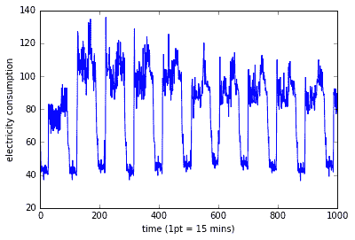

如你所见，数据明显存在日周期性趋势。因此，这个问题非常适合使用有状态模型。此外，根据我们的观察，`BATCH_SIZE`设置为`96`（24 小时内每 15 分钟一次的读取数）似乎合适。

我们将同时展示无状态版本和有状态版本的模型代码。两者的大部分代码是相同的，因此我们将同时查看这两个版本。我将在代码中出现差异时指出。

首先，像往常一样，我们导入必要的库和类：

```py
from keras.layers.core import Dense
from keras.layers.recurrent import LSTM
from keras.models import Sequential
from sklearn.preprocessing import MinMaxScaler
import numpy as np
import math
import os

```

接下来，我们将客户 250 的数据从保存的 NumPy 二进制文件中加载到一个大小为`140256`的长数组中，并将其重新缩放到范围*(0, 1)*。最后，我们将输入调整为网络所需的三维形状：

```py
DATA_DIR = "../data"

data = np.load(os.path.join(DATA_DIR, "LD_250.npy"))
data = data.reshape(-1, 1)
scaler = MinMaxScaler(feature_range=(0, 1), copy=False)
data = scaler.fit_transform(data)

```

在每个批次中，模型将处理一组 15 分钟的读数，并预测下一个读数。输入序列的长度由代码中的`NUM_TIMESTEPS`变量给出。根据一些实验，我们得到了`NUM_TIMESTEPS`的值为`20`，也就是说，每个输入行将是一个长度为`20`的序列，而输出的长度为`1`。下一步将输入数组重排列成`X`和`Y`张量，其形状分别为`(None, 4)`和`(None, 1)`。最后，我们将输入张量`X`调整为网络所需的三维形状：

```py
X = np.zeros((data.shape[0], NUM_TIMESTEPS))
Y = np.zeros((data.shape[0], 1))
for i in range(len(data) - NUM_TIMESTEPS - 1):
    X[i] = data[i:i + NUM_TIMESTEPS].T
    Y[i] = data[i + NUM_TIMESTEPS + 1]

# reshape X to three dimensions (samples, timesteps, features)
X = np.expand_dims(X, axis=2)

```

然后，我们将`X`和`Y`张量分割成 70-30 的训练测试集。由于我们处理的是时间序列数据，我们只需选择一个分割点并将数据切成两部分，而不是使用`train_test_split`函数，后者会打乱数据：

```py
sp = int(0.7 * len(data))
Xtrain, Xtest, Ytrain, Ytest = X[0:sp], X[sp:], Y[0:sp], Y[sp:]
print(Xtrain.shape, Xtest.shape, Ytrain.shape, Ytest.shape)

```

首先我们定义我们的无状态模型。我们还设置了`BATCH_SIZE`和`NUM_TIMESTEPS`的值，正如我们之前讨论的那样。我们的 LSTM 输出大小由`HIDDEN_SIZE`给出，这是另一个通常通过实验得出的超参数。在这里，我们将其设置为`10`，因为我们的目标是比较两个网络：

```py
NUM_TIMESTEPS = 20
HIDDEN_SIZE = 10
BATCH_SIZE = 96 # 24 hours (15 min intervals)

# stateless
model = Sequential()
model.add(LSTM(HIDDEN_SIZE, input_shape=(NUM_TIMESTEPS, 1), 
    return_sequences=False))
model.add(Dense(1))

```

对应的有状态模型定义非常相似，如下所示。在 LSTM 构造函数中，你需要设置`stateful=True`，并且不再使用`input_shape`来确定批次大小，而是需要显式地使用`batch_input_shape`来设置批次大小。你还需要确保训练和测试数据的大小是批次大小的整数倍。我们稍后会在查看训练代码时看到如何做到这一点：

```py
# stateful
model = Sequential()
model.add(LSTM(HIDDEN_SIZE, stateful=True,
    batch_input_shape=(BATCH_SIZE, NUM_TIMESTEPS, 1), 
    return_sequences=False))
model.add(Dense(1))

```

接下来我们编译模型，对于无状态和有状态的 RNN 模型是相同的。请注意，这里的评估指标是均方误差，而不是我们通常使用的准确率。因为这是一个回归问题；我们关注的是预测与标签之间的偏差，而不是预测是否与标签匹配。你可以在 Keras 的评估指标页面找到 Keras 内置指标的完整列表：

```py
model.compile(loss="mean_squared_error", optimizer="adam",
    metrics=["mean_squared_error"])

```

要训练无状态模型，我们可以使用我们现在可能已经非常熟悉的一行代码：

```py
BATCH_SIZE = 96 # 24 hours (15 min intervals)

# stateless
model.fit(Xtrain, Ytrain, epochs=NUM_EPOCHS, batch_size=BATCH_SIZE,
    validation_data=(Xtest, Ytest),
    shuffle=False)

```

对应的有状态模型的代码如下所示。这里有三点需要注意：

首先，你应该选择一个反映数据周期性的批次大小。这是因为有状态的 RNN 会将每个批次的状态与下一个批次对齐，所以选择正确的批次大小可以让网络学习得更快。

一旦设置了批次大小，训练和测试集的大小需要是批次大小的精确倍数。我们通过截断训练和测试集中的最后几条记录来确保这一点：

第二点是你需要手动拟合模型，即在需要的轮数内对模型进行训练。每次迭代训练模型一个轮次，并且状态在多个批次间保持。每个轮次结束后，模型的状态需要手动重置。

第三点是数据应该按顺序输入。默认情况下，Keras 会在每个批次内打乱行，这会破坏我们对状态 RNN 有效学习所需的对齐。通过在调用 `model.fit()` 时设置 `shuffle=False` 可以避免这种情况：

```py
BATCH_SIZE = 96 # 24 hours (15 min intervals)

# stateful
# need to make training and test data to multiple of BATCH_SIZE
train_size = (Xtrain.shape[0] // BATCH_SIZE) * BATCH_SIZE
test_size = (Xtest.shape[0] // BATCH_SIZE) * BATCH_SIZE
Xtrain, Ytrain = Xtrain[0:train_size], Ytrain[0:train_size]
Xtest, Ytest = Xtest[0:test_size], Ytest[0:test_size]
print(Xtrain.shape, Xtest.shape, Ytrain.shape, Ytest.shape)
for i in range(NUM_EPOCHS):
    print("Epoch {:d}/{:d}".format(i+1, NUM_EPOCHS))
    model.fit(Xtrain, Ytrain, batch_size=BATCH_SIZE, epochs=1,
        validation_data=(Xtest, Ytest),
        shuffle=False)
    model.reset_states()

```

最后，我们对模型进行评估并打印出得分：

```py
score, _ = model.evaluate(Xtest, Ytest, batch_size=BATCH_SIZE)
rmse = math.sqrt(score)
print("MSE: {:.3f}, RMSE: {:.3f}".format(score, rmse))

```

对于无状态模型，运行五轮后的输出如下所示：

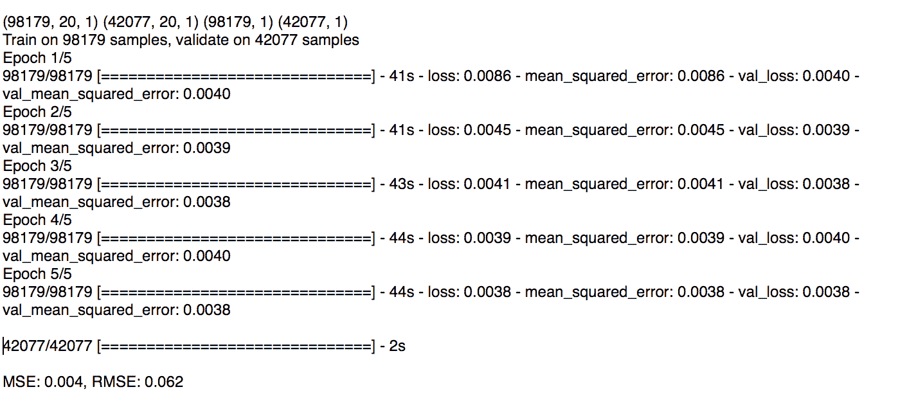

对于带状态模型，运行五次，每次一个轮次的相应输出如下所示。注意第二行中截断操作的结果：

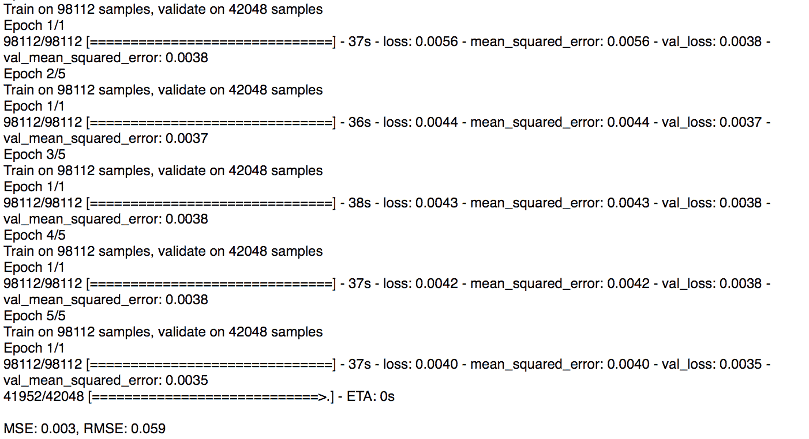

正如你所看到的，带状态模型产生的结果略好于无状态模型。从绝对值来看，由于我们将数据缩放到 *(0, 1)* 范围内，这意味着无状态模型的错误率约为 6.2%，而带状态模型的错误率为 5.9%；换句话说，它们的准确率分别约为 93.8% 和 94.1%。因此，从相对角度来看，我们的带状态模型比无状态模型略微更优。

本示例的源代码包括 `econs_data.py` 文件（解析数据集）和 `econs_stateful.py` 文件（定义和训练无状态及带状态模型），可以从本章的代码下载中获取。

# 其他 RNN 变体

我们将通过查看一些 RNN 单元的变体来结束本章。RNN 是一个活跃的研究领域，许多研究者为特定目的提出了不同的变体。

一种流行的 LSTM 变体是添加 *窥视连接*，意味着门层可以查看单元状态。这是 Gers 和 Schmidhuber 在 2002 年提出的（有关更多信息，请参阅文章：*Learning Precise Timing with LSTM Recurrent Networks*，作者 F. A. Gers、N. N. Schraudolph 和 J. Schmidhuber，《机器学习研究杂志》，第 115-143 页）。

另一种 LSTM 变体，最终导致了 GRU 的出现，是使用耦合的遗忘门和输出门。关于遗忘哪些信息以及获取哪些信息的决策是一起做出的，而新信息则替代了被遗忘的信息。

Keras 仅提供了三种基本变体，即 SimpleRNN、LSTM 和 GRU 层。然而，这不一定是问题。Gref 进行了一项实验性调查（有关更多信息，请参阅文章：*LSTM: A Search Space Odyssey*，作者 K. Greff，arXiv:1503.04069，2015），并得出结论，任何变体都没有显著改善标准 LSTM 架构。因此，Keras 提供的组件通常足以解决大多数问题。

如果你确实需要构建自己的层，Keras 允许你构建自定义层。我们将在下一章中学习如何构建自定义层。还有一个开源框架叫做 recurrent shop ([`github.com/datalogai/recurrentshop`](https://github.com/datalogai/recurrentshop))，它允许你使用 Keras 构建复杂的循环神经网络。

# 总结

在本章中，我们学习了循环神经网络的基本架构，以及它们如何在序列数据上比传统神经网络表现得更好。我们看到了如何使用 RNN 学习作者的写作风格，并生成基于所学模型的文本。我们还看到了如何将这个示例扩展到预测股价或其他时间序列、从嘈杂的音频中识别语音等任务，还可以生成由学习模型作曲的音乐。

我们研究了不同的 RNN 单元组合方式，这些拓扑结构可以用于建模和解决特定问题，如情感分析、机器翻译、图像标题生成、分类等。

接着，我们研究了 SimpleRNN 架构的最大缺点之一——梯度消失和梯度爆炸问题。我们看到了如何通过 LSTM（和 GRU）架构来处理梯度消失问题。我们还详细了解了 LSTM 和 GRU 架构。我们还看到了两个示例，分别使用基于 LSTM 的模型预测情感，以及使用基于 GRU 的序列到序列架构预测词性标记（POS）。

接着，我们学习了状态感知型 RNN（stateful RNN），以及如何在 Keras 中使用它们。我们还看到了一个使用状态感知型 RNN 来预测大气中二氧化碳水平的示例。

最后，我们学习了一些在 Keras 中不可用的 RNN 变体，并简要探讨了如何构建它们。

在下一章，我们将探讨一些不完全符合我们目前所学基本模型的模型。我们还将学习如何使用 Keras 的函数式 API 将这些基本模型组合成更大更复杂的模型，并查看一些定制 Keras 以满足我们需求的示例。
