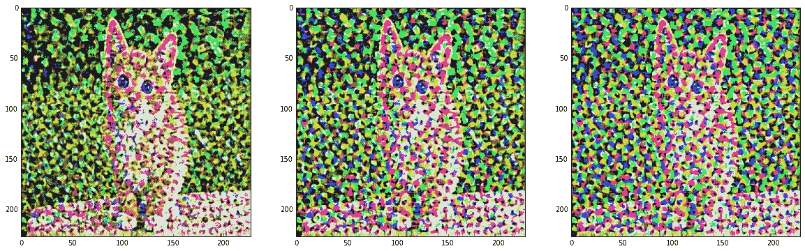

# 第七章：其他深度学习模型

到目前为止，大部分讨论都集中在不同的分类模型上。这些模型使用对象特征和标签进行训练，以预测以前未见过的对象的标签。这些模型的架构也相对简单，迄今为止我们看到的所有模型都是通过 Keras 的顺序 API 构建的线性管道。

在本章中，我们将重点讨论更复杂的架构，其中管道不一定是线性的。Keras 提供了功能性 API 来处理这些类型的架构。在本章中，我们将学习如何使用功能性 API 定义我们的网络。需要注意的是，功能性 API 也可以用于构建线性架构。

分类网络的最简单扩展是回归网络。在监督学习的两大子类别中，分别是分类和回归。与预测一个类别不同，回归网络现在预测一个连续值。我们在讨论无状态与有状态 RNN 时，看到过回归网络的一个例子。许多回归问题可以通过分类模型轻松解决。我们将在本章中看到一个回归网络的例子，用于预测大气中的苯。

还有一类模型处理从无标签数据中学习数据结构，这些被称为**无监督**（或更准确地说是自监督）模型。它们类似于分类模型，但标签是隐含在数据中的。我们已经看过这类模型的例子，例如，CBOW 和 skip-gram 的 word2vec 模型就是自监督模型。自编码器是另一种这类模型的例子。在本章中，我们将学习自编码器，并描述一个构建句子紧凑向量表示的例子。

接下来，我们将看看如何将迄今为止看到的网络组合成更大的计算图。这些图通常是为了实现一些顺序模型无法单独完成的自定义目标而构建的，可能有多个输入和输出以及与外部组件的连接。我们将看到一个将网络组合起来用于问答任务的例子。

然后，我们将绕道一看 Keras 后端 API，并学习如何使用这个 API 构建自定义组件来扩展 Keras 的功能。

回到无标签数据的模型，另一类不需要标签的模型是生成模型。这些模型使用一组现有对象进行训练，尝试学习这些对象的分布。一旦学到了分布，我们就可以从这个分布中抽取样本，这些样本看起来像原始的训练数据。我们已经看过一个例子，在上一章中，我们训练了一个字符 RNN 模型来生成类似《爱丽丝梦游仙境》文本的内容。这个想法已经涵盖，所以我们这里不再讨论生成模型的这个部分。不过，我们将探讨如何利用已经训练好的网络学习数据分布的思路，使用在 ImageNet 数据上预训练的 VGG-16 网络来创建有趣的视觉效果。

总结一下，我们将在本章学习以下主题：

+   Keras 功能性 API

+   回归网络

+   用于无监督学习的自编码器

+   使用功能性 API 组合复杂的网络

+   定制 Keras

+   生成网络

我们开始吧。

# Keras 功能性 API

Keras 的功能性 API 将每一层定义为一个函数，并提供操作符将这些函数组合成一个更大的计算图。一个函数是一种具有单一输入和单一输出的变换。例如，函数 *y = f(x)* 定义了一个输入为 *x*，输出为 *y* 的函数 *f*。让我们考虑 Keras 中的简单顺序模型（更多信息请参见：[`keras.io/getting-started/sequential-model-guide/`](https://keras.io/getting-started/sequential-model-guide/)）：

```py
from keras.models import Sequential
from keras.layers.core import dense, Activation

model = Sequential([
   dense(32, input_dim=784),
   Activation("sigmoid"),
   dense(10),
   Activation("softmax"),
])

model.compile(loss="categorical_crossentropy", optimizer="adam")

```

如你所见，顺序模型将网络表示为一个线性管道，或者说是一个层的列表。我们也可以将网络表示为以下嵌套函数的组合。这里 *x* 是形状为 *(None, 784)* 的输入张量，*y* 是形状为 *(None, 10)* 的输出张量。这里的 *None* 表示尚未确定的批量大小：


其中：


网络可以通过以下方式使用 Keras 功能性 API 重新定义。注意，`predictions` 变量是我们之前以方程式形式定义的相同函数的组合：

```py
from keras.layers import Input
from keras.layers.core import dense
from keras.models import Model
from keras.layers.core import Activation

inputs = Input(shape=(784,))

x = dense(32)(inputs)
x = Activation("sigmoid")(x)
x = dense(10)(x)
predictions = Activation("softmax")(x)

model = Model(inputs=inputs, outputs=predictions)

model.compile(loss="categorical_crossentropy", optimizer="adam")

```

由于模型是层的组合，而层本身也是函数，所以模型本身也是一个函数。因此，你可以通过对适当形状的输入张量调用模型，将训练好的模型视为另一个层。因此，如果你构建了一个用于图像分类的有用模型，你可以通过 Keras 的 `TimeDistributed` 包装器轻松地将其扩展为处理一系列图像：

```py
sequence_predictions = TimeDistributed(model)(input_sequences)

```

功能性 API 可以用来定义任何可以通过顺序 API 定义的网络。此外，以下类型的网络只能使用功能性 API 定义：

+   拥有多个输入和输出的模型

+   由多个子模型组成的模型

+   使用共享层的模型

拥有多个输入和输出的模型是通过分别组合输入和输出来定义的，如前面的示例所示，然后将输入函数数组和输出函数数组传递到`Model`构造函数的输入和输出参数中：

```py
model = Model(inputs=[input1, input2], outputs=[output1, output2])

```

拥有多个输入和输出的模型通常也由多个子网络组成，这些子网络的计算结果最终会合并成最终结果。合并函数提供了多种合并中间结果的方法，如向量加法、点积和拼接。稍后我们将在本章的问答示例中看到合并的示例。

功能式 API 的另一个好用场景是使用共享层的模型。共享层只需定义一次，并在每个需要共享其权重的管道中引用。

本章我们将几乎专门使用功能式 API，因此你将看到许多使用示例。Keras 官网上有更多关于功能式 API 的使用示例。

# 回归网络

监督学习的两大主要技术是分类和回归。在这两种情况下，模型都会用数据进行训练，以预测已知标签。在分类的情况下，这些标签是离散值，如文本的类别或图像的种类；而在回归的情况下，这些标签是连续值，如股票价格或人的智商（IQ）。

我们看到的大多数示例展示了深度学习模型用于执行分类任务。在本节中，我们将探讨如何使用此类模型进行回归。

请记住，分类模型在最后有一个带有非线性激活的密集层，其输出维度对应于模型可以预测的类别数。因此，ImageNet 图像分类模型在最后有一个密集层（1,000），对应于它可以预测的 1,000 个 ImageNet 类别。类似地，情感分析模型在最后有一个密集层，对应于正面或负面的情感。

回归模型在最后也有一个密集层，但只有一个输出，即输出维度为一，并且没有非线性激活。因此，密集层仅返回来自前一层的激活值之和。此外，通常使用的损失函数是**均方误差**（**MSE**），但也可以使用其他目标函数（详见 Keras 目标页面：[`keras.io/losses/`](https://keras.io/losses/)）。

# Keras 回归示例——预测空气中的苯浓度

在这个例子中，我们将预测大气中苯的浓度，给定一些其他变量，例如一氧化碳、氮氧化物等的浓度，以及温度和相对湿度。我们将使用的数据集来自 UCI 机器学习库的空气质量数据集（[`archive.ics.uci.edu/ml/datasets/Air+Quality`](https://archive.ics.uci.edu/ml/datasets/Air+Quality)）。该数据集包含 9,358 条来自五个金属氧化物化学传感器的小时平均读数。传感器阵列位于意大利的一个城市，记录时间为 2004 年 3 月至 2005 年 2 月。

和往常一样，首先我们导入所有必要的库：

```py
from keras.layers import Input
from keras.layers.core import dense
from keras.models import Model
from sklearn.preprocessing import StandardScaler
import matplotlib.pyplot as plt
import numpy as np
import os
import pandas as pd

```

数据集以 CSV 文件形式提供。我们将输入数据加载到 Pandas（更多信息参见：[`pandas.pydata.org/`](http://pandas.pydata.org/)）数据框中。Pandas 是一个流行的数据分析库，围绕数据框构建，这是一个借鉴自 R 语言的概念。我们在这里使用 Pandas 加载数据集有两个原因。首先，数据集中包含一些由于某种原因无法记录的空字段。其次，数据集使用逗号作为小数点分隔符，这在一些欧洲国家中是常见的习惯。Pandas 内建支持处理这两种情况，并且提供了一些其他便利功能，正如我们接下来会看到的：

```py
DATA_DIR = "../data"
AIRQUALITY_FILE = os.path.join(DATA_DIR, "AirQualityUCI.csv")

aqdf = pd.read_csv(AIRQUALITY_FILE, sep=";", decimal=",", header=0)

# remove first and last 2 cols 
del aqdf["Date"]
del aqdf["Time"]
del aqdf["Unnamed: 15"]
del aqdf["Unnamed: 16"]

# fill NaNs in each column with the mean value
aqdf = aqdf.fillna(aqdf.mean())

Xorig = aqdf.as_matrix()

```

上述示例删除了前两列，其中包含观察日期和时间，及后两列，这些列似乎是无关的。接下来，我们用该列的平均值替换空字段。最后，我们将数据框导出为矩阵，以便后续使用。

需要注意的是，数据的每一列有不同的尺度，因为它们测量的是不同的量。例如，氧化锡的浓度在 1,000 范围内，而非甲烷烃的浓度在 100 范围内。在许多情况下，我们的特征是同质的，因此不需要缩放，但在像这样的情况下，通常建议对数据进行缩放。这里的缩放过程包括从每列中减去该列的均值，并除以其标准差：


为此，我们使用`scikit-learn`库提供的`StandardScaler`类，如下所示。我们存储均值和标准差，因为我们稍后在报告结果或预测新数据时会用到它们。我们的目标变量是输入数据集中的第四列，因此我们将缩放后的数据分为输入变量`X`和目标变量`y`：

```py
scaler = StandardScaler()
Xscaled = scaler.fit_transform(Xorig)
# store these off for predictions with unseen data
Xmeans = scaler.mean_
Xstds = scaler.scale_

y = Xscaled[:, 3]
X = np.delete(Xscaled, 3, axis=1)

```

然后，我们将数据分为前 70%用于训练，后 30%用于测试。这为我们提供了 6,549 条训练记录和 2,808 条测试记录：

```py
train_size = int(0.7 * X.shape[0])
Xtrain, Xtest, ytrain, ytest = X[0:train_size], X[train_size:], 
    y[0:train_size], y[train_size:]

```

接下来，我们定义我们的网络。这是一个简单的两层密集网络，输入为 12 个特征的向量，输出为缩放后的预测值。隐藏层密集层有八个神经元。我们使用一种特定的初始化方案叫做*glorot uniform*来初始化两个密集层的权重矩阵。有关初始化方案的完整列表，请参见 Keras 初始化文档：[`keras.io/initializers/`](https://keras.io/initializers/)。所使用的损失函数是均方误差（`mse`），优化器是`adam`：

```py
readings = Input(shape=(12,))
x = dense(8, activation="relu", kernel_initializer="glorot_uniform")(readings)
benzene = dense(1, kernel_initializer="glorot_uniform")(x)

model = Model(inputs=[readings], outputs=[benzene])
model.compile(loss="mse", optimizer="adam")

```

我们为此模型训练了 20 个周期，批次大小为 10：

```py
NUM_EPOCHS = 20
BATCH_SIZE = 10

history = model.fit(Xtrain, ytrain, batch_size=BATCH_SIZE, epochs=NUM_EPOCHS,
    validation_split=0.2)

```

这导致一个模型，其训练集的均方误差为 0.0003（大约 2%的 RMSE），验证集为 0.0016（大约 4%的 RMSE），如下训练步骤日志所示：


我们还查看了一些原本记录的苯浓度值，并将它们与我们模型预测的值进行比较。实际值和预测值都从它们的缩放*z*-值重缩放为实际值：

```py
ytest_ = model.predict(Xtest).flatten()
for i in range(10):
    label = (ytest[i] * Xstds[3]) + Xmeans[3]
    prediction = (ytest_[i] * Xstds[3]) + Xmeans[3]
    print("Benzene Conc. expected: {:.3f}, predicted: {:.3f}".format(label, prediction))

```

并排比较显示，预测值与实际值非常接近：

```py
Benzene Conc. expected: 4.600, predicted: 5.254
Benzene Conc. expected: 5.500, predicted: 4.932
Benzene Conc. expected: 6.500, predicted: 5.664
Benzene Conc. expected: 10.300, predicted: 8.482
Benzene Conc. expected: 8.900, predicted: 6.705
Benzene Conc. expected: 14.000, predicted: 12.928
Benzene Conc. expected: 9.200, predicted: 7.128
Benzene Conc. expected: 8.200, predicted: 5.983
Benzene Conc. expected: 7.200, predicted: 6.256
Benzene Conc. expected: 5.500, predicted: 5.184

```

最后，我们将实际值与我们整个测试集的预测值进行比较。再次看到，网络预测的值非常接近预期值：

```py
plt.plot(np.arange(ytest.shape[0]), (ytest * Xstds[3]) / Xmeans[3], 
    color="b", label="actual")
plt.plot(np.arange(ytest_.shape[0]), (ytest_ * Xstds[3]) / Xmeans[3], 
    color="r", alpha=0.5, label="predicted")
plt.xlabel("time")
plt.ylabel("C6H6 concentrations")
plt.legend(loc="best")
plt.show()

```

前面示例的输出如下：


# 无监督学习 — 自编码器

自编码器是一类神经网络，尝试通过反向传播将输入重建为目标。自编码器由两部分组成：编码器和解码器。编码器读取输入并将其压缩为紧凑的表示，解码器则读取紧凑的表示并从中重建输入。换句话说，自编码器通过最小化重建误差来尝试学习恒等函数。

尽管恒等函数看起来不像是一个很有趣的函数来学习，但实现的方式使其变得有趣。自编码器中的隐藏单元数量通常小于输入（和输出）单元的数量。这迫使编码器学习输入的压缩表示，而解码器则从中重建。如果输入数据中存在特征之间的相关性，那么自编码器将发现这些相关性，并最终学习一个类似于使用**主成分分析**（**PCA**）得到的低维表示。

一旦自编码器训练完成，我们通常会丢弃解码器组件，只使用编码器组件生成输入的紧凑表示。或者，我们可以将编码器作为特征检测器，生成输入的紧凑且语义丰富的表示，并通过将软最大分类器附加到隐藏层来构建分类器。

自编码器的编码器和解码器组件可以使用密集、卷积或递归网络来实现，具体取决于所建模的数据类型。例如，密集网络可能是构建**协同过滤**（**CF**）模型的自编码器的好选择（有关更多信息，请参阅文章：*AutoRec: Autoencoders Meet Collaborative Filtering*，S. Sedhain，2015 年国际万维网大会论文集，ACM 和 *Wide & Deep Learning for Recommender Systems*，H. Cheng，2016 年第一届推荐系统深度学习研讨会论文集，ACM），在该模型中，我们根据实际稀疏的用户评分学习压缩的用户偏好模型。类似地，卷积神经网络可能适用于文章中涵盖的用例：*See: Using Deep Learning to Remove Eyeglasses from Faces*，M. Runfeldt，递归网络是构建基于文本数据的自编码器的好选择，如深度患者（有关更多信息，请参阅文章：*Deep Patient: An Unsupervised Representation to Predict the Future of Patients from the Electronic Health Records*，R. Miotto，Scientific Reports 6，2016）和跳跃思想向量（有关更多信息，请参阅文章：*Skip-Thought Vectors*，R. Kiros，神经信息处理系统进展，2015 年）。

自编码器也可以通过逐次堆叠编码器来实现，将输入压缩为越来越小的表示，并按相反的顺序堆叠解码器。堆叠自编码器具有更强的表达能力，连续的表示层捕捉了输入的层次分组，类似于卷积神经网络中的卷积和池化操作。

堆叠自编码器曾经是逐层训练的。例如，在下图所示的网络中，我们首先会训练层*X*，通过隐藏层*H1*来重构层*X'*（忽略*H2*）。然后，我们会训练层*H1*，通过隐藏层*H2*来重构层*H1'*。最后，我们会将所有层堆叠在一起，如所示配置，并微调网络，以便通过*X*重构*X'*。然而，随着现代激活和正则化函数的改进，训练这些网络的整体方法已变得非常普遍：


Keras 博客文章，*在 Keras 中构建自编码器*（[`blog.keras.io/building-autoencoders-in-keras.html`](https://blog.keras.io/building-autoencoders-in-keras.html)）提供了很好的自编码器构建示例，这些自编码器使用全连接和卷积神经网络重构 MNIST 数字图像。文章中还讨论了去噪和变分自编码器的内容，虽然我们在这里不做讲解。

# Keras 自编码器示例 — 句子向量

在这个例子中，我们将构建并训练一个基于 LSTM 的自编码器，用于为 Reuters-21578 语料库中的文档生成句子向量（[`archive.ics.uci.edu/ml/datasets/Reuters-21578+Text+Categorization+Collection`](https://archive.ics.uci.edu/ml/datasets/Reuters-21578+Text+Categorization+Collection)）。我们已经在第五章，*词嵌入*中，展示了如何使用词嵌入表示一个单词，并创建表示其在上下文中意义的向量。在这里，我们将看到如何为句子构建类似的向量。句子是词语的序列，因此，句子向量表示的是句子的意义。

构建句子向量的最简单方法是将词向量相加并除以词数。然而，这种方法将句子视为词袋，并没有考虑词语的顺序。因此，在这种情况下，句子*The dog bit the man*和*The man bit the dog*将被视为相同。LSTM 被设计用于处理序列输入，并且会考虑词语的顺序，从而为句子提供更好、更自然的表示。

首先，我们导入必要的库：

```py
from sklearn.model_selection import train_test_split
from keras.callbacks import ModelCheckpoint
from keras.layers import Input
from keras.layers.core import RepeatVector
from keras.layers.recurrent import LSTM
from keras.layers.wrappers import Bidirectional
from keras.models import Model
from keras.preprocessing import sequence
from scipy.stats import describe
import collections
import matplotlib.pyplot as plt
import nltk
import numpy as np
import os

```

数据以一组 SGML 文件提供。我们已经在第六章，*递归神经网络—RNN*中解析并整合了这些数据到一个单一的文本文件中，用于我们的基于 GRU 的词性标注示例。我们将重用这些数据，首先将每个文本块转换为句子列表，每行一个句子：

```py
sents = []
fsent = open(sent_filename, "rb")
for line in fsent:
    docid, sent_id, sent = line.strip().split("t")
    sents.append(sent)
fsent.close()

```

为了扩展我们的词汇量，我们逐字逐句地再次阅读这份句子列表。每个单词在加入时都会进行标准化处理。标准化的方式是将任何看起来像数字的标记替换为数字`9`并将其转换为小写。结果是生成词频表`word_freqs`。我们还计算每个句子的长度，并通过用空格重新连接词语来创建解析后的句子列表，这样可以在后续步骤中更方便地进行解析：

```py
def is_number(n):
    temp = re.sub("[.,-/]", "", n)
    return temp.isdigit()

word_freqs = collections.Counter()
sent_lens = []
parsed_sentences = []
for sent in sentences:
    words = nltk.word_tokenize(sent)
    parsed_words = []
    for word in words:
        if is_number(word):
            word = "9"
        word_freqs[word.lower()] += 1
        parsed_words.append(word)
    sent_lens.append(len(words))
    parsed_sentences.append(" ".join(parsed_words))

```

这为我们提供了一些关于语料库的信息，帮助我们确定 LSTM 网络常数的合适值：

```py
sent_lens = np.array(sent_lens)
print("number of sentences: {:d}".format(len(sent_lens)))
print("distribution of sentence lengths (number of words)")
print("min:{:d}, max:{:d}, mean:{:.3f}, med:{:.3f}".format(
np.min(sent_lens), np.max(sent_lens), np.mean(sent_lens),
np.median(sent_lens)))
print("vocab size (full): {:d}".format(len(word_freqs)))

```

这为我们提供了以下关于语料库的信息：

```py
number of sentences: 131545
 distribution of sentence lengths (number of words)
 min: 1, max: 429, mean: 22.315, median: 21.000
 vocab size (full): 50751

```

根据这些信息，我们为 LSTM 模型设置了以下常量。我们选择将`VOCAB_SIZE`设置为`5000`，即我们的词汇表覆盖了最常用的 5,000 个单词，这些单词覆盖了语料库中超过 93%的词汇。剩余的单词被视为**词汇表外**（**OOV**），并用`UNK`标记替换。在预测时，任何模型未见过的单词也会被分配为`UNK`标记。`SEQUENCE_LEN`设置为训练集中文本长度的中位数的大约两倍，实际上，我们的 131 百万句子中大约有 1.1 亿句子比这个设置要短。比`SEQUENCE_LENGTH`短的句子会被`PAD`字符填充，超过长度的句子会被截断以适应限制：

```py
VOCAB_SIZE = 5000
SEQUENCE_LEN = 50

```

由于我们 LSTM 的输入是数值型的，我们需要构建查找表，用于在单词和单词 ID 之间相互转换。由于我们将词汇表大小限制为 5,000，并且需要添加两个伪单词`PAD`和`UNK`，因此我们的查找表包含最常出现的 4,998 个单词条目以及`PAD`和`UNK`：

```py
word2id = {}
word2id["PAD"] = 0
word2id["UNK"] = 1
for v, (k, _) in enumerate(word_freqs.most_common(VOCAB_SIZE - 2)):
    word2id[k] = v + 2
id2word = {v:k for k, v in word2id.items()}

```

我们网络的输入是一系列单词，每个单词由一个向量表示。简单来说，我们可以为每个单词使用一个独热编码，但那样会使输入数据变得非常庞大。因此，我们使用 50 维的 GloVe 词向量来编码每个单词。这个嵌入被生成到一个形状为`(VOCAB_SIZE, EMBED_SIZE)`的矩阵中，其中每一行代表我们词汇表中某个单词的 GloVe 嵌入。`PAD`和`UNK`行（分别为`0`和`1`）分别用零和随机均匀值填充：

```py
EMBED_SIZE = 50

def lookup_word2id(word):
    try:
        return word2id[word]
    except KeyError:
        return word2id["UNK"]

def load_glove_vectors(glove_file, word2id, embed_size):
    embedding = np.zeros((len(word2id), embed_size))
    fglove = open(glove_file, "rb")
    for line in fglove:
        cols = line.strip().split()
        word = cols[0]
        if embed_size == 0:
            embed_size = len(cols) - 1
        if word2id.has_key(word):
            vec = np.array([float(v) for v in cols[1:]])
        embedding[lookup_word2id(word)] = vec
    embedding[word2id["PAD"]] = np.zeros((embed_size))
    embedding[word2id["UNK"]] = np.random.uniform(-1, 1, embed_size)
    return embedding

embeddings = load_glove_vectors(os.path.join(
    DATA_DIR, "glove.6B.{:d}d.txt".format(EMBED_SIZE)), word2id, EMBED_SIZE)

```

我们的自动编码器模型接受一系列 GloVe 词向量，并学习生成一个与输入序列相似的输出序列。编码器 LSTM 将序列压缩成一个固定大小的上下文向量，解码器 LSTM 则使用这个向量来重构原始序列。网络的示意图如下所示：


由于输入非常庞大，我们将使用生成器来产生每一批输入。我们的生成器会生成形状为`(BATCH_SIZE, SEQUENCE_LEN, EMBED_SIZE)`的张量批次。这里`BATCH_SIZE`为`64`，由于我们使用 50 维的 GloVe 向量，因此`EMBED_SIZE`为`50`。我们在每个 epoch 开始时对句子进行打乱，并返回 64 个句子的批次。每个句子表示为一个 GloVe 词向量。如果词汇表中的某个单词没有对应的 GloVe 嵌入，它会被表示为一个零向量。我们构建了生成器的两个实例，一个用于训练数据，另一个用于测试数据，分别包含原始数据集的 70%和 30%：

```py
BATCH_SIZE = 64

def sentence_generator(X, embeddings, batch_size):
    while True:
        # loop once per epoch
        num_recs = X.shape[0]
        indices = np.random.permutation(np.arange(num_recs))
        num_batches = num_recs // batch_size
        for bid in range(num_batches):
            sids = indices[bid * batch_size : (bid + 1) * batch_size]
            Xbatch = embeddings[X[sids, :]]
            yield Xbatch, Xbatch

train_size = 0.7
Xtrain, Xtest = train_test_split(sent_wids, train_size=train_size)
train_gen = sentence_generator(Xtrain, embeddings, BATCH_SIZE)
test_gen = sentence_generator(Xtest, embeddings, BATCH_SIZE)

```

现在我们准备好定义自动编码器了。如图所示，它由一个编码器 LSTM 和一个解码器 LSTM 组成。编码器 LSTM 读取一个形状为`(BATCH_SIZE, SEQUENCE_LEN, EMBED_SIZE)`的张量，表示一个句子批次。每个句子表示为一个填充的固定长度的单词序列，长度为`SEQUENCE_LEN`。每个单词由一个 300 维的 GloVe 向量表示。编码器 LSTM 的输出维度是一个超参数`LATENT_SIZE`，这是后续经过训练的自动编码器编码器部分输出的句子向量的大小。`LATENT_SIZE`维度的向量空间表示了编码句子意义的潜在空间。LSTM 的输出是每个句子的一个`LATENT_SIZE`大小的向量，因此，对于整个批次，输出张量的形状是`(BATCH_SIZE, LATENT_SIZE)`。这个张量现在输入到 RepeatVector 层，该层将其在整个序列中复制，即该层的输出张量的形状为`(BATCH_SIZE, SEQUENCE_LEN, LATENT_SIZE)`。这个张量接着输入到解码器 LSTM，其输出维度是`EMBED_SIZE`，因此输出张量的形状为`(BATCH_SIZE, SEQUENCE_LEN, EMBED_SIZE)`，即与输入张量的形状相同。

我们使用`SGD`优化器和`mse`损失函数来编译这个模型。我们使用 MSE 的原因是我们希望重建一个具有相似意义的句子，也就是说，重建一个在`LATENT_SIZE`维度的嵌入空间中接近原始句子的句子：

```py
inputs = Input(shape=(SEQUENCE_LEN, EMBED_SIZE), name="input")
encoded = Bidirectional(LSTM(LATENT_SIZE), merge_mode="sum",
    name="encoder_lstm")(inputs)
decoded = RepeatVector(SEQUENCE_LEN, name="repeater")(encoded)
decoded = Bidirectional(LSTM(EMBED_SIZE, return_sequences=True),
    merge_mode="sum",
    name="decoder_lstm")(decoded)

autoencoder = Model(inputs, decoded)

autoencoder.compile(optimizer="sgd", loss="mse")

```

我们使用以下代码训练自动编码器 10 个周期。选择 10 个周期是因为在这个时间范围内，MSE 损失已经收敛。我们还会根据 MSE 损失保存到目前为止最好的模型：

```py
num_train_steps = len(Xtrain) // BATCH_SIZE
num_test_steps = len(Xtest) // BATCH_SIZE
checkpoint = ModelCheckpoint(filepath=os.path.join(DATA_DIR,
    "sent-thoughts-autoencoder.h5"), save_best_only=True)
history = autoencoder.fit_generator(train_gen,
    steps_per_epoch=num_train_steps,
    epochs=NUM_EPOCHS,
    validation_data=test_gen,
    validation_steps=num_test_steps,
    callbacks=[checkpoint])

```

训练结果如下所示。正如你所看到的，训练 MSE 从 0.14 降到 0.1，验证 MSE 从 0.12 降到 0.1：


或者，图形化显示如下：


由于我们输入的是一个嵌入矩阵，输出也将是一个单词嵌入矩阵。由于嵌入空间是连续的，而我们的词汇表是离散的，并不是每个输出的嵌入都对应一个单词。我们能做的最好的方法是找到一个与输出嵌入最接近的单词，从而重建原始文本。这有点麻烦，所以我们将以不同的方式评估我们的自动编码器。

由于自动编码器的目标是生成一个良好的潜在表示，我们比较编码器生成的潜在向量，使用的是原始输入和自动编码器输出。首先，我们将编码器部分提取出来作为单独的网络：

```py
encoder = Model(autoencoder.input, autoencoder.get_layer("encoder_lstm").output)

```

然后，我们在测试集上运行自动编码器以返回预测的嵌入。接着，我们将输入嵌入和预测的嵌入通过编码器传输，从每个嵌入生成句子向量，并使用*余弦*相似度比较这两个向量。接近 1 的余弦相似度表示高相似性，接近 0 则表示低相似性。以下代码对 500 个测试句子的随机子集进行处理，生成源嵌入和由自动编码器生成的相应目标嵌入之间的句子向量余弦相似度样本值：

```py
def compute_cosine_similarity(x, y):
    return np.dot(x, y) / (np.linalg.norm(x, 2) * np.linalg.norm(y, 2))

k = 500
cosims = np.zeros((k))
i = 0
for bid in range(num_test_steps):
    xtest, ytest = test_gen.next()
    ytest_ = autoencoder.predict(xtest)
    Xvec = encoder.predict(xtest)
    Yvec = encoder.predict(ytest_)
    for rid in range(Xvec.shape[0]):
        if i >= k:
            break
        cosims[i] = compute_cosine_similarity(Xvec[rid], Yvec[rid])
        if i <= 10:
            print(cosims[i])
            i += 1
if i >= k:
    break

```

以下是前 10 个余弦相似度值。如我们所见，这些向量似乎非常相似：

```py
0.982818722725
0.970908224583
0.98131018877
0.974798440933
0.968060493469
0.976065933704
0.96712064743
0.949920475483
0.973583400249
0.980291545391
0.817819952965

```

以下展示了测试集前 500 个句子的句子向量余弦相似度分布的直方图。如前所述，这确认了自动编码器的输入和输出生成的句子向量非常相似，表明生成的句子向量是句子的良好表示：


# 构建深度网络

我们已经深入研究了这三种基本的深度学习网络——**全连接网络**（**FCN**）、卷积神经网络（CNN）和循环神经网络（RNN）模型。虽然每种网络都有其最适用的特定用例，但你也可以通过将这些模型作为类似乐高的构建块，结合使用 Keras 功能性 API 以新的、有趣的方式将它们组合在一起，构建更大、更有用的模型。

这样的模型往往对其构建的任务有所专门化，因此很难进行一般化。不过，通常它们涉及从多个输入中学习或生成多个输出。例如，一个问答网络，可以在给定故事和问题的情况下预测答案。另一个例子是孪生网络，它计算一对图像之间的相似度，网络通过一对图像作为输入来预测二元（相似/不相似）或类别（相似度的不同级别）标签。再一个例子是物体分类和定位网络，它从图像中共同学习预测图像的类别以及图像在图片中的位置。前两个例子是具有多个输入的复合网络，最后一个是具有多个输出的复合网络。

# Keras 示例 —— 用于问答的记忆网络

在这个例子中，我们将构建一个用于问答的记忆网络。记忆网络是一种专门的架构，除了其他可学习的单元（通常是 RNN）外，还包含一个记忆单元。每个输入都会更新记忆状态，最终输出通过结合记忆和可学习单元的输出进行计算。该架构在 2014 年通过论文提出（更多信息请参考：*Memory Networks*，J. Weston, S. Chopra 和 A. Bordes，arXiv:1410.3916，2014 年）。一年后，另一篇论文（更多信息请参考：*Towards AI-Complete Question Answering: A Set of Prerequisite Toy Tasks*，J. Weston，arXiv:1502.05698，2015 年）提出了一个合成数据集的想法，并给出了 20 个问答任务的标准集，每个任务的难度比前一个更高，并应用各种深度学习网络来解决这些任务。在所有任务中，记忆网络取得了最佳结果。这个数据集后来通过 Facebook 的 bAbI 项目向公众发布（[`research.fb.com/projects/babi/`](https://research.fb.com/projects/babi/)）。我们记忆网络的实现最接近于这篇论文中描述的实现（更多信息请参考：*End-To-End Memory Networks*，S. Sukhbaatar, J. Weston 和 R. Fergus，2015 年《神经信息处理系统进展》），其特点是所有的训练都在单一网络中联合进行。它使用 bAbI 数据集来解决第一个问答任务。

首先，我们将导入必要的库：

```py
from keras.layers import Input
from keras.layers.core import Activation, dense, Dropout, Permute
from keras.layers.embeddings import Embedding
from keras.layers.merge import add, concatenate, dot
from keras.layers.recurrent import LSTM
from keras.models import Model
from keras.preprocessing.sequence import pad_sequences
from keras.utils import np_utils
import collections
import itertools
import nltk
import numpy as np
import matplotlib.pyplot as plt
import os

```

第一个问答任务的 bAbI 数据集由 10,000 个短句组成，每个句子用于训练集和测试集。一个故事由两到三句组成，后面跟着一个问题。每个故事的最后一句话会在结尾附加问题和答案。以下代码块解析每个训练和测试文件，将其转换为包含故事、问题和答案三元组的列表：

```py
DATA_DIR = "../data"
TRAIN_FILE = os.path.join(DATA_DIR, "qa1_single-supporting-fact_train.txt")
TEST_FILE = os.path.join(DATA_DIR, "qa1_single-supporting-fact_test.txt")

def get_data(infile):
    stories, questions, answers = [], [], []
    story_text = []
    fin = open(TRAIN_FILE, "rb")
    for line in fin:
        line = line.decode("utf-8").strip()
        lno, text = line.split(" ", 1)
        if "t" in text:
            question, answer, _ = text.split("t")
            stories.append(story_text)
            questions.append(question)
            answers.append(answer)
            story_text = []
        else:
            story_text.append(text)
    fin.close()
    return stories, questions, answers

data_train = get_data(TRAIN_FILE)
data_test = get_data(TEST_FILE)

```

下一步是遍历生成的列表中的文本并构建我们的词汇表。现在这应该对我们非常熟悉，因为我们已经多次使用过类似的表达。与上次不同，我们的词汇表非常小，只有 22 个独特的词，因此我们不会遇到任何超出词汇表范围的单词：

```py
def build_vocab(train_data, test_data):
    counter = collections.Counter()
    for stories, questions, answers in [train_data, test_data]:
        for story in stories:
            for sent in story:
                for word in nltk.word_tokenize(sent):
                    counter[word.lower()] += 1
                for question in questions:
                    for word in nltk.word_tokenize(question):
                         counter[word.lower()] += 1
                for answer in answers:
                    for word in nltk.word_tokenize(answer):
                         counter[word.lower()] += 1
    word2idx = {w:(i+1) for i, (w, _) in enumerate(counter.most_common())}
    word2idx["PAD"] = 0
idx2word = {v:k for k, v in word2idx.items()}
    return word2idx, idx2word

word2idx, idx2word = build_vocab(data_train, data_test)

vocab_size = len(word2idx)

```

记忆网络基于 RNN，其中故事和问题中的每个句子都被视为一个单词序列，因此我们需要找出故事和问题序列的最大长度。以下代码块执行此操作。我们发现，故事的最大长度是 14 个单词，问题的最大长度仅为 4 个单词：

```py
def get_maxlens(train_data, test_data):
    story_maxlen, question_maxlen = 0, 0
    for stories, questions, _ in [train_data, test_data]:
        for story in stories:
            story_len = 0
            for sent in story:
                swords = nltk.word_tokenize(sent)
                story_len += len(swords)
            if story_len > story_maxlen:
                story_maxlen = story_len
        for question in questions:
            question_len = len(nltk.word_tokenize(question))
            if question_len > question_maxlen:
                question_maxlen = question_len
    return story_maxlen, question_maxlen

story_maxlen, question_maxlen = get_maxlens(data_train, data_test)

```

如前所述，我们的 RNN 输入是一个单词 ID 的序列。因此，我们需要使用我们的词汇字典，将（故事、问题和答案）三元组转换为整数单词 ID 的序列。下方的代码块完成了这一转换，并将结果中的故事和答案序列零填充至我们之前计算的最大序列长度。此时，我们为训练集和测试集中的每个三元组获得了填充后的单词 ID 序列列表：

```py
def vectorize(data, word2idx, story_maxlen, question_maxlen):
    Xs, Xq, Y = [], [], []
    stories, questions, answers = data
    for story, question, answer in zip(stories, questions, answers):
        xs = [[word2idx[w.lower()] for w in nltk.word_tokenize(s)] 
                   for s in story]
        xs = list(itertools.chain.from_iterable(xs))
        xq = [word2idx[w.lower()] for w in nltk.word_tokenize(question)]
        Xs.append(xs)
        Xq.append(xq)
        Y.append(word2idx[answer.lower()])
    return pad_sequences(Xs, maxlen=story_maxlen),
        pad_sequences(Xq, maxlen=question_maxlen),
        np_utils.to_categorical(Y, num_classes=len(word2idx))

Xstrain, Xqtrain, Ytrain = vectorize(data_train, word2idx, story_maxlen, question_maxlen)
Xstest, Xqtest, Ytest = vectorize(data_test, word2idx, story_maxlen, question_maxlen)

```

我们想要定义模型。这个定义比我们之前看到的要长一些，所以在查看定义时，可能方便参考图示：


我们模型的输入有两个：问题的单词 ID 序列和句子的单词 ID 序列。每个序列都传入一个嵌入层，将单词 ID 转换为 64 维嵌入空间中的向量。此外，故事序列还会通过一个额外的嵌入层，将其投影到 `max_question_length` 大小的嵌入空间中。所有这些嵌入层都以随机权重开始，并与网络的其余部分一起训练。

前两个嵌入（故事和问题）通过点积合并，形成网络的记忆。这些嵌入表示故事和问题中在嵌入空间中相同或相近的单词。记忆的输出与第二个故事嵌入合并，并求和形成网络的响应，之后再次与问题的嵌入合并，形成响应序列。这个响应序列被送入一个 LSTM，其上下文向量被传递到一个全连接层来预测答案，答案是词汇表中的一个单词。

该模型使用 RMSprop 优化器和分类交叉熵作为损失函数进行训练：

```py
EMBEDDING_SIZE = 64
LATENT_SIZE = 32

# inputs
story_input = Input(shape=(story_maxlen,))
question_input = Input(shape=(question_maxlen,))

# story encoder memory
story_encoder = Embedding(input_dim=vocab_size,
output_dim=EMBEDDING_SIZE,
    input_length=story_maxlen)(story_input)
story_encoder = Dropout(0.3)(story_encoder)

# question encoder
question_encoder = Embedding(input_dim=vocab_size,
output_dim=EMBEDDING_SIZE,
    input_length=question_maxlen)(question_input)
question_encoder = Dropout(0.3)(question_encoder)

# match between story and question
match = dot([story_encoder, question_encoder], axes=[2, 2])

# encode story into vector space of question
story_encoder_c = Embedding(input_dim=vocab_size,
output_dim=question_maxlen,
    input_length=story_maxlen)(story_input)
story_encoder_c = Dropout(0.3)(story_encoder_c)

# combine match and story vectors
response = add([match, story_encoder_c])
response = Permute((2, 1))(response)

# combine response and question vectors
answer = concatenate([response, question_encoder], axis=-1)
answer = LSTM(LATENT_SIZE)(answer)
answer = Dropout(0.3)(answer)
answer = dense(vocab_size)(answer)
output = Activation("softmax")(answer)

model = Model(inputs=[story_input, question_input], outputs=output)
model.compile(optimizer="rmsprop", loss="categorical_crossentropy",
    metrics=["accuracy"])

```

我们使用批量大小为 32，训练 50 轮网络，并在验证集上取得了超过 81% 的准确率：

```py
BATCH_SIZE = 32
NUM_EPOCHS = 50
history = model.fit([Xstrain, Xqtrain], [Ytrain], batch_size=BATCH_SIZE, 
    epochs=NUM_EPOCHS,
    validation_data=([Xstest, Xqtest], [Ytest]))

```

这是训练日志的跟踪记录：


训练和验证损失以及准确度的变化在下面的图表中显示：


我们将模型运行于测试集中的前 10 个故事上，以验证预测的准确性：

```py
ytest = np.argmax(Ytest, axis=1)
Ytest_ = model.predict([Xstest, Xqtest])
ytest_ = np.argmax(Ytest_, axis=1)

for i in range(NUM_DISPLAY):
    story = " ".join([idx2word[x] for x in Xstest[i].tolist() if x != 0])
    question = " ".join([idx2word[x] for x in Xqtest[i].tolist()])
    label = idx2word[ytest[i]]
    prediction = idx2word[ytest_[i]]
    print(story, question, label, prediction)

```

如你所见，预测结果大多数是正确的：


# 定制 Keras

就像将我们的基本构建块组合成更大的架构使我们能够构建有趣的深度学习模型一样，有时我们需要查看谱系的另一端。Keras 已经内置了许多功能，因此你很可能可以使用提供的组件构建所有模型，而完全不需要自定义。如果你确实需要自定义，Keras 也能满足你的需求。

正如你所记得的，Keras 是一个高层次的 API，它将计算任务委托给 TensorFlow 或 Theano 后端。你为自定义功能编写的任何代码都会调用其中一个后端。为了确保你的代码在两个后端之间具有可移植性，你的自定义代码应该使用 Keras 后端 API（[`keras.io/backend/`](https://keras.io/backend/)），它提供了一组函数，这些函数像一个 facade 一样封装了你选择的后端。根据所选的后端，调用后端 facade 会被转换为适当的 TensorFlow 或 Theano 调用。可以在 Keras 后端页面上找到可用函数的完整列表及其详细描述。

除了可移植性之外，使用后端 API 还可以使代码更加易于维护，因为与等效的 TensorFlow 或 Theano 代码相比，Keras 代码通常更高层次、更简洁。即使在极少数情况下你确实需要直接使用后端，你的 Keras 组件也可以直接在 TensorFlow（但不是 Theano）代码中使用，正如这个 Keras 博客中所描述的那样（[`blog.keras.io/keras-as-a-simplified-interface-to-tensorflow-tutorial.html`](https://blog.keras.io/keras-as-a-simplified-interface-to-tensorflow-tutorial.html)）。

自定义 Keras 通常意味着编写你自己的自定义层或自定义距离函数。在本节中，我们将演示如何构建一些简单的 Keras 层。你将在后续的章节中看到更多使用后端函数构建其他自定义 Keras 组件（如目标函数（损失函数））的例子。

# Keras 示例 —— 使用 lambda 层

Keras 提供了一个 lambda 层；它可以封装你选择的函数。例如，如果你想构建一个逐元素平方输入张量的层，你可以简单地这样写：

```py
model.add(lambda(lambda x: x ** 2))

```

你也可以将函数封装在 lambda 层中。例如，如果你想构建一个自定义层来计算两个输入张量之间的逐元素欧几里得距离，你需要定义一个函数来计算该值，并且定义另一个函数返回该函数的输出形状，如下所示：

```py
def euclidean_distance(vecs):
    x, y = vecs
    return K.sqrt(K.sum(K.square(x - y), axis=1, keepdims=True))

def euclidean_distance_output_shape(shapes):
    shape1, shape2 = shapes
    return (shape1[0], 1)

```

你可以像下面这样使用 lambda 层来调用这些函数：

```py
lhs_input = Input(shape=(VECTOR_SIZE,))
lhs = dense(1024, kernel_initializer="glorot_uniform", activation="relu")(lhs_input)

rhs_input = Input(shape=(VECTOR_SIZE,))
rhs = dense(1024, kernel_initializer="glorot_uniform", activation="relu")(rhs_input)

sim = lambda(euclidean_distance, output_shape=euclidean_distance_output_shape)([lhs, rhs])

```

# Keras 示例 —— 构建自定义归一化层

虽然 lambda 层非常有用，但有时你可能需要更多的控制。例如，我们将查看一个实现了称为**局部响应归一化**技术的归一化层代码。这种技术对局部输入区域进行归一化，但由于它没有其他正则化方法（如 dropout 和批量归一化）以及更好的初始化方法效果好，因此已经不再流行。

构建自定义层通常涉及与后端函数的交互，因此需要将代码视为张量的形式来思考。正如你所记得的，处理张量是一个两步过程。首先，定义张量并将其排列成计算图，然后用实际数据运行该图。因此，在这个层面上工作比在 Keras 的其他部分更具挑战性。Keras 文档中有一些关于构建自定义层的指南（[`keras.io/layers/writing-your-own-keras-layers/`](https://keras.io/layers/writing-your-own-keras-layers/)），你一定要阅读。

使后端 API 开发更容易的一种方法是拥有一个小的测试框架，您可以运行它来验证代码是否按预期工作。这是我从 Keras 源代码中改编的一个小测试框架，用来运行您的层并返回结果：

```py
from keras.models import Sequential
from keras.layers.core import Dropout, Reshape

def test_layer(layer, x):
    layer_config = layer.get_config()
    layer_config["input_shape"] = x.shape
    layer = layer.__class__.from_config(layer_config)
    model = Sequential()
    model.add(layer)
    model.compile("rmsprop", "mse")
    x_ = np.expand_dims(x, axis=0)
    return model.predict(x_)[0]

```

这里是使用 Keras 提供的 `layer` 对象进行的一些测试，以确保测试框架能够正常运行：

```py
from keras.layers.core import Dropout, Reshape
from keras.layers.convolutional import ZeroPadding2D
import numpy as np

x = np.random.randn(10, 10)
layer = Dropout(0.5)
y = test_layer(layer, x)
assert(x.shape == y.shape)

x = np.random.randn(10, 10, 3)
layer = ZeroPadding2D(padding=(1,1))
y = test_layer(layer, x)
assert(x.shape[0] + 2 == y.shape[0])
assert(x.shape[1] + 2 == y.shape[1])

x = np.random.randn(10, 10)
layer = Reshape((5, 20))
y = test_layer(layer, x)
assert(y.shape == (5, 20))

```

在我们开始构建本地响应归一化层之前，需要花点时间了解它到底是做什么的。这项技术最初是与 Caffe 一起使用的，Caffe 的文档（[`caffe.berkeleyvision.org/tutorial/layers/lrn.html`](http://caffe.berkeleyvision.org/tutorial/layers/lrn.html)）将其描述为一种*侧向抑制*，通过对局部输入区域进行归一化来工作。在 `ACROSS_CHANNEL` 模式下，局部区域跨越邻近的通道，但没有空间扩展。在 `WITHIN_CHANNEL` 模式下，局部区域在空间上扩展，但位于不同的通道中。我们将实现 `WITHIN_CHANNEL` 模型，如下所示。`WITHIN_CHANNEL` 模型中的本地响应归一化公式如下：


自定义层的代码遵循标准结构。`__init__` 方法用于设置应用程序特定的参数，也就是与层相关的超参数。由于我们的层只执行前向计算，且没有任何可学习的权重，因此我们在构建方法中做的唯一事情就是设置输入形状，并委托给父类的构建方法，后者负责处理任何必要的管理工作。在涉及可学习权重的层中，这个方法就是你设置初始值的地方。

`call` 方法执行实际的计算。请注意，我们需要考虑维度顺序。另一个需要注意的事情是，批次大小通常在设计时是未知的，因此您需要编写操作，使得批次大小不会被显式调用。计算本身非常直接，并且紧跟公式。分母中的求和部分也可以看作是对行和列维度进行平均池化，填充大小为 *(n, n)*，步幅为 *(1, 1)*。由于池化数据已经是平均值，因此我们不再需要将求和结果除以 *n*。

课堂的最后部分是`get_output_shape_for`方法。由于该层对输入张量的每个元素进行了归一化，输出大小与输入大小相同：

```py
from keras import backend as K
from keras.engine.topology import Layer, InputSpec

class LocalResponseNormalization(Layer):

    def __init__(self, n=5, alpha=0.0005, beta=0.75, k=2, **kwargs):
        self.n = n
        self.alpha = alpha
        self.beta = beta
        self.k = k
        super(LocalResponseNormalization, self).__init__(**kwargs)

    def build(self, input_shape):
        self.shape = input_shape
        super(LocalResponseNormalization, self).build(input_shape)

    def call(self, x, mask=None):
        if K.image_dim_ordering == "th":
            _, f, r, c = self.shape
        else:
            _, r, c, f = self.shape
        squared = K.square(x)
        pooled = K.pool2d(squared, (n, n), strides=(1, 1),
            padding="same", pool_mode="avg")
        if K.image_dim_ordering == "th":
            summed = K.sum(pooled, axis=1, keepdims=True)
            averaged = self.alpha * K.repeat_elements(summed, f, axis=1)
        else:
            summed = K.sum(pooled, axis=3, keepdims=True)
            averaged = self.alpha * K.repeat_elements(summed, f, axis=3)
        denom = K.pow(self.k + averaged, self.beta)
        return x / denom

    def get_output_shape_for(self, input_shape):
        return input_shape

```

你可以在开发过程中使用我们这里描述的测试工具测试这个层。运行这个工具比构建一个完整的网络并将其放入其中要容易得多，或者更糟糕的是，在完全指定该层之前等待运行：

```py
x = np.random.randn(225, 225, 3)
layer = LocalResponseNormalization()
y = test_layer(layer, x)
assert(x.shape == y.shape)

```

尽管构建自定义 Keras 层在经验丰富的 Keras 开发者中似乎非常普遍，但互联网上并没有太多可用的示例。这可能是因为自定义层通常是为了特定的狭窄目的而构建的，因此不一定具有广泛的用途。可变性也意味着一个单一的示例无法展示你可以通过 API 做的所有可能性。现在你已经对如何构建自定义 Keras 层有了很好的了解，你可能会发现查看 Keunwoo Choi 的`melspectogram`（[`keunwoochoi.wordpress.com/2016/11/18/for-beginners-writing-a-custom-keras-layer/`](https://keunwoochoi.wordpress.com/2016/11/18/for-beginners-writing-a-custom-keras-layer/)）和 Shashank Gupta 的`NodeEmbeddingLayer`（[`shashankg7.github.io/2016/10/12/Custom-Layer-In-Keras-Graph-Embedding-Case-Study.html`](http://shashankg7.github.io/2016/10/12/Custom-Layer-In-Keras-Graph-Embedding-Case-Study.html)）是很有启发性的。

# 生成模型

生成模型是学习创建与训练数据相似的数据的模型。我们在第六章中看到过一个生成模型的例子，该模型学习写出类似于*《爱丽丝梦游仙境》*的散文。在这个例子中，我们训练了一个模型，给定前 10 个字符来预测文本中的第 11 个字符。另一种生成模型是**生成对抗模型**（**GAN**），这种模型最近成为了一类非常强大的模型——你在第四章中看到了 GAN 的例子，*生成对抗网络和 WaveNet*。生成模型的直觉是，它学习到一个好的内部表示，可以在*预测*阶段生成类似的数据。

从概率的角度看生成模型，典型的分类或回归网络，也称为判别模型，学习一个函数，将输入数据*X*映射到某个标签或输出*y*，也就是说，这些模型学习条件概率*P(y|X)*。另一方面，生成模型学习联合概率，同时学习输入和标签，即*P(x, y)*。然后，这些知识可以用来创建可能的新*(X, y)*样本。这赋予了生成模型在没有标签的情况下也能解释输入数据的潜在结构的能力。这在现实世界中是一个非常重要的优势，因为无标签数据比有标签数据更为丰富。

像上述示例这样的简单生成模型也可以扩展到音频领域，例如，学习生成和播放音乐的模型。一个有趣的例子在 WaveNet 论文中描述（更多信息请参考：*WaveNet: A Generative Model for Raw Audio*，A. van den Oord，2016），该论文描述了一个使用空洞卷积层构建的网络，并提供了 Keras 的实现，代码托管在 GitHub 上（[`github.com/basveeling/wavenet`](https://github.com/basveeling/wavenet)）。

# Keras 示例 — 深度梦境

在这个示例中，我们将查看一个稍微不同的生成网络。我们将看到如何使用预训练的卷积网络生成图像中的新对象。训练用于区分图像的网络对图像有足够的了解，因此也能够生成图像。这一点最早由 Google 的 Alexander Mordvintsev 展示，并在 Google Research 博客中描述（[`research.googleblog.com/2015/06/inceptionism-going-deeper-into-neural.html`](https://research.googleblog.com/2015/06/inceptionism-going-deeper-into-neural.html)）。它最初被称为*inceptionalism*，但*深度梦境*这一术语变得更加流行，用来描述这种技术。

深度梦境将反向传播的梯度激活值加回图像，并不断地重复同一过程。网络在这个过程中优化损失函数，但我们能够看到它如何在输入图像（三个通道）上进行优化，而不是在无法轻易可视化的高维隐藏层上。

这种基本策略有许多变种，每一种都能带来新的有趣效果。一些变种包括模糊、对总激活值加约束、衰减梯度、通过裁剪和缩放来无限放大图像、通过随机移动图像来增加抖动等等。在我们的示例中，我们将展示最简单的方法——我们将优化选定层的激活值均值的梯度，针对预训练 VGG-16 的每个池化层，并观察其对输入图像的影响。

首先，像往常一样，我们将声明我们的导入：

```py
from keras import backend as K
from keras.applications import vgg16
from keras.layers import Input
import matplotlib.pyplot as plt
import numpy as np
import os

```

接下来，我们将加载我们的输入图像。这张图像可能你在深度学习相关的博客文章中见过。原始图像来自这里（[`www.flickr.com/photos/billgarrett-newagecrap/14984990912`](https://www.flickr.com/photos/billgarrett-newagecrap/14984990912)）：

```py
DATA_DIR = "../data"
IMAGE_FILE = os.path.join(DATA_DIR, "cat.jpg")
img = plt.imread(IMAGE_FILE)
plt.imshow(img)

```

上述示例的输出如下：


接下来，我们定义一对函数，用于将图像预处理和后处理成适合输入预训练 VGG-16 网络的四维表示：

```py
def preprocess(img):
    img4d = img.copy()
    img4d = img4d.astype("float64")
    if K.image_dim_ordering() == "th":
        # (H, W, C) -> (C, H, W)
        img4d = img4d.transpose((2, 0, 1))
        img4d = np.expand_dims(img4d, axis=0)
        img4d = vgg16.preprocess_input(img4d)
    return img4d

def deprocess(img4d):
    img = img4d.copy()
    if K.image_dim_ordering() == "th":
        # (B, C, H, W)
        img = img.reshape((img4d.shape[1], img4d.shape[2],         img4d.shape[3]))
        # (C, H, W) -> (H, W, C)
        img = img.transpose((1, 2, 0))
    else:
        # (B, H, W, C)
        img = img.reshape((img4d.shape[1], img4d.shape[2], img4d.shape[3]))
    img[:, :, 0] += 103.939
    img[:, :, 1] += 116.779
    img[:, :, 2] += 123.68
    # BGR -> RGB
    img = img[:, :, ::-1]
    img = np.clip(img, 0, 255).astype("uint8")
return img

```

这两个函数是互为反函数的，也就是说，将图像通过 `preprocess` 处理后再通过 `deprocess` 处理，将返回原始图像。

接下来，我们加载预训练的 VGG-16 网络。这个网络已经在 ImageNet 数据上进行了预训练，并且可以从 Keras 发行版中获取。你已经在第三章《*深度学习与卷积神经网络*》中学习了如何使用预训练模型。我们选择了那个已经去掉全连接层的版本。除了节省我们自己去移除它们的麻烦外，这还允许我们传入任何形状的图像，因为我们需要指定图像宽度和高度的原因是，这决定了全连接层中权重矩阵的大小。由于 CNN 变换是局部的，图像的大小不会影响卷积层和池化层权重矩阵的大小。因此，图像大小的唯一限制是它必须在一个 batch 内保持一致：

```py
img_copy = img.copy()
print("Original image shape:", img.shape)
p_img = preprocess(img_copy)
batch_shape = p_img.shape
dream = Input(batch_shape=batch_shape)
model = vgg16.VGG16(input_tensor=dream, weights="imagenet", include_top=False)

```

我们需要在接下来的计算中按名称引用 CNN 的层对象，所以我们来构建一个字典。我们还需要理解层的命名规则，因此我们将其输出：

```py
layer_dict = {layer.name : layer for layer in model.layers}
print(layer_dict)

```

上述示例的输出如下：

```py
{'block1_conv1': <keras.layers.convolutional.Convolution2D at 0x11b847690>,
 'block1_conv2': <keras.layers.convolutional.Convolution2D at 0x11b847f90>,
 'block1_pool': <keras.layers.pooling.MaxPooling2D at 0x11c45db90>,
 'block2_conv1': <keras.layers.convolutional.Convolution2D at 0x11c45ddd0>,
 'block2_conv2': <keras.layers.convolutional.Convolution2D at 0x11b88f810>,
 'block2_pool': <keras.layers.pooling.MaxPooling2D at 0x11c2d2690>,
 'block3_conv1': <keras.layers.convolutional.Convolution2D at 0x11c47b890>,
 'block3_conv2': <keras.layers.convolutional.Convolution2D at 0x11c510290>,
 'block3_conv3': <keras.layers.convolutional.Convolution2D at 0x11c4afa10>,
 'block3_pool': <keras.layers.pooling.MaxPooling2D at 0x11c334a10>,
 'block4_conv1': <keras.layers.convolutional.Convolution2D at 0x11c345b10>,
 'block4_conv2': <keras.layers.convolutional.Convolution2D at 0x11c345950>,
 'block4_conv3': <keras.layers.convolutional.Convolution2D at 0x11d52c910>,
 'block4_pool': <keras.layers.pooling.MaxPooling2D at 0x11d550c90>,
 'block5_conv1': <keras.layers.convolutional.Convolution2D at 0x11d566c50>,
 'block5_conv2': <keras.layers.convolutional.Convolution2D at 0x11d5b1910>,
 'block5_conv3': <keras.layers.convolutional.Convolution2D at 0x11d5b1710>,
 'block5_pool': <keras.layers.pooling.MaxPooling2D at 0x11fd68e10>,
 'input_1': <keras.engine.topology.InputLayer at 0x11b847410>}

```

我们接着计算每一层五个池化层的损失，并计算每个步骤的平均激活的梯度。梯度会被加回到图像中，并且在每一步显示在每个池化层的图像上：

```py
num_pool_layers = 5
num_iters_per_layer = 3
step = 100

for i in range(num_pool_layers):
    # identify each pooling layer
    layer_name = "block{:d}_pool".format(i+1)
    # build loss function that maximizes the mean activation in layer
    layer_output = layer_dict[layer_name].output
    loss = K.mean(layer_output)
    # compute gradient of image wrt loss and normalize
    grads = K.gradients(loss, dream)[0]
    grads /= (K.sqrt(K.mean(K.square(grads))) + 1e-5)
    # define function to return loss and grad given input image
    f = K.function([dream], [loss, grads])
    img_value = p_img.copy()
    fig, axes = plt.subplots(1, num_iters_per_layer, figsize=(20, 10))
    for it in range(num_iters_per_layer):
        loss_value, grads_value = f([img_value])
        img_value += grads_value * step 
        axes[it].imshow(deprocess(img_value))
    plt.show()

```

结果图像如下所示：



如你所见，深度梦境的过程放大了梯度在所选层的效果，结果是产生了非常超现实的图像。后续层反向传播的梯度造成了更多的失真，反映出它们更大的感受野和识别更复杂特征的能力。

为了让我们自己确信，训练好的网络确实学到了它所训练的图像类别的表示，我们来看一个完全随机的图像，如下所示，并将其通过预训练网络：

```py
img_noise = np.random.randint(100, 150, size=(227, 227, 3), dtype=np.uint8)
plt.imshow(img_noise)

```

上述示例的输出如下：


将该图像通过前面的代码处理后，在每一层会生成非常特定的模式，如下所示，表明网络试图在随机数据中寻找结构：


我们可以用噪声图像作为输入重复我们的实验，并从单一的滤波器中计算损失，而不是对所有滤波器的损失求平均。我们选择的滤波器对应 ImageNet 标签中的非洲象（`24`）。因此，我们将上一段代码中的损失值替换为以下内容。这样，我们就不再对所有滤波器的损失求平均，而是计算代表非洲象类别的滤波器的输出损失：

```py
loss = layer_output[:, :, :, 24]

```

我们得到的结果看起来像是在`block4_pool`输出中重复出现的象鼻图像，如下所示：


# Keras 示例 — 风格迁移

这篇论文描述了深度梦境的扩展（有关更多信息，请参考：*使用卷积神经网络的图像风格迁移*，L. A. Gatys, A. S. Ecker, M. Bethge，IEEE 计算机视觉与模式识别会议论文集，2016 年），该论文表明，训练过的神经网络（例如 VGG-16）可以同时学习内容和风格，并且这两者可以独立操作。因此，物体的图像（内容）可以通过将其与画作的图像（风格）结合，风格化成类似画作的效果。

让我们像往常一样，首先导入我们的库：

```py
from keras.applications import vgg16
from keras import backend as K
from scipy.misc import imresize
import matplotlib.pyplot as plt
import numpy as np
import os

```

我们的示例将展示如何将我们的猫图像风格化为罗斯林·惠勒（Rosalind Wheeler）创作的克劳德·莫奈（Claude Monet）的《日本桥》（*The Japanese Bridge*）的复制品图像 ([`goo.gl/0VXC39`](https://goo.gl/0VXC39))：

```py
DATA_DIR = "../data"
CONTENT_IMAGE_FILE = os.path.join(DATA_DIR, "cat.jpg")
STYLE_IMAGE_FILE = os.path.join(DATA_DIR, "JapaneseBridgeMonetCopy.jpg")
RESIZED_WH = 400

content_img_value = imresize(plt.imread(CONTENT_IMAGE_FILE), (RESIZED_WH, RESIZED_WH))
style_img_value = imresize(plt.imread(STYLE_IMAGE_FILE), (RESIZED_WH, RESIZED_WH))

plt.subplot(121)
plt.title("content")
plt.imshow(content_img_value)

plt.subplot(122)
plt.title("style")
plt.imshow(style_img_value)

plt.show()

```

上一个示例的输出如下：


如前所述，我们声明了两个函数，用于在图像和卷积神经网络所期望的四维张量之间进行转换：

```py
def preprocess(img):
    img4d = img.copy()
    img4d = img4d.astype("float64")
    if K.image_dim_ordering() == "th":
        # (H, W, C) -> (C, H, W)
        img4d = img4d.transpose((2, 0, 1))
    img4d = np.expand_dims(img4d, axis=0)
    img4d = vgg16.preprocess_input(img4d)
    return img4d

def deprocess(img4d):
    img = img4d.copy()
    if K.image_dim_ordering() == "th":
        # (B, C, H, W)
        img = img.reshape((img4d.shape[1], img4d.shape[2], img4d.shape[3]))
        # (C, H, W) -> (H, W, C)
        img = img.transpose((1, 2, 0))
    else:
        # (B, H, W, C)
        img = img.reshape((img4d.shape[1], img4d.shape[2], img4d.shape[3]))
    img[:, :, 0] += 103.939
    img[:, :, 1] += 116.779
    img[:, :, 2] += 123.68
    # BGR -> RGB
    img = img[:, :, ::-1]
    img = np.clip(img, 0, 255).astype("uint8")
    return img

```

我们声明张量来存储内容图像和风格图像，并声明另一个张量来存储合成图像。然后，内容图像和风格图像被连接成一个单一的输入张量。这个输入张量将被输入到预训练的 VGG-16 网络中：

```py
content_img = K.variable(preprocess(content_img_value))
style_img = K.variable(preprocess(style_img_value))
if K.image_dim_ordering() == "th":
    comb_img = K.placeholder((1, 3, RESIZED_WH, RESIZED_WH))
else:
    comb_img = K.placeholder((1, RESIZED_WH, RESIZED_WH, 3))

# concatenate images into single input
input_tensor = K.concatenate([content_img, style_img, comb_img], axis=0)

```

我们实例化一个预训练的 VGG-16 网络实例，该网络使用 ImageNet 数据进行预训练，并且排除了全连接层：

```py
model = vgg16.VGG16(input_tensor=input_tensor, weights="imagenet", include_top=False)

```

如前所述，我们构建一个层字典，将层名称映射到训练好的 VGG-16 网络的输出层：

```py
layer_dict = {layer.name : layer.output for layer in model.layers}

```

下一个模块定义了计算`content_loss`、`style_loss`和`variational_loss`的代码。最后，我们将损失定义为这三种损失的线性组合：

```py
def content_loss(content, comb):
    return K.sum(K.square(comb - content))

def gram_matrix(x):
    if K.image_dim_ordering() == "th":
        features = K.batch_flatten(x)
    else:
        features = K.batch_flatten(K.permute_dimensions(x, (2, 0, 1)))
    gram = K.dot(features, K.transpose(features))
    return gram

def style_loss_per_layer(style, comb):
    S = gram_matrix(style)
    C = gram_matrix(comb)
    channels = 3
    size = RESIZED_WH * RESIZED_WH
    return K.sum(K.square(S - C)) / (4 * (channels ** 2) * (size ** 2))

def style_loss():
    stl_loss = 0.0
    for i in range(NUM_LAYERS):
        layer_name = "block{:d}_conv1".format(i+1)
        layer_features = layer_dict[layer_name]
        style_features = layer_features[1, :, :, :]
        comb_features = layer_features[2, :, :, :]
        stl_loss += style_loss_per_layer(style_features, comb_features)
    return stl_loss / NUM_LAYERS

def variation_loss(comb):
    if K.image_dim_ordering() == "th":
        dx = K.square(comb[:, :, :RESIZED_WH-1, :RESIZED_WH-1] - 
                      comb[:, :, 1:, :RESIZED_WH-1])
        dy = K.square(comb[:, :, :RESIZED_WH-1, :RESIZED_WH-1] - 
                      comb[:, :, :RESIZED_WH-1, 1:])
    else:
        dx = K.square(comb[:, :RESIZED_WH-1, :RESIZED_WH-1, :] - 
                      comb[:, 1:, :RESIZED_WH-1, :])
        dy = K.square(comb[:, :RESIZED_WH-1, :RESIZED_WH-1, :] - 
                      comb[:, :RESIZED_WH-1, 1:, :])
     return K.sum(K.pow(dx + dy, 1.25))

CONTENT_WEIGHT = 0.1
STYLE_WEIGHT = 5.0
VAR_WEIGHT = 0.01
NUM_LAYERS = 5

c_loss = content_loss(content_img, comb_img)
s_loss = style_loss()
v_loss = variation_loss(comb_img)
loss = (CONTENT_WEIGHT * c_loss) + (STYLE_WEIGHT * s_loss) + (VAR_WEIGHT * v_loss)

```

这里，内容损失是目标层提取的内容图像特征与组合图像之间的均方根距离（也称为**L2 距离**）。最小化此损失有助于使风格化图像保持接近原始图像。

风格损失是基本图像表示和风格图像的 Gram 矩阵之间的 L2 距离。矩阵*M*的 Gram 矩阵是*M*的转置与*M*的乘积，即*MT * M*。这个损失度量了在内容图像表示和风格图像中，特征如何一起出现。一个实际的含义是，内容和风格矩阵必须是方阵。

总变差损失度量了相邻像素之间的差异。最小化此损失有助于使相邻像素相似，从而使最终图像平滑而不是*跳跃*。

我们计算梯度和损失函数，并反向运行网络五次：

```py
grads = K.gradients(loss, comb_img)[0]
f = K.function([comb_img], [loss, grads])

NUM_ITERATIONS = 5
LEARNING_RATE = 0.001

content_img4d = preprocess(content_img_value)
for i in range(NUM_ITERATIONS):
    print("Epoch {:d}/{:d}".format(i+1, NUM_ITERATIONS))
    loss_value, grads_value = f([content_img4d])
    content_img4d += grads_value * LEARNING_RATE 
    plt.imshow(deprocess(content_img4d))
    plt.show()

```

最后两次迭代的输出如下所示。正如你所看到的，它已经捕捉到了印象派模糊感，甚至是画布的纹理，出现在最终的图像中：


# 总结

在这一章中，我们介绍了一些之前章节没有涉及的深度学习网络。我们首先简要了解了 Keras 函数式 API，它允许我们构建比迄今为止看到的顺序网络更复杂的网络。接着，我们研究了回归网络，它允许我们在连续空间中进行预测，并开启了我们可以解决的全新问题。然而，回归网络实际上只是标准分类网络的一种非常简单的修改。接下来我们讨论了自编码器，它是一种网络风格，允许我们进行无监督学习，并利用如今所有人都可以访问的大量未标记数据。我们还学习了如何将已经学过的网络像巨大的乐高积木一样组合成更大、更有趣的网络。然后，我们从使用较小的网络构建大型网络转向学习如何使用 Keras 后端层定制网络中的单个层。最后，我们研究了生成模型，这是另一类模型，能够学习模仿其训练的输入，并探讨了这种模型的一些新颖应用。

在下一章，我们将把注意力转向另一种学习方式——强化学习，并通过在 Keras 中构建和训练网络来玩一个简单的计算机游戏，从而探索其概念。
