# 第八章：AI 游戏玩法

在之前的章节中，我们研究了监督学习技术，如回归和分类，以及无监督学习技术，如生成对抗网络（GANs）、自编码器和生成模型。在监督学习的情况下，我们使用预期的输入和输出训练网络，并希望它在面对新的输入时能够预测正确的输出。在无监督学习的情况下，我们向网络展示一些输入，期望它学习数据的结构，以便能够将这一知识应用于新的输入。

在本章中，我们将学习强化学习，或者更具体地说是深度强化学习，即将深度神经网络应用于强化学习。强化学习源于行为心理学。通过奖励正确的行为和惩罚错误的行为来训练代理。在深度强化学习的背景下，网络展示某些输入，并根据其从该输入中产生的输出是否正确给予正面或负面的奖励。因此，在强化学习中，我们有稀疏和时延的标签。经过多次迭代，网络学习产生正确的输出。

深度强化学习领域的先驱是一家名为 DeepMind 的小型英国公司，该公司于 2013 年发表了一篇论文（更多信息请参见：*通过深度强化学习玩 Atari 游戏*，V. Mnih，arXiv:1312.5602，2013 年），描述了如何通过显示屏幕像素并在分数增加时给予奖励，训练一个**卷积神经网络**（**CNN**）玩 Atari 2600 电子游戏。相同的架构被用于学习七种不同的 Atari 2600 游戏，其中六个游戏的模型超越了所有之前的方法，并且在三个游戏中超越了人类专家。

与之前学习的策略不同，在这些策略中每个网络都学习单一的学科，强化学习似乎是一种可以应用于各种环境的通用学习算法；它甚至可能是通用人工智能的第一步。DeepMind 后来被谷歌收购，并且该团队一直处于 AI 研究的前沿。随后的一篇论文（更多信息请参见：*通过深度强化学习实现人类级控制*，V. Mnih，Nature 518.7540，2015 年：529-533。）于 2015 年在著名的《自然》期刊上发表，他们将相同的模型应用于 49 种不同的游戏。

在本章中，我们将探索支撑深度强化学习的理论框架。然后，我们将应用这一框架使用 Keras 构建一个网络，学习玩接球游戏。我们还将简要看看可以使这个网络更好的几个想法以及这个领域中的一些有前景的新研究方向。

总结一下，在本章中，我们将学习关于强化学习的以下核心概念：

+   Q-learning

+   探索与利用

+   经验回放

# 强化学习

我们的目标是构建一个神经网络来玩接球游戏。每场游戏开始时，球会从屏幕顶部的一个随机位置掉落。目标是在球到达底部之前，使用左右箭头键移动底部的球拍接住球。就游戏而言，这相当简单。在任何时刻，这场游戏的状态由球和球拍的*(x, y)*坐标给出。大多数街机游戏通常有更多的运动部件，因此一个通用的解决方案是将整个当前的游戏屏幕图像作为状态。下图展示了我们接球游戏的四个连续屏幕截图：

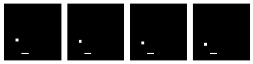

精明的读者可能注意到，我们的问题可以被建模为一个分类问题，其中网络的输入是游戏屏幕图像，输出是三种动作之一——向左移动、保持不动或向右移动。然而，这需要我们提供训练示例，可能来自专家进行的游戏录制。另一种更简单的做法可能是构建一个网络，让它反复玩游戏，并根据它是否成功接住球来给它反馈。这种方法也更直观，且更接近人类和动物学习的方式。

表示此类问题最常见的方法是通过**马尔可夫决策过程**（**MDP**）。我们的游戏是智能体试图学习的环境。在时间步* t *时，环境的状态由*s[t]*给出（并包含球和球拍的位置）。智能体可以执行某些动作（例如，向左或向右移动球拍）。这些动作有时会导致奖励*r[t]*，奖励可以是正的或负的（例如，得分增加或减少）。动作改变环境，可能导致新的状态*s[t+1]*，然后智能体可以执行另一个动作*a[t+1]*，依此类推。状态、动作和奖励的集合，以及从一个状态过渡到另一个状态的规则，构成了马尔可夫决策过程。单场游戏是这个过程的一个回合，表示为状态、动作和奖励的有限序列：

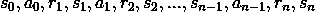

由于这是一个马尔可夫决策过程，状态*s[t+1]*的概率仅依赖于当前状态*s[t]*和动作*a[t]*。

# 最大化未来奖励

作为一个智能体，我们的目标是最大化每场游戏的总奖励。总奖励可以表示如下：

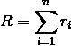

为了最大化总奖励，智能体应该尽力从游戏中的任何时刻*t*开始，最大化总奖励。时间步*t*的总奖励由*R[t]*给出，并表示为：

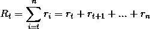

然而，预测未来的奖励值越远就越困难。为了考虑这一点，我们的智能体应该尝试最大化时间*t*时的总折扣未来奖励。这是通过在每个未来时间步长中使用折扣因子γ来折扣奖励，从而实现的。如果γ为*0*，则我们的网络根本不考虑未来的奖励；如果γ为*1*，则我们的网络完全是确定性的。一个好的γ值大约是*0.9*。通过因式分解方程，我们可以递归地表达在给定时间步长的总折扣未来奖励，作为当前奖励与下一个时间步长的总折扣未来奖励之和：

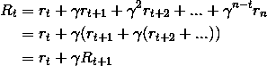

# Q 学习

深度强化学习利用一种称为**Q 学习**的无模型强化学习技术。Q 学习可以用来在有限马尔可夫决策过程中为任何给定状态找到最优动作。Q 学习尝试最大化 Q 函数的值，Q 函数表示在状态*s*下执行动作*a*时，获得的最大折扣未来奖励：

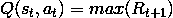

一旦我们知道了 Q 函数，状态*s*下的最优动作*a*就是具有最高 Q 值的动作。然后我们可以定义一个策略*Ïπ(s)*，它可以为我们提供任何状态下的最优动作：

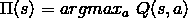

我们可以通过贝尔曼方程的方式定义一个过渡点(*s[t]*, *a[t]*, *r[t]*, *s[t+1]*)的 Q 函数，类似于我们对总折扣未来奖励的处理。这个方程被称为**贝尔曼方程**：

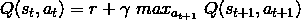

Q 函数可以通过贝尔曼方程来近似。你可以将 Q 函数看作一个查找表（称为**Q 表**），其中状态（由*s*表示）是行，动作（由*a*表示）是列，元素（由*Q(s, a)*表示）是你在给定行的状态下采取给定列的动作所获得的奖励。在任何状态下，最佳的动作是具有最高奖励的那个。我们从随机初始化 Q 表开始，然后执行随机动作并观察奖励，以便根据以下算法迭代更新 Q 表：

```py
initialize Q-table Q
observe initial state s
repeat
   select and carry out action a
   observe reward r and move to new state s'
   Q(s, a) = Q(s, a) + α(r + γ max_a' Q(s', a') - Q(s, a))
   s = s'
until game over

```

你会发现这个算法本质上是在对贝尔曼方程做随机梯度下降，通过状态空间（或回合）反向传播奖励，并在多次试验（或周期）中取平均。在这里，α是学习率，决定了前一个 Q 值和折扣后的新最大 Q 值之间的差异应被纳入多少。

# 深度 Q 网络作为 Q 函数

我们知道我们的 Q 函数将是一个神经网络，接下来自然会问：什么类型的神经网络呢？对于我们的简单示例游戏，每个状态由四张连续的黑白屏幕图像（大小为*(80, 80)*）表示，因此可能的状态总数（也是 Q 表的行数）是*2^(80x80x4)*。幸运的是，这些状态中的许多代表了不可能或极不可能的像素组合。由于卷积神经网络具有局部连接性（即每个神经元仅与输入的局部区域相连），它避免了这些不可能或极不可能的像素组合。此外，神经网络通常非常擅长为结构化数据（如图像）提取有效特征。因此，CNN 可以非常有效地用于建模 Q 函数。

DeepMind 论文（更多信息请参考：*Playing Atari with Deep Reinforcement Learning*，V. Mnih，arXiv:1312.5602，2013）也使用了三层卷积层，后面跟着两层全连接层。与传统用于图像分类或识别的 CNN 不同，该网络没有池化层。这是因为池化层使网络对图像中特定物体位置的敏感性降低，而在游戏中，这些信息可能是计算奖励时所需要的，因此不能被丢弃。

下图展示了用于我们示例的深度 Q 网络结构。它遵循原始 DeepMind 论文中的相同结构，唯一不同的是输入层和输出层的形状。我们每个输入的形状为*(80, 80, 4)*：四张连续的黑白游戏控制台截图，每张图像大小为*80* x *80* 像素。我们的输出形状为(*3*)，对应三个可能动作的 Q 值（向左移动、停留、向右移动）：

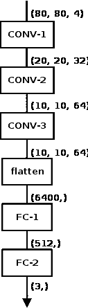

由于我们的输出是三个 Q 值，这是一个回归任务，我们可以通过最小化*Q(s, a)*当前值与其根据奖励和未来折扣 Q 值*Q(s', a')*计算值之间的平方误差之差来进行优化。当前值在迭代开始时已知，未来值是基于环境返回的奖励计算出来的：

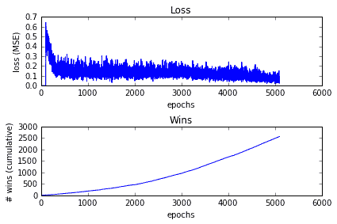

# 平衡探索与利用

深度强化学习是在线学习的一个例子，在这种方法中，训练和预测步骤是交替进行的。与批量学习技术不同，批量学习技术通过在整个训练数据上进行学习生成最佳预测器，而在线学习训练的预测器则随着在新数据上的训练不断改进。

因此，在训练的初期阶段，深度 Q 网络给出随机预测，这可能导致 Q 学习性能不佳。为了缓解这一问题，我们可以使用简单的探索方法，如&epsi;-贪婪法。在&epsi;-贪婪探索中，智能体以概率*1-&epsi;*选择网络建议的动作，否则选择一个随机动作。 这就是为什么这个策略被称为探索/利用。

随着训练轮数的增加，Q 函数逐渐收敛，开始返回更一致的 Q 值。&epsi;的值可以逐渐减小以适应这一变化，因此，随着网络开始返回更一致的预测，智能体选择利用网络返回的值，而不是选择随机动作。以 DeepMind 为例，&epsi;的值随时间从*1*减小到*0.1*，而在我们的示例中，它从*0.1*减小到*0.001*。

因此，&epsi;-贪婪探索确保在开始时系统平衡 Q 网络做出的不可靠预测和完全随机的动作来探索状态空间，随后随着 Q 网络的预测改善，系统逐渐转向较少的激进探索（更多的激进利用）。

# 经验回放，或经验的价值

基于表示状态动作对*(s[t], a[t])*的 Q 值方程，该 Q 值由当前奖励*r[t]*和下一个时间步的折扣最大 Q 值*(s[t+1], a[t+1])*表示，我们的策略在逻辑上是训练网络预测给定当前状态*(s, a, r)*下的最佳下一个状态*s'*。事实证明，这倾向于将网络推向局部最小值。原因是连续的训练样本往往非常相似。

为了应对这一点，在游戏过程中，我们将所有先前的动作*(s, a, r, s')*收集到一个固定大小的队列中，称为**回放记忆**。回放记忆代表网络的经验。在训练网络时，我们从回放记忆中生成随机批次，而不是从最近的（批量）事务中生成。由于这些批次由乱序的经验元组*(s, a, r, s')*组成，网络的训练效果更好，并且避免陷入局部最小值。

经验可以通过人类的游戏玩法来收集，而不仅仅是（或额外地）通过网络在游戏中的先前动作来收集。另一种方法是在游戏开始时，以*观察*模式运行网络一段时间，在此期间它会生成完全随机的动作（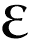* = 1*），并从游戏中提取奖励和下一个状态，并将其收集到经验回放队列中。

# 示例 - Keras 深度 Q 网络用于接球

我们游戏的目标是通过左右箭头键水平移动屏幕底部的挡板，接住从屏幕顶部随机位置释放的球。当挡板成功接住球时，玩家获胜；如果球在挡板接到之前掉出屏幕，玩家失败。这个游戏的优点是非常简单易懂并且易于构建，它的模型源自 Eder Santana 在他的博客文章中描述的接球游戏（更多信息请参考：*Keras 玩接球游戏，一个单文件强化学习示例*，作者 Eder Santana，2017。）关于深度强化学习。我们使用 Pygame（[`www.pygame.org/news`](https://www.pygame.org/news)）这个免费且开源的游戏构建库来构建最初的游戏。该游戏允许玩家使用左右箭头键来移动挡板。你可以在本章的代码包中找到 `game.py` 文件，以便亲自体验一下这个游戏。

**安装 Pygame**：

Pygame 运行在 Python 之上，并且可以在 Linux（各种版本）、macOS、Windows 以及一些手机操作系统（如 Android 和 Nokia）上使用。完整的发行版列表可以在以下网址找到：[`www.pygame.org/download.shtml`](http://www.pygame.org/download.shtml)。预构建版本适用于 32 位和 64 位的 Linux 和 Windows，以及 64 位的 macOS。在这些平台上，你可以通过 `pip install pygame` 命令来安装 Pygame。

如果没有适用于你的平台的预构建版本，你也可以按照以下网址提供的说明从源代码构建： [`www.pygame.org/wiki/GettingStarted`](http://www.pygame.org/wiki/GettingStarted)。

Anaconda 用户可以在 conda-forge 上找到预构建的 Pygame 版本：

`conda install binstar`

`conda install anaconda-client`

`conda install -c https://conda.binstar.org/tlatorre pygame # Linux`

`conda install -c https://conda.binstar.org/quasiben pygame # Mac`

为了训练我们的神经网络，我们需要对原始游戏进行一些修改，使得网络能够代替人类玩家进行游戏。我们希望将游戏封装起来，允许网络通过 API 与游戏进行交互，而不是通过键盘的左右箭头键。让我们来看看这个封装游戏的代码。

一如既往，我们从导入开始：

```py
from __future__ import division, print_function
import collections
import numpy as np
import pygame
import random
import os

```

我们定义了我们的类。构造函数可以选择性地将封装版本的游戏设置为 *无头* 模式，即不需要显示 Pygame 屏幕。当你需要在云中的 GPU 主机上运行并且只能访问基于文本的终端时，这非常有用。如果你在本地运行封装的游戏并且能够访问图形终端，可以注释掉这一行。接下来，我们调用 `pygame.init()` 方法来初始化所有 Pygame 组件。最后，我们设置了一些类级常量：

```py
class MyWrappedGame(object):

    def __init__(self):
        # run pygame in headless mode
        os.environ["SDL_VIDEODRIVER"] = "dummy"

        pygame.init()

        # set constants
        self.COLOR_WHITE = (255, 255, 255)
        self.COLOR_BLACK = (0, 0, 0)
        self.GAME_WIDTH = 400
        self.GAME_HEIGHT = 400
        self.BALL_WIDTH = 20
        self.BALL_HEIGHT = 20
        self.PADDLE_WIDTH = 50
        self.PADDLE_HEIGHT = 10
        self.GAME_FLOOR = 350
        self.GAME_CEILING = 10
        self.BALL_VELOCITY = 10
        self.PADDLE_VELOCITY = 20
        self.FONT_SIZE = 30
        self.MAX_TRIES_PER_GAME = 1
        self.CUSTOM_EVENT = pygame.USEREVENT + 1
        self.font = pygame.font.SysFont("Comic Sans MS", self.FONT_SIZE)

```

`reset()`方法定义了在每局游戏开始时需要调用的操作，如清空状态队列、设置球和挡板的位置、初始化分数等：

```py
    def reset(self):
        self.frames = collections.deque(maxlen=4)
        self.game_over = False
        # initialize positions
        self.paddle_x = self.GAME_WIDTH // 2
        self.game_score = 0
        self.reward = 0
        self.ball_x = random.randint(0, self.GAME_WIDTH)
        self.ball_y = self.GAME_CEILING
        self.num_tries = 0

        # set up display, clock, etc
        self.screen = pygame.display.set_mode((self.GAME_WIDTH, self.GAME_HEIGHT))
        self.clock = pygame.time.Clock()

```

在原始游戏中，有一个 Pygame 事件队列，玩家通过按左右箭头键移动挡板时产生的事件，以及 Pygame 组件产生的内部事件，都会写入该队列。游戏代码的核心部分基本上是一个循环（称为**事件循环**），它读取事件队列并对此做出反应。

在包装版本中，我们将事件循环移到了调用者处。`step()`方法描述了循环中单次执行时发生的事情。该方法接受一个整数`0`、`1`或`2`表示一个动作（分别是向左移动、保持不动和向右移动），然后它设置控制此时球和挡板位置的变量。`PADDLE_VELOCITY`变量表示一个*速度*，当发送向左或向右移动的动作时，挡板会向左或向右移动相应的像素。如果球已经越过挡板，它会检查是否发生碰撞。如果发生碰撞，挡板会*接住*球，玩家（即神经网络）获胜，否则玩家失败。然后，该方法会重新绘制屏幕并将其附加到固定长度的`deque`中，该队列包含游戏画面的最后四帧。最后，它返回状态（由最后四帧组成）、当前动作的奖励以及一个标志，告诉调用者游戏是否结束：

```py
    def step(self, action):
        pygame.event.pump()

        if action == 0: # move paddle left
            self.paddle_x -= self.PADDLE_VELOCITY
            if self.paddle_x < 0:
                # bounce off the wall, go right
                self.paddle_x = self.PADDLE_VELOCITY
        elif action == 2: # move paddle right
            self.paddle_x += self.PADDLE_VELOCITY
            if self.paddle_x > self.GAME_WIDTH - self.PADDLE_WIDTH:
                # bounce off the wall, go left
                self.paddle_x = self.GAME_WIDTH - self.PADDLE_WIDTH - self.PADDLE_VELOCITY
        else: # don't move paddle
            pass

        self.screen.fill(self.COLOR_BLACK)
        score_text = self.font.render("Score: {:d}/{:d}, Ball: {:d}"
            .format(self.game_score, self.MAX_TRIES_PER_GAME,
                    self.num_tries), True, self.COLOR_WHITE)
        self.screen.blit(score_text, 
            ((self.GAME_WIDTH - score_text.get_width()) // 2,
            (self.GAME_FLOOR + self.FONT_SIZE // 2)))

        # update ball position
        self.ball_y += self.BALL_VELOCITY
        ball = pygame.draw.rect(self.screen, self.COLOR_WHITE,
            pygame.Rect(self.ball_x, self.ball_y, self.BALL_WIDTH, 
            self.BALL_HEIGHT))
        # update paddle position
        paddle = pygame.draw.rect(self.screen, self.COLOR_WHITE,
            pygame.Rect(self.paddle_x, self.GAME_FLOOR, 
                        self.PADDLE_WIDTH, self.PADDLE_HEIGHT))

        # check for collision and update reward
        self.reward = 0
        if self.ball_y >= self.GAME_FLOOR - self.BALL_WIDTH // 2:
            if ball.colliderect(paddle):
                self.reward = 1
            else:
                self.reward = -1

        self.game_score += self.reward
        self.ball_x = random.randint(0, self.GAME_WIDTH)
        self.ball_y = self.GAME_CEILING
        self.num_tries += 1

        pygame.display.flip()

        # save last 4 frames
        self.frames.append(pygame.surfarray.array2d(self.screen))

        if self.num_tries >= self.MAX_TRIES_PER_GAME:
            self.game_over = True

        self.clock.tick(30)
        return np.array(list(self.frames)), self.reward, self.game_over

```

我们将查看训练我们的网络以玩游戏的代码。

如往常一样，首先我们导入所需的库和对象。除了来自 Keras 和 SciPy 的第三方组件外，我们还导入了之前描述的`wrapped_game`类：

```py
from __future__ import division, print_function
from keras.models import Sequential
from keras.layers.core import Activation, Dense, Flatten
from keras.layers.convolutional import Conv2D
from keras.optimizers import Adam
from scipy.misc import imresize
import collections
import numpy as np
import os

import wrapped_game

```

我们定义了两个便捷函数。第一个函数将四个输入图像转换为适合网络使用的形式。输入是一组四个 800 x 800 的图像，因此输入的形状是*(4, 800, 800)*。然而，网络期望其输入是一个形状为*(batch size, 80, 80, 4)*的四维张量。在游戏的最初，我们没有四帧画面，所以通过将第一帧堆叠四次来模拟。这个函数返回的输出张量的形状是*(80, 80, 4)*。

`get_next_batch()`函数从经验回放队列中采样`batch_size`个状态元组，并从神经网络获取奖励和预测的下一个状态。然后，它计算下一时间步的 Q 函数值并返回：

```py
def preprocess_images(images):
    if images.shape[0] < 4:
        # single image
        x_t = images[0]
        x_t = imresize(x_t, (80, 80))
        x_t = x_t.astype("float")
        x_t /= 255.0
        s_t = np.stack((x_t, x_t, x_t, x_t), axis=2)
    else:
        # 4 images
        xt_list = []
        for i in range(images.shape[0]):
            x_t = imresize(images[i], (80, 80))
            x_t = x_t.astype("float")
            x_t /= 255.0
            xt_list.append(x_t)
        s_t = np.stack((xt_list[0], xt_list[1], xt_list[2], xt_list[3]), 
                       axis=2)
    s_t = np.expand_dims(s_t, axis=0)
    return s_t

def get_next_batch(experience, model, num_actions, gamma, batch_size):
    batch_indices = np.random.randint(low=0, high=len(experience), 
        size=batch_size)
    batch = [experience[i] for i in batch_indices]
    X = np.zeros((batch_size, 80, 80, 4))
    Y = np.zeros((batch_size, num_actions))
    for i in range(len(batch)):
        s_t, a_t, r_t, s_tp1, game_over = batch[i]
        X[i] = s_t
        Y[i] = model.predict(s_t)[0]
        Q_sa = np.max(model.predict(s_tp1)[0])
        if game_over:
            Y[i, a_t] = r_t
        else:
            Y[i, a_t] = r_t + gamma * Q_sa
    return X, Y

```

我们定义了我们的网络。这是一个用于建模游戏 Q 函数的网络。我们的网络与 DeepMind 论文中提出的网络非常相似。唯一的区别是输入和输出的大小。我们的输入形状是 *(80, 80, 4)*，而他们的是 *(84, 84, 4)*，我们的输出是 *(3)*，对应需要计算 Q 函数值的三个动作，而他们的是 *(18)*，对应 Atari 游戏中可能的动作：

网络有三层卷积层和两层全连接（密集）层。除最后一层外，所有层都使用 ReLU 激活单元。由于我们是在预测 Q 函数的值，因此这是一个回归网络，最后一层没有激活单元：

```py
# build the model
model = Sequential()
model.add(Conv2D(32, kernel_size=8, strides=4, 
                 kernel_initializer="normal", 
                 padding="same",
                 input_shape=(80, 80, 4)))
model.add(Activation("relu"))
model.add(Conv2D(64, kernel_size=4, strides=2, 
                 kernel_initializer="normal", 
                 padding="same"))
model.add(Activation("relu"))
model.add(Conv2D(64, kernel_size=3, strides=1,
                 kernel_initializer="normal",
                 padding="same"))
model.add(Activation("relu"))
model.add(Flatten())
model.add(Dense(512, kernel_initializer="normal"))
model.add(Activation("relu"))
model.add(Dense(3, kernel_initializer="normal"))

```

如前所述，我们的损失函数是当前 *Q(s, a)* 值与根据奖励和折扣后的 Q 值 *Q(s', a')* 计算得到的值之间的平方差，因此均方误差（MSE）损失函数非常有效。对于优化器，我们选择了 Adam，这是一个通用的优化器，并且以较低的学习率进行了初始化：

```py
model.compile(optimizer=Adam(lr=1e-6), loss="mse")

```

我们为训练定义了一些常量。`NUM_ACTIONS` 常量定义了网络可以向游戏发送的输出动作的数量。在我们的例子中，这些动作是 `0`、`1` 和 `2`，分别对应向左移动、停留和向右移动。`GAMMA` 值是未来奖励的折扣因子 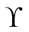。`INITIAL_EPSILON` 和 `FINAL_EPSILON` 分别指代  参数在 -贪婪探索中的起始值和结束值。`MEMORY_SIZE` 是经验回放队列的大小。`NUM_EPOCHS_OBSERVE` 指网络在完全随机发送动作并观察奖励的过程中允许探索游戏的轮次。`NUM_EPOCHS_TRAIN` 变量指网络进行在线训练的轮次。每一轮对应一个单独的游戏或回合。一个训练运行的总游戏数是 `NUM_EPOCHS_OBSERVE` 和 `NUM_EPOCHS_TRAIN` 的总和。`BATCH_SIZE` 是我们在训练中使用的迷你批次的大小：

```py
# initialize parameters
DATA_DIR = "../data"
NUM_ACTIONS = 3 # number of valid actions (left, stay, right)
GAMMA = 0.99 # decay rate of past observations
INITIAL_EPSILON = 0.1 # starting value of epsilon
FINAL_EPSILON = 0.0001 # final value of epsilon
MEMORY_SIZE = 50000 # number of previous transitions to remember
NUM_EPOCHS_OBSERVE = 100
NUM_EPOCHS_TRAIN = 2000

BATCH_SIZE = 32
NUM_EPOCHS = NUM_EPOCHS_OBSERVE + NUM_EPOCHS_TRAIN

```

我们实例化了游戏和经验回放队列。我们还打开了一个日志文件并初始化了一些变量，为训练做准备：

```py
game = wrapped_game.MyWrappedGame()
experience = collections.deque(maxlen=MEMORY_SIZE)

fout = open(os.path.join(DATA_DIR, "rl-network-results.tsv"), "wb")
num_games, num_wins = 0, 0
epsilon = INITIAL_EPSILON

```

接下来，我们设置控制训练轮次的循环。正如之前提到的，每一轮对应一个单独的游戏，因此我们此时会重置游戏状态。一个游戏对应一个小球从天花板掉下，可能被挡板接住或错过的回合。损失是预测值和实际 Q 值之间的平方差：

我们通过发送一个虚拟动作（在我们的例子中是 *停留*）来开始游戏，并获得游戏的初始状态元组：

```py
for e in range(NUM_EPOCHS):
    game.reset() 
    loss = 0.0

    # get first state
    a_0 = 1 # (0 = left, 1 = stay, 2 = right)
    x_t, r_0, game_over = game.step(a_0) 
    s_t = preprocess_images(x_t)

```

下一个块是游戏的主循环。这是原始游戏中的事件循环，我们将其移到了调用代码中。我们保存当前状态，因为我们将需要它来进行经验回放队列，然后决定向封装的游戏发送什么动作信号。如果我们处于观察模式，我们只会生成一个对应于我们动作的随机数，否则我们将使用-贪心探索方法，随机选择一个动作或使用我们的神经网络（我们也在训练它）来预测我们应该发送的动作：

```py
    while not game_over:
        s_tm1 = s_t

        # next action
        if e <= NUM_EPOCHS_OBSERVE:
            a_t = np.random.randint(low=0, high=NUM_ACTIONS, size=1)[0]
        else:
            if np.random.rand() <= epsilon:
                a_t = np.random.randint(low=0, high=NUM_ACTIONS, size=1)[0]
            else:
                q = model.predict(s_t)[0]
                a_t = np.argmax(q)

```

一旦知道我们的动作，我们通过调用`game.step()`发送它到游戏中，`game.step()`返回新的状态、奖励和一个布尔标志，表示游戏是否结束。如果奖励是正数（表示球被接住），我们会增加胜利次数，并将这个*(状态，动作，奖励，新状态，游戏结束)*元组存储在我们的经验回放队列中：

```py
        # apply action, get reward
        x_t, r_t, game_over = game.step(a_t)
        s_t = preprocess_images(x_t)
        # if reward, increment num_wins
        if r_t == 1:
            num_wins += 1
        # store experience
        experience.append((s_tm1, a_t, r_t, s_t, game_over))

```

然后，我们从经验回放队列中随机抽取一个小批量进行训练。对于每次训练，我们计算损失。在每个训练周期中，所有训练的损失总和即为该周期的损失：

```py
        if e > NUM_EPOCHS_OBSERVE:
            # finished observing, now start training
            # get next batch
            X, Y = get_next_batch(experience, model, NUM_ACTIONS, GAMMA, BATCH_SIZE)
            loss += model.train_on_batch(X, Y)

```

当网络相对未经训练时，它的预测不太准确，因此有意义的是更多地探索状态空间，尽量减少卡在局部最小值的机会。然而，随着网络越来越多地训练，我们逐渐减少的值，以便模型能够预测网络向游戏发送的更多动作：

```py
    # reduce epsilon gradually
    if epsilon > FINAL_EPSILON:
        epsilon -= (INITIAL_EPSILON - FINAL_EPSILON) / NUM_EPOCHS

```

我们在控制台和日志文件中写出每个训练周期的日志，供后续分析。在训练 100 个周期后，我们保存当前模型的状态，以便在我们决定停止训练时能够恢复。我们还保存了最终模型，以便以后用它来玩游戏：

```py
    print("Epoch {:04d}/{:d} | Loss {:.5f} | Win Count {:d}"
        .format(e + 1, NUM_EPOCHS, loss, num_wins))
    fout.write("{:04d}t{:.5f}t{:d}n".format(e + 1, loss, num_wins))

    if e % 100 == 0:
        model.save(os.path.join(DATA_DIR, "rl-network.h5"), overwrite=True)

fout.close()
model.save(os.path.join(DATA_DIR, "rl-network.h5"), overwrite=True)

```

我们通过让游戏观察 100 场比赛，然后分别玩 1,000 场、2,000 场和 5,000 场比赛来进行训练。以下是 5,000 场比赛训练的日志文件中的最后几行。如您所见，在训练接近尾声时，网络变得相当擅长玩这个游戏：

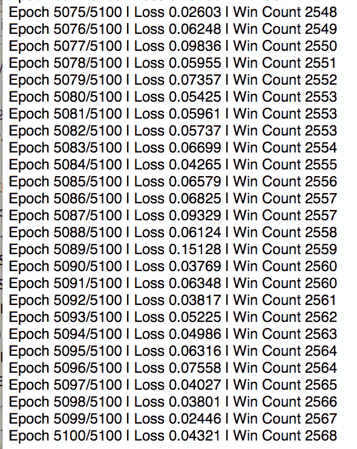

损失和胜利计数随训练轮数变化的图表，显示了类似的趋势。虽然看起来随着更多的训练，损失可能会进一步收敛，但它已经从*0.6*下降到大约*0.1*，并且训练了*5000*个周期。同样，胜利次数的图表呈上升趋势，表明随着训练轮数的增加，网络学习得更快：


最后，我们通过让训练好的模型玩固定数量的游戏（在我们的案例中是 100 场）来评估它的技能，并查看它能赢得多少场。以下是执行此操作的代码。如之前一样，我们从导入开始：

```py
from __future__ import division, print_function
from keras.models import load_model
from keras.optimizers import Adam
from scipy.misc import imresize
import numpy as np
import os
import wrapped_game

```

我们加载在训练结束时保存的模型并进行编译。我们还实例化了我们的`wrapped_game`：

```py
DATA_DIR = "../data"
model = load_model(os.path.join(DATA_DIR, "rl-network.h5"))
model.compile(optimizer=Adam(lr=1e-6), loss="mse")

game = wrapped_game.MyWrappedGame()

```

然后我们进行 100 场游戏的循环。通过调用每个游戏的 `reset()` 方法来实例化每场游戏，并开始它。然后，对于每场游戏，直到结束，我们调用模型预测具有最佳 Q 函数的动作。我们报告它赢得的游戏总数。

我们用每个模型进行了测试。第一个训练了 1,000 场游戏，赢得了 42 场中的 100 场；第二个训练了 2,000 场游戏，赢得了 74 场中的 100 场；第三个训练了 5,000 场游戏，赢得了 87 场中的 100 场。这清楚地表明，网络随着训练的进行在不断改进：

```py
num_games, num_wins = 0, 0
for e in range(100):
    game.reset()

    # get first state
    a_0 = 1 # (0 = left, 1 = stay, 2 = right)
    x_t, r_0, game_over = game.step(a_0) 
    s_t = preprocess_images(x_t)

    while not game_over:
        s_tm1 = s_t
        # next action
        q = model.predict(s_t)[0]
        a_t = np.argmax(q)
        # apply action, get reward
        x_t, r_t, game_over = game.step(a_t)
        s_t = preprocess_images(x_t)
        # if reward, increment num_wins
        if r_t == 1:
            num_wins += 1

    num_games += 1
    print("Game: {:03d}, Wins: {:03d}".format(num_games, num_wins), end="r")
print("")

```

如果你运行评估代码，并取消注释以启用无头模式运行的调用，你可以观看网络进行游戏，观看的过程相当令人惊叹。考虑到 Q 值预测一开始是随机的，并且训练过程中主要是稀疏奖励机制为网络提供指导，网络能够如此高效地学会玩游戏几乎是不可思议的。但和深度学习的其他领域一样，网络确实学会了相当好地玩游戏。

前面展示的例子相对简单，但它阐明了深度强化学习模型的工作过程，并且希望能帮助你建立一个思维模型，通过这个模型你可以接近更复杂的实现。你可能会对 Ben Lau 使用 Keras 实现的 FlappyBird 感兴趣（更多信息请参考：*使用 Keras 和深度 Q 网络来玩 FlappyBird*，Ben Lau，2016 年，以及 GitHub 页面：[`github.com/yanpanlau/Keras-FlappyBird`](https://github.com/yanpanlau/Keras-FlappyBird)）。Keras-RL 项目（[`github.com/matthiasplappert/keras-rl`](https://github.com/matthiasplappert/keras-rl)），这是一个用于深度强化学习的 Keras 库，也有一些非常好的例子。

自从 DeepMind 提出的原始方案以来，已经有其他改进方案被提出，例如双 Q 学习（更多信息请参考：*使用双 Q 学习的深度强化学习*，H. Van Hasselt，A. Guez 和 D. Silver，AAAI，2016），优先经验回放（更多信息请参考：*优先经验回放*，T. Schaul，arXiv:1511.05952，2015），以及对抗网络架构（更多信息请参考：*用于深度强化学习的对抗网络架构*，Z. Wang，arXiv:1511.06581，2015）。双 Q 学习使用两个网络——主网络选择动作，目标网络选择该动作的目标 Q 值。这可以减少单个网络对 Q 值的过高估计，从而让网络训练得更快、更好。优先经验回放增加了采样具有更高预期学习进展的经验元组的概率。对抗网络架构将 Q 函数分解为状态和动作组件，并将它们单独合并回来。

本节讨论的所有代码，包括可以由人类玩家玩的基础游戏，都可以在本章附带的代码包中找到。

# 前路漫漫

2016 年 1 月，DeepMind 宣布发布 AlphaGo（更多信息请参见：*利用深度神经网络和树搜索掌握围棋游戏*，D. Silver，Nature 529.7587，页 484-489，2016），这是一个用于下围棋的神经网络。围棋被认为是 AI 难以掌握的一项非常具有挑战性的游戏，主要因为在游戏的任何时刻，可能的着法平均大约有*10¹⁷⁰*种（更多信息请参见：[`ai-depot.com/LogicGames/Go-Complexity.html`](http://ai-depot.com/LogicGames/Go-Complexity.html)）（而国际象棋则大约是*10⁵⁰*种）。因此，使用暴力破解的方法来确定最佳着法在计算上是不可行的。在发布时，AlphaGo 已经以 5-0 的成绩战胜了现任欧洲围棋冠军范辉。这是计算机程序首次在围棋对抗中击败人类玩家。随后，2016 年 3 月，AlphaGo 以 4-1 战胜了世界第二号职业围棋选手李世石。

AlphaGo 的研发过程中有几个值得注意的新想法。首先，它是通过结合人类专家对局的监督学习和通过让一台 AlphaGo 与另一台 AlphaGo 对弈的强化学习来进行训练的。你已经在前几章中见过这些思想的应用。

其次，AlphaGo 由价值网络和策略网络组成。在每一步棋时，AlphaGo 会使用蒙特卡罗模拟，这是一种在存在随机变量的情况下预测未来不同结果概率的过程，用来从当前局面想象出许多替代棋局。价值网络用于减少树搜索的深度，从而估算胜负概率，而无需计算游戏到结束的所有步骤，类似于对棋步优劣的直觉判断。策略网络则通过引导搜索朝向能够获得最大即时奖励（或 Q 值）的动作，来减少搜索的广度。有关更详细的描述，请参考博客文章：*AlphaGo：通过机器学习掌握古老的围棋游戏*，Google Research Blog，2016 年。

虽然 AlphaGo 相较于原始的 DeepMind 网络有了很大的进步，但它仍然是在一个所有玩家都可以看到所有棋子的游戏中进行的，也就是说，它仍然是一个完全信息博弈。2017 年 1 月，卡内基梅隆大学的研究人员宣布了 Libratus（一篇相关论文：*AI Takes on Top Poker Players*，作者 T. Revel，New Scientist 223.3109，页码 8，2017），这是一款可以玩扑克的 AI。与此同时，由阿尔伯塔大学、捷克布拉格的查尔斯大学和捷克技术大学的研究人员组成的另一个团队，提出了 DeepStack 架构（一篇相关论文：*DeepStack: Expert-Level Artificial Intelligence in No-Limit Poker*，作者 M. Moravaák，arXiv:1701.01724，2017），用于实现同样的目标。扑克是一种不完全信息博弈，因为玩家无法看到对手的牌。因此，除了学习如何玩游戏之外，扑克 AI 还需要对对手的游戏玩法发展出直觉。

与其使用内置策略来获得直觉，Libratus 使用一种算法，通过尝试在风险和回报之间取得平衡来计算这一策略，这也被称为纳什均衡。从 2017 年 1 月 11 日到 1 月 31 日，Libratus 与四名顶级扑克玩家进行了对战（一篇相关论文：*Upping the Ante: Top Poker Pros Face Off vs. Artificial Intelligence*，卡内基梅隆大学，2017 年 1 月），并以压倒性优势战胜了他们。

DeepStack 的直觉通过强化学习进行训练，使用从随机扑克情境中生成的示例。它已与来自 17 个国家的 33 位职业扑克玩家进行过对战，且其获胜评分使其比优秀玩家的评分高出*一个数量级*（一篇相关论文：*The Uncanny Intuition of Deep Learning to Predict Human Behavior*，作者 C. E. Perez，Medium corporation，Intuition Machine，2017 年 2 月 13 日）。

如你所见，这的确是一个令人激动的时代。最初从能够玩街机游戏的深度学习网络开始，进展到现在能够有效读取你的思维，或至少能够预测（有时是非理性的）人类行为并在虚张声势的博弈中获胜的网络。深度学习的可能性似乎几乎是无限的。

# 总结

在本章中，我们学习了强化学习背后的概念，以及如何使用 Keras 构建深度学习网络，通过奖励反馈学习如何玩街机游戏。接下来，我们简要讨论了该领域的进展，例如已经能够在超人水平上玩围棋和扑克等更复杂游戏的网络。虽然游戏玩耍看起来像是一个轻松的应用，但这些理念是通向通用人工智能的第一步，在这种人工智能中，网络通过经验学习，而不是依赖大量的训练数据。
