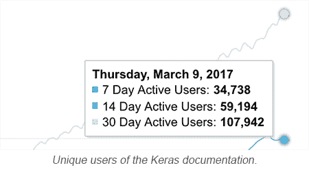

# 第九章：结论

恭喜你读完了这本书！让我们花点时间回顾一下自从开始以来我们已经走了多远。

如果你像大多数读者一样，你开始时已经具备了一些 Python 知识和机器学习的背景，但你有兴趣深入了解深度学习，并希望能够使用 Python 应用这些深度学习技能。

你学会了如何在你的机器上安装 Keras，并开始使用它构建简单的深度学习模型。接着，你了解了原始的深度学习模型——多层感知机，也叫**全连接网络**（**FCN**）。你学会了如何使用 Keras 构建这个网络。

你还学习了许多可调参数，你需要调整这些参数才能从你的网络中获得良好的结果。使用 Keras，很多繁琐的工作已经为你做了，因为它提供了合理的默认设置，但有时候这些知识对你还是很有帮助的。

在此基础上，你被介绍了**卷积神经网络**（**CNN**），它最初是为利用图像的特征局部性而构建的，虽然你也可以将其用于其他类型的数据，如文本、音频或视频。你再次看到如何使用 Keras 构建 CNN。你还了解了 Keras 提供的功能，可以轻松直观地构建 CNN。你还看到了如何使用预训练的图像网络通过迁移学习和微调来对自己的图像进行预测。

从那里，你学习了**生成对抗网络**（**GAN**），它是由一对网络（通常是 CNN）组成，尝试相互对抗，在这个过程中使彼此变得更强。GAN 是深度学习领域的前沿技术，最近围绕 GAN 有很多研究工作。

从那里，我们将注意力转向了文本，并学习了**词嵌入**，这是近年来用于文本向量表示的最常见技术。我们研究了各种流行的词嵌入算法，了解了如何使用预训练的词嵌入来表示词汇集合，以及 Keras 和 gensim 对词嵌入的支持。

接着我们学习了**递归神经网络**（**RNN**），这是一类针对处理序列数据（如文本或时间序列）进行优化的神经网络。我们了解了基本 RNN 模型的不足之处，以及如何通过更强大的变体（如**长短期记忆网络**（**LSTM**）和**门控递归单元**（**GRU**））来缓解这些问题。我们看了一些使用这些组件的例子。我们还简要了解了有状态 RNN 模型及其可能的应用场景。

接下来，我们介绍了一些不完全符合我们目前所讨论模型类型的其他模型。其中包括**自编码器**，一种无监督学习模型——**回归网络**，它预测一个连续的值，而不是离散的标签。我们介绍了**Keras 功能 API**，它允许我们构建具有多个输入和输出的复杂网络，并在多个管道之间共享组件。我们还研究了如何自定义 Keras，添加当前不存在的功能。

最后，我们研究了在玩街机游戏的背景下使用**强化学习**训练深度学习网络，许多人认为这是通向通用人工智能的第一步。我们提供了一个使用 Keras 训练简单游戏的示例。接着，我们简要描述了在这一领域的进展，特别是在网络以超人水平玩更难的游戏（如围棋和扑克）方面的进展。

我们相信您现在已具备使用深度学习和 Keras 解决新机器学习问题的技能。这是您成为深度学习专家之路上一个重要且宝贵的技能。

我们感谢您让我们帮助您踏上深度学习精通之路。

# Keras 2.0 — 新特性

根据 Francois Chollet 的说法，Keras 于两年前，即 2015 年 3 月发布。随后，它从一个用户增长到了十万个用户。以下图片来自 Keras 博客，展示了 Keras 用户数量随时间增长的情况。

<q></q>

Keras 2.0 的一个重要更新是，API 现在将成为 TensorFlow 的一部分，从 TensorFlow 1.2 开始。事实上，Keras 正变得越来越成为深度学习的*通用语言*，一种在越来越多的深度学习应用场景中使用的*规范*。例如，Skymind 正在为 ScalNet 在 Scala 中实现 Keras 规范，而 Keras.js 则为 JavaScript 实现相同的功能，以便直接在浏览器中运行深度学习。同时，也在努力为 MXNET 和 CNTK 深度学习工具包提供 Keras API。

# 安装 Keras 2.0

安装 Keras 2.0 非常简单，只需运行`pip install keras --upgrade`，然后运行`pip install tensorflow --upgrade`。

# API 更改

Keras 2.0 的变化意味着需要重新考虑一些 API。欲了解详细信息，请参考发布说明（[`github.com/fchollet/keras/wiki/Keras-2.0-release-notes`](https://github.com/fchollet/keras/wiki/Keras-2.0-release-notes)）。此模块`legacy.py`总结了最具影响力的变化，并在使用 Keras 1.x 调用时避免警告：

```py
""
Utility functions to avoid warnings while testing both Keras 1 and 2.
"""
import keras
keras_2 = int(keras.__version__.split(".")[0]) > 1 # Keras > 1

def fit_generator(model, generator, epochs, steps_per_epoch):
    if keras_2:
        model.fit_generator(generator, epochs=epochs, steps_per_epoch=steps_per_epoch)
    else:
        model.fit_generator(generator, nb_epoch=epochs, samples_per_epoch=steps_per_epoch)

def fit(model, x, y, nb_epoch=10, *args, **kwargs):
    if keras_2:
        return model.fit(x, y, *args, epochs=nb_epoch, **kwargs)
    else:
        return model.fit(x, y, *args, nb_epoch=nb_epoch, **kwargs)

def l1l2(l1=0, l2=0):
    if keras_2:
        return keras.regularizers.L1L2(l1, l2)
    else:
        return keras.regularizers.l1l2(l1, l2)

def Dense(units, W_regularizer=None, W_initializer='glorot_uniform', **kwargs):
    if keras_2:
        return keras.layers.Dense(units, kernel_regularizer=W_regularizer, kernel_initializer=W_initializer, **kwargs)
    else:
        return keras.layers.Dense(units, W_regularizer=W_regularizer, 
                                  init=W_initializer, **kwargs)

def BatchNormalization(mode=0, **kwargs):
    if keras_2:
        return keras.layers.BatchNormalization(**kwargs)
    else:
        return keras.layers.BatchNormalization(mode=mode, **kwargs)

def Convolution2D(units, w, h, W_regularizer=None, W_initializer='glorot_uniform', border_mode='same', **kwargs):
    if keras_2:
        return keras.layers.Conv2D(units, (w, h), padding=border_mode,
                                   kernel_regularizer=W_regularizer,
                                   kernel_initializer=W_initializer,
                                   **kwargs)
    else:
        return keras.layers.Conv2D(units, w, h, border_mode=border_mode, W_regularizer=W_regularizer, init=W_initializer, **kwargs)

def AveragePooling2D(pool_size, border_mode='valid', **kwargs):
    if keras_2:
        return keras.layers.AveragePooling2D(pool_size=pool_size, 
                                             padding=border_mode, **kwargs)
    else:
        return keras.layers.AveragePooling2D(pool_size=pool_size, 
                                             border_mode=border_mode, **kwargs)

```

还存在一些重大变化。具体来说：

+   已移除 maxout 密集层、时间分布密集层和高速公路遗留层

+   批归一化层不再支持 mode 参数，因为 Keras 的内部结构已发生变化

+   自定义层需要更新

+   任何未记录的 Keras 功能可能已被破坏

此外，Keras 代码库已被配置为检测使用 Keras 1.x API 调用，并显示弃用警告，指示如何修改调用以符合 Keras 2 API。如果你已经有一些 Keras 1.x 代码，并且因为担心非破坏性更改而犹豫是否尝试 Keras 2，那么 Keras 2 代码库中的这些弃用警告将对你过渡到 Keras 2 非常有帮助。
