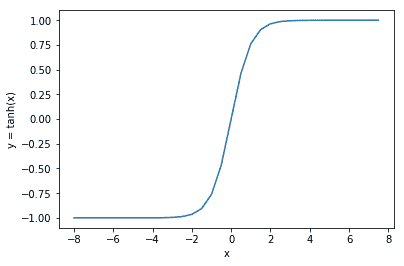
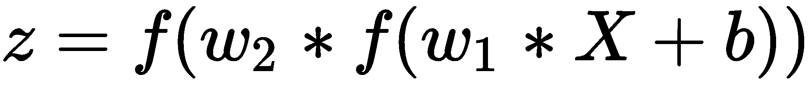

# 第一章：开始使用 CNTK

深度学习是一种机器学习技术，正受到公众和研究人员的广泛关注。在本章中，我们将探讨深度学习是什么，以及大公司如何使用它来解决复杂问题。我们将看看是什么使得这种技术如此激动人心，以及推动深度学习的概念是什么。

然后我们将讨论**微软认知工具包**（**CNTK**），它是什么，以及它在深度学习的更大框架中的作用。我们还将讨论 CNTK 与其他框架相比有什么独特之处。

在本章中，我们还将向你展示如何在你的计算机上安装 CNTK。我们将探讨如何在 Windows 和 Linux 上进行安装。如果你有兼容的显卡，你还需要查看如何配置显卡以便与 CNTK 一起使用，因为这将显著加速训练深度学习模型所需的计算。

在本章中，我们将覆盖以下主题：

+   人工智能、机器学习和深度学习之间的关系

+   深度学习是如何工作的？

+   什么是 CNTK？

+   安装 CNTK

# 人工智能、机器学习和深度学习之间的关系

为了理解深度学习是什么，我们必须探索**人工智能**（**AI**）是什么以及它与机器学习和深度学习的关系。从概念上讲，深度学习是机器学习的一种形式，而机器学习是人工智能的一种形式：


在计算机科学中，人工智能是一种由机器表现出的智能形式。AI 是 20 世纪 50 年代计算机科学研究人员发明的术语。人工智能包括一大类算法，它们表现出的行为比我们为计算机构建的标准软件更智能。

一些算法表现出智能行为，但不能自我改进。一类算法，叫做机器学习算法，可以从你展示的样本数据中学习，并生成模型，然后你可以在类似数据上使用这些模型进行预测。

在机器学习算法的群体中，有一个子类别叫做深度学习算法。这个算法组使用的模型受到人类或动物大脑的结构和功能的启发。

机器学习和深度学习都可以从你提供的样本数据中学习。当我们构建常规程序时，我们通过使用不同的语言构造（如 if 语句、循环和函数）编写业务规则。这些规则是固定的。在机器学习中，我们将样本和期望的答案输入到算法中，算法随后学习将样本与期望答案连接的规则：


机器学习中有两个主要组成部分：机器学习模型和机器学习算法。

当你使用机器学习构建程序时，首先选择一个机器学习模型。机器学习模型是一个包含可训练参数的数学方程，能够将输入转化为预测的答案。这个模型塑造了计算机将要学习的规则。例如：预测汽车的每加仑英里数需要以某种方式建模现实。判断信用卡交易是否欺诈需要一个不同的模型。

输入的表示可以是汽车的属性转化为向量。模型的输出可以是汽车的每加仑英里数。对于信用卡欺诈的情况，输入可以是用户账户的属性和交易信息。输出表示可以是一个介于 0 和 1 之间的分数，其中接近 1 的值表示该交易应该被拒绝。

机器学习模型中的数学变换由一组需要训练的参数控制，只有当这些参数经过训练，变换才能产生正确的输出表示。

这时，第二部分——机器学习算法就派上用场了。为了找到机器学习模型中参数的最佳值，我们需要执行一个多步骤的过程：

1.  初始时，计算机会为模型中的每个未知参数选择一个随机值。

1.  然后，模型会使用样本数据进行初步预测。

1.  这个预测会被输入到`loss`函数中，与预期的输出一起，以获取关于模型表现的反馈。

1.  这个反馈然后被机器学习算法用来为模型中的参数找到更好的值。

这些步骤会重复多次，以找到模型中参数的最佳值。如果一切顺利，你最终会得到一个能够对许多复杂情况做出准确预测的模型。

我们能够从示例中学习规则这一事实是一个有用的概念。许多情况下，我们无法使用简单的规则来解决特定问题。例如：信用卡欺诈案件的形式各异。有时，黑客会慢慢地渗透系统，逐步注入小型的攻击，然后盗取资金。其他时候，黑客则会在一次攻击中试图盗取大量资金。基于规则的程序会变得非常难以维护，因为它需要包含大量的代码来处理所有不同的欺诈案件。机器学习是一种优雅的解决方案。它可以在不需要大量代码的情况下理解如何处理不同类型的信用卡欺诈案件。它还能够在合理的范围内对之前未见过的案件做出判断。

# 机器学习的局限性

机器学习模型非常强大。在许多规则性程序无法解决的场景中，你可以使用它们。机器学习是当你遇到无法用常规规则程序解决的问题时，一个很好的替代方案。然而，机器学习模型也有其局限性。

机器学习模型中的数学变换非常基础。例如：当你想要判断一次信用交易是否应该被标记为欺诈时，你可以使用线性模型。逻辑回归模型是这种用例的一个很好的选择；它创建了一个决策边界函数，将欺诈案例和非欺诈案例分开。大多数欺诈案例将位于边界线的上方，并被正确标记为欺诈。但是没有任何机器学习模型是完美的，正如你在下图中看到的那样，某些案例将无法被模型正确标记为欺诈。


如果你的数据恰好是完全线性可分的，模型会正确分类所有的案例。但当你需要处理更复杂的数据时，基础的机器学习模型就会显得力不从心。而且，机器学习的局限性还有更多原因：

+   许多算法假设输入特征之间没有交互作用。

+   机器学习在许多情况下是基于线性算法的，这些算法对非线性处理得并不好。

+   通常情况下，你需要处理大量的特征，经典的机器学习算法在处理高维输入数据时会面临更大的困难。

# 深度学习是如何工作的？

机器学习中的局限性促使科学家们寻找其他方法来构建更复杂的模型，使其能够处理非线性关系以及输入之间有大量交互的情况。这导致了人工神经网络的发明。

人工神经网络是由多层人工神经元组成的图结构。它的灵感来源于人类和动物的大脑结构和功能。

要了解深度学习的强大之处以及如何使用 CNTK 构建神经网络，我们需要了解神经网络是如何工作的，以及它是如何被训练来识别你输入的样本中的模式。

# 神经网络架构

神经网络由不同的层组成。每一层包含多个神经元。

一个典型的神经网络由多个人工神经元的层组成。神经网络的第一层被称为**输入层**，这是我们将输入数据输入神经网络的地方。神经网络的最后一层被称为**输出层**，这是神经网络输出变换后数据的地方。神经网络的输出代表了网络做出的预测。

在神经网络的输入层和输出层之间，您可以找到一个或多个隐藏层。在输入和输出之间的层被称为隐藏层，因为我们通常不观察数据通过这些层。

神经网络是数学构造。通过神经网络传递的数据被编码为浮点数。这意味着您想要处理的所有内容都必须被编码为浮点数向量。

# 人工神经元

神经网络的核心是人工神经元。人工神经元是神经网络中最小的单元，我们可以训练它来识别数据中的模式。神经网络内的每个人工神经元都有一个或多个输入。每个向量输入都有一个权重：


图像来源：https://commons.wikimedia.org/wiki/File:Artificial_neural_network.png

神经网络内部的人工神经元工作方式与此类似，但不使用化学信号。神经网络内的每个人工神经元都有一个或多个输入。每个向量输入都有一个权重。

为神经元的每个输入提供的数字被这个权重相乘。然后将此乘积的输出相加以产生神经元的总激活值。

然后，这个激活信号被传递给一个`激活`函数。`激活`函数对这个信号进行非线性变换。例如：它使用`修正线性`函数处理输入信号：


`修正线性`函数将负激活信号转换为零，但在正数时执行一个恒等（通过）变换。

另一个流行的激活函数是`sigmoid`函数。它与`修正线性`函数略有不同，它将负值转换为 0，正值转换为 1。然而，在-0.5 到+0.5 之间，信号以线性方式转换。



人工神经元中的激活函数在神经网络中起着重要作用。正是因为这些非线性变换函数，神经网络才能处理数据中的非线性关系。

# 使用神经网络预测输出

通过将神经元层组合在一起，我们创建一个堆叠函数，具有非线性变换和可训练权重，因此它可以学习识别复杂的关系。为了可视化这一点，让我们将前面章节中的神经网络转换为数学公式。首先，让我们看一下单层的公式：


*X*变量是一个向量，表示神经网络中某一层的输入。*w*参数表示输入向量*X*中每个元素的权重向量。在许多神经网络实现中，会添加一个额外的项*b*，这被称为**偏置**，它基本上用来增加或减少激活神经元所需的输入量。最后，还有一个函数*f*，它是该层的`激活`函数。

现在你已经看到了单层的公式，让我们组合更多层，构造出神经网络的公式：



注意观察公式是如何变化的。现在我们有了第一个层的公式，这个公式被包装在另一个`layer`函数中。当我们向神经网络添加更多层时，这种函数的包装或堆叠会继续进行。每一层都会引入更多需要优化的参数，以训练神经网络。它还使得神经网络能够从我们输入的数据中学习到更复杂的关系。

要使用神经网络进行预测，我们需要填充神经网络中的所有参数。假设我们知道这些参数，因为之前已经训练过它了。剩下的就是神经网络的输入值。

输入是一个浮动数值向量，它表示神经网络的输入。输出是一个向量，形成神经网络预测输出的表示。

# 优化神经网络

我们已经讨论了如何使用神经网络进行预测，但还没有讨论如何优化神经网络中的参数。接下来让我们逐一介绍神经网络中的各个组成部分，并探讨它们在训练过程中如何协同工作：


神经网络由多个相互连接的层组成。每一层都有一组我们希望优化的可训练参数。优化神经网络使用一种叫做反向传播（backpropagation）的方法。我们的目标是通过逐步优化前述图中*w1*、*w2*和*w3*参数的值，来最小化损失函数的输出。

神经网络的`loss`函数可以有多种形式。通常，我们选择一个表达期望输出*Y*与神经网络实际输出之间差异的函数。例如：我们可以使用以下`loss`函数：


首先，神经网络会被初始化。我们可以使用模型中所有参数的随机值来实现这一点。

在初始化神经网络后，我们将数据输入神经网络进行预测。接着，我们将预测结果与期望输出一起输入`loss`函数，以衡量模型与我们期望的结果有多接近。

`loss`函数的反馈被用来馈送给优化器。优化器使用一种叫做梯度下降的技术来找出如何优化每个参数。

梯度下降是神经网络优化的一个关键成分，它之所以有效，是因为`loss`函数的一个有趣特性。当你可视化神经网络中一组输入对应的`loss`函数输出，并使用不同的参数值时，你最终得到的图像类似于这个：


在反向传播过程的开始，我们从这座山地的某个坡道上的位置出发。我们的目标是沿着山坡走向一个点，在那里参数的值达到了最佳状态。这就是`loss`函数的输出被尽可能最小化的点。

为了找到下坡的路径，我们需要找到一个函数，它表示当前山坡上的坡度。我们通过从`loss`函数派生出一个导数函数来实现这一点。这个导数函数为模型中的参数提供了梯度。

当我们执行一次反向传播过程时，我们会使用参数的梯度沿着山坡向下走一步。我们可以通过将梯度加到参数上来实现这一点。但这种沿着坡道下山的方法是危险的。因为如果我们走得太快，可能会错过最优点。因此，所有神经网络优化器都有一个叫做学习率的设置。学习率控制了下降的速率。

由于我们只能在梯度下降算法中采取小步伐，我们需要多次重复这个过程，才能达到神经网络参数的最优值。

# 什么是 CNTK？

从头开始构建神经网络是一个巨大的工程——除非你在寻求编程挑战，否则我不建议任何人从这个开始。有一些很棒的库可以帮助你构建神经网络，而无需完全理解数学公式。

**Microsoft Cognitive Toolkit**（**CNTK**）是一个开源库，包含构建神经网络所需的所有基本构件。

CNTK 是用 C++和 Python 实现的，但它也可以在 C#和 Java 中使用。训练只能在 C++或 Python 中进行，但你可以在训练神经网络之后，轻松地在 C#或 Java 中加载模型并进行预测。

还有一个 CNTK 的变体，使用一种叫做 BrainScript 的专有语言。但在本书中，我们将仅关注 Python 来介绍该框架的基本功能。稍后，在第七章《*将模型部署到生产环境*》中，我们将讨论如何使用 C#或 Java 加载和使用训练好的模型。

# CNTK 的特点

CNTK 是一个同时具有低级和高级 API 的库，用于构建神经网络。低级 API 旨在为科学家提供构建下一代神经网络组件的工具，而高级 API 则是用于构建生产级神经网络。

在这些基本构建块之上，CNTK 提供了一组组件，使得将数据输入到神经网络中变得更加容易。它还包含了各种组件来监控和调试神经网络。

最后，CNTK 还提供 C#和 Java API。你可以使用这两种语言加载已训练的模型，并在你的 Web 应用程序、微服务，甚至是 Windows Store 应用中进行预测。此外，如果你愿意，也可以使用 C#来训练模型。

尽管可以从 Java 和 C#使用 CNTK，但重要的是要知道，目前 CNTK 的 C#和 Java API 并未完全支持 Python 版本中的所有功能。例如：在 Python 中为目标检测训练的模型，在 CNTK 2.6 版本的 C#中无法使用。

# 高速低级 API

在 CNTK 的核心，你会找到一个低级 API，它包含一组数学运算符，用于构建神经网络组件。低级 API 还包括自动求导功能，帮助优化神经网络中的参数。

微软在构建组件时考虑了高性能。例如：它包括了专门的代码来在图形处理单元（GPU）上训练神经网络。图形处理单元是专用处理器，能够以非常高的速度处理大量的向量和矩阵运算。你通常可以通过至少提高 10 倍的速度加速神经网络的训练过程。

# 用于快速创建神经网络的基本构建块

当你想要构建用于生产的神经网络时，通常使用高级 API。高级 API 包含构建神经网络所需的各种不同模块。

例如：有一个基本的密集层，可以用来构建最基本的神经网络。但你也会在高级 API 中找到更高级的层类型，例如处理图像或时间序列数据所需的层类型。

高级 API 还包含不同的优化器来训练神经网络，因此你不需要手动构建梯度下降优化器。在 CNTK 中，优化过程通过学习器和训练器实现，学习器定义使用哪种梯度下降算法，而训练器定义如何实现反向传播的基本过程。

在第二章，*使用 CNTK 构建神经网络*，我们将探索如何使用高级 API 来构建和训练神经网络。在第五章，*处理图像*，以及第六章，*处理时间序列数据*，你将学习如何使用一些更高级的层类型来处理图像和时间序列数据。

# 测量模型性能

一旦你构建了神经网络，你需要确保它能够正常工作。CNTK 提供了多个组件来衡量神经网络的性能。

你常常会寻找一些方法来监控模型训练过程的效果。CNTK 包括一些组件，这些组件可以从你的模型和相关的优化器中生成日志数据，供你监控训练过程。

# 加载和处理大规模数据集

使用深度学习时，你通常需要一个大型数据集来训练神经网络。使用数 GB 的数据来训练模型是很常见的。CNTK 包含了一套组件，允许你将数据馈送到神经网络中进行训练。

微软尽力构建了专用的读取器，这些读取器会将数据批量加载到内存中，这样你就不需要一 TB 的 RAM 来训练你的网络。我们将在第三章，*将数据加载到你的神经网络中*中更详细地讨论这些读取器。

# 从 C#和 Java 使用模型

主要的 CNTK 库是基于 Python 构建的，核心部分使用 C++实现。你可以使用 C++和 Python 来训练模型。当你想在生产环境中使用模型时，你有更多选择。你可以从 C++或 Python 使用训练好的模型，但大多数开发者会选择使用 Java 或 C#。在运行时性能上，Python 比这些语言要慢得多。此外，C#和 Java 在企业环境中使用更广泛。

你可以从 NuGet 或 Maven 中央库下载 C#和 Java 版本的 CNTK 作为独立库。在第七章，*将模型部署到生产环境*，我们将讨论如何从这些语言使用 CNTK 来在微服务环境中托管一个训练好的模型。

# 安装 CNTK

现在我们已经了解了神经网络是如何工作的，以及 CNTK 是什么，让我们来看一下如何在你的计算机上安装它。CNTK 支持 Windows 和 Linux 操作系统，因此我们将分别介绍这两种系统的安装方法。

# 在 Windows 上安装

我们将在 Windows 上使用 Anaconda 版的 Python 来运行 CNTK。Anaconda 是 Python 的再发行版，其中包括一些额外的包，比如`SciPy`和`scikit-learn`，这些包被 CNTK 用来执行各种计算。

# 安装 Anaconda

你可以从 Anaconda 的官方网站下载 Anaconda：[`www.anaconda.com/download/`](https://www.anaconda.com/download/)。

下载设置文件后，启动安装并按照指示安装 Anaconda。你可以在[`docs.anaconda.com/anaconda/install/`](https://docs.anaconda.com/anaconda/install/)找到安装说明。

Anaconda 将在你的计算机上安装多个工具。它将安装一个新的命令行提示符，该提示符会自动将所有 Anaconda 可执行文件添加到你的 PATH 变量中。你可以通过这个命令行快速管理 Python 环境、安装软件包，当然，还可以运行 Python 脚本。

可选地，你可以在安装 Anaconda 时一起安装 Visual Studio Code。Visual Studio Code 是一款类似于 Sublime 和 Atom 的代码编辑器，包含大量插件，可以帮助你在不同编程语言中编写程序代码，例如 Python。

CNTK 2.6 只支持 Python 3.6，这意味着并非所有版本的 Anaconda 都能正常工作。你可以通过 Anaconda 的存档网站 [`repo.continuum.io/archive/`](https://repo.continuum.io/archive/) 获取旧版本的 Anaconda。或者，如果你没有包含 Python 3.6 版本的 Anaconda，可以降级 Anaconda 中的 Python 版本。要在 Anaconda 环境中安装 Python 3.6，请打开新的 Anaconda 命令行并执行以下命令：

```py
conda install python=3.6
```

# 升级 pip

Anaconda 附带的 Python 包管理器`pip`版本略显过时。这可能会导致我们在尝试安装`CNTK`包时出现问题。所以，在安装`CNTK`包之前，我们需要先升级`pip`可执行文件。

要升级`pip`可执行文件，打开 Anaconda 命令行并执行以下命令：

```py
python -m pip install --upgrade pip
```

这将移除旧版的`pip`可执行文件，并安装一个新的版本来替代它。

# 安装 CNTK

有多种方式可以将`CNTK`包安装到你的计算机上。最常见的方式是通过`pip`可执行文件安装该包：

```py
pip install cntk
```

这将从包管理器网站下载`CNTK`包并将其安装到你的机器上。`pip`会自动检查缺失的依赖项并一并安装。

有几种替代方法可以在你的计算机上安装 CNTK。官网上有一套详尽的文档，详细解释了其他安装方法：[`docs.microsoft.com/en-us/cognitive-toolkit/Setup-CNTK-on-your-machine`](https://docs.microsoft.com/en-us/cognitive-toolkit/Setup-CNTK-on-your-machine)。

# 在 Linux 上安装

在 Linux 上安装 CNTK 与在 Windows 上有所不同。与 Windows 一样，我们将使用 Anaconda 来运行`CNTK`包。但在 Linux 上没有图形界面的 Anaconda 安装程序，而是一个基于终端的安装程序。该安装程序适用于大多数 Linux 发行版。我们将描述限制在 Ubuntu 这一广泛使用的 Linux 发行版上。

# 安装 Anaconda

在我们能够安装 Anaconda 之前，需要确保系统已完全更新。要检查这一点，请在终端中执行以下两个命令：

```py
sudo apt update 
sudo apt upgrade
```

**自动化工具**（**APT**）用于在 Ubuntu 中安装各种软件包。在代码示例中，我们首先让`apt`更新对各个软件包仓库的引用。然后我们让它安装最新的更新。

在计算机更新完成后，我们可以开始安装 Anaconda。首先，访问[`www.anaconda.com/download/`](https://www.anaconda.com/download/)以获取最新 Anaconda 安装文件的 URL。你可以右键点击下载链接并将 URL 复制到剪贴板。

现在打开一个终端窗口并执行以下命令：

```py
wget -O anaconda-installer.sh url
```

确保将`url`占位符替换为你从 Anaconda 网站复制的 URL。按 *Enter* 执行命令。

一旦安装文件下载完成，你可以通过运行以下命令来安装 Anaconda：

```py
sh ./anaconda-installer.sh
```

这将启动安装程序。按照屏幕上的说明将 Anaconda 安装到你的计算机上。默认情况下，Anaconda 会被安装在你主目录下名为`anaconda3`的文件夹中。

就像 CNTK 2.6 的 Windows 版本一样，它只支持 Python 3.6。你可以通过访问[`repo.continuum.io/archive/`](https://repo.continuum.io/archive/)获取 Anaconda 的旧版本，或者通过在终端中执行以下命令来降级你的 Python 版本：

```py
conda install python=3.6
```

# 升级 pip 到最新版本

一旦我们安装了 Anaconda，就需要将`pip`升级到最新版本。`pip`用于在 Python 中安装软件包。它是我们将用来安装 CNTK 的工具：

```py
python -m pip install --upgrade pip
```

# 安装 CNTK 包

安装过程的最后一步是安装 CNTK。这是通过`pip`使用以下命令完成的：

```py
pip install cntk
```

如果你愿意，也可以通过直接下载一个 wheel 文件或使用包含 Anaconda 的安装程序来安装 CNTK。你可以在[`docs.microsoft.com/en-us/cognitive-toolkit/Setup-CNTK-on-your-machine`](https://docs.microsoft.com/en-us/cognitive-toolkit/Setup-CNTK-on-your-machine)找到更多关于 CNTK 替代安装方法的信息。

# 使用你的 GPU 与 CNTK

我们已经讨论了如何安装适用于 CPU 的基本版本 CNTK。虽然 `CNTK` 包运行得很快，但在 GPU 上运行时会更快。不过，并非所有机器都支持这种配置，这就是为什么我把如何使用 GPU 的描述放在了单独的一节中。

在尝试安装 CNTK 以使用 GPU 之前，确保你拥有支持的显卡。目前，CNTK 支持至少支持 CUDA 3.0 的 NVIDIA 显卡。CUDA 是 NVIDIA 提供的编程 API，允许开发者在显卡上运行非图形程序。你可以在这个网站上检查你的显卡是否支持 CUDA：[`developer.nvidia.com/cuda-gpus`](https://developer.nvidia.com/cuda-gpus)。

# 在 Windows 上启用 GPU 使用

要在 Windows 上使用显卡与 CNTK，你需要为你的显卡安装最新的 GeForce 或 Quadro 驱动程序（具体取决于你的显卡）。除了最新的驱动程序外，你还需要安装适用于 Windows 的 CUDA 工具包 9.0 版本。

你可以从 NVIDIA 网站下载 CUDA 工具包：[`developer.nvidia.com/cuda-90-download-archive?target_os=Windows&target_arch=x86_64`](https://developer.nvidia.com/cuda-90-download-archive?target_os=Windows&target_arch=x86_64)。下载后，运行安装程序并按照屏幕上的说明操作。

CNTK 使用位于 CUDA 上方的一层，称为 cuDNN，用于神经网络特定的原语。你可以从 NVIDIA 网站下载 cuDNN 二进制文件，网址为 [`developer.nvidia.com/rdp/form/cudnn-download-survey`](https://developer.nvidia.com/rdp/form/cudnn-download-survey)。与 CUDA 工具包不同，下载 cuDNN 二进制文件之前，你需要在网站上注册一个账户。

并非所有的 cuDNN 二进制文件都与每个版本的 CUDA 兼容。网站上会注明每个版本的 cuDNN 与哪个版本的 CUDA 工具包兼容。对于 CUDA 9.0，你需要下载 cuDNN 7.4.1\。

下载 cuDNN 二进制文件后，将 zip 文件解压到你的 CUDA 工具包安装的根文件夹中。通常，CUDA 工具包位于 `C:\program files\NVIDIA GPU Computing Toolkit\CUDA\v9.0`。

启用 CNTK 内 GPU 使用的最后一步是安装 `CNTK-GPU` 包。在 Windows 上打开 Anaconda 提示符并执行以下命令：

```py
pip install cntk-gpu
```

# 在 Linux 上启用 GPU 使用

在 Linux 上使用显卡与 CNTK 需要运行 NVIDIA 的专有驱动程序。当你在 Linux 机器上安装 CUDA 工具包时，它会自动要求你安装适用于显卡的最新驱动程序。虽然你可以选择不通过 CUDA 工具包安装程序安装驱动程序，但我们强烈推荐你这样做，因为驱动程序将与 CUDA 工具包的二进制文件匹配，这可以减少安装失败或其他错误的风险。

你可以从 NVIDIA 网站下载 CUDA 工具包：[`developer.nvidia.com/cuda-90-download-archive?target_os=Linux&target_arch=x86_64&target_distro=Ubuntu&target_version=1604&target_type=runfilelocal`](https://developer.nvidia.com/cuda-90-download-archive?target_os=Linux&target_arch=x86_64&target_distro=Ubuntu&target_version=1604&target_type=runfilelocal)。

请确保选择合适的 Linux 发行版和版本。链接会自动选择 Ubuntu 16.04，并使用本地运行文件。

下载二进制文件到磁盘后，你可以通过打开终端并执行以下命令来运行安装程序：

```py
sh cuda_9.0.176_384.81_linux-run
```

按照屏幕上的指示在你的机器上安装 CUDA 工具包。

安装了 CUDA 工具包后，你需要修改你的 Bash 配置文件。使用你喜欢的文本编辑器打开`$HOME/.bashrc`文件，并在脚本的末尾添加以下几行：

```py
export PATH=/usr/local/cuda-9.0/bin${PATH:+:${PATH}}
export LD_LIBRARY_PATH=/usr/local/cuda-9.0/lib64\ 
 ${LD_LIBRARY_PATH:+:${LD_LIBRARY_PATH}}
```

第一行将 CUDA 二进制文件包含到 PATH 变量中，以便 CNTK 能够访问它们。脚本中的第二行将 CNTK 库包含到你的库路径中，以便 CNTK 在需要时能够加载它们。

保存文件的更改并关闭编辑器。请确保重新启动终端窗口，以确保新设置已生效。

最后一步是下载并安装 cuDNN 二进制文件。CNTK 使用一个位于 CUDA 之上的层，叫做 cuDNN，来处理神经网络特定的原语。你可以从 NVIDIA 网站下载 cuDNN 二进制文件，网址是：[`developer.nvidia.com/rdp/form/cudnn-download-survey`](https://developer.nvidia.com/rdp/form/cudnn-download-survey)。与 CUDA 工具包不同，你需要在该网站上注册一个账户，才能下载 cuDNN 二进制文件。

并非所有的 cuDNN 二进制文件都与每个版本的 CUDA 兼容。网站上会提到哪些版本的 cuDNN 与哪些版本的 CUDA 工具包兼容。对于 CUDA 9.0，你需要下载 cuDNN 7.4.1\. 下载适用于 Linux 的版本，并使用以下命令将其提取到`/usr/local/cuda-9.0`文件夹中：

```py
tar xvzf -C /usr/local/cuda-9.0/ cudnn-9.0-linux-x64-v7.4.1.5.tgz
```

文件名可能会有所不同；根据需要更改路径到相应的文件名。

# 总结

在本章中，我们学习了深度学习及其与机器学习和人工智能的关系。我们了解了深度学习背后的基本概念，以及如何使用梯度下降法训练神经网络。接着我们讨论了 CNTK，它是什么，以及该库提供了哪些功能来构建深度学习模型。最后，我们花了一些时间讨论了如何在 Windows 和 Linux 上安装 CNTK，并如何在需要时使用 GPU。

在下一章，我们将学习如何使用 CNTK 构建基本的神经网络，以便更好地理解本章中的概念如何在代码中实现。我们还将讨论如何在不同场景下使用深度学习模型中的各种组件。
