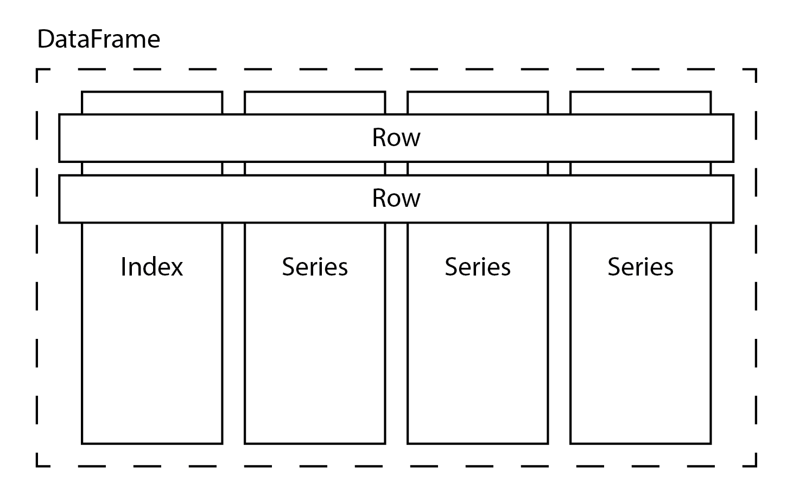

# 第三章：将数据输入神经网络

你可以使用许多技术将数据加载到神经网络中进行训练或预测。你使用什么技术取决于你的数据集有多大，以及你存储数据的格式是什么。在上一章中，我们已经看到了如何手动将数据传递给 CNTK 训练器。在本章中，我们将学习更多将数据输入神经网络的方法。

本章将覆盖以下主题：

+   使用小批量高效训练神经网络

+   处理小型内存数据集

+   处理大型数据集

+   控制小批量循环

# 技术要求

我们假设你已经在电脑上安装了最新版本的 Anaconda，并且已经按照第一章中的步骤，*开始使用 CNTK*，将 CNTK 安装到你的电脑上。本章的示例代码可以在我们的 GitHub 仓库中找到，地址是[`github.com/PacktPublishing/Deep-Learning-with-Microsoft-Cognitive-Toolkit-Quick-Start-Guide/tree/master/ch3`](https://github.com/PacktPublishing/Deep-Learning-with-Microsoft-Cognitive-Toolkit-Quick-Start-Guide/tree/master/ch3)。

在本章中，我们将在存储在 Jupyter 笔记本中的几个示例上进行操作。要访问示例代码，请在 Anaconda 提示符中运行以下命令，命令路径为你下载代码的目录：

```py
cd ch3
jupyter notebook
```

我们将在每个部分中提到相关的笔记本，以便你可以跟着做，并亲自尝试不同的技术。

查看以下视频，了解代码的实际应用：

[`bit.ly/2UczHuH`](http://bit.ly/2UczHuH)

# 使用小批量高效训练神经网络

在上一章中，我们讨论了如何构建和训练神经网络。在本章中，我们将讨论如何将数据输入 CNTK 训练器的各种方法。在深入了解每种数据处理方法的细节之前，让我们先仔细看看训练神经网络时数据发生了什么。

训练神经网络需要一些东西。正如我们在上一章中讨论的，你需要有一个基本的模型结构和损失函数。`trainer`和`learner`是最后的拼图部分，负责控制训练过程。

`trainer`执行四个步骤：

1.  它接受一批训练样本并将其输入到网络和`loss`函数中

1.  接下来，它将`loss`函数的输出通过`learner`处理。

1.  然后，它使用`learner`获取网络中参数的梯度集合

1.  最后，它使用梯度来确定网络中每个参数的新值

这个过程会对数据集中的所有样本重复进行，以便训练网络完成一个完整的 epoch。通常，你需要训练网络多个 epoch 才能获得最佳结果。

我们之前只讨论了训练神经网络时的单个样本。但这并不是 CNTK 内部发生的情况。

CNTK 和许多其他框架都使用小批量来训练神经网络。小批量是从数据集中提取的一组样本。本质上，小批量就是一个非常小的样本表格。它包含输入特征的预定义数量的样本，以及与神经网络目标数量相等的样本。

小批量在训练过程中通过网络传递，用于计算损失函数的输出。`loss`函数的输出不再是一个单一的值，而是一个值的列表，列表中的值等于小批量中的行数。然后，这个值的列表会传递给`learner`，从而为神经网络的每个参数计算出一组梯度。

现在，处理小批量时有一个问题。我们希望每个参数都有一个梯度来优化其值。但实际上我们得到的是梯度的列表。我们可以通过对每个参数的梯度计算平均值来解决这个问题。然后，使用平均梯度来更新神经网络中的参数。

使用小批量加速了训练过程，但也带来了一些代价。因为我们现在必须处理平均值，所以在计算模型参数的梯度时，会失去一些分辨率。由于平均所有计算得到的梯度，单个小批量的梯度可能为零。当你使用小批量训练神经网络时，模型的质量可能较低。

在开始训练神经网络之前，你需要自己设置每个小批量的样本数量。选择较大的小批量大小将加速训练，但会以质量为代价。较小的小批量大小训练较慢，但能产生更好的模型。选择合适的小批量大小是一个实验性的问题。

选择小批量大小时还有一个内存方面的考量。小批量大小取决于你机器中可用的内存。你会发现，你的显卡内存能够容纳的样本比普通计算机内存少。

接下来章节中描述的所有方法都会自动使用小批量。在本章后面的章节，*控制小批量循环*部分，我们将讨论如何在需要时控制小批量循环。

# 使用小型内存数据集

有许多方法可以将数据提供给 CNTK 训练器。你应该使用哪种技术取决于数据集的大小和数据的格式。首先让我们来看一下如何处理较小的内存数据集。

当你在 Python 中处理内存数据时，你很可能会使用像 Pandas 或 NumPy 这样的框架。这些框架以浮动点或对象数据为核心，处理向量和矩阵，并在处理数据时提供不同级别的便利性。

让我们逐一了解这些库，并探讨如何使用存储在这些库中的数据来训练你的神经网络。

# 使用 numpy 数组

我们将首先探索的库是 numpy。Numpy 是 Python 中最基本的库，用于对 n 维数组执行数学操作。它提供了一种高效的方式来存储计算机内存中的矩阵和向量。numpy 库定义了大量操作符来操作这些 n 维数组。例如，它有内置的函数来计算整个矩阵或矩阵中的行/列的平均值。

你可以通过按照本章开始时描述的步骤，打开`Training using numpy arrays.ipynb`笔记本，在浏览器中跟随本节中的任何代码。

让我们来看一下如何在 CNTK 中使用基于 numpy 的数据集。作为示例，我们将使用一个随机生成的数据集。我们将模拟一个二元分类问题的数据。假设我们有一组包含四个特征的观察数据。我们希望用我们的模型预测两个可能的标签。首先，我们需要生成一组标签，其中包含我们想要预测的标签的热编码向量表示。接下来，我们还需要一组特征，这些特征将作为我们模型的输入特征：

```py
import numpy as np

num_samples = 20000

label_mapping = np.eye(2)
y = label_mapping[np.random.choice(2,num_samples)].astype(np.float32)
X = np.random.random(size=(num_samples, 4)).astype(np.float32)
```

按照给定步骤操作：

1.  首先，导入`numpy`包，并使用`np`作为别名。

1.  然后，使用`np.eye`函数生成一个`label mapping`。

1.  然后，使用`np.random.choice`函数从生成的`label mapping`中收集`20,000`个随机样本。

1.  最后，使用`np.random.random`函数生成一个随机浮点值数组。

生成的标签映射是我们支持的可能类别的一个热编码表示，看起来像这样：

```py
[0, 1]
[1, 0]
```

生成的矩阵需要转换为 32 位浮点数，以匹配 CNTK 所期望的格式。没有这个步骤，你将看到一个错误，提示格式不是预期的类型。CNTK 要求你提供双精度或 float 32 的数据点。

让我们定义一个适配我们刚生成的数据集的基本模型：

```py
from cntk.layers import Dense, Sequential
from cntk import input_variable, default_options
from cntk.ops import sigmoid
from cntk.losses import binary_cross_entropy

with default_options(activation=sigmoid):
   model = Sequential([
        Dense(6),
        Dense(2)
    ])

features = input_variable(4)

z = model(features)
```

按照给定步骤操作：

1.  首先，从`layers`模块导入`Dense`和`Sequential`层函数。

1.  然后，导入`sigmoid`作为网络中各层的激活函数。

1.  然后，导入`binary_cross_entropy`函数作为`loss`函数来训练网络。

1.  接下来，定义网络的默认选项，提供`sigmoid`激活函数作为默认设置。

1.  现在，使用`Sequential`层函数创建模型。

1.  使用两个`Dense`层，一个具有`6`个神经元，另一个具有`2`个神经元，后者将作为输出层。

1.  初始化一个`input_variable`，它有`4`个输入特征，将作为网络的输入。

1.  最后，将`features`变量连接到神经网络以完成它。

该模型将具有四个输入和两个输出，匹配我们随机生成的数据集的格式。为了演示目的，我们插入了一个额外的隐藏层，包含六个神经元。

现在我们有了神经网络，接下来用我们的内存数据集来训练它：

```py
from cntk.learners import sgd
from cntk.logging import ProgressPrinter

progress_writer = ProgressPrinter(0)

labels = input_variable(2)
loss = binary_cross_entropy(z, labels)
learner = sgd(z.parameters, lr=0.1)

training_summary = loss.train((X,y), parameter_learners=[learner], callbacks=[progress_writer])
```

请按照以下步骤操作：

1.  首先，从`learners`模块导入`sgd`学习器

1.  接下来，从`logging`模块导入`ProgressPrinter`

1.  为标签定义一个新的`input_variable`

1.  为了训练模型，定义一个使用`binary_cross_entropy`函数的`loss`，并为其提供模型`z`和`labels`变量

1.  接下来，初始化`sgd`学习器，并为其提供模型参数和`labels`变量

1.  最后，调用`train`方法，并为其提供输入数据、`sgd`学习器以及`progress_printer`回调

你不必为`train`方法提供回调函数。但如果插入一个进度写入器来监控训练过程会很有用。没有这个，你无法真正看到训练过程中发生了什么。

当你运行示例代码时，它将产生类似于以下内容的输出：

```py
 average      since    average      since      examples
 loss       last     metric       last 
 ------------------------------------------------------
Learning rate per minibatch: 0.5
 1.4        1.4          0          0           512
 1.4        1.4          0          0          1536
 1.39       1.39          0          0          3584
 1.39       1.39          0          0          7680
 1.39       1.39          0          0         15872
```

它列出了每个迷你批次的学习平均损失、上一个迷你批次以来的损失以及度量标准。由于我们没有提供度量标准，度量列中的值将保持为`0`。在最后一列中，列出了神经网络看到的示例数量。

在之前的示例中，我们使用默认批次大小执行了`learner`。你可以使用`minibatch_size`关键字参数来控制批次大小：

```py
training_summary = loss.train((X,y), 
    parameter_learners=[learner], 
    callbacks=[progress_writer],
    minibatch_size=512)
```

将`minibatch_size`设置为更大的值将提高训练速度，但代价是模型可能会稍微变差。

尝试在示例代码中使用不同的迷你批次大小，观察它对模型性能的影响。即使是使用随机数据训练的模型也是如此。

# 使用 pandas 数据框

Numpy 数组是存储数据的最基本方式。Numpy 数组在可以包含的内容上有很大限制。一个单一的 n 维数组只能包含单一数据类型的数据。在许多实际应用场景中，你需要一个能够处理单个数据集内多种数据类型的库。例如，你会发现许多在线数据集的标签列是字符串类型，而数据集中的其他列则包含浮动点数。

Pandas 库让处理这些类型的数据集变得更加容易，许多开发者和数据科学家都在使用它。它是一个可以将存储在不同格式中的数据集作为 DataFrame 加载的库。例如，你可以读取存储为 JSON、CSV 甚至 Excel 格式的 DataFrame。

Pandas 引入了数据框（DataFrame）的概念，并带来了大量可以在数据框上运行的数学和统计函数。让我们看看 pandas 数据框的结构，以了解这个库是如何工作的：



pandas 中的 DataFrame 是由定义各个列的系列（series）组成的集合。每个 DataFrame 还有一个索引，允许你通过存储在索引中的键值查找 DataFrame 中特定的行。

DataFrame 独特之处在于，它在系列和数据集本身上定义了大量方法。例如，你可以调用`describe`方法来获取整个 DataFrame 的摘要统计信息。

对单个系列调用`describe`方法将为该特定列提供相同的摘要统计信息。

Pandas 是数据科学家和开发人员在 Python 中处理数据的广泛使用的工具。因为它如此广泛使用，了解如何使用 CNTK 处理存储在 pandas 中的数据非常重要。

在上一章中，我们加载了一个包含鸢尾花样本的数据集，并使用该数据集训练了一个分类模型。之前，我们使用了一个训练器实例来训练神经网络。当你对`loss`函数调用`train`时，也会发生类似的情况。`train`方法将自动为你创建一个训练器和一个会话，因此你无需手动操作。

在第二章，*使用 CNTK 构建神经网络*中，我们讨论了如何根据四个特性对三种鸢尾花的物种进行分类。你可以通过本书附带的示例代码文件，或者从 UCI 数据集档案[`archive.ics.uci.edu/ml/datasets/Iris`](https://archive.ics.uci.edu/ml/datasets/Iris)下载数据集来获取该文件。让我们看看如何在前一章中创建的网络上使用`train`方法来训练损失函数：

```py
from cntk import default_options, input_variable
from cntk.layers import Dense, Sequential
from cntk.ops import log_softmax, sigmoid

model = Sequential([
    Dense(4, activation=sigmoid),
    Dense(3, activation=log_softmax)
])

features = input_variable(4)

z = model(features)
```

我们之前用来分类花朵的模型包含一个隐藏层和一个输出层，输出层有三个神经元，以匹配我们可以预测的类别数。

为了训练模型，我们需要加载并预处理鸢尾花数据集，以便它与神经网络的预期布局和数据格式匹配：

```py
import numpy as np
import pandas as pd

df_source = pd.read_csv('iris.csv', 
    names=['sepal_length', 'sepal_width','petal_length','petal_width', 'species'], 
    index_col=False)

label_mapping = {
    'Iris-setosa': 0,
    'Iris-versicolor': 1,
    'Iris-virginica': 2
}

X = df_source.iloc[:, :4].values

y = df_source['species'].values
y = np.array([one_hot(label_mapping[v], 3) for v in y])

X = X.astype(np.float32)
y = y.astype(np.float32)
```

按照给定的步骤操作：

1.  首先，使用`read_csv`函数将数据集加载到内存中。

1.  接下来，创建一个字典，将数据集中标签与其对应的数字表示进行映射。

1.  使用`iloc`索引器选择`DataFrame`中的前四列。

1.  选择物种列作为数据集的标签。

1.  使用`label_mapping`映射数据集中的标签，并使用`one_hot`编码将它们转换为独热编码数组。

1.  将特征和映射后的标签都转换为浮点数，以便可以与 CNTK 一起使用。

标签以字符串形式存储在数据集中，CNTK 无法处理这些字符串值，它需要使用表示标签的独热编码向量。为了对标签进行编码，我们需要使用映射表和`one_hot`函数，您可以使用以下代码创建它：

```py
def one_hot(index, length):
    result = np.zeros(length)
    result[index] = index

    return result
```

按照给定的步骤操作：

1.  使用`np.zeros`函数创建一个大小为`length`的新向量，并用零填充它。

1.  选择提供的`index`处的元素，并将其值设置为`1`。

1.  返回`result`，以便在数据集中使用。

一旦我们获得了格式正确的 numpy 数组，我们可以像以前一样使用它们来训练我们的模型：

```py
from cntk.losses import cross_entropy_with_softmax
from cntk.learners import sgd 
from cntk.logging import ProgressPrinter

progress_writer = ProgressPrinter(0)

labels = input_variable(3)
loss = cross_entropy_with_softmax(z, labels)
learner = sgd(z.parameters, 0.1)

train_summary = loss.train((X,y), 
    parameter_learners=[learner], 
    callbacks=[progress_writer], 
    minibatch_size=16, 
    max_epochs=5)
```

按照给定的步骤操作：

1.  导入`cross_entropy_with_softmax`函数作为模型的损失函数。

1.  然后，导入`sgd`学习器以优化参数。

1.  之后，从`logging`模块导入`ProgressPrinter`以可视化训练进度。

1.  接下来，创建一个新的`ProgressPrinter`实例，用于记录优化器的输出。

1.  创建一个新的`input_variable`来存储训练标签。

1.  初始化`sgd`学习器，并给它模型的参数和一个学习率为`0.1`。

1.  最后，调用`train`方法并将训练数据、`learner`和`progress_writer`传递给它。此外，为`train`方法提供`minibatch_size`为`16`，并将`max_epochs`关键字参数设置为`5`。

`train`方法中`loss`函数的`max_epochs`关键字参数是可选的。如果你不提供该参数，`trainer`将训练模型一个 epoch。

我们使用`ProgressWriter`来生成训练过程的输出，以便我们监控训练过程的进展。你可以不使用它，但它对于理解训练过程中发生了什么非常有帮助。配置好进度写入器后，输出会类似于以下内容：

```py
average      since    average      since      examples
 loss       last     metric       last 
 ------------------------------------------------------
Learning rate per minibatch: 0.1
 1.1        1.1          0          0            16
 0.835      0.704          0          0            48
 0.993       1.11          0          0           112
 1.14       1.14          0          0            16
 0.902      0.783          0          0            48
 1.03       1.13          0          0           112
 1.19       1.19          0          0            16
 0.94      0.817          0          0            48
 1.06       1.16          0          0           112
 1.14       1.14          0          0            16
 0.907       0.79          0          0            48
 1.05       1.15          0          0           112
 1.07       1.07          0          0            16
 0.852      0.744          0          0            48
 1.01       1.14          0          0           112
```

由于我们使用与常规 numpy 数组相同的方法来训练网络，因此我们也可以控制批量大小。我们留给你尝试不同的批量大小设置，并发现哪个设置能产生最佳的模型。

# 处理大数据集

我们已经看过了 NumPy 和 Pandas 作为将内存中的数据集传递给 CNTK 进行训练的方式。但并非每个数据集都足够小，能够完全载入内存。对于包含图像、视频样本或声音样本的数据集尤其如此。当你处理更大的数据集时，你只希望一次加载数据集的小部分到内存中。通常，你只会加载足够的样本到内存中，以运行一个单一的 minibatch 训练。

CNTK 支持通过使用`MinibatchSource`处理更大的数据集。现在，`MinibatchSource`是一个可以从磁盘分块加载数据的组件。它可以自动随机化从数据源读取的样本。这有助于防止神经网络由于训练数据集中的固定顺序而过拟合。

`MinibatchSource`具有内置的转换管道。你可以使用这个管道来增强数据。当你处理如图像之类的数据时，这是一个非常有用的功能。当你训练一个基于图像的模型时，你希望确保即使图像处于奇怪的角度，也能被识别。转换管道允许你通过旋转从磁盘读取的原始图像来生成额外的样本。

`MinibatchSource`的一个独特特点是，它会在与训练过程分开的后台线程中加载数据。通过在单独的线程中加载数据，它可以提前加载 minibatch，这样你的显卡就不会因为这一过程而卡住。

在本章中，我们将限制在`MinibatchSource`的基本使用上。在第五章，《*与图像的工作*》和第六章，《*与时间序列数据的工作*》中，我们将探讨如何使用`MinibatchSource`组件处理图像和时间序列数据。

让我们探讨如何使用 minibatch 源处理内存外数据，以便处理更大的数据集，并将其用于训练神经网络。

# 创建 MinibatchSource 实例

在*与 pandas DataFrame 的工作*部分，我们处理了鸢尾花的例子。让我们回过头来，将使用来自 pandas DataFrame 的数据的代码替换为`MinibatchSource`。第一步是创建一个基本的`MinibatchSource`实例：

```py
from cntk.io import StreamDef, StreamDefs, MinibatchSource, CTFDeserializer, INFINITELY_REPEAT

labels_stream = StreamDef(field='labels', shape=3, is_sparse=False)
features_stream = StreamDef(field='features', shape=4, is_sparse=False)

deserializer = CTFDeserializer('iris.ctf', StreamDefs(labels=labels_stream, features=features_stream))

minibatch_source = MinibatchSource(deserializer, randomize=True)
```

按照给定的步骤操作：

1.  首先，从`io`模块导入用于 minibatch 源的组件。

1.  接下来，使用`StreamDef`类为标签创建流定义。使用标签字段并设置为从流中读取`3`个特征。确保使用`is_sparse`关键字参数并将其设置为`False`。

1.  然后，创建另一个`StreamDef`实例，并从输入文件中读取特征字段。此流具有`4`个特征。使用`is_sparse`关键字参数指定数据以密集向量形式存储。

1.  之后，初始化`deserializer`。提供`iris.ctf`文件作为输入，并通过将其包装在`StreamDefs`实例中来传递流定义。

1.  最后，使用`deserializer`创建`MinibatchSource`实例。

# 创建 CTF 文件

我们正在使用的数据来自`iris.ctf`文件，并存储在一种叫做**CNTK 文本格式**（**CTF**）的文件格式中。这是一种类似这样的文件格式：

```py
|features 0.1 2.0 3.1 5.4 |labels 0 1 0
|features 2.3 4.1 5.1 5.2 |labels 1 0 1
```

每一行包含我们神经网络的一个样本。每一行可以包含多个输入的值。每个输入前面都有一个竖线。每个输入的值由一个空格分隔。

`CTFDeserializer`可以通过使用我们在代码示例中初始化的流定义来读取文件。

为了获取我们刚刚创建的`MinibatchSource`实例的数据，您需要为我们的数据集创建一个 CTF 文件。目前没有官方的转换器可以将诸如**逗号分隔值**（**CSV**）这样的数据格式转换为 CTF 文件，因此您需要编写一些 Python 代码。您可以在本章的示例代码中的`Creating a CTF file.ipynb`笔记本中找到准备 CTF 文件以进行 minibatch 训练的代码。

让我们探讨如何使用 Python 创建 CTF 文件。第一步是将数据加载到内存中并转换为正确的格式：

```py
import pandas as pd
import numpy as np

df_source = pd.read_csv('iris.csv', 
    names=['sepal_length', 'sepal_width','petal_length','petal_width', 'species'], 
    index_col=False)

features = df_source.iloc[:,:4].values
labels = df_source['species'].values

label_mapping = {
    'Iris-setosa': 0,
    'Iris-versicolor': 1,
    'Iris-virginica': 2
}

labels = [one_hot(label_mapping[v], 3) for v in labels]
```

按照给定的步骤操作：

1.  在我们开始处理数据之前，导入`pandas`和`numpy`包，以便访问数据处理函数。

1.  首先，将`iris.csv`文件加载到内存中，并将其存储在`df_source`变量中。

1.  然后，使用`iloc`索引器获取前四列的内容作为特征。

1.  接下来，使用物种列中的数据作为我们数据集的标签。

1.  现在，创建一个`label_mapping`字典，用于在标签名称和其数字表示之间建立映射。

1.  最后，使用 Python 列表推导式和`one_hot`函数将标签转换为一组独热编码向量。

为了对标签进行编码，我们将使用一个名为`one_hot`的实用函数，你可以使用以下代码创建它：

```py
def one_hot(index, length):
    result = np.zeros(length)
    result[index] = 1

    return result
```

按照给定步骤操作：

1.  使用`np.zeros`函数生成一个指定`length`的空向量

1.  接下来，取指定`index`处的元素并将其设置为`1`

1.  最后，返回新生成的独热编码向量，以便你可以在代码的其余部分中使用它

一旦加载并预处理了数据，我们就可以将其存储到磁盘上的 CTF 文件格式中：

```py
with open('iris.ctf', 'w') as output_file:
    for index in range(0, features.shape[0]):
        feature_values = ' '.join([str(x) for x in np.nditer(features[index])])
        label_values = ' '.join([str(x) for x in np.nditer(labels[index])])

        output_file.write('|features {} |labels {}\n'.format(feature_values, label_values))
```

按照给定步骤操作：

1.  首先，我们打开`iris.ctf`文件进行写入

1.  然后，遍历数据集中的所有记录

1.  对于每条记录，创建一个新字符串，包含`features`向量的序列化值

1.  接下来，使用 Python 列表推导式将`labels`序列化为字符串

1.  最后，将`features`和`labels`写入文件

`features`和`labels`向量中的元素应由空格分隔。请注意，输出文件中的每个序列化数据片段都以管道字符和其名称为前缀。

# 将数据输入到训练会话中

要使用`MinibatchSource`进行训练，我们可以使用之前的相同训练逻辑。只不过这次，我们将使用`MinibatchSource`作为`train`方法在`loss`函数中的输入：

```py
from cntk.logging import ProgressPrinter
from cntk.train import Trainer, training_session

minibatch_size = 16
samples_per_epoch = 150
num_epochs = 30

input_map = {
    features: minibatch_source.streams.features,
    labels: minibatch_source.streams.labels
}

progress_writer = ProgressPrinter(0)

train_history = loss.train(minibatch_source, 
           parameter_learners=[learner],
           model_inputs_to_streams=input_map,
           callbacks=[progress_writer],
           epoch_size=samples_per_epoch,
           max_epochs=num_epochs)
```

按照给定步骤操作：

1.  首先，导入`ProgressPrinter`，这样我们就能记录训练会话的输出。

1.  接下来，导入`trainer`和`training_session`，你将需要这些来设置训练会话。

1.  然后，定义一组常量用于训练代码。`minibatch_size`用来控制每批次的样本数量，`samples_per_epoch`用来控制单个 epoch 中的样本数量，最后是`num_epochs`设置，用来控制训练的轮数。

1.  为网络的输入变量和小批量源中的流定义映射，这样 CNTK 就知道如何在训练期间读取数据。

1.  然后，用新的`ProgressPrinter`实例初始化`progress_writer`变量，用于记录训练过程中的输出。

1.  最后，在`loss`上调用`train`方法，提供`MinibatchSource`和`input_map`作为`model_inputs_to_stream keyword`参数。

当你从本章的示例代码中打开`Training with a minibatch source.ipynb`时，你可以运行此部分的代码。我们已经包括了一个`progress printer`实例，用于可视化训练会话的输出。运行代码后，你将看到类似以下的输出：

```py
average since average since examples loss    last  metric  last ------------------------------------------------------ Learning rate per minibatch: 0.1
1.21    1.21  0       0     32
1.15    1.12  0       0     96
1.09    1.09  0       0     32
1.03    1.01  0       0     96
0.999   0.999 0       0     32
0.999   0.998 0       0     96
0.972   0.972 0       0     32
0.968   0.966 0       0     96
0.928   0.928 0       0     32
[...]
```

# 控制小批量循环

在上一节中，我们已经看到了如何使用`MinibatchSource`配合 CTF 格式将数据传递给 CNTK 训练器。但是大多数数据集并不是以这种格式提供的。因此，除非你创建自己的数据集或将原始数据集转换为 CTF 格式，否则你不能使用这种格式。

CNTK 当前仅支持有限的`deserializers`，用于图像、文本和语音。你目前不能扩展这些反序列化器，这限制了你使用标准`MinibatchSource`的能力。你可以创建自己的`UserMinibatchSource`，但这是一个复杂的过程。所以，在这里我们不会向你展示如何构建自定义的`MinibatchSource`，而是看一下如何手动将数据传递给 CNTK 训练器。

让我们首先重建用于分类鸢尾花的模型：

```py
from cntk import default_options, input_variable
from cntk.layers import Dense, Sequential
from cntk.ops import log_softmax, sigmoid

model = Sequential([
    Dense(4, activation=sigmoid),
    Dense(3, activation=log_softmax)
])

features = input_variable(4)

z = model(features)
```

模型与前几节保持一致；它是一个基本的分类模型，具有四个输入神经元和三个输出神经元。我们将使用类别交叉熵损失，因为这是一个多类别分类问题。

让我们使用手动小批量循环来训练模型：

```py
import pandas as pd
import numpy as np
from cntk.losses import cross_entropy_with_softmax
from cntk.logging import ProgressPrinter
from cntk.learners import sgd
from cntk.train import Trainer

labels = input_variable(3)
loss = cross_entropy_with_softmax(z, labels)
learner = sgd(z. parameters, 0.1)

progress_writer = ProgressPrinter(0)
trainer = Trainer(z, (loss, None), learner, progress_writer)

input_data = pd.read_csv('iris.csv', 
    names=['sepal_length', 'sepal_width','petal_length','petal_width', 'species'], 
    index_col=False, chunksize=16)

for df_batch in input_data:
    feature_values = df_batch.iloc[:,:4].values
    feature_values = feature_values.astype(np.float32)

    label_values = df_batch.iloc[:,-1]
    label_values = label_values.map(lambda x: label_mapping[x])
    label_values = label_values.values

    encoded_labels = np.zeros((label_values.shape[0], 3))
    encoded_labels[np.arange(label_values.shape[0]), label_values] = 1.

    trainer.train_minibatch({features: feature_values, labels: encoded_labels})
```

按照给定的步骤进行：

1.  首先，导入训练神经网络所需的组件。

1.  接下来，定义一个`input_variable`来存储标签。

1.  然后，使用`cross_entropy_with_softmax`函数定义`loss`函数，并将神经网络的输出和标签变量连接到它。

1.  之后，使用神经网络的参数和学习率`0.1`初始化`learner`。

1.  创建一个新的`ProgressWriter`实例，用于记录训练过程的输出。

1.  接下来，创建`Trainer`类的新实例，并使用网络、`loss`、`learner`和`progress_writer`对其进行初始化。

1.  初始化网络后，从磁盘加载数据集，并使用`chunksize`关键字参数，使其分块读取，而不是一次性将整个数据集加载到内存中。

1.  现在创建一个新的`for`循环，遍历数据集的各个数据块。

1.  通过提取适当格式的`labels`和`features`来处理每个数据块。使用前四列作为神经网络的输入特征，最后一列作为标签。

1.  使用`one_hot`函数将标签值转换为独热编码向量，该函数来自于*与 pandas DataFrame 一起使用*章节。

1.  最后，调用`trainer`上的`train_minibatch`方法，并将`features`和`labels`传递给它。

请注意，我们没有编写任何代码来运行多轮训练。如果你需要，你可以通过在另一个`for`循环中包装读取和处理 CSV 文件中小批量数据的逻辑来实现。可以参考本章示例代码中的`Training with a manual minibatch loop.ipynb`笔记本来尝试一下。

你会发现，使用手动小批量循环准备单个小批量需要更多的工作。这主要是因为我们没有使用标准`MinibatchSource`逻辑中的自动分块功能。此外，由于我们没有事先对数据集进行预处理，我们需要在训练过程中对标签进行编码。

当你必须处理大型数据集且无法使用`MinibatchSource`时，手动小批量循环是最后的选择。然而，这种方法更强大，因为你可以更好地控制模型的训练过程。如果你希望对每个小批量执行复杂的操作或在训练过程中更改设置，使用手动小批量循环会非常有用。

# 总结

在本章中，我们探讨了如何使用小型和大型数据集来训练神经网络。对于较小的数据集，我们讨论了如何通过在`loss`函数上调用`train`方法来快速训练模型。对于较大的数据集，我们则探索了如何同时使用`MinibatchSource`和手动小批量循环来训练网络。

使用正确的训练方法可以显著影响训练模型所需的时间以及最终模型的效果。现在你可以在使用内存数据和分块读取数据之间做出明智的选择。确保你通过调整小批量大小设置来进行实验，看看哪个设置最适合你的模型。

直到本章为止，我们还没有研究如何监控你的模型。我们确实看过一些使用进度写入器的片段，帮助你可视化训练过程，但这些功能相对有限。

在下一章，我们将学习如何衡量神经网络的性能。我们还将探讨如何使用不同的可视化和监控工具来监控和调试 CNTK 模型。
