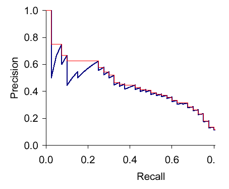

# 第四章：验证模型性能

当你构建了一个深度学习模型并使用神经网络时，你面临的问题是，模型在面对新数据时的预测表现如何。模型做出的预测是否足够准确，以便在实际场景中使用？在本章中，我们将讨论如何衡量深度学习模型的性能。我们还将深入研究工具，帮助你监控和调试你的模型。

在本章结束时，你将对不同的验证技术有一个扎实的理解，这些技术可以用来衡量你的模型性能。你还将了解如何使用诸如 TensorBoard 之类的工具，深入探讨你的神经网络的细节。最后，你将知道如何应用不同的可视化方法来调试你的神经网络。

本章将涵盖以下主题：

+   选择一个好的策略来验证模型性能

+   验证分类模型的性能

+   验证回归模型的性能

+   衡量大数据集的性能

+   监控你的模型

# 技术要求

我们假设你已经在电脑上安装了最新版本的 Anaconda，并且已经按照第一章的步骤，*开始使用 CNTK*，在电脑上安装了 CNTK。本章的示例代码可以在我们的 GitHub 仓库中找到，地址是[`github.com/PacktPublishing/Deep-Learning-with-Microsoft-Cognitive-Toolkit-Quick-Start-Guide/tree/master/ch4`](https://github.com/PacktPublishing/Deep-Learning-with-Microsoft-Cognitive-Toolkit-Quick-Start-Guide/tree/master/ch4)。

在本章中，我们将在 Jupyter Notebooks 中进行一些示例操作。要访问示例代码，请在你下载代码的目录中，在 Anaconda 提示符下运行以下命令：

```py
cd ch4
jupyter notebook
```

我们将在每个部分提到相关的 notebook，以便你可以跟着做并亲自尝试不同的技术。

查看以下视频，看看代码的实际运行：

[`bit.ly/2TVuoR3`](http://bit.ly/2TVuoR3)

# 选择一个好的策略来验证模型性能

在我们深入讨论不同模型的验证技术之前，先简单谈一下深度学习模型的验证方法。

当你构建一个机器学习模型时，你是用一组数据样本来训练它。机器学习模型从这些样本中学习并推导出一般规则。当你将相同的样本输入模型时，它将在这些样本上表现得很好。然而，当你输入一些新的、在训练时没有使用过的样本时，模型的表现会有所不同。它可能在这些样本上做得更差。这是因为你的模型总是倾向于偏向它之前见过的数据。

但我们不希望模型仅仅擅长预测它之前见过的样本的结果。它需要对模型之前没有见过的样本表现良好，因为在生产环境中，你将会得到不同的输入，需要预测结果。为了确保我们的模型表现良好，我们需要使用一组未用于训练的样本来验证它。

让我们来看看两种不同的创建数据集用于验证神经网络的方法。首先，我们将探讨如何使用保留数据集。之后，我们将重点介绍创建单独验证数据集的更复杂方法。

# 使用保留数据集进行验证

创建一个数据集来验证神经网络的第一个也是最简单的方法就是使用保留集。你将从训练中保留一组样本，并在训练完成后使用这些样本来衡量模型的性能：


训练样本与验证样本之间的比例通常是 80%的训练样本和 20%的测试样本。这确保了你有足够的数据来训练模型，同时也有足够的样本来获得准确的性能度量。

通常，你会从主数据集中随机选择样本来包含在训练集和测试集中。这确保了在各个集合之间能够均匀分配样本。

你可以使用`train_test_split`函数来自`scikit-learn`库来生成你自己的保留集。该函数接受任意数量的数据集，并根据`train_size`或`test_size`关键词参数将其分成两个部分：

```py
from sklearn.model_selection import train_test_split

X_train, X_test, y_train, y_test = train_test_split(X, y, test_size=0.2)
```

每次运行训练会话时，随机划分数据集是一个好的做法。深度学习算法（例如在 CNTK 中使用的算法）高度依赖于随机数生成器，以及在训练过程中你为神经网络提供样本的顺序。因此，为了平衡样本顺序的影响，你需要每次训练模型时都对数据集的顺序进行随机化。

使用保留集在你想快速衡量模型性能时非常有效。当你有一个大的数据集或训练时间较长的模型时，这种方法也非常有用。但使用保留法也有一些缺点。

你的模型对训练过程中提供的样本顺序非常敏感。此外，每次你开始新的训练时，计算机中的随机数生成器会提供不同的值来初始化神经网络中的参数。这可能导致性能指标的波动。有时，你会得到非常好的结果，但有时也会得到很差的结果。最终，这种情况是不可取的，因为它不可靠。

在对包含应作为单个输入处理的样本序列的数据集进行随机化时要小心，例如在处理时间序列数据集时。像 `scikit-learn` 这样的库并不正确地处理这类数据集，你可能需要编写自己的随机化逻辑。

# 使用 k 折交叉验证

你可以通过使用一种叫做 k 折交叉验证的技术来提高模型性能度量的可靠性。交叉验证执行的技术与留出集相同。但它执行多次—通常是 5 到 10 次：


k 折交叉验证的过程如下：首先，将数据集划分为训练集和测试集。然后使用训练集训练模型。最后，使用测试集计算模型的性能度量。这个过程会重复进行所需的次数—通常是 5 到 10 次。在交叉验证过程结束时，会计算所有性能度量的平均值，得到最终的性能度量。大多数工具还会给出各个值，以便你看到不同训练运行之间的差异。

交叉验证给你提供了更稳定的性能衡量，因为你使用了更现实的训练和测试场景。在生产中，样本的顺序是未定义的，这可以通过多次运行相同的训练过程来模拟。此外，我们使用了单独的留出集来模拟未见过的数据。

使用 k 折交叉验证在验证深度学习模型时会消耗大量时间，所以要明智地使用它。如果你仍在进行模型设置的实验，最好使用基本的留出技术。稍后，当你完成实验后，可以使用 k 折交叉验证来确保模型在生产环境中的表现良好。

请注意，CNTK 不支持执行 k 折交叉验证。你需要编写自己的脚本来实现这一功能。

# 那么，什么是欠拟合和过拟合呢？

当你开始收集神经网络的度量时，无论是使用留出数据集还是应用 k 折交叉验证，你会发现训练数据集和验证数据集的输出度量是不同的。在本节中，我们将看看如何利用收集的度量信息来检测模型的过拟合和欠拟合问题。

当模型发生过拟合时，它在训练过程中见过的样本上表现得非常好，但在新样本上却表现不好。你可以通过查看度量来检测过拟合。当测试集上的度量低于训练集上的相同度量时，你的模型就发生了过拟合。

过拟合对业务有很大负面影响，因为你的模型无法理解如何处理新的样本。但在模型中有一些过拟合是合乎逻辑的；这是预期的，因为你希望最大化模型的学习效果。

过拟合的问题在模型训练时所用的数据集无法代表其应用的真实世界环境时会变得更严重。这样，你最终会得到一个过度拟合数据集的模型。它会在新样本上产生随机输出。遗憾的是，你无法检测到这种类型的过拟合。发现这个问题的唯一方法是将模型投入生产，使用适当的日志记录和用户反馈来衡量模型的表现。

与过拟合类似，你也可能遇到欠拟合的模型。这意味着模型没有从训练集学到足够的知识，无法预测有用的输出。你可以通过性能指标轻松检测到这一点。通常，性能指标会比你预期的要低。实际上，当你开始训练第一个周期时，模型会出现欠拟合，并随着训练的进行，欠拟合程度会逐渐减小。

一旦模型训练完成，它仍然可能会出现欠拟合。你可以通过查看训练集和测试集的指标来检测这一点。当测试集的指标高于训练集的指标时，你的模型就是欠拟合的。你可以通过仔细查看模型的设置并对其进行调整，以确保下次训练时模型表现更好。你也可以尝试训练更长时间，看看是否有帮助。

监控工具有助于检测模型的欠拟合和过拟合。因此，确保你使用这些工具。我们将在后面的*监控你的模型*一节中讨论如何在 CNTK 中使用它们。

# 验证分类模型的性能

在上一节中，*选择合适的策略来验证模型性能*，我们讨论了为你的神经网络选择一个好的验证策略。在接下来的几节中，我们将深入探讨为不同类型的模型选择度量标准。

当你构建分类模型时，你需要寻找能够表达正确分类样本数量的度量标准。你可能还会关心测量错误分类的样本数量。

你可以使用混淆矩阵——一个将预测输出与期望输出进行对比的表格——来详细了解模型的性能。这可能变得有些复杂，所以我们也将探讨一种使用 F-measure 来衡量模型性能的方法。

# 使用混淆矩阵验证你的分类模型

让我们仔细看看如何使用混淆矩阵来衡量分类模型的性能。为了理解混淆矩阵的工作原理，我们来为一个二分类模型创建一个混淆矩阵，该模型预测信用卡交易是正常的还是欺诈的：

|  | **实际欺诈** | **实际正常** |
| --- | --- | --- |
| **预测欺诈** | 真正例 | 假正例 |
| **预测正常** | 假阴性 | 真阴性 |

样本的混淆矩阵包含两列和两行。我们有一列表示欺诈类别，另一列表示正常类别。我们还为欺诈和正常类别添加了行。表格中的单元格将包含数字，告诉我们有多少样本被标记为真正例、真阴性、假正例和假阴性。

当模型正确预测某笔交易为欺诈时，我们称之为真正例。当我们预测为欺诈，但该交易本应不被标记为欺诈时，我们称之为假正例。

您可以从混淆矩阵计算出许多不同的东西。首先，您可以根据混淆矩阵中的值计算精度：


精度告诉你我们预测的所有样本中有多少是正确预测的。高精度意味着你的模型很少出现假正例。

我们可以根据混淆矩阵计算的第二个指标是召回率指标：


召回率告诉你数据集中有多少欺诈案例实际上被模型检测到。高召回率意味着你的模型在发现欺诈案例方面表现良好。

最后，您可以计算模型的整体准确度：


整体准确度告诉你模型作为整体的表现如何。但在数据集不平衡时使用这个指标是有风险的。例如：如果你有 100 个样本，其中 5 个标记为欺诈，95 个标记为正常，那么如果对所有样本都预测为正常，得到的准确度为*0.95*。这看起来很高，但我们只是在自欺欺人。

计算平衡准确度要好得多。为此，我们需要知道模型的精度和特异性。我们已经知道如何计算模型的精度。我们可以使用以下公式计算特异性：


特异性告诉我们模型在检测样本是正常而非欺诈时的表现如何。它是精度的完全反向，精度告诉我们模型在检测欺诈时的表现如何。

一旦我们获得了特异性，我们可以将其与精度指标结合，计算平衡准确度：


平衡准确度告诉我们模型在将数据集分为欺诈和正常案例时的表现如何，这正是我们所期望的。让我们回到之前的准确度度量，并使用平衡版本的准确度指标重新尝试：


记住，我们有 100 个样本，其中 5 个应该标记为欺诈。当我们将所有样本都预测为正常时，我们的精确度为 *0.0*，因为我们没有正确预测任何欺诈案例。特异度为 *0.95*，因为在 100 个样本中，我们错误地将 5 个预测为正常。最终结果是一个平衡准确度 *0.475*，显然这个值并不高。

现在你对混淆矩阵的外观和工作原理有了基本了解，让我们谈谈更复杂的情况。当你有一个多类分类模型，且类别数超过两个时，你需要用更多的行和列来扩展矩阵。

例如：当我们为一个预测三种可能类别的模型创建混淆矩阵时，可能会得到以下结果：

|  | **实际 A** | **实际 B** | **实际 C** |
| --- | --- | --- | --- |
| **预测为 A** | 91 | 75 | 60 |
| **预测为 B** | 5 | 15 | 30 |
| **预测为 C** | 4 | 10 | 10 |

我们仍然可以计算该矩阵的精确度、召回率和特异度。但这样做更复杂，而且只能逐类进行。例如：当你想要计算 A 类的精确度时，你需要取 A 类的真正例率，*91*，然后将其除以实际为 A 但被预测为 B 和 C 的样本数，总共有 `9` 个。这就得到了以下计算：


计算召回率、特异度和准确率的过程也差不多。要获得指标的整体值，你需要对所有类进行平均计算。

有两种策略可以用来计算平均指标，比如精确度、召回率、特异度和准确率。你可以选择计算微平均或宏平均。我们首先来探讨使用精确度指标的宏平均：


要计算精确度指标的宏平均，我们首先将所有类别的精确度值相加，然后除以类别的数量，`k`。宏平均不考虑类别的不平衡。例如：A 类可能有 100 个样本，而 B 类只有 20 个样本。计算宏平均会导致结果失衡。

在处理多类分类模型时，最好为不同的指标—精确度、召回率、特异度和准确率—使用微平均。我们来看看如何计算微平均精确度：


首先，我们将每个类别的所有真正例相加，然后将其除以每个类别的真正例和假阴性的总和。这样我们就能更平衡地看待不同的指标。

# 使用 F-measure 作为混淆矩阵的替代

虽然使用精确度和召回率可以帮助你了解模型的性能，但它们不能同时最大化。这两个度量之间有着密切的关系：



让我们看看精确度和召回率之间的关系是如何体现的。假设你想使用深度学习模型将细胞样本分类为癌症或正常。理论上，要实现模型的最大精确度，你需要将预测数量减少到 1。这给你提供了最大机会达到 100%精确度，但召回率会变得非常低，因为你错过了很多可能的癌症病例。当你想要最大化召回率，尽可能多地检测到癌症病例时，你需要进行尽可能多的预测。但这会降低精确度，因为增加了出现假阳性的可能性。

实际上，你会发现自己在精确度和召回率之间进行平衡。你应该主要追求精确度还是召回率，取决于你希望模型预测的内容。通常，你需要与模型的用户进行沟通，以确定他们认为最重要的是什么：低假阳性数量，还是高概率发现那一个患有致命疾病的病人。

一旦你在精确度和召回率之间做出选择，你需要找到一种方法来用度量表达这一选择。F-度量允许你做到这一点。F-度量表示精确度和召回率之间的调和平均值：


F-度量的完整公式包括一个额外的参数 `B`，它被设置为 1，以使精确度和召回率的比例相等。这就是所谓的 F1-度量，也是你几乎在所有工具中会遇到的标准。它给召回率和精确度赋予相等的权重。当你想强调召回率时，可以将 `B` 值设置为 2。或者，当你想强调精确度时，可以将 `B` 值设置为 0.5。

在下一节中，我们将学习如何使用 CNTK 中的混淆矩阵和 F-度量来衡量分类模型的性能。

# 在 CNTK 中衡量分类性能

让我们看看如何使用 CNTK 的度量函数为我们在第二章《使用 CNTK 构建神经网络》中使用的花卉分类模型创建一个混淆矩阵。

你可以通过打开本章示例文件中的 `Validating performance of classification models.ipynb` 笔记本文件来跟随这一节的代码。我们将集中讨论这一节的验证代码。示例代码还包含了如何为模型预处理数据的更多细节。

在我们开始训练和验证模型之前，我们需要准备好训练数据集。我们将把数据集拆分为单独的训练集和测试集，以确保能够正确评估模型的性能：

```py
from sklearn.model_selection import train_test_split

X_train, X_test, y_train, y_test = train_test_split(X,y, test_size=0.2, stratify=y)
```

首先，我们将从`sklearn.model_selection`包中导入`train_test_split`函数。然后，我们将特征`X`和标签`y`传递给该函数进行拆分。我们将使用 20%的样本用于测试。

请注意，我们正在使用`stratify`关键字参数。因为我们正在验证一个分类模型，所以我们希望测试集和训练集中的各类别之间能够保持良好的平衡。理想情况下，每个类别在测试集和训练集中的分布应当相同。当你将类别或标签列表传递给`stratify`关键字时，`scikit-learn`会基于这些标签均匀地分配样本到训练集和测试集中。

现在我们已经有了训练集和测试集，让我们开始训练模型：

```py
from cntk.losses import cross_entropy_with_softmax
from cntk.learners import sgd 
from cntk.logging import ProgressPrinter

progress_writer = ProgressPrinter(0)
loss = cross_entropy_with_softmax(z, labels)
learner = sgd(z.parameters, 0.1)

train_summary = loss.train((X_train,y_train), 
                           parameter_learners=[learner], 
                           callbacks=[progress_writer], 
                           minibatch_size=16, max_epochs=15)
```

我们将整个数据集通过训练函数运行，总共进行 15 个周期的训练。我们还包括了一个进度条，以便可视化训练过程。

此时，我们还不知道模型的表现如何。我们知道在 15 个训练周期内，损失值有所下降。但问题是，这个下降程度足够吗？让我们通过将验证样本输入模型并创建一个混淆矩阵来找出答案：

```py
from sklearn.metrics import confusion_matrix

y_true = np.argmax(y_test, axis=1)
y_pred = np.argmax(z(X_test), axis=1)

matrix = confusion_matrix(y_true=y_true, y_pred=y_pred)

print(matrix)
```

我们使用`scikit-learn`中的`confusion_matrix`函数来创建混淆矩阵。这个函数需要真实标签和预测标签。这两个标签需要以 numpy 数组的形式存储，并且数组中的数值表示标签。我们没有这些数值，我们只有标签的二进制表示，因为模型要求的是这个格式。为了修正这个问题，我们需要将标签的二进制表示转换为数字表示。你可以通过调用`numpy`包中的`argmax`函数来实现。`confusion_matrix`函数的输出是一个 numpy 数组，类似于这样：

```py
[[ 8 0 0]
 [ 0 4 6]
 [ 0 0 10]]
```

混淆矩阵有三行三列，因为我们模型可以预测三种可能的类别。输出结果本身不太容易阅读。你可以使用另一个叫做`seaborn`的包将这个表格转换为热力图：

```py
import seaborn as sns
import matplotlib.pyplot as plt

g = sns.heatmap(matrix, 
                annot=True, 
                xticklabels=label_encoder.classes_.tolist(), 
                yticklabels=label_encoder.classes_.tolist(), 
                cmap='Blues')

g.set_yticklabels(g.get_yticklabels(), rotation=0)

g.set_xlabel('Predicted species')
g.set_ylabel('Actual species')
g.set_title('Confusion matrix for iris prediction model')

plt.show()
```

首先，我们基于混淆矩阵创建一个新的热力图。我们传入在数据集预处理时使用的`label_encoder`的类别，用于设置行和列的标签。

标准的热力图需要一些调整才能更易读。我们使用了一个自定义的热力图配色方案。我们还在 X 轴和 Y 轴上使用了自定义标签。最后，我们添加了标题并显示了图表：


标准热力图

从混淆矩阵来看，你可以迅速了解模型的表现。在这个例子中，模型漏掉了相当多的 Iris-versicolor 类别的样本。仅有 60%的该物种的花朵被正确分类。

虽然混淆矩阵提供了很多关于模型在不同类别上表现的详细信息，但有时获取一个单一的性能指标可能更有用，这样你就可以轻松地比较不同的实验。

获取单一性能指标的一种方法是使用 CNTK 中的`classification_error`度量。它计算被误分类样本的比例。

为了使用它，我们需要修改训练代码。我们不再只是拥有一个`loss`函数来优化模型，而是还要包含一个指标。之前我们只创建了一个`loss`函数实例，这一次我们需要编写一个`criterion`函数，生成一个组合的`loss`和`metric`函数，以便在训练过程中使用。以下代码演示了如何操作：

```py
import cntk

@cntk.Function
def criterion_factory(output, target):
    loss = cntk.losses.cross_entropy_with_softmax(output, target)
    metric = cntk.metrics.classification_error(output, target)

    return loss, metric
```

按照给定的步骤操作：

1.  首先，创建一个新的 Python 函数，将我们的模型作为`output`参数，并将我们想要优化的目标作为`output`参数。

1.  在函数内，创建一个`loss`函数，并为其提供`output`和`target`。

1.  接下来，创建一个`metric`函数，并为其提供`output`和`target`。

1.  在函数的最后，返回一个元组，元组的第一个元素是`loss`函数，第二个元素是`metric`函数。

1.  用`@cntk.Function`标记该函数。这将包装`loss`和`metric`，以便我们可以在其上调用`train`方法训练模型，并调用`test`方法来验证模型。

一旦我们拥有了组合的`loss`和`metric`函数工厂，就可以在训练过程中使用它：

```py
from cntk.losses import cross_entropy_with_softmax
from cntk.learners import sgd 
from cntk.logging import ProgressPrinter

progress_writer = ProgressPrinter(0)
loss = criterion_factory(z, labels)
learner = sgd(z.parameters, 0.1)

train_summary = loss.train((X_train,y_train), 
                           parameter_learners=[learner], 
                           callbacks=[progress_writer], 
                           minibatch_size=16, max_epochs=15)
```

按照给定的步骤操作：

1.  首先，从`losses`模块导入`cross_entropy_with_softmax`函数。

1.  接下来，从`learners`模块导入`sgd`学习器。

1.  同时，从`logging`模块导入`ProgressPrinter`，以便记录训练过程的输出。

1.  然后，创建一个新的实例`progress_writer`，用于记录训练过程的输出。

1.  之后，使用新创建的`criterion_factory`函数创建`loss`，并将模型变量`z`和`labels`变量作为输入。

1.  接下来，使用`sgd`函数创建`learner`实例，并为其提供参数以及学习率`0.1`。

1.  最后，使用训练数据、`learner`和`progress_writer`调用`train`方法。

当我们调用`loss`函数时，我们会得到略微不同的输出。除了损失值，我们还可以看到训练过程中`metric`函数的输出。在我们的例子中，`metric`的值应该随着时间的推移而增加：

```py
 average      since    average      since      examples
 loss       last     metric       last 
 ------------------------------------------------------
Learning rate per minibatch: 0.1
 1.48       1.48       0.75       0.75            16
 1.18       1.03       0.75       0.75            48
 0.995      0.855      0.518      0.344           112
 1.03       1.03      0.375      0.375            16
 0.973      0.943      0.396      0.406            48
 0.848      0.753      0.357      0.328           112
 0.955      0.955      0.312      0.312            16
 0.904      0.878      0.375      0.406            48
```

最后，当我们完成训练时，可以使用`test`方法来计算分类错误，该方法基于我们之前创建的测试集，使用`loss`/`metric`组合函数：

```py
loss.test((X_test, y_test))
```

当你在`loss`函数上执行`test`方法，并使用数据集时，CNTK 会将你提供的样本作为该函数的输入，并基于输入特征`X_test`进行预测。然后，它会将预测结果和存储在`y_test`中的值一起传入我们在`criterion_factory`函数中创建的`metric`函数。这会生成一个表示指标的单一标量值。

我们在这个示例中使用的`classification_error`函数衡量了真实标签和预测标签之间的差异。它返回一个表示被错误分类的样本百分比的值。

`classification_error`函数的输出应该与我们在创建混淆矩阵时看到的结果一致，类似于下面的样子：

```py
{'metric': 0.36666666666666664, 'samples': 30}
```

结果可能会有所不同，因为初始化模型时使用的随机数生成器。你可以通过以下代码为随机数生成器设置固定的随机种子：

```py
import cntk
import numpy 

cntk.cntk_py.set_fixed_random_seed(1337)
numpy.random.seed = 1337
```

这将修正一些输出的变异性，但并不能修正所有变异。CNTK 中有一些组件会忽略固定的随机种子，每次运行训练代码时仍然会生成不同的结果。

CNTK 2.6 包括了`fmeasure`函数，它实现了我们在“*使用 F 值作为替代混淆矩阵*”章节中讨论的 F 值。你可以通过在定义`criterion factory`函数时，将对`cntk.metrics.classification_error`的调用替换为对`cntk.losses.fmeasure`的调用，来在训练代码中使用`fmeasure`：

```py
import cntk

@cntk.Function
def criterion_factory(output, target):
    loss = cntk.losses.cross_entropy_with_softmax(output, target)
    metric = cntk.losses.fmeasure(output, target)

    return loss, metric
```

再次运行训练代码将生成不同的`loss.test`方法调用输出：

```py
{'metric': 0.831014887491862, 'samples': 30}
```

与之前的示例一样，输出可能会有所不同，因为随机数生成器在初始化模型时的使用方式不同。

# 验证回归模型的性能

在前面的章节“*验证分类模型性能*”中，我们讨论了如何验证分类模型的性能。现在让我们来看一下如何验证回归模型的性能。

回归模型与分类模型不同，因为对于个体样本没有二进制的对错衡量标准。相反，你希望衡量预测值与实际值之间的接近程度。我们越接近期望的输出，模型的表现就越好。

在本节中，我们将讨论三种衡量用于回归的神经网络性能的方法。我们将首先讨论如何使用不同的错误率函数来衡量性能。然后，我们将讨论如何使用决定系数进一步验证回归模型。最后，我们将使用残差图来详细了解我们的模型表现。

# 衡量预测准确性

首先，我们来看看验证回归模型的基本概念。正如我们之前提到的，在验证回归模型时，你无法真正判断预测是对还是错。你希望预测值尽可能接近实际值，但一个小的误差范围是可以接受的。

你可以通过查看回归模型的预测值与实际值之间的距离来计算预测的误差范围。这个误差可以用一个简单的公式表示，像这样：


首先，我们计算预测值（带帽的`y`）与实际值（`y`）之间的距离并对其进行平方处理。为了得到模型的总体误差率，我们需要将这些平方的距离相加并计算平均值。

需要平方运算符将预测值（带帽的`y`）和实际值（`y`）之间的负距离转换为正距离。如果没有这个步骤，我们会遇到问题：例如，在一个样本中距离为+100，接下来的样本中距离为-100，那么最终的错误率将正好是 0。显然，这并不是我们想要的。平方运算符为我们解决了这个问题。

因为我们对预测值与实际值之间的距离进行了平方处理，所以我们对计算机的大错误进行了更多的惩罚。

`均方`误差函数可以作为验证的指标，也可以作为训练过程中的损失函数。在数学上，这两者没有区别。这样可以让我们在训练过程中更容易看到回归模型的性能。你只需要看损失值，就能大致了解模型的表现。

需要理解的是，使用均方误差函数你得到的是一个距离值。这并不是衡量模型表现好坏的绝对标准。你需要决定预测值与实际值之间的最大可接受距离。例如，你可以规定 90%的预测结果与实际值之间的最大差距应为 5%。这对模型的用户来说非常重要，因为他们通常希望得到某种形式的保证，确保模型的预测在某些限制范围内。

如果你正在寻找表达误差范围的性能数据，那么你可能不会发现`均方`误差函数有什么用处。相反，你需要一个表达绝对误差的公式。你可以使用`平均绝对`误差函数来做到这一点：


这个方法计算预测值与实际值之间的绝对距离，并将其求和，然后取平均值。这将给你一个更容易理解的数值。例如，当你讨论房价时，向用户展示一个 5000 美元的误差范围比展示一个 25000 美元的平方误差范围要容易理解得多。后者看起来似乎很大，但实际上并不是，因为它是一个平方值。

我们将专注于如何使用 CNTK 中的指标来验证回归模型。但也要记得与模型的用户进行沟通，了解什么样的性能表现才算足够好。

# 在 CNTK 中衡量回归模型性能

现在我们已经了解了如何从理论上验证回归模型，接下来让我们看看如何结合使用我们刚刚讨论的各种指标与 CNTK。在本节中，我们将使用以下代码处理一个预测汽车油耗（每加仑多少英里）的模型：

```py
from cntk import default_options, input_variable
from cntk.layers import Dense, Sequential
from cntk.ops import relu

with default_options(activation=relu):
    model = Sequential([
        Dense(64),
        Dense(64),
        Dense(1,activation=None)
    ])

features = input_variable(X.shape[1])
target = input_variable(1)

z = model(features)
```

按照以下步骤操作：

1.  首先，从`cntk`包中导入所需的组件。

1.  接下来，使用`default_options`函数定义默认激活函数。在本例中，我们使用`relu`函数。

1.  创建一个新的`Sequential`层集，并提供两个具有`64`个神经元的`Dense`层。

1.  向`Sequential`层集添加额外的`Dense`层，并设置为`1`个神经元且不带激活函数。这一层将作为输出层。

1.  创建网络后，在输入特征上创建一个输入变量，并确保其形状与我们将用于训练的特征相同。

1.  创建另一个大小为 1 的`input_variable`，用于存储神经网络的预期值。

输出层没有分配激活函数，因为我们希望它是线性的。当你在层中留出激活函数时，CNTK 会使用一个恒等函数，该层不会对数据应用非线性变换。这对于回归场景很有用，因为我们不希望限制输出在特定值范围内。

要训练模型，我们需要拆分数据集并进行一些预处理：

```py
from sklearn.preprocessing import StandardScaler
from sklearn.model_selection import train_test_split

X = df_cars.drop(columns=['mpg']).values.astype(np.float32)
y = df_cars.iloc[:,0].values.reshape(-1,1).astype(np.float32)

scaler = StandardScaler()
X = scaler.fit_transform(X)

X_train, X_test, y_train, y_test = train_test_split(X, y, test_size=0.2)
```

按照给定步骤操作：

1.  首先，获取数据集并使用`drop`方法删除`mpg`列。这将从原始数据集中创建一个副本，我们可以从`values`属性获取 numpy 向量。

1.  接下来，使用`StandardScaler`缩放数据，以便在神经网络中获得-1 到+1 之间的值。这样做有助于避免神经网络中的梯度爆炸问题。

1.  最后，使用`train_test_split`函数将数据集拆分为训练集和验证集。

一旦我们拆分和预处理数据，就可以训练神经网络。要训练模型，我们将定义一个组合`loss`和`metric`函数： 

```py
import cntk 

def absolute_error(output, target):
    return cntk.ops.reduce_mean(cntk.ops.abs(output - target))

@cntk.Function
def criterion_factory(output, target):
    loss = squared_error(output, target)
    metric = absolute_error(output, target)

    return loss, metric
```

按照给定步骤操作：

1.  定义一个名为`absolute_error`的新函数。

1.  在`absolute_error`函数中计算输出和目标之间的平均绝对差。

1.  返回结果。

1.  下一步，创建另一个名为`criterion_factory`的函数。

1.  使用`@cntk.Function`标记此函数，告诉 CNTK 在函数上包含`train`和`test`方法。

1.  在函数内部，使用`squared_loss`函数创建`loss`。

1.  然后，使用`absolute_error`函数创建度量。

1.  将`loss`和`metric`作为一个元组返回。

CNTK 会自动将这些组合成一个单独的可调用函数。当你调用`train`方法时，损失用于优化神经网络中的参数。当你调用`test`方法时，度量用于衡量先前训练的神经网络的性能。

如果我们想要为我们的模型测量绝对误差，我们需要编写自己的度量，因为框架中没有包含`mean absolute error`函数。这可以通过结合 CNTK 中包含的标准运算符来完成。

现在我们有了创建组合`loss`和`metric`函数的方法，让我们看看如何使用它来训练模型：

```py
from cntk.logging import ProgressPrinter
from cntk.losses import squared_error
from cntk.learners import sgd

loss = criterion_factory(z, target)
learner = sgd(z.parameters, 0.001)

progress_printer = ProgressPrinter(0)

train_summary = loss.train((X_train,y_train), 
                           parameter_learners=[learner], 
                           callbacks=[progress_printer],
                           minibatch_size=16,
                           max_epochs=10)
```

我们将使用`criterion_factory`作为模型的`loss`和`metric`组合。当你训练模型时，你会看到损失值随着时间的推移不断下降。我们还可以看到平均绝对误差也在下降：

```py
 average      since    average      since      examples
    loss       last     metric       last              
 ------------------------------------------------------
Learning rate per minibatch: 0.001
      690        690       24.9       24.9            16
      654        636       24.1       23.7            48
      602        563       23.1       22.3           112
      480        373       20.4         18           240
       62         62       6.19       6.19            16
     47.6       40.4       5.55       5.24            48
     44.1       41.5       5.16       4.87           112
     32.9       23.1        4.5       3.92           240
     15.5       15.5       3.12       3.12            16
     15.7       15.7       3.13       3.14            48
     15.8       15.9       3.16       3.18           112
[...]
```

现在，我们需要确保我们的模型能够像处理训练数据一样有效地处理新数据。为此，我们需要在`loss`/`metric`组合上调用`test`方法，并使用测试数据集。

```py
loss.test((X_test,y_test))
```

这为我们提供了性能指标的值以及运行时的数据样本数。输出应该类似于以下内容。它较低，告诉我们模型的误差范围很小：

```py
{'metric': 1.8967978561980814, 'samples': 79}
```

当我们在测试集上调用`test`方法时，它会将测试数据`X_test`传递给模型，通过模型获取每个样本的预测值。然后，它将这些预测值与期望的输出`y_test`一起传入`metric`函数。这将产生一个单一的标量值作为输出。

# 测量内存不足数据集的性能

我们已经讨论了很多不同的方法来验证神经网络的性能。到目前为止，我们只需要处理适合内存的数据集。但在生产场景中几乎从不这样，因为训练神经网络需要大量数据。在本节中，我们将讨论如何在内存不足的数据集上使用不同的指标。

# 测量使用小批量数据源时的性能

当使用小批量数据源时，你需要为损失函数和指标设置稍微不同的配置。让我们回过头来，回顾一下如何使用小批量数据源设置训练，并通过指标扩展它来验证模型。首先，我们需要设置一种方法，将数据提供给模型的训练器：

```py
from cntk.io import StreamDef, StreamDefs, MinibatchSource, CTFDeserializer, INFINITELY_REPEAT

def create_datasource(filename, limit=INFINITELY_REPEAT):
    labels_stream = StreamDef(field='labels', shape=3, is_sparse=False)
    features_stream = StreamDef(field='features', shape=4, is_sparse=False)

    deserializer = CTFDeserializer(filename, StreamDefs(labels=labels_stream, features=features_stream))
    minibatch_source = MinibatchSource(deserializer, randomize=True, max_sweeps=limit)

    return minibatch_source

training_source = create_datasource('iris_train.ctf')
test_source = create_datasource('iris_test.ctf', limit=1)
```

按照以下步骤进行操作：

1.  首先，导入创建小批量数据源所需的组件。

1.  接下来，定义一个新的函数`create_datasource`，该函数有两个参数，`filename`和`limit`，`limit`的默认值为`INFINITELY_REPEAT`。

1.  在函数内，为标签创建一个`StreamDef`，它从具有三个特征的标签字段读取数据。将`is_sparse`关键字参数设置为`False`。

1.  为特征创建另一个`StreamDef`，它从具有四个特征的特征字段中读取数据。将`is_sparse`关键字参数设置为`False`。

1.  接下来，初始化一个新的`CTFDeserializer`类实例，并指定要反序列化的文件名和数据流。

1.  最后，使用`deserializer`创建一个小批量数据源，并配置它以随机打乱数据集，并指定`max_sweeps`关键字参数，设置为配置的遍历次数。

请记住，在第三章，*将数据导入神经网络*中提到，为了使用 MinibatchSource，您需要有兼容的文件格式。对于第三章，*将数据导入神经网络*中的分类模型，我们使用 CTF 文件格式作为 MinibatchSource 的输入。我们已将数据文件包含在本章的示例代码中。有关更多详细信息，请查看`Validating with a minibatch source.ipynb`文件。

一旦我们拥有数据源，就可以创建与前面章节中使用的模型相同的模型，*验证分类模型性能*，并为其初始化训练会话：

```py
from cntk.logging import ProgressPrinter
from cntk.train import Trainer, training_session

minibatch_size = 16
samples_per_epoch = 150
num_epochs = 30
max_samples = samples_per_epoch * num_epochs

input_map = {
    features: training_source.streams.features,
    labels: training_source.streams.labels
}

progress_writer = ProgressPrinter(0)
trainer = Trainer(z, (loss, metric), learner, progress_writer)

session = training_session(trainer, 
                           mb_source=training_source,
                           mb_size=minibatch_size, 
                           model_inputs_to_streams=input_map, 
                           max_samples=max_samples,
                           test_config=test_config)

session.train()
```

按照给定的步骤操作：

1.  首先，从`ProgressPrinter`导入，以记录有关训练过程的信息。

1.  此外，从`train`模块导入`Trainer`和`training_session`组件。

1.  接下来，定义模型的输入变量与 MinibatchSource 数据流之间的映射。

1.  然后，创建一个新的`ProgressWriter`实例，以记录训练进度的输出。

1.  然后，初始化`trainer`并为其提供模型、`loss`、`metric`、`learner`和`progress_writer`。

1.  最后，调用`training_session`函数以启动训练过程。为该函数提供`training_source`、设置以及输入变量与 MinibatchSource 数据流之间的映射。

要在此设置中添加验证，您需要使用一个`TestConfig`对象，并将其分配给`train_session`函数的`test_config`关键字参数。`TestConfig`对象没有太多您需要配置的设置：

```py
from cntk.train import TestConfig

test_config = TestConfig(test_source)
```

按照给定的步骤操作：

1.  首先，从`train`模块导入`TestConfig`类。

1.  然后，创建一个新的`TestConfig`实例，并将我们之前创建的`test_source`作为输入。

在训练过程中，您可以通过在`train`方法中指定`test_config`关键字参数来使用此测试配置。

当您运行训练会话时，您将得到类似于以下的输出：

```py
 average      since    average      since      examples
    loss       last     metric       last              
 ------------------------------------------------------
Learning rate per minibatch: 0.1
     1.57       1.57      0.214      0.214            16
     1.38       1.28      0.264      0.289            48
     1.41       1.44      0.147     0.0589           112
     1.27       1.15     0.0988     0.0568           240
     1.17       1.08     0.0807     0.0638           496
      1.1       1.03     0.0949      0.109          1008
    0.973      0.845      0.206      0.315          2032
    0.781       0.59      0.409       0.61          4080
Finished Evaluation [1]: Minibatch[1-1]: metric = 70.72% * 30;
```

首先，您将看到模型使用来自训练 MinibatchSource 的数据进行训练。由于我们将进度打印机配置为训练会话的回调，因此我们可以看到损失的变化。此外，您还会看到一个指标值的增加。这个指标输出来自于我们为`training_session`函数提供了一个既配置了损失又配置了指标的训练器。

当训练完成时，将使用在`TestConfig`对象中配置的 MinibatchSource 提供的数据对模型进行测试。

很酷的是，不仅您的训练数据现在以小批次的方式加载到内存中，以避免内存问题，测试数据也以小批次加载。这在处理大型数据集的模型时特别有用，即使是测试时也是如此。

# 使用手动小批量循环时如何衡量性能。

使用 CNTK 中的常规 API 进行训练时，使用度量来衡量模型在训练过程中和训练后的性能是最简单的方式。但是，当你使用手动小批量循环时，事情就变得更加困难了。不过，这正是你获得最大控制力的地方。

让我们首先回顾一下如何使用手动小批量循环训练模型。我们将使用在*验证分类模型性能*一节中使用的分类模型。你可以在本章示例代码中的`Validating with a manual minibatch loop.ipynb`文件中找到它。

模型的损失定义为`cross-entropy`损失函数与我们在*使用 F-measure 作为混淆矩阵的替代方法*一节中看到的 F-measure 度量的组合。你可以使用我们在*测量分类性能（在 CNTK 中）*一节中使用过的函数对象组合，并使用手动训练过程，这是一个很好的补充：

```py
import cntk
from cntk.losses import cross_entropy_with_softmax, fmeasure

@cntk.Function
def criterion_factory(outputs, targets):
    loss = cross_entropy_with_softmax(outputs, targets)
    metric = fmeasure(outputs, targets, beta=1)

    return loss, metric
```

一旦我们定义了损失，就可以在训练器中使用它来设置手动训练会话。正如你所预期的那样，这需要更多的工作来用 Python 代码编写：

```py
import pandas as pd
import numpy as np
from cntk.logging import ProgressPrinter
from cntk.train import Trainer

progress_writer = ProgressPrinter(0)
trainer = Trainer(z, loss, learner, progress_writer)

for _ in range(0,30):
    input_data = pd.read_csv('iris.csv', 
        names=['sepal_length', 'sepal_width','petal_length','petal_width', 'species'], 
        index_col=False, chunksize=16)

    for df_batch in input_data:
        feature_values = df_batch.iloc[:,:4].values
        feature_values = feature_values.astype(np.float32)

        label_values = df_batch.iloc[:,-1]

        label_values = label_values.map(lambda x: label_mapping[x])
        label_values = label_values.values

        encoded_labels = np.zeros((label_values.shape[0], 3))
        encoded_labels[np.arange(label_values.shape[0]), label_values] = 1.

        trainer.train_minibatch({features: feature_values, labels: encoded_labels})
```

按照给定步骤操作：

1.  首先，导入`numpy`和`pandas`包，以便加载和预处理数据。

1.  接下来，导入`ProgressPrinter`类，以便在训练过程中记录信息。

1.  然后，从`train`模块导入`Trainer`类。

1.  导入所有必要的组件后，创建一个`ProgressPrinter`的实例。

1.  然后，初始化`trainer`并提供模型、`loss`、`learner`和`progress_writer`。

1.  要训练模型，创建一个循环，迭代数据集三十次。这将是我们的外部训练循环。

1.  接下来，使用`pandas`从磁盘加载数据，并将`chunksize`关键字参数设置为`16`，这样数据集就会以小批量的形式加载。

1.  使用`for`循环迭代每个小批量，这将是我们的内部训练循环。

1.  在`for`循环中，使用`iloc`索引器读取前四列作为训练特征，并将其转换为`float32`。

1.  接下来，读取最后一列作为训练标签。

1.  标签以字符串形式存储，但我们需要使用 one-hot 向量，所以将标签字符串转换为其数字表示。

1.  然后，将标签的数字表示转换为 numpy 数组，以便更容易处理。

1.  之后，创建一个新的 numpy 数组，其行数与我们刚刚转换的标签值相同。但它有`3`列，表示模型可以预测的可能类别数量。

1.  现在，基于数字标签值选择列，并将其设置为`1`，以创建 one-hot 编码标签。

1.  最后，调用`trainer`上的`train_minibatch`方法，并将处理后的特征和标签作为小批量输入。

当你运行代码时，你将看到类似这样的输出：

```py
average since average since  examples 
loss    last  metric  last 
------------------------------------------------------ 
Learning rate per minibatch: 0.1
1.45    1.45  -0.189  -0.189  16 
1.24    1.13  -0.0382  0.0371 48 
1.13    1.04  0.141    0.276  112 
1.21    1.3   0.0382  -0.0599 230 
1.2     1.18  0.037    0.0358 466
```

因为我们在函数对象中结合了度量和损失，并在训练器配置中使用了进度打印机，所以我们在训练过程中会得到损失和度量的输出。

为了评估模型性能，你需要执行与训练模型类似的任务。只不过这次我们需要使用`Evaluator`实例来测试模型：

```py
from cntk import Evaluator

evaluator = Evaluator(loss.outputs[1], [progress_writer])

input_data = pd.read_csv('iris.csv', 
        names=['sepal_length', 'sepal_width','petal_length','petal_width', 'species'], 
        index_col=False, chunksize=16)

for df_batch in input_data:
    feature_values = df_batch.iloc[:,:4].values
    feature_values = feature_values.astype(np.float32)

    label_values = df_batch.iloc[:,-1]

    label_values = label_values.map(lambda x: label_mapping[x])
    label_values = label_values.values

    encoded_labels = np.zeros((label_values.shape[0], 3))
    encoded_labels[np.arange(label_values.shape[0]), label_values] = 1.

    evaluator.test_minibatch({ features: feature_values, labels: encoded_labels})

evaluator.summarize_test_progress()
```

按照给定的步骤进行操作：

1.  首先，从`cntk`包中导入`Evaluator`。

1.  然后，创建`Evaluator`的一个新实例，并提供`loss`函数的第二个输出。

1.  初始化`Evaluator`后，加载包含数据的 CSV 文件，并提供`chunksize`参数，以便我们按批次加载数据。

1.  现在，遍历`read_csv`函数返回的批次，以处理数据集中的项。

1.  在这个循环中，读取前四列作为`features`并将它们转换为`float32`。

1.  之后，读取标签列。

1.  由于标签是以字符串形式存储的，我们需要首先将它们转换为数值表示。

1.  之后，获取底层的 numpy 数组，方便处理。

1.  接下来，使用`np.zeros`函数创建一个新数组。

1.  将第 7 步中获取的标签索引处的元素设置为`1`，以创建标签的独热编码向量。

1.  然后，在`evaluator`上调用`test_minibatch`方法，并提供特征和编码后的标签。

1.  最后，使用`evaluator`的`summarize_test_progress`方法来获取最终的性能指标。

当你运行`evaluator`时，你会得到类似这样的输出：

```py
Finished Evaluation [1]: Minibatch[1-11]: metric = 65.71% * 166;
```

虽然手动的迷你批次循环在设置训练和评估时需要更多的工作，但它是最强大的之一。你可以改变一切，甚至在训练过程中以不同的间隔进行评估。如果你有一个需要长时间训练的模型，这尤其有用。通过定期测试，你可以监控模型何时开始过拟合，并在需要时停止训练。

# 监控你的模型。

现在我们已经对模型进行了验证，接下来是谈论在训练过程中如何监控模型。你之前在*在 CNTK 中测量分类性能*一节以及前面第二章《用 CNTK 构建神经网络》中，通过使用`ProgressWriter`类看到了一些，但还有更多监控模型的方法。例如：你可以使用`TensorBoardProgressWriter`。让我们更仔细地看看 CNTK 中的监控是如何工作的，以及如何利用它来检测模型中的问题。

# 在训练和验证过程中使用回调。

CNTK 允许你在 API 的多个位置指定回调。例如：当你在`loss`函数上调用 train 时，你可以通过回调参数指定一组回调：

```py
train_summary = loss.train((X_train,y_train), 
                           parameter_learners=[learner], 
                           callbacks=[progress_writer], 
                           minibatch_size=16, max_epochs=15)
```

如果你正在使用迷你批次源或手动迷你批次循环，可以在创建`Trainer`时指定回调，用于监控目的：

```py
from cntk.logging import ProgressPrinter

callbacks = [
    ProgressPrinter(0)
]

trainer = Trainer(z, (loss, metric), learner, [callbacks])
```

CNTK 将在特定的时刻调用这些回调函数：

+   当一个小批次完成时

+   当在训练过程中完成整个数据集的遍历时

+   当一个小批次的测试完成时

+   当在测试过程中完成整个数据集的遍历时

在 CNTK 中，回调函数可以是一个可调用函数或一个进度写入实例。进度写入器使用特定的 API，按四个不同的时间点写入数据日志。我们将留给你自己探索进度写入器的实现。相反，我们将重点看看如何在训练过程中使用不同的进度写入器来监控模型。

# 使用`ProgressPrinter`

你会经常使用的监控工具之一是`ProgressPrinter`。这个类实现了基本的基于控制台的日志记录，用于监控你的模型。如果需要，它也可以将日志写入磁盘。如果你在分布式训练场景下工作，或者无法登录控制台查看 Python 程序输出，这将特别有用。

你可以像这样创建一个`ProgressPrinter`实例：

```py
ProgressPrinter(0, log_to_file='test_log.txt'),
```

你可以在`ProgressPrinter`中配置很多选项，但我们将仅限于最常用的参数。不过，如果你需要更多的信息，可以访问 CNTK 网站，了解更多关于`ProgressPrinter`的内容。

当你配置`ProgressPrinter`时，你可以指定频率作为第一个参数，配置数据多长时间输出一次。当你指定零作为值时，它将在每隔一个小批次（1,2,4,6,8,...）后输出状态信息。你可以将这个设置更改为大于零的值，创建一个自定义的调度。例如，当你输入 3 作为频率时，日志记录器将在每三个小批次后写入状态数据。

`ProgressPrinter`类还接受一个`log_to_file`参数。在这里你可以指定一个文件名，将日志数据写入该文件。当使用时，文件的输出将类似于这样：

```py
test_log.txt
CNTKCommandTrainInfo: train : 300
CNTKCommandTrainInfo: CNTKNoMoreCommands_Total : 300
CNTKCommandTrainBegin: train
 average since average since examples
 loss  last  metric  last 
 ------------------------------------------------------
Learning rate per minibatch: 0.1
 8.91 8.91   0.296 0.296 16
 3.64 1      0.229 0.195 48
 2.14 1.02   0.215 0.204 112
 0.875 0.875  0.341 0.341 16
 0.88 0.883  0.331 0.326 48
```

这与我们在本章中使用`ProgressPrinter`类时看到的非常相似。

最后，你可以使用`ProgressPrinter`类的`metric_is_pct`设置指定如何显示度量。将其设置为`False`，以便打印原始值，而不是默认策略将度量值打印为百分比。

# 使用 TensorBoard

虽然`ProgressPrinter`在 Python 笔记本中监控训练进度时很有用，但它肯定还有很多不足之处。例如：使用`ProgressPrinter`很难清楚地看到损失和度量随着时间的变化。

在 CNTK 中，有一个很好的替代`ProgressPrinter`类的工具。你可以使用`TensorBoardProgressWriter`以原生的 TensorBoard 格式记录数据。

TensorBoard 是 Google 发明的一个工具，用于与 TensorFlow 配合使用。它可以在训练过程中和训练后可视化你模型的各种度量。你可以通过手动安装 PIP 来下载这个工具：

```py
pip install tensorboard
```

要使用 TensorBoard，首先需要在你的训练代码中设置`TensorBoardProgressWriter`：

```py
import time
from cntk.logging import TensorBoardProgressWriter

tensorboard_writer = TensorBoardProgressWriter(log_dir='logs/{}'.format(time.time()), freq=1, model=z)
```

1.  首先，导入`time`包

1.  接下来，导入`TensorBoardProgressWriter`

1.  最后，创建一个新的`TensorBoardProgressWriter`并提供带时间戳的目录来进行日志记录。确保将模型作为关键字参数提供，以便在训练过程中将其发送到 TensorBoard。

我们选择为每次运行使用单独的日志`dir`，通过为日志目录设置一个时间戳来参数化。这确保了在同一模型上的多次运行被单独记录，并且可以进行查看和比较。最后，你可以指定在训练过程中使用 TensorBoard 进度写入器的模型。

一旦你训练完模型，确保调用`TensorboardProgressWriter`实例上的`close`方法，以确保日志文件完全写入。没有这个步骤，你可能会漏掉训练过程中收集的某些（如果不是全部）指标。

你可以通过在 Anaconda 提示符中使用命令启动 TensorBoard，来可视化 TensorBoard 的日志数据：

```py
tensorboard --logdir logs
```

`--logdir`参数应该与所有运行的根`dir`匹配。在本例中，我们使用`logs` `dir`作为 TensorBoard 的输入源。现在，你可以在浏览器中通过控制台中显示的 URL 打开 TensorBoard。

TensorBoard 网页如下所示，默认页面为 SCALARS 标签页：


TensorBoard 网页，默认页面为 SCALARS 标签页

你可以通过选择屏幕左侧的多个运行来查看不同的运行。这使你能够比较不同的运行，看看在这些运行之间发生了哪些变化。在屏幕中间，你可以查看描绘损失和指标随时间变化的不同图表。CNTK 会按小批次和每个周期记录指标，二者都可以用来查看指标随时间的变化。

TensorBoard 还有更多方式来帮助你监控模型。当你进入 GRAPH 标签页时，你可以看到你的模型以精美的图形地图展示出来：


以图形地图的形式显示你的模型

这对于具有许多层的技术复杂型模型尤其有用。它有助于你理解各层之间的连接，并且通过这个标签页，许多开发人员能够避免头疼，因为他们可以发现哪些层是断开的。

TensorBoard 有更多监控模型的方式，但遗憾的是，CNTK 默认只使用 SCALARS 和 GRAPH 标签页。你也可以将图像记录到 TensorBoard 中，如果你在工作中使用它们的话。我们将在第五章《*图像处理*》中讨论这一点，届时我们将开始处理图像。

# 总结

在本章中，你学习了如何验证不同类型的深度学习模型，以及如何使用 CNTK 中的指标来实现模型的验证逻辑。我们还探讨了如何使用 TensorBoard 来可视化训练进度和模型结构，以便你可以轻松调试模型。

早期并频繁地监控和验证你的模型，将确保你最终得到的神经网络在生产环境中表现良好，并能按客户的期望工作。这是检测模型欠拟合和过拟合的唯一方法。

现在你已经知道如何构建和验证基本的神经网络，我们将深入探讨更有趣的深度学习场景。在下一章中，我们将探索如何使用图像与神经网络进行图像检测，另外在第六章，*时间序列数据的处理*，我们将探讨如何构建和验证适用于时间序列数据的深度学习模型，比如金融市场数据。你将需要本章以及前面章节中描述的所有技术，以便在接下来的章节中充分利用更高级的深度学习场景。
