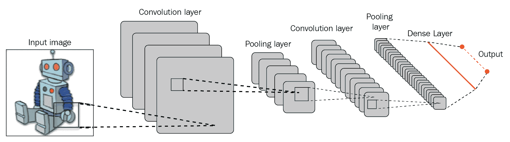
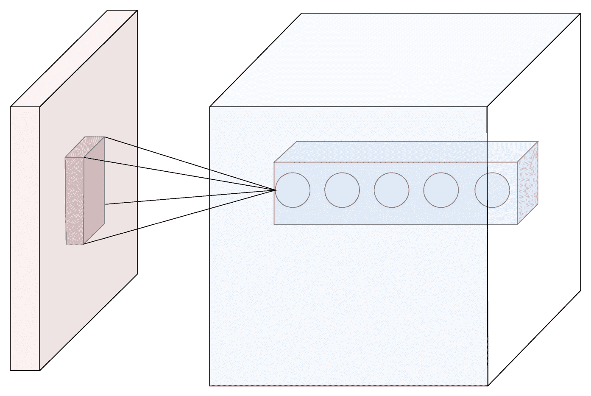
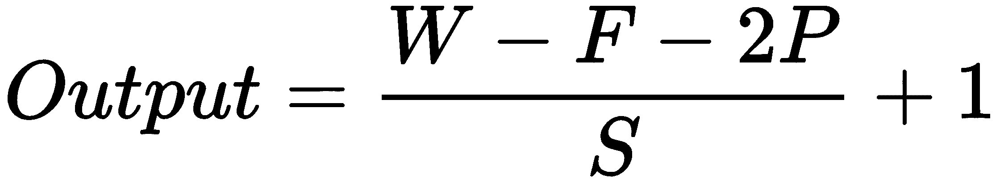
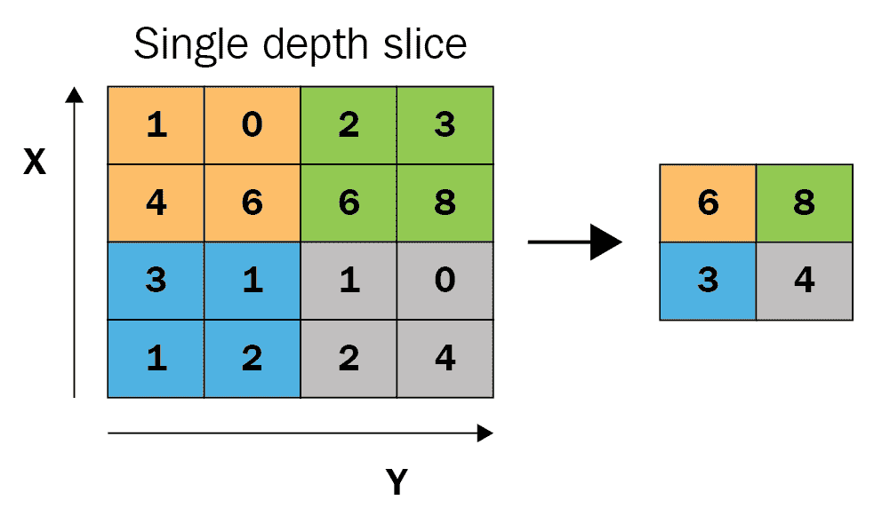
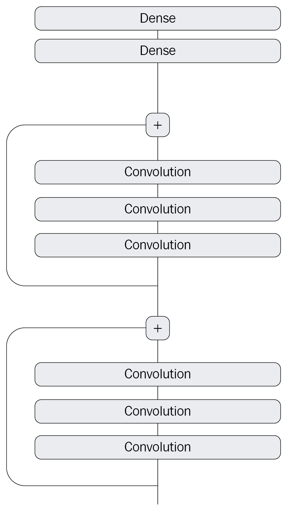
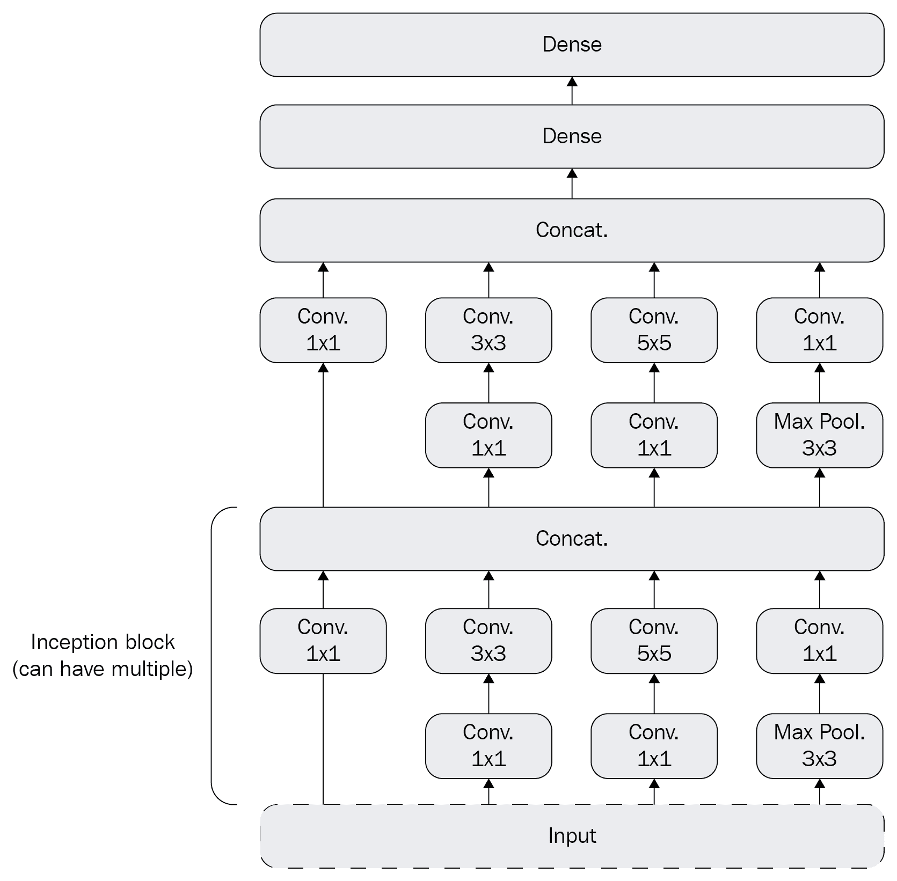

# 第五章：处理图像

在本章中，我们将探讨一些使用 CNTK 的深度学习模型。具体来说，我们将重点研究使用神经网络进行图像数据分类。你在前几章中学到的所有内容将在本章中派上用场，因为我们将讨论如何训练卷积神经网络。

本章将涵盖以下主题：

+   卷积神经网络架构

+   如何构建卷积神经网络

+   如何将图像数据输入卷积网络

+   如何通过数据增强提高网络性能

# 技术要求

我们假设你已经在计算机上安装了最新版本的 Anaconda，并按照第一章《*使用 CNTK 入门*》中的步骤安装了 CNTK。本章的示例代码可以在我们的 GitHub 仓库找到：[`github.com/PacktPublishing/Deep-Learning-with-Microsoft-Cognitive-Toolkit-Quick-Start-Guide/tree/master/ch5`](https://github.com/PacktPublishing/Deep-Learning-with-Microsoft-Cognitive-Toolkit-Quick-Start-Guide/tree/master/ch5)。

在本章中，我们将使用存储在 Jupyter notebook 中的一个示例。要访问示例代码，请在下载代码的目录中，在 Anaconda 提示符下运行以下命令：

```py
cd ch5
jupyter notebook
```

我们将在每一部分提到相关的 notebook，以便你可以跟着进行并亲自尝试不同的技术。

本章的数据集在 GitHub 仓库中无法获取，因为它太大，无法存储在那里。请打开 `Prepare the dataset.ipynb` notebook，并按照其中的说明获取本章的数据。

查看以下视频，看看代码的实际效果：

[`bit.ly/2Wm6U49`](http://bit.ly/2Wm6U49)

# 卷积神经网络架构

在前几章中，我们学习了如何使用常规的前馈网络架构来构建神经网络。在前馈神经网络中，我们假设不同输入特征之间存在相互作用，但我们并未对这些相互作用的性质做出假设。然而，这并不总是正确的做法。

当你处理复杂数据（如图像）时，前馈神经网络并不能很好地完成任务。这是因为我们假设网络输入之间存在相互作用，但我们没有考虑到它们是空间上组织的这一事实。当你观察图像中的像素时，它们之间存在水平和垂直关系。图像中的颜色与某些颜色像素的位置之间也有关系。

卷积网络是一种特殊的神经网络，它明确假设我们处理的数据具有空间关系。这使得它在图像识别方面非常有效。不过，其他具有空间组织的数据也同样适用。让我们来探索一种用于图像分类任务的卷积神经网络的架构。

# 用于图像分类的网络架构

用于图像分类的卷积网络通常包含一个或多个卷积层，后跟池化层，并且通常以常规的全连接层结束，以提供最终的输出，如下图所示：



此图片来源于：https://en.wikipedia.org/wiki/File:Typical_cnn.png

当你仔细观察卷积网络的结构时，你会发现它以一组**卷积**层和**池化**层开始。你可以将这一部分看作是一个复杂的、可训练的照片滤镜。**卷积层**过滤出分类图像所需的有趣细节，而**池化**层则总结这些特征，以便网络后端处理的数据点更少。

通常，在用于图像分类的神经网络中，你会发现多个卷积层和池化层的组合。这样做是为了能够从图像中提取更多复杂的细节。网络的第一层提取简单的细节，比如线条。接下来的层会将前一层的输出结合起来，学习更复杂的特征，比如角落或曲线。正如你所想的那样，后续的层会用来学习越来越复杂的特征。

通常，当你构建神经网络时，你希望对图像中的内容进行分类。这时，经典的全连接层就发挥了重要作用。通常，用于图像识别的模型会以一个输出层和一个或多个全连接层结束。

让我们来看看如何使用卷积层和池化层来创建一个卷积神经网络。

# 使用卷积层

现在，既然你已经了解了卷积网络的基本结构，让我们来看看卷积网络中使用的卷积层：



此图片来源于：https://en.wikipedia.org/wiki/File:Conv_layer.png

卷积层是卷积网络的核心构建块。你可以将卷积层看作一个可训练的滤镜，用来从输入中提取重要细节并去除被认为是噪声的数据。一个卷积层包含一组权重，这些权重覆盖一个小区域（宽度和高度），但涵盖了输入的所有通道。当你创建卷积层时，你需要指定其神经元的深度。你会发现，大多数框架，包括 CNTK，在讨论层的深度时，会提到滤镜。

当我们执行前向传播时，我们会将该层的卷积核滑动过输入数据，并在每个卷积核上执行输入数据与权重之间的点积运算。滑动的过程由步幅设置来控制。当你指定步幅为 1 时，最终得到的输出矩阵将具有与输入相同的宽度和高度，但深度与该层的卷积核数量相同。你可以设置不同的步幅，这会减少输出矩阵的宽度和高度。

除了输入大小和卷积核数量外，您还可以配置该层的填充。给卷积层添加填充会在处理过的输入数据周围添加零的边框。虽然这听起来像是一件奇怪的事，但在某些情况下，它是非常有用的。

查看卷积层的输出大小时，它将基于输入大小、卷积核数量、步幅和填充来决定。公式如下：



`W` 是输入大小，`F` 是卷积核数量或层深，`P` 是填充，`S` 是步幅。

不是所有输入大小、卷积核、步幅和填充的组合都是有效的。例如，当输入大小 `W` = 10，层深 `F` = 3，步幅 `S` = 2 时，最终得到的输出体积是 5.5。并不是所有输入都能完美地映射到这个输出大小，因此 CNTK 会抛出一个异常。这就是填充设置的作用。通过指定填充，我们可以确保所有输入都映射到输出神经元。

我们刚才讨论的输入大小和卷积核数量可能感觉有些抽象，但它们是有道理的。设置较大的输入大小会使得该层捕捉到输入数据中的较粗糙的模式。设置较小的输入大小则使得该层能够更好地检测更精细的模式。卷积核的深度或数量决定了能够检测到多少种不同的模式。在高级别上，可以说一个卷积核使用一个滤波器来检测一种模式；例如，水平线。而一个拥有两个滤波器的层则能够检测两种不同的模式：水平线和垂直线。

为卷积网络设定正确的参数可能需要不少工作。幸运的是，CNTK 提供了一些设置，帮助简化这个过程。

训练卷积层的方式与训练常规的密集层相同。这意味着我们将执行一次前向传播，计算梯度，并使用学习器在反向传播时更新参数的值。

卷积层后面通常会跟着一个池化层，用于压缩卷积层学习到的特征。接下来我们来看池化层。

# 处理池化层

在前一部分中，我们讨论了卷积层以及它们如何用于从像素数据中提取细节。池化层用于总结这些提取的细节。池化层有助于减少数据量，使得分类这些数据变得更加容易。

理解神经网络在面对具有大量不同输入特征的样本时，分类难度较大的问题非常重要。这就是为什么我们使用卷积层和池化层的组合来提取细节并进行总结的原因：



此图像来自： https://en.wikipedia.org/wiki/File:Max_pooling.png

池化层具有一个下采样算法，你可以通过输入大小和步幅来进行配置。我们将把前一卷积层的每个滤波器的输出传递到池化层。池化层会跨越数据片段，并提取与配置的输入大小相等的小窗口。它从这些小区域的值中选取最大的值作为该区域的输出。就像卷积层一样，它使用步幅来控制它在输入中移动的速度。例如，步幅为 2，大小为 1 时，会将数据的维度减半。通过仅使用最高的输入值，它丢弃了 75%的输入数据。

这种池化技术被称为最大池化，它并不是池化层减少输入数据维度的唯一方式。你还可以使用平均池化。在这种情况下，池化层会使用输入区域的平均值作为输出。

请注意，池化层仅减少输入在宽度和高度方向上的大小。深度保持不变，因此你可以放心，特征只是被下采样，并没有完全丢弃。

由于池化层使用固定算法来下采样输入数据，因此它们没有可训练的参数。这意味着训练池化层几乎不需要时间。

# 卷积网络的其他用途

我们将重点放在使用卷积网络进行图像分类上，但你也可以将这种神经网络应用于更多的场景，例如：

+   图像中的目标检测。CNTK 网站提供了一个很好的示例，展示了如何构建一个目标检测模型：[`docs.microsoft.com/en-us/cognitive-toolkit/Object-Detection-using-Fast-R-CNN`](https://docs.microsoft.com/en-us/cognitive-toolkit/Object-Detection-using-Fast-R-CNN)

+   在照片中检测面部并预测照片中人的年龄

+   使用卷积神经网络和递归神经网络的结合，按照第六章的内容进行图像标题生成，*处理时间序列数据*

+   预测来自声纳图像的湖底距离

当你开始将卷积网络组合用于不同的任务时，你可以构建一些非常强大的应用；例如，一个安全摄像头，能够检测视频流中的人物，并警告保安有非法入侵者。

中国等国家正在大力投资这种技术。卷积网络被应用于智能城市项目中，用于监控过路口。通过深度学习模型，相关部门能够检测交通信号灯的事故，并自动重新规划交通路线，从而使警察的工作变得更加轻松。

# 构建卷积网络

现在你已经了解了卷积网络的基本原理以及一些常见的应用场景，让我们来看看如何使用 CNTK 来构建一个卷积网络。

我们将构建一个能够识别手写数字的模型。MNIST 数据集是一个免费的数据集，包含了 60,000 个手写数字样本。还有一个包含 10,000 个样本的测试集。

让我们开始并看看在 CNTK 中构建卷积网络是什么样子。首先，我们将了解如何构建卷积神经网络的结构，然后我们会了解如何训练卷积神经网络的参数。最后，我们将探讨如何通过更改网络结构和不同层设置来改进神经网络。

# 构建网络结构

通常，当你构建一个用于识别图像中模式的神经网络时，你会使用卷积层和池化层的组合。网络的最后应该包含一个或多个隐藏层，并以 softmax 层结束，用于分类目的。

让我们来构建网络结构：

```py
from cntk.layers import Convolution2D, Sequential, Dense, MaxPooling
from cntk.ops import log_softmax, relu
from cntk.initializer import glorot_uniform
from cntk import input_variable, default_options

features = input_variable((3,28,28))
labels = input_variable(10)

with default_options(initialization=glorot_uniform, activation=relu):
    model = Sequential([
        Convolution2D(filter_shape=(5,5), strides=(1,1), num_filters=8, pad=True),
        MaxPooling(filter_shape=(2,2), strides=(2,2)),
        Convolution2D(filter_shape=(5,5), strides=(1,1), num_filters=16, pad=True),
        MaxPooling(filter_shape=(3,3), strides=(3,3)),
        Dense(10, activation=log_softmax)
    ])

z = model(features)
```

按照给定的步骤进行操作：

1.  首先，导入神经网络所需的层。

1.  然后，导入网络的激活函数。

1.  接下来，导入`glorot_uniform initializer`函数，以便稍后初始化卷积层。

1.  之后，导入`input_variable`函数来创建输入变量，以及`default_options`函数，使得神经网络的配置更加简便。

1.  创建一个新的`input_variable`来存储输入图像，这些图像将包含`3`个通道（红、绿、蓝），尺寸为`28` x `28` 像素。

1.  创建另一个`input_variable`来存储待预测的标签。

1.  接下来，创建网络的`default_options`并使用`glorot_uniform`作为初始化函数。

1.  然后，创建一个新的`Sequential`层集来构建神经网络的结构

1.  在`Sequential`层集中，添加一个`Convolutional2D`层，`filter_shape`为`5`，`strides`设置为`1`，并将过滤器数量设置为`8`。启用`padding`，以便填充图像以保留原始尺寸。

1.  添加一个`MaxPooling`层，`filter_shape`为`2`，`strides`设置为`2`，以将图像压缩一半。

1.  添加另一个`Convolution2D`层，`filter_shape`为 5，`strides`设置为 1，使用 16 个过滤器。添加`padding`以保持由前一池化层产生的图像尺寸。

1.  接下来，添加另一个`MaxPooling`层，`filter_shape`为 3，`strides`设置为 3，将图像尺寸缩小到原来的三分之一。

1.  最后，添加一个`Dense`层，包含 10 个神经元，用于网络可以预测的 10 个类别。使用`log_softmax`激活函数，将网络转换为分类模型。

我们使用 28x28 像素的图像作为模型的输入。这个尺寸是固定的，因此当你想用这个模型进行预测时，你需要提供相同尺寸的图像作为输入。

请注意，这个模型仍然非常基础，不会产生完美的结果，但它是一个良好的开始。稍后如果需要，我们可以开始调整它。

# 使用图像训练网络

现在我们有了卷积神经网络的结构，接下来让我们探讨如何训练它。训练一个处理图像的神经网络需要比大多数计算机可用内存更多的内存。这时，来自第三章的 minibatch 数据源，*将数据输入到神经网络中*，就派上用场了。我们将设置一组包含两个 minibatch 数据源，用于训练和评估我们刚刚创建的神经网络。让我们首先看看如何为图像构建一个 minibatch 数据源：

```py
import os
from cntk.io import MinibatchSource, StreamDef, StreamDefs, ImageDeserializer, INFINITELY_REPEAT
import cntk.io.transforms as xforms

def create_datasource(folder, max_sweeps=INFINITELY_REPEAT):
    mapping_file = os.path.join(folder, 'mapping.bin')

    stream_definitions = StreamDefs(
        features=StreamDef(field='image', transforms=[]),
        labels=StreamDef(field='label', shape=10)
    )

    deserializer = ImageDeserializer(mapping_file, stream_definitions)

    return MinibatchSource(deserializer, max_sweeps=max_sweeps)
```

按照给定的步骤操作：

1.  首先，导入`os`包，以便访问一些有用的文件系统功能。

1.  接下来，导入必要的组件来创建一个新的`MinibatchSource`。

1.  创建一个新的函数`create_datasource`，该函数接收输入文件夹的路径和一个`max_sweeps`设置，用来控制我们遍历数据集的频率。

1.  在`create_datasource`函数中，找到源文件夹中的`mapping.bin`文件。这个文件包含磁盘上的图像和其关联标签之间的映射。

1.  然后创建一组流定义，用来从`mapping.bin`文件中读取数据。

1.  为图像文件添加一个`StreamDef`。确保包括`transforms`关键字参数，并初始化为空数组。

1.  为标签字段添加另一个`StreamDef`，该字段包含 10 个特征。

1.  创建一个新的`ImageDeserializer`，并为其提供`mapping_file`和`stream_definitions`变量。

1.  最后，创建一个`MinibatchSource`并为其提供反序列化器和`max_sweeps`设置。

请注意，你可以使用`Preparing the dataset.ipynb` Python 笔记本中的代码创建训练所需的文件。确保你的硬盘上有足够的空间来存储图像。1GB 的硬盘空间足够存储所有训练和验证样本。

一旦我们有了`create_datasource`函数，就可以创建两个独立的数据源来训练模型：

```py
train_datasource = create_datasource('mnist_train')
test_datasource = create_datasource('mnist_test', max_sweeps=1, train=False)
```

1.  首先，调用`create_datasource`函数，并传入`mnist_train`文件夹，以创建训练数据源。

1.  调用`create_datasource`函数，并使用`mnist_test`文件夹，将`max_sweeps`设置为 1，以创建用于验证神经网络的数据源。

一旦准备好图像，就可以开始训练神经网络了。我们可以使用`train`方法在`loss`函数上启动训练过程：

```py
from cntk import Function
from cntk.losses import cross_entropy_with_softmax
from cntk.metrics import classification_error
from cntk.learners import sgd

@Function
def criterion_factory(output, targets):
    loss = cross_entropy_with_softmax(output, targets)
    metric = classification_error(output, targets)

    return loss, metric

loss = criterion_factory(z, labels)
learner = sgd(z.parameters, lr=0.2)
```

按照给定的步骤进行：

1.  首先，从 cntk 包中导入 Function 装饰器。

1.  接下来，从 losses 模块中导入`cross_entropy_with_softmax`函数。

1.  然后，从 metrics 模块中导入`classification_error`函数。

1.  在此之后，从 learners 模块导入`sgd`学习器。

1.  创建一个新函数`criterion_factory`，带有两个参数：output 和 targets。

1.  使用`@Function`装饰器标记该函数，将其转换为 CNTK 函数对象。

1.  在函数内部，创建一个新的`cross_entropy_with_softmax`函数的实例。

1.  接下来，创建一个新的`classification_error`指标的实例。

1.  将损失和指标作为函数的结果返回。

1.  在创建`criterion_factory`函数后，用它初始化一个新的损失。

1.  最后，使用模型的参数和学习率 0.2 设置`sgd`学习器。

现在我们已经为神经网络设置了损失和学习器，让我们看看如何训练和验证神经网络：

```py
from cntk.logging import ProgressPrinter
from cntk.train import TestConfig

progress_writer = ProgressPrinter(0)
test_config = TestConfig(test_datasource)

input_map = {
    features: train_datasource.streams.features,
    labels: train_datasource.streams.labels
}

loss.train(train_datasource, 
           max_epochs=1,
           minibatch_size=64,
           epoch_size=60000, 
           parameter_learners=[learner], 
           model_inputs_to_streams=input_map, 
           callbacks=[progress_writer, test_config])
```

按照给定的步骤进行：

1.  首先从`logging`模块中导入`ProgressPrinter`类。

1.  接下来，从`train`模块中导入`TestConfig`类。

1.  创建一个新的`ProgressPrinter`实例，以便我们可以记录训练过程的输出。

1.  然后，使用前面创建的`test_datasource`作为输入，为神经网络创建`TestConfig`。

1.  创建一个新的字典，将`train_datasource`的数据流映射到神经网络的输入变量。

1.  最后，在`loss`上调用`train`方法，并提供`train_datasource`、训练器的设置、`learner`、`input_map`和训练期间要使用的回调函数。

当您执行 Python 代码时，您将获得类似于以下输出：  

```py
average      since    average      since      examples
    loss       last     metric       last              
 ------------------------------------------------------
Learning rate per minibatch: 0.2
      105        105      0.938      0.938            64
 1.01e+07   1.51e+07      0.901      0.883           192
 4.31e+06          2      0.897      0.895           448
 2.01e+06          2      0.902      0.906           960
 9.73e+05          2      0.897      0.893          1984
 4.79e+05          2      0.894      0.891          4032
[...]
```

注意损失随时间减少的情况。达到足够低的值使模型可用确实需要相当长的时间。训练图像分类模型将需要很长时间，因此这是使用 GPU 将大大减少训练时间的情况之一。

# 选择正确的层次组合

在前面的部分中，我们已经看到如何使用卷积层和池化层构建神经网络。

我们刚刚看到，训练用于图像识别的模型需要相当长的时间。除了长时间的训练时间外，选择卷积网络的正确设置也非常困难，需要很长时间。通常，您需要运行数小时的实验来找到有效的网络结构。这对于有抱负的 AI 开发者来说可能非常沮丧。

幸运的是，许多研究团队正在致力于寻找用于图像分类任务的最佳神经网络架构。已有几种不同的架构在竞赛和现实场景中取得了成功：

+   VGG-16

+   ResNet

+   Inception

还有更多的架构。虽然我们不能详细讨论每种架构的构建方式，但我们可以从功能层面探讨它们的工作原理，这样你可以做出更有根据的选择，决定在自己的应用中尝试哪种网络架构。

VGG 网络架构是由视觉几何组（Visual Geometry Group）发明的，用于将图像分类为 1000 个不同的类别。这项任务非常困难，但该团队成功达到了 70.1%的准确率，考虑到区分 1000 个不同类别的难度，这个结果相当不错。

VGG 网络架构使用了堆叠的卷积层，输入大小为 3x3。层的深度逐渐增加，从 32 个滤波器开始，继续使用 48 个滤波器，一直到 512 个滤波器。数据量的减少是通过使用 2x2 的池化滤波器完成的。VGG 网络架构在 2015 年被发明时是当时的最先进技术，因为它的准确率比之前发明的模型要高得多。

然而，构建用于图像识别的神经网络还有其他方法。ResNet 架构使用了所谓的微架构。它仍然使用卷积层，但这次它们被安排成块。该架构与其他卷积网络非常相似，只是 VGG 网络使用了长链式层，而 ResNet 架构则在卷积层块之间使用了跳跃连接：



ResNet 架构

这就是“微架构”这个术语的来源。每一个块都是一个微型网络，能够从输入中学习模式。每个块有若干卷积层和一个残差连接。这个连接绕过卷积层块，来自残差连接的数据会加到卷积层的输出上。这个设计的理念是，残差连接能够打破网络中的学习过程，使其学习得更好、更快。

与 VGG 网络架构相比，ResNet 架构更深，但更易于训练，因为它需要优化的参数较少。VGG 网络架构占用 599 MB 的内存，而 ResNet 架构只需要 102 MB。

我们将要探讨的最终网络架构是 Inception 架构。这个架构同样属于微架构类别。与 ResNet 架构中使用的残差块不同，Inception 网络使用了 Inception 块：



Inception 网络

Inception 架构中的 Inception 块使用不同输入大小（1x1、3x3 和 5x5）的卷积层，然后沿着通道轴进行拼接。这会生成一个矩阵，其宽度和高度与输入相同，但通道数比输入更多。其思想是，当你这样做时，输入中提取的特征会有更好的分布，从而为执行分类任务提供更高质量的数据。这里展示的 Inception 架构非常浅，通常使用的完整版本可以有超过两个 Inception 块。

当你开始处理其他卷积神经网络架构时，你会很快发现你需要更多的计算能力来训练它们。通常，数据集无法完全加载到内存中，且你的计算机可能会因为训练模型所需的时间过长而变得太慢。此时，分布式训练可以提供帮助。如果你对使用多台机器训练模型感兴趣，绝对应该查看 CNTK 手册中的这一章节：[`docs.microsoft.com/en-us/cognitive-toolkit/Multiple-GPUs-and-machines`](https://docs.microsoft.com/en-us/cognitive-toolkit/Multiple-GPUs-and-machines)。

# 通过数据增强提升模型性能

用于图像识别的神经网络不仅难以设置和训练，还需要大量数据来进行训练。此外，它们往往会在训练过程中对图像过拟合。例如，当你只使用直立姿势的面部照片时，模型很难识别以其他方向旋转的面部。

为了帮助克服旋转和某些方向上的偏移问题，你可以使用图像增强。CNTK 在创建图像的小批量源时，支持特定的变换。

我们为本章节提供了一个额外的笔记本，演示了如何使用这些变换。你可以在本章节的示例中找到该部分的示例代码，文件名为`Recognizing hand-written digits with augmented data.ipynb`。

你可以使用多种变换。例如，你可以只用几行代码随机裁剪用于训练的图像。你还可以使用的其他变换包括缩放和颜色变换。你可以在 CNTK 网站上找到有关这些变换的更多信息：[`cntk.ai/pythondocs/cntk.io.transforms.html`](https://cntk.ai/pythondocs/cntk.io.transforms.html)。

在本章前面用于创建小批量源的函数中，我们可以通过加入裁剪变换来修改变换列表，代码如下所示：

```py
import os
from cntk.io import MinibatchSource, StreamDef, StreamDefs, ImageDeserializer, INFINITELY_REPEAT
import cntk.io.transforms as xforms

def create_datasource(folder, train=True, max_sweeps=INFINITELY_REPEAT):
    mapping_file = os.path.join(folder, 'mapping.bin')

    image_transforms = []

    if train:
        image_transforms += [
 xforms.crop(crop_type='randomside', side_ratio=0.8),
 xforms.scale(width=28, height=28, channels=3, interpolations='linear')
 ]

    stream_definitions = StreamDefs(
        features=StreamDef(field='image', transforms=image_transforms),
        labels=StreamDef(field='label', shape=10)
    )

    deserializer = ImageDeserializer(mapping_file, stream_definitions)

    return MinibatchSource(deserializer, max_sweeps=max_sweeps)

```

我们改进了函数，加入了一组图像变换。在训练时，我们将随机裁剪图像，以获得更多图像的变化。然而，这也会改变图像的尺寸，因此我们还需要加入一个缩放变换，确保图像符合神经网络输入层所期望的大小。

在训练过程中使用这些变换将增加训练数据的变化性，从而减少神经网络因图像的颜色、旋转或大小稍有不同而卡住的几率。

但是需要注意的是，这些变换不会生成新的样本。它们仅仅是在数据输入到训练器之前对其进行更改。你需要增加最大训练轮次，以便在应用这些变换时生成足够的随机样本。需要额外的训练轮次数量将取决于数据集的大小。

同时，需要牢记输入层和中间层的维度对卷积网络的能力有很大影响。较大的图像在检测小物体时自然会表现得更好。将图像缩小到一个更小的尺寸会使较小的物体消失，或者丧失过多细节，以至于网络无法识别。

然而，支持较大图像的卷积网络需要更多的计算能力来进行优化，因此训练这些网络将花费更长的时间，而且更难得到最佳结果。

最终，你需要平衡图像大小、层的维度以及使用的数据增强方法，以获得最佳结果。

# 总结

在本章中，我们探讨了使用神经网络进行图像分类。与处理普通数据有很大的不同。我们不仅需要更多的训练数据来得到正确的结果，还需要一种更适合图像处理的不同架构。

我们已经看到了卷积层和池化层如何被用来本质上创建一个高级的照片滤镜，从数据中提取重要细节，并总结这些细节，以减少输入的维度，使其变得可管理。

一旦我们使用了卷积滤波器和池化滤波器的高级特性，接下来就是常规的工作了，通过密集层来构建分类网络。

为图像分类模型设计一个良好的结构可能相当困难，因此在开始进行图像分类之前，查看现有的架构总是一个不错的主意。另外，使用合适的增强技术可以在提升性能方面起到相当大的作用。

处理图像只是深度学习强大功能的一个应用场景。在下一章中，我们将探讨如何使用深度学习在时间序列数据上训练模型，如股票信息或比特币等课程信息。我们将学习如何在 CNTK 中使用序列，并构建一个可以在时间上推理的神经网络。下一章见。
