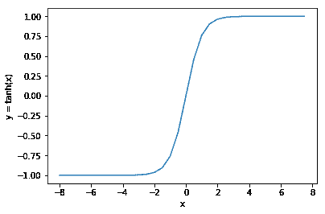
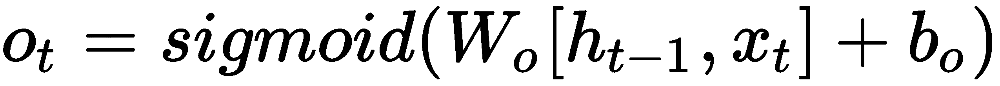

# 第六章：处理时间序列数据

使用神经网络进行图像分类是深度学习中最具代表性的任务之一。但它当然不是神经网络擅长的唯一任务。另一个有大量研究正在进行的领域是循环神经网络。

在本章中，我们将深入探讨循环神经网络，以及它们如何应用于需要处理时间序列数据的场景；例如，在物联网解决方案中，你可能需要预测温度或其他重要的数值。

本章涵盖以下主题：

+   什么是循环神经网络？

+   循环神经网络的应用场景

+   循环神经网络是如何工作的

+   使用 CNTK 构建循环神经网络

# 技术要求

我们假设你已经在计算机上安装了最新版本的 Anaconda，并且按照第一章《*开始使用 CNTK*》中的步骤安装了 CNTK。本章的示例代码可以在我们的 GitHub 代码库中找到，网址是[`github.com/PacktPublishing/Deep-Learning-with-Microsoft-Cognitive-Toolkit-Quick-Start-Guide/tree/master/ch6`](https://github.com/PacktPublishing/Deep-Learning-with-Microsoft-Cognitive-Toolkit-Quick-Start-Guide/tree/master/ch6)。

在本章中，我们将处理存储在 Jupyter 笔记本中的示例代码。要访问示例代码，请在 Anaconda 提示符下运行以下命令，前提是你已经下载了代码并进入了该目录：

```py
cd ch6
jupyter notebook
```

示例代码存储在`Training recurrent neural networks.ipynb`笔记本中。如果你没有配备 GPU 且无法使用 CNTK 的机器，请注意运行本章的示例代码将需要较长时间。

请观看以下视频，查看代码的实际应用：

[`bit.ly/2TAdtyr`](http://bit.ly/2TAdtyr)

# 什么是循环神经网络？

循环神经网络是一种特殊类型的神经网络，能够进行时间推理。它们主要用于需要处理随时间变化的数值的场景。

在常规神经网络中，你只能提供一个输入，这样就只能得到一个预测结果。这限制了你使用常规神经网络的能力。例如，常规神经网络在文本翻译方面表现不佳，而循环神经网络在翻译任务中却取得了不少成功的实验。

在循环神经网络中，可以提供一系列样本，这将生成一个单一的预测结果。你还可以使用循环神经网络根据一个输入样本预测输出序列。最后，你可以根据输入序列预测输出序列。

和其他类型的神经网络一样，你也可以在分类任务和回归任务中使用循环神经网络，尽管根据网络输出的结果可能很难识别出循环神经网络执行的任务类型。

# 循环神经网络的变体

递归神经网络可以以多种方式使用。在本节中，我们将探讨递归神经网络的不同变体，以及它们如何用于解决特定类型的问题。具体来说，我们将关注以下几种变体：

+   基于输入序列预测单个输出

+   基于单个输入值预测序列

+   基于其他序列预测序列

最后，我们还将探索如何将多个递归神经网络堆叠在一起，以及如何在处理文本等场景中提高性能。

让我们来看一下递归网络可以使用的场景，因为有多种方法可以利用递归神经网络的独特特性。

# 基于序列预测单个输出

递归神经网络包含一个反馈连接到输入。当我们输入一系列值时，它将按时间步处理序列中的每个元素。由于反馈连接，它可以将处理一个元素时生成的输出与下一个元素的输入结合起来。通过将前一时间步的输出与下一时间步的输入结合，它将构建一个跨整个序列的记忆，这可以用来进行预测。从示意图来看，基本的递归神经网络如下所示：


当我们将递归神经网络展开成其各个步骤时，这种递归行为变得更加清晰，下面的图示展示了这一点：


要使用这个递归神经网络进行预测，我们将执行以下步骤：

1.  首先，我们将输入序列的第一个元素输入，创建一个初始的隐藏状态。

1.  然后，我们将初始隐藏状态与输入序列中的第二个元素结合，生成更新后的隐藏状态。

1.  最后，我们将输入序列中的第三个元素，生成最终的隐藏状态并预测递归神经网络的输出。

由于这个反馈连接，您可以训练递归神经网络识别随着时间发生的模式。例如，当你想预测明天的气温时，你需要查看过去几天的天气，以发现一个可以用来确定明天气温的模式。

# 基于单个样本预测序列

递归神经网络的基本模型也可以扩展到其他用例。例如，您可以使用相同的网络架构，基于单个输入预测一系列值，如下图所示：


在这种情况下，我们有三个时间步，每个时间步将根据我们提供的输入预测输出序列中的一个步骤。

1.  首先，我们将输入样本送入神经网络，生成初始的隐藏状态，并预测输出序列中的第一个元素。

1.  然后，我们将初始隐藏状态与相同的样本结合，生成更新后的隐藏状态和输出，预测输出序列中的第二个元素。

1.  最后，我们再次输入样本，进一步更新隐藏状态，并预测输出序列中的最后一个元素。

从一个样本生成一个序列与我们之前的样本非常不同，之前我们收集了输入序列中所有时间步的信息以得到一个单一的预测。而在这种情况下，我们在每个时间步生成输出。

还有一种递归神经网络的变体，它结合了我们刚刚讨论的设置和前一节中讨论的设置，根据一系列值预测一系列值。

# 基于序列预测序列

现在我们已经了解了如何根据一个序列预测单个值，或根据一个单独的值预测一个序列，让我们看看如何进行序列到序列的预测。在这种情况下，你执行与前面情景中相同的步骤，其中我们是基于单个样本预测一个序列，如下图所示：


在这种情景下，我们有三个时间步，每个时间步接受输入序列中的元素，并预测一个我们想要预测的输出序列中的对应元素。让我们一步一步地回顾这个情景：

1.  首先，我们取输入序列中的第一个元素，创建初始的隐藏状态，并预测输出序列中的第一个元素。

1.  接下来，我们将初始隐藏状态与输入序列中的第二个元素结合，更新隐藏状态，并预测输出序列中的第二个元素。

1.  最后，我们将更新后的隐藏状态和输入序列中的最后一个元素一起，预测输出序列中的最后一个元素。

所以，和我们在前一节中做的那样，我们不再在每一步重复相同的输入样本，而是一次输入序列中的一个元素，并将每一步生成的预测作为模型的输出序列。

# 堆叠多个递归层

递归神经网络可以拥有多个递归层。这使得递归网络的记忆容量增大，模型能够学习到更复杂的关系。

例如，当你想翻译文本时，你需要堆叠至少两个递归层，一个用于将输入文本编码为中间形式，另一个用于将其解码为你想翻译成的语言。谷歌有一篇有趣的论文，展示了如何使用这种技术进行语言间的翻译，论文地址是[`arxiv.org/abs/1409.3215`](https://arxiv.org/abs/1409.3215)。

由于循环神经网络可以以多种方式使用，因此它在处理时间序列数据时具有很强的预测能力。在下一部分，我们将深入了解循环网络如何在内部工作，从而更好地理解隐藏状态的工作原理。

# 循环神经网络是如何工作的？

为了理解循环神经网络是如何工作的，我们需要仔细看看这些网络中循环层的工作原理。在循环神经网络中，你可以使用几种不同类型的循环层。在我们深入讨论更高级的循环单元之前，让我们首先讨论如何使用标准循环层来预测输出，以及如何训练一个包含循环层的神经网络。

# 使用循环神经网络进行预测

基本的循环层与神经网络中的常规层非常不同。一般来说，循环层具有一个隐藏状态，作为该层的记忆。该层的输出会通过一个回环连接返回到该层的输入，正如下图所示：


现在我们已经了解了基本的循环层是什么样的，让我们一步一步地看一下这种层类型是如何工作的，我们将使用一个包含三个元素的序列。序列中的每一步称为一个时间步。为了使用循环层预测输出，我们需要用初始的隐藏状态来初始化该层。这通常是通过全零初始化来完成的。隐藏状态的大小与输入序列中单个时间步的特征数量相同。

接下来，我们需要更新序列中第一个时间步的隐藏状态。要更新第一个时间步的隐藏状态，我们将使用以下公式：


在这个公式中，我们通过计算初始隐藏状态（以零初始化）和一组权重之间的点积（即按元素相乘）来计算新的隐藏状态。我们将另加一组权重与该层输入的点积。两个点积的和将通过一个激活函数，就像在常规神经网络层中一样。这样我们就得到了当前时间步的隐藏状态。

当前时间步的隐藏状态将作为序列中下一个时间步的初始隐藏状态。我们将重复在第一个时间步中执行的计算，以更新第二个时间步的隐藏状态。第二个时间步的公式如下所示：


我们将计算隐藏状态权重与步骤 1 中的隐藏状态的点积，并将其与输入和输入权重的点积相加。请注意，我们正在重用前一个时间步的权重。

我们将重复更新隐藏状态的过程，作为序列中的第三个也是最后一个步骤，如下式所示：


当我们处理完序列中的所有步骤后，可以使用第三组权重和最终时间步的隐藏状态来计算输出，如下式所示：


当你使用递归网络预测输出序列时，你需要在每个时间步执行这个最终计算，而不仅仅是在序列的最后一个时间步。

# 训练递归神经网络

与常规神经网络层一样，你可以通过反向传播来训练递归层。这一次，我们将对常规的反向传播算法应用一个技巧。

在常规神经网络中，你会根据`loss`函数、输入和模型的期望输出来计算梯度。但这对递归神经网络不起作用。递归层的损失不能仅通过单个样本、目标值和`loss`函数来计算。因为预测输出是基于网络输入的所有时间步，因此你还需要使用输入序列的所有时间步来计算损失。因此，你得到的不是一组梯度，而是一个梯度序列，当它们加起来时得到最终的损失。

时间上的反向传播比常规反向传播更为困难。为了达到`loss`函数的全局最优，我们需要更加努力地沿梯度下降。我们梯度下降算法要走的坡度比常规神经网络大得多。除了更高的损失外，它还需要更长时间，因为我们需要处理序列中的每一个时间步，以便为单个输入序列计算和优化损失。

更糟糕的是，由于梯度在多个时间步的累加，反向传播过程中更容易出现梯度爆炸的问题。你可以通过使用有限制的激活函数来解决梯度爆炸问题，例如**双曲正切函数**（**tanh**）或`sigmoid`。这些激活函数将递归层的输出值限制在`tanh`函数的-1 和 1 之间，以及`sigmoid`函数的 0 和 1 之间。`ReLU`激活函数在递归神经网络中不太有用，因为梯度没有限制，这在某个时刻肯定会导致梯度爆炸。

限制激活函数输出值可能会引发另一个问题。记住在第二章，*使用 CNTK 构建神经网络*中提到的，`sigmoid`具有一个特定的曲线，梯度在曲线的两端迅速减小到零。我们在本节示例中使用的`tanh`函数也具有相同类型的曲线，如下图所示：



输入值在 -2 到 +2 之间时，梯度相对较为明确。这意味着我们可以有效地使用梯度下降来优化神经网络中的权重。然而，当递归层的输出低于 -2 或高于 +2 时，梯度会变得较浅。这可能会变得极其低，直到 CPU 或 GPU 开始将梯度四舍五入为零。这意味着我们不再进行学习。

由于涉及多个时间步，递归层比常规神经网络层更容易受到梯度消失或饱和问题的影响。在使用常规递归层时，你无法对此做太多处理。然而，其他递归层类型具有更为先进的设置，能够在一定程度上解决这个问题。

# 使用其他递归层类型

由于梯度消失问题，基本递归层在学习长期相关性方面表现不佳。换句话说，它在处理长序列时不太有效。当你尝试处理句子或更长的文本序列并试图分类它们的含义时，你会遇到这个问题。在英语和其他语言中，句子中的两个相关词之间有较长的距离，它们共同赋予句子意义。当你的模型仅使用基本递归层时，你很快会发现它在分类文本序列时并不优秀。

然而，还有其他递归层类型更适合处理更长的序列。同时，它们通常能更好地结合长短期相关性。

# 与门控递归单元（GRU）一起工作

基本递归层的一个替代方案是**门控递归单元**（**GRU**）。这种层类型具有两个门，帮助它处理序列中的长距离相关性，如下图所示：

GRU 的形状比常规递归层复杂得多。有更多的连接线将不同的输入与输出相连接。让我们一起看看这个图表，了解这个层类型背后的总体思路。

与常规的递归层不同，GRU 层具有**更新门**和**重置门**。重置门和更新门是控制保留多少先前时间步记忆、以及多少新数据用于生成新记忆的阀门。

预测输出与使用常规递归层进行预测非常相似。当我们将数据输入到该层时，先前的隐藏状态将用于计算新隐藏状态的值。当序列中的所有元素都处理完毕时，输出将使用一组额外的权重进行计算，就像我们在常规递归层中所做的那样。

在 GRU 中，计算跨多个时间步的隐藏状态要复杂得多。需要几个步骤来更新 GRU 的隐藏状态。首先，我们需要计算更新门的值，如下所示：


更新门通过两组权重进行控制，一组用于前一个时间步的隐藏状态，另一组用于当前时间步输入到层的值。更新门产生的值控制着多少过去的时间步数据保留在隐藏状态中。

第二步是更新重置门。此操作通过以下公式进行：


重置门也通过两组权重进行控制；一组用于当前时间步的输入值，另一组用于隐藏状态。重置门控制着从隐藏状态中移除多少信息。当我们计算新隐藏状态的初始版本时，这一点会变得更加清晰：


首先，我们将输入与其对应的权重相乘。然后，将前一个隐藏状态与其对应的权重相乘。接着，我们计算重置门与加权隐藏状态之间的逐元素或 Hadamard 积。最后，我们将其与加权输入相加，并对其应用`tanh`激活函数来计算记忆的隐藏状态。

这个公式中的重置门控制着前一个隐藏状态有多少信息被遗忘。一个较低值的重置门会从前一个时间步移除大量数据。较高的值将帮助层保留更多来自前一个时间步的信息。

但这还没完——一旦我们获得了来自前一个时间戳的信息，并且通过更新门增加并通过重置门调整后，就产生了来自前一个时间步的记忆信息。我们现在可以根据这些记忆信息计算最终的隐藏状态值，如下所示：


首先，我们对前一个隐藏状态与更新门进行逐元素相乘，以确定前一个状态应保留多少信息。然后，我们将更新门与前一个状态记忆信息的逐元素乘积相加。注意，更新门用于引入一定比例的新信息和旧信息。这就是为什么在公式的第二部分使用*1-*操作的原因。

GRU 在涉及计算和记忆长期及短期关系的能力方面，比传统的递归层有了很大的提升。然而，它不能同时处理这两者。

# 使用长短期记忆单元

另一种使用基本递归层的替代方法是使用**长短期记忆**（**LSTM**）单元。这个递归层像我们在上一部分讨论的 GRU 一样，也使用门控机制，区别在于 LSTM 有更多的门控机制。

以下图示展示了 LSTM 层的结构：


LSTM 单元有一个单元状态，这是该层类型工作原理的核心。单元状态在长时间内保持不变，变化很小。LSTM 层还有一个隐藏状态，但这个状态在该层中扮演着不同的角色。

简而言之，LSTM 有一个长期记忆，表现为单元状态，以及一个短期记忆，表现为隐藏状态。对长期记忆的访问是通过多个门来保护的。在 LSTM 层中，有两个门控制长期记忆的访问：

+   遗忘门，控制从单元状态中遗忘什么内容

+   输入门，控制什么内容会从隐藏状态和输入中存储到单元状态中

LSTM 层中还有一个最终的门，控制从单元状态中获取哪些信息到新的隐藏状态。实际上，我们使用输出门来控制从长期记忆中取出什么内容到短期记忆中。让我们一步步了解这一层是如何工作的。

首先，我们来看看遗忘门。遗忘门是当你使用 LSTM 层进行预测时，第一个会被更新的门：


遗忘门控制应该遗忘多少单元状态。它使用以下公式进行更新：


当你仔细查看这个公式时，你会发现它本质上是一个带有`sigmoid`激活函数的全连接层。遗忘门生成一个在零到一之间的值的向量，用来控制单元状态中多少元素被遗忘。遗忘门的值为一时，表示单元状态中的值被保留。遗忘门的值为零时，表示单元状态中的值被遗忘。

我们将前一步的隐藏状态和新的输入沿列轴拼接成一个矩阵。单元状态本质上会存储输入提供的长期信息，以及层内存储的隐藏状态。

LSTM 层中的第二个门是输入门。输入门控制有多少新数据会被存储在单元状态中。新数据是前一步的隐藏状态和当前时间步的输入的结合，正如以下图示所示：


我们将使用以下公式来确定更新门的值：


就像遗忘门一样，输入门也被建模为 LSTM 层内的一个嵌套全连接层。你可以看到输入门作为前面图示中突出部分的左分支。输入门在以下公式中用于确定要放入单元状态的新的值：


为了更新单元状态，我们还需要一步，下一张图将突出显示这一点：


一旦我们知道遗忘门和输入门的值，就可以使用以下公式计算更新后的单元状态：


首先，我们将遗忘门与上一个单元状态相乘，以遗忘旧的信息。然后，我们将更新门与新值的单元状态相乘，以学习新信息。我们将两个值相加，生成当前时间步的最终单元状态。

LSTM 层中的最后一个门是输出门。这个门控制着从单元状态中有多少信息被用于层的输出和下一个时间步的隐藏状态，具体如下面的示意图所示：


输出门使用以下公式计算：



输出门就像输入门和遗忘门一样，是一个密集层，控制有多少单元状态被复制到输出中。我们现在可以使用以下公式计算层的新隐藏状态或输出：


你可以使用这个新的隐藏状态来计算下一个时间步，或者将其作为层的输出返回。

# 何时使用其他递归层类型

GRU 和 LSTM 层的复杂度明显高于常规递归层。它们有更多需要训练的参数。这会使得当你遇到问题时，调试模型变得更加困难。

常规递归层在处理较长的数据序列时表现不好，因为它会很快饱和。你可以使用 LSTM 和 GRU 来解决这个问题。GRU 层不需要额外的记忆状态，而 LSTM 使用单元状态来模拟长期记忆。

由于 GRU 的门较少且没有记忆，它的训练时间较短。因此，如果你需要处理较长的序列并且需要一个相对较快的训练网络，使用 GRU 层。

LSTM 层在表达你输入序列中的关系方面有更强的能力。这意味着，如果你有足够的数据来训练它，它的表现会更好。最终，还是需要通过实验来确定哪种层类型最适合你的解决方案。

# 使用 CNTK 构建递归神经网络

现在我们已经探讨了递归神经网络背后的理论，接下来就该用 CNTK 构建一个递归神经网络了。CNTK 提供了多个构建块用于构建递归神经网络。我们将探索如何使用包含太阳能板功率测量的示例数据集来构建递归神经网络。

太阳能板的功率输出在一天中会发生变化，因此很难预测一个典型家庭能生成多少电力。这使得当地能源公司很难预测他们应该生成多少额外电力以跟上需求。

幸运的是，许多能源公司提供软件，允许客户跟踪太阳能板的功率输出。这将使他们能够基于这些历史数据训练模型，从而预测每天的总功率输出。

我们将使用递归神经网络来训练一个功率输出预测模型，数据集由微软提供，作为 CNTK 文档的一部分。

数据集包含每天多个测量值，每个时间戳下包含当前的功率输出以及截至该时间戳的总功率。我们的目标是根据当天收集的测量数据，预测当天的总功率输出。

你可以使用常规的神经网络，但这意味着我们必须将每个收集的测量值转化为输入特征。这样做假设测量值之间没有相关性。然而，实际上是有的。每一个未来的测量值都依赖于之前的一个测量值。因此，能够进行时间推理的递归模型对于这种情况来说要实用得多。

在接下来的三个部分中，我们将探讨如何在 CNTK 中构建递归神经网络。之后，我们将研究如何使用太阳能板数据集中的数据来训练递归神经网络。最后，我们将了解如何用递归神经网络进行输出预测。

# 构建神经网络结构

在我们开始预测太阳能板的输出之前，我们需要构建一个递归神经网络。递归神经网络的构建方式与常规神经网络相同。以下是构建方法：

```py
features = sequence.input_variable(1)

with default_options(initial_state = 0.1):
    model = Sequential([
        Fold(LSTM(15)),
        Dense(1)
    ])(features)

target = input_variable(1, dynamic_axes=model.dynamic_axes)
```

按照给定步骤操作：

1.  首先，创建一个新的输入变量来存储输入序列。

1.  然后，初始化神经网络的 default_options，并将 initial_state 设置为 0.1。

1.  接下来，创建一个神经网络的 Sequential 层集。

1.  在 Sequential 层集里，提供一个带有 15 个神经元的 LSTM 递归层，并将其包装在一个 Fold 层中。

1.  最后，添加一个包含一个神经元的 Dense 层。

在 CNTK 中，你可以用两种方式来建模递归神经网络。如果你只关心递归层的最终输出，可以使用`Fold`层与递归层（例如 GRU、LSTM，甚至是 RNNStep）结合使用。`Fold`层会收集递归层的最终隐藏状态，并将其作为输出返回，供下一个层使用。

作为`Fold`层的替代方案，你也可以使用`Recurrence`模块。这个封装器会返回递归层生成的完整序列。这在你希望用递归神经网络生成序列输出时非常有用。

递归神经网络处理的是顺序输入，这就是为什么我们使用`sequence.input_variable`函数，而不是常规的`input_variable`函数。

常规的`input_variable`函数仅支持固定维度的输入。这意味着我们必须知道每个样本要输入网络的特征数量。这适用于常规模型和处理图像的模型。在图像分类模型中，我们通常使用一个维度表示颜色通道，另外两个维度表示输入图像的宽度和高度。这些维度我们是事先知道的。常规`input_variable`函数中唯一动态的维度是批量维度。这个维度在你使用特定迷你批次大小设置训练模型时计算出来，进而得出批量维度的固定值。

在递归神经网络中，我们不知道每个序列的长度。我们只知道每个时间步中存储的数据的形状。`sequence.input_variable`函数允许我们为每个时间步提供维度，并保持模型序列长度的维度动态。与常规的`input_variable`函数一样，批量维度也是动态的。我们在开始训练时配置此维度，并设置特定的迷你批次大小。

CNTK 在处理序列数据方面独具特色。在像 TensorFlow 这样的框架中，你必须在开始训练之前，预先指定序列长度和批量的维度。由于必须使用固定大小的序列，因此你需要对比模型支持的最大序列长度短的序列添加填充。同时，如果序列较长，你需要截断它们。这会导致模型质量较低，因为你要求模型从序列中的空时间步学习信息。CNTK 对动态序列的处理非常好，因此在使用 CNTK 处理序列时，你不必使用填充。

# 堆叠多个递归层

在上一部分中，我们只讨论了使用单一的递归层。然而，你可以在 CNTK 中堆叠多个递归层。例如，当我们想堆叠两个递归层时，需要使用以下层的组合：

```py
from cntk import sequence, default_options, input_variable
from cntk.layers import Recurrence, LSTM, Dropout, Dense, Sequential, Fold, Recurrence

features = sequence.input_variable(1)

with default_options(initial_state = 0.1):
    model = Sequential([
        Recurrence(LSTM(15)),
        Fold(LSTM(15)),
        Dense(1)
    ])(features)
```

请按照以下步骤操作：

1.  首先，从`cntk`包中导入`sequence`模块、`default_options`函数和`input_variable`函数。

1.  接下来，导入递归神经网络的相关层。

1.  然后，创建一个新的具有 15 个神经元的`LSTM`层，并将其包装在`Recurrence`层中，以便该层返回一个序列，而不是单一的输出。

1.  现在，创建第二个具有 15 个神经元的`LSTM`层，但这次将其包装在`Fold`层中，仅返回最后一个时间步的输出。

1.  最后，使用特征变量调用创建的`Sequential`层堆栈，以完成神经网络的构建。

这种技术同样可以扩展到超过两层的情况；只需在最后的递归层之前将层包装在`Recurrence`层中，并将最后一层包装在`Fold`层中。

对于本章中的示例，我们将只使用一个循环层，正如我们在前一节中构建神经网络结构时所做的那样。在下一节中，我们将讨论如何训练我们创建的循环神经网络。

# 使用时间序列数据训练神经网络

现在我们有了一个模型，让我们来看看如何在 CNTK 中训练一个循环神经网络。

首先，我们需要定义我们想要优化的损失函数。由于我们在预测一个连续变量——功率输出——我们需要使用均方误差损失函数。我们将把损失函数与均方误差度量标准结合，以衡量模型的表现。请记住，来自第四章，*验证模型性能*，我们可以使用`@Function`将损失函数和度量标准结合成一个函数对象：

```py
@Function
def criterion_factory(z, t):
    loss = squared_error(z, t)
    metric = squared_error(z, t) 

    return loss, metric

loss = criterion_factory(model, target)
learner = adam(model.parameters, lr=0.005, momentum=0.9)
```

我们将使用`adam`学习器来优化模型。这个学习器是**随机梯度下降**（**SGD**）算法的扩展。虽然 SGD 使用固定的学习率，但 Adam 会随着时间的推移调整学习率。在开始时，它会使用较高的学习率来快速得到结果。一段时间后，它会开始降低学习率，以提高准确性。`adam`优化器在优化`loss`函数时比 SGD 更快。

现在我们有了损失函数和度量标准，我们可以使用内存中的数据和内存外的数据来训练循环神经网络。

循环神经网络的数据需要建模为序列。在我们的例子中，输入数据是每天的功率测量序列，存储在**CNTK 文本格式**（**CTF**）文件中。请按照给定的步骤操作：

在第三章，*将数据输入神经网络*，我们讨论了如何将数据以 CTF 格式存储用于 CNTK 训练。CTF 文件格式不仅支持存储基本样本，还支持存储序列。一个用于序列的 CTF 文件具有以下结构：

```py
<sequence_id> |<input_name> <values> |<input_name> <values>
```

每一行都以一个独特的编号为前缀，以标识该序列。CNTK 将把具有相同序列标识符的行视为一个序列。所以，你可以将一个序列跨多行存储。每一行可以包含序列中的一个时间步。

在将序列跨多行存储到 CTF 文件时，有一个重要的细节需要记住。存储序列的某一行还应该包含该序列的预期输出。让我们来看一下这在实际操作中的表现：

```py
0 |target 0.837696335078534 |features 0.756544502617801
0 |features 0.7931937172774869
0 |features 0.8167539267015707
0 |features 0.8324607329842932
0 |features 0.837696335078534
0 |features 0.837696335078534
0 |features 0.837696335078534
1 |target 0.4239092495636999 |features 0.24554973821989529
1 |features 0.24554973821989529
1 |features 0.00017225130534296885
1 |features 0.0014886562154347149
1 |features 0.005673647442829338
1 |features 0.01481675392670157
```

序列的第一行包含`target`变量，以及序列中第一时间步的数据。`target`变量用于存储特定序列的预期功率输出。对于同一序列的其他行，只包含`features`变量。如果你将`target`变量放在单独的行中，则无法使用输入文件，迷你批次源将无法加载。

你可以像这样将序列数据加载到你的训练代码中：

```py
def create_datasource(filename, sweeps=INFINITELY_REPEAT):
    target_stream = StreamDef(field='target', shape=1, is_sparse=False)
    features_stream = StreamDef(field='features', shape=1, is_sparse=False)

    deserializer = CTFDeserializer(filename, StreamDefs(features=features_stream, target=target_stream))
    datasource = MinibatchSource(deserializer, randomize=True, max_sweeps=sweeps) 

    return datasource

train_datasource = create_datasource('solar_train.ctf')
test_datasource = create_datasource('solar_val.ctf', sweeps=1)
```

按照给定的步骤：

1.  首先，创建一个新函数`create_datasource`，它有两个参数：`filename`和`sweeps`，其中`sweeps`的默认值为 INFINITELY_REPEAT，以便我们可以多次迭代相同的数据集。

1.  在`create_datasource`函数中，为小批量数据源定义两个流，一个用于输入特征，一个用于模型的期望输出。

1.  然后使用`CTFDeserializer`来读取输入文件。

1.  最后，返回一个新的`MinibatchSource`，用于提供的输入文件。

为了训练模型，我们需要多次迭代相同的数据以训练多个周期。这就是为什么你应该为小批量数据源使用无限制的`max_sweeps`设置。测试是通过迭代一组验证样本完成的，所以我们配置小批量数据源时只需要进行一次迭代。

让我们用提供的数据源来训练神经网络，如下所示：

```py
progress_writer = ProgressPrinter(0)
test_config = TestConfig(test_datasource)

input_map = {
    features: train_datasource.streams.features,
    target: train_datasource.streams.target
}

history = loss.train(
    train_datasource, 
    epoch_size=EPOCH_SIZE,
    parameter_learners=[learner], 
    model_inputs_to_streams=input_map,
    callbacks=[progress_writer, test_config],
    minibatch_size=BATCH_SIZE,
    max_epochs=EPOCHS)
```

按照给定的步骤：

1.  首先，初始化一个`ProgressPrinter`来记录训练过程的输出。

1.  然后，创建一个新的测试配置，使用来自`test_datasource`的数据来验证神经网络。

1.  接下来，创建一个映射，将神经网络的输入变量与训练数据源中的流进行关联。

1.  最后，在损失函数上调用训练方法以启动训练过程。为它提供`train_datasource`、设置、学习器、`input_map`以及用于记录和测试的回调函数。

由于模型需要训练很长时间，所以在你计划在机器上运行示例代码时，可以准备一到两杯咖啡。

`train`方法将在屏幕上输出指标和损失值，因为我们将`ProgressPrinter`作为回调传递给`train`方法。输出将类似于如下：

```py
average      since    average      since      examples
    loss       last     metric       last              
 ------------------------------------------------------
Learning rate per minibatch: 0.005
     0.66       0.66       0.66       0.66            19
    0.637      0.626      0.637      0.626            59
    0.699      0.752      0.699      0.752           129
    0.676      0.656      0.676      0.656           275
    0.622      0.573      0.622      0.573           580
    0.577      0.531      0.577      0.531          1150
```

作为一种良好的实践，你应该使用单独的测试集来验证你的模型。这就是我们之前创建`test_datasource`函数的原因。要使用这些数据来验证你的模型，你可以将`TestConfig`对象作为回调传递给`train`方法。测试逻辑将在训练过程完成后自动调用。

# 预测输出

当模型最终完成训练后，你可以使用一些样本序列进行测试，这些样本可以在本章的示例代码中找到。记住，CNTK 模型是一个函数，所以你可以使用一个代表你想要预测总输出的序列的 numpy 数组来调用它，如下所示：

```py
import pickle

NORMALIZE = 19100

with open('test_samples.pkl', 'rb') as test_file:
    test_samples = pickle.load(test_file)

model(test_samples) * NORMALIZE
```

按照给定的步骤：

1.  首先，导入 pickle 包。

1.  接下来，定义设置以规范化数据。

1.  之后，打开`test_samples.pkl`文件以进行读取。

1.  文件打开后，使用 pickle.load 函数加载其内容。

1.  最后，将样本通过网络运行，并用 NORMALIZE 常数乘以它们，以获得太阳能电池板的预测输出。

模型输出的值介于零和一之间，因为这正是我们在原始数据集中存储的值。这些值表示太阳能电池板功率输出的规范化版本。我们需要将它们乘以我们用来规范化原始测量值的规范化值，才能得到太阳能电池板的实际功率输出。

模型的最终反规范化输出如下所示：

```py
array([[ 8161.595],
       [16710.596],
       [13220.489],
       ...,
       [10979.5  ],
       [15410.741],
       [16656.523]], dtype=float32)
```

使用递归神经网络进行预测与使用任何其他 CNTK 模型进行预测非常相似，区别在于您需要提供的是序列而不是单一样本。

# 总结

在本章中，我们探讨了如何使用递归神经网络根据时间序列数据进行预测。递归神经网络在处理财务数据、物联网数据或任何其他随时间收集的信息的场景中非常有用。

递归神经网络的一个重要构建模块是`Fold`和`Recurrence`层类型，您可以将它们与任何递归层类型（如 RNNStep、GRU 或 LSTM）结合使用，以构建递归层集。根据您是要预测序列还是单一值，您可以使用`Recurrence`或`Fold`层类型来包装递归层。

当您训练递归神经网络时，可以利用存储在 CTF 文件格式中的序列数据，使训练模型变得更容易。但是，您同样可以使用存储为 numpy 数组的序列数据，只要您使用正确的序列输入变量与递归层进行组合。

使用递归神经网络进行预测和使用常规神经网络一样简单。唯一的区别是输入数据格式，和训练时一样，都是一个序列。

在下一章，我们将探讨本书的最后一个主题：*将模型部署到生产环境*。我们将探讨如何在 C#或 Java 中使用您构建的 CNTK 模型，以及如何使用 Azure 机器学习服务等工具正确管理实验。
