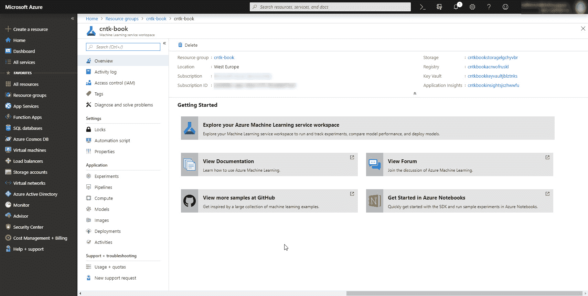

# 第七章：将模型部署到生产环境

在本书的前几章中，我们已经在开发、测试和使用各种深度学习模型方面提高了技能。我们没有过多讨论深度学习在软件工程更广泛背景中的作用。在这一章中，我们将利用这段时间讨论持续交付，以及机器学习在这一背景中的作用。然后，我们将探讨如何以持续交付的思维方式将模型部署到生产环境。最后，我们将讨论如何使用 Azure 机器学习服务来有效管理你开发的模型。

本章将覆盖以下主题：

+   在 DevOps 环境中使用机器学习

+   存储模型

+   使用 Azure 机器学习服务来管理模型

# 技术要求

我们假设你已在电脑上安装了最新版的 Anaconda，并按照第一章中的步骤，*开始使用 CNTK*，将 CNTK 安装在你的电脑上。本章的示例代码可以在我们的 GitHub 仓库中找到： [`github.com/PacktPublishing/Deep-Learning-with-Microsoft-Cognitive-Toolkit-Quick-Start-Guide/tree/master/ch7`](https://github.com/PacktPublishing/Deep-Learning-with-Microsoft-Cognitive-Toolkit-Quick-Start-Guide/tree/master/ch7)。

在本章中，我们将处理几个存储在 Jupyter 笔记本中的示例。要访问示例代码，请在你下载代码的目录中，打开 Anaconda 提示符并运行以下命令：

```py
cd ch7
jupyter notebook
```

本章还包含一个 C# 代码示例，用于演示如何加载开源的 ONNX 格式模型。如果你想运行 C# 代码，你需要在机器上安装 .NET Core 2.2。你可以从以下网址下载最新版本的 .NET Core：[`dotnet.microsoft.com/download`](https://dotnet.microsoft.com/download)。

查看以下视频，查看代码的实际效果：

[`bit.ly/2U8YkZf`](http://bit.ly/2U8YkZf)

# 在 DevOps 环境中使用机器学习

大多数现代软件开发都以敏捷的方式进行，在一个开发者和 IT 专业人员共同参与的环境中进行。我们所构建的软件通常通过持续集成和持续部署管道部署到生产环境中。我们如何在这种现代环境中集成机器学习？这是否意味着当我们开始构建 AI 解决方案时，我们必须做出很多改变？这些是当你将 AI 和机器学习引入工作流程时，常见的一些问题。

幸运的是，你不需要改变整个构建环境或部署工具栈，就可以将机器学习集成到你的软件中。我们将讨论的大部分内容都可以很好地融入你现有的环境中。

让我们来看一个典型的持续交付场景，这是你在常规敏捷软件项目中可能会遇到的：


如果你曾在 DevOps 环境中工作过，这个概述会让你感觉很熟悉。它从源代码管理开始，连接到持续集成管道。持续集成管道会生成可以部署到生产环境的工件。这些工件通常会被存储在某个地方，以便备份和回滚。这些工件仓库与一个发布管道相连接，发布管道将软件部署到测试、验收，最后到生产环境。

你不需要改变太多的标准设置就能将机器学习集成到其中。然而，开始使用机器学习时，有几个关键点是必须正确处理的。我们将重点讨论四个阶段，并探索如何扩展标准的持续交付设置：

+   如何跟踪你用于机器学习的数据。

+   在持续集成管道中训练模型。

+   将模型部署到生产环境。

+   收集生产反馈

# 跟踪你的数据

让我们从机器学习的起点开始：用于训练模型的数据。获取好的机器学习数据是非常困难的。几乎 80%的工作将会是数据管理和数据处理。如果每次训练模型时都不得不重做所有工作，那会非常令人沮丧。

这就是为什么拥有某种形式的数据管理系统非常重要的原因。这可以是一个中央服务器，用于存储你知道适合用来训练模型的数据集。如果你有超过几 GB 的数据，它也可以是一个数据仓库。一些公司选择使用像 Hadoop 或 Azure Data Lake 这样的工具来管理他们的数据。无论你使用什么，最重要的是保持数据集的干净，并且以适合训练的格式存储。

要为你的解决方案创建数据管道，你可以使用传统的**提取** **转换** **加载**（**ETL**）工具，如 SQL Server 集成服务，或者你可以在 Python 中编写自定义脚本，并将其作为 Jenkins、Azure DevOps 或 Team Foundation Server 中专用持续集成管道的一部分执行。

数据管道将是你从各种业务来源收集数据的工具，并处理它，以获得足够质量的数据集，作为你模型的主数据集存储。需要注意的是，虽然你可以在不同的模型间重用数据集，但最好不要一开始就以此为目标。你会很快发现，当你尝试将数据集用于太多不同的使用场景时，主数据集会变得脏乱且难以管理。

# 在持续集成管道中训练模型

一旦你有了基本的数据管道，接下来就是将 AI 模型的训练集成到持续集成环境中的时候了。到目前为止，我们只使用了 Python 笔记本来创建我们的模型。可惜的是，Python 笔记本在生产环境中并不好部署。你不能在构建过程中自动运行它们。

在持续交付环境中，你仍然可以使用 Python 笔记本进行初步实验，以便发现数据中的模式并构建模型的初始版本。一旦你有了候选模型，就必须将代码从笔记本迁移到一个正式的 Python 程序中。

你可以将 Python 训练代码作为持续集成管道的一部分来运行。例如，如果你使用 Azure DevOps、Team Foundation Server 或 Jenkins，你已经拥有了运行训练代码作为持续集成管道的所有工具。

我们建议将训练代码作为与其他软件独立的管道运行。训练深度学习模型通常需要很长时间，你不希望将构建基础设施锁定在这上面。通常，你会看到人们为他们的机器学习模型构建训练管道，使用专用的虚拟机，甚至专用硬件，因为训练模型需要大量的计算能力。

持续集成管道将基于你通过数据管道生成的数据集生成模型。就像代码一样，你也应该为你的模型和用于训练它们的设置进行版本控制。

跟踪你的模型和用于训练它们的设置非常重要，因为这可以让你在生产环境中尝试同一模型的不同版本，并收集反馈。保持已训练模型的备份还可以帮助你在灾难发生后迅速恢复生产，例如生产服务器崩溃。

由于模型是二进制文件，且可能非常大，最好将模型视为二进制工件，就像 .NET 中的 NuGet 包或 Java 中的 Maven 工件一样。

像 Nexus 或 Artifactory 这样的工具非常适合存储模型。在 Nexus 或 Artifactory 中发布你的模型只需要几行代码，并且能节省你数百小时的重新训练模型的工作。

# 将模型部署到生产环境

一旦你有了模型，你需要能够将其部署到生产环境。如果你将模型存储在诸如 Artifactory 或 Nexus 的仓库中，这将变得更加容易。你可以像创建持续集成管道一样创建专门的发布管道。在 Azure DevOps 和 Team Foundation Server 中，有一个专用的功能来实现这一点。在 Jenkins 中，你可以使用单独的管道将模型部署到服务器。

在发布管道中，你可以从工件仓库中下载模型并将其部署到生产环境。有两种主要的机器学习模型部署方法：你可以将其作为应用程序的额外文件进行部署，或者将其作为一个专用的服务组件进行部署。

如果你将模型作为应用程序的一部分进行部署，通常只会将模型存储在你的工件仓库中。现在，模型变成了一个额外的工件，需要在现有的发布管道中下载，并部署到你的解决方案中。

如果你为你的模型部署一个专用的服务组件，你通常会将模型、使用该模型进行预测的脚本以及模型所需的其他文件存储在工件仓库中，并将其部署到生产环境中。

# 收集模型反馈

在生产环境中使用深度学习或机器学习模型时，有一个最后需要记住的重要点。你用某个数据集训练了这些模型，你希望这个数据集能很好地代表生产环境中真实发生的情况。但实际情况可能并非如此，因为随着你构建模型，周围的世界也在变化。

这就是为什么向用户征求反馈并根据反馈更新模型非常重要的原因。尽管这不是持续部署环境的正式组成部分，但如果你希望你的机器学习解决方案成功运行，正确设置这一点仍然是非常重要的。

设置反馈循环并不需要非常复杂。例如，当你为欺诈检测分类交易时，你可以通过让员工验证模型的输出结果来设置反馈循环。然后，你可以将员工的验证结果与被分类的输入一起存储。通过这样做，你确保模型不会错误地指控客户欺诈，同时帮助你收集新的观察数据以改进模型。稍后，当你想要改进模型时，你可以使用新收集的观察数据来扩展你的训练集。

# 存储模型

为了能够将你的模型部署到生产环境中，你需要能够将训练好的模型存储到磁盘上。CNTK 提供了两种在磁盘上存储模型的方法。你可以存储检查点以便稍后继续训练，或者你可以存储一个便携版的模型。这两种存储方法各有其用途。

# 存储模型检查点以便稍后继续训练

一些模型训练时间较长，有时甚至需要几周时间。你不希望在训练过程中机器崩溃或者停电时丢失所有进度。

这时，检查点功能就变得非常有用。你可以在训练过程中使用`CheckpointConfig`对象创建一个检查点。你可以通过以下方式修改回调列表，添加此额外的回调到你的训练代码中：

```py
checkpoint_config = CheckpointConfig('solar.dnn', frequency=100, restore=True, preserve_all=False)

history = loss.train(
    train_datasource, 
    epoch_size=EPOCH_SIZE,
    parameter_learners=[learner], 
    model_inputs_to_streams=input_map,
    callbacks=[progress_writer, test_config, checkpoint_config],
    minibatch_size=BATCH_SIZE,
    max_epochs=EPOCHS)
```

按照以下步骤操作：

1.  首先，创建一个新的`CheckpointConfig`，并为检查点模型文件提供文件名，设置在创建新检查点之前的小批量数量作为`frequency`，并将`preserve_all`设置为`False`。

1.  接下来，使用`loss`上的 train 方法，并在`callbacks`关键字参数中提供`checkpoint_config`以使用检查点功能。

当你在训练过程中使用检查点时，你会在磁盘上看到额外的文件，名为 `solar.dnn` 和 `solar.dnn.ckp`。`solar.dnn` 文件包含以二进制格式存储的训练模型。`solar.dnn.ckp` 文件包含在训练过程中使用的小批量源的检查点信息。

当你将 `CheckpointConfig` 对象的 `restore` 参数设置为 `True` 时，最近的检查点会自动恢复给你。这使得在训练代码中集成检查点变得非常简单。

拥有一个检查点模型不仅在训练过程中遇到计算机问题时很有用。如果你在从生产环境收集到额外数据后希望继续训练，检查点也会派上用场。你只需要恢复最新的检查点，然后从那里开始将新的样本输入到模型中。

# 存储可移植的模型以供其他应用使用

尽管你可以在生产环境中使用检查点模型，但这样做并不聪明。检查点模型以 CNTK 只能理解的格式存储。现在，使用二进制格式是可以的，因为 CNTK 仍然存在，且模型格式将在相当长一段时间内保持兼容。但和所有软件一样，CNTK 并不是为了永恒存在而设计的。

这正是 ONNX 被发明的原因。ONNX 是开放的神经网络交换格式。当你使用 ONNX 时，你将模型存储为 protobuf 兼容的格式，这种格式被许多其他框架所理解。甚至还有针对 Java 和 C# 的原生 ONNX 运行时，这使得你可以在 .NET 或 Java 应用程序中使用 CNTK 创建的模型。

ONNX 得到了许多大型公司的支持，如 Facebook、Intel、NVIDIA、Microsoft、AMD、IBM 和惠普。这些公司中的一些提供了 ONNX 转换器，而另一些甚至支持在其硬件上直接运行 ONNX 模型，而无需使用额外的软件。NVIDIA 目前有多款芯片可以直接读取 ONNX 文件并执行这些模型。

作为示例，我们将首先探索如何将模型存储为 ONNX 格式，并使用 C# 从磁盘加载它来进行预测。首先，我们将看看如何保存一个模型为 ONNX 格式，之后再探索如何加载 ONNX 模型。

# 存储 ONNX 格式的模型

要将模型存储为 ONNX 格式，你可以在 `model` 函数上使用 `save` 方法。当你不提供额外参数时，它将以用于检查点存储的相同格式存储模型。不过，你可以提供额外的参数来指定模型格式，如下所示：

```py
from cntk import ModelFormat

model.save('solar.onnx', format=ModelFormat.ONNX)
```

按照以下步骤操作：

1.  首先，从 `cntk` 包中导入 `ModelFormat` 枚举。

1.  接下来，在训练好的模型上调用 `save` 方法，指定输出文件名，并将 `ModelFormat.ONNX` 作为 `format` 关键字参数。

# 在 C# 中使用 ONNX 模型

一旦模型存储在磁盘上，我们可以使用 C# 加载并使用它。CNTK 版本 2.6 包含了一个相当完整的 C# API，你可以用它来训练和评估模型。

要在 C# 中使用 CNTK 模型，你需要使用一个名为`CNTK.GPU`或`CNTK.CPUOnly`的库，它们可以通过 NuGet（.NET 的包管理器）获取。CNTK 的 CPU-only 版本包含了已编译的 CNTK 二进制文件，用于在 CPU 上运行模型，而 GPU 版本则既可以使用 GPU，也可以使用 CPU。

使用 C# 加载 CNTK 模型是通过以下代码片段实现的：

```py
var deviceDescriptor = DeviceDescriptor.CPUDevice;
var function = Function.Load("model.onnx", deviceDescriptor, ModelFormat.ONNX);
```

按照给定的步骤操作：

1.  首先，创建一个设备描述符，以便模型在 CPU 上执行。

1.  接下来，使用 `Function.Load` 方法加载先前存储的模型。提供 `deviceDescriptor`，并使用 `ModelFormat.ONNX` 将文件加载为 ONNX 模型。

现在我们已经加载了模型，接下来让我们用它进行预测。为此，我们需要编写另一个代码片段：

```py
public IList<float> Predict(float petalWidth, float petalLength, float sepalWidth, float sepalLength)
{
    var features = _modelFunction.Inputs[0];
    var output = _modelFunction.Outputs[0];

    var inputMapping = new Dictionary<Variable, Value>();
    var outputMapping = new Dictionary<Variable, Value>();

    var batch = Value.CreateBatch(
        features.Shape,
        new float[] { sepalLength, sepalWidth, petalLength, petalWidth },
        _deviceDescriptor);

    inputMapping.Add(features, batch);
    outputMapping.Add(output, null);

    _modelFunction.Evaluate(inputMapping, outputMapping, _deviceDescriptor);

    var outputValues = outputMapping[output].GetDenseData<float>(output);
    return outputValues[0];
}
```

按照给定的步骤操作：

1.  创建一个新的 `Predict` 方法，该方法接受模型的输入特征。

1.  在 `Predict` 方法中，将模型的输入和输出变量存储在两个独立的变量中，方便访问。

1.  接下来，创建一个字典，将数据映射到模型的输入和输出变量。

1.  然后，创建一个新的批次，包含一个样本，作为模型的输入特征。

1.  向输入映射添加一个新条目，将批次映射到输入变量。

1.  接下来，向输出映射添加一个新条目，映射到输出变量。

1.  现在，使用输入、输出映射和设备描述符在加载的模型上调用`Evaluate`方法。

1.  最后，从输出映射中提取输出变量并检索数据。

本章的示例代码包含一个基本的 .NET Core C# 项目，演示了如何在 .NET Core 项目中使用 CNTK。你可以在本章的代码示例目录中的 `csharp-client` 文件夹找到示例代码。

使用存储为 ONNX 格式的模型，可以让你用 Python 训练模型，使用 C# 或其他语言在生产环境中运行模型。这尤其有用，因为像 C# 这样的语言的运行时性能通常比 Python 更好。

在下一节中，我们将介绍如何使用 Azure 机器学习服务来管理训练和存储模型的过程，从而让我们能够更加有条理地处理模型。

# 使用 Azure 机器学习服务来管理模型

虽然你可以完全手动构建一个持续集成管道，但这仍然是相当费力的工作。你需要购买专用硬件来运行深度学习训练任务，这可能会带来更高的成本。不过，云端有很好的替代方案。Google 提供了 TensorFlow 服务，Microsoft 提供了 Azure 机器学习服务来管理模型。两者都是非常出色的工具，我们强烈推荐。

让我们看看 Azure 机器学习服务，当你希望设置一个完整的机器学习管道时，它可以为你做些什么：


Azure 机器学习服务是一个云服务，提供每个机器学习项目阶段的完整解决方案。它具有实验和运行的概念，允许你管理实验。它还提供模型注册功能，可以存储已训练的模型和这些模型的 Docker 镜像。你可以使用 Azure 机器学习服务工具将这些模型快速部署到生产环境中。

# 部署 Azure 机器学习服务

要使用此服务，你需要在 Azure 上拥有一个有效账户。如果你还没有账户，可以访问：[`azure.microsoft.com/en-gb/free/`](https://azure.microsoft.com/en-gb/free/)，使用试用账户。这将为你提供一个免费账户，有效期为 12 个月，附带价值 150 美元的信用额度，可以探索各种 Azure 服务。

部署 Azure 机器学习服务有很多种方式。你可以通过门户创建一个新实例，也可以使用云 Shell 创建服务实例。让我们看看如何通过门户创建一个新的 Azure 机器学习服务实例。

使用你最喜欢的浏览器，导航到以下 URL：[`portal.azure.com/`](https://portal.azure.com/)。使用你的凭据登录，你将看到一个门户，展示所有可用的 Azure 资源和一个类似于以下截图的仪表板：


Azure 资源和仪表板

通过此门户，你可以创建新的 Azure 资源，例如 Azure 机器学习工作区。在屏幕左上角点击大号的 + 按钮开始操作。这将显示以下页面，允许你创建一个新的资源：


创建新资源

你可以在此搜索框中搜索不同类型的资源。搜索 Azure 机器学习并从列表中选择 Azure 机器学习工作区资源类型。这将显示以下详细信息面板，允许你启动创建向导：


开始创建向导

该详细信息面板将解释该资源的功能，并指向文档及有关此资源的其他重要信息，例如定价详情。要创建此资源类型的新实例，请点击创建按钮。这将启动创建 Azure 机器学习工作区实例的向导，如下所示：


创建一个新的 Azure 机器学习工作区实例

在创建向导中，您可以配置工作区的名称、它所属的资源组以及它应该创建的数据中心。Azure 资源作为资源组的一部分创建。这些资源组有助于组织您的资源，并将相关的基础设施集中在一个地方。如果您想删除一组资源，可以直接删除资源组，而不需要单独删除每个资源。如果您完成机器学习工作区的测试后想要删除所有内容，这个功能尤其有用。

使用专用的资源组来创建机器学习工作区是一个好主意，因为它将包含多个资源。如果与其他资源混合使用，将使得在完成后清理资源或需要移动资源时变得更加困难。

一旦点击屏幕底部的创建按钮，机器学习工作区就会被创建。这需要几分钟时间。在后台，Azure 资源管理器将根据创建向导中的选择创建多个资源。部署完成后，您将在门户中收到通知。

创建机器学习工作区后，您可以通过门户进行导航。首先，在屏幕左侧的导航栏中进入资源组。接下来，点击您刚刚创建的资源组，以查看机器学习工作区及其相关资源的概况，如下图所示：


了解机器学习工作区和相关资源概况

工作区本身包括一个仪表板，您可以通过它来探索实验并管理机器学习解决方案的某些方面。工作区还包括一个 Docker 注册表，用于存储模型作为 Docker 镜像，以及用于使用模型进行预测所需的脚本。当您在 Azure 门户查看工作区时，您还会找到一个存储帐户，您可以使用它来存储数据集和实验生成的数据。

Azure 机器学习服务环境中的一个亮点是包含了一个应用程序洞察（Application Insights）实例。您可以使用应用程序洞察来监控生产环境中的模型，并收集宝贵的反馈以改进模型。这是默认包含的，因此您不需要为机器学习解决方案手动创建监控解决方案。

# 探索机器学习工作区

Azure 机器学习工作区包含多个元素。让我们来探索一下这些元素，以便了解当您开始使用工作区时可以使用哪些功能：



机器学习工作区

要进入机器学习工作区，点击屏幕左侧导航栏中的资源组项目。选择包含机器学习工作区项目的资源组，并点击机器学习工作区。它将显示你在创建向导中之前配置的名称。

在工作区中，有一个专门用于实验的部分。这个部分将提供对你在工作区中运行的实验以及作为实验一部分执行的运行的详细信息。

机器学习工作区的另一个有用部分是模型部分。当你训练了一个模型时，你可以将它存储在模型注册表中，以便以后将其部署到生产环境。模型会自动连接到生成它的实验运行，因此你总是可以追溯到使用了什么代码来生成模型，以及训练模型时使用了哪些设置。

模型部分下方是镜像部分。这个部分显示了你从模型创建的 Docker 镜像。你可以将模型与评分脚本一起打包成 Docker 镜像，以便更轻松、可预测地部署到生产环境。

最后，部署部分包含了所有基于镜像的部署。你可以使用 Azure 机器学习服务将模型部署到生产环境，使用单个容器实例、虚拟机，或者如果需要扩展模型部署，还可以使用 Kubernetes 集群。

Azure 机器学习服务还提供了一种技术，允许你构建一个管道，用于准备数据、训练模型并将其部署到生产环境。如果你想构建一个包含预处理步骤和训练步骤的单一过程，这个功能将非常有用。特别是在需要执行多个步骤才能获得训练模型的情况下，它尤其强大。现在，我们将限制自己进行基本的实验并将结果模型部署到生产 Docker 容器实例中。

# 运行你的第一个实验

现在你已经有了工作区，我们来看看如何在 Python 笔记本中使用它。我们将修改一些深度学习代码，以便将训练后的模型作为实验的输出保存到 Azure 机器学习服务的工作区，并跟踪模型的指标。

首先，我们需要安装`azureml`包，方法如下：

```py
pip install --upgrade azureml-sdk[notebooks]
```

`azureml`包包含了运行实验所需的组件。为了使其工作，你需要在机器学习项目的根目录下创建一个名为`config.json`的文件。如果你正在使用本章的示例代码，你可以修改`azure-ml-service`文件夹中的`config.json`文件。它包含以下内容：

```py
{
    "workspace_name": "<workspace name>",
    "resource_group": "<resource group>",
    "subscription_id": "<your subscription id>"
}
```

这个文件包含了你的 Python 代码将使用的工作区、包含该工作区的资源组，以及创建工作区的订阅。工作区名称应与之前在向导中创建工作区时选择的名称匹配。资源组应与包含该工作区的资源组匹配。最后，你需要找到订阅 ID。

当你在门户中导航到机器学习工作区的资源组时，你会看到资源组详情面板顶部显示了订阅 ID，如下图所示：


资源组详情面板顶部的订阅 ID

当你将鼠标悬停在订阅 ID 的值上时，门户会显示一个按钮，允许你将该值复制到剪贴板。将此值粘贴到配置文件中的 subscriptionId 字段，并保存。你现在可以通过以下代码片段从任何 Python 笔记本或 Python 程序连接到你的工作区：

```py
from azureml.core import Workspace, Experiment

ws = Workspace.from_config()
experiment = Experiment(name='classify-flowers', workspace=ws)
```

按照给定的步骤操作：

1.  首先，我们基于刚才创建的配置文件创建一个新的工作区。这将连接到 Azure 中的工作区。一旦连接成功，你可以创建一个新的实验，并为它选择一个名称，然后将其连接到工作区。

1.  接下来，创建一个新的实验并将其连接到工作区。

在 Azure 机器学习服务中，实验可用于跟踪你正在使用 CNTK 测试的架构。例如，你可以为卷积神经网络创建一个实验，然后再创建一个实验来尝试使用递归神经网络解决相同的问题。

让我们探索如何跟踪实验中的度量和其他输出。我们将使用前几章的鸢尾花分类模型，并扩展训练逻辑以跟踪度量，具体如下：

```py
from cntk import default_options, input_variable
from cntk.layers import Dense, Sequential
from cntk.ops import log_softmax, sigmoid

model = Sequential([
    Dense(4, activation=sigmoid),
    Dense(3, activation=log_softmax)
])

features = input_variable(4)
z = model(features)
```

按照给定的步骤操作：

1.  首先，导入`default_options`和`input_variable`函数。

1.  接下来，从`cntk.layers`模块导入模型所需的层类型。

1.  然后，从`cntk.ops`模块导入`log_softmax`和`sigmoid`激活函数。

1.  创建一个新的`Sequential`层集。

1.  向`Sequential`层集添加一个新的`Dense`层，包含 4 个神经元和`sigmoid`激活函数。

1.  添加另一个具有 3 个输出的`Dense`层，并使用`log_softmax`激活函数。

1.  创建一个新的`input_variable`，大小为 4。

1.  使用`features`变量调用模型以完成模型。

为了训练模型，我们将使用手动的小批量循环。首先，我们需要加载并预处理鸢尾花数据集，以便它与我们的模型所期望的格式匹配，如下方的代码片段所示：

```py
import pandas as pd
import numpy as np

df_source = pd.read_csv('iris.csv', 
    names=['sepal_length', 'sepal_width','petal_length','petal_width', 'species'], 
    index_col=False)

X = df_source.iloc[:, :4].values
y = df_source['species'].values
```

按照给定的步骤操作：

1.  导入`pandas`和`numpy`模块以加载包含训练样本的 CSV 文件。

1.  使用 read_csv 函数加载包含训练数据的输入文件。

1.  接下来，提取前 4 列作为输入特征。

1.  最后，提取物种列作为标签。

标签是以字符串形式存储的，因此我们需要将它们转换为一组独热向量，以便与模型匹配，具体如下：

```py
label_mapping = {
    'Iris-setosa': 0,
    'Iris-versicolor': 1,
    'Iris-virginica': 2
}

def one_hot(index, length):
    result = np.zeros(length)
    result[index] = 1.

y = [one_hot(label_mapping[v], 3) for v in y]
```

按照以下步骤操作：

1.  创建一个标签到其数值表示的映射。

1.  接下来，定义一个新的工具函数`one_hot`，将数字值编码为独热向量。

1.  最后，使用 Python 列表推导式遍历标签集合中的值，并将它们转换为独热编码向量。

我们需要执行一步操作来准备数据集进行训练。为了能够验证模型是否已正确优化，我们希望创建一个保留集，并在该集上进行测试：

```py
from sklearn.model_selection import train_test_split

X_train, X_test, y_train, y_test = train_test_split(X,y, test_size=0.2, stratify=y)
```

使用`train_test_split`方法，创建一个包含 20%训练样本的小型保留集。使用`stratify`关键字并提供标签，以平衡拆分。

一旦我们准备好了数据，就可以专注于训练模型。首先，我们需要设置一个`loss`函数、`learner`和`trainer`，如下所示：

```py
from cntk.losses import cross_entropy_with_softmax
from cntk.metrics import classification_error
from cntk.learners import sgd
from cntk.train.trainer import Trainer

label = input_variable(3)

loss = cross_entropy_with_softmax(z, label)
error_rate = classification_error(z, label)

learner = sgd(z.parameters, 0.001)
trainer = Trainer(z, (loss, error_rate), [learner])
```

1.  从`cntk.losses`模块导入 cross_entropy_with_softmax 函数。

1.  接下来，从`cnkt.metrics`模块导入 classification_error 函数。

1.  然后，从`cntk.learners`模块导入`sgd`学习器。

1.  创建一个新的`input_variable`，形状为 3，用于存储标签。

1.  接下来，创建一个新的 cross_entropy_with_softmax 损失实例，并为其提供模型变量`z`和`label`变量。

1.  然后，使用 classification_error 函数创建一个新的指标，并为其提供网络和`label`变量。

1.  现在，使用网络的参数初始化`sgd`学习器，并将其学习率设置为 0.001。

1.  最后，使用网络、`loss`、`metric`和`learner`初始化`Trainer`。

通常，我们可以直接在`loss`函数上使用`train`方法来优化模型中的参数。然而，这一次，我们希望对训练过程进行控制，以便能够注入逻辑以跟踪 Azure 机器学习工作区中的指标，如以下代码片段所示：

```py
import os
from cntk import ModelFormat

with experiment.start_logging() as run:
    for _ in range(10):
        trainer.train_minibatch({ features: X_train, label: y_train })

        run.log('average_loss', trainer.previous_minibatch_loss_average)
        run.log('average_metric', trainer.previous_minibatch_evaluation_average)

    test_metric = trainer.test_minibatch( {features: X_test, label: y_test })
```

按照以下步骤操作：

1.  要开始一个新的训练，调用实验的`start_logging`方法。这将创建一个新的`run`。在该运行的范围内，我们可以执行训练逻辑。

1.  创建一个新的 for 循环进行 10 个训练周期。

1.  在 for 循环内，调用`trainer`上的`train_minibatch`方法进行模型训练。为其提供输入变量与用于训练的数据之间的映射。

1.  在此之后，使用来自训练器对象的`previous_minibatch_loss_average`值记录`average_loss`指标。

1.  除了平均损失外，还使用训练器对象的`previous_minibatch_evaluation_average`属性在运行中记录平均指标。

一旦我们训练完模型，就可以使用`test_minibatch`方法在测试集上执行测试。该方法返回我们之前创建的`metric`函数的输出。我们也会将其记录到机器学习工作区中。

运行允许我们跟踪与模型单次训练会话相关的数据。我们可以使用 `run` 对象上的 `log` 方法记录度量数据。该方法接受度量的名称和度量的值。你可以使用此方法记录诸如 `loss` 函数的输出，以监控模型如何收敛到最佳参数集。

还可以记录其他内容，例如用于训练模型的 epoch 数量、程序中使用的随机种子以及其他有用的设置，以便日后复现实验。

在机器学习工作区的实验标签下，导航到实验时，运行期间记录的度量数据会自动显示在门户上，如下图所示。


在机器学习工作区的实验标签下导航到实验

除了 `log` 方法，还有一个 `upload_file` 方法用于上传训练过程中生成的文件，示例如下代码片段。你可以使用这个方法存储训练完成后保存的模型文件：

```py
z.save('outputs/model.onnx') # The z variable is the trained model
run.upload_file('model.onnx', 'outputs/model.onnx')
```

`upload_file` 方法需要文件的名称（在工作区中可以找到）和文件的本地路径。请注意文件的位置。由于 Azure 机器学习工作区的限制，它只会从输出文件夹中提取文件。这个限制未来可能会被解除。

确保在运行的作用域内执行 `upload_file` 方法，这样 AzureML 库就会将模型链接到你的实验运行，从而使其可追溯。

在将文件上传到工作区后，你可以在门户中通过运行的输出部分找到它。要查看运行详情，请打开 Azure Portal 中的机器学习工作区，导航到实验，然后选择你想查看详情的运行，如下所示：


选择运行

最后，当你完成运行并希望发布模型时，可以按照以下步骤将其注册到模型注册表：

```py
stored_model = run.register_model(model_name='classify_flowers', model_path='model.onnx')
```

`register_model` 方法将模型存储在模型注册表中，以便你可以将其部署到生产环境。当模型先前存储在注册表中时，它将自动作为新版本存储。现在你可以随时回到之前的版本，如下所示：


作为新版本存储的模型

你可以通过前往 Azure Portal 上的机器学习工作区，并在工作区导航菜单中的模型项下找到模型注册表。

模型会自动与实验运行相关联，因此你总能找到用于训练模型的设置。这一点很重要，因为它增加了你能够复现结果的可能性，如果你需要这样做的话。

我们将实验限制在本地运行。如果你愿意，可以使用 Azure Machine Learning 在专用硬件上运行实验。你可以在 Azure Machine Learning 文档网站上阅读更多相关信息：[`docs.microsoft.com/en-us/azure/machine-learning/service/how-to-set-up-training-targets`](https://docs.microsoft.com/en-us/azure/machine-learning/service/how-to-set-up-training-targets)。

一旦完成实验运行，你就可以将训练好的模型部署到生产环境。在下一部分，我们将探讨如何执行此操作。

# 将模型部署到生产环境

Azure Machine Learning 的一个有趣功能是其附带的部署工具。该部署工具允许你从模型注册表中提取模型，并将其部署到生产环境中。

在将模型部署到生产环境之前，你需要有一个包含模型和评分脚本的镜像。该镜像是一个包含 Web 服务器的 Docker 镜像，当收到请求时，它会调用评分脚本。评分脚本接受 JSON 格式的输入，并利用它通过模型进行预测。我们针对鸢尾花分类模型的评分脚本如下所示：

```py
import os
import json
import numpy as np
from azureml.core.model import Model
import onnxruntime

model = None

def init():
    global model

    model_path = Model.get_model_path('classify_flowers')
    model = onnxruntime.InferenceSession(model_path)

def run(raw_data):
    data = json.loads(raw_data)
    data = np.array(data).astype(np.float32)

    input_name = model.get_inputs()[0].name
    output_name = model.get_outputs()[0].name

    prediction = model.run([output_name], { input_name: data})

    # Select the first output from the ONNX model.
    # Then select the first row from the returned numpy array.
    prediction = prediction[0][0]

    return json.dumps({'scores': prediction.tolist() })
```

按照给定步骤操作：

1.  首先，导入构建脚本所需的组件。

1.  接着，定义一个全局模型变量，用于存储加载的模型。

1.  之后，定义 init 函数来初始化脚本中的模型。

1.  在 init 函数中，使用`Model.get_model_path`函数检索模型的路径。这将自动定位 Docker 镜像中的模型文件。

1.  接下来，通过初始化`onnxruntime.InferenceSession`类的新实例来加载模型。

1.  定义另一个函数`run`，该函数接受一个参数`raw_data`。

1.  在`run`函数中，将`raw_data`变量的内容从 JSON 转换为 Python 数组。

1.  接着，将`data`数组转换为 Numpy 数组，这样我们就可以用它来进行预测。

1.  然后，使用加载的模型的`run`方法，并将输入特征提供给它。包括一个字典，告诉 ONNX 运行时如何将输入数据映射到模型的输入变量。

1.  模型返回一个包含 1 个元素的输出数组，用于模型的输出。该输出包含一行数据。从输出数组中选择第一个元素，再从选中的输出变量中选择第一行，并将其存储在`prediction`变量中。

1.  最后，返回预测结果作为 JSON 对象。

Azure Machine Learning 服务将自动包含你为特定模型注册的任何模型文件，当你创建容器镜像时。因此，`get_model_path`也可以在已部署的镜像中使用，并解析为容器中托管模型和评分脚本的目录。

现在我们有了评分脚本，接下来让我们创建一个镜像，并将该镜像部署为云中的 Web 服务。要部署 Web 服务，你可以明确地创建一个镜像，或者你可以让 Azure 机器学习服务根据你提供的配置自动创建一个，方法如下：

```py
from azureml.core.image import ContainerImage

image_config = ContainerImage.image_configuration(
    execution_script="score.py", 
    runtime="python", 
    conda_file="conda_env.yml")
```

按照以下步骤操作：

1.  首先，从`azureml.core.image`模块导入 ContainerImage 类。

1.  接下来，使用`ContainerImage.image_configuration`方法创建一个新的镜像配置。为其提供 score.py 作为`execution_script`参数，Python `runtime`，并最终提供 conda_env.yml 作为镜像的`conda_file`。

我们将容器镜像配置为使用 Python 作为运行时。我们还配置了一个特殊的 Anaconda 环境文件，以便可以像以下这样配置 CNTK 等自定义模块：

```py
name: project_environment
dependencies:
  # The python interpreter version.
  # Currently Azure ML only supports 3.5.2 and later.
- python=3.6.2

- pip:
    # Required packages for AzureML execution, history, and data preparation.

  - azureml-defaults
  - onnxruntime
```

按照以下步骤操作：

1.  首先，为环境命名。这个步骤是可选的，但在你从此文件本地创建环境进行测试时会很有用。

1.  接下来，为你的评分脚本提供 Python 版本 3.6.2。

1.  最后，将一个包含`azureml-default`和`onnxruntime`的子列表添加到 pip 依赖列表中。

`azureml-default`包包含了在 docker 容器镜像中处理实验和模型所需的所有内容。它还包括像 Numpy 和 Pandas 这样的标准包，便于安装。`onnxruntime`包是必须的，因为我们需要在使用的评分脚本中加载模型。

部署已训练的模型作为 Web 服务还需要一步操作。我们需要设置 Web 服务配置并将模型作为服务部署。机器学习服务支持部署到虚拟机、Kubernetes 集群和 Azure 容器实例，这些都是在云中运行的基本 Docker 容器。以下是如何将模型部署到 Azure 容器实例：

```py
from azureml.core.webservice import AciWebservice, Webservice

aciconfig = AciWebservice.deploy_configuration(cpu_cores=1, memory_gb=1)

service = Webservice.deploy_from_model(workspace=ws,
                                       name='classify-flowers-svc',
                                       deployment_config=aciconfig,
                                       models=[stored_model],
                                       image_config=image_config)
```

按照以下步骤操作：

1.  首先，从`azureml.core.webservice`模块导入 AciWebservice 和 Webservice 类。

1.  然后，使用 AziWebservice 类上的`deploy_configuration`方法创建一个新的`AciWebservice`配置。为其提供一组资源限制，包括 1 个 CPU 和 1GB 内存。

1.  当你为 Web 服务配置完成后，调用`deploy_from_model`，使用要部署的工作区、服务名称以及要部署的模型，将已注册的模型部署到生产环境。提供你之前创建的镜像配置。

一旦容器镜像创建完成，它将作为容器实例部署到 Azure。这将为你的机器学习工作区在资源组中创建一个新资源。

一旦新服务启动，你将在 Azure 门户的机器学习工作区中看到新的部署，如下图所示：


在你的机器学习工作区的 Azure 门户上进行新部署

部署包括一个评分 URL，您可以从应用程序中调用该 URL 来使用模型。由于您使用的是 REST 来调用模型，因此您与它在后台运行 CNTK 的事实是隔离的。您还可以使用任何您能想到的编程语言，只要它能够执行 HTTP 请求。

例如，在 Python 中，我们可以使用 `requests` 包作为基本的 REST 客户端，通过您刚创建的服务进行预测。首先，让我们安装 `requests` 模块，如下所示：

```py
pip install --upgrade requests
```

安装了 `requests` 包后，我们可以编写一个小脚本，通过以下方式对已部署的服务执行请求：

```py
import requests
import json

service_url = "<service-url>"
data = [[1.4, 0.2, 4.9, 3.0]]

response = requests.post(service_url, json=data)

print(response.json())
```

按照给定的步骤操作：

1.  首先，导入 requests 和 json 包。

1.  接下来，为 service_url 创建一个新变量，并用 Web 服务的 URL 填充它。

1.  然后，创建另一个变量来存储您想要进行预测的数据。

1.  之后，使用 requests.post 函数将数据发布到已部署的服务并存储响应。

1.  最后，读取响应中返回的 JSON 数据以获取预测值。

可以通过以下步骤获取 service_url：

1.  首先，导航到包含机器学习工作区的资源组。

1.  然后，选择工作区并在详细信息面板的左侧选择部署部分。

1.  选择您想查看详细信息的部署，并从详细信息页面复制 URL。


选择部署

当您运行刚创建的脚本时，您将收到包含输入样本预测类别的响应。输出将类似于以下内容：

```py
{"scores": [-2.27234148979187, -2.486853837966919, -0.20609207451343536]}
```

# 总结

在本章中，我们了解了将深度学习和机器学习模型投入生产所需的条件。我们探讨了一些基本原理，这些原理将帮助您在持续交付环境中成功实施深度学习。

我们已经查看了将模型导出到 ONNX 的方法，借助 ONNX 格式的可移植性，使得将训练好的模型部署到生产环境并保持多年运行变得更加容易。接着，我们探讨了如何使用 CNTK API 在其他语言中，如 C#，来进行预测。

最后，我们探讨了如何使用 Azure 机器学习服务，通过实验管理、模型管理和部署工具提升您的 DevOps 体验。尽管您不需要像这样的工具就能入门，但在您计划将更大的项目投入生产时，拥有像 Azure 机器学习服务这样的工具，确实能够为您提供很大帮助。

本章标志着本书的结束。在第一章中，我们开始探索了 CNTK。接着，我们学习了如何构建模型、为模型提供数据并评估其性能。基础内容讲解完毕后，我们研究了两个有趣的应用案例，分别涉及图像和时间序列数据。最后，我们介绍了如何将模型投入生产。现在，你应该已经掌握了足够的信息，可以开始使用 CNTK 构建自己的模型了！
