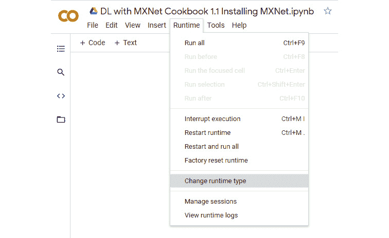
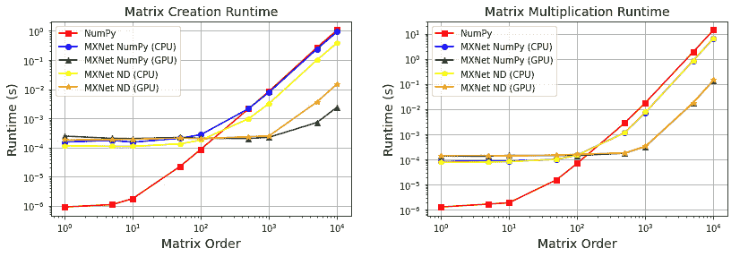

# 第一章：快速启动 MXNet

**MXNet**是最常用的深度学习框架之一，是一个 Apache 开源项目。在 2016 年之前，**Amazon Web Services**（**AWS**）的研究团队并没有使用特定的深度学习框架，而是允许每个团队根据自己的选择进行研究和开发。尽管一些深度学习框架拥有蓬勃发展的社区，但有时 AWS 无法以所需的速度修复代码错误（还有其他问题）。为了解决这些问题，在 2016 年底，AWS 宣布将 MXNet 作为其首选的深度学习框架，并投资内部团队进一步开发。支持 MXNet 的研究机构包括英特尔、百度、微软、卡内基梅隆大学和麻省理工学院等。该框架由卡内基梅隆大学的 Carlos Guestrin 与华盛顿大学（以及 GraphLab）共同开发。

它的一些优势如下：

+   命令式/符号式编程及其混合化（将在*第一章*和*第九章*中讲解）

+   支持多 GPU 和分布式训练（将在*第七章*和*第八章*中讲解）

+   针对推理生产系统进行了高度优化（将在*第七章*和*第九章*中讲解）

+   在计算机视觉和自然语言处理等领域，拥有大量预训练模型，这些模型存储在它的 Model Zoos 中（将在*第六章*、*第七章*和*第八章*中讲解）

要开始使用 MXNet，我们需要安装该库。MXNet 有多个不同版本可以安装，在本章中，我们将介绍如何选择合适的版本。最重要的参数将是我们所拥有的硬件。为了优化性能，最好最大化利用现有硬件的能力。我们将比较著名的线性代数库 NumPy 与 MXNet 中相似操作的使用方式。然后，我们将比较不同 MXNet 版本与 NumPy 的性能。

MXNet 包含自己的深度学习 API——Gluon，此外，Gluon 还提供了用于计算机视觉和自然语言处理的不同库，这些库包含预训练模型和实用工具。这些库被称为 GluonCV 和 GluonNLP。

本章将涵盖以下主题：

+   安装 MXNet、Gluon、GluonCV 和 GluonNLP

+   NumPy 与 MXNet ND 数组——比较它们的性能

# 技术要求

除了*前言*中指定的技术要求外，本章没有其他要求。

本章的代码可以在以下 GitHub 网址找到：[`github.com/PacktPublishing/Deep-Learning-with-MXNet-Cookbook/tree/main/ch01`](https://github.com/PacktPublishing/Deep-Learning-with-MXNet-Cookbook/tree/main/ch01)。

此外，你可以直接通过 Google Colab 访问每个食谱——例如，使用以下链接访问本章的第一个食谱：[`colab.research.google.com/github/PacktPublishing/Deep-Learning-with-MXNet-Cookbook/blob/main/ch01/1_1_Installing_MXNet.ipynb`](https://colab.research.google.com/github/PacktPublishing/Deep-Learning-with-MXNet-Cookbook/blob/main/ch01/1_1_Installing_MXNet.ipynb)。

# 安装 MXNet、Gluon、GluonCV 和 GluonNLP

为了最大化利用现有的软件（编程语言）和硬件（CPU 和 GPU）性能，有不同版本的 MXNet 库可以安装。在本节中，我们将学习如何安装它们。

## 准备工作

在开始安装 MXNet 之前，让我们回顾一下我们将使用的软件包的不同版本，包括 MXNet。这样做的原因是，为了最大化性能，我们的硬件配置必须与所选软件包版本相匹配：

+   **Python**：MXNet 支持多种编程语言——如 Python、Java、R 和 C++等。我们将使用 MXNet 的 Python 版本，建议使用 Python 3.7 及以上版本。

+   **Jupyter**：Jupyter 是一个开源 Web 应用程序，提供了一个易于使用的界面来显示 Markdown 文本、可运行代码和数据可视化。它对于理解深度学习非常有用，因为我们可以描述概念，编写运行这些概念的代码，并可视化结果（通常将其与输入数据进行比较）。建议使用 Jupyter Core 4.5 及以上版本。

+   **CPU 和 GPU**：MXNet 可以与任何硬件配置兼容——也就是说，任何单一的 CPU 都可以运行 MXNet。然而，MXNet 可以利用多个硬件组件来提升性能：

    +   **Intel CPUs**：Intel 开发了一种名为**数学核心库（Math Kernel Library，**MKL**）**的库，用于优化数学运算。MXNet 支持该库，使用优化版本可以提高某些操作的性能。任何现代版本的 Intel MKL 都足够。

    +   **NVIDIA GPUs**：NVIDIA 开发了一种名为**计算统一设备架构（CUDA）**的库，用于优化并行操作（例如在深度学习中非常常见的矩阵运算）。MXNet 支持该库，使用优化版本可以显著提高大规模深度学习工作负载的性能，如模型训练。建议使用 CUDA 11.0 及以上版本。

+   **MXNet 版本**：写作时，MXNet 1.9.1 是已发布的最新稳定版本。全书中的所有代码都已使用此版本验证。MXNet 和深度学习一般可以视为一个持续进行的项目，因此，新版本会定期发布。这些新版本将具有改进的功能和新特性，但也可能包含与旧版 API 不兼容的重大更改。如果您在几个月后再次阅读此书，并且发布了包含重大更改的新版本，这里也有关于如何安装特定版本 MXNet 1.8.0 的说明。

提示

我在本书中使用 Google Colab 作为运行代码的平台。写作时，它提供 Python 3.10.12、最新的 Jupyter 库、英特尔 CPU（Xeon @ 2.3 GHz）和 NVIDIA GPU（可变：K80、T4、P4 和 P100），并预装了 CUDA 11.8。因此，安装 MXNet 并使其运行的步骤非常简便。

## 如何操作...

在全书中，我们不仅会大量使用代码，还会在代码中添加注释和标题来提供结构，同时也会展示一些视觉信息，如图像或生成的图表。出于这些原因，我们将使用 Jupyter 作为支持的开发环境。此外，为了简化设置、安装和实验过程，我们将使用 Google Colab。

Google Colab 是一个托管的 Jupyter Notebook 服务，无需设置即可使用，同时提供免费访问计算资源的权限，包括 GPU。为了正确设置 Google Colab，本节分为两个主要部分：

+   设置笔记本

+   验证和安装库

重要提示

如果您愿意，您可以使用任何支持 Python 3.7+ 的本地环境，如 Anaconda 或其他 Python 发行版。如果您的硬件规格优于 Google Colab 提供的硬件，强烈建议使用本地环境，因为更好的硬件可以减少计算时间。

### 设置笔记本

在本节中，我们将学习如何使用 Google Colab 并设置一个新的笔记本，我们将使用该笔记本来验证 MXNet 安装：

1.  打开您喜欢的网页浏览器。在本书中，我一直使用 Google Chrome 浏览器。访问 [`colab.research.google.com/`](https://colab.research.google.com/) 并点击 **新建笔记本**。


图 1.1 – Google Colab 启动画面

1.  更改笔记本的标题 – 例如，如下截图所示，我已将标题更改为`DL with MXNet Cookbook 1.1` `安装 MXNet`。


图 1.2 – 一个 Google Colab 笔记本

1.  将 Google Colab 的运行时类型更改为使用 GPU：

    1.  从 **运行时** 菜单中选择 **更改运行时类型**。



图 1.3 – 更改运行时类型

1.  在 **Notebook 设置** 中，选择 **GPU** 作为 **硬件加速器** 选项。


图 1.4 – 硬件加速器 | GPU

### 验证并安装库

在本节中，转到第一个单元格（确保它是代码单元格），并输入以下命令：

1.  通过输入以下命令验证 Python 版本：

    ```py
    import platform
    platform.python_version()
    3.7.10
    ```

    检查版本，并确保版本为 3.7 或以上。

重要提示

在 Google Colab 中，可以通过在命令前加上 `!` 字符直接运行命令，就像在 Linux 终端中一样。也可以尝试其他命令，例如 `!ls`。

1.  现在需要验证 Jupyter 版本（Jupyter Core 4.5.0 或更高版本即可）：

    ```py
    !jupyter --version
    ```

    这是前一个命令的一个潜在输出：

    ```py
    jupyter core : 4.5.0
    jupyter-notebook : 5.2.2
    qtconsole : 4.5.2
    ipython : 5.5.0
    ipykernel : 4.10.1
    jupyter client : 5.3.1
    jupyter lab : not installed
    nbconvert : 5.5.0
    ipywidgets : 7.5.0
    nbformat : 4.4.0
    traitlets : 4.3.2
    ```

提示

假设已经安装了开源的 Jupyter 笔记本应用程序，就像 Google Colab 中一样。如需安装说明，请访问 [`jupyter.org/install`](https://jupyter.org/install)。

1.  验证硬件中是否存在 Intel CPU：

    ```py
    !lscpu | grep 'Model name'
    Model name: Intel(R) Xeon(R) CPU @ 2.20GHz
    ```

    处理器越新越好，但在本书的应用场景中，GPU 的依赖性比 CPU 更大。

1.  验证硬件中是否存在 NVIDIA GPU（下面列出了相关设备），并确认已安装 NVIDIA CUDA：

    ```py
    !nvidia-smi
    ```

    这将产生类似以下的输出：

    ```py
    +-----------------------------------------------------------------+
    | NVIDIA-SMI 460.67 Driver Version: 460.32.03 CUDA Version: 11.2  |
    |---------------------------+--------------+----------------------+
    |GPU Name      Persistence-M|Bus-Id  Disp.A| Volatile Uncorr. ECC |
    |Fan Temp Perf Pwr:Usage/Cap|  Memory-Usage|  GPU-Util Compute M. |
    |                           |              |               MIG M. | |===========================+==============+======================|
    |   0 Tesla T4          Off |0:00:04.0 Off |                    0 |
    | N/A  37C  P8     9W / 70W |0MiB/15109MiB |      0%      Default |
                    |              |                  N/A |
    +---------------------------+--------------+----------------------+
    +-----------------------------------------------------------------+
    | Processes:                                                      |
    |  GPU    GI  CI      PID  Type  Process  name         GPU Memory |
          ID  ID                                       Usage      | |=================================================================|
    | No running processes found                                      |
    +-----------------------------------------------------------------+
    ```

重要提示

CUDA 11.0 与 NVIDIA K80 已知存在兼容性问题。如果您使用的是 NVIDIA K80 并且在执行示例时遇到问题，请卸载 CUDA 11.0 并安装 CUDA 10.2。然后，按照这里描述的步骤安装支持 CUDA 10.2 的 MXNet。

1.  验证 CUDA 版本是否为 11.0 或更高：

    ```py
    !nvcc --version
    ```

    这将产生类似以下的输出：

    ```py
    nvcc: NVIDIA (R) Cuda compiler driver
    Copyright (c) 2005-2020 NVIDIA Corporation
    Built on Wed_Jul_22_19:09:09_PDT_2020
    Cuda compilation tools, release 11.0, V11.0.221
    Build cuda_11.0_bu.TC445_37.28845127_0
    ```

1.  根据您的硬件配置安装 MXNet。以下是您可以安装的不同版本的 MXNet：

    +   **推荐/Google Colab**：安装支持 GPU 的最新 MXNet 版本（1.9.1）：

        ```py
        !python3 -m pip install mxnet-cu117
        ```

    +   **没有 Intel CPU 也没有 NVIDIA GPU**：使用以下命令安装 MXNet：

        ```py
        !python3 -m pip install mxnet
        ```

    +   **没有 NVIDIA GPU 的 Intel CPU**：使用以下命令安装带有 Intel MKL 的 MXNet：

        ```py
        !python3 -m pip install mxnet-mkl
        ```

    +   **没有 Intel CPU 但有 NVIDIA GPU**：使用以下命令安装带有 NVIDIA CUDA 10.2 的 MXNet：

        ```py
        !python3 -m pip install mxnet-cu102
        ```

    +   **Intel CPU 和 NVIDIA GPU**：使用以下命令安装带有 Intel MKL 和 NVIDIA CUDA 11.0 的 MXNet：

        ```py
        !python3 -m pip install mxnet-cu110
        ```

提示

假设已安装 `pip3`（Python 3 包管理器），就像 Google Colab 中的情况一样。如果您更喜欢其他安装 MXNet 的方法，请访问 [`mxnet.apache.org/versions/master/get_started`](https://mxnet.apache.org/versions/master/get_started) 获取说明。

从版本 1.6.0 开始，MXNet 默认会发布带有 Intel MKL 库扩展的版本，因此在安装最新版本时不再需要添加 `mkl` 后缀，如先前推荐的安装方法所示。

1.  通过以下两个步骤验证 MXNet 是否成功安装：

    1.  以下命令必须没有错误，并且必须成功显示 MXNet 版本 1.9.1：

    ```py
    import mxnet
    mxnet.__version__
    ```

    1.  以下列出的特性包含 `CUDA`、`CUDNN` 和 `MKLDNN` 特性：

    ```py
    features = mxnet.runtime.Features()
    print(features)
     print(features.is_enabled('CUDA'))
     print(features.is_enabled('CUDNN'))
     print(features.is_enabled('MKLDNN'))
    ```

    输出将列出所有特性，并且每个特性后面都会显示 `True`。

1.  安装 GluonCV 和 GluonNLP：

    ```py
    !python3 -m pip install gluoncv gluonnlp
    ```

此命令将安装 GluonCV 和 GluonNLP 的最新版本，在写作时它们分别是 0.10 和 0.10。

## 它是如何工作的...

深度学习网络的训练、推理和评估是非常复杂的操作，涉及硬件和多个软件层，包括驱动程序、低级性能库如 MKL 和 CUDA，以及高级编程语言和库如 Python 和 MXNet。

重要提示

MXNet 是一个积极开发的项目，属于 Apache Incubator 项目。因此，预计将会发布新版本，这些版本可能包含破坏性更改。前面的命令将安装最新的稳定版本。整本书中使用的 MXNet 版本是 1.9.1。如果你的代码失败并且使用了不同的 MXNet 版本，尝试运行以下命令安装 MXNet 版本 1.9.1：

`!python3 -m pip` `install mxnet-cu117==1.9.1`

通过检查所有硬件和软件组件，我们可以安装最优化的 MXNet 版本。我们可以使用 Google Colab，它可以轻松迁移到其他本地配置，如 Anaconda 发行版。

此外，我们可以识别出正确的 CUDA 驱动程序和 MXNet 版本组合，这样可以最大化性能并验证安装成功。

## 还有更多内容…

强烈建议始终使用所有讨论的软件组件的最新版本。深度学习是一个不断发展的领域，总会有新功能的加入、API 的变化，以及内部功能的更新，以提升性能，等等。

然而，所有组件（CPU、GPU、CUDA 和 MXNet 版本）之间的兼容性非常重要。为了确保这些组件匹配，强烈建议访问 [`mxnet.apache.org/versions/master/get_started`](https://mxnet.apache.org/versions/master/get_started)，查看最新的 CUDA 和 MXNet 版本，并根据需要安装，以最大化硬件性能。

作为示例，对于基于 Python 3 的 Linux 发行版，通过 `pip3` 安装时，以下是可用的 MXNet 版本（请注意是否启用了 CPU 加速和/或 GPU 加速）。

如果你有兴趣了解更多关于英特尔 **MKL** 的信息，以下链接是一个很好的起点：[`software.intel.com/content/www/us/en/develop/articles/getting-started-with-intel-optimization-for-mxnet.html`](https://software.intel.com/content/www/us/en/develop/articles/getting-started-with-intel-optimization-for-mxnet.html)。

# NumPy 和 MXNet ND 数组

如果你之前在 Python 中处理过数据，很可能已经接触过 NumPy 及其**N 维数组**（**ND 数组**）。这些也被称为张量，0 维的变体叫做**标量**，1 维的变体叫做**向量**，2 维的变体叫做**矩阵**。

MXNet 提供了它自己的 ND 数组类型，并且有两种不同的方式来处理它们。一方面，有`nd`模块，这是 MXNet 本地的、优化的处理 MXNet ND 数组的方式。另一方面，有`np`模块，它与 NumPy ND 数组类型有相同的接口和语法，并且也经过优化，但由于接口的限制，它的功能受到一定的局限。通过 MXNet ND 数组，我们可以利用其底层引擎，进行如 Intel MKL 和/或 NVIDIA CUDA 等计算优化，如果我们的硬件配置兼容。这意味着我们将能够使用与 NumPy 几乎相同的语法，但通过 MXNet 引擎和我们的 GPU 进行加速，这是 NumPy 所不支持的。

此外，正如我们将在接下来的章节中看到的那样，我们将在 MXNet 上执行的一个非常常见的操作是对这些 ND 数组进行自动微分。通过使用 MXNet ND 数组库，这一操作还将利用我们的硬件，以获得最佳性能。NumPy 本身并不提供自动微分功能。

## 准备就绪

如果你已经按照之前的步骤安装了 MXNet，那么在执行加速代码方面，使用 MXNet ND 数组之前唯一剩下的步骤就是导入它们的库：

```py
import numpy as np
import mxnet as mx
```

然而，这里值得注意的是 NumPy ND 数组操作和 MXNet ND 数组操作之间的一个重要根本区别。NumPy 遵循急切求值策略——也就是说，所有操作会在执行时立即求值。相反，MXNet 采用懒惰求值策略，这对于大型计算负载更加优化，实际计算会推迟，直到真正需要这些值时才进行计算。

因此，在比较性能时，我们需要强制 MXNet 在计算所需时间之前完成所有计算。如我们将在示例中看到的那样，调用`wait_to_read()`函数可以实现这一点。此外，当通过`print()`或`.asnumpy()`等函数访问数据时，执行将会在调用这些函数之前完成，这可能会给人一种这些函数实际上很耗时的错误印象：

1.  让我们检查一个具体的示例，并从在 CPU 上运行它开始：

    ```py
    import time
    x_mx_cpu = mx.np.random.rand(1000, 1000, ctx = mx.cpu())
    start_time = time.time()
    mx.np.dot(x_mx_cpu, x_mx_cpu).wait_to_read()
    print("Time of the operation: ", time.time() - start_time)
    ```

    这将产生类似于以下的输出：

    ```py
    Time of the operation: 0.04673886299133301
    ```

1.  然而，让我们看看如果没有调用`wait_to_read()`，时间测量会发生什么：

    ```py
    x_mx_cpu = mx.np.random.rand(1000, 1000, ctx = mx.cpu())
    start_time = time.time()
    x_2 = mx.np.dot(x_mx_cpu, x_mx_cpu)
     print("(FAKE, MXNet has lazy evaluation)")
     print("Time of the operation : ", time.time() - start_time)
     start_time = time.time()
    print(x_2)
     print("(FAKE, MXNet has lazy evaluation)")
     print("Time to display: ", time.time() - start_time)
    ```

    以下将是输出：

    ```py
    (FAKE, MXNet has lazy evaluation)
     Time of the operation : 0.00118255615234375
     [[256.59583 249.70404 249.48639 ... 251.97151 255.06744 255.60669]
     [255.22629 251.69475 245.7591 ... 252.78784 253.18878 247.78052]
     [257.54187 254.29262 251.76346 ... 261.0468 268.49127 258.2312 ]
     ...
     [256.9957 253.9823 249.59073 ... 256.7088 261.14255 253.37457]
     [255.94278 248.73282 248.16641 ... 254.39209 252.4108 249.02774]
     [253.3464 254.55524 250.00716 ... 253.15712 258.53894 255.18658]]
     (FAKE, MXNet has lazy evaluation)
     Time to display: 0.042133331298828125
    ```

如我们所见，第一个实验表明计算大约花费了 50 毫秒完成；然而，第二个实验表明计算仅花费了约 1 毫秒（少了 50 倍！），而可视化则超过了 40 毫秒。这是一个错误的结果。这是因为我们在第二个实验中错误地衡量了性能。请参阅第一个实验以及调用 `wait_to_read()` 以正确测量性能。

## 如何操作...

在本节中，我们将从计算时间的角度比较两个计算密集型操作的性能：

+   矩阵创建

+   矩阵乘法

我们将比较每个操作的五种不同计算配置：

+   使用 NumPy 库（无 CPU 或 GPU 加速）

+   使用 MXNet `np` 模块进行 CPU 加速，但没有 GPU

+   使用 MXNet `np` 模块进行 CPU 加速和 GPU 加速

+   使用 MXNet `nd` 模块进行 CPU 加速，但没有 GPU

+   使用 MXNet `nd` 模块进行 CPU 加速和 GPU 加速

最后，我们将绘制结果并得出一些结论。

### 定时数据结构

我们将在五个字典中存储计算时间，每个计算配置一个字典（`timings_np`、`timings_mx_cpu` 和 `timings_mx_gpu`）。数据结构的初始化如下：

```py
timings_np = {}
timings_mx_np_cpu = {}
timings_mx_np_gpu = {}
timings_mx_nd_cpu = {}
timings_mx_nd_gpu = {}
```

我们将按不同的顺序运行每个操作（矩阵生成和矩阵乘法），即以下顺序：

```py
matrix_orders = [1, 5, 10, 50, 100, 500, 1000, 5000, 10000]
```

### 矩阵创建

我们定义了三个函数来生成矩阵；第一个函数将使用 NumPy 库生成矩阵，并接收矩阵的维度作为输入参数。第二个函数将使用 MXNet np 模块，第三个函数将使用 MXNet nd 模块。对于第二个和第三个函数，输入参数包括矩阵需要创建的上下文，以及矩阵的维度。该上下文指定结果（在此情况下为创建的矩阵）必须在 CPU 或 GPU 上计算（如果有多个设备可用，则指定具体 GPU）：

```py
def create_matrix_np(n):
    """
    Given n, creates a squared n x n matrix,
    with each matrix value taken from a random
    uniform distribution between [0, 1].
    Returns the created matrix a.
    Uses NumPy.
    """
    a = np.random.rand(n, n)
    return a
def create_matrix_mx(n, ctx=mx.cpu()):
    """
    Given n, creates a squared n x n matrix,
    with each matrix value taken from a random
    uniform distribution between [0, 1].
    Returns the created matrix a.
    Uses MXNet NumPy syntax and context ctx
    """
    a = mx.np.random.rand(n, n, ctx=ctx)
    a.wait_to_read()
    return a
def create_matrix_mx_nd(n, ctx=mx.cpu()):
    """
    Given n, creates a squared n x n matrix,
    with each matrix value taken from a random
    uniform distribution between [0, 1].
    Returns the created matrix a.
    Uses MXNet ND native syntax and context ctx
    """
    a = mx.nd.random.uniform(shape=(n, n), ctx=ctx)
    a.wait_to_read()
    return a
```

为了后续的性能比较存储必要的数据，我们使用之前创建的数据结构，代码如下：

```py
timings_np["create"] = []
for n in matrix_orders:
    result = %timeit -o create_matrix_np(n)
    timings_np["create"].append(result.best)
timings_mx_np_cpu["create"] = []
for n in matrix_orders:
    result = %timeit -o create_matrix_mx_np(n)
    timings_mx_np_cpu["create"].append(result.best)
timings_mx_np_gpu["create"] = []
ctx = mx.gpu()
for n in matrix_orders:
    result = %timeit -o create_matrix_mx_np(n, ctx)
    timings_mx_np_gpu["create"].append(result.best)
timings_mx_nd_cpu["create"] = []
for n in matrix_orders:
    result = %timeit -o create_matrix_mx_nd(n)
    timings_mx_nd_cpu["create"].append(result.best)
timings_mx_nd_gpu["create"] = []
ctx = mx.gpu()
for n in matrix_orders:
    result = %timeit -o create_matrix_mx_nd(n, ctx)
    timings_mx_nd_gpu["create"].append(result.best)
```

### 矩阵乘法

我们定义了三个函数来计算矩阵的乘法；第一个函数将使用 NumPy 库，并接收要相乘的矩阵作为输入参数。第二个函数将使用 MXNet np 模块，第三个函数将使用 MXNet nd 模块。对于第二个和第三个函数，使用相同的参数。乘法发生的上下文由矩阵创建时的上下文给出；无需添加任何参数。两个矩阵需要在相同的上下文中创建，否则将触发错误：

```py
def multiply_matrix_np(a, b):
    """
    Multiplies 2 squared matrixes a and b
    and returns the result c.
    Uses NumPy.
    """
    #c = np.matmul(a, b)
    c = np.dot(a, b)
    return c
def multiply_matrix_mx_np(a, b):
    """
    Multiplies 2 squared matrixes a and b
    and returns the result c.
    Uses MXNet NumPy syntax.
    """
    c = mx.np.dot(a, b)
    c.wait_to_read()
    return c
def multiply_matrix_mx_nd(a, b):
    """
    Multiplies 2 squared matrixes a and b
    and returns the result c.
    Uses MXNet ND native syntax.
    """
    c = mx.nd.dot(a, b)
    c.wait_to_read()
    return c
```

为了后续的性能比较存储必要的数据，我们将使用之前创建的数据结构，代码如下：

```py
timings_np["multiply"] = []
for n in matrix_orders:
    a = create_matrix_np(n)
    b = create_matrix_np(n)
    result = %timeit -o multiply_matrix_np(a, b)
    timings_np["multiply"].append(result.best)
timings_mx_np_cpu["multiply"] = []
for n in matrix_orders:
    a = create_matrix_mx_np(n)
    b = create_matrix_mx_np(n)
    result = %timeit -o multiply_matrix_mx_np(a, b)
    timings_mx_np_cpu["multiply"].append(result.best)
timings_mx_np_gpu["multiply"] = []
ctx = mx.gpu()
for n in matrix_orders:
    a = create_matrix_mx_np(n, ctx)
    b = create_matrix_mx_np(n, ctx)
    result = %timeit -o multiply_matrix_mx_np(a, b)
    timings_mx_gpu["multiply"].append(result.best)
timings_mx_nd_cpu["multiply"] = []
for n in matrix_orders:
    a = create_matrix_mx_nd(n)
    b = create_matrix_mx_nd(n)
    result = %timeit -o multiply_matrix_mx_nd(a, b)
    timings_mx_nd_cpu["multiply"].append(result.best)
timings_mx_nd_gpu["multiply"] = []
ctx = mx.gpu()
for n in matrix_orders:
    a = create_matrix_mx_nd(n, ctx)
    b = create_matrix_mx_nd(n, ctx)
    result = %timeit -o multiply_matrix_mx_nd(a, b)
    timings_mx_nd_gpu["multiply"].append(result.best)
```

### 得出结论

在进行任何评估之前的第一步是绘制我们在前面步骤中捕获的数据。在这一步中，我们将使用名为 Matplotlib 的库中的`pyplot`模块，它可以帮助我们轻松创建图表。以下代码绘制了矩阵生成的运行时间（单位：秒）以及所有计算的矩阵阶数：

```py
import matplotlib.pyplot as plt
fig = plt.figure()
plt.plot(matrix_orders, timings_np["create"], color='red', marker='s')
plt.plot(matrix_orders, timings_mx_np_cpu["create"], color='blue', marker='o')
plt.plot(matrix_orders, timings_mx_np_gpu["create"], color='green', marker='^')
plt.plot(matrix_orders, timings_mx_nd_cpu["create"], color='yellow', marker='p')
plt.plot(matrix_orders, timings_mx_nd_gpu["create"], color='orange', marker='*')
plt.title("Matrix Creation Runtime", fontsize=14)
plt.xlabel("Matrix Order", fontsize=14)
plt.ylabel("Runtime (s)", fontsize=14)
plt.grid(True)
ax = fig.gca()
ax.set_xscale("log")
ax.set_yscale("log")
plt.legend(["NumPy", "MXNet NumPy (CPU)", "MXNet NumPy (GPU)", "MXNet ND (CPU)", "MXNet ND (GPU)"])
plt.show()
```

与前面的代码块非常相似，以下代码绘制了矩阵乘法的运行时间（单位：秒）以及所有计算的矩阵阶数：

```py
import matplotlib.pyplot as plt
fig = plt.figure()
plt.plot(matrix_orders, timings_np["multiply"], color='red', marker='s')
 plt.plot(matrix_orders, timings_mx_np_cpu["multiply"], color='blue', marker='o')
 plt.plot(matrix_orders, timings_mx_np_gpu["multiply"], color='green', marker='^')
 plt.plot(matrix_orders, timings_mx_nd_cpu["multiply"], color='yellow', marker='p')
 plt.plot(matrix_orders, timings_mx_nd_gpu["multiply"], color='orange', marker='*')
 plt.title("Matrix Multiplication Runtime", fontsize=14)
 plt.xlabel("Matrix Order", fontsize=14)
 plt.ylabel("Runtime (s)", fontsize=14)
 plt.grid(True)
 ax = fig.gca()
ax.set_xscale("log")
ax.set_yscale("log")
plt.legend(["NumPy", "MXNet NumPy (CPU)", "MXNet NumPy (GPU)", "MXNet ND (CPU)", "MXNet ND (GPU)"])
 plt.show()
```

这些是显示的图表（结果会根据硬件配置有所不同）：



图 1.5 – 运行时间 – a) 矩阵创建，b) 矩阵乘法

重要提示

请注意，图表的横轴和纵轴都使用了对数刻度（差异比看起来的要大）。此外，实际的数值取决于运行计算的硬件架构；因此，您的具体结果可能会有所不同。

从每个单独的操作和整体上都可以得出几个结论：

+   对于较小的矩阵阶数，使用 NumPy 在这两个操作中都要快得多。这是因为 MXNet 在不同的内存空间中工作，将数据移动到该内存空间的时间比实际计算时间要长。

+   在矩阵创建中，对于较大的矩阵阶数，NumPy（记住，它仅使用 CPU）与 MXNet 在使用 np 模块和 CPU 加速时的差异可以忽略不计，但在使用 nd 模块和 CPU 加速时，速度大约快 2 倍。对于矩阵乘法，取决于您的硬件，MXNet 在 CPU 加速下的速度可以快大约 2 倍（无论使用哪个模块）。这是因为 MXNet 使用 Intel MKL 优化 CPU 计算。

+   在深度学习中有意义的范围内——也就是说，涉及矩阵阶数大于 1,000 的巨大计算负载（这可能代表数据，如由多个百万像素组成的图像或大型语言词典）——GPU 能提供典型的多个数量级的提升（矩阵创建约为 200 倍，矩阵乘法约为 40 倍，随着矩阵阶数的增加，提升呈指数增长）。这是运行深度学习实验时使用 GPU 的最有说服力的理由。

+   在使用 GPU 时，MXNet np 模块在创建矩阵时比 MXNet nd 模块更快（约快 7 倍），但在乘法操作中的差异可以忽略不计。通常，深度学习算法的计算负载更像是乘法操作，因此，事先并没有显著的优势来选择 np 模块或 nd 模块。然而，*MXNet 推荐使用原生的 MXNet nd 模块*（笔者也认同这个推荐），因为 np 模块的一些操作不被 `autograd`（MXNet 的自动微分模块）支持。我们将在接下来的章节中看到，当我们训练神经网络时，如何使用 `autograd` 模块，以及它为何如此重要。

## 它是如何工作的……

MXNet 提供了两个优化模块来处理 ND 数组，其中一个是 NumPy 的原地替代品。使用 MXNet ND 数组的优势有两个：

+   MXNet ND 数组操作支持自动微分。正如我们在接下来的章节中将看到的，自动微分是一个关键特性，它允许开发者专注于模型的前向传播，而将反向传播自动推导出来。

+   相反，MXNet ND 数组的操作经过优化，能够充分发挥底层硬件的性能，利用 GPU 加速可以获得显著的效果。我们通过矩阵创建和矩阵乘法来实验验证这一结论。

## 还有更多内容……

在本节中，我们仅仅触及了 MXNet 使用 ND 数组的一部分。如果你想了解更多关于 MXNet 和 ND 数组的内容，这里是官方 MXNet API 文档的链接：[`mxnet.apache.org/versions/1.0.0/api/python/ndarray/ndarray.html`](https://mxnet.apache.org/versions/1.0.0/api/python/ndarray/ndarray.html)。

此外，官方 MXNet 文档中还有一个非常有趣的教程：[`gluon.mxnet.io/chapter01_crashcourse/ndarray.html`](https://gluon.mxnet.io/chapter01_crashcourse/ndarray.html)。

此外，我们还简要了解了如何在 MXNet 上衡量性能。我们将在接下来的章节中再次讨论这个话题；不过，关于该话题的深入讲解可以在官方 MXNet 文档中找到：[`mxnet.apache.org/versions/1.8.0/api/python/docs/tutorials/performance/backend/profiler.html`](https://mxnet.apache.org/versions/1.8.0/api/python/docs/tutorials/performance/backend/profiler.html)。
