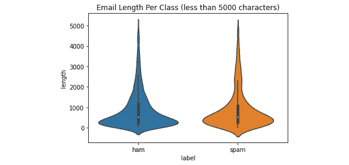
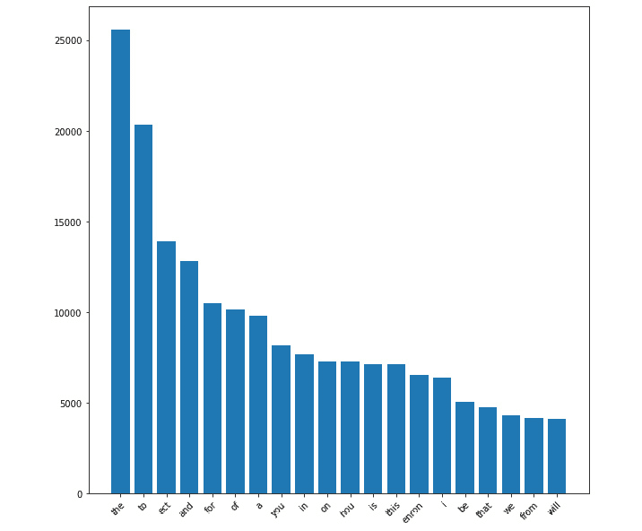

# 第二章：使用 MXNet 和数据集可视化 – Gluon 和 DataLoader

在上一章中，我们学习了如何设置 MXNet。我们还验证了 MXNet 如何利用我们的硬件以提供最佳性能。在应用**深度学习**（**DL**）解决特定问题之前，我们需要了解如何加载、管理和可视化我们将使用的数据集。在本章中，我们将开始使用 MXNet 分析一些玩具数据集，涉及数值回归、数据分类、图像分类和文本分类领域。为了高效处理这些任务，我们将看到新的 MXNet 库和函数，如 Gluon（用于 DL 的 API）和 DataLoader。

在本章中，我们将涵盖以下主题：

+   理解回归数据集 – 加载、管理和可视化*House* *Sales*数据集

+   理解分类数据集 – 加载、管理和可视化鸢尾花数据集

+   理解图像数据集 – 加载、管理和可视化时尚-MNIST 数据集

+   理解文本数据集 – 加载、管理和可视化安然电子邮件数据集

# 技术要求

除了*前言*中指定的技术要求外，本章不适用其他要求。

本章的代码可以在以下 GitHub URL 找到：[`github.com/PacktPublishing/Deep-Learning-with-MXNet-Cookbook/tree/main/ch02`](https://github.com/PacktPublishing/Deep-Learning-with-MXNet-Cookbook/tree/main/ch02)

此外，您可以直接从 Google Colab 访问每个配方；例如，对于本章的第一个配方，请访问[`colab.research.google.com/github/PacktPublishing/Deep-Learning-with-MXNet-Cookbook/blob/main/ch02/2_1_Toy_Dataset_for_Regression_Load_Manage_and_Visualize_House_Sales_Dataset.ipynb`](https://colab.research.google.com/github/PacktPublishing/Deep-Learning-with-MXNet-Cookbook/blob/main/ch02/2_1_Toy_Dataset_for_Regression_Load_Manage_and_Visualize_House_Sales_Dataset.ipynb)。

# 理解回归数据集 – 加载、管理和可视化房屋销售数据集

**机器学习**（**ML**）模型的训练过程可以分为三个主要子组：

+   **监督学习（SL）**：至少某些数据的预期输出是已知的

+   **无监督学习（UL）**：预期输出未知，但数据具有某些特征，有助于理解其内部分布

+   **强化学习（RL）**：一个代理探索环境，并根据从环境获取的输入做出决策

还有一种方法介于前两个子组之间，称为**弱监督学习（weakly SL）**，其中没有足够已知的输出来跟随 SL 方法，原因之一是：

+   输出不准确

+   只有部分输出特征是已知的（不完整）

+   它们并非完全符合预期的输出，但与我们打算实现的任务相关联（不精确）

使用 SL，最常见的问题类型之一是**回归**。在回归问题中，我们希望根据输入特征的数量来估算数值输出。在这个案例中，我们将分析一个来自 Kaggle 的玩具回归数据集：*美国金县的房屋销售*。

房屋销售数据集呈现了一个问题，即根据以下 19 个特征来估算房价（以$为单位）：

+   房屋销售的`Date`

+   `卧室` `数量`

+   `浴室` `数量`，其中`0.5`表示一个有厕所但没有淋浴的房间

+   `Sqft_living`：公寓内部生活空间的平方英尺数

+   `Sqft_lot`：土地面积的平方英尺数

+   `楼层` `数量`

+   是否有`Waterfront`视野

+   该物业视野好坏的指数，范围从 0 到 4

+   房屋状况的指数，范围从 1 到 5

+   `Grade`：1 到 13 的指数，1 为最差，13 为最好

+   `Sqft_above`：地面以上的住宅空间的平方英尺数

+   `Sqft_basement`：地下室内部住宅空间的平方英尺数

+   `Yr_built`：房屋最初建造的年份

+   `Yr_renovated`：房屋最后一次翻新的年份

+   `Zipcode`：房屋所在的邮政编码区域

+   纬度（`Lat`）

+   经度（`Long`）

+   `Sqft_living15`：最近 15 个邻居的住宅内部生活空间的平方英尺数

+   `Sqft_lot15`：最近 15 个邻居的土地面积的平方英尺数

这些数据特征提供了*21,613*套房屋及其价格（需估算的值）。

## 准备工作

以下数据集采用*CC0 公共领域*许可证提供，可从[`www.kaggle.com/harlfoxem/housesalesprediction`](https://www.kaggle.com/harlfoxem/housesalesprediction)下载。

为了读取数据，我们将使用一个非常著名的库——`pandas`，并将使用该库中最常见的数据结构，`matplotlib`，`pyplot`和`seaborn`库。因此，我们必须运行以下代码：

```py
import matplotlib.pyplot as plt
import pandas as pd
import seaborn as sns
```

如果你没有安装这些库，可以通过以下终端命令轻松安装：

```py
!pip3 install matplotlib==3.7.1
!pip3 install pandas==1.5.3
 !pip3 install seaborn==0.12.2
```

因此，为了加载数据，我们可以简单地检索包含数据集的文件（该文件可在本书的 GitHub 存储库中找到）并进行处理：

```py
# Retrieve Dataset (House Sales Prices) from GitHub repository for Deep Learning with MXNet Cookbook by Packt
!wget https://github.com/PacktPublishing/Deep-Learning-with-MXNet-Cookbook/raw/main/ch02/kc_house_data.zip
# Uncompress kc_house_data.csv file
!unzip /content/kc_house_data.zip
house_df = pd.read_csv("kc_house_data.csv")
```

这就是我们开始使用回归数据集所需的一切。

## 如何操作...

在本节中，我们将进行一次**探索性数据分析**（**EDA**），帮助我们理解哪些特征对预测房价很重要（哪些不重要）：

+   数据结构

+   相关性研究

+   生活平方英尺分析、地面以上平方英尺分析和邻居生活平方英尺分析

+   等级分析

+   房间（卧室和浴室）分析

+   景观分析

+   年建造和翻新年份分析

+   位置分析

### 数据结构

让我们分析一下我们的数据是什么样的。为此，我们将使用常见的`pandas` DataFrame 操作：

```py
house_df.info()
```

从输出中，我们可以得出以下结论：

+   数据完整（所有列都有 21,613 个值，如预期）。

+   没有`NULL`值（数据很干净！）。

+   除了前述的特征，还有一个叫做`id`的特征。由于索引已经能够唯一标识每个属性，因此这个特征是不需要的。

为了掌握数值的外观，让我们显示前五个属性：

```py
house_df.head()
```

到目前为止，我们已经看过了这些特征。现在，让我们看看价格分布：

```py
house_df.hist(column = "price", bins = 24)
 plt.show()
```

这些命令将显示一个价格直方图，显示数据集中有多少房屋具有某个价格（在前面命令中选择的列）。直方图以范围（也称为*桶*或*箱*）工作；在我们的情况下，我们选择了 24 个。因为最大价格为 8 百万美元，所以在应用 24 个范围时，我们每百万美元有 3 个范围，具体来说是（所有值以百万美元为单位）：[0 – 0.33)、[0.33 - 0.66)、[0.66 - 1)，直到[7.66 - 8]。

以下是输出结果：


图 2.1 – 价格分布

### 相关性研究

在这里，我们将分析每个特征之间的相关性，尤其是每个特征与价格的相关性。

首先，正如之前讨论的那样，我们将删除`id`特征：

```py
house_df = house_df.drop(["id"], axis=1)
```

我们现在可以计算成对相关性图表：

```py
house_corr = house_df.corr()
```

为了更直观地显示计算出的相关性，我们将绘制一个热力图：

```py
plt.figure(figsize=(20, 10))
colormap = sns.color_palette("rocket_r", as_cmap=True)
sns.heatmap(house_corr, annot=True, cmap=colormap)
plt.show()
```

这些代码语句产生以下结果：


图 2.2 – 房屋特征相关矩阵

在*图 2.2*中请注意，单元格越暗，相关值越大。

为了强调第一行（它显示了价格与输入特征之间的关系最重要），我们将运行以下代码：

```py
house_corr["price"].drop(["price"]).sort_values(ascending = False).plot.bar(figsize=(5,5))
plt.show()
```

我们得到以下结果：


图 2.3 – 房屋特征：价格相关性

从*图 2.2*和*2.3*可以得出以下结论：

+   `生活面积`和`等级`是与价格最高度相关的特征（分别为 0.7 和 0.67）

+   `上方平方英尺`和`邻居的生活面积`与`生活面积`高度相关（分别为 0.88 和 0.76，这指向一定程度的冗余）

+   每种房间类型的数量有以下相关系数：

    +   **浴室数量**：0.53

    +   **卧室数量**：0.31

    +   **楼层数量**：0.26

+   `视图`、`水滨`和`翻新年份`与`价格`有一定的相关性（分别为 0.4、0.27 和 0.13）

+   `位置`与`价格`相关，其中`纬度`是最重要的位置特征（0.31）

+   其余的特征似乎对房产价格的贡献不大

因此，从初步分析来看，与*价格*最相关的特征按重要性排序依次为：`生活面积`、`等级`、`浴室数量`、`视图`和`纬度`。

在接下来的部分，我们将确认这些初步结论。

### 平方英尺分析

从相关性图中，我们发现*居住面积*与*价格*之间有很强的相关性（正如预期的那样），同时*楼上面积*与*邻居居住面积*也存在潜在的冗余性。为了更详细地分析这一点，我们将每个变量与价格的关系绘制出来：


图 2.4 – 价格与多个特征的比较：a）居住面积，b）楼上面积，c）邻居居住面积

正如预期，绘制的图表非常相似，表明这些变量之间存在高度的相关性（以及冗余性）。此外，我们还可以观察到，数据点的最大密度出现在价格低于 300 万美元和面积小于 5,000 平方英尺的区域。由于我们大部分数据位于这些区域，我们可以将这些范围之外的房屋视为异常值并将其移除。

### 等级分析

类似地，我们可以将*等级*特征与价格进行比较：


图 2.5 – 房屋等级与价格的关系

等级与价格之间有明显的直接相关性；等级越高，价格越高。值得注意的是，等级最高的房屋出现频率较低。

### 房间分析

让我们更详细地展示价格与*楼层数*、*卧室数*和*浴室数*之间的关系：


图 2.6 – 价格与多个特征的比较：a）楼层数，b）卧室数，c）浴室数

从图中可以观察到以下几点：

+   在*图 2**.6 (a)*中，我们可以看到，对于较少的楼层数（1-3 层），房价与楼层数之间有直接的相关性。然而，从第四层开始，这种相关性消失了，这表明该段数据缺乏样本（四层或更多层的房子较为少见）。

+   在*图 2**.6 (b)*中，与卧室数量的比较情况与前一个楼层数量的比较图表相似。我们可以看到，对于较少卧室的房子，房价与卧室数之间有直接的相关性。然而，从四间卧室开始，这种相关性消失，其他特征需要被考虑进去。

重要提示

仔细查看数据时，你会发现，在索引为`15870`的那一行中，存在一个异常值；那是一栋有 33 间卧室的房子。我不知道这是否为房子的实际卧室数（我预计不是！），但为了正确分析数据集，这栋房子作为异常值已被从中移除。详情请查看代码。

+   在*图 2**.6 (c)*中，我们可以看到浴室数量与价格之间有直接的相关性；然而，也存在一定的不确定性（随着浴室数量的增加，图表变得更宽）。

### 视野分析

在本节中，我们将更详细地分析*视野*质量和*水滨视野*（房屋是否有水滨视野）与价格之间的联系：


图 2.7 – 视野质量（a）和水滨视野（b）与价格的关系

从这些单独的图表中，得出结论稍微有些困难。似乎还需要其他变量来看到视野质量与价格之间的明显联系，水滨视野也是如此。

### 建造年份和翻新年份分析

以下图表展示了房屋建造年份和是否以及何时翻新的特征与价格的相关性：


图 2.8 – 价格与建造年份（a）和翻新（b）的比较

从图中，你可以观察到以下几点：

+   在*图 2.8（a）*中，我们可以看到价格呈现轻微的线性上升，表明房屋建造得越新，价格就越贵。

+   对于*图 2.8（b）*，我们没有分析年份，而是将数据集分为两类——翻新过的房屋和未翻新过的房屋——并将这两类与价格进行对比。无论如何，这样做得出结论稍微有些困难。似乎还需要其他变量来看到翻新年份与价格之间的明显联系。

### 位置分析

在本节中，我们将更详细地分析纬度和经度与价格之间的联系：


图 2.9 – 位置与价格的关系

从*图 2.9*中，我们可以得出结论：位置在房屋价格中起着重要作用。显然，金县的北部地区比南部地区更为高价。而且有一个特定的中心区域，这里的房屋比附近的其他地区明显更贵。

## 它是如何工作的……

回归问题是应用 SL 方法的最常见问题之一。通过深入研究一个经典的回归数据集——*金县房价预测*，我们可以发现输入特征（建筑面积、等级和浴室数量）与输出特征（价格）之间最重要的联系。这项分析将帮助我们在下一章构建一个预测房价的模型。

## 还有更多……

在本节中，我们专注于每个特征与价格的单独分析。然而，有些特征在与其他特征结合或经过预处理后，更容易理解。我们对这个主题做了一个简单的探索，通过将已经翻新的房屋归为一类，并与未翻新房屋的类别进行对比。此外，在位置分析中，我们使用了二维地图绘制纬度和经度，以发现模式。

然而，还有很多关系和分析需要完成，我建议你自己探索这个数据集，提出自己的假设或直觉，并分析数据以发现新的见解。

此外，还有许多其他回归数据集可以进行练习；一个小建议可以在这里找到：[`www.kaggle.com/rtatman/datasets-for-regression-analysis`](https://www.kaggle.com/rtatman/datasets-for-regression-analysis)。

# 理解分类数据集——加载、管理和可视化鸢尾花数据集

在前一个教程中，我们学习了监督学习（SL）中最常见的一个问题类型：回归。在本教程中，我们将更深入地研究另一个常见的问题类型：**分类**。

在分类问题中，我们希望从一组给定的类别中，使用一定数量的输入特征来估计一个类别输出。在本教程中，我们将分析一个来自 Kaggle 的玩具分类数据集：鸢尾花数据集，它是最著名的分类数据集之一。

鸢尾花数据集呈现了从三种鸢尾花类别（鸢尾花 Setosa、鸢尾花 Versicolor 和鸢尾花 Virginica）中估计花卉类别（`iris`）的问题，利用以下四个特征：

+   花萼长度（单位：厘米）

+   花萼宽度（单位：厘米）

+   花瓣长度（单位：厘米）

+   花瓣宽度（单位：厘米）

这些数据特征是为 150 朵花提供的，每个类别有 50 个实例（使其成为一个平衡的数据集）。

## 准备工作

该数据集在 *CC0 公共领域* 许可下提供，可以从 [`www.kaggle.com/uciml/iris`](https://www.kaggle.com/uciml/iris) 下载。

为了读取、管理和可视化数据，我们将采取类似于前一个教程中玩具回归数据集的方法。我们将使用 `pandas` 来管理数据，并使用该库最常见的数据结构：数据框（DataFrames）。此外，为了绘制数据及我们将计算的多个可视化图形，我们将使用 `matplotlib`、`pyplot` 和 `seaborn` 库。因此，我们必须运行以下代码：

```py
import matplotlib.pyplot as plt
import pandas as pd
import seaborn as sns
```

为了加载数据，我们将引入一个非常有用的库，名为 `scikit-learn`，它非常适合管理数据集。这个库预装了一组数据集，其中包括鸢尾花数据集：

```py
from sklearn import datasets
```

如果你没有安装之前提到的库，可以使用以下终端命令轻松安装：

```py
!pip3 install matplotlib
!pip3 install pandas
!pip3 install seaborn
!pip3 install scikit-learn
```

因此，为了加载数据，我们可以简单地通过使用 `scikit-learn` 库函数来读取数据集：

```py
iris = datasets.load_iris()
iris_df = pd.DataFrame(iris.data, columns = iris.feature_names)
 iris_df.insert(0, "class", iris.target)
```

这就是我们开始处理分类数据集所需的一切。

## 如何进行操作...

在本节中，我们将进行一个探索性数据分析（EDA），帮助我们理解哪些特征对于预测花卉的鸢尾花类别很重要（哪些不重要），通过完成以下任务：

+   数据结构

+   相关性研究

+   一对一比较（配对图）

+   小提琴图

### 数据结构

让我们分析一下数据的结构。为此，我们将使用在 `pandas` 数据框中的常见操作：

```py
iris_df.info()
```

从输出中，我们可以得出以下结论：

+   数据是完整的（所有列都有 150 个值，符合预期）

+   没有`NULL`值（数据是干净的！）

为了了解这些值的样子，让我们显示前五个属性：

```py
iris_df.head()
```

到目前为止，我们看了特征的表现。现在，让我们看看鸢尾花类别的分布情况：

```py
iris.target_names
```

这将产生以下输出：

```py
array(['setosa', 'versicolor', 'virginica'], dtype='<U10')
```

如果我们想确认每个类别有 50 个实例，可以运行以下代码：

```py
iris_df.groupby("class").size()
```

这将产生以下输出：

```py
Class
0 50
1 50
2 50
dtype: int64
```

这里，`0`对应`setosa`，`1`对应`versicolor`，`2`对应`virginica`。

### 相关性研究

在这里，我们将分析每个特征之间的相关性，最重要的是，每个特征与鸢尾花类别之间的相关性。

我们可以计算成对相关性图：

```py
iris_corr = iris_df.corr()
```

为了便于可视化计算出的相关性，我们将绘制热图：

```py
plt.figure(figsize=(10, 10))
colormap = sns.color_palette("rocket_r", as_cmap=True)
sns.heatmap(iris_corr, annot=True, cmap=colormap)
plt.show()
```

这些代码语句产生了以下结果：


图 2.10 – 花朵特征相关性矩阵

请注意在*图 2.10*中，单元格越深，相关性值越大。

为了强调第一行（最重要的是它显示了鸢尾花类别与输入特征之间的关系），我们将运行以下代码：

```py
iris_corr["class"].drop(["class"]).sort_values(
    ascending = False).plot.bar(figsize=(5,5))
plt.show()
```

这是我们得到的结果：


图 2.11 – 花朵特征：鸢尾花类别相关性

从*图 2.10*和*图 2.11*中可以得出以下结论：

+   花瓣的测量（长度和宽度）高度相关；分析和训练这两个特征可能不会带来额外的信息。

+   花瓣的测量值是与鸢尾花类别相关性最强的特征。

+   萼片长度和宽度也高度相关，但方向相反（萼片长度是正相关的，而萼片宽度是负相关的）。

### 一对一比较（成对图）

在分类问题中，色调/亮度可以用来指示图表的类别。此外，由于在这个数据集中我们只能使用有限的特征集（四个特征），成对图将非常有用，可以在单个图表中比较所有特征。绘制此图的代码如下所示：

```py
g = sns.pairplot(iris_df, hue="class", height=2, palette="rocket_r")
handles = g._legend_data.values()
labels = list(iris.target_names)
 g._legend.remove()
g.fig.legend(handles=handles, labels=labels, loc='upper left', ncol=3)
```

这是显示的图表：


图 2.12 – 花朵特征对比图

从这组图表中，我们可以得出以下结论：

+   Setosa 鸢尾花可以通过任何特征轻松区分

+   不同鸢尾花类别之间的萼片特征有重叠

+   花瓣特征与鸢尾花类别直接相关；也就是说，最小的数值指向**setosa**，中等的数值指向**versicolor**，而最大的数值指向**virginica**

+   在**versicolor**和**virginica**的边界上存在一个重叠区域，当花瓣长度大于约 5 厘米且花瓣宽度大于约 1.5 厘米时，两个类别会重叠。

### 小提琴图

另一个可能帮助理解特征与鸢尾花类别之间关系的图是小提琴图。生成此图的代码如下：

```py
fig, axs = plt.subplots(2, 1)
 sns.violinplot(x="class", y="petal length (cm)", data=iris_df, size=5, palette='rocket_r', ax = axs[0])
 sns.violinplot(x="class", y="petal width (cm)", data=iris_df, size=5, palette='rocket_r', ax = axs[1])
```

下面是展示的图表：


图 2.13 – 花卉特征小提琴图

在这些图中，我们得出的结论更加清晰，setosa（`0`）鸢尾花类别明显可分离，而 versicolor（`1`）和 virginica（`2`）则有相当大的重叠。

小提琴图还提供了我们数据值分布的指示（从 0 开始，以匹配代码中类别的索引）：

+   **Setosa**：值更可能出现在均值附近（大约为花瓣长度 1.5 cm 和花瓣宽度 0.25 cm）。

+   **Versicolor**：正态分布，均值大约为 4.25 cm 和 1.3 cm，标准差分别为 0.5 cm 和 0.2 cm（对应花瓣长度和花瓣宽度）。

+   **Virginica**：在[~5.1, ~5.9] cm 和[~1.8, ~2.3] cm 之间呈均匀分布（分别对应花瓣长度和花瓣宽度）。

## 它是如何工作的...

分类问题是**监督式机器学习**（**SML**）方法应用最广泛的问题之一。通过深入研究经典的分类数据集——鸢尾花类别，我们可以发现输入特征（花瓣长度和花瓣宽度）与输出特征（鸢尾花类别）之间的关联。这一分析将帮助我们在下一章中构建模型来预测类别。

## 还有更多...

在本节中，我们重点分析了每个特征与鸢尾花类别之间的关系。这在原则上类似于回归数据集的分析，且每个图都有额外的信息，即色调/亮度。我们建议读者继续自己进行分析，以发现新的洞察。

我们提到鸢尾花数据集是经典的分类数据集之一，然而，它的历史可以追溯到 1936 年！原始参考文献：[`onlinelibrary.wiley.com/doi/pdf/10.1111/j.1469-1809.1936.tb02137.x`](https://onlinelibrary.wiley.com/doi/pdf/10.1111/j.1469-1809.1936.tb02137.x)。

此外，正如我们将在下一章探讨的那样，分类问题可以视为回归问题的特殊情况。在回归案例中，我们研究了房价，并通过将其与阈值进行比较（例如我们的预算限额）来帮助买家判断哪些是可负担的。因此，我们可以使用该阈值将低于阈值的房子分类为可负担的，将高于阈值的房子分类为不可负担的。我们将在下一章深入探讨这一联系。

此外，还有许多其他分类数据集可以使用；可以在这里找到一小部分：[`www.kaggle.com/search?q=classification+tags%3Aclassification`](https://www.kaggle.com/search?q=classification+tags%3Aclassification)。

# 理解图像数据集——加载、管理和可视化 Fashion-MNIST 数据集

在过去几年中，**计算机视觉**（**CV**）是深度学习领域增长显著的一个方向。自 2012 年 AlexNet 革命以来，计算机视觉从实验室研究扩展到在真实世界数据集（即“野外”数据集）中超越了人类表现。

在这个教程中，我们将探讨最简单的计算机视觉任务：**图像分类**。给定一组图像，我们的任务是将这些图像正确地分类到预定的标签（类别）中。

最经典的图像分类数据集之一是**MNIST**（即**修改版国家标准与技术研究院**）数据库。同样大小，但更适合当前的计算机视觉分析的是*Fashion-MNIST 数据集*。这个数据集是一个多标签图像分类数据集，训练集包含 60k 个示例，测试集包含 10k 个示例，每个示例属于这 10 个类别之一（从 0 开始，以匹配代码中的类别索引）：

+   T 恤/上衣

+   长裤

+   套头衫

+   连衣裙

+   外套

+   凉鞋

+   衬衫

+   运动鞋

+   包

+   踝靴

每张图像为灰度图，尺寸为 28x28 像素。这可以看作每个数据点具有 784 个特征。该数据集由每个类别 6k 张图像的训练集和每个类别 1k 张图像的测试集组成（平衡数据集）。

## 准备工作

这个数据集提供在*MIT*许可证下，可以从以下网址下载：[`github.com/zalandoresearch/fashion-mnist`](https://github.com/zalandoresearch/fashion-mnist)

这个数据集可以直接通过 MXNet Gluon 获取，因此我们将使用这个库来访问它。此外，由于这个数据集比我们迄今为止探索的其他数据集要大得多，为了高效处理数据，我们将使用 Gluon DataLoader 功能：

```py
from mxnet import gluon
training_data_raw = gluon.data.vision.FashionMNIST(train=True)
 test_data_raw = gluon.data.vision.FashionMNIST(train=False)
```

提示

Gluon 随 MXNet 一起安装；无需其他步骤。

这就是我们开始使用 Fashion-MNIST 数据集所需的所有内容。

重要提示

有时候，数据需要为某些操作进行修改（转化）。这可以通过定义一个`transform`函数并将其作为参数（`transform=<function_name>`）传递来完成。

## 如何操作...

在本节中，我们将进行一次探索性数据分析（EDA），帮助我们理解哪些特征对于预测服装类别是重要的（哪些是不重要的），以下是帮助我们进行分析的步骤：

1.  确定数据结构

1.  描述每个类别的示例

1.  理解降维技术

1.  可视化**主成分** **分析**（**PCA**）

1.  可视化**t 分布随机邻域** **嵌入**（**t-SNE**）

1.  可视化**统一流形近似与** **投影**（**UMAP**）

1.  可视化**Python 最小失真** **嵌入**（**PyMDE**）

### 确定数据结构

为了优化内存使用，以便处理大规模数据集，通常不是将完整的数据集加载到内存中，而是通过**批次**访问数据集，批次是较小的数据包。

Gluon 有自己生成批次的方式，同时应用`128`：

```py
batch_size = 128
training_data_aux = gluon.data.DataLoader(
    training_data_raw, batch_size= batch_size, shuffle=True)
 test_data_aux = gluon.data.DataLoader(
    test_data_raw, batch_size= batch_size, shuffle=False)
```

重要提示

DataLoader 不会返回数据结构，而是返回一个迭代器。因此，为了访问数据，我们需要对其进行迭代，使用诸如`for`循环等构造。

让我们验证数据结构是否符合预期：

```py
training_data_size = 0
for X_batch, y_batch in training_data_aux:
    if not training_data_size:
        print("X_batch has shape {}, and y_batch has shape {}"        .format(X_batch.shape, y_batch.shape))
    training_data_size += X_batch.shape[0]
 print("Training Dataset Samples: {}".format(training_data_size))
 test_data_size = 0
for X_batch, y_batch in test_data_aux:
    test_data_size += X_batch.shape[0]
print("Test Dataset Samples: {}".format(test_data_size))
```

我们得到了预期的输出：

```py
X_batch has shape (128, 28, 28, 1), and y_batch has shape (128,)
 Training Dataset Samples: 60000
Test Dataset Samples: 10000
```

重要提示

Gluon 加载灰度图像时会将其视为具有一个通道的图像，每个批次的维度为（批次大小，高度，宽度，通道数）；在我们的示例中是（128，28，28，1）。

### 每个类别的示例描述

Fashion-MNIST 数据集是一个平衡的数据集，每个类别有 6k 个示例：


图 2.14 – Fashion-MNIST 数据集标签

让我们看看每个类别的样本长什么样。为了实现这一点，我们可以绘制每个类别的 10 个示例：


图 2.15 – Fashion-MNIST 数据集

如我们在*图 2.15*中看到的那样，所有实例几乎都可以被人类很好地区分，除了`T-shirt`/`top`、`Pullover`、`Coat`和`Shirt`类别。

### 理解降维技术

除了数据集中包含的大量数据点外，图像中的特征数量（即每个图像的像素数）也非常高。在我们的玩具数据集中，每张图像有 784 个特征，可以看作是 784 维空间中的 1 个点。在这个空间中，分析特征之间的关系（例如我们在前面的数据集中探索的相关性）是非常困难的。此外，处理更高质量的图像（分辨率超过 1 百万像素，即超过 100 万个特征）并不罕见。对于一张 4K 图像，特征数量约为 800 万个。

因此，在本小节以及接下来的小节（关于*PCA*、*t-SNE*、*UMAP*和*PyMDE*），我们将使用称为**降维**的技术。降维技术的核心思想是能够轻松地可视化高维特征，通常是 2D 或 3D，这是人类习惯使用的可视化方式。这些嵌入具有两个或三个组件，可以在 2D 或 3D 中绘制。这些表示是数据集依赖的；它们是*学习*得到的表示。

每种技术都有不同的方式来实现这一结果。在本书中，我们不会深入了解每种技术的原理，但感兴趣的读者可以在*There’s* *more...*部分找到更多信息。

还请注意，尽管每种技术不同，但它们都要求输入一个向量（特征向量）。这意味着一些空间信息会丢失。在我们的示例中，从 28x28 的图像中，我们将输入 784 个特征向量。

### 可视化 PCA

正如预期的那样，我们可以看到一些大簇（**Sneaker** 和 **Ankle boot**），而其他簇大多是重叠的（**T-shirt**、**Pullover** 和 **Coat**）：


图 2.16 – Fashion-MNIST 2D PCA

### 可视化 t-SNE

另一种降维技术是 t-SNE。该技术基于计算表示邻居相似性的概率分布。推荐的预处理步骤是先对 50 个特征进行 PCA，然后将这 50 个特征向量传递给 t-SNE 算法。这就是我们用来生成以下图表的方法：


图 2.17 – Fashion-MNIST 2D t-SNE

在这个图中，我们可以更清楚地看到，如何将易于区分的对象孤立成簇（**Trouser** 在右下角，**Bag** 在左上角）。

重要提示

对于 PCA 和 t-SNE，我们可以选择三个主成分而不是两个，这样会生成一个 3D 图。关于代码，请访问本书的 GitHub 仓库：[`github.com/PacktPublishing/Deep-Learning-with-MXNet-Cookbook`](https://github.com/PacktPublishing/Deep-Learning-with-MXNet-Cookbook)。

### 可视化 UMAP

另一种降维方法是 **UMAP**。UMAP 允许我们调整不同的参数，比如*邻居的数量*，这有助于我们可视化如何平衡局部结构与全局结构。以下是五个邻居的可视化示例：


图 2.18 – Fashion-MNIST UMA

在此可视化中，我们可以观察到与前面图表中类似的趋势；即，**Bag** 被聚集在上中部区域，**Trouser** 被聚集在下中部区域。然而，在此可视化中，我们还可以注意到左侧有一个簇，包含了**Ankle boot**、**Sneaker** 和 **Sandal**的数据，而右侧有一个重要的簇，包含了**Shirt**、**Coat**、**Dress** 和 **T-shirt/top**的数据，我们可以看到这些簇是如何相互重叠的。

要安装 UMAP，请运行以下命令：

```py
!pip3 install umap-learn
```

### 可视化 PyMDE

另一种流行的技术是 **PyMDE**，它提供了有洞察力的可视化。PyMDE 允许两种主要方法：保持邻居关系（即保留数据的局部结构）和保持距离关系。这保持了数据中一对一距离等关系属性。保持邻居关系的方法类似于我们所看到的图表：


图 2.19 – Fashion-MNIST PyMDE

如我们在*图 2.19*中所见，PyMDE 可得出与 UMAP 非常相似的结论。

要安装 UMAP，请运行以下命令：

```py
!pip3 install pymde
```

## 它是如何工作的...

要理解一个图像数据集，我们需要理解该数据集中图像之间的潜在联系。实现这一目标的一种有用方法是使用不同的可视化技术。

在这个教程中，我们学习了如何发现图像数据集中的模式。我们选择了一个经过充分研究的数据集——Fashion-MNIST，并学习了处理大规模数据集的最重要方法之一：**批处理**。

我们通过查看数据集的内部结构以及实际图像的样貌来分析数据集，并尝试预测潜在的分类算法可能遇到的问题（例如外套和衬衫、短靴和运动鞋之间的相似性）。

每个像素都是每张图像的一个维度/特征，因此，为了处理它们，我们了解了一些降维技术：PCA、t-SNE、UMAP 和 PyMDE。通过这些可视化，我们能够验证并扩展我们对数据集的知识。

## 还有更多…

由于 MNIST 和 Fashion-MNIST 是经过充分研究的数据集，因此有许多资源可供参考。我个人推荐以下资源：

+   **MNIST** **数据库**: [`en.wikipedia.org/wiki/MNIST_database`](https://en.wikipedia.org/wiki/MNIST_database)

+   **zalandoresearch/fashion-mnist**: [`github.com/zalandoresearch/fashion-mnist`](https://github.com/zalandoresearch/fashion-mnist)

我们介绍了一些降维技术，但并没有深入了解它们。如果你想更好地理解每种技术的工作原理，我建议以下资源：

+   **PCA（来自** **加州理工学院）**: [`web.ipac.caltech.edu/staff/fmasci/home/astro_refs/PrincipalComponentAnalysis.pdf`](http://web.ipac.caltech.edu/staff/fmasci/home/astro_refs/PrincipalComponentAnalysis.pdf)

+   **t-SNE**: [`lvdmaaten.github.io/tsne/`](https://lvdmaaten.github.io/tsne/)

+   **UMAP**: [`umap-learn.readthedocs.io/`](https://umap-learn.readthedocs.io/)

+   **PyMDE**: [`pymde.org/`](https://pymde.org/)

在代码中，你可以找到如何获取包含的可视化内容。此外，对于 PCA 和 t-SNE，由于组件数是一个变量，因此两者的 3D 图都被包含在内。

最后，对于那些有兴趣深入了解深度学习及其历史的读者，我推荐以下链接：[`www.skynettoday.com/overviews/neural-net-history`](https://www.skynettoday.com/overviews/neural-net-history)。

# 理解文本数据集 – 加载、管理和可视化 Enron 邮件数据集

近年来，**自然语言处理**（**NLP**）是深度学习领域一个快速发展的领域。与计算机视觉（CV）类似，该领域的目标是在人类表现基础上超越现实世界数据集的表现。

在这个教程中，我们将探索最简单的 NLP 任务之一：**文本分类**。给定一组句子和段落，我们的任务是正确地将这些文本分类到给定的标签（类别）中。

最经典的文本分类任务之一是区分收到的邮件是否是垃圾邮件（spam）或非垃圾邮件（ham）。这些数据集是二元文本分类数据集（只有两个标签要分配，`0` 和 `1`，或者 `ham` 和 `spam`）。

在我们的特定场景中，我们将使用一个真实世界的邮件数据集。该数据集是在 2000 年代初美国政府对安然丑闻进行调查时公开的。这一数据集首次发布于 2004 年，包含约 150 名用户的邮件，主要是安然公司高级管理层的邮件。本节仅使用其中的一个子集（称为`enron1`）。

数据集包含 5,171 封邮件，没有训练/测试集划分（所有示例都提供标签）。作为一个真实世界的数据集，邮件在主题、内容长度、词数和单词长度等方面差异很大，且默认情况下，数据集仅包含两个特征：

+   `0`表示`正常邮件`，`1`表示`垃圾邮件`

+   **文本**：包括邮件的主题和正文

数据集包含 3,672 封正常邮件（约占 70%）和 1,499 封垃圾邮件（约占 30%）；它是一个高度不平衡的数据集。

## 准备工作

该数据集遵循*CC0 公共领域*许可证，可以从[`www.kaggle.com/venky73/spam-mails-dataset`](https://www.kaggle.com/venky73/spam-mails-dataset) 下载。

为了读取数据，我们将遵循与回归任务中类似的方法。我们将从 CSV 文件加载数据，并使用非常著名的 Python 库：`pandas`、`pyplot` 和 `seaborn` 来处理数据。因此，我们需要运行以下代码：

```py
import matplotlib.pyplot as plt
import pandas as pd
import seaborn as sns
```

因此，为了加载数据，我们只需读取包含数据的文件（该文件可以从书籍的 GitHub 仓库中找到）：

```py
emails_df = pd.read_csv("spam_ham_dataset.csv")
```

这就是我们开始处理垃圾邮件数据集所需的全部内容。

## 如何执行...

在本节中，我们将进行探索性数据分析（EDA），帮助我们理解哪些特征对于预测邮件是否为垃圾邮件至关重要（哪些不重要）。以下内容不是以步骤形式呈现，请重新组织为更合适的引言或以步骤形式重新编排，并将圆点符号改为编号：

1.  数据结构

1.  每个类别的示例

1.  内容分析

1.  数据清洗

1.  N-gram 模型

1.  词处理（分词、停用词、词干提取和词形还原）

1.  词云

1.  词嵌入（word2vec 和 **全局词表示模型** (**GloVe**))

1.  主成分分析（PCA）和 t-SNE

### 数据结构

我们将要进行的第一步是根据我们的需求重新格式化数据集：

```py
# Removing Unnecessary column
emails_df.drop("Unnamed: 0", axis=1, inplace=True)
 # Changing column names
emails_df.columns = ["label", "text", "class"]
```

经这些修改后，我们的邮件数据框架（DataFrame）形状如下：

```py
(5171, 3)
```

### 每个类别的示例

接下来，我们将查看每个类别的分布：

```py
Label
ham 3672
spam 1499
dtype: int64
```

以下是输出结果：


图 2.20 – 垃圾邮件数据集

如我们所见，数据集存在严重的类别不平衡问题。

### 内容分析

在这一部分，我们将分析邮件的长度及其分布：


图 2.21 – 邮件长度

存在一个大范围的异常值集，对应邮件字符数超过 5,000 的情况。让我们聚焦于大多数邮件所在的区域，并绘制邮件长度和单词数的图表：



图 2.22 – 邮件长度（详细）


图 2.23 – 邮件词汇数量

重要提示

在*图 2.23*中，我们通过指定每个以空格分隔的实体构成一个词，定义了一个没有语义或字典方法的词汇。这种方法有缺点，我们将在本节和*第五章*中进一步分析。

通过查看该图，我们可以得出结论：在邮件长度和单词数方面，垃圾邮件和合法邮件之间没有显著差异。我们需要更多地了解这些词汇，它们的含义及其之间的关系，以改善我们的分析。

因此，让我们首先看看数据集中哪些词最常见：


图 2.24 – 最常见的词汇

看到*图 2.24*后的第一个也是最重要的结论是，我们最初的空格分隔方法在处理真实世界的数据集时并不足够。标点符号错误和拼写错误非常常见，而且，正如预期的那样，像“the”和“to”这样的常见词对于区分垃圾邮件和合法邮件没有实质性帮助。

### 数据清理

让我们解决处理真实世界文本数据集时的一些常见问题：

+   标点符号

+   尾随字符

+   “说明”（方括号中的文本）

+   包含数字和链接的词汇

+   词汇*subject*（特定于我们的邮件数据集结构）

经过我们通过清理函数处理语料库（特定于我们问题的文本数据）后，结果更接近我们的预期：



图 2.25 – 最常见的词汇（清理过）

在*图 2.25*中，我们可以看到我们正在分析的新词汇语料库包含了真实的词汇。然而，很明显，最常见的词汇并未帮助区分垃圾邮件和合法邮件；像“the”和“to”这样的词在英语中过于常见，无法有效用于此分类。

### N-gram

在自然语言处理（NLP）中，语料库中的 N-gram 是指语料库中一组*同时出现的 N*个词。通常在 NLP 中，最常见的 N-gram 是*unigrams*（一个词）、*bigrams*（两个词）和*trigrams*（三个词）。绘制最常见的 N-gram 有助于我们理解词语与类别（垃圾邮件或非垃圾邮件）之间的关系。Unigram 只是最常见的词的图形，如在前面的*图 2.25*中所绘制。对于 bigrams（按类别），请参见下文：


图 2.26 – 在“ham”（a）和“spam”（b）中最常见的二元组

对于 trigrams（按类别），请参见下文：


图 2.27 – 正常邮件（a）和垃圾邮件（b）中最常见的三元组

在这些图表中，我们可以开始把握两类之间的潜在差异：

+   如果提到了*Enron 公司*，那很可能是一封合法的电子邮件。

+   如果有礼貌的行动号召（“please let me know”），那很可能是一封合法的电子邮件。

+   如果有链接，那很可能是垃圾邮件。

+   如果有拼写错误（*hou*代替*how*，*ect*代替*etc*，等等），那很可能是一封合法的电子邮件。

+   如果提到*pills*（药丸），那很可能是垃圾邮件（而且有重复的嫌疑）。

我们还发现了一些与电子邮件编码方式相关的细微差别：`nbsp`（用于非断行空格）。很可能是电子邮件解析器在文本中发现了一些结构不清的空格，并用`nbsp`关键字进行了替换。巧合的是，这些解析细节在垃圾邮件中比在合法邮件中出现得要多，这将有助于我们的分析。

### 文字处理

处理文本中的单词通常由四个步骤组成：

1.  分词

1.  停用词过滤

1.  词干提取

1.  词形还原

这些步骤各自具有一定的复杂性，因此我们将使用可用的库来执行这些步骤，例如**自然语言工具包**（**NLTK**）。要安装它，请运行以下命令：

```py
!pip3 install nltk
```

**分词**是处理文本并返回**标记**列表的步骤。每个单词是一个标记，但如果有标点符号，它们会成为单独的标记。不过，对于我们的语料库，这些在之前的步骤中已被移除。

请注意，在这个步骤中，我们已经从每封电子邮件的句子和段落列表（语料库）转换到所谓的**词袋模型**（**BOW**），它与语料库中使用的词汇直接相关。

在我们将每个单词作为一个实体之后，我们可以移除之前已识别出的常见词，如“the”或“to”。这些被称为停用词，NLTK 包含多个语言的停用词集。我们将使用这个可用的集合来过滤我们的语料库。

词干提取是将派生（如果我们想更正式些，也包括屈折）词汇缩减到其词根的过程，词根称为词干。

词形还原是将多个不同形式的词汇归类为一个单一项的过程，这个单一项由单词的词根或词典形式（lemma）标识：


图 2.28 – 词干提取和词形还原

经过这些步骤处理后，我们的词袋模型中剩下的单词数量大约是语料库的 10%：

```py
Raw Corpus (Ham): 3133632
Processed Corpus (Ham): 317496 (~10%)
Raw Corpus (Spam): 1712737
Processed Corpus (Spam): 177780 (~10%)
```

### 词云

使用我们后处理的词袋模型（BOW），我们可以生成文本语料库的最具影响力和最受欢迎的可视化图像之一——词云：


图 2.29 – 正常邮件（a）和垃圾邮件（b）中的词云

在这些可视化中，我们可以清楚地看到*Enron*、*please*和*let know*对合法邮件是相关的，而*new*、*nbsp*、*compani*、*market*和*product*通常与垃圾邮件相关。

### 词嵌入

到目前为止，我们已经了解了单个单词的表现（频率和长度）及其与其他单词的连接，主要通过最常见的 N-gram（双字组和三字组）。然而，我们还没有将这些单词之间的意义进行连接。例如，我们会预期*Enron*、*corp*和*company*（*compani*，它的词干形式）在语义上是相近的。因此，我们希望有一种表示方式，使得具有相似意义的单词有相似的表示方式。此外，如果这种表示方式具有固定数量的维度，我们就能方便地对单词进行比较（找出相似性）。这些就是词嵌入（word embeddings），其表示就是一个向量。

从单词生成向量的方法有无数种；例如，实现这一目标的最简单方法是生成与我们的词汇量相同数量的维度（向量的特征，即矩阵表示中的列），然后在每封邮件中（矩阵表示中的一行），对于每个包含的单词，我们可以在该单词在词汇表中的列中标注*1*（打钩），从而得到形如[0, 0, 0, 0......, 1, 0, 0, 0,..., 1....]的向量表示。这种表示方法称为独热编码，但它效率非常低，因为特征的数量等于语料库中不同单词的数量，也就是词汇表的长度，这通常是非常大的（我们的简化词汇表约有 50 万个单词）。

因此，我们将看一看更优化的单词表示方式：word2vec 和 GloVe：

+   **word2vec**：该算法由谷歌于 2013 年开发，并在*Google News*语料库上进行了预训练。它的语料库包含 30 亿个单词，词汇量有 300 万个不同的单词，每个单词用 300 个特征表示。该算法的直观思路是通过考虑上下文（周围单词）来计算给定单词的概率。窗口大小（一次查看多少个单词）是模型的一个参数，并且是常量，这使得模型仅依赖于每个单词的局部上下文。

+   `word2vec`结合了单词共现（全局统计）来提供更完整的表示。

通过这些表示，我们现在可以在单词的新的向量表示中计算操作：

+   `stronger`与`strong`的关系就像`weaker`与`weak`的关系：

    ```py
    math_weaker = w2v["stronger"] - w2v["strong"] + w2v["weak"]
    np.linalg.norm(math_weaker - w2v["weaker"])
    ```

    这将生成约为`~1.9`的输出，结果接近。

+   `king`：

    ```py
    [('kings', 0.7138046026229858), ('queen', 0.6510956883430481), ('monarch', 0.6413194537162781), ('crown_prince', 0.6204220056533813), ('prince', 0.6159993410110474), ('sultan', 0.5864822864532471), ('ruler', 0.5797567367553711), ('princes', 0.5646552443504333), ('Prince_Paras', 0.543294370174408), ('throne', 0.5422104597091675)]
    ```

细心的读者会意识到，词嵌入与我们在前一个维度降维的例子中看到的技术相似，因为那也是学习到的表示。然而，在这种情况下，我们实际上是增加了维度，以获得新的优势（固定数量的特征和相似的意义表示）。

重要提示

词嵌入通常是*学习*出来的表示；也就是说，这些表示通过训练来最小化具有相似含义的词语之间的距离，或者在我们的案例中，是通过相同标签分类的词语。在这个食谱中，我们将使用`word2vec`和 GloVe 的预训练表示，在*第五章*中，我们将学习如何进行训练。

### PCA 和 t-SNE

正如“子章节”中所讨论的那样，我们当前的嵌入包含 300 个特征（`word2vec`）或 50 个特征（GloVe）。为了进行合适的可视化，我们需要应用降维技术，正如我们在之前关于计算机视觉的食谱中所看到的那样。

对于这个数据集，我们可以应用 PCA：


图 2.30 – PCA 用于(a) word2vec 和(b) GloVe 嵌入

此外，我们还可以应用 t-SNE：


图 2.31 – t-SNE 用于(a) word2vec 和(b) GloVe 嵌入

从之前的图中，我们可以看到垃圾邮件和正常邮件的词汇在我们的嵌入空间中非常接近，这使得分离这些簇变得非常困难。这是因为我们使用的是预训练的嵌入，来自新闻和维基百科数据集。这些数据集及其相应的嵌入并不适合我们的任务。我们将在*第五章*中看到如何训练词嵌入以获得更好的结果。

重要提示

对于 PCA 和 t-SNE，我们可以选择三个组件，而不是两个，这样可以得到一个三维图。有关代码，请访问本书的 GitHub 仓库：[`github.com/PacktPublishing/Deep-Learning-with-MXNet-Cookbook`](https://github.com/PacktPublishing/Deep-Learning-with-MXNet-Cookbook)。

## 它是如何工作的...

要理解文本数据集的语料库，我们需要理解该语料库中单词之间的潜在联系。实现这一目标的一个有用方法是通过不同的语料库可视化来帮助我们理解。

在这个食谱中，我们学会了如何发现文本数据集中的模式。我们选择了一个不平衡的数据集——*Enron 电子邮件*数据集，并学习了如何处理二分类数据集。

我们通过查看数据集的内部结构，了解类不平衡的情况，并检查最常见的词汇，寻找其中的模式和错误。我们清理了数据集，移除了标点符号，并绘制了最常见的**二元组**和**三元组**，并注意到几个有助于我们正确分类电子邮件的关键词。

我们学会了如何生成一些酷炫的可视化效果，如**词云**，并且理解了为什么**词嵌入**如此重要，并使用我们之前学到的**降维技术**对其进行了绘制。

## 还有更多内容…

如果你想了解更多关于 Enron 电子邮件数据集和 Enron 丑闻的信息，以下链接将有所帮助：

+   **安然电子邮件** **数据集**: [`www.cs.cmu.edu/~enron/`](http://www.cs.cmu.edu/~enron/)

+   **安然** **丑闻**: [`en.wikipedia.org/wiki/Enron_scandal`](https://en.wikipedia.org/wiki/Enron_scandal)

我们简要概述了几个重要的概念，我邀请你进一步了解：

+   **BOW**: [`machinelearningmastery.com/gentle-introduction-bag-words-model/`](https://machinelearningmastery.com/gentle-introduction-bag-words-model/)

+   **N-grams**: [`web.stanford.edu/~jurafsky/slp3/3.pdf`](https://web.stanford.edu/~jurafsky/slp3/3.pdf)

+   **词云**: [`amueller.github.io/word_cloud/`](https://amueller.github.io/word_cloud/)

此外，我们只是浅尝辄止地触及了词嵌入所能提供的内容：

+   **word2vec**: [`code.google.com/archive/p/word2vec/`](https://code.google.com/archive/p/word2vec/)

+   **GloVe**: [`nlp.stanford.edu/projects/glove/`](https://nlp.stanford.edu/projects/glove/)
