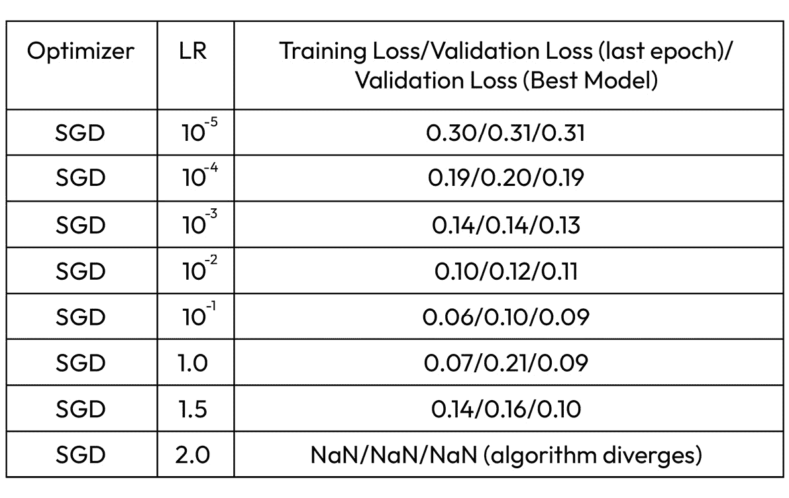
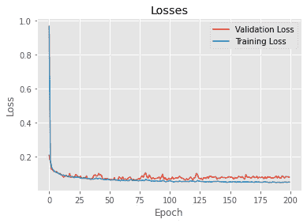

# 第三章：求解回归问题

在前几章中，我们学习了如何设置和运行 MXNet，如何使用 Gluon 和 DataLoaders，并且如何可视化回归、分类、图像和文本问题的数据集。我们还讨论了不同的学习方法（监督学习、无监督学习和强化学习）。在本章中，我们将专注于监督学习，其中至少对于某些示例，期望的输出是已知的。根据这些输出的类型，监督学习可以细分为回归和分类。回归输出是来自连续分布的数字（例如，预测一家上市公司的股票价格），而分类输出是从已知集合中定义的（例如，识别图像是鼠标、猫还是狗）。

分类问题可以看作是回归问题的一个子集，因此，在本章中，我们将首先处理后者。我们将学习为什么这些问题适合深度学习模型，并概述定义这些问题的方程式。我们将学习如何创建合适的模型，并学习如何训练它们，重点介绍超参数的选择。我们将通过根据数据评估模型来结束每一节，这正如在监督学习中所期望的那样，我们将看到回归问题的不同评估标准。

本章将涵盖以下食谱：

+   理解回归模型的数学

+   定义回归的损失函数和评估指标

+   训练回归模型

+   评估回归模型

# 技术要求

除了《*前言*》中指定的技术要求外，本章还需要以下一些附加要求：

+   确保您已完成来自*第一章*的*食谱，安装 MXNet、Gluon、GluonCV 和 GluonNLP*，*与 MXNet 一起启动并运行*。

+   确保您已经完成了来自*第二章*的*食谱 1，回归的玩具数据集——加载、管理和可视化房屋销售数据集*，工作与 MXNet 和可视化数据集：Gluon *和 DataLoader*。

本章的代码可以在以下 GitHub URL 找到：[`github.com/PacktPublishing/Deep-Learning-with-MXNet-Cookbook/tree/main/ch03`](https://github.com/PacktPublishing/Deep-Learning-with-MXNet-Cookbook/tree/main/ch03)。

此外，您可以直接从 Google Colab 访问每个食谱，例如，本章的第一个食谱：[`colab.research.google.com/github/PacktPublishing/Deep-Learning-with-MXNet-Cookbook/blob/main/ch03/3_1_Understanding_Maths_for_Regression_Models.ipynb`](https://colab.research.google.com/github/PacktPublishing/Deep-Learning-with-MXNet-Cookbook/blob/main/ch03/3_1_Understanding_Maths_for_Regression_Models.ipynb)。

# 理解回归模型的数学

如我们在上一章看到的，**回归**问题是一种**监督学习**问题，其输出是来自连续分布的一个数字，比如房价或公司股票价格的预测值。

我们可以用来解决回归问题的最简单模型是**线性回归**模型。然而，这些模型对于简单问题非常强大，因为它们的参数可以训练，并且在涉及的参数数量较少的情况下，速度很快且易于解释。正如我们将看到的，参数的数量完全取决于我们使用的特征数量。

线性回归模型的另一个有趣属性是，它们可以通过神经网络来表示，而神经网络将是我们在本书中使用的大多数模型的基础，因此我们将使用这种基于神经网络的线性回归模型。

最简单的神经网络模型被称为**感知机**，这是我们不仅在本食谱中，而是在整个章节中要研究的基础模块。

## 准备就绪

在深入理解我们的模型之前，我想提一下，对于本食谱中的数学部分，我们将遇到一些矩阵运算和线性代数，但这绝对不会很难。

## 如何操作...

在本食谱中，我们将通过以下步骤进行操作：

1.  数学建模生物神经元

1.  定义回归模型

1.  描述基本激活函数

1.  定义特征

1.  初始化模型

1.  评估模型

### 数学建模生物神经元

感知机最早由美国心理学家 Frank Rosenblatt 于 1958 年在康奈尔航空实验室提出，它是初步尝试复制我们大脑中神经元处理信息的方式。

Rosenblatt 分析了生物神经元并开发了一个行为相似的数学模型。为了比较这些架构，我们将从一个非常简单的神经元模型开始。


图 3.1 – 生物神经元

如我们在*图 3.1*中看到的，神经元由三个主要部分组成：

+   **树突**：神经元从其他神经元接收输入的地方。根据连接的强度，输入在树突中会被增强或减弱。

+   **细胞体**或**胞体**：包含细胞核，这是接收来自树突的所有输入并对其进行处理的结构。细胞核可能会触发电信号并传递给其他神经元。

+   **轴突/轴突末端**：这是输出结构，用于与其他神经元传递信息。

Rosenblatt 将之前简化的神经元模型赋予了某些数学属性：


图 3.2 – 感知机

+   **权重**：这将通过将输入或特征与一组权重（`W` 在 *图 3.2* 中，而 `j` 代表模型中的任何神经元）相乘来模拟树突的行为。

+   **和** 和 **偏置**：在细胞核中输入信号的组合将被建模为带有偏置的求和（*θ* 在 *图 3.2* 中）和一个处理函数，称为 **激活函数**。（我们将在下一步描述这些函数。）

+   **输出**：要么连接到其他神经元，要么是整个模型的直接输出（`o` 在 *图 3.2* 中）。

比较 *图 3.1* 和 *图 3.2*，我们可以看到生物神经元的简化模型与感知器之间的相似之处。此外，我们还可以看到这些部分是如何连接在一起的，从处理输入到输出结果。

### 定义回归模型

因此，从数学角度来看，使用矩阵乘法，我们可以写出以下模型方程 *y = f(W*⋅*X + b)*，其中 `W` 是权重向量 *[W`1`, W`2`, …. W`n`]*，（n 是特征的数量），`X` 是特征向量 *[X`1`, X`2`, …. X`n`]*，`b` 是偏置项，*f()* 是激活函数。对于我们将处理的回归情况，我们将使用线性激活函数，其中输出等于输入。

因此，在我们的例子中，激活函数是恒等函数（输出等于输入），我们有 *y = W**⋅**X +* `b`。

我们可以使用 MXNet 及其 NDArray 库轻松实现这一点：

```py
# Perceptron Model
def perceptron(weights, bias, features):
return mx.nd.dot(features, weights) + bias
```

就这样！这就是我们基于 `X` 输入以及模型的 `W` 和 `b` 参数的 `y` 神经网络输出。

重要提示

在 Rosenblatt 的原始论文中，期望的输出是 0 或 1（分类问题），为了满足这一要求，激活函数被定义为阶跃函数（如果输入小于 0，则输出 0；如果输入大于或等于 0，则输出 1）。这是 Rosenblatt 神经元模型的一个最大限制，后来提出了不同的激活函数来改善模型的表现。

在深度学习网络中，我们不会仅使用单个神经元（感知器）作为模型。通常，多个感知器层被堆叠在一起，层数也被称为网络的 **深度**。


图 3.3 – 深度学习网络

这些网络非常强大，并且已经证明在多个领域匹配或超越了人类水平的表现，包括计算机视觉中的图像识别和自然语言处理中的情感分析。

### 描述基本激活函数

回归问题中最常见的激活函数是线性激活函数和 **ReLU** 激活函数。我们简要描述一下它们。


图 3.4 – 回归的激活函数

#### 线性激活函数

在此函数中，输出等于输入。它没有界限，因此适用于无界的数值输出，正如回归问题的输出所示。

#### ReLU

**修正线性单元**激活函数非常类似于线性激活函数：其输出等于输入，但在这种情况下，只有当输入大于 0 时，输出才等于输入；否则输出为 0。此函数适用于仅将正信息传递到下一层（稀疏激活），并且还提供更好的梯度传播。因此，它在深度学习网络的中间层中非常常见。

重要说明

正如我们将在接下来的内容中看到的，训练涉及迭代地计算新的梯度，并使用这些计算来更新模型参数。当使用激活函数（如 sigmoid）时，层数越多，梯度变得越小。这个问题被称为梯度消失问题，而 ReLU 激活函数在这种情况下表现得更好。

### 定义特征

到目前为止，我们已经从理论上定义了我们的模型及其行为，但我们尚未使用我们的任务框架或数据集来定义它。在本节中，我们将开始以更实际的方式进行工作。

定义模型的下一步是决定我们将使用哪些特征（输入）。我们将继续使用在*第二章*《与 MXNet 合作并可视化数据集：Gluon 和 DataLoader》中遇到的房屋销售数据集。这个数据集包含了 21,613 栋房屋的数据，包括价格和 19 个输入特征。虽然在我们的模型中我们将使用所有输入特征，但在上述配方中，我们看到对房价贡献最大的三个非相关特征如下：

+   居住面积（平方英尺）

+   等级

+   卫生间数量

在初步研究中，我们将使用这三个特征。选择这些特征后，如果我们显示前五个房屋的数据，我们将看到以下内容：


图 3.5 – 房屋价格的过滤特征

在之前分析这个数据集时，我们没有利用的一条路径是，`grade`不像其他特征那样是连续的；它的值来自一个离散的集合。这种类型的特征被称为分类特征，可以是名义型的或有序型的。名义型特征是类名——例如，我们可以将房屋的建筑风格作为一个特征，该特征的值可以是维多利亚式、艺术装饰风格、工匠风格等。而有序型特征则是类编号。在我们的例子中，`grade`是一个有序特征，由按顺序排列的数值组成（1 为最差，13 为最好）。

在这两种情况下，分类特征可以通过不同的方式以数字形式表示，这有助于我们的模型更好地学习特征与输出之间的关系。处理分类特征的方法有多种。在这个例子中，我们将使用最简单的方式之一——**独热编码**方案。

提示

你可以在本食谱末尾的*更多内容*部分找到有关处理分类数据的更多信息。

使用独热编码方案，每个类别都会被分解为它自己的特征，并相应地分配一个二进制值。在我们的例子中，`grade`包含从 1 到 13 的整数值，因此，我们向输入向量中添加了 13 个新特征。这些新特征的值将为 0 或 1。例如，对于一个 1 级的房子，特征向量如下所示：


图 3.6 – 等级特征的独热编码

如果我们仔细查看*图 3.6*，我们会发现没有对应于值 2 的独热编码。这是因为我们的数据集中没有实际房子的等级为 2，因此没有将其作为特征添加。

因此，最终的特征数量为 14 个，输出为 1 个，即房子的价格。

### 初始化模型

现在我们已经定义了输入（特征）和输出的维度，我们可以初始化模型。我们将在下一部分更详细地探讨这个问题，但展示一下它的大致样子还是很有用的：

```py
Weights:
 [[ 0.96975976]
 [-0.52853745]
 [-1.88909 ]
 [ 0.65479124]
 [-0.45481315]
 [ 0.32510808]
 [-1.3002341 ]
 [ 0.3679345 ]
 [ 1.4534262 ]
 [ 0.24154152]
 [ 0.47898006]
 [ 0.96885103]
 [-1.0218245 ]
 [-0.06812762]]
 <NDArray 14x1 @cpu(0)>
 Bias:
[-0.31868345]
 <NDArray 1 @cpu(0)>
```

正如预期的那样，`Weights`向量有 14 个分量（即特征数量），而`Bias`向量只有 1 个分量。

### 评估模型

现在我们的模型已初始化，我们可以用它来估算第一套房子的价格，正如*图 3.6*所示，估计价格大约为 220 万美元。在我们当前的模型下，估算的房价为（单位：美元）：

```py
2610.2383
```

由于我们有预期的价格，我们可以计算一些误差指标。在本例中，我选择了绝对误差和相对于实际价格的误差。这些量可以很容易地在 Python 中计算：

```py
error_abs = abs(expected_output - model_output)
 error_perc = error_abs / expected_output * 100
 print("Absolute Error:", error_abs)
 print("Relative Error (%):", error_perc)
```

获得的误差值如下：

```py
Absolute Error: 219289.76171875
Relative Error (%): 98.82368711976115
```

如你所见，2.6 千美元对于一套面积为 1,180 平方英尺的房子来说是一个非常低的价格，即使它只有 1 个浴室，并且评级为中等（7）。这意味着我们的误差指标值非常大，暗示着大约 99%的误差率。这表明，要么我们没有正确评估我们的模型（在这种情况下，我们只使用了一个值，可能只是运气不好），要么我们只使用了初始化的参数，这些参数并没有给出准确的估计。我们需要通过一个称为**训练**的过程来改进我们的模型参数，以提高评估指标。我们将在下一部分详细探讨这些话题。

## 它是如何工作的...

回归模型可以复杂到设计者所需的程度。它们可以拥有足够多的层次，以适当地建模输入特征和期望输出值之间的关系。

在本食谱中，我们描述了大脑中生物神经元的工作原理，并简化它以推导出一个简单的数学模型，供我们用于回归问题。在我们的例子中，我们只使用了一个层，通常称为输入层，并将权重和偏置定义为其参数。

此外，我们学习了如何初始化模型，探索了初始化对权重和偏置的影响，并了解了如何利用我们的数据来评估模型。我们将在接下来的食谱中进一步展开这些话题。

## 还有更多内容……

在本篇食谱中，我们简要介绍了几个话题。我们首先描述了罗森布拉特的感知器。如果你想阅读原始论文，可以通过这个链接访问：[`www.ling.upenn.edu/courses/cogs501/Rosenblatt1958.pdf`](https://www.ling.upenn.edu/courses/cogs501/Rosenblatt1958.pdf)。

尽管在本食谱及之后的食谱中我们会使用一些公式，但我们将使用库和代码来帮助我们专注于实际输出及其与输入的关系。然而，对于感兴趣的读者，这里有一篇回顾文章：[`machinelearningmastery.com/gentle-introduction-linear-algebra/`](https://machinelearningmastery.com/gentle-introduction-linear-algebra/)。

此外，我们对输入特征进行了更详细的分析，特别是使用独热编码处理了`grade`这一分类特征。处理分类数据有多种方法，相关内容可以在此链接中找到：https://towardsdatascience.com/understanding-feature-engineering-part-2-categorical-data-f54324193e63。

关于初始化和评估的更多信息，请继续阅读本章中的后续食谱。

# 定义回归的损失函数和评估指标

在前一篇食谱中，我们定义了输入特征，描述了我们的模型，并对其进行了初始化。那时，我们传入了一栋房子的特征向量来预测价格，计算了输出，并将其与预期输出进行了比较。

在前一篇食谱的结尾，我们通过比较模型的预期输出和实际输出，直观地了解了模型的好坏。这就是“评估”模型的含义：我们评估了模型的性能。然而，这一评估并不完全，原因有几个，因为我们没有正确地考虑到一些因素：

+   我们只对一栋房子进行了模型评估——那么其他的房子呢？我们如何在评估中考虑到所有房子呢？

+   值之间的差异是否是衡量模型误差的准确方法？还有哪些操作是有意义的？

在本食谱中，我们将讨论如何评估（即“评估”）我们模型的性能，并研究适合此目的的函数。

此外，我们将介绍一个在优化（即训练）模型时非常重要的概念：损失函数。

## 准备工作

在定义一些用于评估回归模型和计算其损失的有用函数之前，让我们明确一下我们将用来评估模型的函数的两个必需属性和三个期望属性：

+   [必需的] **连续性**：显然，我们希望我们的评估函数在某些潜在的误差值上不会是未定义的，这样我们就可以在大量的（预期输出，实际模型输出）对上使用这些函数。

+   [必需的] **对称性**：通过一个例子很容易解释这个问题。假设一栋房子的价格是 220 万美元——我们希望我们的评估函数能够以相同的方式评估模型，无论输出是 200 万美元还是 240 万美元，因为这两个值离预期值的距离是相同的，只是方向不同。

+   [期望的] **稳健性**：同样，这个问题通过一个例子更容易解释。以之前提到的例子为例，假设我们有 2.4 百万美元和 2.8 百万美元两个输出值。与预期值 220 万美元相比，误差已经很大，因此我们不希望由于损失/评估函数的影响使误差变得更大。从数学的角度来看，我们不希望误差呈指数增长，否则可能导致计算发散至**不是一个数字（NaN）**。使用稳健函数时，大误差不会导致计算发散。

+   [期望的] **可微性**：这是所有属性中最不直观的一项。通常，我们的目标是将误差率尽可能接近零。然而，这只是一个理论场景，只有当我们拥有足够的数据来完美描述问题，并且模型足够大，能够表示从数据到输出值的映射时，才会发生。在现实中，我们永远无法确保符合这两个假设，因此，零误差的不切实际期望会转化为数据和模型的最小误差。我们只能通过计算函数的微分函数来检测函数的最小值，因此才有了这个**可微性**属性。幸运的是，可微性意味着连续性，因此如果我们的函数满足属性 #4，它也会自动满足属性 #1。

+   [期望的] **简洁性**：满足所有属性的函数越简单越好，因为这样我们可以更直观地理解结果，并且从计算上讲也不会太昂贵。

提示

不仅评估函数必须满足这些标准。正如我们将在下一个章节看到的，它们还必须被一个对训练非常重要的函数所满足，即*损失函数*。

## 如何操作...

让我们讨论一些评估和损失函数，并分析它们的优缺点。我们将描述的函数如下：

1.  平均绝对误差

1.  均方误差

1.  平滑 L1 损失

### 平均绝对误差

我们要研究的第一个函数根据之前描述的五个属性*几乎*完美。这个函数的直观想法是使用值之间的差异作为这些值之间距离或误差的指标。我们应用 `abs` 函数，即绝对值，使其变得对称：

MAE =  1  _  n  ∑  j=1  n  | y  j −  ˆ  y  j|

当绘制时，该函数生成以下图形：


图 3.7 – MAE 图

如果我们根据之前定义的属性来分析这个函数，我们会发现，除了第 #4 条外，所有属性都得到了满足；不幸的是，该函数在 0 点不可导。如我们将在下一个配方中看到的那样，当这个函数作为损失函数使用时，这特别具有挑战性。然而，在评估我们的模型时并不需要导数，因为评估过程不需要微分，**平均绝对误差**（**MAE**）被视为评估中的典型回归指标。

重要提示

这个函数可以用于评估，也可以作为损失函数（单独使用或作为正则化项）。在这种情况下，它通常被称为 L1 损失或项，它计算的是与期望输出和实际输出对应的向量的 L1 距离。

另一个类似的指标是 **平均绝对百分比误差**（**MAPE**）。在该指标中，每个输出误差通过期望输出进行归一化：

MAPE =  100%  _  n  ∑  i=1  n  |  y  i −  ˆ  y  i  _  y  i |

### 均方误差

为了解决可导性问题，**均方误差**（**MSE**）函数与 MAE 非常相似，但在差异项上将阶数从 1 提高到 2。直观的想法是使用最简单的二次可导函数（`x`²）：

MSE =  1  _  n  ∑  i=1  n  (Y  i −  ˆ  Y  )  2

当绘制时，该函数生成以下图形：


图 3.8 – MSE 图

如果我们根据已定义的属性来分析该函数，我们发现，除了第 #3 条外，所有属性都得到了满足。不幸的是，这个函数的稳健性不如 MAE。较大的误差呈指数级增长，因此该评估函数对异常值更加敏感，因为一个数据点的非常大误差可能导致该值的平方误差非常大，从而对 MSE 产生很大影响，导致错误的结论。

重要提示

这个函数可以用于损失函数（单独使用或作为正则化项）。在这种情况下，它通常被称为 L2 损失或项（岭回归），因为它计算的是与期望输出和实际输出对应的向量的 L2 距离。

为了与输出变量具有相同的单位，MSE 可以应用平方根。这个评估指标叫做**均方根误差**（**RMSE**）：

RMSE = √ _ ∑ i=1 n  ( ˆ y  i − y i) ² _ n

### 平滑的平均绝对误差/平滑 L1 损失

我们不能同时拥有两全其美吗？当然可以！

通过结合这两个函数——对小误差值使用 MSE，对大误差值使用 MAE——我们得到了如下结果：

平滑的 L1(x) = { 0.5 x²  如果 |x| < 1    |x| − 0.5  否则

当绘制时，该函数产生如下图所示：


图 3.9 – 平滑的平均绝对误差图

如果我们根据已定义的属性分析这个函数，我们会看到所有属性都得到了满足。

重要提示

这个函数可以用于损失函数。在这种情况下，通常称之为平滑 L1 损失。

## 它是如何工作的...

在本章的第一个例子中，我们设计了基于简单生物神经元的第一个回归模型。我们随机初始化了其参数，并进行了第一次简单的评估。结果并不好，我们推测这是由于两个原因：我们的评估机制不够稳健，模型参数没有优化。

在这个例子中，我们探讨了如何改进第一个原因：评估。我们涵盖了三种最重要的评估指标，并提到了它们与损失函数的关系，我们将在下一个例子中详细探讨这些内容。

此外，我们讨论了哪些评估指标更好，探讨了 MAE 是如何稳健的，但不幸的是不可微分，MSE 是可微分的，但它允许异常值影响指标（这并不理想）。我们通过结合这两种函数，得到了两者的优点。

## 还有更多...

在这个例子中，我们没有探索的一个非常有趣的评估函数集是决定系数及其扩展。然而，这个集仅用于线性回归建模。更多信息可以通过以下链接获取：

+   **决定系数**[`en.wikipedia.org/wiki/Coefficient_of_determination`](https://en.wikipedia.org/wiki/Coefficient_of_determination)

+   **Jim 的统计学** [`statisticsbyjim.com/regression/r-squared-invalid-nonlinear-regression/`](https://statisticsbyjim.com/regression/r-squared-invalid-nonlinear-regression/)

此外，在回归问题中，通常可以使用许多不同的函数进行评估和损失计算；你可以参考这个链接了解更多细节：[`machine-learning-note.readthedocs.io/en/latest/basic/loss_functions.html`](https://machine-learning-note.readthedocs.io/en/latest/basic/loss_functions.html)

# 训练回归模型

在监督学习中，训练是朝着特定目标优化模型参数的过程。它通常是解决深度学习问题中最复杂、最耗时的步骤。

在本方法中，我们将访问训练模型所涉及的基本概念。我们将应用这些概念来解决我们在本章中先前定义的回归模型，并结合我们讨论过的函数的使用。

我们将使用在*第二章**中看到的数据集预测房价：*《使用 MXNet 与数据可视化：Gluon》和 DataLoader*。

## 准备工作

为了理解这个方法，我们需要熟悉一些概念。这些概念定义了训练的进行方式：

+   **损失函数**：训练过程是一个迭代优化过程。随着训练的进行，期望模型能够在与模型实际输出进行比较的操作中表现得更好。这个操作就是损失函数，也称为目标函数、成本函数或代价函数，它是在训练过程中被优化的。

+   **优化器**：在每次训练迭代过程中，模型的每个参数都会通过一个量（通过损失函数计算）进行更新。优化器是一种定义如何计算该量的算法。优化器最重要的超参数是**学习率**，它是应用于计算量的乘数，用于更新参数。

+   **数据集划分**：当模型能够在真实世界中达到最佳表现时，停止训练对深度学习项目的成功至关重要。一种实现此目标的方法是将数据集划分为训练集、验证集和测试集。

+   **训练轮次**：这是训练过程将运行的迭代次数。

+   **批量大小**：每次分析的训练样本数，用于生成梯度估计。

## 如何做到...

在本方法中，我们将创建自己的训练循环，并评估每个超参数如何影响训练。为此，我们将遵循以下步骤：

1.  改进模型

1.  定义损失函数和优化器

1.  划分数据集

1.  分析公平性和多样性

1.  定义训练轮次和批量大小

1.  整合所有内容以形成训练循环

### 改进模型

为了解决这个问题，我们在前面的食谱中探讨的架构（感知机）将不够用。我们将多个感知机堆叠在一起，并通过不同的层连接它们。这种架构被称为**多层感知机**（**MLP**）。我们将定义一个包含三个隐藏层的网络架构，所有层都是全连接（密集层），并使用**ReLU**激活函数（在本章的第一篇食谱中介绍）来分别包含 128、1,024 和 128 个神经元，最后一层是输出层，只有一个输出。最后一层不使用激活函数，也称为线性激活函数（*y =* `x`）。

此外，房屋销售数据集是一个非常复杂的问题，找到在现实世界中具有良好泛化能力的解决方案并不容易。为此，我们在模型中加入了两个新的高级特性：

+   **批量归一化**：通过该步骤，对于每个小批量，输入分布都会进行标准化。这有助于训练收敛和泛化能力。

+   **Dropout**：此方法的内容是随机禁用神经网络中的神经元（根据一定的概率）。这有助于减少过拟合（这一概念将在下一个食谱中解释）并改善泛化能力。

我们的代码如下：

```py
def create_regression_network():
    # MultiLayer Perceptron Model (this time using Gluon)
    net = mx.gluon.nn.Sequential()
    net.add(mx.gluon.nn.Dense(128))
    net.add(mx.gluon.nn.BatchNorm(axis=1, center=True, scale=True))
    net.add(mx.gluon.nn.Activation('relu'))
    net.add(mx.gluon.nn.Dropout(.5))
    net.add(mx.gluon.nn.Dense(1024))
    net.add(mx.gluon.nn.BatchNorm(axis=1, center=True, scale=True))
    net.add(mx.gluon.nn.Activation('relu'))
    net.add(mx.gluon.nn.Dropout(.4))
    net.add(mx.gluon.nn.Dense(128))
    net.add(mx.gluon.nn.BatchNorm(axis=1, center=True, scale=True))
    net.add(mx.gluon.nn.Activation('relu'))
    net.add(mx.gluon.nn.Dropout(.3))
    net.add(mx.gluon.nn.Dense(1))
     return net
```

一个需要注意的重要点是，我们模型的输入也已被修改：

+   数值输入已被缩放，以生成均值为零、方差为单位的输入。这改善了训练算法的收敛性。

+   类别输入（等级）已进行了独热编码。我们在*第二章*的*食谱 4，文本任务的玩具数据集——加载、管理和可视化恩朗邮件数据集*中介绍了这个概念，来自[**MXNet 的工作与数据集可视化：Gluon**和 DataLoader]。

这将特征数量增加到 30。由于数据集包含大约 20k 行数据，这提供了大约 600k 个数据点。我们可以将其与模型中参数的数量进行比较：

```py
[...]
Parameters in forward computation graph, duplicate included
   Total params: 272513
   Trainable params: 269953
   Non-trainable params: 2560
Shared params in forward computation graph: 0
Unique parameters in model: 272513
```

我们模型中可训练参数的数量约为 270k。数据点的数量大约是我们模型中可训练参数的两倍。通常，这是成功模型的最低要求，理想情况下，我们希望使用的数据集大小为模型参数的 10 倍左右。

提示

尽管将数据点数量与模型的参数数量进行比较是一个非常有用的方法，但不同的架构对数据有不同的需求。如同往常一样，实验（试错法）是找到正确平衡的关键。

关于我们模型的最后一个重要点是初始化方法，因为在多层网络中，随机初始化可能不会产生最佳结果。现如今最常用的方法包括以下几种：

+   **Xavier 初始化**：在计算方差时，考虑了输入数量和输出数量。

+   **MSRA PReLU** 或 **Kaiming 初始化**：Xavier 初始化方法在 ReLU 激活函数中存在一些问题，因此更倾向于使用此方法。

MXNet 提供了非常简单的方式来访问这些功能，在本例中是 MSRA PReLU 初始化：

```py
net.collect_params().initialize(mx.init.MSRAPrelu(), ctx=ctx, force_reinit=True)
```

重要提示

初始化方法为权重和偏置提供初始值，以避免模型激活函数初始化在饱和（平坦）区域。其直觉是让这些权重和偏置的均值为零，方差为单位。有关统计分析的详细信息，请参见 *更多内容...*。

### 定义损失函数和优化器

如我们在前面的示例中所见，平滑 L1（也称为 Huber）损失函数效果非常好。

有几种优化器已被证明在 **监督学习** 问题中表现良好：

+   在我们处理 **DataLoader** 时使用的 `batch_size` 参数，见 *第二章**，与 MXNet 配合使用并可视化数据集：Gluon* *与 DataLoader*。

+   **动量/ Nesterov 加速梯度**：梯度下降可能会遇到稳定性问题，并可能开始跳跃并陷入局部最小值。避免这些问题的一种方法是考虑算法过去的步骤，这可以通过这两种优化器实现。

+   **Adagrad**/**Adadelta**/**RMSprop**：GD 对所有参数使用相同的学习率，而不考虑它们更新的频率。Adagrad 及这些优化器通过调整每个参数的学习率来解决这个问题。然而，Adagrad 的学习率会随着时间的推移而减小，并可能接近零，导致无法进行进一步更新。为了解决这个问题，开发了 Adadelta 和 RMSprop。

+   **Adam**/**AdaMax**/**Nadam**：这些最先进的优化器结合了梯度下降的两项改进：过去步骤的计算和自适应学习率。Adam 使用 L2 范数来计算梯度的指数加权平均值，而 AdaMax 使用无穷范数（最大操作）。Nadam 用 Nesterov 动量替代了 Adam 中的动量部分，从而加速收敛。

MXNet 和 Gluon 提供了非常简单的接口来定义损失函数和优化器。通过以下两行代码，我们选择了 Huber 损失函数和 Adam 优化器：

```py
# Define Loss Function
loss_fn = mx.gluon.loss.HuberLoss()
# Define Optimizer and Hyper Parameters
trainer = mx.gluon.Trainer(net.collect_params(), "adam", {"learning_rate": 0.01})
```

### 切分我们的数据集

在所有数据科学项目中，需要考虑的最重要的事情之一就是在我们将模型应用于新的数据时，已训练模型在未见过的数据上的表现如何。对于监督学习，在训练和评估过程中，我们使用已知的（期望的）输出数据，那么如何确保我们在新数据上使用模型时，它能按预期表现呢？

我们通过将数据集分成三个部分来解决这个问题：

1.  **训练集**：训练集在训练过程中用于计算模型参数的更新。

1.  **验证集**：验证集在训练过程中用于检查每个周期模型的改进情况（或没有改进），即之前计算的那些更新。

1.  **测试集**：最后，一旦训练完成，我们可以计算模型在*未见数据*上的表现，这就是测试集，是数据集中唯一未在训练中用于提升模型的部分。

此外，为了保证稳定的训练，使得我们的模型能正确处理数据集外的数据，数据的划分需要考虑以下因素：

+   **划分大小**：这取决于可用数据的数量和任务的性质。典型的训练/验证/测试数据划分比例为 60/20/20 或 80/10/10。

+   **选择每个划分的数据点**：这里的关键是拥有一个平衡的数据集。例如，在我们的房价数据集中，我们不希望训练集里只有两间和三间卧室的房子，验证集里是四卧房的房子，最后测试集是五间或更多卧室的房子。理想情况下，每个数据集应该准确代表整个数据集。这对于需要考虑公平性和多样性的敏感数据集尤其重要。

我们可以很容易地实现这些划分，在这个例子中，使用一个来自著名库**scikit-learn**的函数：

```py
# Dataset Split 80/10/10
from sklearn.model_selection import train_test_split
full_train_df, test_df = train_test_split(house_df, test_size=0.2, random_state=42)
# To match correctly 10% size, we use previous size as reference
train_df, val_df = train_test_split(full_train_df, test_size=len(test_df), random_state=42)
```

在前面的代码片段中，我们将训练集、验证集和测试集分成三个部分，分为两个步骤：

+   我们将数据集的 20%分配给测试集。

+   剩余的 80%将平分给验证集和测试集。

### 分析公平性和多样性

假设一下我们为一个房地产网站工作，负责数据科学团队。我们有一个非常吸引人的功能来为我们的网站带来流量：当房主想要出售房产时，他们可以填写一些房屋数据，并能看到一个经过机器学习优化的估算价格，告诉他们应该以什么价格将房屋挂牌出售，同时数据还表明房屋将在接下来的三个月内按这个价格售出。这个功能听起来非常酷，因为房主可以微调他们想要出售房屋的要价，而潜在买家也会根据市场看到合理的价格。

然而，我们突然意识到，对于拥有两间或更少浴室的房子，数据量还不够，而且我们知道这个特征对我们的模型非常敏感。如果我们将这个模型应用于现实中的房产，意味着我们模型可能会将拥有两间或更少浴室的房子的估价定得接近那些拥有更多浴室的房子，仅仅因为这是模型所能看到的所有数据。这就意味着，对于最便宜的房子，即低收入家庭最负担得起的房子，我们可能会*不公平地*提高它们的价格，这将是一个严重的问题。

我们的模型不能知道更多，因为我们没有展示给它更多。在这种情况下，我们有哪些选择？以下是可能适合实际情况的几种方案：

+   对我们的模型的鲁棒性充满信心，并无论如何都将其部署到生产环境中。

+   说服业务领导者，在我们拥有所需的所有数据之前不要部署模型。

+   将模型部署到生产环境中，但只允许卖家将其用于至少有三个浴室的房屋。

第一个选项是所有选项中最不充分的，然而，由于以下原因，它实际上是最常用的：

+   在项目进行了几个月后再延迟发布是非常不方便的。管理层通常不期望也不希望听到这样的消息，这可能会让一些工作岗位面临风险。

+   然而，发生这种情况最常见的原因是数据中的错误没有被注意到。通常没有足够的时间来验证数据是否准确、公平、多样，因此重点转向尽快交付一个优化过的模型。

第二个选项因为与第一个选项类似的原因而很难辩护，而第三个选项可能在纸面上看起来不错，但实际上是非常危险的。如果我遇到这种情况，我不会选择第三个选项，仅仅因为我们不能确保数据在所有特征上都是多样和公平的，因此需要进行适当的数据质量评估。如果我们在项目这么晚的阶段发现这种错误，那是因为在数据质量上没有给予足够的关注。这通常发生在那些已经记录或存储了大量数据的公司中，而这些公司现在想用这些数据做一些机器学习项目，而不是设计有明确目标的数据收集操作。这是机器学习项目在这些公司中失败的最常见原因之一。

让我们从公平性和多样性的角度来看一下我们的数据集：

首先，正如在《第二章》*中的*《配方 1，回归模型玩具数据集——加载、管理与可视化房屋销售数据集*，与 MXNet 和数据集可视化：Gluon 和 DataLoader*一节中所见，我们将从价格分布开始：


图 3.10 – 训练集、验证集和测试集的价格分布

尽管我们可以看到价格低于$500k 的房屋出现了小幅下降，但三个数据集中的价格分布在很大程度上是均衡的，且不需要进行手动修改。

居住面积（平方英尺）如下所示：


图 3.11 – 训练集、验证集和测试集的居住面积平方英尺图

我们在这里看到的最大差异是由于少数高价房产。我们甚至可以将这些看作是异常值，如果我们的训练参数选择得当，这不应影响我们的预测能力。

浴室数量如下所示：


图 3.12 – 训练集、验证集和测试集中的浴室数量分布

这种分布在我们的验证集和测试集中得到了很好的体现。

评分如下所示：


图 3.13 – 训练集、验证集和测试集的评分

这种分布在我们的验证集和测试集中也得到了很好的体现。

将所有个别分析结果汇总，我们可以得出结论：我们的训练集、验证集和测试集相当好地代表了完整数据集。我们必须记住，我们的数据集有其自身的局限性（尽管我必须说，对于所选特征，它表现得相当不错）：

+   价格: [75k$, 7.7M$]

+   居住面积（平方英尺）：[290, 13540]

+   浴室数量 [0, 8]

+   评分: [1, 13]，但之前提到的缺少 2

### 定义训练轮数和批量大小

**训练轮数**指的是训练算法运行的迭代次数。根据问题的复杂性以及所选择的优化器和超参数，这个数字可能会从非常低（例如 5-10 次）到非常高（几千次迭代）。

**批量大小**指的是在同一时间内分析的训练样本数，以估计误差梯度。在*第二章**，与 MXNet 协作并可视化数据集：Gluon 和 DataLoader* 中的*Recipe 3，面向图像任务的玩具数据集——加载、管理和可视化鸢尾花数据集*，我们引入了这个概念作为优化内存使用的一种手段；批量大小越小，所需内存越少。此外，这样可以加速梯度的计算；批量大小越大，计算运行越快（如果内存允许）。典型的批量大小范围从 32 到 2,048 个样本。

### 将所有内容结合起来，形成一个训练循环

训练循环是一个迭代过程，运行优化器以计算/估计梯度，从而在每次迭代中减少通过损失函数（优化器的目标）计算得到的误差。如前所述，每次迭代称为一个“轮次”。对于每次迭代，整个训练集都以批次的方式被访问以计算梯度。

此外，正如我们将看到的，计算验证集的损失函数非常有趣。在我们的案例中，我们还将计算测试集的损失函数，因为它将为我们提供关于模型表现的具体细节。

为了理解修改超参数时的行为差异，我们将对我们的房价预测数据集多次运行训练循环，每次仅修改一个超参数，其他变量保持不变（除非另有说明）。

#### 优化器和学习率

如前所述，训练循环中选择的优化器和学习率是密切相关的，因为对于某些优化器（如 SGD），学习率是恒定的，而对于其他优化器（如 Adam），学习率从一个给定的起始点开始变化。

提示

最好的优化器取决于多个因素，没有什么比试错法更有效。我强烈建议尝试几个优化器，看看哪个最适合。在我的经验中，SGD 和 Adam 通常是表现最好的，甚至在这个问题中——预测房价问题上。

让我们分析一下，当变动**学习率**（**LR**）并保持其他参数不变时，SGD 优化器的训练损失和验证损失是如何变化的：*训练轮数 = 100，批次大小 = 128，损失函数 = HuberLoss*：



图 3.14 – 当变动学习率时，SGD 优化器的损失

从*图 3.14*中，我们可以得出结论，对于 SGD 优化器，学习率（LR）值在 10^-1 到 1.0 之间是最佳的。此外，我们可以看到，对于非常大的 LR 值（> 2.0），算法会发散。这就是为什么在寻找最佳学习率值时，最好从小值开始。

让我们分析一下，当变动**学习率**（**LR**）并保持其他参数不变时，Adam 优化器的训练损失和验证损失是如何变化的：*训练轮数 = 100，批次大小 = 128，损失函数 = HuberLoss*：


图 3.15 – 当变动学习率时，Adam 优化器的损失

从*图 3.15*中，我们可以得出结论，对于 Adam 优化器，学习率（LR）值在 10^-4 到 10^-3 之间是最佳的。由于 Adam 计算梯度的方式不同，它比 SGD 更不容易发散。

Adam 需要较小的学习率值，因为它*会随着训练过程的进展*调整学习率。

#### 批次大小

让我们分析一下，当变动批次大小时，Adam 优化器的训练损失和验证损失是如何变化的，其他参数保持不变：*训练轮数 = 100，学习率 = 10^-2，损失函数 = HuberLoss*：


图 3.16 – 当变动批次大小时，Adam 优化器的损失

从*图 3.16*中，我们可以得出结论，对于 Adam 优化器，批次大小在 64 到 1,024 之间提供最佳结果。

#### 训练轮数

另一个超参数是训练轮数（epochs），即优化器处理完整训练集的次数。

让我们分析在 Adam 优化器下，当改变训练轮次（epochs）时，训练损失和验证损失的变化，同时保持其他参数不变：*LR = 10-2，Batch Size = 128，Loss fn =* **HuberLoss**：


图 3.17 – Adam 优化器在改变训练轮次时的损失

从 *图 3.17* 中，我们可以得出结论，大约 100-200 轮次对于我们的问题是合适的。在这些值下，很可能会在此之前取得最佳结果。

## 它是如何工作的...

在我们解决回归问题的过程中，我们在这篇教程中学会了如何最优地更新模型的超参数。我们理解了每个超参数在训练循环中的作用，并对每个超参数进行了单独的消融研究。这帮助我们理解了在单独修改每个超参数时，训练损失和验证损失的表现。

对于我们当前的问题和选择的模型，我们验证了最佳超参数组合如下：

+   优化器：Adam

+   学习率：10-2

+   Batch Size：128

+   训练轮次：200

在训练循环结束时，这些超参数给我们带来了 0.10 的训练损失和 0.10 的验证损失。

## 还有更多...

在我们的模型定义中，我们引入了三个新概念：**批量归一化**、**dropout** 和 **scaling**。我认为以下链接对理解这些高级话题非常有用：

+   **批量归一化简介**： [`machinelearningmastery.com/batch-normalization-for-training-of-deep-neural-networks/`](https://machinelearningmastery.com/batch-normalization-for-training-of-deep-neural-networks/)

+   **Batch normalization 研究** **论文**： [`arxiv.org/abs/1502.03167`](https://arxiv.org/abs/1502.03167)

+   **dropout 简介**： [`machinelearningmastery.com/dropout-for-regularizing-deep-neural-networks/`](https://machinelearningmastery.com/dropout-for-regularizing-deep-neural-networks/)

+   **Dropout 研究** **论文**： [`jmlr.org/papers/v15/srivastava14a.html`](https://jmlr.org/papers/v15/srivastava14a.html)

+   **Scaling**： [`machinelearningmastery.com/how-to-improve-neural-network-stability-and-modeling-performance-with-data-scaling/`](https://machinelearningmastery.com/how-to-improve-neural-network-stability-and-modeling-performance-with-data-scaling/)

在初始化方面，本文详细探讨了 Xavier 和 Kaiming 方法（包括研究论文的链接）： [`pouannes.github.io/blog/initialization/`](https://pouannes.github.io/blog/initialization/)

在本教程中，我们深入探讨了两种优化器，**SGD** 和 **Adam**，的表现。这是两个最重要且表现最好的优化器；然而，还有许多其他优化器，有些可能更适合你的特定问题。

一个学习 MXNet 中实现的优化器及其特性的绝佳资源是官方文档：[`mxnet.apache.org/versions/1.6/api/python/docs/tutorials/packages/optimizer/index.html`](https://mxnet.apache.org/versions/1.6/api/python/docs/tutorials/packages/optimizer/index.html)。

为了比较每个优化器的行为和表现，我个人喜欢这个链接中展示的可视化（优化器部分）：[`towardsdatascience.com/on-optimization-of-deep-neural-networks-21de9e83e1`](https://towardsdatascience.com/on-optimization-of-deep-neural-networks-21de9e83e1)。

在本食谱中，我们研究了优化器及其超参数。超参数选择是一个非常复杂的问题，通常需要通过每个问题的试验和错误来验证训练循环是否有效。选择超参数时的经验法则是阅读解决与自己问题相似的研究论文，并从那些论文中提出的超参数开始。然后，你可以从这个起点出发，看看什么最适合你的特定情况。

除了训练过程中的训练损失和验证损失外，我们还提供了第三个损失值，*最佳验证损失*，我们将在下一个食谱中探讨这个值的含义及其计算方法。这一切都与我们尚未正确回答的问题相关：*我应该什么时候停止训练循环？* 我们将在下一个食谱中解决这个问题。

# 回归模型评估

在上一个食谱中，我们学习了如何选择训练超参数以优化我们的训练。我们还验证了这些选择如何影响训练和验证损失。在本食谱中，我们将探讨这些选择如何影响我们在现实世界中的实际评估。细心的读者会注意到我们将数据集分为三个不同的部分：训练集、验证集和测试集。然而，在训练过程中，我们只使用了训练集和验证集。在本食谱中，我们将通过在未见数据（测试集）上运行模型来模拟一些现实世界的行为。

## 准备工作

在评估模型时，我们可以执行定性评估和定量评估：

+   **定性评估**是选择一个或多个随机（或不那么随机，取决于我们要寻找的东西）样本，并分析结果，验证它是否符合我们的预期。

+   **定量评估**涉及计算大量输入的输出并对其进行统计分析（通常是均值），因此我们将计算 MAE 和 MAPE。

此外，我们还将看看训练如何对评估产生重大影响。

## 如何操作……

在开始模型评估之前，让我们先讨论如何衡量我们的模型训练表现。因此，本食谱中的步骤如下：

1.  衡量训练表现——过拟合

1.  定性评估

1.  定量评估

### 测量训练表现 – 过拟合

深度学习网络非常强大，在多种问题上超越了人类水平的表现。然而，如果不加以控制，这些网络也可能产生不正确和意外的结果。最重要且常见的错误之一发生在网络充分发挥其能力时，它会记住正在展示的样本（训练集），从而在这些数据上得到非常好的结果。然而，在这种情况下，网络只是记住了训练样本，而当它在实际的使用场景中部署时，表现将会很差。这种错误被称为**过拟合**。

幸运的是，有一种非常成功的策略可以处理过拟合问题，我们已经提到过它。它的开始是将我们的完整数据集拆分为训练集和验证集，这一点我们在前面的步骤中已经做过了。

从理论角度来看，训练和验证损失通常表现出类似以下图形的行为：


图 3.18 – 损失与轮数的关系 – 理想

在*图 3.18*中，我们可以看到训练和验证损失通常是如何变化的（理想化的表现）。随着训练的进行，训练损失持续下降，始终在优化（尽管随着训练轮数的增加，下降速度变慢）。然而，验证损失达到一个点后不再继续下降，反而开始上升。验证损失最低点是模型达到最佳性能的地方，也是我们应该停止学习过程（早停）的时候。

让我们来看一下这种行为在实际中的表现。对于我们的问题，随着训练的进展，训练损失和验证损失是这样变化的：



图 3.19 – 损失与轮数的关系 – 实际

如我们在*图 3.19*中所见，验证损失比理想情况下更为嘈杂，早停也更难成功实现。一个非常简单的实现方法是每当验证损失减少时就保存模型。这样，我们总是可以确保在给定的训练轮数内，具有最佳（最低）验证损失的模型会被保存。这正是前面步骤中实施的方法。

### 定性评估

为了验证我们的模型是否与预期一致（即在预测房价时产生较低的误差），一种简单的方法是使用测试集中的随机输入（未见过的数据）来运行我们的模型。这可以通过以下代码轻松实现：

```py
scaled_input = mx.nd.array([scaled_X_train_onehot_df.values[random_index]])
# Unscaled Expected Output
expected_output = y_test[random_index]
 print("Unscaled Expected Output:", expected_output)
# Scaled Expected Output
scaled_expected_output = scaled_y_test[random_index]
 print("Scaled Expected Output:", scaled_expected_output)
# Model Output (scaled)
 output = net(scaled_input.as_in_context(ctx)).asnumpy()[0]
 print("Model Output (scaled):", output)
# Unscaled Output
unscaled_output = sc_y.inverse_transform(output)
 print("Unscaled Output:", unscaled_output)
# Absolute Error
abs_error = abs(expected_output - unscaled_output)
 print("Absolute error: ", abs_error)
# Percentage Error
perc_error = abs_error / expected_output * 100.0
print("Percentage Error: ", perc_error)
```

上述代码片段将产生以下结果：

```py
Unscaled Expected Output: [380000.]
 Scaled Expected Output: [-0.4304741]
 Model Output (scaled): [-0.45450553]
 Unscaled Output: [370690.]
 Absolute error:  [9310.]
 Percentage Error:  [2.45]
```

正如预期的那样，错误率相当合理（仅为 2.45%！）。

重要说明

尽管我尽量保持代码的可复现性，包括为所有随机过程设置种子，但仍可能存在一些随机性来源。这意味着您的结果可能会有所不同，但通常误差的数量级会相似。

### 定量评估 – MAE

让我们计算**MAE**函数，如本章早些时候在*定义回归损失函数和评估指标*中所描述的那样：

```py
Mean Absolute Error (MAE): [81103.97]
```

MAE 为$81k。考虑到价格从$75k 到$770 万不等，这个误差似乎是合理的。别忘了，估计房价是一个困难的问题！

### 定量评估 – MAPE

MAE（平均绝对误差）提供的值对于了解我们模型预测中的误差有多大或多小是有帮助的。然而，它并没有提供一个非常有意义的评价标准，因为相同的 MAE 值可能是通过不同的方式得到的：

+   *对于所有房屋的较小误差*：随着房屋价格的增加，绝对误差的数值会更高，因此，$80k 的 MAE 可能是相当不错的。

+   *便宜房屋的误差很大*：在这种情况下，$80k 的 MAE 意味着对于最便宜的房屋，误差可能是实际房价的 2 到 3 倍，甚至更糟。这种情况是非常糟糕的。

通常，我们可以在 MAE 的基础上添加另一个数字，通过类似的计算来提供**相对**误差率，而不仅仅依赖于**绝对**值。对于我们的模型，我们得到如下结果：

```py
Mean Absolute Percentage Error (MAPE): [16.008343]
```

看起来我们的模型表现得还不错，得到了 16%的 MAPE！

### 定量评估 – 阈值与百分比

另一个我们可以考虑的问题是：*我们准确预测了多少房屋（以百分比表示）的价格？*

假设我们认为当预测价格误差小于 25%时，我们就认为价格预测是准确的。在我们的情况下，结果如下：

```py
Houses with a predicted price error below 25.0 %: [81.23987971]
```

这一计算结果为 81%，做得不错！

此外，我们可以将我们正确预测的房屋百分比与误差阈值绘制成图：


图 3.20 – 正确估计的百分比

在*图 3.20*中，我们可以看到，正如预期的那样，认为误差在 25%以内即为准确预测，我们的模型能够正确预测超过 80%的数据。

## 它是如何工作的...

在这个示例中，我们探讨了如何评估回归模型。为了正确做到这一点，我们重新审视了之前将完整数据集分割成训练集、验证集和测试集的决策。

在训练过程中，我们使用训练集来计算梯度并更新模型参数，验证集则用于确认模型的实际表现。之后，为了评估我们的模型性能，我们使用了测试集，这是唯一一组未见过的数据。

我们通过计算随机样本的输出，发现了定性描述模型行为的价值，并通过探索 MAE 和 MAPE 的计算和图表，定量评估了我们的模型性能。

我们通过定义什么是准确预测（设置阈值）并通过调整阈值绘制模型行为，结束了这个过程。

## 还有更多…

深度学习在多个任务上已经超越了人类水平的表现。然而，正确评估模型对于验证模型在真实生产环境中部署后的表现至关重要。我觉得以下这个关于人工智能在多个任务上达到人类水平表现的小清单非常有趣： https://venturebeat.com/2017/12/08/6-areas-where-artificial-neural-networks-outperform-humans/。

当评估没有正确进行时，模型可能不会按预期行为表现。以下文章详细描述了这种类型的两个最重要的大规模问题（分别发生在 2015 年的谷歌和 2016 年的微软）：

+   **谷歌错误地将黑人标记为“猩猩”，展示了** **算法的局限性：** https://www.wsj.com/articles/BL-DGB-42522

+   **Jim 的统计学：** [`statisticsbyjim.com/regression/r-squared-invalid-nonlinear-regression/`](https://statisticsbyjim.com/regression/r-squared-invalid-nonlinear-regression/)

不幸的是，尽管这些问题现在变得越来越少见，但它们仍然存在。一个包含这些问题的数据库已经发布，并且每当报告出现这些问题时都会进行更新： [`incidentdatabase.ai/.`](https://incidentdatabase.ai/)

为了防止这些问题，谷歌制定了一套原则来开发负责任的人工智能。我强烈建议所有 AI 从业人员遵守这些原则： [`ai.google/principles/`](https://ai.google/principles/)。

在这个阶段，我们已经完成了整个回归问题的旅程：我们探索了回归数据集，决定了评估指标，定义并初始化了模型。我们理解了优化器、学习率、批量大小和训练周期的最佳超参数组合，并使用提前停止进行训练。最后，我们通过定性和定量的方式对模型进行了评估。
