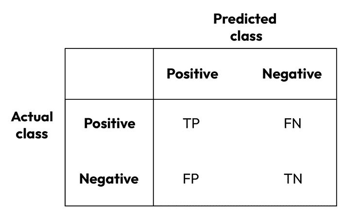
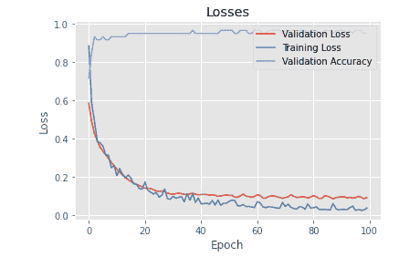

# 第四章：解决分类问题

在前几章中，我们学习了如何设置和运行 MXNet，如何使用 Gluon 和 DataLoader，以及如何可视化回归、分类、图像和文本问题的数据集。我们还讨论了不同的学习方法。在本章中，我们将重点讨论带有分类问题的监督学习。我们将学习为什么这些问题适合深度学习模型，并概览定义这些问题的方程。我们将学习如何为这些问题创建合适的模型并进行训练，重点讲解超参数的选择。每一节结束时，我们都会根据我们的数据评估模型，这是监督学习中的标准做法，并且我们将查看分类问题的不同评估标准。

本章将涵盖以下几个实例：

+   理解分类模型的数学原理

+   定义分类的损失函数和评估指标

+   分类模型的训练

+   评估分类模型

# 技术要求

除了*前言*中指定的技术要求外，还需满足以下技术要求：

+   确保您已完成第一个实例，*安装 MXNet、Gluon、GluonCV 和 GluonNLP*，该实例来自 *第一章*，*使用 MXNet 搭建环境*。

+   确保您已经完成了第二个实例，*分类的玩具数据集——加载、管理和可视化鸢尾花数据集*，该实例来自 *第二章*，*使用 MXNet 和可视化数据集：Gluon 和 DataLoader*。

+   模型、损失和评估函数以及训练的大部分概念已在 *第三章*，*解决回归问题* 中介绍。此外，正如我们将在本章中看到的，分类可以被视为回归的一个特例。因此，强烈建议先完成 *第三章*。

本章的代码可以在以下 GitHub 链接找到：[`github.com/PacktPublishing/Deep-Learning-with-MXNet-Cookbook/tree/main/ch04`](https://github.com/PacktPublishing/Deep-Learning-with-MXNet-Cookbook/tree/main/ch04)。

此外，您可以直接从 Google Colab 访问每个实例；例如，访问本章第一个实例的链接：[`colab.research.google.com/github/PacktPublishing/Deep-Learning-with-MXNet-Cookbook/blob/main/ch04/4_1_Understanding_Maths_for_Classification_Models.ipynb`](https://colab.research.google.com/github/PacktPublishing/Deep-Learning-with-MXNet-Cookbook/blob/main/ch04/4_1_Understanding_Maths_for_Classification_Models.ipynb)。

# 理解分类模型的数学原理

正如我们在上一章中看到的，**分类**问题是**监督学习**问题，其输出是一个类，该类来自一组类（分类分配）——例如，花朵的 *鸢尾花* 类。

正如我们将在本食谱中看到的，分类模型可以看作是回归模型的个别案例。我们将从探索一个二元分类模型开始。这个模型将输出两个类别中的一个。为了简便起见，我们将这两个类别标记为`[0, 1]`。

我们可以用来解决这种二元分类问题的最简单模型是**线性回归**模型。这个模型将输出一个数字；因此，为了修改输出以满足我们新的分类标准，我们将修改激活函数为更合适的函数。

和之前的食谱一样，我们将使用神经网络作为我们的模型，我们将解决在第二个食谱中介绍的鸢尾花数据集预测问题，*分类的玩具数据集：加载、管理和可视化鸢尾花数据集*，见 *第二章*，*使用 MXNet 和可视化数据集：Gluon* *和 DataLoader*。

## 准备工作

我们将在之前食谱中获得的知识基础上进行构建，因此强烈建议阅读它们。此外，正如前一章所提到的，在深入理解我们的模型之前，本食谱中的数学部分将涉及一些矩阵运算和线性代数，但这并不难。

## 如何实现...

在本食谱中，我们将查看以下步骤：

1.  定义一个二元分类模型

1.  定义一个多标签分类模型

1.  定义特征

1.  初始化模型

1.  评估模型

### 定义一个二元分类模型

这是我们在之前的食谱中介绍的感知机模型：


图 4.1 – 感知机

这个模型可以数学地描述为 *y = f(WX + b)*，其中 `W` 是权重向量 *[W`1`, W`2`, …. W`n`]*，（`n` 是特征的数量），`X` 是特征向量 *[X`1`, X`2`, …. X`n`]*，`b` 是偏置项，*f()* 是激活函数。

在回归使用案例中，我们选择了恒等函数作为激活函数，这提供了一个等于输入的输出；因此，我们有了 *y = WX +* `b`。

对于我们的二元分类使用案例，我们希望有一个输出，帮助我们将输入数据点分类为两个类别（`0`和`1`）。在 1958 年原始的感知机论文中，Rosenblatt 研究了一个二元分类问题，选择了阶跃函数，该函数只提供 0 和 1 作为其唯一可能的输出。

如果我们回顾一下 *第三章*，*解决回归问题*，在第三个食谱中，*回归的损失函数和评估指标*，我们对这些函数施加了一些属性。第四个属性，可微性，是由于梯度下降所需的计算。这一属性同样适用于激活函数，而 Rosenblatt 使用的阶跃函数并不符合这一要求。

此外，如果我们能够找到一个在 0 到 1 之间连续的函数，我们就可以将这个数值评估为输出为`1`的概率或置信度，这是由模型评估得出的。这个方法具有一些优势，我们将在后面的配方中进行探索。

因此，由于阶跃函数不满足我们的特性，我们需要一个新的激活函数。最常用的二分类模型输出激活函数是**sigmoid**函数：


图 4.2 – Sigmoid 激活函数

Sigmoid 函数符合所有必需的属性，且输出会迅速变为`0`或`1`，这使得我们能够识别模型建议的输出类别。

### 定义多标签分类模型

当我们有多个（我们称这个数字为`k`）类别，而不是像我们刚才看到的那样只有两个类别进行分类时，会发生什么呢？在这种情况下，我们需要为我们的模型设计一个不同的网络架构。一方面，单个输出将不再足够，因为我们需要`k`个不同的输出。另一方面，尽管我们可以为每个输出使用 sigmoid 函数作为激活函数，但如果每个输出都能被评估为每个类别的概率，那就非常有用，就像我们在二分类情况下看到的那样。使用 sigmoid 函数不会强制满足概率条件，即所有概率之和必须为 1（这意味着每个输入必须对应于其中一个类别）。

在这种情况下，一个与 sigmoid 函数非常相似的函数，能够满足所描述的条件，是 softmax 函数：

σ(x j) =  ⅇ x j _ Σ i ⅇ x i

将要选择的类别是输出最大值的类别：


图 4.3 – 多标签分类网络

我们的感知机的完整定义是*Y = f(WX + B)*，其中`W`现在是一个权重矩阵（形状为`n` x `k`：`n`是特征的数量，`k`是输出的数量），`X`是特征向量（`n`个分量），`B`是偏置向量（`k`个分量），而*f()*是 softmax 激活函数。`Y`现在是一个`k`个输出的向量，其中最大值所在的类别将被分配给该输入。

### 定义特征

到目前为止，我们已经理论上定义了我们的模型及其行为；我们没有使用问题框架或数据集来定义它。在本节中，我们将开始以更实际的方式进行工作。

定义我们模型的下一步是决定我们要使用哪些特征（输入）。我们将继续使用第二个配方中已知的 Iris 数据集，*分类的玩具数据集：加载、管理和可视化房屋销售数据集*，*第二章*，*与 MXNet 一起工作并可视化数据集：Gluon 和 DataLoader*。该数据集包含 150 朵花的数据，包括类别和 4 个输入特征：

+   萼片长度（单位：厘米）

+   萼片宽度（单位：厘米）

+   花瓣长度（单位：厘米）

+   花瓣宽度（单位：厘米）

如果我们展示前五朵花，我们将看到以下内容：


图 4.4 – 花卉特征（鸢尾花数据集）

此外，对于鸢尾花数据集，我们有不同的输出类别：

+   `Setosa (0)`

+   `Versicolor (1)`

+   `Virginica (2)`

### 初始化模型

现在我们已经定义了输入维度（特征数量）和输出维度，我们可以使用随机初始化来初始化我们的模型：

```py
Weights:
[[-1.2347414  -1.771029   -0.45138445]
 [ 0.57938355 -1.856082   -1.9768796 ]
 [-0.20801921  0.2444218  -0.03716067]
 [-0.48774993 -0.02261727  0.57461417]]
 <NDArray 4x3 @cpu(0)>
 Bias:
 [1.4661262  0.6862904  0.35496104]
 <NDArray 3 @cpu(0)>
```

如果我们将这些值与在第一章配方中获得的值进行比较，*理解回归模型的数学*，来自*第三章*，*解决回归问题*，我们可以看到，随着输出的不再只有一个（如回归模型中的情况），权重现在被表示为矩阵，偏差是一个向量而不是一个数字，原因是相同的。

### 评估模型

现在我们的模型已经初始化，我们可以用它来估计第一朵花的类别。从*图 3.24*中可以看出它是*Setosa*（`0`）。以下是使用我们当前模型的结果：

```py
0
```

干得漂亮！不幸的是，这完全是偶然的，因为模型是随机初始化的。

在下一个配方中，我们将学习如何正确评估我们的分类模型。

## 它是如何工作的…

像回归一样，分类模型可以根据需要具有任意多的层（深度），堆叠多个层，直到问题的解决方案所需。

在本配方中，我们描述了从第一章配方中所述的感知器的修改，*理解回归模型的数学*，来自*第三章*，*解决回归问题*。主要有两项修改。第一项是，由于在这种情况下我们希望将每个输入分类到一组类别中，我们需要每个类别一个输出。此外，为了能够理解我们模型的输出为概率，我们需要一个新的激活函数：softmax。

最后，我们学习了如何初始化我们的模型、初始化对权重和偏差的影响，以及如何使用数据进行评估。我们将在后续的配方中进一步展开这些话题。

## 还有更多…

在本配方的开始，我们回顾了从 Rosenblatt（阶跃函数）到回归（线性）再到分类（sigmoid）的激活函数变化。我们讨论的一个细节是阶跃函数的不可微性。更深入的分析可以通过以下链接查看：[`en.wikibooks.org/wiki/Signals_and_Systems/Engineering_Functions#Derivative`](https://en.wikibooks.org/wiki/Signals_and_Systems/Engineering_Functions#Derivative)

使用多层架构和/或 sigmoid（或其他激活函数）使得神经网络具备近似任何函数的能力，这被称为**普适逼近定理**。更多细节可以在这里找到：[`en.wikipedia.org/wiki/Universal_approximation_theorem`](https://en.wikipedia.org/wiki/Universal_approximation_theorem)

# 定义分类的损失函数和评估指标

在前面的配方中，我们定义了输入特征，描述了我们的模型并进行了初始化。那时，我们传递了一朵花的特征向量来预测它的鸢尾花种类，计算了输出并与预期类别进行了比较。

我们还展示了如何这些初步结果并不能代表一个合适的评估。在本配方中，我们将探讨评估分类模型的话题。

此外，我们还将理解哪些损失函数最适合二元和多标签分类问题。

## 准备开始

损失函数和评估函数需要满足在*第三章*中描述的相同属性，*解决回归问题*，在第二个配方中，*定义回归的损失函数和评估指标*；因此，我建议首先阅读该章节，以便更全面地理解。

我们将从分析二元分类方法（两个输出类别）开始，随后推广到多标签分类方法。

## 如何操作...

让我们讨论一些评估和损失函数，并分析它们的优缺点。我们将描述的函数如下：

+   交叉熵损失函数

+   评估 – 混淆矩阵

+   评估 – 指标

### 交叉熵损失函数

正如我们在前面的配方中讨论的，一旦模型为每个类别输出了*概率*，我们希望选择具有最大概率的类别作为我们模型的输出。

在优化模型参数时，我们的目标是找出哪些模型参数为我们期望的类别提供最大的概率（`1`），并为其他类别提供最小的概率（`0`）。该方程的推导超出了本书的范围，但你可以在配方末尾的*更多信息...*部分找到更多内容。

对于两个输出类别的情况，我们有二元交叉熵损失（对于`N`个样本）：

BCE = −  1 _ N  ∑ i=0 N y i . log( ˆ y  i) + (1 − y i) . log(1 −  ˆ y  i)

我们可以为一个样本绘制该函数，并假设预期输出为*1 (yi =* *1)*：


图 4.5 – 二元交叉熵损失图 (yi = 1)

对于多标签的常见情况，`M`个类别的多标签或类别交叉熵损失为以下形式：

L (y, ŷ) = − ∑ j=0 M ∑ i=0  M ( y ij * log ( ŷ ij))

该方程在比较每一对类别时，得到与*图 4.5*相同的图形。

我们将在下一节的训练循环中，将此功能与优化器结合使用。

### 评估 – 混淆矩阵

混淆矩阵帮助我们衡量模型的表现，通过将预期值（真实值）与模型实际提供的值进行比较。对于二分类问题（我们将类别定义为`Positive`和`Negative`），我们有以下公式：



图 4.6 – 二分类混淆矩阵

在*图 4.6*中，对于每种预测类别和实际类别的组合，我们有以下术语（仅在二分类中有效）：

+   **TP**: 真阳性。

+   **FP**: 假阳性。也称为*一型* *错误*。

+   **FN**: 假阴性。也称为*二型* *错误*。

+   **TN**: 真阴性。

理想情况下，我们希望 TP 和 TN 尽可能接近 100%，而 FP 和 FN 尽可能接近 0%。

当我们面临多标签分类问题时，在混淆矩阵中，每个类别都会对应一行一列。对于`K`个类别，我们将得到一个*KxK*的矩阵，在矩阵的主对角线上，我们期望看到 100%的概率，其他位置的值为 0%。例如，使用我们的鸢尾花数据集（三个输出类别），我们可以计算一个模型的混淆矩阵（*3x3*），该模型是随机初始化的，类似于我们在前一个示例中计算的矩阵。在这种情况下，我们得到以下结果：


图 4.7 – 多标签混淆矩阵

正如预期的那样，结果显示得非常糟糕。特别是，没有一朵变色鸢尾花被正确分类；然而，这个例子帮助我们可视化了一个多标签混淆矩阵。

### 评估 – 准确率、精确率、召回率、特异性和 F1 分数指标

为了描述一个模型在给定二分类问题上的表现，有几个有趣的指标：

精确率 =  TP / (TP + FP)

召回率 =  TP / (TP + FN)

F1 =  2 × 精确率 × 召回率  / (精确率 + 召回率)

准确率 =  (TP + TN) / (TP + FN + TN + FP)

特异性 =  TN / (TN + FP)

每个指标的目的是帮助我们理解模型的表现：

+   **准确率**: 在所有值中，哪些是被正确分类的（对于两个类别）？

+   **精确率**: 这是正确分类的正预测的比率。然而，它不提供关于负预测的任何信息。

+   **召回率**: 这是正确分类的正标签的比率。此数字不包括有关负标签的信息。

+   **特异性**: 类似于召回率，但针对负标签。这是模型正确分类的负标签的比率。此指标不包括任何有关正标签的信息。此指标很少使用。

+   **F1 得分**：这是精确率和召回率的调和平均数。通过结合这两个指标，这个指标提供了一个更好的模型评估，考虑了正类和负类。要获得高 F1 得分，模型需要具备高精确率和高召回率。低 F1 得分则意味着精确率、召回率或两者都很低。

这些指标可以用于多标签场景。例如，对于我们的随机初始化模型和鸢尾花数据集，计算出的结果如下（除了特异度，它在**scikit-learn**中没有对应的指标函数）：

```py
Accuracy  : 0.5933333333333334
Precision : 0.4765151515151515
Recall    : 0.5933333333333334
F1-score  : 0.49722222222222223
```

这些值非常接近平均结果，这是由于随机初始化模型所预期的表现。

### 评估 – 曲线下面积（AUC）

对于二元分类问题，我们想要提供的输出是一个类别（`Positive`或`Negative`）；然而，模型的输出是一个数字（表示正类结果的概率）。为了将这个结果转化为类别，我们需要应用一个阈值。

例如，如果我们将阈值定义为`0.5`，那么所有大于 0.5 的概率都会被归类为`Positive`。通过降低阈值，更多的值会被认为是正类，从而增加真正例（**True Positive Rate**，或**TPR**）和假正例（**False Positive Rate**，或**FPR**）的数量。如果增加阈值，效果则相反：较少的值会被视为正类，因此 TPR 和 FPR 都较小。

当我们调整阈值的值时，TPR 和 FPR 的值会有所不同。如果我们将这些值绘制在图表中，会得到如下结果：


图 4.8 – AUC

如果我们计算曲线与`X`轴、*Y = 0*轴和*Y = 1*轴之间所覆盖的区域，我们可以得到一个不依赖于阈值的参数，它定义了模型在给定数据上的表现。

TPR 和 FPR 仅适用于二元分类情况。对于多标签分类情况，我们可以模拟二元分类的情况。有两种可能的方法：

+   一对一

+   一对多

如果你感兴趣，可以在本教程的*还有更多...*部分找到更多信息。这些曲线也被称为**接收者操作特征**曲线。

## 它是如何工作的...

在理解了回归模型和分类模型之间的差异后，包括激活函数的不同，本教程着重讲解了损失函数（用于训练）和评估指标（用于评估）。我们探讨了二元分类和多标签分类两种情况。

我们计算了分类的最常见损失函数——二元/分类交叉熵损失函数，并定义了多个评估指标，如准确率、精确率、召回率和 F1 得分。此外，我们了解了混淆矩阵，它是一种方便查看模型每类表现的方式。

我们通过查看 AUC 结束了这个食谱，它提供了一个与阈值无关的可视化。

## 更多内容...

交叉熵损失的数学公式没有推导出来。在这些链接中，你可以找到更多信息：

+   二元交叉熵损失：[`mxnet.apache.org/versions/1.7/api/python/docs/tutorials/packages/gluon/loss/loss.html#Cross-Entropy-Loss-with-Sigmoid`](https://mxnet.apache.org/versions/1.7/api/python/docs/tutorials/packages/gluon/loss/loss.html#Cross)

+   分类交叉熵损失：[`mxnet.apache.org/versions/1.7/api/python/docs/tutorials/packages/gluon/loss/loss.html#Cross-Entropy-Loss-with-Softmax`](https://mxnet.apache.org/versions/1.7/api/python/docs/tutorials/packages/gluon/loss/loss.html#Cross-Entropy-Loss-with-Softmax)

为了更好地理解如何计算多标签分类指标，我推荐以下链接：[`towardsdatascience.com/multi-class-metrics-made-simple-part-i-precision-and-recall-9250280bddc2`](https://towardsdatascience.com/multi-class-metrics-made-simple-part-i-precision-and-recall-9250280bddc2)。

最后，阅读这个 AUC 的解释可以提供更多的见解：[`developers.google.com/machine-learning/crash-course/classification/roc-and-auc`](https://developers.google.com/machine-learning/crash-course/classification/roc-and-auc)。

对于多标签情况，这些示例有助于理解一对一/一对多方法：[`scikit-learn.org/stable/auto_examples/model_selection/plot_roc.html`](https://scikit-learn.org/stable/auto_examples/model_selection/plot_roc.html)。

# 分类模型的训练

在这个食谱中，我们将探讨训练一个模型解决分类问题的基本概念。我们将把这些概念应用到优化我们在本章之前定义的分类模型，结合我们讨论过的损失函数和评估指标的使用。

我们将使用第二个食谱中看到的数据集 *分类用玩具数据集 - 加载、管理和可视化鸢尾花数据集* 来预测鸢尾花的类别，该食谱位于 *第二章* 中，*与 MXNet 协作和数据集可视化：Gluon* 和 DataLoader。

## 准备工作

在这个食谱中，我们将遵循与 *第三章* 中 *解决回归问题* 类似的模式，即第三个食谱 *回归模型训练*，因此，重新审视损失函数、优化器、数据集划分、训练轮次和批量大小的概念将非常有趣。

## 如何操作...

在这个食谱中，我们将创建自己的训练循环，并评估每个超参数如何影响训练。为此，我们将按照以下步骤进行：

1.  改进模型。

1.  定义损失函数和优化器。

1.  分割我们的数据集并分析公平性和多样性。

1.  将所有内容整合在一起，形成训练循环。

### 改进模型

为了解决这个问题，考虑到数据集包含的有限数据量（150 个样本），我们将定义一个**多层感知机**（**MLP**）网络架构，正如我们在 *第三章* *解决回归问题* 中第三个食谱 *回归模型的训练* 中所看到的那样。该网络将有 2 个隐藏层，每个隐藏层包含 10 个神经元，使用全连接（密集）结构和 **ReLU** 激活函数，并且输出层有相应的 3 个输出（每个类一个）。最后一层没有激活函数，尽管本应使用 softmax。在下一节中，我们将理解为何如此。对于这个网络，所需的代码如下：

```py
def create_classification_network(num_outputs = 3):
    # MLP with Gluon
    net = mx.gluon.nn.Sequential()
    net.add(mx.gluon.nn.Dense(10, activation="relu"))
    net.add(mx.gluon.nn.Dense(10, activation="relu"))
    net.add(mx.gluon.nn.Dense(num_outputs))
    # Note that the latest layer does not have an activation
    # function whereas Softmax was expected.
    # This is due to an optimization during training:
    # the loss function includes the softmax computation. return net
```

我们还对输入特征进行了缩放。模型的参数数量如下：

```py
Parameters in forward computation graph, duplicate included
   Total params: 193
   Trainable params: 193
   Non-trainable params: 0
Shared params in forward computation graph: 0
Unique parameters in model: 193
```

可训练参数的数量约为 200。对于我们的（小型）数据集，每一行有 4 个特征，共 150 行；因此，我们的数据集大约是模型参数数量的 3 倍。通常，这是成功模型的最小要求，理想情况下，我们希望数据集的大小是模型参数数量的 10 倍左右。

重要提示

虽然可用数据点与模型参数数量之间的比较非常有用，但不同的架构在数据方面有不同的要求。像往常一样，实验（试错法）是找到正确平衡的关键。

### 定义损失函数和优化器

正如前一个食谱中所讨论的，我们将计算 **类别交叉熵**（**CCE**）损失函数。然而，在使用 softmax 激活函数计算 CCE 损失时，有一个优化细节；因此，在训练过程中，softmax 函数的计算包含在损失函数中。对于**推理**，我们需要在外部添加它。类似于我们在回归问题中所做的，我们将重点分析 **随机梯度下降**（**SGD**）和 Adam 优化器。

### 数据集划分

Iris 数据集的最大缺点之一是其大小；只有 150 个样本，它是一个较小的数据集。因此，我们将采用 50/40/10 的划分比例来分配训练集、验证集和测试集。

如果我们分析数据划分以验证公平性和多样性，得到如下结果：


图 4.9 – 训练集（左）、验证集（中）、测试集（右）分布

我们可以看到，每个类别在所有特征中都有良好的代表性，唯一的原因是样本量小导致的差异。

### 将所有内容整合成一个训练循环

分类问题的训练循环与回归问题非常相似，我们将进行与本章早些时候相似的分析：我们将比较每个超参数，保持其他参数不变（除非另有说明）。

#### 优化器和学习率

如前所述，训练循环中选择的优化器与学习率是相关的，因为对于某些优化器（如 SGD），学习率保持不变，而对于其他优化器（如 Adam），它从一个起始点开始变化。

提示

最好的优化器依赖于多个因素，没有什么比尝试和错误更重要；我强烈建议尝试几个，看看哪个最合适。根据我的经验，通常来说，SGD 和 Adam 是最有效的，包括在这个问题中。

让我们分析当我们改变 SGD 优化器的**学习率**（**LR**）时，如何观察训练损失和验证损失的变化，同时保持其他参数不变：epoch 数量 = 100，批量大小 = 64，损失函数 = softmax 交叉熵：


图 4.10 – 使用不同 LR 值的 SGD 优化器损失

从*图 4.10*，我们可以得出结论，对于 SGD 优化器，LR 值在 1.0 到 3.0 之间最为理想。此外，我们可以看到，对于 LR 值非常大的情况（> 2.0），算法仍然收敛，而对于回归问题，SGD 和非常大的 LR 值则导致模型发散。

让我们分析当我们改变 Adam 优化器的学习率（LR）时，如何观察训练损失和验证损失的变化，同时保持其他参数不变：epoch 数量 = 100，批量大小 = 64，损失函数 = softmax 交叉熵：


图 4.11 – 使用不同 LR 值的 Adam 优化器损失

从*图 4.11*，我们可以得出结论，对于 Adam 优化器，LR 值在 10-2 和 10-1 之间最为理想。

尽管在这种情况下，SGD 优化器以 LR = 3.0 得到最佳结果（最小损失），但优化过程的演变要比 Adam 更加嘈杂，这可能是由于数据量有限（批量大小对这一点没有影响）。平滑的优化过程也表明了模型的泛化能力；因此，在接下来的测试中，我们将选择 Adam 作为优化器。

#### 批量大小

让我们分析当我们改变 Adam 优化器的批量大小时，如何观察训练损失和验证损失的变化，同时保持其他参数不变：epoch 数量 = 100，LR = 10-2，损失函数 = softmax 交叉熵：


图 4.12 – 通过改变批量大小来观察 Adam 优化器的损失

从*图 4.12*，我们可以得出结论，对于 Adam 优化器，批量大小在 32 到 64 之间提供了最佳结果。

#### Epoch 数量

让我们分析当我们改变 Adam 优化器的训练损失和验证损失时，如何通过改变 epoch 的数量来观察其变化，同时保持其他参数不变：学习率（LR）= 10-2，批量大小（batch size）= 32，损失函数（loss function）= softmax 交叉熵（cross-entropy）：


图 4.13 – 通过改变 epoch 数量来观察 Adam 优化器的损失

从*图 4.13*中，我们可以得出结论，200 到 300 个周期适合我们的任务。使用这些值，很可能会在更短的时间内获得最佳结果。

## 它是如何工作的...

在解决分类问题的过程中，在本食谱中，我们学习了如何最优地更新模型的超参数。我们重新审视了每个超参数在训练循环中的作用，并对每个超参数进行了消融实验。这帮助我们了解了在单独修改每个超参数时，训练和验证损失是如何变化的。

对于我们当前的问题和选择的模型，我们验证了最佳超参数集如下：

+   优化器：Adam

+   学习率：10^-2

+   批量大小：32

+   训练轮数：300

在训练循环结束时，这些超参数给出了`0.01`的训练损失和`0.1`的验证损失。

## 还有更多...

在这个食谱中，我们主要结合了在前面几个食谱和章节中学习到的概念。

我们也已经讨论了在模型定义中，我们并没有显式使用 softmax 激活函数。这是由于交叉熵损失函数和 softmax 激活函数在训练过程中是如何共同作用的（它们的联合导数）。要理解这一点的一个好参考是：

[`peterroelants.github.io/posts/cross-entropy-softmax/`](https://peterroelants.github.io/posts/cross-entropy-softmax/)

# 评估分类模型

在前一个食谱中，我们学习了如何选择训练超参数以优化训练。我们还验证了这些选择如何影响训练和验证损失。在这个食谱中，我们将探索这些选择如何影响我们在现实世界中的实际评估。你可能已经注意到，我们将数据集分成了三部分：训练集、验证集和测试集。然而，在训练过程中，我们只使用了训练集和验证集。在这个食谱中，我们将通过使用我们模型中未见过的数据——测试集，来模拟现实世界的行为。

## 准备就绪

在评估模型时，我们可以执行定性评估和定量评估。

**定性评估**是选择一个或多个随机（或不那么随机，取决于我们在寻找什么）样本，并分析结果，验证其是否符合我们的预期。

在这个食谱中，我们将计算在第二个食谱中定义的评估指标，*定义分类模型的损失函数和评估指标*，并在本章中进行计算。

此外，我们将探讨训练如何对评估产生重大影响。

## 如何执行...

在开始模型评估之前，我们将讨论如何衡量模型训练的性能。因此，本食谱的步骤如下：

1.  测量训练性能——损失和准确率

1.  定性评估

1.  定量评估

### 测量训练性能——损失和准确率

正如我们在回归中看到的，防止过拟合的一个好方法是提前停止。当我们在前一个食谱中训练分类模型时，我们存储了训练损失、验证损失和验证准确率。让我们看看随着训练进展，训练损失、验证损失和验证准确率是如何变化的：



图 4.14 – 损失与准确率与 epoch 的关系（Adam）

如我们在*图 4.14*中所见，约在第 50 个 epoch 时，验证损失开始增加，尽管训练损失持续下降。此外，验证准确率似乎也在该 epoch 附近趋于平稳（接近 1.0/100%）。我们保存了最佳准确率的模型，这些值是在本章第三个食谱《分类模型的训练》中报告的训练过程中使用的值。

重要提示

提醒一下，如果你想像原样使用提前停止，MXNet 提供了一个回调：[`mxnet.apache.org/versions/1.6/api/r/docs/api/mx.callback.early.stop.html`](https://mxnet.apache.org/versions/1.6/api/r/docs/api/mx.callback.early.stop.html)。

需要提到的一个重要事项是，在前一个食谱中，我们提到过 SGD 并没有提供非常平稳的训练。如果我们绘制这些值，得到的结果如下：


图 4.15 – 损失与 epoch 的关系（SGD）

如我们所见，训练过程并不稳定。

### 定性评估

为了验证我们的模型是否与预期相似（在预测花卉的鸢尾花种类时能够获得高准确率），一种简单的定性方法是对测试集中的随机输入（未见过的数据）运行我们的模型。在我们的案例中，结果如下：

```py
Expected Output: 0
Model Output: [[9.999949e-01 4.748235e-06 4.116847e-07]]
 Class Output: 0
Accuracy    : 1.0
```

对于这个例子来说，因为它只是一个随机输入，准确率可以是 100% 或 0%（准确或不准确），而我们得到了正确的类别。

重要提示

尽管我尽力让代码尽可能可重复（包括为所有随机过程设置种子），但仍可能存在一些随机性来源。这意味着你的结果可能会有所不同，但通常误差的数量级会相似。

### 定量评估 – 混淆矩阵

对于存储的结果，得到的混淆矩阵如下：


图 4.16 – 混淆矩阵

这些结果非常优秀，因为主对角线上的值除了零以外都是不同的。这意味着我们的模型在测试集上取得了完美的结果。

### 定量评估 – 准确率、精确率、召回率和 F1 分数

在之前的食谱中，我们定义了这些指标并使用它们来优化训练。这些评估是对训练集和验证集进行的。对于测试集，我们获得了以下值：

+   准确率：1.0

+   精确率：1.0

+   召回率：1.0

+   F1 分数：1.0

## 工作原理...

在这个教程中，我们探索了如何评估我们的分类模型。为了正确做到这一点，我们重新审视了将完整数据集分割成训练集、验证集和测试集的决策。

在训练过程中，我们使用训练集计算梯度来更新模型参数，并使用验证集来确认模型在真实世界中的表现。之后，为了评估我们的模型性能，我们使用了测试集，它是唯一剩下的未见数据集。

我们发现，通过计算随机样本的输出来定性描述模型行为，以及通过探索包括混淆矩阵、准确率、精确度、召回率和 F1 分数等多个数字和图表来定量描述模型性能的价值。

## 还有更多……

在这个教程中，我们计算了平衡分类数据集最重要的评估指标。然而，当数据集不平衡时，我们需要小心。这是我喜欢的一篇关于这个话题的教程：

[`machinelearningmastery.com/probability-metrics-for-imbalanced-classification/`](https://machinelearningmastery.com/probability-metrics-for-imbalanced-classification/)。

到此为止，我们已经完成了一个完整的分类问题的流程：我们探索了分类数据集，决定了评估指标，定义并初始化了模型。我们理解了优化器、学习率、批量大小和训练周期的最佳超参数组合，并使用早停法进行了训练。最后，我们从定性和定量两个方面对模型进行了评估。
