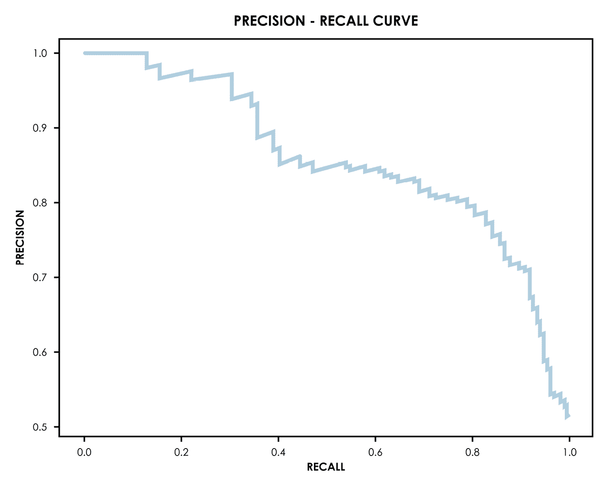
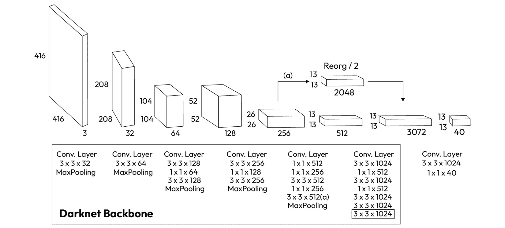
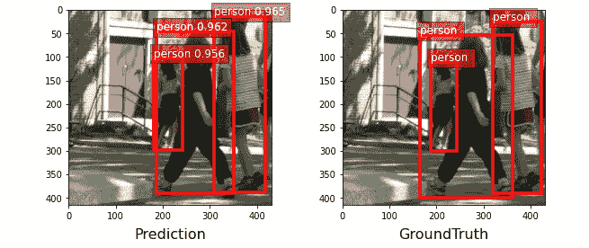

# 第五章：使用计算机视觉分析图像

计算机视觉是深度学习取得巨大进展的领域之一，在多个任务中超过了人类水平的表现，例如图像分类和物体识别。此外，计算机视觉已从学术领域走向现实世界的应用，行业也开始认识到其从业者对企业的高价值贡献。

在本章中，我们将学习如何使用 GluonCV，这是一个专门用于计算机视觉的 MXNet Gluon 库，如何构建我们自己的网络，并如何使用 GluonCV 的模型库来使用预训练模型进行多个应用。

具体来说，我们将讨论以下主题：

+   了解卷积神经网络

+   使用 AlexNet 和 ResNet 对图像进行分类

+   使用 Faster R-CNN 和 YOLO 检测物体

+   使用 PSPNet 和 DeepLab-v3 对图像中的物体进行分割

# 技术要求

除了在*前言*中指定的技术要求外，本章还适用以下技术要求：

+   请确保您已完成*安装 MXNet、Gluon、GluonCV 和 GluonNLP*，这是*第一章*中的第一个食谱，*使用 MXNet 快速上手*

+   请确保您已完成*回归的玩具数据集 - 加载、管理和可视化房屋销售数据集*，这是*第二章*中的第一个食谱，*使用 MXNet 并可视化数据集：Gluon*和*DataLoader*

本章的代码可以在以下 GitHub 网址找到：[`github.com/PacktPublishing/Deep-Learning-with-MXNet-Cookbook/tree/main/ch05`](https://github.com/PacktPublishing/Deep-Learning-with-MXNet-Cookbook/tree/main/ch05)。

此外，您还可以直接从 Google Colab 访问每个食谱——例如，本章的第一个食谱：[`colab.research.google.com/github/PacktPublishing/Deep-Learning-with-MXNet-Cookbook/blob/main/ch05/5_1_Understanding_Convolutional_Neural_Networks.ipynb`](https://colab.research.google.com/github/PacktPublishing/Deep-Learning-with-MXNet-Cookbook/blob/main/ch05/5_1_Understanding_Convolutional_Neural_Networks.ipynb)。

# 了解卷积神经网络

在前几章中，我们使用了**全连接**的**多层感知器**（**MLP**）网络来解决回归和分类问题。然而，正如我们将看到的，这些网络并不是解决图像相关问题的最优选择。

图像是高维实体——例如，彩色图像中的每个像素有三个特征（红色、绿色和蓝色值），而一张 1,024x1,024 的图像有超过 100 万个像素（即 1 百万像素图像），因此具有超过 300 万个特征（3 * 10⁶）。如果我们将这些输入层的所有点连接到第二层 100 个神经元的*全连接*网络中，我们将需要超过 10⁸ 个参数，而这仅仅是第一层的需求。因此，处理图像是一个时间密集型操作。

此外，假设我们正在尝试在人脸中检测眼睛；如果一个像素属于眼睛，那么附近的像素属于眼睛的可能性非常高（例如，考虑构成虹膜的像素）。当我们将所有像素直接输入到网络中时，所有与像素位置相关的信息都丢失了。

一种名为**卷积神经网络**（**CNN**）的架构被开发出来以解决这些问题，我们将在本教程中分析 CNN 的最重要特性，并了解如何在图像相关问题中实现它们。

## 准备工作

与前几章一样，在这个教程中，我们将使用一些矩阵运算和线性代数，但不会太难。

## 如何实现...

在本教程中，我们将执行以下步骤：

1.  引入卷积层方程。

1.  理解卷积参数和感受野。

1.  使用 MXNet 运行卷积层示例。

1.  引入池化层方程。

1.  使用 MXNet 运行池化层示例。

1.  总结卷积神经网络（CNN）。

### 引入卷积层方程

本教程介绍的定位问题在正式术语中称为**平移不变性**和**局部性**。在卷积神经网络（CNN）中，这些问题通过在所谓的卷积层中使用卷积/互相关操作来解决。

在卷积操作中，我们有一个输入图像（或**特征图** – 请参见下面与卷积层方程相关的*重要说明*），它与**卷积核**结合，卷积核是该层的可学习参数。查看这个操作如何工作的最简单方式是通过一个示例——如果我们有一个 3x3 的输入，想将其与一个 2x2 的卷积核结合，那么它看起来就像一个滑动窗口，如下图所示：


图 5.1 – 卷积层

如*图 5.1*所示，为了计算输出的一个像素，我们可以直观地将卷积核放置在输入图像上，进行乘法计算，然后将这些值加起来得到最终结果。这有助于网络从图像中学习特征。

此外，这个操作的计算量比*全连接*层要小，解决了我们所识别的计算问题。

重要说明

当卷积层作为第一步使用时（在 CNN 中通常如此），输入是完整的图像。此外，输出可以理解为具有某些特性的低维度图像，这些特性由卷积核给出。随着卷积核学习突出图像的某些特征，这些输出被称为*特征图*。在靠近输入的层中，这些特征图的每个像素都是图像中少量像素的组合（例如，水平或垂直线条）。随着数据通过卷积层流动，这些特征图代表更高层次的抽象（例如，脸上的眼睛）。

### 理解卷积参数和感受野

在*图 5.1*中展示的例子非常简单，仅用于说明；输入大小是 6x6，卷积核大小是 3x3。这些大小是可变的，取决于网络架构。然而，有三个参数对于计算输出大小非常重要；它们是填充、步幅和膨胀。

填充是指添加到输入中的零值像素（行/列）的数量。填充越大，输出越大，实际上这会增加输入的大小。在这个例子中，填充是 `1`（表示为 *p*）。

如前所述，我们可以直观地将卷积核放置在输入上，计算乘积，然后将所有这些结果相加，得到最终的值。对于下一个值，我们需要将卷积核移到不同的位置，如下图所示。


图 5.2 – 步幅参数

卷积核移动的步长由步幅定义。在*图 5.2*中，我们可以看到步幅为 2 的例子，每个 3x3 的卷积核之间相隔 2 个值。

膨胀定义了在与卷积核进行卷积时，每个输入值之间的间隔。


图 5.3 – 膨胀参数

正如我们在*图 5.3*中看到的，不同的膨胀参数组合了输入的元素。

这些参数定义了所谓的**感受野**，即输入区域的大小，该区域生成激活。它是一个重要的参数，因为只有出现在我们模型感受野中的特征才能在输出中得到表示。

在*图 5.1*中的例子中，一个 6x6 的输入，结合 3x3 的卷积核，步幅为 2，填充为 1，膨胀为 1，得到一个 3x3 的输出，并且其感受野覆盖了整个输入（输入中的所有像素至少使用一次）。

这些参数的另一个非常有趣的性质是，给定正确的组合，您可以获得与输入相同大小的输出。给出输出维度的公式如下（该公式分别应用于高度和宽度）：

o = [i + 2 * p − k − (k − 1)*(d − 1)] / s + 1

在前面的公式中，*o* 是输出维度（如果处理 2D 图像，则为高度或宽度），*i* 是输入维度（高度/宽度），*p* 是填充，*k* 是卷积核大小，*d* 是膨胀，*s* 是步幅。有多种组合可以使输入和输出的大小相同，其中之一是 *p = 1, k = 3, d = 1, s = 1*。

### 运行 MXNet 的卷积层示例

我们可以使用 MXNet 的功能实现以下示例（注意填充为 0，步幅为 1，膨胀为 1）：


图 5.4 – 卷积示例

如果我们想要按照*图 5.4*中所示的示例，将卷积操作应用于一个 3x3 的矩阵，并使用一个 2x2 的卷积核，我们可以使用以下代码：

```py
X = mx.np.array([[0.0, 1.0, 2.0], [3.0, 4.0, 5.0], [6.0, 7.0, 8.0]])
 K = mx.np.array([[0.0, 1.0], [2.0, 3.0]]) convolution(X, K)
```

这些操作的结果如下：

```py
array([[19., 25.],
       [37., 43.]])
```

这是定义的卷积步长的预期结果（考虑给定的填充、步幅和扩张参数）。

### 引入池化层方程

如前所述，当处理图像时，神经网络模型的一个理想特性是，随着我们遍历网络，我们可以处理更高层次的特征，或者等效地说，深层特征图中的每个像素都具有来自输入的更大感受野。

这些层执行的操作类似于卷积层，从某种意义上来说，我们采用具有恒定维度的卷积核并应用滑动窗口。然而，在这种情况下，卷积核的参数是恒定的，因此在训练网络时不会被学习。这个卷积核被视为一种操作（一个函数），通常是最大值函数（**最大池化层**）或平均值函数（**平均池化层**）。


图 5.5 – 最大池化层

此外，通过组合邻近的像素，我们还实现了局部不变性，这是处理图像时的另一个理想特性。

### 使用 MXNet 运行池化层示例

我们可以使用 MXNet 的功能实现*图 5.5*中显示的示例，如下所示：

```py
X = mx.np.array([[0.0, 1.0, 2.0], [3.0, 4.0, 5.0], [6.0, 7.0, 8.0]])
 maxpool(X, (2, 2))
```

这些操作的结果如下：

```py
array([[4., 5.],
       [7., 8.]])
```

这是定义的 2x2 最大池化步长的预期结果。

### 总结 CNN

因此，一个典型的 CNN 用于**图像分类**，它有两个不同的部分：

+   **特征提取**：这也被称为网络的骨干。它是由本教程中看到的卷积层和池化层的组合构建的。每一层的输入是特征图（输入层中的图像及其所有通道），输出是减少维度但具有更多通道的特征图。层通常是堆叠的—一个卷积层，一个激活函数（通常是**修正线性单元**（**ReLU**）），和一个最大池化层。

+   `softmax`函数作为激活函数。分类器中的层数取决于具体问题。

因此，一个 CNN 架构可以是以下形式：


图 5.6 – CNN 架构

在*图 5.6*中，我们可以看到一个用于*图像分类*的 CNN 架构，包含两个特征提取阶段，每个阶段结合了一个卷积层（具有 ReLU 激活函数）和一个最大池化层。然后，分类器将剩余的特征图展平为一个向量，并通过一个*全连接*层，最终通过*softmax*激活函数提供输出。

## 它是如何工作的…

在这篇文章中，我们介绍了 CNNs。这种架构自 2000 年代初期开始发展，并推动了**计算机视觉**应用的革命，使得**深度学习**成为大多数数据驱动任务中的焦点，包括**自然语言处理**、**语音识别**、**图像生成**等，并在所有领域达到了最先进的水平。

我们已经了解了 CNNs 的内部工作原理，探索了*特征图*、*感受野*以及这些架构主要层（*卷积*层和*最大池化*层）背后的数学概念，并了解了它们如何组合来构建一个完整的 CNN 模型。

## 还有更多……

CNNs 发展迅速；1998 年，首个 CNN 之一被发布，解决了一个实际问题：[`yann.lecun.com/exdb/publis/pdf/lecun-01a.pdf`](http://yann.lecun.com/exdb/publis/pdf/lecun-01a.pdf)。

之后，直到 2012 年，随着 AlexNet 的问世，CNNs 才获得了全球关注，从那时起，进展迅速发展，直到它们超过了人类的表现。欲了解 CNNs 历史的更多信息，请参阅这篇文章：[`towardsdatascience.com/from-lenet-to-efficientnet-the-evolution-of-cnns-3a57eb34672f`](https://towardsdatascience.com/from-lenet-to-efficientnet-the-evolution-of-cnns-3a57eb34672f)。

我们简要讨论了平移不变性和局部性的主题。欲了解更多信息，请访问 [`d2l.ai/chapter_convolutional-neural-networks/why-conv.html`](https://d2l.ai/chapter_convolutional-neural-networks/why-conv.html)。

这里讨论了卷积与互相关的关系：[`towardsdatascience.com/convolution-vs-correlation-af868b6b4fb5`](https://towardsdatascience.com/convolution-vs-correlation-af868b6b4fb5)。

为了更好地理解矩阵维度、填充、步幅、扩张和感受野，这里提供了一个很好的解释：[`theaisummer.com/receptive-field/`](https://theaisummer.com/receptive-field/)。

CNNs 在图像分类领域一直处于最前沿，直到最近；2020 年 10 月，**Transformers** 被谷歌大脑应用于计算机视觉任务，并推出了**ViT**：[`ai.googleblog.com/2020/12/transformers-for-image-recognition-at.html`](https://ai.googleblog.com/2020/12/transformers-for-image-recognition-at.html)。

简而言之，与强制网络遵循局部性原则不同，Transformer 架构允许相同的模型在任何层决定哪些特征最重要，无论是局部的还是全局的。这种行为被称为**自注意力**。在本文写作时，Transformers 已经是图像分类领域的最先进技术。

在本章中，我们将详细分析以下任务——**图像分类**、**目标检测**和**图像分割**。然而，*MXNet GluonCV 模型库*包含了大量预训练模型，涵盖了许多任务。鼓励您探索在[`cv.gluon.ai/model_zoo/index.html`](https://cv.gluon.ai/model_zoo/index.html)提供的不同示例。

# 使用 MXNet 进行图像分类——GluonCV 模型库、AlexNet 和 ResNet。

MXNet 提供了多种工具来构建自定义深度学习模型。在本节中，我们将看到如何使用 MXNet 从零开始构建模型、训练它，并使用它对数据集中的图像进行分类。我们还将看到，尽管这种方法有效，但它是耗时的。

另一种选择，也是 MXNet 和 GluonCV 提供的最有价值的功能之一，就是它们的**模型库**。GluonCV 模型库是一个预训练的、即插即用的模型集合，可以用于您的应用程序。我们将看到如何使用模型库，特别是用于图像分类的两个非常重要的模型——**AlexNet** 和 **ResNet**。

在本节中，我们将分析并比较这些方法，在简化版的 *Dogs vs.* *Cats* 数据集上进行图像分类。

## 准备工作。

与前几章一样，在本节中，我们将使用一些矩阵运算和线性代数，但不会太困难。

此外，我们将对图像数据集进行分类，因此我们将重新审视一些我们之前已经学习过的概念。

+   *理解图像数据集——加载、管理和可视化 Fashion MNIST 数据集*，这是*第二章*的第三个食谱，*使用 MXNet 和可视化数据集：Gluon* *和 DataLoader*。

+   *第四章*，*解决* *分类问题*。

## 如何操作...

在本节中，我们将采取以下步骤：

1.  探索简化版的 *Dogs vs.* *Cats* 数据集。

1.  从头开始创建一个 AlexNet 自定义模型。

1.  训练 *AlexNet* 自定义模型。

1.  评估 *AlexNet* 自定义模型。

1.  介绍模型库。

1.  介绍 ImageNet 预训练模型。

1.  从 *Model Zoo* 加载 *AlexNet* 预训练模型。

1.  评估来自 *Model Zoo* 的 *AlexNet* 预训练模型。

1.  从 *Model Zoo* 加载 ResNet 预训练模型。

1.  评估来自 *Model Zoo* 的 *ResNet* 预训练模型。

### 探索简化版的 Dogs vs. Cats 数据集。

对于我们的图像分类实验，我们将使用一个新的数据集，*Dogs vs. Cats*。这是一个 Kaggle 数据集（[`www.kaggle.com/c/dogs-vs-cats`](https://www.kaggle.com/c/dogs-vs-cats)），可以手动下载。在本节中，我们将使用该数据集的简化版本，该版本可以从**Zenodo**（[`zenodo.org/records/5226945`](https://zenodo.org/records/5226945)）下载。

在数据集中的一组图像中（无论是猫还是狗），我们的模型需要正确地对这些图像进行分类。在第一步，正如我们在前几章中看到的，我们将进行一些**探索性数据** **分析**（**EDA**）。


图 5.7 – 狗与猫数据集

如在*图 5.7*中所示，数据集中的每张图像都是彩色的，并且它们的大小被调整为 224 px * 224 px（宽度和高度）大小。训练集和验证集共有 1,000 张图像，测试集有 400 张图像。

正如我们在*第二章*中所做的那样，*理解图像数据集——加载、管理和可视化 Fashion MNIST 数据集*，第三个食谱，*使用 MXNet 和可视化数据集：Gluon 和 DataLoader*，我们可以使用降维技术来计算一些可视化结果——**主成分分析**（**PCA**）、**t-分布随机邻域嵌入**（**t-SNE**）和**均匀流形近似与投影**（**UMAP**）：


图 5.8 – 狗与猫的可视化 – PCA, t-SNE 和 UMAP

在*图 5.8*中，并没有明确的边界区域来区分狗与猫。然而，正如我们将在接下来的章节中看到的，上一章介绍的架构——卷积神经网络（CNNs），将在这个任务中取得非常好的结果。

### 从头开始创建一个 AlexNet 自定义模型

AlexNet 是由 Alex Krizhevsky、Ilya Sutskever 和 Geoffrey Hinton 于 2012 年开发的深度神经网络。它是为参加 2012 年的**ImageNet 大规模视觉识别挑战赛**（**ILSVRC**）而设计的，并且是第一个基于 CNN 的模型，赢得了这一竞赛。


图 5.9 – AlexNet

网络使用了五个卷积层和三个*全连接*层。所使用的激活函数是 ReLU，包含大约 6300 万个可训练参数。

为了从头开始使用 MXNet 生成此网络，我们可以使用以下代码：

```py
def create_alexnet_network(num_classes=2):
    # Returns AlexNet architecture, as defined in MXNet source code
    net = nn.Sequential()
    net.add(
        nn.Conv2D(64, kernel_size=11, strides=4, activation='relu'),
        nn.MaxPool2D(pool_size=3, strides=2),
        nn.Conv2D(256, kernel_size=5, padding=2, activation='relu'),
        nn.MaxPool2D(pool_size=3, strides=2),
        nn.Conv2D(384, kernel_size=3, padding=1, activation='relu'),
        nn.Conv2D(384, kernel_size=3, padding=1, activation='relu'),
        nn.Conv2D(256, kernel_size=3, padding=1, activation='relu'),
        nn.MaxPool2D(pool_size=3, strides=2),        nn.Flatten(),
        # Last 3 layers is classifier
        # Adding dropout for regularization
        nn.Dense(4096, activation='relu'),
        nn.Dropout(0.5),
        nn.Dense(4096, activation='relu'),
        nn.Dropout(0.5),
        nn.Dense(num_classes)
    )
 return net
```

此代码使用 MXNet 函数添加相应的 2D*卷积*、*最大池化*和*全连接*层，并附加其相应的激活函数，生成一个 AlexNet 架构。

### 训练 AlexNet 自定义模型

我们正在处理的任务是图像分类任务，这是一种分类问题，输入数据是图像，因此我们可以使用在*第四章*中看到的训练循环——稍作修改以适应此任务。

选择的参数如下：

+   **周期数**: 20

+   **批量大小**: 16 个样本

+   **优化器**: Adam

+   **学习** **率**: 0.0001

使用这些参数，我们获得了以下结果（最佳模型是在第 11 个周期达到的）：

+   **训练** **损失**: 0.36

+   **训练** **准确率**: 0.83

+   **验证** **损失**: 0.55

+   **验证** **准确率**：0.785

### 评估一个自定义的 AlexNet 模型

使用最佳模型（在此情况下为最后一次训练迭代对应的模型）在测试集上获得的准确率如下：

```py
('accuracy', 0.7275)
```

对于仅经过五次训练周期而言，这个结果相当不错。

此外，计算出的混淆矩阵如下图所示（**0**类对应猫，**1**类对应狗）：


图 5.10 – 一个训练过的自定义 AlexNet 混淆矩阵

如*图 5.10*所示，该模型大多能够准确预测期望的类别，以下是每个类别的错误率：

+   **猫被误识为狗**：**85**/200（43%的猫图像被错误分类）

+   **狗被误识为猫**：**24**/200（12%的狗图像被错误分类）

让我们继续下一部分内容。

### 介绍模型库

MXNet 和 GluonCV 提供的最优秀的功能之一是它们庞大的预训练模型库，用户可以方便地在自己的应用中使用和部署这些模型。这个模型库被称为**模型库**。

此外，根据手头的任务，MXNet 提供了一些非常有趣的图表，用于比较针对不同任务优化的预训练模型。在图像分类（基于 ImageNet）方面，我们有以下内容：


图 5.11 – 用于图像分类的模型库（ImageNet）

注

来源：[`cv.gluon.ai/model_zoo/classification.html`](https://cv.gluon.ai/model_zoo/classification.html)

*图 5.11* 显示了**GluonCV 模型库**中最重要的预训练模型，根据准确率（纵轴）和推理性能（每秒样本数与横轴）。目前，右上角的象限没有模型，这意味着我们目前需要平衡这些特性。

使用来自 GluonCV 模型库的模型仅需几行代码，我们将在接下来的步骤中探索此路径，以解决我们简化的*狗与猫*数据集。

### ImageNet 预训练模型

**GluonCV 模型库**中的模型已经在*ImageNet*数据集上进行了预训练，用于**图像分类**任务。这个数据集是计算机视觉领域最著名的数据集之一。它是第一个大规模的图像数据集，并且在 2012 年 AlexNet 赢得 ILSVRC 时，成为深度学习革命的一部分。

该数据集有两个变体：

+   **完整数据集**：超过 20,000 个类别，约 1,400 万张图像

+   **ImageNet-1k**：大约 1000 个类别，约 100 万张图像

由于数据集的庞大和类别的数量，完整的数据集在基准测试中很少使用，通常*ImageNet1k*被视为标准的 ImageNet 数据集（除非在研究论文、文章等中另有说明）。数据集中的图像为彩色图像，尺寸为 224px×224px（宽×高）。

GluonCV 模型库中的所有图像分类预训练模型都已经在 ImageNet-1k 上进行过预训练，因此它们有 1,000 个输出。输出将经过后处理，使得所有与猫相关的 ImageNet 类别指向类别 0，所有与狗相关的 ImageNet 类别指向类别 1，所有其他输出指向类别 2，我们将其视为未知类别。

### 从模型库加载预训练的 AlexNet 模型

为了比较使用自定义训练模型和来自模型库的预训练模型的优缺点，在接下来的部分中，我们将使用一个在*ImageNet*数据集上预训练的 AlexNet 架构版本，该模型来自 GluonCV 模型库。

加载预训练模型非常简单，可以通过一行代码完成：

```py
alexnet = gcv.model_zoo.get_model("alexnet", pretrained=True, ctx=ctx)
```

`get_model` GluonCV 函数接收三个参数：

+   `alexnet`

+   `False`，只会加载未初始化的架构

+   `mx.cpu()` 或 `mx.gpu()`，如果可用

此调用将下载所选模型，并在需要时下载其预训练的权重和偏差。

### 评估来自模型库的预训练 AlexNet 模型

使用上一节加载的模型，我们现在可以评估并比较之前的结果，比如 `accuracy`：

```py
('accuracy', 0.725)
```

如我们所见，这个数字略低于我们使用自定义训练的 AlexNet 模型时获得的准确率。

计算混淆矩阵后，我们得到以下值：


图 5.12 – 预训练的 AlexNet 混淆矩阵

当我们分析*图 5.12*时，最显著的区别是我们之前的混淆矩阵是一个 2x2 矩阵（对于真实标签和预测标签，选项为**0**或**1**）。然而，使用我们预训练的模型时，我们得到了一个 3x3 的混淆矩阵。这是因为，正如前面所提到的，预训练模型是基于 ImageNet 训练的，它们输出 1,000 个类别（而不是我们数据集所需的两个类别）。这些输出经过后处理，因此所有与猫相关的*ImageNet*类别指向类别**0**，所有与狗相关的 ImageNet 类别指向类别**1**，所有其他输出指向类别**2**，我们将其视为未知类别。考虑到这个未知类别**2**，就得出了 3x3 的矩阵。请注意，结果中没有产生真实标签为**2**的图像；最后一行全是零。

该模型大部分时间能够准确地预测预期类别，以下是每个类别的错误（我们需要将两个错误列的数字相加）：

+   **未检测为猫的猫**：**96**/200（48%的猫图像被误分类）

+   **未检测为狗的狗**：**14**/200（7%的狗图像被误分类）

在每类结果中存在显著差异，这主要是由于使用了预训练的数据集 *ImageNet*，因为它包含了大量与狗品种相关的类别，因此在狗图像上进行了更广泛的训练。

### 从模型库加载预训练的 ResNet 模型

通过查看 AlexNet 及其后续更深的模型，如 VGGNet，逐渐清晰地认识到，深层网络在分类图像时确实能够起到帮助作用。然而，当训练这些深层网络时，利用 *反向传播* 和 *链式法则*，训练算法开始计算越来越小的梯度值，因为大量的小数相乘（激活函数的输出位于 [0, 1] 范围内），因此，当计算早期层的梯度时，更新的权重很少发生变化。这就是著名的 **梯度消失** 问题，而不同的 **ResNet** 架构则是为了解决这一问题而开发的。具体而言，ResNet 模型使用残差块，在层与层之间加入直通连接，为训练提供了可以利用的捷径，从而避免了梯度消失问题。


图 5.13 – ResNet 残差块

如 *图 5.13* 所示的架构使得可以更具扩展性地堆叠层，并且已有 18、50、101 和 152 层的已知架构。这种方法非常成功，ResNet152 在 2015 年赢得了 ILSVRC。

在这种情况下，我们将加载 `resNet50` 的 `v1d` 版本，只需一行代码：

```py
resnet50 = gcv.model_zoo.get_model("resnet50_v1d", pretrained=True, ctx=ctx)
```

模型随后成功下载。

### 评估来自模型库的预训练 ResNet 模型

使用上一节加载的模型，我们现在可以评估并与之前的结果进行比较，例如 `准确率`：

```py
('accuracy', 0.925)
```

如我们所见，这个数字明显高于之前的模型。

在计算混淆矩阵后，我们得到了以下值：


图 5.14 – 预训练的 ResNet 混淆矩阵

根据 *图 5.14*，每类的错误率如下：

+   **未检测为猫的猫**：**29**/200（14.5%的猫图像被错误分类）

+   **未检测为狗的狗**：**1**/200（0.5%的狗图像被错误分类）

在每类结果中存在显著差异，这再次是由于使用了预训练的数据集 *ImageNet*，因为它包含了大量与狗品种相关的类别，因此在狗图像上进行了更广泛的训练。

## 它是如何工作的……

在这篇文章中，我们比较了两种使用计算机视觉模型进行图像分类的方法：

+   从头开始训练自定义模型

+   使用来自 GluonCV 模型库的预训练模型

我们将两种方法应用于 AlexNet 架构，并将结果与 **ResNet-101 模型库** 版本进行了比较。

两种方法都有优缺点。从零开始训练可以让我们直接控制输出类别的数量，并且可以完全掌控训练过程以及训练和验证数据集上损失和准确率的变化。

然而，为了训练一个模型，我们需要足够的数据，但这些数据可能并不总是可用的。此外，调整训练超参数（训练轮次、批次大小、优化器和学习率）以及实际训练过程是非常耗时的过程，如果做得不当，可能会导致准确度（或其他指标）不理想。

在我们的示例中，我们使用了 Kaggle 的*Dogs vs. Cats*数据集的简化版本，并使用了在*ImageNet*上预训练的模型。Kaggle 数据集包含 25,000 张图像（比原始数据集多 10 倍以上），我们鼓励读者在该数据集上尝试所提出的解决方案（所有辅助函数也已经在完整数据集上进行了测试）。

此外，选择*ImageNet*数据集并非随意决定；*ImageNet*拥有狗类和猫类的分类，因此预期这些预训练模型会表现良好，因为它们已经看过来自`dataset`类别的图像。然而，当无法做到这一点时，我们将一个数据集的预训练模型应用到另一个数据集上，数据的概率分布通常会非常不同；因此，得到的准确率可能非常低。这被称为**领域间差距**或**领域适应问题**，即源数据集（模型已在该数据集上预训练）与目标数据集（模型在该数据集上进行评估）之间的差距。

解决监督学习问题的一个方法是微调。该方法在*第七章*中有详细探讨。

我们通过评估两种预训练模型——*AlexNet*和*ResNet*，来完成这个食谱，并了解了 CNN 模型如何随着时间的推移演变，从而提高了获得的准确率。

## 还有更多...

在本食谱中，我们使用了*ImageNet*预训练模型；有关*ImageNet*和 ILSVRC 的更多信息，我建议阅读这篇文章：[`machinelearningmastery.com/introduction-to-the-imagenet-large-scale-visual-recognition-challenge-ilsvrc/`](https://machinelearningmastery.com/introduction-to-the-imagenet-large-scale-visual-recognition-challenge-ilsvrc/)。

虽然这篇文章主要讲的是 ILSVRC，但前面的链接也包括了一些关于 CNN 的历史，包括*AlexNet*、VGGNet 和*ResNet*。

然而，最近计算机视觉数据集在数据质量方面受到了严格审查，*ImageNet*也不例外，正如本文所描述：[`venturebeat.com/2021/03/28/mit-study-finds-systematic-labeling-errors-in-popular-ai-benchmark-datasets/`](https://venturebeat.com/2021/03/28/mit-study-finds-systematic-labeling-errors-in-popular-ai-benchmark-datasets/)。

*图 5.11*展示了一个静态图像，展示了模型库在图像分类（在*ImageNet*上）中的准确度与每秒样本数的关系图。一个动态版本的快照可以在这个链接查看，值得一看：[`cv.gluon.ai/model_zoo/classification.html`](https://cv.gluon.ai/model_zoo/classification.html)。

在这个链接中，包含了 GluonCV 模型库中不同模型的结果，建议你复现这些结果，因为这是一个有趣的练习。

除了 ImageNet，GluonCV 模型库还提供了预训练的**CIFAR10**模型。这些模型的列表可以在[`cv.gluon.ai/model_zoo/classification.html#cifar10`](https://cv.gluon.ai/model_zoo/classification.html#cifar10)找到。

要深入理解梯度消失问题，维基百科提供了一个很好的起点：[`en.wikipedia.org/wiki/Vanishing_gradient_problem`](https://en.wikipedia.org/wiki/Vanishing_gradient_problem)。

最后，关于 ResNet 及其当前的研究意义，在一篇最近发表的论文中，显示了当应用最新研究的训练技术时，ResNet 仍然能够达到**最先进的**（**SOTA**）结果，突出了数据集和训练算法（而不仅仅是优化模型架构）的重要性：[`gdude.de/blog/2021-03-15/Revisiting-Resnets`](https://gdude.de/blog/2021-03-15/Revisiting-Resnets)。

# 使用 MXNet 进行目标检测——Faster R-CNN 和 YOLO。

在本食谱中，我们将看到如何使用 MXNet 和 GluonCV 在一个预训练模型上检测数据集中的物体。我们将看到如何使用 GluonCV 模型库中的两个非常重要的**目标检测**模型——**Faster R-CNN**和**YOLOv3**。

在本食谱中，我们将比较这两个预训练模型在*Penn-Fudan* *行人*数据集上检测物体的性能。

## 准备工作

和前几章一样，在本食谱中，我们将使用一些矩阵运算和线性代数，但不会太难。

正如我们将在本食谱中详细介绍的，目标检测结合了分类和回归，因此，建议重新阅读我们在前几章和食谱中探讨这些主题基础的部分。此外，我们将在图像数据集上检测物体。本食谱将结合我们在以下章节中学到的内容：

+   *理解图像数据集：加载、管理和可视化 Fashion MNIST 数据集*，这是*第二章*的第三个食谱，*使用 MXNet 并可视化数据集：Gluon* *和 DataLoader*。

+   *第三章*，*解决回归问题*

+   *第四章*，*解决分类问题*

## 如何进行……

在本食谱中，我们将采取以下步骤：

1.  介绍目标检测。

1.  评估目标检测器。

1.  比较*单阶段*和*双阶段*目标检测器。

1.  探索*Penn-Fudan* *行人*数据集。

1.  介绍目标检测模型库。

1.  使用*MS COCO*预训练模型。

1.  从*Model Zoo*加载一个预训练的 Faster R-CNN 模型。

1.  评估一个*Faster R-CNN*预训练模型来自*Model Zoo*。

1.  从*Model Zoo*加载一个预训练的 YOLOv3 模型。

1.  评估一个*YOLOv3*预训练模型来自*Model Zoo*。

1.  总结我们学到的内容。

### 介绍目标检测

在前几章和配方中，我们分析了图像分类问题，模型的任务是接收一张图像并定义与之最相关的类别。然而，在**目标检测**中，每张图像中可能有多个物体，对应不同的类别，且位于图像的不同位置，因此输出现在是两个列表，一个提供每个检测物体最可能的类别，另一个表示物体的估计位置。类别输出可以建模为一个分类问题，而边界框输出可以建模为回归问题。通常，位置用所谓的边界框来表示。以下是边界框的示例：


图 5.15 – 边界框示例

在*图 5.15*中，我们可以看到两个不同类别的边界框示例——`person`和`dog`。

### 评估目标检测器

在图像分类中，我们定义一个正确的分类是指图像中识别出的类别是正确的。然而，在目标检测中，有两个参数——类别和边界框。直观地，我们可以定义一个正确的分类，如果对于每个应该检测到的物体，都有一个*足够相似*的边界框被正确分类。为了定义什么是*足够相似*，我们计算**交并比**(**IoU**)，即边界框交集区域与边界框并集区域的比值。


图 5.16 – IoU

IoU 的图形解释可以在*图 5.16*中看到。当 IoU 超过某个确定的阈值时，边界框被认为匹配。通过使用 IoU 及其阈值（通常为 0.5），可以将检测分类为正确（前提是物体也被正确分类），并可以计算准确率、精度和召回率等指标（按类别计算）。

此外，在*第四章*《解决分类问题》中，我们讨论了评估*分类*问题的几种选择。我们介绍了**曲线下面积**（**AUC**），并且我们看到了改变阈值对**精确度**和**召回率**的影响。当我们将精确度和召回率一起绘制（**PR 曲线**）时，我们可以看到阈值的影响，就像我们在 AUC 中所做的那样。如果我们计算曲线下的面积（*x* 轴、*y = 0 轴* 和 *y = 1 轴* 之间的面积），我们得到一个不依赖于阈值的参数，它定义了我们模型在给定数据下的性能：



图 5.17 – PR 曲线

我们可以在*图 5.17*中清楚地看到这条曲线的一个特点，它呈现锯齿形。当我们降低阈值时，曲线因为假阳性而下降，然后随着真正的阳性再次上升。

然而，为了能够轻松比较不同的模型，开发了一个单一的数字指标，而不是为每个类别比较 PR 曲线，这个指标就是**平均精度均值**（**mAP**）。简而言之，它是一个模型所有 PR 曲线下面积的平均值：

mAP = 1/N ∑ i=1 N AP i

要计算 *mAP*，第一步是计算每个类别的平均精度，这是 PR 曲线下面积，然后计算其算术平均值。这个值提供了一个单一的数字，可以用来比较在同一数据集上评估的物体检测模型。

### 比较单阶段和二阶段物体检测器

我们可以将物体检测器看作是裁剪图像的特定部分，并将该裁剪后的图像传递给图像分类器，这类似于我们在前面的步骤中对完整图像所做的操作。采用这种方法，我们的物体检测器将有两个步骤：

1.  **区域提议网络**：这是一个模块，用于指示可能包含物体的区域。

1.  **物体分类器**：模型将对区域进行分类，区域之前已经裁剪并调整大小，以匹配模型输入的约束条件。

这种方法被称为**二阶段物体检测**，其最重要的特点是准确性，尽管由于其复杂的架构，速度较慢，并且无法进行完全精确（非近似）的端到端训练。

更快的**基于区域的卷积神经网络**（**R-CNN**）是遵循这种方法的模型之一。与该模型的先前版本（**R-CNN** 和 **Fast R-CNN**）相比，最重要的区别是为了提供更快的计算，它使用预计算的边界框，称为*锚框*，其中边界框的尺度和长宽比是预定义的。这种方法允许网络模型计算与锚框相关的*偏移量*，而不是完整的边界框坐标，从而简化了回归问题。

另一种提高计算时间的算法是**非极大值抑制**（**NMS**）。通常会对目标检测流程的下一步提出成千上万个区域建议。这些区域中许多重叠，而 NMS 算法考虑预测的置信度，移除所有 IoU 阈值以上重叠的区域。

另一种目标检测器的方法是设计可以同时预测边界框和类别概率的架构，使得可以进行端到端的一步训练。遵循这种方法的架构被称为**单阶段目标检测器**。这些架构还利用锚框和 NMS 来改进回归任务。使用这种方法的两个最著名的架构如下：

+   **You Only Look Once (YOLO)**：图像仅一次处理，使用自定义的 CNN 架构（卷积层和最大池化层的组合），最终以两个全连接层结束。这些架构已经不断发展，*YOLOv3*是其中最流行的之一。

+   **单发多框检测器（SSD）**：图像使用 CNN 主干架构（如 VGG-16）进行处理以计算特征图，并且生成的多尺度特征图然后被分类。SSD512（使用*VGG-16*作为主干）是遵循这种架构的模型之一。

YOLOv3 模型速度最快，并且产生了合理的准确度指标；SSD512 模型在速度和准确度之间取得了良好的平衡；而 Faster R-CNN 模型具有最高的准确度，但速度是三者中最慢的。

### 探索 Penn-Fudan 行人数据集

对于我们的目标检测实验，我们将使用一个新的数据集 – *Penn-Fudan 行人*。这是一个公开可用的数据集（[`www.cis.upenn.edu/~jshi/ped_html/`](https://www.cis.upenn.edu/~jshi/ped_html/)），是宾夕法尼亚大学和复旦大学之间的合作项目，需要手动下载。

数据集中有 423 个行人在 170 张图像中被标注；在数据集发布时（2007 年），标注了 345 名行人，后来增加了 78 名行人，因为之前的行人要么很小要么被遮挡。

从数据集的图像集合中，我们的模型将需要正确检测图像中的行人并定位它们，使用边界框。为了更好地理解问题，正如我们在之前章节中所看到的，我们将进行一些探索性数据分析（EDA）。


图 5.18 – Penn-Fudan 行人数据集

正如我们在*图 5**.18*中所看到的，每个图像可能包含一个或多个行人，以及它们对应的边界框。数据集中的每个图像都是彩色的，它们具有可变的宽度和高度，这些后来会根据模型的需求进行调整。此图是使用 GluonCV 的可视化工具包（`plot_bbox`函数）生成的：

```py
gcv.utils.viz.plot_bbox(image, gt_bboxes, class_names=["person"], ax=axes)
```

对于这个数据集，没有需要分类的不同类别，也没有计算进一步的可视化。

### 引入物体检测模型库

GluonCV 还提供了用于物体检测的预训练模型，位于其模型库中。对于 *MS COCO* 数据集，这是准确度（mAP）与性能（每秒样本数）图表：


图 5.19 – 物体检测模型库（MS COCO）

注意

图片来自以下来源：[`cv.gluon.ai/model_zoo/detection.html`](https://cv.gluon.ai/model_zoo/detection.html)

*图 5.19* 展示了 GluonCV 模型库中最重要的预训练模型，比较了准确度（垂直轴上的 mAP）和推理性能（水平轴上的每秒样本数）。目前，在右上象限没有模型，意味着目前我们需要在这两者之间进行平衡。

使用来自 GluonCV 模型库的模型只需几行代码，我们将在接下来的步骤中探讨使用这些模型来解决我们的 *Penn-Fudan Pedestrians* 数据集问题。

### 使用 MS COCO 预训练模型

GluonCV 模型库中的物体检测任务模型已在 *MS COCO* 数据集上进行预训练。该数据集是计算机视觉中最受欢迎的物体检测数据集之一。它由微软于 2015 年开发，并持续更新至 2017 年。在其最新的更新中，它包含 80 类（加上背景），包括以下内容：

+   **训练/验证集**：118,000/5,000 张图片

+   **一个测试集**：41,000 张图片

GluonCV 模型库中的多个物体检测预训练模型已使用 *MS COCO* 数据集进行预训练，因此，每个检测到的物体将被分类为 80 类之一。由于每张图片可能包含多个物体，在 MXNet GluonCV 实现中，物体检测模型的输出结构如下：

+   **一组索引**：对于每个检测到的物体，这个数组给出了该物体所属类别的索引。该数组的形状是 *BxNx1*，其中 *B* 是批量大小，*N* 是每张图片检测到的物体数量（取决于模型）。

+   **一组概率**：对于每个检测到的物体，这个数组给出了该物体属于 **索引数组** 中检测到类别的概率。该数组的形状是 BxNx1，其中 B 是批量大小，N 是每张图片检测到的物体数量（取决于模型）。

+   **一组边界框**：对于每个检测到的物体，这个数组给出了与该物体关联的边界框坐标。该数组的形状是 *BxNx4*，其中 *B* 是批量大小，*N* 是每张图片检测到的物体数量（取决于模型），4 是坐标，格式为 *[x-min, y-min, x-max, y-max]*。

看着*图 5.19*，可以看到两个分离的组——Faster R-CNN 系列，它具有最高的准确性但速度较慢，和 YOLO 系列，它非常快速但准确性较低。对于我们的实验，我们选择了两个最受欢迎的模型，每个模型对应一个不同的 Faster R-CNN（ResNet-101 骨干网络与 FPN 版本）和*YOLOv3*（Darknet53 骨干网络，一个 53 层的 CNN）。

此外，MS COCO 数据集包含了`person`类，因此，预训练于 MS COCO 的数据集非常适合用于*Penn-Fudan* *行人*数据集。

### 从模型库加载一个预训练的 Faster R-CNN 模型

Faster R-CNN 是一个两阶段的物体检测架构，这意味着，首先，它提供了可能存在物体的区域，接着，通过分析这些区域，它提供了检测到的物体的类别和位置。它由 Ren 等人（微软研究院）于 2014 年开发。

它是一个系列架构的第三次迭代，这些架构彼此演变——R-CNN、Fast R-CNN 和 Faster R-CNN。

从研究论文（更多部分）中，我们可以看到一个 R-CNN 架构：


图 5.20 – R-CNN 的高级架构

注

来源：这张车的图片来源于*azerbaijan_stockers*，来自 Freepik：[`www.freepik.com/free-photo/mini-coupe-high-speed-drive-road-with-front-lights_6159501.htm`](https://www.freepik.com/free-photo/mini-coupe-high-speed-drive-road-with-front-lights_6159501.htm#query=CAR&position=48&from_view=search&track=sph&uuid=e82c3ce9-2fe8-40ef-9d39-e8d27781fdf2#query=CAR&position=48&from_view=search&track=sph&uuid=e82c3ce9-2fe8-40ef-9d39-e8d27781fdf2)

其次，我们可以看到 Fast R-CNN 架构：


图 5.21 – Fast R-CNN 的高级架构

注

来源：这张车的图片来源于*azerbaijan_stockers*，来自 Freepik：[`www.freepik.com/free-photo/mini-coupe-high-speed-drive-road-with-front-lights_6159501.htm#query=CAR&position=48&from_view=search&track=sph&uuid=e82c3ce9-2fe8-40ef-9d39-e8d27781fdf2`](https://www.freepik.com/free-photo/mini-coupe-high-speed-drive-road-with-front-lights_6159501.htm#query=CAR&position=48&from_view=search&track=sph&uuid=e82c3ce9-2fe8-40ef-9d39-e8d27781fdf2)

最后，我们可以看到 Faster R-CNN 架构：


图 5.22 – Faster R-CNN 的高级架构

注

来源：这张汽车图片的来源为 *azerbaijan_stockers*，来自 Freepik：[`www.freepik.com/free-photo/mini-coupe-high-speed-drive-road-with-front-lights_6159501.htm#query=CAR&position=48&from_view=search&track=sph&uuid=e82c3ce9-2fe8-40ef-9d39-e8d27781fdf2`](https://www.freepik.com/free-photo/mini-coupe-high-speed-drive-road-with-front-lights_6159501.htm#query=CAR&position=48&from_view=search&track=sph&uuid=e82c3ce9-2fe8-40ef-9d39-e8d27781fdf2)

不同的架构有相似之处也有不同之处，具体如下：

+   **R-CNN**：该方法使用选择性搜索算法提供 2,000 个区域提议。每个区域都被输入到 CNN 中，CNN 为每个物体生成一个 4,096 特征的特征向量以及四个坐标的边界框。这些特征向量作为 **支持向量机** (**SVM**) 分类器的输入。

+   **Fast R-CNN**：在这一版本中，不再将每个区域输入到 CNN 中，而是将整个图像一次性输入，计算整张图像的单一特征图，从而加速了处理过程。然后，**感兴趣区域** (**ROIs**) 在该特征图（而非图像）上计算，计算方法与 *选择性搜索* 算法类似。接着，这些 ROIs 会通过 *ROI 池化* 层，每个在提议区域中的物体会被分配一个相同形状的特征图。这是一种高效的方法，其中输出可以被传递到回归器和分类器两个网络中，分别提供每个物体的位置和类别。这两个网络基于全连接层，回归器计算 ROIs 的偏移量，分类器的输出激活函数为 *softmax*。

+   **Faster R-CNN**：在这一最后的迭代中，提出了三项改进。首先，使用骨干 CNN 来计算图像的特征图；但是，不再使用选择性搜索算法来提议区域，而是在骨干 CNN 上方添加一些叫做 **区域提议网络** (**RPN**) 的 *全卷积* 层，从而大大缩短计算时间。其次，这些区域提议被计算为与锚框相关的偏移量。最后，为了减少需要处理的区域数量，使用 **非极大值抑制** (**NMS**) 方法。这三项改进提供了更快的推理速度和更高的准确率。

在我们的实验中，我们将使用来自 ResNet-101 网络的 `v1d` 版本权重作为骨干网络，并使用 **特征金字塔网络** 作为 RPN。我们可以通过一行代码加载模型：

```py
faster_rcnn = gcv.model_zoo.get_model("faster_rcnn_fpn_resnet101_v1d_coco", pretrained=True, ctx=ctx)
```

模型随后成功下载。

GluonCV 实现的这个模型能够检测 80,000 个不同的物体。

### 评估来自模型库的预训练 Faster R-CNN 模型

使用 *Penn-Fudan 行人* 数据集，我们现在可以对前一部分加载的模型进行定性和定量评估。

从定性角度来看，我们可以从数据集中选择一张图像，并将模型的输出与数据集中的真实标签输出进行比较：


图 5.23 – 比较 Faster R-CNN 的预测和真实标签

从*图 5.23*中，我们可以看到预测的分割掩码与真实标签之间有非常强的相关性，同时模型的置信度很高（+99%）且类别准确率完美。此图是使用 GluonCV 可视化`utils`包（`plot_bbox`函数）计算得出的。

从定量角度来看，我们可以进行 mAP 评估，并计算计算此指标所花费的运行时间：

```py
('VOCMeanAP', 0.6716161702078043)
 Elapsed Time:  249.30912852287292 secs
```

该模型在*MS COCO*（参见目标检测模型库）上的 mAP 计算值为 40.7；因此，考虑到我们模型的值为 0.67，我们可以得出结论，模型执行任务准确无误。然而，计算完成确实花费了一些时间（大约 250 秒），这对于 Faster R-CNN 架构来说是预期的。

### 从 Model Zoo 加载一个 YOLOv3 预训练模型

**You Only Look Once Version 3**（**YOLOv3**）是一个单阶段目标检测架构，这意味着它使用端到端的方法，在一个步骤中进行边界框和类别概率的预测。它由 Redmon 等人（华盛顿大学）开发，从 2016 年的 YOLO 到 2018 年的 YOLOv3。

这是一个系列架构的第三次迭代，它们是从彼此演化而来的——YOLO、YOLOv2 和 YOLOv3。

从研究论文中，我们可以看到 YOLO 架构：


图 5.24 – YOLOv1 架构

其次，我们可以看到 YOLOv2 架构：



图 5.25 – YOLOv2 架构

最后，我们可以看到 YOLOv3 架构：


图 5.26 – YOLOv3 架构

不同架构之间有相似之处和不同之处，具体如下：

+   **YOLO**：初始模型将每张图像分解为相同大小的网格单元。每个单元负责检测对象，如果对象中心的位置位于该单元内。每个单元可以预测两个边界框、它们的类别和置信度得分，但每个单元只能包含一个对象（具有不同的大小和位置）。所有的预测是同时进行的，使用一个由 24 个卷积层和 2 个全连接层组成的 CNN。存在大量重叠的边界框，使用 NMS（非极大值抑制）来得到最终输出。

+   **YOLOv2**：YOLO 架构在检测小物体群体时存在困难。为了解决这个问题，在此迭代中引入了多项改动——批量归一化以提高训练准确率、回归的锚框、增加到每个单元格五个边界框的检测能力，以及一个新的骨干网络 DarkNet-19，具有 19 个卷积层和 5 个最大池化层，另外还有 11 个用于检测的层。

+   **YOLOv3**：在最后一次迭代中，引入了三项改动。首先，为了进一步提高小物体的检测准确率，骨干网络更新为 DarkNet-53，具有 53 个卷积层和 53 个用于检测头的层，允许在三个不同的尺度上进行预测。其次，每个单元格的边界框数量从五个减少到三个；然而，考虑到三个不同的尺度，这提供了九个锚框。

对于我们的实验，我们将使用 DarkNet-53 作为骨干网络。我们可以通过一行代码加载模型：

```py
yolo = gcv.model_zoo.get_model("yolo3_darknet53_coco", pretrained=True, ctx=ctx)
```

模型随后成功下载。

该模型的 GluonCV 实现能够检测 100 种不同的物体。

### 评估来自模型库的 YOLOv3 预训练模型

使用*Penn-Fudan 行人*数据集，我们现在可以对上一节加载的模型进行定性和定量评估。

从定性角度来看，我们可以选择数据集中的一张图片，将模型的输出与数据集中的真实标签输出进行比较：



图 5.27 – 比较 YOLOv3 的预测与真实标签

从*图 5.27*中，我们可以看到预期结果的边界框与实际模型输出之间有非常强的相关性，以及模型的强信心度（+95%）和完美的分类准确率。该图是使用 GluonCV 可视化工具包（`plot_bbox`函数）计算得出的。

从定量角度来看，我们可以进行 mAP 评估，并计算此度量所花费的运行时间：

```py
('VOCMeanAP', 0.5339115787945962)
 Elapsed Time:  113.4049768447876 secs
```

该模型在*MS COCO*上的计算 mAP（见物体检测模型库）为 36.0；因此，考虑到我们模型的`0.53`值，我们可以得出结论：它正在准确执行任务。完成此任务花费了`113`秒。

## 它是如何工作的…

在本章中，我们解决了物体检测问题。我们分析了图像分类问题与物体检测问题在评估、网络架构和数据集方面的差异。

在我们的例子中，我们使用了一个公开的*Penn-Fudan Pedestrians*数据集，并在 MS COCO 上使用了预训练模型。这个选择并非随意；*MS COCO*有一个`person`类别，因此，预期这些预训练模型能表现良好，因为它们已经看过该数据集类别的图像。然而，如前面所提到的，当无法实现这一点时，我们将一个数据集的预训练模型应用于另一个数据集时，数据的概率分布通常会有很大的不同；因此，得到的准确率可能会非常低。这被称为源数据集（模型预训练时使用的图像）和目标数据集（模型评估时使用的图像）之间的领域间隙或领域适应问题。

解决监督学习问题的一个方法是微调。这一方法在*第七章*中有详细探讨。

我们通过评估两个预训练模型，Faster R-CNN 和 YOLOv3，来结束这部分内容，并确认我们的 Faster R-CNN 模型非常精确但较慢，而 YOLOv3 则更快（速度提高了 2 倍），但精度稍低（大约下降了 20%）。

## 还有更多内容...

*图 5**.19*展示了与目标检测模型库（在*MS COCO*上的表现）对应的 mAP 与每秒样本数的静态图像。还有一个动态版本，值得一看：[`cv.gluon.ai/model_zoo/detection.html`](https://cv.gluon.ai/model_zoo/detection.html)。在这个页面上，展示了*GluonCV 模型库*中不同模型的结果；我建议你复现这些结果，这将是一个有趣的练习。

要了解更多关于*MS COCO*数据集的信息，原始论文可以通过此链接查看：https://arxiv.org/pdf/1405.0312.pdf。

此外，阅读原始研究论文并了解目标检测器是如何从学术角度演变的，非常有趣：

+   **R-CNN**: [`www.cv-foundation.org/openaccess/content_cvpr_2014/papers/Girshick_Rich_Feature_Hierarchies_2014_CVPR_paper.pdf`](https://www.cv-foundation.org/openaccess/content_cvpr_2014/papers/Girshick_Rich_Feature_Hierarchies_2014_CVPR_paper.pdf)

+   **Fast** **R-CNN**: [`arxiv.org/pdf/1504.08083.pdf`](https://arxiv.org/pdf/1504.08083.pdf)

+   **Faster** **R-CNN**: [`proceedings.neurips.cc/paper/2015/file/14bfa6bb14875e45bba028a21ed38046-Paper.pdf`](https://proceedings.neurips.cc/paper/2015/file/14bfa6bb14875e45bba028a21ed38046-Paper.pdf)

+   **YOLO**: [`arxiv.org/pdf/1506.02640.pdf`](https://arxiv.org/pdf/1506.02640.pdf)

+   **YOLOv2**: [`arxiv.org/pdf/1612.08242.pdf`](https://arxiv.org/pdf/1612.08242.pdf)

+   **YOLOv3**: [`arxiv.org/pdf/1804.02767.pdf`](https://arxiv.org/pdf/1804.02767.pdf)

在这个食谱中，我们看到 Faster R-CNN 更精确但较慢，而 YOLOv3 较快但准确度较低。为了平衡物体检测问题中的准确度与推理时间之间的权衡，有不同的选择。

一种选择是估计图像的难度并应用不同的物体检测器。如果是挑战性的图像，使用 Faster R-CNN 系列；如果比较简单，使用 YOLOv3。这种方法在这篇论文中有详细探讨：[`arxiv.org/pdf/1803.08707.pdf`](https://arxiv.org/pdf/1803.08707.pdf)；然而，*微调*像 YOLOv3 这样的快速模型作为初步方案是推荐的做法。

# 使用 MXNet 对图像中的物体进行分割 —— PSPNet 和 DeepLab-v3

在这个食谱中，我们将学习如何使用 MXNet 和 GluonCV 在一个预训练模型上对来自数据集的图像中的物体进行分割。这意味着我们将能够将物体分割成不同的类别，如`人`、`猫`和`狗`。当将问题表述为分割时，预期的输出是与输入图像大小相同的图像，每个像素值都是分类标签（我们将在接下来的部分分析这一过程）。我们将看到如何使用 GluonCV 模型库中的两个非常重要的模型进行**语义分割** —— **PSPNet**和**DeepLab-v3**。

在这个食谱中，我们将比较这两个预训练模型在上一章介绍的*Penn-Fudan 行人*数据集上进行语义物体分割的表现，因为其地面真实值也包括分割掩码。

## 准备工作

如同前几章一样，在本食谱中，我们将使用一些矩阵运算和线性代数，但不会太难。

正如我们在这个食谱中将要展开的，语义分割与分类和物体检测问题相似，因此，建议回顾我们探讨这些主题基础的章节和食谱。此外，我们将处理图像数据集。本食谱将结合我们在以下章节中学到的内容：

+   *理解图像数据集：加载、管理和可视化 Fashion MNIST 数据集*，来自*第二章*的第三个食谱，*使用 MXNet 并可视化数据集：Gluon*和 DataLoader

+   *第四章*，*解决分类问题*

## 如何实现...

在这个食谱中，我们将采取以下步骤：

1.  介绍语义分割。

1.  评估分割模型。

1.  比较语义分割的网络架构。

1.  探索带有分割地面真实值的*Penn-Fudan 行人*数据集。

1.  介绍语义分割模型库。

1.  从模型库加载预训练的 PSPNet 模型。

1.  评估来自模型库的预训练 PSPNet 模型。

1.  从模型库加载一个预训练的 DeepLab-v3 模型。

1.  评估来自模型库的预训练 DeepLab-v3 模型。

### 介绍语义分割

在之前的一些章节和示例中，我们分析了图像分类问题，在这些问题中，我们的模型任务是接收图像并定义最可能与之相关的类别。然而，在语义分割中，每张图像可能包含多个物体，分别对应不同的类别，并位于图像的不同位置。在目标检测中，解决这个问题的输出是两个列表，一个提供每个检测到的物体最可能的类别，另一个指示物体的估计位置。而在语义分割中，每张图像的输出是一组二值图像，每个类别预计都会被检测到（数据集中的类别），其中每个像素如果被分类为该标签，则像素值为 1（活动状态），否则为 0（非活动状态）。每一张这样的图像都是一个**二值** **分割掩码**：

.jpg).jpg)

图 5.28 – 二值分割掩码

注意

此人图像来源于以下出处：*azerbaijan_stockers* 在 Freepik 上：[`www.freepik.com/free-photo/young-woman-crossing-road-using-phone_10705234.htm`](https://www.freepik.com/free-photo/young-woman-crossing-road-using-phone_10705234.htm)#query=person%20in%20the%20street&position=13

&from_view=search&track=ais&uuid=c3458125-63b6-4899-96e5-df07c307fb46*图 5.28* 显示的*masks*可以看作是类别的 one-hot 嵌入，可以通过将每个类别与一个不同的数字（例如其类别索引）关联来组合，形成一张新图像：


图 5.29 – 语义分割

因此，语义分割模型的输出是不同的二值分割掩码（参见*图 5.29*的示例），数量取决于模型已训练的类别数。因此，对于输入到模型的每个图像，其形状为 *[H, W]*（*H* 为高度，*W* 为宽度），输出数组的形状将为 *[N, H, W]*（*N* 为类别数）。

### 评估分割模型

评估语义分割任务模型的一种直观方法是报告被正确分类的像素的百分比。这个指标通常被使用，称为 *像素准确率*。

像素准确率 =  #TP + #TN  __________________  #TP + #TN + #FP + #FN

然而，像素准确率存在一个问题；当待分割的物体相对于图像较小时，这个指标会强调那些被正确分类为非物体的像素数量（即非活动检测）。例如，在一个 1,000x1,000 的图像中，假设我们有一个 100x100 的物体，且我们的模型将图像中的所有像素都分类为背景，那么像素准确率将为 99%。

为了解决这些问题，我们可以使用另一个指标来评估语义分割模型，**平均交并比**（**mIoU**）。


图 5.30 – 分割掩膜的 IoU

该度量的计算方式与我们在前一个实验中为对象检测看到的 IoU 类似，在*图 5.16*中可以看到。然而，对于对象检测，分析是基于边界框的，而对于语义分割，如*图 5.30*所示，它评估的是目标和预测掩膜之间的公共像素数（交集），除以两个掩膜中所有像素的总数（并集），然后计算所有数据集类别的算术平均值。

### 比较语义分割的网络架构

语义分割模型的输出是不同的分割掩膜，大小与图像输入相同。为了实现这个目标，提出了几种架构，主要区别在于没有全连接层。恰当地，这种网络架构被称为**全连接网络**（**FCNs**）。几个模型从这一初始架构演化而来，并在首次提出时达到了当时的最先进水平：

+   **编码器–解码器**：CNN 的卷积和最大池化层计算特征图可以看作是编码器，因为图像信息被编码为多维实体（特征图）。在这种架构中，经过 CNN 特征图后，一系列上采样层（解码器）被级联，直到计算出与原始图像大小相同的图像。**U-Net**就是这种架构的一个例子。

+   **空间金字塔池化**：FCN 的一个问题是编码器未能向下游层提供足够的全局场景线索，导致对象因缺乏全局上下文而被误分类（例如，在水面图像中将船只标记为汽车，而预期应为船只而非汽车）。在这种架构中，特征图被聚合到输出中，同时不同模块计算的不同网格尺度的特征图也被结合在一起。**PSPNet**就是这种架构的一个例子。

+   **上下文模块**：捕捉多尺度信息的另一种选择是将额外的模块级联到原始网络的顶部。**DeepLab-v3**可以看作是这种类型的网络和空间金字塔池化网络的结合。


图 5.31 – 语义分割的网络架构

在本实验中，我们将使用预训练版本的 PSPNet 和 DeepLab-v3。

### 使用分割地面真值探索 Penn-Fudan 行人数据集

这个数据集是我们在前一个实验中使用的那个数据集。然而，在本实验中，我们将使用的地面真值不是对象检测所需的边界框，而是语义分割所需的掩膜。


图 5.32 – Penn-Fudan 行人数据集及掩码真实值

如我们在*图 5.32*所见，每个图像可能包含一个或多个行人及其对应的掩码。该图像是通过 GluonCV 可视化工具包（`plot_mask`函数）计算得到的。

在这个数据集中，没有需要分类的不同类别，也没有进一步的可视化结果。

### 介绍语义分割模型库

GluonCV 还提供了用于语义分割的预训练模型，在其模型库中。对于*MS COCO*数据集，以下是精度（mIoU）与性能（每秒样本数）的对比图：


图 5.33 – 用于语义分割的模型库（MS COCO）

注意

来源：[`cv.gluon.ai/model_zoo/detection.html`](https://cv.gluon.ai/model_zoo/detection.html)

*图 5.33*展示了 GluonCV 模型库中最重要的预训练模型，比较了精度（纵轴上的 mIoU）和推理性能（横轴上的每秒样本数）。目前，右上方象限没有模型，意味着目前我们需要在这两个特性之间找到平衡。

使用 GluonCV 模型库中的模型只需几行代码，我们将探索这一路径来解决*Penn-Fudan Pedestrians*数据集的分割任务，具体步骤如下。

### 从模型库加载 PSPNet 预训练模型

**金字塔场景解析网络**（**PSPNet**）是一种空间金字塔池化语义分割架构，这意味着添加了一个金字塔池化模块来提供全局线索。该模型由赵等人（香港中文大学）于 2016 年开发，并在 2016 年**ILSVRC 场景解析挑战赛**中获得第一名。

除了全局池化模块，它与 FCNs 的不同之处在于使用了扩张卷积。


图 5.34 – PSPNet 架构

注意

来源：[`github.com/hszhao/PSPNet/issues/101`](https://github.com/hszhao/PSPNet/issues/101)

在*图 5.34*中，我们可以看到 PSPNet 的整体架构：

+   **特征图**：基于 ResNet 的 CNN 架构，使用扩张卷积来计算一个尺寸为原始图像 1/8 的特征图。

+   **金字塔池化模块**：通过四级金字塔（整图、半图、四分之一图和八分之一图），计算全局上下文信息。它与原始特征图拼接在一起。

+   **最终预测**：通过卷积层进行最终计算，以生成最终的预测结果。

在我们的实验中，我们将使用 ResNet-101 网络作为骨干网络。我们可以通过一行代码加载模型：

```py
pspnet = gcv.model_zoo.get_model('psp_resnet101_coco', pretrained=True, ctx=ctx)
```

模型成功下载。

### 评估从模型库（Model Zoo）中预训练的 PSPNet 模型

通过使用*Penn-Fudan Pedestrian*数据集进行分割任务，我们现在可以对上一节加载的模型进行定性和定量评估。

从质量上讲，我们可以从数据集中选择一张图片，并将模型的输出与数据集中的真实结果进行比较：


图 5.35 – 比较 PSPNet 的预测掩码和真实掩码

从*图 5.35*中，我们可以看到预测的分割掩码与真实掩码之间有很强的相关性。该图是使用 GluonCV 可视化工具包（`plot_mask`函数）计算得出的。

从数量上讲，我们可以进行 mIoU 评估以及计算此指标所花费的运行时间：

```py
PixAcc:  0.4650485574278924
mIoU  :  0.5612896701751177
Elapsed Time:  341.7681269645691 secs
```

对于该模型在*MS COCO*上的计算 mIoU（参见*语义分割模型库*）为`0.70`；因此，考虑到我们的模型 mIoU 为`0.56`，我们可以得出结论，模型执行任务的准确性较高。然而，完成该任务确实花了一些时间（大约 340 秒）。

### 从 Model Zoo 加载 DeepLab-v3 预训练模型

**DeepLab-v3**是一种语义分割架构，它结合了*编码器-解码器*和**空间金字塔池化**架构。该架构由 Chen 等人（Google）于 2015 年（**DeepLab-v1**）至 2017 年（**DeepLab-v3**）开发。

这是从一系列相互演化的架构中来的第三个版本——DeepLab-v1、DeepLab-v2 和 DeepLab-v3。

从研究论文中，也可以在“更多内容”部分看到 DeepLab-v1 架构：


图 5.36 – DeepLab-v1 架构

其次，我们可以看到 DeepLab-v2 架构：


图 5.37 – DeepLab-v2 架构

最后，我们可以看到 DeepLab-v3+架构：


图 5.38 – DeepLab-v3+架构

这些不同的架构有相似之处也有不同之处，具体如下：

+   **DeepLab-v1**：该架构来源于原始的 FCN，并使用了 VGG-16 作为主干网络。最重要的创新是使用了空洞卷积或稀疏卷积，而不是标准卷积。我们在最初介绍*卷积层*时讨论过这个卷积参数，在*第三章*《解决回归问题》中展示了它如何增加感受野。该架构还使用了全连接**条件随机场**（**CRFs**）进行后处理，以优化最终的分割掩码，尽管它非常慢且无法端到端训练。

+   **DeepLab-v2**：该模型最重要的创新是一个名为**Atrous Spatial Pyramid Pooling**（**ASPP**）的新模块。有了这个模块，一方面，网络可以将多尺度特征编码到一个固定大小的特征图中（适应不同的输入大小），另一方面，通过使用空洞卷积，增加了感受野，优化了计算成本。在原始实现中，使用了 4 到 6 个尺度。此外，它使用 ResNet 作为主干网络。

+   **DeepLab-v3**：在这一最后的迭代中，引入了若干变化。首先，网络修改为使用批归一化和丢弃法。其次，ASPP 模块进行了修改，增加了一个新的尺度，并在单独的通道中进行全局图像池化，以便使用细粒度的细节。最后，训练中的多尺度部分被移除，仅应用于推理。通过这些小改进的副产品是，CRF 步骤不再需要，从而提供了更快的结果。

对于我们的实验，我们将使用 ResNet-152 网络作为骨干网络。我们可以通过一行代码加载模型：

```py
deeplab = gcv.model_zoo.get_model('deeplab_resnet152_coco', pretrained=True, ctx=ctx)
```

模型成功下载。

### 评估来自 Model Zoo 的 DeepLab-v3 预训练模型

使用*Penn-Fudan Pedestrian*数据集进行分割任务后，我们现在可以对上一节加载的模型进行定性和定量评估。

在定性方面，我们可以从数据集中选择一张图像，并将模型的输出与数据集的地面真实输出进行比较：


图 5.39 – 比较 DeepLab-v3 预测的掩码与地面真实值

从*图 5.39*中，我们可以看到预测的分割掩码与地面真实值的预期结果之间有非常强的相关性。这个图是使用 GluonCV 可视化工具包（`plot_mask`函数）计算得到的。

从定量上讲，我们可以执行 mIoU 评估，并计算出用于计算此指标所花费的运行时间：

```py
PixAcc:  0.4653841191754281
mIoU  :  0.5616023247999165
Elapsed Time:  74.66736197471619 secs
```

对于该模型在*MS COCO*上的计算得到的 mIoU（见*语义分割模型库*）是`0.715`；因此，考虑到我们模型的`0.56`值，我们可以得出结论，我们的模型执行任务时准确度良好，且与 PSPNet 的值相似。然而，它的速度要快得多（约 70 秒）。

## 工作原理...

在这个食谱中，我们解决了语义分割问题。我们分析了图像分类和目标检测在评估、网络架构和数据集上的差异。

在我们的示例中，我们使用了一个公开可用的数据集——*Penn-Fudan Pedestrians*数据集，并使用了在*MS COCO*上预训练的模型。这个选择并非随意；*MS COCO*有一个`person`类别，因此，预期这些预训练模型会表现得很好，因为它们已经见过该数据集类别的图像。

然而，正如前面食谱中提到的，当这不可行时，且我们将从一个数据集应用预训练模型到另一个数据集时，数据的概率分布通常会非常不同；因此，获得的准确度可能会很低。这就是**领域差距**或**领域适应问题**，它发生在源数据集（模型已预训练的图像）和目标数据集（模型评估的图像）之间。

针对这些问题，一种解决方案是微调。这种方法将在后面的章节中详细探讨。

我们通过评估两个预训练模型 PSPNet 和 DeepLab-v3 来结束了本篇文章，并能够从定性和定量上比较它们在精度和计算速度方面的结果，验证了这两个模型的像素准确度（`0.46`）和 mIoU（`0.56`）相似，尽管 DeepLab-v3 的速度更快（`~4.5x`）。

## 还有更多...

*图 5.33* 显示了对应于模型库中语义分割（在 MS COCO 上的样本每秒数与 mIoU 图）的静态图像；该链接有一个动态版本，值得一看：[`cv.gluon.ai/model_zoo/segmentation.html`](https://cv.gluon.ai/model_zoo/segmentation.html)。在这个页面上，包含了来自 GluonCV 模型库的不同模型的结果；我建议你重现这些结果，因为这是一个有趣的练习。

在我们讨论网络架构演变时，尤其是 DeepLab，我们提到了膨胀卷积（dilated/atrous convolutions）如何帮助多尺度上下文聚合。该研究论文深入探讨了这一主题：[`arxiv.org/pdf/1511.07122.pdf`](https://arxiv.org/pdf/1511.07122.pdf)。

此外，阅读原始研究论文非常有趣，可以看到从学术角度来看，语义分割任务是如何发展的：

+   **FCN**：[`arxiv.org/pdf/1605.06211v1.pdf`](https://arxiv.org/pdf/1605.06211v1.pdf)

+   **U-Net**：[`arxiv.org/pdf/1505.04597.pdf`](https://arxiv.org/pdf/1505.04597.pdf)

+   **PSPNet**：[`arxiv.org/pdf/1612.01105.pdf`](https://arxiv.org/pdf/1612.01105.pdf)

+   **DeepLab-v1**：[`arxiv.org/pdf/1412.7062.pdf`](https://arxiv.org/pdf/1412.7062.pdf)

+   **DeepLab-v2**：[`arxiv.org/pdf/1606.00915v2.pdf`](https://arxiv.org/pdf/1606.00915v2.pdf)

+   **DeepLab-v3**：[`arxiv.org/pdf/1706.05587.pdf`](https://arxiv.org/pdf/1706.05587.pdf)

语义分割是一个活跃的研究领域，因此它不断发展，新的网络不断出现并重新定义了技术的前沿，例如以下几种：

+   **DeepLab-v3+**：DeepLab-v3 的下一步，由 Chen 等人（谷歌，2018 年）开发：[`arxiv.org/pdf/1802.02611.pdf`](https://arxiv.org/pdf/1802.02611.pdf)

+   **Swin-V2G**：使用 Transformers，由 Liu 等人（微软，2021 年）开发：[`arxiv.org/pdf/2111.09883v1.pdf`](https://arxiv.org/pdf/2111.09883v1.pdf)
