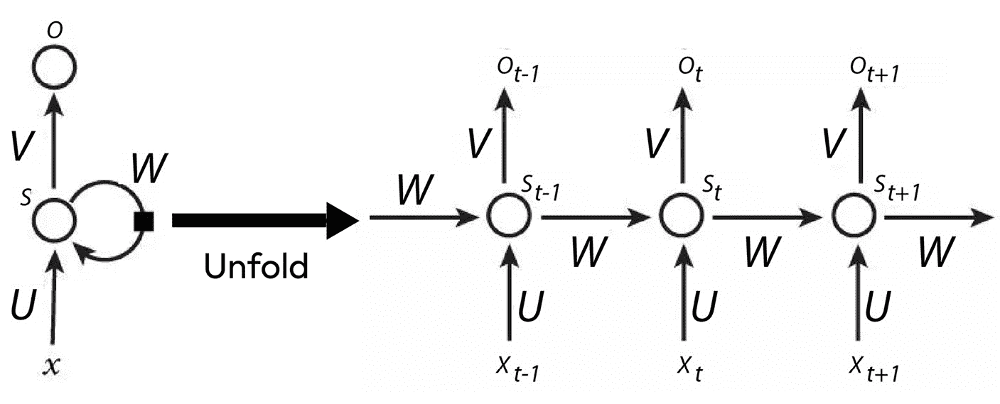

# 第六章：使用自然语言处理理解文本

**自然语言处理**（**NLP**）是机器学习的一个领域，专注于理解语言（以文本数据形式呈现）。在过去几年中，它是发展最快的领域之一，取得了在情感分析、聊天机器人、文本摘要和机器翻译等方面的显著成果。NLP 是亚马逊（Alexa）、谷歌和苹果（Siri）等开发的助手的核心，也是像 ChatGPT 和 Llama 2 这样的现代助手的核心。

在本章中，我们将学习如何使用 GluonNLP，这是一个专门用于 NLP 的 MXNet Gluon 库，如何构建我们自己的网络，以及如何使用其模型库 API 进行几个预训练模型的应用。

具体来说，我们将涵盖以下主题：

+   介绍 NLP 网络

+   使用主题建模分类新闻要点

+   分析电影评论中的情感

+   从越南语翻译到英语

# 技术要求

除了*前言*中指定的技术要求外，本章还适用以下技术要求：

+   确保你已经完成了*食谱 1*，*安装 MXNet、Gluon、GluonCV 和 GluonNLP*，来自*第一章*，*与 MXNet 一起启动并运行*。

+   确保你已经完成了*食谱 4*，*文本分类的玩具数据集：加载、管理和可视化垃圾邮件数据集*，来自*第二章*，*使用 MXNet 和可视化数据集：Gluon* *和 DataLoader*。

本章的代码可以在以下 GitHub URL 找到：[`github.com/PacktPublishing/Deep-Learning-with-MXNet-Cookbook/tree/main/ch06`](https://github.com/PacktPublishing/Deep-Learning-with-MXNet-Cookbook/tree/main/ch06)

此外，你可以直接从 Google Colab 访问每个食谱；例如，使用以下链接访问本章的第一个食谱：[`colab.research.google.com/github/PacktPublishing/Deep-Learning-with-MXNet-Cookbook/blob/main/ch06/6_1_Introducing_NLP_Networks.ipynb`](https://colab.research.google.com/github/PacktPublishing/Deep-Learning-with-MXNet-Cookbook/blob/main/ch06/6_1_Introducing_NLP_Networks.ipynb)。

# 介绍 NLP 网络

在前面的章节中，我们了解了不同的架构，如**多层感知器**（**MLPs**）和**卷积神经网络**（**CNNs**），分别如何处理数值数据和图像。在本章节中，我们将分析处理自然语言（以文本数据形式表达）的最重要架构。

自然语言最重要的特点是它是一个可变长度的单词列表，而这些单词的顺序很重要；它是一个序列。我们分析的之前的架构并不适合可变长度的数据输入，并且没有有效地利用单词之间的关系。

在本章中，我们将介绍为处理单词序列而开发的神经网络：

1.  我们将从应用前一章中介绍的网络开始，即用于文本处理的 CNN，称为 **TextCNNs**。

1.  之后，我们将介绍 **递归神经网络**（**RNNs**）及其基础实现。接着，我们将继续介绍改进版，即 **长短期记忆**（**LSTM**）。

1.  然后，正如我们在计算机视觉中所做的那样，我们将介绍 **GluonNLP 模型库**，这是 MXNet 最具价值的功能之一。我们将利用这些库 MXNet 和 GluonNLP 来理解和实现 **transformers** 及其自注意力机制，并研究这些网络如何处理变长的序列。

## 准备工作

与前几章一样，在这个配方中，我们将使用一些矩阵运算和线性代数，但这些操作不会很难。

## 如何操作...

在这个配方中，我们将执行以下操作：

1.  应用 CNNs 进行文本处理（TextCNNs）

1.  介绍 RNNs

1.  改进 RNNs 使用 LSTM

1.  介绍 GluonNLP 模型库

1.  关注 Transformers

接下来，我们将详细介绍这些网络架构。

### 应用 CNNs 进行文本处理

CNNs 在前一章中被介绍，通常用于处理图像。然而，通过一些轻微的修改，CNNs 也能非常高效地处理文本数据。

图像是二维数据，如在 *第五章* 中所示，*计算机视觉中的图像分析*，我们在这些数据上使用了两个层：

+   2D 卷积层

+   最大池化层

这些操作经过轻微修改以适应文本数据，文本数据可以看作是 1D 序列。因此，对于一维卷积层，我们有以下内容：


图 6.1 – 一维卷积

如 *图 6.1* 所示，序列与卷积核随时间变化，输出产生新的序列。请注意，同时分析的词汇数目是卷积核大小（前图中为 3）。

对于最大池化层，由于我们只有一个维度（即时间），这些层被称为 **时间最大池化** 层：


图 6.2 – 时间最大池化

如 *图 6.2* 所示，序列中的最大值被选中。

使用 MXNet Gluon，我们可以如下定义一维卷积和时间最大池化层：

```py
# TextCNN Components
# 1D Convolution
conv1d = mx.gluon.nn.Conv1D(3, 100, activation='relu')
# Max-Over-Time Pooling
max_over_time_pooling = mx.gluon.nn.GlobalMaxPool1D()
```

如何使用这些层的示例可以在 GitHub 代码中找到。

如同前一章中展示的 CNN 架构（参见 *图 5.6*），通常，在特征学习阶段之后，我们会有一个分类器。作为示例应用，这种架构将帮助我们后续进行情感分析。

## 介绍递归神经网络（RNNs）

如食谱介绍中所讨论，RNN 是处理可变长度数据序列的架构。对于 NLP，这些数据点是由单词组成的句子，但它们也可以用于图像序列（视频）等。

RNN 的历史是一系列逐步尝试，旨在改进对序列中不同输入的递归处理。已经有几个重要的贡献，最著名的包括 Hopfield（1982）、Jordan（1986）和 Elman（1990）。

RNN 的理念是，一旦从输入中处理出输出，这个输出会再次被送入模型（以递归的方式），并与新的输入结合。这个机制使得模型能够具有记忆（可以访问过去的数据）并处理新的输入，同时考虑到过去的信息。这个基本架构通常被称为**基础 RNN**。

请注意，如*食谱 4*中所介绍的，*理解文本数据集——加载、管理和可视化 Enron 邮件数据集*，在*第二章*中，*使用 MXNet 并可视化数据集：Gluon 和 DataLoader*，NLP 网络的输入，包括 RNN，不是从数据集中获得的单词，而是这些单词的数字表示形式，如独热编码或词嵌入。

如果将数据序列建模为连续的输入 x(1)，x(2)，... x(t)，则 RNN 的架构可以如下可视化：



图 6.3 – RNN 架构

在*图 6.3*中，我们可以看到每个输入*x(t)*如何随时间处理，以及处理后的输入（隐状态）如何循环回传递给下一次迭代。让我们更深入地了解每个步骤发生的事情，如前图所示，为了简化，激活函数和偏置未显示。基础 RNN 单元的实际方程式如下：


图 6.4 – 基础 RNN 单元的方程式

如*图 6.4*所示，对于每个步骤，输入*x(t)*乘以权重矩阵*U*，并加上偏置向量*b*，得出值*a(t)*，假设没有先前的输入*h(t – 1) = 0*。状态值*h(t)*作为该值的激活函数*tanh*的输出计算。当有先前的输入时，先前的状态值*h(t – 1)*与权重矩阵*W*相乘，并加到值*a(t)*和*h(t)*的计算中。

状态值*h(t)*然后乘以权重矩阵*V*，并加上偏置向量*c*，得出值*o(t)*。单元的输出作为该值的激活函数*softmax*的输出计算，最终得到输出值*y(t)*。

这些单元可以堆叠在一起，形成完整的 RNN。

使用 MXNet 和 Gluon，我们可以轻松创建我们自己的自定义 RNN 网络：

```py
# RNNs MXNet Implementation Example
class RNNModel(mx.gluon.Block):
    """
    A basic RNN Model
    """
    def __init__(self, num_hidden, num_layers, embed_size, **kwargs):
        super(RNNModel, self).__init__(**kwargs)
        self.rnn = mx.gluon.rnn.RNN(
            num_hidden,
            num_layers,
            input_size=embed_size)
    def forward(self, inputs, hidden):
        output, hidden = self.rnn(inputs, hidden)
        return output, hidden
```

我们可以使用以下代码定义一个自定义 RNN：

```py
# RNN with 3 hidden cells, 1 layer and expecting inputs with 20 embeddings
rnn = RNNModel(3, 1, 20)
 rnn.collect_params().initialize(mx.init.Xavier(), ctx=ctx)
```

此外，我们使用以下方法处理顺序输入：

```py
rnn_hidden = hidden_initial
outputs = []
for index in range(3):
    rnn_output, rnn_hidden = rnn(inputs[index], rnn_hidden)
    outputs.append(rnn_output)
```

前面展示的代码运行的是一个自定义的 RNN。欢迎在本书附带的 GitHub 仓库中的笔记本上进行实验。

总结来说，RNN 的一个优点是，先前输入中存在的信息会保存在随着时间步传递的状态中。然而，这些信息会不断地被不同的权重矩阵乘以并通过非线性函数（*tanh*）传递，结果是，在多个时间步后，状态信息被修改，不再作为记忆起作用；存储的信息发生了过大的变化。长时记忆存储是 RNN 的一个问题。

### 训练 RNN

在前面的章节中，我们看到如何通过使用监督学习来训练网络，通过计算期望输出（**真实值**）与网络实际输出之间的损失函数。然后，这个误差可以从网络的外层向内层进行反向传播，并更新这些层的权重。

对于 RNN，在每一个时间步，网络会接收一个输入序列和期望的输出序列。每个时间步的误差都会被计算出来，并从网络的外层反向传播到内层。这个适用于 RNN 的变化称为**时间反向传播**（**BPTT**）。

与其他网络一样，计算不同梯度涉及矩阵的迭代乘法。这个操作是指数级的，这意味着，在多次出现后，数值要么会收缩，要么会爆炸。这导致了我们之前讨论过的问题：**梯度消失**和**梯度爆炸**。这些问题使得 RNN 的训练非常不稳定。BPTT 的另一个重要缺点是，由于它是顺序计算，无法并行化。

## 使用长短期记忆（LSTM）改进 RNN

LSTM 由 Hochreiter 和 Schmidhuber 于 1997 年提出，作为解决前述问题（缺乏长期记忆和梯度消失/爆炸）的一种机制。在 LSTM 中，与其让前一个状态被乘以并通过非线性函数传递，连接变得更加直接。为了提供这一机制，每个 LSTM 单元从前一个单元接收两个输入：**隐藏状态**（**ht**）和**单元状态**（**ct**）：


图 6.5 – LSTM 网络

LSTM 的关键组件被称为门，它们定义了某个输入如何被修改并成为输出的一部分。这些向量的值介于 0 和 1 之间，帮助激活/停用来自输入的信息。因此，它们是对加权输入和的 sigmoid 操作（在*图 6**.5*中表示为*σ*），接着进行乘法运算。值得强调的是，LSTM 单元中存在的三个门决定了输入或状态中有多少信息可以通过每个输出。考虑到这一点，以下方程定义了 LSTM 的行为：


图 6.6 – LSTM 单元的方程

*图 6**.6* 中的方程可以解释如下：

+   **输入门 (it)**：这是决定前一状态信息和当前输入信息如何被更新的门。

+   **遗忘门 (ft)**：这是决定前一状态信息和当前输入信息如何成为长期记忆（单元状态）一部分的门。它决定了我们想忘记当前步骤的多少。

+   **记忆单元候选值 (gt)**：这是决定前一状态信息和当前输入信息如何成为记忆单元一部分的计算过程。它必须允许正负值，因此，*tanh* 是选用的激活函数。

+   **输出门 (ot)**：这是决定前一状态信息和当前输入信息如何成为输出一部分的门。

+   **记忆单元 (ct)**：这是将前一状态（*c*t-1）和当前记忆单元候选值（*g*t）合并为新的单元状态的计算过程。

+   **输出状态 (ht)**：这是将记忆单元与输出门值结合的计算过程。

使用 MXNet 和 Gluon，我们可以轻松创建自定义 LSTM 网络：

```py
# LSTMs MXNet Implementation Example
class LSTMModel(mx.gluon.Block):
    """
    A basic LSTM Model
    """
    def __init__(self, num_hidden, num_layers, embed_size, **kwargs):
        super(LSTMModel, self).__init__(**kwargs)
        self.lstm = mx.gluon.rnn.LSTM(
            num_hidden,
            num_layers,
            input_size=embed_size)
    def forward(self, inputs, hidden):
        output, hidden = self.lstm(inputs, hidden)
        return output, hidden
```

我们可以使用以下代码来定义一个自定义 RNN：

```py
# LSTM with 3 hidden cells, 1 layer and expecting inputs with 20 embeddings
lstm = LSTMModel(3, 1, 20)
 lstm.collect_params().initialize(mx.init.Xavier(), ctx=ctx)
```

此外，我们可以使用以下方法来处理顺序输入：

```py
lstm_hidden = [hidden_initial, state_initial]
 outputs = []
for index in range(3):
    lstm_output, lstm_hidden = lstm(inputs[index], lstm_hidden)
    outputs.append(lstm_output)
```

这里展示的代码运行的是一个自定义的 LSTM 网络。你可以随意修改这个 GitHub 仓库中的笔记本，来进行实验。

总结来说，LSTM 使得 RNN 能够更优化地进行训练，并已被应用于解决大量 NLP 任务，如情感分析和语言建模。

## 介绍 GluonNLP 模型库

MXNet GluonCV 提供的最优秀的功能之一是其庞大的预训练模型库，用户可以轻松使用并部署到自己的应用中。这个模型库被称为**Model Zoo**。

在 Model Zoo 中，已对以下任务进行了预训练的模型：

+   语言模型

+   情感分析

+   机器翻译

+   句子分类

+   问答

+   命名实体识别

+   联合意图分类和槽位标注

在本章中，我们将详细讨论情感分析和机器翻译的预训练模型。

## 使用 Transformers 进行注意力机制

尽管 LSTM 已被证明在许多应用中表现良好，但它们也有显著的缺点，包括训练时间较长、需要更多内存以及对随机初始化非常敏感。为克服这些限制，已经开发出了新的架构。其中最重要的一个例子就是**Transformer**。

Transformer 是由 Google Brain 于 2017 年提出的。它是一种新的编码器-解码器架构（如在*食谱 4*、*使用 PSPNet 和 DeepLab-v3 对图像中的物体进行分割*，见 *第五章*，*用计算机视觉分析图像*中所见），采用了一种重新设计的机制来处理数据序列，称为**注意力**。这种架构的最大改进在于它不依赖于顺序处理数据。所有数据可以并行处理，从而实现更快的训练和推理。这一改进使得可以处理非常大量的文本，**语料库**，并产生了**大规模语言模型**（**LLM**），例如**双向编码器表示的 Transformer**（**BERT**）。

Transformer 的架构可以表示如下：


图 6.7 – Transformer 架构

在*图 6.7*中，我们可以区分出几个组件：

+   **输入与输出预处理**：在将数据输入网络之前，嵌入和位置编码会被计算出来。

+   **编码器-解码器架构**：左侧部分对应编码器，右侧部分对应解码器。前馈处理、残差连接和归一化是该组件的一部分。

+   **注意力头**：序列输入编码器到解码器的路径，序列输出都通过这一机制处理。

让我们更详细地看看这些组件。

### 输入与输出预处理

在原始论文中，输入和输出在被送入网络之前，会通过**学习到的嵌入**进行处理。这些嵌入向量通常具有 512 个元素的大小。

此外，正如我们接下来所看到的，这些嵌入会通过一个*softmax*函数，将多个信息片段组合成一个数值，但在此过程中也会丢失位置信息。为了在整个编码和解码过程中保持位置信息，无论是输入还是输出，输入嵌入都会作为一个包含位置信息的向量添加。这些被称为**位置编码**。

### 编码器-解码器架构

正如原始*Google Brain 的 Transformer* 论文中所提到的：[`arxiv.org/pdf/1706.03762.pdf`](https://arxiv.org/pdf/1706.03762.pdf)，编码器和解码器由六个相同的层组成（在*图 6.5*中，左图和右图中的*N = 6*）。每个编码器层有两个组件，一个是多头自注意力机制，后面接着一个全连接的前馈网络。对于每个解码层，另加一个注意力组件，即掩蔽的多头自注意力机制。注意力头将在后续部分进行解释。

残差连接也被加入，类似于我们在*Recipe 2* 中看到的 ResNets，*第五章*中*使用 MXNet 进行图像分类 – GluonCV 模型库, AlexNet 和 ResNet*，以及在*计算机视觉分析*中。

这些信息一起经过层归一化处理，类似于*Recipe 3*中介绍的批归一化，在*第三章*中，*回归模型训练*，*解决回归问题*。最重要的区别是，如介绍层归一化的论文所述（[`arxiv.org/abs/1607.06450`](https://arxiv.org/abs/1607.06450)），层归一化使得一个层中的所有隐藏单元共享相同的归一化项，但不同的输入数据可以有不同的归一化项。层归一化已被证明在处理序列时比批归一化效果更好。

通过结合不同编码器和解码步骤中的所有这些层（包括嵌入层），这些向量将具有 512 的维度。

### 注意力头

在 Transformers 中，一个序列中的每个单词如何与另一个序列中的每个单词相连接，是通过注意力机制实现的。例如，如果我们有一个包含*N*个单词的英语输入序列（*I love you very much*），并且它的法语翻译有*M*个单词（*Je t’aime beaucoup*），那么这两个序列之间的注意力权重矩阵将具有*NxM* 的维度。使用这种机制连接序列相比于递归机制（例如 RNN 中使用的机制）有一个强大的优势——并行化。注意力是一个矩阵操作，因此可以被最佳化地并行化。

|  | I | love | you | very | much |
| --- | --- | --- | --- | --- | --- |
| je | 0.90 | 0.02 | 0.06 | 0.01 | 0.01 |
| t’ | 0.11 | 0.01 | 0.80 | 0.03 | 0.05 |
| aime | 0.03 | 0.92 | 0.03 | 0.01 | 0.01 |
| beaucoup | 0.02 | 0.02 | 0.02 | 0.41 | 0.53 |

图 6.8 – 注意力矩阵示例

在 Transformer 论文中，*图 6.9* 中显示了三个矩阵，*查询（Q），键（K）和值（V）*。以下是对这些矩阵的解释：

+   **查询**：这是每个输入单词的输入表示

+   **键和值**：类似于一个**哈希映射**，将键映射到值，这些矩阵用于索引（键）和提供单词的表示（值）（与查询不同）

这三种矩阵操作的组合被称为点积注意力函数，可以描述如下：


图 6.9 – 注意力函数

当输出是输入序列的表示时，这个机制被称为**自注意力头**。在之前的架构图*图 6.7*中，靠近输入序列和输出序列的两个注意力机制（图的下部）是自注意力机制，因为由该函数输出的序列与输入的序列相同。当情况不同，例如在连接编码器和解码器的注意力机制中，这被称为**交叉注意力头**。输出向量的自注意力头是被屏蔽的，这意味着在网络训练中只能使用过去的信息。这使得 Transformer 模型能够从有限的输入生成文本（如 GPT-3 或 BLOOM 等自回归模型）。

在 Google Brain 的论文《Attention is All You Need》中（[`arxiv.org/abs/1706.03762`](https://arxiv.org/abs/1706.03762)），并不是并行处理所有输入数据，而是使用了八个注意力头并行工作。由于期望输出具有相同的维度（512），每个头处理的是一个较小的向量（维度为 64）。该论文描述如下：

“多头注意力使模型能够同时关注不同表示子空间中不同位置的信息。”

降低维度可以使总计算成本与使用完整（全维度）注意力头的成本相似。

### 在 GluonNLP 中的实现

GluonNLP 有自己实现的 Transformer 模型，因此获取我们的编码器和解码器是直接的，具体如下：

```py
# Transformers MXNet Implementation Example
# Transformer with 6 layers (encoder and decoder), 2 parallel heads, and expecting inputs with 20 embeddings
transformer_encoder, transformer_decoder, _ = nlp.model.transformer.get_transformer_encoder_decoder(
    num_layers=6,
    num_heads=2,
    units=20)
transformer_encoder.collect_params().initialize(mx.init.Xavier(), ctx=ctx)
 transformer_decoder.collect_params().initialize(mx.init.Xavier(), ctx=ctx)
```

现在，我们可以使用编码器来处理输入数据；然而，使用 Transformers 时，我们可以同时处理整个输入：

```py
encoded_inputs, _ = transformer_encoder(inputs[0])
```

大规模 Transformer 是目前大多数 NLP 任务的最先进技术，如主题建模、情感分析或问答，并且编码器和解码器架构也会单独用于不同的任务。

## 它是如何工作的……

在这个方案中，我们介绍了几个网络，通过 MXNet、Gluon 和 GluonNLP 来处理 NLP 任务：

+   RNNs

+   LSTM

+   Transformers

我们已经回顾了这些架构的工作原理，并分析了它们的优缺点，以及每个架构如何改进前一个架构，探索了序列、BPTT、内存单元和注意力等概念。

在接下来的方案中，我们将探索如何使用这些架构来解决实际问题，如主题建模、情感分析和机器翻译。

## 还有更多……

本书中讨论的一些概念过于先进，无法在本书中详细介绍。如果你希望更深入地理解这些内容，我强烈建议查看以下参考资料：

+   **TextCNNs (****论文):** [`aclanthology.org/D14-1181.pdf`](https://aclanthology.org/D14-1181.pdf)

+   **RNNs (直观解释):** [`towardsdatascience.com/a-battle-against-amnesia-a-brief-history-and-introduction-of-recurrent-neural-networks-50496aae6740`](https://towardsdatascience.com/a-battle-against-amnesia-a-brief-history-and-introduction-of-recurrent-neural-networks-50496aae6740)

+   **RNNs (时间反向传播):** [`d2l.ai/chapter_recurrentneural-networks/bptt.html`](https://d2l.ai/chapter_recurrentneural-networks/bptt.html)

+   **梯度消失/爆炸研究论文 (使用梯度下降学习长期依赖关系是** **困难的):** [`www.comp.hkbu.edu.hk/~markus/teaching/comp7650/tnn-94-gradient.pdf`](http://www.comp.hkbu.edu.hk/~markus/teaching/comp7650/tnn-94-gradient.pdf)

+   **梯度消失/爆炸研究论文：（递归神经** **网络训练的困难）:** [`arxiv.org/pdf/1211.5063.pdf`](https://arxiv.org/pdf/1211.5063.pdf)

+   **梯度消失/爆炸研究论文（爆炸梯度问题揭示 —— 定义、普遍性、影响、起源、权衡和** **解决方案）:** [`arxiv.org/pdf/1712.05577.pdf`](https://arxiv.org/pdf/1712.05577.pdf)

+   **LSTMs (****论文):** [`www.bioinf.jku.at/publications/older/2604.pdf`](http://www.bioinf.jku.at/publications/older/2604.pdf)

+   **LSTMs (直观** **解释):** [`colah.github.io/posts/2015-08-Understanding-LSTMs/`](http://colah.github.io/posts/2015-08-Understanding-LSTMs/)

+   **Transformers (原始论文 – Attention Is All You** **Need):** [`arxiv.org/pdf/1706.03762.pdf`](https://arxiv.org/pdf/1706.03762.pdf)

+   **Transformers (直观** **解释):** [`towardsdatascience.com/transformers-89034557de14`](https://towardsdatascience.com/transformers-89034557de14)

+   **Transformers (层** **归一化):** [`arxiv.org/pdf/1607.06450.pdf`](https://arxiv.org/pdf/1607.06450.pdf)

+   **NLP 中的最先进模型 (GPT-3** **论文):** [`arxiv.org/pdf/2005.14165.pdf`](https://arxiv.org/pdf/2005.14165.pdf)

+   **NLP 中的最先进模型 (BLOOM（开源** **替代方案）:** [`huggingface.co/blog/bloom`](https://huggingface.co/blog/bloom)

在本章中，我们将详细分析以下任务：主题建模、情感分析和文本翻译。然而，MXNet GluonNLP 模型库包含了许多预训练的模型，适用于大量任务。我们鼓励你探索在[`nlp.gluon.ai/model_zoo/index.html`](https://nlp.gluon.ai/model_zoo/index.html)上提供的不同示例。

# 使用主题建模对新闻亮点进行分类

在本食谱中，我们将研究自然语言处理（NLP）中最有趣的任务之一——主题建模。在这个任务中，用户必须在给定文档集的情况下找到主题数。 有时，主题（以及主题的数量）是已知的，此时可以应用我们在前几章中看到的监督学习技术。然而，在典型的场景中，主题建模数据集没有提供真实标签，因此是无监督学习问题。

为了实现这一点，我们将使用来自 GluonNLP Model Zoo 的预训练模型，并将其词嵌入应用于聚类算法，从而得出聚类的主题。我们将把这一过程应用于一个新的数据集：*100 万* *新闻头条*。

## 准备工作

与前几章一样，在本食谱中，我们将使用一些矩阵运算和线性代数，但它并不难。

此外，我们将处理文本数据集。因此，我们将重新回顾一些已经在*Recipe 4*中提到的概念，*理解文本数据集——加载、管理和可视化恩隆邮件数据集*，来自*第二章*，*与 MXNet 协作并可视化数据集：Gluon* *和 DataLoader*。

## 如何实现...

在本食谱中，我们将执行以下步骤：

1.  探索*100 万新闻* *头条*数据集

1.  应用词嵌入

1.  使用 K-means 聚类主题

1.  整合所有内容

让我们在接下来的子章节中逐步了解这些步骤。

### 探索 100 万新闻头条数据集

该数据集是主题建模中最著名的数据集之一。它包含澳大利亚广播公司（**ABC**）网站从 2003 年到 2021 年（含）发布的 19 年的重要新闻头条。每个新闻头条的主题没有包括在内。

正如我们预期的那样，真实世界的数据集包含大量的词汇。因此，在进一步处理之前，我们将开始清洗数据，并按照*Recipe 4*中描述的过程进行，*理解文本数据集——加载、管理和可视化恩隆邮件数据集*，来自*第二章*，*与 MXNet 协作并可视化数据集：Gluon* *和 DataLoader*：

+   分词

+   移除停用词

+   词干提取

+   词形还原

此外，这个数据集包含超过 100 万个头条新闻（实际上是 120 万个）。为了能够高效地处理它们，我们将使用一个包含 5%的子集：

```py
reduced_number_headlines = int(0.05 * number_headlines)
 print(reduced_number_headlines)
62209
```

如果我们分析这个子集来计算每个头条新闻的词数，我们可以绘制出以下的直方图：


图 6.10 – 按词数分布的头条新闻

正如在*图 6.10*中所示，大多数头条新闻包含 4 到 8 个词。

### 应用词嵌入

在*食谱 4*中，*理解文本数据集 – 加载、管理和可视化 Enron 邮件数据集*，来自于 *第二章*，*使用 MXNet 和可视化数据集：Gluon 和 DataLoader*，我们介绍了来自 GluonNLP 模型库的两个嵌入模型：谷歌的**word2vec**和斯坦福大学的**GloVe**。在这个使用案例中，我们将使用 word2vec，因为它是在一个名为 Google News 的数据集上训练的，该数据集由 3 百万单词和短语组成，来源于一个包含 1000 亿个单词的语料库。由于该语料库由新闻信息组成，这个嵌入模型非常适合我们的使用案例。


图 6.11 – word2vec 嵌入的 2D 表示

使用这个模型时，每个单词都会被转换为一个包含 300 个分量的向量。然而，在我们的应用中，处理的是标题（完整句子），我们更关心的是整个标题的表示，而不仅仅是其独立的单词。对于我们的应用，完成这一目标的一个简单有效的方法是计算每个预处理单词的平均向量。

### 使用 K-means 聚类主题

在我们得到标题嵌入后，分类标题的最后一步就是聚类它们。有很多聚类算法，比如**期望最大化聚类**和**均值漂移聚类**。然而，对于我们的应用，我们将使用我最喜欢的算法——**K-means**，它在我们之前提到的 Python 包 **scikit-learn** 中已经实现。


图 6.12 – K-means 可视化

K-means 背后的直观思想是，给定一个聚类数量 *K*，它会随机分配聚类的质心，并将每个新看到的向量分配给距离最近的质心（分配步骤）。然后，它会计算新质心，作为属于该聚类的向量的均值（更新步骤），并迭代此过程。这个过程会一直重复，直到质心位置没有显著变化。因此，整个数据集可以多次迭代。对于大型数据集，可以添加其他标准来确定收敛和停止标准。

K-means 的一个重要缺点是聚类的数量是一个输入参数，因此需要对数据集有一定的直觉或知识。实际上，事先知道这个信息是很困难的。因此，我强烈建议针对不同的 *K* 值运行算法。对于我们的使用案例，选择的聚类数量是 4。

### 将所有步骤整合在一起

经过这三步处理（数据清理、嵌入和聚类），我们就可以开始分析一些结果了。

主题建模中最有趣的输出是识别哪些头条新闻主题与每个聚类相关。一个有用的方法是可视化每个聚类中最重要的词汇，并提出相关的主题。因此，我们可以为第一个识别的聚类（聚类 0）绘制以下内容：


图 6.13 – 第一个聚类中按重要性排序的前 15 个词

在*图 6.13*中，我们可以看到最重要的词是`win`（胜利）、`world`（世界）、`cup`（杯赛）和`final`（决赛）。这些词都是与体育相关的，因此聚类 0 的主题是*体育*。

我们可以为每个聚类整理出最重要的词汇：

```py
Cluster 0 : ['win', 'world', 'cup', 'final', 'lead', 'set', 'hit', 'face', 'record', 'open', 'year', 'miss', 'test', 'new', 'day']
Cluster 1 : ['govt', 'iraq', 'urg', 'nsw', 'polic', 'continu', 'say', 'australia', 'vic', 'consid', 'qld', 'iraqi', 'forc', 'secur', 'sar']
Cluster 2 : ['plan', 'council', 'new', 'govt', 'fund', 'say', 'boost', 'group', 'water', 'concern', 'health', 'report', 'claim', 'seek', 'warn']
Cluster 3 : ['polic', 'man', 'kill', 'charg', 'court', 'murder', 'crash', 'death', 'attack', 'woman', 'face', 'arrest', 'probe', 'car', 'dead']
```

从前面的信息中，我们可以得出每个聚类的主题：

+   `Cluster` `0`: 体育

+   `Cluster 1`: 全球事务

+   `Cluster` `2`: 经济

+   `Cluster 3`: 犯罪/时事新闻

有了这些信息，我们现在可以选择任何未在聚类过程中使用的头条新闻，并预测它的主题：

```py
import random
random_index = random.randint(0, len(headlines_full)) random_headline = headlines_full["headline_text"][random_index] print(random_index, random_headline)
```

这段代码会生成类似于以下的输出：

```py
771004 waratahs count cost with loss to cheetahs
```

前面这句话明显与体育相关，因此我们预期预测的聚类应为`0`。

为了预测聚类组，我们需要按照以下步骤操作：定义函数、运行函数并验证结果。

1.  让我们编写一个预测函数，执行必要的清理和预处理、嵌入以及聚类步骤：

    ```py
    def predict(cluster_km, headline):    """    This function predicts the cluster  of a headline via K-Means
        """
        # Cleaning
        headline_clean = clean_text(headline)
        headline_pre = process_words(headline_clean)
        # Embeddings
        bag_of_words_list = headline_pre.split()
        number_of_words = len(bag_of_words_list)
        # Process 1st word (to be able to concatenate)
        word_embeddings_array = w2v[bag_of_words_list[0]].reshape(1, embedding_features)
        # To manage headlines with just 1 meaningful word
        word_index = -1
        for word_index, word in enumerate(bag_of_words_list[1:]):
            word_embeddings = w2v[word].reshape(1, embedding_features)
            word_embeddings_array = mx.nd.concat(word_embeddings_array,
     word_embeddings, dim=0)
        assert(number_of_words == word_index + 2)
        average_embedding_headline_pre = mx.nd.mean(word_embeddings_array, axis=0).reshape(1, embedding_features)
        # Clustering
        selected_cluster = cluster_km.predict(average_embedding_headline_pre.asnumpy())
        return selected_cluster
    ```

1.  让我们通过以下代码运行这个函数：

    ```py
    predicted_cluster = predict(cluster_km, random_headline)
    print(predicted_cluster)
    ```

1.  输出是实际预测的聚类：

    ```py
    [0]
    ```

做得好！

## 它是如何工作的...

在这个实例中，我们探索了被称为主题建模的自然语言处理任务。这个任务试图找出与一组给定文档相关的主题。通常，不提供明确的答案（没有标准答案），因此这个任务更适合通过无监督学习来解决。我们尝试使用 ABC 的*100 万新闻* *头条* 数据集来解决这个问题。

我们遵循了三步法：

1.  数据处理与清洗

1.  词嵌入

1.  聚类

对于第一步，我们遵循了任何自然语言处理问题的典型流程：

1.  数据清理

1.  分词

1.  去除停用词

1.  词干提取

1.  词形还原

对于第二步，我们应用了 Google 的 word2vec 来计算每个单词的嵌入，每个头条新闻的嵌入是其每个单词嵌入的平均值。

在第三步中，我们探索了无监督学习算法 K-means，选择了四个聚类，并计算了它们的中心点。我们生成了以下主题聚类：体育、全球事务、经济与犯罪、时事新闻。

有了这些信息，我们选择了一个随机的头条新闻，并准确地预测了它所关联的主题。

## 还有更多内容…

无监督学习是一个非常广泛的主题，也是一个活跃的研究领域。要了解更多，好的起点是它的维基百科文章：[`en.wikipedia.org/wiki/Unsupervised_learning`](https://en.wikipedia.org/wiki/Unsupervised_learning)。

除了*100 万新闻标题*数据集，另一个著名的主题建模参考数据集是 20 Newsgroups 数据集。我建议使用更大的 6 Newsgroups 选项，因为许多 Newsgroups 有很多相似的主题。更多信息可以在[`qwone.com/~jason/20Newsgroups/`](http://qwone.com/~jason/20Newsgroups/)找到。

在处理嵌入时，我们遵循的一个简化方法是通过平均每个对应的词嵌入来计算标题嵌入。然而，还有其他方法，称为文档嵌入或句子嵌入，使用像**Doc2Vec**或**Sentence-BERT**这样的模型，这些方法对于其他应用可能更有用。关于这些方法的对比分析可以在[`www.analyticsvidhya.com/blog/2020/08/top-4-sentence-embedding-techniques-using-python/`](https://www.analyticsvidhya.com/blog/2020/08/top-4-sentence-embedding-techniques-using-python/)找到。

有关 K-means 算法如何工作的详细解释，建议你查看[`towardsdatascience.com/k-means-clustering-explained-4528df86a120`](https://towardsdatascience.com/k-means-clustering-explained-4528df86a120)。

在预测给定标题的主题时，K-means 算法等同于另一个算法，称为 1-最近邻，它是 K 最近邻的特例，其中 K = 1。关于这个监督学习算法的更多信息可以在[`en.wikipedia.org/wiki/K-nearest_neighbors_algorithm`](https://en.wikipedia.org/wiki/K-nearest_neighbors_algorithm)找到。

# 分析电影评论的情感

**情感分析**是使用多种不同的技术，包括自然语言处理（NLP），来识别与人类生成的信息（在我们这里是文本）相关的情感状态。在这个配方中，我们将对现实世界的电影评论进行情感分析。我们将评论分为两种情感：正面或负面。

为了实现这一点，我们将使用来自 GluonNLP 模型库的多个预训练模型，并将其词嵌入应用于分类器，分类器将输出预测的情感。我们将这一过程应用于一个新的数据集：**IMDb** **电影评论**。

## 准备工作

和前几章一样，在这个配方中，我们将使用一些矩阵运算和线性代数，但这并不难。

此外，我们将对文本数据集进行分类。因此，我们将回顾在*配方 4*中已经看到的一些概念，*理解文本数据集 – 加载、管理和可视化 Enron 邮件数据集*，来自*第二章*，*与 MXNet 协作并可视化数据集：Gluon* *和 DataLoader*。

## 如何实现...

在这个配方中，我们将执行以下步骤：

1.  探索*IMDb 电影* *评论* 数据集

1.  将 TextCNN 与词嵌入结合

1.  介绍 BERT

1.  整合一切

### 探索 IMDb 电影评论数据集

这个数据集由斯坦福大学的研究人员在 2011 年收集。它被划分为训练集和测试集，每个集包含 25,000 条评论。每部电影最多包含 30 条评论。评论的情感极为两极化，负面评论的值在 [1, 4] 之间，正面评论的值在 [7, 10] 之间。


图 6.14 – 电影评论的直方图（不平衡数据集）

在我们的分析中，我们将情感值简化为二分类情感分析任务。因此，负面评论被分配为 0 值，正面评论为 1 值。通过这种简化，数据集变得平衡。


图 6.15 – 二值化电影评论的直方图（平衡数据集）

论文作者指出的另一个要考虑的点是，由于语言中的细微差别可能包含关于情感的信息，因此评论的预处理不能包括常见的停用词和词干化。我们在预处理时考虑了这一点：

```py
def process_words_basic(
    text,
    lemmatizer = lemmatizer):
    words = nltk.tokenize.word_tokenize(text)
    filtered_words_post = []
    for word in words:
        if word.isalpha():
            filtered_words_post.append(lemmatizer.lemmatize(word))
    return filtered_words_post
```

文件可以通过[`github.com/PacktPublishing/Deep-Learning-with-MXNet-Cookbook/blob/main/ch06/utils.py`](https://github.com/PacktPublishing/Deep-Learning-with-MXNet-Cookbook/blob/main/ch06/utils.py)访问。

这个函数应用于数据集中的所有样本。

### 将 TextCNN 与词嵌入结合使用

处理完数据集后，我们现在可以使用它来搭建任何我们选择的架构。在本章的第一个食谱中，我们展示了如何使用 CNN 处理序列。为了提供语言信息，TextCNN 可以使用预训练的词元表示作为输入。对于这个食谱，我们将使用两个词嵌入，它们将为我们的模型生成输入：

+   **word2vec**：这些词嵌入在*食谱 4*中介绍，*理解文本数据集 – 加载、管理和可视化 Enron 邮件数据集*，来自*第二章*，*与 MXNet 一起工作并可视化数据集：Gluon 和 DataLoader*

+   **BERT**：Google 于 2018 年推出的语言模型

### 介绍 BERT

RNN 和 Transformer 可以处理大规模的文本序列。然而，最大的缺点之一是数据仅单向处理，从左到右。BERT 提供了一种机制，使得每个单词的表示（词元）可以同时使用来自左侧和右侧的信息。

BERT 的另一个独特特性是，它的注意力机制完全基于自注意力层；没有使用交叉注意力层。


图 6.16 – BERT 架构：将 BERT 的双向方法与 GPT-1 等 Transformer 模型的左到右方法进行比较

BERT 是在无监督的方式下训练的，使用了两个任务目标：

+   **掩蔽语言模型**：待分析的单词不可见，因此模型需要仅凭上下文理解其含义

+   **下一句预测**：给定两句话，任务是预测它们是否相关（在长文本中，一个可能会在另一个后面出现）或它们不相关

这种训练方法与 BERT 架构的结合，证明非常成功，在论文发表时超过了当时 11 个 NLP 任务的最先进技术。

GluonNLP 提供了两个预训练的 BERT 模型，具有以下特征：

+   `BERT_12_768_12`：12 层、768 维嵌入向量、12 个自注意力头。这个模型被称为**BERT base**。

+   `BERT_24_1024_16`：24 层、1,024 维嵌入向量、16 个自注意力头。这个模型被称为**BERT large**。

对于我们的实验，我们将使用 BERT base 模型，可以通过以下代码轻松加载：

```py
bert_model, vocab = nlp.model.get_model(
    'bert_12_768_12',
    dataset_name='book_corpus_wiki_en_uncased',
    use_classifier=False,
    use_decoder=False,
    ctx=ctx)
```

使用上述函数，我们可以轻松获得一个 BERT 模型（`bert_model`）及其词汇表（`vocab`），该模型基于 12 层架构、768 维嵌入向量、12 个自注意力头，并且使用来自英文维基百科的数据集（`book_corpus_wiki_en_uncased`）。

### 将所有内容汇总在一起

让我们总结一下到目前为止看到的所有步骤。

我们的*IMDb 电影评论*数据集由 25,000 个训练样本和 25,000 个测试样本组成。为了成本和计算优化，我们使用以下数据集：

+   **训练集**：5,000 个样本（来自原始训练集）

+   **验证集**：1,250 个样本（来自原始训练集；与我们的 5,000 个训练样本没有重叠）

+   **测试集**：25,000 个样本

我们使用两个嵌入模型作为 TextCNN 的输入：

+   **word2vec**：300 维向量

+   **BERT base**：768 维向量

TextCNN 架构在两种方法中非常相似。TextCNN 的卷积核大小为 3、4 和 5，即同时分析 3、4 和 5 个单词，通道数等于嵌入组件数。此外，由于我们有二分类输出（*负面*或*正面*），分类器是一个完全连接层，具有一个 sigmoid 输出（sigmoid 激活函数已包含在损失函数中，以进行计算优化）。

对于训练，两个嵌入模型使用等效的参数：

+   **优化器**：Adam

+   **学习率**：10-3

+   **损失函数**：Sigmoid 交叉熵

+   **Epochs**：5

+   **批次大小**：4

使用这些参数，我们通过 word2vec 嵌入模型得到了以下结果：


图 6.17 – 使用 word2vec 的训练损失/验证损失和准确度

在*图 6.17*中，我们可以看到随着训练轮次的增加，训练效果有所提升，最终在训练结束时获得了最佳验证准确率 0.89。

我们可以定性地检查结果，从我们的测试集中选择一条电影评论（未见过的样本），并查看我们的情感分析算法的输出。该示例电影评论来自 [`ieee-dataport.org/open-access/imdb-movie-reviews-dataset`](https://ieee-dataport.org/open-access/imdb-movie-reviews-dataset)，并具有 CC BY 4.0 许可证：

```py
I went and saw this movie last night after being coaxed to by a few friends of mine. I'll admit that I was reluctant to see it because from what I knew of Ashton Kutcher he was only able to do comedy. I was wrong. Kutcher played the character of Jake Fischer very well, and Kevin Costner played Ben Randall with such professionalism. The sign of a good movie is that it can toy with our emotions. This one did exactly that. The entire theater (which was sold out) was overcome by laughter during the first half of the movie, and were moved to tears during the second half. While exiting the theater I not only saw many women in tears, but many full grown men as well, trying desperately not to let anyone see them crying. This movie was great, and I suggest that you go see it before you judge.
```

我们可以将这个输入格式化为我们的 TextCNN 网络所期望的嵌入：

```py
# Formatting single input as expected for the network
seq_output, _ = process_dataset_sample(test_dataset[0][0])
 seq_output_reshaped = mx.nd.array(seq_output, ctx=ctx).expand_dims(axis=0)
```

我们可以通过我们从训练中获得的最佳模型来传递它：

```py
# Retrieve best model from training
text_cnn.load_parameters(model_file_name)
review_sentiment = text_cnn(seq_output_rehaped)
# We can omit sigmoid processing, outputs of the network
# with positive values are positive reviews
if review_sentiment >= 0:
    print(review_sentiment, "The review is positive")
else:
    print(review_sentiment, "The review is negative")
```

这些命令生成了以下输出：

```py
[[2.5862172]]
 <NDArray 1x1 @gpu(0)> The review is positive
```

如前述输出所示，我们的算法正确地将评论分类为*积极*。

然而，为了进行更全面和正式的分析，我们可以定量处理完整的测试集并计算最终准确率：

```py
Final Test Accuracy: 0.87724
```

然而，仅凭这个数字无法提供关于*I 型*和*II 型*错误的完整信息。因此，我们还可以将结果显示为混淆矩阵（在*食谱 4*中介绍过，*评估分类模型*，*解决* *分类问题*）：


图 6.18 – 使用 word2vec 的混淆矩阵

当采用相同的方法，但这次使用我们的 BERT 模型进行嵌入时，我们得到了以下结果：


图 6.19 – 使用 BERT 的训练损失/验证损失和准确率

在*图 6.19*中，我们可以看到随着训练轮次的增加，训练效果有所提升，最终在训练结束时获得了最佳验证准确率 0.91。这个数字比使用 word2vec 时要高，正如预期的那样，因为 BERT 能够在评论中的单词之间建立更多的上下文关系。

我们还可以将测试集中相同的评论通过我们从训练中获得的最佳模型，使用之前相同的代码语句，得到以下输出：

```py
[[15.462966]]
 <NDArray 1x1 @gpu(0)> The review is positive
```

该实验与之前使用*word2vec*的实验产生了相同的结果（积极评论）。

对于测试集准确率，我们得到了以下结果：

```py
Final Test Accuracy: 0.90848
```

与 word2vec 结果相比，BERT 提供了 3% 更高的准确率。

混淆矩阵如下所示：


图 6.20 – 使用 BERT 的混淆矩阵

从这些结果可以看出，BERT 显著优于 word2vec。另一个重要的优势是，由于 Transformer 允许更好的并行化，训练过程也更快。

## 它是如何工作的……

在这个食谱中，我们解决了情感分析问题。我们分析了 TextCNN 架构，来解决这个任务，并探讨了如何将其应用于不同的词嵌入模型。

我们探索了一个新的数据集，*IMDb 电影评论*，并进行了适当的转换，以便在受限计算环境中使用该数据集，并将其简化为二分类任务。

我们介绍了 BERT，这是 Google 在 2018 年推出的一个新的词嵌入模型，并将其与之前探索过的模型 word2vec 进行了比较，理解了它们的差异、优势和局限性。我们理解了 BERT 的两个最重要的优势：对每个词使用双向信息，并在训练中对每个词进行掩蔽，以便每个词的信息完全基于其上下文。

我们进行了实验，比较了这两种词嵌入方法，结果发现尽管两者都能够很好地解决问题（word2vec 和 BERT 的测试准确率分别为 88% 和 91%），但 BERT 表现更好。

## 还有更多...

情感分析是文献中研究得较为深入的任务。想了解更多，建议阅读这篇文章：[`www.datarobot.com/blog/introduction-to-sentiment-analysis-what-is-sentiment-analysis/`](https://www.datarobot.com/blog/introduction-to-sentiment-analysis-what-is-sentiment-analysis/)。

介绍 *IMDb 电影评论* 数据集的论文，同时提出了一个情感分析模型，可以在这里找到：*Learning Word Vectors for Sentiment* *Analysis*，[`ai.stanford.edu/~ang/papers/acl11-WordVectorsSentimentAnalysis.pdf`](https://ai.stanford.edu/~ang/papers/acl11-WordVectorsSentimentAnalysis.pdf)。

BERT 在论文 [`arxiv.org/pdf/1810.04805.pdf`](https://arxiv.org/pdf/1810.04805.pdf) 中进行了介绍。然而，以下链接提供了更直观的解释：[`huggingface.co/blog/bert-101`](https://huggingface.co/blog/bert-101)。强烈建议阅读上一篇文章，因为它分析了数据如何将偏见嵌入到我们的模型中。

BERT 非常强大，并且可以与更好的语言模型进行互补，例如 RoBERTa（改进版）或 DistilBERT（性能相似但更小的模型），还有很多为特定任务微调的模型。可以在 [`nlp.gluon.ai/model_zoo/bert/index.html`](https://nlp.gluon.ai/model_zoo/bert/index.html) 找到 MXNet GluonNLP 中可用的预训练模型列表。

# 从越南语翻译到英语

自动翻译文本（机器翻译）自诞生以来一直是自然语言处理（NLP）中一个非常有趣和有用的应用案例，因为打破语言障碍有很多应用，包括聊天机器人和多语言的自动字幕。

在深度学习之前，机器翻译通常被视为一个统计问题。即使在深度学习之后，直到 2016 年 Google 将深度学习应用于机器翻译，**神经机器翻译**（**NMT**）这一领域才诞生。这个模型为现在在大语言模型（LLM）中可用的翻译任务奠定了基础，如 **OpenAI GPT** 和 **Google Bard**。

在这个教程中，我们将应用这些技术，将越南语句子翻译成英语，使用来自 GluonNLP 模型库的预训练模型。

## 准备工作

与前几章一样，在这个教程中，我们将使用一点矩阵运算和线性代数，但这绝对不难。

此外，我们还将对文本数据集进行分类。因此，我们将重新回顾在*第二章*中已经见过的一些概念，*理解文本数据集——加载、管理和可视化 Enron 邮件数据集*，*与 MXNet 一起工作并可视化数据集：Gluon 和 DataLoader*。

## 如何操作...

在这个教程中，我们将执行以下步骤：

1.  探索*IWSLT2015*数据集

1.  评估机器翻译器（BLEU）

1.  介绍 GNMT 模型并探索适用于此任务的 Transformers

1.  综合所有内容

接下来我们详细看一下这些步骤。

### 探索 IWSLT2015 数据集

**国际口语语言翻译研讨会**（**IWSLT**）是一个每年举办的科学研讨会，专注于所有形式的翻译（不一定是机器翻译）。他们生成了几个非常重要的数据集和基准，帮助机器翻译领域不断发展。2015 年，发布了一个英语-越南语数据集，包含超过 130,000 对句子的训练集和 1000 多对句子的验证/测试集。这个数据集是公开的，可以通过 MXNet GluonNLP 轻松获取，如下所示：

```py
# IWSLT2015 Dataset (Train, Validation and Test)
# Dataset Parameters
src_lang, tgt_lang = "vi", "en"
src_max_len, tgt_max_len = 50, 50
iwslt_train_text = nlp.data.IWSLT2015("train",
                                      src_lang=src_lang,
                                      tgt_lang=tgt_lang)
iwslt_val_text   = nlp.data.IWSLT2015("val",
                                      src_lang=src_lang,
                                      tgt_lang=tgt_lang)
iwslt_test_text  = nlp.data.IWSLT2015("test",
                                      src_lang=src_lang,
                                      tgt_lang=tgt_lang)
iwslt_src_vocab = iwslt_train_text.src_vocab
iwslt_tgt_vocab = iwslt_train_text.tgt_vocab
```

此版本的数据集提供了以下数据：

```py
Length of train set: 133166
Length of val set  : 1553
Length of test set : 1268
```

预处理过程与我们之前看到的管道类似，包括以下步骤：

1.  句子剪辑（定义最大值）

1.  分词

1.  向源语言句子（越南语）添加**句子结束**（**EOS**）标记，向目标语言句子（英语）添加**句子开始**（**BOS**）和 EOS 标记

此外，为了优化训练，应用了一个分桶过程，其中句子根据相似的长度进行分组：


图 6.21 – 固定桶采样器

*图 6.21*中的示例展示了这种策略，使用了 10 个桶，产生了最小的填充量（为了使 1 个批次中的所有句子可以并行处理）。桶的大小也呈指数增长。使用 MXNet GluonNLP，如下所示：

```py
# Bucket scheme
bucket_scheme = nlp.data.ExpWidthBucket(bucket_len_step=1.2)
```

在前面的示例中，每个桶的大小（宽度）增加了 20%（1.2 倍的增量）。

### 评估机器翻译器（BLEU）

评估机器翻译系统的效果是非常困难的。例如，使用一个单一的数字来衡量翻译质量本质上是主观的。对于我们的应用场景，我们将使用一个广泛使用的指标，称为**双语评估** **辅助评估**（**BLEU**）。

在 BLEU 指标中，会提供多个参考翻译，并尝试衡量自动翻译与参考翻译的相似度。为此，它比较自动翻译与参考翻译中不同的 N-gram（大小从 1 到 4）。


图 6.22 – BLEU 指标

如 *图 6.22* 所示，BLEU 尝试最小化翻译中的主观性。

另一个指标是 **困惑度**，它大致定义了模型在看到翻译后的单词时的“惊讶”程度。当模型不再感到惊讶时，说明它表现良好；因此，困惑度越低越好。计算困惑度比计算 BLEU 指标要快，因此通常作为每批次训练中的检查性指标，而 BLEU 用于每轮计算。

### 介绍 GNMT 模型并探索 Transformer 在此任务中的应用

如前所述，Google 在 2016 年引入了机器翻译领域的最大突破，即 **Google 神经网络机器翻译**（**GNMT**）模型 ([`ai.googleblog.com/2016/09/a-neural-network-for-machine.html`](https://ai.googleblog.com/2016/09/a-neural-network-for-machine.html))。


图 6.23 – GNMT 架构

GNMT 是 Transformer 的先驱，并且也采用了带有编码器-解码器架构的注意力机制。编码器和解码器都是 LSTM RNN，编码器有 8 层，解码器也有 8 层。模型中实现的注意力机制是交叉注意力层。

在模型的最后，链式的束搜索采样器用于生成新的翻译，以最大化训练过的条件概率翻译。如同论文中所述，在我们的实现中，评分函数包括一个长度惩罚项，以确保翻译中的所有单词都被覆盖。

我们将把 GNMT 和 Transformer 在越南语到英语的机器翻译任务中进行比较。对于我们的应用，以下是每个模型最重要的参数：

+   **GNMT**：

    +   编码器的层数：2

    +   解码器的层数：2

    +   单元数：512

+   **Transformer**：

    +   编码器的层数：4

    +   解码器的层数：4

    +   单元数：512

在接下来的章节中，我们将对两种架构进行比较，以完成相同的翻译任务。

### 综合所有内容

让我们总结一下到目前为止的所有步骤。

我们的 *IWSLT2015* 越南语到英语的数据集包含 133,000 多个训练样本和 1,000 多个验证/测试样本。我们将使用完整的数据集。

我们将为机器翻译任务使用两个模型：

+   GNMT

+   Transformer

在训练中，两种架构使用相同的参数：

+   **优化器**：Adam

+   **学习率**：10^-3，采用阶梯衰减的学习率调度，每经过半轮训练，学习率减半

+   **损失函数**: 掩蔽的 softmax 交叉熵，类似于我们之前探讨过的交叉熵损失函数，唯一的不同是当预测长度超过其有效长度时，冗余的词会被掩蔽。

+   **迭代次数**: 12

+   **批次** **大小**: 128

使用这些参数，我们在训练过程中得到了以下结果，采用 GNMT 模型：


图 6.24 – GNMT 训练演变（训练损失和验证损失、困惑度和 BLEU）

此外，对于最佳迭代，测试集中的损失、困惑度和 BLEU 分数（乘以 100）如下：

```py
Best model test Loss=2.3807, test ppl=10.8130, test bleu=23.15
```

当前的最先进模型在 BLEU 评分上可以达到 30 分以上，但这个分数已经非常高了。

在定性上，我们也可以通过一个句子示例来检查模型的表现。在我们的案例中，我们选择了`I like to read books`，并可以通过以下代码验证：

```py
print("Qualitative Evaluation: Translating from Vietnamese to English")
expected_tgt_seq = "I like to read books."
 print("Expected translation:")
 print(expected_tgt_seq)
# From Google Translate
src_seq = "Tôi thích đc sách k thut."
 print("In Vietnamese (from Google Translate):")
 print(src_seq)
translation_out = nmt.utils.translate(
    gnmt_translator,
    src_seq,
    iwslt_src_vocab,
    iwslt_tgt_vocab,
    ctx)
print("The English translation is:")
 print(" ".join(translation_out[0]))
```

这些代码语句将产生以下输出：

```py
Qualitative Evaluation: Translating from Vietnamese to English
Expected translation:
 I like to read books.
 In Vietnamese (from Google Translate):
 Tôi thích đc sách k thut.
 The English translation is:
 I like to read books .
```

从结果中可以看出，文本已从越南语正确地翻译为英语。

现在，我们将使用我们的 Transformer 模型重复相同的实验。根据之前定义的训练参数，我们在训练中得到了以下演变：


图 6.25 – Transformer 训练演变（训练损失和验证损失、困惑度和 BLEU）

此外，对于最佳迭代，测试集中的损失、困惑度和 BLEU 分数（乘以 100）如下：

```py
Best model test Loss=2.1171, test ppl=8.3067, test bleu=24.16
```

如我们所见，Transformer 架构的 BLEU 得分大约高出~0.015 分。

如同 GNMT 所做的那样，我们也可以通过相同的句子示例和代码检查模型在定性上的表现。输出结果如下：

```py
Qualitative Evaluation: Translating from Vietnamese to English
Expected translation:
 I like to read books.
 In Vietnamese (from Google Translate):
 Tôi thích đc sách k thut.
 The English translation is:
 I like to read books .
```

从结果中可以看出，文本已从越南语正确地翻译为英语。

## 工作原理…

在这个教程中，我们解决了自然语言处理（NLP）中最有用的任务之一——机器翻译。我们介绍了一种新的架构——GNMT，它是 Transformer 的前身，并对这两种模型进行了比较。

我们探索了一个新的数据集，*IWSLT2015*，该数据集支持包括越南语和英语在内的多种语言对之间的翻译。我们引入了广泛用于评估翻译模型的困惑度（Perplexity）和 BLEU 评分标准。

我们进行了实验，比较了这两种模型，发现尽管两种方法都能很好地解决问题（GNMT 和 Transformer 模型在测试集上的 BLEU 分数分别为 23.15 和 24.34），但是 Transformer 表现得更好。

## 还有更多内容…

机器翻译是一个难以攻克的问题。MXNet GluonNLP 提供了两个非常好的官方指南，在这些指南中，我们解决了这个问题：

+   **MXNet 官方机器翻译教程** **GluonNLP**：[`nlp.gluon.ai/examples/machine_translation/index.html`](https://nlp.gluon.ai/examples/machine_translation/index.html)

+   **AMLC19-GluonNLP**：[`github.com/eric-haibin-lin/AMLC19-GluonNLP`](https://github.com/eric-haibin-lin/AMLC19-GluonNLP)

本食谱使用了前面提到的代码。我要特别感谢贡献者们。

IWSLT 大会每年都会举行。欲了解更多信息，请访问其官方网站：[`iwslt.org/`](https://iwslt.org/)。

我们介绍了两个新的翻译问题度量标准，Perplexity 和 BLEU。当前正在积极进行改进这些度量标准的工作，最近还开发了新度量标准，如**SacreBLEU**。以下是一些处理这一重要话题的参考资料：

+   **Perplexity**：[`blog.echen.me/2021/12/23/a-laymans-introduction-to-perplexity-in-nlp/`](http://blog.echen.me/2021/12/23/a-laymans-introduction-to-perplexity-in-nlp/)

+   **BLEU**：[`towardsdatascience.com/bleu-bilingual-evaluation-understudy-2b4eab9bcfd1`](https://towardsdatascience.com/bleu-bilingual-evaluation-understudy-2b4eab9bcfd1)

+   **使用** **SacreBLEU**改善 BLEU：[`aclanthology.org/W18-6319.pdf`](https://aclanthology.org/W18-6319.pdf)

我们还首次讨论了 GNMT，这是第一个使用深度学习进行翻译（NMT）的实际系统，2016 年由 Google 开发。有关此公告的博客文章值得一读：[`ai.googleblog.com/2016/09/a-neural-network-for-machine.html`](https://ai.googleblog.com/2016/09/a-neural-network-for-machine.html)。

有许多翻译模型使用了*IWSLT2015*数据集。结果可以在[`paperswithcode.com/sota/machine-translation-on-iwslt2015-english-1`](https://paperswithcode.com/sota/machine-translation-on-iwslt2015-english-1)找到。

此外，在本食谱中，我们分析了语言对语言的翻译，这一直是该行业的事实标准方法，使用英语作为多语言翻译的桥梁语言。这是一个活跃的研究领域，最近，Meta（前身为 Facebook）开发了**No Language Left Behind**（**NLLB-200**）模型。关于这一突破的更多信息，可以在[`ai.facebook.com/blog/nllb-200-high-quality-machine-translation/`](https://ai.facebook.com/blog/nllb-200-high-quality-machine-translation/)找到。
