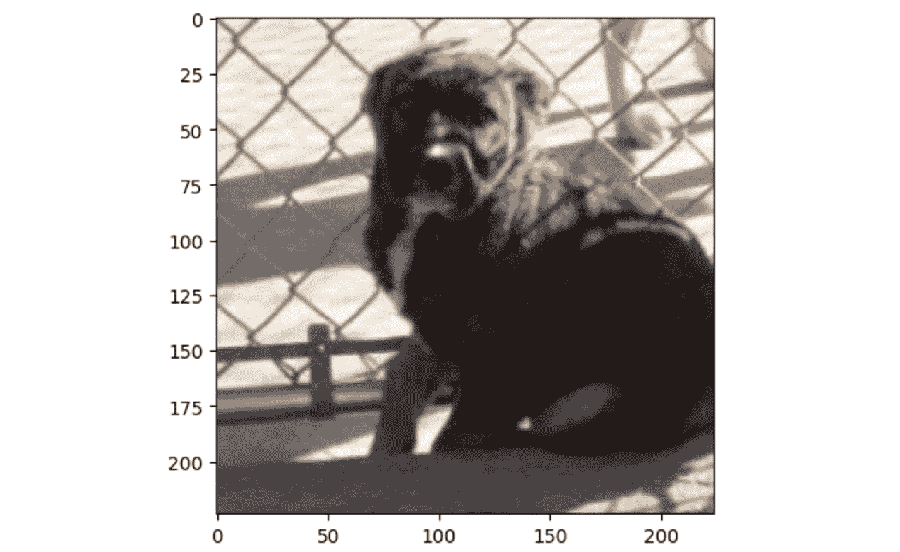

# 第七章：使用迁移学习与微调优化模型

随着模型规模的增大（每层的深度和处理模块数量），训练它们所需的时间呈指数增长，通常为了达到最佳性能，需要更多的训练轮次（epoch）。

因此，**MXNet**通过**GluonCV**和**GluonNLP**库提供了最先进的预训练模型。正如我们在前几章中所见，当我们的最终数据集与所选模型的预训练数据集相似时，这些模型可以帮助我们解决各种问题。

然而，有时候这还不够，最终数据集可能存在一些微妙的差异，预训练模型并未能捕捉到这些差异。在这种情况下，将预训练模型所存储的知识与我们的最终数据集相结合是理想的做法。这就是迁移学习，我们将预训练模型的知识转移到一个新的任务（最终数据集）上。

本章我们将学习如何使用 MXNet Gluon 库中的 GluonCV 和 GluonNLP，分别针对**计算机视觉**（**CV**）和**自然语言处理**（**NLP**）。我们还将学习如何从它们的模型库中获取预训练模型，并通过迁移这些预训练模型的学习成果来优化我们自己的网络。

具体来说，我们将在本章中涵盖以下主题：

+   理解迁移学习与微调

+   提升图像分类性能

+   提升图像分割性能

+   提升从英语翻译到德语的性能

# 技术要求

除了*前言*中指定的技术要求外，以下技术要求适用：

+   确保你已经完成了第一章的食谱，*安装 MXNet、Gluon、GluonCV 和 GluonNLP*，*第一章*，*开始使用 MXNet*。

+   确保你已经完成了*第五章*，*使用计算机视觉分析图像*，以及*第六章*，*理解自然语言处理中的文本*。

本章的代码可以在以下 GitHub 链接中找到：[`github.com/PacktPublishing/Deep-Learning-with-MXNet-Cookbook/tree/main/ch07`](https://github.com/PacktPublishing/Deep-Learning-with-MXNet-Cookbook/tree/main/ch07)。

此外，你可以直接从 Google Colab 访问每个食谱；例如，本章的第一个食谱可以在这里找到：[`colab.research.google.com/github/PacktPublishing/Deep-Learning-with-MXNet-Cookbook/blob/main/ch07/7_1_Understanding_Transfer_Learning_and_Fine_Tuning.ipynb`](https://colab.research.google.com/github/PacktPublishing/Deep-Learning-with-MXNet-Cookbook/blob/main/ch07/7_1_Understanding_Transfer_Learning_and_Fine_Tuning.ipynb)。

# 理解迁移学习与微调

在之前的章节中，我们看到如何利用 MXNet、GluonCV 和 GluonNLP 来检索特定数据集（如 ImageNet、MS COCO 和 IWSLT2015）中的预训练模型，并将它们应用于我们的特定任务和数据集。

在本教程中，我们将介绍一种称为**迁移学习**的方法，它允许我们结合预训练模型（在通用知识数据集上）的信息和新领域的信息（来自我们希望解决的任务数据集）。这种方法有两个主要显著优势。一方面，预训练数据集通常是大规模的（ImageNet-22k 有 1400 万张图像），使用预训练模型可以节省训练时间。另一方面，我们不仅用我们的特定数据集进行评估，还用它来训练模型，在所需的场景中提高其性能。正如我们将发现的那样，这并不总是一种容易的方式来实现，因为它需要能够获得一个可观的数据集，或者甚至一种正确的方式，因为它可能不会产生预期的结果。我们还将探讨迁移学习之后的可选下一步，称为微调，我们将尝试使用我们的特定数据集进一步修改模型参数。我们将对这两种技术进行测试。

## 准备就绪

和之前的章节一样，在本教程中，我们将使用一些矩阵运算和线性代数，但这一点一点也不难。

## 如何做到…

在本教程中，我们将关注以下步骤：

1.  引入迁移学习

1.  描述迁移学习的优势及其使用时机

1.  理解表示学习的基础知识

1.  专注于实际应用

让我们深入了解每一个步骤。

### 引入迁移学习

在之前的章节中，我们学习了如何从头开始训练深度学习神经网络，探索计算机视觉和自然语言处理中的问题。正如在*第三章*中介绍的那样，*解决回归问题*，深度学习神经网络试图模仿我们大脑中的生物网络。一个有趣的观点是，当我们（及我们的大脑）学习新任务时，我们以非常强大的方式利用先前获得的知识。例如，一个非常优秀的网球选手会在几个小时的比赛中成为相对优秀的壁球选手。迁移学习是一个研究领域，其中包含不同的技术，以达到类似于这个例子的结果。


图 7.1 – 传统机器学习（ML）与迁移学习之间的比较

在*图 7.1*中，我们可以看到两种范式的对比，其中迁移学习解决任务 2 的方法利用了在解决任务 1 时获得的知识。然而，这意味着要解决单个目标任务（任务 2），我们需要训练两次模型（分别为任务 1 和任务 2）。实际上，正如我们接下来的步骤所示，我们将使用来自 MXNet 的 GluonCV 和 GluonNLP 模型库中的预训练模型，因此我们只需为任务 2 训练一次模型。

### 描述迁移学习的优势以及何时使用它

使用迁移学习具有多种优势，原因有很多：

+   **更快**：通过利用来自模型库的预训练模型，训练过程会比从头开始训练更快收敛，所需的训练轮次和时间都会大大减少。

+   **更通用**：通常，预训练模型是使用大规模数据集（如 ImageNet）进行训练的，因此学习到的参数（权重）具有广泛的适用性，能够重用于大量任务。这个目标是通过使用大规模数据集训练得到的、既通用又不依赖特定领域的特征提取部分（也称为**表示**）来实现的。

+   **需要更少的数据**：为了将预训练模型适配到新的任务上，所需的数据量远低于从头开始训练该模型架构的数量。这是因为表示（如前述）可以被重用。

+   **更环保**：由于迁移学习所需的训练时间、数据集和计算资源远低于从头开始训练，训练模型所需的污染也大大减少。

+   **性能提升**：已有研究证明（例如，[`www.cv-foundation.org/openaccess/content_cvpr_2014/papers/Oquab_Learning_and_Transferring_2014_CVPR_paper.pdf`](https://www.cv-foundation.org/openaccess/content_cvpr_2014/papers/Oquab_Learning_and_Transferring_2014_CVPR_paper.pdf)）迁移学习在小规模数据集上能带来显著的性能提升，在大规模数据集上，迁移学习能比从头训练更快地达到相同的性能水平。

在*图 7.2*中，分析了计算表示的不同方法，尽管专用网络可以达到更好的性能，但这只有在拥有大规模数据集、高端计算资源和更长训练时间的情况下才能实现。


图 7.2 – 比较不同的表示学习方法

在更广泛的场景下，迁移学习有多种实现方法，如下图所示：


图 7.3 – 不同类型的迁移学习

在*图 7.3*中，我们可以看到不同类型的迁移学习，这取决于源领域和目标领域的相似性以及源领域和目标领域数据的可用性。在本章中，我们将探讨在与我们目标任务相似的领域中使用预训练模型的常见设置（源领域和目标领域相同），并且任务会稍有不同，同时在目标领域有一定量的标注数据（**归纳** **迁移学习**）。

百度首席科学家、Google Brain 的联合创始人 Andrew Ng 在 2016 年 NIPS 的一个教程中说：“*在未来几年，我们将看到通过迁移学习带来大量具体的价值*，”他是对的。

### 理解表示学习的基本原理

在本节中，我们将从更理论的角度回答如何使用迁移学习以及它为何有效的问题。在*第五章*，*使用计算机视觉分析图像*，和*第六章*，*使用自然语言处理理解文本*中，我们介绍了使用 GluonCV 提取图像特征的**表示**概念，以及使用 GluonNLP 提取文本中单词/句子的表示概念。

我们可以在*图 7.4*中回顾 CNN 架构的常见结构：


图 7.4 – 卷积神经网络（CNNs）的复习

在*图 7.5*中，我们可以回顾 Transformer 架构的常见结构：


图 7.5 – Transformer 架构的复习（左侧是编码器，右侧是解码器）

这一基本思想在两个领域中都是共通的；例如，CNN 的特征提取部分和 Transformer 中的编码器就是表示，而这些网络部分的训练被称为**表示学习**，这是一项积极的研究领域，因为它具备在监督和无监督设置下训练这些网络的能力。

迁移学习背后的主要思想是将一个任务中学习到的表示迁移到另一个任务中；因此，我们通常会遵循以下步骤：

1.  从 MXNet 的模型库中获取预训练模型（GluonCV 或 GluonNLP）。

1.  移除最后的层（通常是分类器）。将其他层的参数冻结（在训练过程中不可更新）。

1.  添加新的层（新的分类器），以适应新任务

1.  使用目标数据训练更新后的模型（只有新添加的层是可更新的，其他冻结的层在训练期间不可更新）。

如果我们有足够的标注数据来解决我们想要解决的任务（目标任务），另一个步骤（可以在前一步之后执行，也可以替代前一步）叫做**微调**。

微调考虑到原始学习的表示可能无法完美适应目标任务，因此，通过更新也能得到改进。在这种情况下，步骤如下：

1.  解冻表示网络的权重。

1.  使用目标数据重新训练网络，通常使用较小的学习率，因为表示应该接近（同一领域）。

两个过程（迁移学习和微调）在*图 7.6*中有直观总结。


图 7.6 – 迁移学习与微调

两个过程可以按顺序应用，每个过程都有适当的**超参数**。

### 重点关注实际应用

在本节中，我们将使用到目前为止所学的表示学习内容，并将其应用于一个实际的示例：检测猫和狗。

为此，我们将从**GluonCV 模型库**中检索一个模型；我们将去除分类器（最后的几层），保留特征提取阶段。然后，我们将分析猫和狗的表示是如何被学习的。要加载模型，我们可以使用以下代码片段：

```py
alexnet = gcv.model_zoo.get_model("resnet152_v2", pretrained=True, ctx=ctx)
```

在前面的代码片段中，对于`pretrained`参数，我们已将其赋值为`True`，表示我们希望加载预训练权重（而不仅仅是模型的架构）。

当正确训练时，CNN 会学习训练数据集中图像特征的层次化表示，每一层逐渐学习越来越复杂的模式。因此，当图像被处理时（在连续的层中进行处理），网络能够计算与网络相关的更复杂的模式。

现在，我们可以使用一个新的 MXNet 库，MXBoard（请参阅安装说明中的食谱），使用此模型来评估狗图像经过的不同步骤，并查看一些预训练模型计算其表示的示例：


图 7.7 – 猫与狗的表示 – 卷积滤波器

在*图 7.7*中，我们可以看到对应于 ResNet152 预训练网络（在 ImageNet 上）的第一层卷积层的卷积滤波器。请注意这些滤波器如何专注于简单的模式，如特定的形状（垂直和水平线、圆形等）和特定的颜色（红色斑点）。

让我们用一张特定的图像来分析结果：



图 7.8 – 一只狗的示例图像

我们从*Dogs vs. Cats*数据集中选择一张图像，例如*图 7.8*中描绘的狗。当将这张图像通过我们的网络时，我们将得到类似以下的结果：


图 7.9 – 卷积滤波器输出

在*图 7.9*中，我们可以看到我们狗的示例在*图 7.7*中的过滤器输出。注意不同的输出如何突出显示简单的形状，比如眼睛或腿部（较大的值，接近白色）。

最后，随着图像在网络中传播，它的特征会越来越压缩，最终得到（对于 ResNet152）一个包含 2,048 个元素的向量。这个向量可以通过使用 MXNet 的模型库轻松计算：

```py
resnet152.features(summary_image.as_in_context(ctx))
```

这段代码示例会输出以下结果：

```py
[[2.5350871e-04 2.8519407e-01 1.6196619e-03 ... 7.2884483e-05
  2.9618644e-07 7.8995163e-03]]
 <NDArray 1x2048 @gpu(0)>
```

如我们所见，我们得到了一个`2048`元素。

## 它是如何工作的...

在本篇食谱中，我们介绍了迁移学习和微调的概念。我们解释了何时使用这两种不同技术及其优点。

我们还探讨了这些技术何时有用及其与表征学习的关系，解释了在使用这些技术时，表征在知识转移中的重要作用。我们使用了一个新的库，**MXBoard**，来生成表征的可视化。

此外，我们直观且实践地展示了如何将这些技术应用于计算机视觉和自然语言处理任务，并为一个具体示例计算了表征。

## 还有更多...

迁移学习，包括微调，是一个活跃的研究领域。在这个食谱中，我们仅涵盖了深度学习中最有用的场景——归纳迁移学习。想了解更全面但仍易于阅读的介绍，我推荐阅读*迁移学习：友好的介绍*，可以在以下网址找到：[`journalofbigdata.springeropen.com/articles/10.1186/s40537-022-00652-w`](https://journalofbigdata.springeropen.com/articles/10.1186/s40537-022-00652-w)。

此外，知识从一个系统转移到另一个系统的概念并不新颖，早在 1995 年就有**学习如何学习**和**知识转移**等概念的引用，那时曾有一个关于这个主题的**神经信息处理系统**（**NeurIPS**）研讨会。该研讨会的总结可以在这里找到：http://socrates.acadiau.ca/courses/comp/dsilver/nips95_ltl/nips95.workshop.pdf。

此外，正如 21 年后在同一场合中介绍的，Andrew Ng 正确预见了迁移学习的重要性。他的 2016 年 NeurIPS 教程可以在这里找到（跳转到 1 小时 37 分钟查看迁移学习相关内容）：[`www.youtube.com/watch?v=F1ka6a13S9I`](https://www.youtube.com/watch?v=F1ka6a13S9I)。

# 提升图像分类的性能

在上一篇食谱中介绍了迁移学习和微调后，在本篇中，我们将其应用于**图像分类**，这是一个计算机视觉任务。

在第二个配方中，*使用 MXNet 进行图像分类——GluonCV 模型库，AlexNet 和 ResNet*，在*第五章*，*使用计算机视觉分析图像*，我们已经看到如何使用 GluonCV 检索预训练模型，并直接用于图像分类任务。在第一次的实例中，我们展示了如何从零开始训练模型，实际上仅利用预训练模型的架构，而没有利用任何包含在预训练权重中的过去知识，这些权重已被重新初始化，删除了任何历史信息。之后，预训练模型直接用于任务，实际上也利用了模型的权重/参数。

在这个配方中，我们将把模型的权重/参数与目标数据集结合，应用本章介绍的技术——迁移学习和微调。用于预训练的数据集是`Dogs vs` `Cats`数据集。

## 准备工作

和前面的章节一样，在这个配方中，我们将使用一些矩阵运算和线性代数，但一点也不难。

此外，我们还将处理文本数据集；因此，我们将重新审视在第二个配方中已看到的一些概念，*使用 MXNet 进行图像分类：GluonCV 模型库，AlexNet 和 ResNet*，在*第五章*，*使用计算机视觉分析图像*。

## 如何操作...

在这个配方中，我们将查看以下步骤：

1.  重新审视*ImageNet-1k*和*Dogs vs.* *Cats*数据集

1.  从头开始训练一个**ResNet**模型，使用*Dogs* *vs Cats*数据集

1.  使用预训练的 ResNet 模型，通过迁移学习从*ImageNet-1k*到*Dogs* *vs Cats*优化性能

1.  对*Dogs* *vs Cats*数据集上的预训练 ResNet 模型进行微调

接下来，我们将详细介绍这些步骤。

## 重新审视 ImageNet-1k 和 Dogs vs Cats 数据集

*ImageNet-1k*和*Dogs vs Cats*都是图像分类数据集；然而，它们有很大的不同。*ImageNet-1k*是一个大规模数据集，包含约 120 万张图像，按 1000 个类别进行标签，广泛用于研究和学术界的基准测试。*Dogs vs Cats*是一个小规模数据集，包含 1400 张描绘狗或猫的图像，其知名度主要来自于 2013 年启动的 Kaggle 竞赛。

MXNet GluonCV 不提供直接下载数据集的方法。然而，我们不需要*ImageNet-1k*数据集（它的大小约为 133GB），只需要我们选择的模型的预训练参数。预训练模型可以直接从 MXNet GluonCV 模型库下载，我们在前面的章节中见过例子，在本章中也将再次使用它们。

这是一些来自*ImageNet-1k*的示例：


图 7.10 – ImageNet-1k 示例

上图的来源是[`cs.stanford.edu/people/karpathy/cnnembed/`](https://cs.stanford.edu/people/karpathy/cnnembed/)。

对于*猫狗*数据集，关于如何获取数据集的所有信息都可以在第二个配方中找到，即*使用 MXNet 进行图像分类：GluonCV 模型动物园、AlexNet 和 ResNet*，在*第五章*，*使用计算机视觉分析图像*。根据该配方的代码作为参考，我们可以显示一些示例：


图 7.11 – 猫狗数据集

在*图 7**.10*和*图 7**.11*中，我们可以看到*ImageNet-1k*中的一些图像与*猫狗*数据集中的一些图像相似。

### 从头开始训练一个 ResNet 模型，使用猫狗数据集

如第二个配方中所述，*使用 MXNet 进行图像分类：GluonCV 模型动物园、AlexNet 和 ResNet*，在*第五章*，*使用计算机视觉分析图像*，我们将使用**softmax 交叉熵**作为损失函数，以及**accuracy**和**混淆矩阵**作为评估指标。

我们使用 ResNet 模型进行训练的演变如下：


图 7.12 – ResNet 训练演变（训练损失和验证损失，以及验证精度）– 从头开始训练

此外，在最佳迭代中，测试集中得到的`accuracy`值如下：

```py
('accuracy', 0.75)
```

混淆矩阵如下：


图 7.13 – 从头开始训练的 ResNet 模型在猫狗数据集中的混淆矩阵

在经过多次训练（例如，100 次）后，获得的准确度值（75%）和*图 7**.13*显示出相当平均的性能。鼓励您运行自己的实验，尝试不同的超参数设置。

定性上，我们还可以检查我们的模型在一个示例图像中的表现。在我们的案例中，我们选择了以下内容：


图 7.14 – 猫狗定性示例，具体为猫

我们可以通过以下代码片段运行这张图像，检查我们模型的输出：

```py
# Qualitative Evaluation
# Qualitative Evaluation
# Expected Output
print("Expected Output:", example_label)
# Model Output
example_output = resnet50_ft(example_image_preprocessed)
 class_output = np.argmax(example_output, axis=1).asnumpy()[0]
 print("Class Output:", class_output)
assert class_output == 0 # Cat 0
```

这些代码语句将给出以下输出：

```py
Expected Output: 0
Class Output: 0
```

如结果所示，图像已正确分类为猫。

### 使用预训练的 ResNet 模型，通过从 ImageNet-1k 到猫狗数据集的迁移学习来优化性能

在前面的配方中，我们使用我们的数据集从头开始训练了一个新模型。然而，这有两个重要的缺点：

+   从头开始训练需要大量的数据。

+   由于数据集的大尺寸和模型学习任务所需的周期数，训练过程可能需要很长时间。

因此，在这个食谱中，我们将采取不同的方法：我们将使用来自 MXNet GluonCV 的预训练模型来解决任务。这些模型已经在 *ImageNet-1k* 数据集上训练过，该数据集包含我们感兴趣的类别（猫和狗）；因此，我们可以利用这些学到的特征，并轻松将其迁移到 *Dogs vs Cats*（相同领域）。

对于 ResNet 模型，使用以下代码：

```py
# ResNet50 from Model Zoo (This downloads v1d)
 resnet50 = gcv.model_zoo.get_model("resnet50_v1d", pretrained=True, ctx=ctx)
```

如我们在前面的代码段中看到的，按照本章第一个食谱《理解迁移学习和微调》中的讨论，对于 `pretrained` 参数，我们已将其值设置为 `True`，表示我们希望获取预训练权重（而不仅仅是模型的架构）。

为了充分评估迁移学习带来的改进，我们将在应用迁移学习到 *Dogs vs Cats* 数据集之前和之后，直接评估我们的预训练模型（源任务是 *ImageNet-1k*）。因此，使用我们当前的预训练模型，我们得到如下结果：

```py
('accuracy', 0.925)
```

混淆矩阵如下：


图 7.15 – 在预训练 ResNet 模型下，Dogs vs Cats 数据集的混淆矩阵

如我们所见，我们的预训练 Transformer 模型在同一领域下已经显示出良好的表现；然而，单纯使用预训练模型并不能比从零开始训练获得更好的表现。使用预训练模型的巨大优势在于节省时间，因为加载它只需要几行代码。

我们还可以通过相同的图像示例检查模型的定性表现。注意代码与之前的定性图像摘录有所不同，因为现在我们需要将 ImageNet 类别（即我们的预训练 ResNet50 模型的输出）转换为我们的类别（`0` 代表猫，`1` 代表狗）。新的代码如下所示：

```py
# Qualitative Evaluation
# Expected Output
print("Expected Output:", example_label)
# Model Output
example_output = resnet50(example_image_preprocessed)
class_output = model.CLASSES_DICT[np.argmax(example_output, axis=1).asnumpy()[0]]
print("Class Output:", class_output)
assert class_output == 0 # Cat
```

这些代码语句将会给我们以下输出：

```py
Expected Output: 0
Class Output: 0
```

从结果中可以看出，该图像已被正确分类为猫。

现在我们有了一个基准进行比较，让我们将迁移学习应用到我们的任务中。从第一个食谱《理解迁移学习和微调》中，第一步是从 MXNet 模型库（GluonCV 或 GluonNLP）中获取一个预训练的模型，这一步我们已经完成。

第二步是移除最后一层（通常是分类器），保持其他层的参数被冻结（在训练过程中不可更新），所以让我们开始吧！

我们可以用以下代码段替换分类器：

```py
# Replace the classifier (with gradients activated)
 resnet50_tl.fc = mx.gluon.nn.Dense(2)
 resnet50_tl.fc.initialize(ctx=ctx)
```

我们可以通过以下代码段来冻结 ResNet 特征提取层：

```py
for param in resnet50_tl.collect_params().values():
param.grad_req = 'null'
```

我们可以用以下代码段替换分类器：

```py
# Replace the classifier (with gradients activated)
 resnet50_tl.fc = mx.gluon.nn.Dense(2)
 resnet50_tl.fc.initialize(ctx=ctx)
```

现在，我们可以应用通常的训练过程来处理 *Dogs vs Cats* 数据集，并且我们在使用 ResNet 模型的训练中有了以下进展：


图 7.16 – ResNet 训练演变（训练损失和验证损失）– 迁移学习

此外，对于最佳迭代，测试集上的准确率如下：

```py
('accuracy', 0.985)
```

混淆矩阵如下：


图 7.17 – 使用迁移学习的 ResNet 模型在狗与猫数据集上的混淆矩阵

与我们之前从头开始训练的实验相比，这个实验的表现大大提高，并且我们只用了几分钟就让这个模型开始在我们期望的任务中表现良好，而之前的实验需要几个小时，并且需要多次调整超参数，这可能会转化为几天的工作。

我们还可以使用相同的图像示例和代码来定性地检查我们的模型表现。输出结果如下：

```py
Expected Output: 0
Class Output: 0
```

从结果可以看出，图像已经被正确分类为猫。

### 在狗与猫数据集上微调我们的预训练 ResNet 模型

在之前的步骤中，我们*冻结*了编码器层中的参数。然而，由于我们当前使用的数据集（*狗与猫*）样本足够多，我们可以*解冻*这些参数并训练模型，从而有效地让新的训练过程更新表示（在迁移学习中，我们直接使用了为*ImageNet-1k*学到的表示）。这个过程叫做微调。

微调有两种变体：

+   通过冻结层并在之后解冻（迁移学习后的微调）来应用迁移学习

+   直接应用微调，而没有冻结层的预处理步骤（直接微调）

让我们计算这两个实验并通过比较结果得出结论。

对于第一个实验，我们可以取之前步骤中获得的网络，解冻层并重新开始训练。在 MXNet 中，要解冻编码器参数，我们可以运行以下代码片段：

```py
# Un-freeze weights
for param in resnet50_ft.collect_params().values():
    if param.name in updated_params:
        param.grad_req = 'write'
```

现在，我们可以应用常规的训练过程与*狗与猫*数据集，并且我们在使用 ResNet 模型进行训练时，得到了以下演变：


图 7.18 – ResNet 训练演变（训练损失和验证损失）– 迁移学习后的微调

此外，对于最佳迭代，测试集上的准确率如下：

```py
('accuracy', 0.90255)
```

混淆矩阵如下：


图 7.19 – 使用迁移学习后微调的 ResNet 模型在狗与猫数据集上的混淆矩阵

与我们之前的迁移学习实验相比，这次实验的表现更差。这是由于数据集的大小和选择的超参数组合。鼓励你尝试自己的实验。

我们还可以使用相同的图像示例和代码，定性地检查我们的模型表现如何。输出如下所示：

```py
 Expected Output: 0
Class Output: 0
```

从结果可以看出，图像已被正确分类为猫。

现在让我们继续进行第二次微调实验，这次我们不采用迁移学习，而是直接对整个模型进行微调（没有冻结层）。

我们需要再次获取为*ImageNet-1k*预训练的 ResNet 模型，MXNet GluonCV 的代码片段如下：

```py
# ResNet50 from Model Zoo (This downloads v1d)
 resnet50 = gcv.model_zoo.get_model("resnet50_v1d", pretrained=True, ctx=ctx)
```

现在，我们可以在没有冻结层的情况下应用训练过程，这将更新我们 ResNet 模型的所有层，得到如下的损失曲线：


图 7.20 – ResNet 训练过程（训练损失与验证损失）– 微调且未冻结层

此外，对于最佳迭代，在测试集上获得的准确率如下：

```py
('accuracy', 0.98)
```

这个值与之前迁移学习实验的结果相似。对于混淆矩阵，结果如下：


图 7.21 – ResNet 模型在狗与猫分类中的混淆矩阵，采用微调且未冻结层

如前所述，与我们之前的微调实验相比，我们可以看到这次实验的性能更高。根据经验，这已被证明是一个可重复的结果，且被认为是因为最初冻结编码器允许解码器（使用编码器表示）学习当前的新任务。从信息流的角度来看，在这一步骤中，知识从特征提取阶段转移到了分类器。在第二步中，当特征提取阶段解冻时，分类器中学到的参数执行辅助的迁移学习——这次是从分类器到特征提取阶段。

我们还可以使用相同的图像示例和代码，定性地检查我们的模型表现如何。输出如下所示：

```py
Expected Output: 0
Class Output: 0
```

从结果可以看出，图像已被正确分类为猫。

## 它的工作原理是…

在这个配方中，我们将第一个章节开头介绍的迁移学习和微调技术应用于图像分类任务，这个任务在第二个配方中也有呈现，名为*使用 MXNet 分类图像：GluonCV 模型库、AlexNet 和 ResNet*，*第五章*，*计算机视觉下的图像分析*。

我们重新访问了两个已知的数据集，*ImageNet-1k* 和 *Dogs vs Cats*，并打算结合这两个数据集，基于前者数据集的知识转移，并用后者对该知识进行微调。此外，这是通过利用 MXNet GluonCV 提供的工具实现的：

+   为 *ImageNet-1k* 提供的预训练 ResNet 模型

+   便于访问的工具，用于*狗* *与猫* 数据集

此外，我们继续使用用于图像分类的损失函数和指标，包括 softmax 交叉熵、准确率和混淆矩阵。

有了 MXNet 和 GluonCV 中这些随时可用的工具，我们只需几行代码就能运行以下实验：

+   从零开始训练 *Dogs* *vs Cats* 中的模型

+   使用预训练模型，通过从 *ImageNet-1k* 到 *Dogs* *vs Cats* 的转移学习优化性能

+   在 *Dogs vs Cats* 数据集上微调我们的预训练模型（包括和不包括冻结层）

在进行不同实验后，我们直接获得了转移学习与微调之间的有效联系（准确率分别为 0.985 和 0.98）。实际运行这些实验时，结果可能会根据模型架构、数据集和选择的超参数有所不同，因此建议大家尝试不同的技术和变种。

## 还有更多…

转移学习，包括微调，是一个活跃的研究领域。一篇 2022 年发布的论文探讨了图像分类领域的最新进展。该论文标题为《深度转移学习用于图像分类：一项综述》，可以在此查阅：[`www.researchgate.net/publication/360782436_Deep_transfer_learning_for_image_classification_a_survey`](https://www.researchgate.net/publication/360782436_Deep_transfer_learning_for_image_classification_a_survey)。

关于计算机视觉应用案例的更一般方法，最近发布了一篇论文《转移学习方法作为解决小数据集计算机视觉任务的新方法》，该论文评估了小数据集的问题，并应用这些技术解决医学影像任务。可以在此查阅：[`www.researchgate.net/publication/344943295_Transfer_Learning_Methods_as_a_New_Approach_in_Computer_Vision_Tasks_with_Small_Datasets`](https://www.researchgate.net/publication/344943295_Transfer_Learning_Methods_as_a_New_Approach_in_Computer_Vision_Tasks_with_Small_Datasets)。

# 提高图像分割性能

在本配方中，我们将应用转移学习和微调来进行**语义分割**，这是一个计算机视觉任务。

在第四个配方中，*使用 MXNet 进行图像对象分割：PSPNet 与 DeepLab-v3*，在*第五章* *使用计算机视觉分析图像* 中，我们展示了如何使用 GluonCV 直接获取预训练模型并将其用于语义分割任务，通过使用预训练模型的架构和权重/参数，充分利用过去的知识。

在本教程中，我们将继续利用模型的权重/参数，用于一个任务，该任务包括使用语义分割模型在一组 21 类图像中对图像进行分类。用于预训练的数据集是*MS COCO*（源任务），我们将运行多个实验来评估我们的模型在一个新的（目标）任务中的表现，使用*Penn-Fudan Pedestrian*数据集。在这些实验中，我们还将包含来自目标数据集的知识，以提高我们的语义分类性能。

## 准备工作

至于之前的章节，在本教程中，我们将使用一些矩阵操作和线性代数，但这一点也不难。

此外，我们将使用文本数据集；因此，我们将重新讨论第四篇教程中已经见过的一些概念，*MXNet 中图像分割：PSPNet 和 DeepLab-v3*，在*第五章*，*计算机视觉中的图像分析*。

## 如何做…

在本教程中，我们将看到以下步骤：

1.  重新审视*MS COCO*和*Penn-Fudan Pedestrian*数据集

1.  使用*Penn-Fudan Pedestrian*从头开始训练**DeepLab-v3**模型

1.  使用预训练的 DeepLab-v3 模型通过从*MS COCO*到*Penn-Fudan Pedestrian*的迁移学习来优化性能。

1.  在*Penn-Fudan Pedestrian*上微调我们预训练的 DeepLab-v3 模型

让我们详细看一下接下来的步骤。

### 重新审视 MS COCO 和 Penn-Fudan Pedestrian 数据集

*MS COCO*和*Penn-Fudan Pedestrian*都是目标检测和语义分割数据集；然而，它们有很大的不同。*MS COCO*是一个大规模数据集，包含约 150,000 张图像，标记为 80 类（21 个主要类），并且在研究和学术界广泛应用于基准测试。*Penn-Fudan Pedestrian*是一个小规模数据集，包含 170 张图像和 423 名行人。在本教程中，我们将专注于语义分割任务。

MXNet GluonCV 不提供直接下载任何数据集的方法。然而，我们不需要*MS COCO*数据集（其大小约为 19 GB），只需要选择模型的预训练参数。

这里有一些*MS COCO*的例子：


图 7.22 – MS COCO 示例

对于*Penn-Fudan Pedestrian*，关于如何获取数据集的所有信息可以在第四篇教程中找到，*MXNet 中图像分割：PSPNet 和 DeepLab-v3*，在*第五章*，*计算机视觉中的图像分析*。参考该篇教程的代码，我们可以展示一些例子：


图 7.23 – Penn-Fudan Pedestrian 数据集示例

从*图 7.22*和*图 7.23*，我们可以看到一些*MS COCO*图像与*Penn-Fudan Pedestrian*的图像相似。

### 使用 Penn-Fudan Pedestrian 从头开始训练 DeepLab-v3 模型

正如在第四个示例中所述，*使用 MXNet 对图像进行分割：PSPNet 和 DeepLab-v3*，在 *第五章*，*使用计算机视觉分析图像* 中，我们将使用 softmax 交叉熵作为损失函数，并使用像素准确率和 **平均交并比**（**mIoU**）作为评估指标。

按照我们示例中的代码，我们得到了以下从头开始训练 *DeepLab-v3* 模型时的演变：


图 7.24 – DeepLab-v3 训练演变（训练损失和验证损失）– 从头开始训练

此外，对于最佳迭代，测试集中的像素准确率和 mIoU 值如下：

```py
PixAcc:  0.8454046875
mIoU  :  0.6548404063890942
```

即使训练了 40 个周期，评估结果仍未显示出强劲的性能（mIoU 值仅为 0.65）。

定性地，我们还可以通过一个示例图像来检查模型的表现。在我们的案例中，我们选择了以下图像：


图 7.25 – Penn-Fudan 行人数据集的图像示例，用于定性结果

我们可以通过以下代码片段将此图像传入模型来检查模型的输出：

```py
# Compute and plot prediction
transformed_image = gcv.data.transforms.presets.segmentation.test_transform(test_image, ctx)
 output = deeplab_ts(transformed_image)
 filtered_output = mx.nd.argmax(output[0], 1)
 masked_output = gcv.utils.viz.plot_mask(test_image, filtered_output)
 axes = fig.add_subplot(1, 2, 2)
 axes.set_title("Prediction", fontsize=16, y=-0.3)
 axes.axis('off')
 axes.imshow(masked_output);
```

上述代码片段展示了真实标签的分割结果和我们模型的预测结果：


图 7.26 – 从头开始训练的 DeepLab-v3 的真实标签与预测

从结果可以看出，行人只有在较晚阶段才开始被正确分割。为了改善结果，我们需要训练更多的周期和/或调整超参数。然而，一个更好、更快、更简单的方法是使用迁移学习并进行微调。

### 使用预训练的 DeepLab-v3 模型，通过从 MS COCO 到 Penn-Fudan 行人的迁移学习优化性能

在前一个示例中，我们使用自己的数据集从头开始训练了一个新模型。然而，这种方法有三个重要的缺点：

+   从头开始训练需要大量的数据。

+   由于数据集的庞大和模型需要的训练周期数，训练过程可能会耗时很长。

+   所需的计算资源可能会非常昂贵或难以获取。

因此，在本示例中，我们将采用不同的方法。我们将使用来自 MXNet GluonCV 模型库的预训练模型来解决任务。这些模型已经在 *MS COCO* 数据集上训练过，包含我们感兴趣的类别（在本案例中是 `person`）；因此，我们可以使用这些学到的表示，并轻松地将它们迁移到 *Penn-Fudan 行人*（同一领域）。

对于 DeepLab-v3 模型，我们有以下内容：

```py
# DeepLab-v3 from Model Zoo
deeplab_pt
gcv.model_zoo.get_model('deeplab_resnet101_coco'
pretrained=True, ctx=ctx)
```

正如我们在前面的代码片段中看到的，按照本章第一个食谱中讨论的内容，*理解迁移学习和微调*，对于 `pretrained` 参数，我们已将其值设置为 `True`，表示我们希望获取预训练的权重（而不仅仅是模型的架构）。

为了充分评估迁移学习带来的改进，我们将直接在我们的目标任务中评估预训练模型（任务源自*MS COCO*），然后再将迁移学习应用到*Penn-Fudan Pedestrian*，并对比应用前后的结果。因此，使用我们当前的预训练模型，我们获得了以下结果：

```py
PixAcc:  0.9640322916666667
mIoU  :  0.476540873665686
```

如我们所见，我们的预训练 Transformer 模型在相同领域中已经显示出良好的性能值。此外，使用预训练模型的巨大优势是节省时间，因为加载预训练模型只需要几行代码。

我们还可以通过相同的图像示例和代码检查模型的定性表现。输出结果如下：


图 7.27 – DeepLab-v3 预训练模型的真实值与预测值

从结果中可以看出，行人已被正确地分割。请注意，使用预训练模型的一个附加优点见于*图 7.27*：在真实值图像中，背景中的人没有被分割，但预训练模型正确地识别了它们（这可能解释了较低的 mIoU 值）。

现在我们有了一个比较基准，让我们将迁移学习应用于我们的任务。在第一个食谱中，*理解迁移学习和微调*，第一步是从 MXNet Model Zoo（GluonCV 或 GluonNLP）中获取预训练模型，而这一部分我们已经完成。

第二步是移除最后的几层（通常是分类器），并保持其余层的参数冻结（在训练过程中不可更新），所以让我们开始吧！

我们可以通过以下代码片段冻结*DeepLab-v3*的特征提取层：

```py
for param in deeplab_tl.collect_params().values():
param.grad_req = 'null'
```

此外，我们还需要替换分割任务头。以前，它支持来自*MS COCO*的 21 类。对于我们的实验，两个类别就足够了，`background` 和 `person`。这可以通过以下代码片段完成：

```py
# Replace the last layers
deeplab_tl.head = gcv.model_zoo.deeplabv3._DeepLabHead(2)
deeplab_tl.head.initialize(ctx=ctx)
deeplab_tl.head.collect_params().setattr('lr_mult', 10)
```

现在，我们可以使用*Penn-Fudan Pedestrian*应用常规的训练过程，并且我们使用*DeepLab-v3*模型时，训练演化如下：


图 7.28 – DeepLab-v3 训练演化（训练损失和验证损失）– 迁移学习

此外，对于最佳迭代，测试集中的评估指标如下所示：

```py
PixAcc:  0.9503427083333333
mIoU  :  0.8799470898171042
```

与我们之前从头开始训练和预训练的实验相比，这个实验的表现略好，而且我们花费了几分钟就让这个模型开始在我们预定的任务上工作，而从头开始训练的实验则花费了数小时，并且需要多次尝试调整超参数，最终耗费了几天的时间。

我们还可以通过相同的图像示例和代码检查模型的定性表现。输出结果如下：


图 7.29 – 经过转移学习的 DeepLab-v3 预训练模型的真实标签与预测结果

从结果可以看出，行人已经被正确地分割。

### 在 Penn-Fudan 行人数据集上对我们预训练的 DeepLab-v3 模型进行微调

在之前的配方中，我们*冻结*了编码器层中的参数。然而，在我们当前使用的数据集（*Penn-Fudan 行人数据集*）中，我们可以*解冻*这些参数并训练模型，从而有效地使新的训练过程更新表示（在转移学习中，我们直接使用了为 *MS COCO* 学习到的表示）。如本章所介绍的，这个过程被称为微调。

微调有两种变体：

+   通过冻结层并随后解冻层来应用转移学习。

+   直接应用微调，而不进行冻结层的预备步骤。

让我们计算两个实验并通过比较结果得出结论。

对于第一个实验，我们可以使用之前配方中获得的网络，解冻层并重新开始训练。在 MXNet 中，要解冻编码器参数，可以运行以下代码片段：

```py
for param in deeplab_ft.collect_params().values():
param.grad_req = 'write'
```

现在，我们可以应用常规的训练过程来训练 *Penn-Fudan 行人数据集*，并且在使用 *DeepLab-v3* 模型时，我们有以下训练演变：


图 7.30 – DeepLab-v3 训练过程演变（训练损失和验证损失）– 转移学习后的微调

此外，对于最佳迭代，在测试集上获得的评估指标如下：

```py
PixAcc:  0.9637550347222222
mIoU  :  0.9091450223893902
```

与我们之前在转移学习中的实验相比，这个实验在 mIoU 上的表现提高了约 3%，考虑到投入的训练时间较少，这是一个非常好的提升。

我们还可以通过相同的图像示例和代码检查模型的定性表现。输出结果如下：


图 7.31 – 经过微调后的 DeepLab-v3 预训练模型的真实标签与预测结果

从结果可以看出，行人已经被正确地分割。

现在让我们继续进行第二次微调实验，在此实验中，我们不应用迁移学习（没有冻结层），而是直接对整个模型应用微调。

我们需要检索用于*MS COCO*的预训练*DeepLab-v3*模型，以下是 MXNet GluonCV 的代码片段：

```py
# DeepLab-v3 from Model Zoo
 deeplab_ft_direct = gcv.model_zoo.get_model("deeplab_resnet101_coco", pretrained=True, ctx=ctx)
```

现在，我们可以在不冻结的情况下应用训练过程，这将更新我们*DeepLab-v3*模型的所有层：


图 7.32 – DeepLab-v3 训练演变（训练损失和验证损失） – 未冻结的微调

此外，对于最佳迭代，在测试集上获得的评估指标如下：

```py
PixAcc:  0.9639182291666667
mIoU  :  0.9095065032946663
```

与我们之前的微调实验相比，我们可以看到这些实验表现出非常相似的性能。根据经验，已经证明这个微调实验可能会略微降低结果，因为最初冻结编码器使解码器能够使用编码器表示学习当前任务。从某种角度看，在这一步，知识从编码器传递到解码器。在第二步中，当编码器被解冻时，解码器中学习到的参数执行辅助迁移学习，这次是从解码器到编码器。

我们还可以通过相同的图像示例和代码来检查我们的模型在定性上的表现。输出如下：


图 7.33 – DeepLab-v3 预训练模型的真实标签与预测（未冻结的微调）

从结果可以看出，行人已经被正确分割，尽管如前所述，如果我们看右侧的那个人，靠近左侧那个人的手臂可能会被更好地分割。如前所讨论，有时这种微调版本的结果可能会略低于其他方法。

## 它是如何工作的……

在这个方案中，我们将本章开头介绍的迁移学习和微调技术应用于图像分类任务，这在之前的第四个方案中也有呈现，*使用 MXNet 进行图像对象分割：PSPNet 和 DeepLab-v3*，位于*第五章*，*使用计算机视觉分析图像*。

我们重新访问了两个已知的数据集，*MS COCO*和*Penn-Fudan Pedestrian*，我们打算通过基于前者数据集的知识迁移，并利用后者对该知识进行优化来将它们结合起来。此外，MXNet GluonCV 提供了以下内容：

+   用于*MS COCO*的预训练*DeepLab-v3*模型

+   用于便捷访问*Penn-Fudan Pedestrian*的工具

此外，我们继续使用为语义分割引入的损失函数和指标，如 softmax 交叉熵、像素准确率和 mIoU。

在 MXNet 和 GluonCV 中，所有这些工具都已经预先准备好，这使得我们只需几行代码就能进行以下实验：

+   使用*Penn-Fudan Pedestrian*从零开始训练模型

+   使用预训练模型通过迁移学习从*MS COCO*到*Penn-Fudan Pedestrian*优化性能

+   在*Penn-Fudan Pedestrian*上微调我们的预训练模型（包括冻结和不冻结层的情况）

经过不同实验的运行，并结合定性结果和定量结果，迁移学习（像素准确率为 0.95，mIoU 为 0.88）已经成为我们任务中最佳的实验方法。实际运行这些实验时获得的结果可能会因为模型架构、数据集和所选择的超参数而有所不同，因此我们鼓励你尝试不同的技术和变化。

## 还有更多……

迁移学习，包括微调，是一个活跃的研究领域。2022 年发布的一篇论文探讨了图像分类的最新进展。该论文题为*Deep Transfer Learning for Image Classification: A survey*，可以在这里找到：[`www.researchgate.net/publication/360782436_Deep_transfer_learning_for_image_classification_a_survey`](https://www.researchgate.net/publication/360782436_Deep_transfer_learning_for_image_classification_a_survey)。

一篇有趣的论文将迁移学习和语义分割结合起来，题为*Semantic Segmentation with Transfer Learning for Off-Road Autonomous Driving*，在这篇论文中，也通过使用合成数据研究了领域的变化。可以在这里找到：[`www.researchgate.net/publication/333647772_Semantic_Segmentation_with_Transfer_Learning_for_Off-Road_Autonomous_Driving`](https://www.researchgate.net/publication/333647772_Semantic_Segmentation_with_Transfer_Learning_for_Off-Road_Autonomous_Driving)。

这篇论文提供了更一般的概述：*Learning Transferable Knowledge for Semantic Segmentation with Deep Convolutional Neural Network*，该论文被**计算机视觉与模式识别**（**CVPR**）大会于 2016 年接收。可以在这里找到：[`openaccess.thecvf.com/content_cvpr_2016/papers/Hong_Learning_Transferrable_Knowledge_CVPR_2016_paper.pdf`](https://openaccess.thecvf.com/content_cvpr_2016/papers/Hong_Learning_Transferrable_Knowledge_CVPR_2016_paper.pdf)。

# 改进英德翻译的性能

在之前的示例中，我们已经看到如何利用预训练模型和新数据集进行迁移学习和微调，应用于计算机视觉任务。在本示例中，我们将采用类似的方法，但针对一个自然语言处理任务，即从英语翻译成德语。

在第四个食谱中，*从越南语翻译到英语*，来自*第六章*，*理解文本与自然语言处理*，我们看到如何使用 GluonNLP 直接检索预训练的模型，并将它们用于翻译任务，从头开始训练，实际上只是通过使用预训练模型的架构来有效地利用过去的知识。

在本食谱中，我们还将利用模型的权重/参数，这些权重/参数是通过机器翻译模型用于将英文文本翻译成德文的任务获得的。我们将使用*WMT2014*数据集（任务来源）进行预训练，并将进行多个实验，使用*WMT2016*数据集（增加了约 20%的德英对词汇和句子）评估我们在新目标任务中的模型。

## 准备工作

和之前的章节一样，在本食谱中，我们将使用一些矩阵运算和线性代数，但这并不难。

此外，我们将处理文本数据集；因此，我们将重新审视在第四个食谱中已经看到的一些概念，*理解文本数据集——加载、管理和可视化 Enron 邮件数据集*，来自*第二章*，*使用 MXNet 和可视化数据集：Gluon* *和 DataLoader*。

## 如何操作...

在本食谱中，我们将查看以下步骤：

1.  介绍*WMT2014*和*WMT2016*数据集

1.  从头开始训练一个 Transformer 模型，使用*WMT2016*数据集

1.  使用预训练的 Transformer 模型，通过迁移学习将性能从*WMT2014*优化到*WMT2016*

1.  在*WMT2016*上微调我们预训练的 Transformer 模型

接下来我们将详细查看这些步骤。

### 介绍 WMT2014 和 WMT2016 数据集

*WMT2014*和*WMT2016*是多模态（多语言）翻译数据集，包括中文、英语和德语语料库。*WMT2014*首次在 2014 年《第九届统计机器翻译研讨会论文集》上介绍，作为翻译模型评估活动的一部分。该研讨会在 2016 年升级为自己的会议，并在《第一次机器翻译会议论文集》中介绍了*WMT2016*，作为翻译模型评估活动的一部分。这两个数据集非常相似，都是从新闻来源中提取信息，最大的区别在于语料库（两个数据集所用词汇量的大小）。WMT2014 大约包含~14 万个不同的词，而 WMT2016 略大，包含~15 万个词，特别是在德英对中，增加了约 20%的词汇和句子。

MXNet GluonNLP 提供了这些数据集的现成版本。在我们的案例中，我们将使用*WMT2016*，它仅包含*train*和*test*划分。我们将进一步拆分测试集，获得*validation*和*test*划分。以下是加载数据集的代码：

```py
# WMT2016 Dataset (Train, Validation and Test)
# Dataset Parameters
src_lang, tgt_lang = "en", "de"
src_max_len, tgt_max_len = 50, 50
 wmt2016_train_data = nlp.data.WMT2016BPE(
    'train',
 src_lang=src_lang,
    tgt_lang=tgt_lang)
wmt2016_val_data = nlp.data.WMT2016BPE(
    'newstest2016',
    src_lang=src_lang,
    tgt_lang=tgt_lang)
wmt2016_test_data = nlp.data.WMT2016BPE(
    'newstest2016',
    src_lang=src_lang,
    tgt_lang=tgt_lang)
```

以下是生成*validation*和*test*划分的代码：

```py
 # Split Val / Test sets
val_length = 1500
test_length = len(wmt2016_test_text) - val_length
wmt2016_val_data._data[0] = wmt2016_val_data._data[0][:val_length]
 wmt2016_val_data._data[1] = wmt2016_val_data._data[1][:val_length]
 wmt2016_val_data._length = val_length
wmt2016_val_text._data[0] = wmt2016_val_text._data[0][:val_length]
 wmt2016_val_text._data[1] = wmt2016_val_text._data[1][:val_length]
 wmt2016_val_text._length = val_length
wmt2016_test_data._data[0] = wmt2016_test_data._data[0][-test_length:]
 wmt2016_test_data._data[1] = wmt2016_test_data._data[1][-test_length:]
 wmt2016_test_data._length = test_length
```

在分割后，我们的*WMT2016*数据集提供以下数据：

```py
 Length of train set: 4500966
Length of val set  : 1500
Length of test set : 1499
```

从每个数据集上大量的实例中，我们可以确认这些数据集适合用于我们的实验。

### 在 WMT2016 中从零开始训练一个 Transformer 模型

如第四章所述，*从越南语翻译到英语*，在*第六章*，*使用自然语言处理理解文本*中，我们将使用**困惑度**进行*每批次计算*，并使用**BLEU**进行*每轮计算*，这些将展示我们的训练过程演变，作为典型的训练和验证损失的一部分。我们还将它们用于定量评估，对于定性评估，我们将选择一个句子（也可以使用任何你想出的其他句子）。

我们在使用 Transformer 模型进行训练时有以下演变：


图 7.34 – Transformer 训练演变（训练损失）– 从零开始训练

此外，对于最佳迭代，测试集中的损失、困惑度和 BLEU 得分（乘以 100）如下：

```py
 WMT16 test loss: 3.01; test bleu score: 14.50
```

当前**最先进的技术**（**SOTA**）模型的 BLEU 得分可以超过 30 分；我们在 10 个 epoch 后大约达到一半，在大约 30 个 epoch 后达到 SOTA 性能。

从质量上讲，我们也可以通过一个句子示例检查我们的模型表现如何。在我们的案例中，我们选择了：`"I learn new things every day"`，可以通过以下代码进行验证：

```py
print("Qualitative Evaluation:  Translating from English to German")
# From Google Translate
expected_tgt_seq = " Ich lerne jeden Tag neue Dinge."
 print("Expected translation:")
 print(expected_tgt_seq)
src_seq = "I learn new things every day."
 print("In English:")
 print(src_seq)
translation_out = nmt.utils.translate(
     transformer_ts_translator,
    src_seq,
     wmt_src_vocab,
    wmt_tgt_vocab,
    ctx)
print("The German translation is:")
 print(" ".join(translation_out[0]))
```

这些代码语句将给我们以下输出：

```py
Qualitative Evaluation: Translating from English to German
Expected translation:
 Ich lerne jeden Tag neue Dinge.
 In English:
 I learn new things every day.
 The German translation is:
 Ich halte es für so , dass es hier so ist.
```

这句德语意味着*我认为这里是这种情况*；因此，从这个结果可以看出，文本没有正确地从英语翻译成德语，我们需要投入更多的时间来训练，才能获得正确的结果。

### 使用预训练的 Transformer 模型，通过将 WMT2014 转移到 WMT2016 进行优化，从而提升性能。

在前一章中，我们使用自己的数据集从零开始训练了一个新模型。然而，这有两个重要的缺点：

+   从零开始训练需要大量的数据。

+   由于数据集的庞大规模和模型需要的训练轮数，训练过程可能会非常漫长。

因此，在本章中，我们将采用不同的方法。我们将使用 MXNet GluonNLP 中的预训练模型来解决该任务。这些模型已经在与*WMT2014*非常相似的数据集上进行训练，因此为该任务学习到的表示可以很容易地迁移到*WMT2016*（同一领域）。

对于一个 Transformer 模型，我们有如下内容：

```py
 wmt_model_name = 'transformer_en_de_512'
wmt_transformer_model_pt, wmt_src_vocab, wmt_tgt_vocab = nlp.model.get_model(
    wmt_model_name,
    dataset_name='WMT2014',
    pretrained=True,
    ctx=ctx)
print('Source Vocab:', len(wmt_src_vocab), ', Target Vocab:', len(wmt_tgt_vocab))
```

输出展示了*WMT2014*数据集的词汇表大小（预训练的英德翻译任务）：

```py
Source Vocab: 36794 , Target Vocab: 36794
```

这是*WMT2014*数据集的一个子集。正如我们在前面的代码片段中所看到的，按照本章第一个配方*理解迁移学习和微调*中的讨论，对于`pretrained`参数，我们已将其值设置为`True`，表示我们希望检索预训练的权重（而不仅仅是模型的架构）。

为了充分评估迁移学习带来的改进，我们将直接评估我们的预训练模型（任务源是*WMT2014*）在应用迁移学习到*WMT2016*之前和之后的表现。因此，直接使用我们的预训练模型，我们得到以下结果：

```py
 WMT16 test loss: 1.59; test bleu score: 29.76
```

如我们所见，我们的预训练 Transformer 模型已经显示出非常好的性能，因为它属于相同的领域；然而，单纯使用预训练模型并不能达到 SOTA（最先进的）性能，这只能通过从零开始训练来实现。使用预训练模型的巨大优势在于节省时间和计算资源，因为加载一个预训练模型只需要几行代码。

我们还可以通过相同的句子示例和代码检查模型的定性表现。输出结果如下：

```py
 Qualitative Evaluation: Translating from English to German
Expected translation:
 Ich lerne jeden Tag neue Dinge.
 In English:
 I learn new things every day.
 The German translation is:
 Ich lerne neue Dinge, die in jedem Fall auftreten.
```

这句德语的意思是*我学习在每个案例中出现的新事物*；因此，从结果中可以看出，文本尚未正确地从英语翻译成德语，但这一次，比我们之前的实验更接近了。

现在我们有了一个比较的基准，让我们将迁移学习应用到我们的任务中。在第一个配方中，*理解迁移学习和微调*，第一步是从 MXNet 模型库（GluonCV 或 GluonNLP）中检索一个预训练的模型，这一步我们已经完成了。

第二步是去掉最后一层（通常是分类器），保持其余层的参数冻结（在训练过程中不可更新），让我们来做吧！

我们可以用以下代码冻结除分类器之外的所有参数，保持这些参数被冻结（我们将在后续实验中解冻它们）：

```py
 updated_params = []
for param
wmt_transformer_model_tl.collect_params().values():
    if param.grad_req == "write":
        param.grad_req = "null"
        updated_params += [param.name]
```

现在，我们可以使用*WMT2016*应用常规的训练过程，接着我们可以看到在使用 Transformer 模型训练时的演变：


图 7.35 – Transformer 训练演变（训练损失）– 迁移学习

此外，对于最佳迭代，测试集中的损失、困惑度和 BLEU 得分（乘以 100）如下：

```py
 WMT16 test loss: 1.20; test bleu score: 27.78
```

与我们之前的实验相比，这次实验的数值表现略低；然而，我们花了几分钟就让这个模型开始在我们预定的任务中发挥作用，而之前的实验从头开始训练则花了几个小时，并且需要多次尝试调整超参数，总共花费了几天的时间。

我们还可以通过相同的句子示例和代码检查模型的定性表现。输出如下：

```py
 Qualitative Evaluation: Translating from English to German
Expected translation:
 Ich lerne jeden Tag neue Dinge.
 In English:
 I learn new things every day.
 The German translation is:
 Ich erlerne jedes Mal neue Dinge
```

这句德语句子意味着*我每次都学到新东西*；因此，从结果可以看出，文本几乎已正确地从英语翻译成德语，相较于我们之前的实验（预训练模型），有所改进，尽管（更好的）定量结果显示了不同的趋势。

### 在 WMT2016 上微调我们预训练的 Transformer 模型

在之前的方案中，我们冻结了所有参数，除了分类器。然而，由于我们目前使用的数据集（*WMT2016*）有足够的数据样本，我们可以解冻这些参数并训练模型，有效地让新的训练过程更新表示（通过迁移学习，我们直接使用了为 *WMT2014* 学到的表示）。这个过程，正如我们所知，叫做微调。

微调有两种变体：

+   通过冻结层并在之后解冻它们来应用迁移学习。

+   直接应用微调，而不需要冻结层的预备步骤。

让我们计算两个实验，并通过比较结果得出结论。

对于第一个实验，我们可以获取在之前方案中获得的网络，解冻层并重新开始训练。在 MXNet 中，要解冻编码器参数，我们可以运行以下代码片段：

```py
 for param in wmt_transformer_model_ft.collect_params().values():
    if param.name in updated_params:
        param.grad_req = 'write'
```

现在，我们可以应用通常的训练过程，使用 *WMT2016*，我们得到了 Transformer 模型训练中的以下演变：


图 7.36 – Transformer 训练演变（训练损失）– 迁移学习后微调

此外，对于最佳迭代，测试集中的损失、困惑度和 BLEU 分数（乘以 100）如下：

```py
 WMT16 test loss: 1.23; test bleu score: 26.05
```

与我们之前的迁移学习实验相比，本次实验的定量表现略差。

从定性上讲，我们还可以通过一个句子示例来检查我们的模型表现如何。在我们的例子中，我们选择了 `"I learn new things every day"`，得到的输出如下：

```py
 Qualitative Evaluation: Translating from English to German
Expected translation:
 Ich lerne jeden Tag neue Dinge.
 In English:
 I learn new things every day.
 The German translation is:
 Ich lerne jedes Mal Neues.
```

这句德语句子意味着*我每次都学到新东西*；因此，从结果可以看出，文本几乎已正确地从英语翻译成德语。

现在让我们继续进行第二个微调实验，在这个实验中，我们不应用迁移学习（没有冻结层），而是直接对整个模型应用微调。

我们需要重新获取预训练的 Transformer 模型，使用以下 MXNet GluonNLP 代码片段：

```py
 wmt_model_name = 'transformer_en_de_512'
wmt_transformer_model_ft_direct, _, _ = nlp.model.get_model(
    wmt_model_name,
    dataset_name='WMT2014',
    pretrained=True,
    ctx=ctx)
```

现在，在不冻结的情况下，我们可以应用训练过程，这将更新我们 Transformer 模型的所有层：


图 7.37 – Transformer 训练演化（训练损失）– 不冻结层进行微调

此外，对于最佳迭代，测试集上获得的损失、困惑度和 BLEU 分数（乘以 100）如下：

```py
 WMT16 test loss: 1.22; test bleu score: 26.75
```

与我们之前的微调实验相比，我们可以看到这个实验的性能略有提升。然而，实际操作中，我们原本预计会得到相反的结果（即该实验性能会略有下降）。这已被证明是一个可重复的结果，因为最初冻结编码器可以使解码器学习（使用编码器的表示）当前的任务。从某种角度来看，在这一步，知识从编码器转移到了解码器。在随后的步骤中，当编码器解冻时，解码器学习到的参数执行辅助的迁移学习——这次是从解码器到编码器。

从定性角度来看，我们还可以通过一个句子示例来检查模型的表现。在我们的例子中，我们选择了 `"I learn new things every day"`，得到的输出结果如下：

```py
 Qualitative Evaluation: Translating from English to German
Expected translation:
 Ich lerne jeden Tag neue Dinge.
 In English:
 I learn new things every day.
 The German translation is:
 Ich lerne jedes Mal neue Dinge
```

这句德语的意思是 *I learn new things every time*；因此，从结果可以看出，文本几乎正确地从英语翻译成了德语。

## 它是如何工作的…

在这篇教程中，我们将第一个章节开头介绍的迁移学习和微调技术应用于机器翻译任务，该任务也在前一篇教程 *从越南语翻译到英语* 中呈现过，详见 *第六章*，*通过自然语言处理理解文本*。

我们探索了两个新的数据集，*WMT2014* 和 *WMT2016*，这些数据集除了支持其他语言对的翻译外，还支持德语和英语之间的翻译。此外，MXNet GluonNLP 提供了以下内容：

+   针对 *WMT2014* 的预训练 Transformer 模型

+   一个准备好与 *WMT2016* 一起使用的数据加载器

此外，我们继续使用了为机器翻译引入的评估指标：困惑度（perplexity）和 BLEU。

MXNet 和 GluonNLP 提供的所有这些工具使我们能够通过几行代码轻松运行以下实验：

+   从头开始训练 *WMT2016* 模型

+   使用预训练模型通过迁移学习优化性能，从 *WMT2014* 到 *WMT2016*

+   在 *WMT2016* 上对预训练模型进行微调（有层冻结和没有冻结层的情况）

我们比较了结果，并得出了最佳方法，即先应用迁移学习，之后进行微调。

## 还有更多…

在这篇教程中，我们介绍了两个新的数据集，*WMT2014* 和 *WMT2016*。这些数据集是在 **统计机器翻译研讨会**（**WMT**）会议上作为挑战引入的。2014 年和 2016 年的结果如下：

+   **2014 年统计机器翻译研讨会的发现：** https://aclanthology.org/W14-3302.pdf

+   **2016 年机器翻译会议（WMT16）研究成果：** [`aclanthology.org/W16-2301.pdf`](https://aclanthology.org/W16-2301.pdf)

机器翻译中的迁移学习，包括微调，是一个活跃的研究领域。一篇发表于 2020 年的论文探讨了其应用，题为*神经机器翻译中的迁移学习转移了什么？*，可以在这里找到：[`aclanthology.org/2020.acl-main.688.pdf`](https://aclanthology.org/2020.acl-main.688.pdf)。

针对更一般的自然语言处理应用，最近有一篇论文发布，题为*自然语言处理中的迁移学习综述*，可以在这里找到：[`www.researchgate.net/publication/342801560_A_Survey_on_Transfer_Learning_in_Natural_Language_Processing`](https://www.researchgate.net/publication/342801560_A_Survey_on_Transfer_Learning_in_Natural_Language_Processing)。
