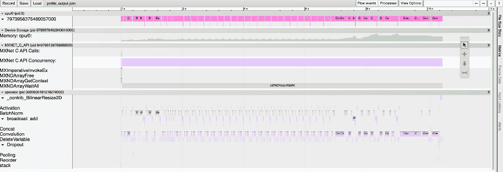

# 第九章：使用 MXNet 提升推理性能

在之前的章节中，我们利用 MXNet 的功能解决了**计算机视觉**和**自然语言处理任务**。这些章节的重点是从**预训练模型**中获得最大性能，利用 GluonCV 和 GluonNLP 的**模型库**API。我们使用从头开始的不同方法训练这些模型，包括**迁移学习**和**微调**。在上一章中，我们探索了如何利用一些高级技术优化训练过程。最后，在本章中，我们将重点提高推理过程本身的性能，加速从我们的模型中获得结果，并讨论与**边缘****AI 计算**相关的多个主题。

为了实现优化推理管道性能的目标，MXNet 包含了不同的功能。我们已经简要讨论过其中的一些功能，例如在前一章中介绍的**自动混合精度**（**AMP**），它可以提高训练性能，同时也可以用来提升推理性能。在本章中，我们将重新讨论这一点，以及其他功能，如**混合化**。此外，我们还将进一步优化如何有效利用数据类型，借助**量化**中的**INT8**数据类型加速推理过程。

此外，我们将探索我们的模型在操作方面的工作原理，了解它们如何在**MXNet 分析器**的帮助下内部运行。然后，我们将借助 MXNet GluonCV 模型库，进一步学习如何将我们的模型导出为**ONNX**格式，使用该格式，我们可以将模型应用于不同的框架，例如将我们的模型部署到 NVIDIA 硬件平台上，如**NVIDIA Jetson**系列产品。

最后，我们将结合应用所有这些技术，选择书中已经探讨过的问题作为例子。对于计算机视觉任务，我们将选择图像分割；对于自然语言处理任务，我们将选择将英文文本翻译成德文。

本章具体包含以下食谱：

+   介绍推理优化功能

+   优化图像分割的推理

+   优化将英文文本翻译为德文时的推理

# 技术要求

除了《前言》中指定的技术要求外，以下内容适用：

+   确保你已经完成了*第一章*中的*食谱 1*，*安装 MXNet*。

+   确保你已经完成了*第五章*，*使用计算机视觉分析图像*，以及*第六章*，*利用自然语言处理理解文本*。

+   确保你已经完成了*第七章*，*通过迁移学习与微调优化模型*。

本章的代码可以在以下 GitHub 网址找到：[`github.com/PacktPublishing/Deep-Learning-with-MXNet-Cookbook/tree/main/ch09`](https://github.com/PacktPublishing/Deep-Learning-with-MXNet-Cookbook/tree/main/ch09)。

此外，你可以直接从 Google Colab 访问每个配方，例如，本章第一个配方：[`github.com/PacktPublishing/Deep-Learning-with-MXNet-Cookbook/blob/main/ch09/9_1_Introducing_inference_optimization_features.ipynb`](https://github.com/PacktPublishing/Deep-Learning-with-MXNet-Cookbook/blob/main/ch09/9_1_Introducing_inference_optimization_features.ipynb)。

# 引入推理优化功能

在之前的章节中，我们已经看到如何利用 MXNet、GluonCV 和 GluonNLP 从特定数据集（如 ImageNet、MS COCO 或 IWSLT2015）中获取预训练模型，并将其应用于我们的特定任务和数据集。此外，我们还使用了迁移学习和微调技术来提高这些任务/数据集的算法性能。

在这个配方中，我们将介绍（并重温）几个概念和功能，这些内容将优化我们的推理循环，以提高运行时性能，同时分析其中的权衡。

## 做好准备

与之前的章节一样，在这个配方中，我们将使用一些矩阵运算和线性代数，但这完全不难。

## 如何操作...

在这个配方中，我们将执行以下步骤：

1.  混合我们的模型

1.  使用 float16 和 AMP 进行推理

1.  使用 INT8 进行量化

1.  对我们的模型进行性能分析

让我们深入了解每个步骤。

### 混合我们的模型

在最初的章节中，我们在探索 MXNet 的特性时，重点介绍了**命令式编程**。如果你以前用过 Java、C/C++或 Python 等语言编程，那么你很可能使用过命令式编程。这是一种常见的编码方式，因为它更灵活。

在命令式编程中，通常期待代码中的语句按顺序逐步执行。例如，在我们的评估路径中，通常会逐步执行这些语句，通常是在一个循环内部：

1.  从数据加载器中加载新样本。

1.  转换输入和预期输出，以便它们可以被我们的模型和指标计算所使用。

1.  将输入传递给模型以计算输出。

1.  将模型输出与预期输出进行比较，并更新相应的指标。

在这种编程范式中，每个语句按顺序执行，输出可以在每一步完成后进行检查或调试（因为 MXNet 使用**惰性求值**）。

使用不同的编程范式，称为**符号编程**，其中使用的是符号，符号本质上是操作的抽象，直到定义的某一点（通常称为编译步骤）才会进行实际计算。这对于**深度学习**尤其有用，因为所有模型都可以定义为图，使用这个图作为符号，优化底层图中的操作路径，并仅在需要时运行优化后的计算。

然而，由于计算尚未发生，因此每个步骤的输出无法检查或调试，这使得查找和修复问题变得更加困难。另一方面，由于图优化的能力，符号编程需要更少的内存且速度更快。

幸运的是，使用 MXNet，我们可以充分利用两者的优势。我们可以使用命令式编程定义模型，进行测试、调试和修复（通过*print*语句、测试、调试等机制）。当我们准备好进行优化时，我们只需要调用`hybridize`函数，它会处理底层的一切工作，与我们的图形在符号编程中一起工作。这种方法被称为混合编程，是 MXNet 的最佳优势之一。此外，这个特性没有硬件限制，可以用于 CPU 和 GPU 计算。

作为一个玩具示例，我们可以进行一些实验，通过推理模型并比较不同配置的不同结果。具体来说，这些是我们将测试的配置：

+   CPU：

    +   使用命令式执行

    +   使用符号执行和默认参数

    +   使用符号执行和特定后端

    +   使用符号执行、特定后端和静态内存分配

    +   使用符号执行、特定后端、静态内存分配和不变输入形状

+   GPU：

    +   使用命令式执行

    +   使用符号执行和默认参数

    +   使用符号执行和静态内存分配

    +   使用符号执行、静态内存分配和不变输入形状

请注意，为了正确验证计算时间，我们添加了对`mx.nd.waitall()`函数的调用。选择的方法是使用**ADE20K**验证集（数据集可通过 MXNet GluonCV 获得），并使用**DeepLabv3**模型进行处理。我们将使用批量大小为 4：

1.  对于初始的 CPU 计算配置，使用命令式执行时，模型对数据集的处理时间如下：

    ```py
    Time (s): 115.22693085670471
    ```

1.  对于第二种 CPU 计算配置，我们只需利用 MXNet 混合编程模型并使用以下方式转换我们的模型：

    ```py
    deeplab_pt_cpu_hybrid.hybridize()
    Time (s): 64.75840330123901
    ```

    正如我们所看到的，所做的优化将计算时间减少了近一半。

1.  对于第三种 CPU 计算配置，我们只需稍微修改我们的混合化调用以定义特定的后端。我们将利用我们的 Intel CPU 架构，使用`MKLDNN`后端，并使用以下方式转换我们的模型：

    ```py
    deeplab_pt_cpu_hybrid.hybridize(backend = "MKLDNN")
    Time (s): 55.860424757003784
    ```

    正如我们所见，特定的后端进一步将计算时间减少了约 20%。

1.  对于第四个 CPU 计算配置，我们只需要稍微修改我们的混合化调用，定义我们希望使用静态内存分配。我们可以使用以下方式更新我们的调用：

    ```py
    deeplab_pt_cpu_hybrid.hybridize(backend = "MKLDNN", static_alloc=True)
    Time (s): 53.905478715896606
    ```

    正如我们所见，静态内存分配使我们能够将计算时间再减少约 4%。

1.  对于第五个 CPU 计算配置，我们只需要稍微修改我们的混合化调用，定义我们希望利用不变的输入形状（我们已经预处理了数据，使其具有相同的输入形状，`480x480`）。我们可以使用以下方式更新我们的调用：

    ```py
    deeplab_pt_cpu_hybrid.hybridize(backend = "MKLDNN", static_alloc=True, static_shape=True)
    Time (s): 52.464826822280884
    ```

    正如我们所见，不变输入形状约束使我们能够将计算时间再减少约 2%。

1.  对于初始的 GPU 计算配置，采用命令式执行，模型处理数据集的时间如下：

    ```py
    Time (s): 13.315197944641113
    ```

1.  对于第二个 GPU 计算配置，我们只需要利用 MXNet 混合编程模型，并用以下方式转换我们的模型：

    ```py
    deeplab_pt_gpu_hybrid.hybridize()
    Time (s): 12.873461246490479
    ```

    正如我们所见，当在 GPU 上执行优化时，由于 GPU 已经针对这些类型的计算进行了内部优化，因此几乎没有提高计算时间。

1.  对于 GPU 计算，没有需要选择的特定后端。因此，对于第三个 GPU 计算配置，我们只需要稍微修改我们的混合化调用，定义我们希望使用静态内存分配。我们可以使用以下方式更新我们的调用：

    ```py
    deeplab_pt_gpu_hybrid.hybridize(static_alloc=True)
    Time (s): 12.752988815307617
    ```

    正如我们所见，静态内存分配在 GPU 上带来了另一个微不足道的改进。

1.  对于第四个 GPU 计算配置，我们只需要稍微修改我们的混合化调用，定义我们希望利用不变的输入形状（我们已经预处理了数据，使其具有相同的输入形状，480x480）。我们可以使用以下方式更新我们的调用：

    ```py
    deeplab_pt_gpu_hybrid.hybridize(static_alloc=True, static_shape=True)
    Time (s): 12.583650827407837
    ```

    正如我们所见，不变输入形状约束在 GPU 上带来了另一个微不足道的改进。

结果显示，当使用 CPU 时，我们可以将推理时间减少到原始时间的一半，这是一个显著的改进。使用 GPU 时，由于内部优化，改进几乎可以忽略不计。

重要提示

请注意，在代码中我们是如何使用`mx.nd.waitall()`函数来验证所有计算是否已经严格完成，然后才计算这些操作所花费的时间。

### 应用 float16 和 AMP 进行推理

在上一章，*第八章*，*使用 MXNet 提升训练性能*，我们介绍了`float16`数据类型和 AMP 优化，这是一种极为简单的方式，仅在最有用时才使用这一半精度数据类型。

在*食谱 1*，*介绍训练优化特性*，上一章中，我们比较了单精度（`float32`）和半精度（`float16`）数据类型，理解它们的特性和内存/速度折衷。如果你还没有复习这个食谱，建议你回顾一下，因为它与本主题非常相关。

正如大多数概念之前已介绍的那样，本节将重点讨论如何将 AMP 应用于推理过程。像往常一样，MXNet 为此操作提供了一个非常简单的接口，只需调用`amp.convert_hybrid_block()`函数即可。

该优化可以应用于 CPU 和 GPU 环境，因此让我们来运行这些实验。

要修改我们的 CPU 模型以使用 AMP，我们只需要以下一行代码：

```py
deeplab_pt_cpu_hybrid_amp = amp.convert_hybrid_block(deeplab_pt_cpu_hybrid, ctx=mx.cpu())
```

使用这个修改后的模型，处理数据集的时间如下：

```py
Time (s): 56.16465926170349
```

正如我们所见，AMP 在 CPU 上几乎没有产生改善。这是因为最大的收益出现在训练时所需的反向传递过程中，但在推理过程中并不需要。此外，CPU 通常没有专门的电路来直接处理 float16，这限制了改进效果。

要修改 GPU 模型以使用 AMP，我们只需要以下一行代码：

```py
deeplab_pt_gpu_hybrid_amp = amp.convert_hybrid_block(deeplab_pt_gpu_hybrid, ctx=mx.gpu())
```

使用这个修改后的模型，处理数据集的时间如下：

```py
Time (s): 3.371366024017334
```

正如我们所见，AMP 在 GPU 上产生了优秀的结果，将推理时间减少了大约~25%。这是因为 GPU 具有专门的电路来直接处理 float16，极大地改善了结果。

重要说明

`amp.convert_hybrid_block()`函数接受不同的参数。鼓励你尝试不同的选项（如`cast_optional_params`）以找到最佳配置。

### 使用 Int8 进行量化

在前面的章节中，我们看到如何通过使用不同的方法来优化推理循环，优化如何使用 CPU 和 GPU 以获得最大性能，给定一个模型。我们还探讨了如何利用单精度（float32）和半精度（float16）数据类型。在本节中，我们将探讨如何通过一种新的数据类型 Int8 来优化我们的数据输入、模型参数以及它们之间的不同算术运算。

这种数据类型的修改比精度变化更有深远的影响。我们还将底层表示从浮点数修改为整数，这样可以减少内存和计算要求。让我们分析一下这种数据类型。

Int8 表示两件事：它是一种仅支持整数数字（没有浮动小数点）的数据类型，并且在这种格式下存储单个数字所用的位数是 8 位。此格式的最重要特性如下：

+   能表示从-128 到 127，或从 0 到 255 的整数（取决于它是有符号还是无符号类型）

+   常数精度（每个连续的数字相差恰好 1）

为了解释`Int8`量化的核心思想，并展示精度损失，我们可以用以下代码片段显示数字 1/3（即三分之一）在`Float32`和`Int8`两种格式下的近似值：

```py
a = mx.nd.array([1/3], dtype=mx.np.float32)
 int_value = 85
scaling_factor = 255
b = int_value / scaling_factor
print("1/3 as 0.333... (Float32): {0:.30f}".format(a.asscalar())))
print("1/3 as 85/255   (Int8)   : {0:.30f}".format(b))
```

这产生了以下结果：

```py
1/3 as 0.333... (Float32): 0.333333343267440795898437500000
1/3 as 85/255   (Int8)   : 0.333333333333333314829616256247
```

如我们所见，所有表示方式都不是完全精确的，`float32`表现出了非常高的精度，符合预期。使用`Int8`时，我们做了一个小的简化；我们使用了两个 8 位整数，`85`和`255`，并用其中一个作为缩放因子。这个缩放因子通常会同时应用于多个数字集。它可以是整个模型的相同缩放因子（不太可能），也可以是每层的缩放因子，等等。这个缩放因子不需要以`Int8`表示，它可以是`float32`。

重要提示

对于这个特定的例子，选择的`Int8`表示比目标数值更精确，但这只是巧合。在常见的场景中，存在精度损失，进而导致性能损失。

为了最小化性能损失，通常量化调优技术会要求一个**校准数据集**。然后，使用该数据集来计算减少性能损失的参数。

除了使用校准数据集外，还有一些技术可以优化最准确的`Int8`值的计算，而 MXNet 提供了一个非常简单的 API 来促进我们网络的优化。通过简单调用`mx.contrib.quantization.quantize_net_v2()`函数，我们将更新我们的网络为`Int8`。

特别是，对于我们的实验，这就是我们使用的调用：

```py
deeplab_pt_cpu_q_hybrid = quantization.quantize_net_v2(
deeplab_pt_cpu,
 quantized_dtype='auto',
 exclude_layers=None,
 exclude_layers_match=None,
 calib_data=ade20k_cal_loader_gpu_cpu,
 calib_mode='entropy',
 logger=logger,
 ctx=mx.cpu())
```

重要提示

`Int8`量化是一个复杂的过程，针对特定应用的定制需要深入的分析和一些反复试验。关于涉及的参数，建议阅读以下函数文档：[`github.com/apache/mxnet/blob/v1.9.1/python/mxnet/contrib/quantization.py#L825`](https://github.com/apache/mxnet/blob/v1.9.1/python/mxnet/contrib/quantization.py#L825)。

使用这个修改后的基于 CPU 的模型，处理数据集所需的时间如下：

```py
Time (s): 36.10324692726135
```

正如我们所看到的，`Int8`在 CPU 上产生了显著的提升，几乎减少了约 50%的运行时间。

不幸的是，对于 GPU，这个特性无法引入。尽管最近的 GPU 有专门的`Int8`电路，但这还是一个比较新的发展，MXNet 尚不支持这些操作符。

### 对我们的模型进行分析

在这个配方中，我们已经看到如何使用不同的技术来优化推理循环。然而，有时即使引入了这些优化技术，我们的模型仍可能无法达到我们预期的运行时性能。这可能是由于以下几个原因：

+   架构并不适合边缘计算。

+   操作符尚未得到充分优化。

+   组件之间的数据传输。

+   内存泄漏。

为了验证我们的模型内部是如何工作的，检查需要进一步优化的地方和/或调查模型性能不佳的可能原因，MXNet 提供了一种低级分析工具，称为 MXNet 性能分析器。

MXNet 性能分析器在后台运行，实时记录模型中发生的所有操作和数据传输。它也非常轻量，占用的资源非常少。最重要的是，它极易配置和使用。

为了分析一组语句，我们需要采取两个步骤：

1.  配置性能分析器。

1.  在要进行性能分析的语句之前和之后启动与停止性能分析器。

要配置性能分析器，我们只需要一行代码，如下所示：

```py
mx.profiler.set_config(
profile_all=True,
 aggregate_stats=True,
 continuous_dump=True,
 filename='profile_output_cpu.json')
```

要启动和停止性能分析器，我们需要在要分析的语句的开始和结束处添加以下几行代码：

```py
mx.profiler.set_state('run')
[... code statements to analyze ...]
# Wait until all operations have completed
mx.nd.waitall()
# Stop recording
mx.profiler.set_state('stop')
# Log results
mx.profiler.dump()
```

请注意，我们需要三条语句来停止录制：完成所有指令、停止录制，并转储在第一步中配置的文件的信息。

重要说明

请注意代码中我们如何使用 `mx.nd.waitall()` 函数来验证所有计算已严格完成，然后再计算这些操作所花费的时间。

如前所述的指令会生成一个 JSON 文件，随后可以通过追踪应用程序进行分析。我推荐使用 Google Chrome 中包含的 Tracing 应用程序，因为它非常易于使用和访问。只需在地址栏中输入以下内容：`chrome://tracing`。

为了验证 MXNet 性能分析器的功能，我们以广泛使用的**ResNet**架构为例，这些架构在我们的图像分割任务中被广泛应用，作为我们所使用的 DeepLabv3 网络的骨干。

ResNet 网络的典型架构如下：


图 9.1 – ResNet50 模型架构

请注意，在*图 9.1*中，初始步骤（阶段 1）是卷积、批量归一化和激活。

从我们分析过的模型中，Google Chrome Tracing 应用程序提供了以下屏幕：



图 9.2 – 性能分析 ResNet

在*图 9.2*中，我们可以看到模型的一般执行情况。放大早期层，我们可以看到如下：


图 9.3 – 性能分析 ResNet: 放大

在*图 9.3*中，我们可以看到阶段 1 的卷积、批量归一化和激活步骤被清晰地展示出来。我们还可以非常清楚地看到，批量归一化操作所需的时间大约是卷积和激活步骤的 4 倍，这可能表明了一个优化的方向。

## 它的工作原理……

在本节中，我们深入探讨了 MXNet 和 Gluon 如何帮助我们优化推理循环。我们通过解决推理循环中的每一个步骤，充分利用了我们的硬件（CPU 和 GPU）：

+   重用了上一章中数据加载的工作

+   通过混合化优化图计算

+   分析了不同的数据类型，并在可能的情况下，使用 AMP 结合`float16`的加速与`float32`的精度，利用 GPU 的特定电路

+   通过使用 Int8 量化迈出了进一步的步伐

+   使用 MXNet 分析器分析了低级性能

我们通过运行多个实验，比较了每个特性的效果，比较了在特定优化前后的性能，强调了使用这些优化时需要考虑的潜在权衡。总结来说，结果如下：

| **特性** | **CPU 上的结果（毫秒）** | **GPU 上的结果（毫秒）** |
| --- | --- | --- |
| 标准 | 115 | 13.3 |
| 混合化 / 默认 | 65 | 12.9 |
| 混合化 / MKLDNN | 56 | N/A |
| 混合化 / MKLDNN + 静态分配 | 54 | 12.8 |
| 混合化 / MKLDNN + 静态分配 + 不变形状 | 52 | 12.6 |
| AMP | 54 | 3.5 |
| Int8 量化 | 36 | N/A |

表 9.1 – CPU 和 GPU 的特性及结果汇总

在接下来的食谱中，我们将同时应用所有这些优化技术，针对 CPU（MKL-DNN + 静态分配 + 不变形状 + Int8 量化）和 GPU（静态分配 + 不变形状 + 自动混合精度）优化两项常见任务：图像分割和文本翻译。

## 还有更多…

本食谱中展示的所有优化特性都在文献中进行了详细描述。在本节中，我们分享了一些入门链接，以便深入理解每个特性：

+   **混合化**：[`mxnet.apache.org/versions/1.9.1/api/python/docs/tutorials/packages/gluon/blocks/hybridize.html`](https://mxnet.apache.org/versions/1.9.1/api/python/docs/tutorials/packages/gluon/blocks/hybridize.html)

+   **自动混合精度（AMP）**：[`mxnet.apache.org/versions/1.9.1/api/python/docs/tutorials/packages/gluon/blocks/hybridize.html`](https://mxnet.apache.org/versions/1.9.1/api/python/docs/tutorials/packages/gluon/blocks/hybridize.html)

+   **Int8 量化**：[`mxnet.apache.org/versions/1.9.1/api/python/docs/tutorials/packages/gluon/blocks/hybridize.html`](https://mxnet.apache.org/versions/1.9.1/api/python/docs/tutorials/packages/gluon/blocks/hybridize.html)

+   **MXNet 分析器**：[`mxnet.apache.org/versions/1.9.1/api/python/docs/tutorials/packages/gluon/blocks/hybridize.html`](https://mxnet.apache.org/versions/1.9.1/api/python/docs/tutorials/packages/gluon/blocks/hybridize.html)

# 优化图像分割的推理

在之前的食谱中，我们展示了如何利用 MXNet 和 Gluon 来优化模型推理，应用了不同的技术，例如使用混合化提高运行时性能；如何结合 AMP 使用半精度（float16）显著减少推理时间；以及如何利用 Int8 量化等数据类型进一步优化。

现在，我们可以重新审视本书中一直在处理的一个问题：图像分割。我们在前几章的食谱中已经处理过这个任务。在*食谱 4*，《使用 MXNet Model Zoo 进行语义图像分割—PSPNet 和 DeepLabv3》中，来自*第五章*《使用计算机视觉分析图像》，我们介绍了这个任务以及我们将在本食谱中使用的数据集，*MS COCO 和 Penn-Fudan Pedestrian*，并学习了如何使用来自 GluonCV Model Zoo 的预训练模型。

此外，在*食谱 3*，《提升图像分割性能》中，来自*第七章*《通过迁移学习和微调优化模型》中，我们比较了处理目标数据集时可以采取的不同方法，是否从头开始训练我们的模型，或者利用预训练模型的先验知识并针对我们的任务进行调整，使用不同的迁移学习和微调方式。最后，在*食谱 2*，《优化图像分割训练》中，来自*第八章*《通过 MXNet 提升训练性能》中，我们应用了不同的技术来提升训练循环的运行时性能。

因此，在本食谱中，我们将应用所有介绍的优化技术，专注于优化图像分割模型的推理任务。

## 准备工作

和之前的章节一样，在本食谱中，我们将使用一些矩阵运算和线性代数，但这绝对不难。

## 如何操作...

在这个食谱中，我们将使用以下步骤：

1.  应用推理优化技术

1.  可视化和分析我们的模型

1.  将我们的模型导出到 ONNX 和 TensorRT

让我们深入探讨每个步骤。

### 应用推理优化技术

在*食谱 1*，《介绍推理优化功能》中，我们展示了不同的优化技术如何提高推理过程中各个步骤的性能，包括混合化、AMP 和 Int8 量化。

在这一部分，我们将展示如何仅通过几行代码，在 MXNet 和 Gluon 中轻松应用我们介绍的每一项技术，并验证每项技术的结果。

如果不应用这些优化技术，作为基准，以下是使用 CPU 获取的定量结果：

```py
PixAcc:  0.9602144097222223
mIoU  :  0.4742364603465315
Time (s): 27.573920726776123
```

我们可以显示图像以获取定性结果：


图 9.4 – 定性结果：CPU 基线

从定量指标可以预见，*图 9.4*也显示了出色的结果。

正如之前的食谱所总结的，对于 CPU 上的最大性能，最佳方法是：

+   使用混合化：使用 Intel MKL-DNN 后端，结合静态内存分配和不变输入形状。

+   不要使用 AMP。

+   使用 Int8 量化。

让我们将这些技术应用于我们当前的特定任务——图像分割。

对于混合化，我们只需要一行代码（其中包括 Intel `MKLDNN`后端所需的参数，结合静态内存分配和不变输入形状）：

```py
deeplab_pt_cpu_q_hybrid.hybridize(backend="MKLDNN", static_alloc=True, static_shape=True)
```

我们不需要添加 AMP 步骤，因为它在 CPU 工作负载中未能提供任何好处。

对于`Int8`量化，我们需要两个独立的步骤。一方面，我们需要定义校准数据集。这可以通过少量代码实现：

```py
# Dataset Loading & Transforming
# Limit to 10 samples (last ones)
 max_samples = 10
samples = range(0, max_samples)
 p_cal_cpu_pre = mx.gluon.data.SimpleDataset([(pedestrian_val_dataset[-i][0], pedestrian_val_dataset[-i][1]) for i in tqdm(samples)])
 p_cal_gpu_cpu = p_cal_cpu_pre.transform_first(input_transform_fn_gpu_cpu, lazy=False)
# DataLoader for Calibration
# For CPU, Pre-processed in GPU, copied back to CPU memory space)
 num_workers = 0
batch_size = 4
p_cal_loader_gpu_cpu = mx.gluon.data.DataLoader(
    p_cal_gpu_cpu,    batch_size=batch_size,
    num_workers=num_workers,
    last_batch="discard")
```

然后，为了应用`Int8`量化，并使用校准数据集进行优化，只需再加一行代码：

```py
deeplab_pt_cpu_q_hybrid = quantization.quantize_net_v2(
    deeplab_pt_cpu,
    quantized_dtype='auto',
    exclude_layers=None,
    exclude_layers_match=None,
    calib_data=p_cal_loader_gpu_cpu,
    calib_mode='entropy',
    logger=logger,
    ctx=mx.cpu())
```

应用这些优化技术，得到的优化 CPU 推理定量结果如下：

```py
PixAcc:  0.9595597222222222
mIoU  :  0.47379941937958425
Time (s): 8.355125904083252
```

正如我们所见，性能差异（`0.959`对比`0.960`和`0.473`对比`0.474`）可以忽略不计。然而，通过这些推理优化技术，我们已经将推理运行时减少了 4 倍（8.4 秒对比 27.6 秒），这是一个令人印象深刻的结果。

我们也可以显示一张图像来展示定性结果：


图 9.5 – 定性结果：CPU 优化推理

从定量指标可以预见，*图 9.5*也显示了出色的结果，差异几乎可以忽略不计（如果有的话）。

那么，基于 GPU 的推理怎么样呢？让我们按照相同的步骤进行：

1.  如果不应用这些优化技术，作为基线，这些是使用 GPU 获得的定量结果：

    ```py
    PixAcc:  0.9602144097222223
    mIoU  :  0.4742364603465315
    Time (s): 13.068315982818604
    ```

    正如预期的那样，与 CPU 基线相比，算法性能没有变化。GPU 的推理运行时确实是 CPU 的两倍快（`13.1`秒对比`27.6`秒）。

1.  我们可以显示一张图像来展示定性结果：


图 9.6 – 定性结果：GPU 基线

从定量指标可以预见，*图 9.6*也显示了出色的结果。

正如之前的食谱所总结的，对于 GPU 上的最大性能，最佳方法是：

+   **使用混合化**：使用静态内存分配和不变输入形状。不要使用 Intel MKL-DNN 后端。

+   使用 AMP**。**

+   不要使用 Int8 量化（不支持）。

让我们将这些技术应用于我们当前的特定任务——图像分割。

对于混合化，我们只需要一行代码（其中包括静态内存分配和不变输入形状所需的参数）：

```py
deeplab_pt_gpu_hybrid.hybridize(static_alloc=True, static_shape=True)
```

对于 AMP，我们需要遵循两个简单的步骤，即前向传播和模型的转换，如下所示：

```py
deeplab_pt_gpu_hybrid(single_sample_gpu);
deeplab_pt_gpu_hybrid_amp = amp.convert_hybrid_block(deeplab_pt_gpu_hybrid, ctx=mx.gpu())
```

不需要进一步的步骤。

通过应用这些优化技术，我们获得了优化 GPU 推断的量化结果：

```py
PixAcc:  0.9602565972222222
mIoU  :  0.4742640561133744
Time (s): 0.8551054000854492
```

正如我们所看到的，性能上的差异（`0.960`与`0.960`，以及`0.474`与`0.474`）是不存在的。此外，通过这些推断优化技术，我们已经成功将推断运行时间缩短了 15 倍（0.85 秒与 13.1 秒），这是一个令人印象深刻的成果。

我们还可以显示一张图片来展示定性结果：


图 9.7 – 定性结果：GPU 优化推断

正如定量指标所预期的那样，*图 9.7*也显示了出色的结果，与*图 9.6*中的结果几乎没有（如果有的话）可忽略的差异。

### 可视化和剖析我们的模型

在前几节中，我们看到了可以应用于优化推断循环的不同技术，以及这些技术所取得的结果。但是，这些技术究竟是如何工作的？为什么它们更快？

我们将使用 MXNet 提供的两个工具来达到这个目的：

+   **模型可视化**

+   **模型剖析**

模型可视化为我们提供了一种直观的方式来看待不同层之间的交互。对于使用 ResNet 骨干（例如我们在本文档中用于图像分割的`DeepLabv3`），这尤为重要，因为**残差**通过层进行传递。

用 MXNet 可视化我们的模型架构非常简单。当使用符号模型时，只需一行代码即可。在我们的情况下，由于我们使用 Gluon 模型，需要以下几行代码：

```py
deeplab_pt_cpu_q_hybrid.export('deeplab_pt_cpu_q_hybrid_sym')
 sym, arg_params, aux_params = mx.model.load_checkpoint('deeplab_pt_cpu_q_hybrid_sym', 0)
 mx.visualization.plot_network(sym)
```

正如前一篇文章所示，基于 ResNet 的网络由 ResNet 块组成，其中包括卷积、批量归一化和激活步骤。

对于我们的 CPU 优化模型（混合化和`Int8`量化），以下是这些块之间部分连接的样子：


图 9.8 – ResNet 块的 GraphViz（CPU 优化）

正如我们在*图 9.8*中所看到的，预期的 ResNet 块操作没有单独的块；它们都是执行所有计算的单个块的一部分。这些操作的组合称为运算符融合，其中尽可能多的操作被融合在一起，而不是计算一个操作，然后是下一个操作（通常发生数据传输）。最大的好处在于融合的操作可以在相同的内存空间中进行。这是混合化执行的优化之一，因为一旦网络的图形完成，很容易找到候选融合操作。

好的，模型可视化告诉我们这些优化会发生，但我们如何验证它们实际上正在发生呢？这正是模型性能分析擅长的地方，也可以帮助我们了解运行时发生的问题。

如食谱中所述，*引入推理优化功能*，以及“对我们模型进行性能分析”一节中提到，模型性能分析的输出是一个 JSON 文件，可以使用 Google Chrome Tracing 应用等工具进行可视化。对于一个未优化的 CPU 工作负载，我们的 `DeepLabv3` 模型显示了以下的时间配置文件：


图 9.9 – DeepLabv3 性能分析：未优化的 CPU 工作负载

在 *图 9.9* 中，我们可以看到以下特征：

+   几乎所有任务都由单个进程处理。

+   在操作开始约 80 毫秒后，所有任务已被派发，并且控制已返回，操作继续进行（延迟评估和 `mx.nd.waitall`）。

+   所有任务在操作开始约 80 毫秒时已被派发，并且控制已返回，操作继续进行（延迟评估和 mx.nd.waitall）。

+   所有操作都是原子操作，并逐个执行。

+   完整的操作大约需要 800 毫秒。

对于一个 CPU 优化的工作负载，我们的 DeepLabv3 模型显示了以下的时间配置文件：


图 9.10 – DeepLabv3 性能分析：优化后的 CPU 工作负载

在 *图 9.10* 中，我们可以看到以下特征：

+   几乎所有任务都由单个进程处理，类似于未优化的版本。

+   在操作开始约 5 毫秒后，所有任务已被派发，并且控制已返回，操作继续进行（延迟评估和 `mx.nd.waitall`），比未优化版本要快得多。

+   内存的使用是同步/结构化的，这与未优化的版本形成鲜明对比。

+   所有操作都被融合在一起，这与未优化的版本形成鲜明对比。

+   完整的操作大约需要 370 毫秒。

总结来说，对于基于 CPU 的优化，我们可以清晰地看到效果：

+   混合化将所有操作符融合在一起，基本上在一个操作中执行几乎全部工作负载。

+   MKL-DNN 后端和 Int8 量化通过加速操作改善了这些操作。

对于我们的 GPU 优化模型（混合化并使用 AMP），以下是一些 ResNet 模块之间连接的情况：


图 9.11 – ResNet 模块的 GraphViz（GPU 优化）

如 *图 9.11* 所示，这与 CPU 优化后的可视化完全不同，因为所有预期的 ResNet 模块操作的独立块都可以被识别出来。正如本章第一个食谱中所提到的，混合化对 GPU 的影响非常有限。

那么，性能加速是从哪里来的呢？让我们借助模型性能分析来解答。

对于未优化的 GPU 工作负载，我们的 DeepLabv3 模型显示出以下时间轮廓：


图 9.12 – 深度分析 DeepLabv3：未优化的 GPU 工作负载

在*图 9.12*中，我们可以看到以下特点：

+   几乎所有任务都由两个 GPU 进程处理。

+   在操作开始约 40 毫秒时，所有任务已被发送进行调度，控制返回以继续操作（懒评估和`mx.nd.waitall`）。

+   内存的异步/非结构化使用。

+   所有操作都是原子性的并单独执行。

+   完整操作大约需要 150 毫秒。

对于优化过的 GPU 工作负载，我们的 DeepLabv3 模型显示出以下时间轮廓：


图 9.13 – 深度分析 DeepLabv3：优化过的 GPU 工作负载

在*图 9.13*中，我们可以看到以下特点：

+   几乎所有任务都由两个进程处理，类似于未优化的版本。

+   在操作开始约 4 毫秒时，所有任务已被发送进行调度，控制返回以继续操作（懒评估和`mx.nd.waitall`），比未优化的版本快得多。

+   内存的同步/结构化使用，与未优化的版本形成鲜明对比。

+   所有操作都是原子性的并单独执行；与未优化的版本类似，只是速度更快。例如，大型卷积操作在 GPU 未优化的情况下大约需要 1 毫秒，而在 GPU 优化的情况下只需要三分之一的时间（约 0.34 毫秒）。

+   完整操作大约需要 55 毫秒（为未优化时间的三分之一）。

总结来说，对于基于 GPU 的优化，我们可以清晰地看到效果：

+   如预期的那样，混合化没有效果，也没有发现操作融合。

+   如果 GPU 具有专用的 float16 电路，AMP 使得操作运行得更快。

### 将我们的模型导出到 ONNX 和 TensorRT

MXNet 和 GluonCV 也提供了将我们的模型导出到外部的工具。这对于优化运行时计算时间（推理）最为有用，可能需要：

+   MXNet/GluonCV 可能不支持的特定算法

+   在特定硬件平台上的部署和优化

在这一部分，我们将研究每个类别的一个示例。

对于特定的算法，我们将把我们的模型导出为 ONNX 格式。**ONNX**代表**开放神经网络交换格式**，它是一个开放的格式，描述了深度学习模型如何存储和共享。这对于利用特定工具执行高度专业化任务极为有用。例如，**ONNX Runtime**拥有强大的推理工具，包括量化（例如，ONNX Runtime 支持基于 GPU 的 INT8 量化）。因此，我们可以将模型导出为 ONNX 格式，并直接开始使用 ONNX Runtime 进行工作。

和往常一样，MXNet 只需几行代码就能帮助我们完成这个任务。我们需要执行两个步骤。首先，我们需要将模型从 Gluon 格式转换为符号格式（先混合，再导出）：

```py
deeplab_pt_gpu_hybrid.hybridize(static_alloc=True, static_shape=True)
 deeplab_pt_gpu_hybrid(single_sample_gpu)
 # Need to be exported externally for the symbols to be loaded
deeplab_pt_gpu_hybrid_filename = "deeplab_resnet101_coco_pt_gpu_hybrid"
deeplab_pt_gpu_hybrid.export(deeplab_pt_gpu_hybrid_filename)
```

接下来，我们可以将符号模型转换为 ONNX：

```py
# Files exported
sym_filename = deeplab_pt_gpu_hybrid_filename + "-symbol.json"
params_filename = deeplab_pt_gpu_hybrid_filename + "-0000.params"
in_shapes = [single_sample_gpu.shape]
 in_types = [mx.np.float32]
 onnx_model_path = mx.onnx.export_model(
    sym_filename,
    params_filename,
    in_shapes,
    in_types,
    onnx_file_name)
```

ONNX 还提供了一个检查器，用于验证我们的模型是否正确导出。可以使用以下代码行来完成：

```py
# Model Verification
import onnx
# Load the ONNX model
onnx_model = onnx.load_model(onnx_model_path)
 # Check the ONNX graph
onnx.checker.check_graph(onnx_model.graph)
```

就这样！按照这些指示，我们将把 ONNX 模型存储在文件中（在我们的示例中为 `'deeplab_resnet101_coco_pt_gpu_hybrid.onnx'`），并准备好在任何接受 ONNX 模型作为输入的工具中使用。

另一方面，有时我们希望在特定硬件平台上部署和/或优化我们的模型，例如 NVIDIA 系列产品（例如，Nvidia Jetson 平台）。具体来说，Nvidia 提供了一个特定的机器学习框架，用于在其硬件上运行推理。这个框架叫做**TensorRT**。

尽管 MXNet 提供了直接的 TensorRT 集成，但默认情况下并未启用，需要从源代码直接构建 MXNet，并启用特定参数来支持 TensorRT 集成。更为直接的是，我们可以利用刚才描述的 ONNX 导出，生成一个支持 TensorRT 的模型。

为了实现这一点，只需写几行代码：

```py
import tensorrt as trt
trt_file_name = "deeplab_resnet101_coco_pt_gpu_hybrid.trt"
TRT_LOGGER = trt.Logger(trt.Logger.INFO)
 builder = trt.Builder(TRT_LOGGER)
 config = builder.create_builder_config()
explicit_batch = 1 << (int) (trt.NetworkDefinitionCreationFlag.EXPLICIT_BATCH)
 deeplab_pt_gpu_hybrid_trt = builder.create_network(explicit_batch)
with open(onnx_file_name, 'rb') as model:
    with trt.OnnxParser(deeplab_pt_gpu_hybrid_trt, TRT_LOGGER) as parser:
        assert parser.parse(model.read()) == True
    deeplab_pt_gpu_hybrid_engine_serialized = builder.build_serialized_network(deeplab_pt_gpu_hybrid_trt, config=config)
with open(trt_file_name, 'wb') as f:
    f.write(bytearray(deeplab_pt_gpu_hybrid_engine_serialized))
```

有了这个，我们将编写一个序列化的 TensorRT 可用模型。

我们可以通过反序列化和读取模型来验证它是否可以被正确读取。我们可以使用以下代码行做到这一点：

```py
# Check it can be read back
runtime = trt.Runtime(TRT_LOGGER)
 with open(trt_file_name, 'rb') as f:
    deeplab_pt_gpu_hybrid_engine_deserialized = runtime.deserialize_cuda_engine(f.read())
```

就这样！在这一节中，我们已经成功地编写了 ONNX 和 TensorRT 模型。恭喜！

## 它是如何工作的……

在本教程中，我们应用了本章第一节中提到的不同推理优化技术，利用我们的硬件（CPU 和 GPU）通过以下方式优化模型的运行时性能：

+   混合模型

+   利用 AMP

+   使用 INT8 数据类型进行量化以加速推理

此外，我们还学习了如何使用模型可视化工具（由 GraphViz 提供支持）和 MXNet 分析器，并利用这些工具从低级角度分析推理优化。

最后，我们学会了如何将模型导出到特定场景和目的，使用 ONNX 和 TensorRT 库。

## 还有更多……

在本教程中，我们从训练后角度提出了推理优化问题。我们拿到了一个（预）训练的模型，并尽可能挖掘它的性能。

然而，还有另一条可以探索的途径，那就是从机器学习模型设计的角度开始思考如何最大化推理性能。这就是所谓的**模型压缩**，它是一个活跃的研究领域，定期会发布很多改进。近期的活跃研究课题包括：

+   **知识蒸馏**：[`arxiv.org/pdf/1503.02531.pdf`](https://arxiv.org/pdf/1503.02531.pdf)

+   **剪枝**：[`arxiv.org/pdf/1510.00149.pdf`](https://arxiv.org/pdf/1510.00149.pdf)

+   **量化感知训练**：[`arxiv.org/pdf/1712.05877.pdf`](https://arxiv.org/pdf/1712.05877.pdf)

# 优化从英语翻译到德语的推理

在最初的食谱中，我们展示了如何利用 MXNet 和 Gluon 优化模型的推理过程，应用了不同的技术：通过混合化提高运行时性能；如何结合 AMP 使用半精度（float16）显著减少推理时间；以及如何通过数据类型（如 Int8 量化）进一步优化。

现在，我们可以重新审视本书中一直在讨论的一个问题：将英语翻译成德语。我们在前几章的食谱中处理过翻译任务。在*第六章*《利用自然语言处理理解文本》的*食谱 4*《将越南语文本翻译成英语》中，我们介绍了翻译文本的任务，同时学习了如何使用来自 GluonCV Model Zoo 的预训练模型。

此外，在*第七章*《通过迁移学习和微调优化模型》的*食谱 4*《提高英语到德语翻译的性能》中，我们介绍了在本食谱中将使用的数据集：**WMT 2014** 和 **WMT 2016**。我们还比较了处理目标数据集时可以采用的不同方法：从零开始训练我们的模型，或利用预训练模型的过去知识，并根据我们的任务进行调整，使用不同的迁移学习和微调方式。最后，在*第八章*《通过 MXNet 提高训练性能》的*食谱 3*《优化英语到德语翻译的训练》中，我们应用了不同的技术来提高训练循环的运行时性能。

因此，在本食谱中，我们将应用所有介绍过的优化技术，专门用于优化从英语到德语翻译的推理过程。

## 做好准备

与前几章一样，在本食谱中我们将使用一些矩阵运算和线性代数，但这并不难。

## 如何操作...

在本食谱中，我们将进行以下步骤：

1.  应用推理优化技术

1.  对我们的模型进行分析

1.  导出我们的模型

让我们深入探讨这些步骤。

### 应用推理优化技术

在本章开始的*食谱 1*《引入推理优化功能》中，我们展示了不同的优化技术如何改善机器学习模型推理过程中各个步骤的性能，包括混合化、AMP 和 Int8 量化。

在本节中，我们将展示如何通过 MXNet 和 Gluon，仅用几行代码，我们就能轻松应用每个介绍过的技术，并验证每项技术的结果。

如果不应用这些优化技术，作为基准，以下是使用 CPU 获得的定量结果：

```py
WMT16 test loss: 1.53; test bleu score: 26.40
Time (s): 373.5446252822876
```

从定性角度来看，我们还可以检查模型在一个句子示例上的表现。在我们的案例中，我们选择了 *I learn new things every day*，并且获得的输出如下：

```py
Qualitative Evaluation: Translating from English to German
Expected translation:
 Ich lerne neue Dinge.
 In English:
 I learn new things every day.
 The German translation is:
 Ich lerne neue Dinge, die in jedem Fall auftreten.
```

输出中获得的德语句子（*Ich lerne neue Dinge, die in jedem Fall auftreten*）的意思是 *我学习在每种情况下都会出现的新事物*，因此，正如结果所示，文本几乎被完美地从英语翻译成了德语。

正如前一个方案中总结的，为了在 CPU 上实现最大性能，最佳的方法如下：

+   使用混合化：使用 Intel MKL-DNN 后端，结合静态内存分配和不变输入形状。

+   不要使用 AMP。

+   使用 Int8 量化。

很遗憾，我们无法使用 Int8 量化，因为它不支持 GluonNLP 模型。

让我们为当前特定任务应用每一项技术，即从英语翻译成德语。

对于混合化，我们只需要几行代码（包括所需的参数，这些参数是针对 Intel MKL-DNN 后端的，结合静态内存分配和不变输入形状，同时对损失函数进行混合化）：

```py
wmt_transformer_pt_cpu_hybrid.hybridize(backend="MKLDNN", static_alloc=True, static_shape=True)
loss_function = nlp.loss.MaskedSoftmaxCELoss()
loss_function.hybridize(backend="MKLDNN", static_alloc=True, static_shape=True)
```

我们不需要添加与 AMP 相关的任何步骤，因为已经证明它对基于 CPU 的工作负载没有益处。同样，GluonNLP 不支持 Int8 量化，因此我们不需要对代码做任何进一步的修改。

应用这些优化技术后，以下是优化后的 CPU 推理所获得的定量结果：

```py
WMT16 test loss: 1.53; test bleu score: 26.40
Time (s): 312.5660226345062
```

正如我们所看到的，性能差异（损失函数为 1.53 与 1.53，BLEU 分数为 26.40 与 26.40）几乎可以忽略不计。然而，使用这些推理优化技术，我们成功将推理运行时间缩短了 20%（313 秒比 374 秒），这是一个非常好的结果。

从定性角度来看，我们还可以检查模型在一个句子示例上的表现。在我们的案例中，我们选择了 *I learn new things every day*，并且获得的输出如下：

```py
Qualitative Evaluation: Translating from English to German
Expected translation:
 Ich lerne neue Dinge.
 In English:
 I learn new things every day.
 The German translation is:
 Ich lerne neue Dinge, die in jedem Fall auftreten.
```

输出中获得的德语句子（*Ich lerne neue Dinge, die in jedem Fall auftreten*）的意思是 *我学习在每种情况下都会出现的新事物*，因此，正如结果所示，文本几乎被完美地从英语翻译成了德语。此外，结果与未优化的情况相同（如预期）。

那么，基于 GPU 的推理如何呢？我们来按照相同的步骤操作：

1.  如果不应用这些优化技术，作为基准，以下是使用 GPU 获得的定量结果：

    ```py
    WMT16 test loss: 1.53; test bleu score: 26.40
    Time (s): 61.67868137359619
    ```

    正如预期的那样，相对于 CPU 基线，算法性能没有变化。推理运行时间在 GPU 上确实是 CPU 的六倍快（61.7 秒对比 374 秒）。

1.  从定性角度来看，我们还可以通过一个句子示例检查我们的模型表现如何。在我们的例子中，我们选择了 *I learn new things every day*，输出结果如下：

    ```py
    Qualitative Evaluation: Translating from English to German
    Expected translation:
     Ich lerne neue Dinge.
     In English:
     I learn new things every day.
     The German translation is:
     Ich lerne neue Dinge, die in jedem Fall auftreten.
    ```

    输出中获得的德语句子（*Ich lerne neue Dinge, die in jedem Fall auftreten*）的意思是 *我学习每天都出现的新事物*，因此从结果来看，文本几乎被完美地从英语翻译成了德语（并且与两个 CPU 情况相等）。

正如在前面的步骤中总结的那样，为了在 GPU 上获得最大性能，最佳方法如下：

+   使用混合化：使用静态内存分配和不变输入形状。不要使用 Intel MKL-DNN 后端。

+   使用 AMP。

+   不使用 Int8 量化（不支持）。

不幸的是，由于 GluonNLP 模型不支持 AMP，我们将无法使用 AMP。

让我们将这些技术应用于我们当前的具体任务，从英语翻译成德语。

对于混合化，我们只需要几行代码（包括静态内存分配和不变输入形状所需的参数，以及损失函数的混合化）：

```py
wmt_transformer_pt_gpu_hybrid.hybridize(static_alloc=True, static_shape=True)
loss_function = nlp.loss.MaskedSoftmaxCELoss()
loss_function.hybridize(static_alloc=True, static_shape=True)
```

我们不需要添加与 AMP 或 Int8 量化相关的任何步骤，因为 GluonNLP 不支持这些功能。因此，不需要进一步的步骤。

通过应用这些优化技术，以下是优化 GPU 推理后的定量结果：

```py
WMT16 test loss: 1.53; test bleu score: 26.40
Time (s): 56.29795598983765
```

正如我们所看到的，性能差异（损失为 1.53 与 1.53，BLEU 得分为 26.40 与 26.40）是微不足道的。然而，通过这些推理优化技术，我们已经能够将推理运行时间减少了 10%（56.3 秒对比 61.7 秒），这是一个非常好的结果。

从定性角度来看，我们还可以通过一个句子示例检查我们的模型表现如何。在我们的例子中，我们选择了 *I learn new things every day*，输出结果如下：

```py
Qualitative Evaluation: Translating from English to German
Expected translation:
 Ich lerne neue Dinge.
 In English:
 I learn new things every day.
 The German translation is:
 Ich lerne neue Dinge, die in jedem Fall auftreten.
```

输出中获得的德语句子（*Ich lerne neue Dinge, die in jedem Fall auftreten*）的意思是 *我学习每天都出现的新事物*，因此从结果来看，文本几乎被完美地从英语翻译成了德语。而且，结果与非优化情况（如预期）相当。

### 对我们的模型进行分析

在前面的章节中，我们看到了可以应用于优化推理循环的不同技术，以及这些技术所取得的结果。然而，这些技术究竟是如何工作的？为什么它们更快？

在本节中，我们将使用 MXNet 分析器，这有助于我们理解在运行时发生的问题。

如初始部分所述，模型性能分析的输出是一个 JSON 文件，可以使用诸如 Google Chrome Tracing 应用等工具进行可视化。对于未优化的 CPU 工作负载，我们的 Transformer 模型显示以下时间分析：


图 9.14 – Transformer 性能分析：未优化的 CPU 工作负载

在*图 9.14*中，我们可以看到以下特点：

+   几乎所有的任务都由两个进程处理。

+   几乎没有等待时间（惰性计算和`mx.nd.waitall`）。

+   内存的同步/结构化使用。

+   所有操作都是原子操作，并且逐个执行。

+   完整操作大约需要 1,200 毫秒。

对于经过 CPU 优化的工作负载，我们的 Transformer 模型显示以下时间分析：


图 9.15 – Transformer 性能分析：优化后的 CPU 工作负载

在*图 9.15*中，我们可以看到以下特点：

+   几乎所有的任务都由两个进程处理，类似于未优化的情况。

+   几乎没有等待时间（惰性计算和`mx.nd.waitall`），与未优化的情况类似。

+   与未优化的情况相比，内存以更异步/结构化的方式使用。

+   一些操作被融合在一起。尽管可视化不太清晰，但操作符融合（混合化）似乎在起作用，且大部分时间都花费在融合操作上。

+   完整操作大约需要 720 毫秒。

让我们仔细观察其中一个操作符融合步骤：


图 9.16 – Transformer 性能分析：优化后的 CPU 工作负载（聚焦于 OperatorFusion）

在*图 9.16*中，我们可以看到操作符融合如何将多个不同的操作融合在一起，包括嵌入、层归一化、全连接层和 MKL-DNN 加速的层。

总结来说，对于基于 CPU 的优化，我们可以清楚地看到以下效果：

+   混合化已经将大多数操作符融合在一起，尽管可视化较为困难，而且这种情况发生了多次。

+   MKL-DNN 后端通过加速的操作符改进了这些操作。

现在让我们讨论 GPU 情况。

对于未优化的 GPU 工作负载，我们的 Transformer 模型显示以下时间分析：


图 9.17 – Transformer 性能分析：未优化的 GPU 工作负载

在*图 9.17*中，我们可以看到以下特点：

+   任务主要由几个（三个）GPU 进程处理。

+   几乎没有等待时间（惰性计算和`mx.nd.waitall`）。

+   内存逐渐增加。

+   所有操作都是原子操作，并且逐个执行。

+   有多个从/到 CPU 的拷贝，这似乎没有降低性能。

+   完整操作大约需要 580 毫秒。

对于 GPU 优化的工作负载，我们的 Transformer 模型展示了以下时间性能：


图 9.18 – 性能分析 Transformer：优化后的 GPU 工作负载

在*图 9.18*中，我们可以看到以下特点：

+   几乎所有任务都由三个进程处理，类似于未优化的版本。

+   几乎没有等待时间（懒加载和 `mx.nd.waitall`），与未优化版本类似。

+   与未优化版本相比，内存的异步/非结构化使用更多。

+   一些操作被融合在一起。尽管可视化不够清晰，但操作融合（混合化）似乎有效，绝大部分时间都花费在了融合的操作上。

+   从/到 CPU 的数据复制操作似乎不会影响性能，尽管有几个操作。

+   整个操作大约需要 260 毫秒。

让我们详细看一下其中一步操作融合的过程：


图 9.19 – 性能分析 Transformer：优化后的 GPU 工作负载（聚焦操作融合）

在*图 9.19*中，我们可以看到操作融合如何将几个不同的操作融合在一起，包括嵌入、层归一化和全连接层。

总结来说，对于基于 GPU 的优化，我们可以清楚地看到混合化的效果，所有操作都已被融合在一起，尽管可视化较难解读，而且这种情况发生了很多次。

### 导出我们的模型

MXNet 和 GluonNLP 也提供了导出模型的工具。然而，这些工具主要是为 MXNet/Gluon 的内部使用而设计。原因是 GluonNLP 主要处理 `save()` 函数。

这个函数可以很容易地调用：

```py
wmt_transformer_pt_gpu_hybrid.save('transformer_pt_gpu_hybrid')
```

我们可以通过以下命令验证与模型相关的文件，参数（`.params` 扩展名）和架构（`.json` 扩展名）是否已被保存：

```py
assert os.path.exists("transformer_pt_gpu_hybrid-model.params")
assert os.path.exists("transformer_pt_gpu_hybrid-model.json")
```

完成了！在这一节中，我们成功地导出了我们的 Transformer 模型。恭喜！

## 它是如何工作的...

在这个食谱中，我们应用了本章第一个食谱中看到的不同推理优化技术，利用我们的硬件（CPU 和 GPU）通过混合化模型来优化模型的运行性能。

此外，我们已经学习了如何使用 MXNet 性能分析器从低级别的角度分析推理优化。

最后，我们已经学会了如何使用 MXNet 内部库导出我们的模型。

## 还有更多…

在这个食谱中，我们从训练后的角度展示了推理优化问题。我们得到一个（预）训练好的模型，并尝试从中挤出尽可能多的性能。

然而，还有另一条可以探索的途径，这条途径从机器学习模型设计的角度思考如何最大化推理性能。已经发布了几种改进方法，展示了如何在没有大量计算工作负载的情况下使用大型语言模型（LLM），例如以下几种：

+   **低排名适应（LORA）**: [`arxiv.org/pdf/2012.13255.pdf`](https://arxiv.org/pdf/2012.13255.pdf)

+   **LORA 与剪枝**: [`arxiv.org/pdf/2305.18403.pdf`](https://arxiv.org/pdf/2305.18403.pdf)

+   **GPT4All（量化）**: [`gpt4all.io`](https://gpt4all.io)

+   **Int4 量化**: [`arxiv.org/pdf/2301.12017.pdf`](https://arxiv.org/pdf/2301.12017.pdf)
