# 第二章

# 自然语言处理简介

## 学习目标

本章结束时，你将能够：

+   描述自然语言处理及其应用

+   解释不同的文本预处理技术

+   对文本语料进行文本预处理

+   解释 Word2Vec 和 GloVe 词向量的工作原理

+   使用 Word2Vec 和 GloVe 生成词向量

+   使用 NLTK、Gensim 和 Glove-Python 库进行文本预处理和生成词向量

本章旨在让你掌握自然语言处理的基础知识，并体验在深度学习中使用的各种文本预处理技术。

## 介绍

欢迎来到自然语言处理的深度学习之旅。本书将引导你理解并优化深度学习技术，用于自然语言处理，推动通用人工智能的现实化。你将深入了解自然语言处理的概念——它的应用和实现——并学习深度神经网络的工作方式，同时利用它们使机器理解自然语言。

## 自然语言处理基础

为了理解什么是自然语言处理，我们将这个术语分解成两个部分：

+   自然语言是一种书面和口头沟通形式，它是自然和有机发展的。

+   处理是指用计算机分析和理解输入数据。

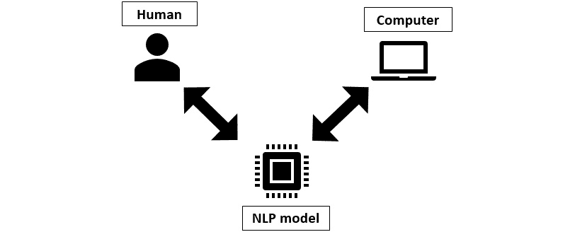

###### 图 1.1：自然语言处理

因此，自然语言处理是基于机器的人类沟通处理。它旨在教会机器如何处理和理解人类的语言，从而建立起人与机器之间的轻松沟通渠道。

例如，我们手机和智能音响中的个人语音助手，如 Alexa 和 Siri，就是自然语言处理的产物。它们的设计使得它们不仅能理解我们对它们说的话，还能根据我们的指示做出反应并提供反馈。自然语言处理算法帮助这些技术与人类进行交流。

在自然语言处理的上述定义中，需要考虑的关键点是沟通必须发生在人类的自然语言中。几十年来，我们通过编写程序来与机器沟通，执行特定的任务。然而，这些程序使用的语言并非自然语言，因为它们不是口语交流形式，也没有自然或有机发展。这些语言，如 Java、Python、C 和 C++，是为机器设计的，且始终以“机器能够理解和轻松处理什么”为出发点。

虽然 Python 是一种更易于使用的语言，因此对于人类来说更容易学习并编写代码，但基本的观点保持不变——为了与机器沟通，人类必须学习一种机器能够理解的语言。

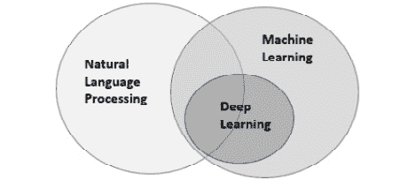

###### 图 1.2：自然语言处理的维恩图

自然语言处理的目的正好与此相反。与其让人类适应机器的方式，学习如何与机器有效沟通，不如让机器适应人类并学习人类的沟通方式。这更加合理，因为技术的目的是让我们的生活更轻松。

为了通过一个例子来说明这一点，你第一次编写的程序可能是一段要求计算机打印“hello world”的代码。这是你在遵循机器的规则，并要求它执行你所理解的语言中的任务。当你对语音助手发出命令说“hello world”，并且它返回“hello world”时，这是自然语言处理的应用示例，因为你正在使用自然语言（在此情况下是英语）与计算机进行交流。计算机则遵循你的交流方式，理解你说的话，处理你要求它执行的任务，然后执行该任务。

### 自然语言处理的重要性

下图展示了人工智能领域的各个部分：

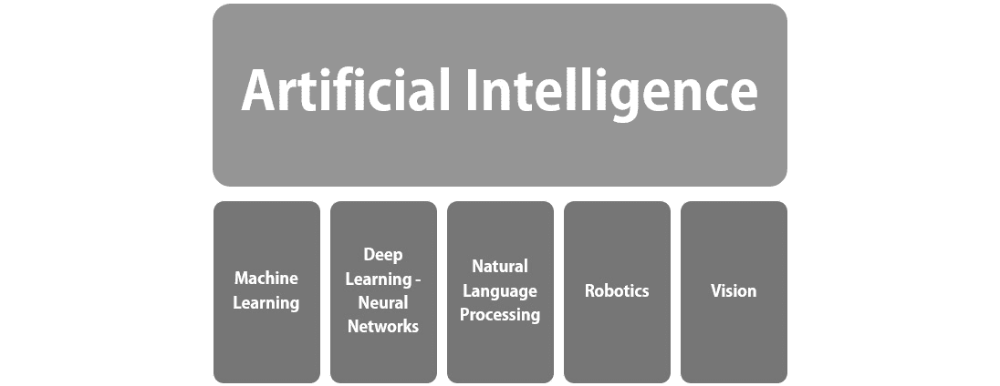

###### 图 1.3：人工智能及其部分子领域

自然语言处理与机器学习和深度学习一起，是人工智能的一个子领域，并且由于它处理的是自然语言，实际上它处于人工智能和语言学的交汇点。

如前所述，自然语言处理使得机器能够理解人类的语言，从而在两者之间建立一个高效的沟通渠道。然而，自然语言处理之所以必要，还有另一个原因，那就是，像机器一样，机器学习和深度学习模型在处理数值数据时效果最佳。数值数据对于人类来说很难自然产生；想象一下我们用数字而不是单词交流。因此，自然语言处理处理文本数据并将其转换为数值数据，使得机器学习和深度学习模型能够在其上进行训练。因此，它的存在是为了弥合人类与机器之间的沟通鸿沟，将人类的口语和书面语言转化为机器能够理解的数据。多亏了自然语言处理，机器能够理解、回答基于数据的问题、使用数据解决问题，并用自然语言进行沟通等。

## 自然语言处理的能力

自然语言处理在现实生活中有许多有益的应用，这些应用属于自然语言处理的三大主要能力：

+   语音识别

    机器能够识别口语形式的自然语言并将其转化为文本形式。一个例子是智能手机上的语音输入——你可以启用语音输入，向手机说话，手机会将你说的内容转化为文本。

+   自然语言理解

    机器能够理解自然语言的书面和口语形式。如果给出命令，机器能够理解并执行。一个例子是对着 iPhone 上的 Siri 说“嘿，Siri，打电话回家”，Siri 会自动为你拨打“家”的电话。

+   自然语言生成

    机器能够自主生成自然语言。一个例子是对 iPhone 上的 Siri 说“现在几点了？”，Siri 会回答时间——“现在是下午 2:08”。

这三种能力被用来完成和自动化许多任务。让我们来看看自然语言处理为哪些方面做出了贡献，以及如何做到的。

#### 注

文本数据被称为语料（复数），单个语料称为语料库。

## 自然语言处理的应用

下图展示了自然语言处理的一般应用领域：

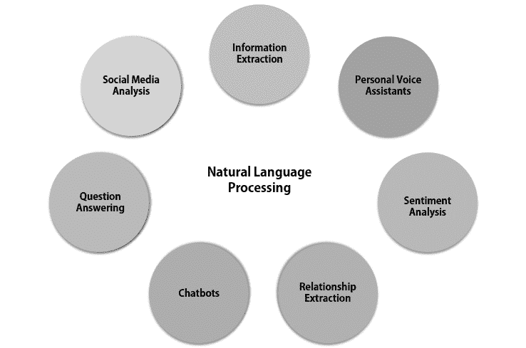

###### 图 1.4：自然语言处理的应用领域

+   自动文本摘要

    这涉及处理语料以提供总结。

+   翻译

    这包括翻译工具，能够将文本从一种语言翻译成另一种语言，例如谷歌翻译。

+   情感分析

    这也被称为情感人工智能或意见挖掘，是从书面和口头的语料中识别、提取和量化情感与情绪状态的过程。情感分析工具用于处理如客户评论和社交媒体帖子等内容，旨在理解人们对特定事物（如新餐厅的食品质量）的情绪反应和意见。

+   信息提取

    这是从语料中识别和提取重要术语的过程，称为实体。命名实体识别属于这一类别，这一过程将在下一章中进行解释。

+   关系提取

    关系抽取涉及从语料库中提取语义关系。语义关系存在于两个或更多实体（如人、组织和事物）之间，并且属于多种语义类别中的一种。例如，如果一个关系抽取工具收到一段关于 Sundar Pichai 及其作为谷歌首席执行官的描述，该工具能够输出“Sundar Pichai 为谷歌工作”，其中 Sundar Pichai 和谷歌是两个实体，而“为……工作”则是定义它们关系的语义类别。

+   聊天机器人

    聊天机器人是一种人工智能形式，旨在通过语音和文本与人类对话。它们大多数模仿人类，使你感觉像是在与另一个人交谈。聊天机器人在健康行业中被用于帮助那些遭受抑郁和焦虑的人。

+   社交媒体分析

    像 Twitter 和 Facebook 这样的社交媒体应用有话题标签和趋势，这些话题和趋势通过自然语言处理技术被跟踪和监控，以便了解全球范围内正在讨论的内容。此外，自然语言处理还协助内容审查过程，通过过滤负面、冒犯性和不当的评论和帖子，帮助维护社交平台的健康环境。

+   个人语音助手

    Siri、Alexa、Google Assistant 和 Cortana 都是个人语音助手，利用自然语言处理技术来理解并回应我们说的话。

+   语法检查

    语法检查软件会自动检查和修正你的语法、标点符号和打字错误。

### 文本预处理

在回答理解性阅读题时，问题是针对文章的不同部分的，因此，某些单词和句子对你来说很重要，而其他的则无关紧要。技巧在于从问题中识别关键词，并将其与文章进行匹配，从而找到正确的答案。

文本预处理的工作方式类似——机器不需要语料库中的无关部分，它只需要执行任务所需的重要单词和短语。因此，文本预处理技术涉及为语料库准备适当的分析，并为机器学习和深度学习模型做好准备。文本预处理基本上是告诉机器它需要考虑什么，以及可以忽略什么。

每个语料库根据需要执行的任务不同，要求采用不同的文本预处理技术，一旦你掌握了不同的预处理技术，你就会理解在何时、为何使用特定的技术。技术解释的顺序通常也是它们执行的顺序。

在接下来的练习中，我们将使用**NLTK** Python 库，但在进行活动时也可以自由使用其他库。**NLTK**代表**自然语言工具包**，它是最简单且最流行的 Python 自然语言处理库之一，这也是我们使用它来理解自然语言处理基本概念的原因。

#### 注意

如需了解更多关于 NLTK 的信息，请访问 https://www.nltk.org/。

### 文本预处理技术

以下是自然语言处理中的最流行的文本预处理技术：

+   小写/大写

+   噪声去除

+   文本标准化

+   词干提取

+   词形还原

+   分词

+   去除停用词

让我们逐一查看每种技术。

### 小写/大写

这是最简单且最有效的预处理技术之一，但人们常常忘记使用它。它可以将所有现有的大写字母转换为小写字母，使整个语料库都是小写的，或者将语料库中所有的小写字母转换为大写字母，使整个语料库都是大写的。

这种方法尤其适用于当语料库的大小不太大且任务涉及识别由于字符大小写不同而可能被识别为不同的术语或输出时，因为机器本身会将大写字母和小写字母视为独立的实体——'A'与'a'是不同的。输入中的这种大小写变体可能导致输出不正确或完全没有输出。

一个例子是，一个语料库中包含了'India'和'india'。如果没有进行小写转换，机器会将它们识别为两个不同的术语，而实际上它们只是同一个单词的不同形式，表示的是同一个国家。经过小写转换后，语料库中只会存在一个"India"的实例，即'india'，这简化了查找语料库中所有提到印度的地方的任务。

#### 注意

所有练习和活动将主要在 Jupyter Notebook 上开发。你需要在系统上安装 Python 3.6 和 NLTK。

练习 1 – 6 可以在同一个 Jupyter 笔记本中完成。

### 练习 1：对句子进行小写转换

在本次练习中，我们将输入一个包含大写和小写字母的句子，并将其全部转换为小写字母。以下步骤将帮助你完成该解决方案：

1.  打开**cmd**或根据你的操作系统打开其他终端。

1.  导航到所需路径并使用以下命令启动`Jupyter`笔记本：

    ```py
    jupyter notebook
    ```

1.  将输入句子存储在`'s = "The cities I like most in India are Mumbai, Bangalore, Dharamsala and Allahabad."`中

1.  应用`lower()`函数将大写字母转换为小写字母，然后打印出新的字符串，如下所示：

    ```py
    s = s.lower()
    print(s)
    ```

    **预期输出：**

    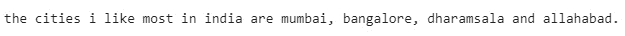

    ###### 图 1.5：包含混合大小写的句子的小写处理输出

1.  创建一个包含大写字符的单词数组，如下所示：

    ```py
    words = ['indiA', 'India', 'india', 'iNDia']
    ```

1.  使用列表推导，对`words`数组中的每个元素应用`lower()`函数，然后打印新数组，如下所示：

    ```py
    words = [word.lower() for word in words]
    print(words)
    ```

    **预期输出：**


###### 图 1.6：带混合大小写单词的小写化输出

### 噪声移除

噪声是一个非常通用的术语，在不同的语料库和任务中可能意味着不同的东西。对于一个任务来说被视为噪声的内容，可能在另一个任务中被认为是重要的，因此这是一个非常领域特定的预处理技术。例如，在分析推文时，标签可能对识别趋势和理解全球讨论的内容非常重要，但在分析新闻文章时，标签可能并不重要，因此在后者的情况下，标签就被视为噪声。

噪声不仅仅包括单词，还可以包括符号、标点符号、HTML 标记（**<**,**>**,*****, **?**,**.**）、数字、空格、停用词、特定术语、特定的正则表达式、非 ASCII 字符（**\W**|**\d+**）以及解析术语。

移除噪声至关重要，这样只有语料库中重要的部分才会被输入到模型中，从而确保准确的结果。它还通过将单词转化为根形态或标准形式来帮助分析。考虑以下示例：


###### 图 1.7：噪声移除输出

删除所有符号和标点符号后，所有“sleepy”的实例都对应于单一的单词形式，从而提高了语料库的预测和分析效率。

### 练习 2：移除单词中的噪声

在这个练习中，我们将输入一个包含噪声的单词数组（如标点符号和 HTML 标记），并将这些单词转换为清洁、无噪声的形式。为此，我们需要使用 Python 的正则表达式库。该库提供了多个函数，允许我们筛选输入数据并移除不必要的部分，这正是噪声移除过程的目标。

#### 注意

若要了解更多关于‘**re**’的信息，请点击 https://docs.python.org/3/library/re.html。

1.  在相同的`Jupyter`笔记本中，导入正则表达式库，如下所示：

    ```py
    import re
    ```

1.  创建一个名为`'clean_words'`的函数，该函数包含移除不同类型噪声的方法，如下所示：

    ```py
    def clean_words(text):

      #remove html markup
      text = re.sub("(<.*?>)","",text)
      #remove non-ascii and digits
      text=re.sub("(\W|\d+)"," ",text)
      #remove whitespace
      text=text.strip()
      return text 
    ```

1.  创建一个包含噪声的原始单词数组，如下所示：

    ```py
    raw = ['..sleepy', 'sleepy!!', '#sleepy', '>>>>>sleepy>>>>', '<a>sleepy</a>']
    ```

1.  对原始数组中的单词应用`clean_words()`函数，然后打印清理后的单词数组，如下所示：

    ```py
    clean = [clean_words(r) for r in raw]
    print(clean)
    ```

    **预期输出：**


###### 图 1.8：噪声移除输出

### 文本归一化

这是将原始语料库转换为规范和标准形式的过程，基本上是确保文本输入在分析、处理和操作之前保持一致。

文本标准化的示例包括将缩写映射到其完整形式，将同一单词的不同拼写转换为单一拼写形式，等等。

以下是一些不正确拼写和缩写的标准形式示例：


###### 图 1.9：不正确拼写的标准形式


###### 图 1.10：缩写的标准形式

由于标准化的方法非常依赖于语料库和具体任务，因此没有统一的标准方式。最常见的做法是使用字典映射法，即手动创建一个字典，将一个单词的各种形式映射到该单词的标准形式，然后将这些单词替换为该单词的标准形式。

### 词干提取

词干提取是在语料库上进行的，以将单词简化为它们的词干或词根形式。之所以说“词干或词根形式”，是因为词干提取的过程并不总是将单词还原为词根形式，有时只是简化为它的标准形式。

经历词干提取的单词称为屈折词。这些单词与词根形式不同，表示某种属性，例如数目或性别。例如，“journalists”是“journalist”的复数形式。因此，词干提取会去掉“`s`”，将“journalists”还原为它的词根形式：


###### 图 1.11：词干提取的输出

词干提取在构建搜索应用时非常有用，因为在搜索特定内容时，您可能还希望找到拼写不同的该内容的实例。例如，如果您在搜索本书中的练习，您可能还希望搜索到“Exercise”。

然而，词干提取并不总是提供所需的词干，因为它是通过去掉单词末尾的部分来工作的。词干提取器有可能将“troubling”还原为“troubl”而不是“trouble”，这对解决问题没有太大帮助，因此词干提取并不是一种常用的方法。当使用时，Porter 的词干提取算法是最常见的算法。

### 练习 3：对单词进行词干提取

在本练习中，我们将处理一个包含同一单词不同形式的输入数组，并将这些单词转换为它们的词干形式。

1.  在同一个`Jupyter`笔记本中，导入`nltk`和`pandas`库以及`Porter Stemmer`，如示例所示：

    ```py
    import nltk
    import pandas as pd
    from nltk.stem import PorterStemmer as ps
    ```

1.  创建一个`stemmer`实例，如下所示：

    ```py
    stemmer = ps()
    ```

1.  创建一个包含同一单词不同形式的数组，如下所示：

    ```py
    words=['annoying', 'annoys', 'annoyed', 'annoy']
    ```

1.  将词干提取器应用于`words`数组中的每个单词，并将它们存储在一个新数组中，如所示：

    ```py
    stems =[stemmer.stem(word = word) for word in words]
    ```

1.  将原始单词及其词干以数据框的形式打印，如下所示：

    ```py
    sdf = pd.DataFrame({'raw word': words,'stem': stems})
    sdf
    ```

    **预期输出：**


###### 图 1.12：词干提取的输出

### 词形还原

词形还原是一个类似于词干提取的过程——它的目的是将单词还原为其根本形式。与词干提取不同的是，词形还原不仅仅是通过剪切单词的结尾来获得根本形式，而是遵循一个过程，遵循规则，并且通常使用 WordNet 进行映射，将单词还原为其根本形式。（WordNet 是一个英语语言数据库，包含单词及其定义，此外还包含同义词和反义词。它被认为是词典和同义词词典的融合。）例如，词形还原能够将单词“better”转换为其根本形式“good”，因为“better”只是“good”的比较级形式。

尽管词形还原的这一特性使得它在与词干提取相比时更具吸引力和效率，但缺点是，由于词形还原遵循如此有序的程序，因此它比词干提取需要更多时间。因此，当你处理大规模语料库时，不推荐使用词形还原。

### 练习 4：对单词进行词形还原

在本练习中，我们将接收一个包含单词不同形式的输入数组，并将这些单词转换为其根本形式。

1.  在与前一个练习相同的`Jupyter`笔记本中，导入`WordNetLemmatizer`并下载`WordNet`，如所示：

    ```py
    from nltk.stem import WordNetLemmatizer as wnl
    nltk.download('wordnet')
    ```

1.  创建一个`lemmatizer`实例，如下所示：

    ```py
    lemmatizer = wnl()
    ```

1.  创建一个包含同一单词不同形式的数组，如示范所示：

    ```py
    words = ['troubling', 'troubled', 'troubles', 'trouble']
    ```

1.  对`words`数组中的每个单词应用`lemmatizer`，并将结果存储在一个新数组中，如下所示。`word`参数向词形还原函数提供它应还原的单词。`pos`参数是你希望词形还原为的词性。'`v`'代表动词，因此词形还原器会将单词还原为其最接近的动词形式：

    ```py
    # v denotes verb in "pos"
    lemmatized = [lemmatizer.lemmatize(word = word, pos = 'v') for word in words]
    ```

1.  打印原始单词及其根本形式，结果以数据框形式展示，如所示：

    ```py
    ldf = pd.DataFrame({'raw word': words,'lemmatized': lemmatized})
    ldf = ldf[['raw word','lemmatized']]
    ldf
    ```

    **预期输出：**


###### 图 1.13：词形还原的输出

### 分词

分词是将语料库拆解为单个词元的过程。词元是最常用的单词——因此，这个过程将语料库拆解为单个单词——但也可以包括标点符号和空格等其他元素。

这一技术是最重要的技术之一，因为它是很多自然语言处理应用的前提，我们将在下一章学习这些应用，比如**词性标注**（**PoS**）。这些算法将词元作为输入，不能使用字符串或段落文本作为输入。

可以通过分词将文本分解成单个单词或单个句子作为词元。让我们在接下来的练习中尝试这两种方法。

### 练习 5：词元化单词

在本练习中，我们将接收一个输入句子，并从中生成单个单词作为词元。

1.  在同一个`Jupyter`笔记本中，导入`nltk`：

    ```py
    import nltk
    ```

1.  从`nltk`导入`word_tokenize`和`punkt`，如所示：

    ```py
    nltk.download('punkt')
    from nltk import word_tokenize
    ```

1.  将单词存储在一个变量中，并对其应用 `word_tokenize()`，然后打印结果，如下所示：

    ```py
    s = "hi! my name is john."
    tokens = word_tokenize(s)
    tokens
    ```

    **预期输出：**


###### 图 1.14：单词分词的输出

如你所见，甚至标点符号也被分词并视为独立的标记。

现在让我们看看如何分词句子。

### 练习 6：句子分词

在本练习中，我们将从输入句子中生成单独的单词作为标记。

1.  在同一个 `Jupyter` 笔记本中，按如下方式导入 `sent_tokenize`：

    ```py
    from nltk import sent_tokenize
    ```

1.  将两个句子存储在一个变量中（我们之前的句子实际上是两个句子，所以可以使用同一个句子来查看单词分词和句子分词之间的区别），然后对其应用 `sent_tokenize()`，接着打印结果，如下所示：

    ```py
    s = "hi! my name is shubhangi."
    tokens = sent_tokenize(s)
    tokens
    ```

    **预期输出：**


###### 图 1.15：句子分词的输出

如你所见，两个句子已经形成了两个独立的标记。

### 其他技术

有多种方式可以进行文本预处理，包括使用各种 Python 库，如 **BeautifulSoup** 来剥离 HTML 标记。前面的练习是为了向你介绍一些技术。根据手头的任务，你可能只需要使用其中的一两个，或者全部使用它们，包括对它们所做的修改。例如，在噪声移除阶段，你可能觉得有必要移除像 'the'、'and'、'this' 和 'it' 这样的词。因此，你需要创建一个包含这些词的数组，并通过 **for** 循环将语料库中的词汇传递，只保留那些不在该数组中的词，去除噪声词。另一种方法将在本章后面介绍，且是在完成分词后执行的。

### 练习 7：移除停用词

在本练习中，我们将从输入句子中移除停用词。

1.  打开一个 `Jupyter` 笔记本，并使用以下代码行下载 '`stopwords`'：

    ```py
    nltk.download('stopwords')
    ```

1.  将一个句子存储在一个变量中，如下所示：

    ```py
    s = "the weather is really hot and i want to go for a swim"
    ```

1.  导入 `stopwords` 并创建一组英语停用词，如下所示：

    ```py
    from nltk.corpus import stopwords
    stop_words = set(stopwords.words('english'))
    ```

1.  使用 `word_tokenize` 对句子进行分词，然后将那些在 `stop_words` 中没有出现的标记存储在一个数组中。接着，打印该数组：

    ```py
    tokens = word_tokenize(s)
    tokens = [word for word in tokens if not word in stop_words]
    print(tokens)
    ```

    **预期输出：**


###### 图 1.16：移除停用词后的输出

此外，你可能需要将数字转换为其词语形式。这也是可以添加到噪声移除功能中的一种方法。此外，你可能需要使用缩写词库，它的作用是扩展文本中已有的缩写词。例如，缩写词库会将 'you're' 转换为 'you are'，如果这对你的任务是必要的，那么建议安装并使用该库。

文本预处理技术超出了本章所讨论的范围，可以包括任务或语料库中任何所需的内容和技术。在某些情况下，一些词语可能很重要，而在其他情况下则不重要。

## 词嵌入

如本章前面的部分所提到的，自然语言处理为机器学习和深度学习模型准备文本数据。当提供数值数据作为输入时，模型表现最为高效，因此自然语言处理的一个关键角色是将预处理后的文本数据转化为数值数据，这是文本数据的数值表示。

这就是词嵌入：它们是文本的数值表示，采用实值向量的形式。具有相似含义的词映射到相似的向量，因此具有相似的表示形式。这帮助机器学习不同单词的意义和上下文。由于词嵌入是映射到单个单词的向量，词嵌入只能在对语料库进行分词之后生成。


###### 图 1.17：词嵌入示例

词嵌入包括用于创建学习到的数值表示的各种技术，是表示文档词汇最流行的方式。词嵌入的优点在于，它们能够捕捉上下文、语义和句法的相似性，以及一个单词与其他单词的关系，从而有效地训练机器理解自然语言。这就是词嵌入的主要目的——形成类似向量的簇，这些簇对应于具有相似意义的词。

使用词嵌入的原因是为了让机器像我们一样理解同义词。以在线餐厅评论为例——这些评论由形容词描述食物、环境和整体体验。它们要么是积极的，要么是消极的，理解哪些评论属于这两类中的哪一类非常重要。自动分类这些评论可以为餐厅提供快速的见解，了解需要改进的地方，人们喜欢餐厅的哪些方面，等等。

存在多种可以归类为积极的形容词，消极形容词也是如此。因此，机器不仅需要能够区分负面和正面，还需要学习和理解多个单词可以归属于同一类别，因为它们最终意味着相同的东西。这就是词嵌入发挥作用的地方。

以餐饮服务应用上的餐厅评论为例。以下两句话来自两条不同的餐厅评论：

+   句子 A – 这里的食物很好。

+   句子 B – 这里的食物很好。

机器需要能够理解这两条评论都是积极的，并且它们意味着类似的内容，尽管这两句话中的形容词不同。这是通过创建词嵌入来实现的，因为两个词“good”和“great”分别映射到两个不同但相似的实际值向量，因此可以将它们聚集在一起。

### 词嵌入的生成

我们已经了解了什么是词嵌入以及它们的重要性；现在我们需要理解它们是如何生成的。将词语转换为其实际值向量的过程被称为向量化，这是通过词嵌入技术完成的。市面上有许多词嵌入技术，但在本章中，我们将讨论两种主要技术——Word2Vec 和 GloVe。一旦词嵌入（向量）被创建，它们会结合成一个向量空间，这是一个代数模型，由遵循向量加法和标量乘法规则的向量组成。如果你不记得线性代数的内容，现在可能是快速复习的好时机。

### Word2Vec

如前所述，Word2Vec 是一种词嵌入技术，用于从词语中生成向量——这从其名字上就能大致理解。

Word2Vec 是一个浅层神经网络——它只有两层——因此不算是深度学习模型。输入是一个文本语料库，机器使用它来生成向量作为输出。这些向量被称为输入语料库中单词的特征向量。它将语料库转换为深度神经网络能够理解的数值数据。

Word2Vec 的目标是理解两个或多个词语共同出现的概率，从而将具有相似意义的词语聚集在一起，形成向量空间中的一个簇。像其他机器学习或深度学习模型一样，Word2Vec 通过从过去的数据和单词的出现中学习，变得越来越高效。因此，如果提供足够的数据和上下文，它可以根据过去的出现和上下文准确地猜测一个词的含义，类似于我们如何理解语言。

例如，一旦我们听说并阅读过“boy”和“man”，“girl”和“woman”这些词，并理解它们的含义，我们就能建立起这些词之间的联系。同样，Word2Vec 也可以建立这种联系，并为这些词生成向量，这些向量彼此靠近，位于同一个簇中，以确保机器能够意识到这些词意味着相似的东西。

一旦 Word2Vec 接收到一个语料库，它会生成一个词汇表，其中每个词都有一个与之关联的向量，这被称为其神经词嵌入，简单来说，这个神经词嵌入就是用数字表示的词语。

### Word2Vec 的工作原理

Word2Vec 训练一个词与其在输入语料库中邻近的词进行对比，有两种方法可以实现这一点：

+   *连续词袋模型（CBOW）*：

    该方法根据上下文预测当前单词。因此，它将单词的周围单词作为输入，输出该单词，并根据该单词是否确实是句子的一部分来选择该单词。

    例如，如果算法提供了“the food was”这些单词并需要预测后面的形容词，它最有可能输出“good”而不是“delightful”，因为“good”出现的次数更多，因此它学到“good”的出现概率高于“delightful”。CBOW 被认为比跳字法更快，并且在频繁出现的单词上准确性更高。

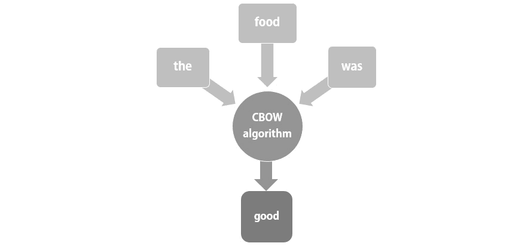

###### 图 1.18: CBOW 算法

+   *跳字法*

    该方法通过将一个单词作为输入，理解该单词的含义并将其与上下文关联，来预测周围的单词。例如，如果算法给定单词“delightful”，它需要理解该词的含义，并从过去的上下文中学习，预测出周围的单词是“the food was”的概率最大。跳字法通常认为在小型语料库中表现最好。

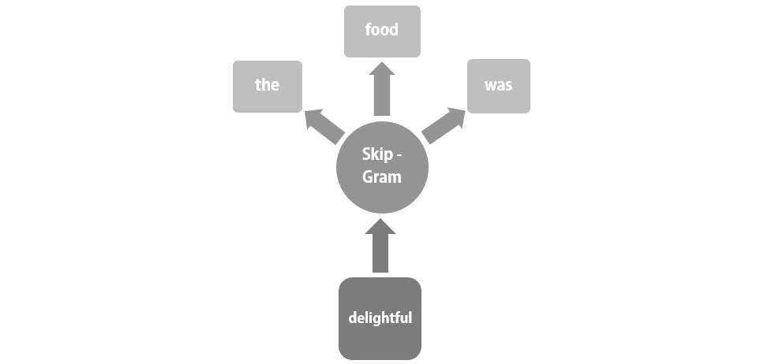

###### 图 1.19: 跳字法算法

虽然这两种方法看起来是相反的方式，但它们本质上是根据局部（附近）单词的上下文来预测单词；它们使用一个上下文窗口来预测接下来会出现哪个单词。这个窗口是一个可配置的参数。

选择使用哪种算法的决定取决于手头的语料库。CBOW 基于概率工作，因此会选择在特定上下文中出现概率最高的单词。这意味着它通常只会预测常见和频繁出现的单词，因为这些单词的概率最高，而罕见和不常见的单词则永远不会由 CBOW 生成。另一方面，跳字法预测上下文，因此，当给定一个单词时，它会将其视为一个新的观察，而不是将其与具有相似意义的现有单词进行比较。因此，罕见单词不会被跳过或忽视。然而，这也意味着跳字法需要大量的训练数据才能高效地工作。因此，根据训练数据和语料库的不同，应该决定使用哪种算法。

本质上，这两种算法以及整个模型，都需要一个强度很高的学习阶段，在这个阶段它们会经过数千、数百万个单词的训练，以便更好地理解上下文和含义。基于此，它们能够为单词分配向量，从而帮助机器学习和预测自然语言。为了更好地理解 Word2Vec，让我们通过 Gensim 的 Word2Vec 模型做一个练习。

Gensim 是一个开源库，用于使用统计机器学习进行无监督主题建模和自然语言处理。Gensim 的 Word2Vec 算法接收由单独的单词（令牌）组成的句子序列作为输入。

此外，我们还可以使用**min_count**参数。它的作用是问你一个单词在语料库中应该出现多少次才对你有意义，然后在生成词嵌入时考虑这一点。在实际场景中，当处理数百万个单词时，只出现一次或两次的单词可能完全不重要，因此可以忽略它们。然而，现在我们仅在三句话上训练模型，每句只有 5 到 6 个单词。因此，**min_count**设置为 1，因为即使一个单词只出现一次，对我们来说它也是重要的。

### 练习 8：使用 Word2Vec 生成词嵌入

在本练习中，我们将使用 Gensim 的 Word2Vec 算法，在分词后生成词嵌入。

#### 注意

你需要在系统上安装`gensim`才能进行以下练习。如果尚未安装，你可以使用以下命令进行安装：

`pip install --upgrade gensim`

如需更多信息，请点击 https://radimrehurek.com/gensim/models/word2vec.html。

以下步骤将帮助你完成该解答：

1.  打开一个新的`Jupyter`笔记本。

1.  从`gensim`导入 Word2Vec 模型，并从`nltk`导入`word_tokenize`，如所示：

    ```py
    from gensim.models import Word2Vec as wtv
    from nltk import word_tokenize
    ```

1.  将三个包含常见单词的字符串存入三个独立的变量中，然后对每个句子进行分词，并将所有令牌存储在一个数组中，如所示：

    ```py
    s1 = "Ariana Grande is a singer"
    s2 = "She has been a singer for many years"
    s3 = "Ariana is a great singer"
    sentences = [word_tokenize(s1), word_tokenize(s2), word_tokenize(s3)]
    ```

    你可以打印句子数组来查看令牌。

1.  如下所示，训练模型：

    ```py
    model = wtv(sentences, min_count = 1)
    ```

    Word2Vec 的`min_count`默认值为 5\。

1.  如所示，总结模型：

    ```py
    print('this is the summary of the model: ')
    print(model)
    ```

    你的输出将会是如下所示：

    

    ###### 图 1.20：模型摘要的输出

    Vocab = 12 表示输入模型的句子中有 12 个不同的单词。

1.  让我们通过总结模型来找出词汇表中存在哪些单词，如下所示：

    ```py
    words = list(model.wv.vocab)
    print('this is the vocabulary for our corpus: ')
    print(words)
    ```

    你的输出将会是如下所示：

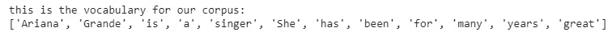

###### 图 1.21：语料库词汇表的输出

让我们来看一下单词‘singer’的向量（词嵌入）：

```py
print("the vector for the word singer: ")
print(model['singer'])
```

**期望输出：**

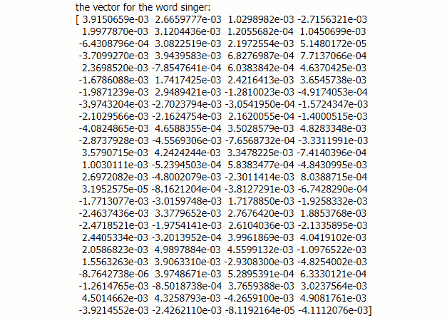

###### 图 1.22：单词‘singer’的向量

我们的 Word2Vec 模型已经在这三句话上进行了训练，因此它的词汇表仅包含这些句子中出现的单词。如果我们试图从 Word2Vec 模型中找到与某个特定输入单词相似的单词，由于词汇表非常小，我们不会得到任何实际有意义的单词。考虑以下例子：

```py
#lookup top 6 similar words to great
w1 = ["great"]
model.wv.most_similar (positive=w1, topn=6)
```

“positive”指的是在输出中仅展示正向的向量值。

与‘great’最相似的六个单词是：


###### 图 1.23：与“great”类似的词向量

类似地，对于“singer”这个词，它可能是如下所示：

```py
#lookup top 6 similar words to singer
w1 = ["singer"]
model.wv.most_similar (positive=w1, topn=6)
```


###### 图 1.24：与“singer”类似的词向量

我们知道这些词与我们的输入词在意义上并不相似，这也体现在它们旁边的相关性值中。然而，它们会出现在这里，因为它们是我们词汇中唯一存在的词。

`Gensim` Word2Vec 模型的另一个重要参数是大小参数。它的默认值是 100，表示用于训练模型的神经网络层的大小。这对应于训练算法的自由度。较大的大小需要更多的数据，但也会提高准确性。

#### 注意

有关 Gensim Word2Vec 模型的更多信息，请点击

https://rare-technologies.com/word2vec-tutorial/.

### GloVe

GloVe，"global vectors" 的缩写，是一种由斯坦福大学开发的词嵌入技术。它是一种无监督学习算法，基于 Word2Vec。虽然 Word2Vec 在生成词嵌入方面非常成功，但它的问题在于它有一个较小的窗口，通过这个窗口它集中关注局部词汇和局部上下文来预测词汇。这意味着它无法从全局词频中学习，也就是说，无法从整个语料库中学习。正如其名称所示，GloVe 会查看语料库中出现的所有词汇。

虽然 Word2Vec 是一种预测模型，它通过学习向量来提高预测能力，但 GloVe 是一种基于计数的模型。这意味着 GloVe 通过对共现计数矩阵进行降维来学习向量。GloVe 能够建立的连接如下所示：

*king – man + woman = queen*

这意味着它能够理解“king”和“queen”之间的关系与“man”和“woman”之间的关系相似。

这些是复杂的术语，所以我们一个个来理解。所有这些概念来自于统计学和线性代数，如果你已经了解这些内容，可以跳过活动部分！

在处理语料库时，存在根据词频构建矩阵的算法。基本上，这些矩阵包含文档中出现的词作为行，列则是段落或单独的文档。矩阵的元素表示词在文档中出现的频率。自然地，对于一个大型语料库，这个矩阵会非常庞大。处理这样一个大型矩阵将需要大量的时间和内存，因此我们进行降维处理。这是减少矩阵大小的过程，使得可以对其进行进一步操作。

对于 GloVe 来说，矩阵被称为共现计数矩阵，包含单词在语料库中特定上下文中出现的次数信息。行是单词，列是上下文。然后，这个矩阵会被分解以减少维度，新的矩阵为每个单词提供了一个向量表示。

GloVe 还具有预训练的单词，并附有向量，可以在语义匹配语料库和任务时使用。以下活动将引导您完成在 Python 中实现 GloVe 的过程，不过代码不会直接给出，所以您需要动脑筋，甚至可能需要一些谷歌搜索。试试看！

### 练习 9：使用 GloVe 生成词嵌入

在本练习中，我们将使用**Glove-Python**生成词嵌入。

#### 注意

要在您的平台上安装 Glove-Python，请访问 https://pypi.org/project/glove/#files。

从 http://mattmahoney.net/dc/text8.zip 下载 Text8Corpus。

提取文件并将其与您的 Jupyter 笔记本一起存储。

1.  导入`itertools`：

    ```py
    import itertools
    ```

1.  我们需要一个语料库来生成词嵌入，而幸运的是，`gensim.models.word2vec`库中有一个名为`Text8Corpus`的语料库。导入它和**Glove-Python**库中的两个模块：

    ```py
    from gensim.models.word2vec import Text8Corpus
    from glove import Corpus, Glove
    ```

1.  使用`itertools`将语料库转换为列表形式的句子：

    ```py
    sentences = list(itertools.islice(Text8Corpus('text8'),None))
    ```

1.  启动`Corpus()`模型并将其拟合到句子上：

    ```py
    corpus = Corpus()
    corpus.fit(sentences, window=10)
    ```

    `window`参数控制考虑多少个相邻单词。

1.  现在我们已经准备好了语料库，需要训练嵌入。启动`Glove()`模型：

    ```py
    glove = Glove(no_components=100, learning_rate=0.05)
    ```

1.  基于语料库生成共现矩阵，并将`glove`模型拟合到此矩阵上：

    ```py
    glove.fit(corpus.matrix, epochs=30, no_threads=4, verbose=True)
    ```

    模型已训练完成！

1.  添加语料库的字典：

    ```py
    glove.add_dictionary(corpus.dictionary)
    ```

1.  使用以下命令查看根据生成的词嵌入，哪些单词与您选择的单词相似：

    ```py
    glove.most_similar('man')
    ```

    **预期输出：**


###### 图 1.25：'man'的词嵌入输出

您可以尝试对多个不同的单词进行此操作，看看哪些单词与它们相邻并且最相似：

```py
glove.most_similar('queen', number = 10)
```

**预期输出：**

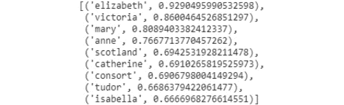

###### 图 1.26：'queen'的词嵌入输出

#### 注意

若要了解更多关于 GloVe 的信息，请访问 https://nlp.stanford.edu/projects/glove/。

### 活动 1：使用 Word2Vec 从语料库生成词嵌入。

您的任务是基于特定语料库（此处为 Text8Corpus）训练 Word2Vec 模型，确定哪些单词彼此相似。以下步骤将帮助您解决问题。

#### 注意

您可以在 http://mattmahoney.net/dc/text8.zip 找到文本语料库文件。

1.  从先前给出的链接上传文本语料库。

1.  从`gensim`模型中导入`word2vec`。

1.  将语料库存储在一个变量中。

1.  在语料库上拟合 word2vec 模型。

1.  找到与“man”最相似的单词。

1.  *'Father' 对 'girl'，'x' 对 'boy'。* 找到 x 的前 3 个单词。

    #### 注意

    活动的解决方案可以在第 296 页找到。

    **预期输出：**

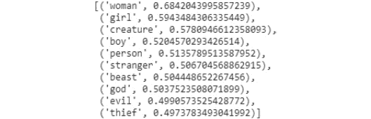

###### 图 1.27：相似词嵌入的输出

'`x`'的前三个词可能是：


###### 图 1.28：'x'的前三个词的输出

## 摘要

在本章中，我们了解了自然语言处理如何使人类和机器能够使用自然语言进行交流。自然语言处理有三大应用领域，分别是语音识别、自然语言理解和自然语言生成。

语言是复杂的，因此文本需要经过多个阶段，才能让机器理解。这个过滤过程称为文本预处理，包含了多种技术，服务于不同的目的。它们都是任务和语料库依赖的，并为将文本输入到机器学习和深度学习模型中做好准备。

由于机器学习和深度学习模型最适合处理数值数据，因此有必要将预处理过的语料库转换为数值形式。此时，词嵌入便登场了；它们是单词的实值向量表示，帮助模型预测和理解单词。生成词嵌入的两种主要算法是 Word2Vec 和 GloVe。

在下一章中，我们将基于自然语言处理算法进行深入探讨。我们将介绍和解释词性标注和命名实体识别的过程。
