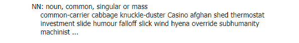

# 第三章

# 自然语言处理的应用

## 学习目标

在本章结束时，你将能够：

+   描述词性标注及其应用

+   区分基于规则的词性标注器和基于随机的词性标注器

+   对文本数据执行词性标注、词块分析和分块

+   执行命名实体识别进行信息提取

+   开发并训练你自己的词性标注器和命名实体识别器

+   使用 NLTK 和 spaCy 执行词性标注（POS tagging）、词块分析（chunking）、分块（chinking）和命名实体识别（Named Entity Recognition）

本章旨在向你介绍自然语言处理的众多应用及其涉及的各种技术。

## 引言

本章从快速回顾自然语言处理是什么以及它可以提供哪些服务开始。接着，讨论自然语言处理的两个应用：**词性标注（POS tagging）**和**命名实体识别（Named Entity Recognition）**。解释了这两种算法的功能、必要性和目的。此外，还有一些练习和活动，用于执行词性标注和命名实体识别，并构建和开发这些算法。

自然语言处理旨在帮助机器理解人类的自然语言，以便有效地与人类沟通并自动化大量任务。上一章讨论了自然语言处理的应用以及这些技术如何简化人类生活的实际案例。本章将特别探讨其中的两种算法及其现实应用。

自然语言处理的各个方面都可以类比为语言教学。在上一章中，我们看到机器需要被告知关注语料库的哪些部分，哪些部分是无关紧要的。它们需要被训练去去除停用词和噪声元素，专注于关键词，将同一词的不同形式归约为词根，这样就能更容易地进行搜索和解读。以类似的方式，本章讨论的两种算法也教会机器一些关于语言的特定知识，正如我们人类在学习语言时所经历的。

## 词性标注

在我们深入了解算法之前，先来了解什么是词性。词性是我们在学习英语的早期阶段被教授的内容。它们是根据单词的句法或语法功能对单词进行分类的方式。这些功能是不同单词之间存在的功能性关系。

### 词性

英语有九大主要词性：

+   *名词*：事物或人

+   示例：table（桌子）、dog（狗）、piano（钢琴）、London（伦敦）、towel（毛巾）

+   *代词*：替代名词的词

+   示例：I（我）、you（你）、he（他）、she（她）、it（它）

+   *动词*：表示动作的词

+   示例：to be（是）、to have（有）、to study（学习）、to learn（学习）、to play（玩）

+   *形容词*：描述名词的词

+   示例：intelligent（聪明的）、small（小的）、silly（傻的）、intriguing（有趣的）、blue（蓝色的）

+   *限定词*：限制名词的词

+   示例：a few（一些）、many（许多）、some（一些）、three（三个）

    #### 注意

    想了解更多限定词的例子，请访问 [`www.ef.com/in/english-resources/english-grammar/determiners/`](https://www.ef.com/in/english-resources/english-grammar/determiners/)。

+   *副词*：描述动词、形容词或副词本身的词

+   示例：quickly（快速地）、shortly（很快）、very（非常）、really（真的）、drastically（急剧地）

+   *介词*：将名词与其他词连接的词

+   示例：to（到）、on（在……上）、in（在……里面）、under（在……下）、beside（在……旁边）

+   *连词*：连接两个句子或词语的词

+   示例：and（和）、but（但是）、yet（然而）

+   *感叹词*：表示惊叹的词语

+   示例：ouch!（哎呀！）、Ow!（啊！）、Wow!（哇！）

如你所见，每个词都被分配了一个特定的词性标签，这帮助我们理解词的意义和用途，使我们更好地理解其使用的上下文。

### 词性标注器

词性标注是为一个词分配标签的过程。这是通过一种叫做词性标注器的算法完成的。该算法的目标其实就是这么简单。

大多数词性标注器是监督式学习算法。如果你不记得什么是监督式学习算法，它是基于先前标注的数据学习执行任务的机器学习算法。算法将数据行作为输入。这些数据包含特征列——用于预测某些事物的数据——通常还包括一个标签列——需要预测的事物。模型在这些输入数据上进行训练，学习和理解哪些特征对应于哪些标签，从而学会如何执行预测标签的任务。最终，它们会接收到未标注的数据（仅包含特征列的数据），并根据这些数据预测标签。

以下图示是监督式学习模型的一般示意图：


###### 图 2.1：监督式学习

#### 注意

想了解更多关于监督式学习的信息，请访问 [`www.packtpub.com/big-data-and-business-intelligence/applied-supervised-learning-python`](https://www.packtpub.com/big-data-and-business-intelligence/applied-supervised-learning-python)。

因此，词性标注器通过学习先前标注过的数据集来提升其预测能力。在这种情况下，数据集可以包含各种特征，比如词本身（显然）、词的定义、词与其前后及其他相关词语（在同一句话、短语或段落中出现的）之间的关系。这些特征共同帮助标注器预测应该为一个词分配什么词性标签。用于训练监督式词性标注器的语料库被称为预标注语料库。这样的语料库作为构建系统的基础，帮助词性标注器为未标注的词进行标注。这些系统/类型的词性标注器将在下一节中讨论。

然而，预标注的语料库并不总是现成可用的，而且为了准确训练标注器，语料库必须足够大。因此，最近有一些词性标注器的迭代版本可以被视为无监督学习算法。这些算法以仅包含特征的数据为输入。这些特征不与标签相关联，因此，算法不是预测标签，而是根据输入数据形成分组或聚类。

在词性标注的过程中，模型使用计算方法自动生成一组词性标签。而预标注语料库则在监督式词性标注器的情况下帮助创建标注器的系统，而在无监督词性标注器的情况下，这些计算方法则作为创建此类系统的基础。无监督学习方法的缺点在于，自动生成的词性标签集可能并不像用于训练监督方法的预标注语料库中的标签那么准确。

总结来说，监督学习和无监督学习方法的关键区别如下：

+   监督式词性标注器以预标注的语料库作为输入进行训练，而无监督词性标注器则以未标注的语料库作为输入，创建一组词性标签。

+   监督式词性标注器根据标注语料库创建包含相应词性标签的单词词典，而无监督式词性标注器则使用自创的词性标签集生成这些词典。

几个 Python 库（如 NLTK 和 spaCy）都有自己训练的词性标注器。你将在接下来的章节中学习如何使用其中一个，但现在先让我们通过一个示例来理解词性标注器的输入和输出。需要记住的一个重要点是，由于词性标注器会为给定语料库中的每个单词分配一个词性标签，因此输入需要以单词标记的形式提供。因此，在进行词性标注之前，需要对语料库进行标记化处理。假设我们给训练过的词性标注器输入以下标记：

```py
['I', 'enjoy', 'playing', 'the', 'piano']
```

在进行词性标注后，输出将类似于以下内容：

```py
['I_PRO', 'enjoy_V', 'playing_V', 'the_DT', piano_N']
```

这里，**PRO** = 代词，**V** = 动词，**DT** = 限定词，**N** = 名词。

训练过的监督式和无监督式词性标注器的输入和输出是相同的：分别是标记和带词性标签的标记。

#### 注意

这不是输出的确切语法；你将在进行练习时看到正确的输出。这里仅仅是为了让你了解词性标注器的作用。

上述的词性只是非常基础的标签，为了简化自然语言理解的过程，词性算法创建了更为复杂的标签，这些标签是这些基础标签的变体。以下是完整的带描述的词性标签列表：


###### 图 2.2：带描述的词性标签

这些标签来自宾夕法尼亚树库标签集（[`www.ling.upenn.edu/courses/Fall_2003/ling001/penn_treebank_pos.html`](https://www.ling.upenn.edu/courses/Fall_2003/ling001/penn_treebank_pos.html)），它是最流行的标签集之一。大多数英语语言的预训练标注器都使用这个标签集进行训练，包括 NLTK 的词性标注器。

## 词性标注的应用

就像文本预处理技术通过促使机器专注于重要细节，帮助机器更好地理解自然语言一样，词性标注帮助机器解读文本的上下文，从而理解它。虽然文本预处理更像是清理阶段，但词性标注实际上是机器开始独立输出关于语料库有价值信息的部分。

理解哪些词对应哪些词性，对于机器处理自然语言有多种好处：

+   词性标注对于区分同形异义词非常有用——这些词虽然拼写相同，但意思却不同。例如，单词“play”可以作为动词，表示参与某项活动，也可以作为名词，表示一种在舞台上表演的戏剧作品。词性标注器可以帮助机器通过确定“play”的词性标签，理解该词在上下文中的使用情况。

+   词性标注建立在句子和单词分割的需求之上——这是自然语言处理的基本任务之一。

+   词性标签被用于其他算法执行更高层次的任务，其中之一就是我们将在本章中讨论的命名实体识别。

+   词性标签也有助于情感分析和问答的过程。例如，在句子“Tim Cook 是这家科技公司的 CEO”中，你希望机器能够将“这家科技公司”替换为公司的名称。词性标注可以帮助机器识别出“这家科技公司”是一个限定词（（this）+名词短语（technology company））。它可以利用这些信息，例如，搜索网上的文章并检查“Tim Cook 是 Apple 的 CEO”出现的次数，进而判断 Apple 是否是正确答案。

因此，词性标注是理解自然语言过程中的一个重要步骤，因为它有助于其他任务的完成。

### 词性标注器的类型

正如我们在前一节中所看到的，词性标注器可以是监督学习型或无监督学习型。这一差异在很大程度上影响了标注器的训练方式。还有另一个区分点影响着标注器如何为未标注的词分配标签，这就是用于训练标注器的方法。

词性标注器有两种类型：基于规则的和随机的。我们来看看这两者。

### 基于规则的词性标注器

这些词性标注器的工作方式几乎完全如其名称所示——通过规则。为标注器提供规则集的目的是确保它们在大多数情况下准确标注歧义/未知单词，因此大多数规则仅在标注器遇到歧义/未知单词时应用。

这些规则通常被称为上下文框架规则，向标注器提供上下文信息，以帮助它们理解给歧义单词分配哪个标签。一个规则的示例是：如果一个歧义/未知单词 x 前面跟着一个限定词，后面跟着一个名词，则为其分配形容词标签。一个例子是“one small girl”，其中“one”是限定词，“girl”是名词，因此标注器会给“small”分配形容词标签。

规则取决于你对语法的理论。此外，规则通常还包括诸如大写和标点符号的规则。这可以帮助你识别代词，并将其与句子开头（跟随句号）出现的单词区分开来。

大多数基于规则的词性标注器是监督学习算法，旨在学习正确的规则并将其应用于正确标注歧义词。然而，最近也有实验尝试使用无监督的方式训练这些标注器。未标记的文本提供给标注器进行标注，然后人类检查输出的标签，纠正任何不准确的标签。这些正确标注的文本随后会提供给标注器，以便它可以在两个不同的标签集之间发展出修正规则，并学习如何准确标注单词。

这种基于修正规则的词性标注器的一个例子是布里尔的标注器，它遵循之前提到的过程。它的功能可以与绘画艺术进行比较——在给房子上色时，首先涂上房子的背景色（例如，一个棕色的方形），然后在背景上使用更细的画笔绘制细节，如门和窗户。类似地，布里尔的基于规则的词性标注器的目标是首先一般性地标注一个未标注的语料库，即使某些标签可能是错误的，然后重新检查这些标签，理解哪些标签是错误的并从中学习。

#### **注意**

练习 10-16 可以在同一个 Jupyter Notebook 中进行。

### 练习 10：执行基于规则的词性标注

NLTK 有一个基于规则的词性标注器。在本练习中，我们将使用 NLTK 的词性标注器进行词性标注。以下步骤将帮助你解决这个问题：

1.  打开 cmd 或终端，具体取决于你的操作系统。

1.  导航到所需路径，并使用以下命令启动`Jupyter` Notebook：

    ```py
    jupyter notebook
    ```

1.  导入`nltk`和`punkt`，如所示：

    ```py
    import nltk
    nltk.download('punkt')
    nltk.download('averaged_perceptron_tagger')
    nltk.download('tagsets')
    ```

1.  将输入字符串存储在一个名为`s`的变量中，如下所示：

    ```py
    s = 'i enjoy playing the piano'
    ```

1.  如示例所示，对句子进行分词：

    ```py
    tokens = nltk.word_tokenize(s)
    ```

1.  对词元应用词性标注器，然后打印标签集，如下所示：

    ```py
    tags = nltk.pos_tag(tokens)
    tags
    ```

    你的输出将如下所示：

    

    ###### 图 2.3：标注输出

1.  要理解 "`NN`" 词性标签的含义，你可以使用以下代码行：

    ```py
    nltk.help.upenn_tagset("NN")
    ```

    输出结果将如下所示：

    

    ###### 图 2.4：名词详情

    你可以通过将“NN”替换为每个词性标签来对每个词性标签进行处理。

    让我们通过一个包含同义词的句子来尝试一下。

1.  将包含同义词的输入字符串存储在一个名为 sent 的变量中：

    ```py
    sent = 'and so i said im going to play the piano for the play tonight'
    ```

1.  对这个句子进行分词处理，并像示例中一样应用词性标注器：

    ```py
    tagset = nltk.pos_tag(nltk.word_tokenize(sent))
    tagset
    ```

    **预期输出：**


###### 图 2.5：标注输出

如你所见，第一个“play”实例被标注为“**VB**”，代表动词，基本形式，第二个“play”实例被标注为“**NN**”，代表名词。因此，词性标注器能够区分同义词和同一单词的不同实例。这有助于机器更好地理解自然语言。

### 随机词性标注器

随机词性标注器是使用除基于规则的方法之外的任何方法为单词分配标签的标注器。因此，有很多方法属于随机类别。所有在为单词确定词性标签时，采用统计方法（如概率和频率）模型的标注器都是随机模型。

我们将讨论三种模型：

+   单字法或词频方法

+   n-gram 方法

+   隐马尔可夫模型

*单字法或词频方法*

最简单的随机词性标注器仅根据一个词与标签出现的概率来为模糊的单词分配词性标签。这基本上意味着，标注器在训练集中最常与某个单词关联的标签，就是它为该模糊单词实例分配的标签。例如，假设训练集中，“beautiful”一词大多数情况下被标注为形容词。当词性标注器遇到“beaut”时，它不能直接标注该词，因为它不是一个有效的单词。这个词将是一个模糊词，因此它将计算它可能属于每个词性标签的概率，基于该词在不同实例中被标注为每个词性标签的频率。“beaut”可以看作是“beautiful”的模糊形式，并且由于“beautiful”大多数时候被标注为形容词，词性标注器也会将“beaut”标注为形容词。这被称为词频方法，因为标注器正在检查与单词关联的词性标签的频率。

*n-gram 方法*

这一方法建立在之前的基础上。名称中的 **n** 代表在确定一个单词属于某一词性标签的概率时考虑的单词数量。在单字法标注器中，**n = 1**，因此只考虑单词本身。增加 **n** 的值会导致标注器计算特定的 n 个词性标签序列共同出现的概率，并根据该概率为单词分配标签。

在为单词分配标签时，这些 POS 标注器通过考虑它的类型和前面 n 个单词的 POS 标签来创建单词的上下文。根据上下文，标注器选择最可能与前面单词标签序列一致的标签，并将其分配给所讨论的单词。最流行的 n-gram 标注器称为维特比算法。

*隐马尔可夫模型*

*隐马尔可夫模型结合了词频方法和 n-gram 方法。马尔可夫模型描述了事件或状态的序列。每个状态发生的概率仅依赖于前一个事件的状态。这些事件基于观察。隐马尔可夫模型的“隐藏”方面在于，事件可能是一组隐藏状态。*

*在 POS 标注的情况下，观察结果是单词标记，而隐藏的状态集合是 POS 标签。工作方式是模型根据前一个词的标签计算当前词具有特定标签的概率。例如，P（V | NN）是当前单词是动词的概率，假设前一个单词是名词。*

#### *注意*

*这是对隐马尔可夫模型的非常基本的解释。要了解更多，请访问* https://medium.freecodecamp.org/an-introduction-to-part-of-speech-tagging-and-the-hidden-markov-model-953d45338f24。

要了解更多有关随机模型的信息，请访问 http://ccl.pku.edu.cn/doubtfire/NLP/Lexical_Analysis/Word_Segmentation_Tagging/POS_Tagging_Overview/POS%20Tagging%20Overview.htm。

之前提到的三种方法按顺序解释了每个模型是如何在前一个模型的基础上构建并提高精度的。然而，每个建立在前一个模型基础上的模型涉及更多的概率计算，因此将根据训练语料库的大小来进行更多的计算时间。因此，选择使用哪种方法取决于语料库的大小。

### 练习 11：执行随机 POS 标注

spaCy 的 POS 标注器是一种随机标注器。在本练习中，我们将使用 spaCy 的 POS 标注器对一些句子进行标记，以查看基于规则和随机标注之间的结果差异。以下步骤将帮助您解决问题：

#### 注意

要安装 spaCy，请点击以下链接并按照说明操作：https://spacy.io/usage

1.  导入`spaCy`：

    ```py
    import spacy
    ```

1.  加载 spaCy 的'`en_core_web_sm`'模型：

    ```py
    nlp = spacy.load('en_core_web_sm')
    ```

    spaCy 有针对不同语言的特定模型。'en_core_web_sm'模型是英语语言模型，已经在书面网络文本（如博客和新闻文章）上进行了训练，包括词汇、句法和实体。

    #### 注意

    要了解更多有关 spaCy 模型的信息，请访问 https://spacy.io/models。

1.  在您要为其分配 POS 标签的句子上拟合模型。让我们使用我们给 NLTK 的 POS 标注器的句子：

    ```py
    doc = nlp(u"and so i said i'm going to play the piano for the play tonight")
    ```

1.  现在，让我们对这个句子进行标记化，分配 POS 标签，并打印它们：

    ```py
    for token in doc:
        print(token.text, token.pos_, token.tag_)
    ```

    **预期输出：**


###### 图 2.6：词性标注输出

若要理解词性标注的含义，可以使用以下代码：

```py
spacy.explain("VBZ")
```

用你想了解的词性标注替换"VBZ"。在这种情况下，你的输出将是：

```py
'verb, 3rd person singular present'
```

正如你所见，结果与 NLTK 词性标注器的输出基本相同。这是因为我们的输入非常简单。

## 分块处理

词性标注器处理单独的词元进行标注。然而，单独对每个词进行标注并不是理解语料库的最佳方式。例如，'United'和'Kingdom'分开时意义不大，但'United Kingdom'作为一个整体告诉机器这代表一个国家，从而提供更多的上下文和信息。正是在这个过程中，分块处理发挥了作用。

分块处理是一种算法，它以单词及其词性标注作为输入。它处理这些单独的词元及其标注，查看它们是否可以组合。一个或多个单独的词元的组合被称为一个分块，分配给该分块的词性标注称为分块标记。

分块标记是基本词性标记的组合。通过这些标记更容易定义短语，而且比简单的词性标记更高效。这些短语即为分块。有时单个词也会被视为一个分块并分配分块标记。常见的五种主要分块标记如下：

+   *名词短语* (*NP*)：这些是以名词为核心词的短语。它们作为动词或动词短语的主语或宾语。

+   *动词短语* (*VP*)：这些是以动词为核心词的短语。

+   *形容词短语* (*ADJP*)：这些是以形容词为核心词的短语。形容词短语的主要功能是描述和修饰名词或代词。它们通常位于名词或代词之前或之后。

+   *副词短语* (*ADVP*): 这些是以副词为核心词的短语。它们通过提供描述和修饰名词或动词的细节，用来作为这些词的修饰语。

+   *介词短语* (*PP*)：这些是以介词为核心词的短语。它们用来定位动作或实体在时间或空间中的位置。

例如，在句子“the yellow bird is slow and is flying into the brown house”中，以下短语将被分配相应的分块标记：

'the yellow bird' – NP

'is' – VP

'slow' – ADJP

'is flying' – VP

'into' – PP

'the brown house' – NP

因此，分块处理是在对语料库应用词性标注（POS tagging）之后进行的。这使得文本能够被分解为最简单的形式（单词的词元），对其结构进行分析，然后再重新组合成有意义的更高级别的分块。分块处理还有助于命名实体识别的过程。我们将在接下来的部分看到具体如何进行。

NLTK 库内的块解析器是基于规则的，因此需要提供一个正则表达式作为规则来输出具有其块标签的块。**spaCy**可以在没有规则的情况下执行分块。让我们看看这两种方法。

### 练习 12：使用 NLTK 执行分块

在这个练习中，我们将生成块和块标签。**nltk**有一个正则表达式解析器。这需要一个短语的正则表达式和相应的块标签作为输入。然后它在语料库中搜索这个表达式并分配标签。

由于分块与词性标记一起工作，我们可以在词性标记练习的基础上扩展代码。我们在 'tagset' 中保存了具有各自词性标记的标记。让我们使用它。以下步骤将帮助您解决问题：

1.  创建一个正则表达式，将搜索一个名词短语，如下所示：

    ```py
    rule = r"""Noun Phrase: {<DT>?<JJ>*<NN>}"""
    ```

    此正则表达式搜索一个限定词（可选）、一个或多个形容词，然后是一个名词。这将形成一个称为`名词短语`的块。

    #### 注意

    如果您不知道如何编写正则表达式，请查看这些快速教程：https://www.w3schools.com/python/python_regex.asp https://pythonprogramming.net/regular-expressions-regex-tutorial-python-3/

1.  创建一个`RegexpParser`的实例，并将规则传递给它：

    ```py
    chunkParser = nltk.RegexpParser(rule)
    ```

1.  将 `tagset` 包含具有各自词性标记的标记传递给 `chunkParser`，以便它可以执行分块，然后绘制块：

    ```py
    chunked = chunkParser.parse(tagset)
    chunked.draw()
    ```

    #### 注意

    对于 `.draw()` 函数能正常工作，matplotlib 需要在您的机器上安装。

    您的输出将类似于这样：

    

    ###### 图 2.7：解析树。

    这是一个解析树。如您所见，分块过程已识别出名词短语并加标签，剩余的标记显示它们的词性标签。

1.  让我们用另一句话试试同样的事情。将输入句子存储在另一个变量中：

    ```py
    a = "the beautiful butterfly flew away into the night sky"
    ```

1.  使用 NLTK 的 POS 标记器对句子进行标记化和词性标注：

    ```py
    tagged = nltk.pos_tag(nltk.word_tokenize(a))
    ```

1.  重复第 3 步：

    ```py
    chunked2 = chunkParser.parse(tagged)
    chunked2.draw()              
    ```

    **期望的输出：**


###### 图 2.8：分块的输出。

### 练习 13：使用 spaCy 执行分块

在这个练习中，我们将使用 spaCy 实现分块。**spaCy**不需要我们制定规则来识别块；它自动识别块并告诉我们头词是什么，从而告诉我们块标签是什么。让我们使用与练习 12 相同的句子识别一些名词块。以下步骤将帮助您解决问题：

1.  在这个句子上，使用 `spaCy` 的英文模型进行适配：

    ```py
    doc = nlp(u"the beautiful butterfly flew away into the night sky")
    ```

1.  在这个模型上应用 `noun_chunks`，对于每个块，打印块的文本、块的根词和连接根词与其头部的依赖关系：

    ```py
    for chunk in doc.noun_chunks:
        print(chunk.text, chunk.root.text, chunk.root.dep_)
    ```

    **期望的输出：**


###### 图 2.9：使用 spaCy 进行分块的输出

如您所见，与 NLTK 相比，spaCy 的分块要简单得多。

## Chinking

切除操作是分块的扩展，正如你从它的名字中可能已经猜到的那样。它不是处理自然语言中的必选步骤，但它可以是有益的。

切除操作发生在分块之后。分块后，你会得到带有分块标签的块，以及带有词性标签的单个单词。通常，这些多余的单词是没有必要的。它们对最终结果或理解自然语言的整个过程没有贡献，因此会造成干扰。切除操作帮助我们通过提取块及其块标签来处理这个问题，形成标记语料库，从而去除不必要的部分。这些有用的块被称为切除块，一旦它们从标记语料库中提取出来。

例如，如果你只需要从语料库中提取名词或名词短语来回答诸如“这个语料库在讲什么？”这样的问题，你应该应用切除操作，因为它只会提取你需要的内容，并将其呈现在你眼前。让我们通过一个练习来验证这一点。

### 练习 14：执行切除操作

切除操作基本上是在改变你在语料库中寻找的东西。因此，应用切除操作涉及改变提供给 `chinkParser` 的规则（正则表达式）。以下步骤将帮助你完成解决方案：

1.  创建一个规则，将整个语料库进行分块，并只从标记为名词或名词短语的单词或短语中创建切除块：

    ```py
    rule = r"""Chink: {<.*>+}
                        }<VB.?|CC|RB|JJ|IN|DT|TO>+{"""
    ```

    这个规则的形式是正则表达式。基本上，这个正则表达式告诉机器忽略所有不是名词或名词短语的单词。当遇到名词或名词短语时，这个规则将确保它被提取为一个切除块。

1.  创建一个 `RegexpParser` 实例并传入规则：

    ```py
    chinkParser = nltk.RegexpParser(rule)
    ```

1.  给 `chinkParser` 提供包含带有相应 POS 标签的标记的 `tagset`，以便它可以执行切除操作，然后绘制切除块：

    ```py
    chinked = chinkParser.parse(tagset)
    chinked.draw()
    ```

    **预期输出：**


###### 图 2.10：切除操作的输出

如你所见，切除块已被高亮显示，并且只包含名词。

### 活动 2：构建和训练你自己的 POS 标注器

我们已经看过了如何使用现有的和预训练的 POS 标注器对单词进行词性标注。在这个活动中，我们将训练我们自己的 POS 标注器。这就像训练任何其他机器学习算法一样。以下步骤将帮助你完成解决方案：

1.  选择一个语料库来训练标注器。你可以使用 nltk treebank 来进行操作。以下代码应该能帮助你导入 treebank 语料库：

    ```py
    nltk.download('treebank')
    tagged = nltk.corpus.treebank.tagged_sents()
    ```

1.  确定标注器在为单词分配标签时将考虑的特征。

1.  创建一个函数，去除带标签的单词的标签，以便我们可以将它们传递给我们的标注器。

1.  构建数据集并将数据分为训练集和测试集。将特征赋给 'X'，并将 POS 标签附加到 'Y'。在训练集上应用这个函数。

1.  使用决策树分类器训练标注器。

1.  导入分类器，初始化它，在训练数据上拟合模型，并打印准确性分数。

    #### 注意

    输出中的准确性分数可能会有所不同，这取决于使用的语料库。

    **期望输出：**


###### 图 2.11：期望的准确性分数。

#### 注意

该活动的解决方案可以在第 297 页找到。

## 命名实体识别

这是信息提取过程中的第一步。信息提取是机器从非结构化或半结构化文本中提取结构化信息的任务。这有助于机器理解自然语言。

在文本预处理和词性标注后，我们的语料库变得半结构化且机器可读。因此，信息提取是在我们准备好语料库后进行的。

以下图示为命名实体识别的示例：


###### 图 2.12：命名实体识别示例

### 命名实体

命名实体是可以归类为不同类别的现实世界对象，如人、地点和物品。基本上，它们是可以通过专有名称表示的词汇。命名实体还可以包括数量、组织、货币金额等。

一些命名实体及其所属类别示例如下：

+   唐纳德·特朗普，人物

+   意大利，地点

+   瓶子，物体

+   500 美元，货币

命名实体可以视为实体的实例。在之前的示例中，类别基本上是实体本身，命名实体是这些实体的实例。例如，伦敦是“城市”的一个实例，而“城市”是一个实体。

最常见的命名实体类别如下所示：

+   组织（ORGANIZATION）

+   人物（PERSON）

+   地点（LOCATION）

+   日期（DATE）

+   时间（TIME）

+   货币（MONEY）

+   百分比（PERCENT）

+   设施（FACILITY）

+   GPE（地理政治实体）

### 命名实体识别器

命名实体识别器是识别和提取语料库中的命名实体并为其分配类别的算法。提供给经过训练的命名实体识别器的输入是标记化的词语及其相应的词性标注。命名实体识别的输出是命名实体及其类别，并与其他标记化的词语及其词性标注一起给出。

命名实体识别问题分为两个阶段：

1.  识别和识别命名实体（例如，“伦敦”）

1.  对这些命名实体进行分类（例如，“伦敦”是一个“地点”）

第一阶段的命名实体识别与分块过程相似，因为其目标是识别由专有名词表示的事物。命名实体识别器需要关注连续的词元序列，以便正确地识别命名实体。例如，“美国银行”应该被识别为一个单一的命名实体，尽管该短语包含了“美国”这个词，而“美国”本身就是一个命名实体。

与词性标注器类似，大多数命名实体识别器都是监督学习算法。它们在包含命名实体及其所属类别的输入数据上进行训练，从而使算法能够学习如何在未来对未知命名实体进行分类。

这种包含命名实体及其相应类别的输入数据通常被称为知识库。一旦命名实体识别器经过训练并面对未识别的语料库，它会参考这个知识库，寻找最准确的分类，以分配给命名实体。

然而，由于监督学习需要大量标注数据，未监督学习版本的命名实体识别器也正在进行研究。这些模型在未标注的语料库上进行训练——这些文本中没有被分类的命名实体。与词性标注器类似，命名实体识别器会对命名实体进行分类，然后不正确的分类会由人工进行修正。修正后的数据会反馈给命名实体识别器，从而使它们能够从错误中学习。

### 命名实体识别的应用

如前所述，命名实体识别是信息提取的第一步，因此在使机器理解自然语言并执行各种基于此的任务中起着重要作用。命名实体识别可以并且已经在多个行业和场景中被使用，以简化和自动化过程。让我们来看几个应用案例：

+   *在线内容*，包括文章、报告和博客文章，通常会被打上标签，以便用户更轻松地进行搜索，并快速了解内容的主要信息。命名实体识别器可以用来扫描这些内容并提取命名实体，以自动生成这些标签。这些标签也有助于将文章归类到预定义的层级中。

+   *搜索算法*同样也受益于这些标签。如果用户向搜索算法输入一个关键词，算法不需要遍历每篇文章中的所有单词（这会耗费大量时间），它只需要参考命名实体识别所生成的标签，就可以快速提取出包含或与输入关键词相关的文章。这大大减少了计算时间和操作量。

+   这些标签的另一个用途是创建*高效的推荐系统*。如果你阅读了一篇关于印度当前政治局势的文章，文章可能被标记为“印度政治”（这只是一个例子），那么新闻网站可以利用这个标签来推荐具有相同或相似标签的不同文章。在视觉娱乐领域，如电影和电视节目也是如此。在线视频平台会使用分配给内容的标签（例如“动作”、“冒险”、“惊悚”等类型），以更好地了解你的口味，从而向你推荐相似的内容。

+   *客户反馈* 对于任何提供服务或产品的公司都至关重要。通过命名实体识别器处理客户投诉和评价，可以生成标签，帮助基于地点、产品类型和反馈类型（正面或负面）对它们进行分类。这些评价和投诉随后可以发送给负责该产品或该领域的人，并根据反馈是正面还是负面进行处理。对推文、Instagram 标题、Facebook 帖子等也可以进行类似操作。

如你所见，命名实体识别有许多应用。因此，理解它是如何工作的，以及如何实现它，非常重要。

### 命名实体识别器的类型

与 POS 标注器一样，设计命名实体识别器有两种主要方法：通过定义规则来识别实体的语言学方法，或者使用统计模型的随机方法来准确确定命名实体属于哪一类别。

### 基于规则的 NER

基于规则的 NER 的工作方式与基于规则的 POS 标注器相同。

### 随机 NER

这些包括所有使用统计学命名和识别实体的模型。对于随机命名实体识别，有几种方法。让我们来看一下其中的两种：

+   *最大熵分类*

    这是一个机器学习分类模型。它仅根据提供给它的信息（语料库）计算命名实体落入特定类别的概率。

    #### 注意

    如需了解更多关于最大熵分类的信息，请访问 http://blog.datumbox.com/machine-learning-tutorial-the-max-entropy-text-classifier/。

+   *隐马尔可夫模型*

    *这种方法与 POS 标注部分中解释的方法相同，但不同的是，隐藏状态集不再是 POS 标签，而是命名实体的类别。*

    #### 注意

    如需了解更多关于随机命名实体识别及何时使用哪种方法的信息，请访问 http://www.datacommunitydc.org/blog/2013/04/a-survey-of-stochastic-and-gazetteer-based-approaches-for-named-entity-recognition-part-2。

### 练习 15：使用 NLTK 执行命名实体识别

在本练习中，我们将使用 `NLTK` 的 `ne_chunk` 算法对一个句子进行命名实体识别。与前几次练习中使用的句子不同，创建一个包含可以分类的专有名词的新句子，这样你就能实际看到结果：

1.  将输入句子存储在一个变量中，如下所示：

    ```py
    ex = "Shubhangi visited the Taj Mahal after taking a SpiceJet flight from Pune."
    ```

1.  对句子进行分词，并为标记分配 `POS 标签`：

    ```py
    tags = nltk.pos_tag(nltk.word_tokenize(ex))
    ```

1.  对标记过的词语应用 `ne_chunk()` 算法，并打印或绘制结果：

    ```py
    ne = nltk.ne_chunk(tags, binary = True)
    ne.draw()
    ```

    将 `True` 的值赋给 `binary` 参数，告诉算法仅识别命名实体，而不对其进行分类。因此，你的结果将类似于以下内容：

    

    ###### 图 2.13：带有词性标注的命名实体识别输出

    正如你所看到的，命名实体被标记为 '`NE`'。

1.  要知道算法为这些命名实体分配了哪些类别，只需将 '`binary`' 参数的值设置为 '`False`'：

    ```py
    ner = nltk.ne_chunk(tags, binary = False)
    ner.draw()
    ```

    预期输出：


###### 图 2.14：带有命名实体的输出

该算法准确地将 'Shubhangi' 和 'SpiceJet' 分类。'Taj Mahal' 这一项不应该是组织（ORGANIZATION），它应该是设施（FACILITY）。因此，NLTK 的 `ne_chunk()` 算法并不是最佳选择。

### 练习 16：使用 spaCy 进行命名实体识别

在这个练习中，我们将实现 **spaCy** 的命名实体识别器，处理前一个练习中的句子并比较结果。spaCy 有多个命名实体识别模型，这些模型在不同的语料库上进行训练。每个模型有不同的类别集；以下是 spaCy 可以识别的所有类别的列表：


###### 图 2.15：spaCy 的类别

以下步骤将帮助你解决问题：

1.  在前一个练习中使用的句子上适配 `spaCy` 的英语模型：

    ```py
    doc = nlp(u"Shubhangi visited the Taj Mahal after taking a SpiceJet flight from Pune.")
    ```

1.  对于该句中的每个实体，打印实体的文本和标签：

    ```py
    for ent in doc.ents:
        print(ent.text, ent.label_)
    ```

    你的输出将像这样：

    

    ###### 图 2.16：命名实体输出

    它只识别了 'SpiceJet' 和 'Pune' 作为命名实体，而没有识别 'Shubhangi' 和 'Taj Mahal'。让我们试着给 'Shubhangi' 加上一个姓氏，看看是否有所不同。

1.  在新句子上适配模型：

    ```py
    doc1 = nlp(u"Shubhangi Hora visited the Taj Mahal after taking a SpiceJet flight from Pune.")
    ```

1.  重复步骤 2：

    ```py
    for ent in doc1.ents:
        print(ent.text, ent.label_)
    ```

    **预期输出：**


###### 图 2.17：使用 spaCy 进行命名实体识别的输出。

现在我们已经加上了姓氏，“Shubhangi Hora” 被识别为一个 PERSON，“Taj Mahal” 被识别为 **WORK_OF_ART**。后者是不正确的，因为如果你查看类别表，**WORK_OF_ART** 用来描述歌曲和书籍。

因此，命名实体的识别和分类强烈依赖于识别器所训练的数据。这一点在实现命名实体识别时需要记住；通常来说，为特定的使用案例训练和开发自己的识别器会更好。

### 活动 3：在标注语料库上执行 NER

现在我们已经看到了如何在句子上执行命名实体识别，在这个活动中，我们将在一个经过词性标注的语料库上执行命名实体识别。假设你有一个语料库，已经为其标注了词性标签，现在你的任务是从中提取实体，以便你能够提供一个关于该语料库讨论内容的总体总结。以下步骤将帮助你解决问题：

1.  导入 NLTK 和其他必要的包。

1.  打印 `nltk.corpus.treebank.tagged_sents()` 来查看你需要提取命名实体的标注语料库。

1.  将标注句子的第一句存储到一个变量中。

1.  使用`nltk.ne_chunk`对句子进行命名实体识别（NER）。将**binary**设置为**True**并打印命名实体。

1.  对任意数量的句子重复步骤 3 和步骤 4，查看语料库中存在的不同实体。将**binary**参数设置为**False**，查看命名实体的分类。

    **预期输出：**


###### 图 2.18：对标注语料进行 NER 的预期输出

#### 注意

该活动的解决方案可以在第 300 页找到。

## 总结

自然语言处理使机器能够理解人类的语言，就像我们学习如何理解和处理语言一样，机器也在被教导。两种能让机器更好理解语言并为现实世界做出贡献的方法是词性标注和命名实体识别。

前者是将词性标签（POS）分配给单个单词，以便机器能够学习上下文，后者则是识别并分类命名实体，从语料库中提取有价值的信息。

这些过程的执行方式有所不同：算法可以是有监督的或无监督的，方法可以是基于规则的或随机的。无论哪种方式，目标都是一样的，即理解并与人类进行自然语言交流。

在下一章中，我们将讨论神经网络，它们如何工作，以及如何在自然语言处理中使用它们。
