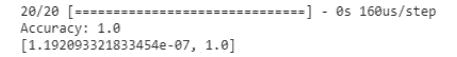

# 第四章

# 神经网络简介

## 学习目标

到本章结束时，你将能够：

+   描述深度学习及其应用

+   区分深度学习和机器学习

+   探索神经网络及其应用

+   了解神经网络的训练与工作原理

+   使用 Keras 创建神经网络

本章旨在向你介绍神经网络、它们在深度学习中的应用及其普遍的缺点。

## 介绍

在前两章中，你了解了自然语言处理的基础知识、它的重要性、准备文本进行处理的步骤以及帮助机器理解并执行基于自然语言任务的两种算法。然而，为了应对更高层次、更复杂的自然语言处理问题，如创建类似*Siri*和*Alexa*的个人语音助手，还需要额外的技术。深度学习系统，如神经网络，常用于自然语言处理，因此我们将在本章中讨论它们。在接下来的章节中，你将学习如何使用神经网络进行自然语言处理。

本章首先解释深度学习及其与机器学习的不同之处。然后，讨论神经网络，它是深度学习技术的核心部分，以及它们的基本功能和实际应用。此外，本章还介绍了**Keras**，一个 Python 深度学习库。

### 深度学习简介

人工智能是指拥有类似人类自然智能的智能体。这种自然智能包括计划、理解人类语言、学习、做决策、解决问题以及识别单词、图像和物体的能力。在构建这些智能体时，这种智能被称为人工智能，因为它是人为制造的。这些智能体并不指代物理对象。实际上，它们是指能展示人工智能的软件。

人工智能有两种类型——窄域人工智能和广域人工智能。窄域人工智能是我们目前所接触到的人工智能类型；它是任何拥有自然智能若干能力之一的单一智能体。本书第一章中你了解的自然语言处理应用领域就是窄域人工智能的例子，因为它们是能够执行单一任务的智能体，例如，机器能够自动总结文章。确实存在能够执行多项任务的技术，如自动驾驶汽车，但这些技术仍被认为是多个窄域人工智能的组合。

广义人工智能是指在一个智能体中拥有所有人类能力及更多能力，而不是一个智能体中仅有一到两个能力。AI 专家声称，一旦人工智能超越了广义人工智能的目标，在所有领域中比人类更聪明、更熟练，它将成为超级人工智能。

如前几章所述，自然语言处理是一种实现人工智能的方法，通过使机器能够理解并与人类以自然语言进行沟通。自然语言处理准备文本数据并将其转换为机器能够处理的形式——即数值形式。这就是深度学习的应用领域。

像自然语言处理和机器学习一样，深度学习也是一种技术和算法类别。它是机器学习的一个子领域，因为这两种方法共享相同的主要原理——无论是机器学习还是深度学习算法，都从输入中获取信息并使用它来预测输出。


###### 图 3.1：深度学习作为机器学习的一个子领域

当在训练数据集上训练时，两种类型的算法（机器学习和深度学习）都旨在最小化实际结果和预测结果之间的差异。这帮助它们在输入和输出之间建立关联，从而提高准确性。

### 比较机器学习和深度学习

虽然这两种方法都基于相同的原理——从输入预测输出——但它们通过不同的方式实现这一点，这也是深度学习被归类为一种独立方法的原因。此外，深度学习出现的一个主要原因是这些模型在预测过程中的准确性得到了提高。

虽然机器学习模型相当自足，但它们仍然需要人工干预来判断预测是否错误，因此需要在执行特定任务时变得更好。而深度学习模型则能够自己判断预测是否错误。因此，深度学习模型是自足的；它们能够在没有人工干预的情况下做出决策并提高效率。

为了更好地理解这一点，让我们以一个可以通过语音命令控制温度设置的空调为例。假设当空调听到“热”这个词时，它会降低温度，而当它听到“冷”这个词时，它会升高温度。如果这是一个机器学习模型，那么空调会随着时间的推移学会在不同的句子中识别这两个词。然而，如果这是一个深度学习模型，它可以根据与“热”和“冷”类似的词语和句子（如“有点热”或“我快冻死了！”等）来学习调整温度。

这是一个直接与自然语言处理相关的例子，因为该模型能够理解人类的自然语言，并根据其理解做出反应。在本书中，我们将专注于使用深度学习模型进行自然语言处理，尽管实际上它们几乎可以应用于每个领域。目前，它们在自动化驾驶任务中也有所应用，使得车辆能够识别停车标志、读取交通信号，并在行人面前停车。医疗领域也在利用深度学习方法检测早期的疾病——如癌细胞。然而，由于本书的重点是让机器理解人类的自然语言，我们还是回到这个主题。

深度学习技术通常用于监督学习方式，即它们会接受标记数据进行学习。然而，机器学习方法与深度学习方法之间的关键区别在于，后者需要极为庞大的数据量，这是之前不存在的。因此，深度学习直到最近才变得具有优势。它还需要相当大的计算能力，因为它需要在如此庞大的数据集上进行训练。

然而，主要的区别在于算法本身。如果你以前学习过机器学习，那么你应该知道解决分类和回归问题的各种算法，以及无监督学习的问题。深度学习系统与这些算法的不同之处在于，它们使用的是人工神经网络。

## 神经网络

神经网络和深度学习通常是互换使用的术语。它们并不意味着相同的东西，因此让我们来了解它们之间的区别。

如前所述，深度学习是一种遵循与机器学习相同原则的方法，但它具备更高的准确性和效率。深度学习系统利用人工神经网络，这些神经网络本身就是计算模型。因此，基本上，神经网络是深度学习方法的一部分，但并不是深度学习方法的全部。它们是被深度学习方法所整合的框架。


###### 图 3.2: 神经网络作为深度学习方法的一部分

人工神经网络基于一个受人脑中生物神经网络启发的框架。这些神经网络由节点组成，使得网络能够从图像、文本、现实物体等中学习，从而能够执行任务并进行准确预测。

神经网络由多个层组成，我们将在接下来的部分中深入了解。这些层的数量可以从三层到数百层不等。由三层或四层构成的神经网络称为浅层神经网络，而层数更多的网络则被称为深度神经网络。因此，深度学习方法使用的神经网络是深度神经网络，它们包含多个层。由于这一点，深度学习模型非常适合处理复杂任务，如人脸识别、文本翻译等。

这些层将输入分解为多个抽象级别。因此，深度学习模型能够更好地从输入中学习并理解，无论是图像、文本还是其他形式的输入，这有助于它做出决策并像人类大脑一样进行预测。

让我们通过一个例子来理解这些层。假设你正在卧室里做些工作，突然注意到自己在出汗。这就是你的输入数据——你感到很热，于是脑海中浮现出一个声音：“我觉得很热！”接着，你可能会想为什么自己会感到这么热：“为什么我会这么热？”这是一个思考。然后你会尝试解决这个问题，或许通过洗个澡来缓解：“让我快速洗个澡。”这是你做出的决策。但随后你记得自己很快就要出门上班：“但是，我得很快离开家。”这是一个记忆。你可能会尝试说服自己：“其实，还是有足够时间快速洗个澡吧？”这是推理的过程。最后，你可能会根据自己的想法做出行动，或者心里想着：“我要去洗澡了”，或者“没时间洗澡了，算了。”这就是决策过程，如果你真的去洗了澡，那就是一种行动。

深度神经网络中的多层结构使得模型能够像大脑一样经历不同的处理层级，从而建立起生物神经网络的原理。这些层正是深度学习模型能够高精度完成任务和预测输出的原因。

### 神经网络架构

神经网络架构指的是构成神经网络的基本元素。尽管有多种不同类型的神经网络，但基本架构和基础结构保持不变。该架构包括：

+   **层**

+   **节点**

+   **边缘**

+   **偏差**

+   **激活函数**

### 层

如前所述，神经网络由多个层组成。虽然这些层的数量因模型而异，并且依赖于当前的任务，但只有三种类型的层。每一层由多个节点组成，节点的数量取决于该层以及整个神经网络的需求。一个节点可以看作是一个神经元。

神经网络中的层如下所示：

+   *输入层*

    顾名思义，这一层由进入神经网络的输入数据组成。它是一个必需的层，因为每个神经网络都需要输入数据进行学习和执行操作，从而生成输出。此层在神经网络中只能出现一次。每个输入节点与后续层中的每个节点相连。

    输入数据的变量或特征被称为特征。目标输出依赖于这些特征。例如，以鸢尾花数据集为例。（鸢尾花数据集是机器学习初学者中最流行的数据集之一。它包含三种不同类型花卉的数据。每个实例有四个特征和一个目标类别。）花卉的分类标签取决于四个特征——花瓣的长度和宽度，以及萼片的长度和宽度。特征，因此输入层，被表示为*`X`*，每个单独的特征被表示为**X1**、**X2**、...、**Xn**。

+   *隐藏层*

    这是进行实际计算的层。它位于输入层之后，因为它作用于由输入层提供的输入，并且位于输出层之前，因为它生成由输出层提供的输出。

    隐藏层由称为“激活节点”的节点组成。每个节点拥有一个激活函数，这是一个对激活节点接收到的输入执行的数学函数，用于生成输出。本章后续会讨论激活函数。

    这是唯一可以多次出现的层，因此在深度神经网络中，可能存在最多上百个隐藏层。隐藏层的数量取决于具体任务。

    一个隐藏层的节点生成的输出将作为输入传递到下一个隐藏层。每个隐藏层的激活节点生成的输出被发送到下一层的每个激活节点。

+   *输出层*

    这是神经网络的最后一层，包含提供所有处理和计算结果的节点。这也是一个必需的层，因为神经网络必须根据输入数据生成输出。

    以鸢尾花数据集为例，某一花卉实例的输出将是该花卉的类别——鸢尾花 Setosa、鸢尾花 Virginica 或鸢尾花 Versicolor。

    输出，通常称为目标，表示为*`y`*。


###### 图 3.3：具有 2 个隐藏层的神经网络

### 节点

每个激活节点或神经元具有以下组件：

+   激活

    这是节点的当前状态——它是否处于激活状态。

+   阈值（可选）

    如果存在，该值决定了一个神经元是否被激活，具体取决于加权和是否高于或低于此阈值。

+   激活函数

    这是根据输入和加权和计算激活节点的新激活值的函数。

+   输出函数

    这会根据激活函数生成特定激活节点的输出。

    输入神经元没有像这样的组件，因为它们不进行计算，也没有前置神经元。类似地，输出神经元也没有这些组件，因为它们不进行计算，也没有后续神经元。

### 边缘


###### 图 3.4：神经网络的加权连接

在前面的图示中，每一条箭头代表两个不同层的节点之间的连接。这样的连接被称为边缘。每个指向激活节点的边缘都有自己的权重，可以视为一个节点对另一个节点的影响程度。权重可以是正的，也可以是负的。

看看之前的图示。在值到达激活函数之前，它们的值会先与分配给各自连接的权重相乘。然后这些乘积的值会相加，得到一个加权和。这个加权和本质上是衡量该节点对输出的影响程度。如果值较低，意味着它对输出的影响不大，因此也不那么重要。如果值较高，则意味着它与目标输出有强烈的相关性，因此在确定输出时起着重要作用。

### 偏置

偏置是一个节点，神经网络的每一层都有自己的偏置节点，输出层除外。因此，每一层都有自己的偏置节点。偏置节点保存一个值，称为偏置。这个值会在计算加权和的过程中被加入，因此它在确定节点生成的输出中也起到了作用。

偏置是神经网络中的一个重要方面，因为它允许激活函数向右或向左平移。这有助于模型更好地拟合数据，从而生成准确的输出。

### 激活函数

激活函数是神经网络隐含层中激活节点的一部分。它们的作用是为神经网络引入非线性，这是非常重要的，因为没有它们，神经网络将只有线性函数，这样就和线性回归模型没有区别了。这就违背了神经网络的初衷，因为没有非线性，神经网络就无法学习数据中的复杂函数关系。激活函数还需要是可微的，以便进行反向传播。这个内容将在本章的后续部分讨论。

基本上，一个激活节点计算它接收到的输入的加权和，添加偏置值，然后对这个值应用激活函数。这会为该特定激活节点生成一个输出，该输出随后作为输入传递给下一层。这个输出被称为激活值。因此，下一层的激活节点将接收到来自前一层激活节点的多个激活值，并计算一个新的加权和。它会对这个值应用激活函数，生成它自己的激活值。这就是数据在神经网络中流动的方式。因此，激活函数帮助将输入信号转换为输出信号。

计算加权和、应用激活函数并产生激活值的过程称为前向传播。

有几种激活函数（如 Logistic、TanH、ReLU 等）。Sigmoid 函数是其中最流行且最简单的激活函数之一。当用数学形式表示时，这个函数看起来像


###### 图 3.5：Sigmoid 函数的表达式

如你所见，这个函数是非线性的。

## 训练神经网络

到目前为止，我们知道，一旦输入提供给神经网络，它会进入输入层，这是一个用于将输入传递到下一层的接口。如果存在隐藏层，则输入会通过加权连接发送到隐藏层的激活节点。激活节点接收到的所有输入的加权和是通过将输入与各自的权重相乘，然后将这些值加上偏置值来计算的。激活函数从加权和中生成激活值，并将其传递到下一层的节点。如果下一层是另一个隐藏层，则它将使用来自前一隐藏层的激活值作为输入，并重复激活过程。然而，如果下一层是输出层，则神经网络会提供输出。

从这些信息中，我们可以得出结论，深度学习模型中有三个部分会影响模型生成的输出——输入、连接权重和偏置、以及激活函数。


###### 图 3.6：影响输出的深度学习模型方面

虽然输入来自数据集，但前两个部分不是。那么，接下来就会有两个问题：谁或什么决定连接的权重是多少？我们怎么知道该使用哪些激活函数？让我们逐一解决这些问题。

### 计算权重

权重在多层神经网络中起着非常重要的作用，因为改变单一连接的权重会完全改变分配给进一步连接的权重，从而影响后续层生成的输出。因此，拥有最优的权重对于创建一个准确的深度学习模型是必要的。听起来好像压力很大，但幸运的是，深度学习模型能够自主找到最优的权重。为了更好地理解这一点，让我们以线性回归为例。

线性回归是一种监督式机器学习算法，顾名思义，它适用于解决回归问题（输出为连续数值的数据集，例如房屋的售价）。该算法假设输入（特征）与输出（目标）之间存在线性关系。基本上，它认为存在一条最佳拟合线，可以准确描述输入和输出变量之间的关系。它使用这个关系来预测未来的数值。在只有一个输入特征的情况下，这条线的方程式为：


###### 图 3.7：线性回归的表达式

其中，

*`y`* 是目标输出

*`c`* 是 y 轴截距

*`m`* 是模型系数

*`x`* 是输入特征

类似于神经网络中的连接，输入特征也附带了数值——它们被称为模型系数。在某种程度上，这些模型系数决定了特征在确定输出中的重要性，这类似于神经网络中的权重作用。确保这些模型系数的值正确是非常重要的，以便获得准确的预测。

假设我们想预测房屋的售价，依据是它有多少个卧室。所以，房屋的售价是我们的目标输出，卧室的数量是我们的输入特征。由于这是一个监督学习方法，我们的模型将被提供一个数据集，其中包含输入特征与正确的目标输出的匹配实例。


###### 图 3.8：线性回归的样本数据集

现在，我们的线性回归模型需要找到一个模型系数，用来描述卧室数量对房屋售价的影响。它通过使用两种算法——损失函数和梯度下降算法——来实现这一目标。

### 损失函数

损失函数有时也被称为成本函数。

对于分类问题，损失函数计算特定类别的预测概率与该类别本身之间的差异。例如，假设你有一个二分类问题，需要预测一座房子是否会售出。只有两个输出——“是”和“否”。在拟合这个数据的分类模型时，模型会预测数据实例属于“是”类别或“否”类别的概率。假设“是”类别的值为 1，“否”类别的值为 0。因此，如果输出概率更接近 1，则它会落入“是”类别。该模型的损失函数将衡量这种差异。

对于回归问题，损失函数计算实际值与预测值之间的误差。上一节中的房价例子是一个回归问题，因此损失函数计算的是房子的实际价格与模型预测的价格之间的误差。因此，从某种意义上说，损失函数帮助模型自我评估其性能。显然，模型的目标是预测一个与实际价格完全相同，或者至少最接近的价格。为了做到这一点，它需要尽可能地最小化损失函数。

唯一直接影响模型预测价格的因素是模型系数。为了得到最适合当前问题的模型系数，模型需要不断改进模型系数的值。我们将每个不同的值称为模型系数的更新。因此，随着每次模型系数的更新，模型必须计算实际价格与使用该模型系数更新后的预测价格之间的误差。

一旦该函数达到了最小值，模型系数在此最小点的值被选为最终的模型系数。该值被存储，并在上述线性回归算法的线性方程中使用。从此之后，每当模型接收到房子的卧室数量等输入数据而没有目标输出时，它会使用带有适当模型系数的线性方程来计算并预测这座房子将以多少价格售出。

有许多不同种类的损失函数——例如 MSE（用于回归问题）和 Log Loss（用于分类问题）。让我们来看看它们是如何工作的。

均方误差函数计算实际值与预测值之间的差异，将其平方后，再对整个数据集取平均。该函数用数学表达式表示如下：


###### 图 3.9：均方误差函数的表达式

其中，

*`n`* 是数据点的总数

**yi** 是第 i 个实际值

**xi** 是输入

**f()** 是对输入执行的函数，用来生成输出，因此

**f(xi)** 是预测值

对数损失用于输出为 0 到 1 之间概率值的分类模型。预测概率与实际类别之间的差异越大，对数损失越高。对数损失函数的数学表示为：


###### 图 3.10：对数损失函数的表达式

其中，

*`N`* 是数据点的总数

**yi** 是第 i 个实际标签

*`p`* 是预测概率

### 梯度下降算法

通过损失函数评估模型性能的过程是由模型独立执行的，更新并最终选择模型系数的过程也是如此。

假设你在一座山上，想要下山并到达真正的底部。天空多云，山峰众多，你无法确切知道底部在哪儿，也不知道应该朝哪个方向走，你只知道你需要到达那里。你从海拔 5000 米的地方开始，决定迈大步。你迈出一步，然后检查手机，看看自己距离海平面有多少米。手机显示你距离海平面 5003 米，说明你走错了方向。现在，你朝另一个方向迈大步，手机显示你距离海平面 4998 米。这意味着你离底部更近了，但你怎么知道这一步是下降最快的那一步呢？如果你朝另一个方向走，发现自己降到了 4996 米呢？因此，你会检查每个可能方向上的位置，选择那个最接近底部的方向。

你不断重复这个过程，直到你的手机显示你位于海拔 100 米的地方。当你再迈出一步时，手机的读数仍然保持不变——海拔 100 米。最终，你到达了一个看起来像是底部的地方，因为从这个点出发的任何方向，都会导致你依然处于海拔 100 米的位置。


###### 图 3.11：更新参数

这就是梯度下降算法的工作原理。该算法沿着损失函数与模型系数和截距的可能值的图形下降，就像你在下山一样。它从给定的模型系数值开始——这就像你站在海平面上方 5000 米的某个点。它会计算该点处图形的梯度。这个梯度告诉模型应该朝哪个方向移动，以更新系数，进而接近全局最小值，这也是最终目标。因此，它采取一步，来到了一个新点，拥有了新的模型系数。它重复计算梯度、获取移动方向、更新系数并采取一步的过程。它检查是否这一步提供了最陡的下降。每次它迈出一步，都到达一个新的模型系数，并计算该点的梯度。这个过程会重复，直到梯度的值在多次试验中不再变化。这意味着算法已经达到了全局最小值并且收敛。此时的模型系数会作为线性方程中的最终模型系数。

在神经网络中，梯度下降算法和损失函数共同作用，找到分配给连接的权重和偏置的值。这些值通过最小化损失函数来更新，使用的是梯度下降算法，就像线性回归模型中一样。此外，在线性回归的情况下，由于损失函数是碗形的，因此总是只有一个最小值。这使得梯度下降算法很容易找到它，并且可以确定这是最低点。然而，在神经网络的情况下，情况并不如此简单。神经网络使用的激活函数目的在于引入非线性因素。

因此，神经网络的损失函数图像并不是碗形曲线，并且它不只有一个最小点。相反，它有多个最小值，其中只有一个是全局最小值，其余的被称为局部最小值。这听起来像是一个重大问题，但实际上，梯度下降算法能够达到一个局部最小值并选择该点的权重值是没问题的，因为大多数局部最小值通常离全局最小值非常近。为了设计神经网络，也有一些修改版的梯度下降算法被使用。随机梯度下降和批量梯度下降就是其中的两种。

假设我们的损失函数是均方误差（MSE），并且我们需要梯度下降算法更新一个权重（w）和一个偏置（b）。


###### 图 3.12：损失函数梯度的表达式

梯度是损失函数对权重和偏置的偏导数。其数学表示如下：


###### 图 3.13：损失函数偏导数的梯度表示

这样得到的结果是当前点的损失函数的梯度。这也告诉我们应该朝哪个方向移动，以继续更新权重和偏置。

每一步的步长大小是由一个称为学习率的参数来调整的，它是梯度下降算法中一个非常敏感的参数。它被称为 alpha，并用符号 α 表示。如果学习率太小，算法会采取过多的微小步骤，从而需要很长时间才能达到最小值。然而，如果学习率过大，算法可能会完全错过最小值。因此，调整并测试不同的学习率以确保选择正确的学习率非常重要。

学习率与每一步计算出的梯度相乘，以修改步长的大小，因此每一步的步长不一定相同。数学上，这可以表示为：


###### 图 3.14：学习率与梯度相乘的表达式

以及，


###### 图 3.15：每一步学习率与梯度相乘的表达式

这些值是从之前的权重和偏置值中减去的，因为偏导数指向的是最陡上升的方向，而我们的目标是下降。


###### 图 3.16：学习率

### 反向传播

线性回归本质上是一个神经网络，只不过没有隐藏层，并且激活函数是恒等函数（即线性函数，因此是线性的）。因此，学习过程与前面几节描述的相同——损失函数的目标是通过让梯度下降算法不断更新权重，直到达到全局最小值，从而最小化误差。

然而，在处理更大、更复杂的非线性神经网络时，计算出的损失会通过网络反向传播到每一层，然后开始更新权重的过程。损失被反向传播，因此这一过程被称为反向传播（Backpropagation）。

反向传播是通过使用损失函数的偏导数来执行的。它涉及到通过在神经网络中反向传播来计算每个层中每个节点的损失。了解每个节点的损失可以让网络理解哪些权重对输出和损失产生了剧烈的负面影响。因此，梯度下降算法可以减少这些连接的权重，这些连接的错误率较高，从而减少该节点对网络输出的影响。

当处理神经网络中的多层时，许多激活函数作用于输入。这个过程可以表示为如下：


###### 图 3.17：反向传播函数的表达式

这里*`X`*、*`Y`*和*`Z`*是激活函数。正如我们所看到的，**f(x)**是一个复合函数，因此，反向传播可以视为链式法则的应用。链式法则是用于计算复合函数偏导数的公式，这正是我们在反向传播过程中所做的。通过将链式法则应用于前述的函数（通常称为前向传播函数，因为数值朝着前向方向流动以生成输出），并计算相对于每个权重的偏导数，我们将能够精确地确定每个节点对最终输出的影响程度。

输出层中最后一个节点的损失是整个神经网络的总损失，因为它位于输出层，因此所有前面节点的损失都会累积到这一层。输入层中的输入节点没有损失，因为它们对神经网络没有影响。输入层仅仅是一个接口，将输入发送到隐藏层中的激活节点。

因此，反向传播过程就是通过梯度下降算法和损失函数来更新权重的过程。

#### 注意

如需了解更多关于反向传播的数学原理，请点击此链接：https://ml-cheatsheet.readthedocs.io/en/latest/backpropagation.html

## 设计神经网络及其应用

训练和设计神经网络时，通常使用一些常见的机器学习技术。神经网络可以被分类为：

+   有监督神经网络

+   无监督神经网络

### 有监督神经网络

这些就像前一节中使用的例子（根据房间数量预测房屋价格）。有监督神经网络是在由样本输入和其对应输出组成的数据集上进行训练的。这些方法适用于噪声分类和预测任务。

有两种类型的监督学习方法：

+   分类

    这是针对那些目标输出为离散类别或类的问题，例如鸢尾花数据集。神经网络从样本输入和输出中学习如何正确分类新数据。

+   回归

    这是针对那些目标输出为一系列连续数值的问题，比如房价的例子。神经网络描述了输入与输出之间的因果关系。

### 无监督神经网络

这些神经网络是在没有任何目标输出的数据上进行训练的，因此能够识别并提取数据中的模式和推断。这使得它们非常适合执行如识别类别关系和发现数据中自然分布等任务。

+   聚类

聚类分析是将相似的输入分组在一起。这些神经网络可以用于基因序列分析和物体识别等任务。

能够进行模式识别的神经网络可以通过监督学习或无监督学习方法进行训练。它们在文本分类和语音识别中发挥着关键作用。

### 练习 17：创建神经网络

在这个练习中，我们将实现一个简单的经典神经网络，通过遵循之前概述的工作流程，来预测评论是正面还是负面。

这是一个自然语言处理问题，因为神经网络将接收一行行的句子，这些句子实际上是评论。每个评论在训练集中都有一个标签——0 表示负面，1 表示正面。这个标签依赖于评论中出现的单词，因此我们的神经网络需要理解评论的含义并据此进行标注。最终，我们的神经网络需要能够预测评论是正面还是负面。

#### 注意

从链接下载数据集：

https://github.com/TrainingByPackt/Deep-Learning-for-Natural-Language-Processing/tree/master/Lesson%2003

以下步骤将帮助你解决这个问题。

1.  在你想要编写代码的目录中，输入以下命令来打开一个新的 Jupyter 笔记本：

    ```py
    jupyter notebook
    ```

1.  接下来，导入`pandas`，以便你可以将数据存储在数据框中：

    ```py
    import pandas as pd
    df = pd.read_csv('train_comment_small_50.csv', sep=',')
    ```

1.  导入正则表达式包

    ```py
    import re
    ```

1.  创建一个函数来预处理评论，去除`HTML`标签、转义引号和普通引号：

    ```py
    def clean_comment(text):
        # Strip HTML tags
        text = re.sub('<[^<]+?>', ' ', text)

        # Strip escaped quotes
        text = text.replace('\\"', '')

        # Strip quotes
        text = text.replace('"', '')

        return text
    ```

1.  将这个函数应用于当前存储在数据框中的评论：

    ```py
    df['cleaned_comment'] = df['comment_text'].apply(clean_comment)
    ```

1.  从`scikit-learn`中导入`train_test_split`，以便将这些数据分为训练集和验证集：

    ```py
    from sklearn.model_selection import train_test_split
    X_train, X_test, y_train, y_test = train_test_split(df['cleaned_comment'], df['toxic'], test_size=0.2)
    ```

1.  从`nltk`库中导入`nltk`和`stopwords`：

    ```py
    import nltk
    nltk.download('stopwords')
    ```

1.  现在，机器学习和深度学习模型要求输入数据为数值型数据，而我们当前的数据是文本形式。因此，我们将使用一种名为 CountVectorizer 的算法，将评论中的单词转换为词频向量。

    ```py
    from sklearn.feature_extraction.text import CountVectorizer
    from nltk.corpus import stopwords

    vectorizer = CountVectorizer(binary=True, stop_words = stopwords.words('english'), lowercase=True, min_df=3, max_df=0.9, max_features=5000)
    X_train_onehot = vectorizer.fit_transform(X_train)
    ```

    我们的数据现在已经清理并准备好了！

1.  我们将创建一个两层的神经网络。在定义神经网络时，层数不包括输入层，因为输入层是默认存在的，而且输入层不参与计算过程。因此，一个两层的神经网络包括一个输入层，一个隐藏层和一个输出层。

1.  从 Keras 导入模型和层：

    ```py
    from keras.models import Sequential
    from keras.layers import Dense
    ```

1.  初始化神经网络：

    ```py
    nn = Sequential()
    ```

1.  添加隐藏层。指定该层的节点数量、节点的激活函数以及该层的输入：

    ```py
    nn.add(Dense(units=500, activation='relu', input_dim=len(vectorizer.get_feature_names())))
    ```

1.  添加输出层。同样，指定节点数量和激活函数。由于这是一个二分类问题（预测评论是正面还是负面），我们将在这里使用`sigmoid`函数。我们只会有一个输出节点，因为输出只是一个值——要么是 1，要么是 0\。

    ```py
    nn.add(Dense(units=1, activation='sigmoid'))
    ```

1.  现在我们要编译神经网络，并决定使用哪个损失函数、优化算法和性能指标。由于这是一个二分类问题，我们将使用`binary_crossentropy`作为我们的`loss`函数。优化算法基本上是梯度下降算法。梯度下降有不同的版本和变体。在这种情况下，我们将使用`Adam`算法，这是随机梯度下降的扩展：

    ```py
    nn.compile(loss='binary_crossentropy', optimizer='adam', metrics=['accuracy'])
    ```

1.  现在，让我们总结一下我们的模型，看看发生了什么：

    ```py
    nn.summary()
    ```

    你将得到的输出将类似于这样：

    

    ###### 图 3.18: 模型摘要

1.  现在，是时候训练模型了。使用我们之前划分的`X_train`和`y_train`数据来拟合神经网络：

    ```py
    nn.fit(X_train_onehot[:-20], y_train[:-20], 
              epochs=5, batch_size=128, verbose=1, 
              validation_data=(X_train_onehot[-100:], y_train[-20:]))
    ```

    就这样！我们的神经网络现在准备好进行测试了。

1.  将输入验证数据转换为词频向量并评估神经网络。打印准确率分数，看看网络的表现如何：

    ```py
    scores = nn.evaluate(vectorizer.transform(X_test), y_test, verbose=1)
    print("Accuracy:", scores[1])
    ```

    你的分数可能会稍有不同，但应该接近 0.875\。

    这是一个相当不错的分数。所以，就是这样。你刚刚创建了你的第一个神经网络，训练了它，并验证了它。

    **预期输出：**

    

    ](img/C13783_03_19.jpg)

    ###### 图 3.19: 预期准确率分数

1.  保存你的模型：

    ```py
    model.save('nn.hd5')
    ```

## 部署模型作为服务的基础

部署模型作为服务的目的是让其他人能够轻松查看和访问它，而不仅仅是通过查看你在 GitHub 上的代码。根据你创建模型的初衷，模型的部署方式有不同类型。可以说有三种类型——流式模型（一个不断学习的模型，随着不断输入数据并做出预测），分析即服务模型（AaaS——一个供任何人互动的模型）和在线模型（一个只允许公司内部人员访问的模型）。

展示你工作的最常见方式是通过 Web 应用程序。有多个部署平台可以帮助你通过它们部署你的模型，如 Deep Cognition、MLflow 等。

Flask 是最容易使用的微型 Web 框架，可用于在不使用现有平台的情况下部署你自己的模型。它是用 Python 编写的。使用这个框架，你可以为你的模型构建一个 Python API，该 API 将轻松生成预测并为你显示结果。

流程如下：

1.  为 API 创建一个目录

1.  将你的预训练神经网络模型复制到这个目录中。

1.  编写一个程序，加载这个模型，预处理输入数据，使其与模型的训练输入匹配，使用该模型进行预测并准备、发送、显示这个预测结果。

测试和运行 API 时，你只需键入应用程序名称，并加上**.run()**。

在我们创建的神经网络的情况下，我们会保存该模型，并将其加载到一个新的 Jupyter 笔记本中。我们会将输入数据（清洗后的评论）转换为词频向量，以确保 API 的输入数据与训练数据相同。然后，我们会使用模型生成预测并显示它们。

### 活动 4：评论情感分析

在这个活动中，我们将审查一个数据集中的评论，并将其分类为正面或负面。以下步骤将帮助你完成解决方案。

#### 注意

你可以在以下链接找到数据集：

https://github.com/TrainingByPackt/Deep-Learning-for-Natural-Language-Processing/tree/master/Lesson%2004

1.  打开一个新的`Jupyter`笔记本。导入数据集。

1.  导入必要的 Python 包和类。将数据集加载到数据框中。

1.  导入必要的库来清洗和准备数据。创建一个数组来存储清洗后的文本。使用`for`循环，遍历每个实例（每条评论）。

1.  导入 CountVectorizer 并将单词转换为词频向量。创建一个数组来存储每个独特单词作为单独的列，从而使它们成为独立变量。

1.  导入必要的标签编码实体。

1.  将数据集划分为训练集和测试集。

1.  创建神经网络模型。

1.  训练模型并验证它。

1.  评估神经网络并打印准确率评分，查看它的表现如何。

    **预期输出：**



###### 图 3.20：准确率评分

#### 注意

活动的解决方案可以在第 302 页找到。

## 总结

在这一章中，我们介绍了机器学习的一个子集——深度学习。你了解了这两种技术类别之间的异同，并理解了深度学习的需求及其应用。

神经网络是对人脑中生物神经网络的人工表示。人工神经网络是深度学习模型中所采用的框架，已经证明它们在效率和准确性上不断提高。它们被应用于多个领域，从训练自动驾驶汽车到在非常早期阶段检测癌细胞。

我们研究了神经网络的不同组件，并了解了在损失函数、梯度下降算法和反向传播的帮助下，网络如何进行自我训练和修正。你还学会了如何对文本输入进行情感分析！此外，你还学习了将模型部署为服务的基本知识。

在接下来的章节中，你将了解更多关于神经网络及其不同类型的内容，并学习在不同情况下使用哪种神经网络。
