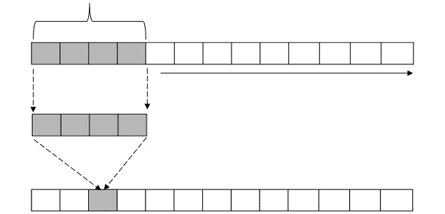

# 第五章

# 卷积神经网络的基础

## 学习目标

到本章结束时，你将能够：

+   描述 CNN 在神经科学中的灵感来源

+   描述卷积操作

+   描述一个基本的 CNN 架构用于分类任务

+   实现一个简单的 CNN 用于图像和文本分类任务

+   实现一个用于文本情感分析的 CNN

本章中，我们旨在涵盖卷积神经网络（CNN）的架构，并通过其在图像数据上的应用来获得对 CNN 的直觉，随后再深入探讨它们在自然语言处理中的应用。

## 引言

神经网络作为一个广泛的领域，从生物系统，特别是大脑中汲取了很多灵感。神经科学的进展直接影响了神经网络的研究。

CNN 的灵感来源于两位神经科学家的研究，D.H. Hubel 和 T.N. Wiesel。他们的研究集中在哺乳动物的视觉皮层，这是大脑中负责视觉的部分。在上世纪六十年代的研究中，他们发现视觉皮层由多层神经元组成。此外，这些层次是以一种层级结构排列的。这个层级从简单的神经元到超复杂的神经元都有。他们还提出了“感受野”的概念，即某些刺激能够激活或触发一个神经元的空间范围，具有一定的空间不变性。空间或位移不变性使得动物能够识别物体，无论它们是旋转、缩放、变换，还是部分遮挡。


###### 图 4.1：空间变化的示例

受到动物视觉神经概念的启发，计算机视觉科学家们构建了遵循局部性、层次性和空间不变性相同原则的神经网络。我们将在下一节深入探讨 CNN 的架构。

CNN 是神经网络的一个子集，包含一个或多个“卷积”层。典型的神经网络是全连接的，意味着每个神经元都与下一层中的每个神经元连接。当处理高维数据（如图像、声音等）时，典型的神经网络运行较慢，并且容易过拟合，因为学习的权重太多。卷积层通过将神经元与低层输入的一个区域连接来解决这个问题。我们将在下一节中更详细地讨论卷积层。

为了理解 CNN 的一般架构，我们将首先将其应用于图像分类任务，然后再应用于自然语言处理。首先，我们将做一个小练习来理解计算机是如何看待图像的。

### 练习 18：了解计算机如何看待图像

图像和文本有一个重要的相似性。图像中一个像素的位置，或文本中的一个单词位置，都很重要。这种空间上的意义使得卷积神经网络可以同时应用于文本和图像。

在本练习中，我们希望确定计算机如何解读图像。我们将使用 **MNIST** 数据集，它包含手写数字，非常适合演示 CNN。

#### 注意

MNIST 是一个内置的 Keras 数据集。

你需要安装 Python 和 Keras。为了更方便地可视化，你可以在 Jupyter notebook 中运行代码：

1.  首先导入必要的类：

    ```py
    %matplotlib inline
    import keras
    import matplotlib.pyplot as plt
    ```

1.  由于我们将在整个章节中使用该数据集，因此我们将按如下方式导入训练集和测试集：

    ```py
    (X_train, y_train), (X_test, y_test) = keras.datasets.mnist.load_data()
    ```

1.  可视化数据集中的第一张图像：

    ```py
    sample_image = X_train[0]
    plt.imshow(sample_image)
    ```

    运行前面的代码应该会显示出图像，如下所示：

    

    ###### 图 4.2: 图像的可视化

    这些图像为 28x28 像素，每个像素的值在 0 到 255 之间。尝试修改不同的索引来显示它们的值，如下所示。你可以通过将任意数字在 `0` 和 `255` 之间作为 `x` 和 `y` 来实现：

    ```py
    print(sample_image[x][y]) 
    ```

1.  当你运行以下打印代码时，应该会看到 0 到 255 之间的数字：

    ```py
    print(sample_image[22][11])
    print(sample_image[6][12])
    print(sample_image[5][23])
    print(sample_image[10][11])
    ```

    **预期输出：**


###### 图 4.3: 图像的数字表示

本练习旨在帮助你理解图像数据如何被处理，其中每个像素作为一个在 *`0`* 到 **255** 之间的数字。这一理解至关重要，因为我们将在下一部分将这些图像输入到 CNN 中作为输入。

## 理解 CNN 的架构

假设我们有一个任务，将每个 **MNIST** 图像分类为 0 到 9 之间的数字。前面示例中的输入是一个图像矩阵。对于彩色图像，每个像素是一个包含三个值的数组，分别对应 **RGB** 颜色模式。对于灰度图像，每个像素仅是一个数字，就像我们之前看到的那样。

要理解 CNN 的架构，最好将其分为两个部分，如下图所示。

CNN 的前向传播涉及在两个部分中进行一系列操作。


###### 图 4.4: 卷积和 ReLU 操作的应用

该图在以下部分中解释：

+   特征提取

+   神经网络

### 特征提取

CNN 的第一部分是特征提取。从概念上讲，可以理解为模型尝试学习哪些特征可以区分不同的类别。在图像分类任务中，这些特征可能包括独特的形状和颜色。

CNN 学习这些特征的层次结构。CNN 的低层抽象特征如边缘，而高层则学习更明确的特征，如形状。

特征学习通过重复一系列三个操作进行，如下所示：

1.  卷积

1.  激活函数（应用 ReLU 激活函数以实现非线性）

1.  池化

### 卷积

卷积是将 CNN（卷积神经网络）与其他神经网络区分开来的操作。卷积操作不仅仅是机器学习中的特有操作，它还广泛应用于其他领域，如电气工程和信号处理。

卷积可以理解为通过一个小窗口查看，当我们将窗口向右和向下移动时。卷积在这个上下文中意味着反复滑动一个“滤波器”跨越图像，同时在移动时应用点积操作。

这个窗口被称为“*滤波器*”或“*卷积核*”。在实际操作中，滤波器或卷积核是一个矩阵，通常比输入的尺寸小。为了更好地理解滤波器如何应用于图像，考虑以下示例。在计算滤波器覆盖区域的点积后，我们向右移动一步，再次计算点积：


###### 图 4.5：滤波器应用于图像

卷积的结果称为特征图或激活图。

滤波器的大小需要定义为超参数。这个大小也可以看作是神经元能够“看到”输入的区域。这个区域被称为神经元的*感受野*。此外，我们需要定义步幅大小，即在应用滤波器之前需要进行的步数。位于中心的像素相比位于边缘的像素，滤波器会经过多次。为了避免在角落处丢失信息，建议添加一层零填充。

### ReLU 激活函数

激活函数在整个机器学习中都被广泛使用。它们有助于引入非线性，使得模型能够学习非线性函数。在这个特定的上下文中，我们应用了**修正线性单元**（**ReLU**）。它的基本原理是将所有负值替换为零。

以下图像展示了应用 ReLU 后图像的变化。


###### 图 4.6：应用 ReLU 函数后的图像

### 练习 19：可视化 ReLU

在本练习中，我们将可视化修正线性单元（ReLU）函数。ReLU 函数将在 X-Y 坐标轴上绘制，其中 X 轴是从 -15 到 15 范围内的数字，Y 轴是应用 ReLU 函数后的输出值。此练习的目标是可视化 ReLU。

1.  导入所需的 Python 包：

    ```py
    from matplotlib import pyplot
    ```

1.  定义 ReLU 函数：

    ```py
    def relu(x):
        return max(0.0, x)
    ```

1.  指定输入和输出参考：

    ```py
    inputs = [x for x in range(-15, 15)]
    outputs = [relu(x) for x in inputs]
    ```

1.  绘制输入与输出的关系：

    ```py
    pyplot.plot(inputs, outputs) #Plot the input against the output
    pyplot.show()
    ```

    **预期输出：**


###### 图 4.7：ReLU 的图形绘制

### 池化

池化是一个降采样过程，它涉及将数据从更高维度空间减少到更低维度空间。在机器学习中，池化通常用于减少层的空间复杂性。这可以让我们学习更少的权重，从而加快训练速度。

历史上，曾使用不同的技术来执行池化操作，比如平均池化和 L2 范数池化。最常用的池化技术是最大池化。最大池化涉及在定义的窗口大小内取最大的元素。下面是一个对矩阵进行最大池化的例子：


](img/C13783_04_08.jpg)

###### 图 4.8：最大池化

如果我们对前面的例子应用最大池化，那么包含 2、6、3 和 7 的区域将被缩减为 7。同样，包含 1、0、9 和 2 的区域将被缩减为 9。通过最大池化，我们选择一个区域中的最大值。

### Dropout

机器学习中一个常见的问题是过拟合。过拟合发生在模型“记住”了训练数据，并且在测试时面对不同的示例时无法进行泛化。避免过拟合有几种方法，特别是通过正则化：


###### 图 4.9：正则化

正则化是约束系数趋近于零的过程。正则化可以总结为一种技术，用于惩罚已学习的系数，使它们趋向于零。Dropout 是一种常见的正则化技术，在前向和反向传播过程中，通过随机“丢弃”一些神经元来实现。为了实现 dropout，我们将神经元被丢弃的概率指定为一个参数。通过随机丢弃神经元，我们确保模型能够更好地泛化，因此更加灵活。

### 卷积神经网络中的分类

CNN 的第二部分更具任务特定性。对于分类任务，这一部分基本上是一个全连接的神经网络。当神经网络中的每个神经元都与下一层的所有神经元连接时，神经网络被认为是全连接的。全连接层的输入是展平后的向量，这个向量是第一部分的输出。展平操作将矩阵转换为 1D 向量。

全连接层中隐藏层的数量是一个超参数，可以优化和微调。

### 练习 20：创建一个简单的 CNN 架构

在这个练习中，你将使用 Keras 构建一个简单的 CNN 模型。这个练习将包括创建一个包含到目前为止讨论的层的模型。在模型的第一部分，我们将有两个卷积层，使用 ReLU 激活函数，一个池化层和一个 dropout 层。在第二部分，我们将有一个展平层和一个全连接层。

1.  首先，我们导入必要的类：

    ```py
    from keras.models import Sequential #For stacking layers
    from keras.layers import Dense, Conv2D, Flatten, MaxPooling2D, Dropout
    from keras.utils import plot_model
    ```

1.  接下来，定义所使用的变量：

    ```py
    num_classes = 10
    ```

1.  现在我们来定义模型。Keras 的 Sequential 模型允许你按顺序堆叠层：

    ```py
    model = Sequential()
    ```

1.  现在我们可以添加第一节的层。卷积层和 ReLU 层一起定义。我们有两个卷积层。每个层的卷积核大小都定义为 3。模型的第一层接收输入。我们需要定义它期望输入的结构方式。在我们的案例中，输入是 28x28 的图像形式。我们还需要指定每一层的神经元数量。在我们的案例中，我们为第一层定义了 64 个神经元，为第二层定义了 32 个神经元。请注意，这些是可以优化的超参数：

    ```py
    model.add(Conv2D(64, kernel_size=3, activation='relu', input_shape=(28,28,1)))
    model.add(Conv2D(32, kernel_size=3, activation='relu'))
    ```

1.  然后我们添加一个池化层，接着是一个丢弃层，丢弃层以 25%的概率“丢弃”神经元：

    ```py
    model.add(MaxPooling2D(pool_size=(2, 2)))
    model.add(Dropout(0.25))
    ```

    第一节的层已经完成。请注意，层的数量也是一个可以优化的超参数。

1.  对于第二节，我们首先将输入展平。然后我们添加一个完全连接层或密集层。使用 softmax 激活函数，我们可以计算 10 个类别的每个类别的概率：

    ```py
    model.add(Flatten())
    model.add(Dense(num_classes, activation='softmax'))
    ```

1.  为了可视化到目前为止的模型架构，我们可以按照以下方式打印出模型：

    ```py
    model.summary()
    ```

    **预期输出**：

    

    ###### 图 4.10：模型摘要

1.  你也可以运行以下代码将图像导出到文件：

    ```py
    plot_model(model, to_file='model.png')
    ```


###### 图 4.11：简单 CNN 的可视化架构

在前面的练习中，我们创建了一个简单的卷积神经网络（CNN），包含两个卷积层，用于分类任务。在前面的输出图像中，你会注意到这些层是如何堆叠的——从输入层开始，然后是两个卷积层、池化层、丢弃层和展平层，最后是完全连接层。

## 训练 CNN

在训练 CNN 时，模型尝试学习特征提取中的滤波器权重以及神经网络中完全连接层的权重。为了理解模型是如何训练的，我们将讨论如何计算每个输出类别的概率，如何计算误差或损失，最后，如何优化或最小化该损失，并在更新权重时进行调整：

1.  概率

    回想一下，在神经网络的最后一层，我们使用了 softmax 函数来计算每个输出类别的概率。这个概率是通过将该类别分数的指数除以所有分数的指数总和来计算的：

    

    ###### 图 4.12：计算概率的表达式

1.  损失

    我们需要能够量化计算出的概率如何预测实际类别。这是通过计算损失来实现的，在分类概率的情况下，最好通过类别交叉熵损失函数来完成。类别交叉熵损失函数接受两个向量，预测的类别（我们称之为 y'）和实际的类别（称之为 y），并输出整体损失。交叉熵损失是类别概率的负对数似然之和。它可以用 H 函数表示：

    

    ###### 图 4.13：计算损失的表达式

1.  优化

    考虑以下交叉熵损失的示意图。通过最小化损失，我们可以以更高的概率预测正确的类别：


###### 图 4.14：交叉熵损失与预测概率

梯度下降是一种优化算法，用于寻找函数的最小值，例如前面描述的损失函数。虽然计算了整体误差，但我们需要回过头来计算每个节点对损失的贡献。因此，我们可以更新权重，以最小化整体误差。反向传播应用了微积分中的链式法则来计算每个权重的更新。这是通过求误差或损失相对于权重的偏导数来完成的。

为了更好地可视化这些步骤，考虑以下图示，概括了这三个步骤。在分类任务中，第一步涉及计算每个输出类别的概率。然后，我们应用损失函数来量化概率预测实际类别的效果。为了在未来做出更好的预测，我们通过梯度下降进行反向传播，更新权重：


###### 图 4.15：分类任务的步骤

### 练习 21：训练 CNN

在本练习中，我们将训练在练习 20 中创建的模型。以下步骤将帮助您解决这个问题。请记住，这适用于整个分类任务。

1.  我们首先定义训练的轮数。一个轮次是深度神经网络中的常见超参数。一个轮次表示整个数据集经过完整的前向传播和反向传播。当训练数据量很大时，数据可以分成多个批次：

    ```py
    epochs=12
    ```

1.  回想一下，我们通过运行以下命令导入了 MNIST 数据集：

    ```py
    (X_train, y_train), (X_test, y_test) = keras.datasets.mnist.load_data()
    ```

1.  我们首先重新调整数据以适应模型：

    ```py
    X_train = X_train.reshape(60000,28,28,1) #60,000 is the number of training examples
    X_test = X_test.reshape(10000,28,28,1)
    ```

1.  to_categorical 函数将整数向量转换为一热编码的矩阵。给定以下示例，函数返回如下数组：

    ```py
    #Demonstrating the to_categorical method
    Import numpy as np
    from keras.utils import to_categorical
    example = [1,0,3,2]
    to_categorical(example)
    ```

    数组将如下所示：

    

    ###### 图 4.16：数组输出

1.  我们将其应用于目标列，如下所示：

    ```py
    from keras.utils import to_categorical
    y_train = to_categorical(y_train)
    y_test = to_categorical(y_test)
    ```

1.  我们随后将损失函数定义为分类交叉熵损失函数。此外，我们定义优化器和度量标准。Adam（自适应矩估计）优化器是一种经常用于替代随机梯度下降的优化算法。它为模型的每个参数定义了自适应学习率：

    ```py
    model.compile(optimizer='adam', loss='categorical_crossentropy', metrics=['accuracy'])
    ```

1.  要训练模型，请运行`.fit`方法：

    ```py
    model.fit(X_train, y_train, validation_data=(X_test, y_test), epochs=epochs)
    ```

    输出应如下所示：

    

    ###### 图 4.17：训练模型

1.  要评估模型的性能，您可以运行以下命令：

    ```py
    score = model.evaluate(X_test, y_test, verbose=0)
    print('Test loss:', score[0])
    print('Test accuracy:', score[1])
    ```

1.  对于这个任务，我们预计在若干个周期后会有相当高的准确率：


###### 图 4.18：准确率和损失输出

### 应用 CNN 到文本

现在我们已经对 CNN 如何在图像中使用有了一般直觉，让我们看看它们如何应用在自然语言处理中。与图像类似，文本具有使其在 CNN 使用中成为理想选择的空间特性。但是，当我们处理文本时，架构上有一个主要变化。文本不再具有二维卷积层，而是一维的，如下所示。



###### 图 4.19：一维卷积

需要注意的是，前述输入序列可以是字符序列或单词序列。在字符级别上应用 CNNs 到文本的应用可以如下图所示。CNN 具有 6 个卷积层和 3 个全连接层，如下所示。


###### 图 4.20：CNN 具有 6 个卷积和 3 个全连接层

当应用于大型嘈杂数据时，字符级 CNN 表现良好。它们与单词级应用相比较简单，因为它们不需要预处理（如词干处理），并且字符被表示为一热编码表示。

在以下示例中，我们将演示如何将 CNN 应用于单词级别的文本。因此，在将数据输入 CNN 架构之前，我们需要执行一些向量化和填充操作。

### 练习 22：将简单的 CNN 应用于 Reuters 新闻主题分类

在这个练习中，我们将应用 CNN 模型到内置的 Keras Reuters 数据集中。

#### 注意

如果您使用 Google Colab，需要通过运行以下命令将您的`numpy`版本降级到 1.16.2：

`!pip install numpy==1.16.1`

`import numpy as np`

由于此版本的`numpy`将`allow_pickle`的默认值设置为`True`，因此需要进行此降级。

1.  首先导入必要的类：

    ```py
    import keras
    from keras.datasets import reuters
    from keras.preprocessing.text import Tokenizer
    from keras.models import Sequential
    from keras import layers
    ```

1.  定义变量：

    ```py
    batch_size = 32
    epochs = 12
    maxlen = 10000
    batch_size = 32
    embedding_dim = 128
    num_filters = 64
    kernel_size = 5
    ```

1.  加载 Reuters 数据集：

    ```py
    (x_train, y_train), (x_test, y_test) = reuters.load_data(num_words=None, test_split=0.2)
    ```

1.  准备数据：

    ```py
    word_index = reuters.get_word_index(path="reuters_word_index.json")
    num_classes = max(y_train) + 1 
    index_to_word = {}
    for key, value in word_index.items():
        index_to_word[value] = key
    ```

1.  对输入数据进行标记化：

    ```py
    tokenizer = Tokenizer(num_words=maxlen)
    x_train = tokenizer.sequences_to_matrix(x_train, mode='binary')
    x_test = tokenizer.sequences_to_matrix(x_test, mode='binary')
    y_train = keras.utils.to_categorical(y_train, num_classes)
    y_test = keras.utils.to_categorical(y_test, num_classes)
    ```

1.  定义模型：

    ```py
    model = Sequential()
    model.add(layers.Embedding(512, embedding_dim, input_length=maxlen))
    model.add(layers.Conv1D(num_filters, kernel_size, activation='relu'))
    model.add(layers.GlobalMaxPooling1D())
    model.add(layers.Dense(10, activation='relu'))
    model.add(layers.Dense(num_classes, activation='softmax'))
    model.compile(loss='categorical_crossentropy', optimizer='adam', metrics=['accuracy'])
    ```

1.  训练和评估模型。打印准确率分数：

    ```py
    history = model.fit(x_train, y_train, batch_size=batch_size, epochs=epochs, verbose=1, validation_split=0.1)
    score = model.evaluate(x_test, y_test, batch_size=batch_size, verbose=1)
    print('Test loss:', score[0])
    print('Test accuracy:', score[1])
    ```

    **预期输出**：


###### 图 4.21：准确率分数

因此，我们已经创建了一个模型，并在数据集上进行了训练。

## CNN 的应用领域

现在我们已经了解了 CNN 的架构，让我们来看看一些应用。通常，CNN 非常适合具有空间结构的数据。具有空间结构的数据类型示例包括声音、图像、视频和文本。

在自然语言处理领域，CNNs 被用于各种任务，如句子分类。一个例子是情感分类任务，其中一个句子被分类为属于预定的类别之一。

如前所述，CNNs 被应用于字符级别的分类任务，如情感分类，尤其是在社交媒体帖子等嘈杂数据集上。

CNNs 更常应用于计算机视觉。以下是该领域的一些应用：

+   *面部识别*

    大多数社交网络网站使用 CNN 来检测面部并随后执行诸如标签标注等任务。


###### 图 4.22：面部识别

+   *物体检测*

    类似地，CNN 能够在图像中检测物体。有几种基于 CNN 的架构用于检测物体，其中最流行的之一是 R-CNN。（R-CNN 代表区域卷积神经网络。）R-CNN 的工作原理是应用选择性搜索来生成区域，然后使用 CNN 进行分类，每次处理一个区域。


](img/C13783_04_23.jpg)

###### 图 4.23：物体检测

+   *图像标注*

    该任务涉及为图像创建文本描述。执行图像标注的一种方式是将第二部分的全连接层替换为递归神经网络（RNN）。


](img/C13783_04_24.jpg)

###### 图 4.24：图像标注

+   *语义分割*

    语义分割是将图像划分为更有意义部分的任务。图像中的每个像素都会被分类为属于某个类别。


###### 图 4.25：语义分割

一种可以用于执行语义分割的架构是**全卷积网络**（**FCN**）。FCN 的架构与之前的架构在两方面略有不同：它没有全连接层，并且具有上采样。上采样是将输出图像放大到与输入图像大小相同的过程。

这是一个示例架构：


###### 图 4.26：语义分割的示例架构

#### 注意

想了解更多关于 FCN 的信息，请参考 Jonathan Long、Evan Shelhamer 和 Trevor Darrell 的论文《Fully Convolutional Networks for Semantic Segmentation》。

### 活动 5：在实际数据集上进行情感分析

假设你被要求创建一个模型来分类数据集中的评论。在本活动中，我们将构建一个执行情感分析二分类任务的 CNN。我们将使用来自 UCI 数据集库的实际数据集。

#### 注意

该数据集可从 https://archive.ics.uci.edu/ml/datasets/Sentiment+Labelled+Sentences 下载

从组标签到个体标签，基于深度特征，Kotziaa 等，KDD 2015 UCI 机器学习库 [http://archive.ics.uci.edu.ml]。加利福尼亚州欧文市：加利福尼亚大学信息与计算机科学学院

你也可以通过我们的 GitHub 仓库链接下载它：

https://github.com/TrainingByPackt/Deep-Learning-for-Natural-Language-Processing/tree/master/Lesson%2004

以下步骤将帮助你解决问题。

1.  下载 Sentiment Labelled Sentences 数据集。

1.  在你的工作目录中创建一个名为 'data' 的文件夹，并将下载的文件夹解压到该目录中。

1.  在 Jupyter Notebook 上创建并运行你的工作脚本（例如，sentiment.ipynb）。

1.  使用 pandas 的 read_csv 方法导入数据。可以随意使用数据集中的一个或所有文件。

1.  使用 scikit-learn 的 train_test_split 将数据拆分为训练集和测试集。

1.  使用 Keras 的 tokenizer 进行分词。

1.  使用 texts_to_sequences 方法将文本转换为序列。

1.  通过填充确保所有序列具有相同的长度。你可以使用 Keras 的 pad_sequences 函数。

1.  定义模型，至少包含一层卷积层和一层全连接层。由于这是二分类问题，我们使用 sigmoid 激活函数，并通过二元交叉熵损失函数计算损失。

1.  训练和测试模型。

    #### 注意

    该活动的解决方案可以在第 305 页找到。

    **预期输出：**


###### 图 4.27：准确度分数

## 摘要

在本章中，我们学习了卷积神经网络（CNN）的架构和应用。CNN 不仅应用于文本和图像，还应用于具有某种空间结构的数据集。在接下来的章节中，你将探索如何将其他形式的神经网络应用于各种自然语言任务。
