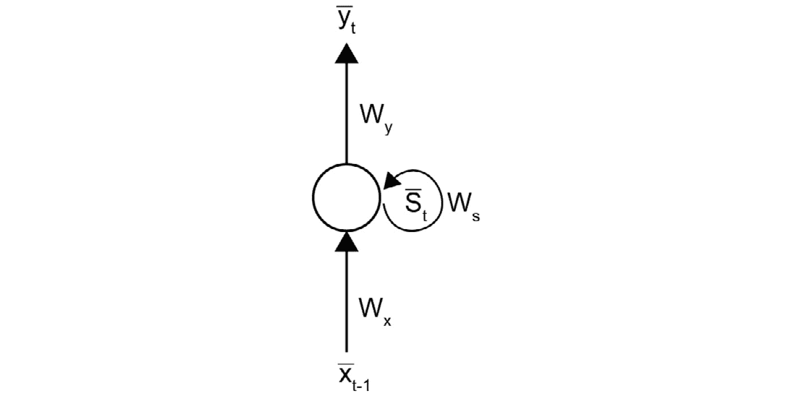
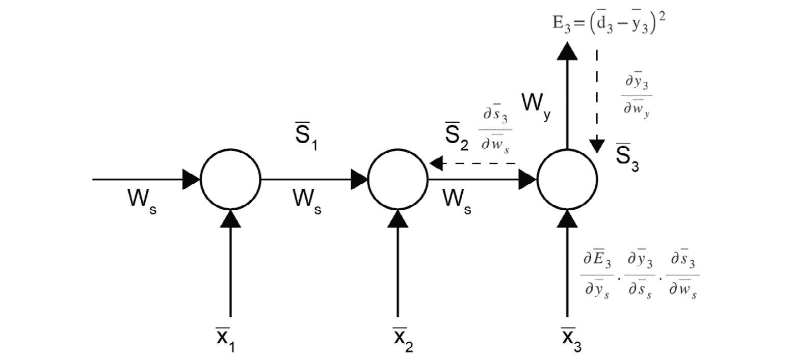
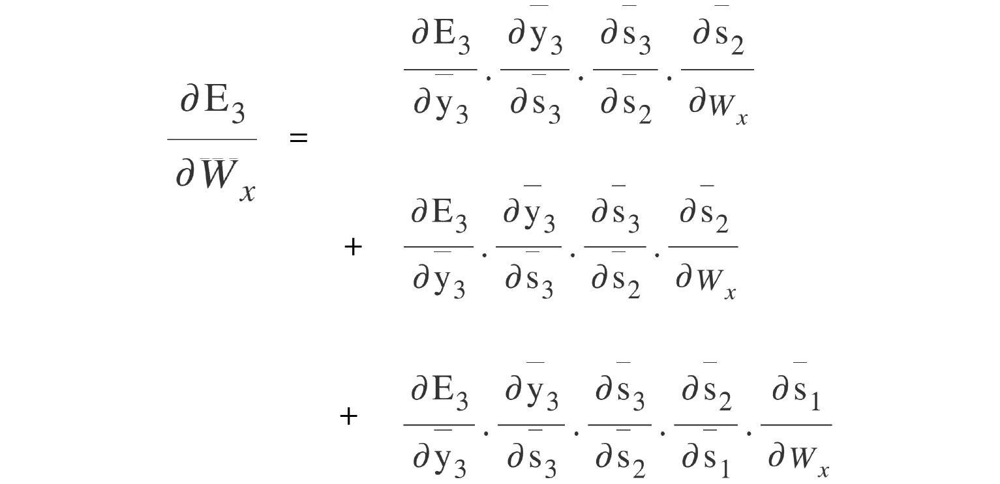

# 第六章

# 循环神经网络

## 学习目标

在本章结束时，你将能够：

+   描述经典的前馈神经网络

+   区分前馈神经网络和循环神经网络

+   评估通过时间反向传播应用于循环神经网络的效果

+   描述循环神经网络的缺点

+   使用 Keras 中的循环神经网络解决作者归属问题

本章旨在介绍循环神经网络及其应用，并讨论它们的缺点。

## 介绍

我们在日常生活中会遇到不同种类的数据，其中一些数据具有时间依赖性（随时间变化的依赖关系），而另一些则没有。例如，一张图片本身就包含了它想要传达的信息。然而，音频和视频等数据形式则具有时间依赖性。如果只考虑一个固定的时间点，它们无法传递信息。根据问题的描述，解决问题所需的输入可能会有所不同。如果我们有一个模型来检测某个特定人物在一帧中的出现，那么可以使用单张图片作为输入。然而，如果我们需要检测他们的动作，我们需要一系列连续的图像作为输入。我们可以通过分析这些图像来理解一个人的动作，但不能仅仅通过单独的图像来分析。

在观看电影时，某个特定场景之所以能够理解，是因为已知其上下文，并且我们记住了电影中之前收集的所有信息，来理解当前场景。这一点非常重要，而我们作为人类之所以能够做到这一点，是因为我们的脑袋能够存储记忆，分析过去的数据，并提取有用信息以理解当前的场景。

像多层感知机和卷积神经网络这样的网络缺乏这种能力。它们对每个输入都视为独立处理，并且不会存储任何来自过去输入的信息来分析当前输入，因为它们在架构上缺乏记忆功能。在这种情况下，也许我们可以让神经网络具有记忆功能。我们可以尝试让它们存储过去的有用信息，并从过去获取有助于分析当前输入的信息。这是完全可能的，其架构被称为**循环神经网络**（**RNN**）。

在深入了解 RNN 的理论之前，我们先来看一下它们的应用。目前，RNN 被广泛应用。以下是一些应用：

+   *语音识别*：无论是亚马逊的 Alexa，苹果的 Siri，谷歌的语音助手，还是微软的 Cortana，它们的所有语音识别系统都使用 RNN。

+   *时间序列预测*：任何具有时间序列数据的应用程序，如股市数据、网站流量、呼叫中心流量、电影推荐、Google Maps 路线等等，都使用 RNN 来预测未来数据、最佳路径、最佳资源分配等。

+   *自然语言处理*：机器翻译（例如 Google Translate）、聊天机器人（如 Slack 和 Google 的聊天机器人）以及问答系统等应用都使用 RNN 来建模依赖关系。

## 神经网络的早期版本

大约 40 年前，人们发现**前馈神经网络**（**FFNNs**）无法捕捉时间变化的依赖关系，而这对于捕捉信号的时间变化特性至关重要。建模时间变化的依赖关系在许多涉及现实世界数据的应用中非常重要，例如语音和视频，这些数据具有时间变化的特性。此外，人类生物神经网络具有递归关系，因此这是最明显的发展方向。如何将这种递归关系添加到现有的前馈网络中呢？

实现这一目标的首次尝试之一是通过添加延迟元素，网络被称为**时延神经网络**，简称**TDNN**。

在这个网络中，正如下图所示，延迟元素被添加到网络中，过去的输入与当前时刻一起作为网络的输入。与传统的前馈网络相比，这种方法无疑具有优势，但也有一个缺点，即只能接收来自过去的有限输入，这取决于窗口的大小。如果窗口太大，网络随着参数的增加而增长，计算复杂度也随之增加。


###### 图 5.1：TDNN 结构

随后出现了 Elman 网络，或称为简单 RNN（**Simple RNN**）。Elman 网络与前馈网络非常相似，不同之处在于其输出的隐藏层会被存储并用于下一个输入。这样，前一个时刻的信息可以在这些隐藏状态中被捕获。

观察 Elman 网络的一种方式是，在每个输入时，我们将前一个隐藏层的输出与当前输入一起附加，并将它们作为网络的输入。因此，如果输入大小是**m**，隐藏层大小是**n**，则有效的输入层大小变为**m+n**。

下图显示了一个简单的三层网络，其中之前的状态被反馈到网络中以存储上下文，因此称之为**SimpleRNN**。这种架构有其他变种，例如 Jordan 网络，我们在本章中不会学习这些变种。对于那些对 RNN 早期历史感兴趣的人来说，阅读更多关于 Elman 网络和 Jordan 网络的资料可能是一个很好的起点。


###### 图 5.2：SimpleRNN 结构

然后就出现了 **RNN**，这是本章的主题。我们将在接下来的章节中详细探讨 RNN。需要注意的是，在递归网络中，由于存在与这些单位相关的记忆单元和权重，这些内容需要在反向传播中学习。由于这些梯度也通过时间进行反向传播，因此我们称之为 **通过时间的反向传播**（**BPTT**）。我们将在后续章节中详细讨论 BPTT。然而，由于 BPTT，TDNN、Elman 网络和 RNN 存在一个主要缺陷，这个问题被称为梯度消失。梯度消失是指梯度在反向传播时越来越小，在这些网络中，随着时间步长的增加，反向传播的梯度越来越小，最终导致梯度消失。捕捉超过 20 个时间步长的时间依赖性几乎是不可能的。

为了解决这个问题，引入了一种名为 **长短期记忆**（**LSTM**）的架构。这里的关键思想是保持一些细胞状态不变，并根据需要将其引入到未来的时间步长中。这些决策由门控机制完成，包括遗忘门和输出门。LSTM 的另一种常见变体叫做 **门控递归单元**（**GRU**），简称 **GRU**。如果你还没有完全理解这些概念，不用太担心。接下来有两章内容专门讲解这些概念。

## RNN

"递归"通常意味着反复发生。RNN 的递归部分简单来说就是在输入序列中的所有输入上执行相同的任务（对于 RNN，我们将时间步长序列作为输入序列）。前馈网络和 RNN 之间的一个主要区别是，RNN 拥有称为状态的记忆单元，用于捕获来自前一个输入的信息。因此，在这个架构中，当前的输出不仅依赖于当前输入，还依赖于当前的状态，而该状态则考虑了过去的输入。

RNN 通过输入序列而不是单一输入进行训练；同样，我们也可以将 RNN 的每个输入视为时间步长的序列。RNN 中的状态单元包含有关过去输入的信息，以处理当前的输入序列。


###### 图 5.3：RNN 结构

对于输入序列中的每个输入，RNN 获取一个状态，计算其输出，并将其状态传递给序列中的下一个输入。对于序列中的所有元素，都会重复执行相同的任务。

通过将 RNN 与前馈网络进行比较，我们可以更容易理解 RNN 及其运作方式。现在就让我们来进行这样的比较。

到目前为止，很明显，在前馈神经网络中，输入彼此之间是独立的，因此我们通过随机抽取输入和输出的配对来训练网络。序列本身没有任何重要性。在任何给定的时刻，输出只是输入和权重的函数。


###### 图 5.4：RNN 的输出表达式

在 RNN 中，时间 **t** 的输出不仅依赖于当前输入和权重，还依赖于之前的输入。在这种情况下，时间 **t** 的输出定义如下：


###### 图 5.5：RNN 在时间 t 的输出表达式

让我们看看一个简单的 RNN 结构，称为折叠模型。在下图中，**S**<sub>t</sub> 状态向量从前一个时间步反馈到网络。这个表示法的一个重要启示是，RNN 在各个时间步之间共享相同的权重矩阵。通过增加时间步，我们并不是在学习更多的参数，而是在查看更大的序列。



###### 图 5.6：RNN 的折叠模型

这是 RNN 的折叠模型：

**Xt**：输入序列中的当前输入向量

**Yt**：输出序列中的当前输出向量

**St**：当前状态向量

**Wx**：连接输入向量到状态向量的权重矩阵

**Wy**：连接状态向量到输出向量的权重矩阵

**Ws**：连接前一时间步的状态向量到下一时间步的权重矩阵

由于输入 **x** 是一个时间步序列，并且我们对该序列中的每个元素执行相同的任务，因此我们可以展开该模型。


###### 图 5.7：RNN 的展开

例如，时间 **t+1** 的输出，**y**<sub>t+1</sub>，依赖于时间 **t+1** 的输入、权重矩阵以及之前的所有输入。


###### 图 5.8：展开的 RNN

由于 RNN 是 FFNN 的扩展，理解这两种架构之间的差异非常重要。


###### 图 5.9：FFNN 和 RNN 的差异

FFNN 和 RNN 的输出表达式如下：


###### 图 5.10：FFNN 和 RNN 的输出表达式

从前面的图和公式可以明显看出，这两种架构之间有很多相似之处。事实上，如果 **Ws=0**，它们是相同的。显然是这种情况，因为 **Ws** 是与反馈到网络的状态相关的权重。没有 **Ws** 就没有反馈，这是 RNN 的基础。

在 FFNN（前馈神经网络）中，输出依赖于**t**时刻的输入和权重矩阵。在 RNN 中，输出不仅依赖于**t**时刻的输入，还依赖于**t-1**、**t-2**等时刻的输入，以及权重矩阵。这可以通过进一步计算隐藏向量**h**（对于 FFNN）和**s**（对于 RNN）来解释。乍一看，似乎**t**时刻的状态依赖于**t**时刻的输入、**t-1**时刻的状态和权重矩阵；而**t-1**时刻的状态依赖于**t-1**时刻的输入、**t-2**时刻的状态，依此类推，形成一个从第一时刻开始回溯的链条。不过，FFNN 和 RNN 的输出计算是相同的。

### RNN 架构

RNN（循环神经网络）可以有多种形式，具体使用哪种架构需要根据我们要解决的问题来选择。


###### 图 5.11 不同架构的 RNN

*一对多*：在这种架构中，给定一个单一的输入，输出是一个序列。一个例子是图像描述，其中输入是单一的图像，输出是一系列描述图像的单词。

*多对一*：在这种架构中，给定一个输入序列，但期望一个单一的输出。一个例子是时间序列预测，其中需要预测下一个时刻的值，基于之前的时刻。

*多对多*：在这种架构中，输入序列被提供给网络，网络输出一个序列。在这种情况下，序列可以是同步的，也可以是不同步的。例如，在机器翻译中，整个句子需要先输入网络，然后网络才开始进行翻译。有时，输入和输出不是同步的；例如，在语音增强中，输入是一个音频帧，而输出是该音频帧的清晰版本。在这种情况下，输入和输出是同步的。

RNN 也可以堆叠在一起。需要注意的是，每个堆叠中的 RNN 都有自己的权重矩阵。因此，权重矩阵在横向（时间轴）上是共享的，而不是在纵向（RNN 数量轴）上共享的。


###### 图 5.12: 堆叠的 RNN

### BPTT

RNN 可以处理不同长度的序列，能以不同形式使用，且可以堆叠在一起。之前，你已经遇到过反向传播技术，用于反向传播损失值以调整权重。对于 RNN，也可以进行类似的操作，不过稍有不同，那就是通过时间传递的门控损失。它被称为**BPTT**（反向传播通过时间）。

根据反向传播的基本理论，我们知道以下内容：


###### 图 5.13: 权重更新的表达式

更新值是通过链式法则的梯度计算得出的：


###### 图 5.14 误差相对于权重的偏导数

这里，**α** 是学习率。误差（**损失**）相对于权重矩阵的偏导数是主要的计算。获得新的矩阵后，调整权重矩阵就是将这个新矩阵按学习因子缩放后加到原矩阵上。

在计算 RNN 的更新值时，我们将使用 BPTT。

让我们通过一个例子来更好地理解这一点。考虑一个损失函数，例如均方误差（常用于回归问题）：


###### 图 5.15：损失函数

在时间步 **t = 3** 时，计算得到的损失如图所示：


###### 图 5.16 时间 t=3 时的损失

这个损失需要进行反向传播，**Wy**、**Wx** 和 **Ws** 权重需要更新。

如前所述，我们需要计算更新值来调整这些权重，这个更新值可以通过偏导数和链式法则来计算。

完成此操作有三个部分：

+   通过计算误差相对于 **Wy** 的偏导数来更新权重 **Wy**

+   通过计算误差相对于 **Ws** 的偏导数来更新权重 **Ws**

+   通过计算误差相对于 **Wx** 的偏导数来更新权重 **Wx**

在我们查看这些更新之前，先将模型展开，并保留对我们计算有实际意义的网络部分。


###### 图 5.17 展开后的 RNN，时间 t=3 时的损失

由于我们关注的是时间 **t=3** 时的损失如何影响权重矩阵，时间 **t=2** 及之前的损失值不再相关。现在，我们需要理解如何将损失反向传播通过网络。

让我们来逐个查看这些更新，并展示前图中每个更新的梯度流动。

## 更新与梯度流

更新可以列出如下：

+   调整权重矩阵 **Wy**

+   调整权重矩阵 **Ws**

+   更新 **Wx** 的过程

### 调整权重矩阵 **Wy**

该模型可以通过如下方式进行可视化：


###### 图 5.18：通过权重矩阵 **Wy** 对损失进行反向传播

对于 **Wy**，更新非常简单，因为 **Wy** 和误差之间没有其他路径或变量。该矩阵可以按以下方式表示：


###### 图 5.19：权重矩阵 **Wy** 的表达式

### 调整权重矩阵 **Ws**



###### 图 5.20：通过权重矩阵 **Ws** 对损失进行反向传播，关于 S3

我们可以使用链式法则计算误差关于**Ws**的偏导数，如前面的图所示。看起来这就是所需的，但重要的是要记住，**S****t**依赖于**S****t-1**，因此**S****3**依赖于**S****2**，所以我们还需要考虑**S****2**，如图所示：


###### 图 5.21：通过权重矩阵 Ws 对 S2 进行损失的反向传播

同样，**S****2**依赖于**S****1**，因此也需要考虑**S****1**，如图所示：


###### 图 5.22：通过权重矩阵 Ws 对 S1 进行损失的反向传播

在**t=3**时，我们必须考虑状态**S****3**对误差的贡献，状态**S****2**对误差的贡献，以及状态**S****1**对误差的贡献，**E****3**。最终的值如下所示：


###### 图 5.23：t=3 时关于 Ws 的所有误差导数之和

一般来说，对于时间步**N**，需要考虑之前时间步的所有贡献。因此，一般公式如下所示：


###### 图 5.24：关于 Ws 的误差导数的一般表达式

### 用于更新**Wx**

我们可以使用链式法则计算误差关于**Wx**的偏导数，如接下来的几张图所示。基于**S****t**依赖于**S****t-1**的相同推理，误差关于**Wx**的偏导数计算可以分为三个阶段，在**t=3**时进行。


###### 图 5.25：通过权重矩阵 Wx 对 S2 进行损失的反向传播

通过权重矩阵 Wx 对 S2 进行损失的反向传播：


###### 图 5.26：通过权重矩阵 Wx 对 S2 进行损失的反向传播

通过权重矩阵 Wx 对 S1 进行损失的反向传播：


###### 图 5.27：通过权重矩阵 Wx 对 S1 进行损失的反向传播

类似于前面的讨论，在**t=3**时，我们必须考虑状态**S****3**对误差的贡献，状态**S****2**对误差的贡献，以及状态**S****1**对误差的贡献，**E****3**。最终的值如下所示：



###### 图 5.28: 在 t=3 时关于 Wx 的所有误差导数之和

一般来说，对于时间步 N，需要考虑前面所有时间步的贡献。因此，通用公式如下所示：


###### 图 5.29: 关于 Wx 的误差导数的通用表达式

由于链式导数在**t=3**时已经有 5 个相乘项，到第 20 时间步时，这个数量增长到了 22 个相乘项。每一个导数可能大于 0 或小于 0。由于连续乘法和更长的时间步，总导数会变得更小或更大。这个问题即为消失梯度或爆炸梯度。

## 梯度

已识别的两种梯度类型是：

+   爆炸梯度

+   消失梯度

### 爆炸梯度

正如名称所示，当梯度爆炸到更大的值时，就会发生这种情况。这可能是 RNN 架构在较大时间步时遇到的问题之一。当每个偏导数大于 **1** 时，乘法会导致一个更大的值。这些更大的梯度值每次通过反向传播调整权重时，会导致权重发生剧烈变化，从而使网络无法很好地学习。

有一些技术可以缓解这个问题，比如梯度裁剪，当梯度超过设定的阈值时会进行归一化处理。

### 消失梯度

无论是 RNN 还是 CNN，如果计算出的损失需要反向传播很长时间，消失梯度可能会成为问题。在 CNN 中，当有很多层并且激活函数是 sigmoid 或 tanh 时，这个问题可能会出现。损失需要反向传播到最初的层，而这些激活函数通常会在损失到达最初的层时将其稀释，意味着初始层几乎没有权重更新，导致欠拟合。即使是在 RNN 中也很常见，因为即使网络只有一个 RNN 层但时间步长较多，损失也需要通过时间反向传播穿越所有的时间步。由于梯度是相乘的，如前面所见的广义导数表达式，这些值往往变得较小，且在某个时间步后权重不会被更新。这意味着即使给网络显示更多的时间步，网络也无法受益，因为梯度无法完全反向传播。这种 RNN 的限制是由消失梯度引起的。

如其名称所示，当梯度变得过小时，就会发生这种情况。当每个偏导数小于 1 时，这种情况可能发生，并且这些偏导数的乘积会导致一个更小的值。由于信息的几何衰减，网络无法正确学习。权重值几乎没有变化，这会导致欠拟合。

必须有一种更好的机制来知道应记住前面时刻的哪些部分，哪些部分该忘记，等等。为了解决这个问题，像 LSTM 网络和 GRU 这样的架构应运而生。

### 使用 Keras 构建 RNN

到目前为止，我们已经讨论了 RNN 的理论背景，但有许多可用的框架可以抽象出实现的细节。只要我们知道如何使用这些框架，我们就能成功地让项目运行。**TensorFlow**、**Theano**、**Keras**、**PyTorch** 和 **CNTK** 都是这些框架中的一部分。在这一章中，让我们更详细地了解最常用的框架——**Keras**。它使用 Tensorflow 或 Theano 作为后端，这意味着它创建了比其他框架更高的抽象级别。它是最适合初学者的工具。一旦熟悉了 Keras，像 TensorFlow 这样的工具可以在实现自定义函数时提供更大的能力。

你将在接下来的几章中学习到许多 RNN 的变种，但它们都使用相同的基类，称为 RNN：

```py
keras.layers.RNN(cell, return_sequences=False, return_state=False, go_backwards=False, stateful=False, unroll=False)
```

在这一章中，我们讨论了 RNN 的简单形式，它在 Keras 中称为 **SimpleRNN**：

```py
keras.layers.SimpleRNN(units, activation='tanh', use_bias=True, kernel_initializer='glorot_uniform', recurrent_initializer='orthogonal', bias_initializer='zeros', kernel_regularizer=None, recurrent_regularizer=None, bias_regularizer=None, activity_regularizer=None, kernel_constraint=None, recurrent_constraint=None, bias_constraint=None, dropout=0.0, recurrent_dropout=0.0, return_sequences=False, return_state=False, go_backwards=False, stateful=False, unroll=False)
```

正如你从这里的参数所看到的，有两种类型：一种是常规的卷积核，用于计算层的输出，另一种是用于计算状态的循环卷积核。不要太担心约束、正则化器、初始化器和丢弃法。你可以在 [`keras.io/layers/recurrent/`](https://keras.io/layers/recurrent/) 找到更多信息。它们主要用于避免过拟合。激活函数在这里的作用与任何其他层的激活函数作用相同。

单元数是指特定层中递归单元的数量。单元数量越多，需要学习的参数就越多。

`return_sequences` 是指定 RNN 层是否应返回整个序列还是仅返回最后一个时刻的参数。如果 `return_sequences` 为 False，则 RNN 层的输出仅为最后一个时刻，因此无法将其与另一个 RNN 层堆叠。换句话说，如果一个 RNN 层需要堆叠到另一个 RNN 层，则 `return_sequences` 需要为 True。如果 RNN 层连接到 Dense 层，这个参数可以是 True 或 False，具体取决于应用需求。

`return_state` 参数指定是否需要返回 RNN 的最后状态以及输出结果。根据应用需求，可以将其设置为 True 或 False。

`go_backwards` 可以用来处理输入序列的反向处理。如果由于某种原因需要反向处理输入序列，设置为 True 即可。请注意，如果将其设置为 True，返回的序列也会被反转。

`stateful` 是一个参数，如果需要在批次之间传递状态，可以将其设置为 true。如果将此参数设置为 true，数据需要谨慎处理；我们有一个话题会详细讲解这个问题。

`unroll` 是一个参数，若设置为 true，会使网络展开，这样可以加速操作，但根据时间步长的不同，可能会非常消耗内存。通常，对于短序列，这个参数会设置为 true。

时间步长不是某一层的参数，因为它对整个网络保持一致，这在输入形状中有所表示。这引出了使用 RNN 时网络形状的一个重要点：

```py
Input_shape 
3D tensor with shape (batch_size, timesteps, input_dim)
Output_shape
If return_sequences is true, 3D tensor with shape (batch_size, timesteps, units)
If return_sequences is false, 2D tensor with shape (batch_size, units)
If return_state is True, a list of 2 tensors, 1 is output tensor same as above depending on return_sequences, the other is state tensor of shape (batch_size, units)
```

#### 注

如果你开始构建一个包含 RNN 层的网络，必须指定`input_shape`。

构建模型后，可以使用`model.summary()`查看每一层的形状以及总参数数量。

### 练习 23：构建一个 RNN 模型，以展示参数随时间的稳定性

让我们构建一个简单的 RNN 模型，展示参数在时间步长上保持不变。注意，提到`input_shape`参数时，除非需要，否则无需提及`batch_size`。在状态保持网络中需要`batch_size`，我们接下来将讨论这个问题。训练模型时，`batch_size`会在使用 fit()或`fit_generator()`函数时提及。

以下步骤将帮助你解决这个问题：

1.  导入必要的 Python 包。我们将使用 Sequential、SimpleRNN 和 Dense。

    ```py
    from keras.models import Sequential
    from keras.layers import SimpleRNN, Dense
    ```

1.  接下来，我们定义模型及其各层：

    ```py
    model = Sequential()
    # Recurrent layer
    model.add(SimpleRNN(64, input_shape=(10,100), return_sequences=False))
    # Fully connected layer
    model.add(Dense(64, activation='relu'))
    # Output layer
    model.add(Dense(100, activation='softmax'))
    ```

1.  你可以查看模型的摘要：

    ```py
    model.summary()
    ```

    `model.summary()` 会给出以下输出：

    

    ###### 图 5.30：模型层的模型摘要

    在这种情况下，`batch_size` 参数将由`fit()`函数提供。由于不返回序列，RNN 层的输出形状是 **(None, 64)**。

1.  让我们看一下返回序列的模型：

    ```py
    model = Sequential()
    # Recurrent layer
    model.add(SimpleRNN(64, input_shape=(10,100), return_sequences=True))
    # Fully connected layer
    model.add(Dense(64, activation='relu'))
    # Output layer
    model.add(Dense(100, activation='softmax'))
    model.summary()
    ```

    返回序列的模型摘要如下所示：

    

    ###### 图 5.31：返回序列模型的模型摘要

    现在，RNN 层返回的是一个序列，因此它的输出形状是 3D，而不是之前看到的 2D。此外，请注意，**Dense** 层会自动适应其输入的变化。当前版本的 Keras 中，**Dense** 层能够自动适应来自之前 RNN 层的时间步长。在之前的 Keras 版本中，**TimeDistributed**(**Dense**) 用于实现这一点。

1.  我们之前讨论过 RNN 如何在时间步长上共享参数。让我们实际看一下，并将之前模型的时间步长从 10 改为 1,000：

    ```py
    model = Sequential()
    # Recurrent layer
    model.add(SimpleRNN(64, input_shape=(1000,100), return_sequences=True))
    # Fully connected layer
    model.add(Dense(64, activation='relu'))
    # Output layer
    model.add(Dense(100, activation='softmax'))
    model.summary()
    ```


###### 图 5.32：时间步长的模型摘要

很明显，网络的输出形状已经改变为这个新的 time_steps。然而，两个模型之间的参数没有变化。

这表明参数是随时间共享的，并且不会受到时间步数变化的影响。请注意，当在多个时间步上操作时，同样适用于**Dense**层。

### 有状态与无状态

RNN 有两种考虑状态的操作模式：无状态模式和有状态模式。如果**参数 stateful=True**，则您正在使用有状态模式，**False**表示无状态模式。

无状态模式基本上是指批次中的一个示例与下一个批次中的任何示例无关；也就是说，每个示例在给定情况下是独立的。每个示例后的状态会被重置。每个示例具有根据模型架构确定的时间步数。例如，我们看到的上一个模型有 1,000 个时间步，在这 1,000 个时间步之间，状态向量会被计算并从一个时间步传递到下一个时间步。然而，在示例的结尾或下一个示例的开始时，没有状态被传递。每个示例是独立的，因此无需考虑数据如何洗牌。

在有状态模式下，**批次 1**的示例**i**的状态会传递到**批次 2**的**i+1**示例。这意味着状态会在批次之间的示例中传递。因此，示例必须在批次之间是连续的，而不能是随机的。下图解释了这一情况。示例**i**、**i+1**、**i+2**等是连续的，**j**、**j+1**、**j+2**等也是连续的，**k**、**k+1**、**k+2**等也是如此。


###### 图 5.33 状态 RNN 的批量格式

### 练习 24：通过仅更改参数将无状态网络转变为有状态网络

为了通过更改参数将网络从无状态转变为有状态，应该采取以下步骤。

1.  首先，我们需要导入所需的 Python 包：

    ```py
    from keras.models import Sequential
    from keras.layers import SimpleRNN, Dense
    ```

1.  接下来，使用`Sequential`构建模型并定义层：

    ```py
    model = Sequential()
    # Recurrent layer
    model.add(SimpleRNN(64, input_shape=(1000,100), return_sequences=True, stateful=False))
    # Fully connected layer
    model.add(Dense(64, activation='relu'))
    # Output layer
    model.add(Dense(100, activation='softmax'))
    model.summary()
    ```

1.  将优化器设置为`Adam`，将`categorical` `crossentropy`设置为损失函数参数，并设置指标来拟合模型。编译模型并在 100 个周期内拟合模型：

    ```py
    model.compile(optimizer='adam', loss='categorical_crossentropy', metrics=['accuracy'])
    model.fit(X, Y, batch_size=32, epochs=100, shuffle=True)
    ```

1.  假设`X`和`Y`是作为连续示例的训练数据。将此模型转为有状态模型：

    ```py
    model = Sequential()
    # Recurrent layer
    model.add(SimpleRNN(64, input_shape=(1000,100), return_sequences=True, stateful=True))
    # Fully connected layer
    model.add(Dense(64, activation='relu'))
    # Output layer
    model.add(Dense(100, activation='softmax'))
    ```

1.  将优化器设置为`Adam`，将`categorical` `crossentropy`设置为损失函数参数，并设置指标来拟合模型。编译模型并在 100 个周期内拟合模型：

    ```py
    model.compile(optimizer='adam', loss='categorical_crossentropy', metrics=['accuracy'])
    model.fit(X, Y, batch_size=1, epochs=100, shuffle=False)
    ```

1.  您可以使用箱型图来可视化输出。

    ```py
    results.boxplot()
    pyplot.show()
    ```

    **预期输出：**


###### 图 5.34：有状态与无状态的箱型图

#### 注意

输出可能会根据使用的数据而有所不同。

从有状态模型的概念中，我们了解到，按批次输入的数据需要是连续的，因此需要关闭随机化**OFF**。然而，即使**batch_size >1**，批次之间的数据也不会是连续的，因此需要设置**batch_size=1**。通过将网络设置为**stateful=True**并使用上述参数进行拟合，实际上我们是在以有状态的方式正确地训练模型。

然而，我们没有使用小批量梯度下降的概念，也没有对数据进行打乱。因此，需要实现一个生成器，以便小心地训练有状态的网络，但这超出了本章的范围。

`model.compile`是一个函数，用于为网络分配优化器、损失函数和我们关心的评估指标。

`model.fit()`是一个用于训练模型的函数，通过指定训练数据、验证数据、训练轮数、批次大小、打乱模式等来进行训练。

### 活动 6：使用 RNN 解决问题——作者身份归属。

作者身份归属是一个经典的文本分类问题，属于自然语言处理（NLP）范畴。作者身份归属是一个研究深入的问题，它催生了**风格计量学**领域。

在这个问题中，我们给定了一组来自特定作者的文档。我们需要训练一个模型来理解作者的写作风格，并使用该模型来识别未知文档的作者。与许多其他自然语言处理（NLP）问题一样，这个问题得益于计算能力、数据和先进机器学习技术的提升。这使得作者身份归属成为使用**深度学习（DL）**的一个自然选择。特别是，我们可以利用深度学习自动提取与特定问题相关的特征的能力。

在本次活动中，我们将专注于以下内容：

1.  从每个作者的文本中提取字符级别的特征（以获取每个作者的写作风格）。

1.  使用这些特征构建一个分类模型来进行作者身份归属。

1.  将模型应用于识别一组未知文档的作者。

    #### 注意

    你可以在 https://github.com/TrainingByPackt/Deep-Learning-for-Natural-Language-Processing/tree/master/Lesson%2005 找到本次活动所需的数据。

以下步骤将帮助你解决问题。

1.  导入必要的 Python 包。

1.  上传要使用的文本文件。然后，通过将所有文本转换为小写、将所有换行符和多个空格转换为单个空格，并去除任何提到作者姓名的部分来预处理文本文件，否则我们可能会导致数据泄露。

1.  为了将长文本分割成较小的序列，我们使用 Keras 框架中的`Tokenizer`类。

1.  接下来创建训练集和验证集。

1.  我们构建模型图并执行训练过程。

1.  将模型应用于未知的文档。对**Unknown**文件夹中的所有文档进行此操作。

    **预期输出：**


###### 图 5.35：作者归属的输出

#### 注意

活动的解答可以在第 309 页找到。

## 总结

在本章中，我们介绍了循环神经网络（RNN），并讨论了 RNN 与前馈神经网络（FFNN）架构之间的主要区别。我们学习了反向传播通过时间（BPTT）以及权重矩阵的更新方法。我们通过 Keras 学习了如何使用 RNN，并通过 Keras 解决了一个作者归属的问题。我们通过观察梯度消失和梯度爆炸问题，分析了 RNN 的不足之处。在接下来的章节中，我们将深入研究解决这些问题的架构。
