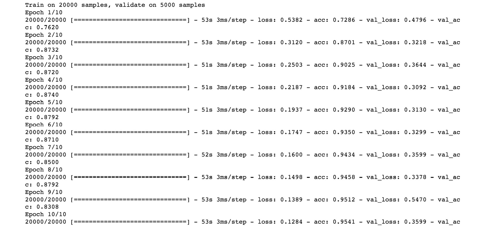

# 第七章

# 门控递归单元（GRU）

## 学习目标

本章结束时，你将能够：

+   评估简单递归神经网络（RNNs）的缺点

+   描述门控递归单元（GRU）的架构

+   使用 GRU 进行情感分析

+   应用 GRU 进行文本生成

本章旨在为现有 RNN 架构的缺点提供解决方案。

## 介绍

在前几章中，我们学习了文本处理技术，如词嵌入、分词和词频-逆文档频率（TFIDF）。我们还了解了一种特定的网络架构——递归神经网络（RNN），其存在消失梯度的问题。

在本章中，我们将研究一种通过在网络中添加记忆的有序方法来处理消失梯度的机制。本质上，GRU 中使用的门控是决定哪些信息应该传递到网络下一个阶段的向量。反过来，这有助于网络相应地生成输出。

一个基本的 RNN 通常由输入层、输出层和几个相互连接的隐藏层组成。下图展示了 RNN 的基本架构：


###### 图 6.1：一个基本的 RNN

RNN 在其最简单的形式中存在一个缺点，即无法保留序列中的长期关系。为了纠正这个缺陷，需要向简单的 RNN 网络中添加一个特殊的层，叫做门控递归单元（GRU）。

在本章中，我们将首先探讨简单 RNN 无法保持长期依赖关系的原因，然后介绍 GRU 层及其如何尝试解决这个特定问题。接着，我们将构建一个包含 GRU 层的网络。

## 简单 RNN 的缺点

让我们通过一个简单的例子来回顾一下消失梯度的概念。

本质上，你希望使用 RNN 生成一首英文诗歌。在这里，你设置了一个简单的 RNN 来完成任务，结果它生成了以下句子：

"这些花，尽管已是秋天，却像星星一样盛开。"

很容易发现这里的语法错误。单词'blooms'应该是'bloom'，因为句子开头的单词'flowers'表示应该使用'bloom'的复数形式，以使主谓一致。简单的 RNN 无法完成这一任务，因为它无法保留句子开头出现的单词'flowers'和后面出现的单词'blooms'之间的依赖关系（理论上，它应该能够做到！）。

**GRU**（门控循环单元）通过消除“消失梯度”问题来帮助解决这一问题，该问题妨碍了网络的学习能力，在长时间的文本关系中，网络未能保留这些关系。在接下来的部分中，我们将专注于理解消失梯度问题，并详细讨论 GRU 如何解决这个问题。

现在让我们回顾一下神经网络是如何学习的。在训练阶段，输入逐层传播，直到输出层。由于我们知道在训练过程中，对于给定输入，输出应该产生的确切值，我们计算预期输出和实际输出之间的误差。然后，这个误差被输入到一个成本函数中（这个成本函数会根据问题和网络开发者的创意而有所不同）。接下来的步骤是计算该成本函数相对于网络每个参数的梯度，从离输出层最近的层开始，一直到最底层的输入层：


###### 图 6.2：一个简单的神经网络

考虑一个非常简单的神经网络，只有四层，并且每一层之间只有一个连接，并且只有一个单一的输出，如前图所示。请注意，实际应用中你不会使用这样的网络；它这里只是用来演示消失梯度问题的概念。

现在，为了计算成本函数相对于第一隐藏层偏置项 b[1] 的梯度，需要进行以下计算：


###### 图 6.3：使用链式法则计算梯度

这里，每个元素的解释如下：

grad(x, y) = x 关于 y 的梯度

d(var) = 'var' 变量的 'sigmoid' 导数

w[i] = 第 'i' 层的权重

b[i] = 第 'i' 层的偏置项

a[i] = 第 'i' 层的激活函数

z[j] = w[j]*a[j-1] + b[j]

上述表达式可以归因于微分链式法则。

上述方程涉及多个项的乘法。如果这些项中的大多数值是在 -1 和 1 之间的分数，那么这些分数的乘积最终会得到一个非常小的值。在上述例子中，grad(C,b[1]) 的值将是一个非常小的分数。问题在于，这个梯度是将在下一次迭代中用来更新 b[1] 值的项：

![图 6.4：使用梯度更新 b[1] 的值

](img/C13783_06_04.jpg)

###### 图 6.4：使用梯度更新 b[1] 的值

#### 注意

使用不同优化器执行更新可能有几种方式，但概念本质上是相同的。

这种情况的结果是，b[1]的值几乎没有从上一次迭代中改变，这导致了非常缓慢的学习进展。在一个现实世界的网络中，可能有很多层，这种更新会变得更加微小。因此，网络越深，梯度问题就越严重。这里还观察到，靠近输出层的层学习得比靠近输入层的层更快，因为前者的乘法项更少。这也导致了学习的不对称性，进而引发了梯度的不稳定性。

那么，这个问题对简单 RNN 有什么影响呢？回顾一下 RNN 的结构；它本质上是一个随着时间展开的层次结构，层数与单词数量相同（对于建模问题）。学习过程通过时间反向传播（BPTT）进行，这与之前描述的机制完全相同。唯一的区别是，每一层的相同参数都会被更新。后面的层对应的是句子中后出现的单词，而前面的层对应的是句子中先出现的单词。由于梯度消失，前面的层与初始值的变化很小，因此它们对后续层的影响也很小。距离当前时间点't'越远的层，对该时间点层输出的影响就越小。因此，在我们的示例句子中，网络很难学习到“flowers”是复数形式，这导致了错误的“bloom”形式被使用。

### 梯度爆炸问题

事实证明，梯度不仅会消失，还可能会爆炸——也就是说，早期层可能学习得过快，训练迭代之间的值偏差较大，而后期层的梯度变化则不那么迅速。这是如何发生的呢？好吧，回顾一下我们的方程式，如果单个项的值远大于 1 的数量级，乘法效应就会导致梯度变得非常大。这会导致梯度的不稳定并引发学习问题。

最终，这个问题是梯度不稳定的问题。实际上，梯度消失问题比梯度爆炸问题更常见，也更难解决。

幸运的是，梯度爆炸问题有一个强有力的解决方案：裁剪（clipping）。裁剪仅仅是指停止梯度值的增长，防止其超过预设的值。如果梯度值没有被裁剪，你将开始看到梯度和网络权重出现 NaN（不是一个数字），这是由于计算机的表示溢出。为梯度值设定上限可以帮助避免这个问题。请注意，裁剪只限制梯度的大小，而不限制其方向。因此，学习过程仍然沿着正确的方向进行。梯度裁剪效果的简单可视化可以在下图中看到：


###### 图 6.5：裁剪梯度以应对梯度爆炸

## 门控循环单元（GRUs）

GRUs 帮助网络以显式的方式记住长期依赖关系。这是通过在简单的 RNN 结构中引入更多的变量实现的。

那么，什么可以帮助我们解决梯度消失问题呢？直观地说，如果我们允许网络从前一个时间步的激活函数中转移大部分知识，那么误差可以比简单的 RNN 情况更忠实地反向传播。如果你熟悉用于图像分类的残差网络，你会发现这个函数与跳跃连接（skip connection）非常相似。允许梯度反向传播而不消失，能够使网络在各层之间更加均匀地学习，从而消除了梯度不稳定的问题：


###### 图 6.6：完整的 GRU 结构

上图中不同符号的含义如下：


###### 图 6.7：GRU 图中不同符号的含义

#### 注意

哈达玛积运算是逐元素矩阵乘法。

上图展示了 GRU 所利用的所有组件。你可以观察到不同时间步（**h[t]**、**h[t-1]**）下的激活函数 h。**r[t]**项表示重置门，**z[t]**项表示更新门。**h'[t]**项表示候选函数，为了明确表达，我们将在方程中用**h_candidate[t]**变量表示它。GRU 层使用更新门来决定可以传递给下一个激活的先前信息量，同时使用重置门来决定需要忘记的先前信息量。在本节中，我们将详细检查这些术语，并探讨它们如何帮助网络记住文本结构中的长期关系。

下一层的激活函数（隐藏层）的表达式如下：


###### 图 6.8：下一层激活函数的表达式，以候选激活函数为基础

因此，激活函数是上一时间步的激活与当前时间步的候选激活函数的加权和。**z[t]** 函数是一个 sigmoid 函数，因此其取值范围在 0 和 1 之间。在大多数实际情况下，值更接近 0 或 1。在深入探讨前述表达式之前，让我们稍微观察一下引入加权求和方案更新激活函数的效果。如果**z[t]** 在多个时间步中保持为 1，则表示非常早期时间步的激活函数的值仍然可以传递到更晚的时间步。这反过来为网络提供了记忆能力。

此外，请观察它与简单 RNN 的不同之处，在简单 RNN 中，激活函数的值在每个时间步都会被覆盖，而不会显式地加权前一时间步的激活（在简单 RNN 中，前一激活的贡献是通过非线性操作隐含存在的）。

### 门类型

现在让我们在接下来的部分中展开讨论前述的激活更新方程。

### 更新门

更新门由下图表示。正如你从完整的 GRU 图中看到的，只有相关部分被突出显示。更新门的目的是确定从前一时间步传递到下一步激活的必要信息量。为了理解该图和更新门的功能，请考虑以下计算更新门的表达式：


###### 图 6.9：计算更新门的表达式

以下图展示了更新门的图形表示：


###### 图 6.10：完整 GRU 图中的更新门

隐藏状态的数量是**n_h**（*`h`*的维度），而输入维度的数量是 n_x。时间步 t 的输入（**x[t]**）将与一组新权重 **W_z** 相乘，维度为（**n_h, n_x**）。上一时间步的激活函数（**h[t-1]**）将与另一组新权重 **U_z** 相乘，维度为（**n_h, n_h**）。

请注意，这里的乘法是矩阵乘法。然后将这两个项相加，并通过 sigmoid 函数将输出 **z[t]** 压缩到 **[0,1]** 范围内。**z[t]** 输出具有与激活函数相同的维度，即（**n_h, 1**）。**W_z** 和 **U_z** 参数也需要通过 BPTT 进行学习。让我们编写一个简单的 Python 代码片段来帮助我们理解更新门：

```py
import numpy as np
# Write a sigmoid function to be used later in the program
def sigmoid(x):
    return 1 / (1 + np.exp(-x))
n_x = 5 # Dimensionality of input vector
n_h = 3 # Number of hidden units
# Define an input at time 't' having a dimensionality of n_x
x_t = np.random.randn(n_x, 1)
# Define W_z, U_z and h_prev (last time step activation)
W_z = np.random.randn(n_h,  n_x) # n_h = 3, n_x=5
U_z = np.random.randn(n_h, n_h) # n_h = 3
h_prev = np.random.randn(n_h, 1)
```


###### 图 6.11：显示权重和激活函数的截图

以下是更新门表达式的代码片段：

```py
# Calculate expression for update gate
z_t = sigmoid(np.matmul(W_z, x_t) + np.matmul(U_z, h_prev))
```

在前面的代码片段中，我们初始化了 **x[t]**、**W_z**、**U_z** 和 **h_prev** 的随机值，以演示 **z[t]** 的计算。在真实的网络中，这些变量将具有更相关的值。

### 重置门

重置门由以下图示表示。从完整的 GRU 图示中可以看到，只有相关部分被突出显示。重置门的目的是确定在计算下一个步骤的激活时，应该遗忘多少来自前一个时间步的信息。为了理解图示和重置门的功能，考虑以下用于计算重置门的表达式：


###### 图 6.12：计算重置门的表达式

以下图示展示了重置门的图形表示：


###### 图 6.13：重置门

在时间步 *`t`* 处的输入与权重 **W_r** 相乘，使用维度（**n_h, n_x**）。然后，将前一个时间步的激活函数（**h[t-1]**）与另一组新权重 **U_r** 相乘，使用维度（**n_h, n_h**）。请注意，这里的乘法是矩阵乘法。然后将这两个项相加，并通过 sigmoid 函数将 **r[t]** 输出压缩到 **[0,1]** 范围内。**r[t]** 输出具有与激活函数相同的维度，即（**n_h, 1**）。

**W_r** 和 **U_r** 参数也需要通过 BPTT 进行学习。让我们来看一下如何在 Python 中计算重置门的表达式：

```py
# Define W_r, U_r
W_r = np.random.randn(n_h,  n_x) # n_h = 3, n_x=5
U_r = np.random.randn(n_h, n_h) # n_h = 3
# Calculate expression for update gate
r_t = sigmoid(np.matmul(W_r, x_t) + np.matmul(U_r, h_prev))
```

在前面的代码片段中，已经使用了来自更新门代码片段的 **x_t**、**h_prev**、**n_h** 和 **n_x** 变量的值。请注意，**r_t** 的值可能不会特别接近 0 或 1，因为这只是一个示例。在经过良好训练的网络中，值应该接近 0 或 1：


###### 图 6.14：显示权重值的截图


###### 图 6.15：显示 `r_t` 输出的截图

### 候选激活函数

在每个时间步长还计算了一个候选激活函数，用于替换前一个时间步长的激活函数。顾名思义，候选激活函数表示下一个时间步长激活函数应该采取的替代值。看看以下计算候选激活函数的表达式：


###### 图 6.16: 计算候选激活函数表达式

以下图显示了候选激活函数的图形表示：


###### 图 6.17: 候选激活函数

在时间步 t 处的输入与权重 W 进行了维度 (**n_h**, **n_x**) 的乘法。W 矩阵的作用与简单 RNN 中使用的矩阵相同。然后，重置门与上一个时间步长的激活函数 (**h[t-1]**) 进行逐元素乘法。这个操作被称为 'Hadamard 乘法'。乘法的结果通过维度为 (**n_h, n_h**) 的 U 矩阵进行矩阵乘法。U 矩阵与简单 RNN 中使用的矩阵相同。然后将这两项加在一起，并通过双曲正切函数进行处理，以使输出 **h_candidate[t]** 被压缩到 [-1,1] 的范围内。**h_candidate[t]** 输出的维度与激活函数相同，即 (**n_h, 1**)：

```py
# Define W, U
W = np.random.randn(n_h,  n_x) # n_h = 3, n_x=5
U = np.random.randn(n_h, n_h) # n_h = 3
# Calculate h_candidate
h_candidate = np.tanh(np.matmul(W, x_t) + np.matmul(U,np.multiply(r_t, h_prev)))
```

再次使用与更新门和重置门计算中相同的变量值。请注意，Hadamard 矩阵乘法是使用 NumPy 函数 'multiply' 实现的：


###### 图 6.18: 展示了 W 和 U 权重如何定义的截图

以下图显示了 **h_candidate** 函数的图形表示：


###### 图 6.19: 展示了 h_candidate 值的截图

现在，由于已经计算出更新门、重置门和候选激活函数的值，我们可以编写用于传递到下一层的当前激活函数表达式：

```py
# Calculate h_new
h_new = np.multiply(z_t, h_prev) + np.multiply((1-z_t), h_candidate)
```


###### 图 6.20: 展示了当前激活函数的值的截图

从数学角度讲，更新门的作用是选择前一个激活函数和候选激活函数之间的加权。因此，它负责当前时间步的激活函数的最终更新，并决定多少前一个激活函数和候选激活函数将传递到下一层。复位门的作用是选择或取消选择前一个激活函数的部分。这就是为什么要对前一个激活函数和复位门向量进行逐元素乘法的原因。考虑我们之前提到的诗歌生成句子的例子：

“尽管是秋天，花朵像星星一样绽放。”

一个复位门将用于记住单词“flowers”对单词“bloom”复数形式的影响，这种影响发生在句子的后半部分。因此，复位门向量中特定的值负责记住单词的复数或单数形式，该值将接近 0 或 1。如果 0 表示单数，那么在我们的例子中，复位门将保持值为 1，以记住单词“bloom”应采用复数形式。复位门向量中的不同值将记住句子复杂结构中的不同关系。

作为另一个例子，请考虑以下句子：

“来自法国的食物很美味，但法国人也非常热情好客。”

在分析句子结构时，我们可以看到有几个复杂的关系需要记住：

+   单词“food”与单词“delicious”相关（这里，“delicious”只能在“food”的语境中使用）。

+   单词“France”与“French”人相关。

+   单词“people”和“were”是相互关联的；也就是说，单词“people”的使用决定了“was”的正确形式。

在一个训练良好的网络中，复位门的向量中会包含所有这些关系的条目。这些条目的值将根据需要记住哪些来自先前激活的关系，哪些需要遗忘，适当地被设置为“关闭”或“开启”。在实践中，很难将复位门或隐藏状态的条目归因于某个特定功能。因此，深度学习网络的可解释性仍然是一个热门的研究话题。

### GRU 的变种

上面描述的 GRU 的形式是完整的 GRU。许多独立的研究者已使用不同形式的 GRU，比如完全移除复位门或使用激活函数。然而，完整的 GRU 仍然是最常用的方法。

## 基于 GRU 的情感分析

情感分析是应用自然语言处理技术的一个热门用例。情感分析的目的是判断给定的文本是否可以被视为传达“正面”情绪或“负面”情绪。例如，考虑以下文本对一本书的评论：

"这本书有过辉煌的时刻，但似乎经常偏离了要点。这样水准的作者，肯定比这本书所呈现的要更多。"

对于人类读者来说，显然提到的这本书评传达了一个负面情绪。那么，如何构建一个机器学习模型来进行情感分类呢？和往常一样，使用监督学习方法时，需要一个包含多个样本的文本语料库。语料库中的每一篇文本应该有一个标签，指示该文本是可以映射到正面情绪还是负面情绪。下一步是使用这些数据构建一个机器学习模型。

观察这个例子，你已经可以看到这个任务对于机器学习模型来说可能是具有挑战性的。如果使用简单的分词或 TFIDF 方法，像‘辉煌’和‘水准’这样的词语可能会被分类器误认为是传达正面情绪。更糟糕的是，文本中没有任何词语可以直接解读为负面情绪。这一观察也揭示了需要连接文本中不同部分结构的必要性，以便从句子中提取出真正的意义。例如，第一句话可以被分解为两部分：

1.  "这本书有过辉煌的时刻"

1.  "，但似乎经常偏离了要点。"

仅仅看句子的第一部分，可能会让你得出评论是积极的结论。只有在考虑到第二句话时，句子的含义才真正能被理解为表达负面情感。因此，这里需要保留长期依赖关系。简单的 RNN 模型显然无法胜任这项任务。那么我们来尝试在情感分类任务中应用 GRU，并看看它的表现。

### 练习 25：计算情感分类模型的验证准确率和损失

在本练习中，我们将使用 imdb 数据集编写一个简单的情感分类系统。imdb 数据集包含 25,000 个训练文本序列和 25,000 个测试文本序列——每个序列都包含一篇电影评论。输出变量是一个二元变量，如果评论为负面，则值为 0；如果评论为正面，则值为 1：

#### 注意

所有练习和活动都应该在 Jupyter notebook 中运行。用于创建 Python 环境以运行此 notebook 的 `requirements.txt` 文件内容如下：h5py==2.9.0，keras==2.2.4，numpy==1.16.1，tensorflow==1.12.0。

**解决方案：**

我们首先加载数据集，如下所示：

```py
from keras.datasets import imdb
```

1.  我们还将定义生成训练序列时要考虑的最大频率最高的单词数为 10,000。我们还将限制序列长度为 500：

    ```py
    max_features = 10000
    maxlen = 500
    ```

1.  现在让我们按如下方式加载数据：

    ```py
    (train_data, y_train), (test_data, y_test) = imdb.load_data(num_words=max_features)
    print('Number of train sequences: ', len(train_data))
    print('Number of test sequences: ', len(test_data))
    ```

    

    ###### 图 6.21：显示训练和测试序列的截图

1.  可能存在长度小于 500 的序列，因此我们需要对其进行填充，使其长度恰好为 500。我们可以使用 Keras 函数来实现这一目的：

    ```py
    from keras.preprocessing import sequence
    train_data = sequence.pad_sequences(train_data, maxlen=maxlen)
    test_data = sequence.pad_sequences(test_data, maxlen=maxlen)
    ```

1.  让我们检查训练和测试数据的形状，如下所示：

    ```py
    print('train_data shape:', train_data.shape)
    print('test_data shape:', test_data.shape)
    ```

    验证两个数组的形状是否为(25,000, 500)。

1.  现在让我们构建一个带有 GRU 单元的 RNN。首先，我们需要导入必要的包，如下所示：

    ```py
    from keras.models import Sequential
    from keras.layers import Embedding
    from keras.layers import Dense
    from keras.layers import GRU
    ```

1.  由于我们将使用 Keras 的顺序 API 来构建模型，因此需要从 Keras 模型中导入顺序模型 API。嵌入层本质上将输入向量转换为固定大小，然后可以将其馈送到网络的下一层。如果使用，它必须作为网络的第一层添加。我们还导入了一个 Dense 层，因为最终正是这个层提供了目标变量（0 或 1）的分布。

    最后，我们导入 GRU 单元；让我们初始化顺序模型 API 并添加嵌入层，如下所示：

    ```py
    model = Sequential()
    model.add(Embedding(max_features, 32))
    ```

    嵌入层接受 max_features 作为输入，我们定义它为 10,000。32 的值在此处设置，因为下一个 GRU 层期望从嵌入层获取 32 个输入。

1.  接下来，我们将添加 GRU 和 Dense 层，如下所示：

    ```py
    model.add(GRU(32))
    model.add(Dense(1, activation='sigmoid'))
    ```

1.  32 的值是随意选择的，并可以作为设计网络时调整的超参数之一。它表示激活函数的维度。Dense 层只输出 1 个值，即评论（即我们的目标变量）为 1 的概率。我们选择 sigmoid 作为激活函数。

    接下来，我们使用二元交叉熵损失和 rmsprop 优化器来编译模型：

    ```py
    model.compile(optimizer='rmsprop',
                  loss='binary_crossentropy',
                  metrics=['acc'])
    ```

1.  我们选择将准确率（训练和验证）作为度量指标。接下来，我们将模型拟合到我们的序列数据上。请注意，我们还将从训练数据中分配 20%的样本作为验证数据集。我们还设置了 10 个周期和 128 的批次大小——即在一次前向反向传递中，我们选择在一个批次中传递 128 个序列：

    ```py
    history = model.fit(train_data, y_train,
                        epochs=10,
                        batch_size=128,
                        validation_split=0.2
    ```

    

    ###### 图 6.22：显示训练模型的变量历史输出的截图

    变量历史可以用来跟踪训练进度。上一个函数将触发一个训练会话，在本地 CPU 上训练需要几分钟时间。

1.  接下来，让我们通过绘制损失和准确率来查看训练进展的具体情况。为此，我们将定义一个绘图函数，如下所示：

    ```py
    import matplotlib.pyplot as plt
    def plot_results(history):
        acc = history.history['acc']
        val_acc = history.history['val_acc']
        loss = history.history['loss']
        val_loss = history.history['val_loss']

        epochs = range(1, len(acc) + 1)
        plt.plot(epochs, acc, 'bo', label='Training Accuracy')
        plt.plot(epochs, val_acc, 'b', label='Validation Accuracy')
        plt.title('Training and validation Accuracy')
        plt.legend()
        plt.figure()
        plt.plot(epochs, loss, 'bo', label='Training Loss')
        plt.plot(epochs, val_loss, 'b', label='Validation Loss')
        plt.title('Training and validation Loss')
        plt.legend()
        plt.show()
    ```

1.  让我们在作为 'fit' 函数输出的 history 变量上调用我们的函数：

    ```py
    plot_results(history)
    ```

1.  当作者运行时，前面的代码输出如下面的图示所示：

    **期望输出：**


](img/C13783_06_23.jpg)

###### 图 6.23：情感分类任务的训练和验证准确率

以下图示展示了训练和验证的损失：


](img/C13783_06_24.jpg)

###### 图 6.24：情感分类任务的训练和验证损失

#### 注意

在最佳时期，验证准确率相当高（约 87%）。

### 活动 7：使用简单 RNN 开发情感分类模型

在这个活动中，我们的目标是使用一个简单的 RNN 生成一个情感分类模型。这样做是为了判断 GRU 相较于简单 RNN 的效果。

1.  加载数据集。

1.  填充序列，使每个序列具有相同数量的字符。

1.  定义并编译模型，使用带有 32 个隐藏单元的简单 RNN。

1.  绘制验证和训练准确率与损失。

    #### 注意

    该活动的解决方案可以在第 317 页找到。

### 使用 GRU 进行文本生成

文本生成问题需要一个算法来根据训练语料库生成新文本。例如，如果你将莎士比亚的诗歌输入学习算法，那么该算法应该能够以莎士比亚的风格生成新文本（逐字符或逐词生成）。接下来，我们将展示如何使用本章所学的内容来处理这个问题。

### 练习 26：使用 GRU 生成文本

那么，让我们回顾一下本章前面部分提出的问题。也就是说，你希望使用深度学习方法生成一首诗。我们将使用 GRU 来解决这个问题。我们将使用莎士比亚的十四行诗来训练我们的模型，以便我们的输出诗歌呈现莎士比亚风格：

1.  让我们先导入所需的 Python 包，如下所示：

    ```py
    import io
    import sys
    import random
    import string
    import numpy as np
    from keras.models import Sequential
    from keras.layers import Dense
    from keras.layers import GRU
    from keras.optimizers import RMSprop
    ```

    每个包的使用将在接下来的代码片段中变得清晰。

1.  接下来，我们定义一个函数，从包含莎士比亚十四行诗的文件中读取内容并打印出前 200 个字符：

    ```py
    def load_text(filename):
        with open(filename, 'r') as f:
            text = f.read()
        return text
    file_poem = 'shakespeare_poems.txt' # Path of the file
    text = load_text(file_poem)
    print(text[:200])
    ```

    

    ###### 图 6.25：莎士比亚十四行诗截图

1.  接下来，我们将进行一些数据准备步骤。首先，我们将从读取的文件中获取所有不同字符的列表。然后，我们将创建一个字典，将每个字符映射到一个整数索引。最后，我们将创建另一个字典，将整数索引映射到字符：

    ```py
    chars = sorted(list(set(text)))
    print('Number of distinct characters:', len(chars))
    char_indices = dict((c, i) for i, c in enumerate(chars))
    indices_char = dict((i, c) for i, c in enumerate(chars))
    ```

1.  现在，我们将从文本中生成训练数据的序列。我们会为模型输入每个固定长度为 40 个字符的序列。这些序列将按滑动窗口的方式生成，每个序列滑动三步。考虑诗歌中的以下部分：

"从最美的生物中，我们渴望增长，

这样美丽的玫瑰就永远不会凋谢，"

我们的目标是从前面的文本片段中得到以下结果：


###### 图 6.26：训练序列的屏幕截图

这些序列的长度均为 40 个字符。每个后续字符串都比前一个字符串向右滑动了三步。这样安排是为了确保我们得到足够的序列（而不会像步长为 1 时那样得到太多序列）。通常，我们可以有更多的序列，但由于这个例子是演示用的，因此将运行在本地 CPU 上，输入过多的序列会使训练过程变得比预期要长得多。

此外，对于这些序列中的每一个，我们需要有一个输出字符，作为文本中的下一个字符。本质上，我们是在教模型观察 40 个字符，然后学习下一个最可能的字符是什么。为了理解输出字符是什么，可以考虑以下序列：

这样美丽的玫瑰就永远不会凋谢

该序列的输出字符将是 i 字符。这是因为在文本中，i 是下一个字符。以下代码片段实现了相同的功能：

```py
max_len_chars = 40
step = 3
sentences = []
next_chars = []
for i in range(0, len(text) - max_len_chars, step):
    sentences.append(text[i: i + max_len_chars])
    next_chars.append(text[i + max_len_chars])
print('nb sequences:', len(sentences))
```

现在我们有了希望训练的序列及其对应的字符输出。接下来，我们需要为样本获得一个训练矩阵，并为输出字符获得另一个矩阵，这些矩阵将被输入到模型中进行训练：

```py
x = np.zeros((len(sentences), max_len_chars, len(chars)), dtype=np.bool)
y = np.zeros((len(sentences), len(chars)), dtype=np.bool)
for i, sentence in enumerate(sentences):
    for t, char in enumerate(sentence):
        x[i, t, char_indices[char]] = 1
    y[i, char_indices[next_chars[i]]] = 1
```

这里，x 是存储输入训练样本的矩阵。x 数组的形状是序列的数量、最大字符数和不同字符的数量。因此，x 是一个三维矩阵。所以，对于每个序列，也就是对于每个时间步（=最大字符数），我们都有一个与文本中不同字符数量相同长度的独热编码向量。这个向量在给定时间步的字符位置上为 1，其他所有位置为 0。y 是一个二维矩阵，形状为序列数和不同字符数。因此，对于每个序列，我们都有一个与不同字符数量相同长度的独热编码向量。除了与当前输出字符对应的位置为 1，其他所有位置都是 0。独热编码是通过我们在之前步骤中创建的字典映射完成的。

1.  我们现在准备好定义我们的模型，如下所示：

    ```py
    model = Sequential()
    model.add(GRU(128, input_shape=(max_len_chars, len(chars))))
    model.add(Dense(len(chars), activation='softmax'))
    optimizer = RMSprop(lr=0.01)
    model.compile(loss='categorical_crossentropy', optimizer=optimizer)
    ```

1.  我们使用顺序 API，添加一个具有 128 个隐藏参数的 GRU 层，然后添加一个全连接层。

    #### 注意

    Dense 层的输出数量与不同字符的数量相同。这是因为我们本质上是在学习我们词汇表中可能字符的分布。从这个意义上讲，这本质上是一个多类分类问题，这也解释了我们为何选择分类交叉熵作为代价函数。

1.  我们现在继续将模型拟合到数据上，如下所示：

    ```py
    model.fit(x, y,batch_size=128,epochs=10)
    model.save("poem_gen_model.h5")
    ```

    在这里，我们选择了 128 个序列的批量大小，并训练了 10 个周期。我们还将模型保存在 hdf5 格式文件中，以便以后使用：

    

    ###### 图 6.27：显示训练周期的截图

    #### 注意

    你应该增加 GRU 的数量和训练周期。它们的值越高，训练模型所需的时间就越长，但可以期待更好的结果。

1.  接下来，我们需要能够使用模型实际生成一些文本，如下所示：

    ```py
    from keras.models import load_model
    model_loaded = load_model('poem_gen_model.h5')
    ```

1.  我们还定义了一个采样函数，根据字符的概率分布选择一个候选字符：

    ```py
    def sample(preds, temperature=1.0):
        # helper function to sample an index from a probability array
        preds = np.asarray(preds).astype('float64')
        preds = np.log(preds) / temperature
        exp_preds = np.exp(preds)
        preds = exp_preds / np.sum(exp_preds)
        probas = np.random.multinomial(1, preds, 1)
        return np.argmax(probas)
    ```

1.  我们使用多项分布进行采样；温度参数有助于为概率分布添加偏差，使得较不可能的词可以有更多或更少的表示。你也可以简单地尝试对 preds 变量使用 argmax 参数，但这可能会导致单词的重复：

    ```py
    def generate_poem(model, num_chars_to_generate=400):
        start_index = random.randint(0, len(text) - max_len_chars - 1)
        generated = ''
        sentence = text[start_index: start_index + max_len_chars]
        generated += sentence
        print("Seed sentence: {}".format(generated))
        for i in range(num_chars_to_generate):
            x_pred = np.zeros((1, max_len_chars, len(chars)))
            for t, char in enumerate(sentence):
                x_pred[0, t, char_indices[char]] = 1.

            preds = model.predict(x_pred, verbose=0)[0]
            next_index = sample(preds, 1)
            next_char = indices_char[next_index]
            generated += next_char
            sentence = sentence[1:] + next_char
        return generated
    ```

1.  我们传入加载的模型和希望生成的字符数。然后，我们传入一个种子文本供模型作为输入（记住，我们教模型在给定 40 个字符的序列长度的情况下预测下一个字符）。这一过程发生在 for 循环开始之前。在循环的第一次迭代中，我们将种子文本传入模型，生成输出字符，并将输出字符附加到‘generated’变量中。在下一次迭代中，我们将刚更新的序列（在第一次迭代后有 41 个字符）右移一个字符，这样模型就可以将这个包含 40 个字符的新输入作为输入，其中最后一个字符是我们刚刚生成的新字符。现在，可以按如下方式调用函数：

    ```py
    generate_poem(model_loaded, 100)
    ```

    看！你已经写出了一首莎士比亚风格的诗歌。一个示例输出如下所示：


###### 图 6.28：显示生成的诗歌序列输出的截图

你会立刻注意到诗歌并没有真正有意义。这可以归因于两个原因：

+   上述输出是在使用非常少量的数据或序列时生成的。因此，模型无法学到太多。在实践中，你会使用一个更大的数据集，从中生成更多的序列，并使用 GPU 进行训练以确保合理的训练时间（我们将在最后一章 9-‘组织中的实际 NLP 项目工作流’中学习如何在云 GPU 上训练）。

+   即使使用大量数据进行训练，也总会有一些错误，因为模型的学习能力是有限的。

然而，我们仍然可以看到，即使在这个基本设置下，模型是一个字符生成模型，仍然有些词语是有意义的。像“我有喜好”这样的短语，作为独立短语是有效的。

#### 注意

空白字符、换行符等也被模型学习。

### 活动 8：使用你选择的数据集训练你自己的字符生成模型

我们刚刚使用了一些莎士比亚的作品来生成我们自己的诗歌。你不必局限于诗歌生成，也可以使用任何一段文本来开始生成自己的写作。基本的步骤和设置与之前的示例相同。

#### 注意

使用 requirements 文件创建一个 Conda 环境并激活它。然后，在 Jupyter notebook 中运行代码。别忘了输入一个包含你希望生成新文本的作者风格的文本文件。

1.  加载文本文件。

1.  创建字典，将字符映射到索引，反之亦然。

1.  从文本中创建序列。

1.  创建输入和输出数组以供模型使用。

1.  使用 GRU 构建并训练模型。

1.  保存模型。

1.  定义采样和生成函数。

1.  生成文本。

    #### 注意

    活动的解决方案可以在第 320 页找到。

## 摘要

GRU 是简单 RNN 的扩展，它通过让模型学习文本结构中的长期依赖关系来帮助解决梯度消失问题。各种用例可以从这个架构单元中受益。我们讨论了情感分类问题，并了解了 GRU 如何优于简单 RNN。接着我们看到如何使用 GRU 来生成文本。

在下一章中，我们将讨论简单 RNN 的另一项进展——长短期记忆（LSTM）网络，并探讨它们通过新架构带来的优势。
