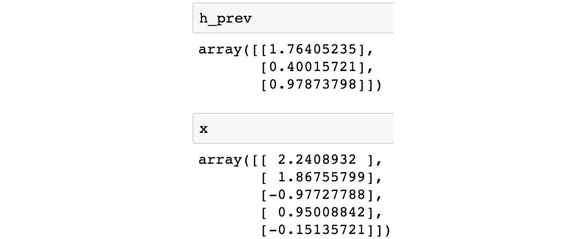
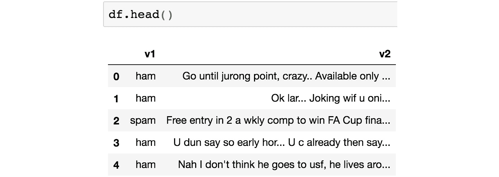
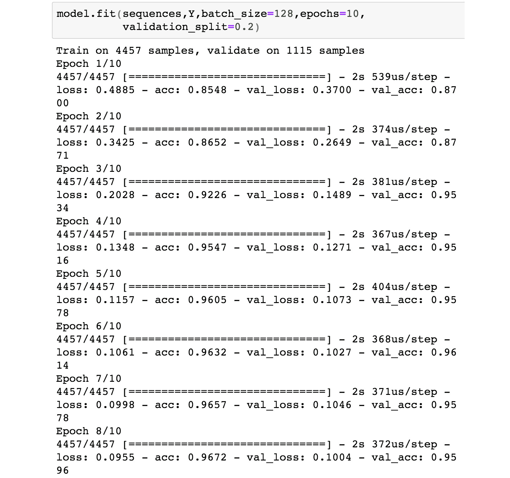

# 第八章

# 长短期记忆（LSTM）

## 学习目标

本章结束时，您将能够：

+   描述 LSTM 的目的

+   详细评估 LSTM 的架构

+   使用 LSTM 开发一个简单的二分类模型

+   实现神经语言翻译，并开发一个英德翻译模型

本章简要介绍了 LSTM 架构及其在自然语言处理领域的应用。

## 介绍

在前面的章节中，我们学习了递归神经网络（RNN）以及一种专门的架构——门控递归单元（GRU），它有助于解决梯度消失问题。LSTM 提供了另一种解决梯度消失问题的方法。在本章中，我们将仔细研究 LSTM 的架构，看看它们如何使神经网络以忠实的方式传播梯度。

此外，我们还将看到 LSTM 在神经语言翻译中的有趣应用，这将使我们能够构建一个模型，用于将一种语言的文本翻译成另一种语言。

### LSTM

梯度消失问题使得梯度很难从网络的后层传播到前层，导致网络的初始权重不会从初始值发生太大变化。因此，模型无法很好地学习，导致性能不佳。LSTM 通过引入“记忆”到网络中解决了这个问题，这使得文本结构中的长期依赖得以保持。然而，LSTM 的记忆添加方式与 GRU 的方式不同。在接下来的章节中，我们将看到 LSTM 是如何完成这一任务的。

LSTM 帮助网络以明确的方式记住长期依赖性。与 GRU 相似，这是通过在简单 RNN 的结构中引入更多变量来实现的。

使用 LSTM，我们允许网络从先前时间步的激活中转移大部分知识，这是简单 RNN 难以实现的壮举。

回忆一下简单 RNN 的结构，它本质上是相同单元的展开，可以通过以下图示表示：


###### 图 7.1：标准 RNN 中的重复模块

图中块"**A**"的递归表示它是随着时间重复的相同结构。每个单元的输入是来自先前时间步的激活（由字母"**h**"表示）。另一个输入是时间"**t**"时的序列值（由字母"**x**"表示）。

与简单 RNN 的情况类似，LSTM 也具有固定的、时间展开的重复结构，但重复的单元本身具有不同的结构。每个 LSTM 单元有几种不同类型的模块，它们共同作用，为模型提供记忆。LSTM 的结构可以通过以下图示表示：


###### 图 7.2：LSTM 单元

让我们也来熟悉一下在图示中使用的符号：


###### 图 7.3：模型中使用的符号

LSTM 的最核心组件是单元状态，以下简称为字母“**C**”。单元状态可以通过下图中方框上端的粗线表示。通常，我们可以将这条线视为一条传送带，贯穿不同的时间步，并传递一些信息。尽管有多个操作可以影响传播通过单元状态的值，但实际上，来自前一个单元状态的信息很容易到达下一个单元状态。


###### 图 7.4：单元状态

从修改单元状态的角度理解 LSTM 会非常有用。与 GRU 一样，LSTM 中允许修改单元状态的组件被称为“*门*”。

LSTM 在多个步骤中操作，具体步骤将在接下来的章节中描述。

### 遗忘门

遗忘门负责确定应该从前一个时间步中忘记的单元状态内容。遗忘门的表达式如下：


###### 图 7.5：遗忘门的表达式

在时间步 **t**，输入与一组新的权重 **W_f** 相乘，维度为（**n_h**，**n_x**）。来自前一个时间步的激活值（**h[t-1]**）与另一组新的权重 **U_f** 相乘，维度为（**n_h**，**n_h**）。请注意，这些乘法是矩阵乘法。然后这两个项相加，并通过 Sigmoid 函数进行压缩，使输出 **f[t]** 的值保持在 [0,1] 范围内。输出的维度与单元状态向量 C 的维度相同（**n_h**，**1**）。遗忘门为每个维度输出 '1' 或 '0'。值为 '1' 表示该维度的前一个单元状态的所有信息应通过并保留，而值为 '0' 表示该维度的前一个单元状态的所有信息应被忘记。图示如下：


###### 图 7.6：遗忘门

那么，遗忘门的输出如何影响句子的构建呢？让我们来看一下生成的句子：

"*Jack goes for a walk when his daughter goes to bed*"。

句子中的第一个主语是 'Jack'，表示男性性别。表示主语性别的单元状态值对应于 'Male'（这可以是 0 或 1）。直到句子中的 'his'，主语没有改变，主语性别的单元状态继续保持 'male' 值。然而，接下来的单词 'daughter' 是新的主语，因此需要遗忘表示性别的旧值。注意，即使旧的性别状态是女性，仍然需要遗忘该值，以便使用与新主语对应的值。

遗忘门通过将主语性别值设置为 0 来完成“遗忘”操作（也就是说，f[t] 在该维度上输出 0）。

在 Python 中，可以使用以下代码片段计算遗忘门：

```py
# Importing packages and setting the random seed to have a fixed output
import numpy as np
np.random.seed(0)
# A sigmoid needs to be defined to be used later
def sigmoid(x):
    return 1 / (1 + np.exp(-x))
# Simulating dummy values for the previous state and current input
h_prev = np.random.randn(3, 1)
x = np.random.randn(5, 1)
```

这段代码为 `h_prev` 和 `x` 生成以下输出：



###### 图 7.7：先前状态 'h_prev' 和当前输入 'x' 的输出

我们可以为 `W_f` 和 `U_f` 初始化一些虚拟值：

```py
# Initialize W_f and U_f with dummy values
W_f = np.random.randn(3, 5) # n_h = 3, n_x=5
U_f = np.random.randn(3, 3) # n_h = 3
```

这将生成以下值：


###### 图 7.8：矩阵值的输出

现在可以计算遗忘门：

```py
f = sigmoid(np.matmul(W_f, x) + np.matmul(U_f, h_prev)
```

这会生成 `f[t]` 的以下值：

![图 7.9：遗忘门的输出，f[t]

](img/C13783_07_09.jpg)

###### 图 7.9：遗忘门的输出，f[t]

## 输入门和候选单元状态

在每个时间步，新的候选单元状态也通过以下表达式计算：


###### 图 7.10：候选单元状态的表达式

时间步 **t** 的输入与一组新的权重 **W_c** 相乘，维度为 (**n_h**, **n_x**)。来自前一时间步的激活值 (**h[t-1]**) 与另一组新的权重 **U_c** 相乘，维度为 (**n_h**, **n_h**)。注意，这些乘法是矩阵乘法。然后，这两个项相加并通过双曲正切函数进行压缩，输出 **f[t]** 在 [-1,1] 范围内。输出 **C_candidate** 的维度为 (**n_h**,**1**)。在随后的图中，候选单元状态由 C 波浪线表示：


###### 图 7.11：输入门和候选状态

候选值旨在计算它从当前时间步推断的单元状态。在我们的示例句子中，这对应于计算新的主语性别值。这个候选单元状态不会直接传递给下一个单元状态进行更新，而是通过输入门进行调节。

输入门决定了候选单元状态中的哪些值将传递到下一个单元状态。可以使用以下表达式来计算输入门的值：


###### 图 7.12：输入门值的表达式

时间步 **t** 的输入被乘以一组新的权重，**W_i**，其维度为 (**n_h**, **n_x**)。上一时间步的激活值 (**h[t-1]**) 被乘以另一组新的权重，**U_i**，其维度为 (**n_h**, **n_h**)。请注意，这些乘法是矩阵乘法。然后，这两个项相加并通过一个 sigmoid 函数来压缩输出，**i[t]**，使其范围在 **[0,1]** 之间。输出的维度与单元状态向量 **C** 的维度相同 (**n_h**, **1**)。在我们的示例句子中，在到达词语“daughter”后，需要更新单元状态中与主语性别相关的值。通过候选单元状态计算出新的主语性别候选值后，仅将与主语性别对应的维度设置为 1，输入门向量中的其他维度不变。

用于候选单元状态和输入门的 Python 代码片段如下：

```py
# Initialize W_i and U_i with dummy values
W_i = np.random.randn(3, 5) # n_h = 3, n_x=5
U_i = np.random.randn(3, 3) # n_h = 3
```

这会为矩阵产生以下值：


###### 图 7.13：候选单元状态和输入门的矩阵值截图

输入门可以按如下方式计算：

```py
i = sigmoid(np.matmul(W_i, x) + np.matmul(U_i, h_prev))
```

这会输出以下的`i`值：


###### 图 7.14：输入门输出的截图

为了计算候选单元状态，我们首先初始化`W_c`和`U_c`矩阵：

```py
# Initialize W_c and U_c with dummy values
W_c = np.random.randn(3, 5) # n_h = 3, n_x=5
U_c = np.random.randn(3, 3) # n_h = 3
```

这些矩阵所产生的值如下所示：


###### 图 7.15：矩阵 W_c 和 U_c 值的截图

我们现在可以使用候选单元状态的更新方程：

```py
c_candidate = np.tanh(np.matmul(W_c, x) + np.matmul(U_c, h_prev))
```

候选单元状态产生以下值：


###### 图 7.16：候选单元状态的截图

### 单元状态更新

在这一点，我们已经知道应该忘记旧单元状态中的哪些内容（遗忘门），应该允许哪些内容影响新的单元状态（输入门），以及候选单元状态的变化应该是什么值（候选单元状态）。现在，可以按以下方式计算当前时间步的单元状态：


###### 图 7.17：单元状态更新的表达式

在前面的表达式中，'**hadamard**'表示逐元素相乘。因此，遗忘门与旧的单元状态逐元素相乘，允许它在我们的示例句子中忘记主语的性别。另一方面，输入门允许新的候选性别值影响新的单元状态。这两个项逐元素相加，使得当前单元状态现在具有与'female'对应的性别值。

下图展示了该操作


###### 图 7.18：更新后的单元状态

下面是生成当前单元状态的代码片段。

首先，为之前的单元状态初始化一个值：

```py
# Initialize c_prev with dummy value
c_prev = np.random.randn(3,1)
c_new = np.multiply(f, c_prev) + np.multiply(i, c_candidate)
```

计算结果如下：


###### 图 7.19：更新后的单元状态输出截图

## 输出门和当前激活值

请注意，到目前为止，我们所做的只是更新单元状态。我们还需要为当前状态生成激活值；即（**h[t]**）。这是通过输出门来实现的，输出门的计算方式如下：


###### 图 7.20：输出门的表达式

时间步**t**的输入与一组新的权重**W_o**相乘，权重的维度为（**n_h**，**n_x**）。上一时间步的激活值（**h[t-1]**）与另一组新的权重**U_o**相乘，权重的维度为（**n_h**，**n_h**）。请注意，这些乘法是矩阵乘法。然后，将这两个项相加，并通过 sigmoid 函数压缩输出值**o[t]**，使其落在[0,1]范围内。输出的维度与单元状态向量**h**的维度相同（**n_h**，**1**）。

输出门负责调节当前单元状态对时间步的激活值的影响程度。在我们的示例句子中，值得传播的信息是描述主语是单数还是复数，以便使用正确的动词形式。例如，如果“daughter”后面的单词是动词“goes”，那么使用正确的形式“go”就显得非常重要。因此，输出门允许相关信息传递给激活值，这个激活值随后作为输入传递到下一个时间步。在下图中，输出门表示为**o_t**：


###### 图 7.21：输出门和当前激活值

以下代码片段展示了如何计算输出门的值：

```py
# Initialize dummy values for W_o and U_o
W_o = np.random.randn(3, 5) # n_h = 3, n_x=5
U_o = np.random.randn(3, 3) # n_h = 3
```

这将生成如下输出：


###### 图 7.22：矩阵 W_o 和 U_o 输出的截图

现在可以计算输出：

```py
o = np.tanh(np.matmul(W_o, x) + np.matmul(U_o, h_prev))
```

输出门的值如下：


###### 图 7.23：输出门值的截图

一旦输出门被评估，就可以计算下一个激活的值：


###### 图 7.24：计算下一个激活值的表达式

首先，应用一个双曲正切函数到当前单元状态。这将限制向量中的值在 -1 和 1 之间。然后，将此值与刚计算出的输出门值做逐元素乘积。

让我们来看一下计算当前时间步激活的代码片段：

```py
h_new = np.multiply(o, np.tanh(c_new))
```

这最终会生成如下结果：


###### 图 7.25：当前时间步激活的截图

现在让我们构建一个非常简单的二元分类器来演示 LSTM 的使用。

### 练习 27：构建一个基于 LSTM 的模型来将电子邮件分类为垃圾邮件或非垃圾邮件（正常邮件）

在本练习中，我们将构建一个基于 LSTM 的模型，帮助我们将电子邮件分类为垃圾邮件或真实邮件：

1.  我们将从导入所需的 Python 包开始：

    ```py
    import pandas as pd
    import numpy as np
    from keras.models import Model, Sequential
    from keras.layers import LSTM, Dense,Embedding
    from keras.preprocessing.text import Tokenizer
    from keras.preprocessing import sequence
    ```

    #### 注：

    LSTM 单元已经按照你为简单的 RNN 或 GRU 导入的方式导入。

1.  我们现在可以读取包含文本列和另一列标签的输入文件，该标签指示文本是否为垃圾邮件。

    #### 注

    ```py
    df = pd.read_csv("spam.csv", encoding="latin")
    df.head() 
    ```

1.  数据看起来如下所示：

    ###### 图 7.26：垃圾邮件分类输出的截图

1.  还有一些无关的列，但我们只需要包含文本数据和标签的列：

    ```py
    df = df[["v1","v2"]]
    df.head()
    ```

1.  输出应该如下所示：

    ###### 图 7.27：带有文本和标签的列的截图

1.  我们可以检查标签分布：

    ```py
    df["v1"].value_counts()
    ```

    标签分布看起来如下：

    

    ###### 图 7.28：标签分布的截图

1.  我们现在可以将标签分布映射为 0/1，以便它可以被馈送到分类器中。同时，还会创建一个数组来存储文本：

    ```py
    lab_map = {"ham":0, "spam":1}
    Y = df["v1"].map(lab_map).values
    X = df["v2"].values
    ```

1.  这将生成如下的输出 X 和 Y：

    ###### 图 7.29：输出 X 的截图

    

    ###### 图 7.30：输出 Y 的截图

1.  接下来，我们将限制为 100 个最常见单词生成的最大标记数。我们将初始化一个分词器，为文本语料库中使用的每个单词分配一个整数值：

    ```py
    max_words = 100
    mytokenizer = Tokenizer(nb_words=max_words,lower=True, split=" ")
    mytokenizer.fit_on_texts(X)
    text_tokenized = mytokenizer.texts_to_sequences(X)
    ```

1.  这将生成一个 `text_tokenized` 值：

    ###### 图 7.31：分词后值的输出截图

    请注意，由于我们限制了最大单词数为 100，因此只有文本中排名前 100 的最常见单词会被分配整数索引。其余的单词将被忽略。因此，即使 X 中的第一个序列有 20 个单词，在该句子的标记化表示中也只有 6 个索引。

1.  接下来，我们将允许每个序列的最大长度为 50 个单词，并填充那些短于此长度的序列。而较长的序列则会被截断：

    ```py
    max_len = 50
    sequences = sequence.pad_sequences(text_tokenized, maxlen=max_len)
    ```

    输出如下：

    

    ###### 图 7.32：填充序列的截图

    请注意，填充是在“pre”模式下进行的，这意味着序列的初始部分会被填充，以使序列长度等于 max_len。

1.  接下来，我们定义模型，LSTM 层具有 64 个隐藏单元，并将其拟合到我们的序列数据和相应的目标值：

    ```py
    model = Sequential()
    model.add(Embedding(max_words, 20, input_length=max_len))
    model.add(LSTM(64))
    model.add(Dense(1, activation="sigmoid"))
    model.compile(loss='binary_crossentropy',
                  optimizer='adam',
                  metrics=['accuracy'])
    model.fit(sequences,Y,batch_size=128,epochs=10,
              validation_split=0.2)
    ```

    在这里，我们从一个嵌入层开始，确保输入到网络的固定大小（20）。我们有一个包含单个 sigmoid 输出的全连接层，该输出表示目标变量是 0 还是 1。然后，我们用二元交叉熵作为损失函数，并使用 Adam 作为优化策略来编译模型。之后，我们以批大小为 128 和 epoch 数为 10 的配置拟合模型。请注意，我们还保留了 20% 的训练数据作为验证数据。这开始了训练过程：



###### 图 7.33：模型拟合到 10 个 epoch 的截图

在 10 个 epoch 后，达到了 96% 的验证准确率。这是一个非常好的表现。

现在我们可以尝试一些测试序列并获得该序列是垃圾邮件的概率：

```py
inp_test_seq = "WINNER! U win a 500 prize reward & free entry to FA cup final tickets! Text FA to 34212 to receive award"
test_sequences = mytokenizer.texts_to_sequences(np.array([inp_test_seq]))
test_sequences_matrix = sequence.pad_sequences(test_sequences,maxlen=max_len)
model.predict(test_sequences_matrix)
```

**预期输出：**


###### 图 7.34：模型预测输出的截图

测试文本是垃圾邮件的概率非常高。

### 活动 9：使用简单 RNN 构建垃圾邮件或非垃圾邮件分类器

我们将使用与之前相同的超参数，基于简单的 RNN 构建一个垃圾邮件或非垃圾邮件分类器，并将其性能与基于 LSTM 的解决方案进行比较。对于像这样的简单数据集，简单的 RNN 性能非常接近 LSTM。然而，对于更复杂的模型，情况通常并非如此，正如我们将在下一节看到的那样。

#### 注意

在 https://github.com/TrainingByPackt/Deep-Learning-for-Natural-Language-Processing/tree/master/Lesson%2007/exercise 找到输入文件。

1.  导入所需的 Python 包。

1.  读取包含文本的列和包含文本标签的另一列的输入文件，该标签表示文本是否为垃圾邮件。

1.  转换为序列。

1.  填充序列。

1.  训练序列。

1.  构建模型。

1.  对新测试数据进行邮件类别预测。

    **预期输出：**


###### 图 7.35：邮件类别预测输出

#### 注

该活动的解决方案可以在第 324 页找到。

## 神经语言翻译

前一节描述的简单二分类器是自然语言处理（NLP）领域的基本用例，并不足以证明使用比简单 RNN 或更简单技术更复杂的技术的必要性。然而，确实存在许多复杂的用例，在这些用例中，必须使用更复杂的单元，例如 LSTM。神经语言翻译就是这样的一个应用。

神经语言翻译任务的目标是构建一个模型，能够将一段文本从源语言翻译成目标语言。在开始编写代码之前，让我们讨论一下该系统的架构。

神经语言翻译代表了一种多对多的自然语言处理（NLP）应用，这意味着系统有多个输入，并且系统也会产生多个输出。

此外，输入和输出的数量可能不同，因为相同的文本在源语言和目标语言中的单词数量可能不同。解决此类问题的 NLP 领域被称为序列到序列建模。该体系结构由编码器块和解码器块组成。以下图表示该体系结构：


###### 图 7.36：神经翻译模型

体系结构的左侧是编码器块，右侧是解码器块。该图尝试将一个英文句子翻译成德文，如下所示：

英文：我想去游泳

德文：Ich möchte schwimmen gehen

#### 注

为了演示的目的，前面的句子省略了句号。句号也被视为有效的标记。

编码器块在给定的时间步长内将英文（源语言）句子的每个单词作为输入。编码器块的每个单元是一个 LSTM。编码器块的唯一输出是最终的单元状态和激活值。它们合起来被称为思维向量。思维向量用于初始化解码器块的激活和单元状态，解码器块也是一个 LSTM 块。在训练阶段，在每个时间步长中，解码器的输出是句子中的下一个单词。它通过一个密集的 softmax 层表示，该层为下一个单词标记的值为 1，而对于向量中的其他所有条目，值为 0。

英语句子逐词输入到编码器中，生成最终的单元状态和激活。在训练阶段，解码器在每个时间步的真实输出是已知的，这实际上就是句子中的下一个德语单词。注意，句子开头插入了‘**BEGIN_**’标记，句子结尾插入了‘**_END**’标记。‘**BEGIN_**’标记的输出是德语句子的第一个单词。从最后一个图可以看到这一点。在训练过程中，网络被训练学习逐字翻译。

在推理阶段，英语输入句子被送入编码器模块，生成最终的单元状态和激活。解码器在第一个时间步输入‘**BEGIN_**’标记，以及单元状态和激活。利用这三个输入，会生成一个 softmax 输出。在一个训练良好的网络中，softmax 值对于正确单词的对应条目是最大的。然后将这个下一个单词作为输入送入下一个时间步。这个过程会一直继续，直到采样到‘**_END**’标记或达到最大句子长度。

现在让我们来逐步解析模型的代码。

我们首先读取包含句对的文件。为了演示目的，我们将句对数量限制为 20,000：

```py
import os
import re
import numpy as np
with open("deu.txt", 'r', encoding='utf-8') as f:
    lines = f.read().split('\n')
num_samples = 20000 # Using only 20000 pairs for this example
lines_to_use = lines[: min(num_samples, len(lines) - 1)]
print(lines_to_use)
```

**输出：**


###### 图 7.37：英德翻译句对的截图

每一行首先是英语句子，后面跟着一个制表符，然后是该句子的德语翻译。接下来，我们将所有的数字映射到占位符词‘**NUMBER_PRESENT**’，并将‘**BEGIN_**’和‘**_END**’标记附加到每个德语句子中，正如之前讨论的那样：

```py
for l in range(len(lines_to_use)):
    lines_to_use[l] = re.sub("\d", " NUMBER_PRESENT ",lines_to_use[l])
input_texts = []
target_texts = []
input_words = set()
target_words = set()
for line in lines_to_use:
    input_text, target_text = line.split('\t')
    target_text = 'BEGIN_ ' + target_text + ' _END'
    input_texts.append(input_text)
    target_texts.append(target_text)
    for word in input_text.split():
        if word not in input_words:
            input_words.add(word)
    for word in target_text.split():
        if word not in target_words:
            target_words.add(word)
```

在前面的代码片段中，我们获得了输入和输出文本。它们如下所示：


###### 图 7.38：映射后的输入和输出文本截图

接下来，我们获取输入和输出序列的最大长度，并获得输入和输出语料库中的所有单词列表：

```py
max_input_seq_length = max([len(i.split()) for i in input_texts])
max_target_seq_length = max([len(i.split()) for i in target_texts])
input_words = sorted(list(input_words))
target_words = sorted(list(target_words))
num_encoder_tokens = len(input_words)
num_decoder_tokens = len(target_words)
```

input_words 和 target_words 如下图所示：


###### 图 7.39：输入文本和目标词汇的截图

接下来，我们为输入和输出单词的每个标记生成一个整数索引：

```py
input_token_index = dict(
    [(word, i) for i, word in enumerate(input_words)])
target_token_index = dict([(word, i) for i, word in enumerate(target_words)])
```

这些变量的值如下所示：


###### 图 7.40：每个标记的整数索引输出截图

我们现在定义编码器输入数据的数组，这是一个二维矩阵，行数等于句子对的数量，列数等于最大输入序列长度。同样，解码器输入数据也是一个二维矩阵，行数等于句子对的数量，列数等于目标语料库中最大序列长度。我们还需要目标输出数据，这是训练阶段所必需的。它是一个三维矩阵，第一维的大小与句子对的数量相同。第二维的大小与最大目标序列长度相同。第三维表示解码器令牌的数量（即目标语料库中不同单词的数量）。我们将这些变量初始化为零：

```py
encoder_input_data = np.zeros(
    (len(input_texts), max_input_seq_length),
    dtype='float32')
decoder_input_data = np.zeros(
    (len(target_texts), max_target_seq_length),
    dtype='float32')
decoder_target_data = np.zeros(
    (len(target_texts), max_target_seq_length, num_decoder_tokens),
    dtype='float32')
```

现在我们填充这些矩阵：

```py
for i, (input_text, target_text) in enumerate(zip(input_texts, target_texts)):
    for t, word in enumerate(input_text.split()):
        encoder_input_data[i, t] = input_token_index[word]
    for t, word in enumerate(target_text.split()):
        decoder_input_data[i, t] = target_token_index[word]
        if t > 0:
            # decoder_target_data is ahead of decoder_input_data by one timestep
            decoder_target_data[i, t - 1, target_token_index[word]] = 1.
```

这些值如下所示：


](img/C13783_07_41.jpg)

###### 图 7.41：矩阵填充截图

我们现在定义一个模型。对于这个练习，我们将使用 Keras 的功能性 API：

```py
from keras.layers import Input, LSTM, Embedding, Dense
from keras.models import Model
embedding_size = 50 # For embedding layer
```

让我们来看一下编码器模块：

```py
encoder_inputs = Input(shape=(None,))
encoder_after_embedding =  Embedding(num_encoder_tokens, embedding_size)(encoder_inputs)
encoder_lstm = LSTM(50, return_state=True)
_, state_h, state_c = encoder_lstm(encoder_after_embedding)
encoder_states = [state_h, state_c]
```

首先，定义一个具有灵活输入数量的输入层（使用 None 属性）。然后，定义并应用一个嵌入层到编码器输入。接下来，定义一个具有 50 个隐藏单元的 LSTM 单元并应用于嵌入层。注意，LSTM 定义中的 return_state 参数设置为 True，因为我们希望获取最终的编码器状态，用于初始化解码器的细胞状态和激活值。然后将编码器 LSTM 应用于嵌入层，并将状态收集到变量中。

现在让我们定义解码器模块：

```py
decoder_inputs = Input(shape=(None,))
decoder_after_embedding = Embedding(num_decoder_tokens, embedding_size)(decoder_inputs)
decoder_lstm = LSTM(50, return_sequences=True, return_state=True)
decoder_outputs, _, _ = decoder_lstm(decoder_after_embedding,
                                     initial_state=encoder_states)
decoder_dense = Dense(num_decoder_tokens, activation='softmax')
decoder_outputs = decoder_dense(decoder_outputs)
```

解码器接收输入，并以类似于编码器的方式定义嵌入层。然后定义一个 LSTM 模块，并将 return_sequences 和 return_state 参数设置为 True。这样做是因为我们希望使用序列和状态来进行解码。接着定义一个具有 softmax 激活函数的全连接层，输出数量等于目标语料库中不同令牌的数量。我们现在可以定义一个模型，它以编码器和解码器的输入为输入，生成解码器输出作为最终输出：

```py
model = Model([encoder_inputs, decoder_inputs], decoder_outputs)
model.compile(optimizer='rmsprop', loss='categorical_crossentropy', metrics=['acc'])
model.summary()
```

以下是模型总结的显示：


](img/C13783_07_42.jpg)

###### 图 7.42：模型总结截图

我们现在可以为输入和输出拟合模型：

```py
model.fit([encoder_input_data, decoder_input_data], decoder_target_data,
          batch_size=128,
          epochs=20,
          validation_split=0.05)
```

我们设置了一个批次大小为 128，训练了 20 个 epochs：


###### 图 7.43：模型拟合截图，训练了 20 个 epochs

模型现在已经训练完成。正如我们在神经语言翻译部分所描述的那样，推理阶段的架构与训练阶段使用的架构略有不同。我们首先定义编码器模型，它以编码器输入（包含嵌入层）作为输入，并生成编码器状态作为输出。这是有意义的，因为编码器模块的输出是细胞状态和激活值：

```py
encoder_model = Model(encoder_inputs, encoder_states)
```

接下来，定义解码器推理模型：

```py
decoder_state_input_h = Input(shape=(50,))
decoder_state_input_c = Input(shape=(50,))
decoder_states_inputs = [decoder_state_input_h, decoder_state_input_c]
decoder_outputs_inf, state_h_inf, state_c_inf = decoder_lstm(decoder_after_embedding, initial_state=decoder_states_inputs)
```

先前训练过的`decoder_lstm`的初始状态被设置为`decoder_states_inputs`变量，稍后将被设置为编码器的状态输出。然后，我们将解码器的输出通过密集的 softmax 层，以获取预测单词的索引，并定义解码器推理模型：

```py
decoder_states_inf = [state_h_inf, state_c_inf]
decoder_outputs_inf = decoder_dense(decoder_outputs_inf)
# Multiple input, multiple output
decoder_model = Model(
    [decoder_inputs] + decoder_states_inputs,
    [decoder_outputs_inf] + decoder_states_inf)
```

解码器模型接收多个输入，形式包括带嵌入的`decoder_input`和解码器状态。输出也是一个多变量，其中包含密集层的输出和解码器状态返回的内容。这里需要状态，因为它们需要作为输入状态传递，以便在下一个时间步采样单词。

由于密集层的输出将返回一个向量，我们需要一个反向查找字典来将生成的单词的索引映射到实际单词：

```py
# Reverse-lookup token index to decode sequences
reverse_input_word_index = dict(
    (i, word) for word, i in input_token_index.items())
reverse_target_word_index = dict(
    (i, word) for word, i in target_token_index.items())
```

字典中的值如下：


](img/C13783_07_44.jpg)

###### 图 7.44：字典值的截图

我们现在需要开发一个采样逻辑。给定输入句子中每个单词的标记表示，我们首先使用这些单词标记作为编码器的输入，从`encoder_model`获取输出。我们还将解码器的第一个输入单词初始化为'**BEGIN_**'标记。然后，我们使用这些值来采样一个新的单词标记。下一个时间步的解码器输入就是这个新生成的标记。我们以这种方式继续，直到我们采样到'**_END**'标记或达到最大允许的输出序列长度。

第一步是将输入编码为状态向量：

```py
def decode_sequence(input_seq):
states_value = encoder_model.predict(input_seq)
```

然后，我们生成一个长度为 1 的空目标序列：

```py
    target_seq = np.zeros((1,1))

```

接下来，我们将目标序列的第一个字符填充为开始字符：

```py
    target_seq[0, 0] = target_token_index['BEGIN_']

```

然后，我们为一批序列创建一个采样循环：

```py
    stop_condition = False
    decoded_sentence = ''

    while not stop_condition:
        output_tokens, h, c = decoder_model.predict(
            [target_seq] + states_value)

```

接下来，我们采样一个标记：

```py
        sampled_token_index = np.argmax(output_tokens)
        sampled_word = reverse_target_word_index[sampled_token_index]
        decoded_sentence += ' ' + sampled_word

```

然后，我们声明退出条件“**either hit max length**”（达到最大长度）：

```py
        # or find stop character.
        if (sampled_word == '_END' or
           len(decoded_sentence) > 60):
            stop_condition = True

        # Update the target sequence (of length 1).
        target_seq = np.zeros((1,1))
        target_seq[0, 0] = sampled_token_index
```

然后，我们更新状态：

```py
        states_value = [h, c]

    return decoded_sentence
```

在这个实例中，您可以通过将用户定义的英语句子翻译为德语来测试模型：

```py
text_to_translate = "Where is my car?"
encoder_input_to_translate = np.zeros(
    (1, max_input_seq_length),
    dtype='float32')
for t, word in enumerate(text_to_translate.split()):
    encoder_input_to_translate[0, t] = input_token_index[word]
decode_sequence(encoder_input_to_translate)
```

输出如图所示：


###### 图 7.45：英语到德语翻译器的截图

这是正确的翻译。

因此，即使是一个仅在 20,000 个序列上训练了 20 轮的模型，也能产生良好的翻译。在当前设置下，训练时长约为 90 分钟。

### 活动 10：创建法语到英语的翻译模型

在这个活动中，我们的目标是生成一个语言翻译模型，将法语文本转换为英语。

#### 注意

您可以在 [`github.com/TrainingByPackt/Deep-Learning-for-Natural-Language-Processing/tree/master/Lesson%2007/activity`](https://github.com/TrainingByPackt/Deep-Learning-for-Natural-Language-Processing/tree/master/Lesson%2007/activity) 找到与此活动相关的文件。

1.  读取句子对（请查看 GitHub 仓库中的文件）。

1.  使用带有'**BEGIN_**'和'**_END**'单词的输出句子生成输入和输出文本。

1.  将输入和输出文本转换为输入和输出序列矩阵。

1.  定义编码器和解码器训练模型，并训练网络。

1.  定义用于推理的编码器和解码器架构。

1.  创建用户输入文本（法语：' *Où est ma voiture?*'）。英文的示例输出文本应该是 '*Where is my car?*'。请参考 GitHub 仓库中的'*French.txt*'文件，获取一些示例法语单词。

    **预期输出：**


###### 图 7.46：法语到英语翻译器模型的输出

#### 注意

该活动的解决方案可以在第 327 页找到。

## 总结

我们介绍了 LSTM 单元，作为解决梯度消失问题的一个可能方法。接着，我们详细讨论了 LSTM 架构，并使用它构建了一个简单的二元分类器。随后，我们深入研究了一个使用 LSTM 单元的神经机器翻译应用，并使用我们探讨的技术构建了一个法语到英语的翻译器模型。在下一章中，我们将讨论 NLP 领域的最新进展。
