# 第九章：*第八章*

# 最先进的自然语言处理

## 学习目标

在本章结束时，你将能够：

+   评估长句中的梯度消失问题

+   描述作为最先进自然语言处理领域的注意力机制模型

+   评估一种特定的注意力机制架构

+   使用注意力机制开发神经机器翻译模型

+   使用注意力机制开发文本摘要模型

本章旨在让你了解当前自然语言处理领域的实践和技术。

## 引言

在上一章中，我们学习了长短期记忆单元（LSTMs），它们有助于解决梯度消失问题。我们还详细研究了 GRU，它有自己处理梯度消失问题的方式。尽管与简单的循环神经网络相比，LSTM 和 GRU 减少了这个问题，但梯度消失问题在许多实际案例中仍然存在。问题本质上还是一样：长句子和复杂的结构依赖性使得深度学习算法难以进行封装。因此，当前最普遍的研究领域之一就是社区尝试减轻梯度消失问题的影响。

在过去几年中，注意力机制尝试为梯度消失问题提供解决方案。注意力机制的基本概念依赖于在得到输出时能够访问输入句子的所有部分。这使得模型能够对句子的不同部分赋予不同的权重（注意力），从而推断出依赖关系。由于其在学习这种依赖关系方面的非凡能力，基于注意力机制的架构代表了自然语言处理领域的最先进技术。

在本章中，我们将学习注意力机制，并使用基于注意力机制的特定架构解决神经机器翻译任务。我们还将提及一些当前业界正在使用的其他相关架构。

### 注意力机制

在上一章中，我们解决了一个*神经语言翻译*任务。我们采用的翻译模型架构由两部分组成：*编码器和解码器*。请参阅以下图示了解架构：

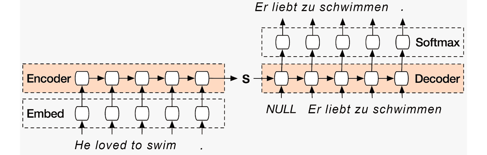

###### 图 8.1：神经语言翻译模型

对于神经机器翻译任务，句子逐字输入到编码器中，生成一个单一的*思想*向量（在前面的图中表示为'**S**'），它将整个句子的意义嵌入到一个单一的表示中。解码器随后使用该向量初始化隐藏状态，并逐字生成翻译。

在简单的编码器-解码器模式下，只有一个向量（思维向量）包含整个句子的表示。句子越长，单个思维向量保持长期依赖关系的难度越大。使用 LSTM 单元只能在某种程度上减轻这个问题。为了进一步缓解梯度消失问题，提出了一个新概念，这个概念就是 **注意力机制**。

注意力机制旨在模仿人类学习依赖关系的方式。我们用以下示例句子来说明这一点：

"最近我们社区发生了许多盗窃事件，这迫使我考虑雇佣一家安保公司在我家安装防盗系统，以便我能保护自己和家人安全。"

请注意单词“my”，“I”，“me”，“myself”和“our”的使用。它们出现在句子中的不同位置，但彼此紧密相连，共同表达句子的含义。

在尝试翻译前述句子时，传统的编码器-解码器功能如下：

1.  将句子逐词传递给编码器。

1.  编码器生成一个单一的思维向量，表示整个句子的编码。对于像前面的长句子，即使使用 LSTM，也很难让编码器嵌入所有依赖关系。因此，句子的前半部分编码不如后半部分强，这意味着后半部分对编码的影响占主导地位。

1.  解码器使用思维向量来初始化隐藏状态向量，以生成输出翻译。

更直观的翻译方法是，在确定目标语言中特定单词时，注意输入句子中单词的正确位置。举个例子，考虑以下句子：

'*那只动物无法走在街上，因为它受伤严重。*'

在这个句子中，'it' 这个词指的是谁？是指动物还是街道？如果将整个句子一起考虑，并对句子的不同部分赋予不同的权重，就能够回答这个问题。注意力机制就完成了这一点，如下所示：

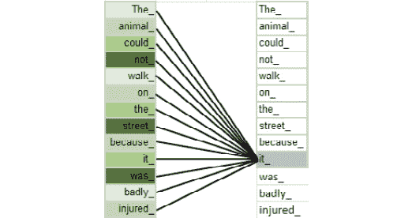

###### 图 8.2：注意力机制的示例

图表显示了在理解句子中每个单词时，每个单词所获得的权重。如图所示，单词 '**it_**' 从 '**animal_**' 获得了非常强的权重，而从 '**street_**' 获得了相对较弱的权重。因此，模型现在可以回答“it”指代句子中的哪个实体的问题。

对于翻译的编码器-解码器模型，在生成逐词输出时，在某个特定的时刻，并不是输入句子中的所有单词对输出词的确定都很重要。注意力机制实现了一个正是做这件事的方案：在每个输出词的确定时，对输入句子的不同部分进行加权，考虑到所有的输入词。一个经过良好训练的带有注意力机制的网络，会学会对句子的不同部分施加适当的加权。这个机制使得输入句子的全部内容在每次确定输出时都能随时使用。因此，解码器不再仅仅依赖一个思维向量，而是可以访问到每个输出词对应的“思维”向量。这种能力与传统的 LSTM/GRU/RNN 基础的编码器-解码器模型形成鲜明对比。

注意力机制是一个通用概念。它可以通过几种不同的架构实现，这些架构将在本章后面部分讨论。

### 注意力机制模型

让我们看看带有注意力机制的编码器-解码器架构可能是怎样的：

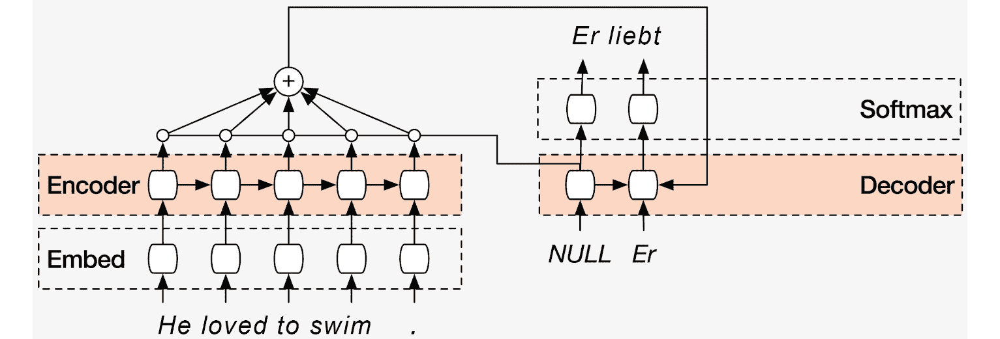

###### 图 8.3：注意力机制模型

前面的图展示了带有注意力机制的语言翻译模型的训练阶段。与基本的编码器-解码器机制相比，我们可以注意到几个不同之处，如下所示：

+   解码器的初始状态会被初始化为最后一个编码器单元的编码器输出状态。使用一个初始的**NULL**词开始翻译，生成的第一个词是‘**Er**’。这与之前的编码器-解码器模型相同。

+   对于第二个词，除了来自前一个词的输入和前一个解码器时间步的隐藏状态外，还会有另一个向量作为输入传递给单元。这个向量通常被认为是‘**上下文向量**’，它是所有编码器隐藏状态的一个函数。从前面的图中来看，它是编码器在所有时间步上的隐藏状态的加权求和。

+   在训练阶段，由于每个解码器时间步的输出是已知的，我们可以学习网络的所有参数。除了与所使用的 RNN 类型相关的常规参数外，还会学习与注意力函数相关的特定参数。如果注意力函数只是对隐藏状态编码器向量的简单求和，则可以学习每个编码器时间步的隐藏状态的权重。

+   在推理阶段，在每个时间步，解码器单元可以将上一时间步的预测词、前一个解码器单元的隐藏状态以及上下文向量作为输入。

让我们看一下神经机器翻译中注意力机制的一个具体实现。在上一章中，我们构建了一个神经语言翻译模型，这是一个更广泛的自然语言处理（NLP）领域中的子问题，叫做神经机器翻译。在接下来的部分中，我们将尝试解决一个日期规范化问题。

### 使用注意力机制的数据规范化

假设你正在维护一个数据库，其中有一张表格包含了一个日期列。日期的输入由你的客户提供，他们填写表单并在**日期**字段中输入日期。前端工程师不小心忘记了对该字段进行验证，使得只有符合“YYYY-MM-DD”格式的日期才会被接受。现在，你的任务是规范化数据库表中的**日期**列，将用户以多种格式输入的日期转换为标准的“YYYY-MM-DD”格式。

作为示例，用户输入的日期及其对应的正确规范化如下所示：


###### 图 8.4：日期规范化表格

你可以看到，用户输入日期的方式有很大的变化。除了表格中的示例外，还有许多其他方式可以指定日期。

这个问题非常适合通过神经机器翻译模型来解决，因为输入具有顺序结构，其中输入的不同组成部分的意义需要被学习。该模型将包含以下组件：

+   编码器

+   解码器

+   注意力机制

### 编码器

这是一个双向 LSTM，它将日期的每个字符作为输入。因此，在每个时间步，编码器的输入是日期输入的单个字符。除此之外，隐藏状态和记忆状态也作为输入从上一个编码器单元传递过来。由于这是一个双向结构，因此与 LSTM 相关的有两组参数：一组用于正向，另一组用于反向。

### 解码器

这是一个单向 LSTM。它的输入是当前时间步的上下文向量。由于在日期规范化的情况下，每个输出字符不严格依赖于上一个输出字符，因此我们不需要将前一个时间步的输出作为当前时间步的输入。此外，由于它是一个 LSTM 单元，上一时间步解码器的隐藏状态和记忆状态也会作为输入传递给当前时间步单元，用于确定当前时间步的解码器输出。

### 注意力机制

本节将解释注意力机制。在给定时间步确定解码器输入时，计算一个上下文向量。上下文向量是所有时间步的编码器隐藏状态的加权总和。其计算方式如下：


###### 图 8.5：上下文向量的表达式

点积操作是一个点积运算，它将权重（由**alpha**表示）与每个时间步的相应隐藏状态向量相乘并求和。alpha 向量的值是为每个解码器输出时间步单独计算的。alpha 值 encapsulates 了注意力机制的本质，即确定在当前时间步的输出中，应该给予输入的哪一部分“关注”。这可以通过一个图示来实现，如下所示：

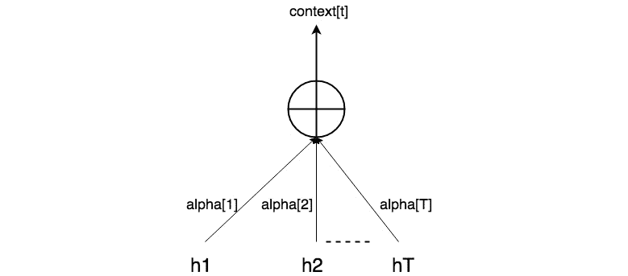

###### 图 8.6：输入的注意力权重的确定

举个例子，假设编码器输入有一个固定长度 30 个字符，而解码器输出有一个固定的输出长度 10 个字符。对于日期规范化问题，这意味着用户输入的最大长度固定为 30 个字符，而模型输出的长度固定为 10 个字符（即 YYYY-MM-DD 格式的字符数，包括中划线）。

假设我们希望确定在输出时间步=4 时的解码器输出（这是为了说明概念而选择的一个任意数字；它只需要小于等于 10，即输出时间步的数量）。在这一步骤中，会计算出权重向量 alpha。这个向量的维度等于编码器输入的时间步数（因为需要为每个编码器输入时间步计算一个权重）。因此，在我们的例子中，alpha 的维度为 30。

现在，我们已经得到了来自每个编码器时间步的隐藏状态向量，因此一共有 30 个隐藏状态向量可用。隐藏状态向量的维度同时考虑了双向编码器 LSTM 的前向和反向组件。对于给定的时间步，我们将前向隐藏状态和反向隐藏状态合并成一个单一的向量。因此，如果前向和反向隐藏状态的维度都是 32，我们将它们合并成一个 64 维的向量，如[**h_forward**, **h_backward**]。这只是一个简单的拼接函数。我们称之为编码器隐藏状态向量。

现在我们有一个单一的 30 维权重向量 alpha，以及 30 个 64 维的隐藏状态向量。因此，我们可以将这 30 个隐藏状态向量分别与 alpha 向量中的对应项相乘。此外，我们还可以将这些加权后的隐藏状态表示求和，得到一个单一的 64 维上下文向量。这本质上是点积操作所执行的运算。

### Alpha 的计算

权重可以通过多层感知器（MLP）进行建模，它是一个由多个隐藏层组成的简单神经网络。我们选择使用两个密集层和 **softmax** 输出。密集层和单元的数量可以作为超参数处理。该 MLP 的输入由两个部分组成：这些部分是编码器双向 LSTM 所有时间步的隐藏状态向量，如上一步所解释的，以及来自解码器前一时间步的隐藏状态。这些向量被连接形成一个单一向量。因此，MLP 的输入是：[*编码器隐藏状态向量*，*来自解码器的前一状态向量*]。这是一种张量的连接操作：[**H**，**S_prev**]。**S_prev** 指的是解码器从前一时间步输出的隐藏状态。如果 **S_prev** 的维度是 64（表示解码器 LSTM 的隐藏状态维度为 64），且编码器的隐藏状态向量的维度也是 64（如上一点所述），那么这两个向量的连接将生成一个维度为 128 的向量。

因此，MLP 接收来自单个编码器时间步的 128 维输入。由于我们已将编码器的输入长度固定为 30 个字符，我们将得到一个大小为 [30，128] 的矩阵（更准确地说，是一个张量）。该 MLP 的参数使用与学习模型其他参数相同的反向传播通过时间（BPTT）机制来学习。因此，整个模型（编码器 + 解码器 + 注意力函数 MLP）的所有参数是一起学习的。可以通过以下图示查看：

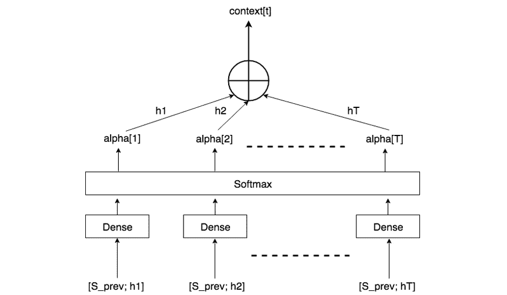

###### 图 8.7：Alpha 的计算

在前一步中，我们学习了用于确定解码器输出的权重（alpha 向量）（我们假设这一时间步是 4）。因此，单步解码器输出的确定需要输入：**S_prev** 和编码器隐藏状态，用于计算上下文向量、解码器隐藏状态以及解码器前一时间步的记忆，这些将作为输入传递给解码器单向 LSTM。进入下一个解码器时间步时，需要计算一个新的 alpha 向量，因为对于这个下一步，输入序列的不同部分与上一个时间步相比，可能会被赋予不同的权重。

由于模型的架构，训练和推理步骤是相同的。唯一的区别是，在训练过程中，我们知道每个解码器时间步的输出，并利用这些输出来训练模型参数（这种技术称为“教师强制”）。

相比之下，在推理阶段，我们预测输出字符。请注意，在训练和推理期间，我们都不会将上一个时间步的解码器输出字符作为输入传递给当前时间步的解码器单元。需要注意的是，这里提出的架构是针对这个问题特定的。实际上有很多架构和定义注意力函数的方法。我们将在本章的后续部分简要了解其中一些。

### 练习 28: 为数据库列构建日期规范化模型

一个数据库列接受来自多个用户的日期输入，格式多样。在本练习中，我们旨在规范化数据库表的日期列，使得用户以不同格式输入的日期能够转换为标准的“YYYY-MM-DD”格式：

#### 注意

运行代码所需的 Python 依赖项如下：

Babel==2.6.0

Faker==1.0.2

Keras==2.2.4

numpy==1.16.1

pandas==0.24.1

scipy==1.2.1

tensorflow==1.12.0

tqdm==4.31.1

Faker==1.0.2

1.  我们导入所有必要的模块：

    ```py
    from keras.layers import Bidirectional, Concatenate, Permute, Dot, Input, LSTM, Multiply
    from keras.layers import RepeatVector, Dense, Activation, Lambda
    from keras.optimizers import Adam
    from keras.utils import to_categorical
    from keras.models import load_model, Model
    import keras.backend as K
    import numpy as np
    from babel.dates import format_date
    from faker import Faker
    import random
    from tqdm import tqdm
    ```

1.  接下来，我们定义一些辅助函数。我们首先使用`'faker'`和`babel`模块生成用于训练的数据。`babel`中的`format_date`函数生成特定格式的日期（使用`FORMATS`）。此外，日期也以人类可读的格式返回，模拟我们希望规范化的非正式用户输入日期：

    ```py
    fake = Faker()
    fake.seed(12345)
    random.seed(12345)
    ```

1.  定义我们希望生成的数据格式：

    ```py
    FORMATS = ['short',
               'medium',
               'long',
               'full',
               'full',
               'full',
               'full',
               'full',
               'full',
               'full',
               'full',
               'full',
               'full',
               'd MMM YYY',
               'd MMMM YYY',
               'dd MMM YYY',
               'd MMM, YYY',
               'd MMMM, YYY',
               'dd, MMM YYY',
               'd MM YY',
               'd MMMM YYY',
               'MMMM d YYY',
               'MMMM d, YYY',
               'dd.MM.YY']
    # change this if you want it to work with another language
    LOCALES = ['en_US']
    def load_date():
        """
            Loads some fake dates
            :returns: tuple containing human readable string, machine readable string, and date object
        """
        dt = fake.date_object()
        human_readable = format_date(dt, format=random.choice(FORMATS),  locale='en_US') # locale=random.choice(LOCALES))
            human_readable = human_readable.lower()
            human_readable = human_readable.replace(',','')
            machine_readable = dt.isoformat()
        return human_readable, machine_readable, dt
    ```

1.  接下来，我们生成并编写一个函数来加载数据集。在此函数中，使用之前定义的`load_date()`函数创建示例。除了数据集外，函数还返回用于映射人类可读和机器可读标记的字典，以及逆向机器词汇表：

    ```py
    def load_dataset(m):
        """
            Loads a dataset with m examples and vocabularies
            :m: the number of examples to generate
        """
        human_vocab = set()
        machine_vocab = set()
        dataset = []
        Tx = 30
        for i in tqdm(range(m)):
            h, m, _ = load_date()
            if h is not None:
                dataset.append((h, m))
                human_vocab.update(tuple(h))
                machine_vocab.update(tuple(m))
        human = dict(zip(sorted(human_vocab) + ['<unk>', '<pad>'],
                         list(range(len(human_vocab) + 2))))
        inv_machine = dict(enumerate(sorted(machine_vocab)))
        machine = {v:k for k,v in inv_machine.items()}
        return dataset, human, machine, inv_machine
    ```

    上述辅助函数用于生成一个数据集，使用`babel` Python 包。此外，它还返回输入和输出的词汇字典，就像我们在以前的练习中所做的那样。

1.  接下来，我们使用这些辅助函数生成一个包含 10,000 个样本的数据集：

    ```py
    m = 10000
    dataset, human_vocab, machine_vocab, inv_machine_vocab = load_dataset(m)
    ```

    变量存储值，如下所示：

    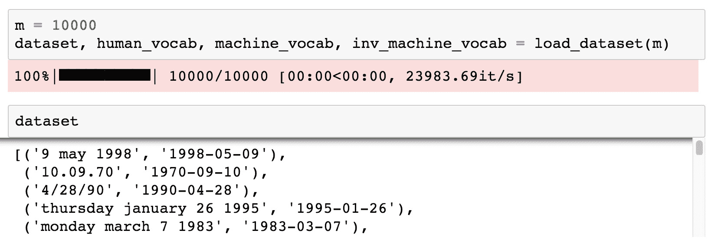

    ###### 图 8.8: 显示变量值的截图

    `human_vocab`是一个字典，将输入字符映射到整数。以下是`human_vocab`的值映射：

    

    ###### 图 8.9: 显示 human_vocab 字典的截图

    `machine_vocab`字典包含输出字符到整数的映射。

    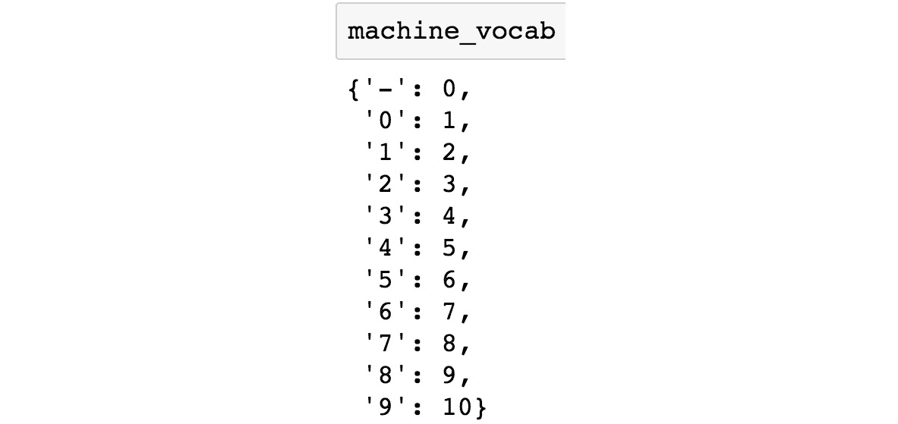

    ###### 图 8.10: 显示 machine_vocab 字典的截图

    `inv_machine_vocab`是`machine_vocab`的逆映射，用于将预测的整数映射回字符：

    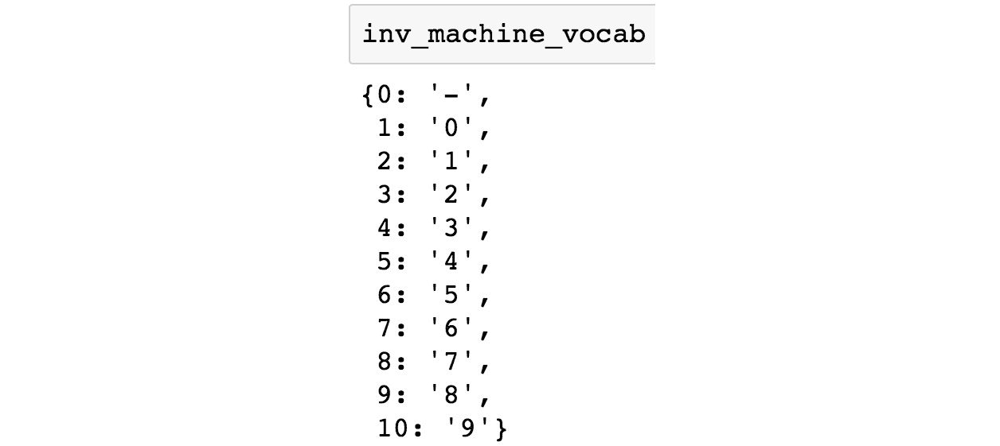

    ###### 图 8.11: 显示 inv_machine_vocab 字典的截图

1.  接下来，我们预处理数据，使得输入序列的形状为（`10000`，`30`，`len(human_vocab)`）。因此，矩阵中的每一行代表 30 个时间步和对应于给定时间步的字符的独热编码向量。同样，Y 输出的形状为（`10000`，`10`，`len(machine_vocab)`）。这对应于 10 个输出时间步和相应的独热编码输出向量。我们首先定义一个名为`'string_to_int'`的函数，它接收一个用户日期作为输入，并返回一个可以输入到模型中的整数序列：

    ```py
    def string_to_int(string, length, vocab):
        """
        Converts all strings in the vocabulary into a list of integers representing the positions of the
        input string's characters in the "vocab"
        Arguments:
        string -- input string, e.g. 'Wed 10 Jul 2007'
        length -- the number of timesteps you'd like, determines if the output will be padded or cut
        vocab -- vocabulary, dictionary used to index every character of your "string"
        Returns:
        rep -- list of integers (or '<unk>') (size = length) representing the position of the string's character in the vocabulary
        """
    ```

1.  将大小写转换为小写，以标准化文本

    ```py
        string = string.lower()
        string = string.replace(',','')
        if len(string) > length:
            string = string[:length]
        rep = list(map(lambda x: vocab.get(x, '<unk>'), string))
        if len(string) < length:
            rep += [vocab['<pad>']] * (length - len(string))
        return rep
    ```

1.  现在我们可以利用这个辅助函数来生成输入和输出的整数序列，正如之前所解释的那样：

    ```py
    def preprocess_data(dataset, human_vocab, machine_vocab, Tx, Ty):
        X, Y = zip(*dataset)
        print("X shape before preprocess: {}".format(X))
        X = np.array([string_to_int(i, Tx, human_vocab) for i in X])
        Y = [string_to_int(t, Ty, machine_vocab) for t in Y]
        print("X shape from preprocess: {}".format(X.shape))
        print("Y shape from preprocess: {}".format(Y))
        Xoh = np.array(list(map(lambda x: to_categorical(x, num_classes=len(human_vocab)), X)))
        Yoh = np.array(list(map(lambda x: to_categorical(x, num_classes=len(machine_vocab)), Y)))
        return X, np.array(Y), Xoh, Yoh
    Tx = 30
    Ty = 10
    X, Y, Xoh, Yoh = preprocess_data(dataset, human_vocab, machine_vocab, Tx, Ty)
    ```

1.  打印矩阵的形状。

    ```py
    print("X.shape:", X.shape)
    print("Y.shape:", Y.shape)
    print("Xoh.shape:", Xoh.shape)
    print("Yoh.shape:", Yoh.shape)
    ```

    这一阶段的输出如下所示：

    

    ###### 图 8.12：矩阵形状的截图

1.  我们可以进一步检查`X`、`Y`、`Xoh`和`Yoh`向量的形状：

    ```py
    index = 0
    print("Source date:", dataset[index][0])
    print("Target date:", dataset[index][1])
    print()
    print("Source after preprocessing (indices):", X[index].shape)
    print("Target after preprocessing (indices):", Y[index].shape)
    print()
    print("Source after preprocessing (one-hot):", Xoh[index].shape)
    print("Target after preprocessing (one-hot):", Yoh[index].shape)
    ```

    输出应如下所示：

    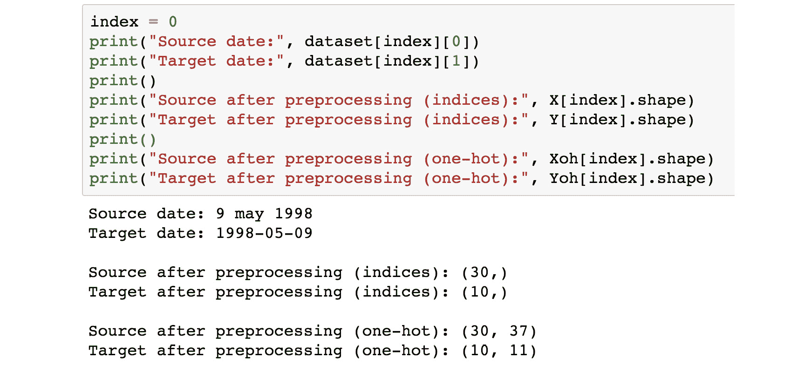

    ###### 图 8.13：处理后矩阵形状的截图

1.  我们现在开始定义一些构建模型所需的函数。首先，我们定义一个计算 softmax 值的函数，给定张量作为输入：

    ```py
    def softmax(x, axis=1):
        """Softmax activation function.
        # Arguments
            x : Tensor.
            axis: Integer, axis along which the softmax normalization is applied.
        # Returns
            Tensor, output of softmax transformation.
        # Raises
            ValueError: In case 'dim(x) == 1'.
        """
        ndim = K.ndim(x)
        if ndim == 2:
            return K.softmax(x)
        elif ndim > 2:
            e = K.exp(x - K.max(x, axis=axis, keepdims=True))
            s = K.sum(e, axis=axis, keepdims=True)
            return e / s
        else:
            raise ValueError('Cannot apply softmax to a tensor that is 1D')
    ```

1.  接下来，我们可以开始组装模型：

    ```py
    # Defined shared layers as global variables
    repeator = RepeatVector(Tx)
    concatenator = Concatenate(axis=-1)
    densor1 = Dense(10, activation = "tanh")
    densor2 = Dense(1, activation = "relu")
    activator = Activation(softmax, name='attention_weights')
    dotor = Dot(axes = 1)
    ```

1.  `RepeatVector`的作用是重复给定的张量多次。在我们的例子中，这是重复`Tx`次，也就是 30 个输入时间步。重复器用于将`S_prev`重复 30 次。回想一下，为了计算上下文向量以确定单个时间步的解码器输出，需要将`S_prev`与每个输入编码器时间步进行连接。`Concatenate`的`keras`函数完成了下一步，即将重复的`S_prev`和每个时间步的编码器隐藏状态向量连接在一起。我们还定义了 MLP 层，它包括两个全连接层（`densor1`，`densor2`）。接下来，MLP 的输出通过一个`softmax`层。这个`softmax`分布就是一个 alpha 向量，其中每个条目对应于每个连接向量的权重。最后，定义了一个`dotor`函数，它负责计算上下文向量。整个流程对应于一个步骤的注意力机制（因为它是针对单个解码器输出时间步的）：

    ```py
    def one_step_attention(h, s_prev):
        """
        Performs one step of attention: Outputs a context vector computed as a dot product of the attention weights
        "alphas" and the hidden states "h" of the Bi-LSTM.

        Arguments:
        h -- hidden state output of the Bi-LSTM, numpy-array of shape (m, Tx, 2*n_h)
        s_prev -- previous hidden state of the (post-attention) LSTM, numpy-array of shape (m, n_s)

        Returns:
        context -- context vector, input of the next (post-attetion) LSTM cell
        """
    ```

1.  使用`repeator`将`s_prev`重复至形状（`m`，`Tx`，`n_s`），以便与所有隐藏状态`'h'`进行连接：

    ```py
        s_prev = repeator(s_prev)
    ```

1.  使用`concatenator`在最后一个轴上将`a`和`s_prev`连接起来：

    ```py
        concat = concatenator([h, s_prev])
    ```

1.  使用`densor1`通过一个小型全连接神经网络传播`concat`，以计算中间能量变量`e`：

    ```py
        e = densor1(concat)
    ```

1.  使用`densor2`通过一个小型全连接神经网络传播`e`，以计算能量变量：

    ```py
        energies = densor2(e)
    ```

1.  使用`activator`作用于`energies`，以计算注意力权重`alphas`：

    ```py
        alphas = activator(energies)
    ```

1.  使用`dotor`结合`alphas`和`a`来计算上下文向量，以供下一个（注意力后）LSTM 单元使用：

    ```py
        context = dotor([alphas, h])

        return context
    ```

1.  到目前为止，我们仍然没有定义编码器和解码器 LSTM 的隐藏状态单元数量。我们还需要定义解码器 LSTM，这是一个单向 LSTM：

    ```py
    n_h = 32
    n_s = 64
    post_activation_LSTM_cell = LSTM(n_s, return_state = True)
    output_layer = Dense(len(machine_vocab), activation=softmax)
    ```

1.  现在我们定义编码器和解码器模型：

    ```py
    def model(Tx, Ty, n_h, n_s, human_vocab_size, machine_vocab_size):
        """
        Arguments:
        Tx -- length of the input sequence
        Ty -- length of the output sequence
        n_h -- hidden state size of the Bi-LSTM
        n_s -- hidden state size of the post-attention LSTM
        human_vocab_size -- size of the python dictionary "human_vocab"
        machine_vocab_size -- size of the python dictionary "machine_vocab"
        Returns:
        model -- Keras model instance
        """
    ```

1.  定义模型的输入形状（`Tx,`）。定义`s0`和`c0`，以及解码器 LSTM 的初始隐藏状态，形状为（`n_s,`）：

    ```py
        X = Input(shape=(Tx, human_vocab_size), name="input_first")
        s0 = Input(shape=(n_s,), name='s0')
        c0 = Input(shape=(n_s,), name='c0')
        s = s0
        c = c0
    ```

1.  初始化一个空的`outputs`列表：

    ```py
        outputs = []
    ```

1.  定义你的预注意力 Bi-LSTM。记得使用`return_sequences=True`：

    ```py
        h = Bidirectional(LSTM(n_h, return_sequences=True))(X)
    ```

1.  迭代`Ty`步：

    ```py
        for t in range(Ty):
    ```

1.  执行一次注意力机制步骤，以获得步骤`t`的上下文向量：

    ```py
            context = one_step_attention(h, s)
    ```

1.  将后注意力 LSTM 单元应用于`context`向量。同时，传递`initial_state` `= [隐藏状态，细胞状态]`：

    ```py
            s, _, c = post_activation_LSTM_cell(context, initial_state = [s,c])
    ```

1.  将`Dense`层应用于后注意力 LSTM 的隐藏状态输出：

    ```py
            out = output_layer(s)

            # Append "out" to the "outputs" list
            outputs.append(out)

    ```

1.  通过接收三个输入并返回输出列表来创建模型实例：

    ```py
        model = Model(inputs=[X, s0, c0], outputs=outputs)

        return model
    model = model(Tx, Ty, n_h, n_s, len(human_vocab), len(machine_vocab))
    model.summary()
    ```

    输出可能如下面的图所示：

    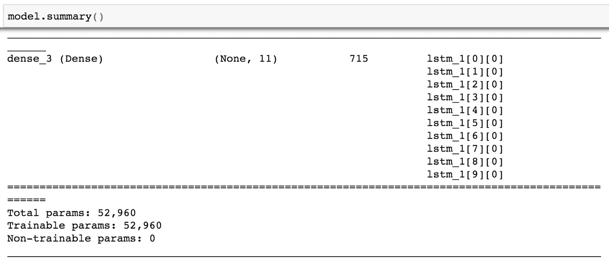

    ###### 图 8.14：模型总结的截图

1.  现在我们将使用`categorical_crossentropy`作为损失函数，`Adam`优化器作为优化策略来编译模型：

    ```py
    opt = Adam(lr = 0.005, beta_1=0.9, beta_2=0.999, decay = 0.01)
    model.compile(loss='categorical_crossentropy', optimizer=opt, metrics=['accuracy'])
    ```

1.  在拟合模型之前，我们需要初始化解码器 LSTM 的隐藏状态向量和记忆状态：

    ```py
    s0 = np.zeros((m, n_s))
    c0 = np.zeros((m, n_s))
    outputs = list(Yoh.swapaxes(0,1))
    model.fit([Xoh, s0, c0], outputs, epochs=1, batch_size=100)
    ```

    这开始了训练：

    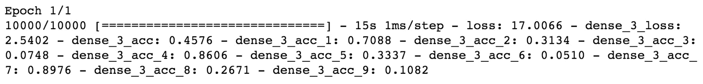

    ###### 图 8.15：训练周期的截图

1.  模型现在已训练完成，可以进行推理调用：

    ```py
    EXAMPLES = ['3 May 1979', '5 April 09', '21th of August 2016', 'Tue 10 Jul 2007', 'Saturday May 9 2018', 'March 3 2001', 'March 3rd 2001', '1 March 2001']
    for example in EXAMPLES:

        source = string_to_int(example, Tx, human_vocab)
        source = np.array(list(map(lambda x: to_categorical(x, num_classes=len(human_vocab)), source)))#.swapaxes(0,1)
        source = source[np.newaxis, :]
        prediction = model.predict([source, s0, c0])
        prediction = np.argmax(prediction, axis = -1)
        output = [inv_machine_vocab[int(i)] for i in prediction]

        print("source:", example)
        print("output:", ''.join(output))
    ```

    **预期输出：**

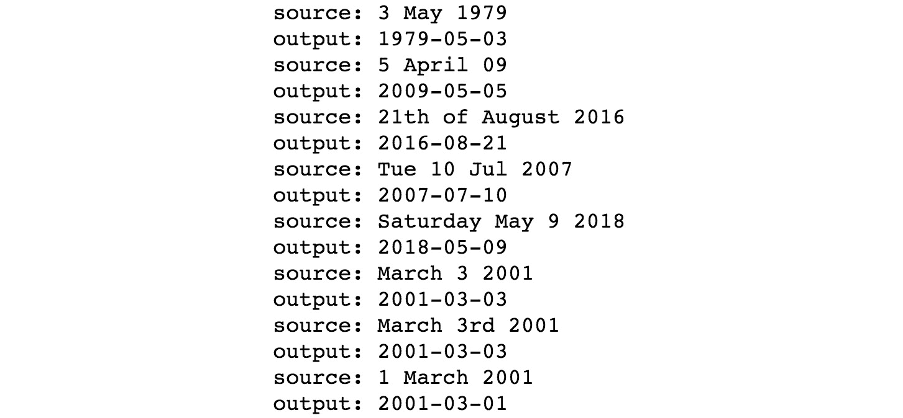

###### 图 8.16：标准化日期输出的截图

## 其他架构与发展

上一节描述的注意力机制架构只是构建注意力机制的一种方式。近年来，提出了几种其他架构，它们在深度学习 NLP 领域构成了最先进技术。在这一节中，我们将简要提及其中一些架构。

### 变换器

2017 年末，谷歌在其开创性论文《Attention is all you need》中提出了一种注意力机制架构。该架构被认为是自然语言处理（NLP）社区中的最先进技术。变换器架构利用一种特殊的多头注意力机制，在不同的层次生成注意力。此外，它还采用残差连接，进一步确保梯度消失问题对学习的影响最小。变换器的特殊架构还允许在训练阶段大幅加速，同时提供更高质量的结果。

最常用的带有变换器架构的包是**tensor2tensor**。Keras 的变换器代码通常很笨重且难以维护，而**tensor2tensor**允许使用 Python 包和简单的命令行工具来训练变换器模型。

#### 注意

欲了解更多关于 tensor2tensor 的信息，请参考 [`github.com/tensorflow/tensor2tensor/#t2t-overview`](https://github.com/tensorflow/tensor2tensor/#t2t-overview)

有兴趣了解架构的读者可以阅读提到的论文以及相关的 Google 博客：[Transformer: A Novel Neural Network](https://ai.googleblog.com/2017/08/transformer-novel-neural-network.html)

### BERT

2018 年底，Google 再次开源了一个突破性的架构，名为**BERT**（**Bidirectional Encoder Representations from Transformers**）。深度学习社区在自然语言处理（NLP）领域已经很久没有看到适合的转移学习机制了。转移学习方法在深度学习中一直是图像相关任务（如图像分类）的最前沿技术。图像在基本结构上是通用的，无论地理位置如何，图像的结构都是一致的。这使得可以在通用图像上训练深度学习模型。这些预训练的模型可以进一步微调以应对特定任务。这节省了训练时间，也减少了对大量数据的需求，能够在较短的时间内达到令人满意的模型表现。

不幸的是，语言因地理位置的不同而差异很大，且往往没有共同的基本结构。因此，转移学习在自然语言处理（NLP）任务中并不是一个可行的选项。BERT 通过其新的注意力机制架构，基于基础的 Transformer 架构，使这一切成为可能。

#### 注意

关于 BERT 的更多信息，请参考：[BERT GitHub](https://github.com/google-research/bert)

有兴趣了解 BERT 的读者应该查看 Google 关于 BERT 的博客：[Open Sourcing BERT](https://ai.googleblog.com/2018/11/open-sourcing-bert-state-of-art-pre.html)。

### OpenAI GPT-2

OpenAI 还开源了一个名为**GPT-2**的架构，它在他们之前的架构 GPT 基础上进行了改进。GPT-2 架构的核心特点是它在文本生成任务中表现出色。GPT-2 模型同样基于 Transformer 架构，包含约 15 亿个参数。

#### 注意

有兴趣了解更多的读者可以参考 OpenAI 的博客：[Better Language Models](https://blog.openai.com/better-language-models/)。

## 活动 11：构建文本摘要模型

我们将使用我们为神经机器翻译构建的注意力机制模型架构来构建文本摘要模型。文本摘要的目标是编写给定大规模文本语料的摘要。你可以想象使用文本摘要工具来总结书籍内容或为新闻文章生成标题。

作为一个示例，使用给定的输入文本：

“梅赛德斯-奔驰印度在庆祝其 25 周年之际，将通过发布全新 V-Class 重新定义印度汽车行业的豪华空间。V-Class 搭载 2.1 升 BS VI 柴油发动机，产生 120kW 的功率和 380Nm 的扭矩，0-100km/h 加速仅需 10.9 秒。它配备了 LED 前大灯、多功能方向盘和 17 英寸铝合金轮毂。”

一个好的文本摘要模型应该能够生成有意义的摘要，例如：

“梅赛德斯-奔驰印度发布全新 V-Class”

从架构的角度来看，文本摘要模型与翻译模型完全相同。模型的输入是文本，它会按字符（或按词）逐个输入到编码器中，而解码器则输出与源文本相同语言的字符。

#### 注意

输入文本可以在此链接找到：[`github.com/TrainingByPackt/Deep-Learning-for-Natural-Language-Processing/tree/master/Lesson%2008`](https://github.com/TrainingByPackt/Deep-Learning-for-Natural-Language-Processing/tree/master/Lesson%2008)。

以下步骤将帮助你解决问题：

1.  导入所需的 Python 包，并制作人类与机器的词汇字典。

1.  定义输入和输出字符的长度以及模型功能（*Repeator*，*Concatenate*，*Densors* 和 *Dotor*）。

1.  定义一个一步注意力函数，并为解码器和编码器定义隐状态的数量。

1.  定义模型架构并运行它以获得模型。

1.  定义模型的损失函数和其他超参数。同时，初始化解码器的状态向量。

1.  将模型拟合到我们的数据上。

1.  运行新文本的推理步骤。

    **预期输出：**

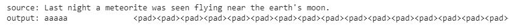

###### 图 8.17：文本摘要输出

#### 注意

活动的解决方案可以在第 333 页找到。

## 总结

在本章中，我们学习了注意力机制的概念。基于注意力机制，已经提出了几种架构，这些架构构成了 NLP 领域的最新技术。我们学习了一种特定的模型架构，用于执行神经机器翻译任务。我们还简要提到了其他先进的架构，如 Transformer 和 BERT。

到目前为止，我们已经看到了许多不同的自然语言处理（NLP）模型。在下一章，我们将讨论一个实际 NLP 项目在组织中的流程以及相关技术。
