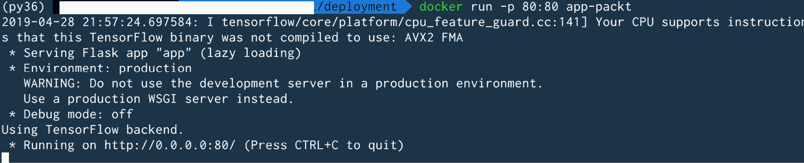

# 第十章

# 组织中的实用 NLP 项目工作流

## 学习目标

本章结束时，你将能够：

+   确定自然语言处理项目的需求

+   了解组织中不同团队的参与方式

+   使用 Google Colab 笔记本，通过 GPU 训练深度学习模型

+   在 AWS 上部署一个模型，作为软件即服务（SaaS）使用

+   熟悉一个简单的技术栈用于部署

本章我们将关注一个实时 NLP 项目及其在组织中的流程，一直到最终阶段，贯穿整章。

## 引言

到目前为止，我们已经学习了几种深度学习技术，这些技术可以应用于解决 NLP 领域的特定问题。掌握这些技术使我们能够构建出优秀的模型并提供高质量的性能。然而，当涉及到在组织中交付一个可用的机器学习产品时，还有许多其他方面需要考虑。

本章将介绍在组织中交付一个可工作的深度学习系统时的实际项目工作流。具体来说，你将了解组织内不同团队的角色，构建深度学习管道，并最终将产品交付为 SaaS 形式。

### 机器学习产品开发的一般工作流

如今，在组织中有多种与数据科学合作的方式。大多数组织都有一个特定于其环境的工作流。以下是一些示例工作流：


###### 图 9.1：机器学习产品开发的一般工作流

### 展示工作流：


###### 图 9.2：一般的展示工作流

展示工作流可以如下详细说明：

1.  数据科学团队收到使用机器学习解决问题的请求。请求者可以是组织内的其他团队，或者是雇佣你作为顾问的其他公司。

1.  获取相关数据并应用特定的机器学习技术。

1.  你以报告/演示的形式向相关方展示结果和见解。这也可能是项目*概念验证*（*PoC*）阶段的一种潜在方式。

### 研究工作流：


###### 图 9.3：研究工作流

这种方法的主要重点是进行研究以解决一个特定的问题，且该问题迎合了一个实际应用场景。该解决方案既可以被组织使用，也可以为整个社区所利用。其他将这种工作流与展示工作流区分开来的因素如下：

+   这类项目的时间线通常比呈现工作流的时间线要长。

+   可交付成果是以研究论文和/或工具包的形式呈现的。

工作流可以分解如下：

1.  你的组织有一个研究部门，希望增强社区内现有的机器学习状态，同时允许你的公司利用结果。

1.  你的团队研究现有研究，以解决提出的问题。这包括详细阅读研究论文，并实施它们以在研究论文中建议的某些数据集上建立基准性能。

1.  然后你要么尝试调整现有研究以解决你的问题，要么自己提出新的解决方案。

1.  最终产品可以是研究论文和/或工具箱。

### 面向生产的工作流程


###### 图 9.4：面向生产的工作流程

该工作流程可以详细阐述如下：

1.  数据科学团队接到了使用机器学习解决问题的请求。请求者可能是组织内的其他团队，也可能是雇佣你们作为顾问的另一家公司。也可能是数据科学团队希望构建他们认为将为组织带来价值的产品。

1.  你获取数据，进行必要的研究，并构建机器学习模型。数据可以来自组织内部，也可以是开源数据集（例如：语言翻译）。因此构建的模型可以作为*PoC*展示给利益相关者。

1.  你定义了一个最小可行产品（MVP）：例如，以 SaaS 形式的机器学习模型。

一旦达到 MVP，你可以逐步添加其他方面，例如*数据获取管道*，*持续集成*，*监控*等。

你会注意到，即使示例工作流程也共享组件。在本章中，我们的重点将放在*生产工作流程的一部分*。我们将为一个特定问题建立一个最小可行产品。

## 问题定义

假设你在一个电子商务平台工作，通过这个平台，客户可以购买各种产品。你公司的商品部门提出在网站上添加一个功能的请求 – '**增加一个滑块，显示在特定日历周内获得最多正面评价的 5 个商品**'。

首先将此请求提交给网页开发部门，因为最终他们负责显示网站内容。网页开发部门意识到，为了获得评价等级，需要数据科学团队参与。数据科学团队从网页开发团队接到请求 – '**我们需要一个 Web 服务，接受文本字符串作为输入，并返回表示文本表达积极情绪程度的评分**'。

然后数据科学团队细化需求，并与网页开发团队达成关于最小可行产品（MVP）定义的协议：

1.  交付物将是部署在 AWS EC2 实例上的 Web 服务。

1.  Web 服务的输入将是一个包含四条评论的 POST 请求（即单个 POST 请求包含四条评论）。

1.  Web 服务的输出将是与每个输入文本对应的四个评分。

1.  输出评分将以 1 到 5 的尺度表示，1 表示最不积极的评论，5 表示最积极的评论。

## 数据采集

任何机器学习模型性能的一个重要决定因素是数据的质量和数量。

通常，数据仓库团队/基础设施团队（DWH）负责公司内与数据相关的基础设施维护。该团队确保数据不会丢失，底层基础设施稳定，并且数据始终可供任何可能需要使用的团队使用。数据科学团队作为数据的消费者之一，会联系 DWH 团队，由其授予访问权限，访问包含公司产品目录中各种商品评论的数据库。

通常，数据库中有多个数据字段/表格，其中一些可能对机器学习模型的开发并不重要。

数据工程师（DWH 团队的一部分、其他团队成员或你团队的成员）随后连接到数据库，将数据处理为表格格式，并生成**csv**格式的平面文件。在这一过程中，数据科学家与数据工程师的讨论最终决定只保留数据库表中的三列：

+   'Rating'：1 到 5 的评分，表示积极情感的程度

+   'Review Title'：评论的简单标题

+   'Review'：实际的评论文本

请注意，这三个字段都是来自客户（即你电商平台的用户）的输入。此外，像‘*item id*’这样的字段并未保留，因为它们不需要用于构建这个情感分类的机器学习模型。这些信息的保留与删除也是数据科学团队、数据工程师和 DWH 团队之间讨论的结果。

目前的数据可能没有情感评分。在这种情况下，一种常见的解决方案是手动浏览每个评论并为其分配情感分数，以便为模型获得训练数据。然而，正如你所想的那样，为数百万条评论做这项工作是一个令人望而却步的任务。因此，可以利用众包服务，如*Amazon Mechanical Turk*，来标注数据并为其获取训练标签。

#### 注意

欲了解更多关于 Amazon Mechanical Turk 的信息，请参见 https://www.mturk.com/。

## Google Colab

你一定熟悉深度学习模型的强大计算需求。在 CPU 上，训练一个含有大量训练数据的深度学习模型会花费非常长的时间。因此，为了让训练时间保持在可接受范围内，通常会使用提供图形处理单元（GPU）加速计算的云服务。与在 CPU 上运行训练过程相比，你可以期待加速 10 到 30 倍。当然，具体的加速效果取决于 GPU 的性能、数据量和处理步骤。

有许多供应商提供此类云服务，如**亚马逊 Web 服务**（**AWS**）、**微软 Azure**等。Google 提供了一个名为**Google Colab**的环境/IDE，任何想训练深度学习模型的人都可以每天免费使用最多 12 小时的 GPU。此外，代码是在类似**Jupyter**的笔记本上运行的。在本章中，我们将利用 Google Colab 的强大功能来开发我们的深度学习情感分类器。

为了熟悉 Google Colab，建议你完成一个 Google Colab 教程。

#### 注意

在继续之前，请参考 https://colab.research.google.com/notebooks/welcome.ipynb#recent=true 上的教程

以下步骤将帮助你更好地了解 Google Colab：

1.  若要打开一个新的空白**Colab**笔记本，请访问 https://colab.research.google.com/notebooks/welcome.ipynb，选择菜单中的“**文件**”，然后选择“**新建 Python 3 笔记本**”选项，如截图所示：

    ###### 图 9.5：Google Colab 上的新 Python 笔记本

1.  接下来，给笔记本重命名为你选择的名称。然后，为了使用**GPU**进行训练，我们需要选择**GPU**作为运行时环境。为此，从菜单中选择“**编辑**”选项，然后选择“**笔记本设置**”。

    ###### 图 9.6：Google Colab 中的编辑下拉菜单

1.  一个菜单将弹出，其中有一个“**硬件加速器**”字段，默认设置为“**无**”：

    ###### 图 9.7：Google Colab 的笔记本设置

1.  此时，可以使用下拉菜单选择“**GPU**”作为选项：

    ###### 图 9.8：GPU 硬件加速器

1.  为了检查 GPU 是否已经分配给你的笔记本，请运行以下代码：

    ```py
    # Check if GPU is detected
    import tensorflow as tf
    tf.test.gpu_device_name()
    ```

    运行此代码后的输出应显示 GPU 的可用性：

    

    ###### 图 9.9：GPU 设备名称的截图

    输出结果是 GPU 的设备名称。

1.  接下来，数据需要在笔记本中可访问。有多种方式可以做到这一点。一种方法是将数据移动到个人的 Google Drive 位置。为了避免占用过多的空间，最好将数据以压缩格式移动。首先，在 Google Drive 上创建一个新文件夹，并将压缩的 CSV 数据文件移入该文件夹。然后，我们将 Google Drive 挂载到 Colab 笔记本机器上，使得驱动器中的数据可以在 Colab 笔记本中使用：

    ```py
    from google.colab import drive
    drive.mount('/content/gdrive')
    ```

    我们刚才提到的代码片段会返回一个用于授权的网页链接。点击该链接后，会打开一个新的浏览器标签页，显示一个授权码，复制并粘贴到笔记本提示框中：

    

    ###### 图 9.10：从 Google Drive 导入数据的截图

    此时，Google Drive 中的所有数据都可以在 Colab 笔记本中使用了。

1.  接下来，导航到包含压缩数据的文件夹位置：

    ```py
    cd "/content/gdrive/My Drive/Lesson-9/"
    ```

1.  通过在笔记本单元中输入 '`pwd`' 命令来确认你已经导航到所需位置：

    ###### 图 9.11：从 Google Drive 导入的数据截图

1.  接下来，使用 `unzip` 命令解压缩数据文件：

    ```py
    !unzip data.csv.zip
    ```

    这将产生以下输出：

    

    ###### 图 9.12：在 Colab 笔记本上解压数据文件

    '**MACOSX**' 输出行是操作系统特定的，可能并不适用于每个人。无论如何，一个解压后的数据文件 '**data.csv**' 现在可以在 Colab 笔记本中使用了。

1.  现在我们已经有了数据，并且设置好了可以使用 GPU 的环境，我们可以开始编写模型代码了。首先，我们将导入所需的包：

    ```py
    import os
    import re
    import pandas as pd
    from keras.preprocessing.text import Tokenizer
    from keras.preprocessing.sequence import pad_sequences
    from keras.models import Sequential
    from keras.layers import Dense, Embedding, LSTM
    ```

1.  接下来，我们将编写一个预处理函数，将所有文本转为小写并移除任何数字：

    ```py
    def preprocess_data(data_file_path):
        data = pd.read_csv(data_file_path, header=None) # read the csv
        data.columns = ['rating', 'title', 'review'] # add column names
        data['review'] = data['review'].apply(lambda x: x.lower()) # change all text to lower
        data['review'] = data['review'].apply((lambda x: re.sub('[^a-zA-z0-9\s]','',x))) # remove all numbers
        return data
    ```

1.  请注意，我们使用 pandas 来读取和处理文本。让我们运行这个函数并提供 CSV 文件的路径：

    ```py
    df = preprocess_data('data.csv')
    ```

1.  现在，我们可以检查数据框的内容：

    ###### 图 9.13：数据框内容截图

1.  正如预期的那样，我们有三个字段。此外，我们可以看到 'review' 列的文本比 'title' 列多得多。因此，我们选择仅使用 'review' 列来开发模型。接下来，我们将进行文本分词：

    ```py
    # initialize tokenization
    max_features = 2000
    maxlength = 250
    tokenizer = Tokenizer(num_words=max_features, split=' ')
    # fit tokenizer
    tokenizer.fit_on_texts(df['review'].values)
    X = tokenizer.texts_to_sequences(df['review'].values)
    # pad sequences
    X = pad_sequences(X, maxlen=maxlength)
    ```

    在这里，我们将特征数限制为 2,000 个词。然后，我们使用最大特征数的分词器应用于数据的 'review' 列。我们还将序列长度填充到 250 个词。

    `X` 变量如下所示：

    

    ###### 图 9.14：X 变量数组的截图

    X 变量是一个 `NumPy` 数组，包含 3,000,000 行和 250 列。因为有 3,000,000 条评论，每条评论在填充后都有固定长度 250 个词。

1.  我们现在准备目标变量以进行训练。我们将问题定义为一个五分类问题，每个类别对应一个评分。由于评分（情感分数）是 1 到 5 的范围，因此分类器有 5 个输出。（你也可以将其建模为回归问题）。我们使用 pandas 的 `get_dummies` 函数来获得这五个输出：

    ```py
    # get target variable
    y_train = pd.get_dummies(df.rating).values
    ```

    `y_train` 变量是一个 `NumPy` 数组，包含 3,000,000 行和 5 列，值如下所示：

    

    ](img/C13783_9_15.jpg)

    ###### 图 9.15：y_train 输出

1.  我们现在已经预处理了文本并准备好了目标变量。接下来，我们定义模型：

    ```py
    embed_dim = 128
    hidden_units = 100
    n_classes = 5
    model = Sequential()
    model.add(Embedding(max_features, embed_dim, input_length = X.shape[1]))
    model.add(LSTM(hidden_units))
    model.add(Dense(n_classes, activation='softmax'))
    model.compile(loss = 'categorical_crossentropy', optimizer='adam',metrics = ['accuracy'])
    print(model.summary())
    ```

    我们选择 128 的嵌入维度作为输入。我们还选择了 LSTM 作为 RNN 单元，隐藏维度为 100。模型摘要如下所示：

    

    ](img/C13783_9_16.jpg)

    ###### 图 9.16：模型摘要的截图

1.  我们现在可以拟合模型：

    ```py
    # fit the model
    model.fit(X[:100000, :], y_train[:100000, :], batch_size = 128, epochs=15, validation_split=0.2)
    ```

    注意，我们训练了 100,000 条评论而不是 3,000,000 条。使用这个配置运行训练会话大约需要 90 分钟。如果使用完整的数据集，将需要更长时间：

    

    ](img/C13783_9_17.jpg)

    ###### 图 9.17：训练会话的截图

    这个五分类问题的验证准确率为 48%。这个结果不是很好，但为了演示的目的，我们可以继续进行部署。

1.  我们现在拥有了想要部署的模型。接下来，我们需要保存模型文件和分词器，以便在生产环境中用于获取新的评论预测：

    ```py
    # save model and tokenizer
    model.save('trained_model.h5')  # creates a HDF5 file 'trained_model.h5'
    with open('trained_tokenizer.pkl', 'wb') as f: # creates a pickle file 'trained_tokenizer.pkl'
        pickle.dump(tokenizer, f)
    ```

1.  现在这些文件需要从 Google Colab 环境下载到本地硬盘：

    ```py
    from google.colab import files
    files.download('trained_model.h5')
    files.download('trained_tokenizer.pkl')
    ```

    这个代码片段将下载分词器和模型文件到本地计算机。现在我们已经准备好使用模型进行预测。

## Flask

在本节中，我们将使用 Python 提供的 Flask 微服务框架，制作一个提供预测的 Web 应用程序。我们将获得一个可以查询的 RESTful API 以获取结果。在开始之前，我们需要安装 Flask（使用 `pip`）：

1.  让我们开始导入必要的包：

    ```py
    import re
    import pickle
    import numpy as np
    from flask import Flask, request, jsonify
    from keras.models import load_model
    from keras.preprocessing.sequence import pad_sequences
    ```

1.  现在，让我们编写一个加载训练好的模型和 `tokenizer` 的函数：

    ```py
    def load_variables():
        global model, tokenizer
        model = load_model('trained_model.h5')
        model._make_predict_function()  #https://github.com/keras-team/keras/issues/6462
        with open('trained_tokenizer.pkl',  'rb') as f:
            tokenizer = pickle.load(f)
    ```

    `make_predict_function()` 是一个技巧，使得 Flask 可以使用 `keras` 模型。

1.  现在，我们将定义类似于训练代码的预处理函数：

    ```py
    def do_preprocessing(reviews):
        processed_reviews = []
        for review in reviews:
            review = review.lower()
            processed_reviews.append(re.sub('[^a-zA-z0-9\s]', '', review))
        processed_reviews = tokenizer.texts_to_sequences(np.array(processed_reviews))
        processed_reviews = pad_sequences(processed_reviews, maxlen=250)
        return processed_reviews
    ```

    与训练阶段类似，评论首先会被转换为小写。然后，数字会被空白替换。接着，加载的分词器将被应用，并且序列会被填充为固定长度 250，以便与训练输入一致。

1.  我们现在定义一个 Flask 应用实例：

    ```py
    app = Flask(__name__)
    ```

1.  现在我们定义一个端点，显示固定的消息：

    ```py
    @app.route('/')
    def home_routine():
        return 'Hello World!'
    ```

    良好的实践是在根端点处检查 Web 服务是否可用。

1.  接下来，我们将设置一个预测端点，向该端点发送我们的评论字符串。我们将使用的 HTTP 请求类型是‘`POST`’请求：

    ```py
    @app.route('/prediction', methods=['POST'])
    def get_prediction():
      # get incoming text
      # run the model
        if request.method == 'POST':
            data = request.get_json()
        data = do_preprocessing(data)
        predicted_sentiment_prob = model.predict(data)
        predicted_sentiment = np.argmax(predicted_sentiment_prob, axis=-1)
        return str(predicted_sentiment)
    ```

1.  现在我们可以启动网页服务器：

    ```py
    if __name__ == '__main__':
      # load model
      load_variables()
      app.run(debug=True)
    ```

1.  我们可以将此文件保存为 `app.py`（可以使用任何名称）。从终端运行此代码，使用 `app.py`：

    ```py
    python app.py
    ```

    在终端窗口中将产生如下所示的输出：

    

    ###### 图 9.18：Flask 输出

1.  这时，请打开浏览器并输入 `http://127.0.0.1:5000/` 地址。屏幕上将显示“Hello World!”消息。输出内容对应于我们在代码中设置的根端点。现在，我们将评论文本发送到 Flask 网络服务的“预测”端点。让我们发送以下四条评论：

1.  “这本书非常差”

1.  “非常好！”

1.  “作者本可以做得更多”

1.  “令人惊叹的产品！”

1.  我们可以使用 `curl` 请求向 Web 服务发送 POST 请求。对于提到的四条评论，可以通过终端发送 `curl` 请求，方法如下：

    ```py
    curl -X POST \
    127.0.0.1:5000/prediction \
    -H 'Content-Type: application/json' \
    -d '["The book was very poor", "Very nice!", "The author could have done more", "Amazing product!"]'
    ```

    四条评论将被发布到网络服务的预测端点。

    Web 服务返回四个评分的列表：

    ```py
    [0 4 2 4]
    ```

    因此，情感评分如下：

1.  “这本书非常差”- 0

1.  “非常好！”- 4

1.  “作者本可以做得更多” - 2

1.  “令人惊叹的产品！” - 4

    评分实际上很有意义！

## 部署

到目前为止，数据科学团队已经拥有了一个在本地系统上运行的 Flask Web 服务。然而，网页开发团队仍然无法使用该服务，因为它只在本地系统上运行。因此，我们需要将这个 Web 服务托管在某个云平台上，以便网页开发团队也能使用。本节提供了一个基本的部署管道，分为以下几个步骤：

1.  对 Flask 网页应用进行更改，以便可以部署。

1.  使用 Docker 将 Flask 网页应用打包成容器。

1.  将容器托管在亚马逊 Web 服务（AWS）EC2 实例上。

让我们详细查看每一步。

### 对 Flask 网页应用进行更改

在 FLASK 部分编码的 Flask 应用程序运行在本地 Web 地址：`http://127.0.0.1:5000`。由于我们的目标是将其托管在互联网上，因此该地址需要更改为：0.0.0.0。 此外，由于默认的 HTTP 端口是 80，因此端口也需要从 5000 更改为 80。所以，现在需要查询的地址变成了：0.0.0.0:80。

在代码片段中，可以通过修改对 `app.run` 函数的调用来简单地完成此更改，如下所示：

```py
app.run(host=0.0.0.0, port=80)
```

请注意，‘**debug**’标志也消失了（‘**debug**’标志的默认值是‘*False*’）。这是因为应用程序已经过了调试阶段，准备部署到生产环境。

#### 注意

其余的代码与之前完全相同。

应用程序应使用与之前相同的命令再次运行，并验证是否收到了与之前相同的响应。curl 请求中的地址需要更改为反映更新后的网址：

```py
curl -X POST \
0.0.0.0:80/prediction \
-H 'Content-Type: application/json' \
-d '["The book was very poor", "Very nice!", "The author could have done more", "Amazing product!"]' 
```

#### 注意

如果此时收到权限错误，请在 app.py 中的 `app.run()` 命令中将端口号更改为 5000。（端口 80 是特权端口，因此将其更改为非特权端口，例如 5000）。但是，请确保在验证代码正常工作后将端口改回 80。

### 使用 Docker 将 Flask Web 应用程序打包成容器

DS 团队打算在云平台（即 AWS EC2）上托管的虚拟机上运行 Web 服务。为了将 EC2 操作系统与代码环境隔离，Docker 提供了容器化作为解决方案。我们将在这里使用它。

#### 注意

要了解 Docker 的基础知识以及如何安装和使用它，可以参考 https://docker-curriculum.com/。

按照以下步骤将应用程序部署到容器中：

1.  我们首先需要一个 *requirements.txt* 文件，列出运行 Python 代码所需的特定包：

    ```py
    Flask==1.0.2
    numpy==1.14.1
    keras==2.2.4
    tensorflow==1.10.0
    ```

1.  我们需要一个包含指令的 `Dockerfile`，以便 Docker 守护进程可以构建 Docker 镜像：

    ```py
    FROM python:3.6-slim
    COPY ./app.py /deploy/
    COPY ./requirements.txt /deploy/
    COPY ./trained_model.h5 /deploy/
    COPY ./trained_tokenizer.pkl /deploy/
    WORKDIR /deploy/
    RUN pip install -r requirements.txt
    EXPOSE 80
    ENTRYPOINT ["python", "app.py"]
    ```

    Docker 镜像是从 Python dockerhub 仓库拉取的。在这里，执行了 Dockerfile。*app.py*、*requirements.txt*、*tokenizer pickle* 文件和 *trained model* 被使用 COPY 命令复制到 Docker 镜像中。为了将工作目录更改为“deploy”目录（文件已复制到该目录中），使用 WORKDIR 命令。接着，`RUN` 命令安装了 Dockerfile 中提到的 Python 包。由于端口 80 需要在容器外部进行访问，因此使用了 `EXPOSE` 命令。

    #### 注意

    Docker Hub 链接可以在 https://hub.docker.com/_/python 找到。

1.  接下来，应使用 `docker build` 命令构建 Docker 镜像：

    ```py
    docker build -f Dockerfile -t app-packt .
    ```

    别忘了命令中的句点。命令的输出如下：

    

    ###### 图 9.19：docker build 的输出截图

    '`app-packt`' 是生成的 Docker 镜像的名称。

1.  现在，可以通过发出 `docker run` 命令来将 Docker 镜像作为容器运行：

    ```py
    docker run -p 80:80 app-packt
    ```

    `p 标志` 用于在本地系统的端口 80 和 Docker 容器的端口 80 之间进行端口映射。（如果本地使用 5000 端口，请将命令中的端口映射部分改为 5000:80。验证 Docker 容器正常工作后，请按照说明将映射更改回 80:80。）

    以下截图展示了 `docker run` 命令的输出：



###### 图 9.20：docker run 命令的输出截图

现在可以发出与上一部分完全相同的 curl 请求来验证应用程序是否正常工作。

现在，应用程序代码已经准备好部署到 AWS EC2 上。

### 在亚马逊 Web 服务（AWS）EC2 实例上托管容器

DS 团队现在拥有一个在本地系统上运行的容器化应用程序。由于该应用程序仍在本地，Web 开发团队仍然无法使用它。根据最初的 MVP 定义，DS 团队现在开始使用 AWS EC2 实例来部署该应用程序。部署将确保 Web 服务可供 Web 开发团队使用。

作为前提条件，您需要有一个 AWS 账户才能使用 EC2 实例。为了演示，我们将使用一个'*t2.small*' EC2 实例类型。此实例在撰写时每小时约收费 2 美分（USD）。请注意，此实例不属于免费套餐。默认情况下，您的 AWS 区域内将无法使用此实例，您需要提出请求将此实例添加到您的账户中。通常需要几个小时。或者，检查您 AWS 区域的实例限制，并选择另一个至少有 2GB 内存的实例。一个简单的'*t2.micro*'实例无法满足我们的需求，因为它只有 1GB 内存。

#### 注意

AWS 账户的链接可以在 https://aws.amazon.com/premiumsupport/knowledge-center/create-and-activate-aws-account/找到。

要添加实例并检查实例限制，请参阅 https://docs.aws.amazon.com/AWSEC2/latest/UserGuide/ec2-resource-limits.html。

让我们从部署过程开始：

1.  登录到 AWS 管理控制台后，在搜索栏中搜索'**ec2**'。这将带您进入 EC2 仪表板，如下图所示：

    ###### 图 9.21：AWS 管理控制台中的 AWS 服务

1.  需要创建一个密钥对来访问 AWS 资源。要创建一个，请查找以下面板并选择'**密钥对**'。这将允许您创建一个新的密钥对：

    ###### 图 9.22：AWS 控制台上的网络与安全

1.  下载了一个'`.pem`'文件，这是密钥文件。请确保安全保存`pem`文件，并使用以下命令更改其模式：

    ```py
    chmod 400 key-file-name.pem
    ```

    需要更改文件权限为私有。

1.  要配置实例，请在 EC2 仪表板上选择'**启动实例**'：

    ###### 图 9.23：AWS 控制台上的资源

1.  接下来，选择**亚马逊机器实例**（**AMI**），它会选择 EC2 实例运行的操作系统。我们将使用'**Amazon Linux 2 AMI**'：

    #### 注意

    要了解有关 Amazon Linux 2 AMI 的更多信息，请参阅 https://aws.amazon.com/amazon-linux-2/。

    

    ###### 图 9.24：亚马逊机器实例（AMI）

1.  现在，我们选择 EC2 的硬件部分，即'**t2.small**'实例：

    ###### 图 9.25：选择 AMI 上的实例类型

1.  点击 '**Review and Launch**' 将进入第 7 步——**审查实例启动**屏幕：

    ###### 图 9.26：审查实例启动屏幕

1.  现在，为了使 Web 服务可达，需要修改安全组。为此，需要创建一条规则。最后，你应该看到以下屏幕：

    ###### 图 9.27：配置安全组

    #### 注意

    可以通过 AWS 文档进一步了解安全组和配置：https://docs.aws.amazon.com/AWSEC2/latest/UserGuide/using-network-security.html。

1.  接下来，点击 'Launch' 图标将触发重定向到 **Launch** 屏幕：

    ###### 图 9.28：AWS 实例上的启动状态

    '**View Instance**' 按钮用于导航到显示正在启动的 EC2 实例的屏幕，当实例状态变为“running”时，表示实例已准备好使用。

1.  接下来，通过以下命令从本地系统终端访问 EC2，替换 '`public-dns-name`' 字段为你的 EC2 实例名称（格式为：ec2–x–x–x–x.compute-1.amazonaws.com）和之前保存的密钥对 `pem` 文件的路径：

    ```py
    ssh -i /path/my-key-pair.pem ec2-user@public-dns-name
    ```

    此命令将带你进入 EC2 实例的提示符，首先需要在 EC2 实例中安装 Docker。由于 Docker 镜像将在 EC2 实例中构建，因此安装 Docker 是工作流所必需的。

1.  对于 Amazon Linux 2 AMI，应使用以下命令来完成此操作：

    ```py
    sudo amazon-linux-extras install docker
    sudo yum install docker
    sudo service docker start
    sudo usermod -a -G docker ec2-user
    ```

    #### 注意

    有关命令的解释，请查阅文档 https://docs.aws.amazon.com/AmazonECS/latest/developerguide/docker-basics.html。

1.  应该使用 '`exit`' 命令退出实例。接下来，使用之前使用的 `ssh` 命令重新登录。通过执行 '`docker info`' 命令验证 Docker 是否正常工作。为接下来的步骤打开另一个本地终端窗口。

1.  现在，将构建 Docker 镜像所需的文件复制到 EC2 实例内。从本地终端（不是 EC2 内部！）发出以下命令：

    ```py
    scp -i /path/my-key-pair.pem file-to-copy ec2-user@public-dns-name:/home/ec2-user
    ```

1.  应复制以下文件以构建 Docker 镜像，如之前所做：*requirements.txt*，*app.py*，*trained_model.h5*，*trained_tokenizer.pkl* 和 *Dockerfile*。

1.  接下来，登录到 EC2 实例，执行 '`ls`' 命令查看复制的文件是否存在，然后使用与本地系统相同的命令构建并运行 Docker 镜像（确保在代码/命令中的所有位置使用端口 80）。

1.  从本地浏览器通过公共 DNS 名称进入首页端点，查看 '**Hello World!**' 消息：

    ###### 图 9.29：首页端点截图

1.  现在，你可以从本地终端发送 curl 请求到 Web 服务，测试示例数据，并将 `public-dns-name` 替换为你的值：

    ```py
    curl -X POST \
    public-dns-name:80/predict \
    -H 'Content-Type: application/json' \
    -d '["The book was very poor", "Very nice!", "The author could have done more", "Amazing product!"]'
    ```

1.  这应该返回与本地获得的相同的评论评分。

这就结束了简单的部署过程。

DS 团队现在将此 `curl` 请求与 Web 开发团队共享，后者可以使用他们的测试样本来调用该 Web 服务。

#### 注意

当不再需要 Web 服务时，停止或终止 EC2 实例，以避免产生费用。


###### 图 9.30：停止 AWS EC2 实例

从 MVP 的角度来看，交付物现在已经完成！

### 改进

本章描述的工作流程仅仅是为了介绍一个使用特定工具（Flask、Colab、Docker 和 AWS EC2）的基本工作流程，并为组织中的深度学习项目提供一个示范计划。然而，这仅仅是一个 MVP（最小可行产品），未来的迭代可以在许多方面进行改进。

## 总结

在本章中，我们看到了深度学习项目在组织中的发展历程。我们还学习了如何使用 Google Colab 笔记本来利用 GPU 加速训练。此外，我们开发了一个基于 Flask 的 Web 服务，使用 Docker 部署到云环境，从而使利益相关者能够为给定输入获取预测结果。

本章总结了我们如何利用深度学习技术解决自然语言处理领域问题的学习过程。本章以及前几章讨论的几乎每个方面都是研究课题，并且正在不断改进。保持信息更新的唯一方法是不断学习新的、令人兴奋的解决问题的方式。一些常见的做法是通过社交媒体跟踪讨论，关注顶尖研究人员/深度学习从业者的工作，并时刻留意那些在该领域进行前沿研究的组织。
