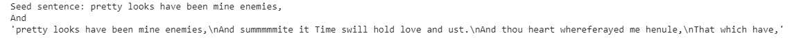

# 第十一章：*附录*

## 关于

本节内容是为了帮助学习者完成书中的活动，内容包括学习者需要执行的详细步骤，以完成并实现书本中的目标。

## 第一章：自然语言处理简介

### 活动 1：使用 Word2Vec 从语料库生成词嵌入。

**解决方案：**

1.  从上述链接上传文本语料。

1.  从 gensim 模型中导入 word2vec

    ```py
    from gensim.models import word2vec
    ```

1.  将语料库存储在一个变量中。

    ```py
    sentences = word2vec.Text8Corpus('text8')
    ```

1.  在语料库上拟合 word2vec 模型。

    ```py
    model = word2vec.Word2Vec(sentences, size = 200)
    ```

1.  找到与‘man’最相似的词。

    ```py
    model.most_similar(['man'])
    ```

    输出如下：

    

    ###### 图 1.29：相似词嵌入的输出

1.  ‘Father’对应‘girl’，‘x’对应 boy。找出 x 的前三个词。

    ```py
    model.most_similar(['girl', 'father'], ['boy'], topn=3)
    ```

    输出如下：


](img/C13783_01_30.jpg)

###### 图 1.30：‘x’的前三个词的输出

## 第二章：自然语言处理的应用

### 活动 2：构建并训练你自己的词性标注器

**解决方案：**

1.  第一件事是选择我们想要训练标注器的语料。导入必要的 Python 包。在这里，我们使用`nltk` `treebank`语料库进行操作：

    ```py
    import nltk
    nltk.download('treebank')
    tagged_sentences = nltk.corpus.treebank.tagged_sents()
    print(tagged_sentences[0])
    print("Tagged sentences: ", len(tagged_sentences))
    print ("Tagged words:", len(nltk.corpus.treebank.tagged_words()))
    ```

1.  接下来，我们需要确定我们的标注器在为一个词分配标签时会考虑哪些特征。这些特征可以包括该词是否全大写、是否小写或是否有一个大写字母：

    ```py
    def features(sentence, index):
        """ sentence: [w1, w2, ...], index: the index of the word """
        return {
            'word': sentence[index],
            'is_first': index == 0,
            'is_last': index == len(sentence) - 1,
            'is_capitalized': sentence[index][0].upper() == sentence[index][0],
            'is_all_caps': sentence[index].upper() == sentence[index],
            'is_all_lower': sentence[index].lower() == sentence[index],
            'prefix-1': sentence[index][0],
            'prefix-2': sentence[index][:2],
            'prefix-3': sentence[index][:3],
            'suffix-1': sentence[index][-1],
            'suffix-2': sentence[index][-2:],
            'suffix-3': sentence[index][-3:],
            'prev_word': '' if index == 0 else sentence[index - 1],
            'next_word': '' if index == len(sentence) - 1 else sentence[index + 1],
            'has_hyphen': '-' in sentence[index],
            'is_numeric': sentence[index].isdigit(),
            'capitals_inside': sentence[index][1:].lower() != sentence[index][1:]
        }
    import pprint 
    pprint.pprint(features(['This', 'is', 'a', 'sentence'], 2))

    {'capitals_inside': False,
     'has_hyphen': False,
     'is_all_caps': False,
     'is_all_lower': True,
     'is_capitalized': False,
     'is_first': False,
     'is_last': False,
     'is_numeric': False,
     'next_word': 'sentence',
     'prefix-1': 'a',
     'prefix-2': 'a',
     'prefix-3': 'a',
     'prev_word': 'is',
     'suffix-1': 'a',
     'suffix-2': 'a',
     'suffix-3': 'a',
     'word': 'a'}
    ```

1.  创建一个函数来剥离标注词的标签，以便我们可以将它们输入到标注器中：

    ```py
    def untag(tagged_sentence):
        return [w for w, t in tagged_sentence]
    ```

1.  现在我们需要构建我们的训练集。我们的标注器需要为每个词单独提取特征，但我们的语料库实际上是句子的形式，所以我们需要做一些转换。将数据拆分为训练集和测试集。对训练集应用此函数。

    ```py
    # Split the dataset for training and testing
    cutoff = int(.75 * len(tagged_sentences))
    training_sentences = tagged_sentences[:cutoff]
    test_sentences = tagged_sentences[cutoff:]

    print(len(training_sentences))   # 2935
    print(len(test_sentences))      # 979
     and create a function to assign the features to 'X' and append the POS tags to 'Y'.
    def transform_to_dataset(tagged_sentences):
        X, y = [], []

        for tagged in tagged_sentences:
            for index in range(len(tagged)):
                X.append(features(untag(tagged), index))
                y.append(tagged[index][1])

        return X, y

    X, y = transform_to_dataset(training_sentences)
    from sklearn.tree import DecisionTreeClassifier
    from sklearn.feature_extraction import DictVectorizer
    from sklearn.pipeline import Pipeline
    ```

1.  在训练集上应用此函数。现在我们可以训练我们的标注器。它本质上是一个分类器，因为它将词分类到不同的类别中，所以我们可以使用分类算法。你可以使用任何你喜欢的算法，或者尝试多个看看哪个效果最好。这里，我们将使用决策树分类器。导入分类器，初始化它，并将模型拟合到训练数据上。然后打印准确率分数。

    ```py
    clf = Pipeline([
        ('vectorizer', DictVectorizer(sparse=False)),
        ('classifier', DecisionTreeClassifier(criterion='entropy'))
    ])

    clf.fit(X[:10000], y[:10000])   # Use only the first 10K samples if you're running it multiple times. It takes a fair bit :)

    print('Training completed')

    X_test, y_test = transform_to_dataset(test_sentences)

    print("Accuracy:", clf.score(X_test, y_test))
    ```

    输出如下：


###### 图 2.19：准确率分数

### 活动 3：在标注语料上执行命名实体识别（NER）

**解决方案：**

1.  导入必要的 Python 包和类。

    ```py
    import nltk
    nltk.download('treebank')
    nltk.download('maxent_ne_chunker')
    nltk.download('words')
    ```

1.  打印`nltk.corpus.treebank.tagged_sents()`查看你需要从中提取命名实体的标注语料。

    ```py
    nltk.corpus.treebank.tagged_sents()
    sent = nltk.corpus.treebank.tagged_sents()[0]
    print(nltk.ne_chunk(sent, binary=True))
    ```

1.  将标注句子的第一句存储在一个变量中。

    ```py
    sent = nltk.corpus.treebank.tagged_sents()[1]
    ```

1.  使用`nltk.ne_chunk`对句子执行命名实体识别（NER）。将 binary 设置为 True 并打印命名实体。

    ```py
    print(nltk.ne_chunk(sent, binary=False))
    sent = nltk.corpus.treebank.tagged_sents()[2]
    rint(nltk.ne_chunk(sent))
    ```

    输出如下：

    

###### 图 2.20：在标注语料上的命名实体识别（NER）

## 第三章：神经网络简介

### 活动 4：评论的情感分析

**解决方案：**

1.  打开一个新的`Jupyter`笔记本。导入`numpy`、`pandas`和`matplotlib.pyplot`。将数据集加载到数据框中。

    ```py
    import numpy as np
    import matplotlib.pyplot as plt
    import pandas as pd
    dataset = pd.read_csv('train_comment_small_100.csv', sep=',')
    ```

1.  下一步是清理和准备数据。导入`re`和`nltk`。从`nltk.corpus`导入`stopwords`。从`nltk.stem.porter`导入`PorterStemmer`。创建一个数组来存储清理后的文本。

    ```py
    import re
    import nltk
    nltk.download('stopwords')
    from nltk.corpus import stopwords
    from nltk.stem.porter import PorterStemmer
    corpus = []
    ```

1.  使用 for 循环，遍历每个实例（每个评论）。将所有非字母字符替换为`' '`（空格）。将所有字母转换为小写。将每条评论拆分成单个单词。初始化`PorterStemmer`。如果该单词不是停用词，则对该单词进行词干提取。将所有单个单词重新组合成一条清理后的评论。将这条清理后的评论附加到你创建的数组中。

    ```py
    for i in range(0, dataset.shape[0]-1):
        review = re.sub('[^a-zA-Z]', ' ', dataset['comment_text'][i])
        review = review.lower()
        review = review.split()
    ps = PorterStemmer()
        review = [ps.stem(word) for word in review if not word in set(stopwords.words('english'))]
        review = ' '.join(review)
        corpus.append(review)
    ```

1.  导入`CountVectorizer`。使用`CountVectorizer`将评论转换为词频向量。

    ```py
    from sklearn.feature_extraction.text import CountVectorizer
    cv = CountVectorizer(max_features = 20)
    ```

1.  创建一个数组来存储每个唯一的单词作为独立的列，从而使它们成为独立变量。

    ```py
    X = cv.fit_transform(corpus).toarray()
    y = dataset.iloc[:,0]
    y1 = y[:99]
    y1
    ```

1.  从`sklearn.preprocessing`导入`LabelEncoder`。对目标输出（`y`）使用`LabelEncoder`。

    ```py
    from sklearn import preprocessing
    labelencoder_y = preprocessing.LabelEncoder()
    y = labelencoder_y.fit_transform(y1)
    ```

1.  导入`train_test_split`。将数据集划分为训练集和验证集。

    ```py
    from sklearn.model_selection import train_test_split
    X_train, X_test, y_train, y_test = train_test_split(X, y, test_size = 0.20, random_state = 0)
    ```

1.  从`sklearn.preprocessing`导入`StandardScaler`。对训练集和验证集（`X`）的特征使用`StandardScaler`。

    ```py
    from sklearn.preprocessing import StandardScaler
    sc = StandardScaler()
    X_train = sc.fit_transform(X_train)
    X_test = sc.transform(X_test)
    ```

1.  现在下一个任务是创建神经网络。导入`keras`。从`keras.models`导入`Sequential`，从 Keras 层导入`Dense`。

    ```py
    import tensorflow
    import keras
    from keras.models import Sequential
    from keras.layers import Dense
    ```

1.  初始化神经网络。添加第一个隐藏层，激活函数使用`'relu'`。对第二个隐藏层重复此步骤。添加输出层，激活函数使用`'softmax'`。编译神经网络，使用`'adam'`作为优化器，`'binary_crossentropy'`作为损失函数，`'accuracy'`作为性能评估标准。

    ```py
    classifier = Sequential()
    classifier.add(Dense(output_dim = 20, init = 'uniform', activation = 'relu', input_dim = 20))
    classifier.add(Dense(output_dim =20, init = 'uniform', activation = 'relu'))
    classifier.add(Dense(output_dim = 1, init = 'uniform', activation = 'softmax'))
    classifier.compile(optimizer = 'adam', loss = 'binary_crossentropy', metrics = ['accuracy'])
    ```

1.  现在我们需要训练模型。使用`batch_size`为 3 和`nb_epoch`为 5，在训练数据集上拟合神经网络。

    ```py
    classifier.fit(X_train, y_train, batch_size = 3, nb_epoch = 5)
    X_test
    ```

1.  验证模型。评估神经网络并打印准确度得分，以查看其表现如何。

    ```py
    y_pred = classifier.predict(X_test)
    scores = classifier.evaluate(X_test, y_pred, verbose=1)
    print("Accuracy:", scores[1])
    ```

1.  （可选）通过从`sklearn.metrics`导入`confusion_matrix`打印混淆矩阵。

    ```py
    from sklearn.metrics import confusion_matrix
    cm = confusion_matrix(y_test, y_pred)
    scores
    ```

    你的输出应类似于此：


###### 图 3.21：情感分析的准确度得分

## 第四章：卷积网络介绍

### 活动 5：对真实数据集进行情感分析

**解决方案：**

1.  导入必要的类

    ```py
    from keras.preprocessing.text import Tokenizer
    from keras.models import Sequential
    from keras import layers
    from keras.preprocessing.sequence import pad_sequences
    import numpy as np
    import pandas as pd
    ```

1.  定义你的变量和参数。

    ```py
    epochs = 20
    maxlen = 100
    embedding_dim = 50
    num_filters = 64
    kernel_size = 5
    batch_size = 32
    ```

1.  导入数据。

    ```py
    data = pd.read_csv('data/sentiment labelled sentences/yelp_labelled.txt',names=['sentence', 'label'], sep='\t')
    data.head()
    ```

    在`Jupyter`笔记本中打印此内容应显示：

    

    ###### 图 4.27：带标签的数据集

1.  选择`'sentence'`和`'label'`列

    ```py
    sentences=data['sentence'].values
    labels=data['label'].values
    ```

1.  将数据拆分为训练集和测试集

    ```py
    from sklearn.model_selection import train_test_split
    X_train, X_test, y_train, y_test = train_test_split(
        sentences, labels, test_size=0.30, random_state=1000)
    ```

1.  分词

    ```py
    tokenizer = Tokenizer(num_words=5000)
    tokenizer.fit_on_texts(X_train)
    X_train = tokenizer.texts_to_sequences(X_train)
    X_test = tokenizer.texts_to_sequences(X_test)
    vocab_size = len(tokenizer.word_index) + 1 #The vocabulary size has an additional 1 due to the 0 reserved index
    ```

1.  填充数据以确保所有序列的长度相同

    ```py
    X_train = pad_sequences(X_train, padding='post', maxlen=maxlen)
    X_test = pad_sequences(X_test, padding='post', maxlen=maxlen)
    ```

1.  创建模型。注意，我们在最后一层使用 sigmoid 激活函数，并使用二元交叉熵来计算损失。这是因为我们正在进行二分类。

    ```py
    model = Sequential()
    model.add(layers.Embedding(vocab_size, embedding_dim, input_length=maxlen))
    model.add(layers.Conv1D(num_filters, kernel_size, activation='relu'))
    model.add(layers.GlobalMaxPooling1D())
    model.add(layers.Dense(10, activation='relu'))
    model.add(layers.Dense(1, activation='sigmoid'))
    model.compile(optimizer='adam',
                  loss='binary_crossentropy',
                  metrics=['accuracy'])
    model.summary()
    ```

    上述代码应该输出

    

    ###### 图 4.28：模型总结

    模型也可以如下所示进行可视化：

    

    ###### 图 4.29：模型可视化

1.  训练并测试模型。

    ```py
    model.fit(X_train, y_train,
                        epochs=epochs,
                        verbose=False,
                        validation_data=(X_test, y_test),
                        batch_size=batch_size)
    loss, accuracy = model.evaluate(X_train, y_train, verbose=False)
    print("Training Accuracy: {:.4f}".format(accuracy))
    loss, accuracy = model.evaluate(X_test, y_test, verbose=False)
    print("Testing Accuracy:  {:.4f}".format(accuracy))
    ```

    准确度输出应如下所示：


###### 图 4.30：准确度评分

## 第五章：循环神经网络基础

### 活动 6：用 RNN 解决问题——作者归属

**解决方案：**

### 准备数据

我们首先设置数据预处理管道。对于每个作者，我们将所有已知的论文聚合为一篇长文。我们假设风格在不同论文中没有变化，因此一篇长文等同于多篇短文，而且从程序角度处理起来要更容易。

对于每个作者的每篇论文，我们执行以下步骤：

1.  将所有文本转换为小写字母（忽略大小写可能是风格属性这一事实）

1.  将所有换行符和多个空格转换为单个空格

1.  删除任何涉及作者姓名的内容，否则我们可能会面临数据泄漏的风险（作者的名字是 *hamilton* 和 *madison*）

1.  将上述步骤封装成一个函数，因为它在预测未知论文时是必需的。

    ```py
    import numpy as np
    import os
    from sklearn.model_selection import train_test_split
    # Classes for A/B/Unknown
    A = 0
    B = 1
    UNKNOWN = -1
    def preprocess_text(file_path):
        with open(file_path, 'r') as f:
            lines = f.readlines()
            text = ' '.join(lines[1:]).replace("\n", ' ').replace('  ',' ').lower().replace('hamilton','').replace('madison', '')
            text = ' '.join(text.split())
            return text
    # Concatenate all the papers known to be written by A/B into a single long text
    all_authorA, all_authorB = '',''
    for x in os.listdir('./papers/A/'):
        all_authorA += preprocess_text('./papers/A/' + x)
    for x in os.listdir('./papers/B/'):
        all_authorB += preprocess_text('./papers/B/' + x)

    # Print lengths of the large texts
    print("AuthorA text length: {}".format(len(all_authorA)))
    print("AuthorB text length: {}".format(len(all_authorB)))
    ```

    该输出应如下所示：

    

    ###### 图 5.34：文本长度计数

    下一步是将每个作者的长文本拆分为多个小序列。如上所述，我们经验性地选择一个序列长度，并在模型生命周期内始终使用该长度。我们通过为每个序列标注其作者来获取完整的数据集。

    为了将长文本拆分为较小的序列，我们使用 `keras` 框架中的 `Tokenizer` 类。特别地，注意我们将其设置为按字符而非按词进行标记。

1.  选择 `SEQ_LEN` 超参数，如果模型与训练数据不匹配，可能需要更改此参数。

1.  编写一个函数 `make_subsequences`，将每个文档转化为长度为 SEQ_LEN 的序列，并赋予正确的标签。

1.  使用 Keras `Tokenizer` 并设置 `char_level=True`

1.  对所有文本进行分词器拟合

1.  使用这个分词器将所有文本转换为序列，方法是使用 `texts_to_sequences()`

1.  使用 `make_subsequences()` 将这些序列转化为合适的形状和长度

    ```py
    from keras.preprocessing.text import Tokenizer
    # Hyperparameter - sequence length to use for the model
    SEQ_LEN = 30
    def make_subsequences(long_sequence, label, sequence_length=SEQ_LEN):
        len_sequences = len(long_sequence)
        X = np.zeros(((len_sequences - sequence_length)+1, sequence_length))
        y = np.zeros((X.shape[0], 1))
        for i in range(X.shape[0]):
            X[i] = long_sequence[i:i+sequence_length]
            y[i] = label
        return X,y

    # We use the Tokenizer class from Keras to convert the long texts into a sequence of characters (not words)
    tokenizer = Tokenizer(char_level=True)
    # Make sure to fit all characters in texts from both authors
    tokenizer.fit_on_texts(all_authorA + all_authorB)
    authorA_long_sequence = tokenizer.texts_to_sequences([all_authorA])[0]
    authorB_long_sequence = tokenizer.texts_to_sequences([all_authorB])[0]
    # Convert the long sequences into sequence and label pairs
    X_authorA, y_authorA = make_subsequences(authorA_long_sequence, A)
    X_authorB, y_authorB = make_subsequences(authorB_long_sequence, B)
    # Print sizes of available data
    print("Number of characters: {}".format(len(tokenizer.word_index)))
    print('author A sequences: {}'.format(X_authorA.shape))
    print('author B sequences: {}'.format(X_authorB.shape))
    ```

    输出应如下所示：

    

    ###### 图 5.35：序列的字符计数

1.  比较每个作者的原始字符数与标注序列数。深度学习需要大量的每种输入的示例。以下代码计算文本中的总词数和唯一词数。

    ```py
    # Calculate the number of unique words in the text
    word_tokenizer = Tokenizer()
    word_tokenizer.fit_on_texts([all_authorA, all_authorB])
    print("Total word count: ", len((all_authorA + ' ' + all_authorB).split(' ')))
    print("Total number of unique words: ", len(word_tokenizer.word_index))
    ```

    输出应如下所示：

    

    ###### 图 5.36：总词数和唯一词数

    我们现在开始创建我们的训练集和验证集。

1.  将 `x` 数据堆叠在一起，将 `y` 数据堆叠在一起。

1.  使用 `train_test_split` 将数据集分割为 80% 的训练集和 20% 的验证集。

1.  重塑数据，确保它们是正确长度的序列。

    ```py
    # Take equal amounts of sequences from both authors
    X = np.vstack((X_authorA, X_authorB))
    y = np.vstack((y_authorA, y_authorB))
    # Break data into train and test sets
    X_train, X_val, y_train, y_val = train_test_split(X,y, train_size=0.8)
    # Data is to be fed into RNN - ensure that the actual data is of size [batch size, sequence length]
    X_train = X_train.reshape(-1, SEQ_LEN)
    X_val =  X_val.reshape(-1, SEQ_LEN) 
    # Print the shapes of the train, validation and test sets
    print("X_train shape: {}".format(X_train.shape))
    print("y_train shape: {}".format(y_train.shape))
    print("X_validate shape: {}".format(X_val.shape))
    print("y_validate shape: {}".format(y_val.shape))
    ```

    输出如下：

    

    ###### 图 5.37: 测试集和训练集

    最后，我们构建模型图并执行训练过程。

1.  使用 `RNN` 和 `Dense` 层创建模型。

1.  由于这是一个二分类问题，输出层应为 `Dense`，并使用 `sigmoid` 激活函数。

1.  使用 `optimizer`，适当的损失函数和指标编译模型。

1.  打印模型摘要。

    ```py
    from keras.layers import SimpleRNN, Embedding, Dense
    from keras.models import Sequential
    from keras.optimizers import SGD, Adadelta, Adam
    Embedding_size = 100
    RNN_size = 256
    model = Sequential()
    model.add(Embedding(len(tokenizer.word_index)+1, Embedding_size, input_length=30))
    model.add(SimpleRNN(RNN_size, return_sequences=False))
    model.add(Dense(1, activation='sigmoid'))
    model.compile(optimizer='adam', loss='binary_crossentropy', metrics = ['accuracy'])
    model.summary()
    ```

    输出如下：

    

    ###### 图 5.38: 模型摘要

1.  确定批量大小、训练周期，并使用训练数据训练模型，使用验证数据进行验证。

1.  根据结果，返回上述模型，必要时进行更改（使用更多层，使用正则化，dropout 等，使用不同的优化器，或不同的学习率等）。

1.  如有需要，修改 `Batch_size`、`epochs`。

    ```py
    Batch_size = 4096
    Epochs = 20
    model.fit(X_train, y_train, batch_size=Batch_size, epochs=Epochs, validation_data=(X_val, y_val))
    ```

    输出如下：


###### 图 5.39: 训练周期

### 将模型应用于未知论文

对“Unknown”文件夹中的所有论文进行此操作。

1.  以与训练集相同的方式预处理它们（小写，去除空白行等）。

1.  使用 `tokenizer` 和上述 `make_subsequences` 函数将它们转换为所需大小的序列。

1.  使用模型对这些序列进行预测。

1.  计算分配给作者 *`A`* 和作者 *`B`* 的序列数。

1.  根据计数，选择具有最高票数/计数的作者。

    ```py
    for x in os.listdir('./papers/Unknown/'):
        unknown = preprocess_text('./papers/Unknown/' + x)
        unknown_long_sequences = tokenizer.texts_to_sequences([unknown])[0]
        X_sequences, _ = make_subsequences(unknown_long_sequences, UNKNOWN)
        X_sequences = X_sequences.reshape((-1,SEQ_LEN))

        votes_for_authorA = 0
        votes_for_authorB = 0

        y = model.predict(X_sequences)
        y = y>0.5
        votes_for_authorA = np.sum(y==0)
        votes_for_authorB = np.sum(y==1)

        print("Paper {} is predicted to have been written by {}, {} to {}".format(
                    x.replace('paper_','').replace('.txt',''), 
                    ("Author A" if votes_for_authorA > votes_for_authorB else "Author B"),
                    max(votes_for_authorA, votes_for_authorB), min(votes_for_authorA, votes_for_authorB)))
    ```

    输出如下：


###### 图 5.40: 作者归属输出

## 第六章：GRU 基础

### 活动 7：使用简单 RNN 开发情感分类模型

**解决方案：**

1.  加载数据集。

    ```py
    from keras.datasets import imdb
    max_features = 10000
    maxlen = 500

    (train_data, y_train), (test_data, y_test) = imdb.load_data(num_words=max_features)
    print('Number of train sequences: ', len(train_data))
    print('Number of test sequences: ', len(test_data))
    ```

1.  填充序列，以确保每个序列具有相同数量的字符。

    ```py
    from keras.preprocessing import sequence
    train_data = sequence.pad_sequences(train_data, maxlen=maxlen)
    test_data = sequence.pad_sequences(test_data, maxlen=maxlen)
    ```

1.  使用 32 个隐藏单元的 `SimpleRNN` 定义并编译模型。

    ```py
    from keras.models import Sequential
    from keras.layers import Embedding
    from keras.layers import Dense
    from keras.layers import GRU
    from keras.layers import SimpleRNN
    model = Sequential()
    model.add(Embedding(max_features, 32))
    model.add(SimpleRNN(32))
    model.add(Dense(1, activation='sigmoid'))

    model.compile(optimizer='rmsprop',
                  loss='binary_crossentropy',
                  metrics=['acc'])

    history = model.fit(train_data, y_train,
                        epochs=10,
                        batch_size=128,
                        validation_split=0.2)
    ```

1.  绘制验证和训练准确度及损失。

    ```py
    import matplotlib.pyplot as plt

    def plot_results(history):
        acc = history.history['acc']
        val_acc = history.history['val_acc']
        loss = history.history['loss']
        val_loss = history.history['val_loss']

        epochs = range(1, len(acc) + 1)
        plt.plot(epochs, acc, 'bo', label='Training Accuracy')
        plt.plot(epochs, val_acc, 'b', label='Validation Accuracy')

        plt.title('Training and validation Accuracy')
        plt.legend()
        plt.figure()
        plt.plot(epochs, loss, 'bo', label='Training Loss')
        plt.plot(epochs, val_loss, 'b', label='Validation Loss')
        plt.title('Training and validation Loss')
        plt.legend()
        plt.show()
    ```

1.  绘制模型图。

    ```py
    plot_results(history)
    ```

    输出如下：


](img/C13783_06_29.jpg)

###### 图 6.29: 训练和验证准确度损失

### 活动 8：使用您选择的数据集训练自己的字符生成模型。

**解决方案：**

1.  加载文本文件，并导入必要的 Python 包和类。

    ```py
    import sys
    import random
    import string
    import numpy as np
    from keras.models import Sequential
    from keras.layers import Dense
    from keras.layers import LSTM, GRU
    from keras.optimizers import RMSprop
    from keras.models import load_model
    # load text
    def load_text(filename):
        with open(filename, 'r') as f:
            text = f.read()
        return text
    in_filename = 'drive/shakespeare_poems.txt' # Add your own text file here
    text = load_text(in_filename)
    print(text[:200])
    ```

    输出如下：

    

    ###### 图 6.30: 莎士比亚的十四行诗

1.  创建字典，将字符映射到索引，并反向映射。

    ```py
    chars = sorted(list(set(text)))
    print('Number of distinct characters:', len(chars))
    char_indices = dict((c, i) for i, c in enumerate(chars))
    indices_char = dict((i, c) for i, c in enumerate(chars))
    ```

    输出如下：

    

    ###### 图 6.31: 不同字符计数

1.  从文本中创建序列。

    ```py
    max_len_chars = 40
    step = 3
    sentences = []
    next_chars = []
    for i in range(0, len(text) - max_len_chars, step):
        sentences.append(text[i: i + max_len_chars])
        next_chars.append(text[i + max_len_chars])
    print('nb sequences:', len(sentences))
    ```

    输出如下：

    

    ###### 图 6.32: 序列计数

1.  创建输入和输出数组，以供模型使用。

    ```py
    x = np.zeros((len(sentences), max_len_chars, len(chars)), dtype=np.bool)
    y = np.zeros((len(sentences), len(chars)), dtype=np.bool)
    for i, sentence in enumerate(sentences):
        for t, char in enumerate(sentence):
            x[i, t, char_indices[char]] = 1
        y[i, char_indices[next_chars[i]]] = 1
    ```

1.  使用 GRU 构建并训练模型，并保存该模型。

    ```py
    print('Build model...')
    model = Sequential()
    model.add(GRU(128, input_shape=(max_len_chars, len(chars))))
    model.add(Dense(len(chars), activation='softmax'))
    optimizer = RMSprop(lr=0.01)
    model.compile(loss='categorical_crossentropy', optimizer=optimizer)
    model.fit(x, y,batch_size=128,epochs=10)
    model.save("poem_gen_model.h5")
    ```

1.  定义采样和生成函数。

    ```py
    def sample(preds, temperature=1.0):
        # helper function to sample an index from a probability array
        preds = np.asarray(preds).astype('float64')
        preds = np.log(preds) / temperature
        exp_preds = np.exp(preds)
        preds = exp_preds / np.sum(exp_preds)
        probas = np.random.multinomial(1, preds, 1)
        return np.argmax(probas)
    ```

1.  生成文本。

    ```py
    from keras.models import load_model
    model_loaded = load_model('poem_gen_model.h5')
    def generate_poem(model, num_chars_to_generate=400):
        start_index = random.randint(0, len(text) - max_len_chars - 1)
        generated = ''
        sentence = text[start_index: start_index + max_len_chars]
        generated += sentence
        print("Seed sentence: {}".format(generated))
        for i in range(num_chars_to_generate):
            x_pred = np.zeros((1, max_len_chars, len(chars)))
            for t, char in enumerate(sentence):
                x_pred[0, t, char_indices[char]] = 1.

            preds = model.predict(x_pred, verbose=0)[0]
            next_index = sample(preds, 1)
            next_char = indices_char[next_index]
            generated += next_char
            sentence = sentence[1:] + next_char
        return generated
    generate_poem(model_loaded, 100)
    ```

    输出如下：



](img/C13783_06_33.jpg)

###### 图 6.33：生成的文本输出

## 第七章：LSTM 基础

活动 9：使用简单的 RNN 构建垃圾邮件或正常邮件分类器。

**解决方案：**

1.  导入所需的 Python 包。

    ```py
    import pandas as pd
    import numpy as np
    from keras.models import Model, Sequential
    from keras.layers import SimpleRNN, Dense,Embedding
    from keras.preprocessing.text import Tokenizer
    from keras.preprocessing import sequence
    ```

1.  读取输入文件，文件中包含一列文本和另一列标签，标签表示该文本是否为垃圾邮件。

    ```py
    df = pd.read_csv("drive/spam.csv", encoding="latin")
    df.head()
    ```

    输出如下：

    

    ###### 图 7.35：输入数据文件

1.  标注输入数据中的列。

    ```py
    df = df[["v1","v2"]]
    df.head()
    ```

    输出如下：

    

    ###### 图 7.36：标注的输入数据

1.  计算`v1`列中垃圾邮件和正常邮件字符的数量。

    ```py
    df["v1"].value_counts()
    ```

    输出如下：

    

    ###### 图 7.37：垃圾邮件或正常邮件的值计数

1.  获取`X`作为特征，`Y`作为目标。

    ```py
    lab_map = {"ham":0, "spam":1}
    X = df["v2"].values
    Y = df["v1"].map(lab_map).values
    ```

1.  转换为序列并填充序列。

    ```py
    max_words = 100
    mytokenizer = Tokenizer(nb_words=max_words,lower=True, split=" ")
    mytokenizer.fit_on_texts(X)
    text_tokenized = mytokenizer.texts_to_sequences(X)
    text_tokenized
    ```

    输出如下：

    

    ###### 图 7.38：分词数据

1.  训练序列。

    ```py
    max_len = 50
    sequences = sequence.pad_sequences(text_tokenized,maxlen=max_len)
    sequences
    ```

1.  构建模型。

    ```py
    model = Sequential()
    model.add(Embedding(max_words, 20, input_length=max_len))
    model.add(SimpleRNN(64))
    model.add(Dense(1, activation="sigmoid"))
    model.compile(loss='binary_crossentropy',
                  optimizer='adam',
                  metrics=['accuracy'])
    model.fit(sequences,Y,batch_size=128,epochs=10,
              validation_split=0.2)
    ```

1.  对新测试数据预测邮件类别。

    ```py
    inp_test_seq = "WINNER! U win a 500 prize reward & free entry to FA cup final tickets! Text FA to 34212 to receive award"
    test_sequences = mytokenizer.texts_to_sequences(np.array([inp_test_seq]))
    test_sequences_matrix = sequence.pad_sequences(test_sequences,maxlen=max_len)
    model.predict(test_sequences_matrix)
    ```

    输出如下：


###### 图 7.39：新测试数据的输出

### 活动 10：创建法语到英语的翻译模型

**解决方案：**

1.  导入必要的 Python 包和类。

    ```py
    import os
    import re
    import numpy as np
    ```

1.  以句子对的形式读取文件。

    ```py
    with open("fra.txt", 'r', encoding='utf-8') as f:
        lines = f.read().split('\n')
    num_samples = 20000 # Using only 20000 pairs for this example
    lines_to_use = lines[: min(num_samples, len(lines) - 1)]
    ```

1.  移除`\u202f`字符。

    ```py
    for l in range(len(lines_to_use)):
        lines_to_use[l] = re.sub("\u202f", "", lines_to_use[l])
    for l in range(len(lines_to_use)):
        lines_to_use[l] = re.sub("\d", " NUMBER_PRESENT ", lines_to_use[l])
    ```

1.  在目标序列中附加`**BEGIN_** `和` **_END**`词，将词映射到整数。

    ```py
    input_texts = []
    target_texts = []
    input_words = set()
    target_words = set()
    for line in lines_to_use:
        target_text, input_text = line.split('\t')
        target_text = 'BEGIN_ ' + target_text + ' _END'
        input_texts.append(input_text)
        target_texts.append(target_text)
        for word in input_text.split():
            if word not in input_words:
                input_words.add(word)
        for word in target_text.split():
            if word not in target_words:
                target_words.add(word)
    max_input_seq_length = max([len(i.split()) for i in input_texts])
    max_target_seq_length = max([len(i.split()) for i in target_texts])
    input_words = sorted(list(input_words))
    target_words = sorted(list(target_words))
    num_encoder_tokens = len(input_words)
    num_decoder_tokens = len(target_words)
    ```

1.  定义编码器-解码器输入。

    ```py
    input_token_index = dict(
        [(word, i) for i, word in enumerate(input_words)])
    target_token_index = dict(
        [(word, i) for i, word in enumerate(target_words)])
    encoder_input_data = np.zeros(
        (len(input_texts), max_input_seq_length),
        dtype='float32')
    decoder_input_data = np.zeros(
        (len(target_texts), max_target_seq_length),
        dtype='float32')
    decoder_target_data = np.zeros(
        (len(target_texts), max_target_seq_length, num_decoder_tokens),
        dtype='float32')
    for i, (input_text, target_text) in enumerate(zip(input_texts, target_texts)):
        for t, word in enumerate(input_text.split()):
            encoder_input_data[i, t] = input_token_index[word]
        for t, word in enumerate(target_text.split()):
            decoder_input_data[i, t] = target_token_index[word]
            if t > 0:
                # decoder_target_data is ahead of decoder_input_data #by one timestep
                decoder_target_data[i, t - 1, target_token_index[word]] = 1.
    ```

1.  构建模型。

    ```py
    from keras.layers import Input, LSTM, Embedding, Dense
    from keras.models import Model
    embedding_size = 50
    ```

1.  初始化编码器训练。

    ```py
    encoder_inputs = Input(shape=(None,))
    encoder_after_embedding =  Embedding(num_encoder_tokens, embedding_size)(encoder_inputs)
    encoder_lstm = LSTM(50, return_state=True)_, 
    state_h, state_c = encoder_lstm(encoder_after_embedding)
    encoder_states = [state_h, state_c]
    ```

1.  初始化解码器训练。

    ```py
    decoder_inputs = Input(shape=(None,))
    decoder_after_embedding = Embedding(num_decoder_tokens, embedding_size)(decoder_inputs)
    decoder_lstm = LSTM(50, return_sequences=True, return_state=True)
    decoder_outputs, _, _ = decoder_lstm(decoder_after_embedding,
                                         initial_state=encoder_states)
    decoder_dense = Dense(num_decoder_tokens, activation='softmax')
    decoder_outputs = decoder_dense(decoder_outputs)
    ```

1.  定义最终模型。

    ```py
    model = Model([encoder_inputs, decoder_inputs], decoder_outputs)
    model.compile(optimizer='rmsprop', loss='categorical_crossentropy', metrics=['acc'])
    model.fit([encoder_input_data, decoder_input_data], 
              decoder_target_data,
              batch_size=128,
              epochs=20,
              validation_split=0.05)
    ```

1.  将推理提供给编码器和解码器。

    ```py
    # encoder part
    encoder_model = Model(encoder_inputs, encoder_states)
    # decoder part
    decoder_state_input_h = Input(shape=(50,))
    decoder_state_input_c = Input(shape=(50,))
    decoder_states_inputs = [decoder_state_input_h, decoder_state_input_c]
    decoder_outputs_inf, state_h_inf, state_c_inf = decoder_lstm(decoder_after_embedding, initial_state=decoder_states_inputs)
    decoder_states_inf = [state_h_inf, state_c_inf]
    decoder_outputs_inf = decoder_dense(decoder_outputs_inf)
    decoder_model = Model(
        [decoder_inputs] + decoder_states_inputs,
        [decoder_outputs_inf] + decoder_states_inf)
    ```

1.  使用反向查找标记索引解码序列。

    ```py
    reverse_input_word_index = dict(
        (i, word) for word, i in input_token_index.items())
    reverse_target_word_index = dict(
        (i, word) for word, i in target_token_index.items())
    def decode_sequence(input_seq):
    ```

1.  将输入编码为状态向量。

    ```py
        states_value = encoder_model.predict(input_seq)
    ```

1.  生成长度为 1 的空目标序列。

    ```py
        target_seq = np.zeros((1,1))
    ```

1.  用开始字符填充目标序列的第一个字符。

    ```py
        target_seq[0, 0] = target_token_index['BEGIN_']
    ```

1.  为一批序列进行采样循环。

    ```py
    stop_condition = False
        decoded_sentence = ''

        while not stop_condition:
            output_tokens, h, c = decoder_model.predict(
                [target_seq] + states_value)
    ```

1.  采样一个标记。

    ```py
            sampled_token_index = np.argmax(output_tokens)
            sampled_word = reverse_target_word_index[sampled_token_index]
            decoded_sentence += ' ' + sampled_word
    ```

1.  退出条件：达到最大长度或找到停止字符。

    ```py
            if (sampled_word == '_END' or
               len(decoded_sentence) > 60):
                stop_condition = True
    ```

1.  更新目标序列（长度为 1）。

    ```py
            target_seq = np.zeros((1,1))
            target_seq[0, 0] = sampled_token_index
    ```

1.  更新状态。

    ```py
            states_value = [h, c]

        return decoded_sentence
    ```

1.  用户输入推理：接受一个词序列，逐个词地将序列转换为编码。

    ```py
    text_to_translate = "Où est ma voiture??"
    encoder_input_to_translate = np.zeros(
        (1, max_input_seq_length),
        dtype='float32')
    for t, word in enumerate(text_to_translate.split()):
        encoder_input_to_translate[0, t] = input_token_index[word]
    decode_sequence(encoder_input_to_translate)
    ```

    输出如下：


###### 图 7.47：法语到英语翻译器

## 第八章：自然语言处理的最新进展

### 活动 11：构建文本摘要模型

**解决方案：**

1.  导入必要的 Python 包和类。

    ```py
    import os
    import re
    import pdb
    import string
    import numpy as np
    import pandas as pd
    from keras.utils import to_categorical
    import matplotlib.pyplot as plt
    %matplotlib inline
    ```

1.  加载数据集并读取文件。

    ```py
    path_data = "news_summary_small.csv"
    df_text_file = pd.read_csv(path_data)
    df_text_file.headlines = df_text_file.headlines.str.lower()
    df_text_file.text = df_text_file.text.str.lower()
    lengths_text = df_text_file.text.apply(len)
    dataset = list(zip(df_text_file.text.values, df_text_file.headlines.values))
    ```

1.  创建词汇字典。

    ```py
    input_texts = []
    target_texts = []
    input_chars = set()
    target_chars = set()
    for line in dataset:
        input_text, target_text = list(line[0]), list(line[1])
        target_text = ['BEGIN_'] + target_text + ['_END']
        input_texts.append(input_text)
        target_texts.append(target_text)

        for character in input_text:
            if character not in input_chars:
                input_chars.add(character)
        for character in target_text:
            if character not in target_chars:
                target_chars.add(character)
    input_chars.add("<unk>")
    input_chars.add("<pad>")
    target_chars.add("<pad>")
    input_chars = sorted(input_chars)
    target_chars = sorted(target_chars)
    human_vocab = dict(zip(input_chars, range(len(input_chars))))
    machine_vocab = dict(zip(target_chars, range(len(target_chars))))
    inv_machine_vocab = dict(enumerate(sorted(machine_vocab)))
    def string_to_int(string_in, length, vocab):
        """
        Converts all strings in the vocabulary into a list of integers representing the positions of the
        input string's characters in the "vocab"
        Arguments:
        string -- input string
        length -- the number of time steps you'd like, determines if the output will be padded or cut
        vocab -- vocabulary, dictionary used to index every character of your "string"
        Returns:
        rep -- list of integers (or '<unk>') (size = length) representing the position of the string's character in the vocabulary
        """
    ```

1.  转换为小写字母以标准化。

    ```py
        string_in = string_in.lower()
        string_in = string_in.replace(',','')
        if len(string_in) > length:
            string_in = string_in[:length]
        rep = list(map(lambda x: vocab.get(x, '<unk>'), string_in))
        if len(string_in) < length:
            rep += [vocab['<pad>']] * (length - len(string_in))

        return rep
    def preprocess_data(dataset, human_vocab, machine_vocab, Tx, Ty):
        X, Y = zip(*dataset)
        X = np.array([string_to_int(i, Tx, human_vocab) for i in X])
        Y = [string_to_int(t, Ty, machine_vocab) for t in Y]
        print("X shape from preprocess: {}".format(X.shape))
        Xoh = np.array(list(map(lambda x: to_categorical(x, num_classes=len(human_vocab)), X)))
        Yoh = np.array(list(map(lambda x: to_categorical(x, num_classes=len(machine_vocab)), Y)))
        return X, np.array(Y), Xoh, Yoh
    def softmax(x, axis=1):
        """Softmax activation function.
        # Arguments
            x : Tensor.
            axis: Integer, axis along which the softmax normalization is applied.
        # Returns
            Tensor, output of softmax transformation.
        # Raises
            ValueError: In case 'dim(x) == 1'.
        """
        ndim = K.ndim(x)
        if ndim == 2:
            return K.softmax(x)
        elif ndim > 2:
            e = K.exp(x - K.max(x, axis=axis, keepdims=True))
            s = K.sum(e, axis=axis, keepdims=True)
            return e / s
        else:
            raise ValueError('Cannot apply softmax to a tensor that is 1D')
    ```

1.  运行之前的代码片段以加载数据，获取词汇字典并定义一些稍后使用的工具函数。定义输入字符和输出字符的长度。

    ```py
    Tx = 460
    Ty = 75
    X, Y, Xoh, Yoh = preprocess_data(dataset, human_vocab, machine_vocab, Tx, Ty)
    Define the model functions (Repeator, Concatenate, Densors, Dotor)
    # Defined shared layers as global variables
    repeator = RepeatVector(Tx)
    concatenator = Concatenate(axis=-1)
    densor1 = Dense(10, activation = "tanh")
    densor2 = Dense(1, activation = "relu")
    activator = Activation(softmax, name='attention_weights')
    dotor = Dot(axes = 1)
    Define one-step-attention function:
    def one_step_attention(h, s_prev):
        """
        Performs one step of attention: Outputs a context vector computed as a dot product of the attention weights
        "alphas" and the hidden states "h" of the Bi-LSTM.

        Arguments:
        h -- hidden state output of the Bi-LSTM, numpy-array of shape (m, Tx, 2*n_h)
        s_prev -- previous hidden state of the (post-attention) LSTM, numpy-array of shape (m, n_s)

        Returns:
        context -- context vector, input of the next (post-attetion) LSTM cell
        """  
    ```

1.  使用`repeator`将`s_prev`重复为形状（`m`，`Tx`，`n_s`），以便可以将其与所有隐藏状态“`a`”连接。

    ```py
        s_prev = repeator(s_prev)
    ```

1.  使用连接器在最后一个轴上连接`a`和`s_prev`（≈ 1 行）

    ```py
        concat = concatenator([h, s_prev])
    ```

1.  使用`densor1`通过一个小型全连接神经网络传播`concat`，以计算“中间能量”变量 e。

    ```py
        e = densor1(concat)
    ```

1.  使用`densor2`通过一个小型全连接神经网络传播 e，计算“`能量`”变量 energies。

    ```py
        energies = densor2(e)  
    ```

1.  使用“`activator`”对“`能量`”计算注意力权重“`alphas`”

    ```py
        alphas = activator(energies)
    ```

1.  使用`dotor`与“`alphas`”和“`a`”一起计算要传递给下一个（后注意力）LSTM 单元的上下文向量

    ```py
        context = dotor([alphas, h])

        return context
    Define the number of hidden states for decoder and encoder.
    n_h = 32
    n_s = 64
    post_activation_LSTM_cell = LSTM(n_s, return_state = True)
    output_layer = Dense(len(machine_vocab), activation=softmax)
    Define the model architecture and run it to obtain a model.
    def model(Tx, Ty, n_h, n_s, human_vocab_size, machine_vocab_size):
        """
        Arguments:
        Tx -- length of the input sequence
        Ty -- length of the output sequence
        n_h -- hidden state size of the Bi-LSTM
        n_s -- hidden state size of the post-attention LSTM
        human_vocab_size -- size of the python dictionary "human_vocab"
        machine_vocab_size -- size of the python dictionary "machine_vocab"
        Returns:
        model -- Keras model instance
        """
    ```

1.  定义模型的输入，形状为（`Tx`,）

1.  定义`s0`和`c0`，解码器 LSTM 的初始隐藏状态，形状为（`n_s`,）

    ```py
        X = Input(shape=(Tx, human_vocab_size), name="input_first")
        s0 = Input(shape=(n_s,), name='s0')
        c0 = Input(shape=(n_s,), name='c0')
        s = s0
        c = c0
    ```

1.  初始化空的输出列表

    ```py
        outputs = []
    ```

1.  定义你的前注意力 Bi-LSTM。记得使用 return_sequences=True。

    ```py
        a = Bidirectional(LSTM(n_h, return_sequences=True))(X)

        # Iterate for Ty steps
        for t in range(Ty):

            # Perform one step of the attention mechanism to get back the context vector at step t
            context = one_step_attention(h, s)      
    ```

1.  将后注意力 LSTM 单元应用于“`上下文`”向量。

    ```py
            # Pass: initial_state = [hidden state, cell state]
            s, _, c = post_activation_LSTM_cell(context, initial_state = [s,c])  
    ```

1.  将`Dense`层应用于后注意力 LSTM 的隐藏状态输出

    ```py
            out = output_layer(s)    
    ```

1.  将“out”附加到“outputs”列表中

    ```py
            outputs.append(out)
    ```

1.  创建模型实例，接受三个输入并返回输出列表。

    ```py
        model = Model(inputs=[X, s0, c0], outputs=outputs)

        return model
    model = model(Tx, Ty, n_h, n_s, len(human_vocab), len(machine_vocab))
    #Define model loss functions and other hyperparameters. Also #initialize decoder state vectors.
    opt = Adam(lr = 0.005, beta_1=0.9, beta_2=0.999, decay = 0.01)
    model.compile(loss='categorical_crossentropy', optimizer=opt, metrics=['accuracy'])
    s0 = np.zeros((10000, n_s))
    c0 = np.zeros((10000, n_s))
    outputs = list(Yoh.swapaxes(0,1))
    Fit the model to our data:
    model.fit([Xoh, s0, c0], outputs, epochs=1, batch_size=100)
    #Run inference step for the new text.
    EXAMPLES = ["Last night a meteorite was seen flying near the earth's moon."]
    for example in EXAMPLES:

        source = string_to_int(example, Tx, human_vocab)
        source = np.array(list(map(lambda x: to_categorical(x, num_classes=len(human_vocab)), source)))
        source = source[np.newaxis, :]
        prediction = model.predict([source, s0, c0])
        prediction = np.argmax(prediction, axis = -1)
        output = [inv_machine_vocab[int(i)] for i in prediction]

        print("source:", example)
        print("output:", ''.join(output))
    ```

    输出如下：


](img/C13783_08_18.jpg)

###### 图 8.18：文本摘要模型输出

## 第九章：组织中的实际 NLP 项目工作流程

### LSTM 模型的代码

1.  检查是否检测到 GPU

    ```py
    import tensorflow as tf
    tf.test.gpu_device_name()
    ```

1.  设置领口笔记本

    ```py
    from google.colab import drive
    drive.mount('/content/gdrive')
    # Run the below command in a new cell
    cd /content/gdrive/My Drive/Lesson-9/
    # Run the below command in a new cell
    !unzip data.csv.zip
    ```

1.  导入必要的 Python 包和类。

    ```py
    import os
    import re
    import pickle
    import pandas as pd
    from keras.preprocessing.text import Tokenizer
    from keras.preprocessing.sequence import pad_sequences
    from keras.models import Sequential
    from keras.layers import Dense, Embedding, LSTM
    ```

1.  加载数据文件。

    ```py
    def preprocess_data(data_file_path):
        data = pd.read_csv(data_file_path, header=None) # read the csv
        data.columns = ['rating', 'title', 'review'] # add column names
        data['review'] = data['review'].apply(lambda x: x.lower()) # change all text to lower
        data['review'] = data['review'].apply((lambda x: re.sub('[^a-zA-z0-9\s]','',x))) # remove all numbers
        return data
    df = preprocess_data('data.csv')
    ```

1.  初始化分词。

    ```py
    max_features = 2000
    maxlength = 250
    tokenizer = Tokenizer(num_words=max_features, split=' ')
    ```

1.  拟合分词器。

    ```py
    tokenizer.fit_on_texts(df['review'].values)
    X = tokenizer.texts_to_sequences(df['review'].values)
    ```

1.  填充序列。

    ```py
    X = pad_sequences(X, maxlen=maxlength)
    ```

1.  获取目标变量

    ```py
    y_train = pd.get_dummies(df.rating).values
    embed_dim = 128
    hidden_units = 100
    n_classes = 5
    model = Sequential()
    model.add(Embedding(max_features, embed_dim, input_length = X.shape[1]))
    model.add(LSTM(hidden_units))
    model.add(Dense(n_classes, activation='softmax'))
    model.compile(loss = 'categorical_crossentropy', optimizer='adam',metrics = ['accuracy'])
    print(model.summary())
    ```

1.  拟合模型。

    ```py
    model.fit(X[:100000, :], y_train[:100000, :], batch_size = 128, epochs=15, validation_split=0.2)
    ```

1.  保存模型和分词器。

    ```py
    model.save('trained_model.h5')  # creates a HDF5 file 'trained_model.h5'
    with open('trained_tokenizer.pkl', 'wb') as f: # creates a pickle file 'trained_tokenizer.pkl'
        pickle.dump(tokenizer, f)
    from google.colab import files
    files.download('trained_model.h5')
    files.download('trained_tokenizer.pkl')
    ```

### Flask 的代码

1.  导入必要的 Python 包和类。

    ```py
    import re
    import pickle
    import numpy as np
    from flask import Flask, request, jsonify
    from keras.models import load_model
    from keras.preprocessing.sequence import pad_sequences
    ```

1.  定义输入文件并加载到数据框中

    ```py
    def load_variables():
        global model, tokenizer
        model = load_model('trained_model.h5')
        model._make_predict_function()  # https://github.com/keras-team/keras/issues/6462
        with open('trained_tokenizer.pkl',  'rb') as f:
            tokenizer = pickle.load(f)
    ```

1.  定义类似于训练代码的预处理函数：

    ```py
    def do_preprocessing(reviews):
        processed_reviews = []
        for review in reviews:
            review = review.lower()
            processed_reviews.append(re.sub('[^a-zA-z0-9\s]', '', review))
        processed_reviews = tokenizer.texts_to_sequences(np.array(processed_reviews))
        processed_reviews = pad_sequences(processed_reviews, maxlen=250)
        return processed_reviews
    ```

1.  定义 Flask 应用实例：

    ```py
    app = Flask(__name__)
    ```

1.  定义一个显示固定消息的端点：

    ```py
    @app.route('/')
    def home_routine():
        return 'Hello World!'
    ```

1.  我们将拥有一个预测端点，通过它可以发送我们的评论字符串。我们将使用的 HTTP 请求类型是'`POST`'请求：

    ```py
    @app.route('/prediction', methods=['POST'])
    def get_prediction():
      # get incoming text
      # run the model
        if request.method == 'POST':
            data = request.get_json()
        data = do_preprocessing(data)
        predicted_sentiment_prob = model.predict(data)
        predicted_sentiment = np.argmax(predicted_sentiment_prob, axis=-1)
        return str(predicted_sentiment)
    ```

1.  启动 Web 服务器。

    ```py
    if __name__ == '__main__':
      # load model
      load_variables()
      app.run(debug=True)
    ```

1.  将此文件保存为`app.py`（可以使用任何名称）。通过终端使用`app.py`运行此代码：

    ```py
    python app.py
    ```

    输出如下：


###### 图 9.31：Flask 输出
