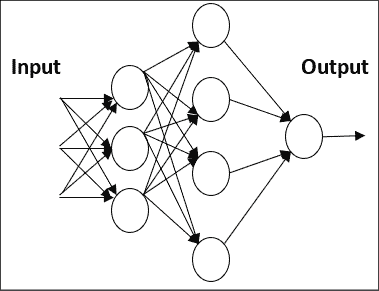
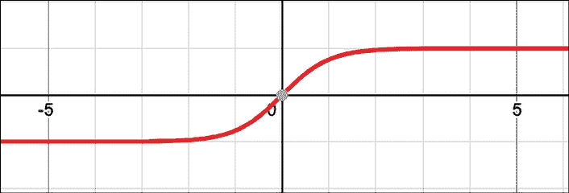
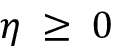
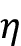
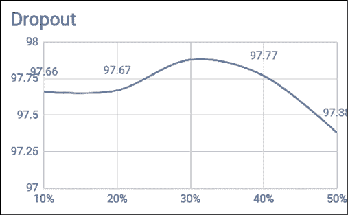
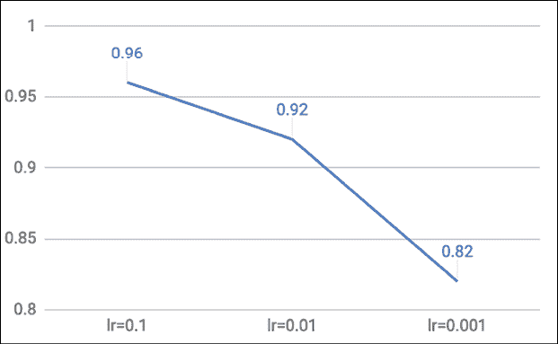
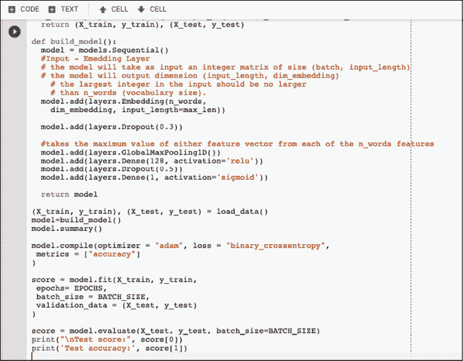
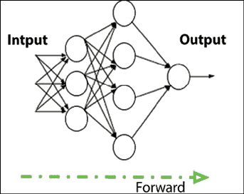

# 第一章：使用 TF 构建神经网络基础

在本章中，我们将学习 TensorFlow 的基础知识，这是 Google 开发的一个开源库，用于机器学习和深度学习。此外，我们还将介绍神经网络和深度学习的基础知识，这两个领域在过去几年中经历了令人惊讶的爆发性增长。本章的目的是提供进行基本但完全动手操作的深度学习所需的所有工具。

我们将学习：

+   TensorFlow 和 Keras 是什么

+   神经网络简介

+   感知机和多层感知机是什么

+   一个实际的例子：识别手写数字

本章的所有代码文件可以在 [`packt.link/dltfchp1`](https://packt.link/dltfchp1) 找到。

让我们开始吧！

# 什么是 TensorFlow（TF）？

TensorFlow 是 Google Brain 团队开发的一个强大的开源软件库，用于深度神经网络，这是本书所涉及的主题。它于 2015 年 11 月首次以 Apache 2.0 许可证发布，并迅速发展；截至 2022 年 5 月，它的 GitHub 仓库（[`github.com/tensorflow/tensorflow`](https://github.com/tensorflow/tensorflow)）已有超过 129,000 次提交，约有 3,100 名贡献者。仅此可以作为衡量 TensorFlow 受欢迎程度的标准。

让我们首先了解 TensorFlow 究竟是什么，以及它为何在深度神经网络研究人员和工程师中如此受欢迎。Google 称其为“机器智能的开源软件库”，但由于还有很多其他的深度学习库，如 PyTorch（[`pytorch.org/`](https://pytorch.org/)）、Caffe（[`caffe.berkeleyvision.org/`](https://caffe.berkeleyvision.org/)）和 MXNet（[`mxnet.apache.org/`](https://mxnet.apache.org/)），那么是什么让 TensorFlow 与众不同呢？像 TensorFlow 这样的深度学习库大多数都有自动微分（一个用于优化的有用数学工具），许多都是开源平台。它们大多数支持 CPU/GPU 选项，拥有预训练模型，并支持常用的神经网络架构，如递归神经网络、卷积神经网络和深度信念网络。那么，TensorFlow 还有什么特别之处呢？让我列举一下它的主要特点：

+   它适用于所有流行的编程语言，如 Python、C++、Java、R 和 Go。TensorFlow 提供了稳定的 Python 和 C++ API，以及一个对其他语言不保证向后兼容的 API。

+   Keras – 一个高级神经网络 API，已经与 TensorFlow 集成（在 2.0 版本中，Keras 成为与 TensorFlow 交互的标准 API）。该 API 指定了软件组件应如何交互。

+   TensorFlow 允许在生产环境中部署模型，并提供易用性。

+   最重要的是，TensorFlow 拥有非常好的社区支持。

GitHub 上的星标数（见 *图 1.1*）是衡量所有开源项目受欢迎程度的指标。截止到 2022 年 5 月，TensorFlow、Keras 和 PyTorch 的星标数分别为 165K、55K 和 56K，使得 TensorFlow 成为最受欢迎的机器学习框架：


图 1.1：GitHub 上各个深度学习项目的星标数

# 什么是 Keras？

Keras 是一个优美的 API，用于组合构建模块以创建和训练深度学习模型。Keras 可以与多个深度学习引擎集成，包括 Google TensorFlow、Microsoft CNTK、Amazon MXNet 和 Theano。从 TensorFlow 2.0 开始，由 François Chollet 开发的 Keras 被作为标准的高级 API 采纳，极大简化了编码过程，使编程变得更加直观。

# 神经网络简介

人工神经网络（简称“神经网络”或 ANN）代表了一类机器学习模型，灵感来自于对哺乳动物中枢神经系统的研究。每个神经网络由几个互相连接的“神经元”组成，这些神经元按“层”组织。一个层中的神经元将信息传递给下一个层中的神经元（在术语中称为“激活”），这就是网络进行计算的方式。最初的研究始于 20 世纪 50 年代初，当时引入了“感知机”[1]，这是一种用于简单操作的两层网络，随后在 60 年代末期引入了“反向传播”算法，用于高效的多层网络训练（参考[2]和[3]）。一些研究认为，这些技术的起源可能比通常所说的还要更早[4]。

神经网络曾是 1980 年代前的学术研究重点，之后其他更简单的方法变得更为相关。然而，自 2000 年代中期以来，随着三个因素的推动，神经网络再次引起了人们的广泛关注：G. Hinton 提出的突破性快速学习算法[3]，[5]，[6]；2011 年左右引入的用于大规模数值计算的 GPU；以及可用于训练的大量数据集。

这些改进为现代“深度学习”铺平了道路，深度学习是一类神经网络，具有大量的神经元层，能够基于渐进的抽象层次学习复杂的模型。几年前，人们开始称其为“深度”学习，当时它利用了 3 到 5 层的神经网络。而现在，超过 200 层的网络已经很常见！

这种通过渐进抽象进行学习的方式类似于人类大脑中数百万年来进化的视觉模型。事实上，人类的视觉系统被组织成不同的层次。首先，我们的眼睛与大脑中的一个区域——视觉皮层（V1）相连接，这个区域位于大脑后部的下方。这个区域在许多哺乳动物中都很常见，负责区分基本的视觉属性，如视觉方向的微小变化、空间频率和颜色。

据估计，V1 由大约 1.4 亿个神经元组成，神经元之间有数十亿个连接。V1 然后与其他区域相连，V2、V3、V4、V5 和 V6 逐步进行更复杂的图像处理和更高级概念的识别，如形状、面孔、动物等。估计人类皮层约有 160 亿个神经元，人类皮层的约 10-25% 用于视觉处理 [7]。深度学习从人类视觉系统的这种分层组织中汲取了一些灵感：早期的人工神经元层学习图像的基本特性，而较深的层学习更复杂的概念。

本书通过提供在 TensorFlow 中工作的神经网络，涵盖了神经网络的几个主要方面。那么，让我们开始吧！

# 感知机

“感知机”是一个简单的算法，给定一个包含 `m` 个值（`x₁`, `x₂`, ..., 和 `x[m]`）的输入向量 `x`，通常称为输入特征或简而言之特征，它输出 `1`（“是”）或 `0`（“否”）。从数学上讲，我们定义一个函数：


其中 `w` 是权重向量， 是点积 ，`b` 是偏置。如果你记得初等几何，*wx* + `b` 定义了一个边界超平面，该超平面根据分配给 `w` 和 `b` 的值而改变位置。请注意，超平面是一个子空间，其维度比它所在的环境空间少一维。请参见（*图 1.2*）以获得示例：


图 1.2：超平面的示例

换句话说，这是一个非常简单但有效的算法！例如，给定三个输入特征，即颜色中的红色、绿色和蓝色的量，感知机可以尝试判断该颜色是否是“白色”。

请注意，感知机无法表达“*可能*”的答案。如果我们了解如何定义 `w` 和 `b`，它可以回答“是”（1）或“否”（0）。这就是接下来将讨论的“训练”过程。

## 我们的第一个 TensorFlow 代码示例

在 `tf.keras` 中有三种创建模型的方式：顺序 API、函数式 API 和模型子类化。在本章中，我们将使用最简单的一个，`Sequential()`，而另外两种将在 *第二章*，*回归与分类* 中讨论。`Sequential()` 模型是一个神经网络层的线性管道（堆栈）。该代码片段定义了一个单层模型，其中包含 10 个人工神经元，期望 784 个输入变量（也称为特征）。请注意，该网络是“密集”的，这意味着层中的每个神经元都与前一层中的所有神经元相连，并且与下一层中的所有神经元相连：

```py
import tensorflow as tf
from tensorflow import keras
NB_CLASSES = 10
RESHAPED = 784
model = tf.keras.models.Sequential()
model.add(keras.layers.Dense(NB_CLASSES,
            input_shape=(RESHAPED,), kernel_initializer='zeros',
            name='dense_layer', activation='softmax')) 
```

每个神经元可以通过 `'kernel_initializer'` 参数使用特定的权重进行初始化。这里有一些选择，最常见的几种如下：

+   `random_uniform`：权重被初始化为在范围（-0.05，0.05）内均匀随机的小值。

+   `random_normal`：权重根据高斯分布初始化，均值为零，标准差较小，为 0.05。对于不熟悉高斯分布的朋友，可以将其想象成一个对称的“钟形曲线”。

+   `zero`：所有权重初始化为零。

完整的列表可以在线查看（[`www.tensorflow.org/api_docs/python/tf/keras/initializers`](https://www.tensorflow.org/api_docs/python/tf/keras/initializers)）。

# 多层感知机：我们的第一个网络示例

在本章中，我们展示了一个具有多个密集层的网络的第一个示例。历史上，“感知机”是指具有单一线性层的模型，因此，如果它具有多个层，我们称之为**多层感知机**（**MLP**）。请注意，输入层和输出层可以从外部看到，而其他所有位于中间的层都是隐藏的——因此有了*隐藏层*这个名称。在这个背景下，单一层仅仅是一个线性函数，因此，MLP 是通过将多个单一层按顺序堆叠而成的：



图 1.3：多层感知机示例

在*图 1.3*中，第一隐藏层中的每个节点接收一个输入，并根据其相关的线性函数的值“激活” (0,1)。然后，第一隐藏层的输出被传递到第二层，应用另一个线性函数，结果再传递到最终的输出层，该输出层由一个神经元组成。有趣的是，这种层次结构在某种程度上类似于人类视觉系统的组织，正如我们之前讨论的。

## 感知机训练中的问题及解决方案

让我们考虑一个单一的神经元；`w`和`b`的最佳选择是什么？理想情况下，我们希望提供一组训练示例，并让计算机调整权重和偏置，使得输出中的误差最小化。

为了让这个问题更加具体化，假设我们有一组猫的图像和另一组不包含猫的图像。假设每个神经元接收来自图像中单个像素的输入。当计算机处理这些图像时，我们希望我们的神经元调整它的权重和偏置，使得错误识别的图像越来越少。

这种方法看起来很直观，但它要求权重（或偏置）的微小变化仅导致输出的微小变化。想一想：如果输出跳跃很大，我们就无法*逐步学习*。毕竟，孩子们是一点一点地学习的。不幸的是，感知机并没有表现出这种“逐步”行为。感知机要么是 0，要么是 1，这是一个大跳跃，无法帮助学习（参见*图 1.4*）：


图 1.4：感知机示例——0 或 1

我们需要一些不同的东西，一些更加平滑的东西。我们需要一个从 0 到 1 逐渐变化且没有间断的函数。从数学角度来看，这意味着我们需要一个连续函数，允许我们计算导数。你可能还记得，在数学中，导数是一个函数在某一点上变化的量。对于输入是实数的函数，导数是图中某一点切线的斜率。在本章稍后，我们将讨论为什么导数对学习很重要，尤其是我们会讲到梯度下降。

## 激活函数：Sigmoid

Sigmoid 函数，定义为 ，如下面的图所示，当输入在  范围内变化时，其输出在 (0, 1) 范围内变化较小。从数学角度看，该函数是连续的。一个典型的 Sigmoid 函数在 *图 1.5* 中表示：


图 1.5：输出范围为 (0,1) 的 Sigmoid 函数

一个神经元可以使用 Sigmoid 来计算非线性函数 。注意，如果 `z` = *wx* + `b` 非常大且为正数，那么 ，因此 ；而如果 `z` = *wx* + `b` 非常大且为负数，那么 ，因此 。换句话说，具有 Sigmoid 激活的神经元行为类似于感知器，但变化是渐进的，像 0.5539 或 0.123191 这样的输出值是完全合法的。从这个意义上说，Sigmoid 神经元可以回答“也许”。

## 激活函数：tanh

另一个有用的激活函数是 tanh。它的定义为 ，其形状如 *图 1.6* 所示。其输出范围从 -1 到 1：



图 1.6：Tanh 激活函数

## 激活函数：ReLU

“Sigmoid” 并不是用于神经网络的唯一平滑激活函数。最近，一个非常简单的函数叫做 **ReLU**（**修正线性单元**）变得非常流行，因为它有助于解决 Sigmoid 中优化时出现的一些问题。我们将在 *第五章* 中更详细地讨论这些问题，特别是在讨论梯度消失时，我们会提到递归神经网络。

ReLU 被简单地定义为 `f(x)` = *max*(0, `x`)，其非线性函数在 *图 1.7* 中表示。如我们所见，该函数对于负值为零，对于正值线性增长。ReLU 也非常容易实现（通常只需要三条指令），而 Sigmoid 实现起来复杂得多，可能需要几个数量级的计算。这有助于将神经网络压缩到早期的 GPU 上：


图 1.7：ReLU 函数

## 两个额外的激活函数：ELU 和 Leaky ReLU

Sigmoid 和 ReLU 并不是用于学习的唯一激活函数。

**指数线性单元**（**ELU**）定义为！[](img/B18331_01_012.png)，当时，其图像如*图 1.8*所示：


图 1.8：一个 ELU 函数

LeakyReLU 定义为！[](img/B18331_01_014.png)，当时，其图像如*图 1.9*所示：


图 1.9：一个 LeakyReLU 函数

这两个函数允许在`x`为负时进行小幅更新，这在某些条件下可能会很有用。

## 激活函数

Sigmoid、Tanh、ELU、Leaky ReLU 和 ReLU 通常被称为神经网络术语中的*激活函数*。在梯度下降部分，我们将看到这些渐变变化，尤其是 Sigmoid 和 ReLU 函数的渐变变化，是开发一种学习算法的基本构建块，这种算法通过逐渐减少网络所犯的错误，从而一点点地进行调整。一个使用激活函数的示例！[](img/B18331_01_016.png)，输入向量为(`x₁`, `x₂`,..., `x[m]`)，权重向量为(`w₁`, `w₂`,..., `w[m]`)，偏置为`b`，汇总为！[](img/B18331_01_017.png)，如*图 1.10*所示（请注意，TensorFlow 支持许多激活函数，完整的函数列表可以在线查看）：


图 1.10：激活函数在线性函数后的应用示例

## 简而言之：神经网络到底是什么？

用一句话来说，机器学习模型是一种计算函数的方式，它将某些输入映射到对应的输出。这个函数不过是一些加法和乘法操作。然而，当与非线性激活函数结合并堆叠成多层时，这些函数几乎可以学习任何东西[8]。我们还需要一个有意义的度量，来捕捉我们希望优化的内容（即所谓的损失函数，我们将在后面的章节中介绍），足够的数据来学习，以及足够的计算能力。

现在，可能有必要停下来问自己，“学习”究竟是什么？好吧，从我们的角度来看，学习本质上是一个旨在将已建立的观察结果[9]泛化，从而预测未来结果的过程。所以，简而言之，这正是我们希望通过神经网络实现的目标。

# 一个实际的例子：识别手写数字

在本节中，我们将构建一个可以识别手写数字的网络。为了实现这个目标，我们使用 MNIST（[`yann.lecun.com/exdb/mnist/`](http://yann.lecun.com/exdb/mnist/)），这是一个包含 60,000 个训练示例和 10,000 个测试示例的手写数字数据库。训练示例由人工标注，标注的是正确的答案。例如，如果手写数字是“3”，那么 3 就是与该示例关联的标签。

在机器学习中，当有一个包含正确答案的数据集时，我们称之为可以执行某种形式的 *监督学习*。在这种情况下，我们可以使用训练示例来改进我们的网络。测试示例也有与每个数字相关的正确答案。然而，在这种情况下，目的是假装标签是未知的，让网络进行预测，然后再重新考虑标签，以评估我们的神经网络在识别数字方面的学习效果。毫不奇怪，测试示例仅用于测试我们网络的性能。

每张 MNIST 图像为灰度图，包含 28 x 28 个像素。以下是一些数字图像的子集，显示在 *图 1.11* 中：


图 1.11：一组 MNIST 图像

## One hot 编码（OHE）

我们将使用 OHE 作为一个简单的工具来编码神经网络中使用的信息。在许多应用中，将类别（非数值型）特征转换为数值变量是很方便的。例如，类别特征*digit*的值为 `d`，其中 `d` 属于[0–9]，可以被编码成一个具有 10 个位置的二进制向量，除了 *d-th* 位置外，其他位置的值始终为 0，而 *d-th* 位置的值为 1。例如，数字 3 可以编码为 [0, 0, 0, 1, 0, 0, 0, 0, 0, 0]。

这种表示方法被称为 **One-Hot-Encoding**（**OHE**），有时也简称为 one-hot，在数据挖掘中非常常见，当学习算法专门用于处理数值函数时，通常会使用这种表示方式。

## 在 TensorFlow 中定义一个简单的神经网络

在本节中，我们使用 TensorFlow 定义一个识别 MNIST 手写数字的网络。我们从一个非常简单的神经网络开始，然后逐步改进它。

按照 Keras 的风格，TensorFlow 提供了合适的库（[`www.tensorflow.org/api_docs/python/tf/keras/datasets`](https://www.tensorflow.org/api_docs/python/tf/keras/datasets)）用于加载数据集，并将其划分为训练集 `X_train`*，* 用于微调我们的网络，以及测试集 `X_test`*，* 用于评估性能。在本章后续内容中，我们将正式定义什么是训练集、验证集和测试集。现在，我们只需要知道训练集是用来让神经网络从数据示例中学习的。数据会被转换为 `float32`，以便在训练神经网络时使用 32 位精度，并被归一化到 [0,1] 范围内。此外，我们还将真实标签分别加载到 `Y_train` 和 `Y_test` 中，并对其进行一-hot 编码。让我们看看代码。

目前，暂时不需要过于关注为什么某些参数有特定的赋值，这些选择将在本书的其余部分中讨论。直观地说，一个 epoch 定义了训练的持续时间，`BATCH_SIZE`是你每次输入网络的样本数量，验证样本是用于检查或验证训练过程有效性的数据量。我们选择`EPOCHS = 200`，`BATCH_SIZE = 128`，`VALIDATION_SPLIT=0.2`，以及`N_HIDDEN = 128`的原因将在本章后续内容中更加清楚，当时我们会探索不同的值并讨论超参数优化。让我们来看看我们在 TensorFlow 中的第一个神经网络代码片段。阅读上去直观，但你会在接下来的页面中找到详细的解释：

```py
import tensorflow as tf
import numpy as np
from tensorflow import keras
# Network and training parameters.
EPOCHS = 200
BATCH_SIZE = 128
VERBOSE = 1
NB_CLASSES = 10   # number of outputs = number of digits
N_HIDDEN = 128
VALIDATION_SPLIT = 0.2 # how much TRAIN is reserved for VALIDATION
# Loading MNIST dataset.
# verify
# You can verify that the split between train and test is 60,000, and 10,000 respectively. 
# Labels have one-hot representation.is automatically applied
mnist = keras.datasets.mnist
(X_train, Y_train), (X_test, Y_test) = mnist.load_data()
# X_train is 60000 rows of 28x28 values; we  --> reshape it to 60000 x 784.
RESHAPED = 784
#
X_train = X_train.reshape(60000, RESHAPED)
X_test = X_test.reshape(10000, RESHAPED)
X_train = X_train.astype('float32')
X_test = X_test.astype('float32')
# Normalize inputs to be within in [0, 1].
X_train /= 255
X_test /= 255
print(X_train.shape[0], 'train samples')
print(X_test.shape[0], 'test samples')
# One-hot representation of the labels.
Y_train = tf.keras.utils.to_categorical(Y_train, NB_CLASSES)
Y_test = tf.keras.utils.to_categorical(Y_test, NB_CLASSES) 
```

从上面的代码可以看出，输入层与图像中的每个像素相关联，共有 28 x 28 = 784 个神经元，每个神经元对应 MNIST 图像中的一个像素。

通常，每个像素的值会被归一化到[0,1]范围内（这意味着每个像素的强度值会被 255（最大强度值）除）。输出可以是十个类之一，每个类对应一个数字。

最后一层是一个单神经元，激活函数为`'softmax'`，它是 sigmoid 函数的一种推广。如前所述，当输入在范围内变化时，sigmoid 函数的输出在(0, 1)范围内。同样，softmax 将一个 K 维的任意实值向量“压缩”成一个 K 维的实值向量，范围在(0, 1)之间，并且它们的总和为 1。在我们的例子中，它将前一层的十个神经元提供的十个答案汇总。我们刚刚描述的内容可以通过以下代码实现：

```py
# Build the model.
model = tf.keras.models.Sequential()
model.add(keras.layers.Dense(NB_CLASSES,
            input_shape=(RESHAPED,),
            name='dense_layer', 
            activation='softmax')) 
```

一旦我们定义了模型，就必须对其进行编译，以便它可以被 TensorFlow 执行。在编译过程中有一些选择。首先，我们需要选择一个*优化器*，它是用于在训练模型时更新权重的特定算法。

完整的优化器列表可以在[`www.tensorflow.org/api_docs/python/tf/keras/optimizers`](https://www.tensorflow.org/api_docs/python/tf/keras/optimizers)找到。其次，我们需要选择一个*目标函数*，它被优化器用来在权重空间中导航（通常目标函数被称为*损失函数*或*代价函数*，而优化过程被定义为损失*最小化*的过程）。第三，我们需要评估训练好的模型。

一些常见的目标函数选择（完整的损失函数列表可以在[`www.tensorflow.org/api_docs/python/tf/keras/losses`](https://www.tensorflow.org/api_docs/python/tf/keras/losses)找到）有：

+   `mse`，定义为预测值与真实值之间的均方误差。从数学上讲，如果`d`是预测值向量，`y`是包含`n`个观测值的向量，那么 。请注意，这个目标函数是每个预测中所有错误的平均值。如果预测值与真实值相差较大，那么这个差距会通过平方操作变得更加明显。此外，平方操作能够加总误差，无论给定值是正数还是负数。

+   `binary_crossentropy`，定义为二分类对数损失。假设我们的模型预测值为`p`，而目标值为`c`，则二分类交叉熵定义为 。请注意，这个目标函数适用于二分类标签预测。

+   `categorical_crossentropy`，定义为多类对数损失。类别交叉熵比较预测分布与真实分布，其中真实类别的概率设置为 1，其他类别的概率设置为 0。如果真实类别是`c`，而预测为`y`，那么类别交叉熵定义为：

    

    考虑多类对数损失的一种方式是将真实类别表示为独热编码向量，并且模型输出越接近该向量，损失越低。请注意，这个目标函数适用于多分类标签预测，且在使用 softmax 激活函数时为默认选择。完整的损失函数列表请参见 [`www.tensorflow.org/api_docs/python/tf/keras/losses`](https://www.tensorflow.org/api_docs/python/tf/keras/losses)。

一些常见的度量标准（完整的度量标准列表请参见 [`www.tensorflow.org/api_docs/python/tf/keras/metrics`](https://www.tensorflow.org/api_docs/python/tf/keras/metrics)）包括：

+   准确率，定义为正确预测相对于总预测数量的比例。

+   精确度，定义为正确的正向预测相对于正确和错误的正向预测数量的比例。

+   召回率，定义为正确的正向预测相对于实际正向预测数量的比例。

完整的度量标准列表可以在[`www.tensorflow.org/api_docs/python/tf/keras/metrics`](https://www.tensorflow.org/api_docs/python/tf/keras/metrics)查看。度量标准与目标函数类似，不同之处在于它们不用于训练模型，只用于评估模型。然而，理解度量标准与目标函数的区别非常重要。如前所述，损失函数用于优化你的网络，这是被选定优化器最小化的函数。而度量标准则用于判断你的网络性能。这仅供你进行评估，应该与优化过程分开。在某些情况下，理想的做法是直接优化特定的度量标准。然而，一些度量标准对于其输入是不可导的，因此不能直接用于优化。

在 TensorFlow 中编译模型时，可以选择优化器、损失函数和度量标准，它们将与给定的模型一起使用：

```py
# Compiling the model.
model.compile(optimizer='SGD', 
              loss='categorical_crossentropy',
              metrics=['accuracy']) 
```

**随机梯度下降法**（**SGD**）是一种特殊的优化算法，用于减少神经网络在每次训练周期后的错误。我们将在接下来的章节中回顾 SGD 和其他优化算法。模型编译完成后，可以使用`fit()`方法进行训练，该方法指定了一些参数：

+   `epochs`是指模型暴露于训练集的次数。在每次迭代中，优化器会尝试调整权重，以最小化目标函数。

+   `batch_size`是指在优化器进行权重更新之前观察到的训练实例的数量；每个周期通常会有多个批次。

在 TensorFlow 中训练模型非常简单：

```py
# Training the model.
model.fit(X_train, Y_train,
          batch_size=BATCH_SIZE, epochs=EPOCHS,
          verbose=VERBOSE, validation_split=VALIDATION_SPLIT) 
```

请注意，我们已经为验证保留了部分训练集。关键思想是，在训练过程中，我们保留部分训练数据用于验证集的性能评估。这是一种良好的实践，适用于任何机器学习任务，并且我们将在所有示例中采用这种方法。请注意，当我们在本章后面讨论过拟合时，会再次提到验证。

一旦模型训练完成，我们可以在测试集上进行评估，该测试集包含在训练阶段从未见过的新示例。

当然，训练集和测试集是严格分开的。没有必要在已经用于训练的示例上评估模型。在 TensorFlow 中，我们可以使用`evaluate(X_test, Y_test)`方法来计算`test_loss`和`test_acc`：

```py
#evaluate the model
test_loss, test_acc = model.evaluate(X_test, Y_test)
print('Test accuracy:', test_acc) 
```

恭喜！你刚刚定义了你的第一个神经网络。只需几行代码，你的计算机就能够识别手写数字。让我们运行代码并看看性能如何。

## 运行一个简单的 TensorFlow 网络并建立基准

那么，让我们看看当我们运行代码时会发生什么：

```py
Model: "sequential"
_________________________________________________________________
Layer (type)                Output Shape              Param #    
=================================================================
dense_layer (Dense)         (None, 10)                7850       

=================================================================
Total params: 7,850
Trainable params: 7,850
Non-trainable params: 0
_________________________________________________________________
Train on 48000 samples, validate on 12000 samples
Epoch 1/200
48000/48000 [==============================] - 1s 31us/sample - loss: 2.1276 - accuracy: 0.2322 - val_loss: 1.9508 - val_accuracy: 0.3908
Epoch 2/200
48000/48000 [==============================] - 1s 23us/sample - loss: 1.8251 - accuracy: 0.5141 - val_loss: 1.6848 - val_accuracy: 0.6277
Epoch 3/200
48000/48000 [==============================] - 1s 25us/sample - loss: 1.5992 - accuracy: 0.6531 - val_loss: 1.4838 - val_accuracy: 0.7150
Epoch 4/200
48000/48000 [==============================] - 1s 27us/sample - loss: 1.4281 - accuracy: 0.7115 - val_loss: 1.3304 - val_accuracy: 0.7551
Epoch 5/200 
```

首先，网络架构被输出，我们可以看到使用的不同类型的层、它们的输出形状、需要优化的参数数量（即需要优化的权重数量）以及它们是如何连接的。然后，网络在 48K 样本上进行训练，12K 样本用于验证。一旦神经模型构建完成，它会在 10K 样本上进行测试。现在我们不深入探讨训练如何进行，但可以看到程序运行了 200 次，每次准确率都有所提高。训练结束后，我们在测试集上测试我们的模型，最终得到了在训练数据集上的约 89.96%的准确率，在验证集上的 90.70%，以及在测试集上的 90.71%：

```py
Epoch 199/200
48000/48000 [==============================] - 1s 22us/sample - loss: 0.3684 - accuracy: 0.8995 - val_loss: 0.3464 - val_accuracy: 0.9071
Epoch 200/200
48000/48000 [==============================] - 1s 23us/sample - loss: 0.3680 - accuracy: 0.8996 - val_loss: 0.3461 - val_accuracy: 0.9070
10000/10000 [==============================] - 1s 54us/sample - loss: 0.3465 - accuracy: 0.9071
Test accuracy: 0.9071 
```

这意味着大约每 10 张图片中就有 1 张被错误分类。我们肯定能做得比这更好。

## 使用 TensorFlow 通过隐藏层改进简单网络

好的，我们在训练数据集上的准确率基准为 89.96%，在验证集上为 90.70%，在测试集上为 90.71%。这是一个不错的起点，但我们可以改进它。让我们看看怎么做。

一项初步的改进是向我们的网络中添加更多层，因为这些额外的神经元可能直观地有助于学习训练数据中的更复杂模式。换句话说，额外的层增加了更多参数，可能让模型记住更复杂的模式。所以，在输入层之后，我们添加了第一层密集层，其中有`N_HIDDEN`个神经元，并使用激活函数`'relu'`。这个额外的层被认为是*隐藏层*，因为它既不与输入层直接连接，也不与输出层直接连接。在第一个隐藏层之后，我们添加了第二个隐藏层，同样有`N_HIDDEN`个神经元，然后是一个输出层，包含 10 个神经元，每个神经元会在识别到相应的数字时被激活。以下代码定义了这个新的网络：

```py
import tensorflow as tf
from tensorflow import keras
# Network and training.
EPOCHS = 50
BATCH_SIZE = 128
VERBOSE = 1
NB_CLASSES = 10   # number of outputs = number of digits
N_HIDDEN = 128
VALIDATION_SPLIT = 0.2 # how much TRAIN is reserved for VALIDATION
# Loading MNIST dataset.
# Labels have one-hot representation.
mnist = keras.datasets.mnist
(X_train, Y_train), (X_test, Y_test) = mnist.load_data()
# X_train is 60000 rows of 28x28 values; we reshape it to 60000 x 784.
RESHAPED = 784
#
X_train = X_train.reshape(60000, RESHAPED)
X_test = X_test.reshape(10000, RESHAPED)
X_train = X_train.astype('float32')
X_test = X_test.astype('float32')
# Normalize inputs to be within in [0, 1].
X_train, X_test = X_train / 255.0, X_test / 255.0
print(X_train.shape[0], 'train samples')
print(X_test.shape[0], 'test samples')
# Labels have one-hot representation.
Y_train = tf.keras.utils.to_categorical(Y_train, NB_CLASSES)
Y_test = tf.keras.utils.to_categorical(Y_test, NB_CLASSES)
# Build the model.
model = tf.keras.models.Sequential()
model.add(keras.layers.Dense(N_HIDDEN,
             input_shape=(RESHAPED,),
             name='dense_layer', activation='relu'))
model.add(keras.layers.Dense(N_HIDDEN,
             name='dense_layer_2', activation='relu'))
model.add(keras.layers.Dense(NB_CLASSES,
             name='dense_layer_3', activation='softmax'))
# Summary of the model.
model.summary()
# Compiling the model.
model.compile(optimizer='SGD', 
              loss='categorical_crossentropy',
              metrics=['accuracy'])
# Training the model.
model.fit(X_train, Y_train,
          batch_size=BATCH_SIZE, epochs=EPOCHS,
          verbose=VERBOSE, validation_split=VALIDATION_SPLIT)
# Evaluating the model.
test_loss, test_acc = model.evaluate(X_test, Y_test)
print('Test accuracy:', test_acc) 
```

请注意，`to_categorical(Y_train, NB_CLASSES)`将数组`Y_train`转换为一个矩阵，列数等于类别数，而行数保持不变。比如，假设我们有：

```py
> labels
array([0, 2, 1, 2, 0]) 
```

那么：

```py
to_categorical(labels)
array([[ 1.,  0.,  0.],
       [ 0.,  0.,  1.],
       [ 0.,  1.,  0.],
       [ 0.,  0.,  1.],
       [ 1.,  0.,  0.]], dtype=float32) 
```

让我们运行代码，看看这个多层网络得到什么结果：

```py
_________________________________________________________________
Layer (type)                Output Shape              Param #    
=================================================================
dense_layer (Dense)         (None, 128)               100480     

dense_layer_2 (Dense)       (None, 128)               16512      

dense_layer_3 (Dense)       (None, 10)                1290       

=================================================================
Total params: 118,282
Trainable params: 118,282
Non-trainable params: 0
_________________________________________________________________
Train on 48000 samples, validate on 12000 samples
Epoch 1/50
48000/48000 [==============================] - 3s 63us/sample - loss: 2.2507 - accuracy: 0.2086 - val_loss: 2.1592 - val_accuracy: 0.3266 
```

上一个输出展示了运行的初始步骤，而以下输出展示了结论。不坏。从以下输出可以看到，通过添加两层隐藏层，我们在训练数据集上的准确率达到了 90.81%，在验证集上为 91.40%，在测试集上为 91.18%。这意味着，相比之前的网络，我们提高了测试数据集上的准确率，并且将迭代次数从 200 次减少到 50 次。这很好，但我们还想要更多。

如果你愿意，你可以自己尝试，看看如果你只添加一个隐藏层而不是两个，或者如果你添加超过两个层，会发生什么。我把这个实验留给你作为练习：

```py
Epoch 49/50
48000/48000 [==============================] - 1s 30us/sample - loss: 0.3347 - accuracy: 0.9075 - val_loss: 0.3126 - val_accuracy: 0.9136
Epoch 50/50
48000/48000 [==============================] - 1s 28us/sample - loss: 0.3326 - accuracy: 0.9081 - val_loss: 0.3107 - val_accuracy: 0.9140
10000/10000 [==============================] - 0s 40us/sample - loss: 0.3164 - accuracy: 0.9118
Test accuracy: 0.9118 
```

请注意，改进会在一定数量的迭代后停止（或者变得几乎不可察觉）。在机器学习中，这种现象被称为*收敛*。

## 使用 TensorFlow 通过 Dropout 进一步改进简单网络

目前，我们的基准是训练集准确率 90.81%，验证集准确率 91.40%，测试集准确率 91.18%。第二个改进非常简单。我们决定在训练过程中，以 `DROPOUT` 概率随机丢弃一些值，这些值在我们的内部密集网络的隐藏层中传播。在机器学习中，这是一种广为人知的正则化方法。令人惊讶的是，随机丢弃一些值的这一想法竟然能改善我们的性能。其背后的思想是，随机丢弃 *迫使* 网络学习到冗余的模式，这些模式对更好的泛化有帮助：

```py
import tensorflow as tf
import numpy as np
from tensorflow import keras
# Network and training.
EPOCHS = 200
BATCH_SIZE = 128
VERBOSE = 1
NB_CLASSES = 10   # number of outputs = number of digits
N_HIDDEN = 128
VALIDATION_SPLIT = 0.2 # how much TRAIN is reserved for VALIDATION
DROPOUT = 0.3
# Loading MNIST dataset.
# Labels have one-hot representation.
mnist = keras.datasets.mnist
(X_train, Y_train), (X_test, Y_test) = mnist.load_data()
# X_train is 60000 rows of 28x28 values; we reshape it to 60000 x 784.
RESHAPED = 784
#
X_train = X_train.reshape(60000, RESHAPED)
X_test = X_test.reshape(10000, RESHAPED)
X_train = X_train.astype('float32')
X_test = X_test.astype('float32')
# Normalize inputs within [0, 1].
X_train, X_test = X_train / 255.0, X_test / 255.0
print(X_train.shape[0], 'train samples')
print(X_test.shape[0], 'test samples')
# One-hot representations for labels.
Y_train = tf.keras.utils.to_categorical(Y_train, NB_CLASSES)
Y_test = tf.keras.utils.to_categorical(Y_test, NB_CLASSES)
# Building the model.
model = tf.keras.models.Sequential()
model.add(keras.layers.Dense(N_HIDDEN,
              input_shape=(RESHAPED,),
              name='dense_layer', activation='relu'))
model.add(keras.layers.Dropout(DROPOUT))
model.add(keras.layers.Dense(N_HIDDEN,
              name='dense_layer_2', activation='relu'))
model.add(keras.layers.Dropout(DROPOUT))
model.add(keras.layers.Dense(NB_CLASSES,
              name='dense_layer_3', activation='softmax'))
# Summary of the model.
model.summary()
# Compiling the model.
model.compile(optimizer='SGD', 
              loss='categorical_crossentropy',
              metrics=['accuracy'])
# Training the model.
model.fit(X_train, Y_train,
          batch_size=BATCH_SIZE, epochs=EPOCHS,
          verbose=VERBOSE, validation_split=VALIDATION_SPLIT)
# Evaluating the model.
test_loss, test_acc = model.evaluate(X_test, Y_test)
print('Test accuracy:', test_acc) 
```

让我们像之前一样运行 200 次迭代，可以看到该网络在训练集上的准确率为 91.70%，在验证集上的准确率为 94.42%，在测试集上的准确率为 94.15%：

```py
Epoch 199/200
48000/48000 [==============================] - 2s 45us/sample - loss: 0.2850 - accuracy: 0.9177 - val_loss: 0.1922 - val_accuracy: 0.9442
Epoch 200/200
48000/48000 [==============================] - 2s 42us/sample - loss: 0.2845 - accuracy: 0.9170 - val_loss: 0.1917 - val_accuracy: 0.9442
10000/10000 [==============================] - 1s 61us/sample - loss: 0.1927 - accuracy: 0.9415
Test accuracy: 0.9415 
```

请注意，已经多次观察到，在内部隐藏层中具有随机丢弃（dropout）功能的网络可以在未见过的测试集样本上“泛化”得更好。直观地说，我们可以将这一现象理解为每个神经元变得更有能力，因为它知道自己不能依赖于邻近的神经元。此外，这还迫使信息以冗余的方式进行存储。在测试时没有丢弃，因此我们现在使用的是所有经过高度调优的神经元。简而言之，当采用某种丢弃功能时，通常可以通过测试网络的表现来验证其有效性。

此外，请注意，训练的准确率应该仍然高于测试的准确率；否则，我们可能训练的时间还不够长。这在我们的例子中确实是这样，因此我们应该增加训练的轮次。然而，在尝试这样做之前，我们需要引入一些其他概念，这些概念可以加速训练的收敛过程。接下来我们讨论优化器。

## 在 TensorFlow 中测试不同的优化器

现在我们已经定义并使用了一个网络，接下来可以通过一个类比来帮助我们更好地理解网络是如何训练的。让我们关注一种流行的训练技术——**梯度下降法**（**GD**）。假设有一个通用的代价函数 `C(w)`，它是一个关于单一变量 `w` 的函数，如*图 1.12*所示：


图 1.12：梯度下降优化的示例

梯度下降法可以看作是一个需要沿着陡峭的坡道向下行进的登山者，目标是进入一个沟壑。坡道代表着代价函数 `C`，而沟壑代表着最小值 `C[min]`。登山者有一个起始点 `w₀`，并逐步前进；可以想象，这里几乎没有可见性，所以登山者无法自动看到前进的方向，而是采取锯齿形的路径。在每一步 `r`，梯度是最大增量的方向。

数学上，这个方向是偏导数的值 ，它在步长 `r` 时的 `w[r]` 点被评估出来。因此，通过采取相反的方向 ，登山者可以朝向沟壑移动。

在每一步，徒步旅行者可以决定在下次停下之前走多大一步。这就是 GD 术语中的所谓“学习率” 。请注意，如果  太小，那么徒步旅行者的步伐会非常缓慢。然而，如果  太大，那么徒步旅行者可能会跳过沟渠。

现在你应该记得，sigmoid 是一个连续函数，并且可以计算它的导数。可以证明，sigmoid  的导数是 。

ReLU 在 0 处不可导。然而，我们可以通过将 0 处的导数扩展到整个领域来定义它为 0 或 1，从而使其成为一个函数。

ReLU 的分段导数  是 。

一旦我们得到导数，就可以使用 GD 技术优化网络。TensorFlow 为我们计算导数，所以我们不需要担心实现或计算它。

神经网络本质上是由多个可导函数组成，具有成千上万，甚至数百万个参数。每一层网络计算一个函数，其误差应该最小化，以提高学习阶段观察到的准确性。当我们讨论反向传播时，我们将发现最小化问题比我们的简化例子要复杂一些。然而，它仍然基于相同的直觉，即沿着坡度下降，直到到达沟渠。

TensorFlow 实现了一种快速的 GD 变体，称为 **随机梯度下降** (**SGD**)，以及许多更先进的优化技术，如 RMSProp 和 Adam。RMSProp 和 Adam 除了拥有 SGD 的加速组件外，还引入了动量（速度分量）概念。这使得收敛速度更快，但也需要更多的计算。可以想象，一名徒步旅行者开始朝一个方向行进，然后决定改变方向，但会记住之前的选择。可以证明，动量有助于在相关方向上加速 SGD，同时减缓振荡[10]。

到目前为止，SGD 是我们默认的选择。那么现在让我们尝试另外两种方法。非常简单；我们只需要修改几行代码：

```py
# Compiling the model.
model.compile(optimizer='RMSProp', 
              loss='categorical_crossentropy', metrics=['accuracy']) 
```

就这些，来测试一下吧。

```py
_________________________________________________________________
Layer (type)                Output Shape              Param #    
=================================================================
dense_layer (Dense)         (None, 128)               100480     

dropout_2 (Dropout)         (None, 128)               0          

dense_layer_2 (Dense)       (None, 128)               16512      

dropout_3 (Dropout)         (None, 128)               0          

dense_layer_3 (Dense)       (None, 10)                1290       

=================================================================
Total params: 118,282
Trainable params: 118,282
Non-trainable params: 0
_________________________________________________________________
Train on 48000 samples, validate on 12000 samples
Epoch 1/10
48000/48000 [==============================] - 2s 48us/sample - loss: 0.4715 - accuracy: 0.8575 - val_loss: 0.1820 - val_accuracy: 0.9471
Epoch 2/10
48000/48000 [==============================] - 2s 36us/sample - loss: 0.2215 - accuracy: 0.9341 - val_loss: 0.1268 - val_accuracy: 0.9361
Epoch 3/10
48000/48000 [==============================] - 2s 39us/sample - loss: 0.1684 - accuracy: 0.9497 - val_loss: 0.1198 - val_accuracy: 0.9651
Epoch 4/10
48000/48000 [==============================] - 2s 43us/sample - loss: 0.1459 - accuracy: 0.9569 - val_loss: 0.1059 - val_accuracy: 0.9710
Epoch 5/10
48000/48000 [==============================] - 2s 39us/sample - loss: 0.1273 - accuracy: 0.9623 - val_loss: 0.1059 - val_accuracy: 0.9696
Epoch 6/10
48000/48000 [==============================] - 2s 36us/sample - loss: 0.1177 - accuracy: 0.9659 - val_loss: 0.0941 - val_accuracy: 0.9731
Epoch 7/10
48000/48000 [==============================] - 2s 35us/sample - loss: 0.1083 - accuracy: 0.9671 - val_loss: 0.1009 - val_accuracy: 0.9715
Epoch 8/10
48000/48000 [==============================] - 2s 35us/sample - loss: 0.0971 - accuracy: 0.9706 - val_loss: 0.0950 - val_accuracy: 0.9758
Epoch 9/10
48000/48000 [==============================] - 2s 35us/sample - loss: 0.0969 - accuracy: 0.9718 - val_loss: 0.0985 - val_accuracy: 0.9745
Epoch 10/10
48000/48000 [==============================] - 2s 35us/sample - loss: 0.0873 - accuracy: 0.9743 - val_loss: 0.0966 - val_accuracy: 0.9762
10000/10000 [==============================] - 1s 2ms/sample - loss: 0.0922 - accuracy: 0.9764
Test accuracy: 0.9764 
```

如你所见，RMSProp 比 SDG 更快，因为我们仅在 10 次训练中就能在训练数据集上达到 97.43% 的准确率，在验证集上为 97.62%，在测试集上为 97.64%。这是 SDG 的显著改进。现在我们有了一个非常快速的优化器，接下来我们试着将训练轮数显著增加到 250 次，结果在训练数据集上达到了 98.99% 的准确率，在验证集上为 97.66%，在测试集上为 97.77%：

```py
Epoch 248/250
48000/48000 [==============================] - 2s 40us/sample - loss: 0.0506 - accuracy: 0.9904 - val_loss: 0.3465 - val_accuracy: 0.9762
Epoch 249/250
48000/48000 [==============================] - 2s 40us/sample - loss: 0.0490 - accuracy: 0.9905 - val_loss: 0.3645 - val_accuracy: 0.9765
Epoch 250/250
48000/48000 [==============================] - 2s 39us/sample - loss: 0.0547 - accuracy: 0.9899 - val_loss: 0.3353 - val_accuracy: 0.9766
10000/10000 [==============================] - 1s 58us/sample - loss: 0.3184 - accuracy: 0.9779
Test accuracy: 0.9779 
```

观察随着训练轮数增加，训练集和测试集上的准确率变化非常有用（见 *图 1.13*）。正如你所看到的，这两条曲线在大约 15 次训练后相交，因此在此之后就不再需要继续训练：


图 1.13：使用 RMSProp 的准确率和损失示例

好的，让我们尝试另一个优化器，`Adam()`。实现起来相当简单：

```py
# Compiling the model.
model.compile(optimizer='Adam', 
              loss='categorical_crossentropy',
              metrics=['accuracy']) 
```

如我们所见，`Adam()`略好一些。使用 Adam，我们在训练数据集上的准确率为 98.94%，在验证集上的准确率为 97.89%，在测试集上的准确率为 97.82%，使用了 50 次迭代：

```py
Epoch 49/50
48000/48000 [==============================] - 3s 55us/sample - loss: 0.0313 - accuracy: 0.9894 - val_loss: 0.0868 - val_accuracy: 0.9808
Epoch 50/50
48000/48000 [==============================] - 2s 51s/sample - loss: 0.0321 - accuracy: 0.9894 - val_loss: 0.0983 - val_accuracy: 0.9789
10000/10000 [==============================] - 1s 66us/step - loss: 0.0964 - accuracy: 0.9782
Test accuracy: 0.9782 
```

再次，让我们绘制当迭代次数增加时，训练集和测试集上的准确率是如何变化的（见*图 1.14*）。你会注意到，通过选择 Adam 作为优化器，我们能够在大约 12 次迭代或步骤后就停止：


图 1.14：使用 Adam 的准确率和损失示例

请注意，这是我们的第五个变体，并记住我们最初的基线在测试数据集上的准确率为 90.71%。到目前为止，我们已逐步改进。然而，收益现在变得越来越难以获得。请注意，我们正在使用 30% 的丢弃率进行优化。为了完整性，报告不同丢弃率下测试数据集的准确率可能会很有用（见*图 1.15*）。在这个例子中，我们选择了 Adam 作为优化器。请注意，优化器的选择不是一成不变的，我们可以根据问题和优化器的组合获得不同的性能：



图 1.15：不同丢弃率下的准确率变化示例

## 增加迭代次数

让我们再试一次，将用于训练的迭代次数从 20 增加到 200。遗憾的是，这个选择将我们的计算时间增加了十倍，但并没有带来任何好处。实验失败了，但我们已经学到，如果我们花更多时间学习，结果不一定会改善。学习更多的是采用智能的技巧，而不一定是花费在计算上的时间。让我们在接下来的图表中跟踪我们的五种变体：


图 1.16：不同模型和优化器的准确率

## 控制优化器的学习率

还有一种方法是改变优化器的学习参数。正如你在*图 1.17*中看到的，我们的三个实验 [lr=0.1, lr=0.01, 和 lr=0.001] 达到的最佳值是 0.1，这是优化器的默认学习率。很好！Adam 开箱即用：



图 1.17：不同学习率下的准确率

## 增加内部隐藏神经元的数量

另一种方法是改变内部隐藏神经元的数量。我们报告了在增加隐藏神经元数量时的实验结果。我们发现，通过增加模型的复杂性，运行时间显著增加，因为需要优化的参数越来越多。然而，随着网络规模的增大，我们通过增加网络大小获得的收益越来越少（见*图 1.18*、*图 1.19* 和 *图 1.20*）：


图 1.18：内部隐藏神经元数量增加时的参数数量

另一方面，随着内部网络大小的增加，所需的时间也会增加（见*图 1.19*）：


图 1.19：内部隐藏神经元数量增加时的计算时间（秒）

请注意，在某个值之后，增加隐藏神经元的数量可能会降低准确率，因为网络可能无法很好地泛化（如*图 1.20*所示）：


图 1.20：内部隐藏神经元数量增加时的测试准确率

## 增加批处理计算的大小

GD 尝试最小化在训练集中提供的所有示例上的成本函数，同时考虑所有作为输入提供的特征。SGD 是一个更便宜的变体，只考虑 `BATCH_SIZE` 个示例。那么，让我们看看当我们更改此参数时它的表现。正如你所看到的，在我们的四个实验中，最佳准确率值出现在 `BATCH_SIZE=64` 时（见*图 1.21*）：


图 1.21：不同批处理值下的测试准确率

## 总结识别手写数字的实验

所以，让我们总结一下：通过五种不同的变体，我们能够将性能从 90.71% 提升到 97.82%。首先，我们在 TensorFlow 中定义了一个简单的层网络。然后，我们通过添加一些隐藏层来提高性能。之后，我们通过在网络中添加一些随机丢弃来改善测试集上的表现，接着通过实验不同类型的优化器来进一步提升性能：

|  | **准确率** |
| --- | --- |
| **模型** | **训练** | **验证** | **测试** |
| **简单** | 89.96% | 90.70% | 90.71% |
| **两层隐藏层（128）** | 90.81% | 91.40% | 91.18% |
| **Dropout（30%）** | 91.70% | 94.42% | 94.15%（200 轮） |
| **RMSProp** | 97.43% | 97.62% | 97.64%（10 轮） |
| **Adam** | 98.94% | 97.89% | 97.82%（10 轮） |

表 1.1：不同准确率水平的实验总结

然而，接下来的两个实验（未显示在*表 1.1*中）并未提供显著的改进。增加内部神经元的数量会创建更复杂的模型，并需要更多昂贵的计算，但它只提供了边际的增益。如果我们增加训练轮次，也会有相同的体验。最后一个实验是改变优化器的`BATCH_SIZE`。这也提供了边际的结果。

# 正则化

在本节中，我们将回顾一些改进训练阶段的最佳实践。特别是，将讨论正则化和批归一化。

## 采用正则化以避免过拟合

直观地说，一个好的机器学习模型应该在训练数据上实现低误差。从数学上讲，这等同于在给定模型的情况下最小化训练数据上的损失函数：


然而，这可能还不够。一个模型可能会变得过于复杂，以便捕捉训练数据中固有表达的所有关系。这种复杂度的增加可能带来两个负面后果。首先，复杂的模型可能需要大量时间来执行。其次，复杂的模型可能在训练数据上表现非常好，但在验证数据上表现很差。这是因为模型能够在特定的训练上下文中制造多个参数之间的关系，但这些关系在更一般的上下文中实际上并不存在。这种导致模型丧失泛化能力的现象被称为“过拟合”。再次强调，学习更重要的是关于泛化，而非记忆。另一个需要考虑的现象是“欠拟合”。

这种情况发生在数据模型无法准确捕捉输入与输出变量之间的关系时，训练集和新未见数据的误差率都很高：


图 1.22：损失函数与过拟合

一般来说，如果在训练过程中，我们看到验证集的损失在初步下降后开始增加，那么我们遇到了模型复杂度的问题，导致模型过拟合训练数据。

为了解决过拟合问题，我们需要一种方法来捕捉模型的复杂度，也就是模型可以有多复杂。解决方案是什么呢？实际上，模型不过是一个权重向量。每个权重都会影响输出，除了那些为零或接近零的权重。因此，模型的复杂度可以方便地用非零权重的数量来表示。换句话说，如果我们有两个模型 M1 和 M2，在损失函数方面的表现几乎相同，那么我们应该选择最简单的模型，即非零权重数量最少的那个模型。我们可以使用一个超参数  来控制保持简单模型的重要性，如下公式所示：


机器学习中有三种不同类型的正则化方法：

+   L1 正则化（也称为 LASSO）。模型的复杂度表示为权重绝对值的和。

+   L2 正则化（也称为 Ridge）。模型的复杂度表示为权重平方和。

+   ElasticNet 正则化。模型的复杂度通过上述两种技术的结合来表示。

注意，调整正则化可以是一种提升网络泛化性能的好方法，特别是在过拟合明显的情况下。这组实验留给有兴趣的读者自行完成。

另外，值得注意的是，TensorFlow 支持 L1、L2 和 ElasticNet 正则化。完整的正则化器列表可以在 [`www.tensorflow.org/api_docs/python/tf/keras/regularizers`](https://www.tensorflow.org/api_docs/python/tf/keras/regularizers) 中找到。添加正则化非常简单：

```py
from tf.keras.regularizers import l2, activity_l2
model.add(Dense(64, input_dim=64, W_regularizer=l2(0.01),
    activity_regularizer=activity_l2(0.01))) 
```

## 理解批量归一化

批量归一化是另一种正则化方法，也是近年来提出的最有效的改进之一。批量归一化可以加速训练，在某些情况下将训练周期缩短一半，并提供一定的正则化效果。在训练过程中，前面层的权重会自然变化，因此后续层的输入可能会发生显著变化。换句话说，每一层必须不断地重新调整其权重，以适应每个批次的不同分布。这可能会大大减慢模型的训练速度。关键思想是使每一层的输入在每个批次和每个周期中具有更相似的分布。

另一个问题是，sigmoid 激活函数在接近零时效果很好，但当值远离零时，它往往会“卡住”。如果神经元的输出偶尔远离 sigmoid 的零点，则该神经元将无法更新其权重。

另一个关键思想是将层的输出转换为接近零的高斯分布单位。这样，层之间的变化将显著减少。数学上，公式非常简单。通过从激活输入 x 中减去批次均值 ，使其围绕零进行居中。然后将结果除以 ，即批次方差的和 ，并加上一个小数 ，以防止除以零。接着，我们使用线性变换  来确保在训练过程中应用归一化效果。

这样， 和  是在训练阶段优化的参数，优化方式类似于任何其他层。批量归一化已被证明是一种非常有效的方法，可以提高训练速度和准确性，因为它有助于防止激活值过小而消失或过大而爆炸。

# 使用 Google Colab：CPUs、GPUs 和 TPUs

Google 提供了一款直观的工具，用于训练神经网络并免费体验 TensorFlow。你可以访问一个实际的 Colab，免费使用，地址为 [`colab.research.google.com/`](https://colab.research.google.com/)，如果你熟悉 Jupyter notebooks，你会发现这里是一个非常熟悉的基于网页的环境。**Colab** 代表 **Colaboratory**，这是一个 Google 的研究项目，旨在帮助传播机器学习教育和研究。我们将在*第十五章*，*张量处理单元*中了解 CPU、GPU 和 TPU 之间的区别。

目前，重要的是要知道，CPU 是通用处理单元，而 GPU 和 TPU 是加速器，专门用于深度学习的处理单元。让我们从 *图 1.23* 中显示的截图开始，看看它是如何工作的：


图 1.23：Colab 中的笔记本示例

通过访问 Colab，我们可以查看以前生成的笔记本列表，也可以创建新的笔记本。支持不同版本的 Python。

当我们创建一个新的笔记本时，我们还可以选择是否在 CPU、GPU 或 Google 的 TPU 上运行，如 *图 1.24* 所示：


图 1.24：选择所需的硬件加速器（无、GPU 或 TPU）——第一步

通过访问**笔记本设置**选项，该选项位于**编辑**菜单中（见 *图 1.24* 和 *图 1.25*），我们可以选择所需的硬件加速器（**无**、**GPU** 或 **TPU**）。谷歌会免费分配这些资源，尽管它们可能会随时撤回，例如在负载特别重的期间。根据我的经验，这种情况非常罕见，你几乎随时都可以使用 Colab。然而，还是请保持礼貌，不要做类似免费挖比特币的事情——你几乎肯定会被踢出去！


图 1.25：选择所需的硬件加速器（无、GPU 或 TPU）——第二步

下一步是将你的代码插入到适当的 Colab 笔记本单元格中（见 *图 1.26*），然后 *瞧！* 你就准备好了。执行代码，享受深度学习的乐趣，无需购买非常昂贵的硬件即可开始实验！*图 1.26* 展示了 Google 笔记本中的代码示例：



图 1.26：笔记本中的代码示例

# 情感分析

我们用来测试 Colab 的代码是什么？它是一个基于 IMDB 数据集开发的情感分析示例。IMDB 数据集包含来自互联网电影数据库的 50,000 条电影评论文本。每条评论要么是正面的，要么是负面的（例如，点赞或点踩）。数据集分为 25,000 条用于训练的评论和 25,000 条用于测试的评论。我们的目标是构建一个分类器，根据文本预测二元判断。我们可以通过 `tf.keras` 轻松加载 IMDB，评论中的单词序列已被转换为整数序列，其中每个整数代表字典中的一个特定单词。我们还可以方便地将句子填充至 `max_len`，这样我们就可以将所有句子（无论长短）作为固定大小输入向量，输入到神经网络中：

```py
import tensorflow as tf
from tensorflow.keras import datasets, layers, models, preprocessing
import tensorflow_datasets as tfds
max_len = 200
n_words = 10000
dim_embedding = 256
EPOCHS = 20
BATCH_SIZE = 500
def load_data():
    # Load data.
    (X_train, y_train), (X_test, y_test) = datasets.imdb.load_data(num_words=n_words)
    # Pad sequences with max_len.
    X_train = preprocessing.sequence.pad_sequences(X_train, maxlen=max_len)
    X_test = preprocessing.sequence.pad_sequences(X_test, maxlen=max_len)
    return (X_train, y_train), (X_test, y_test) 
```

现在让我们构建一个模型。我们将使用几个在*第四章*中详细解释的层，*词嵌入*。现在假设`embedding()`层将把评论中包含的稀疏词空间映射到一个更密集的空间中，这将使计算变得更加容易。此外，我们将使用`GlobalMaxPooling1D()`层，它从每个`n_words`特征的特征向量中取最大值。此外，我们有两个`Dense()`层，最后一个层由一个带有 sigmoid 激活函数的神经元组成，用于进行最终的二分类估计：

```py
def build_model():
    model = models.Sequential()
    # Input: - eEmbedding Layer.
    # The model will take as input an integer matrix of size (batch, input_length).
    # The model will output dimension (input_length, dim_embedding).
    # The largest integer in the input should be no larger
    # than n_words (vocabulary size).
    model.add(layers.Embedding(n_words, 
        dim_embedding, input_length=max_len))
    model.add(layers.Dropout(0.3))
    # Takes the maximum value of either feature vector from each of the n_words features.
    model.add(layers.GlobalMaxPooling1D())
    model.add(layers.Dense(128, activation='relu'))
    model.add(layers.Dropout(0.5))
    model.add(layers.Dense(1, activation='sigmoid'))
    return model 
```

现在我们需要训练我们的模型，这段代码与我们之前在 MNIST 上做的非常相似。让我们来看一下：

```py
(X_train, y_train), (X_test, y_test) = load_data()
model = build_model()
model.summary()
model.compile(optimizer = "adam", loss = "binary_crossentropy",
 metrics = ["accuracy"]
)
score = model.fit(X_train, y_train,
 epochs = EPOCHS,
 batch_size = BATCH_SIZE,
 validation_data = (X_test, y_test)
)
score = model.evaluate(X_test, y_test, batch_size=BATCH_SIZE)
print("\nTest score:", score[0])
print('Test accuracy:', score[1]) 
```

让我们来看一下网络，然后运行几个迭代：

```py
___________________________________________________________________
Layer (type)                  Output Shape              Param #    
===================================================================
embedding (Embedding)         (None, 200, 256)          2560000    

dropout (Dropout)             (None, 200, 256)          0          

global_max_pooling1d (Global  (None, 256)               0          

dense (Dense)                 (None, 128)               32896      

dropout_1 (Dropout)           (None, 128)               0          

dense_1 (Dense)               (None, 1)                 129        

===================================================================
Total params: 2,593,025
Trainable params: 2,593,025
Non-trainable params: 0 
```

如以下输出所示，我们达到了 85%的准确率，对于一个简单的网络来说，这已经相当不错了：

```py
Epoch 20/20
25000/25000 [==============================] - 23s 925ms/sample - loss: 0.0053 - accuracy: 0.9991 - val_loss: 0.4993 - val_accuracy: 0.8503
25000/25000 [==============================] - 2s 74us/sample - loss: 0.4993 - accuracy: 0.88503
Test score: 0.4992710727453232
Test accuracy: 0.85028 
```

下一部分将专门讨论超参数调优和 AutoML。

## 超参数调优和 AutoML

上述定义的实验为微调网络提供了一些机会。然而，适用于这个例子的做法不一定适用于其他例子。对于一个给定的神经网络，确实有多个参数可以优化（例如隐藏神经元的数量、批次大小、训练周期数等，具体取决于网络本身的复杂性）。这些参数被称为“超参数”，以区别于网络本身的参数，即权重和偏差的值。

超参数调优是寻找能够最小化成本函数的超参数最佳组合的过程。核心思想是，如果我们有`n`个超参数，那么我们可以想象它们定义了一个具有`n`个维度的空间，目标是找到这个空间中对应于成本函数最优值的点。实现这一目标的一种方式是创建一个网格，并系统地检查每个网格顶点处成本函数的值。换句话说，超参数被划分为不同的区间，并通过穷举法检查不同的组合值。

如果你认为这个微调超参数的过程是手动且昂贵的，那么你完全正确！然而，在过去的几年里，我们在 AutoML 领域看到了显著的成果，AutoML 是一套旨在自动调优超参数并自动搜索最优网络架构的研究技术。我们将在*第十三章*中进一步讨论这一内容，*AutoML 简介*。

# 预测输出

一旦网络训练完成，当然可以用来进行预测。在 TensorFlow 中，这非常简单。我们可以使用以下方法：

```py
# Making predictions.
predictions = model.predict(X) 
```

对于给定的输入，可以计算出几种类型的输出，包括用于计算损失值的`model.evaluate()`方法，用于计算类别输出的`model.predict_classes()`方法，以及用于计算类别概率的`model.predict_proba()`方法。

# 反向传播的实际概述

多层感知机通过一种叫做反向传播的过程从训练数据中学习。在这一段中，我们将给出一个直观的理解，更多细节见*第十四章*，*深度学习背后的数学*。这个过程可以描述为一种在错误被检测到后逐步纠正的方式。让我们看看这个是如何运作的。

请记住，每个神经网络层都有一组权重，这些权重决定了给定输入集的输出值。此外，记住神经网络可以有多个隐藏层。

一开始，所有权重都有一些随机的赋值。然后，对于训练集中的每个输入，神经网络会被激活：值从输入阶段通过隐藏阶段传播*前向*到输出阶段，在输出阶段进行预测。

请注意，我们通过仅用绿色虚线表示少量值来保持*图 1.27*的简单性，但实际上，所有的值都会通过网络前向传播：



图 1.27：反向传播中的前向步骤

由于我们知道训练集中的真实观察值，因此可以计算出预测中的误差。反向传播的关键直觉是将误差反向传播（见*图 1.28*），使用适当的优化算法，如梯度下降（GD），调整神经网络的权重，目的是减少误差（为了简化，这里只表示了一些误差值）：


图 1.28：反向传播中的反向步骤

从输入到输出的前向传播过程和误差的反向传播过程会重复多次，直到误差低于预设的阈值。整个过程在*图 1.29*中表示：


图 1.29：前向传播和反向传播

特征表示输入，而标签在这里用于驱动学习过程。模型以一种方式进行更新，使得损失函数逐步最小化。在神经网络中，真正重要的不是单个神经元的输出，而是每一层中调整的集体权重。因此，网络逐步调整其内部权重，以便使得预测增加正确预测标签的数量。当然，使用正确的特征集并拥有高质量的标签数据是最小化学习过程中偏差的基础。

# 到目前为止我们学到了什么？

在本章中，我们已经学会了神经网络的基础知识。更具体地说，我们学习了什么是感知器，什么是多层感知器，如何在 TensorFlow 中定义神经网络，如何在建立良好的基准后逐步改善指标，以及如何微调超参数空间。除此之外，我们还对有用的激活函数（sigmoid 和 ReLU）有了很好的了解，以及如何通过基于 GD、SGD 或更复杂的方法（如 Adam 和 RMSProp）的反向传播算法训练网络。

# 向深度学习方法迈进

在玩手写数字识别时，我们得出结论：当我们接近 99% 的准确率时，改进变得更加困难。如果我们希望有更多改进，显然需要一个新思路。我们缺少什么？思考一下。

基本的直觉是，在我们到目前为止的例子中，我们没有利用图像的局部空间结构，这意味着我们将使用图像可以作为具有数据局部性的矩阵来描述的事实。特别是，这段代码将表示每个手写数字的位图转换为一个平坦的向量，其中局部空间结构（即某些像素相互靠近的事实）消失了：

```py
# X_train is 60000 rows of 28x28 values; we  --> reshape it as in 60000 x 784.
X_train = X_train.reshape(60000, 784)
X_test = X_test.reshape(10000, 784) 
```

然而，这并不是我们大脑的工作方式。请记住，我们的视觉是基于多个皮层层次的，每一层识别更多结构化的信息，同时仍然保留局部性。首先，我们看到单个像素，然后从这些像素中识别简单的几何形状，接着是越来越复杂的元素，如物体、面孔、人类身体、动物等。

在*第三章*中，我们将看到一种特定类型的深度学习网络，即**卷积神经网络**（**CNN**）。这种网络通过考虑图像中的局部空间结构（更广泛地说，任何具有空间结构的信息）以及通过逐步抽象层次进行学习的思想而被开发出来：通过一层只能学习简单模式；而通过多层可以学习多个模式。在讨论 CNN 之前，我们需要讨论 TensorFlow 架构的一些方面，并对一些额外的机器学习概念做一个实践性的介绍。

# 总结

在本章中，我们学习了什么是 TensorFlow 和 Keras，并介绍了感知器和多层感知器的神经网络。随后，我们通过几个优化方法看到了一个识别手写数字的实际例子。

下一章将专注于回归与分类。

# 参考文献

1.  Rosenblatt, F. (1958). *感知器：一种用于大脑信息存储和组织的概率模型*。心理学评论，65 卷，第 386-408 页。

1.  Werbos, P. J. (1990). *通过时间的反向传播：它的作用及如何实现*。IEEE 会议论文，78 卷，第 1550-1560 页。

1.  Hinton, G. E., Osindero, S., 和 Teh, Y. W. (2006). *深度置信网络的快速学习算法*。《神经计算》，第 18 卷，第 1527–1554 页。

1.  Schmidhuber, J. (2015). *神经网络中的深度学习：概述*。《神经网络：国际神经网络学会官方期刊》，第 61 卷，第 85–117 页。

1.  Leven, S. (1996). *反向传播的起源：从有序导数到神经网络和政治预测*。《神经网络》，第 9 卷。

1.  Rumelhart, D. E., Hinton, G. E., 和 Williams, R. J. (1986). *通过反向传播误差学习表示*。《自然》，第 323 卷。

1.  Herculano-Houzel, S. (2009). *人类大脑的数字：线性放大的灵长类动物大脑*。《前沿人类神经科学》，第 3 卷。

1.  Hornick, K., Stinchcombe, M., 和 White, H. (1989). *多层前馈网络是通用逼近器*。《神经网络》，第 2 卷，第 5 期，第 359–366 页。

1.  Vapnik, V. N. (2013). *统计学习理论的本质*。

1.  Sutskever, I., Martens, J., Dahl, G., Hinton, G. (2013). *初始化和动量在深度学习中的重要性*。第 30 届国际机器学习大会，ICML。

# 加入我们书籍的 Discord 空间

加入我们的 Discord 社区，与志同道合的人一起学习，和 2000 多名成员共同进步：[`packt.link/keras`](https://packt.link/keras)


